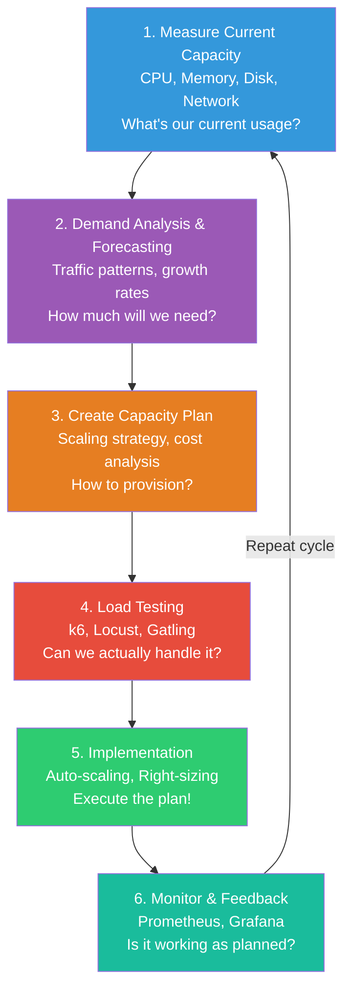
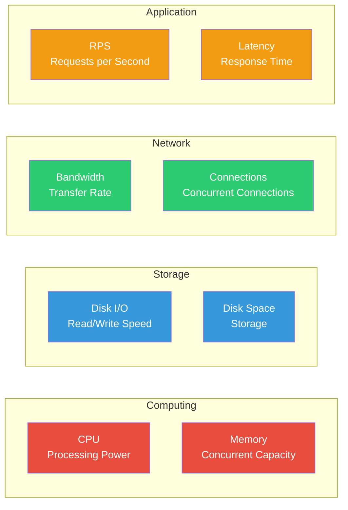
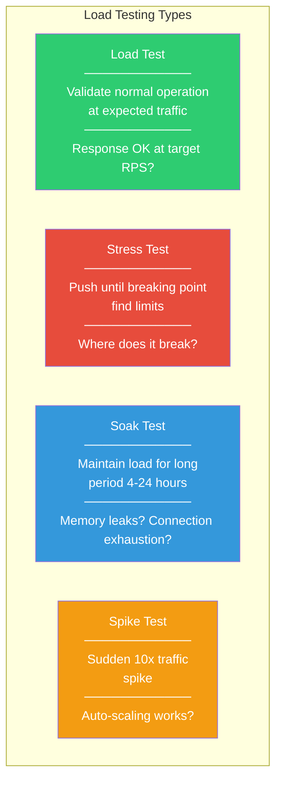
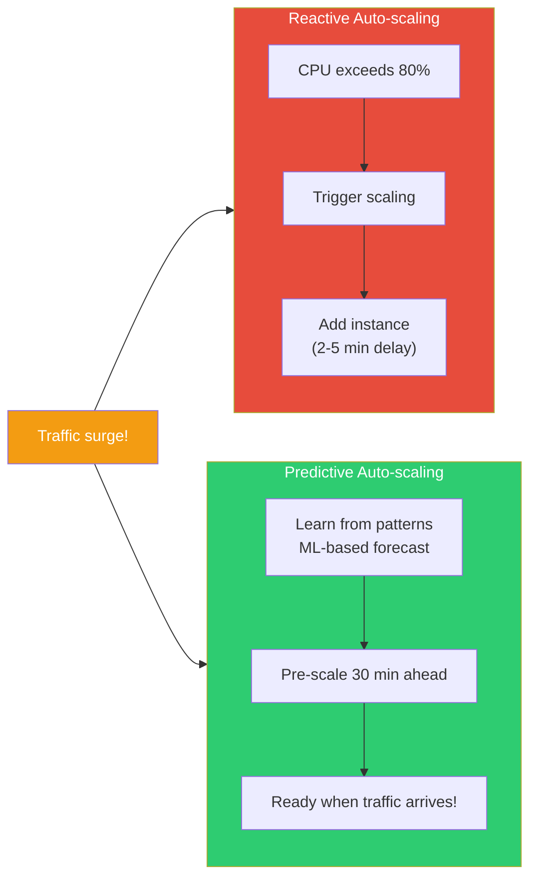
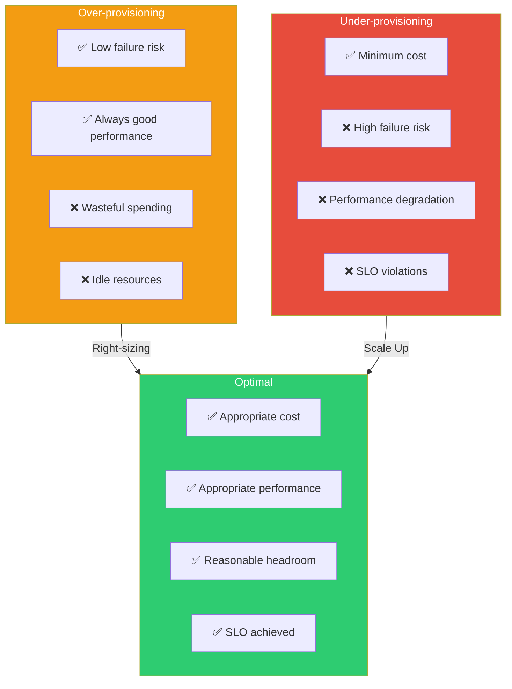

# Capacity Planning

> As your service grows, so do traffic, data, and costs. It's not enough to say "let's just add more servers" when you don't know how much to add, when to add it, or if you can afford it — you'll end up with either failures or waste. Capacity planning is the systematic process that answers all these questions. The infrastructure scaling you learned in [EC2 & Auto Scaling](../05-cloud-aws/03-ec2-autoscaling), cost management from [Cost Optimization](../05-cloud-aws/14-cost), and metrics collection from [Prometheus](../08-observability/02-prometheus) all come together here.

---

## 🎯 Why Learn Capacity Planning?

### Daily analogy: Restaurant Operations and Capacity Planning

Imagine you run a popular neighborhood restaurant.

- 30 customers on weekday lunch, 80 on Friday evening (**traffic pattern analysis**)
- Customer count grows 10% monthly (**growth projection**)
- Kitchen can handle 50 meals at once (**current capacity understanding**)
- More staff means higher labor costs (**cost-capacity tradeoff**)
- Only Friday evenings are busy, but hiring 10 staff daily wastes money (**right-sizing**)
- "Will we handle 120 customers on Christmas?" (**load forecasting**)
- Expand seating early, prepare ingredients, hire staff (**capacity provisioning**)

**That's capacity planning.** Predicting system demand and provisioning appropriate resources at the right time.

```
Capacity planning is critical when:

• "Traffic will 5x on Black Friday — will servers hold up?"     → Load testing
• "Data grows 50GB monthly, when does disk fill?"               → Growth forecasting
• "CPU always at 20%, instance seems oversized"                 → Right-sizing
• "Sudden traffic spike! Scaling too slow"                      → Auto-scaling strategy
• "Cut costs but maintain performance"                          → Cost-capacity optimization
• "What should K8s Pod resource settings be?"                   → requests/limits optimization
• "How much to prepare before service launch?"                  → Capacity calculation
• Interview: "Experience with large-scale traffic?"             → This entire lecture
```

---

## 🧠 Core Concepts

### Complete Capacity Planning Flow

Capacity planning isn't one-time. It's a **continuous cycle**.



### Key Terminology

| Term | Definition | Analogy |
|------|-----------|---------|
| **Capacity** | Maximum load system can handle | Restaurant's total seats |
| **Demand** | Actual load (traffic) coming in | Today's number of customers |
| **Headroom** | Spare capacity (Capacity - Demand) | Number of empty seats |
| **Saturation** | Resource usage ratio (Demand / Capacity) | Occupancy rate |
| **Right-sizing** | Adjust resources to actual usage | Move from large venue to appropriate size |
| **Forecasting** | Predict future demand | Estimate Christmas customer count |
| **Load Testing** | Simulate actual load | Rehearsal before opening |
| **Auto-scaling** | Automatically adjust resources based on load | Auto-call staff when busy |

### Four Dimensions of Capacity



---

## 🔍 Deep Dive

### 1. Demand Forecasting

Capacity planning starts with **"How much will we need in the future?"**

#### Traffic Pattern Analysis

Most services have predictable patterns.

```
Daily Pattern (Diurnal):
─────────────────────────────────────────
    ▲ Traffic
    │
    │              ┌──────┐
    │         ┌────┘      └────┐
    │    ┌────┘                └────┐
    │────┘                          └────
    └──────────────────────────────────────▶ Time
    0   3   6   9   12  15  18  21  24

    → Rises from 9 AM, peak at lunch, second peak 6-9 PM
    → Almost no traffic 12-6 AM

Weekly Pattern:
─────────────────────────────────────────
    ▲ Traffic
    │  ┌──┐ ┌──┐ ┌──┐ ┌──┐ ┌──┐
    │  │  │ │  │ │  │ │  │ │  │ ┌────┐
    │  │  │ │  │ │  │ │  │ │  │ │    │
    │──┘  └─┘  └─┘  └─┘  └─┘  └─┘    └──
    └──────────────────────────────────────▶
    Mon Tue Wed Thu Fri Sat Sun

    → E-commerce: 2-3x traffic on weekends
    → B2B SaaS: Only weekday traffic

Seasonal/Event Pattern:
─────────────────────────────────────────
    ▲ Traffic
    │                              ┌────┐
    │                              │    │  ← Black Friday/Christmas
    │  ──────────────────────────┐ │    │
    │                            └─┘    └──
    └──────────────────────────────────────▶
    Jan  Mar  Jun  Sep  Nov  Dec

    → E-commerce: 5-10x traffic Nov-Dec
    → Education: March, Sept peak (new term)
    → Games: Summer/winter breaks
```

#### Growth Projection

```python
# Growth-based demand prediction

# 1. Linear Growth
# Fixed amount increase per month
future_demand = current_demand + (growth_per_month * months)
# Example: 1000 RPS, +100 RPS/month
# 6 months later: 1000 + (100 * 6) = 1600 RPS

# 2. Exponential Growth — common in startups
# Fixed percentage increase per month
future_demand = current_demand * (1 + growth_rate) ** months
# Example: 1000 RPS, 20% monthly growth
# 6 months later: 1000 * (1.2)^6 = 2986 RPS

# 3. Include Safety Margin (Required for production!)
required_capacity = future_demand * safety_margin
# Typical safety_margin = 1.3 ~ 1.5 (30-50% headroom)
# 2986 * 1.5 = 4479 RPS capacity needed
```

#### Prometheus for Demand Forecasting

```promql
# Max daily RPS trend for last 30 days
max_over_time(
  rate(http_requests_total[5m])[1d:]
)

# Predict 2 weeks ahead using linear regression
predict_linear(
  node_filesystem_avail_bytes{mountpoint="/"}[30d],
  14 * 24 * 3600    # 14 days from now
)
# → Predicts disk availability in 14 days
# → If ≤ 0, disk will fill up!

# Predict CPU 2 weeks ahead
predict_linear(
  avg_over_time(
    node_cpu_seconds_total{mode="idle"}[1h]
  )[30d:1h],
  14 * 24 * 3600
)

# Memory growth trend
deriv(
  avg_over_time(
    container_memory_usage_bytes{namespace="production"}[1h]
  )[7d:1h]
)
# → Bytes increased per second (positive = growing)
```

---

### 2. Load Testing

Forecasting alone isn't enough. **You must actually test loads** to know system limits.

#### Types of Load Tests



| Test Type | Load Level | Duration | Purpose | Question |
|-----------|-----------|----------|---------|----------|
| **Load Test** | 100% expected peak | 15-60 min | Validate normal operation | "Is response <500ms at 1000 RPS?" |
| **Stress Test** | 150-200% expected peak | 15-30 min | Find breaking point | "Where does it fail first?" |
| **Soak Test** | 70-80% expected peak | 4-24 hours | Check long-term stability | "Any memory leaks?" |
| **Spike Test** | Sudden 5-10x increase | 5-10 min | Check elasticity | "Auto-scaling fast enough?" |

#### Load Testing with k6

k6 is a modern load testing tool with JavaScript scenarios.

```javascript
// load-test.js — k6 load test script
import http from 'k6/http';
import { check, sleep } from 'k6';
import { Rate, Trend } from 'k6/metrics';

// Define custom metrics
const errorRate = new Rate('errors');
const apiDuration = new Trend('api_duration');

// ⭐ Define load patterns by scenario
export const options = {
  scenarios: {
    // Scenario 1: Gradual ramp-up (Load Test)
    load_test: {
      executor: 'ramping-vus',
      startVUs: 0,
      stages: [
        { duration: '2m', target: 100 },   // 0→100 VUs in 2 min
        { duration: '5m', target: 100 },   // Hold 100 VUs for 5 min
        { duration: '2m', target: 200 },   // 100→200 VUs in 2 min
        { duration: '5m', target: 200 },   // Hold 200 VUs for 5 min (Peak!)
        { duration: '2m', target: 0 },     // Gradual cooldown
      ],
    },

    // Scenario 2: Spike test
    spike_test: {
      executor: 'ramping-vus',
      startVUs: 0,
      startTime: '16m',                    // Start after load_test
      stages: [
        { duration: '10s', target: 500 },  // Spike to 500 VUs in 10s!
        { duration: '1m', target: 500 },   // Hold for 1 min
        { duration: '10s', target: 0 },    // Quick cooldown
      ],
    },
  },

  // ⭐ Success/failure criteria (SLO-based)
  thresholds: {
    http_req_duration: ['p(95)<500'],       // 95% requests < 500ms
    http_req_duration: ['p(99)<1000'],      // 99% requests < 1000ms
    errors: ['rate<0.01'],                  // Error rate < 1%
    http_req_failed: ['rate<0.01'],         // HTTP failure rate < 1%
  },
};

// VU (Virtual User) executes this repeatedly
export default function () {
  // 1. Main page request
  const mainRes = http.get('https://api.myapp.com/');
  check(mainRes, {
    'status is 200': (r) => r.status === 200,
    'response time < 500ms': (r) => r.timings.duration < 500,
  });

  // 2. API call (search)
  const searchRes = http.get('https://api.myapp.com/search?q=test');
  apiDuration.add(searchRes.timings.duration);
  check(searchRes, {
    'search status 200': (r) => r.status === 200,
    'search < 300ms': (r) => r.timings.duration < 300,
  });
  errorRate.add(searchRes.status !== 200);

  // 3. POST request (order)
  const payload = JSON.stringify({
    product_id: Math.floor(Math.random() * 1000),
    quantity: 1,
  });
  const orderRes = http.post('https://api.myapp.com/orders', payload, {
    headers: { 'Content-Type': 'application/json' },
  });
  check(orderRes, {
    'order created': (r) => r.status === 201,
  });

  sleep(1); // 1 second pause (simulates real user behavior)
}
```

```bash
# Install k6
brew install k6            # macOS
choco install k6           # Windows
sudo apt install k6        # Linux (snap)

# Run load test
k6 run load-test.js

# Send results to Prometheus (Grafana dashboard)
k6 run --out experimental-prometheus-rw load-test.js

# Send to InfluxDB
k6 run --out influxdb=http://localhost:8086/k6 load-test.js

# Cloud execution (distributed load testing)
k6 cloud load-test.js
```

```
# k6 results example
     ✓ status is 200
     ✓ response time < 500ms
     ✗ search < 300ms
      ↳ 92% — ✓ 18400 / ✗ 1600        ← 8% exceeded 300ms!

     checks.........................: 97.33% ✓ 58400  ✗ 1600
     data_received..................: 125 MB  1.2 MB/s
     data_sent......................: 15 MB   150 kB/s
     http_req_duration..............: avg=187ms  min=12ms  max=2.3s  p(90)=350ms  p(95)=480ms
     http_req_failed................: 0.50%   ✓ 300    ✗ 59700
     http_reqs......................: 60000   600/s     ← 600 requests/sec handled
     iteration_duration.............: avg=3.2s  min=2.1s  max=8.5s
     vus............................: 200     min=0    max=200
     vus_max........................: 500     min=500  max=500

     # Analysis:
     # ✅ Error rate 0.5% < 1% (PASS)
     # ✅ p(95) 480ms < 500ms (Barely passes!)
     # ⚠️ 8% of searches exceeded 300ms → Optimization needed!
     # ⚠️ Max response 2.3s → Check for anomalies
```

---

### 3. Auto-scaling Strategy

Now that we know system limits, we need **automated response strategies**.

#### Reactive vs Predictive Auto-scaling



| Strategy | How It Works | Advantages | Disadvantages | Good For |
|----------|-------------|-----------|---------------|----------|
| **Reactive** | Scale when metric exceeds threshold | Simple, universal | 2-5 min delay | Gradual growth |
| **Predictive** | Pre-scale based on patterns | No delay | May mis-predict | Regular patterns |
| **Scheduled** | Scale by time schedule | Predictable control | Inflexible | Known events |
| **Mixed** | Combine all above | Optimal response | Complex config | Production |

#### AWS Auto Scaling Setup

```yaml
# CloudFormation - Mixed Predictive + Reactive Strategy
AWSTemplateFormatVersion: '2010-09-09'

Resources:
  # Auto Scaling Group
  WebASG:
    Type: AWS::AutoScaling::AutoScalingGroup
    Properties:
      LaunchTemplate:
        LaunchTemplateId: !Ref WebLaunchTemplate
        Version: !GetAtt WebLaunchTemplate.LatestVersionNumber
      MinSize: 2                           # Minimum 2 (availability)
      MaxSize: 20                          # Maximum 20 (cost cap)
      DesiredCapacity: 4                   # Normally 4
      VPCZoneIdentifier:                   # Multi-AZ
        - !Ref SubnetA
        - !Ref SubnetB
      HealthCheckType: ELB
      HealthCheckGracePeriod: 300          # 5 min grace period

  # 1. Reactive: Target Tracking (CPU-based)
  CPUScalingPolicy:
    Type: AWS::AutoScaling::ScalingPolicy
    Properties:
      AutoScalingGroupName: !Ref WebASG
      PolicyType: TargetTrackingScaling
      TargetTrackingConfiguration:
        PredefinedMetricSpecification:
          PredefinedMetricType: ASGAverageCPUUtilization
        TargetValue: 60                    # Maintain 60% CPU
        ScaleInCooldown: 300               # 5 min cooldown for scale-down
        ScaleOutCooldown: 60               # 1 min cooldown for scale-up (fast!)

  # 2. Reactive: Target Tracking (request-based)
  RequestScalingPolicy:
    Type: AWS::AutoScaling::ScalingPolicy
    Properties:
      AutoScalingGroupName: !Ref WebASG
      PolicyType: TargetTrackingScaling
      TargetTrackingConfiguration:
        PredefinedMetricSpecification:
          PredefinedMetricType: ALBRequestCountPerTarget
          ResourceLabel: !Sub "${ALB}/${TargetGroup}"
        TargetValue: 1000                  # 1000 requests/min per instance

  # 3. Scheduled: Pre-scale before work hours
  MorningScaleUp:
    Type: AWS::AutoScaling::ScheduledAction
    Properties:
      AutoScalingGroupName: !Ref WebASG
      DesiredCapacity: 8                   # Scale to 8 at 08:30
      Recurrence: "30 8 * * MON-FRI"       # Weekday 08:30

  # 4. Scheduled: Scale down after work
  NightScaleDown:
    Type: AWS::AutoScaling::ScheduledAction
    Properties:
      AutoScalingGroupName: !Ref WebASG
      DesiredCapacity: 2                   # Scale to 2 at 22:00
      Recurrence: "0 22 * * *"             # Daily 22:00
```

---

### 4. Right-sizing

While auto-scaling adjusts **"count"**, right-sizing optimizes **"size"** of each instance.

#### Signals You Need Right-sizing

```
Signals for right-sizing:

✅ CPU always 10-20%              → Downsize instance!
✅ Memory always 80-90%            → Switch to memory-optimized
✅ Frequent disk I/O waits        → Upgrade to SSD (gp3) or io2
✅ Network often bottlenecked     → Consider network-optimized
✅ m5.xlarge but only high CPU    → c5.large more efficient

Cost savings example:
┌──────────────────────────────────────────┐
│ Before: m5.2xlarge × 10 instances        │
│ CPU: 20%, Memory: 30%                    │
│ Cost: $0.384/h × 10 = $3.84/h = $2,764/mo
│                                          │
│ After: m5.large × 10 instances           │
│ CPU: 60%, Memory: 70%  (Optimal!)        │
│ Cost: $0.096/h × 10 = $0.96/h = $691/mo │
│                                          │
│ Savings: $2,073/mo (75% savings!)        │
└──────────────────────────────────────────┘
```

#### Using AWS Compute Optimizer

```bash
# Get optimization recommendations
aws compute-optimizer get-ec2-instance-recommendations \
  --filters Name=Finding,Values=OVER_PROVISIONED \
  --output table

# Example results:
# ┌─────────────────────┬─────────────┬───────────────┬─────────────┐
# │ Instance ID         │ Current     │ Recommended   │ Savings     │
# ├─────────────────────┼─────────────┼───────────────┼─────────────┤
# │ i-0abc123def456     │ m5.2xlarge  │ m5.large      │ $198/month  │
# │ i-0def789abc012     │ r5.xlarge   │ t3.xlarge     │ $89/month   │
# │ i-0ghi345jkl678     │ c5.4xlarge  │ c5.2xlarge    │ $245/month  │
# └─────────────────────┴─────────────┴───────────────┴─────────────┘

# EBS volume optimization recommendations
aws compute-optimizer get-ebs-volume-recommendations \
  --filters Name=Finding,Values=NOT_OPTIMIZED
```

---

### 5. Kubernetes Resource Optimization

In K8s, `requests` and `limits` settings **are** capacity planning.

#### Understanding requests and limits

```yaml
# Proper Pod resource configuration
apiVersion: v1
kind: Pod
metadata:
  name: myapp
spec:
  containers:
  - name: app
    image: myapp:latest
    resources:
      requests:                    # ⭐ "We need at least this much"
        cpu: "250m"                # 0.25 vCPU (scheduling basis)
        memory: "256Mi"            # 256MB (scheduling basis)
      limits:                      # ⭐ "Maximum allowed"
        cpu: "1000m"               # 1 vCPU (throttled if exceeded)
        memory: "512Mi"            # 512MB (OOMKilled if exceeded!)

# requests vs limits analogy:
# ─────────────────────────────────────────────────
# requests = Restaurant reservation (guarantee this much)
# limits   = Credit card limit (cannot exceed this!)
#
# requests too high? → Place fewer Pods per node → Waste
# requests too low?  → Place many Pods → Poor performance, OOM
# limits too high?   → One Pod monopolizes node resources
# limits too low?    → Unnecessary throttling, frequent OOMKills
```

#### Finding Optimal requests/limits

```bash
# 1. Check actual current usage
kubectl top pods -n production --sort-by=cpu
# NAME              CPU(cores)   MEMORY(bytes)
# myapp-abc-123     45m          180Mi
# myapp-def-456     52m          175Mi
# myapp-ghi-789     38m          190Mi
# → Avg CPU: ~45m, Avg Memory: ~182Mi

# 2. Analyze long-term usage with Prometheus
```

```promql
# CPU p95 (last 7 days)
quantile_over_time(0.95,
  rate(container_cpu_usage_seconds_total{
    namespace="production",
    container="app"
  }[5m])[7d:]
) * 1000
# → Result: 85m
# → Set requests to ~100m

# CPU p99 (for limits)
quantile_over_time(0.99,
  rate(container_cpu_usage_seconds_total{
    namespace="production",
    container="app"
  }[5m])[7d:]
) * 1000
# → Result: 250m
# → Set limits to 300-500m

# Memory peak (prevent OOM)
max_over_time(
  container_memory_working_set_bytes{
    namespace="production",
    container="app"
  }[7d]
) / 1024 / 1024
# → Result: 320Mi
# → Set limits to 400-512Mi (with headroom)

# Check resource waste (requests vs actual)
avg(
  rate(container_cpu_usage_seconds_total{namespace="production"}[5m])
) by (pod)
/
avg(
  kube_pod_container_resource_requests{resource="cpu", namespace="production"}
) by (pod)
# → 0.3 = 30% usage of requests = 70% waste!
```

#### VPA (Vertical Pod Autoscaler)

Automatically optimizes resource requests/limits.

```yaml
# VPA configuration after installation
apiVersion: autoscaling.k8s.io/v1
kind: VerticalPodAutoscaler
metadata:
  name: myapp-vpa
  namespace: production
spec:
  targetRef:
    apiVersion: apps/v1
    kind: Deployment
    name: myapp

  updatePolicy:
    updateMode: "Auto"          # ⭐ Off / Initial / Auto
    # Off: Show recommendations only (safe, start here!)
    # Initial: Apply only at Pod creation
    # Auto: Restart running Pods to apply

  resourcePolicy:
    containerPolicies:
    - containerName: app
      minAllowed:               # Minimum guarantee
        cpu: "50m"
        memory: "128Mi"
      maxAllowed:               # Maximum limit
        cpu: "2000m"
        memory: "2Gi"
      controlledResources:
        - cpu
        - memory
```

```bash
# Check VPA recommendations (useful when updateMode: Off!)
kubectl describe vpa myapp-vpa
# Recommendation:
#   Container Recommendations:
#     Container Name: app
#     Lower Bound:                    # Minimum recommended
#       Cpu:     50m
#       Memory:  180Mi
#     Target:                         # ⭐ Recommended value (use this!)
#       Cpu:     120m
#       Memory:  256Mi
#     Upper Bound:                    # Maximum recommended
#       Cpu:     300m
#       Memory:  512Mi

# → Set requests: cpu=120m, memory=256Mi for optimal!
```

#### HPA + VPA + KEDA Strategy

```yaml
# ⚠️ Warning: HPA (CPU-based) and VPA conflict if used together!
# → Use HPA with custom metrics, VPA with CPU/Memory separately, or use KEDA

# KEDA: Event-driven autoscaling (can scale 0→N!)
apiVersion: keda.sh/v1alpha1
kind: ScaledObject
metadata:
  name: myapp-scaler
  namespace: production
spec:
  scaleTargetRef:
    name: myapp
  pollingInterval: 15                 # Check every 15s
  cooldownPeriod: 60                  # 60s cooldown for scale-down
  idleReplicaCount: 0                 # ⭐ Scale to 0 if no traffic! (Save cost)
  minReplicaCount: 1                  # Minimum 1 when active
  maxReplicaCount: 50                 # Maximum 50

  triggers:
  # 1. Prometheus metrics-based
  - type: prometheus
    metadata:
      serverAddress: http://prometheus.monitoring:9090
      metricName: http_requests_per_second
      query: |
        sum(rate(http_requests_total{service="myapp"}[2m]))
      threshold: "100"                # 1 Pod per 100 RPS

  # 2. AWS SQS queue-based
  - type: aws-sqs-queue
    metadata:
      queueURL: https://sqs.ap-northeast-2.amazonaws.com/123456789/orders
      queueLength: "5"               # 1 Pod per 5 messages
      awsRegion: ap-northeast-2

  # 3. Cron-based (time-based scaling)
  - type: cron
    metadata:
      timezone: Asia/Seoul
      start: "0 8 * * MON-FRI"       # Start 8 AM weekdays
      end: "0 20 * * MON-FRI"        # End 8 PM weekdays
      desiredReplicas: "5"            # Minimum 5 during business hours
```

```
When to use HPA vs VPA vs KEDA

┌──────────────────────────────────────────────────────────────┐
│ Scenario                           │ Recommended Tool           │
├──────────────────────────────────────────────────────────────┤
│ Scale horizontally by CPU/memory   │ HPA                        │
│ Auto-optimize requests/limits      │ VPA (Off mode to start)    │
│ Scale by events/queue length       │ KEDA                       │
│ Scale 0→N (cost savings)           │ KEDA (idleReplicaCount: 0) │
│ Scale by custom metrics            │ HPA v2 or KEDA             │
│ ML-based predictive scaling        │ KEDA + Prometheus combo    │
│                                                                │
│ ⭐ Real-world best practice:                                  │
│ VPA(Off) → Review recommendations → Manual requests/limits   │
│ + KEDA → Event-based horizontal scaling                       │
│ + Cluster Autoscaler → Node auto-scaling                      │
└──────────────────────────────────────────────────────────────┘
```

---

### 6. Cost-Capacity Tradeoffs

Capacity and cost are always in tension. **Finding the right balance is key.**



#### Cost Optimization Strategy Pyramid

```
Cost optimization pyramid (apply from bottom up):

Level 5: Architecture optimization
         ┌───────────────┐
         │  Serverless   │  ← Biggest savings, most effort
         │  Caching      │
         └───────────────┘
Level 4: Pricing optimization
       ┌───────────────────┐
       │ Savings Plans/RI  │
       │ Spot Instances    │
       └───────────────────┘
Level 3: Auto-scaling
     ┌───────────────────────┐
     │ HPA / KEDA / Predictive│
     │ Night/weekend scale-down
     └───────────────────────┘
Level 2: Right-sizing
   ┌───────────────────────────┐
   │ Optimize instance types   │
   │ Reduce over-provisioned   │
   └───────────────────────────┘
Level 1: Remove idle resources            ← Easiest, instant effect!
 ┌───────────────────────────────┐
 │ Delete unused EC2, EBS, EIP   │
 │ Stop dev environments at night│
 └───────────────────────────────┘
```

---

## 💻 Try It Yourself

### Practice 1: Analyze Your Current Metrics

```bash
# Get current EC2 CPU usage stats
aws cloudwatch get-metric-statistics \
  --namespace AWS/EC2 \
  --metric-name CPUUtilization \
  --dimensions Name=InstanceId,Value=i-yourinstanceid \
  --start-time $(date -u -d '7 days ago' +%Y-%m-%dT%H:%M:%S) \
  --end-time $(date -u +%Y-%m-%dT%H:%M:%S) \
  --period 3600 \
  --statistics Average,Maximum

# Analyze Prometheus usage patterns
curl 'http://your-prometheus:9090/api/v1/query_range?query=rate(http_requests_total[5m])&start=1700000000&end=1700600000&step=3600'
```

### Practice 2: Run k6 Load Test

```bash
# Create test file
cat > test.js << 'EOF'
import http from 'k6/http';
import { check, sleep } from 'k6';

export const options = {
  vus: 10,
  duration: '30s',
};

export default function () {
  let res = http.get('https://httpbin.org/delay/1');
  check(res, { 'status was 200': (r) => r.status == 200 });
  sleep(1);
}
EOF

# Run test
k6 run test.js
```

This comprehensive guide covers complete capacity planning from forecasting through optimization and cost management.
