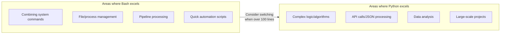
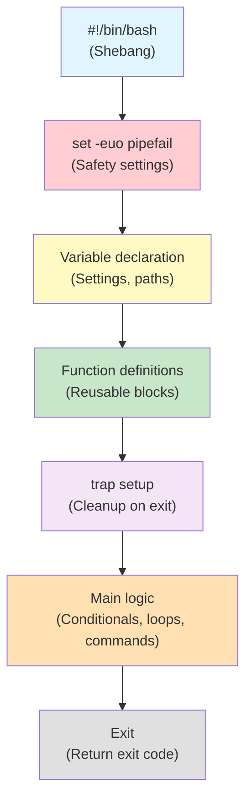
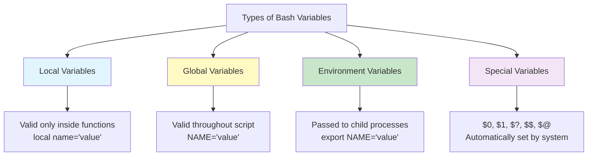
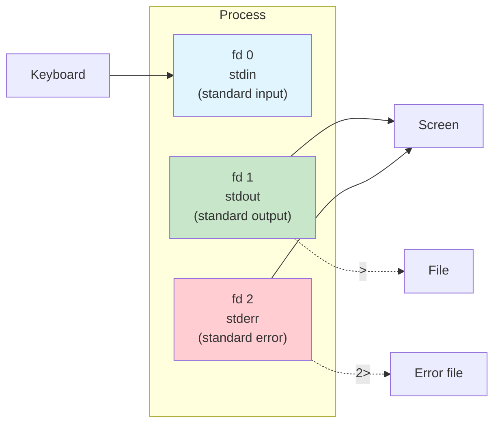
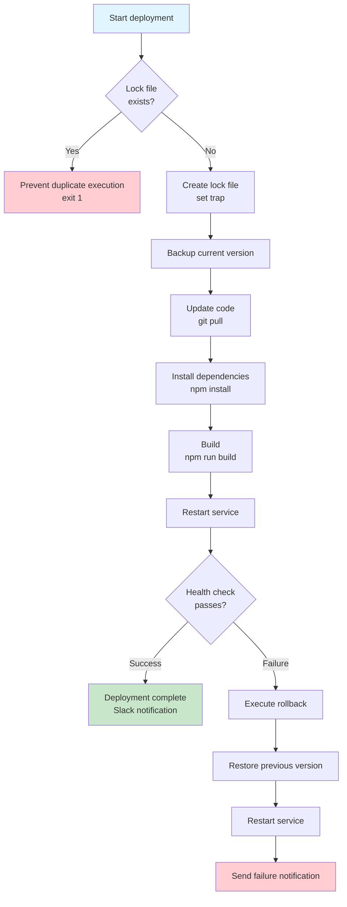

# Complete Bash Scripting Mastery

> Are you manually accessing 10 servers one by one to perform the same task? Do you set an alarm to wake up in the early morning for daily backups? If you learn Bash scripting, you can automate these repetitive tasks. Bash scripting is the most fundamental weapon of a DevOps engineer. Let's master it completely from basics to advanced.

---

## 🎯 Why Do You Need to Know Bash Scripting?

### DevOps is Nothing Without Automation

The core of DevOps is **automation**. And the starting point of that automation is Bash scripting. No matter how well you handle Terraform, Ansible, or Kubernetes, the scripts running underneath are often shell scripts.

```
Real-world uses of Bash scripts:

 Deployment automation        → deploy.sh (git pull → build → restart)
 Server status check         → health-check.sh (CPU, memory, disk)
 Log management              → log-rotate.sh (compress/delete old logs)
 DB backup                   → backup.sh (dump → compress → S3 upload)
 Environment initialization  → setup.sh (install packages, deploy configs)
 CI/CD pipeline              → GitHub Actions, Jenkins steps
 Monitoring alerts           → alert.sh (Slack alert when threshold exceeded)
 Security audit              → audit.sh (check permissions, ports, processes)
```

### Why Learn Bash When Python Exists?

Good question. Python is great for complex logic, but Bash is overwhelmingly convenient for **combining system commands**.



> **Rule of thumb**: Use Bash for system automation under 100 lines; switch to Python for anything longer or requiring complex data processing. We'll cover Python scripting in detail in the [next lecture](./02-python).

---

## 🧠 Grasping Core Concepts

### Analogy: Recipe

The easiest way to understand a Bash script is as a **recipe**.

| Cooking | Bash Scripting |
|---------|----------------|
| Ingredients | Variables (data) |
| Recipe order | Script flow (top to bottom) |
| "Add salt if needed" | Conditionals (`if`) |
| "Stir for 5 minutes" | Loops (`for`, `while`) |
| "Knead dough" (separate step) | Functions |
| "Turn off gas if fire goes out" | trap (signal handling) |
| Pipes connecting water | Pipe (`\|`) |
| Photo of finished dish | Output / redirection |

### Overall Structure of a Bash Script



### Core Keywords at a Glance

| Concept | Explanation | Example |
|---------|-------------|---------|
| Shebang | Specify script interpreter | `#!/bin/bash` |
| Variable | Store data with a name | `NAME="hello"` |
| Conditional | Branch execution | `if [ -f file ]; then ...` |
| Loop | Execute multiple times | `for i in 1 2 3; do ...` |
| Function | Unit for code reuse | `my_func() { ... }` |
| Array | Store multiple values | `ARR=(a b c)` |
| trap | Handle signals/exit | `trap cleanup EXIT` |
| Pipe | Pass command output as input | `cmd1 \| cmd2` |
| Redirection | Change input/output direction | `cmd > file 2>&1` |

---

## 🔍 Understanding Each Topic in Detail

### 1. Shebang and Environment Setup

#### What is Shebang (`#!`)?

It's the line starting with `#!` at the very first line of a script. It tells the system **which program to use to execute this script**.

```bash
#!/bin/bash
# → Execute this script with /bin/bash

#!/usr/bin/env bash
# → Find bash in environment variables and execute (better portability)

#!/usr/bin/env python3
# → For Python scripts
```

> **Tip**: `#!/usr/bin/env bash` is more portable. The bash path can differ by system (e.g., macOS is `/usr/local/bin/bash`).

#### `set` Options — The Start of Safe Scripts

```bash
#!/bin/bash
set -euo pipefail
```

This single line **prevents numerous accidents**. Let's look at each option.

| Option | Meaning | Without it |
|--------|---------|-----------|
| `-e` (errexit) | Stop immediately when command fails | Ignores errors, continues to next line |
| `-u` (nounset) | Error when using undefined variable | Silently replaces with empty string |
| `-o pipefail` | Detect failures in middle of pipe | Only succeeds if last command succeeds |

```bash
# Disaster without -e
#!/bin/bash
cd /nonexistent/path    # Fails but continues!
rm -rf *                 # Deletes all files in current directory (/)!!!

# Safe with -e
#!/bin/bash
set -e
cd /nonexistent/path    # Fails → Stop immediately
rm -rf *                 # Never executes
```

```bash
# Error missed without -o pipefail
#!/bin/bash
cat /nonexistent/file | grep "pattern" | wc -l
# → cat fails, but wc -l succeeds with 0, treated as success

#!/bin/bash
set -o pipefail
cat /nonexistent/file | grep "pattern" | wc -l
# → cat failure propagates through entire pipeline
```

#### Additional Useful set Options

```bash
set -x    # Debug mode: print all executed commands
          # + echo hello  ← Like this
set +x    # Turn off debug mode

set -v    # Print script lines themselves (before variable substitution)
```

---

### 2. Variables

#### Types of Variables



#### Variable Declaration and Usage

```bash
#!/bin/bash

# === Basic variable declaration (no spaces around =!) ===
NAME="ubuntu"
PORT=8080
LOG_DIR="/var/log/myapp"

# This will error!
# NAME = "ubuntu"    # Interpreted as trying to run 'NAME' command

# === Using variables ===
echo "User: $NAME"
echo "Port: ${PORT}"
echo "Log path: ${LOG_DIR}/app.log"

# Why use ${} — when variable name boundary is ambiguous
FILE="report"
echo "${FILE}_2025.txt"    # report_2025.txt  (intended result)
echo "$FILE_2025.txt"      # Empty (looks for FILE_2025 variable!)
```

#### Environment Variables vs Shell Variables

```bash
# Shell variable: only valid in current shell
MY_VAR="hello"

# Environment variable: passed to child processes
export APP_ENV="production"

# Check
bash -c 'echo $MY_VAR'     # (blank) — not visible in child
bash -c 'echo $APP_ENV'    # production — visible in child

# Common environment variables
echo "Home directory: $HOME"       # /home/ubuntu
echo "Current user: $USER"         # ubuntu
echo "PATH: $PATH"                 # /usr/local/bin:/usr/bin:...
echo "Current shell: $SHELL"       # /bin/bash
echo "Hostname: $HOSTNAME"         # web01
```

#### Setting Default Values (Parameter Expansion)

This pattern is used very frequently in real work.

```bash
# ${variable:-default} : Use default if variable is empty or undefined
DB_HOST="${DB_HOST:-localhost}"
DB_PORT="${DB_PORT:-3306}"
LOG_LEVEL="${LOG_LEVEL:-info}"

echo "DB: $DB_HOST:$DB_PORT"
# DB: localhost:3306  (uses default if env var not set)

# ${variable:=default} : Use default and assign to variable
: "${CONFIG_DIR:=/etc/myapp}"
echo "$CONFIG_DIR"
# /etc/myapp

# ${variable:?error message} : Error and exit if variable is empty
DB_PASSWORD="${DB_PASSWORD:?Please set DB_PASSWORD environment variable}"
# → If DB_PASSWORD not set: bash: DB_PASSWORD: Please set DB_PASSWORD environment variable

# ${variable:+replacement} : Use replacement if variable is set
VERBOSE="${DEBUG:+--verbose}"
# Use --verbose if DEBUG exists, otherwise empty string
```

#### Special Variables

```bash
#!/bin/bash
# special-vars.sh arg1 arg2 arg3

echo "Script name: $0"       # ./special-vars.sh
echo "First argument: $1"    # arg1
echo "Second argument: $2"   # arg2
echo "All arguments: $@"     # arg1 arg2 arg3
echo "Number of arguments: $#"  # 3
echo "Last exit code: $?"    # 0 (success)
echo "Current PID: $$"       # 12345
echo "Last background PID: $!"  # PID of last background process
```

#### Read-only Variables

```bash
readonly VERSION="1.0.0"
readonly APP_NAME="myapp"

VERSION="2.0.0"    # Error! bash: VERSION: readonly variable
```

---

### 3. String Operations

```bash
STR="Hello, DevOps World!"

# Length
echo "${#STR}"                # 20

# Substring (offset:length)
echo "${STR:0:5}"             # Hello
echo "${STR:7}"               # DevOps World!
echo "${STR: -6}"             # World!  (from end, space required)

# Substitution
echo "${STR/DevOps/SRE}"      # Hello, SRE World!      (first only)
echo "${STR//o/0}"            # Hell0, Dev0ps W0rld!   (all)

# Deletion (pattern matching)
FILE="/var/log/nginx/access.log"
echo "${FILE##*/}"            # access.log     (delete up to last /)
echo "${FILE%/*}"             # /var/log/nginx  (delete from last / onwards)

# Extension handling
FILENAME="backup_2025.tar.gz"
echo "${FILENAME%.gz}"        # backup_2025.tar    (short match: only last .gz)
echo "${FILENAME%%.*}"        # backup_2025        (long match: everything from first .)

# Case conversion (Bash 4+)
NAME="devops"
echo "${NAME^}"               # Devops   (capitalize first)
echo "${NAME^^}"              # DEVOPS   (all uppercase)
UPPER="HELLO"
echo "${UPPER,,}"             # hello    (all lowercase)
```

---

### 4. Conditionals

#### Basic if Statement Structure

```bash
if [ condition ]; then
    # Execute when true
elif [ condition2 ]; then
    # Execute when condition2 is true
else
    # Execute when all are false
fi
```

#### Difference between `[ ]` and `[[ ]]`

| Feature | `[ ]` (POSIX) | `[[ ]]` (Bash only) |
|---------|---------------|---------------------|
| Portability | Works on all shells | Bash, Zsh only |
| Pattern matching | Not possible | `[[ $a == hello* ]]` |
| Regex | Not possible | `[[ $a =~ ^[0-9]+$ ]]` |
| AND/OR | `-a` / `-o` | `&&` / `\|\|` |
| Variable quoting | Required (`"$VAR"`) | Optional (safe without) |
| Word splitting | Happens | Doesn't happen |

```bash
# String comparison
NAME="ubuntu"
if [[ "$NAME" == "ubuntu" ]]; then
    echo "This is Ubuntu"
fi

# Pattern matching (not possible with [ ])
if [[ "$NAME" == *buntu* ]]; then
    echo "Contains 'buntu'"
fi

# Regex matching
EMAIL="user@example.com"
if [[ "$EMAIL" =~ ^[a-zA-Z0-9._%+-]+@[a-zA-Z0-9.-]+\.[a-zA-Z]{2,}$ ]]; then
    echo "Valid email format"
fi

# Number comparison
COUNT=10
if [[ "$COUNT" -gt 5 ]]; then echo "Greater than 5"; fi
if [[ "$COUNT" -eq 10 ]]; then echo "Equals 10"; fi
if [[ "$COUNT" -le 20 ]]; then echo "20 or less"; fi

# Arithmetic comparison is more intuitive with (( ))
if (( COUNT > 5 )); then echo "Greater than 5"; fi
if (( COUNT == 10 )); then echo "Equals 10"; fi
if (( COUNT >= 5 && COUNT <= 20 )); then echo "Between 5-20"; fi

# File checks
if [[ -f "/etc/nginx/nginx.conf" ]]; then echo "File exists"; fi
if [[ -d "/var/log" ]]; then echo "Directory exists"; fi
if [[ -x "/usr/local/bin/docker" ]]; then echo "Executable"; fi
if [[ ! -s "/tmp/empty.txt" ]]; then echo "File empty or nonexistent"; fi
if [[ -r "$FILE" && -w "$FILE" ]]; then echo "Readable and writable"; fi
```

#### case Statement — Multiple Branching

```bash
#!/bin/bash
# service-ctl.sh — Service control script

ACTION="${1:-help}"
SERVICE="${2:-nginx}"

case "$ACTION" in
    start)
        echo "Starting $SERVICE..."
        systemctl start "$SERVICE"
        ;;
    stop)
        echo "Stopping $SERVICE..."
        systemctl stop "$SERVICE"
        ;;
    restart)
        echo "Restarting $SERVICE..."
        systemctl restart "$SERVICE"
        ;;
    status)
        systemctl status "$SERVICE"
        ;;
    start|stop|restart)
        # Already handled above (this line never runs)
        ;;
    *)
        echo "Usage: $0 {start|stop|restart|status} [service_name]"
        exit 1
        ;;
esac

# Pattern matching also possible
read -rp "Continue? (y/n): " answer
case "$answer" in
    [yY]|[yY][eE][sS])
        echo "Continuing"
        ;;
    [nN]|[nN][oO])
        echo "Canceling"
        exit 0
        ;;
    *)
        echo "Please answer y or n"
        exit 1
        ;;
esac
```

---

### 5. Loops

#### for Statement

```bash
#!/bin/bash

# Iterate over list
for server in web01 web02 web03 db01; do
    echo "Processing: $server"
done

# Range (brace expansion)
for i in {1..5}; do
    echo "Number: $i"
done

# C-style
for ((i = 0; i < 10; i++)); do
    echo "Index: $i"
done

# Iterate over files
for file in /var/log/*.log; do
    if [[ -f "$file" ]]; then
        size=$(du -sh "$file" 2>/dev/null | awk '{print $1}')
        echo "$file: $size"
    fi
done

# Iterate over command results
for user in $(cut -d: -f1 /etc/passwd | head -5); do
    echo "User: $user"
done
```

#### while Statement

```bash
#!/bin/bash

# Counter
count=0
while [[ $count -lt 5 ]]; do
    echo "Count: $count"
    ((count++))
done

# Read file line by line (most common pattern!)
while IFS= read -r line; do
    echo "Server: $line"
done < servers.txt

# Infinite loop (for monitoring)
while true; do
    echo "$(date '+%H:%M:%S') - Disk: $(df -h / | tail -1 | awk '{print $5}')"
    sleep 60
done

# Conditional retry
retry=0
max_retry=5
while [[ $retry -lt $max_retry ]]; do
    if curl -sf http://localhost:8080/health > /dev/null 2>&1; then
        echo "Service is healthy!"
        break
    fi
    ((retry++))
    echo "Retry $retry/$max_retry..."
    sleep 3
done

if [[ $retry -eq $max_retry ]]; then
    echo "Service not responding - health check failed!"
    exit 1
fi
```

#### until Statement

```bash
# Opposite of while: repeat until condition becomes true
count=0
until [[ $count -ge 5 ]]; do
    echo "Count: $count"
    ((count++))
done

# Wait until service starts
until systemctl is-active --quiet nginx; do
    echo "Nginx has not started yet. Waiting..."
    sleep 2
done
echo "Nginx has started!"
```

#### Loop Control: break and continue

```bash
# break: exit loop
for i in {1..100}; do
    if [[ $i -eq 10 ]]; then
        echo "Breaking at 10"
        break
    fi
    echo "$i"
done

# continue: skip to next iteration
for file in /var/log/*.log; do
    # Skip empty files
    if [[ ! -s "$file" ]]; then
        continue
    fi
    echo "Analyzing: $file ($(wc -l < "$file") lines)"
done
```

---

### 6. Functions

#### Function Definition and Calling

```bash
#!/bin/bash

# Function definition method 1 (recommended)
log_info() {
    echo "[$(date '+%Y-%m-%d %H:%M:%S')] [INFO] $*"
}

# Function definition method 2 (function keyword)
function log_error() {
    echo "[$(date '+%Y-%m-%d %H:%M:%S')] [ERROR] $*" >&2
}

# Calling
log_info "Starting server status check"
log_error "Disk usage exceeded 90%"
```

#### Arguments and Return Values

```bash
#!/bin/bash

# Function arguments: $1, $2, ... / $@ (all) / $# (count)
greet() {
    local name=$1           # local: only valid inside function
    local greeting=${2:-"Hello"}
    echo "${greeting}, ${name}!"
}

greet "DevOps Team"                # Hello, DevOps Team!
greet "SRE Team" "Welcome"         # Welcome, SRE Team!

# return only returns exit code (0-255)
# To return values, use echo + command substitution
check_disk_usage() {
    local mount_point=${1:-"/"}
    local usage
    usage=$(df -h "$mount_point" | tail -1 | awk '{gsub(/%/,""); print $5}')
    echo "$usage"    # Output value to stdout
    return 0         # Success status
}

# Capture function output in variable
disk_usage=$(check_disk_usage "/")
echo "Disk usage: ${disk_usage}%"

# Use return for success/failure
is_service_running() {
    local service=$1
    systemctl is-active --quiet "$service" 2>/dev/null
    return $?    # Return systemctl's exit code
}

if is_service_running "nginx"; then
    echo "Nginx is running"
else
    echo "Nginx is stopped"
fi
```

#### Importance of local Variables

```bash
#!/bin/bash

# Without local — pollutes global variables
bad_function() {
    result="function internal value"    # Global variable!
}

result="original value"
bad_function
echo "$result"    # "function internal value" — original value lost!

# With local — safe
good_function() {
    local result="function internal value"    # Only valid inside function
}

result="original value"
good_function
echo "$result"    # "original value" — safely preserved
```

---

### 7. Arrays

#### Indexed Arrays

```bash
#!/bin/bash

# Declare
SERVERS=("web01" "web02" "web03" "db01" "db02")

# Access
echo "${SERVERS[0]}"        # web01 (first element)
echo "${SERVERS[2]}"        # web03 (third element)
echo "${SERVERS[-1]}"       # db02 (last element, Bash 4.3+)

# All elements
echo "${SERVERS[@]}"        # web01 web02 web03 db01 db02
echo "${SERVERS[*]}"        # web01 web02 web03 db01 db02

# Number of elements
echo "${#SERVERS[@]}"       # 5

# Add element
SERVERS+=("cache01")
echo "${#SERVERS[@]}"       # 6

# Delete element
unset 'SERVERS[1]'          # Delete web02 (index preserved!)

# Iterate
for server in "${SERVERS[@]}"; do
    echo "Server: $server"
done

# Iterate with index
for i in "${!SERVERS[@]}"; do
    echo "Index $i: ${SERVERS[$i]}"
done

# Slice
echo "${SERVERS[@]:1:3}"    # 3 elements starting from index 1
```

#### Associative Arrays (Bash 4+)

```bash
#!/bin/bash

# Declare (declare -A is required!)
declare -A SERVER_IPS
SERVER_IPS=(
    ["web01"]="10.0.1.10"
    ["web02"]="10.0.1.11"
    ["db01"]="10.0.2.10"
)

# Access
echo "${SERVER_IPS[web01]}"    # 10.0.1.10

# Add/update
SERVER_IPS["cache01"]="10.0.3.10"

# All keys
echo "${!SERVER_IPS[@]}"       # web01 web02 db01 cache01

# All values
echo "${SERVER_IPS[@]}"        # 10.0.1.10 10.0.1.11 10.0.2.10 10.0.3.10

# Iterate key-value
for server in "${!SERVER_IPS[@]}"; do
    echo "$server → ${SERVER_IPS[$server]}"
done

# Check key existence
if [[ -v SERVER_IPS["web01"] ]]; then
    echo "web01 is registered"
fi

# Real example: service port mapping
declare -A SERVICE_PORTS=(
    ["nginx"]="80"
    ["api"]="8080"
    ["redis"]="6379"
    ["postgres"]="5432"
)

for svc in "${!SERVICE_PORTS[@]}"; do
    port=${SERVICE_PORTS[$svc]}
    if ss -tlnp | grep -q ":${port} "; then
        echo "$svc (port $port): running"
    else
        echo "$svc (port $port): stopped"
    fi
done
```

---

### 8. I/O Redirection and Pipes

#### Understanding File Descriptors



#### Redirection Summary

```bash
# === Output redirection ===
echo "hello" > file.txt       # Redirect stdout to file (overwrite)
echo "world" >> file.txt      # Redirect stdout to file (append)

# === Error redirection ===
find / -name "*.conf" 2> errors.txt      # Redirect stderr to file
find / -name "*.conf" 2>/dev/null        # Discard stderr (black hole)

# === Combine stdout + stderr ===
command > output.txt 2>&1    # Both to file (traditional way)
command &> output.txt        # Same as above (Bash shorthand)

# === Input redirection ===
wc -l < /etc/passwd          # File content as stdin
mysql < backup.sql           # SQL file as input to MySQL

# === Here Document (multi-line input) ===
cat << 'EOF'
Content here won't have variable substitution.
$HOME outputs as-is.
EOF

cat << EOF
Content here will have variable substitution.
Home directory: $HOME
EOF

# === Here String ===
grep "pattern" <<< "search string"

# === /dev/null — output black hole ===
# Often used in cron
command > /dev/null 2>&1     # Discard all output
```

#### Pipes and Process Substitution

```bash
# Pipe: stdout of first command → stdin of next
ps aux | grep nginx | grep -v grep | wc -l

# tee: save to file AND print to screen
deploy_command 2>&1 | tee -a deploy.log

# Process substitution <() — use command output as file
# Compare two files (in sorted state)
diff <(sort file1.txt) <(sort file2.txt)

# Compare process list before/after
comm -13 <(ps -eo comm --sort=comm | sort -u) \
         <(sleep 60 && ps -eo comm --sort=comm | sort -u)

# Difference between pipe and process substitution
# Pipe: while runs in subshell → variable changes don't persist
count=0
cat servers.txt | while read -r line; do
    ((count++))
done
echo "$count"    # 0! (changed in subshell)

# Process substitution: while runs in current shell → changes persist
count=0
while read -r line; do
    ((count++))
done < <(cat servers.txt)
echo "$count"    # Correct line count!
```

---

### 9. trap and Signal Handling

#### What are Signals?

**Signals** are notification messages sent to processes. Like "you need to stop" or "pause for a moment".

```bash
# Common signals
# SIGINT  (2)   — Ctrl+C
# SIGTERM (15)  — kill command default
# SIGKILL (9)   — Force kill (trap not possible)
# SIGHUP  (1)   — Terminal disconnected
# EXIT          — Script exit (Bash pseudo-signal)
# ERR           — Command failure (with set -e)
```

#### Basic trap Usage

```bash
#!/bin/bash
set -euo pipefail

# trap format: trap 'command' signal
# Cleanup on script exit
cleanup() {
    local exit_code=$?
    echo "Running cleanup..."
    rm -f /tmp/myapp.lock
    rm -f /tmp/myapp_*.tmp
    if [[ $exit_code -ne 0 ]]; then
        echo "Script exited with error (exit code: $exit_code)"
    fi
}
trap cleanup EXIT

# Handle Ctrl+C (SIGINT)
trap 'echo "Ctrl+C detected. Cleaning up and exiting."; exit 130' INT

# Handle kill signal (SIGTERM)
trap 'echo "Termination signal received."; exit 143' TERM
```

#### Real Pattern: Lock File + trap

```bash
#!/bin/bash
set -euo pipefail

LOCK_FILE="/tmp/deploy.lock"
LOG_FILE="/var/log/deploy.log"

# Cleanup function
cleanup() {
    local exit_code=$?
    rm -f "$LOCK_FILE"
    if [[ $exit_code -ne 0 ]]; then
        echo "[$(date)] Deployment failed (exit: $exit_code)" >> "$LOG_FILE"
        # Send Slack notification, etc...
    fi
}
trap cleanup EXIT

# Prevent duplicate execution
if [[ -f "$LOCK_FILE" ]]; then
    pid=$(cat "$LOCK_FILE")
    if kill -0 "$pid" 2>/dev/null; then
        echo "Already running! (PID: $pid)"
        exit 1
    else
        echo "Removing stale lock file (PID $pid already exited)"
        rm -f "$LOCK_FILE"
    fi
fi
echo $$ > "$LOCK_FILE"

# Main logic...
echo "Starting deployment"
sleep 5
echo "Deployment complete"
```

#### trap for Temporary Directory Management

```bash
#!/bin/bash
set -euo pipefail

# Create safe temporary directory
TEMP_DIR=$(mktemp -d)
trap 'rm -rf "$TEMP_DIR"' EXIT

echo "Temporary directory: $TEMP_DIR"

# Work in this directory...
cp important_file.txt "$TEMP_DIR/"
# Do work...

# Whether the script exits normally or with error,
# trap will automatically delete the temporary directory
```

---

### 10. Regular Expressions and Text Processing (grep/sed/awk)

#### grep — Pattern Search

```bash
# Basic search
grep "error" /var/log/syslog

# Common options
grep -i "error" /var/log/syslog          # Case insensitive
grep -n "error" /var/log/syslog          # Show line numbers
grep -c "error" /var/log/syslog          # Count matching lines
grep -r "TODO" /opt/app/                 # Recursive search
grep -v "debug" /var/log/syslog          # Exclude pattern (invert)
grep -l "password" /etc/*.conf           # Show only filenames
grep -A 3 "error" /var/log/syslog        # Matching line + 3 after
grep -B 2 "error" /var/log/syslog        # Matching line + 2 before
grep -C 2 "error" /var/log/syslog        # Matching line + 2 before and after

# Extended regex (-E or egrep)
grep -E "error|warning|critical" /var/log/syslog
grep -E "^[0-9]{1,3}\.[0-9]{1,3}\.[0-9]{1,3}\.[0-9]{1,3}" access.log
```

#### sed — Stream Editor

```bash
# Basic substitution: s/find/replace/
sed 's/old/new/' file.txt         # Only first on each line
sed 's/old/new/g' file.txt        # All matches (global)
sed -i 's/old/new/g' file.txt     # Modify file in-place
sed -i.bak 's/old/new/g' file.txt # Create backup then modify

# Delete lines
sed '/^#/d' config.txt            # Delete comment lines
sed '/^$/d' config.txt            # Delete empty lines
sed '1,5d' config.txt             # Delete lines 1-5

# Add/insert lines
sed '3a\new line' file.txt        # Add after line 3 (after)
sed '3i\new line' file.txt        # Insert before line 3 (insert)

# Real examples: config file modifications
# Change Nginx worker count
sed -i 's/worker_processes.*/worker_processes 4;/' /etc/nginx/nginx.conf

# Change IP address
sed -i "s/server_name .*/server_name ${NEW_DOMAIN};/" /etc/nginx/conf.d/app.conf

# Multiple substitutions at once
sed -e 's/foo/bar/g' -e 's/baz/qux/g' file.txt
```

#### awk — Field-based Text Processing

```bash
# Basic: access fields separated by whitespace
# $1 = first field, $2 = second, ... $NF = last field, $0 = entire line
echo "hello world bash" | awk '{print $2}'     # world

# Specify delimiter (-F)
awk -F: '{print $1}' /etc/passwd               # Username only

# Conditional output
awk '$3 > 1000 {print $1}' /etc/passwd         # UID > 1000
df -h | awk 'NR>1 {gsub(/%/,""); if($5>80) print $6, $5"%"}'  # Over 80% mounts

# Calculations
awk '{sum += $1} END {print "Total:", sum}' numbers.txt
awk '{sum += $1; count++} END {print "Average:", sum/count}' numbers.txt

# Built-in variables
# NR = current line number, NF = current line field count
# FS = field separator, OFS = output field separator
awk 'NR >= 10 && NR <= 20' file.txt    # Lines 10-20
awk '{print NR": "$0}' file.txt        # Add line numbers

# Real examples: Nginx log analysis
# Top 10 IP addresses
awk '{print $1}' access.log | sort | uniq -c | sort -rn | head -10

# Status code counts
awk '{print $9}' access.log | sort | uniq -c | sort -rn

# Average response time (assume last field is response time)
awk '{sum += $NF; count++} END {printf "Average: %.3f seconds\n", sum/count}' access.log
```

> **Reference**: For more on Linux basic command pipelines, see [Linux Bash Scripting Basics](../01-linux/11-bash-scripting).

---

### 11. Debugging

#### set -x (Trace Mode)

```bash
#!/bin/bash
set -euo pipefail

# Debug entire script
set -x

NAME="DevOps"
echo "Hello, $NAME"
# Output:
# + NAME=DevOps
# + echo 'Hello, DevOps'
# Hello, DevOps

set +x    # Turn off debug

# Debug only specific section
echo "Before debug"
set -x
# Section to debug
result=$((1 + 2))
echo "$result"
set +x
echo "After debug"
```

#### PS4 — Customize Debug Output Format

```bash
#!/bin/bash
# Show filename, line number, function name in debug output
export PS4='+${BASH_SOURCE}:${LINENO}:${FUNCNAME[0]:+${FUNCNAME[0]}(): }'
set -x

my_function() {
    local x=10
    echo "$x"
}

my_function
# Output:
# +script.sh:8:my_function(): local x=10
# +script.sh:9:my_function(): echo 10
# 10
```

#### ShellCheck — Static Analysis Tool

```bash
# Install
# Ubuntu/Debian
sudo apt install shellcheck

# macOS
brew install shellcheck

# Use
shellcheck myscript.sh
# In myscript.sh line 3:
# echo $foo
#      ^--^ SC2086: Double quote to prevent globbing and word splitting.
#
# In myscript.sh line 5:
# cat file | grep pattern
#     ^---^ SC2002: Useless use of cat.
```

Common issues ShellCheck catches:

| Code | Issue | Fix |
|------|-------|-----|
| SC2086 | Variable missing quotes | `echo "$var"` |
| SC2046 | Command substitution missing quotes | `"$(command)"` |
| SC2002 | Useless cat usage | `grep pattern file` |
| SC2034 | Unused variable | Remove or export |
| SC2155 | Separate local and assignment | `local x; x=$(cmd)` |

#### bash -n (Syntax Check)

```bash
# Check syntax without executing
bash -n myscript.sh

# If error:
# myscript.sh: line 10: syntax error near unexpected token `fi'
# myscript.sh: line 10: `fi'
```

---

## 💻 Practice

### Exercise 1: Server Health Check Script

> Create a script that checks multiple items and prints warnings if there are issues.

```bash
#!/bin/bash
#====================================================================
# health-check.sh — Comprehensive server status check
#====================================================================
set -euo pipefail

# --- Settings ---
DISK_THRESHOLD=80
MEM_THRESHOLD=85
LOAD_THRESHOLD=$(nproc)    # Number of CPU cores as threshold
TIMESTAMP=$(date '+%Y-%m-%d %H:%M:%S')
HOSTNAME=$(hostname)
WARNINGS=0

# --- Functions ---
log_ok() {
    printf "  [OK]      %s\n" "$1"
}

log_warn() {
    printf "  [WARNING] %s\n" "$1"
    ((WARNINGS++)) || true
}

check_disk() {
    echo "--- Disk ---"
    while IFS= read -r line; do
        usage=$(echo "$line" | awk '{gsub(/%/,""); print $5}')
        mount=$(echo "$line" | awk '{print $6}')
        if [[ $usage -gt $DISK_THRESHOLD ]]; then
            log_warn "$mount: ${usage}% (threshold: ${DISK_THRESHOLD}%)"
        else
            log_ok "$mount: ${usage}%"
        fi
    done < <(df -h 2>/dev/null | grep "^/dev" || true)
}

check_memory() {
    echo "--- Memory ---"
    local total used percent
    total=$(free -m | awk '/Mem:/ {print $2}')
    used=$(free -m | awk '/Mem:/ {print $3}')
    percent=$(( used * 100 / total ))

    if [[ $percent -gt $MEM_THRESHOLD ]]; then
        log_warn "Memory: ${used}MB / ${total}MB (${percent}%)"
    else
        log_ok "Memory: ${used}MB / ${total}MB (${percent}%)"
    fi
}

check_load() {
    echo "--- CPU Load ---"
    local load1
    load1=$(awk '{print $1}' /proc/loadavg)
    local load_int=${load1%.*}    # Remove decimal

    if [[ $load_int -ge $LOAD_THRESHOLD ]]; then
        log_warn "Load Average: $load1 (cores: $LOAD_THRESHOLD)"
    else
        log_ok "Load Average: $load1 (cores: $LOAD_THRESHOLD)"
    fi
}

check_services() {
    echo "--- Services ---"
    local services=("sshd" "cron")

    for svc in "${services[@]}"; do
        if systemctl is-active --quiet "$svc" 2>/dev/null; then
            log_ok "$svc: running"
        else
            log_warn "$svc: stopped"
        fi
    done
}

# --- Main ---
echo "========================================"
echo " Server Status Report"
echo " Host: $HOSTNAME"
echo " Time: $TIMESTAMP"
echo "========================================"
echo ""

check_disk
echo ""
check_memory
echo ""
check_load
echo ""
check_services

echo ""
echo "========================================"
if [[ $WARNINGS -gt 0 ]]; then
    echo " Found $WARNINGS warning(s)"
    exit 1
else
    echo " All items normal"
    exit 0
fi
```

### Exercise 2: Log Rotation Script

> Compress old logs and delete logs older than specified days.

```bash
#!/bin/bash
#====================================================================
# log-rotate.sh — Manual log rotation script
# Usage: ./log-rotate.sh [log-directory] [keep-days]
#====================================================================
set -euo pipefail

# --- Settings ---
LOG_DIR="${1:-/var/log/myapp}"
KEEP_DAYS="${2:-30}"
COMPRESS_DAYS=1     # Compress logs older than 1 day
TIMESTAMP=$(date '+%Y%m%d_%H%M%S')

# --- Functions ---
log() {
    echo "[$(date '+%Y-%m-%d %H:%M:%S')] $1"
}

# --- Validation ---
if [[ ! -d "$LOG_DIR" ]]; then
    log "Error: Directory not found — $LOG_DIR"
    exit 1
fi

# --- Main ---
log "Log rotation starting: $LOG_DIR"
log "Keep period: ${KEEP_DAYS} days"

# 1. Compress .log files older than 1 day
compressed=0
while IFS= read -r -d '' file; do
    if [[ ! -f "${file}.gz" ]]; then
        gzip -9 "$file"
        ((compressed++)) || true
        log "  Compressed: $(basename "$file")"
    fi
done < <(find "$LOG_DIR" -name "*.log" -mtime +$COMPRESS_DAYS -print0 2>/dev/null)
log "Compressed files: ${compressed} items"

# 2. Delete compressed files older than keep period
deleted=0
while IFS= read -r -d '' file; do
    rm -f "$file"
    ((deleted++)) || true
    log "  Deleted: $(basename "$file")"
done < <(find "$LOG_DIR" -name "*.gz" -mtime +$KEEP_DAYS -print0 2>/dev/null)
log "Deleted files: ${deleted} items"

# 3. Clean up empty files
find "$LOG_DIR" -empty -type f -delete 2>/dev/null || true

# 4. Show current disk usage
usage=$(du -sh "$LOG_DIR" 2>/dev/null | awk '{print $1}')
log "Current disk usage: $usage"
log "Log rotation complete"
```

### Exercise 3: Argument Processing Pattern (getopt style)

```bash
#!/bin/bash
#====================================================================
# deploy.sh — Deployment script (argument processing example)
# Usage: ./deploy.sh -e staging -b feature/auth -r
#====================================================================
set -euo pipefail

# --- Usage ---
usage() {
    cat << EOF
Usage: $0 [options]

Options:
  -e, --env ENV      Deployment environment (dev|staging|prod) [required]
  -b, --branch NAME  Branch name (default: main)
  -r, --restart       Restart service
  -d, --dry-run       Simulate without actual execution
  -h, --help          Show this help

Examples:
  $0 -e staging -b feature/auth -r
  $0 --env prod --branch main --dry-run
EOF
    exit 1
}

# --- Defaults ---
ENV=""
BRANCH="main"
RESTART=false
DRY_RUN=false

# --- Parse arguments ---
while [[ $# -gt 0 ]]; do
    case $1 in
        -e|--env)
            ENV="$2"
            shift 2
            ;;
        -b|--branch)
            BRANCH="$2"
            shift 2
            ;;
        -r|--restart)
            RESTART=true
            shift
            ;;
        -d|--dry-run)
            DRY_RUN=true
            shift
            ;;
        -h|--help)
            usage
            ;;
        *)
            echo "Unknown option: $1"
            usage
            ;;
    esac
done

# --- Validate required arguments ---
if [[ -z "$ENV" ]]; then
    echo "Error: --env option is required!"
    usage
fi

if [[ "$ENV" != "dev" && "$ENV" != "staging" && "$ENV" != "prod" ]]; then
    echo "Error: environment must be one of dev, staging, prod"
    exit 1
fi

# --- Execute ---
echo "Environment: $ENV"
echo "Branch:      $BRANCH"
echo "Restart:     $RESTART"
echo "Simulation:  $DRY_RUN"

if [[ "$DRY_RUN" == "true" ]]; then
    echo "[DRY-RUN] Not executing actual deployment."
else
    echo "Starting deployment..."
    # Actual deployment logic...
fi
```

### Exercise 4: Array and Associative Array Usage

```bash
#!/bin/bash
#====================================================================
# multi-server-check.sh — Check status of multiple servers
#====================================================================
set -euo pipefail

# Associative array: server role -> IP
declare -A SERVERS=(
    ["web01"]="10.0.1.10"
    ["web02"]="10.0.1.11"
    ["api01"]="10.0.2.10"
    ["db01"]="10.0.3.10"
)

# Server role -> port to check
declare -A CHECK_PORTS=(
    ["web01"]="80"
    ["web02"]="80"
    ["api01"]="8080"
    ["db01"]="5432"
)

# Result storage array
declare -a FAILED_SERVERS=()

check_server() {
    local name=$1
    local ip=${SERVERS[$name]}
    local port=${CHECK_PORTS[$name]}

    printf "%-8s (%s:%s) ... " "$name" "$ip" "$port"

    # Port check (timeout 3 seconds)
    if timeout 3 bash -c "echo >/dev/tcp/$ip/$port" 2>/dev/null; then
        echo "OK"
        return 0
    else
        echo "FAIL"
        FAILED_SERVERS+=("$name")
        return 1
    fi
}

echo "===== Server Status Check ====="
echo ""

for server in "${!SERVERS[@]}"; do
    check_server "$server" || true
done

echo ""
echo "===== Results ====="
if [[ ${#FAILED_SERVERS[@]} -eq 0 ]]; then
    echo "All servers healthy (${#SERVERS[@]} servers)"
else
    echo "Failed servers: ${FAILED_SERVERS[*]} (${#FAILED_SERVERS[@]}/${#SERVERS[@]} servers)"
    exit 1
fi
```

---

## 🏢 In Practice

### Scenario 1: Zero-Downtime Deployment Script

Real production deployment script structure.



```bash
#!/bin/bash
#====================================================================
# deploy-production.sh — Production deployment script
#====================================================================
set -euo pipefail

# --- Settings ---
readonly APP_DIR="/opt/myapp"
readonly BACKUP_DIR="/opt/backups"
readonly LOCK_FILE="/tmp/deploy.lock"
readonly LOG_FILE="/var/log/deploy.log"
readonly SERVICE_NAME="myapp"
readonly HEALTH_URL="http://localhost:8080/health"
readonly HEALTH_TIMEOUT=30
readonly HEALTH_INTERVAL=3

BRANCH="${1:-main}"
TIMESTAMP=$(date +%Y%m%d_%H%M%S)

# --- Logging ---
log() {
    local level=$1
    shift
    echo "[$(date '+%Y-%m-%d %H:%M:%S')] [$level] $*" | tee -a "$LOG_FILE"
}

# --- Cleanup/Rollback ---
cleanup() {
    local exit_code=$?
    rm -f "$LOCK_FILE"
    if [[ $exit_code -ne 0 ]]; then
        log "ERROR" "Deployment failed (exit: $exit_code). Starting rollback."
        rollback
        notify_slack "failure"
    fi
}
trap cleanup EXIT

rollback() {
    local backup_path="${BACKUP_DIR}/${SERVICE_NAME}_${TIMESTAMP}"
    if [[ -d "$backup_path" ]]; then
        log "WARN" "Rollback: $backup_path → $APP_DIR"
        rm -rf "$APP_DIR"
        cp -r "$backup_path" "$APP_DIR"
        systemctl restart "$SERVICE_NAME" 2>/dev/null || true
        log "INFO" "Rollback complete"
    else
        log "ERROR" "Rollback failed: no backup found ($backup_path)"
    fi
}

notify_slack() {
    local status=$1
    local color icon message
    if [[ "$status" == "success" ]]; then
        color="good"; icon="white_check_mark"
        message="Deployment succeeded: $BRANCH ($TIMESTAMP)"
    else
        color="danger"; icon="x"
        message="Deployment failed: $BRANCH ($TIMESTAMP)"
    fi
    # curl -s -X POST "$SLACK_WEBHOOK_URL" \
    #     -H 'Content-type: application/json' \
    #     -d "{\"attachments\":[{\"color\":\"$color\",\"text\":\":$icon: $message\"}]}"
    log "INFO" "Slack notification: $message"
}

health_check() {
    local elapsed=0
    log "INFO" "Health check starting (max ${HEALTH_TIMEOUT}s)"
    while [[ $elapsed -lt $HEALTH_TIMEOUT ]]; do
        if curl -sf "$HEALTH_URL" > /dev/null 2>&1; then
            log "INFO" "Health check passed (${elapsed}s)"
            return 0
        fi
        sleep $HEALTH_INTERVAL
        elapsed=$((elapsed + HEALTH_INTERVAL))
    done
    log "ERROR" "Health check failed (${HEALTH_TIMEOUT}s exceeded)"
    return 1
}

# --- Prevent duplicate execution ---
if [[ -f "$LOCK_FILE" ]]; then
    log "ERROR" "Deployment already in progress (PID: $(cat "$LOCK_FILE"))"
    exit 1
fi
echo $$ > "$LOCK_FILE"

# --- Start deployment ---
log "INFO" "========== Deployment starting: $BRANCH =========="

# 1. Backup
log "INFO" "Step 1: Backup"
mkdir -p "$BACKUP_DIR"
cp -r "$APP_DIR" "${BACKUP_DIR}/${SERVICE_NAME}_${TIMESTAMP}"

# 2. Update code
log "INFO" "Step 2: Update code ($BRANCH)"
cd "$APP_DIR"
git fetch origin
git checkout "$BRANCH"
git pull origin "$BRANCH"

# 3. Install dependencies
log "INFO" "Step 3: Install dependencies"
npm ci --production 2>&1 | tail -5

# 4. Build
log "INFO" "Step 4: Build"
npm run build 2>&1 | tail -5

# 5. Restart service
log "INFO" "Step 5: Restart service"
systemctl restart "$SERVICE_NAME"

# 6. Health check
log "INFO" "Step 6: Health check"
health_check

# 7. Cleanup old backups (7 days)
find "$BACKUP_DIR" -maxdepth 1 -name "${SERVICE_NAME}_*" -mtime +7 -exec rm -rf {} + 2>/dev/null || true

log "INFO" "========== Deployment succeeded! =========="
notify_slack "success"
```

### Scenario 2: DB Backup + S3 Upload + Retention Management

```bash
#!/bin/bash
#====================================================================
# db-backup.sh — Database backup script
# cron: 0 2 * * * /opt/scripts/db-backup.sh >> /var/log/db-backup.log 2>&1
#====================================================================
set -euo pipefail

# --- Settings ---
DB_HOST="${DB_HOST:-localhost}"
DB_PORT="${DB_PORT:-5432}"
DB_NAME="${DB_NAME:?DB_NAME environment variable required}"
DB_USER="${DB_USER:-backup_user}"
S3_BUCKET="${S3_BUCKET:-s3://mycompany-backups/database}"
LOCAL_BACKUP_DIR="/tmp/db-backups"
KEEP_LOCAL_DAYS=3
KEEP_S3_DAYS=30
TIMESTAMP=$(date +%Y%m%d_%H%M%S)
BACKUP_FILE="${DB_NAME}_${TIMESTAMP}.sql.gz"

log() { echo "[$(date '+%Y-%m-%d %H:%M:%S')] $1"; }

# --- Cleanup ---
cleanup() {
    local exit_code=$?
    rm -f "${LOCAL_BACKUP_DIR}/${DB_NAME}_${TIMESTAMP}.sql" 2>/dev/null || true
    if [[ $exit_code -ne 0 ]]; then
        log "Backup failed! (exit: $exit_code)"
    fi
}
trap cleanup EXIT

# --- Execute ---
mkdir -p "$LOCAL_BACKUP_DIR"

# 1. Dump + Compress
log "DB dump starting: $DB_NAME"
pg_dump -h "$DB_HOST" -p "$DB_PORT" -U "$DB_USER" -Fc "$DB_NAME" \
    > "${LOCAL_BACKUP_DIR}/${BACKUP_FILE}"
DUMP_SIZE=$(du -h "${LOCAL_BACKUP_DIR}/${BACKUP_FILE}" | awk '{print $1}')
log "Dump complete: $BACKUP_FILE ($DUMP_SIZE)"

# 2. S3 upload
log "S3 upload starting"
aws s3 cp "${LOCAL_BACKUP_DIR}/${BACKUP_FILE}" \
    "${S3_BUCKET}/${BACKUP_FILE}" \
    --storage-class STANDARD_IA
log "S3 upload complete"

# 3. Delete old local backups
deleted=$(find "$LOCAL_BACKUP_DIR" -name "${DB_NAME}_*.sql.gz" \
    -mtime +$KEEP_LOCAL_DAYS -delete -print | wc -l)
log "Local cleanup: ${deleted} files deleted (older than ${KEEP_LOCAL_DAYS} days)"

# 4. Cleanup old S3 backups
cutoff_date=$(date -d "${KEEP_S3_DAYS} days ago" +%Y-%m-%d 2>/dev/null || \
    date -v-${KEEP_S3_DAYS}d +%Y-%m-%d)
aws s3 ls "${S3_BUCKET}/" | while read -r line; do
    file_date=$(echo "$line" | awk '{print $1}')
    file_name=$(echo "$line" | awk '{print $4}')
    if [[ "$file_date" < "$cutoff_date" && -n "$file_name" ]]; then
        aws s3 rm "${S3_BUCKET}/${file_name}"
        log "S3 deleted: $file_name"
    fi
done

log "Backup complete: $BACKUP_FILE ($DUMP_SIZE)"
```

### Scenario 3: CI/CD Pipeline Shell Scripts

Real-world shell script patterns used in GitHub Actions and Jenkins.

```bash
#!/bin/bash
#====================================================================
# ci-test.sh — Test script for CI pipeline
#====================================================================
set -euo pipefail

# Detect CI environment
CI="${CI:-false}"
if [[ "$CI" == "true" ]]; then
    echo "Running in CI environment"
    # Disable colors in CI
    RED="" GREEN="" YELLOW="" RESET=""
else
    RED='\033[0;31m'
    GREEN='\033[0;32m'
    YELLOW='\033[0;33m'
    RESET='\033[0m'
fi

pass() { echo -e "${GREEN}PASS${RESET} $1"; }
fail() { echo -e "${RED}FAIL${RESET} $1"; }
warn() { echo -e "${YELLOW}WARN${RESET} $1"; }

TOTAL=0
PASSED=0
FAILED=0

run_test() {
    local test_name=$1
    shift
    ((TOTAL++)) || true

    echo -n "  $test_name ... "
    if "$@" > /dev/null 2>&1; then
        pass ""
        ((PASSED++)) || true
    else
        fail ""
        ((FAILED++)) || true
    fi
}

echo "===== Running Tests ====="

# Lint check
echo "[1/3] ShellCheck"
for script in scripts/*.sh; do
    if [[ -f "$script" ]]; then
        run_test "$(basename "$script")" shellcheck "$script"
    fi
done

# Unit tests
echo "[2/3] Unit Tests"
run_test "lib_utils" bash -c "source lib/utils.sh && test_utils"
run_test "lib_config" bash -c "source lib/config.sh && test_config"

# Integration tests
echo "[3/3] Integration Tests"
run_test "health_endpoint" curl -sf http://localhost:8080/health
run_test "metrics_endpoint" curl -sf http://localhost:8080/metrics

echo ""
echo "===== Results ====="
echo "Total: $TOTAL / Passed: $PASSED / Failed: $FAILED"

if [[ $FAILED -gt 0 ]]; then
    exit 1
fi
```

> **Reference**: For detailed CI/CD pipeline setup, see [Platform Engineering](../10-sre/06-platform-engineering) and [CI Pipeline](../07-cicd/03-ci-pipeline).

---

## ⚠️ Common Mistakes

### Mistake 1: Not Using `set -euo pipefail`

```bash
# Dangerous script
#!/bin/bash
cd /opt/app/release        # If directory doesn't exist?
rm -rf *                    # Deletes all files in current location (/)!

# Safe script
#!/bin/bash
set -euo pipefail
cd /opt/app/release        # Fails → immediate stop
rm -rf *                    # Never executes
```

### Mistake 2: Missing Variable Quotes

```bash
# Most common mistake
FILE="my report.txt"

# Wrong usage
rm $FILE            # rm my report.txt → attempts to delete "my" and "report.txt" separately!
if [ -f $FILE ]     # Conditional broken due to space

# Correct usage
rm "$FILE"          # rm "my report.txt" → deletes exactly one file
if [ -f "$FILE" ]   # Safe
```

### Mistake 3: Space Around = in Assignment

```bash
# In Bash, variable assignment must not have spaces!
NAME = "ubuntu"     # Error! Tries to run 'NAME' command
NAME="ubuntu"       # Correct assignment

# But in conditionals [ ], spaces are required!
if [ "$NAME"="ubuntu" ]    # Always true (string "ubuntu=" is non-empty)
if [ "$NAME" = "ubuntu" ]  # Correct comparison
```

### Mistake 4: Using Unquoted Arrays

```bash
FILES=("file one.txt" "file two.txt" "file three.txt")

# Wrong iteration — breaks on spaces
for f in ${FILES[@]}; do
    echo "$f"
done
# file
# one.txt
# file
# two.txt
# ...

# Correct iteration
for f in "${FILES[@]}"; do
    echo "$f"
done
# file one.txt
# file two.txt
# file three.txt
```

### Mistake 5: Pipe Variable Changes

```bash
# while in pipe runs in subshell
count=0
cat file.txt | while read -r line; do
    ((count++))
done
echo "$count"    # 0 — subshell changes don't persist!

# Solution 1: Use redirection
count=0
while read -r line; do
    ((count++))
done < file.txt
echo "$count"    # Correct line count

# Solution 2: Process substitution
count=0
while read -r line; do
    ((count++))
done < <(some_command)
echo "$count"    # Correct value
```

### Mistake 6: local and Command Substitution on One Line

```bash
# Wrong — local overwrites exit code
my_func() {
    local result=$(false)    # false returns failure (1), but
    echo $?                  # 0! local itself succeeded
}

# Correct — separate them
my_func() {
    local result
    result=$(false)          # Now false's exit code is preserved
    echo $?                  # 1 (caught by set -e)
}
```

### Mistake 7: Missing Quotes in Command Substitution

```bash
# Breaks on spaces in filenames
for file in $(find . -name "*.log"); do
    echo "$file"    # Filenames with spaces get split
done

# Safe method: -print0 + read
while IFS= read -r -d '' file; do
    echo "$file"
done < <(find . -name "*.log" -print0)
```

---

## 📝 Summary

### Bash Scripting Checklist

```
When starting a script:
  #!/usr/bin/env bash         → Set shebang
  set -euo pipefail           → Safety options required

Working with variables:
  "$variable"                 → Always quote
  local variable              → Use local inside functions
  ${variable:-default}        → Use default value pattern

Code quality:
  shellcheck script.sh        → Run static analysis
  set -x / set +x            → Set debug sections
  trap cleanup EXIT          → Set cleanup

Working with arrays:
  "${ARR[@]}"                → Quote when iterating
  declare -A MAP             → Declare associative arrays

Reading files:
  while IFS= read -r line    → Safe line reading pattern
  find ... -print0 | read -d '' → Handle special characters
```

### What You Learned in This Lecture

| Topic | Core Content |
|-------|----------|
| Shebang / set | `#!/usr/bin/env bash` + `set -euo pipefail` as foundation |
| Variables | Distinguish local/global/environment, quoting required, default patterns |
| Conditionals | Prefer `[[ ]]`, file/string/number comparisons, case for branching |
| Loops | for (list/range/C-style), while (file reading), until |
| Functions | local variables, return (exit code), echo (value return) |
| Arrays | Indexed arrays, associative arrays (declare -A), `"${ARR[@]}"` |
| I/O | Redirection, pipes, process substitution, Here Document |
| trap | Handle EXIT/INT/TERM signals, lock files, temp directory management |
| Regex | grep (search), sed (substitution), awk (field processing) |
| Debugging | set -x, PS4, ShellCheck, bash -n |
| Real patterns | Deployment, backup, health check, log rotation, CI scripts |

### Best Practices Summary

```bash
# 1. Start all scripts with this
#!/usr/bin/env bash
set -euo pipefail

# 2. Always quote variables
echo "$variable"
rm "$file"

# 3. Use local in functions
my_func() {
    local name=$1
    local result
    result=$(some_command)
}

# 4. Setup trap for cleanup
trap cleanup EXIT

# 5. Use meaningful exit codes
exit 0    # Success
exit 1    # General error
exit 2    # Usage error

# 6. Use logging function
log() { echo "[$(date '+%Y-%m-%d %H:%M:%S')] $*"; }

# 7. Safe file processing
while IFS= read -r -d '' file; do
    process "$file"
done < <(find . -print0)

# 8. ShellCheck must pass
shellcheck myscript.sh
```

---

## 🔗 Next Steps

### Continue Learning

| Order | Topic | Link |
|-------|-------|------|
| **Next** | Python Scripting | [02-python.md](./02-python) |
| **Review** | Linux Bash Basics | [Linux Bash Scripting](../01-linux/11-bash-scripting) |
| **Advanced** | CI/CD Pipelines | [CI Pipeline](../07-cicd/03-ci-pipeline) |
| **Applied** | Platform Engineering | [SRE Platform Engineering](../10-sre/06-platform-engineering) |

### To Learn More

- **Advanced Bash-Scripting Guide**: Reference for all Bash features
- **ShellCheck Wiki**: Explanations for each warning code and solutions
- **Google Shell Style Guide**: Google's shell script coding style
- **Bash Pitfalls (Greg's Wiki)**: Common traps and how to avoid them

### Practice Assignments

1. **Beginner**: Create `sysinfo.sh` that displays CPU, memory, and disk info on one screen
2. **Intermediate**: Create `log-search.sh` that searches /var/log/syslog for ERROR on multiple servers (server list from file)
3. **Advanced**: Create `deploy-full.sh` with rollback, health check, Slack notification, and duplicate execution prevention
