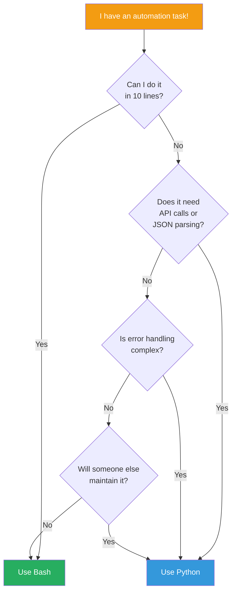
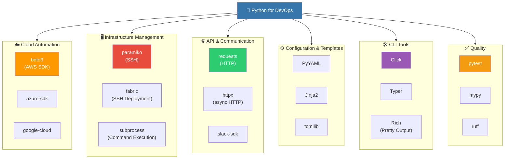

# Python for DevOps

> In the [previous lecture](./01-bash), you learned server automation with Bash scripts. Now it's time for **complex automation** that goes beyond Bash. There's a DevOps wisdom: "Use Bash if it fits in 10 lines, switch to Python if it exceeds 50 lines."

---

## 🎯 Why Do You Need Python for DevOps?

```
Real-world moments when you need Python:
• "I need to clean up hundreds of AWS resources at once"           → boto3 automation
• "I need to execute commands on 100 servers via SSH simultaneously"  → paramiko / fabric
• "I need to integrate Slack/PagerDuty API scripts"             → requests / httpx
• "We need a custom CLI tool for the team"                       → Click / Typer
• "I need to auto-generate 100 config files with Jinja2"         → PyYAML + Jinja2
• "I want daily cost reports sent to Slack automatically"        → boto3 + requests
• "I need to send alerts 7 days before certificate expiration"   → ssl + datetime
• Interview: "Bash vs Python, which do you use?"                 → Choose based on situation
```

If [Bash scripts](./01-bash) are a "pocket knife," Python is a "Swiss Army knife." Bash excels at quick, simple tasks, but for complex logic, API integration, and error handling, Python is far more productive.

---

## 🧠 Grasping Core Concepts

### Analogy: Construction Site Tools

Let me compare DevOps automation to a construction site.

| Tool | DevOps Equivalent | When to Use |
|------|-------------|-------------|
| Hammer (Bash) | Simple file manipulation, pipelines | When you need to drive a single nail |
| Power Drill (Python) | Complex automation, API integration | When you need systematic construction |
| Crane (Terraform/Ansible) | IaC, large-scale provisioning | When you need to build an entire building |

Python is the "power drill." You can do it with a hammer (Bash), but if you need to drive 100 screws, a power drill is overwhelmingly more efficient.

### Bash vs Python Decision Tree



### DevOps Python Ecosystem



---

## 🔍 Understanding Each Topic in Detail

### 1. Environment Setup: venv and Poetry

The first rule of Python projects is **creating a virtual environment**. Installing packages directly into system Python leads to version conflict hell.

#### venv (Built-in Tool)

```bash
# Create project folder and navigate
mkdir devops-tools && cd devops-tools

# Create virtual environment
python -m venv .venv

# Activate (Linux/Mac)
source .venv/bin/activate

# Activate (Windows PowerShell)
.venv\Scripts\Activate.ps1

# Install packages
pip install boto3 requests paramiko click pyyaml jinja2

# Record installed packages
pip freeze > requirements.txt

# Restore in another environment
pip install -r requirements.txt
```

#### Poetry (Modern Package Management)

```bash
# Install Poetry
pip install poetry

# Start new project
poetry init

# Add packages (auto-updates pyproject.toml)
poetry add boto3 requests paramiko
poetry add --group dev pytest ruff mypy

# Run in virtual environment
poetry run python my_script.py

# Install dependencies
poetry install
```

#### pyproject.toml (Project Standard Configuration)

```toml
[project]
name = "devops-tools"
version = "1.0.0"
description = "Team DevOps automation tools"
requires-python = ">=3.11"
dependencies = [
    "boto3>=1.34.0",
    "requests>=2.31.0",
    "paramiko>=3.4.0",
    "click>=8.1.0",
    "pyyaml>=6.0",
    "jinja2>=3.1.0",
    "rich>=13.0.0",
]

[project.optional-dependencies]
dev = [
    "pytest>=8.0.0",
    "ruff>=0.3.0",
    "mypy>=1.8.0",
    "boto3-stubs[ec2,s3,lambda]",
]

[project.scripts]
devops = "devops_tools.cli:app"

[tool.ruff]
line-length = 100
target-version = "py311"

[tool.pytest.ini_options]
testpaths = ["tests"]

[tool.mypy]
python_version = "3.11"
strict = true
```

**venv + pip vs Poetry:**

```
venv + pip:
  ✅ Built into Python, no installation needed
  ✅ Good for simple scripts
  ❌ No lock file (hard to pin versions)
  ❌ Incomplete dependency resolution

Poetry:
  ✅ Lock file for exact version pinning
  ✅ Supports package distribution
  ✅ Group-based dependency management (dev, test)
  ❌ Requires separate installation
  ❌ Learning curve
```

#### uv (Next-Generation Python Package Manager)

[astral-sh/uv](https://github.com/astral-sh/uv) is a blazing-fast Python package manager written in Rust. It unifies pip, pip-tools, virtualenv, and Poetry functionality while being 10-100x faster.

```bash
# Install uv
curl -LsSf https://astral.sh/uv/install.sh | sh

# Python version management (replaces pyenv)
uv python install 3.12
uv python install 3.13
uv python list

# Create new project (auto-generates pyproject.toml)
uv init devops-tools
cd devops-tools

# Add packages
uv add boto3 requests paramiko click pyyaml
uv add --dev pytest ruff mypy

# Run scripts (auto-manages virtual environment)
uv run python my_script.py
uv run pytest

# Migrate from existing requirements.txt
uv pip compile requirements.in -o requirements.txt
uv pip sync requirements.txt

# Create lock file and sync
uv lock
uv sync
```

The `pyproject.toml` generated by uv fully follows the PEP 621 standard:

```toml
[project]
name = "devops-tools"
version = "0.1.0"
description = "DevOps automation tools"
requires-python = ">=3.12"
dependencies = [
    "boto3>=1.35.0",
    "requests>=2.32.0",
    "paramiko>=3.5.0",
    "click>=8.1.0",
    "pyyaml>=6.0",
]

[dependency-groups]
dev = [
    "pytest>=8.0.0",
    "ruff>=0.8.0",
    "mypy>=1.13.0",
]

[tool.uv]
# Pin Python version
python = "3.12"
```

> **Why Python 3.12+ is Recommended:**
> - **Performance**: CPython 3.12 is 5% faster than 3.11, 3.13 introduces experimental JIT compiler
> - **Better Errors**: Friendlier tracebacks (3.11+), improved type hint errors (3.12+)
> - **Type Hints**: `type` keyword (3.12), improved `TypeVar`, `typing.override` decorator
> - **Security**: Default hashlib based on OpenSSL 3.0+, enhanced `ssl` module security
> - **DevOps**: Built-in `tomllib` (3.11+), improved `pathlib`, enhanced `asyncio`

**venv + pip vs Poetry vs uv:**

```
venv + pip:
  ✅ Built into Python, no installation needed
  ✅ Good for simple scripts
  ❌ No lock file (hard to pin versions)
  ❌ Incomplete dependency resolution
  ❌ Slow package installation

Poetry:
  ✅ Lock file for exact version pinning
  ✅ PyPI publish support
  ✅ Group-based dependency management
  ❌ Requires separate installation (written in Python)
  ❌ Slow dependency resolution on large projects
  ❌ Partial PEP 621 support (uses own [tool.poetry] section)

uv:
  ✅ 10-100x faster package install/resolution
  ✅ All-in-one replacement for pip, virtualenv, pyenv
  ✅ Full PEP 621 compliance (standard pyproject.toml)
  ✅ Lock file + cross-platform resolution
  ✅ Built-in Python version management
  ❌ Relatively new tool (2024~)
  ❌ PyPI publish still maturing

Practical Recommendations:
  Personal scripts/learning → venv + pip
  Existing project maintenance → Poetry
  New projects (2024~) → uv (recommended)
```

---

### 2. boto3: AWS SDK for Cloud Automation

boto3 is AWS's official Python SDK. It's the core library for controlling [AWS cloud services](../05-cloud-aws/) through code.

#### Basic Usage

```python
import boto3
from botocore.exceptions import ClientError

# Create session (profile-based)
session = boto3.Session(profile_name="dev-account")

# Resource approach (high-level, object-oriented)
s3_resource = session.resource("s3")

# Client approach (low-level, direct API calls)
ec2_client = session.client("ec2", region_name="ap-northeast-2")
```

#### EC2 Instance Management

```python
"""EC2 instance management script"""
import boto3
from datetime import datetime, timezone


def get_ec2_client(region: str = "ap-northeast-2"):
    return boto3.client("ec2", region_name=region)


def list_instances(client, filters: list | None = None) -> list[dict]:
    """List all EC2 instances"""
    params = {}
    if filters:
        params["Filters"] = filters

    instances = []
    paginator = client.get_paginator("describe_instances")

    for page in paginator.paginate(**params):
        for reservation in page["Reservations"]:
            for instance in reservation["Instances"]:
                # Extract name from tags
                name = "N/A"
                for tag in instance.get("Tags", []):
                    if tag["Key"] == "Name":
                        name = tag["Value"]
                        break

                instances.append({
                    "id": instance["InstanceId"],
                    "name": name,
                    "type": instance["InstanceType"],
                    "state": instance["State"]["Name"],
                    "launch_time": instance["LaunchTime"],
                    "private_ip": instance.get("PrivateIpAddress", "N/A"),
                })

    return instances


def stop_instances_by_tag(client, tag_key: str, tag_value: str) -> list[str]:
    """Stop instances with specific tag"""
    instances = list_instances(client, filters=[
        {"Name": f"tag:{tag_key}", "Values": [tag_value]},
        {"Name": "instance-state-name", "Values": ["running"]},
    ])

    if not instances:
        print("No instances to stop.")
        return []

    instance_ids = [inst["id"] for inst in instances]
    print(f"Stopping: {instance_ids}")

    client.stop_instances(InstanceIds=instance_ids)
    print(f"Requested stop for {len(instance_ids)} instances!")
    return instance_ids


# Usage example
if __name__ == "__main__":
    client = get_ec2_client()

    # List all instances
    for inst in list_instances(client):
        print(f"  {inst['id']} | {inst['name']:20s} | {inst['state']:10s} | {inst['type']}")

    # Auto-stop dev instances after work hours
    stop_instances_by_tag(client, "Environment", "dev")
```

#### S3 Bucket Management

```python
"""S3 bucket management and cleanup script"""
import boto3
from datetime import datetime, timezone, timedelta


def cleanup_old_objects(
    bucket_name: str,
    prefix: str,
    days_old: int = 90,
    dry_run: bool = True,
) -> dict:
    """Delete S3 objects older than specified days

    Args:
        bucket_name: S3 bucket name
        prefix: Search path prefix
        days_old: Delete objects older than this many days
        dry_run: True = check only, don't delete
    """
    s3 = boto3.client("s3")
    cutoff = datetime.now(timezone.utc) - timedelta(days=days_old)

    deleted = []
    total_size = 0

    paginator = s3.get_paginator("list_objects_v2")
    for page in paginator.paginate(Bucket=bucket_name, Prefix=prefix):
        for obj in page.get("Contents", []):
            if obj["LastModified"] < cutoff:
                deleted.append(obj["Key"])
                total_size += obj["Size"]

                if not dry_run:
                    s3.delete_object(Bucket=bucket_name, Key=obj["Key"])

    result = {
        "bucket": bucket_name,
        "prefix": prefix,
        "objects_found": len(deleted),
        "total_size_mb": round(total_size / (1024 * 1024), 2),
        "dry_run": dry_run,
    }

    if dry_run:
        print(f"[DRY RUN] Delete targets: {len(deleted)} objects, {result['total_size_mb']}MB")
    else:
        print(f"Deleted: {len(deleted)} objects, freed {result['total_size_mb']}MB!")

    return result


# Usage example
if __name__ == "__main__":
    # Check first with dry_run
    cleanup_old_objects("my-app-logs", "logs/2025/", days_old=90, dry_run=True)

    # After verification, actually delete
    # cleanup_old_objects("my-app-logs", "logs/2025/", days_old=90, dry_run=False)
```

---

### 3. paramiko / fabric: SSH Automation

SSH automation is a daily DevOps task. paramiko is Python's SSH implementation, and fabric is a high-level deployment tool built on top of it.

#### SSH Automation with paramiko

```python
"""SSH automation using paramiko"""
import paramiko
from pathlib import Path


class SSHManager:
    """SSH connection manager

    Analogy: A secretary making phone calls to multiple servers,
    executing commands, and collecting results.
    """

    def __init__(self, hostname: str, username: str, key_path: str | None = None):
        self.hostname = hostname
        self.username = username
        self.key_path = key_path
        self.client = paramiko.SSHClient()
        self.client.set_missing_host_key_policy(paramiko.AutoAddPolicy())

    def connect(self):
        """Establish SSH connection"""
        connect_kwargs = {
            "hostname": self.hostname,
            "username": self.username,
        }
        if self.key_path:
            connect_kwargs["key_filename"] = self.key_path
        self.client.connect(**connect_kwargs)
        print(f"[Connected] {self.username}@{self.hostname}")

    def run_command(self, command: str) -> tuple[str, str, int]:
        """Execute command and return stdout, stderr, exit_code"""
        stdin, stdout, stderr = self.client.exec_command(command)
        exit_code = stdout.channel.recv_exit_status()

        out = stdout.read().decode().strip()
        err = stderr.read().decode().strip()

        return out, err, exit_code

    def upload_file(self, local_path: str, remote_path: str):
        """Upload file (SCP)"""
        sftp = self.client.open_sftp()
        sftp.put(local_path, remote_path)
        sftp.close()
        print(f"[Uploaded] {local_path} → {self.hostname}:{remote_path}")

    def download_file(self, remote_path: str, local_path: str):
        """Download file"""
        sftp = self.client.open_sftp()
        sftp.get(remote_path, local_path)
        sftp.close()
        print(f"[Downloaded] {self.hostname}:{remote_path} → {local_path}")

    def close(self):
        self.client.close()
        print(f"[Closed] {self.hostname}")

    def __enter__(self):
        self.connect()
        return self

    def __exit__(self, exc_type, exc_val, exc_tb):
        self.close()


def run_on_multiple_servers(
    servers: list[dict],
    command: str,
) -> dict[str, dict]:
    """Execute command on multiple servers concurrently"""
    results = {}

    for server in servers:
        host = server["host"]
        try:
            with SSHManager(
                hostname=host,
                username=server["user"],
                key_path=server.get("key"),
            ) as ssh:
                out, err, code = ssh.run_command(command)
                results[host] = {
                    "stdout": out,
                    "stderr": err,
                    "exit_code": code,
                    "success": code == 0,
                }
        except Exception as e:
            results[host] = {
                "stdout": "",
                "stderr": str(e),
                "exit_code": -1,
                "success": False,
            }

    return results


# Usage example
if __name__ == "__main__":
    servers = [
        {"host": "web-01.example.com", "user": "ubuntu", "key": "~/.ssh/prod.pem"},
        {"host": "web-02.example.com", "user": "ubuntu", "key": "~/.ssh/prod.pem"},
        {"host": "web-03.example.com", "user": "ubuntu", "key": "~/.ssh/prod.pem"},
    ]

    # Check disk usage on all servers
    results = run_on_multiple_servers(servers, "df -h / | tail -1")
    for host, result in results.items():
        status = "OK" if result["success"] else "FAIL"
        print(f"[{status}] {host}: {result['stdout']}")
```

---

### 4. requests / httpx: API Calls

API integration is essential for DevOps automation.

#### requests Basic Usage

```python
"""API call utilities"""
import requests
from requests.adapters import HTTPAdapter
from urllib3.util.retry import Retry


def create_session(
    retries: int = 3,
    backoff_factor: float = 0.5,
    timeout: int = 30,
) -> requests.Session:
    """Create HTTP session with retry logic

    Analogy: A secretary who redials if no answer (up to 3 times)
    """
    session = requests.Session()

    retry_strategy = Retry(
        total=retries,
        backoff_factor=backoff_factor,
        status_forcelist=[429, 500, 502, 503, 504],
    )

    adapter = HTTPAdapter(max_retries=retry_strategy)
    session.mount("http://", adapter)
    session.mount("https://", adapter)
    session.timeout = timeout

    return session


def send_slack_notification(
    webhook_url: str,
    title: str,
    message: str,
    color: str = "#36a64f",
) -> bool:
    """Send alert via Slack webhook"""
    payload = {
        "attachments": [
            {
                "color": color,
                "title": title,
                "text": message,
                "footer": "DevOps Bot",
            }
        ]
    }

    try:
        response = requests.post(webhook_url, json=payload, timeout=10)
        response.raise_for_status()
        return True
    except requests.RequestException as e:
        print(f"Slack notification failed: {e}")
        return False


def check_endpoint_health(urls: list[str]) -> list[dict]:
    """Check health status of multiple endpoints"""
    session = create_session(retries=2, timeout=5)
    results = []

    for url in urls:
        try:
            response = session.get(url)
            results.append({
                "url": url,
                "status": response.status_code,
                "latency_ms": round(response.elapsed.total_seconds() * 1000),
                "healthy": response.status_code == 200,
            })
        except requests.RequestException as e:
            results.append({
                "url": url,
                "status": 0,
                "latency_ms": -1,
                "healthy": False,
                "error": str(e),
            })

    return results


# Usage example
if __name__ == "__main__":
    endpoints = [
        "https://api.example.com/health",
        "https://web.example.com/status",
        "https://admin.example.com/ping",
    ]

    results = check_endpoint_health(endpoints)
    for r in results:
        icon = "OK" if r["healthy"] else "FAIL"
        print(f"[{icon}] {r['url']} - {r['status']} ({r['latency_ms']}ms)")
```

---

### 5. Click / Typer: Creating CLI Tools

Creating team CLI tools saves time on "where's that script?" questions.

#### Click-based CLI

```python
"""Click-based DevOps CLI tool"""
import click
import boto3
from datetime import datetime


@click.group()
@click.option("--profile", default=None, help="AWS profile name")
@click.option("--region", default="ap-northeast-2", help="AWS region")
@click.pass_context
def cli(ctx, profile, region):
    """DevOps team automation CLI"""
    ctx.ensure_object(dict)
    session = boto3.Session(profile_name=profile, region_name=region)
    ctx.obj["session"] = session


@cli.group()
@click.pass_context
def ec2(ctx):
    """EC2 instance management"""
    pass


@ec2.command("list")
@click.option("--state", type=click.Choice(["running", "stopped", "all"]), default="all")
@click.option("--output", "fmt", type=click.Choice(["table", "json"]), default="table")
@click.pass_context
def ec2_list(ctx, state, fmt):
    """List EC2 instances"""
    client = ctx.obj["session"].client("ec2")

    filters = []
    if state != "all":
        filters.append({"Name": "instance-state-name", "Values": [state]})

    response = client.describe_instances(Filters=filters)

    instances = []
    for res in response["Reservations"]:
        for inst in res["Instances"]:
            name = next(
                (t["Value"] for t in inst.get("Tags", []) if t["Key"] == "Name"),
                "N/A",
            )
            instances.append({
                "ID": inst["InstanceId"],
                "Name": name,
                "Type": inst["InstanceType"],
                "State": inst["State"]["Name"],
            })

    if fmt == "table":
        click.echo(f"{'ID':20s} {'Name':25s} {'Type':15s} {'State':10s}")
        click.echo("-" * 72)
        for inst in instances:
            click.echo(f"{inst['ID']:20s} {inst['Name']:25s} {inst['Type']:15s} {inst['State']:10s}")
    else:
        import json
        click.echo(json.dumps(instances, indent=2))

    click.echo(f"\nTotal {len(instances)} instances")


@ec2.command("stop")
@click.argument("instance_ids", nargs=-1, required=True)
@click.option("--yes", "-y", is_flag=True, help="Skip confirmation")
@click.pass_context
def ec2_stop(ctx, instance_ids, yes):
    """Stop EC2 instances"""
    if not yes:
        click.confirm(f"Stop {len(instance_ids)} instances?", abort=True)

    client = ctx.obj["session"].client("ec2")
    client.stop_instances(InstanceIds=list(instance_ids))
    click.echo(f"Requested stop for {len(instance_ids)} instances!")


if __name__ == "__main__":
    cli()
```

Usage:

```bash
# List EC2 instances
devops ec2 list --state running

# Stop instances
devops ec2 stop i-0123456789 i-9876543210 --yes

# Use different profile/region
devops --profile prod-account --region us-east-1 ec2 list
```

---

### 6. PyYAML / Jinja2: Auto-generate Config Files

Manual config file creation is error-prone. Template + data = automated, correct generation.

#### PyYAML: Read/Write YAML

```python
"""YAML configuration management"""
import yaml
from pathlib import Path


def load_config(config_path: str) -> dict:
    """Load YAML config file"""
    with open(config_path) as f:
        return yaml.safe_load(f)


def save_config(config: dict, output_path: str):
    """Save YAML config file"""
    with open(output_path, "w") as f:
        yaml.dump(config, f, default_flow_style=False, allow_unicode=True)


# Example: merge environment-specific settings
def merge_configs(base_path: str, env_path: str) -> dict:
    """Merge base config with environment-specific overrides (overlay pattern)"""
    base = load_config(base_path)
    env = load_config(env_path)

    def deep_merge(base_dict: dict, override_dict: dict) -> dict:
        result = base_dict.copy()
        for key, value in override_dict.items():
            if key in result and isinstance(result[key], dict) and isinstance(value, dict):
                result[key] = deep_merge(result[key], value)
            else:
                result[key] = value
        return result

    return deep_merge(base, env)
```

#### Jinja2: Template Engine

```python
"""Auto-generate config files with Jinja2"""
from jinja2 import Environment, FileSystemLoader
from pathlib import Path


def generate_nginx_configs(
    services: list[dict],
    template_dir: str = "templates",
    output_dir: str = "output",
):
    """Auto-generate nginx config from services list

    Analogy: Mail merge - template (letter) + data (addresses) = completed letters
    """
    env = Environment(loader=FileSystemLoader(template_dir))
    template = env.get_template("nginx.conf.j2")

    output_path = Path(output_dir)
    output_path.mkdir(parents=True, exist_ok=True)

    for service in services:
        rendered = template.render(service=service)
        config_file = output_path / f"{service['name']}.conf"
        config_file.write_text(rendered)
        print(f"Generated: {config_file}")
```

Template example (`templates/nginx.conf.j2`):

```nginx
# Auto-generated - DO NOT EDIT!
# Service: {{ service.name }}
# Generated: {{ now() }}

upstream {{ service.name }}_backend {

    server {{ server.host }}:{{ server.port }} weight={{ server.weight | default(1) }};

}

server {
    listen {{ service.listen_port | default(80) }};
    server_name {{ service.domain }};


    listen 443 ssl;
    ssl_certificate /etc/nginx/ssl/{{ service.name }}.crt;
    ssl_certificate_key /etc/nginx/ssl/{{ service.name }}.key;


    location / {
        proxy_pass http://{{ service.name }}_backend;
        proxy_set_header Host $host;
        proxy_set_header X-Real-IP $remote_addr;
    }
}
```

---

### 7. subprocess / pathlib: System Control

These are basic tools for executing system commands and handling files in Python.

#### subprocess: Execute External Commands Safely

```python
"""Execute system commands safely"""
import subprocess
import shlex
from pathlib import Path


def run_command(
    command: str | list[str],
    cwd: str | None = None,
    timeout: int = 60,
    capture: bool = True,
) -> dict:
    """Execute system command safely

    Args:
        command: Command to execute (string or list)
        cwd: Working directory
        timeout: Timeout in seconds
        capture: Capture output
    """
    if isinstance(command, str):
        # String → safely split (prevents shell injection)
        cmd_list = shlex.split(command)
    else:
        cmd_list = command

    try:
        result = subprocess.run(
            cmd_list,
            capture_output=capture,
            text=True,
            cwd=cwd,
            timeout=timeout,
        )

        return {
            "stdout": result.stdout.strip() if capture else "",
            "stderr": result.stderr.strip() if capture else "",
            "returncode": result.returncode,
            "success": result.returncode == 0,
        }
    except subprocess.TimeoutExpired:
        return {"stdout": "", "stderr": "TIMEOUT", "returncode": -1, "success": False}
    except FileNotFoundError:
        return {"stdout": "", "stderr": "COMMAND NOT FOUND", "returncode": -1, "success": False}


# Docker cleanup example
def docker_cleanup():
    """Clean up unused Docker resources"""
    commands = [
        "docker container prune -f",
        "docker image prune -f",
        "docker volume prune -f",
        "docker network prune -f",
    ]

    for cmd in commands:
        result = run_command(cmd)
        if result["success"]:
            print(f"[OK] {cmd}")
        else:
            print(f"[FAIL] {cmd}: {result['stderr']}")
```

#### pathlib: File System Operations

```python
"""File system operations with pathlib"""
from pathlib import Path
from datetime import datetime, timedelta


def find_large_log_files(
    log_dir: str,
    min_size_mb: int = 100,
    extensions: tuple = (".log", ".gz"),
) -> list[dict]:
    """Find large log files"""
    log_path = Path(log_dir)
    large_files = []

    for file in log_path.rglob("*"):
        if file.is_file() and file.suffix in extensions:
            size_mb = file.stat().st_size / (1024 * 1024)
            if size_mb >= min_size_mb:
                large_files.append({
                    "path": str(file),
                    "size_mb": round(size_mb, 2),
                    "modified": datetime.fromtimestamp(file.stat().st_mtime),
                })

    return sorted(large_files, key=lambda x: x["size_mb"], reverse=True)


def rotate_logs(log_dir: str, keep_days: int = 30):
    """Clean up old log files"""
    log_path = Path(log_dir)
    cutoff = datetime.now() - timedelta(days=keep_days)
    deleted_count = 0
    freed_bytes = 0

    for file in log_path.rglob("*.log"):
        if file.is_file():
            mtime = datetime.fromtimestamp(file.stat().st_mtime)
            if mtime < cutoff:
                size = file.stat().st_size
                file.unlink()
                deleted_count += 1
                freed_bytes += size

    freed_mb = freed_bytes / (1024 * 1024)
    print(f"Cleanup complete: {deleted_count} files deleted, freed {freed_mb:.1f}MB")
```

---

### 8. logging Module: Essential for Production Scripts

Using `print()` for debugging makes production log tracking impossible. Use the logging module.

```python
"""Production-ready logging setup"""
import logging
import logging.handlers
from pathlib import Path


def setup_logger(
    name: str,
    log_file: str | None = None,
    level: str = "INFO",
    max_bytes: int = 10 * 1024 * 1024,  # 10MB
    backup_count: int = 5,
) -> logging.Logger:
    """Setup production logger

    - Console + file output
    - Auto log rotation (10MB)
    - Structured logging with JSON possible
    """
    logger = logging.getLogger(name)
    logger.setLevel(getattr(logging, level.upper()))

    formatter = logging.Formatter(
        "%(asctime)s | %(name)s | %(levelname)-8s | %(funcName)s:%(lineno)d | %(message)s",
        datefmt="%Y-%m-%d %H:%M:%S",
    )

    # Console handler
    console_handler = logging.StreamHandler()
    console_handler.setFormatter(formatter)
    logger.addHandler(console_handler)

    # File handler (with rotation)
    if log_file:
        Path(log_file).parent.mkdir(parents=True, exist_ok=True)
        file_handler = logging.handlers.RotatingFileHandler(
            log_file,
            maxBytes=max_bytes,
            backupCount=backup_count,
        )
        file_handler.setFormatter(formatter)
        logger.addHandler(file_handler)

    return logger


# Usage example
logger = setup_logger("devops-tools", log_file="/var/log/devops/tools.log")

logger.info("EC2 cleanup starting")
logger.warning("Instance i-0123456789 has been stopped for 2 weeks")
logger.error("S3 access denied: AccessDenied")
logger.debug("API response: %s", response_data)  # Only shown in DEBUG level
```

---

## 💻 Practice Exercises

### Exercise 1: AWS Cost Report Auto-Generation

Send daily AWS cost reports to Slack automatically.

```python
"""AWS daily cost report - Auto Slack notification"""
import boto3
import requests
import logging
from datetime import datetime, timedelta, timezone

logger = logging.getLogger(__name__)


def get_daily_cost(days: int = 7) -> list[dict]:
    """Get daily AWS costs for last N days"""
    client = boto3.client("ce", region_name="us-east-1")  # Cost Explorer fixed to us-east-1

    end = datetime.now(timezone.utc).date()
    start = end - timedelta(days=days)

    response = client.get_cost_and_usage(
        TimePeriod={
            "Start": start.isoformat(),
            "End": end.isoformat(),
        },
        Granularity="DAILY",
        Metrics=["UnblendedCost"],
        GroupBy=[
            {"Type": "DIMENSION", "Key": "SERVICE"},
        ],
    )

    daily_costs = []
    for result in response["ResultsByTime"]:
        date = result["TimePeriod"]["Start"]
        services = {}
        total = 0.0

        for group in result["Groups"]:
            service_name = group["Keys"][0]
            amount = float(group["Metrics"]["UnblendedCost"]["Amount"])
            if amount > 0.01:  # Ignore sub-cent costs
                services[service_name] = round(amount, 2)
                total += amount

        daily_costs.append({
            "date": date,
            "total": round(total, 2),
            "top_services": dict(
                sorted(services.items(), key=lambda x: x[1], reverse=True)[:5]
            ),
        })

    return daily_costs


def format_cost_report(costs: list[dict]) -> str:
    """Format cost data as Slack message"""
    lines = ["*AWS Daily Cost Report*\n"]

    for day in costs[-3:]:  # Last 3 days
        lines.append(f"*{day['date']}* — Total ${day['total']:,.2f}")
        for svc, amount in day["top_services"].items():
            bar = "█" * min(int(amount / 5), 20)  # Simple bar chart
            lines.append(f"  {svc[:30]:30s} ${amount:>8,.2f} {bar}")
        lines.append("")

    # Trend analysis
    if len(costs) >= 2:
        yesterday = costs[-1]["total"]
        day_before = costs[-2]["total"]
        change = ((yesterday - day_before) / day_before * 100) if day_before > 0 else 0
        emoji = "📈" if change > 10 else ("📉" if change < -10 else "➡️")
        lines.append(f"{emoji} vs yesterday: {change:+.1f}%")

    return "\n".join(lines)


def send_to_slack(webhook_url: str, message: str):
    """Send report to Slack"""
    payload = {
        "text": message,
        "mrkdwn": True,
    }
    response = requests.post(webhook_url, json=payload, timeout=10)
    response.raise_for_status()
    logger.info("Sent to Slack")


def main():
    """Main execution"""
    import os

    webhook_url = os.environ.get("SLACK_WEBHOOK_URL")
    if not webhook_url:
        logger.error("SLACK_WEBHOOK_URL environment variable not set!")
        return

    costs = get_daily_cost(days=7)
    report = format_cost_report(costs)
    print(report)

    send_to_slack(webhook_url, report)


if __name__ == "__main__":
    logging.basicConfig(level=logging.INFO)
    main()
```

---

## 📝 Summary

### Core Takeaways

```
Python for DevOps Essential Summary:

1. Environment      → Use venv/Poetry for isolated environments
2. AWS Automation   → boto3 (remember Paginator!)
3. SSH Automation   → paramiko/fabric
4. API Integration  → requests (with retry logic), httpx (async)
5. CLI Tools        → Click (mature), Typer (modern)
6. Config Gen       → PyYAML + Jinja2 combo
7. System Control   → subprocess (no shell=True!), pathlib
8. Logging          → Use logging module (no print!)
9. Testing          → pytest + moto (AWS mocking)
10. Packaging       → pyproject.toml standard
```

### Bash vs Python Decision Summary

```
Use Bash:
  • One-liner pipeline commands
  • File move/copy/chmod
  • CLI tool wrapping (systemctl, docker)
  • Simple scripts under 10 lines

Use Python:
  • REST/GraphQL API calls
  • JSON/YAML parsing and data processing
  • Complex error handling
  • Team-maintained code
  • 50+ lines of logic
  • AWS SDK (boto3) usage
  • Tests needed
```

---

## 🔗 Next Steps

| Next Learning | Description |
|-----------|------|
| [Go for DevOps](./03-go) | High-performance CLI tools, Kubernetes Operator development |
| [AWS Cloud Services](../05-cloud-aws/) | Deep dive into AWS services you'll manage with boto3 |
| [IaC (Terraform)](../06-iac/) | Python scripts → declarative infrastructure |
| [CI/CD](../07-cicd/) | Integrate Python scripts into pipelines |
| [Observability](../08-observability/) | Advanced monitoring automation and log analysis |

**Recommended Learning Order:**

```
Current: Python for DevOps (this lecture)
  ↓
Next: Go for DevOps (./03-go)
  → High-performance/binary deployment areas Python can't handle
  ↓
Then: AWS Services Deep-Dive (../05-cloud-aws/)
  → Real AWS services you'll manage with boto3
```

> **Pro Tip**: Always put `if __name__ == "__main__":` guards in Python scripts. Always add a `--dry-run` option by default. "Check first, then execute" is the golden rule of operations automation!
