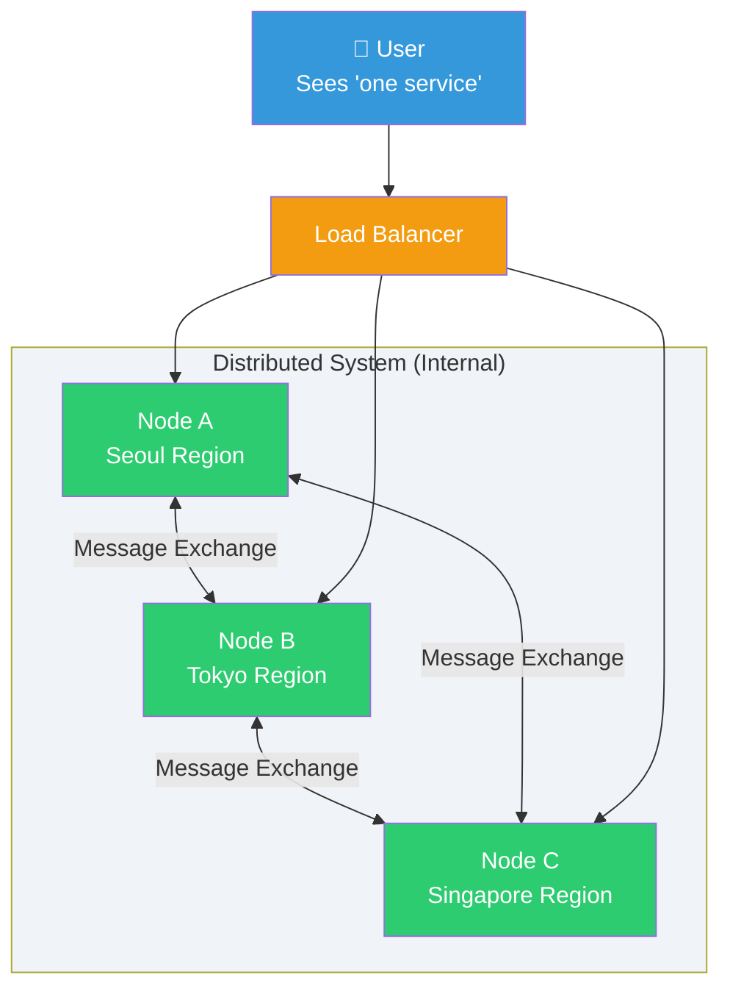
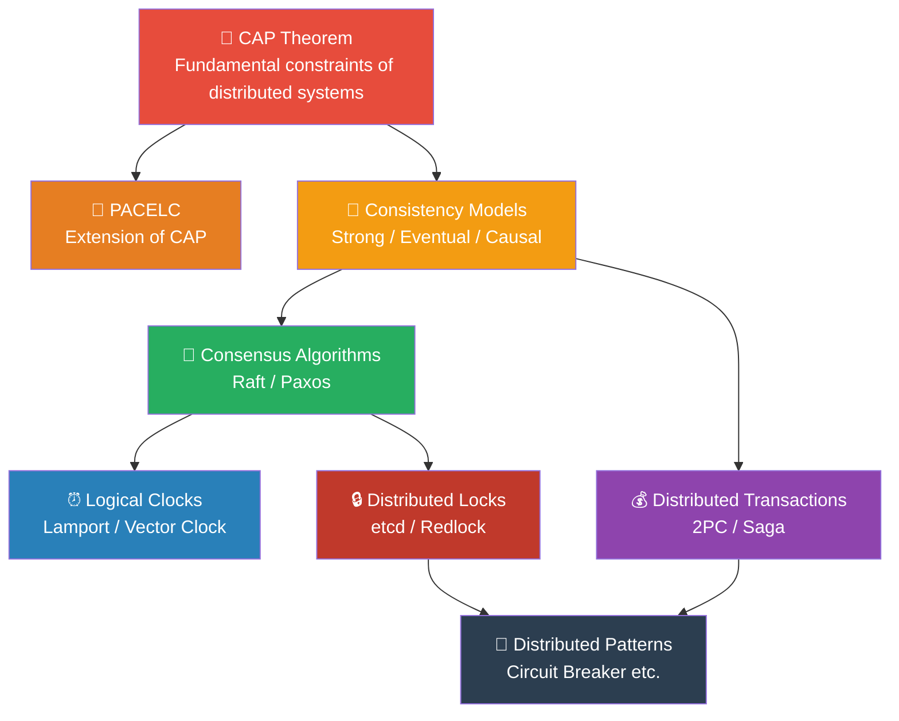
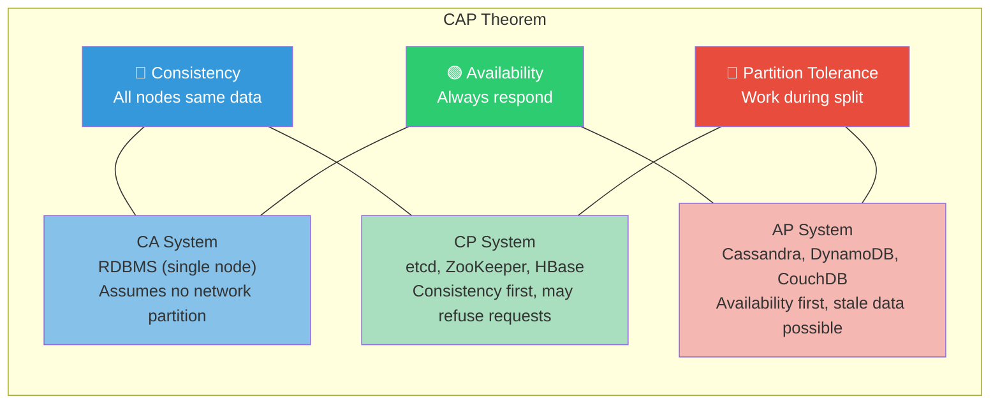
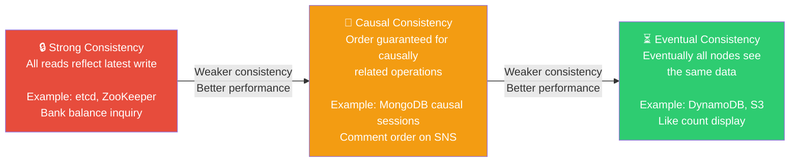
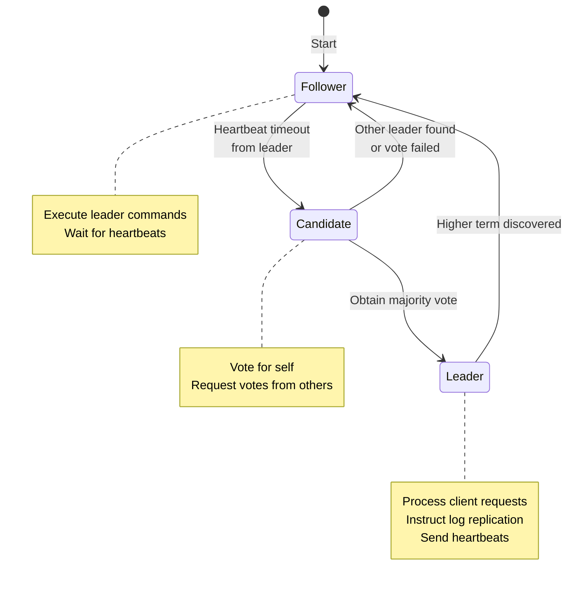
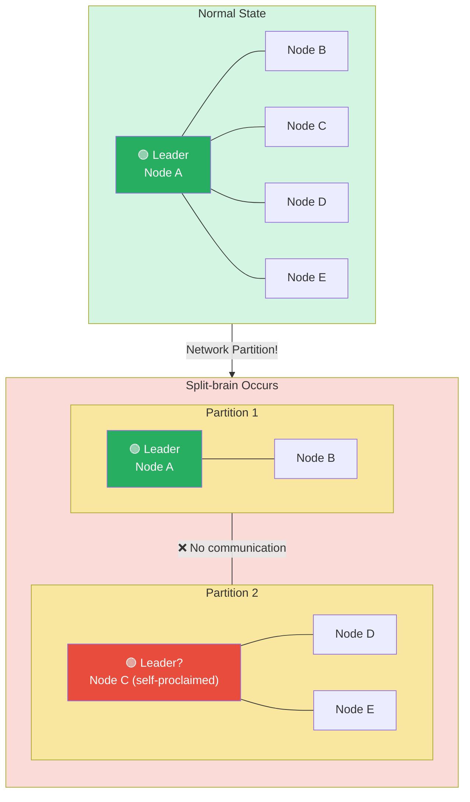
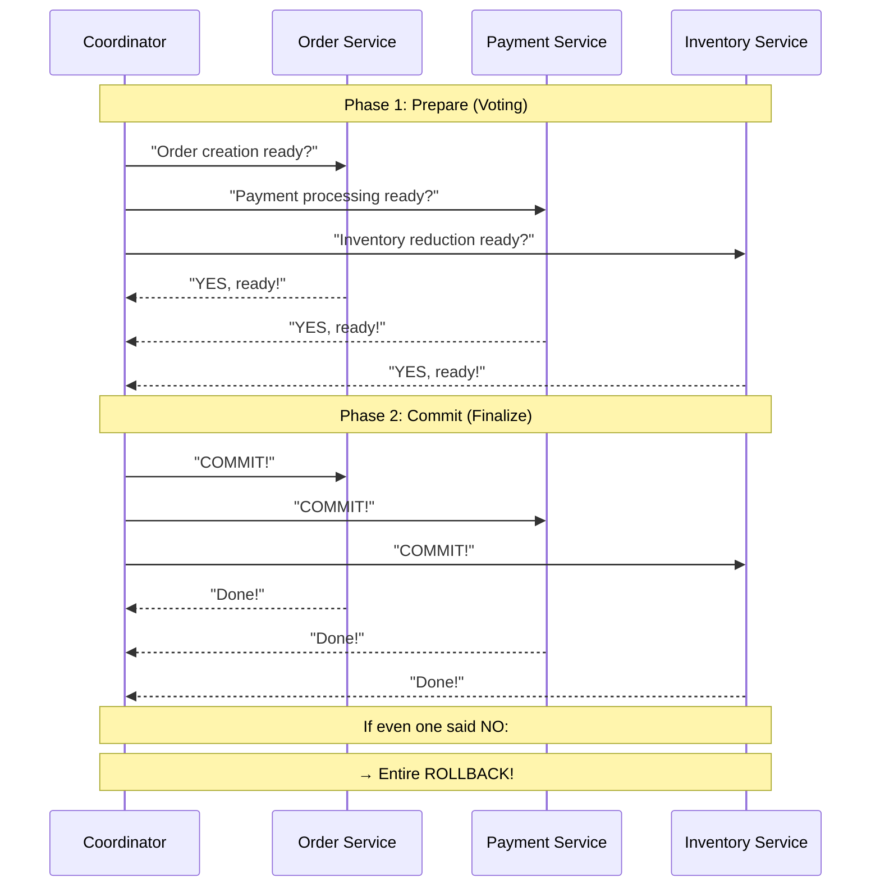
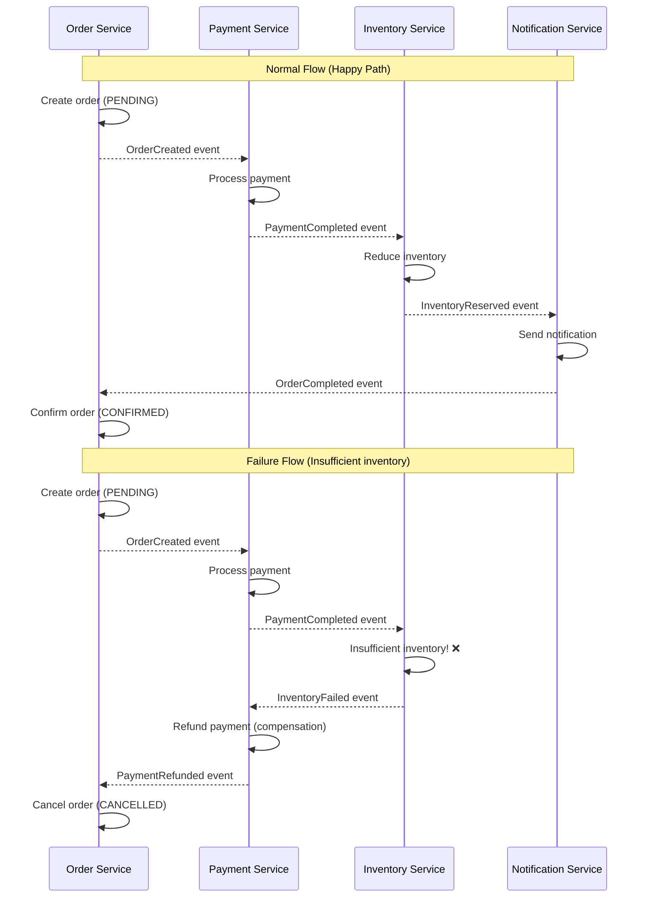
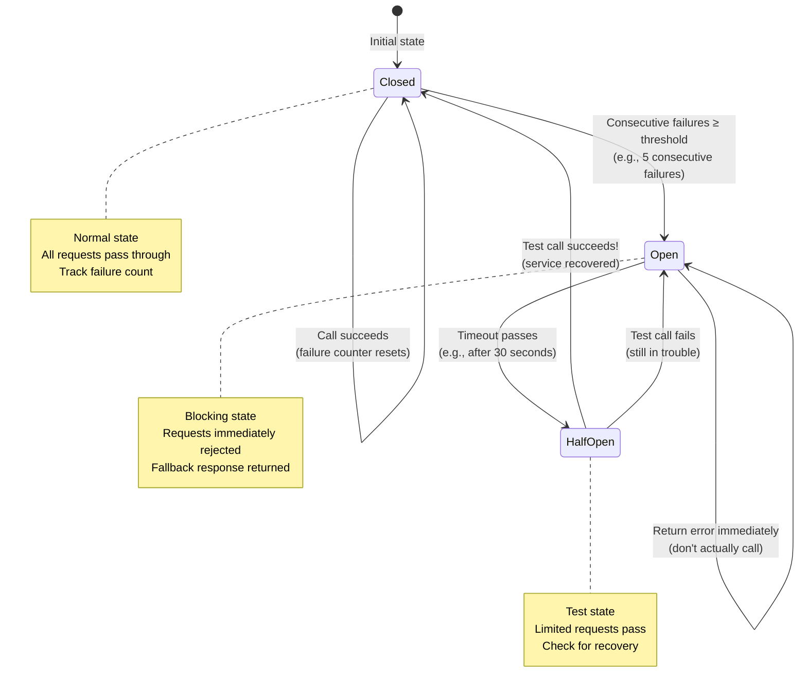

# Distributed Systems Theory

> A single server has its limits. Distributed systems are about making multiple servers work together while appearing as one. The [database services](../05-cloud-aws/05-database) and [Kubernetes architecture](../04-kubernetes/01-architecture) you've learned before are all running on top of distributed systems.

---

## 🎯 Why Do You Need to Understand Distributed Systems Theory?

As a DevOps engineer, you'll inevitably encounter these situations:

```
"Data written to the DB doesn't get read on another server!"      → Need to understand Consistency models
"One etcd cluster node went down, is that okay?"                   → Need to understand Consensus algorithms
"Transactions between microservices got tangled!"                  → Need distributed transaction patterns
"Two servers are both claiming to be the leader!"                  → Need to understand Split-brain problems
"Service discovery failed and communication dropped!"              → Need Service Discovery patterns
```

### What Happens When You Don't Understand Distributed Systems

| Situation | Without Understanding | With Understanding |
|----------|------|------|
| DB replication lag | "Is this a bug?" (wasting time) | "Ah, Eventual Consistency" (immediate comprehension) |
| etcd failure | Panic, randomly restart | "Quorum is alive, so it's fine" |
| Duplicate payment processing | Customer charged twice | Prevented by idempotent design |
| Network partition | "Networks don't fail" (naive optimism) | "Partitions WILL happen" (prepared design) |

### Everyday Analogy: Group Chat

Think of distributed systems like a **group chat**:

- **Servers** = Chat members
- **Data** = Shared information (meeting place, time)
- **Network** = Message delivery via chat
- **Partition** = Someone takes the subway and can't receive messages
- **Consistency issue** = "Meeting place changed!" message received by only some people

> In the real world, **not everyone can have the exact same information simultaneously**. Distributed systems work the same way.

---

## 🧠 Grasping Core Concepts

### What is a Distributed System?

Multiple computers connected by a network **work together** to operate as a single system. From the user's perspective, it looks like one service, but internally, multiple nodes exchange messages and work together.



### Why Distribute?

| Reason | Explanation | Example |
|--------|------|------|
| **Scalability** | One server can't handle the traffic | Process 1 million requests per second |
| **Availability** | Service continues even if a server dies | Multi-AZ deployment |
| **Latency** | Respond from closer to the user | Global CDN, regional distribution |
| **Data Safety** | Replicate data to multiple locations | DB replication, backups |

### Core Theory Roadmap



### The 8 Fallacies of Distributed Computing

There are **8 dangerous assumptions** you must never make when designing distributed systems. Documented by Peter Deutsch at Sun Microsystems in 1994, they remain valid 30 years later.

| # | Fallacy (Wrong Assumption) | Reality |
|---|-------------------|------|
| 1 | The network is reliable | Packets get lost, cables break |
| 2 | Latency is zero | Seoul to US: 200ms round trip, even within same DC: 0.5ms |
| 3 | Bandwidth is infinite | Network bottlenecks always exist |
| 4 | The network is secure | Man-in-the-middle, sniffing attacks exist |
| 5 | Topology doesn't change | Nodes get added/removed, routing changes constantly |
| 6 | There is one administrator | In cloud environments, multiple teams share infrastructure |
| 7 | Transport cost is zero | Data transfer has real costs (AWS data transfer fees) |
| 8 | The network is homogeneous | Diverse hardware, protocols, and versions coexist |

> Remember these 8 points: **The network is unreliable, slow, limited, and dangerous**. Design with this as your baseline.

---

## 🔍 Diving Deeper

### 1. CAP Theorem

Proposed by Eric Brewer in 2000, this is the most famous theorem in distributed systems.

**A distributed system cannot simultaneously satisfy all three of the following:**

| Property | Meaning | Analogy |
|----------|--------|------|
| **C** (Consistency) | All nodes see the same data at the same time | Everyone's watch shows exactly the same time |
| **A** (Availability) | All requests get a response (not an error) | Answer the phone whenever someone calls |
| **P** (Partition Tolerance) | System works even when network partition occurs | Keep working even if phone connection breaks |



#### Why Can't You Have All Three?

In a real distributed environment, **network partitions (P) inevitably occur**. Cables break, switches fail, communication between cloud AZs goes down—it's unavoidable. So realistically, **P is essential**, and you must choose between C and A.

**Scenario: Network Partition Occurs**

```
Node A <--X--> Node B    (Network broken!)

User writes "Balance = 1000" to Node A

If Node B receives "Check Balance" request at this moment:

Choice 1 (CP): "Cannot verify latest data" → return error (maintain Consistency)
Choice 2 (AP): "Last known balance = 500" → return response (maintain Availability)
```

#### AWS Services by CAP Classification

| Service | CAP Choice | Explanation |
|---------|---------|------|
| **RDS (Single-AZ)** | CA | Single node, no partition concept |
| **DynamoDB** | AP (default) | Eventual Consistency by default, Strong option available |
| **DynamoDB (Strong Read)** | CP | When using Strongly Consistent Read |
| **ElastiCache (Redis Cluster)** | AP | Allows replication lag |
| **etcd** | CP | Ensures strong consistency via Raft consensus |
| **S3** | AP | Guarantees strong consistency since 2020, but designed for availability |

> For more detailed AWS database service comparison, see [database lecture](../05-cloud-aws/05-database).

---

### 2. PACELC Theorem

CAP alone isn't enough. We also need to consider tradeoffs **when the network is working normally**.

**PACELC** = "If Partition, then A vs C; Else (when normal), L (Latency) vs C (Consistency)"

```
if (Partition) {
    choose: Availability or Consistency     // Same as CAP
} else {
    choose: Latency or Consistency          // New tradeoff!
}
```

| System | During Partition (PA/PC) | Normal (EL/EC) | Explanation |
|--------|----------|------------|------|
| **DynamoDB** | PA | EL | Favor availability during partition, low latency normally |
| **Cassandra** | PA | EL | Same pattern, goal is fast response |
| **etcd / ZooKeeper** | PC | EC | Always consistency-first (slower but accurate) |
| **MongoDB** | PA | EC | Availability during partition, consistency normally |
| **MySQL (Galera)** | PC | EC | Always consistency |

> **Key Point**: Even when the network is normal, you must choose between "fast response" and "accurate data".

---

### 3. Consistency Models

How much is guaranteed that "all nodes see the same data" depends on consistency levels.

#### Consistency Spectrum



#### Strong Consistency

- After write completes, **all subsequent reads must return that value**
- Implementation: All replicas must acknowledge the write before returning success
- Cost: **Slow response**, if even one replica fails, writes may become impossible

```
Time →→→→→→→→→→→→→→→

Client A:  WRITE(x=5) ──────────── OK
Client B:                    READ(x) → 5  ✅ Must be 5
Client C:                         READ(x) → 5  ✅ Must be 5
```

**Use Cases**: Bank balance, inventory count, seat reservation—anywhere a single number is money

#### Eventual Consistency

- After write, **after some time** all nodes will have the same value
- During that time, **you may read stale data**
- Cost: **Data inconsistency allowed**, but fast performance

```
Time →→→→→→→→→→→→→→→

Client A:  WRITE(x=5) ─── OK (recorded on primary only)
Client B:         READ(x) → 3  ❌ Not yet propagated
Client C:                      READ(x) → 5  ✅ Propagation complete
Client B:                           READ(x) → 5  ✅ Now propagated
```

**Use Cases**: SNS likes, product review count, log aggregation—slightly stale data is acceptable

#### Causal Consistency

- **Causally related** operations maintain order
- Unrelated operations may have different ordering on different nodes

```
Example: SNS post and comment

Alice: "Great weather today!" (post)
Bob:   "Totally agree!" (comment on Alice's post)

Causal Consistency guarantees:
→ On any node, Bob's comment appears after Alice's post ✅

Unrelated operations:
Alice: "Great weather today!"
Carol: "What's for dinner?" (independent post)

→ These two posts can appear in different order on different nodes (OK)
```

**Use Cases**: Social media timeline, chat messages, collaborative document editing

---

### 4. Consensus Algorithms

How multiple nodes **agree on a single value**. "What's the latest value of this data?" "Who is the leader now?"—you need mechanisms for such decisions.

#### Why is Consensus Hard?

```
Situation: 3 nodes need to decide on next leader

Node A: "I'll be leader!"
Node B: "I'll be leader!" (simultaneously)
Node C: "Node A's message arrived first, voting for A"

But what if network breaks between B and C?
Node B thinks it's the leader,
While A and C think A is the leader.

→ This is the Split-brain problem!
```

#### Raft Consensus Algorithm (Easy-to-understand Version)

Used by etcd, Consul, etc. Designed to be more understandable than Paxos.

**3 Core Concepts**:

1. **Leader Election**: Only one leader exists at a time
2. **Log Replication**: Leader propagates all changes to followers
3. **Safety**: Committed data never disappears

**3 Node States**:



**Raft Operation Flow (5-node cluster)**:

```
Normal State:
┌──────────┐     heartbeat     ┌──────────┐
│  Leader   │ ────────────────→ │ Follower │
│  Node A   │ ────────────────→ │ Node B   │
│  (term=3) │ ────────────────→ │ Node C   │
│           │ ────────────────→ │ Node D   │
│           │ ────────────────→ │ Node E   │
└──────────┘                    └──────────┘

Leader Failure:
┌──────────┐                    ┌──────────┐
│  Leader   │ ──── ✕ ────────→ │ Follower │
│  Node A   │   (failure!)     │ Node B   │  ← heartbeat timeout!
│  (dead)   │                   │ Node C   │  ← "Start election!"
│           │                   │ Node D   │
│           │                   │ Node E   │
└──────────┘                    └──────────┘

Election Process:
Node C: "Vote for me as term=4 leader!"
Node B: "OK, voting!" ✅
Node D: "OK, voting!" ✅  → Majority achieved (3/5)!
Node E: "OK, voting!" ✅

Result: Node C is new leader (term=4)
```

**Quorum (Quorum)**:

```
Majority of N nodes = floor(N/2) + 1

3-node cluster: Need 2 approvals → tolerates 1 failure
5-node cluster: Need 3 approvals → tolerates 2 failures
7-node cluster: Need 4 approvals → tolerates 3 failures
```

> **Practical Tip**: etcd usually runs with 3 or 5 nodes. Avoid even numbers! A 4-node cluster has the same fault tolerance as 3-node (both tolerate 1 failure). Kubernetes uses this Raft for etcd—see [Kubernetes Architecture](../04-kubernetes/01-architecture).

#### Paxos Algorithm (Just the Concept)

Leslie Lamport proposed it in 1989, the first practical consensus algorithm. It's the ancestor of Raft but **notoriously difficult to understand**.

**3 Core Roles**:
- **Proposer**: Proposes values
- **Acceptor**: Accepts or rejects proposals
- **Learner**: Learns the consensus result

**2-Phase Protocol**:

```
Phase 1: Prepare
  Proposer → Acceptor: "Prepare with proposal number N"
  Acceptor → Proposer: "OK, previously accepted value is..." (or none)

Phase 2: Accept
  Proposer → Acceptor: "Accept this value"
  Acceptor → Proposer: "Accepted!" (consensus complete if majority accepts)
```

> **Raft vs Paxos**: Raft was designed as "understandable Paxos". Most systems use Raft-based implementations (etcd, Consul). Paxos is used in Google Chubby, Spanner.

---

### 5. Leader Election

A pattern for **selecting one node as leader**. The leader receives write requests and replicates them to followers.

#### Why Leader Election is Needed

```
Without a leader, every node accepts writes:

Node A: "Inventory = 1, process order!" → Inventory = 0
Node B: "Inventory = 1, process order!" → Inventory = 0  (simultaneously!)

Result: 1 inventory but 2 orders processed 😱

With a leader:
All writes → Leader only → Execute in order → No conflicts ✅
```

#### Leader Election Tools

| Tool | Method | Features |
|------|------|------|
| **etcd** | Raft | Used in K8s control plane, strong consistency |
| **ZooKeeper** | ZAB (Paxos variant) | Used by Kafka, Hadoop |
| **Consul** | Raft | Service Discovery + KV Store |
| **Redis (Redlock)** | Distributed lock based | Simple but weak guarantees |

---

### 6. Split-brain Problem

**Two groups think they're each normal** due to network partition. One of the most dangerous distributed system issues.



#### Split-brain Prevention Strategies

| Strategy | Explanation | Example Tools |
|----------|------|----------|
| **Quorum-based** | Only majority partition works | etcd, ZooKeeper |
| **Fencing Token** | Token to block old leader's writes | etcd lease |
| **STONITH** | Force shut down suspicious nodes | Pacemaker (Linux HA) |
| **Epoch/Term Number** | New leader increments number, old leader ignored | Raft term, ZK epoch |

```
Quorum Prevention Example (5-node):

Partition 1: [A, B]       → 2/5 = No majority → Service stops (demotes self)
Partition 2: [C, D, E]    → 3/5 = Majority ✅ → Elects new leader, normal operation

→ Never two leaders simultaneously!
```

---

### 7. Clock Synchronization

In distributed systems, **determining "which event happened first" is very difficult**. Each server's physical clock drifts slightly (clock drift).

#### Limitations of Physical Clocks

```
Server A's clock: 10:00:00.000
Server B's clock: 10:00:00.150  (150ms difference!)

Order created on Server A at 10:00:00.100
Order cancelled on Server B at 10:00:00.050

Physical time shows: creation first
Server B's clock shows: cancellation first

→ Who's right? 😱
```

#### Lamport Clock

Leslie Lamport proposed this **logical clock** in 1978. Instead of physical time, it **tracks event order only**.

**Rules**:
1. Each process maintains a counter (initial value 0)
2. Increment counter when event occurs
3. Include counter when sending message
4. Receiving: max(my counter, received counter) + 1

```
Process A:  [1] ─── send(1) ──→  [2] ──────────── [3]
Process B:  [1] ──── [2] ── receive → [3] ── send(3) ──→ [4]
Process C:  [1] ───────────── [2] ───── receive → [4] ── [5]

→ Lamport Clock guarantees: "If A → B, then LC(A) < LC(B)"
→ But "If LC(A) < LC(B)" doesn't necessarily mean A → B (concurrent events)
```

#### Vector Clock

Extends Lamport Clock. Can **distinguish concurrent events**.

**Rule**: Each process maintains **a vector of counters for all processes**

```
3 processes (A, B, C):

A's vector: [A's counter, B's counter, C's counter]

A: [1,0,0] → send → [2,0,0]
B: receive → [2,1,0] → [2,2,0] → send → [2,3,0]
C: [0,0,1] → receive → [2,3,2]

Comparison:
[2,3,0] vs [0,0,1] → Neither greater → Concurrent!
[2,3,0] vs [2,3,2] → [2,3,0] < [2,3,2] → Ordered relationship exists
```

> **Practical Use**: DynamoDB internally uses mechanisms similar to Vector Clock for conflict detection. While you rarely implement this directly, it's essential for understanding **why data conflicts occur**.

---

### 8. Distributed Locks

A mechanism to **prevent multiple processes from simultaneously accessing the same resource**.

#### When Needed

```
Situation: 1 coupon left

Server A: "Check stock → 1 available → Issue coupon!"
Server B: "Check stock → 1 available → Issue coupon!"  (nearly simultaneously)

Result: 2 coupons issued 💀 (stock was only 1)

With distributed lock:
Server A: Acquire lock → Check stock → Issue → Release lock
Server B: Try acquire lock → Wait... → Check stock → 0 available → Reject ✅
```

#### etcd-based Distributed Lock

```bash
# etcd's lease and lock mechanisms

# 1. Create lease (TTL = 10s, auto-expires to prevent deadlock)
etcdctl lease grant 10
# lease 694d8257012ce034 granted with TTL(10s)

# 2. Acquire lock (linked to lease)
etcdctl lock /my-resource --lease=694d8257012ce034
# /my-resource/694d8257012ce034

# 3. Perform work...

# 4. Release lock (delete key or lease expires)
etcdctl lease revoke 694d8257012ce034
```

#### Redis Redlock Algorithm

A famous algorithm debated between Martin Kleppmann and Redis developer Salvatore Sanfilippo.

**Basic Principle**:
1. Use N **independent** Redis instances (usually 5)
2. Client **simultaneously** requests lock from all instances
3. If acquire lock from **majority (N/2 + 1)**, success
4. If can't get majority within TTL, release all locks

```python
import redis
import time
import uuid

class SimpleRedlock:
    def __init__(self, redis_instances):
        self.instances = redis_instances  # 5 independent Redis
        self.quorum = len(redis_instances) // 2 + 1  # majority = 3

    def acquire(self, resource, ttl_ms=10000):
        lock_value = str(uuid.uuid4())
        acquired = 0
        start_time = time.time()

        for instance in self.instances:
            try:
                # SET resource lock_value NX PX ttl
                if instance.set(resource, lock_value, nx=True, px=ttl_ms):
                    acquired += 1
            except redis.RedisError:
                pass  # Skip on instance failure

        # Majority acquired + time within TTL?
        elapsed = (time.time() - start_time) * 1000
        if acquired >= self.quorum and elapsed < ttl_ms:
            return lock_value  # Lock acquisition successful!
        else:
            self.release(resource, lock_value)  # Cleanup on failure
            return None

    def release(self, resource, lock_value):
        """Release only the lock we acquired (verify lock_value)"""
        for instance in self.instances:
            try:
                # Lua script to atomically verify and delete
                script = """
                if redis.call("get", KEYS[1]) == ARGV[1] then
                    return redis.call("del", KEYS[1])
                end
                return 0
                """
                instance.eval(script, 1, resource, lock_value)
            except redis.RedisError:
                pass
```

> **Warning**: There's an argument that **Redlock shouldn't be used where correctness is critical** (see Martin Kleppmann's "How to do distributed locking"). If correctness is paramount, use etcd or ZooKeeper-based locks.

---

### 9. Distributed Transactions

Methods to handle operations across **multiple services as atomic (all or nothing)**.

#### 2PC (Two-Phase Commit)

Traditional distributed transaction protocol. A **Coordinator** manages all participants.



**2PC Problems**:

| Problem | Explanation |
|--------|------|
| **Blocking** | If Coordinator fails, all participants stuck |
| **Performance** | Wait for all participants to respond (slow) |
| **Single Point of Failure** | Coordinator is SPOF |
| **Lock Holding** | Resources locked from Prepare~Commit |

#### Saga Pattern (Recommended for Microservices)

Compensates for 2PC's shortcomings. **Each service executes local transactions**, and failures trigger **compensation transactions** to rollback.

**Choreography (Event-based) Approach**:



**Saga Pattern Comparison**:

| Approach | Pros | Cons |
|----------|------|------|
| **Choreography** (Event) | Loose coupling, simple structure | Hard to trace flow, circular dependency risk |
| **Orchestration** (Central) | Clear flow, easy management | Logic concentrated in orchestrator, complexity |

> **Practical Recommendation**: Use Choreography for 3-4 services, consider Orchestration beyond that. AWS Step Functions is an excellent tool for Orchestration-style Saga.

---

### 10. Service Discovery

How to **dynamically find "where is this service?"**. Critical in container environments where IP addresses change constantly.

#### Why Needed

```
Monolith:
  All functions in one server → Internal calls → No IP needed

Microservices:
  Order Service → needs Payment Service call
  Payment Service IP is? → 172.17.0.5... Wait, just redeployed to 172.17.0.12 💀
```

#### Service Discovery Patterns

| Pattern | Explanation | Tools |
|--------|------|------|
| **Client-side Discovery** | Client queries registry, connects directly | Eureka, Consul |
| **Server-side Discovery** | Load balancer checks registry, routes | AWS ALB, K8s Service |
| **DNS-based** | DNS resolves service IP | CoreDNS (K8s), Route53 |
| **Service Mesh** | Sidecar proxy handles routing | Istio, Linkerd |

```
Client-side Discovery:

┌────────┐  1. "Where's Payment Service?"  ┌──────────────┐
│ Order  │ ──────────────────────────────→ │ Service      │
│Service │ ←────────────────────────────── │ Registry     │
│        │  2. "172.17.0.12:8080"          │ (Consul/etcd)│
│        │                                  └──────────────┘
│        │  3. Direct request
│        │ ────────────────────────────────→ Payment Service (172.17.0.12)
└────────┘
```

> [Kubernetes Service and Ingress](../04-kubernetes/05-service-ingress) are typical implementations of Server-side Discovery pattern. See [Service Mesh](../04-kubernetes/18-service-mesh) as well.

---

### 11. Circuit Breaker Pattern

Pattern to **prevent cascading failures**. Named after electrical circuit breakers.

#### Why Needed

```
Payment service not responding (3s timeout)

Without Circuit Breaker:
  Order Service → Call Payment → 3s wait → Timeout
  Order Service → Call Payment → 3s wait → Timeout
  Order Service → Call Payment → 3s wait → Timeout
  ... (thread pool exhausted → Order Service dies → Cascading failure)

With Circuit Breaker:
  Order Service → Call Payment → Failure (attempt 1)
  Order Service → Call Payment → Failure (attempt 2)
  Order Service → Call Payment → Failure (attempt 3, threshold reached!)
  → Circuit OPEN! Return error immediately (no wait)
  → Order Service stays alive, can run fallback logic
```

#### Circuit Breaker State Transitions



#### Implementation Example (Python)

```python
import time
from enum import Enum
from functools import wraps

class CircuitState(Enum):
    CLOSED = "closed"        # Normal - requests pass
    OPEN = "open"            # Blocked - immediate error
    HALF_OPEN = "half_open"  # Test - some requests pass

class CircuitBreaker:
    def __init__(self, failure_threshold=5, recovery_timeout=30):
        self.failure_threshold = failure_threshold
        self.recovery_timeout = recovery_timeout
        self.state = CircuitState.CLOSED
        self.failure_count = 0
        self.last_failure_time = None

    def call(self, func, *args, **kwargs):
        if self.state == CircuitState.OPEN:
            if self._should_try_recovery():
                self.state = CircuitState.HALF_OPEN
            else:
                raise CircuitOpenError("Circuit is OPEN - service call blocked")

        try:
            result = func(*args, **kwargs)
            self._on_success()
            return result
        except Exception as e:
            self._on_failure()
            raise e

    def _on_success(self):
        self.failure_count = 0
        self.state = CircuitState.CLOSED

    def _on_failure(self):
        self.failure_count += 1
        self.last_failure_time = time.time()
        if self.failure_count >= self.failure_threshold:
            self.state = CircuitState.OPEN

    def _should_try_recovery(self):
        return (time.time() - self.last_failure_time) > self.recovery_timeout


class CircuitOpenError(Exception):
    pass


# Usage example
cb = CircuitBreaker(failure_threshold=3, recovery_timeout=10)

def call_payment_service(order_id):
    try:
        result = cb.call(payment_api.process, order_id)
        return result
    except CircuitOpenError:
        # Fallback: hold payment, retry later
        return {"status": "PENDING", "message": "Payment service temporarily unavailable, held for retry"}
```

> **Practical Tools**: Spring Cloud Resilience4j, Netflix Hystrix (deprecated), Envoy proxy outlier detection. In Kubernetes, [Service Mesh](../04-kubernetes/18-service-mesh) Istio provides Circuit Breaker at infrastructure level.

---

## 💻 Hands-on Practice

### Practice 1: Observe Raft Consensus with etcd Cluster

```bash
# Set up 3-node etcd cluster with Docker Compose
cat << 'EOF' > docker-compose-etcd.yaml
version: '3.8'
services:
  etcd1:
    image: quay.io/coreos/etcd:v3.5.9
    container_name: etcd1
    command:
      - etcd
      - --name=etcd1
      - --initial-advertise-peer-urls=http://etcd1:2380
      - --listen-peer-urls=http://0.0.0.0:2380
      - --listen-client-urls=http://0.0.0.0:2379
      - --advertise-client-urls=http://etcd1:2379
      - --initial-cluster=etcd1=http://etcd1:2380,etcd2=http://etcd2:2380,etcd3=http://etcd3:2380
      - --initial-cluster-state=new
    ports:
      - "2379:2379"

  etcd2:
    image: quay.io/coreos/etcd:v3.5.9
    container_name: etcd2
    command:
      - etcd
      - --name=etcd2
      - --initial-advertise-peer-urls=http://etcd2:2380
      - --listen-peer-urls=http://0.0.0.0:2380
      - --listen-client-urls=http://0.0.0.0:2379
      - --advertise-client-urls=http://etcd2:2379
      - --initial-cluster=etcd1=http://etcd1:2380,etcd2=http://etcd2:2380,etcd3=http://etcd3:2380
      - --initial-cluster-state=new
    ports:
      - "2381:2379"

  etcd3:
    image: quay.io/coreos/etcd:v3.5.9
    container_name: etcd3
    command:
      - etcd
      - --name=etcd3
      - --initial-advertise-peer-urls=http://etcd3:2380
      - --listen-peer-urls=http://0.0.0.0:2380
      - --listen-client-urls=http://0.0.0.0:2379
      - --advertise-client-urls=http://etcd3:2379
      - --initial-cluster=etcd1=http://etcd1:2380,etcd2=http://etcd2:2380,etcd3=http://etcd3:2380
      - --initial-cluster-state=new
    ports:
      - "2383:2379"

networks:
  default:
    name: etcd-net
EOF

# Start cluster
docker compose -f docker-compose-etcd.yaml up -d

# Check cluster status - see who is leader
docker exec etcd1 etcdctl endpoint status --cluster -w table

# Write data
docker exec etcd1 etcdctl put /app/config "hello distributed world"

# Read from other nodes (verify replication)
docker exec etcd2 etcdctl get /app/config
docker exec etcd3 etcdctl get /app/config

# Force kill leader node to observe Leader Election
# (First check who is leader, then stop that node)
docker stop etcd1

# Check new leader elected (happens within seconds)
docker exec etcd2 etcdctl endpoint status --cluster -w table

# Verify data consistency (leader changed but data persisted)
docker exec etcd2 etcdctl get /app/config

# Recover etcd1
docker start etcd1
sleep 3
docker exec etcd1 etcdctl endpoint status --cluster -w table

# Cleanup
docker compose -f docker-compose-etcd.yaml down
```

### Practice 2: Distributed Lock with Redis

```bash
# Start Redis
docker run -d --name redis-lock -p 6379:6379 redis:7

# Terminal 1: Acquire lock
docker exec -it redis-lock redis-cli
> SET mylock "worker-1" NX EX 10
# OK  (lock acquired successfully!)

# Terminal 2: Try acquire lock simultaneously
docker exec -it redis-lock redis-cli
> SET mylock "worker-2" NX EX 10
# (nil)  (failed! worker-1 already holds it)

# Terminal 1: After 10s (TTL expires) or manual release
> DEL mylock
# (integer) 1

# Now Terminal 2 can try again
> SET mylock "worker-2" NX EX 10
# OK  (success now!)

# Cleanup
docker stop redis-lock && docker rm redis-lock
```

### Practice 3: Service Discovery with Consul

```bash
# Start Consul agent (dev mode)
docker run -d --name consul -p 8500:8500 -p 8600:8600/udp \
  hashicorp/consul:1.16 agent -dev -client=0.0.0.0

# Register service
curl -X PUT http://localhost:8500/v1/agent/service/register \
  -H 'Content-Type: application/json' \
  -d '{
    "ID": "payment-1",
    "Name": "payment",
    "Address": "172.17.0.5",
    "Port": 8080,
    "Check": {
      "HTTP": "http://172.17.0.5:8080/health",
      "Interval": "10s"
    }
  }'

# Register second instance
curl -X PUT http://localhost:8500/v1/agent/service/register \
  -H 'Content-Type: application/json' \
  -d '{
    "ID": "payment-2",
    "Name": "payment",
    "Address": "172.17.0.6",
    "Port": 8080,
    "Check": {
      "HTTP": "http://172.17.0.6:8080/health",
      "Interval": "10s"
    }
  }'

# Service Discovery! (query services)
curl -s http://localhost:8500/v1/catalog/service/payment | python -m json.tool

# Also queryable via DNS
dig @127.0.0.1 -p 8600 payment.service.consul SRV

# Check UI: http://localhost:8500/ui

# Cleanup
docker stop consul && docker rm consul
```

### Practice 4: Circuit Breaker Demo (Python)

```python
# circuit_breaker_demo.py
import time
import random

class CircuitBreaker:
    """Simple Circuit Breaker demo"""
    def __init__(self, name, failure_threshold=3, recovery_timeout=5):
        self.name = name
        self.failure_threshold = failure_threshold
        self.recovery_timeout = recovery_timeout
        self.state = "CLOSED"
        self.failure_count = 0
        self.last_failure_time = 0

    def execute(self, func):
        if self.state == "OPEN":
            elapsed = time.time() - self.last_failure_time
            if elapsed > self.recovery_timeout:
                print(f"  [{self.name}] HALF_OPEN: {self.recovery_timeout}s passed, testing...")
                self.state = "HALF_OPEN"
            else:
                remaining = self.recovery_timeout - elapsed
                print(f"  [{self.name}] OPEN: blocked! ({remaining:.1f}s until retry)")
                return None

        try:
            result = func()
            if self.state == "HALF_OPEN":
                print(f"  [{self.name}] Recovered! Switching to CLOSED")
            self.state = "CLOSED"
            self.failure_count = 0
            return result
        except Exception as e:
            self.failure_count += 1
            self.last_failure_time = time.time()
            print(f"  [{self.name}] Failure {self.failure_count}/{self.failure_threshold}: {e}")
            if self.failure_count >= self.failure_threshold:
                self.state = "OPEN"
                print(f"  [{self.name}] ⚡ OPEN! ({self.failure_count} consecutive failures)")
            return None


# Simulation
def unreliable_service():
    """70% failure rate service"""
    if random.random() < 0.7:
        raise ConnectionError("No response")
    return {"status": "ok", "data": "payment processed"}

cb = CircuitBreaker("PaymentService", failure_threshold=3, recovery_timeout=5)

print("=== Circuit Breaker Demo ===\n")
for i in range(20):
    print(f"\n[Request #{i+1}] State: {cb.state}")
    result = cb.execute(unreliable_service)
    if result:
        print(f"  Success! {result}")
    time.sleep(1)
```

```bash
# Run
python circuit_breaker_demo.py
```

---

## 🏢 In Practice

### Real-world Technology Selection Guide

| Use Case | Recommended Tool | Reason |
|----------|---------|------|
| K8s cluster state management | **etcd** (Raft) | K8s built-in, strong consistency |
| Microservices config | **Consul** or **etcd** | KV Store + Service Discovery |
| Distributed cache lock | **Redis + Redlock** | Fast, simple to implement |
| Accurate distributed lock | **etcd lease** or **ZooKeeper** | Supports fencing token |
| Distributed transactions | **Saga + events** | 2PC inappropriate for microservices |
| Service Discovery | **K8s Service** or **Consul** | Use built-in K8s if available |
| Prevent cascading failures | **Circuit Breaker** (Istio/Resilience4j) | Infrastructure-level with Service Mesh |

### Real Incident Case Studies

#### Case 1: GitHub (2012) - Split-brain

```
What Happened:
- MySQL primary-replica setup with network failure
- Both nodes thought they were primary
- Write happened on both sides → data inconsistency

Root Cause:
- Auto-failover tool lacked split-brain prevention

Lesson:
- Can't do auto-failover without quorum-based consensus
- Fencing mechanism essential
```

#### Case 2: Amazon DynamoDB (Design Philosophy)

```
DynamoDB's Choice:
- Default: Eventual Consistency (AP)
- Option: Strongly Consistent Read (CP, 2x cost)

Reasoning:
- Shopping cart: "Seeing old data temporarily OK" (Eventual)
- Payment balance: "Must be latest" (Strong)

→ Same DB, choose consistency mode per-request!
```

#### Case 3: Netflix's Circuit Breaker

```
Netflix Architecture:
- Hundreds of microservices
- One slow service → entire system can die

Hystrix Adoption Results:
- Failing service automatically isolated
- Fallback returns cached or default data
- Example: Recommendation service down → Show popularity-based instead

→ Now deprecated to Hystrix; migrating to Resilience4j
→ Or infrastructure-level handling with Istio Service Mesh
```

### Scale-based Application Strategy

```
Startup (1-5 servers):
├─ May not need distributed systems
├─ RDS Multi-AZ sufficient
└─ Avoid over-engineering!

Growth Phase (10-50 servers):
├─ K8s + etcd (Service Discovery + state management)
├─ Redis (cache + simple distributed lock)
├─ Start event-driven async communication
└─ Consider Circuit Breaker

Large Scale (100+ servers):
├─ Dedicated Consul/etcd cluster
├─ Service Mesh (Istio/Linkerd)
├─ Full Saga pattern implementation
├─ Distributed tracing (Jaeger/Zipkin) essential
└─ Chaos Engineering for failure training
```

---

## ⚠️ Common Mistakes

### Mistake 1: "Networks don't fail"

```
❌ Wrong Assumption:
  "Same datacenter, so network partition won't happen"
  → Switch failure, cable damage, NIC problems, routing errors...

✅ Right Approach:
  "Network partition WILL happen" → Design with this assumption
  → Prepare timeout, retry, circuit breaker, fallback for everything
```

### Mistake 2: Forgetting to Release Distributed Locks (Deadlock)

```
❌ This breaks:
  lock = redis.set("mylock", "1", nx=True)
  process_order()  # Exception here!
  redis.delete("mylock")  # Doesn't run → forever locked

✅ TTL + try/finally:
  lock = redis.set("mylock", "1", nx=True, ex=10)  # 10s TTL
  try:
      process_order()
  finally:
      redis.delete("mylock")  # Always runs
```

### Mistake 3: etcd Cluster with Even Numbers

```
❌ 4-node etcd:
  Quorum = 3 → Tolerates 1 failure
  But costs like 4-node, same as 3-node tolerance

✅ Use odd numbers:
  3-node: Quorum 2, tolerates 1
  5-node: Quorum 3, tolerates 2
  7-node: Quorum 4, tolerates 3 (usually stop here)
```

### Mistake 4: Strong Consistency Everywhere

```
❌ Overkill:
  "Likes count" with Strong Consistency → Performance drops, 2x cost
  DynamoDB Strongly Consistent Read = 2x price!

✅ Match to requirements:
  Bank balance     → Strong Consistency (critical)
  Like count       → Eventual Consistency (OK)
  Shopping cart    → Eventual Consistency (OK)
  Inventory count  → Strong Consistency (important)
```

### Mistake 5: Applying 2PC to Microservices

```
❌ Microservices + 2PC:
  - Creates tight coupling between services
  - Coordinator becomes SPOF
  - Performance bottleneck (wait for all services)
  - Can't deploy services independently

✅ Microservices → Use Saga:
  - Each service runs local transaction only
  - Failure triggers compensation transaction
  - Loose coupling maintained
  - Event-driven async processing
```

### Mistake 6: Retry Storm

```
❌ Simple retry:
  Fail → Retry immediately → Fail → Retry immediately → ...
  100 clients × infinite retry = Server bombing

✅ Exponential Backoff + Jitter:
  1st retry: 1s + random(0~500ms)
  2nd retry: 2s + random(0~500ms)
  3rd retry: 4s + random(0~500ms)
  Max retries: 5

  Jitter prevents "Thundering Herd" (all clients retrying simultaneously)
```

### Mistake 7: Auto-Failover Without Split-brain Prevention

```
❌ Dangerous failover:
  Primary not responding → Immediately promote secondary
  → Actually just network blip?
  → Split-brain (two primaries) occurs!

✅ Safe failover:
  1. Verify quorum agrees primary is down
  2. Apply fencing (revoke old primary's write permission)
  3. Promote new primary
  4. Increment epoch/term number
```

---

## 📝 Conclusion

### Core Summary Table

| Concept | One-line Summary | Core Keywords |
|---------|-----------|------------|
| **CAP Theorem** | Can't have all 3: C, A, P simultaneously | P is mandatory, choose C or A |
| **PACELC** | Even when network is OK, L vs C tradeoff exists | Latency vs Consistency |
| **Strong Consistency** | All reads reflect latest write | Slow but accurate |
| **Eventual Consistency** | All nodes sync after time passes | Fast but temporarily inconsistent |
| **Raft** | Easy-to-understand consensus algorithm | Leader, Term, Quorum |
| **Split-brain** | Partition causes two leaders | Prevent via Quorum, Fencing |
| **Lamport/Vector Clock** | Track event order instead of physical time | Causal relationships |
| **Distributed Lock** | Prevent simultaneous resource access | etcd, Redlock, TTL |
| **2PC** | Distributed transaction (blocking) | Traditional, good for monolith |
| **Saga** | Compensation-based distributed handling | Microservices standard |
| **Service Discovery** | Dynamically find service locations | Consul, K8s Service |
| **Circuit Breaker** | Auto-isolate failing services | Open/Closed/HalfOpen |

### Decision Flowchart

```
Q: Is data accuracy paramount?
├─ YES → Strong Consistency (etcd, ZooKeeper)
├─ NO → Eventual Consistency (DynamoDB, Cassandra)
└─ Situational → Causal Consistency (MongoDB)

Q: Need distributed transactions?
├─ Monolith → 2PC (DB level)
├─ Microservices (≤3 services) → Saga (Choreography)
└─ Microservices (≥4 services) → Saga (Orchestration)

Q: Worried about cascading failures?
├─ K8s + Service Mesh → Istio Circuit Breaker
├─ Spring Boot → Resilience4j
└─ Manual → Circuit Breaker pattern + Retry with Backoff
```

### Remember

1. **Network partitions WILL happen** - Design assuming this
2. **Choose consistency level based on business needs** - Not all need Strong
3. **Use odd-numbered node clusters** - Quorum fundamental to consensus
4. **Always set TTL on distributed locks** - Prevent deadlock
5. **Use Saga for microservices** - 2PC doesn't fit
6. **Partition is inevitable** - Plan for it, don't ignore it

---

## 🔗 Next Steps

### Directly Related Lectures

- **[Distributed Systems Patterns](./02-patterns)** - Apply today's theory to real architecture patterns (CQRS, Event Sourcing, Outbox Pattern, etc.)

### Related Course Material

- **[AWS Database Services](../05-cloud-aws/05-database)** - DynamoDB Eventual/Strong Consistency, Aurora Multi-AZ replication
- **[Kubernetes Architecture](../04-kubernetes/01-architecture)** - etcd-based cluster state management
- **[Kubernetes Service & Ingress](../04-kubernetes/05-service-ingress)** - Server-side Service Discovery implementation
- **[Kubernetes Service Mesh](../04-kubernetes/18-service-mesh)** - Istio-based Circuit Breaker, distributed tracing

### Deep Dive Resources

| Resource | Description |
|----------|------|
| "Designing Data-Intensive Applications" (Martin Kleppmann) | Distributed systems bible, covers all topics from this lecture in depth |
| "The Raft Consensus Algorithm" (raft.github.io) | Raft paper visualizations, animated explanations |
| "How to do distributed locking" (Martin Kleppmann blog) | Original Redlock debate, distributed lock gotchas |
| "Life beyond Distributed Transactions" (Pat Helland) | Theoretical foundation for Saga pattern |
| "Jepsen.io" (Kyle Kingsbury) | Real-world consistency testing results of actual databases |
