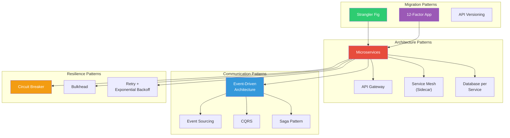
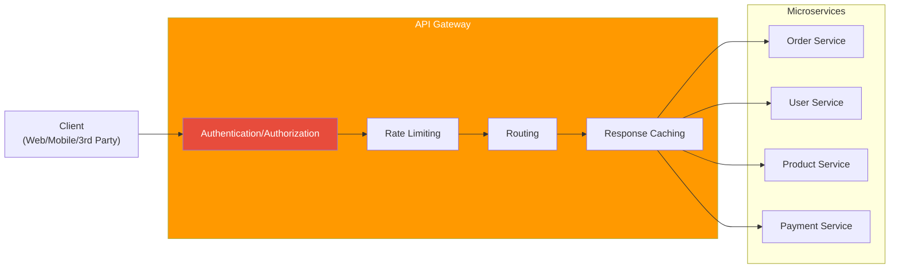
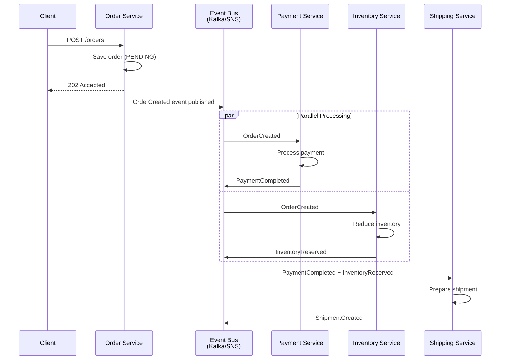
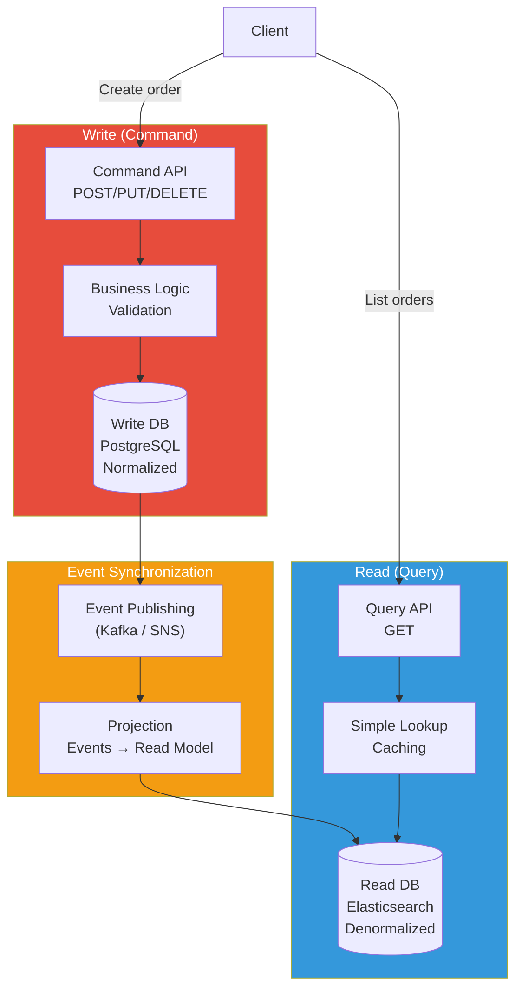
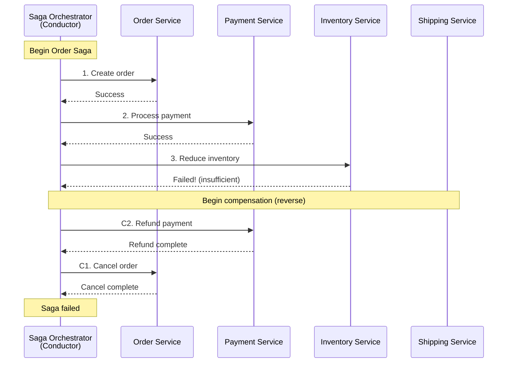
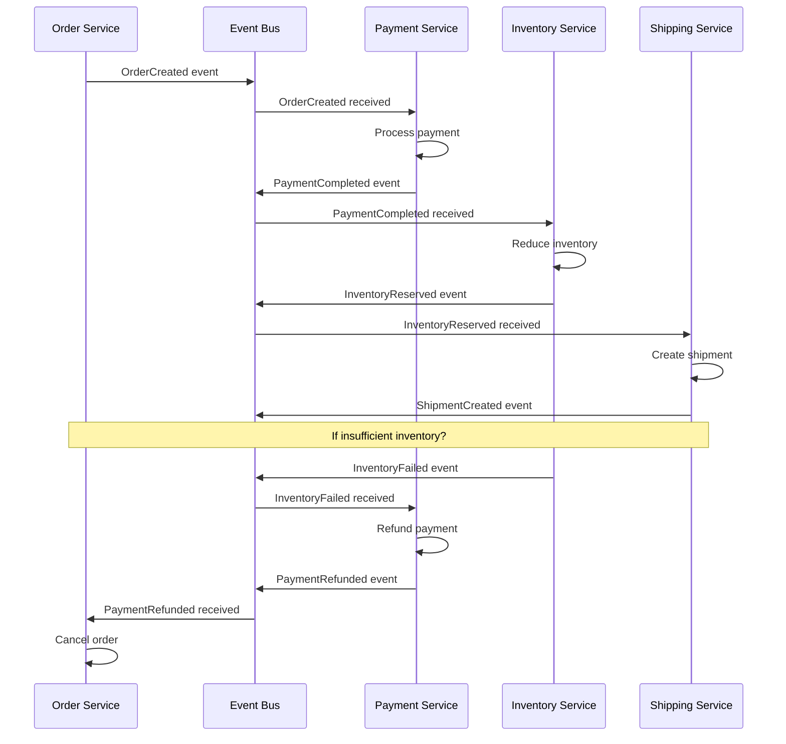
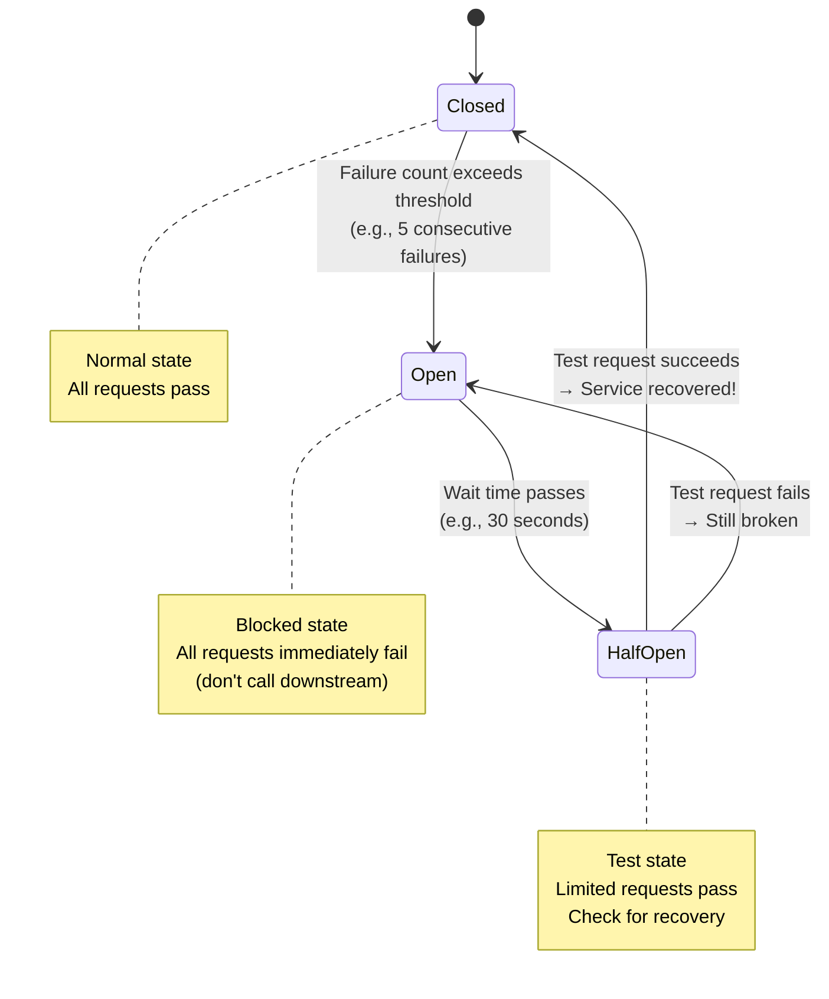
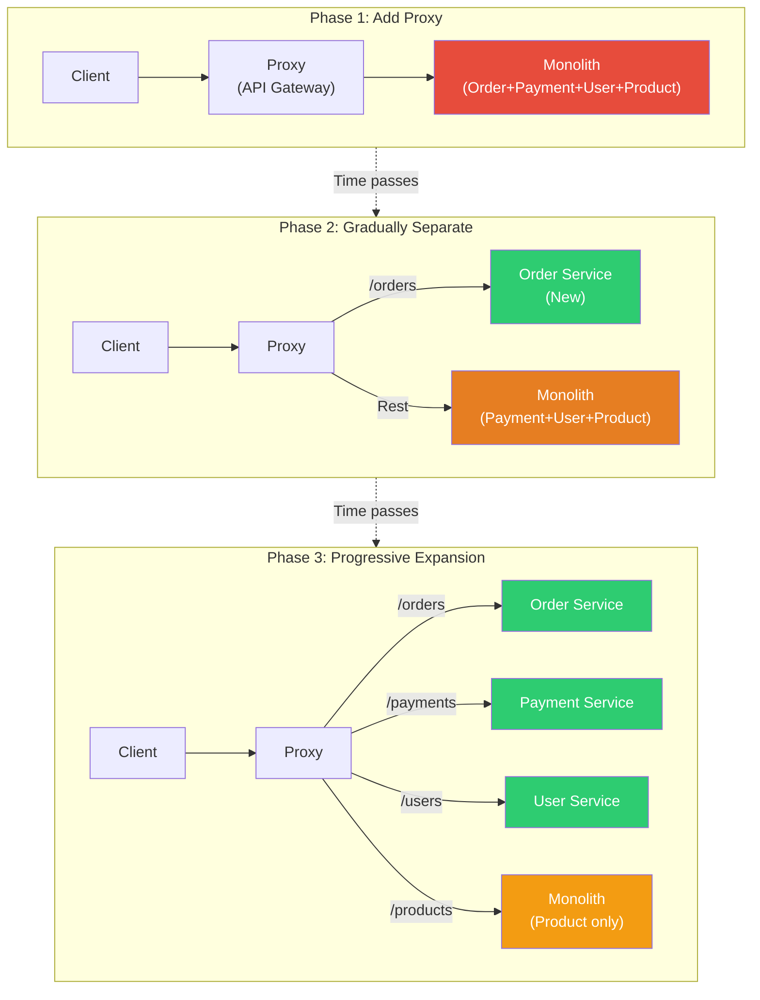
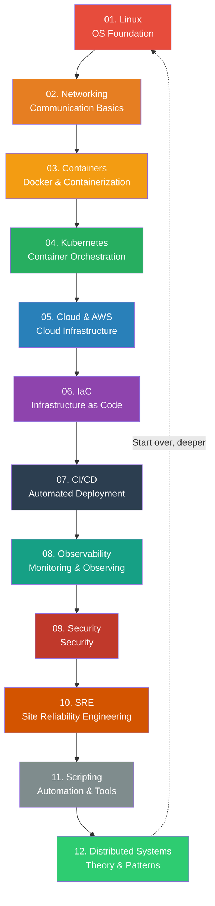

# Distributed Systems Patterns

> In the [previous lecture](./01-theory), we covered the theoretical foundations of distributed systems: CAP theorem, consensus algorithms (Raft), and consistency models. Now we'll apply that theory to **real-world patterns**. Microservices architecture, Event-Driven Architecture, CQRS, Saga, 12-Factor App—all essential patterns for modern distributed system design. This is the **final lecture** in the DevOps roadmap.

---

## 🎯 Why Learn Distributed Systems Patterns?

```
When you need distributed systems patterns:
• "Monolith is too large, deployment freezes everything"        → Microservices separation
• "Order service down, payment and shipping also fail"          → Bulkhead / Circuit Breaker
• "Long transaction: order → payment → inventory → shipping"   → Saga pattern
• "Read traffic 100x write traffic, same DB struggles"         → CQRS
• "Need to track all event history and order"                 → Event Sourcing
• "Want to gradually migrate monolith to microservices"       → Strangler Fig
• "12 containers with different config approaches, ops nightmare" → 12-Factor App
• Interview: "What's the difference between Saga Orchestration vs Choreography?" → This lecture
```

---

## 🧠 Grasping Core Concepts

### Analogy: Distributed System is a Large Shopping Mall

Monolith is like a **1-person shop**. One owner handles all orders, preparation, packaging, delivery. It's fast when small, but becomes impossible with many customers.

Microservices is like a **large shopping mall**. Food courts, clothing stores, movie theaters each operate independently, but from the customer's view, it's one mall.

| Shopping Mall Component | Distributed Systems Pattern | Role |
|---------------|---------------|------|
| **Information Desk** | API Gateway | Single entry point for all requests |
| **Building Management** | Service Mesh | Communication rules, security, monitoring between stores |
| **PA Announcement** | Event-Driven Architecture | "Fire on 3rd floor" → every store hears and responds |
| **Store Safe** | Database per Service | Each store manages its own money |
| **Emergency Shutter** | Circuit Breaker | Block customers from burning building |
| **Firewall Separation** | Bulkhead | Isolate one area so problems don't spread |
| **Mall Remodel** | Strangler Fig | Remodel while operating, floor by floor |

### Pattern Overview Map



---

## 🔍 Detailed Breakdown

### 1. Microservices Architecture Pattern

#### API Gateway Pattern

When clients directly call dozens of microservices, URLs multiply, each needs authentication, and mobile/web requirements differ. **API Gateway** handles all this centrally.

```
API Gateway responsibilities:
• Routing         — /orders → Order Service, /users → User Service
• Authentication/Authorization — Single JWT verification at Gateway
• Rate Limiting   — Request limits per client
• Response Composition — Merge responses from multiple services
• Protocol Translation — External REST ↔ Internal gRPC
• Logging/Monitoring — Centralized request tracking
```



**Popular API Gateway Tools**:

| Tool | Features | Best For |
|------|------|-----------|
| **Kong** | Open-source, rich plugins | General purpose, large scale |
| **AWS API Gateway** | Serverless, Lambda integration | AWS environment |
| **Nginx** | Lightweight, high performance | Simple routing |
| **Envoy** | gRPC support, Service Mesh integration | K8s environment |
| **Spring Cloud Gateway** | Java ecosystem integrated | Spring Boot projects |

> **BFF (Backend For Frontend)** pattern: Separate gateways for mobile and web. Mobile gets less data, web gets rich data—each optimized for its client.

#### Service Mesh / Sidecar Pattern

Detailed in the [Service Mesh lecture](../04-kubernetes/18-service-mesh), but here's the pattern perspective.

**Sidecar pattern**: Each service has a **helper process (proxy)** alongside. Add network features without touching service code.

```
Sidecar handles:
• mTLS (mutual authentication)      — Encrypt service-to-service communication
• Traffic Routing                    — Canary deployments, A/B testing
• Circuit Breaker                    — Block failing services
• Retry / Timeout                    — Auto-retry with timeout
• Distributed Tracing                — Track request flow
• Load Balancing                     — Client-side LB
```

Key Tools:
- **Istio** — Most feature-rich but complex. Good for large orgs
- **Linkerd** — Lightweight and simple. Fast adoption
- **Consul Connect** — Integrates with HashiCorp ecosystem

#### Database per Service Pattern

**Core principle of microservices**: Each service owns its own database.

```
Why separate databases?

Shared DB problems:
• Order Service changes schema → Payment Service affected
• Order Service's heavy queries → User Service becomes slow too
• Can't independently deploy services → Still monolithic

Database separation benefits:
• Each service picks optimal DB (Order=PostgreSQL, Product=MongoDB, Session=Redis)
• Minimize inter-service coupling
• Independent scaling per service
```

| Service | DB Choice | Why |
|---------|---------|------|
| Order Service | PostgreSQL | Transaction integrity critical |
| Product Catalog | MongoDB | Flexible schema, read optimized |
| User Sessions | Redis | Ultra-fast reads/writes |
| Search Service | Elasticsearch | Full-text search |
| Analytics Service | ClickHouse | Massive analytical queries |

> Warning: When databases are separate, **you can't join across services**. Use API Composition or CQRS to solve this.

---

### 2. Event-Driven Architecture (EDA)

We learned [SQS/SNS/Kinesis in messaging lecture](../05-cloud-aws/11-messaging). EDA is the **architecture pattern** built on top of this messaging infrastructure.

#### Core Concept

```
Synchronous (Phone Call):
  Order Service → Call Payment Service → Call Inventory → Call Shipping
  → If any is slow, everything slows. If any fails, all fail.

Asynchronous (Broadcast):
  Order Service → "Order Created" event published
  → Payment Service hears, processes payment
  → Inventory Service hears, reduces stock
  → Shipping Service hears, prepares shipment
  → Each independent, doesn't wait for others
```



#### Event Sourcing

Normal databases store **current state only**. Event Sourcing stores **all state changes as events**.

```
Normal approach (current state only):
  Account balance: 50,000 won

Event Sourcing (all change history):
  1. AccountCreated    → Balance: 0
  2. MoneyDeposited    → +100,000
  3. MoneyWithdrawn    → -30,000
  4. MoneyWithdrawn    → -20,000
  → Current balance: 50,000 (replaying events chronologically)
```

**Event Store** is a dedicated storage for these events.

```python
# Event Sourcing concept (Python)

from dataclasses import dataclass, field
from datetime import datetime
from typing import List

@dataclass
class Event:
    event_type: str
    data: dict
    timestamp: datetime = field(default_factory=datetime.now)
    version: int = 0

class EventStore:
    """Event storage — append-only, never modify/delete"""
    def __init__(self):
        self._events: dict[str, List[Event]] = {}

    def append(self, aggregate_id: str, event: Event):
        """Add event (only append, never modify!)"""
        if aggregate_id not in self._events:
            self._events[aggregate_id] = []
        event.version = len(self._events[aggregate_id]) + 1
        self._events[aggregate_id].append(event)

    def get_events(self, aggregate_id: str) -> List[Event]:
        """Get all events for specific entity"""
        return self._events.get(aggregate_id, [])

class BankAccount:
    """Aggregate — replay events to construct current state"""
    def __init__(self, account_id: str):
        self.account_id = account_id
        self.balance = 0
        self.is_open = False

    def apply(self, event: Event):
        """Apply single event to update state"""
        if event.event_type == "AccountOpened":
            self.is_open = True
            self.balance = 0
        elif event.event_type == "MoneyDeposited":
            self.balance += event.data["amount"]
        elif event.event_type == "MoneyWithdrawn":
            self.balance -= event.data["amount"]

    @classmethod
    def rebuild_from_events(cls, account_id: str, events: List[Event]):
        """Replay events chronologically → reconstruct current state"""
        account = cls(account_id)
        for event in events:
            account.apply(event)
        return account

# Usage
store = EventStore()
store.append("ACC-001", Event("AccountOpened", {}))
store.append("ACC-001", Event("MoneyDeposited", {"amount": 100000}))
store.append("ACC-001", Event("MoneyWithdrawn", {"amount": 30000}))
store.append("ACC-001", Event("MoneyWithdrawn", {"amount": 20000}))

# Reconstruct current state by replaying
events = store.get_events("ACC-001")
account = BankAccount.rebuild_from_events("ACC-001", events)
print(f"Current balance: {account.balance:,} won")  # 50,000
```

**Event Sourcing Pros/Cons**:

| Pros | Cons |
|------|------|
| Complete audit trail | Event schema changes are hard |
| Time travel — recover past state | Event replay can be slow → need Snapshot |
| Bugs reproducible via event replay | Steep learning curve |
| Easy to share events with other systems | Requires understanding Eventual Consistency |

---

### 3. CQRS (Command Query Responsibility Segregation)

Simply put: **Separate write (Command) and read (Query) operations**.

```
Why separate?

Normal systems:
• Writes: Complex business logic, validation, transactions
• Reads: Multi-table JOINs, various views, 90% of traffic

Problem:
• Optimize reads → writes get slower
• Optimize writes → reads become complex
• Can't satisfy both with one model

Solution:
• Write model (Command): Optimized for business logic
• Read model (Query): Optimized for read speed
• Can use different databases!
```



**CQRS + Event Sourcing is powerful because:**
- Event Sourcing stores all changes
- Projection converts events to read models
- Read models can be multiple (search, reporting, dashboard...)

```
Warning: CQRS isn't for everything!

Good fit:
✅ Read/write ratio is extreme (reads >> writes)
✅ Read model needs data from multiple services
✅ Already using Event Sourcing

Not needed:
❌ Simple CRUD application
❌ Read/write ratio balanced
❌ Small team with limited capacity
```

---

### 4. Saga Pattern

How do you handle **transactions across multiple services** in microservices? Traditional distributed transactions (2PC) are slow and create bottlenecks. Saga solves this with **chains of local transactions**.

```
Order processing Saga example:

Normal flow:
  T1: Create order → T2: Process payment → T3: Reduce inventory → T4: Create shipment

Failure triggers compensation (reverse order):
  T3 fails → C2: Refund payment → C1: Cancel order

Key: Each step (Ti) has a matching compensation (Ci)
```

#### Orchestration (Orchestrator-driven)

A **central coordinator** manages the entire flow. Like an **orchestra conductor** telling each instrument "Now play!".



#### Choreography (Event-driven)

No central coordinator. Each service hears events and **acts independently**. Like **dancers** watching each other and deciding their next move.



#### Orchestration vs Choreography

| Aspect | Orchestration | Choreography |
|--------|-------------|-------------|
| **Central Control** | Orchestrator manages all | None, services autonomous |
| **Visibility** | Full flow visible in one place | Flow distributed across services |
| **Coupling** | Orchestrator knows all services | Services loosely coupled |
| **Complexity** | Manageable even with many steps | Hard to trace beyond 3-4 steps |
| **Single Point of Failure** | Orchestrator is SPOF | No single point |
| **Best Use** | Complex business workflows | Simple event chains |
| **Tools** | AWS Step Functions, Temporal, Camunda | Kafka, SNS/SQS, EventBridge |

> **Practical Tip**: If 3 steps or less and simple, use Choreography. If 4+ steps or complex logic, use Orchestration. Many teams start with Choreography, then migrate to Orchestration as complexity grows.

---

### 5. Resilience Patterns

#### Circuit Breaker

Think of your home **electrical circuit breaker**. Overload → automatically cut power to prevent fire. Circuit Breaker **automatically blocks calls** to failing services.



**Circuit Breaker Configuration with Resilience4j (Java) and Istio (K8s)**:

```java
// Resilience4j — Configure Circuit Breaker in Java/Spring Boot
import io.github.resilience4j.circuitbreaker.CircuitBreakerConfig;
import io.github.resilience4j.circuitbreaker.CircuitBreaker;
import java.time.Duration;

CircuitBreakerConfig config = CircuitBreakerConfig.custom()
    .failureRateThreshold(50)           // 50% failure rate → Open
    .waitDurationInOpenState(Duration.ofSeconds(30))  // 30s wait then Half-Open
    .slidingWindowSize(10)              // Judge based on last 10 calls
    .minimumNumberOfCalls(5)            // Need at least 5 calls to judge
    .permittedNumberOfCallsInHalfOpenState(3) // 3 test calls in Half-Open
    .build();

CircuitBreaker circuitBreaker = CircuitBreaker.of("paymentService", config);

// Usage
String result = circuitBreaker.executeSupplier(() -> {
    return paymentService.processPayment(order);
});
```

```yaml
# Istio DestinationRule — Configure Circuit Breaker in K8s
apiVersion: networking.istio.io/v1beta1
kind: DestinationRule
metadata:
  name: payment-service-cb
spec:
  host: payment-service
  trafficPolicy:
    connectionPool:
      tcp:
        maxConnections: 100           # Max simultaneous connections
      http:
        h2UpgradePolicy: DEFAULT
        http1MaxPendingRequests: 50   # Max queue size
        http2MaxRequests: 100         # Max simultaneous requests
    outlierDetection:                  # Istio's Circuit Breaker
      consecutive5xxErrors: 5          # 5 consecutive 5xx → remove
      interval: 10s                    # Check every 10s
      baseEjectionTime: 30s            # Remove for 30s
      maxEjectionPercent: 50           # Remove max 50% of instances
```

#### Bulkhead Pattern

A ship's **bulkhead** (compartment wall) prevents water from spreading if one section is breached. Similarly, **isolate resources** so one service's problems don't drain everything.

```
Bulkhead isolation:

Thread Pool Bulkhead:
• Payment service calls → dedicated 10 threads
• Inventory service calls → dedicated 10 threads
• Shipping service calls → dedicated 5 threads
→ Payment slowdown → Only payment threads blocked
→ Inventory/shipping unaffected!

Semaphore Bulkhead:
• Limit concurrent calls for resource
• Lighter-weight isolation
```

```java
// Resilience4j Bulkhead Configuration
BulkheadConfig config = BulkheadConfig.custom()
    .maxConcurrentCalls(10)              // Max 10 simultaneous calls
    .maxWaitDuration(Duration.ofMillis(500)) // Max 500ms wait
    .build();

Bulkhead bulkhead = Bulkhead.of("paymentService", config);

// Combine Circuit Breaker + Bulkhead + Retry
Supplier<String> decoratedSupplier = Decorators.ofSupplier(() ->
        paymentService.processPayment(order))
    .withCircuitBreaker(circuitBreaker)
    .withBulkhead(bulkhead)
    .withRetry(retry)
    .decorate();
```

#### Retry with Exponential Backoff

Fail → wait, then retry. But don't retry immediately—wait **progressively longer** intervals. This gives the broken service time to recover.

```
Simple retry problem:
  Fail → Retry immediately → Fail → Retry immediately → ...
  → Bombard broken service with requests → Can't recover

Exponential Backoff:
  1st failure → Wait 1s → retry
  2nd failure → Wait 2s → retry
  3rd failure → Wait 4s → retry
  4th failure → Wait 8s → retry
  → Give service recovery time

+ Jitter (randomness):
  1st: 1s + random(0~500ms)
  2nd: 2s + random(0~500ms)
  3rd: 4s + random(0~500ms)
  → Prevent "Thundering Herd" (all clients retry simultaneously)
```

```python
# Python — Exponential Backoff with Jitter
import time
import random
import requests
from functools import wraps

def retry_with_backoff(max_retries=5, base_delay=1.0, max_delay=60.0):
    """Exponential Backoff + Jitter decorator"""
    def decorator(func):
        @wraps(func)
        def wrapper(*args, **kwargs):
            for attempt in range(max_retries):
                try:
                    return func(*args, **kwargs)
                except Exception as e:
                    if attempt == max_retries - 1:
                        raise  # Last attempt, raise exception

                    # Exponential Backoff + Full Jitter
                    delay = min(base_delay * (2 ** attempt), max_delay)
                    jitter = random.uniform(0, delay)
                    actual_delay = jitter

                    print(f"[Attempt {attempt + 1}/{max_retries}] "
                          f"Failed: {e}. Retry in {actual_delay:.1f}s...")
                    time.sleep(actual_delay)
        return wrapper
    return decorator

@retry_with_backoff(max_retries=5, base_delay=1.0)
def call_payment_service(order_id):
    """Call payment service (auto-retry on failure)"""
    response = requests.post(
        "https://payment-service/api/v1/charge",
        json={"order_id": order_id},
        timeout=5
    )
    response.raise_for_status()
    return response.json()
```

---

### 6. Strangler Fig Pattern (Monolith → Microservices Transition)

The **strangler fig tree** wraps around a large tree and gradually takes its place. This pattern lets you **progressively replace a monolith** while still operating it.

```
Big Bang Migration (Risky!):
  Monday: Monolith running
  Friday: "Switch to microservices!" → Complete replacement
  → Very high failure risk, hard to rollback

Strangler Fig (Safe!):
  Month 1: 100% Monolith / 0% Microservices
  Month 3: Extract "Order" → Monolith 80% / Microservices 20%
  Month 6: Extract "Payment" → Monolith 60% / Microservices 40%
  Month 12: Extract "User" → Monolith 40% / Microservices 60%
  → Gradual transition, easy rollback per feature
```



**Practical Migration Checklist**:

```
Step 1: Install Proxy (API Gateway)
  → Route all traffic through proxy
  → Currently 100% routes to monolith

Step 2: Extract Most Independent Feature
  → Choose feature with fewest dependencies
  → Example: Notification Service, Auth Service

Step 3: Shift Proxy Routing
  → Redirect new service traffic via proxy
  → Use canary deployment: 10% → 50% → 100%

Step 4: Cleanup Monolith
  → Remove migrated code from monolith
  → Separate shared database tables

Step 5: Repeat
  → Next feature
```

---

### 7. 12-Factor App

**12 principles for cloud-native applications** created by Heroku co-founders in 2012. Still the standard for container/K8s environments today.

| # | Factor | One-line | Practical Example |
|---|--------|---------|---------|
| 1 | **Codebase** | One codebase, multiple deploys | One Git repo → dev/staging/prod |
| 2 | **Dependencies** | Explicitly declared | `requirements.txt`, `package.json` |
| 3 | **Config** | Via environment variables | `DATABASE_URL=...` (never hardcode) |
| 4 | **Backing Services** | Treat as attached resources | DB, Redis, S3 as URLs (replaceable) |
| 5 | **Build, Release, Run** | Separate stages | Docker build → tag → run |
| 6 | **Processes** | Stateless processes | Sessions in Redis, files in S3 |
| 7 | **Port Binding** | Export service via port binding | `app.listen(8080)` |
| 8 | **Concurrency** | Scale via process model | Horizontal scaling (more Pods) |
| 9 | **Disposability** | Fast startup, Graceful Shutdown | K8s preStop hook, SIGTERM handling |
| 10 | **Dev/Prod Parity** | Same everywhere | Docker Compose for local env |
| 11 | **Logs** | Events to stdout | Output logs → Fluentbit collects |
| 12 | **Admin Processes** | Same environment | `kubectl exec` for migrations |

```yaml
# 12-Factor App K8s Deployment Example
apiVersion: apps/v1
kind: Deployment
metadata:
  name: order-service
spec:
  replicas: 3                          # Factor 8: Concurrency (scale horizontally)
  selector:
    matchLabels:
      app: order-service
  template:
    metadata:
      labels:
        app: order-service
    spec:
      containers:
      - name: order-service
        image: myregistry/order-service:v1.2.3   # Factor 5: Build, Release, Run
        ports:
        - containerPort: 8080                     # Factor 7: Port Binding

        env:                                       # Factor 3: Config (environment vars)
        - name: DATABASE_URL
          valueFrom:
            secretKeyRef:
              name: order-db-secret
              key: url
        - name: REDIS_URL                          # Factor 4: Backing Services
          value: "redis://redis-service:6379"
        - name: LOG_LEVEL
          value: "info"

        livenessProbe:                             # Factor 9: Disposability
          httpGet:
            path: /healthz
            port: 8080
          initialDelaySeconds: 5
          periodSeconds: 10

        lifecycle:                                 # Factor 9: Graceful Shutdown
          preStop:
            exec:
              command: ["/bin/sh", "-c", "sleep 5"]

        resources:
          requests:
            memory: "256Mi"
            cpu: "250m"
          limits:
            memory: "512Mi"
            cpu: "500m"
```

---

### 8. API Versioning & Backward Compatibility

**Modify APIs without breaking existing clients** in microservices.

```
API versioning strategies:

1. URI versioning (most common):
   GET /api/v1/orders
   GET /api/v2/orders     ← New version

2. Header versioning:
   Accept: application/vnd.myapp.v2+json

3. Query Parameter versioning:
   GET /api/orders?version=2
```

**Backward Compatibility Rules**:

```
Safe Changes (don't break existing clients):
✅ Add new field to response
✅ Add optional parameter
✅ Add new endpoint
✅ Add new enum value (client handles unknown)

Breaking Changes (clients might break):
❌ Remove or rename existing field
❌ Change field type (string → int)
❌ Add required parameter
❌ Change URL structure
❌ Change HTTP status codes
→ Need new version (v2) for these!
```

**Deprecation Process**:

```
1. Release v2 → Add headers to v1
   Sunset: Sat, 31 Dec 2025 23:59:59 GMT
   Deprecation: true

2. Notify v1 users (minimum 3-6 months advance notice)

3. Monitor v1 traffic → Wait for near-zero usage

4. Decommission v1
```

---

## 💻 Hands-on Practice

### Practice 1: Build Simple Saga Orchestrator (Python)

```python
"""
Simple Saga Orchestrator Implementation

Real systems use Temporal, AWS Step Functions, etc.,
but here we implement the core concept.
"""
from dataclasses import dataclass
from typing import Callable, List, Optional
from enum import Enum

class SagaStepStatus(Enum):
    PENDING = "pending"
    COMPLETED = "completed"
    COMPENSATED = "compensated"
    FAILED = "failed"

@dataclass
class SagaStep:
    name: str
    action: Callable                    # Function to execute
    compensation: Callable              # Rollback function
    status: SagaStepStatus = SagaStepStatus.PENDING

class SagaOrchestrator:
    """Saga Pattern Orchestrator"""

    def __init__(self, name: str):
        self.name = name
        self.steps: List[SagaStep] = []
        self.completed_steps: List[SagaStep] = []

    def add_step(self, name: str, action: Callable, compensation: Callable):
        """Add Saga step"""
        self.steps.append(SagaStep(name=name, action=action, compensation=compensation))

    def execute(self, context: dict) -> bool:
        """Execute Saga — auto-compensate on failure"""
        print(f"\n{'='*50}")
        print(f"Saga '{self.name}' starting")
        print(f"{'='*50}")

        for step in self.steps:
            try:
                print(f"\n[Execute] {step.name}...")
                step.action(context)
                step.status = SagaStepStatus.COMPLETED
                self.completed_steps.append(step)
                print(f"[Success] {step.name} complete")

            except Exception as e:
                print(f"\n[Failed] {step.name}: {e}")
                step.status = SagaStepStatus.FAILED
                self._compensate(context)
                return False

        print(f"\n{'='*50}")
        print(f"Saga '{self.name}' succeeded!")
        print(f"{'='*50}")
        return True

    def _compensate(self, context: dict):
        """Execute compensation (reverse completed steps)"""
        print(f"\n--- Compensation (reverse order) ---")
        for step in reversed(self.completed_steps):
            try:
                print(f"[Compensation] {step.name} rolling back...")
                step.compensation(context)
                step.status = SagaStepStatus.COMPENSATED
                print(f"[Compensation Done] {step.name}")
            except Exception as e:
                print(f"[Compensation Failed] {step.name}: {e} — manual intervention needed!")
        print(f"--- Compensation Complete ---")


# === Define service actions and compensations ===

def create_order(ctx):
    ctx["order_id"] = "ORD-12345"
    print(f"  Order created: {ctx['order_id']}")

def cancel_order(ctx):
    print(f"  Order cancelled: {ctx['order_id']}")
    del ctx["order_id"]

def process_payment(ctx):
    ctx["payment_id"] = "PAY-67890"
    print(f"  Payment processed: {ctx['payment_id']} (50,000 won)")

def refund_payment(ctx):
    print(f"  Payment refunded: {ctx['payment_id']}")
    del ctx["payment_id"]

def reserve_inventory(ctx):
    # Simulate insufficient inventory failure
    available_stock = 0  # 0 items
    if available_stock <= 0:
        raise Exception("Insufficient inventory! Available: 0")
    ctx["inventory_reserved"] = True

def release_inventory(ctx):
    print(f"  Inventory restored")
    ctx["inventory_reserved"] = False

def create_shipment(ctx):
    ctx["shipment_id"] = "SHIP-11111"
    print(f"  Shipment created: {ctx['shipment_id']}")

def cancel_shipment(ctx):
    print(f"  Shipment cancelled: {ctx['shipment_id']}")
    del ctx["shipment_id"]


# === Run Saga ===

saga = SagaOrchestrator("Order Processing Saga")
saga.add_step("Create Order", create_order, cancel_order)
saga.add_step("Process Payment", process_payment, refund_payment)
saga.add_step("Reserve Inventory", reserve_inventory, release_inventory)
saga.add_step("Create Shipment", create_shipment, cancel_shipment)

context = {"customer_id": "CUST-001", "amount": 50000}
result = saga.execute(context)

print(f"\nFinal result: {'Success' if result else 'Failed (all rolled back)'}")
print(f"Context: {context}")
```

**Output**:
```
==================================================
Saga 'Order Processing Saga' starting
==================================================

[Execute] Create Order...
  Order created: ORD-12345
[Success] Create Order complete

[Execute] Process Payment...
  Payment processed: PAY-67890 (50,000 won)
[Success] Process Payment complete

[Execute] Reserve Inventory...

[Failed] Reserve Inventory: Insufficient inventory! Available: 0

--- Compensation (reverse order) ---
[Compensation] Process Payment rolling back...
  Payment refunded: PAY-67890
[Compensation Done] Process Payment
[Compensation] Create Order rolling back...
  Order cancelled: ORD-12345
[Compensation Done] Create Order
--- Compensation Complete ---

Final result: Failed (all rolled back)
```

### Practice 2: Circuit Breaker Implementation

```python
"""
Circuit Breaker Pattern Implementation

States: Closed → Open → Half-Open → Closed
"""
import time
import random
from enum import Enum
from threading import Lock

class CircuitState(Enum):
    CLOSED = "CLOSED"          # Normal — requests pass
    OPEN = "OPEN"              # Blocked — requests fail immediately
    HALF_OPEN = "HALF_OPEN"    # Test — limited requests pass

class CircuitBreakerOpenError(Exception):
    """Exception when Circuit Breaker is Open"""
    pass

class CircuitBreaker:
    def __init__(
        self,
        name: str,
        failure_threshold: int = 5,     # Failures before Open
        recovery_timeout: float = 30.0, # Open duration before Half-Open
        half_open_max_calls: int = 3    # Test calls in Half-Open
    ):
        self.name = name
        self.failure_threshold = failure_threshold
        self.recovery_timeout = recovery_timeout
        self.half_open_max_calls = half_open_max_calls

        self._state = CircuitState.CLOSED
        self._failure_count = 0
        self._success_count = 0
        self._last_failure_time = 0
        self._half_open_calls = 0
        self._lock = Lock()

    @property
    def state(self) -> CircuitState:
        """Check state (auto-transition Open → Half-Open)"""
        if self._state == CircuitState.OPEN:
            elapsed = time.time() - self._last_failure_time
            if elapsed >= self.recovery_timeout:
                self._state = CircuitState.HALF_OPEN
                self._half_open_calls = 0
                print(f"  [{self.name}] OPEN → HALF_OPEN (timeout passed)")
        return self._state

    def call(self, func, *args, **kwargs):
        """Protected function call"""
        with self._lock:
            current_state = self.state

            if current_state == CircuitState.OPEN:
                raise CircuitBreakerOpenError(
                    f"[{self.name}] Circuit OPEN — requests blocked"
                )

            if current_state == CircuitState.HALF_OPEN:
                if self._half_open_calls >= self.half_open_max_calls:
                    raise CircuitBreakerOpenError(
                        f"[{self.name}] HALF_OPEN test limit exceeded"
                    )
                self._half_open_calls += 1

        # Call outside lock
        try:
            result = func(*args, **kwargs)
            self._on_success()
            return result
        except CircuitBreakerOpenError:
            raise
        except Exception as e:
            self._on_failure()
            raise

    def _on_success(self):
        """Successful call"""
        with self._lock:
            if self._state == CircuitState.HALF_OPEN:
                self._success_count += 1
                if self._success_count >= self.half_open_max_calls:
                    self._state = CircuitState.CLOSED
                    self._failure_count = 0
                    self._success_count = 0
                    print(f"  [{self.name}] HALF_OPEN → CLOSED (recovered!)")
            else:
                self._failure_count = 0  # Reset consecutive failure count

    def _on_failure(self):
        """Failed call"""
        with self._lock:
            self._failure_count += 1
            self._last_failure_time = time.time()

            if self._state == CircuitState.HALF_OPEN:
                self._state = CircuitState.OPEN
                self._success_count = 0
                print(f"  [{self.name}] HALF_OPEN → OPEN (test failed)")
            elif self._failure_count >= self.failure_threshold:
                self._state = CircuitState.OPEN
                print(f"  [{self.name}] CLOSED → OPEN "
                      f"(failures: {self._failure_count})")


# === Simulation ===

def unreliable_service():
    """70% failure rate"""
    if random.random() < 0.7:
        raise Exception("No response")
    return "Success!"

cb = CircuitBreaker("PaymentService", failure_threshold=3, recovery_timeout=5)

print("=== Circuit Breaker Simulation ===\n")
for i in range(15):
    try:
        result = cb.call(unreliable_service)
        print(f"Request {i+1}: {result} (state: {cb.state.value})")
    except CircuitBreakerOpenError as e:
        print(f"Request {i+1}: BLOCKED! (state: {cb.state.value})")
    except Exception as e:
        print(f"Request {i+1}: FAILED — {e} (state: {cb.state.value})")

    time.sleep(1)
```

### Practice 3: 12-Factor App Health Check Script

```bash
#!/bin/bash
# Check 12-Factor App Compliance

echo "============================================"
echo "  12-Factor App Compliance Check"
echo "============================================"

SCORE=0
TOTAL=12

# Factor 1: Codebase
echo ""
echo "[1/12] Codebase — Check Git repository"
if [ -d ".git" ]; then
    echo "  ✅ Git repository found"
    SCORE=$((SCORE + 1))
else
    echo "  ❌ No Git repository"
fi

# Factor 2: Dependencies
echo "[2/12] Dependencies — Check dependencies file"
if [ -f "requirements.txt" ] || [ -f "package.json" ] || [ -f "go.mod" ] || [ -f "pom.xml" ]; then
    echo "  ✅ Dependencies file found"
    SCORE=$((SCORE + 1))
else
    echo "  ❌ No dependencies file"
fi

# Factor 3: Config
echo "[3/12] Config — Check for hardcoded config"
HARDCODED=$(grep -r "localhost\|127.0.0.1\|password.*=" --include="*.py" --include="*.js" --include="*.ts" --include="*.java" . 2>/dev/null | grep -v "node_modules\|venv\|.git\|test" | wc -l)
if [ "$HARDCODED" -lt 3 ]; then
    echo "  ✅ Minimal hardcoding ($HARDCODED instances)"
    SCORE=$((SCORE + 1))
else
    echo "  ⚠️  Hardcoded config found ($HARDCODED instances) — use environment variables"
fi

# Factor 5: Build, Release, Run
echo "[5/12] Build, Release, Run — Check Docker setup"
if [ -f "Dockerfile" ] || [ -f "docker-compose.yml" ]; then
    echo "  ✅ Docker setup found"
    SCORE=$((SCORE + 1))
else
    echo "  ❌ No Docker setup"
fi

# Factor 6: Processes
echo "[6/12] Processes — Check local state"
LOCAL_STATE=$(grep -r "open(\|write_file\|session\[" --include="*.py" --include="*.js" . 2>/dev/null | grep -v "node_modules\|venv\|.git\|test\|log" | wc -l)
if [ "$LOCAL_STATE" -lt 5 ]; then
    echo "  ✅ Minimal local state ($LOCAL_STATE instances)"
    SCORE=$((SCORE + 1))
else
    echo "  ⚠️  Local file/session storage found ($LOCAL_STATE instances)"
fi

# Factor 9: Disposability
echo "[9/12] Disposability — Check Graceful Shutdown"
GRACEFUL=$(grep -r "SIGTERM\|SIGINT\|graceful\|shutdown" --include="*.py" --include="*.js" --include="*.go" --include="*.java" . 2>/dev/null | grep -v "node_modules\|venv\|.git" | wc -l)
if [ "$GRACEFUL" -gt 0 ]; then
    echo "  ✅ Graceful Shutdown handler found ($GRACEFUL instances)"
    SCORE=$((SCORE + 1))
else
    echo "  ⚠️  No Graceful Shutdown handler"
fi

# Factor 11: Logs
echo "[11/12] Logs — Check stdout logging"
STDOUT_LOG=$(grep -r "print\|console.log\|log.Info\|logger" --include="*.py" --include="*.js" --include="*.go" . 2>/dev/null | grep -v "node_modules\|venv\|.git" | wc -l)
if [ "$STDOUT_LOG" -gt 0 ]; then
    echo "  ✅ stdout logging used ($STDOUT_LOG instances)"
    SCORE=$((SCORE + 1))
else
    echo "  ⚠️  No logging code"
fi

echo ""
echo "============================================"
echo "  Result: $SCORE / $TOTAL (checkable items)"
echo "============================================"
```

---

## 🏢 In Practice

### Scenario 1: E-commerce Platform Architecture

```
Requirements:
• 1M orders/day
• 10x traffic during Black Friday
• 99.9% availability SLA
• Real-time inventory management

Applied Patterns:
1. Microservices — Order, Payment, Inventory, Shipping, User services
2. API Gateway — Kong for single entry point + Rate Limiting
3. CQRS — Product catalog: write via PostgreSQL, read via Elasticsearch
4. Saga (Orchestration) — Order workflow via AWS Step Functions
5. Circuit Breaker — External payment provider integration protected
6. Event-Driven — Order events → Kafka → Inventory/Shipping/Notifications
7. Bulkhead — Dedicated connection pool for payment service
```

### Scenario 2: Real Legacy Migration Timeline

```
Current: 10-year-old monolith (Spring MVC + Oracle DB, 1M lines)
Goal: Gradual microservices migration

Month 1: Preparation
  → Install Kong API Gateway, all traffic via proxy
  → Identify service boundaries (DDD Bounded Contexts)
  → Set up monitoring (Prometheus + Grafana)

Month 3: First Service Extraction (Notification)
  → Strangler Fig: Extract just notification feature
  → Event: Kafka for async communication
  → Monolith: Keep notification as fallback

Month 6: Auth Service Extraction
  → OAuth2 + JWT-based auth service
  → API Gateway: JWT validation
  → Monolith: Session → JWT migration

Month 9: Order Service Extraction (Core)
  → Most complex, critical domain
  → Saga pattern for workflow management
  → Database per Service (PostgreSQL)
  → CQRS for order query optimization

Month 12: Payment/Inventory Extraction
  → Circuit Breaker + Retry for PG integration
  → Event Sourcing for inventory changes

Month 18: Monolith Minimization
  → Legacy functions remain in monolith
  → New features: microservices only
```

### Scenario 3: Pattern Impact During Incident

```
Incident: Payment provider down for 3 minutes

Without patterns:
  → Order service threads waiting for payment
  → All order threads exhaust
  → Order service unresponsive
  → Product/cart also fail (cascading)
  → Total downtime: 30 minutes
  → Revenue loss: millions

With patterns (Circuit Breaker + Bulkhead + Retry):
  → Circuit Breaker: After 5 failures → block payment calls
  → Bulkhead: Only payment threads affected, others continue
  → User feedback: "Payment temporarily unavailable, try later"
  → Product/cart/search: Still working
  → Provider recovery: Circuit → Half-Open → Closed (auto-recovery)
  → Downtime: 0 minutes, only 3-minute payment delay
```

### Technology Selection

| Pattern | Tool/Framework | Suitable Scale |
|---------|---------------|-----------|
| API Gateway | Kong, AWS API Gateway, Envoy | All sizes |
| Service Mesh | Istio, Linkerd, Consul Connect | 10+ services |
| Event Bus | Kafka, AWS SNS/SQS, RabbitMQ | Event-driven systems |
| Saga Orchestration | Temporal, AWS Step Functions, Camunda | Complex workflows |
| Circuit Breaker | Resilience4j(Java), Polly(.NET), Istio | External integrations |
| Event Store | EventStoreDB, Kafka(log-based), DynamoDB Streams | Event Sourcing adoption |
| CQRS Read DB | Elasticsearch, Redis, DynamoDB | High read traffic |

---

## ⚠️ Common Mistakes

### Mistake 1: Microservices from Day One

```
❌ "Let's do microservices like Netflix!"
  → Team: 3 people, Services: 15
  → Complexity explodes
  → Debugging distributed system hell
  → End up with "distributed monolith"

✅ Right approach:
  → Start with monolith (Modular Monolith)
  → Wait for clear domain boundaries
  → Extract when you "need to"
  → Martin Fowler: "Monolith First"
```

### Mistake 2: Creating Distributed Monolith

```
❌ Claiming "microservices" but reality:
  → All services share one database
  → Deploying Service A requires B, C also
  → 10-step synchronous call chain
  → Slower and more complex than monolith

✅ Real microservices checklist:
  → Can independently deploy each service? (Yes → Pass)
  → One service dies, others survive? (Yes → Pass)
  → Each service owns its database? (Yes → Pass)
  → Any No? → You have a Distributed Monolith
```

### Mistake 3: Event Sourcing Everywhere

```
❌ "Event Sourcing is cool, let's use everywhere!"
  → Simple CRUD becomes complex Event Sourcing
  → Development speed drops
  → Event schema changes nightmare
  → Team's learning curve drains productivity

✅ Event Sourcing only where needed:
  → Audit trail legally required (Finance)
  → Time travel (restore past state) needed
  → Complex business event flows (core domain)
  → Otherwise: Regular CRUD is fine!
```

### Mistake 4: Sloppy Saga Compensation

```
❌ Compensation transaction mistakes:
  → Not idempotent: Running compensation 2x = 2x refunds!
  → No failure handling: Payment done but order not canceled → inconsistent data
  → No timeout: Compensation waits forever

✅ Compensation checklist:
  → All compensation idempotent (N calls = 1 call result)
  → Failure → retry + DLQ
  → Timeout required
  → Monitoring/alerts for failures (critical!)
```

### Mistake 5: Circuit Breaker Tuning by Guessing

```
❌ Wrong config:
  → 1 failure → Open (normal blips trigger it)
  → 5m wait → Service recovers but still blocked
  → No monitoring → Settings never adjusted

✅ Right approach:
  → Measure baseline error rate first
  → Set threshold to 2-3x baseline
  → Wait time based on downstream recovery time
  → Monitor in production, adjust regularly
  → Grafana dashboard showing CB state essential
```

---

## 📝 Conclusion

### Pattern Selection Guide (Decision Tree)

```
How many services?
├─ 1 (Monolith) → Apply 12-Factor App → Extend with Strangler Fig
├─ 2~5 → API Gateway + Circuit Breaker + Retry
├─ 5~20 → + Event-Driven + Saga + Database per Service
└─ 20+ → + Service Mesh + CQRS + Event Sourcing (selective)
```

### Core Summary

| Pattern | Problem Solved | Core Idea | Watch Out |
|---------|-------------|---------|---------|
| **API Gateway** | Client-service coupling | Single entry + cross-cutting concerns | Don't become bottleneck, need HA |
| **Service Mesh** | Service communication mgmt | Apply network policy outside code | Overhead if services < 10 |
| **Database per Service** | Service DB coupling | Each service owns its DB | No cross-service JOINs |
| **EDA** | Sync call chains | Async event communication | Eventual consistency needed |
| **Event Sourcing** | State change tracking | Store events, replay for state | Not all domains need it |
| **CQRS** | Read/write optimization conflict | Split read and write models | Over-engineering for simple CRUD |
| **Saga** | Distributed transactions | Local transaction + compensation | Idempotent compensation critical |
| **Circuit Breaker** | Cascading failures | Fail-fast + auto-recovery | Threshold tuning is art not science |
| **Bulkhead** | Resource exhaustion spread | Resource isolation | Granular isolation design matters |
| **Retry + Backoff** | Transient failures | Exponential wait + jitter | Prevent Thundering Herd |
| **Strangler Fig** | Monolith replacement | Gradual migration | Choose independent feature first |
| **12-Factor App** | Cloud incompatibility | 12 principles for cloud-native | Principles not rules |

### Interview Top 5 Q&A

```
Q1: "What's the difference between Saga Orchestration and Choreography?"
A: Orchestration has central coordinator managing flow;
   Choreography: services respond to events independently.
   Complex workflow → Orchestration; Simple chain → Choreography.

Q2: "Why use CQRS? What are the downsides?"
A: Separate read/write models per DB type.
   Downside: Eventual consistency (read lag) + complexity increase.

Q3: "Explain 3 Circuit Breaker states"
A: Closed (normal), Open (blocked), Half-Open (testing).
   Closed→Open on threshold, Open→Half-Open after timeout,
   Half-Open→Closed if test succeeds or Open if test fails.

Q4: "How do you migrate monolith to microservices?"
A: Strangler Fig: API Gateway → Gradually extract services.
   Start with independent feature, progressive traffic shift,
   never Big Bang replacement.

Q5: "Event Sourcing vs normal CRUD?"
A: CRUD stores state only. Event Sourcing stores all events,
   reconstructs state by replaying. Better for audit trails,
   time travel, debugging. Not needed for simple CRUD.
```

---

## 🔗 DevOps Roadmap Complete!

🎉 **Distributed Systems (Final) Category Complete! Entire DevOps Roadmap Finished!**

Through 2 lectures, you mastered distributed systems: theory (CAP, consensus, consistency) and practical patterns (Microservices, CQRS, Saga, Circuit Breaker).

### Journey Summary



### Full Journey Recap

```
Section 01 — Linux
  FS, process, systemd, SSH, kernel → OS foundation for everything

Section 02 — Networking
  OSI, TCP/IP, DNS, TLS, LB → Understand service communication

Section 03 — Containers
  Docker, Dockerfile, optimization, security → Standardize app packaging

Section 04 — Kubernetes
  Pod, Service, Ingress, Helm, Operator, Service Mesh → Master container orchestration

Section 05 — Cloud & AWS
  VPC, EC2, RDS, Lambda, SQS, WAF → Design/operate cloud infrastructure

Section 06 — IaC
  Terraform, Ansible, CloudFormation → Manage infrastructure as code

Section 07 — CI/CD
  Git, GitHub Actions, GitLab CI, ArgoCD, GitOps → Automated deployment pipelines

Section 08 — Observability
  Prometheus, Grafana, ELK, OpenTelemetry → See what's happening

Section 09 — Security
  OAuth2, Vault, OPA, Supply Chain Security → Secure infrastructure/apps

Section 10 — SRE
  SLO/SLI, Incident Mgmt, Chaos Engineering → Measure/improve reliability

Section 11 — Scripting
  Python, Go, YAML/JSON, automation → Code to solve repetitive tasks

Section 12 — Distributed Systems (Now!)
  CAP, Raft, Microservices, CQRS, Saga, Circuit Breaker → Design large systems
```

### What Next?

```
1. Build something! (Most important)
   → Simple microservices: Order-Payment-Inventory
   → Add Kafka + Docker Compose
   → Understand "why we need each pattern"

2. Go deeper
   → "Designing Data-Intensive Applications" (Martin Kleppmann)
   → "Building Microservices" (Sam Newman)
   → "Release It!" (Michael Nygard)

3. Certifications
   → AWS Solutions Architect Associate / Professional
   → Certified Kubernetes Administrator (CKA)
   → HashiCorp Terraform Associate

4. Community
   → Contribute to open-source
   → Write blog posts explaining what you learned
   → Join meetups/study groups

5. Loop back
   → Re-read this roadmap
   → Now you'll see deeper connections:
     "Linux cgroups → containers → K8s → Service Mesh → Circuit Breaker"
   → Everything clicks together!
```

### Final Word

```
DevOps isn't about tools or technologies. It's a culture.

"Deployment shouldn't be scary—preparation should be scary"

You now have the foundational fitness to:
• Understand OS-level infrastructure (Linux, Networking)
• Package applications (Containers, K8s)
• Deploy safely & fast (CI/CD, IaC, Security)
• Observe issues (Observability, SRE)
• Design large systems (Distributed Systems)

The rest is practice.

Build something.
Break it.
Fix it.
Learn.

Congratulations! 🎉
```
