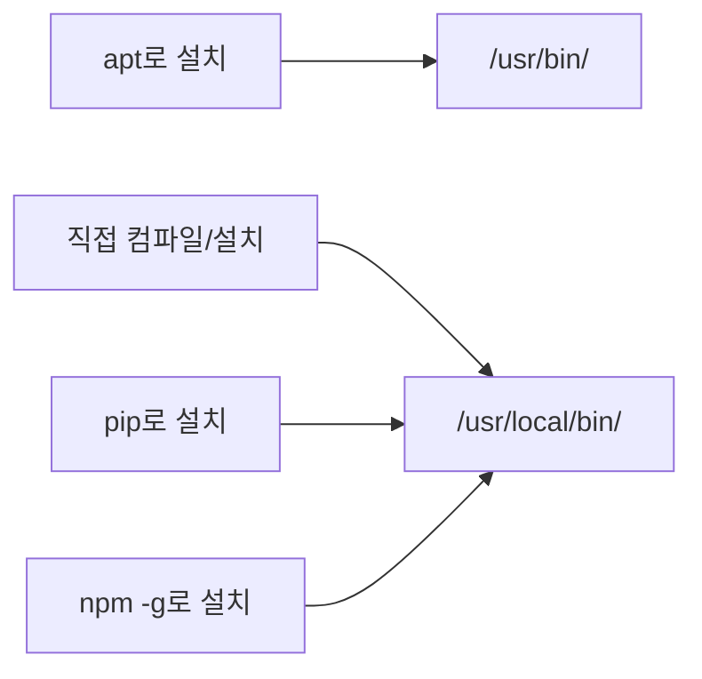
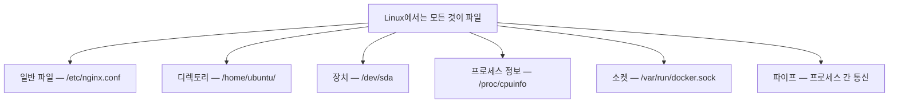

# Linux 파일 시스템 구조

> 서버에 접속하면 가장 먼저 마주치는 것이 파일 시스템이에요. "이 파일은 어디에 있지?" "이 폴더는 뭐하는 곳이지?" — 이걸 모르면 서버에서 길을 잃어요.

---

## 🎯 이걸 왜 알아야 하나?

서버에 SSH로 접속했어요. 설정 파일을 수정해야 해요. 그런데 어디에 있는지 모르겠어요.

```bash
# 이런 상황이 매일 일어나요
"Nginx 설정 파일 어디 있지?"       → /etc/nginx/
"로그 파일은?"                     → /var/log/
"방금 설치한 프로그램은 어디로 갔지?" → /usr/bin/ 또는 /usr/local/bin/
"임시 파일은?"                     → /tmp/
```

파일 시스템 구조를 모르면 매번 검색해야 하고, 실수로 중요한 파일을 지울 수도 있어요. 구조를 알면 "아, 설정 파일이니까 `/etc` 밑에 있겠네" 하고 바로 찾을 수 있어요.

---

## 🧠 핵심 개념

### 비유: 아파트 건물

Linux 파일 시스템은 **아파트 건물**과 같아요.

* **`/` (루트)** = 건물 자체. 모든 것의 시작점
* **`/etc`** = 관리실. 건물의 모든 설정/규칙이 여기에
* **`/var`** = 택배 보관함 + 쓰레기장. 계속 바뀌는 데이터
* **`/home`** = 각 세대(주민 개인 공간)
* **`/tmp`** = 로비 테이블. 아무나 잠깐 놓고 가는 곳
* **`/usr`** = 공용 시설(헬스장, 도서관). 주민 모두가 쓰는 프로그램
* **`/proc`** = CCTV 모니터. 지금 건물에서 일어나는 일을 실시간으로 보여줌

### 가장 중요한 원칙

> **Linux에서는 모든 것이 파일이에요.**

하드디스크? 파일이에요 (`/dev/sda`). CPU 정보? 파일이에요 (`/proc/cpuinfo`). 네트워크 소켓? 파일이에요. 이 원칙을 기억하면 Linux가 훨씬 쉬워져요.

---

## 🔍 상세 설명

### 전체 디렉토리 구조

```mermaid
flowchart TD
    ROOT["/  (루트)"] --> ETC["/etc — 설정 파일"]
    ROOT --> VAR["/var — 가변 데이터"]
    ROOT --> HOME["/home — 사용자 홈"]
    ROOT --> USR["/usr — 프로그램/라이브러리"]
    ROOT --> TMP["/tmp — 임시 파일"]
    ROOT --> PROC["/proc — 프로세스 정보"]
    ROOT --> DEV["/dev — 디바이스 파일"]
    ROOT --> BIN["/bin — 필수 명령어"]
    ROOT --> SBIN["/sbin — 시스템 관리 명령어"]
    ROOT --> OPT["/opt — 서드파티 소프트웨어"]
    ROOT --> BOOT["/boot — 부팅 파일"]
    ROOT --> MNT["/mnt — 임시 마운트"]
    ROOT --> SRV["/srv — 서비스 데이터"]
    ROOT --> SYS["/sys — 커널/하드웨어 정보"]
    ROOT --> RUN["/run — 런타임 데이터"]

    style ROOT fill:#e74c3c,color:#fff
    style ETC fill:#3498db,color:#fff
    style VAR fill:#2ecc71,color:#fff
    style HOME fill:#9b59b6,color:#fff
    style USR fill:#f39c12,color:#fff
    style PROC fill:#1abc9c,color:#fff
```



많아 보이죠? 하지만 DevOps 실무에서 매일 쓰는 건 6~7개예요. 하나씩 볼게요.

---

### `/etc` — 설정 파일의 집

**Editable Text Configuration**의 약자라고 기억하면 쉬워요 (공식 어원은 아니지만 실무에서 통하는 기억법이에요).

시스템의 모든 설정 파일이 여기에 살아요.

```bash
/etc/
├── nginx/              # Nginx 웹서버 설정
│   └── nginx.conf
├── ssh/                # SSH 접속 설정
│   └── sshd_config
├── hosts               # 도메인-IP 매핑 (간이 DNS)
├── hostname            # 이 서버의 이름
├── passwd              # 사용자 목록
├── shadow              # 사용자 비밀번호 (암호화됨)
├── group               # 그룹 목록
├── fstab               # 디스크 마운트 설정
├── crontab             # 예약 작업
├── resolv.conf         # DNS 서버 설정
└── systemd/            # 서비스 관리 설정
    └── system/
```

```bash
# 실무에서 자주 쓰는 명령어

# Nginx 설정 보기
cat /etc/nginx/nginx.conf

# 이 서버의 호스트네임 확인
cat /etc/hostname

# DNS 설정 확인
cat /etc/resolv.conf

# 사용자 목록 확인
cat /etc/passwd
```

**실무 팁:** `/etc` 안의 파일을 수정할 때는 반드시 백업부터 하세요.

```bash
# 설정 파일 수정 전에 항상 이렇게!
sudo cp /etc/nginx/nginx.conf /etc/nginx/nginx.conf.bak

# 수정 후 문제가 생기면
sudo cp /etc/nginx/nginx.conf.bak /etc/nginx/nginx.conf
```

---

### `/var` — 계속 변하는 데이터

**Variable**의 약자예요. 크기가 계속 변하는 데이터가 살아요.

```bash
/var/
├── log/                # ⭐ 로그 파일 (가장 많이 봄)
│   ├── syslog          # 시스템 전체 로그
│   ├── auth.log        # 로그인/인증 로그
│   ├── nginx/          # Nginx 접속 로그
│   │   ├── access.log
│   │   └── error.log
│   └── journal/        # systemd 저널 로그
├── lib/                # 프로그램 런타임 데이터
│   ├── docker/         # Docker 이미지/컨테이너 데이터
│   └── mysql/          # MySQL 데이터 파일
├── cache/              # 캐시 데이터
├── spool/              # 큐 데이터 (메일, 프린트)
└── tmp/                # 재부팅해도 살아있는 임시 파일
```

```bash
# 실무에서 가장 많이 하는 것: 로그 보기

# 실시간 로그 보기 (tail -f = 계속 따라가기)
tail -f /var/log/syslog

# Nginx 에러 로그에서 최근 50줄
tail -50 /var/log/nginx/error.log

# "error" 포함된 로그만 찾기
grep "error" /var/log/syslog

# 로그 폴더가 차지하는 용량 확인
du -sh /var/log/
```

**⚠️ 실무 주의사항:** `/var/log`가 꽉 차면 서버가 멈출 수 있어요. 이건 실제로 매우 자주 일어나는 장애예요.

```bash
# 디스크 사용량 확인
df -h

# 어떤 로그가 가장 큰지 확인
du -sh /var/log/* | sort -rh | head -10
```

---

### `/home` — 사용자 개인 공간

각 사용자의 개인 폴더예요. 아파트의 각 세대와 같아요.

```bash
/home/
├── ubuntu/             # ubuntu 사용자의 공간
│   ├── .bashrc         # 쉘 설정 (별명, 환경변수)
│   ├── .ssh/           # SSH 키
│   │   ├── id_rsa      # 개인키 (절대 공유 금지!)
│   │   ├── id_rsa.pub  # 공개키
│   │   └── authorized_keys  # 접속 허용된 키 목록
│   └── .profile        # 로그인 시 실행되는 스크립트
├── deploy/             # deploy 사용자의 공간
└── admin/              # admin 사용자의 공간
```

```bash
# 내 홈 디렉토리로 이동 (3가지 방법, 전부 같은 결과)
cd ~
cd $HOME
cd /home/ubuntu

# 숨김 파일 포함해서 보기 (.으로 시작하는 파일)
ls -la ~
```

**참고:** `root` 사용자의 홈은 `/home/root`가 아니라 `/root`예요. 관리자는 특별 대우를 받아요.

---

### `/usr` — 프로그램과 라이브러리

**Unix System Resources**의 약자예요. 설치된 프로그램들이 여기에 살아요.

```bash
/usr/
├── bin/                # 일반 사용자가 쓰는 명령어
│   ├── git
│   ├── python3
│   ├── curl
│   └── vim
├── sbin/               # 시스템 관리자용 명령어
├── lib/                # 라이브러리 파일
├── local/              # ⭐ 직접 설치한 프로그램
│   ├── bin/            # 직접 설치한 실행 파일
│   └── lib/            # 직접 설치한 라이브러리
├── share/              # 문서, 매뉴얼
└── include/            # 헤더 파일 (개발용)
```

**`/usr/bin` vs `/usr/local/bin`의 차이:**



```bash
# 명령어가 어디에 설치되어 있는지 확인
which python3
# /usr/bin/python3

which terraform
# /usr/local/bin/terraform

# 명령어 찾기
whereis nginx
```

---

### `/proc` — 실시간 시스템 정보

**Process**의 약자예요. 실제 파일이 아니라 커널이 만들어내는 **가상 파일 시스템**이에요. 디스크에 저장되지 않고 메모리에만 존재해요.

```bash
/proc/
├── cpuinfo             # CPU 정보
├── meminfo             # 메모리 정보
├── uptime              # 서버 가동 시간
├── loadavg             # 시스템 부하
├── diskstats           # 디스크 통계
├── 1/                  # PID 1번 프로세스 정보
│   ├── status          # 프로세스 상태
│   ├── cmdline         # 실행 명령어
│   └── fd/             # 열린 파일 목록
├── 1234/               # PID 1234번 프로세스 정보
└── ...
```

```bash
# CPU 정보 (몇 코어인지)
cat /proc/cpuinfo | grep "model name" | head -1
cat /proc/cpuinfo | grep "processor" | wc -l    # 코어 수

# 메모리 정보
cat /proc/meminfo | head -5

# 서버 가동 시간
cat /proc/uptime    # 초 단위
uptime              # 사람이 읽기 쉬운 형태

# 시스템 부하 (1분, 5분, 15분 평균)
cat /proc/loadavg
```

**비유:** `/proc`는 자동차 계기판이에요. 실제 부품이 아니라 부품의 상태를 보여주는 디스플레이예요.

---

### `/dev` — 디바이스 파일

**Device**의 약자예요. 하드디스크, USB, 터미널 같은 장치가 파일로 표현돼요.

```bash
/dev/
├── sda                 # 첫 번째 디스크 전체
│   ├── sda1            # 첫 번째 파티션
│   └── sda2            # 두 번째 파티션
├── nvme0n1             # NVMe SSD
├── null                # ⭐ 블랙홀 (뭘 넣어도 사라짐)
├── zero                # 0을 무한히 생성
├── random              # 난수 생성
└── tty                 # 터미널
```

```bash
# /dev/null의 활용 — 출력을 버리고 싶을 때
# "결과는 필요없고 실행만 하고 싶어"
command_that_prints_a_lot > /dev/null 2>&1

# 디스크 목록 확인
lsblk
```

**"모든 것이 파일"의 의미:**



---

### `/tmp` — 임시 파일

누구나 읽고 쓸 수 있는 임시 저장소예요. **재부팅하면 사라져요.**

```bash
# 임시 파일 만들기
echo "임시 데이터" > /tmp/mytest.txt

# 재부팅 후에는? → 사라짐!
```

**실무 팁:** 스크립트에서 임시 파일이 필요하면 `/tmp`를 쓰되, 중요한 데이터는 절대 여기에 저장하지 마세요.

---

### `/opt` — 서드파티 소프트웨어

**Optional**의 약자예요. 패키지 매니저(apt)가 아닌 별도로 설치하는 소프트웨어가 들어가요.

```bash
/opt/
├── datadog-agent/      # Datadog 모니터링 에이전트
├── prometheus/         # Prometheus (직접 설치한 경우)
└── custom-app/         # 회사 자체 애플리케이션
```

---

### 그 외 디렉토리 빠른 정리

| 디렉토리 | 역할 | 비유 |
|---------|------|------|
| `/bin` | 필수 명령어 (`ls`, `cp`, `cat`) | 비상 도구함 |
| `/sbin` | 시스템 관리 명령어 (`fdisk`, `iptables`) | 관리자 전용 도구함 |
| `/boot` | 부팅에 필요한 파일 (커널 이미지) | 시동 열쇠 |
| `/mnt` | 임시 마운트 포인트 | 임시 주차장 |
| `/srv` | 서비스용 데이터 (웹서버 파일 등) | 매장 진열대 |
| `/sys` | 커널/하드웨어 정보 (가상) | `/proc`의 하드웨어 버전 |
| `/run` | 부팅 후 런타임 데이터 (PID 파일 등) | 임시 메모장 |

**참고:** 현대 Linux(Ubuntu 등)에서는 `/bin`이 `/usr/bin`으로, `/sbin`이 `/usr/sbin`으로 심볼릭 링크되어 있어요. 사실상 같은 곳이에요.

```bash
# 확인해보기
ls -la /bin
# lrwxrwxrwx 1 root root 7 ... /bin -> usr/bin
```

---

## 💻 실습 예제

서버에 접속해서 직접 해보세요.

### 실습 1: 디렉토리 구조 탐험

```bash
# 루트부터 1단계 깊이만 보기
ls -la /

# 각 디렉토리 크기 확인
du -sh /* 2>/dev/null | sort -rh | head -10

# 가장 큰 디렉토리는 어디인가요?
# 보통 /usr, /var, /home 순이에요
```

### 실습 2: 설정 파일 구경하기

```bash
# 이 서버의 이름은?
cat /etc/hostname

# DNS 설정은?
cat /etc/resolv.conf

# 어떤 사용자가 있나?
cat /etc/passwd | head -10

# 어떤 서비스가 부팅 시 시작되나?
ls /etc/systemd/system/
```

### 실습 3: 시스템 정보 확인하기

```bash
# CPU 정보
cat /proc/cpuinfo | grep "model name" | head -1

# 전체 메모리
cat /proc/meminfo | grep MemTotal

# 서버 가동 시간
uptime

# 현재 디스크 사용량
df -h
```

### 실습 4: 명령어 위치 추적하기

```bash
# ls 명령어는 어디에?
which ls
type ls

# 모든 python 관련 경로 찾기
whereis python3

# PATH에 등록된 경로 확인
echo $PATH
# /usr/local/sbin:/usr/local/bin:/usr/sbin:/usr/bin:/sbin:/bin

# PATH의 의미: 이 경로들에서 명령어를 순서대로 찾는다
```

---

## 🏢 실무에서는?

### 시나리오 1: "서버 디스크가 꽉 찼어요!"

```bash
# 1. 전체 디스크 사용량 확인
df -h
# /dev/sda1   50G   48G  2G  96% /    ← 96%! 위험!

# 2. 어디가 큰지 찾기 (루트에서부터)
du -sh /* 2>/dev/null | sort -rh | head -5
# 30G   /var         ← 범인 발견!

# 3. /var 안에서 더 파기
du -sh /var/* | sort -rh | head -5
# 25G   /var/log     ← 로그가 원인!

# 4. 어떤 로그가 큰지
du -sh /var/log/* | sort -rh | head -5
# 20G   /var/log/nginx/access.log   ← 이놈!

# 5. 오래된 로그 정리 (조심해서!)
sudo truncate -s 0 /var/log/nginx/access.log
```

### 시나리오 2: "이 프로그램 어디에 설치됐지?"

```bash
# 방법 1: which (PATH에 있는 것만)
which docker
# /usr/bin/docker

# 방법 2: dpkg (apt로 설치한 경우)
dpkg -L docker-ce | head -20

# 방법 3: find (어디에 있든 찾기)
sudo find / -name "docker" -type f 2>/dev/null
```

### 시나리오 3: 새 서버 세팅할 때 확인 순서

```bash
# 1. OS 버전 확인
cat /etc/os-release

# 2. CPU/메모리 확인
nproc                    # CPU 코어 수
free -h                  # 메모리

# 3. 디스크 확인
df -h                    # 마운트된 디스크
lsblk                    # 전체 블록 디바이스

# 4. 네트워크 확인
ip addr                  # IP 주소
cat /etc/resolv.conf     # DNS

# 5. 호스트네임 확인/설정
hostname
```

---

## ⚠️ 자주 하는 실수

### 1. `/`(루트)에서 `rm -rf` 실행

```bash
# ❌ 절대 하면 안 됨 — 서버 전체가 날아감
sudo rm -rf /

# ❌ 이것도 위험 — 실수로 공백이 들어가면
sudo rm -rf / tmp/mydir    # '/' 와 'tmp/mydir' 두 개를 지움!

# ✅ 안전한 방법
sudo rm -rf /tmp/mydir     # 경로를 붙여서 쓰기
```

### 2. `/etc` 파일 수정 후 백업 안 하기

```bash
# ❌ 바로 수정하다가 망하면 복구 불가
sudo vim /etc/nginx/nginx.conf

# ✅ 항상 백업 먼저
sudo cp /etc/nginx/nginx.conf /etc/nginx/nginx.conf.bak.$(date +%Y%m%d)
sudo vim /etc/nginx/nginx.conf

# 망했으면 복구
sudo cp /etc/nginx/nginx.conf.bak.20250312 /etc/nginx/nginx.conf
```

### 3. `/var/log` 용량 관리 안 하기

```bash
# 로그가 쌓여서 디스크 100% → 서버 다운
# 이걸 방지하려면 logrotate 설정이 필수

# logrotate 설정 확인
cat /etc/logrotate.conf
ls /etc/logrotate.d/
```

### 4. `/tmp`에 중요한 데이터 저장

```bash
# ❌ 재부팅하면 사라짐!
cp important_data.sql /tmp/

# ✅ 영구 보관이 필요하면 홈이나 별도 디렉토리에
cp important_data.sql /home/ubuntu/backups/
```

### 5. 명령어를 못 찾을 때 PATH 확인 안 하기

```bash
# "command not found" 에러가 나면
# 1. 진짜 설치가 안 된 건지
# 2. PATH에 경로가 안 잡힌 건지 구분해야 해요

# PATH 확인
echo $PATH

# 직접 전체 경로로 실행해보기
/usr/local/bin/terraform version

# PATH에 추가하기
export PATH=$PATH:/usr/local/bin
# 영구 적용은 ~/.bashrc에 추가
```

---

## 📝 정리

### 매일 쓰는 디렉토리 Top 6

| 디렉토리 | 한마디 | 언제 가나요? |
|---------|--------|------------|
| `/etc` | 설정 파일 | 서비스 설정 바꿀 때 |
| `/var/log` | 로그 | 장애 원인 찾을 때 |
| `/home` | 사용자 홈 | SSH 키, 개인 스크립트 |
| `/usr/bin` | 설치된 프로그램 | 명령어 위치 확인할 때 |
| `/proc` | 시스템 정보 | CPU/메모리 확인할 때 |
| `/tmp` | 임시 파일 | 스크립트 임시 저장 |

### 기억해야 할 원칙

```
1. Linux에서 모든 것은 파일이다
2. / (루트)에서 모든 경로가 시작된다
3. 설정은 /etc, 로그는 /var/log, 프로그램은 /usr/bin
4. /proc, /sys는 가상 파일 시스템 (디스크에 없음)
5. 파일 수정 전에는 반드시 백업
```

---

## 🔗 다음 강의

다음은 **[01-linux/02-permissions.md — 파일 권한과 ACL](./02-permissions)** 이에요.

"이 파일을 왜 못 열지?" "Permission denied가 뭐야?" — 파일 시스템의 구조를 알았으니, 이제 각 파일에 "누가 접근할 수 있는지"를 정하는 권한 시스템을 배워볼게요.
