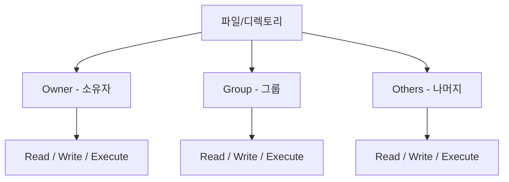
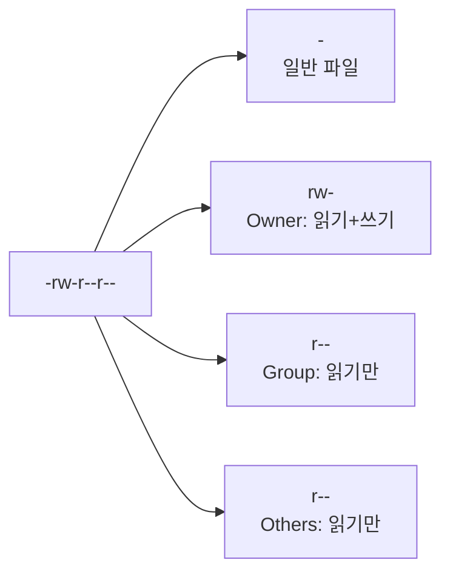
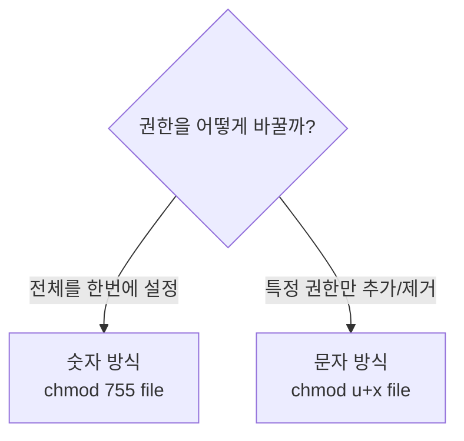
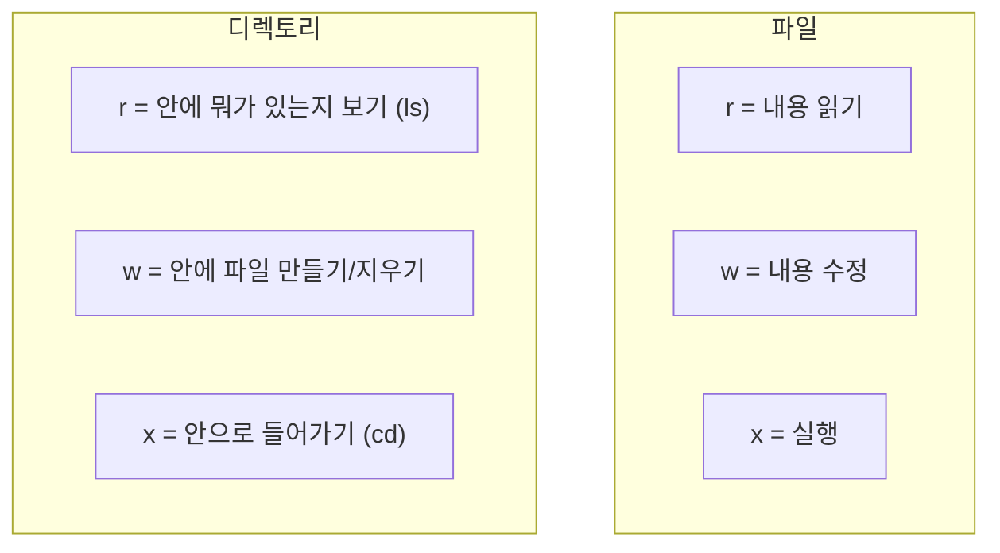
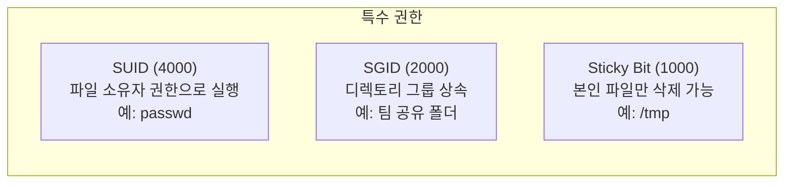
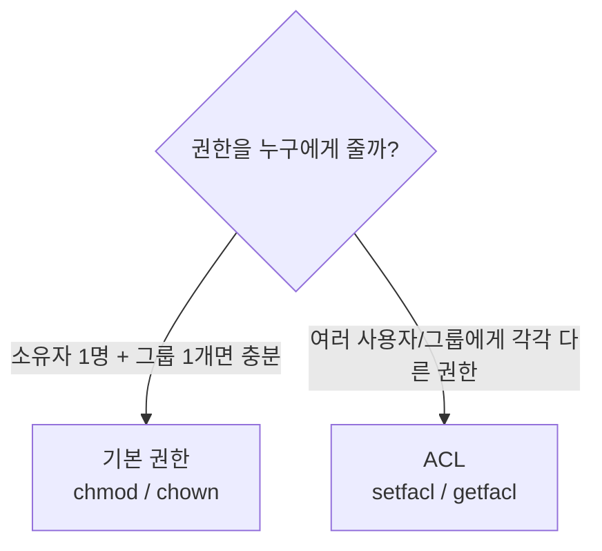

# Linux 파일 권한 (Permissions / ACL)

> "Permission denied" — Linux에서 가장 많이 보는 에러 메시지 중 하나예요. 왜 이런 에러가 나는지, 어떻게 해결하는지 이번에 확실히 잡아볼게요.

---

## 🎯 이걸 왜 알아야 하나?

서버에서 이런 상황이 매일 일어나요.

```bash
$ cat /etc/shadow
cat: /etc/shadow: Permission denied

$ ./deploy.sh
bash: ./deploy.sh: Permission denied

$ echo "hello" > /var/log/myapp.log
bash: /var/log/myapp.log: Permission denied
```

권한을 모르면 "안 돼요"만 반복하고, 권한을 대충 알면 `chmod 777`(모든 권한 열기)로 해결하다가 보안 사고가 나요.

**실무에서 권한 관련 업무:**
* 배포 스크립트에 실행 권한 부여
* 애플리케이션이 로그 파일을 쓸 수 있게 설정
* SSH 키 파일의 권한이 너무 열려있으면 접속 거부됨
* Docker 소켓 접근 권한 설정
* 여러 팀이 같은 서버를 쓸 때 폴더 접근 제한

---

## 🧠 핵심 개념

### 비유: 호텔 카드키

호텔을 생각해보세요.

* **손님(Owner)** — 자기 방에 들어갈 수 있어요. 방 안에서 뭐든 할 수 있어요.
* **같은 층 투숙객(Group)** — 같은 층 라운지는 쓸 수 있지만, 남의 방에는 못 들어가요.
* **외부인(Others)** — 로비까지만 접근 가능해요.

Linux 파일 권한도 똑같아요. 모든 파일에는 **누가(Who)** **뭘 할 수 있는지(What)** 가 정해져 있어요.



### 세 가지 권한

| 권한 | 문자 | 숫자 | 파일에서의 의미 | 디렉토리에서의 의미 |
|------|------|------|---------------|------------------|
| Read | `r` | 4 | 파일 내용 읽기 | 디렉토리 안 목록 보기 (`ls`) |
| Write | `w` | 2 | 파일 내용 수정 | 디렉토리 안에 파일 생성/삭제 |
| Execute | `x` | 1 | 파일 실행 (스크립트 등) | 디렉토리 안으로 진입 (`cd`) |

---

## 🔍 상세 설명

### 권한 읽는 법

```bash
ls -la /etc/nginx/nginx.conf
# -rw-r--r-- 1 root root 1482 Mar 10 09:00 /etc/nginx/nginx.conf
```

이 출력을 해부해볼게요.

```
-  rw-  r--  r--   1   root  root  1482  Mar 10 09:00  nginx.conf
│  │    │    │     │   │     │     │     │              │
│  │    │    │     │   │     │     │     └─ 수정 날짜    └─ 파일명
│  │    │    │     │   │     │     └─ 파일 크기 (bytes)
│  │    │    │     │   │     └─ 소유 그룹
│  │    │    │     │   └─ 소유자
│  │    │    │     └─ 하드 링크 수
│  │    │    └─ Others 권한: r-- (읽기만 가능)
│  │    └─ Group 권한: r-- (읽기만 가능)
│  └─ Owner 권한: rw- (읽기+쓰기)
└─ 파일 타입: - (일반 파일)
```

**파일 타입 문자:**

| 문자 | 의미 |
|------|------|
| `-` | 일반 파일 |
| `d` | 디렉토리 |
| `l` | 심볼릭 링크 |
| `b` | 블록 디바이스 (디스크) |
| `c` | 캐릭터 디바이스 (터미널) |
| `s` | 소켓 |



### 숫자로 표현하기 (Octal)

각 권한은 숫자로도 표현돼요. 실무에서는 숫자를 더 많이 써요.

```
r = 4
w = 2
x = 1
- = 0

합산해서 표현:
rwx = 4+2+1 = 7
rw- = 4+2+0 = 6
r-x = 4+0+1 = 5
r-- = 4+0+0 = 4
--- = 0+0+0 = 0
```

**자주 쓰는 권한 숫자:**

| 숫자 | 권한 | 의미 | 언제 쓰나요? |
|------|------|------|------------|
| `755` | `rwxr-xr-x` | 소유자 전부, 나머지 읽기+실행 | 실행 파일, 디렉토리 |
| `644` | `rw-r--r--` | 소유자 읽기+쓰기, 나머지 읽기 | 일반 설정 파일 |
| `600` | `rw-------` | 소유자만 읽기+쓰기 | SSH 개인키, 비밀 파일 |
| `700` | `rwx------` | 소유자만 전부 | 개인 스크립트 디렉토리 |
| `400` | `r--------` | 소유자만 읽기 | SSH 키 (AWS 등) |
| `777` | `rwxrwxrwx` | 모두에게 모든 권한 | ⚠️ 거의 쓰면 안 됨! |

---

### chmod — 권한 바꾸기

**숫자 방식 (Octal):**

```bash
# 실행 권한 부여 (가장 많이 씀)
chmod 755 deploy.sh
# Owner: rwx, Group: r-x, Others: r-x

# SSH 키 권한 설정 (필수!)
chmod 600 ~/.ssh/id_rsa
# Owner만 읽기+쓰기

# 설정 파일
chmod 644 config.yaml
# Owner: 읽기+쓰기, 나머지: 읽기만
```

**문자 방식 (Symbolic):**

```bash
# u=user(owner), g=group, o=others, a=all

# 소유자에게 실행 권한 추가
chmod u+x deploy.sh

# 그룹에서 쓰기 권한 제거
chmod g-w config.yaml

# 나머지 모든 사람의 권한 제거
chmod o-rwx secret.key

# 모두에게 읽기 권한 부여
chmod a+r readme.txt

# 여러 개 동시에
chmod u+x,g-w,o-rwx script.sh
```

**언제 어떤 방식을 쓰나요?**



```bash
# 실무 예시: 배포 스크립트 만들었는데 실행이 안 될 때

# 1. 현재 권한 확인
ls -la deploy.sh
# -rw-r--r-- 1 ubuntu ubuntu 256 ...   ← 실행 권한(x)이 없음!

# 2. 실행 권한 추가
chmod +x deploy.sh
# 또는
chmod 755 deploy.sh

# 3. 이제 실행 가능
./deploy.sh
```

---

### chown — 소유자 바꾸기

```bash
# 기본 형식
chown [소유자]:[그룹] [파일]

# 소유자를 nginx로 변경
sudo chown nginx /var/log/myapp.log

# 소유자와 그룹 동시에 변경
sudo chown nginx:nginx /var/log/myapp.log

# 디렉토리와 하위 파일 전부 변경 (-R = recursive)
sudo chown -R ubuntu:ubuntu /home/ubuntu/app/

# 그룹만 변경
sudo chown :docker /var/run/docker.sock
```

**실무 시나리오:**

```bash
# 앱이 로그를 못 쓸 때
# 1. 로그 파일 소유자 확인
ls -la /var/log/myapp.log
# -rw-r--r-- 1 root root ...    ← root 소유! 앱은 ubuntu로 실행 중

# 2. 소유자를 앱 실행 사용자로 변경
sudo chown ubuntu:ubuntu /var/log/myapp.log

# 3. 또는 그룹 권한으로 해결
sudo chown root:appgroup /var/log/myapp.log
sudo chmod 664 /var/log/myapp.log
# appgroup에 속한 사용자는 쓸 수 있음
```

---

### 디렉토리 권한의 특이점

파일과 디렉토리에서 `r`, `w`, `x`의 의미가 달라요. 이걸 모르면 헷갈려요.



```bash
# 실험해보기

# 디렉토리에 x가 없으면 cd가 안 됨
mkdir /tmp/testdir
chmod 640 /tmp/testdir    # rw-r----- (x 없음)
cd /tmp/testdir
# bash: cd: /tmp/testdir: Permission denied

# 디렉토리에 r이 없으면 ls가 안 됨
chmod 710 /tmp/testdir    # rwx--x--- 
ls /tmp/testdir           # 다른 사용자는 ls 불가
cd /tmp/testdir           # 하지만 cd는 가능! (x가 있으니까)

# 정리: 디렉토리는 보통 r과 x를 같이 줘야 의미가 있음
chmod 755 /tmp/testdir    # 일반적인 디렉토리 권한
```

---

### 특수 권한 (SUID, SGID, Sticky Bit)

일반 `rwx` 외에 특수한 권한이 3개 더 있어요.

#### SUID (Set User ID) — 숫자: 4000

실행할 때 **파일 소유자의 권한으로** 실행돼요.

```bash
# 대표적인 예: passwd 명령어
ls -la /usr/bin/passwd
# -rwsr-xr-x 1 root root ...
#    ^
#    s = SUID가 설정됨

# 일반 사용자가 passwd를 실행하면
# root 권한으로 /etc/shadow를 수정할 수 있음
# (비밀번호 변경이 가능한 이유)
```

#### SGID (Set Group ID) — 숫자: 2000

디렉토리에 설정하면, 그 안에서 만든 파일의 그룹이 **디렉토리의 그룹**을 따라가요.

```bash
# 팀 공유 폴더 만들기
sudo mkdir /shared/team
sudo chown root:devteam /shared/team
sudo chmod 2775 /shared/team
#          ^
#          2 = SGID

# 이제 누가 파일을 만들어도 그룹이 devteam이 됨
touch /shared/team/report.txt
ls -la /shared/team/report.txt
# -rw-r--r-- 1 ubuntu devteam ...   ← 그룹이 자동으로 devteam!
```

#### Sticky Bit — 숫자: 1000

디렉토리에 설정하면, **자기가 만든 파일만 삭제**할 수 있어요.

```bash
# 대표적인 예: /tmp
ls -ld /tmp
# drwxrwxrwt 15 root root ...
#          ^
#          t = Sticky Bit

# /tmp에 누구나 파일을 만들 수 있지만
# 남이 만든 파일은 지울 수 없음

# Sticky Bit 설정하기
chmod 1777 /shared/temp
# 또는
chmod +t /shared/temp
```



---

### ACL (Access Control List)

기본 `owner/group/others`만으로는 부족할 때가 있어요. 특정 사용자에게만 따로 권한을 줘야 할 때 ACL을 써요.

**비유:** 기본 권한은 "주민/같은 층/외부인"으로만 나누는데, ACL은 "304호 김씨에게만 특별히 헬스장 키를 줄게"가 가능해요.

```bash
# ACL 확인
getfacl /var/log/myapp.log

# 특정 사용자에게 읽기+쓰기 권한 추가
sudo setfacl -m u:deploy:rw /var/log/myapp.log

# 특정 그룹에게 읽기 권한 추가
sudo setfacl -m g:monitoring:r /var/log/myapp.log

# ACL 확인 (+ 표시가 보이면 ACL이 설정된 것)
ls -la /var/log/myapp.log
# -rw-rw-r--+ 1 ubuntu ubuntu ...
#           ^
#           + = ACL 있음

# ACL 상세 보기
getfacl /var/log/myapp.log
# file: var/log/myapp.log
# owner: ubuntu
# group: ubuntu
# user::rw-
# user:deploy:rw-        ← deploy 사용자에게 추가 권한
# group::r--
# group:monitoring:r--   ← monitoring 그룹에게 추가 권한
# mask::rw-
# other::r--

# 디렉토리에 기본 ACL 설정 (새로 만드는 파일에 자동 적용)
sudo setfacl -d -m u:deploy:rwx /var/log/myapp/

# ACL 제거
sudo setfacl -x u:deploy /var/log/myapp.log

# ACL 전부 제거
sudo setfacl -b /var/log/myapp.log
```

**언제 ACL을 쓰나요?**



---

### umask — 기본 권한 설정

새 파일/디렉토리를 만들 때 기본 권한을 결정하는 값이에요.

```bash
# 현재 umask 확인
umask
# 0022

# umask 계산법:
# 파일 기본 최대 권한:    666 (rw-rw-rw-)
# 디렉토리 기본 최대 권한: 777 (rwxrwxrwx)
# 
# 실제 권한 = 최대 권한 - umask
#
# umask 0022일 때:
# 파일:     666 - 022 = 644 (rw-r--r--)
# 디렉토리: 777 - 022 = 755 (rwxr-xr-x)

# 직접 확인해보기
touch /tmp/testfile
mkdir /tmp/testdir
ls -la /tmp/testfile   # -rw-r--r-- (644)
ls -la -d /tmp/testdir # drwxr-xr-x (755)

# umask 변경 (현재 세션만)
umask 0077   # 새 파일: 600, 새 디렉토리: 700 (나만 접근 가능)

# 영구 변경: ~/.bashrc에 추가
echo "umask 0022" >> ~/.bashrc
```

---

## 💻 실습 예제

### 실습 1: 권한 읽기 연습

```bash
# 여러 파일의 권한을 읽어보세요
ls -la /etc/passwd
ls -la /etc/shadow
ls -la /usr/bin/passwd
ls -la ~/.ssh/

# 질문에 답해보세요:
# 1. /etc/passwd는 누구나 읽을 수 있나요?
# 2. /etc/shadow는 왜 일반 사용자가 못 읽나요?
# 3. /usr/bin/passwd에 's'가 보이는데 왜 있나요?

# 답:
# 1. 네, 644 (rw-r--r--) → Others에 r이 있음
# 2. 640 (rw-r-----) → Others에 아무 권한 없음 (비밀번호 해시 보호)
# 3. SUID → 일반 사용자가 실행해도 root 권한으로 비밀번호 변경 가능
```

### 실습 2: 배포 스크립트 권한 설정

```bash
# 배포 스크립트 만들기
cat > /tmp/deploy.sh << 'EOF'
#!/bin/bash
echo "배포를 시작합니다..."
echo "서버: $(hostname)"
echo "시간: $(date)"
echo "배포 완료!"
EOF

# 실행 시도
/tmp/deploy.sh
# bash: /tmp/deploy.sh: Permission denied

# 권한 확인
ls -la /tmp/deploy.sh
# -rw-r--r--   ← 실행 권한(x)이 없음!

# 실행 권한 부여
chmod 755 /tmp/deploy.sh

# 다시 실행
/tmp/deploy.sh
# 배포를 시작합니다...
# 서버: my-server
# 시간: Wed Mar 12 10:00:00 UTC 2025
# 배포 완료!
```

### 실습 3: SSH 키 권한 (이거 틀리면 접속 안 됨)

```bash
# SSH 키 권한이 잘못되면 이런 에러가 나요
# WARNING: UNPROTECTED PRIVATE KEY FILE!
# Permissions 0644 for '/home/ubuntu/.ssh/id_rsa' are too open.

# SSH 관련 파일의 올바른 권한
chmod 700 ~/.ssh              # 디렉토리: 나만 접근
chmod 600 ~/.ssh/id_rsa       # 개인키: 나만 읽기+쓰기
chmod 644 ~/.ssh/id_rsa.pub   # 공개키: 누구나 읽기 가능
chmod 644 ~/.ssh/authorized_keys  # 접속 허용 키
chmod 644 ~/.ssh/known_hosts  # 접속한 서버 목록
chmod 644 ~/.ssh/config       # SSH 설정

# 한 줄로 전부 설정
chmod 700 ~/.ssh && chmod 600 ~/.ssh/id_rsa && chmod 644 ~/.ssh/*.pub
```

### 실습 4: 팀 공유 디렉토리 만들기

```bash
# 시나리오: devteam 그룹 멤버들이 공유하는 디렉토리

# 1. 그룹 만들기
sudo groupadd devteam

# 2. 사용자를 그룹에 추가
sudo usermod -aG devteam ubuntu
sudo usermod -aG devteam deploy

# 3. 공유 디렉토리 만들기
sudo mkdir -p /shared/project

# 4. 소유권 설정
sudo chown root:devteam /shared/project

# 5. SGID + 그룹 쓰기 권한 설정
sudo chmod 2775 /shared/project
# 2 = SGID (새 파일의 그룹이 devteam을 상속)
# 775 = rwxrwxr-x

# 6. 확인
ls -ld /shared/project
# drwxrwsr-x 2 root devteam ...
#       ^
#       s = SGID 설정됨

# 7. 테스트: 파일을 만들면 그룹이 자동으로 devteam
touch /shared/project/test.txt
ls -la /shared/project/test.txt
# -rw-r--r-- 1 ubuntu devteam ...   ← 그룹이 devteam!
```

### 실습 5: ACL 실습

```bash
# 시나리오: 로그 파일을 monitoring 사용자에게만 읽기 허용

# 1. 로그 파일 생성
sudo touch /var/log/myapp.log
sudo chown root:root /var/log/myapp.log
sudo chmod 640 /var/log/myapp.log

# 2. 현재는 monitoring 사용자가 접근 불가
# sudo -u monitoring cat /var/log/myapp.log
# Permission denied

# 3. ACL로 읽기 권한 추가
sudo setfacl -m u:monitoring:r /var/log/myapp.log

# 4. 확인
getfacl /var/log/myapp.log

# 5. 이제 monitoring 사용자가 읽기 가능
# sudo -u monitoring cat /var/log/myapp.log
# (정상 출력)
```

---

## 🏢 실무에서는?

### 시나리오 1: Docker 권한 문제

```bash
# Docker 명령어가 안 될 때
docker ps
# Got permission denied while trying to connect to the Docker daemon socket

# 원인: docker.sock의 권한
ls -la /var/run/docker.sock
# srw-rw---- 1 root docker ...

# 해결: 현재 사용자를 docker 그룹에 추가
sudo usermod -aG docker $USER

# 그룹 변경을 적용하려면 다시 로그인 필요
# 또는 임시로:
newgrp docker

# 확인
docker ps    # 이제 동작!
```

### 시나리오 2: Nginx가 로그를 못 쓸 때

```bash
# Nginx 에러 로그에 이런 게 보임
# [error] open() "/var/log/nginx/access.log" failed (13: Permission denied)

# 원인 파악
ls -la /var/log/nginx/
# Nginx는 보통 www-data 또는 nginx 사용자로 실행됨

# Nginx가 어떤 사용자로 실행되는지 확인
ps aux | grep nginx
# www-data  1234  ... nginx: worker process

# 해결
sudo chown -R www-data:www-data /var/log/nginx/
sudo chmod 755 /var/log/nginx/
sudo chmod 644 /var/log/nginx/*.log
```

### 시나리오 3: CI/CD에서 배포 스크립트 실행 실패

```bash
# Jenkins나 GitHub Actions에서
# "Permission denied" 에러가 나는 경우

# 원인: Git에서 가져온 스크립트에 실행 권한이 없음

# 해결 1: 파이프라인에서 권한 부여
chmod +x ./scripts/deploy.sh
./scripts/deploy.sh

# 해결 2: Git에 실행 권한을 같이 커밋
git update-index --chmod=+x scripts/deploy.sh
git commit -m "Add execute permission to deploy script"
git push
```

### 시나리오 4: 컨테이너 안에서 파일 쓰기 실패

```bash
# 컨테이너가 호스트 볼륨에 쓰기 실패하는 경우

# 원인: 컨테이너 안의 사용자 UID와 호스트 파일 소유자가 다름
# 컨테이너 안: uid=1000 (app)
# 호스트 파일: uid=0 (root)

# 해결 1: 호스트에서 디렉토리 권한 맞추기
sudo chown 1000:1000 /data/app-volume/

# 해결 2: Dockerfile에서 같은 UID로 사용자 만들기
# USER 1000
```

---

## ⚠️ 자주 하는 실수

### 1. `chmod 777`로 모든 걸 해결하려는 습관

```bash
# ❌ 보안 구멍을 만드는 최악의 습관
chmod 777 /var/www/html/
chmod 777 /etc/myapp.conf
chmod 777 ~/.ssh/id_rsa

# ✅ 필요한 최소 권한만 부여
chmod 755 /var/www/html/        # 웹 디렉토리
chmod 644 /etc/myapp.conf       # 설정 파일
chmod 600 ~/.ssh/id_rsa         # SSH 개인키
```

**원칙: 최소 권한 (Principle of Least Privilege)**
— 필요한 만큼만 주고, 나머지는 막아요.

### 2. 재귀적 권한 변경의 실수

```bash
# ❌ 파일과 디렉토리에 같은 권한을 줘버림
chmod -R 755 /var/www/
# 설정 파일(.env)까지 실행 권한이 생겨버림!

# ✅ 파일과 디렉토리를 분리해서 설정
find /var/www/ -type d -exec chmod 755 {} \;   # 디렉토리만 755
find /var/www/ -type f -exec chmod 644 {} \;   # 파일만 644
```

### 3. `chown -R`로 시스템 디렉토리 바꿔버리기

```bash
# ❌ 시스템 디렉토리의 소유자를 바꾸면 서비스가 망가짐
sudo chown -R ubuntu:ubuntu /etc/
# → 각종 서비스 시작 실패!

# ❌ /tmp, /var 같은 곳도 함부로 바꾸면 안 됨
sudo chown -R ubuntu:ubuntu /var/

# ✅ 수정이 필요한 특정 파일/디렉토리만 정확하게 지정
sudo chown ubuntu:ubuntu /etc/myapp/config.yaml
```

### 4. sudo 남발

```bash
# ❌ 매번 sudo로 권한 문제를 무시하기
sudo vim /home/ubuntu/app/config.yaml
# → 파일 소유자가 root로 바뀌어서 앱이 못 읽게 됨!

# ✅ 일반 사용자로 할 수 있는 건 일반 사용자로
vim /home/ubuntu/app/config.yaml

# sudo가 필요한 건 진짜 시스템 파일을 수정할 때만
sudo vim /etc/nginx/nginx.conf
```

### 5. SSH 키 권한을 너무 열어두기

```bash
# SSH는 키 파일 권한이 너무 열려있으면 접속을 거부함
# "WARNING: UNPROTECTED PRIVATE KEY FILE!"

# ❌ 
chmod 644 ~/.ssh/id_rsa    # 다른 사람도 읽을 수 있음 → 거부!

# ✅
chmod 600 ~/.ssh/id_rsa    # 나만 읽을 수 있음 → 접속 성공
```

---

## 📝 정리

### 권한 빠른 참조 표

```
읽기  쓰기  실행
 r     w     x
 4     2     1

rwx = 7    rw- = 6    r-x = 5    r-- = 4    --- = 0
```

### 실무에서 자주 쓰는 권한 조합

| 대상 | 권한 | 명령어 |
|------|------|--------|
| 디렉토리 (일반) | 755 | `chmod 755 dir/` |
| 설정 파일 | 644 | `chmod 644 config.yaml` |
| 비밀 파일 | 600 | `chmod 600 secret.key` |
| 실행 스크립트 | 755 | `chmod 755 deploy.sh` |
| SSH 개인키 | 600 | `chmod 600 ~/.ssh/id_rsa` |
| SSH 디렉토리 | 700 | `chmod 700 ~/.ssh/` |
| 팀 공유 폴더 | 2775 | `chmod 2775 /shared/` |

### 핵심 명령어

```bash
chmod [권한] [파일]        # 권한 변경
chown [소유자]:[그룹] [파일] # 소유자 변경
ls -la [파일]             # 권한 확인
getfacl [파일]            # ACL 확인
setfacl -m [규칙] [파일]   # ACL 설정
umask                     # 기본 권한 마스크 확인
```

---

## 🔗 다음 강의

다음은 **[01-linux/03-users-groups.md — 사용자와 그룹 관리](./03-users-groups)** 예요.

권한에서 "소유자"와 "그룹"이 나왔죠? 그럼 사용자와 그룹은 어떻게 만들고 관리하는지, 실무에서 서버 접근을 어떻게 통제하는지 배워볼게요.
