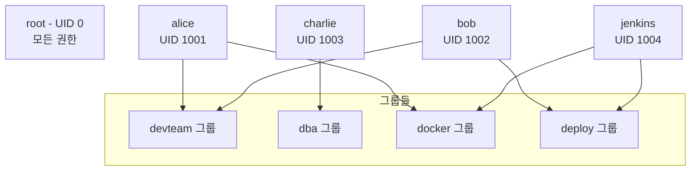
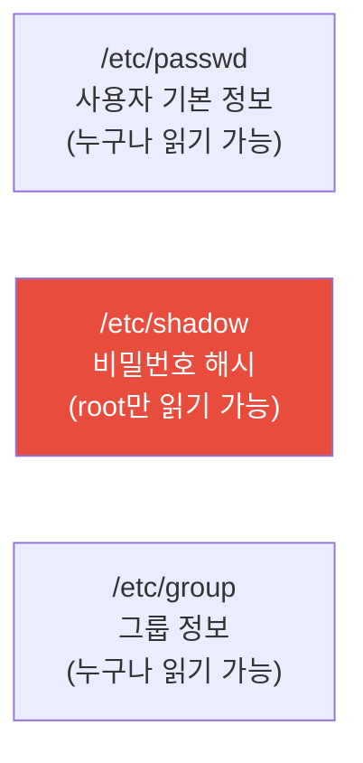
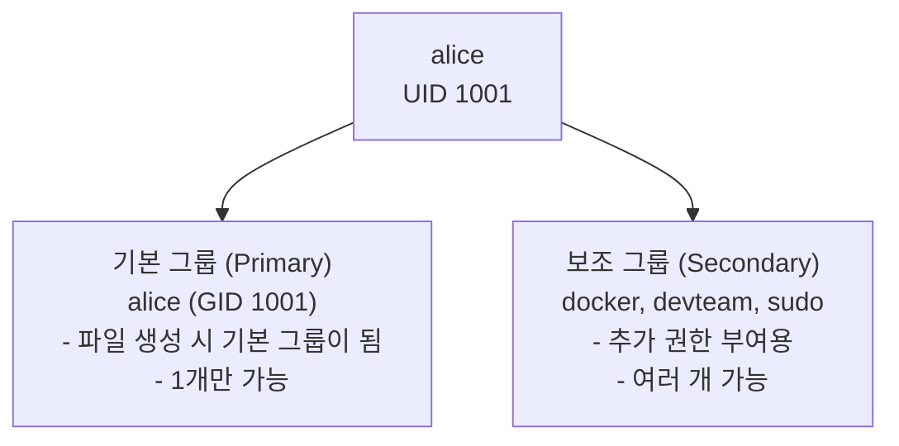
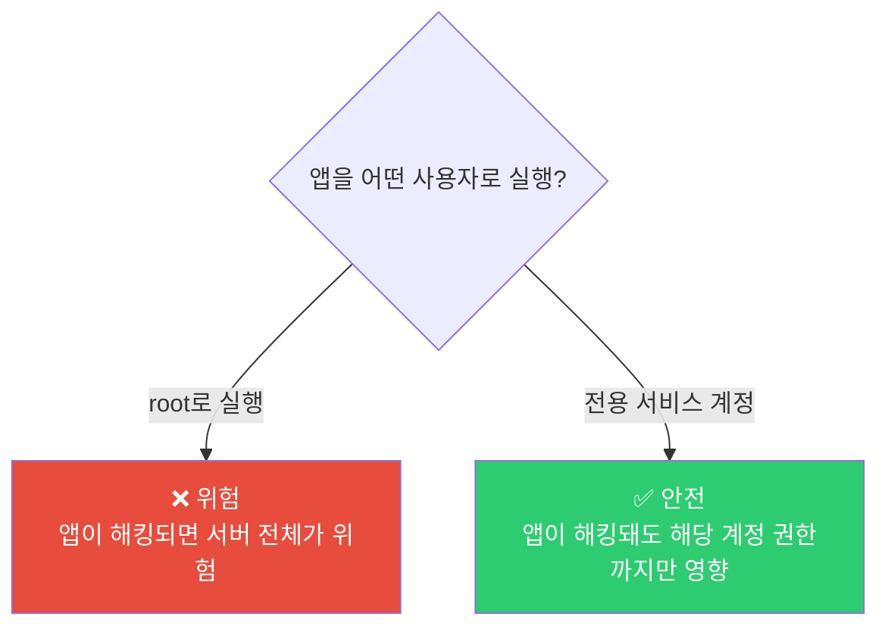

# Linux 사용자와 그룹 관리

> 서버에 누가 접속할 수 있는지, 누가 뭘 할 수 있는지 — 이걸 관리하는 게 사용자/그룹 관리예요. 보안의 첫 번째 문이에요.

---

## 🎯 이걸 왜 알아야 하나?

회사 서버에 이런 사람들이 접속해요.

```
• 개발자 5명 — 앱 코드를 배포해야 함
• DBA 1명 — 데이터베이스만 관리해야 함
• 모니터링 봇 — 로그만 읽어야 함
• CI/CD 파이프라인 — 배포 스크립트만 실행해야 함
• 인턴 1명 — 읽기만 가능해야 함
```

이 모든 사람에게 `root` 계정을 주면? 인턴이 실수로 `rm -rf /` 하는 순간 끝이에요.

**사용자/그룹 관리를 잘하면:**
* 각자 필요한 권한만 가짐 (최소 권한 원칙)
* 누가 뭘 했는지 추적 가능 (감사 로그)
* 실수로 인한 피해 범위를 제한

---

## 🧠 핵심 개념

### 비유: 회사 사원증 시스템

회사를 생각해보세요.

* **사용자(User)** = 사원증을 가진 직원. 각자 고유한 사번(UID)이 있어요.
* **그룹(Group)** = 부서. 개발팀, 운영팀, DBA팀 등. 부서에 따라 접근할 수 있는 공간이 달라요.
* **root** = 사장. 모든 곳에 들어갈 수 있고, 모든 걸 할 수 있어요.

한 직원이 여러 부서에 속할 수 있어요. "개발팀이면서 보안팀"처럼요. Linux에서도 한 사용자가 여러 그룹에 속할 수 있어요.



### 사용자의 두 가지 종류

| 종류 | UID 범위 | 예시 | 설명 |
|------|---------|------|------|
| 시스템 사용자 | 0 ~ 999 | root(0), www-data(33), nobody(65534) | 서비스가 실행되는 용도. 로그인 안 함 |
| 일반 사용자 | 1000 ~ | ubuntu(1000), alice(1001) | 사람이 로그인해서 쓰는 계정 |

---

## 🔍 상세 설명

### 사용자 정보가 저장되는 곳

Linux는 사용자 정보를 3개의 파일에 나눠서 저장해요.



#### /etc/passwd — 사용자 목록

```bash
cat /etc/passwd | head -5
# root:x:0:0:root:/root:/bin/bash
# daemon:x:1:1:daemon:/usr/sbin:/usr/sbin/nologin
# bin:x:2:2:bin:/bin:/usr/sbin/nologin
# www-data:x:33:33:www-data:/var/www:/usr/sbin/nologin
# ubuntu:x:1000:1000:Ubuntu:/home/ubuntu:/bin/bash
```

한 줄을 분해해볼게요.

```
ubuntu : x : 1000 : 1000 : Ubuntu : /home/ubuntu : /bin/bash
  │      │    │      │       │          │              │
  │      │    │      │       │          │              └─ 로그인 쉘
  │      │    │      │       │          └─ 홈 디렉토리
  │      │    │      │       └─ 설명 (이름, 메모 등)
  │      │    │      └─ 기본 그룹 GID
  │      │    └─ 사용자 UID
  │      └─ 비밀번호 (x = /etc/shadow에 저장됨)
  └─ 사용자 이름
```

**로그인 쉘의 의미:**

| 쉘 | 의미 |
|----|------|
| `/bin/bash` | 일반 로그인 가능 |
| `/usr/sbin/nologin` | 로그인 불가 (서비스 전용 계정) |
| `/bin/false` | 로그인 불가 (더 엄격) |

```bash
# 로그인 가능한 사용자만 보기
grep -v "nologin\|false" /etc/passwd | grep -v "^#"
```

#### /etc/shadow — 비밀번호 (민감!)

```bash
sudo cat /etc/shadow | head -3
# root:$6$abc...:19000:0:99999:7:::
# daemon:*:19000:0:99999:7:::
# ubuntu:$6$xyz...:19500:0:99999:7:::
```

```
ubuntu : $6$xyz... : 19500 : 0 : 99999 : 7 : : :
  │        │          │      │     │      │
  │        │          │      │     │      └─ 만료 전 경고 일수
  │        │          │      │     └─ 최대 사용 일수
  │        │          │      └─ 최소 사용 일수
  │        │          └─ 마지막 변경일 (1970.1.1부터 일수)
  │        └─ 암호화된 비밀번호
  └─ 사용자 이름
```

**비밀번호 필드 특수 값:**

| 값 | 의미 |
|----|------|
| `$6$...` | SHA-512로 암호화된 비밀번호 |
| `*` | 비밀번호 로그인 비활성화 (생성 시부터) |
| `!` | 계정 잠금 |
| `!!` | 비밀번호 아직 미설정 |

#### /etc/group — 그룹 목록

```bash
cat /etc/group | grep -E "docker|sudo|dev"
# sudo:x:27:ubuntu
# docker:x:998:ubuntu,deploy
# devteam:x:1001:alice,bob,charlie
```

```
docker : x : 998 : ubuntu,deploy
  │      │    │       │
  │      │    │       └─ 그룹에 속한 사용자들 (쉼표로 구분)
  │      │    └─ 그룹 GID
  │      └─ 비밀번호 (보통 사용 안 함)
  └─ 그룹 이름
```

---

### 사용자 관리 명령어

#### useradd — 사용자 생성

```bash
# 기본 생성 (홈 디렉토리 없이)
sudo useradd alice

# 홈 디렉토리도 같이 생성 (실무에서는 거의 항상 -m)
sudo useradd -m alice

# 실무에서 많이 쓰는 풀 옵션
sudo useradd -m \
  -s /bin/bash \           # 로그인 쉘
  -G docker,devteam \      # 추가 그룹들
  -c "Alice Kim - Backend Dev" \  # 설명
  alice

# 비밀번호 설정
sudo passwd alice
```

**useradd vs adduser:**

```bash
# useradd — 저수준 명령어. 옵션을 직접 다 지정해야 함
sudo useradd -m -s /bin/bash alice

# adduser — 고수준 래퍼(wrapper). 대화형으로 물어봄 (Debian/Ubuntu)
sudo adduser alice
# Adding user `alice' ...
# New password: 
# Full Name []: Alice Kim
# ...

# 실무 추천: 스크립트에서는 useradd, 수동으로는 adduser
```

#### usermod — 사용자 수정

```bash
# 그룹에 추가 (가장 많이 쓰는 옵션)
sudo usermod -aG docker alice      # docker 그룹에 추가
sudo usermod -aG sudo alice        # sudo 권한 부여

# ⚠️ -a 없이 -G를 쓰면 기존 그룹에서 제거되고 새 그룹만 남음!
# ❌ 위험
sudo usermod -G docker alice       # alice의 그룹이 docker만 됨!

# ✅ 안전 (-a = append)
sudo usermod -aG docker alice      # 기존 그룹 유지 + docker 추가

# 쉘 변경
sudo usermod -s /bin/zsh alice

# 홈 디렉토리 변경 (기존 파일도 이동)
sudo usermod -d /home/newalice -m alice

# 사용자 이름 변경
sudo usermod -l newalice alice

# 계정 잠금 / 해제
sudo usermod -L alice    # Lock (비밀번호 앞에 ! 추가)
sudo usermod -U alice    # Unlock
```

#### userdel — 사용자 삭제

```bash
# 사용자만 삭제 (홈 디렉토리 남김)
sudo userdel alice

# 사용자 + 홈 디렉토리 삭제
sudo userdel -r alice

# 사용자가 실행 중인 프로세스가 있으면 삭제 실패
# 강제 삭제
sudo userdel -f alice
```

#### 사용자 정보 확인

```bash
# 현재 내가 누구인지
whoami
# ubuntu

# 내 UID, GID, 소속 그룹
id
# uid=1000(ubuntu) gid=1000(ubuntu) groups=1000(ubuntu),27(sudo),998(docker)

# 특정 사용자의 정보
id alice
# uid=1001(alice) gid=1001(alice) groups=1001(alice),998(docker),1002(devteam)

# 현재 로그인한 모든 사용자
who
w        # 더 자세한 정보

# 사용자의 최근 로그인 기록
last alice | head -5

# 로그인 실패 기록 (보안 감사용)
sudo lastb | head -10
```

---

### 그룹 관리 명령어

```bash
# 그룹 생성
sudo groupadd devteam
sudo groupadd -g 2000 dba    # GID 지정

# 그룹에 사용자 추가 (2가지 방법)
sudo usermod -aG devteam alice    # 방법 1: usermod
sudo gpasswd -a alice devteam    # 방법 2: gpasswd

# 그룹에서 사용자 제거
sudo gpasswd -d alice devteam

# 그룹 삭제
sudo groupdel devteam

# 그룹에 속한 사용자 확인
getent group devteam
# devteam:x:1001:alice,bob,charlie

# 또는
grep devteam /etc/group

# 내가 속한 그룹 목록
groups
# ubuntu sudo docker devteam

# 특정 사용자의 그룹
groups alice
```

---

### 기본 그룹 vs 보조 그룹

한 사용자는 **기본 그룹 1개** + **보조 그룹 여러 개**를 가질 수 있어요.



```bash
# alice의 그룹 확인
id alice
# uid=1001(alice) gid=1001(alice) groups=1001(alice),27(sudo),998(docker)
#                  ^^^^^^^^^^^^                    ^^^^^^^^^^^^^^^^^^^^^^^^
#                  기본 그룹                        보조 그룹들

# 파일을 만들면 기본 그룹이 적용됨
touch testfile
ls -la testfile
# -rw-r--r-- 1 alice alice ...
#                    ^^^^^
#                    기본 그룹 = alice

# 기본 그룹 변경
sudo usermod -g devteam alice
# 이제 alice가 만드는 파일의 그룹이 devteam이 됨
```

---

### sudo — 관리자 권한 실행

`sudo`는 일반 사용자가 일시적으로 root 권한을 쓸 수 있게 해줘요.

```bash
# sudo 사용법
sudo [명령어]

# root로 전환
sudo -i          # root의 환경으로 전환 (root 쉘)
sudo su -        # 위와 비슷
sudo -s          # 현재 환경 유지하면서 root 쉘

# 다른 사용자로 명령어 실행
sudo -u postgres psql    # postgres 사용자로 psql 실행
sudo -u www-data whoami  # www-data로 whoami 실행
```

#### sudo 권한 관리 — /etc/sudoers

```bash
# ⚠️ /etc/sudoers는 반드시 visudo로 편집해야 해요
# 직접 vim으로 열다가 문법 틀리면 sudo가 아예 안 됨!
sudo visudo
```

```bash
# /etc/sudoers 주요 내용

# root는 모든 걸 할 수 있음
root    ALL=(ALL:ALL) ALL

# sudo 그룹에 속한 사용자는 모든 걸 할 수 있음 (비밀번호 필요)
%sudo   ALL=(ALL:ALL) ALL

# 특정 사용자에게 특정 명령만 허용
deploy  ALL=(ALL) NOPASSWD: /usr/bin/systemctl restart nginx
deploy  ALL=(ALL) NOPASSWD: /usr/bin/docker *

# 특정 그룹에게 특정 명령만 허용 (비밀번호 없이)
%devteam ALL=(ALL) NOPASSWD: /usr/bin/docker *
%dba     ALL=(ALL) NOPASSWD: /usr/bin/systemctl restart postgresql
```

**sudoers 파일 형식 해설:**

```
deploy  ALL=(ALL)  NOPASSWD:  /usr/bin/systemctl restart nginx
 │       │    │        │              │
 │       │    │        │              └─ 허용할 명령어
 │       │    │        └─ 비밀번호 없이 실행 가능
 │       │    └─ 어떤 사용자로 실행할 수 있는지
 │       └─ 어떤 호스트에서 (ALL = 모든 서버)
 └─ 이 규칙의 대상 사용자
```

#### 실무 추천: /etc/sudoers.d/ 사용

```bash
# /etc/sudoers를 직접 수정하지 말고, 별도 파일로 관리

# deploy 사용자용 sudo 설정
sudo visudo -f /etc/sudoers.d/deploy
# deploy ALL=(ALL) NOPASSWD: /usr/bin/systemctl restart nginx, /usr/bin/docker *

# devteam 그룹용 sudo 설정
sudo visudo -f /etc/sudoers.d/devteam
# %devteam ALL=(ALL) NOPASSWD: /usr/bin/docker *, /usr/bin/kubectl *

# 파일 권한은 반드시 440
sudo chmod 440 /etc/sudoers.d/deploy
```

---

### 서비스 계정 (System Account)

실제 사람이 아니라 **서비스가 실행되는 용도**로 만드는 계정이에요.

```bash
# 서비스 계정 생성 (로그인 불가, 홈 디렉토리 없음)
sudo useradd -r -s /usr/sbin/nologin -M myapp
#             │  │                    │
#             │  │                    └─ 홈 디렉토리 만들지 않음
#             │  └─ 로그인 쉘 = nologin (SSH 접속 불가)
#             └─ 시스템 계정 (UID 1000 미만)

# 서비스 계정으로 애플리케이션 실행
sudo -u myapp /opt/myapp/start.sh

# systemd 서비스에서 사용자 지정
# /etc/systemd/system/myapp.service
# [Service]
# User=myapp
# Group=myapp
# ExecStart=/opt/myapp/start.sh
```

**왜 서비스 계정이 필요한가요?**



```bash
# 실무 예시: 각 서비스가 다른 사용자로 실행됨
ps aux | grep -E "nginx|postgres|redis|docker"
# www-data  1234  nginx: worker process
# postgres  2345  /usr/lib/postgresql/14/bin/postgres
# redis     3456  /usr/bin/redis-server
# root      4567  /usr/bin/dockerd     ← Docker 데몬은 root로 실행
```

---

### /etc/login.defs — 사용자 생성 기본값

```bash
cat /etc/login.defs | grep -v "^#" | grep -v "^$" | head -20

# 주요 설정값
# UID_MIN        1000    # 일반 사용자 UID 시작
# UID_MAX       60000    # 일반 사용자 UID 최대
# SYS_UID_MIN    100    # 시스템 사용자 UID 시작
# GID_MIN        1000    # 일반 그룹 GID 시작
# PASS_MAX_DAYS 99999    # 비밀번호 최대 사용 일수
# PASS_MIN_DAYS     0    # 비밀번호 최소 사용 일수
# PASS_WARN_AGE     7    # 만료 전 경고 일수
# UMASK           022    # 기본 umask
```

---

### 비밀번호 관리

```bash
# 비밀번호 설정/변경
sudo passwd alice            # alice의 비밀번호 변경
passwd                       # 내 비밀번호 변경

# 비밀번호 만료 정보 확인
sudo chage -l alice
# Last password change                    : Mar 10, 2025
# Password expires                        : never
# Account expires                         : never
# Minimum number of days between password change : 0
# Maximum number of days between password change : 99999

# 비밀번호 정책 설정
sudo chage -M 90 alice      # 90일마다 비밀번호 변경 필수
sudo chage -m 7 alice       # 최소 7일은 같은 비밀번호 유지
sudo chage -W 14 alice      # 만료 14일 전부터 경고
sudo chage -E 2025-12-31 alice  # 계정 만료일 설정

# 비밀번호 강제 만료 (다음 로그인 시 변경하게 함)
sudo passwd -e alice

# 계정 잠금 / 해제
sudo passwd -l alice         # Lock
sudo passwd -u alice         # Unlock
```

---

## 💻 실습 예제

### 실습 1: 사용자/그룹 기본 조작

```bash
# 1. 테스트 사용자 만들기
sudo useradd -m -s /bin/bash -c "Test User" testuser
sudo passwd testuser     # 비밀번호 설정

# 2. 정보 확인
id testuser
grep testuser /etc/passwd
grep testuser /etc/group

# 3. 그룹 만들고 사용자 추가
sudo groupadd testgroup
sudo usermod -aG testgroup testuser

# 4. 확인
groups testuser
# testuser : testuser testgroup

# 5. 정리
sudo userdel -r testuser
sudo groupdel testgroup
```

### 실습 2: 실무형 서버 접근 구조 만들기

```bash
# 시나리오: 개발팀(dev), DBA팀(dba), 배포용 계정(deploy)

# 1. 그룹 생성
sudo groupadd dev
sudo groupadd dba
sudo groupadd deploy

# 2. 사용자 생성
sudo useradd -m -s /bin/bash -G dev,docker alice         # 개발자
sudo useradd -m -s /bin/bash -G dev,docker bob           # 개발자
sudo useradd -m -s /bin/bash -G dba charlie              # DBA
sudo useradd -r -s /usr/sbin/nologin -G deploy deployer  # 배포 계정 (로그인 불가)

# 3. 각자의 작업 디렉토리 만들기
sudo mkdir -p /app/{code,database,deploy}

sudo chown root:dev /app/code
sudo chmod 2775 /app/code            # 개발팀만 쓰기 가능

sudo chown root:dba /app/database
sudo chmod 2770 /app/database        # DBA팀만 접근 가능

sudo chown root:deploy /app/deploy
sudo chmod 2775 /app/deploy          # 배포 계정만 쓰기 가능

# 4. 확인
ls -la /app/
# drwxrwsr-x 2 root dev      ... code
# drwxrws--- 2 root dba      ... database
# drwxrwsr-x 2 root deploy   ... deploy

# 5. 테스트 (alice는 dev 그룹이니까 /app/code에 쓸 수 있음)
sudo -u alice touch /app/code/test.txt     # ✅ 성공
sudo -u alice touch /app/database/test.txt # ❌ Permission denied
sudo -u charlie touch /app/database/test.txt # ✅ 성공
```

### 실습 3: sudo 권한 세밀하게 설정

```bash
# 시나리오: deploy 사용자에게 nginx 재시작만 허용

# 1. 배포용 사용자 만들기 (이전 실습에서 이어서)
sudo useradd -m -s /bin/bash deployer2

# 2. sudo 설정 파일 만들기
sudo visudo -f /etc/sudoers.d/deployer2

# 아래 내용 입력:
# deployer2 ALL=(ALL) NOPASSWD: /usr/bin/systemctl restart nginx
# deployer2 ALL=(ALL) NOPASSWD: /usr/bin/systemctl status nginx
# deployer2 ALL=(ALL) NOPASSWD: /usr/bin/systemctl reload nginx

# 3. 권한 설정
sudo chmod 440 /etc/sudoers.d/deployer2

# 4. 테스트
sudo -u deployer2 sudo systemctl status nginx  # ✅ 가능
sudo -u deployer2 sudo systemctl stop nginx    # ❌ 불가 (stop은 허용 안 함)
sudo -u deployer2 sudo rm -rf /                # ❌ 불가

# 5. 정리
sudo rm /etc/sudoers.d/deployer2
sudo userdel -r deployer2
```

### 실습 4: 현재 서버 사용자 현황 파악

```bash
# 실무에서 새 서버를 인수인계 받았을 때 하는 것

# 1. 로그인 가능한 사용자 목록
grep -v "nologin\|false\|sync\|halt\|shutdown" /etc/passwd | awk -F: '{print $1, $3, $6, $7}'

# 2. sudo 권한을 가진 사용자 확인
grep -v "^#" /etc/sudoers 2>/dev/null
ls -la /etc/sudoers.d/
cat /etc/sudoers.d/* 2>/dev/null

# 3. sudo 그룹에 속한 사용자
getent group sudo

# 4. 현재 로그인한 사용자
w
who

# 5. 최근 로그인 기록
last | head -20

# 6. SSH 키가 등록된 사용자 찾기
for user_home in /home/*/; do
    user=$(basename "$user_home")
    if [ -f "${user_home}.ssh/authorized_keys" ]; then
        count=$(wc -l < "${user_home}.ssh/authorized_keys")
        echo "$user: $count keys"
    fi
done

# 7. 비밀번호가 만료된 사용자 확인
for user in $(awk -F: '$7 !~ /nologin|false/ {print $1}' /etc/passwd); do
    sudo chage -l "$user" 2>/dev/null | grep -q "password must be changed" && echo "⚠️ $user: 비밀번호 변경 필요"
done
```

---

## 🏢 실무에서는?

### 시나리오 1: 새 팀원 온보딩

```bash
# 새 개발자 "david"가 팀에 합류

# 1. 사용자 생성
sudo useradd -m -s /bin/bash -c "David Park - Backend Dev" david

# 2. 필요한 그룹에 추가
sudo usermod -aG dev david       # 개발팀
sudo usermod -aG docker david    # Docker 사용
sudo usermod -aG sudo david      # sudo 권한 (필요하면)

# 3. SSH 키 설정 (비밀번호 대신 SSH 키 인증 사용)
sudo mkdir -p /home/david/.ssh
sudo chmod 700 /home/david/.ssh

# david의 공개키를 등록
echo "ssh-rsa AAAA... david@laptop" | sudo tee /home/david/.ssh/authorized_keys
sudo chmod 644 /home/david/.ssh/authorized_keys
sudo chown -R david:david /home/david/.ssh

# 4. 비밀번호 정책 설정
sudo chage -M 90 david    # 90일마다 비밀번호 변경

# 5. 확인
id david
groups david
```

### 시나리오 2: 퇴사자 계정 처리

```bash
# "eve"가 퇴사

# 1. 먼저 계정 잠금 (즉시 접근 차단)
sudo usermod -L eve
sudo passwd -l eve

# 2. 현재 세션 강제 종료
sudo pkill -u eve

# 3. SSH 키 무효화
sudo rm /home/eve/.ssh/authorized_keys

# 4. 홈 디렉토리 백업 (필요한 경우)
sudo tar czf /backup/eve_home_$(date +%Y%m%d).tar.gz /home/eve/

# 5. crontab 확인 및 백업
sudo crontab -u eve -l > /backup/eve_crontab.txt 2>/dev/null
sudo crontab -u eve -r    # crontab 삭제

# 6. 계정 삭제 (일정 기간 후)
sudo userdel -r eve

# 7. 소유한 파일 확인 (혹시 다른 곳에 파일이 있는지)
sudo find / -user eve 2>/dev/null
# 또는 UID로 검색 (계정 삭제 후에도 가능)
sudo find / -uid 1005 2>/dev/null
```

### 시나리오 3: CI/CD 배포 전용 계정

```bash
# Jenkins/GitHub Actions에서 서버에 배포할 때 쓸 계정

# 1. 서비스 계정 생성 (로그인 쉘은 제한적으로)
sudo useradd -m -s /bin/bash deploy

# 2. 최소한의 sudo 권한만 부여
sudo visudo -f /etc/sudoers.d/deploy
# deploy ALL=(ALL) NOPASSWD: /usr/bin/systemctl restart myapp
# deploy ALL=(ALL) NOPASSWD: /usr/bin/systemctl status myapp
# deploy ALL=(ALL) NOPASSWD: /usr/bin/docker pull *
# deploy ALL=(ALL) NOPASSWD: /usr/bin/docker-compose -f /app/docker-compose.yml *

sudo chmod 440 /etc/sudoers.d/deploy

# 3. SSH 키 설정 (CI/CD 서버의 공개키 등록)
sudo mkdir -p /home/deploy/.ssh
echo "ssh-rsa AAAA... jenkins@ci-server" | sudo tee /home/deploy/.ssh/authorized_keys
sudo chmod 700 /home/deploy/.ssh
sudo chmod 644 /home/deploy/.ssh/authorized_keys
sudo chown -R deploy:deploy /home/deploy/.ssh

# 4. 배포 디렉토리 접근 권한
sudo chown -R deploy:deploy /app/

# 5. 비밀번호 로그인 비활성화 (SSH 키만 허용)
sudo passwd -l deploy    # 비밀번호 잠금 (SSH 키 인증은 계속 동작)
```

### 시나리오 4: Docker 그룹 권한 관리

```bash
# "docker 명령어가 안 돼요!" — DevOps에서 가장 흔한 권한 문제

# Docker 소켓 권한 확인
ls -la /var/run/docker.sock
# srw-rw---- 1 root docker ...   ← docker 그룹만 접근 가능

# 해결: 사용자를 docker 그룹에 추가
sudo usermod -aG docker alice

# ⚠️ 그룹 변경은 현재 세션에 즉시 반영되지 않음!
# 방법 1: 재로그인
exit
ssh alice@server

# 방법 2: 임시 세션 (재로그인 없이)
newgrp docker

# 방법 3: su로 전환
su - alice

# 확인
groups    # docker가 보이면 성공
docker ps # 동작하면 성공
```

---

## ⚠️ 자주 하는 실수

### 1. `-aG` 대신 `-G`를 써서 그룹이 날아감

```bash
# ❌ 기존 그룹이 전부 사라지고 docker만 남음!
sudo usermod -G docker alice
# alice의 그룹: alice, docker (나머지 전부 제거됨!)

# ✅ -a (append) 필수!
sudo usermod -aG docker alice
# alice의 그룹: alice, sudo, dev, docker (기존 유지 + docker 추가)
```

이 실수는 정말 자주 일어나고, 복구하려면 제거된 그룹을 하나하나 다시 추가해야 해요.

### 2. visudo 대신 vim으로 sudoers 수정

```bash
# ❌ 문법 에러가 있으면 sudo가 아예 작동 안 함!
sudo vim /etc/sudoers

# ✅ visudo는 저장 전에 문법을 검사해줌
sudo visudo
sudo visudo -f /etc/sudoers.d/myconfig
```

### 3. 서비스 계정에 불필요한 로그인 쉘

```bash
# ❌ 서비스 계정에 bash 쉘을 주면 SSH 로그인 가능
sudo useradd -m -s /bin/bash myapp

# ✅ 서비스 계정은 nologin으로
sudo useradd -r -s /usr/sbin/nologin myapp
```

### 4. root로 모든 것을 실행

```bash
# ❌ root로 앱을 실행하면 보안 위험
sudo ./myapp

# ✅ 전용 서비스 계정으로 실행
sudo -u myapp ./myapp
```

### 5. 그룹 변경 후 재로그인 안 하기

```bash
# 그룹을 추가했는데 "여전히 안 돼요!"
sudo usermod -aG docker alice

# groups를 확인해보면 아직 반영 안 됨
groups
# alice sudo dev    ← docker가 없음!

# 반드시 재로그인 해야 반영됨
exit
ssh alice@server
groups
# alice sudo dev docker    ← 이제 보임!
```

---

## 📝 정리

### 핵심 명령어 치트시트

```bash
# 사용자
useradd -m -s /bin/bash [user]   # 생성
usermod -aG [group] [user]       # 그룹 추가 (⚠️ -a 필수!)
userdel -r [user]                # 삭제
passwd [user]                    # 비밀번호 변경
id [user]                        # 정보 확인

# 그룹
groupadd [group]                 # 생성
groupdel [group]                 # 삭제
getent group [group]             # 멤버 확인
groups [user]                    # 소속 그룹 확인

# sudo
visudo                           # sudoers 편집 (반드시 이걸로!)
visudo -f /etc/sudoers.d/[name]  # 별도 파일로 관리

# 조회
whoami                           # 현재 사용자
who / w                          # 로그인 사용자 목록
last                             # 로그인 기록
```

### 실무 체크리스트

```
✅ 사용자마다 개별 계정 사용 (공유 계정 금지)
✅ 서비스는 전용 서비스 계정으로 실행
✅ sudo 권한은 필요한 명령어만 허용
✅ SSH 키 인증 사용 (비밀번호 인증 비활성화)
✅ 퇴사자 계정은 즉시 잠금 → 이후 삭제
✅ 그룹 추가 시 반드시 -aG 사용
✅ sudoers 수정은 반드시 visudo로
```

---

## 🔗 다음 강의

다음은 **[01-linux/04-process.md — 프로세스 관리](./04-process)** 예요.

사용자가 서버에서 프로그램을 실행하면 "프로세스"가 만들어져요. 프로세스는 어떻게 생겨나고, 어떻게 죽고, 멈춘 프로세스는 어떻게 처리하는지 배워볼게요.
