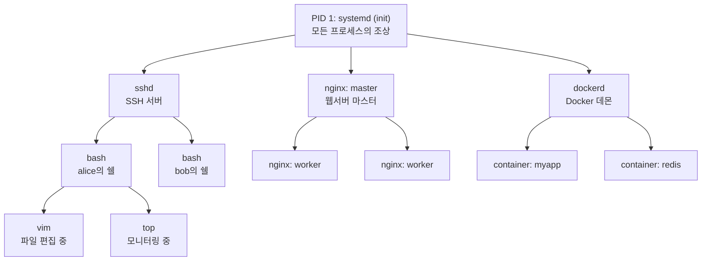
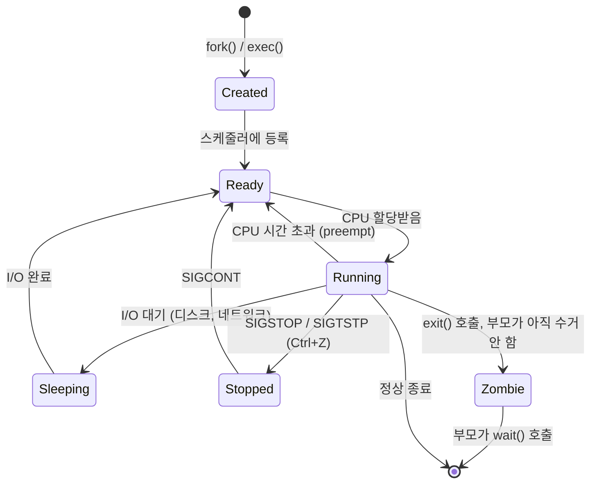
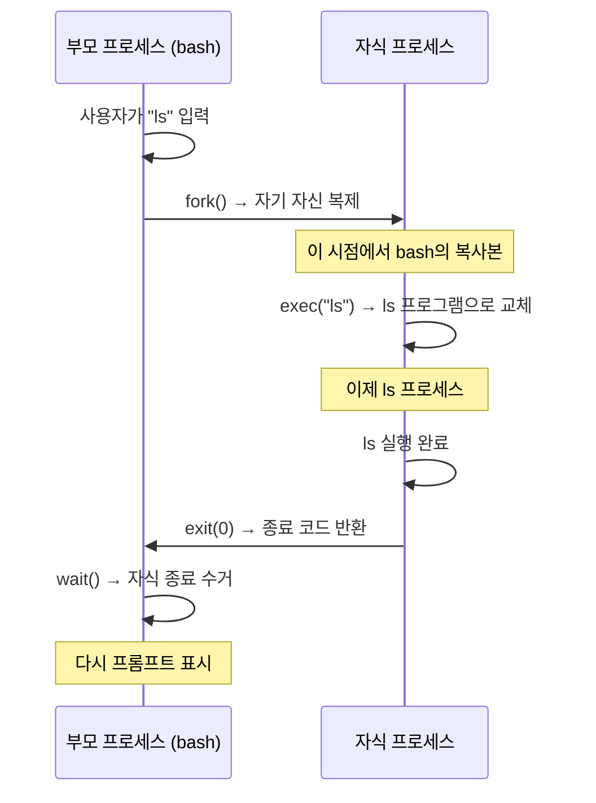
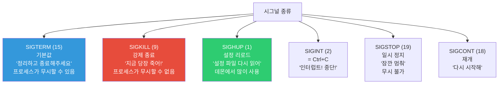
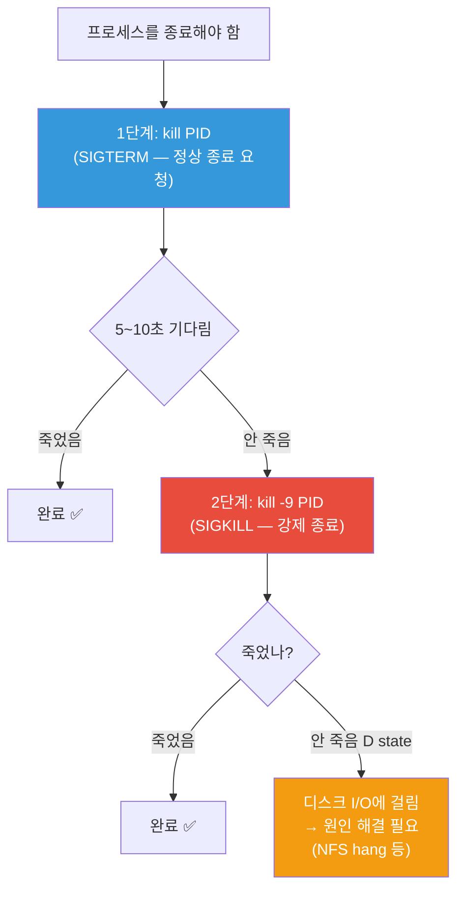
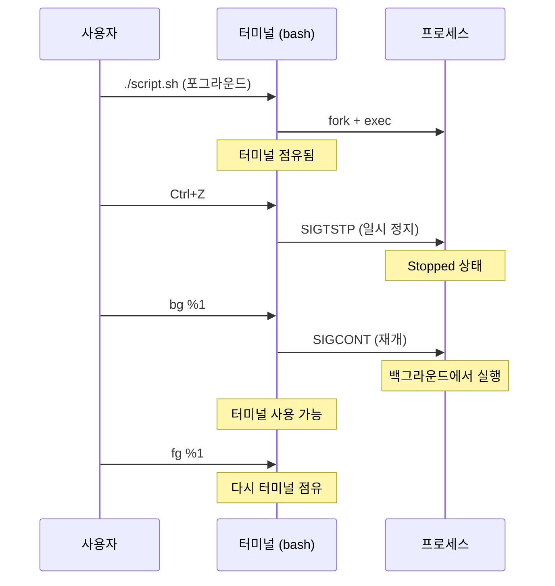
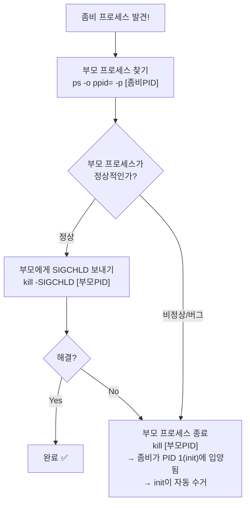

# Linux 프로세스 관리 (Process Lifecycle / Signals)

> 서버에서 돌아가는 모든 프로그램은 "프로세스"예요. 프로세스가 멈추면 서비스가 죽고, 프로세스가 미쳐 날뛰면 서버가 느려져요. 프로세스를 다루는 건 DevOps의 가장 기본적인 생존 기술이에요.

---

## 🎯 이걸 왜 알아야 하나?

실무에서 이런 상황이 매주 일어나요.

```
"서버가 갑자기 느려졌어요"          → 어떤 프로세스가 CPU를 다 먹고 있음
"앱이 응답을 안 해요"              → 프로세스가 멈춤(hang) 상태
"배포 후 서비스가 안 올라와요"      → 프로세스가 시작하자마자 죽음
"메모리 사용량이 계속 올라가요"     → 프로세스가 메모리 누수
"좀비 프로세스가 1000개래요"       → 자식 프로세스 정리 안 됨
```

프로세스를 이해하면 이 모든 상황에서 "어디를 봐야 하는지" 바로 알 수 있어요.

---

## 🧠 핵심 개념

### 비유: 식당 주방

식당 주방을 생각해보세요.

* **프로세스(Process)** = 요리사가 주문을 받고 요리하는 것. 레시피(프로그램)를 실행하는 하나의 작업 단위
* **PID** = 주문 번호. 각 요리(프로세스)마다 고유한 번호가 있어요
* **부모 프로세스(PPID)** = 주문을 넣은 사람. 모든 요리는 누군가가 시킨 거예요
* **쉘(Shell)** = 주문 접수 카운터. 손님(사용자)이 여기서 주문(명령어)을 넣어요
* **시그널(Signal)** = 주방장이 요리사에게 보내는 지시. "중단해!", "잠깐 멈춰!", "마무리해!"

### 프로세스 계층 구조

Linux에서 모든 프로세스는 **부모-자식 관계**로 연결되어 있어요. 가족 나무(tree)처럼요.



```bash
# 실제 프로세스 트리 보기
pstree -p
# systemd(1)─┬─sshd(800)─┬─sshd(1234)───bash(1235)───vim(1300)
#             │            └─sshd(1400)───bash(1401)───top(1500)
#             ├─nginx(900)─┬─nginx(901)
#             │             └─nginx(902)
#             ├─dockerd(1000)─┬─containerd-shim(1100)
#             │                └─containerd-shim(1200)
#             └─cron(500)

# 특정 프로세스의 트리만 보기
pstree -p 800
```

---

## 🔍 상세 설명

### 프로세스 라이프사이클

프로세스는 태어나고, 일하고, 죽어요. 이 과정을 이해하면 문제를 진단할 수 있어요.



**각 상태 설명:**

| 상태 | `ps` 표시 | 의미 | 비유 |
|------|----------|------|------|
| Running | `R` | CPU에서 실행 중 | 요리사가 요리하는 중 |
| Sleeping | `S` | 뭔가를 기다리는 중 (I/O 등) | 재료 배달 기다리는 중 |
| Disk Sleep | `D` | 디스크 I/O를 기다리는 중 (kill 불가!) | 오븐에서 꺼내기 기다리는 중 |
| Stopped | `T` | 일시 정지됨 | 요리사가 잠깐 쉬는 중 |
| Zombie | `Z` | 끝났는데 부모가 처리 안 함 | 요리 끝났는데 아무도 안 가져감 |

---

### fork()와 exec() — 프로세스가 태어나는 방법

Linux에서 새 프로세스는 항상 **기존 프로세스를 복제(fork)**한 후 **다른 프로그램으로 교체(exec)**하는 방식으로 만들어져요.



```bash
# 쉘에서 명령어를 실행하면 이 과정이 일어남
ls -la
# 1. bash가 fork() → 자식 bash 생성
# 2. 자식이 exec("ls") → ls로 교체
# 3. ls 실행 완료 → exit
# 4. 부모 bash가 wait() → 자식 수거
# 5. 다시 프롬프트 표시

# exit code 확인 (직전 명령어의 종료 코드)
echo $?
# 0     ← 성공
# 1     ← 일반적인 에러
# 127   ← 명령어를 못 찾음
# 130   ← Ctrl+C로 종료
# 137   ← kill -9로 죽음 (128 + 9)
```

---

### ps — 프로세스 목록 보기

`ps`는 프로세스를 보는 가장 기본적인 명령어예요.

```bash
# 현재 터미널의 프로세스만
ps
#   PID TTY          TIME CMD
#  1235 pts/0    00:00:00 bash
#  1400 pts/0    00:00:00 ps

# 전체 프로세스 (가장 많이 쓰는 옵션)
ps aux
# USER       PID %CPU %MEM    VSZ   RSS TTY      STAT START   TIME COMMAND
# root         1  0.0  0.2 169608 11456 ?        Ss   Mar10   0:08 /sbin/init
# root       800  0.0  0.1  15432  5888 ?        Ss   Mar10   0:00 sshd: /usr/sbin/sshd
# www-data   901  0.0  0.3  55556 14336 ?        S    Mar10   0:15 nginx: worker process
# ubuntu    1235  0.0  0.1   8960  5120 pts/0    Ss   10:00   0:00 -bash
# root      2000  2.5  5.0 712344 204800 ?       Ssl  09:00   1:30 /usr/bin/dockerd
# mysql     3000  1.2 10.0 1234567 409600 ?      Ssl  Mar10  15:00 /usr/sbin/mysqld
# ubuntu    4000 99.0  0.1  10240  4096 pts/1    R+   10:30   5:00 python infinite_loop.py
```

**각 컬럼의 의미:**

| 컬럼 | 의미 | 실무에서 주목할 때 |
|------|------|-----------------|
| USER | 실행한 사용자 | 어떤 계정으로 돌고 있나 |
| PID | 프로세스 ID | kill 할 때 필요 |
| %CPU | CPU 사용률 | 높으면 원인 파악 필요 |
| %MEM | 메모리 사용률 | 높으면 메모리 누수 의심 |
| VSZ | 가상 메모리 (KB) | 참고용 |
| RSS | 실제 메모리 (KB) | 이게 진짜 메모리 사용량 |
| STAT | 프로세스 상태 | R, S, D, Z, T 등 |
| TIME | 누적 CPU 시간 | 오래 돌았는지 확인 |
| COMMAND | 실행 명령어 | 뭘 하는 프로세스인지 |

**STAT 컬럼 읽는 법:**

```
S    = Sleeping (I/O 대기 중) — 정상
Ss   = Sleeping + session leader — 정상
R+   = Running + foreground — 실행 중
Ssl  = Sleeping + session leader + multi-thread — 정상
D    = Disk sleep — ⚠️ I/O에 막혀있음 (kill 안 됨)
Z    = Zombie — ⚠️ 정리 안 된 프로세스
T    = Stopped — 일시 정지됨

첫 글자 뒤의 문자들:
s = session leader
l = multi-threaded
+ = foreground process group
< = high priority
N = low priority
```

```bash
# 실무에서 자주 쓰는 ps 조합

# CPU 많이 쓰는 순으로 정렬
ps aux --sort=-%cpu | head -10
# USER       PID %CPU %MEM    VSZ   RSS TTY      STAT START   TIME COMMAND
# ubuntu    4000 99.0  0.1  10240  4096 pts/1    R+   10:30   5:00 python infinite_loop.py
# root      2000  2.5  5.0 712344 204800 ?       Ssl  09:00   1:30 /usr/bin/dockerd
# mysql     3000  1.2 10.0 1234567 409600 ?      Ssl  Mar10  15:00 /usr/sbin/mysqld
# ...

# 메모리 많이 쓰는 순으로 정렬
ps aux --sort=-%mem | head -10

# 특정 프로세스 찾기
ps aux | grep nginx
# root       900  0.0  0.1  10564  5120 ?        Ss   Mar10   0:00 nginx: master process
# www-data   901  0.0  0.3  55556 14336 ?        S    Mar10   0:15 nginx: worker process
# www-data   902  0.0  0.3  55480 14208 ?        S    Mar10   0:14 nginx: worker process
# ubuntu    5000  0.0  0.0   6432   720 pts/0    S+   10:35   0:00 grep nginx
#                                                                    ^^^^^^^^^^^^
#                                                                    grep 자기 자신도 나옴!

# grep 자기 자신 제외하는 트릭
ps aux | grep [n]ginx
# 또는
ps aux | grep nginx | grep -v grep
# 또는 (추천)
pgrep -a nginx
# 900 nginx: master process /usr/sbin/nginx
# 901 nginx: worker process
# 902 nginx: worker process

# 부모-자식 관계까지 보기
ps -ef
# UID        PID  PPID  C STIME TTY          TIME CMD
# root         1     0  0 Mar10 ?        00:00:08 /sbin/init
# root       800     1  0 Mar10 ?        00:00:00 sshd
# root      1234   800  0 10:00 ?        00:00:00 sshd: ubuntu
# ubuntu    1235  1234  0 10:00 pts/0    00:00:00 -bash

# 특정 PID의 부모 찾기
ps -o ppid= -p 1235
# 1234
```

---

### top / htop — 실시간 모니터링

`ps`가 스냅샷이라면, `top`은 실시간 CCTV예요.

```bash
# top 실행
top

# 출력 예시:
# top - 10:30:00 up 2 days,  3:15,  2 users,  load average: 1.50, 0.80, 0.60
# Tasks: 150 total,   2 running, 147 sleeping,   0 stopped,   1 zombie
# %Cpu(s): 25.0 us,  5.0 sy,  0.0 ni, 68.0 id,  1.0 wa,  0.0 hi,  1.0 si
# MiB Mem :   4096.0 total,    512.0 free,   2048.0 used,   1536.0 buff/cache
# MiB Swap:   2048.0 total,   2000.0 free,     48.0 used.   1800.0 avail Mem
#
#   PID USER      PR  NI    VIRT    RES    SHR S  %CPU  %MEM     TIME+ COMMAND
#  4000 ubuntu    20   0   10240   4096   2048 R  99.0   0.1   5:00.00 python
#  2000 root      20   0  712344 204800  40960 S   2.5   5.0   1:30.00 dockerd
#  3000 mysql     20   0 1234567 409600  20480 S   1.2  10.0  15:00.00 mysqld
#   901 www-data  20   0   55556  14336   8192 S   0.5   0.3   0:15.00 nginx
```

**윗부분 해설:**

```
load average: 1.50, 0.80, 0.60
              ^^^^  ^^^^  ^^^^
              1분    5분   15분 평균

# CPU 코어가 4개인 서버라면:
# 1.50 → 코어의 37.5% 사용 (여유 있음)
# 4.00 → 코어의 100% 사용 (한계)
# 8.00 → CPU 대기열 발생 (느려짐!)

# 경험 법칙: load average ÷ CPU 코어 수
# < 0.7  → 여유
# 0.7~1.0 → 적정
# > 1.0  → 과부하

# CPU 코어 수 확인
nproc
# 4
```

```
%Cpu(s): 25.0 us,  5.0 sy,  0.0 ni, 68.0 id,  1.0 wa,  0.0 hi,  1.0 si
         ^^^^^^    ^^^^^^            ^^^^^^    ^^^^^^
         user      system            idle      I/O wait

# us (user): 앱이 쓰는 CPU → 높으면 앱이 바쁨
# sy (system): 커널이 쓰는 CPU → 높으면 시스템 호출 많음
# id (idle): 놀고 있는 CPU → 높을수록 여유
# wa (I/O wait): 디스크 기다리는 CPU → 높으면 디스크 병목!
```

**top 단축키 (실행 중에):**

| 키 | 동작 |
|----|------|
| `1` | CPU 코어별로 분리해서 보기 |
| `M` | 메모리 순으로 정렬 |
| `P` | CPU 순으로 정렬 (기본) |
| `k` | 프로세스 kill (PID 입력) |
| `u` | 특정 사용자 프로세스만 보기 |
| `c` | 전체 명령어 경로 토글 |
| `H` | 스레드 보기 |
| `q` | 종료 |

#### htop — top의 업그레이드 버전

```bash
# 설치
sudo apt install htop    # Ubuntu/Debian
sudo yum install htop    # CentOS/RHEL

# 실행
htop
```

`htop`이 `top`보다 나은 점:
* 컬러풀한 UI, CPU/메모리 바 그래프
* 마우스 클릭으로 정렬 가능
* 프로세스 트리 보기 (F5)
* 검색/필터 기능 (F3, F4)
* 여러 프로세스 선택해서 한번에 kill (Space → F9)

---

### kill — 프로세스에 시그널 보내기

`kill`은 "죽이는 것"이 아니라 **프로세스에 시그널(신호)을 보내는 것**이에요.

#### 시그널 종류



**전체 시그널 목록:**

```bash
kill -l
#  1) SIGHUP       2) SIGINT       3) SIGQUIT      4) SIGILL
#  5) SIGTRAP      6) SIGABRT      7) SIGBUS       8) SIGFPE
#  9) SIGKILL     10) SIGUSR1     11) SIGSEGV     12) SIGUSR2
# 13) SIGPIPE     14) SIGALRM     15) SIGTERM     17) SIGCHLD
# 18) SIGCONT     19) SIGSTOP     20) SIGTSTP     ...
```

**실무에서 주로 쓰는 시그널:**

| 시그널 | 번호 | 키보드 | 용도 | 프로세스가 무시 가능? |
|--------|------|--------|------|---------------------|
| SIGTERM | 15 | — | 정상 종료 요청 (기본값) | ✅ 가능 |
| SIGKILL | 9 | — | 강제 종료 (최후의 수단) | ❌ 불가능 |
| SIGINT | 2 | Ctrl+C | 인터럽트 (터미널에서) | ✅ 가능 |
| SIGHUP | 1 | — | 설정 리로드 | ✅ 가능 |
| SIGTSTP | 20 | Ctrl+Z | 일시 정지 (터미널에서) | ✅ 가능 |
| SIGSTOP | 19 | — | 강제 일시 정지 | ❌ 불가능 |
| SIGCONT | 18 | — | 정지된 프로세스 재개 | — |

#### kill 명령어 사용법

```bash
# SIGTERM (15) — 정상 종료 요청 (항상 이걸 먼저!)
kill 4000
# 또는
kill -15 4000
# 또는
kill -SIGTERM 4000

# SIGKILL (9) — 강제 종료 (SIGTERM이 안 먹힐 때만!)
kill -9 4000
# 또는
kill -SIGKILL 4000

# SIGHUP (1) — 설정 리로드 (서비스 재시작 없이 설정 적용)
kill -HUP 900     # nginx master에게 설정 리로드 요청
# nginx는 이 시그널을 받으면:
# 1. 새 설정 파일 읽기
# 2. 새 worker 프로세스 생성
# 3. 기존 worker는 현재 요청 처리 후 종료
# → 무중단으로 설정 변경!

# 이름으로 kill (PID 모를 때)
pkill nginx          # nginx라는 이름의 프로세스에 SIGTERM
pkill -9 nginx       # 강제 종료
pkill -u alice       # alice 사용자의 모든 프로세스 종료

# 정확한 이름으로 kill
killall nginx

# 패턴으로 kill
pkill -f "python.*infinite_loop"   # 명령어 전체에서 패턴 매칭
```

#### 프로세스 종료 순서 (실무 베스트 프랙티스)



```bash
# 실무 스크립트: 안전한 프로세스 종료

# 1단계: SIGTERM
kill 4000
echo "SIGTERM 보냄. 10초 대기..."

# 2단계: 기다리기
sleep 10

# 3단계: 아직 살아있으면 SIGKILL
if kill -0 4000 2>/dev/null; then
    echo "아직 살아있음. SIGKILL 보냄."
    kill -9 4000
else
    echo "정상 종료됨."
fi
```

---

### 포그라운드 vs 백그라운드

```bash
# 포그라운드 (Foreground) — 터미널을 점유
./long_running_script.sh
# 터미널이 멈춤. 다른 명령어 입력 불가.
# Ctrl+C → 프로세스 종료
# Ctrl+Z → 프로세스 일시 정지 (Stopped)

# 백그라운드 (Background) — 터미널 안 점유
./long_running_script.sh &
# [1] 5000    ← 작업번호 1, PID 5000
# 터미널을 계속 쓸 수 있음

# 현재 백그라운드 작업 목록
jobs
# [1]+  Running                 ./long_running_script.sh &
# [2]-  Stopped                 vim config.yaml

# 포그라운드 → 백그라운드 전환
./long_running_script.sh     # 실행 중...
# Ctrl+Z                     # 일시 정지
# [1]+  Stopped
bg %1                        # 백그라운드에서 재개
# [1]+ ./long_running_script.sh &

# 백그라운드 → 포그라운드 전환
fg %1                        # 작업번호 1을 포그라운드로

# SSH 끊어도 프로세스 유지하기
nohup ./long_running_script.sh &
# nohup: ignoring input and appending output to 'nohup.out'
# [1] 5000
# → SSH 끊어도 프로세스가 계속 실행됨
# → 출력은 nohup.out 파일에 저장

# 또는 disown 사용
./long_running_script.sh &
disown %1    # 현재 쉘에서 분리 → SSH 끊어도 생존
```



---

### 좀비 프로세스 (Zombie)

자식 프로세스가 종료됐는데 부모가 `wait()`으로 수거하지 않은 상태예요.

**비유:** 음식점에서 요리가 나왔는데(자식 종료) 서빙 직원(부모)이 가져가지 않고 방치한 상태예요. 테이블(PID)만 차지하고 있어요.

```bash
# 좀비 프로세스 찾기
ps aux | grep Z
#   PID USER  ... STAT ...  COMMAND
# 6000 root  ...  Z   ...  [myapp] <defunct>
#                  ^                ^^^^^^^^^
#                  좀비!            "사망한" 표시

# 좀비 프로세스 수 확인
ps aux | awk '$8 ~ /Z/ {count++} END {print count}'
# 3

# 또는 top에서 확인
top
# Tasks: 150 total, 2 running, 147 sleeping, 0 stopped, 1 zombie
#                                                        ^^^^^^^^
```

**좀비 프로세스 처리 방법:**



```bash
# 1. 좀비의 부모 찾기
ps -o pid,ppid,stat,cmd -p 6000
#   PID  PPID STAT CMD
#  6000  5500    Z [myapp] <defunct>
# → 부모 PID는 5500

# 2. 부모에게 SIGCHLD 보내기 (자식 수거하라는 신호)
kill -SIGCHLD 5500

# 3. 안 되면 부모를 종료
kill 5500
# → 좀비가 PID 1(systemd)에 입양됨
# → systemd가 자동으로 수거
```

**좀비 프로세스가 위험한가요?**

좀비 자체는 CPU나 메모리를 거의 안 써요. 하지만 PID를 점유하기 때문에, 좀비가 수천 개 쌓이면 새 프로세스를 못 만들 수 있어요.

---

### /proc/[PID] — 프로세스 상세 정보

```bash
# nginx master의 PID가 900이라면

# 프로세스 상태
cat /proc/900/status
# Name:   nginx
# Umask:  0022
# State:  S (sleeping)
# Tgid:   900
# Pid:    900
# PPid:   1
# Uid:    0       0       0       0
# Gid:    0       0       0       0
# Threads:        1
# VmPeak:   10564 kB
# VmRSS:     5120 kB

# 실행된 명령어
cat /proc/900/cmdline | tr '\0' ' '
# nginx: master process /usr/sbin/nginx -g daemon on; master_process on;

# 열린 파일 목록
ls -la /proc/900/fd/
# lr-x------ 1 root root 64 ... 0 -> /dev/null
# l-wx------ 1 root root 64 ... 1 -> /var/log/nginx/access.log
# l-wx------ 1 root root 64 ... 2 -> /var/log/nginx/error.log
# lrwx------ 1 root root 64 ... 6 -> socket:[12345]
# → 어떤 파일/소켓을 열고 있는지 확인 가능

# 환경 변수
cat /proc/900/environ | tr '\0' '\n'
# PATH=/usr/local/sbin:/usr/local/bin:...
# HOME=/root
# ...

# 메모리 맵
cat /proc/900/maps | head -10

# 리소스 제한
cat /proc/900/limits
# Limit                     Soft Limit  Hard Limit  Units
# Max open files            1024        1048576     files
# Max processes             7823        7823        processes
```

---

## 💻 실습 예제

### 실습 1: 프로세스 기본 탐험

```bash
# 1. 현재 터미널의 프로세스
echo "내 PID: $$"
echo "부모 PID: $PPID"

# 2. 전체 프로세스 수
ps aux | wc -l

# 3. CPU 많이 쓰는 Top 5
ps aux --sort=-%cpu | head -6

# 4. 메모리 많이 쓰는 Top 5
ps aux --sort=-%mem | head -6

# 5. 프로세스 트리
pstree -p | head -30

# 6. 특정 프로세스 정보
ps -fp $(pgrep -o sshd)
```

### 실습 2: 시그널 체험하기

```bash
# 1. 테스트용 무한 루프 만들기
cat > /tmp/test_process.sh << 'EOF'
#!/bin/bash
echo "PID: $$"
echo "시작됨. Ctrl+C 또는 kill로 종료하세요."

# SIGTERM 핸들러 등록
trap "echo '  SIGTERM 받음! 정리 중...'; sleep 2; echo '정리 완료. 종료.'; exit 0" SIGTERM
# SIGHUP 핸들러 등록
trap "echo '  SIGHUP 받음! 설정 리로드 시뮬레이션.'" SIGHUP
# SIGINT 핸들러 등록 (Ctrl+C)
trap "echo '  SIGINT(Ctrl+C) 받음! 종료.'; exit 0" SIGINT

count=0
while true; do
    count=$((count + 1))
    echo "작업 중... ($count)"
    sleep 3
done
EOF
chmod +x /tmp/test_process.sh

# 2. 터미널 1에서 실행
/tmp/test_process.sh
# PID: 7000
# 시작됨. Ctrl+C 또는 kill로 종료하세요.
# 작업 중... (1)
# 작업 중... (2)

# 3. 터미널 2에서 시그널 보내기

# SIGHUP — 설정 리로드
kill -HUP 7000
# 터미널 1에서: "SIGHUP 받음! 설정 리로드 시뮬레이션."

# SIGTERM — 정상 종료
kill 7000
# 터미널 1에서: "SIGTERM 받음! 정리 중..."
#              "정리 완료. 종료."

# 4. 다시 실행 후 SIGKILL 테스트
/tmp/test_process.sh &
# [1] 7100

kill -9 7100
# → 핸들러가 실행되지 않고 즉시 죽음! (정리 코드 실행 안 됨)
# → 그래서 SIGKILL은 최후의 수단
```

### 실습 3: 포그라운드/백그라운드 전환

```bash
# 1. 포그라운드로 실행
sleep 300

# 2. Ctrl+Z로 정지
# [1]+  Stopped                 sleep 300

# 3. 백그라운드로 보내기
bg %1
# [1]+ sleep 300 &

# 4. 작업 목록 확인
jobs
# [1]+  Running                 sleep 300 &

# 5. 다시 포그라운드로
fg %1

# 6. Ctrl+C로 종료

# 7. nohup 테스트
nohup sleep 600 &
# [1] 8000
exit              # 세션 종료
# 다시 접속 후
ps aux | grep "sleep 600"
# → 아직 살아있음!
```

### 실습 4: 좀비 프로세스 만들고 해결하기

```bash
# 좀비를 만드는 스크립트
cat > /tmp/make_zombie.sh << 'EOF'
#!/bin/bash
echo "부모 PID: $$"

# 자식 프로세스를 만들고 wait하지 않음
bash -c 'echo "자식 PID: $$"; exit 0' &

echo "자식을 wait하지 않고 30초 대기..."
sleep 30
# → 이 30초 동안 자식은 좀비 상태
echo "부모 종료"
EOF
chmod +x /tmp/make_zombie.sh

# 실행
/tmp/make_zombie.sh &

# 좀비 확인
sleep 2
ps aux | grep Z
# → <defunct>가 보이면 좀비!

# 부모가 종료되면 좀비도 사라짐 (systemd가 수거)
```

---

## 🏢 실무에서는?

### 시나리오 1: 서버가 느려졌을 때 원인 찾기

```bash
# 1단계: 시스템 전체 상태 확인
top
# load average: 8.50, 7.20, 5.00  ← CPU 코어 4개인데 8.5? 과부하!
# %Cpu(s): 95.0 us ← 사용자 프로세스가 CPU를 거의 다 쓰고 있음

# 2단계: CPU 먹는 놈 찾기
ps aux --sort=-%cpu | head -5
#   PID USER     %CPU %MEM COMMAND
#  4000 ubuntu   98.0  0.1 python infinite_loop.py    ← 범인!
#  2000 root      2.0  5.0 /usr/bin/dockerd

# 3단계: 이 프로세스가 뭔지 확인
cat /proc/4000/cmdline | tr '\0' ' '
# python /home/ubuntu/infinite_loop.py

ls -la /proc/4000/cwd
# /home/ubuntu/project    ← 어떤 디렉토리에서 실행됐는지

cat /proc/4000/status | grep -E "Name|State|Threads|VmRSS"
# Name:   python
# State:  R (running)
# Threads:        1
# VmRSS:     4096 kB

# 4단계: 조치
kill 4000         # 먼저 SIGTERM
sleep 5
kill -9 4000      # 안 죽으면 SIGKILL
```

### 시나리오 2: D 상태 (Uninterruptible Sleep) 프로세스

```bash
# D 상태 프로세스는 kill -9로도 안 죽어요!
ps aux | grep " D "
#  PID USER   STAT COMMAND
# 9000 root     D  /usr/bin/rsync -a /mnt/nfs/...

# D 상태 = 디스크/네트워크 I/O를 기다리는 중
# 주로 NFS 마운트 hang, 디스크 장애 시 발생

# 원인 확인
cat /proc/9000/wchan
# nfs_wait_on_request    ← NFS가 응답을 안 하고 있음

# 해결: 프로세스를 죽이는 게 아니라 원인(NFS)을 해결해야 함
# 1. NFS 서버 상태 확인
# 2. 네트워크 확인
# 3. 최악의 경우: lazy umount
sudo umount -l /mnt/nfs
```

### 시나리오 3: 무중단으로 Nginx 설정 변경

```bash
# Nginx를 재시작하면 순간적으로 접속이 끊김
# 대신 SIGHUP으로 무중단 리로드!

# 1. 설정 파일 수정
sudo vim /etc/nginx/nginx.conf

# 2. 설정 문법 검사 (먼저!)
sudo nginx -t
# nginx: the configuration file /etc/nginx/nginx.conf syntax is ok
# nginx: configuration file /etc/nginx/nginx.conf test is successful

# 3. 무중단 리로드
sudo kill -HUP $(cat /var/run/nginx.pid)
# 또는
sudo nginx -s reload
# 또는
sudo systemctl reload nginx

# 이 과정에서 일어나는 일:
# 1. master 프로세스가 새 설정 읽음
# 2. 새 worker 프로세스 생성 (새 설정 적용)
# 3. 기존 worker는 처리 중인 요청 완료 후 종료
# → 클라이언트는 끊김을 느끼지 못함!
```

### 시나리오 4: 앱이 자꾸 죽을 때 원인 파악

```bash
# 앱이 시작하자마자 죽거나, 주기적으로 죽는 경우

# 1. 최근 종료된 프로세스의 종료 코드 확인
dmesg | grep -i "killed\|oom" | tail -5
# [12345.678] Out of memory: Killed process 5000 (myapp) total-vm:2048000kB
# → OOM Killer가 메모리 부족으로 죽였음!

# 2. 프로세스 자원 사용량 추적
pidstat -p $(pgrep myapp) 1
# 10:30:01   UID  PID    %usr  %system  %guest  %CPU   Command
# 10:30:02  1000  5000   45.0     5.0     0.0   50.0   myapp
# 10:30:03  1000  5000   48.0     6.0     0.0   54.0   myapp

# 3. 메모리 사용 추이 보기
while true; do
    ps -o pid,rss,vsz,cmd -p $(pgrep myapp) 2>/dev/null
    sleep 5
done
# RSS(실제 메모리)가 계속 올라가면 → 메모리 누수!

# 4. systemd 서비스라면 로그 확인
journalctl -u myapp --since "1 hour ago" | tail -30
```

---

## ⚠️ 자주 하는 실수

### 1. 무조건 kill -9부터 쓰기

```bash
# ❌ SIGKILL은 정리(cleanup) 기회를 안 줌
kill -9 5000
# → 임시 파일 안 지워짐
# → DB 연결 안 닫힘
# → 로그 flush 안 됨
# → lock 파일 안 지워져서 다음 시작 시 문제

# ✅ 항상 SIGTERM 먼저, 안 되면 SIGKILL
kill 5000
sleep 5
kill -0 5000 2>/dev/null && kill -9 5000
```

### 2. PID 파일을 맹신하기

```bash
# ❌ PID 파일이 stale(오래된) 일 수 있음
kill $(cat /var/run/nginx.pid)
# → 이전 프로세스가 죽으면서 PID 파일은 남아있을 수 있음
# → 다른 프로세스가 그 PID를 받았을 수도 있음!

# ✅ PID + 프로세스 이름 같이 확인
PID=$(cat /var/run/nginx.pid)
if ps -p $PID -o comm= | grep -q nginx; then
    kill $PID
else
    echo "PID $PID는 nginx가 아닙니다!"
fi

# 또는 pkill/pgrep 사용 (이름 기반이라 안전)
pkill nginx
```

### 3. Ctrl+C가 안 먹힐 때 당황하기

```bash
# Ctrl+C (SIGINT)를 무시하는 프로세스도 있음
# 그럴 때는:

# 방법 1: Ctrl+\ (SIGQUIT — core dump 생성)
# 방법 2: 다른 터미널에서 kill
# 방법 3: Ctrl+Z → kill %1
```

### 4. 백그라운드 프로세스가 SSH 끊으면 죽는 걸 모르기

```bash
# ❌ SSH 끊으면 같이 죽음
./long_script.sh &
exit    # → long_script.sh도 죽음

# ✅ SSH 끊어도 살아남게 하려면
nohup ./long_script.sh &
# 또는
./long_script.sh &
disown %1
# 또는 (더 좋은 방법)
# tmux나 screen 사용 → 다음 세션에서 다시 붙을 수 있음
```

### 5. 좀비 프로세스를 kill하려고 하기

```bash
# ❌ 좀비는 이미 죽은 프로세스. kill이 안 먹힘!
kill -9 6000    # 좀비에게 SIGKILL → 효과 없음

# ✅ 부모 프로세스를 처리해야 함
PPID=$(ps -o ppid= -p 6000)
kill $PPID    # 부모가 죽으면 좀비는 init에 입양 → 자동 수거
```

---

## 📝 정리

### 프로세스 상태 한눈에

```
R (Running)  — 실행 중 → 정상
S (Sleeping) — 대기 중 → 정상
D (Disk)     — I/O 대기 → kill -9 안 먹힘! 원인 해결 필요
T (Stopped)  — 일시 정지 → SIGCONT로 재개
Z (Zombie)   — 좀비 → 부모 프로세스 처리 필요
```

### 시그널 치트시트

```
kill PID           → SIGTERM (15) — 정상 종료 (항상 먼저!)
kill -9 PID        → SIGKILL (9)  — 강제 종료 (최후의 수단)
kill -HUP PID      → SIGHUP (1)  — 설정 리로드
Ctrl+C             → SIGINT (2)  — 인터럽트
Ctrl+Z             → SIGTSTP (20) — 일시 정지
```

### 핵심 명령어

```bash
ps aux                    # 전체 프로세스
ps aux --sort=-%cpu       # CPU 순
ps aux --sort=-%mem       # 메모리 순
pgrep -a [이름]           # 이름으로 검색
top / htop                # 실시간 모니터링
pstree -p                 # 프로세스 트리
kill / pkill / killall    # 시그널 보내기
jobs / bg / fg            # 작업 관리
nohup [cmd] &             # SSH 끊어도 유지
```

---

## 🔗 다음 강의

다음은 **[01-linux/05-systemd.md — systemd와 서비스 관리](./05-systemd)** 예요.

프로세스를 수동으로 관리하는 건 한계가 있어요. "Nginx가 죽으면 자동으로 다시 켜줘", "서버 부팅하면 자동으로 시작해줘" — 이런 걸 해주는 게 systemd예요. 현대 Linux 서비스 관리의 핵심이에요.
