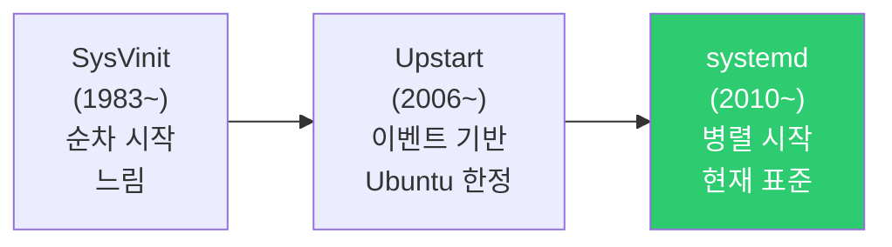
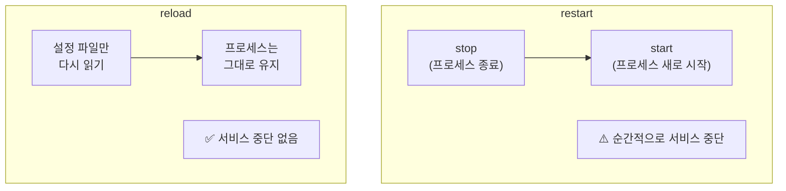
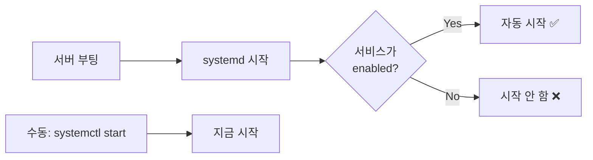
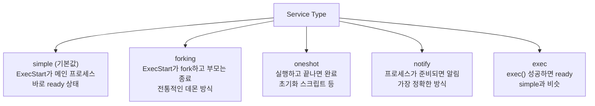
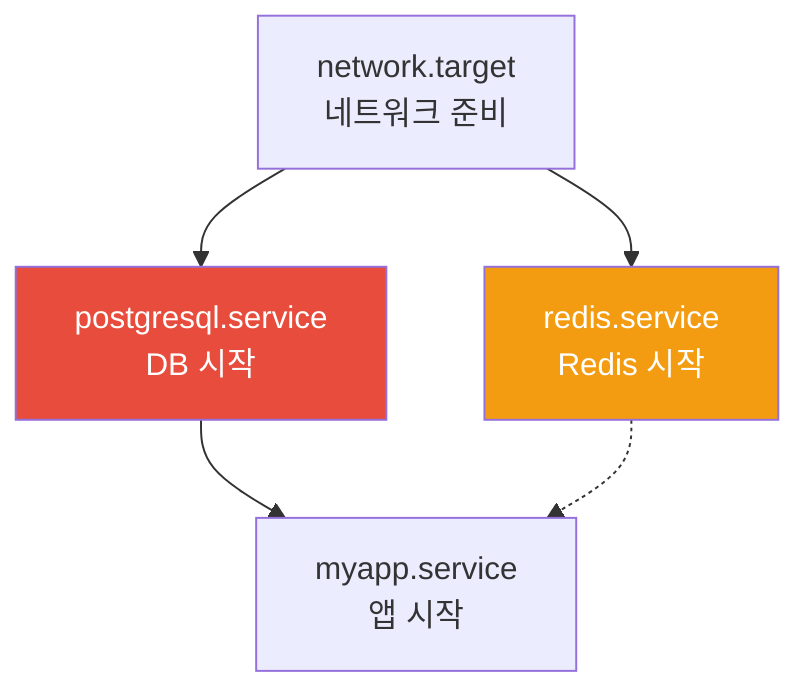

# systemd와 서비스 관리

> "서버를 재부팅했더니 Nginx가 안 올라와요", "앱이 죽으면 자동으로 다시 시작할 수 없나요?" — 이런 문제를 해결하는 게 systemd예요. 현대 Linux에서 서비스를 관리하는 핵심 시스템이에요.

---

## 🎯 이걸 왜 알아야 하나?

DevOps 실무에서 매일 하는 일이에요.

```
"Nginx 재시작해주세요"              → systemctl restart nginx
"서버 부팅하면 앱이 자동 시작되게"    → systemctl enable myapp
"앱이 죽으면 자동으로 살려줘"        → Restart=always 설정
"왜 서비스가 안 올라오지?"          → systemctl status + journalctl
"우리 앱을 시스템 서비스로 등록하고 싶어" → .service 파일 작성
```

systemd를 모르면 서비스 하나 재시작하는 것도 다른 사람에게 물어봐야 해요. systemd를 알면 서비스의 생사를 내 손으로 관리할 수 있어요.

---

## 🧠 핵심 개념

### 비유: 건물 관리 시스템

아파트 건물의 자동 관리 시스템을 생각해보세요.

* **systemd** = 건물 중앙 관리 시스템. 전기, 수도, 엘리베이터, 보안을 전부 관리
* **서비스(Service)** = 각 설비. 엘리베이터, 보일러, CCTV 등
* **Unit** = 관리 대상 하나하나. 서비스뿐만 아니라 타이머, 소켓, 마운트 등 다양함
* **systemctl** = 관리자가 쓰는 리모컨. "엘리베이터 켜", "보일러 상태 확인" 등

이 관리 시스템은:
* 건물 전원이 들어오면(부팅) 필요한 설비를 순서대로 켜요
* 설비가 고장 나면(프로세스 죽으면) 자동으로 다시 켜요
* 어떤 설비가 다른 설비에 의존하면(DB → 앱) 순서를 맞춰요

### init 시스템의 역사



현재 대부분의 Linux 배포판(Ubuntu, CentOS, Debian, Fedora, RHEL)은 systemd를 사용해요.

```bash
# 현재 init 시스템 확인
ps -p 1 -o comm=
# systemd

# systemd 버전 확인
systemd --version
# systemd 249 (249.11-0ubuntu3)
```

---

## 🔍 상세 설명

### Unit의 종류

systemd가 관리하는 대상을 **Unit**이라고 불러요. 서비스만 관리하는 게 아니에요.

| Unit 타입 | 확장자 | 역할 | 예시 |
|-----------|--------|------|------|
| Service | `.service` | 프로세스/데몬 관리 | nginx.service, docker.service |
| Timer | `.timer` | 예약 작업 (cron 대체) | backup.timer |
| Socket | `.socket` | 소켓 활성화 | docker.socket |
| Mount | `.mount` | 파일 시스템 마운트 | home.mount |
| Target | `.target` | Unit 그룹 (런레벨) | multi-user.target |
| Path | `.path` | 파일/디렉토리 감시 | myapp-config.path |
| Slice | `.slice` | 리소스 그룹 (cgroup) | user.slice |

실무에서 95%는 `.service`와 `.timer`를 다루게 돼요.

---

### systemctl — 서비스 관리 리모컨

#### 기본 명령어

```bash
# 서비스 시작
sudo systemctl start nginx

# 서비스 중지
sudo systemctl stop nginx

# 서비스 재시작 (stop → start)
sudo systemctl restart nginx

# 서비스 리로드 (설정만 다시 읽기, 프로세스 유지)
sudo systemctl reload nginx

# 재시작 또는 리로드 (리로드 가능하면 리로드, 아니면 재시작)
sudo systemctl reload-or-restart nginx
```

**restart vs reload:**



```bash
# Nginx 예시
# reload: master 프로세스가 새 설정을 읽고, 새 worker를 만들고, 기존 worker는 자연 종료
# → 클라이언트 끊김 없음!

# restart: 모든 프로세스가 죽었다가 다시 시작
# → 순간적으로 접속 불가

# 결론: 설정 변경 시에는 reload를 먼저 시도!
sudo systemctl reload nginx
```

#### 부팅 시 자동 시작

```bash
# 부팅 시 자동 시작 활성화
sudo systemctl enable nginx
# Created symlink /etc/systemd/system/multi-user.target.wants/nginx.service
#                 → /lib/systemd/system/nginx.service

# 자동 시작 비활성화
sudo systemctl disable nginx
# Removed /etc/systemd/system/multi-user.target.wants/nginx.service

# enable + 지금 바로 start (한 줄로)
sudo systemctl enable --now nginx

# disable + 지금 바로 stop (한 줄로)
sudo systemctl disable --now nginx

# 자동 시작 설정 확인
systemctl is-enabled nginx
# enabled
```



#### 서비스 상태 확인

```bash
systemctl status nginx
# ● nginx.service - A high performance web server and a reverse proxy server
#      Loaded: loaded (/lib/systemd/system/nginx.service; enabled; vendor preset: enabled)
#      Active: active (running) since Wed 2025-03-12 09:00:00 UTC; 5h ago
#        Docs: man:nginx(8)
#     Process: 850 ExecStartPre=/usr/sbin/nginx -t -q -g daemon on; master_process on; (code=exited, status=0/SUCCESS)
#    Main PID: 900 (nginx)
#       Tasks: 3 (limit: 4915)
#      Memory: 8.5M
#         CPU: 150ms
#      CGroup: /system.slice/nginx.service
#              ├─900 "nginx: master process /usr/sbin/nginx -g daemon on; master_process on;"
#              ├─901 "nginx: worker process"
#              └─902 "nginx: worker process"
#
# Mar 12 09:00:00 server01 systemd[1]: Starting A high performance web server...
# Mar 12 09:00:00 server01 systemd[1]: Started A high performance web server.
```

**출력 해설:**

```
● (녹색 점)     → 정상 실행 중
● (빨간 점)     → 실패 / 비정상
○ (흰 점)       → 비활성 (stopped)

Loaded: loaded (/lib/systemd/system/nginx.service; enabled; ...)
        ^^^^^^^  ^^^^^^^^^^^^^^^^^^^^^^^^^^^^^^^^^^^^^  ^^^^^^^
        읽기 성공  Unit 파일 경로                         부팅 시 자동 시작

Active: active (running) since Wed 2025-03-12 09:00:00 UTC; 5h ago
        ^^^^^^^^^^^^^^^^
        상태: 실행 중

Main PID: 900 (nginx)    → 메인 프로세스 PID
Tasks: 3                 → 스레드/프로세스 수
Memory: 8.5M             → 메모리 사용량
CPU: 150ms               → 누적 CPU 시간
CGroup: ...              → 프로세스 트리
```

**Active 상태 종류:**

| 상태 | 의미 |
|------|------|
| `active (running)` | 정상 실행 중 |
| `active (exited)` | 실행 완료 (oneshot 타입) |
| `active (waiting)` | 이벤트 대기 중 |
| `inactive (dead)` | 중지됨 |
| `failed` | 실패 (에러 발생) |
| `activating` | 시작하는 중 |
| `deactivating` | 중지하는 중 |

#### 서비스 목록 조회

```bash
# 실행 중인 서비스만
systemctl list-units --type=service --state=running
# UNIT                     LOAD   ACTIVE SUB     DESCRIPTION
# docker.service           loaded active running Docker Application Container Engine
# nginx.service            loaded active running A high performance web server
# sshd.service             loaded active running OpenBSD Secure Shell server
# systemd-journald.service loaded active running Journal Service
# ...

# 실패한 서비스 찾기 (장애 진단 시 제일 먼저!)
systemctl list-units --type=service --state=failed
# UNIT              LOAD   ACTIVE SUB    DESCRIPTION
# myapp.service     loaded failed failed My Application
# 0 loaded units listed.

# 또는 간단하게
systemctl --failed
#   UNIT              LOAD   ACTIVE SUB    DESCRIPTION
# ● myapp.service     loaded failed failed My Application

# 모든 서비스 (활성+비활성)
systemctl list-units --type=service --all

# 부팅 시 활성화된 서비스만
systemctl list-unit-files --type=service --state=enabled
# UNIT FILE                  STATE   VENDOR PRESET
# docker.service             enabled enabled
# nginx.service              enabled enabled
# sshd.service               enabled enabled
```

---

### Unit 파일 구조 (.service)

Unit 파일은 서비스의 "설명서"예요. 어떻게 시작하고, 언제 재시작하고, 어떤 조건에서 실행하는지 정의해요.

#### Unit 파일 위치

```bash
# 시스템 기본 (패키지가 설치한 것) — 수정하지 마세요!
/lib/systemd/system/

# 관리자가 만든/수정한 것 — 여기에 만들어요!
/etc/systemd/system/

# 런타임 (임시, 재부팅하면 사라짐)
/run/systemd/system/

# 우선순위: /etc > /run > /lib
# → /etc에 같은 이름의 파일이 있으면 /lib보다 우선
```

```bash
# 서비스의 Unit 파일 위치 확인
systemctl show nginx.service -p FragmentPath
# FragmentPath=/lib/systemd/system/nginx.service

# Unit 파일 내용 보기
systemctl cat nginx.service
# 또는
cat /lib/systemd/system/nginx.service
```

#### Unit 파일 구조 해설

```ini
# /etc/systemd/system/myapp.service

#==========================================================
# [Unit] 섹션: 이 서비스가 "뭔지", "언제 시작하는지"
#==========================================================
[Unit]
# 서비스 설명
Description=My Application Server

# 문서 링크 (선택)
Documentation=https://myapp.example.com/docs

# 의존성: 이것들이 시작된 후에 시작
After=network.target docker.service postgresql.service

# 강한 의존성: 이게 없으면 시작하지 마
Requires=postgresql.service

# 약한 의존성: 이게 있으면 좋지만 없어도 시작해
Wants=redis.service

#==========================================================
# [Service] 섹션: "어떻게 실행하는지"
#==========================================================
[Service]
# 서비스 타입
Type=simple

# 실행할 사용자/그룹
User=myapp
Group=myapp

# 작업 디렉토리
WorkingDirectory=/opt/myapp

# 환경 변수
Environment=NODE_ENV=production
Environment=PORT=3000
# 또는 환경 변수 파일에서 읽기
EnvironmentFile=/opt/myapp/.env

# 시작 전에 실행할 명령어
ExecStartPre=/usr/bin/echo "Starting myapp..."

# 메인 실행 명령어
ExecStart=/usr/bin/node /opt/myapp/server.js

# 리로드 명령어 (systemctl reload 시 실행)
ExecReload=/bin/kill -HUP $MAINPID

# 종료 명령어 (선택, 없으면 SIGTERM 보냄)
ExecStop=/bin/kill -SIGTERM $MAINPID

# ⭐ 재시작 정책
Restart=always
RestartSec=5

# 시작 타임아웃 (이 시간 안에 시작 안 하면 실패)
TimeoutStartSec=30

# 종료 타임아웃 (이 시간 안에 안 죽으면 SIGKILL)
TimeoutStopSec=30

# 리소스 제한
LimitNOFILE=65536
LimitNPROC=4096

# 로그 설정
StandardOutput=journal
StandardError=journal
SyslogIdentifier=myapp

#==========================================================
# [Install] 섹션: "부팅 시 어떻게 활성화하는지"
#==========================================================
[Install]
# enable 하면 이 target에 연결됨
WantedBy=multi-user.target
```

#### Service Type 종류



| Type | 용도 | 예시 |
|------|------|------|
| `simple` | 대부분의 앱 | Node.js, Python, Go 앱 |
| `forking` | 전통적 데몬 (fork 후 부모 종료) | Nginx (PIDFile 필요), Apache |
| `oneshot` | 한 번 실행하고 끝나는 작업 | 초기화 스크립트, DB 마이그레이션 |
| `notify` | 준비 완료를 직접 알려주는 앱 | systemd 알림 지원 앱 |

```bash
# Nginx의 실제 Unit 파일 (forking 타입)
systemctl cat nginx.service
# [Service]
# Type=forking
# PIDFile=/run/nginx.pid
# ExecStartPre=/usr/sbin/nginx -t -q -g 'daemon on;'
# ExecStart=/usr/sbin/nginx -g 'daemon on;'
# ExecReload=/bin/kill -s HUP $MAINPID
# ExecStop=-/sbin/start-stop-daemon --quiet --stop --retry QUIT/5 --pidfile /run/nginx.pid

# Docker의 실제 Unit 파일 (notify 타입)
systemctl cat docker.service
# [Service]
# Type=notify
# ExecStart=/usr/bin/dockerd -H fd://
# ExecReload=/bin/kill -s HUP $MAINPID
# Restart=always
# RestartSec=2
```

#### Restart 정책

```bash
# Restart 옵션별 동작

# always — 어떤 이유로든 죽으면 재시작 (가장 많이 씀)
Restart=always

# on-failure — 에러로 죽을 때만 재시작 (exit code ≠ 0)
Restart=on-failure

# on-abnormal — 시그널/타임아웃으로 죽을 때만 재시작
Restart=on-abnormal

# no — 재시작 안 함 (기본값)
Restart=no
```

| 종료 원인 | `always` | `on-failure` | `on-abnormal` | `no` |
|-----------|----------|-------------|---------------|------|
| 정상 종료 (exit 0) | ✅ 재시작 | ❌ | ❌ | ❌ |
| 에러 종료 (exit 1) | ✅ 재시작 | ✅ 재시작 | ❌ | ❌ |
| 시그널 (SIGKILL 등) | ✅ 재시작 | ✅ 재시작 | ✅ 재시작 | ❌ |
| 타임아웃 | ✅ 재시작 | ✅ 재시작 | ✅ 재시작 | ❌ |

```bash
# 재시작 간격 설정
RestartSec=5          # 5초 후 재시작

# 재시작 제한 (무한 재시작 방지)
StartLimitIntervalSec=300   # 300초(5분) 안에
StartLimitBurst=5           # 5번까지만 재시작 허용
# → 5분 안에 5번 이상 죽으면 더 이상 재시작 안 함
```

---

### 의존성 관리 (After, Requires, Wants)

서비스 간 시작 순서와 의존 관계를 정의해요.



```ini
[Unit]
# After: 시작 순서만 정함 (이것들이 시작된 후에 시작)
After=network.target postgresql.service redis.service

# Requires: 강한 의존 (이게 죽으면 나도 중지됨)
Requires=postgresql.service
# → postgresql이 멈추면 myapp도 멈춤

# Wants: 약한 의존 (이게 없어도 나는 시작함)
Wants=redis.service
# → redis가 없어도 myapp은 시작됨 (캐시 없이도 동작 가능하면)
```

```bash
# 의존성 확인
systemctl list-dependencies nginx.service
# nginx.service
# ● ├─system.slice
# ● ├─sysinit.target
# ● │ ├─dev-hugepages.mount
# ● │ ├─dev-mqueue.mount
# ...

# 역방향 의존성 (이 서비스에 의존하는 것들)
systemctl list-dependencies nginx.service --reverse
```

---

### 기존 Unit 파일 수정하기 (Override)

패키지가 설치한 `/lib/systemd/system/`의 파일을 직접 수정하면, 패키지 업데이트 시 덮어씌워져요. 대신 **override**를 사용해요.

```bash
# override 파일 만들기 (편집기가 열림)
sudo systemctl edit nginx.service
# → /etc/systemd/system/nginx.service.d/override.conf 생성

# override 내용 예시 (원하는 부분만 덮어쓰기)
[Service]
# 메모리 제한 추가
MemoryMax=512M
# 재시작 정책 변경
Restart=always
RestartSec=10
# 환경 변수 추가
Environment=WORKER_PROCESSES=4
```

```bash
# 전체 Unit 파일을 교체하고 싶으면
sudo systemctl edit --full nginx.service
# → /etc/systemd/system/nginx.service 생성 (전체 복사본)

# override 확인
systemctl cat nginx.service
# 원본 내용 + override 내용이 같이 보임

# override 삭제
sudo rm -rf /etc/systemd/system/nginx.service.d/
sudo systemctl daemon-reload
```

---

### daemon-reload — Unit 파일 변경 반영

Unit 파일을 수정하면 반드시 `daemon-reload`를 해야 systemd가 변경 사항을 인식해요.

```bash
# ⚠️ Unit 파일 수정 후 반드시 실행!
sudo systemctl daemon-reload

# 그 다음에 서비스 재시작
sudo systemctl restart myapp.service

# daemon-reload를 안 하면?
# Warning: The unit file, source configuration file or drop-ins of myapp.service 
# changed on disk. Run 'systemctl daemon-reload' to reload units.
```

---

### journalctl — 서비스 로그 보기

systemd는 모든 서비스의 로그를 **journal**이라는 시스템으로 통합 관리해요.

```bash
# 특정 서비스 로그 (가장 많이 씀!)
journalctl -u nginx.service
# Mar 12 09:00:00 server01 systemd[1]: Starting A high performance web server...
# Mar 12 09:00:00 server01 nginx[900]: nginx: the configuration file syntax is ok
# Mar 12 09:00:00 server01 systemd[1]: Started A high performance web server.

# 최근 로그만 (마지막 50줄)
journalctl -u nginx.service -n 50

# 실시간 로그 (tail -f처럼)
journalctl -u nginx.service -f
# → 새 로그가 올라올 때마다 자동 표시 (Ctrl+C로 종료)

# 특정 시간 이후 로그
journalctl -u myapp.service --since "2025-03-12 10:00:00"
journalctl -u myapp.service --since "1 hour ago"
journalctl -u myapp.service --since "today"
journalctl -u myapp.service --since "yesterday" --until "today"

# 에러 로그만 (priority 필터)
journalctl -u myapp.service -p err
# priority 종류: emerg, alert, crit, err, warning, notice, info, debug

# 부팅 이후 로그만
journalctl -u myapp.service -b

# JSON 형식으로 출력 (파싱용)
journalctl -u myapp.service -o json-pretty | head -30

# 로그 디스크 사용량 확인
journalctl --disk-usage
# Archived and active journals take up 256.0M in the file system.

# 오래된 로그 정리
sudo journalctl --vacuum-time=7d    # 7일 이전 삭제
sudo journalctl --vacuum-size=500M  # 500MB까지만 유지
```

---

## 💻 실습 예제

### 실습 1: 서비스 상태 확인/제어 기본

```bash
# 1. Nginx 상태 확인
systemctl status nginx
# → Active, PID, 메모리, 최근 로그 확인

# 2. 중지
sudo systemctl stop nginx
systemctl status nginx
# → Active: inactive (dead)

# 3. 시작
sudo systemctl start nginx
systemctl status nginx
# → Active: active (running)

# 4. 재시작 (stop + start)
sudo systemctl restart nginx

# 5. 리로드 (프로세스 유지, 설정만 리로드)
sudo systemctl reload nginx

# 6. 부팅 시 자동 시작 확인
systemctl is-enabled nginx
# enabled

# 7. 자동 시작 비활성화
sudo systemctl disable nginx
systemctl is-enabled nginx
# disabled

# 8. 다시 활성화
sudo systemctl enable nginx
```

### 실습 2: 커스텀 서비스 만들기 (간단한 웹서버)

```bash
# 1. 간단한 앱 만들기
sudo mkdir -p /opt/myapp
cat << 'EOF' | sudo tee /opt/myapp/server.sh
#!/bin/bash
echo "MyApp starting on port 8080..."
echo "PID: $$"

# 시그널 핸들러 (정상 종료)
cleanup() {
    echo "Shutting down gracefully..."
    exit 0
}
trap cleanup SIGTERM SIGINT

# 간단한 HTTP 서버 (Python)
python3 -m http.server 8080 &
CHILD_PID=$!

# 자식 프로세스가 죽으면 같이 종료
wait $CHILD_PID
EOF
sudo chmod +x /opt/myapp/server.sh

# 2. 서비스 사용자 만들기
sudo useradd -r -s /usr/sbin/nologin myapp

# 3. Unit 파일 만들기
cat << 'EOF' | sudo tee /etc/systemd/system/myapp.service
[Unit]
Description=My Custom Application
After=network.target
Documentation=https://example.com

[Service]
Type=simple
User=myapp
Group=myapp
WorkingDirectory=/opt/myapp

ExecStart=/opt/myapp/server.sh

Restart=always
RestartSec=5

StandardOutput=journal
StandardError=journal
SyslogIdentifier=myapp

# 보안 강화
NoNewPrivileges=true
ProtectSystem=strict
ProtectHome=true
ReadWritePaths=/opt/myapp

[Install]
WantedBy=multi-user.target
EOF

# 4. daemon-reload
sudo systemctl daemon-reload

# 5. 서비스 시작
sudo systemctl start myapp
systemctl status myapp
# ● myapp.service - My Custom Application
#    Active: active (running) since ...
#    Main PID: 12345 (server.sh)

# 6. 로그 확인
journalctl -u myapp -n 10
# Mar 12 10:30:00 server01 myapp[12345]: MyApp starting on port 8080...
# Mar 12 10:30:00 server01 myapp[12345]: PID: 12345
# Mar 12 10:30:00 server01 myapp[12345]: Serving HTTP on 0.0.0.0 port 8080

# 7. 접속 테스트
curl http://localhost:8080

# 8. 부팅 시 자동 시작 설정
sudo systemctl enable myapp

# 9. 정리 (실습 후)
sudo systemctl disable --now myapp
sudo rm /etc/systemd/system/myapp.service
sudo systemctl daemon-reload
sudo userdel myapp
sudo rm -rf /opt/myapp
```

### 실습 3: 자동 재시작 테스트

```bash
# 1. 위의 myapp.service가 실행 중인 상태에서
systemctl status myapp
# Main PID: 12345

# 2. 프로세스를 강제로 죽이기
sudo kill -9 12345

# 3. 5초 후 자동 재시작 확인
sleep 6
systemctl status myapp
# Active: active (running)
# Main PID: 12400    ← PID가 바뀜! 새 프로세스로 재시작됨

# 4. 재시작 기록 확인
journalctl -u myapp --since "2 minutes ago"
# ... myapp.service: Main process exited, code=killed, status=9/KILL
# ... myapp.service: Failed with result 'signal'.
# ... myapp.service: Scheduled restart job, restart counter is at 1.
# ... myapp.service: Started My Custom Application.
```

### 실습 4: Unit 파일 Override

```bash
# 1. Nginx의 메모리 제한을 override로 추가
sudo systemctl edit nginx.service

# 편집기에 입력:
# [Service]
# MemoryMax=256M

# 2. 적용
sudo systemctl daemon-reload
sudo systemctl restart nginx

# 3. 확인
systemctl show nginx.service | grep MemoryMax
# MemoryMax=268435456    ← 256MB

# 4. override 파일 위치 확인
ls -la /etc/systemd/system/nginx.service.d/
# override.conf

cat /etc/systemd/system/nginx.service.d/override.conf
# [Service]
# MemoryMax=256M

# 5. 정리
sudo rm -rf /etc/systemd/system/nginx.service.d/
sudo systemctl daemon-reload
sudo systemctl restart nginx
```

### 실습 5: journalctl 실전 사용

```bash
# 1. 실패한 서비스 찾기
systemctl --failed

# 2. 특정 서비스의 에러 로그만
journalctl -u myapp -p err --since "today"

# 3. 여러 서비스 로그를 동시에 보기
journalctl -u nginx -u myapp -f

# 4. 특정 PID의 로그
journalctl _PID=12345

# 5. 커널 메시지 (OOM Killer 등 확인)
journalctl -k | grep -i "oom\|killed"

# 6. 부팅 목록
journalctl --list-boots
#  0 abc123 Wed 2025-03-12 09:00:00 — Wed 2025-03-12 14:30:00
# -1 def456 Tue 2025-03-11 08:00:00 — Tue 2025-03-11 23:59:59

# 7. 이전 부팅의 로그
journalctl -b -1
```

---

## 🏢 실무에서는?

### 시나리오 1: 앱 배포 후 서비스가 안 올라올 때

```bash
# 1. 상태 확인
systemctl status myapp
# ● myapp.service - My Application
#    Active: failed (Result: exit-code) since ...
#    Process: 5000 ExecStart=/opt/myapp/start.sh (code=exited, status=1/FAILURE)

# 2. 로그 확인 (원인 파악)
journalctl -u myapp -n 30
# Mar 12 10:30:00 server01 myapp[5000]: Error: Cannot find module 'express'
# → node_modules가 없음!

# 3. 해결
cd /opt/myapp && npm install

# 4. 다시 시작
sudo systemctl start myapp
systemctl status myapp
# Active: active (running)

# 5. 실패 카운터 리셋 (반복 실패로 잠겼을 때)
sudo systemctl reset-failed myapp
```

### 시나리오 2: 실무 프로덕션 서비스 Unit 파일

```ini
# /etc/systemd/system/production-api.service
# 실제 프로덕션에서 쓰는 구조

[Unit]
Description=Production API Server
After=network-online.target postgresql.service
Wants=network-online.target
Requires=postgresql.service

[Service]
Type=simple
User=api
Group=api
WorkingDirectory=/opt/api

# 환경 변수 파일 (비밀번호 등)
EnvironmentFile=/opt/api/.env

ExecStartPre=/opt/api/healthcheck-deps.sh
ExecStart=/opt/api/bin/server
ExecReload=/bin/kill -HUP $MAINPID

# 재시작 정책
Restart=always
RestartSec=5
StartLimitIntervalSec=300
StartLimitBurst=5

# 타임아웃
TimeoutStartSec=60
TimeoutStopSec=30

# 리소스 제한
LimitNOFILE=65536
LimitNPROC=4096
MemoryMax=1G

# 보안 강화
NoNewPrivileges=true
ProtectSystem=strict
ProtectHome=true
PrivateTmp=true
ReadWritePaths=/opt/api/logs /opt/api/tmp

# 로그
StandardOutput=journal
StandardError=journal
SyslogIdentifier=production-api

[Install]
WantedBy=multi-user.target
```

```bash
# 보안 강화 옵션 해설:
# NoNewPrivileges=true  → 프로세스가 더 높은 권한을 얻을 수 없음
# ProtectSystem=strict  → / 전체를 읽기전용으로 마운트
# ProtectHome=true      → /home, /root, /run/user 접근 차단
# PrivateTmp=true       → 다른 서비스와 /tmp 격리
# ReadWritePaths=...    → 이 경로만 쓰기 허용
```

### 시나리오 3: 배포 시 graceful restart

```bash
# 무중단 배포 스크립트 예시

#!/bin/bash
set -e

echo "=== 배포 시작 ==="

# 1. 새 코드 배포
cd /opt/api
git pull origin main

# 2. 의존성 설치
npm install --production

# 3. DB 마이그레이션
npm run migrate

# 4. graceful restart
# → reload를 먼저 시도, 안 되면 restart
sudo systemctl reload-or-restart production-api

# 5. 상태 확인
sleep 3
if systemctl is-active production-api; then
    echo "=== 배포 성공 ==="
else
    echo "=== 배포 실패! 롤백 필요 ==="
    journalctl -u production-api -n 20
    exit 1
fi
```

### 시나리오 4: 서비스 부팅 순서 문제 해결

```bash
# 문제: 앱이 DB보다 먼저 시작돼서 연결 에러

# 로그 확인
journalctl -u myapp -b
# Error: Connection refused to postgresql:5432
# → DB가 아직 안 올라왔는데 앱이 먼저 시작됨

# 해결: Unit 파일에 의존성 추가
sudo systemctl edit myapp.service
# [Unit]
# After=postgresql.service
# Requires=postgresql.service

sudo systemctl daemon-reload
sudo systemctl restart myapp

# 확인: 시작 순서가 맞는지
systemd-analyze plot > /tmp/boot-plot.svg
# → SVG 파일로 부팅 시 서비스 시작 순서를 시각화
```

---

## ⚠️ 자주 하는 실수

### 1. daemon-reload 안 하기

```bash
# ❌ Unit 파일 수정 후 바로 restart
sudo vim /etc/systemd/system/myapp.service
sudo systemctl restart myapp
# Warning: The unit file changed on disk. Run 'systemctl daemon-reload'.
# → 변경 사항이 적용 안 됨!

# ✅ 반드시 daemon-reload 먼저
sudo vim /etc/systemd/system/myapp.service
sudo systemctl daemon-reload       # ← 이거 먼저!
sudo systemctl restart myapp
```

### 2. /lib/systemd/system/ 직접 수정하기

```bash
# ❌ 패키지 업데이트하면 덮어씌워짐
sudo vim /lib/systemd/system/nginx.service

# ✅ override 사용
sudo systemctl edit nginx.service
# /etc/systemd/system/nginx.service.d/override.conf에 변경 사항 저장
```

### 3. Type을 잘못 설정하기

```bash
# ❌ fork하는 데몬에 Type=simple 사용
# → systemd가 fork된 자식을 추적 못 함
# → 서비스가 시작됐다고 판단하지만 실제로는 비정상

[Service]
Type=simple               # 잘못됨!
ExecStart=/usr/sbin/nginx  # nginx는 fork하고 부모가 종료하는 방식

# ✅ fork하는 데몬은 Type=forking + PIDFile
[Service]
Type=forking
PIDFile=/run/nginx.pid
ExecStart=/usr/sbin/nginx

# ✅ 또는 데몬이 foreground 모드를 지원하면 (추천)
[Service]
Type=simple
ExecStart=/usr/sbin/nginx -g 'daemon off;'
```

### 4. ExecStart에 쉘 기능 사용하기

```bash
# ❌ 파이프, 리다이렉션, 변수 확장이 안 됨
[Service]
ExecStart=/opt/myapp/start.sh | tee /var/log/myapp.log    # ❌ 파이프 안 됨
ExecStart=/opt/myapp/start.sh > /var/log/myapp.log         # ❌ 리다이렉션 안 됨

# ✅ 쉘 기능이 필요하면 명시적으로 쉘 실행
[Service]
ExecStart=/bin/bash -c '/opt/myapp/start.sh | tee /var/log/myapp.log'

# ✅ 또는 로그는 journal에 맡기기 (추천)
[Service]
ExecStart=/opt/myapp/start.sh
StandardOutput=journal
StandardError=journal
```

### 5. Restart 제한에 걸려서 서비스가 안 올라옴

```bash
# 상태 확인
systemctl status myapp
# Active: failed (Result: start-limit-hit)
# → 짧은 시간에 너무 많이 재시작해서 제한에 걸림

# 해결: 실패 카운터 리셋
sudo systemctl reset-failed myapp
sudo systemctl start myapp

# 근본 해결: 왜 계속 죽는지 원인 파악
journalctl -u myapp --since "10 minutes ago"
```

---

## 📝 정리

### systemctl 치트시트

```bash
# 서비스 제어
systemctl start [service]           # 시작
systemctl stop [service]            # 중지
systemctl restart [service]         # 재시작
systemctl reload [service]          # 설정 리로드 (무중단)
systemctl reload-or-restart [service] # 리로드 우선, 안 되면 재시작

# 부팅 설정
systemctl enable [service]          # 부팅 시 자동 시작
systemctl disable [service]         # 자동 시작 해제
systemctl enable --now [service]    # 활성화 + 지금 시작

# 상태 확인
systemctl status [service]          # 상세 상태
systemctl is-active [service]       # 실행 중? (스크립트용)
systemctl is-enabled [service]      # 자동 시작? (스크립트용)
systemctl --failed                  # 실패한 서비스 목록

# Unit 파일
systemctl cat [service]             # Unit 파일 보기
systemctl edit [service]            # Override 편집
systemctl daemon-reload             # 파일 변경 반영 (필수!)
systemctl reset-failed [service]    # 실패 카운터 리셋

# 로그
journalctl -u [service]             # 서비스 로그
journalctl -u [service] -f          # 실시간 로그
journalctl -u [service] -n 50      # 최근 50줄
journalctl -u [service] -p err     # 에러만
journalctl -u [service] --since "1 hour ago"
```

### Unit 파일 핵심 구조

```
[Unit]
Description=설명
After=의존 서비스들 (시작 순서)
Requires=강한 의존 (없으면 안 됨)
Wants=약한 의존 (없어도 됨)

[Service]
Type=simple|forking|oneshot|notify
User=실행 사용자
ExecStart=실행 명령어
Restart=always|on-failure|no
RestartSec=재시작 대기 초

[Install]
WantedBy=multi-user.target
```

---

## 🔗 다음 강의

다음은 **[01-linux/06-cron.md — cron과 타이머](./06-cron)** 예요.

"매일 새벽 3시에 로그를 정리해줘", "매주 월요일 DB 백업을 해줘" — 이런 예약 작업을 자동화하는 방법을 배워볼게요. 전통적인 cron과 systemd timer 둘 다 다룰 거예요.
