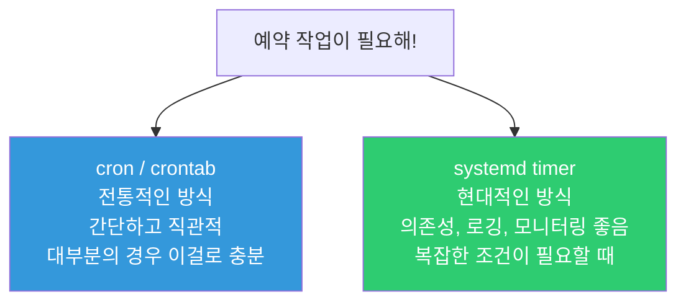
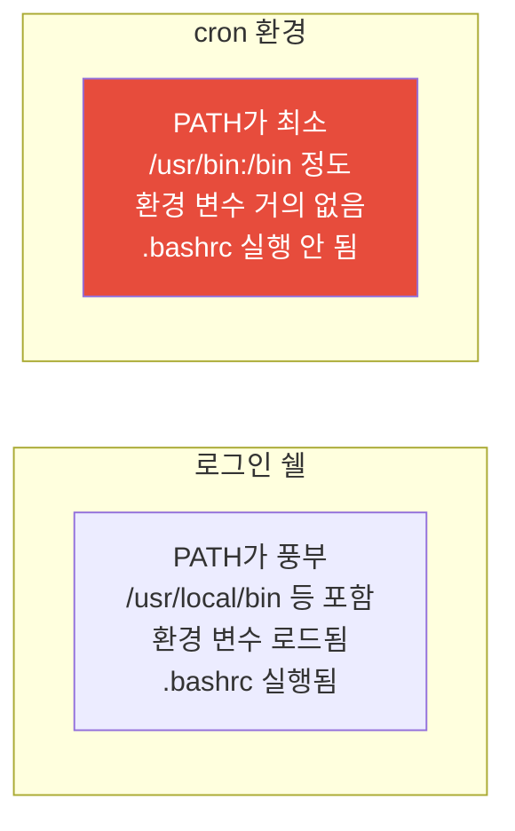

# cron과 타이머 (예약 작업)

> "매일 새벽 3시에 로그 정리해줘", "매주 월요일에 DB 백업해줘", "5분마다 서버 상태 체크해줘" — 이런 반복 작업을 사람이 매번 하면 실수도 나고 잠도 못 자요. cron이 대신 해줘요.

---

## 🎯 이걸 왜 알아야 하나?

DevOps에서 자동화의 가장 기본이 예약 작업이에요.

```
실무에서 예약 작업으로 하는 일들:
• 로그 파일 정리/압축           → 매일 새벽
• DB 백업                      → 매일/매주
• SSL 인증서 갱신 체크           → 매일
• 디스크 용량 체크 + 알림        → 매시간
• 임시 파일 정리                → 매일
• 모니터링 데이터 수집           → 매분/5분
• 오래된 Docker 이미지 정리      → 매주
• 보안 업데이트 체크             → 매일
```

이걸 cron 없이 하려면? 매일 새벽 3시에 일어나서 수동으로 해야 해요. 실수할 확률도 높고, 빠뜨릴 수도 있어요.

---

## 🧠 핵심 개념

### 비유: 알람 시계

cron은 **프로그래밍 가능한 알람 시계**예요.

* 일반 알람: "매일 오전 7시에 울려줘"
* cron: "매일 새벽 3시에 이 스크립트를 실행해줘"
* cron: "매주 월요일 자정에 이 백업 명령어를 돌려줘"
* cron: "5분마다 서버 상태를 체크해줘"

### cron vs systemd timer

예약 작업을 하는 방법이 두 가지 있어요.



| 비교 | cron | systemd timer |
|------|------|---------------|
| 설정 난이도 | 쉬움 (한 줄) | 복잡함 (파일 2개) |
| 로그 | 별도 설정 필요 | journalctl 자동 |
| 의존성 | 없음 | After, Requires 가능 |
| 모니터링 | 어려움 | systemctl로 확인 |
| 실패 시 재시도 | 없음 | 설정 가능 |
| 추천 상황 | 간단한 반복 작업 | 서비스와 연동, 정밀 제어 |

**실무 결론:** 간단한 작업은 cron, 복잡한 작업은 systemd timer. 대부분은 cron으로 충분해요.

---

## 🔍 상세 설명 — cron

### crontab 기본

```bash
# 내 crontab 보기
crontab -l
# no crontab for ubuntu    ← 아직 없음

# 내 crontab 편집
crontab -e
# (편집기가 열림)

# 다른 사용자의 crontab 보기 (root만 가능)
sudo crontab -u deploy -l

# 내 crontab 삭제 (주의!)
crontab -r
```

### cron 표현식 (★ 핵심)

cron의 시간 표현은 5개 필드로 구성돼요. 이게 cron의 전부라고 해도 과언이 아니에요.

```
┌───────────── 분 (0-59)
│ ┌───────────── 시 (0-23)
│ │ ┌───────────── 일 (1-31)
│ │ │ ┌───────────── 월 (1-12)
│ │ │ │ ┌───────────── 요일 (0-7, 0과 7은 일요일)
│ │ │ │ │
│ │ │ │ │
* * * * *  명령어
```


### 특수 문자

| 문자 | 의미 | 예시 |
|------|------|------|
| `*` | 매번 | `* * * * *` = 매분 |
| `,` | 여러 값 | `1,15,30 * * * *` = 1분, 15분, 30분 |
| `-` | 범위 | `9-17 * * * *` = 9시~17시 매시간 |
| `/` | 간격 | `*/5 * * * *` = 5분마다 |

### 예제로 배우기 (가장 중요!)

```bash
# ──────────────────────────────────
# 기본 패턴
# ──────────────────────────────────

# 매분 실행
* * * * *  /opt/scripts/check.sh

# 매시간 정각에 실행
0 * * * *  /opt/scripts/hourly.sh

# 매일 새벽 3시에 실행
0 3 * * *  /opt/scripts/daily-backup.sh

# 매일 자정에 실행
0 0 * * *  /opt/scripts/midnight.sh

# ──────────────────────────────────
# 요일/월 지정
# ──────────────────────────────────

# 매주 월요일 오전 9시
0 9 * * 1  /opt/scripts/weekly-report.sh

# 매주 월~금 오전 9시 (평일만)
0 9 * * 1-5  /opt/scripts/weekday.sh

# 매주 일요일 새벽 2시
0 2 * * 0  /opt/scripts/sunday-cleanup.sh

# 매월 1일 새벽 1시
0 1 1 * *  /opt/scripts/monthly.sh

# 1월, 4월, 7월, 10월 1일 (분기별)
0 1 1 1,4,7,10 *  /opt/scripts/quarterly.sh

# ──────────────────────────────────
# 간격 (/)
# ──────────────────────────────────

# 5분마다
*/5 * * * *  /opt/scripts/every5min.sh

# 10분마다
*/10 * * * *  /opt/scripts/every10min.sh

# 2시간마다
0 */2 * * *  /opt/scripts/every2hours.sh

# 30분마다
*/30 * * * *  /opt/scripts/every30min.sh

# ──────────────────────────────────
# 복합 예제
# ──────────────────────────────────

# 평일 오전 9시~오후 6시, 매시간
0 9-18 * * 1-5  /opt/scripts/business-hours.sh

# 매일 오전 6시, 오후 6시 (하루 2번)
0 6,18 * * *  /opt/scripts/twice-daily.sh

# 매월 1일, 15일 새벽 3시
0 3 1,15 * *  /opt/scripts/bimonthly.sh
```

**외우기 어려우면?** 이 사이트에서 확인하세요: https://crontab.guru

```bash
# 자주 쓰는 패턴 정리표

# 분  시  일  월  요일   의미
  *   *   *   *   *     매분
  0   *   *   *   *     매시간
  0   0   *   *   *     매일 자정
  0   3   *   *   *     매일 새벽 3시
 */5  *   *   *   *     5분마다
  0  */2  *   *   *     2시간마다
  0   9   *   *  1-5    평일 오전 9시
  0   2   *   *   0     매주 일요일 새벽 2시
  0   1   1   *   *     매월 1일 새벽 1시
  0   0   1   1   *     매년 1월 1일 자정
```

---

### crontab 파일 작성법

```bash
crontab -e
```

```bash
# /tmp/crontab.ubuntu (crontab -e로 편집)

# ──────────────────────────────────
# 환경 변수 (맨 위에 설정)
# ──────────────────────────────────
SHELL=/bin/bash
PATH=/usr/local/sbin:/usr/local/bin:/usr/sbin:/usr/bin:/sbin:/bin
MAILTO=admin@example.com    # 에러 발생 시 메일 보낼 주소 (빈값 = 메일 안 보냄)

# ──────────────────────────────────
# 작업 목록
# ──────────────────────────────────

# 매일 새벽 3시 — 로그 정리
0 3 * * *  /opt/scripts/cleanup-logs.sh >> /var/log/cron-cleanup.log 2>&1

# 매일 새벽 2시 — DB 백업
0 2 * * *  /opt/scripts/db-backup.sh >> /var/log/cron-backup.log 2>&1

# 5분마다 — 서버 상태 체크
*/5 * * * *  /opt/scripts/health-check.sh >> /var/log/cron-health.log 2>&1

# 매주 일요일 새벽 4시 — Docker 정리
0 4 * * 0  docker system prune -af >> /var/log/cron-docker.log 2>&1

# 매월 1일 — SSL 인증서 갱신
0 1 1 * *  certbot renew --quiet >> /var/log/cron-certbot.log 2>&1
```

**`>> /var/log/xxx.log 2>&1` 의 의미:**

```bash
>> /var/log/cron-backup.log    # 표준 출력을 로그 파일에 추가 (append)
2>&1                           # 에러 출력도 같은 파일에 (2=stderr, 1=stdout)

# 이걸 안 하면?
# → cron은 출력을 메일로 보내려고 함
# → 메일 설정이 안 되어 있으면 출력이 사라짐
# → 에러가 났는지도 모름!
```

---

### 시스템 cron (/etc/crontab, /etc/cron.d/)

사용자 crontab(`crontab -e`)과 별도로 시스템 전체 예약 작업이 있어요.

```bash
# 시스템 crontab (사용자 필드가 추가됨)
cat /etc/crontab
# SHELL=/bin/sh
# PATH=/usr/local/sbin:/usr/local/bin:/sbin:/bin:/usr/sbin:/usr/bin
#
# m h dom mon dow user  command
# 17 *  * * *  root  cd / && run-parts --report /etc/cron.hourly
# 25 6  * * *  root  test -x /usr/sbin/anacron || { cd / && run-parts --report /etc/cron.daily; }
# 47 6  * * 7  root  test -x /usr/sbin/anacron || { cd / && run-parts --report /etc/cron.weekly; }
# 52 6  1 * *  root  test -x /usr/sbin/anacron || { cd / && run-parts --report /etc/cron.monthly; }
```

```bash
# 시스템 cron 디렉토리 구조
/etc/
├── crontab          # 시스템 crontab (사용자 필드 포함)
├── cron.d/          # 패키지가 설치한 cron 작업들
│   ├── certbot      # Let's Encrypt 자동 갱신
│   └── logrotate    # 로그 회전
├── cron.hourly/     # 매시간 실행할 스크립트 넣기
├── cron.daily/      # 매일 실행할 스크립트 넣기
├── cron.weekly/     # 매주 실행할 스크립트 넣기
└── cron.monthly/    # 매월 실행할 스크립트 넣기
```

```bash
# /etc/cron.d/ 에 직접 작업 추가하기
# (사용자 필드가 있다는 점이 crontab -e와 다름!)
cat /etc/cron.d/myapp-backup
# SHELL=/bin/bash
# PATH=/usr/local/sbin:/usr/local/bin:/usr/sbin:/usr/bin:/sbin:/bin
#
# 매일 새벽 2시, deploy 사용자로 실행
# 분 시 일 월 요일 사용자  명령어
  0  2  *  *  *    deploy  /opt/scripts/db-backup.sh >> /var/log/db-backup.log 2>&1

# /etc/cron.daily/ 에 스크립트 넣기 (시간 지정 불가, 하루 한 번)
sudo cp /opt/scripts/cleanup.sh /etc/cron.daily/cleanup
sudo chmod +x /etc/cron.daily/cleanup
# → 매일 한 번 자동 실행 (정확한 시간은 anacron이 결정)
```

**crontab -e vs /etc/cron.d/ 차이:**

| 항목 | `crontab -e` | `/etc/cron.d/` |
|------|-------------|----------------|
| 사용자 필드 | 없음 (편집한 사용자로 실행) | 있음 (사용자 지정 필요) |
| 파일 위치 | `/var/spool/cron/crontabs/[user]` | `/etc/cron.d/[name]` |
| 용도 | 개인 작업 | 시스템/패키지 작업 |
| 버전 관리 | 어려움 | 파일이니까 Git 관리 가능 |
| 실무 추천 | 임시/개인 작업 | 프로덕션 작업 (IaC로 관리) |

---

### cron 환경의 함정

cron은 사용자가 로그인할 때와 **완전히 다른 환경**에서 실행돼요. 이게 가장 많은 문제를 일으켜요.



```bash
# ❌ 이게 터미널에서는 되는데 cron에서는 안 됨
*/5 * * * *  docker ps > /tmp/docker-status.txt
# cron: docker: command not found
# → cron의 PATH에 /usr/bin/docker 경로가 없을 수 있음!

# ✅ 해결 1: 절대 경로 사용 (가장 확실!)
*/5 * * * *  /usr/bin/docker ps > /tmp/docker-status.txt

# ✅ 해결 2: PATH를 crontab 상단에 설정
PATH=/usr/local/sbin:/usr/local/bin:/usr/sbin:/usr/bin:/sbin:/bin
*/5 * * * *  docker ps > /tmp/docker-status.txt

# ✅ 해결 3: 스크립트 안에서 환경 로드
*/5 * * * *  /opt/scripts/check-docker.sh

# check-docker.sh 내용:
#!/bin/bash
source /etc/environment      # 시스템 환경 변수 로드
source /home/ubuntu/.bashrc  # 사용자 환경 변수 로드
docker ps > /tmp/docker-status.txt
```

```bash
# cron에서 실제로 사용하는 PATH 확인하기
# crontab에 이걸 추가하면:
* * * * *  env > /tmp/cron-env.txt

# 1분 후 확인
cat /tmp/cron-env.txt
# HOME=/home/ubuntu
# LOGNAME=ubuntu
# PATH=/usr/bin:/bin          ← 매우 제한적!
# SHELL=/bin/sh               ← bash가 아니라 sh!
# → 그래서 crontab 상단에 SHELL=/bin/bash를 넣는 거예요
```

---

### cron 로그 확인

```bash
# cron 실행 로그 확인 (Ubuntu)
grep CRON /var/log/syslog | tail -20
# Mar 12 03:00:01 server01 CRON[12345]: (ubuntu) CMD (/opt/scripts/cleanup-logs.sh >> /var/log/cron-cleanup.log 2>&1)
# Mar 12 03:00:01 server01 CRON[12346]: (root) CMD (/opt/scripts/db-backup.sh >> /var/log/cron-backup.log 2>&1)

# 또는 journalctl로
journalctl -u cron --since "today" | tail -20

# CentOS/RHEL에서는
cat /var/log/cron | tail -20

# 특정 작업의 출력 로그
# → crontab에서 >> /var/log/xxx.log 2>&1 로 리다이렉션했으면
cat /var/log/cron-backup.log
```

---

## 🔍 상세 설명 — systemd timer

cron 대신 systemd timer를 쓰는 경우도 있어요. 특히 서비스와 연동할 때 유용해요.

### timer 만들기 (파일 2개 필요)

systemd timer는 `.timer` 파일과 `.service` 파일, 2개가 한 쌍이에요.

```bash
# 1. 서비스 파일: 실제 실행할 작업
cat << 'EOF' | sudo tee /etc/systemd/system/db-backup.service
[Unit]
Description=Database Backup

[Service]
Type=oneshot
User=deploy
ExecStart=/opt/scripts/db-backup.sh
StandardOutput=journal
StandardError=journal
EOF

# 2. 타이머 파일: 언제 실행할지
cat << 'EOF' | sudo tee /etc/systemd/system/db-backup.timer
[Unit]
Description=Run DB Backup Daily

[Timer]
# 매일 새벽 2시
OnCalendar=*-*-* 02:00:00

# 서버가 꺼져있었으면 부팅 후 바로 실행 (놓친 작업 실행)
Persistent=true

# 정확한 시간에서 ±5분 랜덤 지연 (여러 서버의 동시 실행 방지)
RandomizedDelaySec=300

[Install]
WantedBy=timers.target
EOF

# 3. 활성화
sudo systemctl daemon-reload
sudo systemctl enable --now db-backup.timer

# 4. 타이머 상태 확인
systemctl status db-backup.timer
# ● db-backup.timer - Run DB Backup Daily
#      Loaded: loaded (/etc/systemd/system/db-backup.timer; enabled)
#      Active: active (waiting) since Wed 2025-03-12 10:00:00 UTC
#     Trigger: Thu 2025-03-13 02:00:00 UTC; 15h left     ← 다음 실행 시간!
#    Triggers: ● db-backup.service

# 5. 모든 타이머 목록
systemctl list-timers --all
# NEXT                        LEFT       LAST                        PASSED    UNIT                ACTIVATES
# Thu 2025-03-13 02:00:00 UTC 15h left   Wed 2025-03-12 02:00:30 UTC 8h ago    db-backup.timer     db-backup.service
# Thu 2025-03-13 00:00:00 UTC 13h left   Wed 2025-03-12 00:00:00 UTC 10h ago   logrotate.timer     logrotate.service
# ...

# 6. 수동으로 지금 실행 (테스트)
sudo systemctl start db-backup.service
journalctl -u db-backup.service -n 10

# 7. 마지막 실행 결과 확인
systemctl status db-backup.service
# ● db-backup.service - Database Backup
#    Active: inactive (dead) since ... ; 8h ago
#    Process: 5000 ExecStart=/opt/scripts/db-backup.sh (code=exited, status=0/SUCCESS)
#                                                                    ^^^^^^^^^^^^^^^^
#                                                                    성공 여부 확인!
```

### OnCalendar 표현식

systemd timer의 시간 표현은 cron과 다르게 사람이 읽기 쉬운 형태예요.

```bash
# 형식: 요일 년-월-일 시:분:초

# 매일 새벽 3시
OnCalendar=*-*-* 03:00:00

# 매시간 정각
OnCalendar=*-*-* *:00:00
# 또는
OnCalendar=hourly

# 매분
OnCalendar=*-*-* *:*:00
# 또는
OnCalendar=minutely

# 매주 월요일 오전 9시
OnCalendar=Mon *-*-* 09:00:00

# 평일 오전 9시
OnCalendar=Mon..Fri *-*-* 09:00:00

# 매월 1일 새벽 1시
OnCalendar=*-*-01 01:00:00

# 매주 일요일 새벽 2시
OnCalendar=Sun *-*-* 02:00:00

# 15분마다
OnCalendar=*-*-* *:00,15,30,45:00

# 사전 정의 키워드
OnCalendar=minutely     # 매분
OnCalendar=hourly       # 매시간
OnCalendar=daily        # 매일 자정
OnCalendar=weekly       # 매주 월요일 자정
OnCalendar=monthly      # 매월 1일 자정
OnCalendar=yearly       # 매년 1월 1일 자정
```

```bash
# 표현식이 맞는지 테스트
systemd-analyze calendar "Mon..Fri *-*-* 09:00:00"
#   Original form: Mon..Fri *-*-* 09:00:00
#  Normalized form: Mon..Fri *-*-* 09:00:00
#     Next elapse: Thu 2025-03-13 09:00:00 UTC
#        (in UTC): Thu 2025-03-13 09:00:00 UTC
#        From now: 22h left

systemd-analyze calendar "daily"
#   Original form: daily
#  Normalized form: *-*-* 00:00:00
#     Next elapse: Thu 2025-03-13 00:00:00 UTC
```

### 부팅 후 시간 기반 타이머

달력 기반이 아니라 "부팅 후 N초"나 "마지막 실행 후 N초" 같은 상대 시간도 가능해요.

```ini
[Timer]
# 부팅 후 5분에 실행
OnBootSec=5min

# 마지막 실행 후 1시간마다 반복
OnUnitActiveSec=1h

# 부팅 후 1분에 시작, 이후 30분마다 반복
OnBootSec=1min
OnUnitActiveSec=30min
```

---

### logrotate — 로그 회전 (cron의 대표적 활용)

logrotate는 cron으로 돌아가는 대표적인 시스템 도구예요. 로그 파일이 끝없이 커지는 걸 방지해줘요.

```bash
# logrotate 설정 확인
cat /etc/logrotate.conf
# weekly                    ← 기본 회전 주기
# rotate 4                  ← 4개 백업 유지
# create                    ← 회전 후 새 파일 생성
# include /etc/logrotate.d  ← 개별 설정 포함

# 개별 서비스 설정
ls /etc/logrotate.d/
# apt  dpkg  nginx  rsyslog  ...

cat /etc/logrotate.d/nginx
# /var/log/nginx/*.log {
#     daily                  ← 매일 회전
#     missingok              ← 파일 없어도 에러 안 냄
#     rotate 14              ← 14일치 보관
#     compress               ← gzip 압축
#     delaycompress          ← 한 단계 전은 압축 안 함
#     notifempty             ← 빈 파일은 회전 안 함
#     create 0640 www-data adm  ← 새 파일 권한
#     sharedscripts          ← 스크립트를 한 번만 실행
#     postrotate             ← 회전 후 실행할 명령
#         [ -f /var/run/nginx.pid ] && kill -USR1 $(cat /var/run/nginx.pid)
#     endscript
# }
```

```bash
# 커스텀 앱의 logrotate 설정 만들기
cat << 'EOF' | sudo tee /etc/logrotate.d/myapp
/var/log/myapp/*.log {
    daily
    rotate 30
    compress
    delaycompress
    missingok
    notifempty
    create 0644 myapp myapp
    postrotate
        systemctl reload myapp 2>/dev/null || true
    endscript
}
EOF

# logrotate 테스트 (실제 실행하지 않고 시뮬레이션)
sudo logrotate -d /etc/logrotate.d/myapp
# reading config file /etc/logrotate.d/myapp
# Handling 1 logs
# rotating pattern: /var/log/myapp/*.log  after 1 days (30 rotations)
# ...

# logrotate 수동 실행 (강제)
sudo logrotate -f /etc/logrotate.d/myapp

# 회전 결과 확인
ls -la /var/log/myapp/
# -rw-r--r-- 1 myapp myapp    0 Mar 12 03:00 app.log         ← 새 파일
# -rw-r--r-- 1 myapp myapp 50K Mar 11 03:00 app.log.1        ← 어제 것
# -rw-r--r-- 1 myapp myapp 20K Mar 10 03:00 app.log.2.gz     ← 그제 것 (압축)
# -rw-r--r-- 1 myapp myapp 18K Mar  9 03:00 app.log.3.gz
```

---

## 💻 실습 예제

### 실습 1: crontab 기본 사용

```bash
# 1. 매분 실행되는 작업 등록
crontab -e

# 아래 내용 추가:
* * * * *  echo "$(date) - cron 테스트" >> /tmp/cron-test.log

# 2. 저장 후 1~2분 기다리기

# 3. 로그 확인
cat /tmp/cron-test.log
# Wed Mar 12 10:31:00 UTC 2025 - cron 테스트
# Wed Mar 12 10:32:00 UTC 2025 - cron 테스트

# 4. cron 실행 로그 확인
grep CRON /var/log/syslog | tail -5
# Mar 12 10:31:01 server01 CRON[12345]: (ubuntu) CMD (echo "$(date) - cron 테스트" >> /tmp/cron-test.log)

# 5. 정리
crontab -e    # 추가한 줄 삭제
rm /tmp/cron-test.log
```

### 실습 2: 실무형 백업 스크립트 + cron

```bash
# 1. 백업 스크립트 만들기
sudo mkdir -p /opt/scripts
cat << 'SCRIPT' | sudo tee /opt/scripts/simple-backup.sh
#!/bin/bash
set -euo pipefail

# 설정
BACKUP_DIR="/tmp/backups"
DATE=$(date +%Y%m%d_%H%M%S)
LOG_FILE="/var/log/backup.log"

# 백업 디렉토리 생성
mkdir -p "$BACKUP_DIR"

# 시작 로그
echo "[$DATE] 백업 시작" | tee -a "$LOG_FILE"

# /etc 디렉토리 백업
tar czf "$BACKUP_DIR/etc_backup_$DATE.tar.gz" /etc/ 2>/dev/null
echo "[$DATE] /etc 백업 완료: etc_backup_$DATE.tar.gz" | tee -a "$LOG_FILE"

# 오래된 백업 삭제 (7일 이상)
find "$BACKUP_DIR" -name "*.tar.gz" -mtime +7 -delete
echo "[$DATE] 7일 이상 된 백업 삭제 완료" | tee -a "$LOG_FILE"

echo "[$DATE] 백업 완료!" | tee -a "$LOG_FILE"
echo "---" >> "$LOG_FILE"
SCRIPT

sudo chmod +x /opt/scripts/simple-backup.sh

# 2. 수동 테스트 (먼저!)
sudo /opt/scripts/simple-backup.sh
# [20250312_103000] 백업 시작
# [20250312_103000] /etc 백업 완료: etc_backup_20250312_103000.tar.gz
# [20250312_103000] 7일 이상 된 백업 삭제 완료
# [20250312_103000] 백업 완료!

# 3. 백업 파일 확인
ls -lh /tmp/backups/
# -rw-r--r-- 1 root root 1.5M ... etc_backup_20250312_103000.tar.gz

# 4. cron에 등록 (매일 새벽 2시)
sudo crontab -e
# 추가:
# 0 2 * * *  /opt/scripts/simple-backup.sh >> /var/log/cron-backup.log 2>&1

# 5. 등록 확인
sudo crontab -l
```

### 실습 3: systemd timer 만들기

```bash
# 1. 서비스 파일
cat << 'EOF' | sudo tee /etc/systemd/system/disk-check.service
[Unit]
Description=Disk Usage Check

[Service]
Type=oneshot
ExecStart=/bin/bash -c 'echo "=== $(date) ===" && df -h | grep -E "^/dev" && echo "---"'
StandardOutput=journal
StandardError=journal
EOF

# 2. 타이머 파일 (30분마다)
cat << 'EOF' | sudo tee /etc/systemd/system/disk-check.timer
[Unit]
Description=Run Disk Check Every 30 Minutes

[Timer]
OnCalendar=*-*-* *:00,30:00
Persistent=true

[Install]
WantedBy=timers.target
EOF

# 3. 활성화
sudo systemctl daemon-reload
sudo systemctl enable --now disk-check.timer

# 4. 타이머 상태 확인
systemctl list-timers | grep disk-check
# Thu 2025-03-12 11:00:00 UTC  25min left  ...  disk-check.timer  disk-check.service

# 5. 수동 실행 (테스트)
sudo systemctl start disk-check.service

# 6. 로그 확인
journalctl -u disk-check.service --since "5 minutes ago"
# Mar 12 10:35:00 server01 bash[12345]: === Wed Mar 12 10:35:00 UTC 2025 ===
# Mar 12 10:35:00 server01 bash[12345]: /dev/sda1       50G   15G   33G  32% /
# Mar 12 10:35:00 server01 bash[12345]: ---

# 7. 정리
sudo systemctl disable --now disk-check.timer
sudo rm /etc/systemd/system/disk-check.{service,timer}
sudo systemctl daemon-reload
```

### 실습 4: cron vs systemd timer 비교 체험

```bash
# 같은 작업을 두 방식으로 만들어보기: "매시간 디스크 사용량 기록"

# === cron 방식 ===
crontab -e
# 0 * * * *  df -h > /tmp/disk-cron-$(date +\%Y\%m\%d\%H).txt 2>&1

# === systemd timer 방식 ===
# (위의 실습 3과 유사, OnCalendar=hourly로 변경)

# 차이점 체험:
# cron: 로그를 직접 관리해야 함
# timer: journalctl -u disk-check 로 바로 확인

# cron: 실패해도 알기 어려움
# timer: systemctl status disk-check 로 성공/실패 확인

# cron: 한 줄로 끝남 → 간단
# timer: 파일 2개 필요 → 번거롭지만 관리 좋음
```

---

## 🏢 실무에서는?

### 시나리오 1: 디스크 용량 알림 자동화

```bash
# 디스크 80% 넘으면 Slack 알림 보내는 스크립트
cat << 'SCRIPT' | sudo tee /opt/scripts/disk-alert.sh
#!/bin/bash
THRESHOLD=80
HOSTNAME=$(hostname)

df -h | grep "^/dev" | while read line; do
    usage=$(echo "$line" | awk '{print $5}' | tr -d '%')
    mount=$(echo "$line" | awk '{print $6}')
    
    if [ "$usage" -gt "$THRESHOLD" ]; then
        message="⚠️ [$HOSTNAME] 디스크 경고: $mount 사용률 ${usage}%"
        echo "$message"
        
        # Slack 알림 (웹훅 URL을 본인 것으로 교체)
        # curl -s -X POST -H 'Content-type: application/json' \
        #     --data "{\"text\":\"$message\"}" \
        #     https://hooks.slack.com/services/YOUR/WEBHOOK/URL
    fi
done
SCRIPT
sudo chmod +x /opt/scripts/disk-alert.sh

# cron 등록 (매시간)
# 0 * * * *  /opt/scripts/disk-alert.sh >> /var/log/disk-alert.log 2>&1
```

### 시나리오 2: Docker 이미지 자동 정리

```bash
# 사용하지 않는 Docker 이미지/컨테이너 정리
cat << 'SCRIPT' | sudo tee /opt/scripts/docker-cleanup.sh
#!/bin/bash
set -euo pipefail

LOG="/var/log/docker-cleanup.log"
echo "=== $(date) Docker 정리 시작 ===" >> "$LOG"

# 중지된 컨테이너 삭제
docker container prune -f >> "$LOG" 2>&1

# 태그 없는 이미지(dangling) 삭제
docker image prune -f >> "$LOG" 2>&1

# 사용하지 않는 볼륨 삭제
docker volume prune -f >> "$LOG" 2>&1

# 7일 이상 된 이미지 삭제
docker image prune -a --filter "until=168h" -f >> "$LOG" 2>&1

echo "=== $(date) Docker 정리 완료 ===" >> "$LOG"
SCRIPT
sudo chmod +x /opt/scripts/docker-cleanup.sh

# cron 등록 (매주 일요일 새벽 4시)
# 0 4 * * 0  /opt/scripts/docker-cleanup.sh
```

### 시나리오 3: SSL 인증서 자동 갱신

```bash
# Let's Encrypt 인증서 자동 갱신 + Nginx 리로드
cat << 'SCRIPT' | sudo tee /opt/scripts/renew-cert.sh
#!/bin/bash
set -euo pipefail

LOG="/var/log/cert-renewal.log"
echo "=== $(date) 인증서 갱신 체크 ===" >> "$LOG"

# certbot으로 갱신 시도
certbot renew --quiet >> "$LOG" 2>&1

# 갱신 성공하면 Nginx 리로드
if [ $? -eq 0 ]; then
    systemctl reload nginx >> "$LOG" 2>&1
    echo "Nginx 리로드 완료" >> "$LOG"
fi

echo "=== 완료 ===" >> "$LOG"
SCRIPT
sudo chmod +x /opt/scripts/renew-cert.sh

# cron 등록 (매일 새벽 1시)
# 0 1 * * *  /opt/scripts/renew-cert.sh
```

### 시나리오 4: cron 작업을 IaC로 관리

```bash
# 실무에서는 crontab -e로 직접 수정하지 않고
# 설정 파일을 Git으로 관리하고 Ansible 등으로 배포

# /etc/cron.d/에 파일로 관리하는 방식
cat << 'EOF' | sudo tee /etc/cron.d/myapp-jobs
# myapp 관련 예약 작업 모음
# 관리: devops-team / 최종 수정: 2025-03-12

SHELL=/bin/bash
PATH=/usr/local/sbin:/usr/local/bin:/usr/sbin:/usr/bin:/sbin:/bin

# DB 백업 (매일 새벽 2시)
0 2 * * *  deploy  /opt/scripts/db-backup.sh >> /var/log/cron/db-backup.log 2>&1

# 로그 정리 (매일 새벽 3시)
0 3 * * *  root    /opt/scripts/cleanup-logs.sh >> /var/log/cron/cleanup.log 2>&1

# 서버 상태 체크 (5분마다)
*/5 * * * *  monitoring  /opt/scripts/health-check.sh >> /var/log/cron/health.log 2>&1

# Docker 정리 (매주 일요일 새벽 4시)
0 4 * * 0  root    /opt/scripts/docker-cleanup.sh >> /var/log/cron/docker.log 2>&1
EOF

sudo chmod 644 /etc/cron.d/myapp-jobs
# → 이 파일을 Git에 커밋하면 버전 관리 가능!
```

---

## ⚠️ 자주 하는 실수

### 1. cron 환경에서 PATH 문제

```bash
# ❌ 터미널에서는 되는데 cron에서 안 됨
* * * * *  docker ps > /tmp/test.txt
# → "docker: command not found"

# ✅ 절대 경로 사용
* * * * *  /usr/bin/docker ps > /tmp/test.txt

# ✅ 또는 crontab 상단에 PATH 설정
PATH=/usr/local/sbin:/usr/local/bin:/usr/sbin:/usr/bin:/sbin:/bin
* * * * *  docker ps > /tmp/test.txt
```

### 2. 출력을 리다이렉션 안 하기

```bash
# ❌ 출력이 어디로 갔는지 모름
0 3 * * *  /opt/scripts/backup.sh

# → cron은 출력을 MAILTO로 보내려 함
# → MAILTO가 설정 안 되어 있으면 로컬 메일함에 쌓임
# → 결국 "에러가 났는데 몰랐어요" 상황 발생

# ✅ 항상 로그 파일로 리다이렉션
0 3 * * *  /opt/scripts/backup.sh >> /var/log/cron/backup.log 2>&1

# 로그 디렉토리는 미리 만들어야 해요!
sudo mkdir -p /var/log/cron
```

### 3. 스크립트에 실행 권한 안 주기

```bash
# ❌ 권한 없음
0 3 * * *  /opt/scripts/backup.sh
# → Permission denied

# ✅ 실행 권한 확인
chmod +x /opt/scripts/backup.sh

# 또는 명시적으로 인터프리터 지정
0 3 * * *  /bin/bash /opt/scripts/backup.sh >> /var/log/cron/backup.log 2>&1
```

### 4. % 문자를 이스케이프 안 하기

```bash
# ❌ crontab에서 %는 개행(줄바꿈)으로 해석됨!
* * * * *  echo "$(date +%Y%m%d)" > /tmp/test.txt
# → "date +" 만 실행되고 나머지는 stdin으로 들어감

# ✅ %를 \%로 이스케이프
* * * * *  echo "$(date +\%Y\%m\%d)" > /tmp/test.txt

# ✅ 또는 스크립트 파일로 만들어서 실행 (추천)
* * * * *  /opt/scripts/my-task.sh
# → 스크립트 안에서는 %를 자유롭게 사용 가능
```

### 5. crontab -r 실수

```bash
# ❌ crontab -r = 전체 삭제! (e 바로 옆에 있어서 오타 발생)
crontab -r    # 모든 cron 작업이 사라짐!

# ✅ 예방: 백업 습관
crontab -l > ~/crontab-backup-$(date +%Y%m%d).txt
crontab -e    # 안전하게 편집

# ✅ 또는 /etc/cron.d/ 파일로 관리 (Git 버전 관리)
# → crontab -r로 날아갈 걱정 없음
```

---

## 📝 정리

### cron 표현식 빠른 참조

```
*  *  *  *  *   명령어
분 시 일 월 요일

분: 0-59    시: 0-23    일: 1-31    월: 1-12    요일: 0-7 (0,7=일)

*     = 매번
*/5   = 5마다
1,15  = 1과 15
9-17  = 9~17
```

### 실무 체크리스트

```
✅ 절대 경로 사용 (또는 crontab 상단에 PATH 설정)
✅ SHELL=/bin/bash 명시
✅ 출력을 로그 파일로 리다이렉션 (>> /var/log/xxx.log 2>&1)
✅ 스크립트에 실행 권한 확인 (chmod +x)
✅ crontab 등록 전에 스크립트를 수동으로 먼저 테스트
✅ % 문자는 \%로 이스케이프 (또는 스크립트 파일 사용)
✅ 프로덕션 cron은 /etc/cron.d/에 파일로 관리 (Git 관리)
✅ logrotate로 cron 로그 파일도 회전 설정
```

### cron vs systemd timer 선택 가이드

```
간단한 반복 작업         → cron
로그/모니터링 중요       → systemd timer
서비스 의존성 있음       → systemd timer
실패 시 재시도 필요      → systemd timer
한 줄이면 되는 작업      → cron
팀에서 cron에 익숙       → cron
```

---

## 🔗 다음 강의

다음은 **[01-linux/07-disk.md — 디스크 관리 (LVM / RAID)](./07-disk)** 예요.

"디스크가 꽉 찼어요!" 하면 어떻게 하나요? 디스크 추가, 파티션 관리, LVM으로 유연하게 용량 조절하는 방법을 배워볼게요. 클라우드 환경에서 EBS 볼륨 확장하는 것도 결국 이 원리예요.
