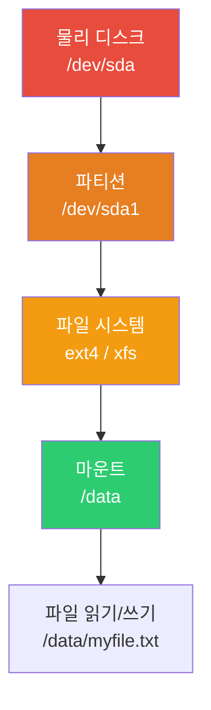
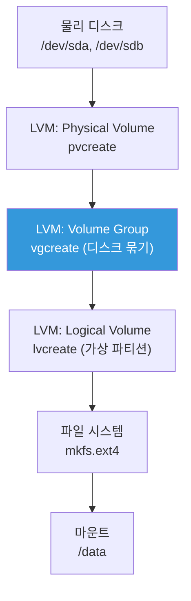
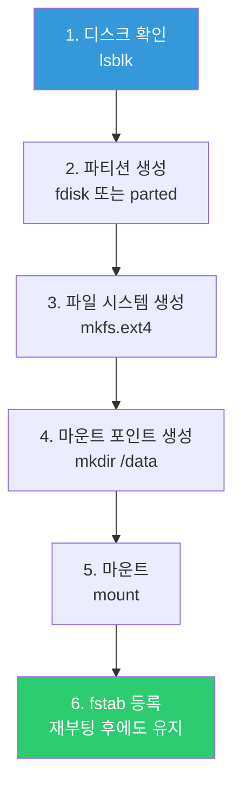
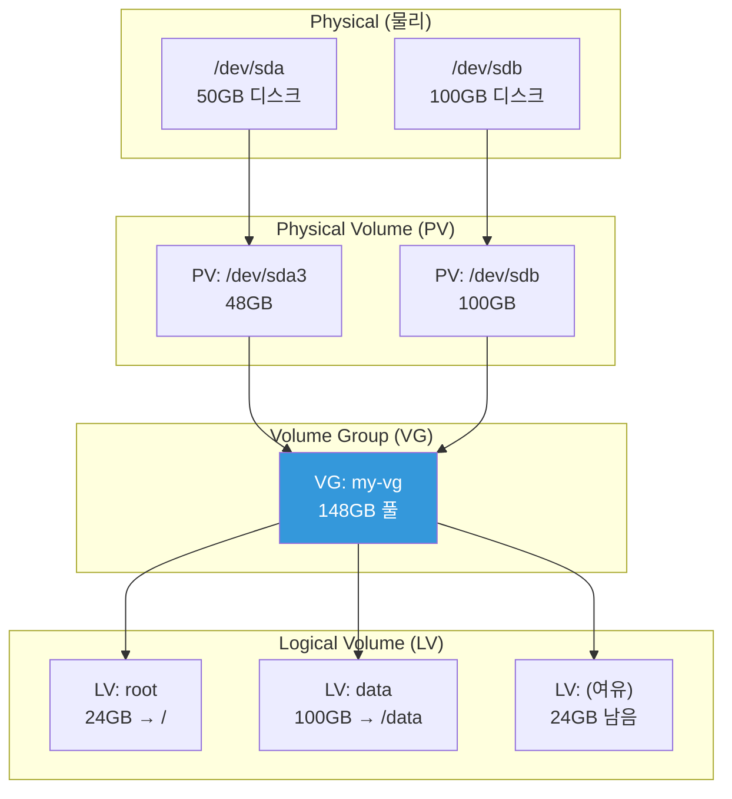
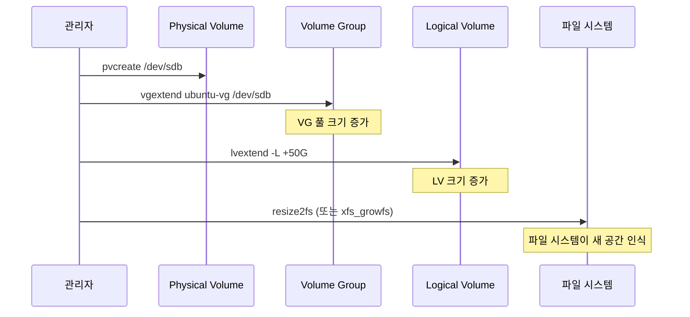
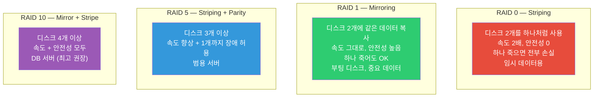

# 디스크 관리 (파일 시스템 / LVM / RAID)

> "디스크가 100%래요!" — DevOps 인생에서 수십 번은 듣게 될 말이에요. 디스크를 추가하고, 파티션을 나누고, LVM으로 유연하게 관리하는 법을 알면 이 상황을 침착하게 해결할 수 있어요.

---

## 🎯 이걸 왜 알아야 하나?

```
실무에서 디스크 관련으로 하는 일들:
• "디스크 꽉 찼어요!" → 원인 찾고 용량 확보
• 새 디스크 추가 → 파티션, 포맷, 마운트
• 디스크 용량 확장 → LVM으로 무중단 확장
• AWS EBS 볼륨 추가/확장 → 결국 Linux 디스크 관리
• 데이터 안전 → RAID로 디스크 장애 대비
• 성능 문제 → 디스크 I/O 병목 진단
```

클라우드 시대에도 디스크 관리를 알아야 해요. AWS에서 EBS 볼륨을 늘려도 결국 OS 안에서 파티션을 확장하고 파일 시스템을 리사이즈해야 하거든요.

---

## 🧠 핵심 개념

### 비유: 창고 관리

디스크 관리는 **창고를 관리하는 것**과 같아요.

* **물리 디스크 (sda, nvme0n1)** = 빈 창고 건물
* **파티션 (sda1, sda2)** = 창고를 칸막이로 나눈 것
* **파일 시스템 (ext4, xfs)** = 각 칸에 선반을 설치한 것. 선반이 있어야 물건(파일)을 정리할 수 있음
* **마운트** = 창고 칸에 문(경로)을 달아서 출입 가능하게 만든 것
* **LVM** = 칸막이를 자유롭게 옮길 수 있는 이동식 벽. 칸 크기를 유연하게 변경 가능
* **RAID** = 똑같은 창고를 2개 운영해서, 하나가 불타도 괜찮게 만든 것

### 디스크에서 파일까지의 흐름





---

## 🔍 상세 설명

### 디스크와 파티션 확인

#### lsblk — 블록 디바이스 목록 (가장 먼저!)

```bash
lsblk
# NAME        MAJ:MIN RM   SIZE RO TYPE MOUNTPOINTS
# sda           8:0    0    50G  0 disk 
# ├─sda1        8:1    0     1M  0 part            ← BIOS 부트 파티션
# ├─sda2        8:2    0     2G  0 part /boot      ← 부트 파티션
# └─sda3        8:3    0    48G  0 part             
#   └─ubuntu--vg-ubuntu--lv
#                     253:0    0    24G  0 lvm  /   ← LVM 루트
# sdb           8:16   0   100G  0 disk             ← 새로 추가된 디스크 (미사용)
# sr0          11:0    1  1024M  0 rom              ← CD-ROM (무시)

# 더 자세한 정보
lsblk -f
# NAME                      FSTYPE      LABEL UUID                                 MOUNTPOINTS
# sda                                                                                
# ├─sda1                                                                             
# ├─sda2                    ext4              xxxx-yyyy-zzzz                         /boot
# └─sda3                    LVM2_member       aaaa-bbbb-cccc                         
#   └─ubuntu--vg-ubuntu--lv ext4              dddd-eeee-ffff                         /
# sdb                                                                                ← 파일시스템 없음!
```

**출력 읽는 법:**

| 컬럼 | 의미 |
|------|------|
| NAME | 디바이스 이름 |
| SIZE | 크기 |
| TYPE | disk(디스크), part(파티션), lvm(논리볼륨) |
| MOUNTPOINTS | 마운트된 경로 (비어있으면 마운트 안 됨) |
| FSTYPE | 파일 시스템 타입 (ext4, xfs 등) |

#### df — 디스크 사용량 확인

```bash
df -h
# Filesystem                         Size  Used Avail Use% Mounted on
# /dev/mapper/ubuntu--vg-ubuntu--lv   24G   12G   11G  53% /
# /dev/sda2                          2.0G  200M  1.6G  12% /boot
# tmpfs                              2.0G     0  2.0G   0% /dev/shm
# tmpfs                              400M  1.1M  399M   1% /run

# -h: 사람이 읽기 쉬운 단위 (GB, MB)
# -T: 파일 시스템 타입도 표시
df -hT
# Filesystem                         Type  Size  Used Avail Use% Mounted on
# /dev/mapper/ubuntu--vg-ubuntu--lv  ext4   24G   12G   11G  53% /
# /dev/sda2                          ext4  2.0G  200M  1.6G  12% /boot

# inode 사용량 (파일 개수 제한)
df -i
# Filesystem                          Inodes IUsed   IFree IUse% Mounted on
# /dev/mapper/ubuntu--vg-ubuntu--lv  1572864 85432 1487432    6% /
```

#### du — 디렉토리별 사용량

```bash
# 현재 디렉토리 하위 사용량
du -sh *
# 1.5G  logs
# 500M  data
# 200M  backups

# 특정 디렉토리에서 큰 놈 찾기
du -sh /var/* 2>/dev/null | sort -rh | head -10
# 8.0G  /var/log
# 3.5G  /var/lib
# 1.0G  /var/cache
# ...

# 깊이 제한 (1단계만)
du -h --max-depth=1 /var/ | sort -rh
# 13G   /var/
# 8.0G  /var/log
# 3.5G  /var/lib
# 1.0G  /var/cache

# 특정 크기 이상 파일 찾기
find / -type f -size +100M 2>/dev/null | head -10
# /var/log/nginx/access.log
# /var/lib/docker/overlay2/...
```

---

### 파일 시스템 (ext4 vs xfs)

파일 시스템은 디스크에 파일을 어떤 방식으로 저장할지 결정하는 "정리 방법"이에요.

| 비교 | ext4 | xfs |
|------|------|-----|
| 기본 OS | Ubuntu, Debian | CentOS, RHEL, Amazon Linux |
| 최대 파일 크기 | 16TB | 8EB (사실상 무제한) |
| 최대 볼륨 크기 | 1EB | 8EB |
| 축소 가능? | ✅ 가능 | ❌ 불가 (확장만 가능) |
| 대용량 파일 성능 | 보통 | 우수 |
| 안정성 | 매우 높음 | 매우 높음 |
| 실무 추천 | 범용 (기본값) | 대용량 데이터, DB |

```bash
# 현재 파일 시스템 확인
df -T /
# Filesystem                        Type  Size  Used Avail Use% Mounted on
# /dev/mapper/ubuntu--vg-ubuntu--lv ext4   24G   12G   11G  53% /

# 또는
mount | grep "on / "
# /dev/mapper/ubuntu--vg-ubuntu--lv on / type ext4 (rw,relatime)
```

---

### mount / umount — 마운트와 언마운트

**마운트**는 디스크(파티션)를 특정 디렉토리에 연결해서 사용할 수 있게 만드는 거예요.


```bash
# 마운트 (디스크를 디렉토리에 연결)
sudo mkdir -p /data
sudo mount /dev/sdb1 /data

# 마운트 확인
mount | grep sdb
# /dev/sdb1 on /data type ext4 (rw,relatime)

df -h /data
# Filesystem      Size  Used Avail Use% Mounted on
# /dev/sdb1       100G  2.0G   93G   3% /data

# 언마운트 (분리)
sudo umount /data
# 또는 디바이스로
sudo umount /dev/sdb1

# ⚠️ "target is busy" 에러가 나면
# → 누군가 그 디렉토리를 사용 중
lsof +f -- /data    # 누가 쓰고 있는지 확인
fuser -mv /data     # 프로세스 확인

# 강제 언마운트 (주의!)
sudo umount -l /data    # lazy umount (사용 끝나면 분리)
sudo umount -f /data    # 강제 분리 (NFS 등에서 사용)
```

#### /etc/fstab — 재부팅 후에도 자동 마운트

`mount` 명령어로 마운트하면 재부팅하면 사라져요. 영구 마운트는 `/etc/fstab`에 등록해야 해요.

```bash
cat /etc/fstab
# <device>                                  <mount point>  <type>  <options>       <dump> <pass>
# /dev/mapper/ubuntu--vg-ubuntu--lv         /              ext4    defaults        0      1
# /dev/sda2                                 /boot          ext4    defaults        0      2
# UUID=xxxx-yyyy-zzzz                       /data          ext4    defaults        0      2
```

```
각 필드 설명:
device      → 디바이스 (UUID 권장)
mount point → 마운트 할 디렉토리
type        → 파일 시스템 타입 (ext4, xfs)
options     → 마운트 옵션 (defaults가 일반적)
dump        → 백업 여부 (0 = 안 함)
pass        → fsck 검사 순서 (0=안 함, 1=루트, 2=나머지)
```

```bash
# fstab에 추가하는 안전한 방법

# 1. UUID 확인 (디바이스 이름은 바뀔 수 있으니 UUID 사용!)
blkid /dev/sdb1
# /dev/sdb1: UUID="abcd-1234-efgh-5678" TYPE="ext4"

# 2. fstab 백업!
sudo cp /etc/fstab /etc/fstab.bak

# 3. fstab에 추가
echo 'UUID=abcd-1234-efgh-5678  /data  ext4  defaults  0  2' | sudo tee -a /etc/fstab

# 4. 테스트 (재부팅 전에 반드시!)
sudo mount -a
# → 에러 없으면 성공. 에러가 나면 fstab 수정!

# ⚠️ fstab이 잘못되면 서버가 부팅 안 될 수 있어요!
# → 항상 백업하고, mount -a로 테스트!
```

**mount options 주요 옵션:**

| 옵션 | 의미 |
|------|------|
| `defaults` | rw, suid, dev, exec, auto, nouser, async 조합 |
| `noatime` | 접근 시간 기록 안 함 (성능 향상) |
| `nofail` | 마운트 실패해도 부팅 계속 (클라우드에서 중요!) |
| `ro` | 읽기 전용 |
| `noexec` | 실행 파일 실행 금지 (보안) |

```bash
# 클라우드에서 추천하는 fstab 설정
UUID=abcd-1234  /data  ext4  defaults,nofail,noatime  0  2
#                                     ^^^^^^ ^^^^^^^^
#                                     실패해도  성능
#                                     부팅 OK   향상
```

---

### 새 디스크 추가 (전체 흐름)

새 디스크를 추가할 때의 전체 과정이에요. AWS에서 EBS를 추가해도 이 과정은 동일해요.



```bash
# === 시나리오: /dev/sdb 100GB 디스크를 /data에 마운트 ===

# 1. 디스크 확인
lsblk
# sdb    8:16   0  100G  0 disk    ← 새 디스크 확인

# 2. 파티션 생성 (전체를 하나의 파티션으로)
sudo parted /dev/sdb --script mklabel gpt
sudo parted /dev/sdb --script mkpart primary ext4 0% 100%

# 확인
lsblk
# sdb    8:16   0  100G  0 disk
# └─sdb1 8:17   0  100G  0 part   ← 파티션 생성됨

# 3. 파일 시스템 생성 (포맷)
sudo mkfs.ext4 /dev/sdb1
# mke2fs 1.46.5 (30-Dec-2021)
# Creating filesystem with 26214144 4k blocks and 6553600 inodes
# ...
# Writing superblocks and filesystem accounting information: done

# 또는 xfs로:
# sudo mkfs.xfs /dev/sdb1

# 4. 마운트 포인트 생성
sudo mkdir -p /data

# 5. 마운트
sudo mount /dev/sdb1 /data

# 확인
df -h /data
# Filesystem      Size  Used Avail Use% Mounted on
# /dev/sdb1        98G   60M   93G   1% /data

# 6. fstab에 등록 (재부팅 후에도 유지)
UUID=$(blkid -s UUID -o value /dev/sdb1)
echo "UUID=$UUID  /data  ext4  defaults,nofail  0  2" | sudo tee -a /etc/fstab

# 7. fstab 테스트
sudo umount /data
sudo mount -a
df -h /data    # 다시 마운트 확인
```

---

### LVM (Logical Volume Manager) — 유연한 디스크 관리

LVM은 파티션의 크기를 자유롭게 조절할 수 있게 해줘요. 디스크를 추가해서 기존 볼륨을 확장하는 것도 가능해요.

#### LVM 구조



**비유:**
* **PV (Physical Volume)** = 각각의 창고 건물
* **VG (Volume Group)** = 여러 창고를 묶어서 하나의 큰 물류 단지로 만든 것
* **LV (Logical Volume)** = 물류 단지 안에서 유연하게 공간을 나눈 것. 벽을 밀어서 크기 조절 가능!

#### LVM 명령어 — 확인

```bash
# Physical Volume 확인
sudo pvs
# PV         VG        Fmt  Attr PSize   PFree
# /dev/sda3  ubuntu-vg lvm2 a--  <48.00g 24.00g

sudo pvdisplay
# --- Physical volume ---
# PV Name               /dev/sda3
# VG Name               ubuntu-vg
# PV Size               <48.00 GiB
# PE Size               4.00 MiB
# Total PE              12287
# Free PE               6144
# Allocated PE          6143

# Volume Group 확인
sudo vgs
# VG        #PV #LV #SN Attr   VSize   VFree
# ubuntu-vg   1   1   0 wz--n- <48.00g 24.00g

sudo vgdisplay
# --- Volume group ---
# VG Name               ubuntu-vg
# VG Size               <48.00 GiB
# Free  PE / Size       6144 / 24.00 GiB    ← 24GB 남아있음!

# Logical Volume 확인
sudo lvs
# LV        VG        Attr       LSize  Pool
# ubuntu-lv ubuntu-vg -wi-ao---- 24.00g

sudo lvdisplay
# --- Logical volume ---
# LV Path                /dev/ubuntu-vg/ubuntu-lv
# LV Name                ubuntu-lv
# VG Name                ubuntu-vg
# LV Size                24.00 GiB
```

#### LVM — 볼륨 확장 (가장 많이 하는 작업!)

```bash
# === 시나리오: 루트(/) 파티션이 꽉 차서 확장하고 싶음 ===

# 1. 현재 상태 확인
df -h /
# Filesystem                         Size  Used Avail Use% Mounted on
# /dev/mapper/ubuntu--vg-ubuntu--lv   24G   22G   800M  97% /    ← 97%! 위험!

# 2. VG에 남은 공간 확인
sudo vgs
# VG        VSize   VFree
# ubuntu-vg <48.00g 24.00g    ← 24GB 남아있음!

# 3. LV 확장 (VG에 여유가 있을 때)
# 10GB 추가
sudo lvextend -L +10G /dev/ubuntu-vg/ubuntu-lv
# Size of logical volume ubuntu-vg/ubuntu-lv changed from 24.00 GiB to 34.00 GiB.

# 또는 남은 공간 전부 사용
# sudo lvextend -l +100%FREE /dev/ubuntu-vg/ubuntu-lv

# 4. 파일 시스템 확장 (LV만 늘리면 안 됨! 파일 시스템도 늘려야!)
# ext4의 경우:
sudo resize2fs /dev/ubuntu-vg/ubuntu-lv
# resize2fs 1.46.5 (30-Dec-2021)
# Filesystem at /dev/ubuntu-vg/ubuntu-lv is mounted on /; on-line resizing required
# Resizing the filesystem on /dev/ubuntu-vg/ubuntu-lv to 8912896 (4k) blocks.
# The filesystem on /dev/ubuntu-vg/ubuntu-lv is now 8912896 (4k) blocks long.

# xfs의 경우:
# sudo xfs_growfs /

# 5. 확인
df -h /
# Filesystem                         Size  Used Avail Use% Mounted on
# /dev/mapper/ubuntu--vg-ubuntu--lv   34G   22G   11G  67% /    ← 67%로 줄었음!

# ⭐ lvextend + resize2fs를 한 번에 하는 옵션
sudo lvextend -L +10G --resizefs /dev/ubuntu-vg/ubuntu-lv
#                      ^^^^^^^^^^
#                      파일 시스템도 같이 확장!
```

#### LVM — 새 디스크 추가해서 VG 확장

```bash
# === 시나리오: VG에 여유가 없어서 새 디스크를 추가 ===

# 1. 새 디스크 확인
lsblk
# sdb    8:16   0  100G  0 disk    ← 새 디스크

# 2. PV 생성
sudo pvcreate /dev/sdb
# Physical volume "/dev/sdb" successfully created.

# 3. 기존 VG에 PV 추가
sudo vgextend ubuntu-vg /dev/sdb
# Volume group "ubuntu-vg" successfully extended

# 4. VG 확인 (용량이 늘어남!)
sudo vgs
# VG        VSize    VFree
# ubuntu-vg <148.00g <124.00g    ← 100GB가 추가됨!

# 5. LV 확장
sudo lvextend -L +50G --resizefs /dev/ubuntu-vg/ubuntu-lv

# 6. 확인
df -h /
```



#### LVM — 새 Logical Volume 만들기

```bash
# === 시나리오: /data용 별도 LV 만들기 ===

# 1. VG 여유 공간 확인
sudo vgs
# VG        VFree
# ubuntu-vg 74.00g

# 2. 새 LV 생성
sudo lvcreate -L 50G -n data ubuntu-vg
# Logical volume "data" created.

# 3. 파일 시스템 생성
sudo mkfs.ext4 /dev/ubuntu-vg/data

# 4. 마운트
sudo mkdir -p /data
sudo mount /dev/ubuntu-vg/data /data

# 5. fstab 등록
echo '/dev/ubuntu-vg/data  /data  ext4  defaults,nofail  0  2' | sudo tee -a /etc/fstab

# 6. 확인
df -h /data
lsblk
```

---

### RAID — 디스크 장애 대비

RAID는 여러 디스크를 묶어서 **데이터 안전성** 또는 **성능**을 높이는 기술이에요.



| RAID | 최소 디스크 | 용량 효율 | 장애 허용 | 성능 | 용도 |
|------|-----------|----------|----------|------|------|
| RAID 0 | 2 | 100% | 0개 | 읽기/쓰기 빠름 | 임시 데이터, 캐시 |
| RAID 1 | 2 | 50% | 1개 | 읽기 빠름 | 부팅, 중요 데이터 |
| RAID 5 | 3 | (N-1)/N | 1개 | 읽기 빠름 | 범용 서버 |
| RAID 6 | 4 | (N-2)/N | 2개 | 읽기 빠름 | 대용량 스토리지 |
| RAID 10 | 4 | 50% | 조당 1개 | 둘 다 빠름 | DB, 고성능 |

```bash
# 소프트웨어 RAID (mdadm) 예시 — RAID 1

# 1. RAID 생성
sudo mdadm --create /dev/md0 --level=1 --raid-devices=2 /dev/sdb /dev/sdc

# 2. RAID 상태 확인
cat /proc/mdstat
# md0 : active raid1 sdc[1] sdb[0]
#       104320 blocks super 1.2 [2/2] [UU]
#                                      ^^
#                                      U=정상, _=장애

sudo mdadm --detail /dev/md0
# Number   Major   Minor   RaidDevice State
#    0       8       16        0      active sync   /dev/sdb
#    1       8       32        1      active sync   /dev/sdc

# 3. 파일 시스템 + 마운트 (일반 디스크와 동일)
sudo mkfs.ext4 /dev/md0
sudo mkdir -p /data
sudo mount /dev/md0 /data
```

**실무에서 RAID:**
* **클라우드 (AWS, GCP)**: 하드웨어 RAID를 직접 할 일은 거의 없음. EBS 자체가 복제(replication)되니까요
* **온프레미스**: 서버 구매 시 RAID 컨트롤러로 하드웨어 RAID 설정
* **알아야 하는 이유**: RAID 개념을 알아야 클라우드의 스토리지 설계도 이해할 수 있어요

---

### 디스크 I/O 확인

```bash
# iostat — 디스크 I/O 통계
iostat -x 1 3
# Device  r/s   w/s   rkB/s   wkB/s  await  %util
# sda     5.0  20.0   100.0   500.0   2.50   15.0
# sdb     0.5   1.0    10.0    20.0   1.00    2.0

# 주요 지표:
# r/s, w/s     → 초당 읽기/쓰기 요청 수
# rkB/s, wkB/s → 초당 읽기/쓰기 데이터량
# await        → 평균 응답 시간 (ms) → 높으면 느림!
# %util        → 디스크 사용률 → 100%에 가까우면 병목!

# iotop — 어떤 프로세스가 I/O를 많이 쓰는지
sudo iotop
# Total DISK READ:  10.00 M/s | Total DISK WRITE:  50.00 M/s
#   PID  USER     DISK READ  DISK WRITE  COMMAND
#  3000  mysql     5.00 M/s   40.00 M/s  mysqld          ← DB가 범인!
#  5000  ubuntu    3.00 M/s    5.00 M/s  rsync

# 설치 안 되어 있으면
sudo apt install iotop     # Ubuntu
sudo yum install iotop     # CentOS
```

### inode 고갈

디스크 용량은 남아있는데 파일을 못 만드는 경우가 있어요. inode가 다 쓰였기 때문이에요.

**비유:** 창고에 공간은 남아있는데 선반 번호표(inode)를 다 써버린 것. 새 물건을 등록할 수가 없어요.

```bash
# inode 사용량 확인
df -i
# Filesystem                          Inodes  IUsed   IFree IUse% Mounted on
# /dev/mapper/ubuntu--vg-ubuntu--lv  1572864 1572000    864  100% /
#                                                              ^^^
#                                                              inode 100%! 파일 생성 불가!

# 어디에 파일이 많은지 찾기
for dir in /var /tmp /home /opt; do
    echo -n "$dir: "
    find "$dir" -type f 2>/dev/null | wc -l
done
# /var: 1200000    ← 범인!

# 더 깊이 파기
find /var -type f 2>/dev/null | awk -F/ '{print "/"$2"/"$3}' | sort | uniq -c | sort -rn | head -5
# 1100000 /var/spool
#   50000 /var/log
# → /var/spool에 작은 파일이 110만 개!

# 흔한 원인: 메일 큐에 쌓인 메일, 세션 파일, 임시 캐시 파일
```

---

## 💻 실습 예제

### 실습 1: 디스크 현황 파악

```bash
# 새 서버에서 디스크 상태를 파악하는 순서

# 1. 블록 디바이스 목록
lsblk

# 2. 디스크 사용량
df -hT

# 3. 어디가 큰지
du -h --max-depth=1 / 2>/dev/null | sort -rh | head -10

# 4. inode 상태
df -i

# 5. LVM 사용 여부
sudo pvs 2>/dev/null
sudo vgs 2>/dev/null
sudo lvs 2>/dev/null

# 6. RAID 사용 여부
cat /proc/mdstat

# 7. fstab 확인
cat /etc/fstab
```

### 실습 2: 큰 파일/디렉토리 찾기 (장애 대응)

```bash
# "디스크 97%입니다!" 상황

# 1. 전체 현황
df -h

# 2. 큰 디렉토리 찾기
sudo du -h --max-depth=2 / 2>/dev/null | sort -rh | head -20

# 3. 100MB 이상 파일 찾기
sudo find / -type f -size +100M -exec ls -lh {} \; 2>/dev/null | sort -k5 -rh | head -10

# 4. 최근 24시간 내 생성된 큰 파일 (뭔가 급증했을 때)
sudo find / -type f -size +50M -mtime -1 2>/dev/null | head -10

# 5. 삭제했는데 용량이 안 줄어드는 경우 (열린 파일 문제)
sudo lsof +L1 | head -10
# COMMAND  PID  USER  FD  SIZE  NAME (deleted)
# nginx   901  www   3w  5.0G  /var/log/nginx/access.log (deleted)
# → 프로세스가 삭제된 파일을 아직 잡고 있음!
# → 해당 프로세스를 재시작하면 공간 확보

sudo systemctl restart nginx
df -h    # 용량 확보 확인
```

### 실습 3: LVM 확장 연습

```bash
# 현재 LVM 상태 확인
sudo vgs
sudo lvs
df -h /

# VG에 여유가 있으면 LV 확장
sudo lvextend -L +5G --resizefs /dev/ubuntu-vg/ubuntu-lv

# 확인
df -h /
```

---

## 🏢 실무에서는?

### 시나리오 1: AWS EBS 볼륨 확장

```bash
# AWS 콘솔에서 EBS 볼륨 크기를 50GB → 100GB로 변경한 후
# 서버 안에서 해야 할 일:

# 1. 디스크 변경 인식 확인
lsblk
# xvda    202:0    0  100G  0 disk           ← 100GB로 인식됨
# └─xvda1 202:1    0   50G  0 part /         ← 파티션은 아직 50GB!

# 2. 파티션 확장 (growpart)
sudo growpart /dev/xvda 1
# CHANGED: partition=1 start=2048 old: size=104855519 new: size=209713119

lsblk
# xvda    202:0    0  100G  0 disk
# └─xvda1 202:1    0  100G  0 part /         ← 파티션도 100GB!

# 3. 파일 시스템 확장
# ext4의 경우:
sudo resize2fs /dev/xvda1

# xfs의 경우:
# sudo xfs_growfs /

# 4. 확인
df -h /
# Filesystem  Size  Used Avail Use% Mounted on
# /dev/xvda1   97G   20G   73G  22% /         ← 100GB 반영!
```

### 시나리오 2: 데이터 디스크 추가 (AWS EBS)

```bash
# AWS에서 새 EBS 볼륨을 서버에 연결한 후:

# 1. 새 디스크 확인
lsblk
# xvdf    202:80   0  200G  0 disk    ← 새 디스크!

# 2. 파일 시스템인지 확인 (혹시 이미 사용 중인 볼륨이면)
sudo file -s /dev/xvdf
# /dev/xvdf: data    ← "data"면 빈 디스크

# 3. 파일 시스템 생성
sudo mkfs.ext4 /dev/xvdf
# (파티션 없이 디스크 전체를 바로 포맷해도 됨)

# 4. 마운트
sudo mkdir -p /data
sudo mount /dev/xvdf /data

# 5. fstab 등록 (nofail 필수! EBS 분리 시 부팅 문제 방지)
UUID=$(blkid -s UUID -o value /dev/xvdf)
echo "UUID=$UUID  /data  ext4  defaults,nofail  0  2" | sudo tee -a /etc/fstab

# 6. 테스트
sudo umount /data
sudo mount -a
df -h /data
```

### 시나리오 3: 디스크 꽉 찬 긴급 대응

```bash
# === 긴급: 디스크 100%! 서비스 장애 발생! ===

# 1단계: 즉시 확인
df -h
# /dev/sda1  50G  50G  0  100% /

# 2단계: 빠른 용량 확보 (긴급 조치)

# 방법 1: 큰 로그 파일 비우기 (삭제가 아니라 비우기!)
sudo truncate -s 0 /var/log/nginx/access.log
# → 파일은 유지하면서 내용만 비움 (프로세스 재시작 불필요)

# 방법 2: apt 캐시 정리
sudo apt clean    # 패키지 캐시 삭제 (수백MB~수GB)

# 방법 3: 오래된 journald 로그 정리
sudo journalctl --vacuum-size=100M

# 방법 4: Docker 정리 (Docker 쓰는 경우)
sudo docker system prune -af

# 3단계: 근본 원인 파악
du -h --max-depth=2 / 2>/dev/null | sort -rh | head -20

# 4단계: 재발 방지
# → logrotate 설정
# → 디스크 용량 모니터링 + 알림 설정
# → 필요하면 디스크 확장 (LVM 또는 EBS)
```

---

## ⚠️ 자주 하는 실수

### 1. fstab 잘못 수정해서 서버 부팅 안 됨

```bash
# ❌ fstab에 오타 → 서버 부팅 실패 → SSH 접속 불가!

# ✅ 예방법
# 1. 항상 백업
sudo cp /etc/fstab /etc/fstab.bak

# 2. mount -a로 테스트
sudo mount -a    # 에러 없으면 OK

# 3. nofail 옵션 사용 (마운트 실패해도 부팅 계속)
UUID=xxx  /data  ext4  defaults,nofail  0  2

# 만약 부팅이 안 됐다면?
# → AWS: 인스턴스 중지 → 루트 볼륨을 다른 인스턴스에 붙여서 fstab 수정
# → 온프레미스: recovery mode로 부팅 → fstab 수정
```

### 2. LV만 확장하고 파일 시스템은 안 확장

```bash
# ❌ LV는 늘었는데 df에는 변화 없음
sudo lvextend -L +10G /dev/ubuntu-vg/ubuntu-lv
df -h /    # 변화 없음!

# ✅ 파일 시스템도 같이 확장해야 함
sudo resize2fs /dev/ubuntu-vg/ubuntu-lv   # ext4
# 또는
sudo xfs_growfs /                          # xfs

# ✅ 또는 한 번에 (--resizefs)
sudo lvextend -L +10G --resizefs /dev/ubuntu-vg/ubuntu-lv
```

### 3. rm으로 파일 삭제했는데 용량이 안 줄어듦

```bash
# ❌ 프로세스가 파일을 열고 있으면 rm해도 공간이 안 풀림
sudo rm /var/log/nginx/access.log    # 5GB 파일 삭제
df -h    # 변화 없음!?

# 원인: nginx가 파일을 열고 있어서 실제로 안 지워짐
sudo lsof | grep deleted | grep nginx
# nginx 901 www 3w REG 8,1 5368709120 (deleted)

# ✅ 해결 방법
# 방법 1: 프로세스 재시작
sudo systemctl restart nginx

# 방법 2: 삭제 대신 비우기 (프로세스 재시작 불필요)
sudo truncate -s 0 /var/log/nginx/access.log
```

### 4. 디바이스 이름을 fstab에 쓰기

```bash
# ❌ 디바이스 이름은 재부팅 시 바뀔 수 있음!
/dev/sdb1  /data  ext4  defaults  0  2
# → sdb가 sdc가 될 수도 있음!

# ✅ UUID 사용 (절대 안 바뀜)
UUID=abcd-1234-efgh-5678  /data  ext4  defaults,nofail  0  2

# UUID 확인
blkid /dev/sdb1
```

---

## 📝 정리

### 디스크 관리 치트시트

```bash
# 확인
lsblk                    # 블록 디바이스 목록
lsblk -f                 # 파일 시스템 포함
df -hT                   # 디스크 사용량 + 타입
du -sh /path/*           # 디렉토리별 크기
df -i                    # inode 사용량
blkid                    # UUID 확인

# 새 디스크 추가
sudo parted /dev/sdb --script mklabel gpt
sudo parted /dev/sdb --script mkpart primary ext4 0% 100%
sudo mkfs.ext4 /dev/sdb1
sudo mount /dev/sdb1 /data

# LVM
sudo pvs / vgs / lvs               # 상태 확인
sudo pvcreate /dev/sdb              # PV 생성
sudo vgextend my-vg /dev/sdb        # VG 확장
sudo lvextend -L +10G --resizefs /dev/my-vg/data  # LV + 파일시스템 확장
sudo lvcreate -L 50G -n data my-vg  # 새 LV 생성

# 긴급 대응
sudo truncate -s 0 /path/to/big.log # 로그 비우기
sudo apt clean                       # apt 캐시 삭제
sudo journalctl --vacuum-size=100M   # journal 정리
```

### 핵심 기억 사항

```
1. 디스크 확인은 lsblk → df -h → du -sh 순서로
2. fstab 수정 전에 반드시 백업 + mount -a 테스트
3. fstab에는 디바이스 이름 대신 UUID 사용
4. LV 확장 후 파일 시스템도 확장해야 함 (--resizefs)
5. 파일 삭제보다 truncate가 안전 (프로세스 재시작 불필요)
6. 클라우드에서 fstab에 nofail 필수
```

---

## 🔗 다음 강의

다음은 **[01-linux/08-log.md — 로그 관리 (syslog / journald)](./08-log)** 예요.

"서버에서 무슨 일이 일어났는지 알고 싶다면 로그를 보세요" — 로그는 서버의 블랙박스예요. syslog, journald, log rotation 등 로그를 효과적으로 관리하고 분석하는 방법을 배워볼게요.
