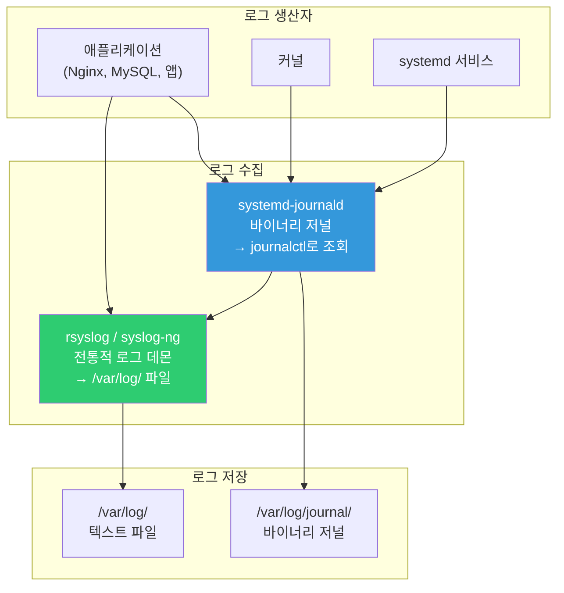
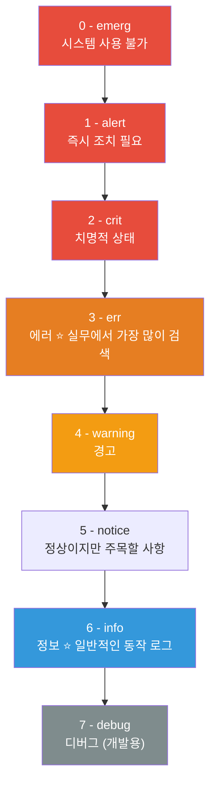
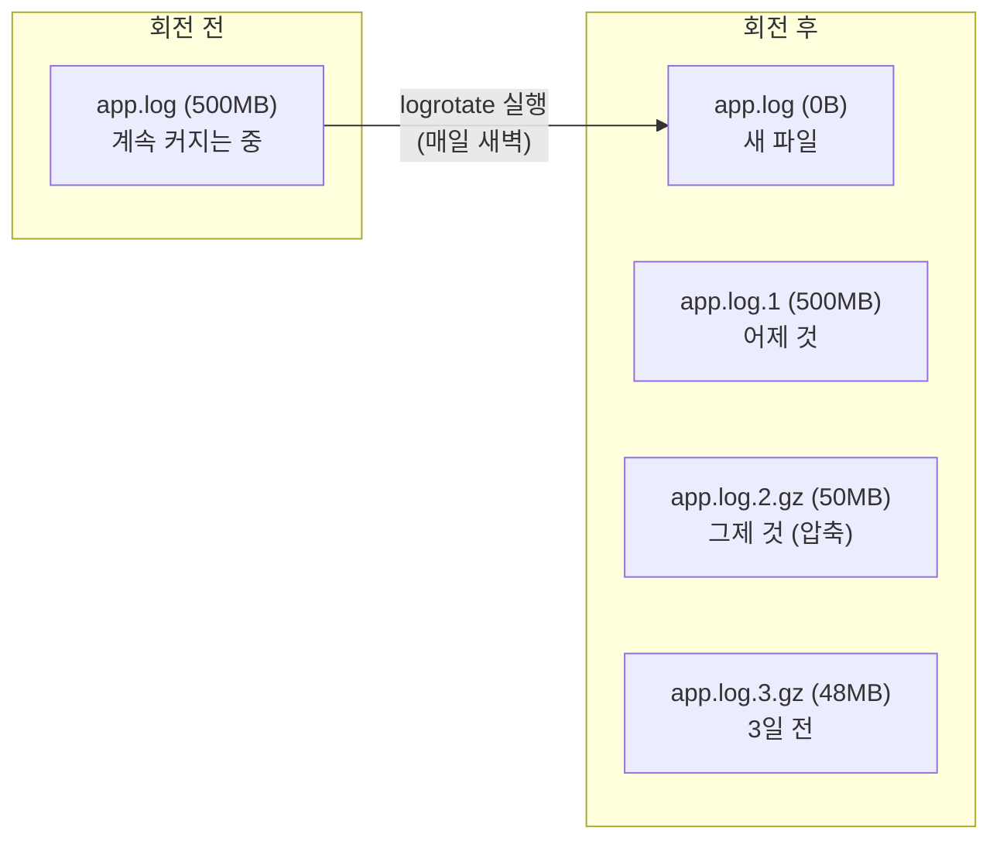
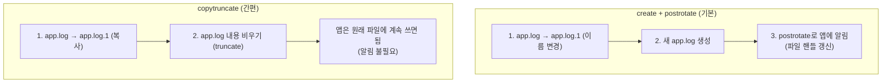

# 로그 관리 (syslog / journald / log rotation)

> 서버에서 문제가 생기면 가장 먼저 하는 일이 "로그 보기"예요. 로그는 서버의 블랙박스이자 CCTV예요. 로그를 잘 읽고 관리할 줄 알면, 장애 원인의 80%는 찾을 수 있어요.

---

## 🎯 이걸 왜 알아야 하나?

```
실무에서 로그를 보는 상황:
• "사이트가 안 열려요"         → Nginx 에러 로그 확인
• "앱이 자꾸 죽어요"          → 앱 로그 + systemd journal 확인
• "누가 서버에 접속했나요?"    → auth.log (인증 로그) 확인
• "언제부터 느려졌나요?"      → 로그 타임스탬프로 시점 추적
• "디스크가 꽉 찼어요"        → 로그 파일이 너무 커진 건 아닌지
• "보안 감사가 필요해요"      → 로그를 일정 기간 보관해야 함
```

로그를 모르면 장애 때 "모르겠어요"밖에 못 해요. 로그를 알면 "10시 23분에 DB 연결이 끊겼고, 원인은 타임아웃입니다"라고 말할 수 있어요.

---

## 🧠 핵심 개념

### 비유: 건물의 CCTV + 일지

* **로그** = 건물에서 일어나는 모든 일을 기록한 일지 + CCTV 영상
* **syslog** = 전통적인 수기 일지 시스템. 각 부서(서비스)가 일지를 관리실(로그 파일)에 제출
* **journald** = 최신 디지털 CCTV 시스템. 모든 기록을 중앙 DB에 저장. 검색이 편함
* **log rotation** = 오래된 CCTV 영상을 압축 보관하고, 너무 오래된 건 삭제하는 것

### Linux 로그 시스템 구조



**현대 Linux(Ubuntu 20+, CentOS 7+)에서는 둘 다 동시에 작동해요:**
* journald가 모든 로그를 먼저 받음
* rsyslog가 journald에서 로그를 가져와서 `/var/log/` 파일에 기록
* 결과적으로 같은 로그를 `journalctl`로도, `/var/log/` 파일로도 볼 수 있음

---

## 🔍 상세 설명

### /var/log/ — 로그 파일 디렉토리

```bash
ls -la /var/log/
# -rw-r-----  1 syslog adm    125000 Mar 12 14:30 auth.log
# -rw-r-----  1 syslog adm     85000 Mar 12 14:30 syslog
# -rw-r-----  1 syslog adm     42000 Mar 12 14:30 kern.log
# -rw-r--r--  1 root   root    15000 Mar 12 09:00 dpkg.log
# -rw-r--r--  1 root   utmp   292000 Mar 12 14:25 wtmp
# -rw-r--r--  1 root   utmp    10000 Mar 12 14:25 btmp
# -rw-r-----  1 syslog adm     65000 Mar 11 14:30 syslog.1
# -rw-r-----  1 syslog adm      8000 Mar 10 14:30 syslog.2.gz
# drwxr-xr-x  2 root   root     4096 Mar 12 09:00 nginx/
# drwxr-x---  2 root   adm      4096 Mar 12 09:00 apache2/
# drwxrwx---  2 mysql  mysql    4096 Mar 12 09:00 mysql/
# drwx------  2 root   root     4096 Mar 12 09:00 journal/
```

#### 주요 로그 파일

| 파일 | 내용 | 언제 보나요? |
|------|------|------------|
| `syslog` | 시스템 전체 로그 (종합) | 뭔가 이상할 때 가장 먼저 |
| `auth.log` | 로그인, sudo, SSH 인증 | 보안 확인, "누가 접속했지?" |
| `kern.log` | 커널 메시지 | OOM Killer, 하드웨어 에러 |
| `dpkg.log` | 패키지 설치/제거 기록 | "언제 이거 설치했지?" |
| `wtmp` | 로그인 성공 기록 (바이너리) | `last` 명령어로 조회 |
| `btmp` | 로그인 실패 기록 (바이너리) | `lastb` 명령어로 조회 |
| `dmesg` | 부팅 시 커널 메시지 | 하드웨어 인식 문제 |
| `nginx/access.log` | Nginx 접속 로그 | 트래픽 분석, 에러 추적 |
| `nginx/error.log` | Nginx 에러 로그 | 웹서버 문제 진단 |
| `mysql/error.log` | MySQL 에러 로그 | DB 문제 진단 |

```bash
# 각 로그 파일 보기

# 시스템 전체 로그 (최근 20줄)
tail -20 /var/log/syslog

# 실시간으로 로그 보기 (새 로그가 올라올 때마다 표시)
tail -f /var/log/syslog

# 여러 로그를 동시에 실시간으로
tail -f /var/log/syslog /var/log/auth.log

# 로그인 기록
last | head -10
# ubuntu   pts/0    10.0.0.5     Wed Mar 12 10:00   still logged in
# ubuntu   pts/0    10.0.0.5     Tue Mar 11 09:00 - 18:00  (09:00)
# reboot   system boot  5.15.0-91-generi Wed Mar 10 08:00   still running

# 로그인 실패 기록 (SSH 무차별 공격 확인)
sudo lastb | head -10
# admin    ssh:notty    185.220.101.42   Wed Mar 12 09:15 - 09:15  (00:00)
# root     ssh:notty    103.145.12.88    Wed Mar 12 09:14 - 09:14  (00:00)
# → IP가 반복되면 무차별 공격!

# 부팅 메시지
dmesg | tail -20
# 또는
dmesg | grep -i error
```

---

### syslog — 전통적 로그 시스템

#### syslog의 구성 요소

모든 syslog 메시지는 **facility(출처)**와 **severity(심각도)**를 가져요.

**Facility (어디서 보낸 로그?):**

| Facility | 의미 |
|----------|------|
| `kern` | 커널 |
| `user` | 사용자 프로그램 |
| `mail` | 메일 시스템 |
| `daemon` | 시스템 데몬 |
| `auth` | 인증/보안 |
| `syslog` | syslog 자체 |
| `cron` | cron 데몬 |
| `local0~7` | 사용자 정의 (앱에서 사용) |

**Severity (얼마나 심각?):**



#### rsyslog 설정

```bash
# rsyslog 설정 파일
cat /etc/rsyslog.conf

# 주요 규칙 (어떤 로그를 어디에 저장할지)
cat /etc/rsyslog.d/50-default.conf
# auth,authpriv.*                 /var/log/auth.log      ← 인증 로그
# *.*;auth,authpriv.none          /var/log/syslog        ← 나머지 전부
# kern.*                          /var/log/kern.log      ← 커널 로그
# cron.*                          /var/log/cron.log      ← cron 로그

# 형식 읽기: facility.severity  /path/to/logfile
# auth.*       = auth의 모든 레벨
# *.err        = 모든 facility의 err 이상
# *.*;auth.none = 모든 로그, 단 auth는 제외
```

#### 앱 로그를 syslog로 보내기

```bash
# logger 명령어로 syslog에 메시지 보내기
logger "배포 완료: myapp v2.1.0"
# → /var/log/syslog에 기록됨

logger -p local0.info "앱 시작됨"
logger -p local0.err "DB 연결 실패"
logger -t myapp "헬스체크 통과"

# 확인
grep myapp /var/log/syslog
# Mar 12 14:30:00 server01 myapp: 헬스체크 통과

# 스크립트에서 활용
#!/bin/bash
logger -t deploy "배포 시작: $APP_NAME"
# ... 배포 작업 ...
if [ $? -eq 0 ]; then
    logger -t deploy -p local0.info "배포 성공"
else
    logger -t deploy -p local0.err "배포 실패!"
fi
```

---

### journald — systemd의 로그 시스템

journald는 systemd와 함께 동작하는 현대적 로그 시스템이에요. 바이너리 형태로 저장되고, `journalctl`로 조회해요.

#### journalctl 기본

```bash
# 전체 로그 (최신이 아래)
journalctl

# 최근 로그 (가장 많이 씀)
journalctl -n 50        # 최근 50줄
journalctl -n 100       # 최근 100줄

# 역순 (최신이 위)
journalctl -r | head -20

# 실시간 로그 (tail -f 처럼)
journalctl -f

# 페이지 없이 한번에 출력 (스크립트에서 유용)
journalctl --no-pager -n 20
```

#### 서비스별 로그 (★ 가장 많이 쓰는 기능)

```bash
# 특정 서비스의 로그
journalctl -u nginx
journalctl -u docker
journalctl -u sshd

# 특정 서비스의 최근 30줄
journalctl -u nginx -n 30

# 특정 서비스 실시간 로그
journalctl -u myapp -f

# 여러 서비스 동시에
journalctl -u nginx -u myapp -f

# 출력 예시
journalctl -u nginx -n 10
# Mar 12 09:00:00 server01 systemd[1]: Starting A high performance web server...
# Mar 12 09:00:00 server01 nginx[900]: nginx: the configuration file syntax is ok
# Mar 12 09:00:00 server01 systemd[1]: Started A high performance web server.
# Mar 12 10:15:30 server01 nginx[901]: 10.0.0.5 - - [12/Mar/2025:10:15:30 +0000] "GET / HTTP/1.1" 200
# Mar 12 10:15:31 server01 nginx[901]: 10.0.0.5 - - [12/Mar/2025:10:15:31 +0000] "GET /api HTTP/1.1" 500
#                                                                                                      ^^^
#                                                                                                      500 에러!
```

#### 시간 필터

```bash
# 특정 시간 이후
journalctl --since "2025-03-12 10:00:00"
journalctl --since "1 hour ago"
journalctl --since "today"
journalctl --since "yesterday"

# 시간 범위
journalctl --since "2025-03-12 10:00" --until "2025-03-12 12:00"
journalctl --since "2 hours ago" --until "1 hour ago"

# 이번 부팅 이후 (장애 후 재부팅한 경우)
journalctl -b        # 현재 부팅
journalctl -b -1     # 이전 부팅 (재부팅 전 로그)

# 부팅 목록
journalctl --list-boots
#  0 abc123 Wed 2025-03-12 09:00:00 UTC — Wed 2025-03-12 14:30:00 UTC
# -1 def456 Tue 2025-03-11 08:00:00 UTC — Wed 2025-03-12 08:59:59 UTC
```

#### 심각도(Priority) 필터

```bash
# 에러 이상만 (err, crit, alert, emerg)
journalctl -p err
journalctl -u myapp -p err

# 경고 이상만
journalctl -p warning

# 특정 범위
journalctl -p err..crit

# 출력 예시
journalctl -p err --since "today" --no-pager
# Mar 12 10:15:31 server01 myapp[5000]: ERROR: Database connection timeout
# Mar 12 10:15:32 server01 myapp[5000]: ERROR: Failed to process request
# Mar 12 10:20:00 server01 kernel: Out of memory: Killed process 5000 (myapp)
```

#### 출력 형식

```bash
# 짧은 형식 (기본)
journalctl -u nginx -n 3
# Mar 12 09:00:00 server01 nginx[900]: started

# 자세한 형식
journalctl -u nginx -n 1 -o verbose
# Wed 2025-03-12 09:00:00.123456 UTC [s=abc; i=1; b=def; ...]
#     _TRANSPORT=stdout
#     _SYSTEMD_UNIT=nginx.service
#     _PID=900
#     _COMM=nginx
#     MESSAGE=started
#     PRIORITY=6
#     ...

# JSON 형식 (파싱용, 스크립트에서 유용)
journalctl -u nginx -n 1 -o json-pretty
# {
#     "_HOSTNAME" : "server01",
#     "_SYSTEMD_UNIT" : "nginx.service",
#     "MESSAGE" : "started",
#     "PRIORITY" : "6",
#     "__REALTIME_TIMESTAMP" : "1710234000123456",
#     ...
# }

# 메시지만 (grep 등과 조합할 때)
journalctl -u nginx -o cat -n 5
# started
# 10.0.0.5 - - "GET / HTTP/1.1" 200
# 10.0.0.5 - - "GET /api HTTP/1.1" 500
```

#### 기타 유용한 필터

```bash
# 특정 PID의 로그
journalctl _PID=5000

# 특정 사용자의 로그
journalctl _UID=1000

# 특정 실행 파일의 로그
journalctl _COMM=python3

# 커널 메시지만
journalctl -k
journalctl -k | grep -i "oom\|error\|fail"

# 디스크 사용량
journalctl --disk-usage
# Archived and active journals take up 256.0M in the file system.
```

---

### 로그 분석 도구 (grep, awk, sed)

로그를 사람 눈으로만 보면 한계가 있어요. 텍스트 처리 도구를 조합하면 강력한 분석이 가능해요.

#### grep — 로그에서 패턴 찾기

```bash
# 기본: 특정 단어 포함 줄 찾기
grep "error" /var/log/syslog
grep "ERROR" /var/log/myapp/app.log

# 대소문자 무시
grep -i "error" /var/log/syslog

# 특정 단어 제외
grep -v "healthcheck" /var/log/nginx/access.log
# → 헬스체크 로그는 빼고 보기 (너무 많으니까)

# 여러 패턴 동시에
grep -E "error|fail|timeout" /var/log/syslog

# 앞뒤 줄도 같이 보기 (문맥 파악)
grep -A 3 "ERROR" /var/log/myapp/app.log    # After: 뒤 3줄
grep -B 3 "ERROR" /var/log/myapp/app.log    # Before: 앞 3줄
grep -C 3 "ERROR" /var/log/myapp/app.log    # Context: 앞뒤 3줄

# 매칭 건수만
grep -c "error" /var/log/syslog
# 42

# 줄 번호 표시
grep -n "error" /var/log/syslog
# 150:Mar 12 10:15:31 server01 myapp: error connecting to DB
# 230:Mar 12 10:20:00 server01 myapp: error timeout

# 재귀적으로 디렉토리 내 모든 파일 검색
grep -r "password" /etc/ 2>/dev/null
grep -rl "error" /var/log/    # 파일 이름만

# 정규식 활용
grep -E "^Mar 12 1[0-2]:" /var/log/syslog    # 10시~12시 로그만
grep -E "\b5[0-9]{2}\b" /var/log/nginx/access.log  # HTTP 5xx 에러
```

#### awk — 로그 필드 추출/분석

```bash
# Nginx access log 형식:
# 10.0.0.5 - - [12/Mar/2025:10:15:30 +0000] "GET /api HTTP/1.1" 200 1234
# $1=IP    $7=URL  $9=상태코드  $10=바이트

# 상태 코드만 추출
awk '{print $9}' /var/log/nginx/access.log | head -10
# 200
# 200
# 304
# 500
# 200

# 상태 코드별 카운트 (매우 유용!)
awk '{print $9}' /var/log/nginx/access.log | sort | uniq -c | sort -rn
#  15234 200
#   2100 304
#    456 404
#     23 500    ← 500 에러 23건!
#      5 502

# IP별 요청 수 (누가 많이 접속하나)
awk '{print $1}' /var/log/nginx/access.log | sort | uniq -c | sort -rn | head -10
#  5000 10.0.0.5
#  3200 10.0.0.10
#  1500 185.220.101.42    ← 외부 IP가 많으면 공격 의심!

# 500 에러만 추출 (어떤 URL에서?)
awk '$9 == 500 {print $7}' /var/log/nginx/access.log | sort | uniq -c | sort -rn
#   15 /api/users
#    5 /api/orders
#    3 /api/payments

# 시간대별 요청 수 (트래픽 패턴)
awk '{print $4}' /var/log/nginx/access.log | cut -d: -f2 | sort | uniq -c
#   500 08
#  1200 09
#  2500 10    ← 10시에 트래픽 피크
#  2300 11
#  1800 12

# 특정 시간 + 500 에러만
awk '$4 ~ /12\/Mar\/2025:10/ && $9 == 500' /var/log/nginx/access.log
```

#### sed — 로그 텍스트 변환

```bash
# IP 주소 마스킹 (개인정보 보호)
sed 's/[0-9]\{1,3\}\.[0-9]\{1,3\}\.[0-9]\{1,3\}\.[0-9]\{1,3\}/xxx.xxx.xxx.xxx/g' /var/log/nginx/access.log

# 특정 시간 범위 추출
sed -n '/12\/Mar\/2025:10:00/,/12\/Mar\/2025:11:00/p' /var/log/nginx/access.log

# 타임스탬프 형식 변환
sed 's/\[\([^]]*\)\]/\1/' /var/log/nginx/access.log | head -3
```

#### 실무 로그 분석 콤보 (파이프라인)

```bash
# "최근 1시간 동안 500 에러가 가장 많이 난 URL Top 5"
grep "$(date -d '1 hour ago' '+%d/%b/%Y:%H')" /var/log/nginx/access.log \
    | awk '$9 == 500 {print $7}' \
    | sort | uniq -c | sort -rn | head -5
#   15 /api/users
#    8 /api/orders
#    3 /api/search

# "특정 IP에서 온 요청만 추출"
grep "185.220.101.42" /var/log/nginx/access.log | tail -20

# "에러 로그에서 가장 많은 에러 유형"
grep -i "error" /var/log/myapp/app.log \
    | sed 's/.*ERROR: //' \
    | sort | uniq -c | sort -rn | head -5
#   45 Database connection timeout
#   23 Redis connection refused
#   12 File not found: /uploads/missing.jpg

# "SSH 무차별 공격 탐지"
grep "Failed password" /var/log/auth.log \
    | awk '{print $(NF-3)}' \
    | sort | uniq -c | sort -rn | head -10
#  520 185.220.101.42
#  340 103.145.12.88
#   25 10.0.0.15
```

---

### log rotation — 로그 회전 관리

로그 파일은 관리 안 하면 끝없이 커져요. logrotate가 자동으로 오래된 로그를 압축하고 삭제해요.

#### logrotate 동작 방식



```
회전 과정:
1. app.log.3.gz → 삭제 (rotate 3이면)
2. app.log.2.gz → app.log.3.gz
3. app.log.1    → app.log.2.gz (compress)
4. app.log      → app.log.1
5. 새 app.log 생성 (빈 파일)
6. postrotate 스크립트 실행 (서비스에 알림)
```

#### logrotate 설정

```bash
# 기본 설정
cat /etc/logrotate.conf
# weekly                # 기본 회전 주기
# rotate 4              # 4개 백업 유지
# create                # 회전 후 새 파일 생성
# compress              # gzip 압축
# include /etc/logrotate.d

# 개별 서비스 설정 확인
ls /etc/logrotate.d/
# alternatives  apt  dpkg  nginx  rsyslog  ufw  ...

cat /etc/logrotate.d/nginx
# /var/log/nginx/*.log {
#     daily
#     missingok
#     rotate 14
#     compress
#     delaycompress
#     notifempty
#     create 0640 www-data adm
#     sharedscripts
#     postrotate
#         if [ -d /etc/logrotate.d/nginx ]; then
#             /usr/sbin/invoke-rc.d nginx rotate >/dev/null 2>&1
#         fi
#     endscript
# }
```

**주요 옵션 해설:**

| 옵션 | 의미 |
|------|------|
| `daily` / `weekly` / `monthly` | 회전 주기 |
| `rotate N` | N개 백업 유지 (나머지 삭제) |
| `compress` | gzip으로 압축 |
| `delaycompress` | 직전 파일은 압축 안 함 (안정성) |
| `missingok` | 파일 없어도 에러 안 냄 |
| `notifempty` | 빈 파일은 회전 안 함 |
| `create 0640 user group` | 새 파일 권한/소유자 |
| `copytruncate` | 파일을 복사 후 원본 비우기 (postrotate 불필요) |
| `sharedscripts` | postrotate를 한 번만 실행 |
| `postrotate` / `endscript` | 회전 후 실행할 명령어 |
| `size 100M` | 크기 기반 회전 (100MB 넘으면) |
| `maxsize 500M` | 주기와 상관없이 이 크기 넘으면 회전 |
| `dateext` | 파일명에 날짜 추가 (app.log-20250312) |

#### 커스텀 logrotate 설정 만들기

```bash
# 우리 앱의 logrotate 설정
cat << 'EOF' | sudo tee /etc/logrotate.d/myapp
/var/log/myapp/*.log {
    daily                    # 매일 회전
    rotate 30                # 30일치 보관
    compress                 # 압축
    delaycompress            # 직전 파일은 압축 안 함
    missingok                # 파일 없어도 OK
    notifempty               # 빈 파일은 회전 안 함
    create 0644 myapp myapp  # 새 파일 권한
    dateext                  # 파일명에 날짜 추가
    dateformat -%Y%m%d       # 날짜 형식
    
    postrotate
        # 앱에 로그 파일이 바뀌었다고 알려줌
        systemctl reload myapp 2>/dev/null || true
    endscript
}
EOF

# 빠르게 회전하는 로그용 (크기 기반)
cat << 'EOF' | sudo tee /etc/logrotate.d/myapp-fast
/var/log/myapp/debug.log {
    size 100M                # 100MB 넘으면 회전
    rotate 5                 # 5개만 보관
    compress
    missingok
    notifempty
    copytruncate             # 앱 재시작 없이 회전
}
EOF
```

```bash
# logrotate 테스트 (시뮬레이션, 실제 실행 안 함)
sudo logrotate -d /etc/logrotate.d/myapp
# reading config file /etc/logrotate.d/myapp
# Handling 1 logs
# rotating pattern: /var/log/myapp/*.log after 1 days (30 rotations)
# ...
# rotating log /var/log/myapp/app.log, log->rotateCount is 30
# dateext suffix '-20250312'
# ...

# 강제 실행 (테스트)
sudo logrotate -f /etc/logrotate.d/myapp

# 전체 logrotate 수동 실행
sudo logrotate -f /etc/logrotate.conf

# logrotate 상태 파일 (마지막 실행 시점)
cat /var/lib/logrotate/status
# logrotate state -- version 2
# "/var/log/syslog" 2025-3-12-6:25:7
# "/var/log/nginx/access.log" 2025-3-12-6:25:7
```

#### `copytruncate` vs `postrotate`



```bash
# 앱이 SIGHUP 등으로 로그 파일을 다시 여는 기능이 있으면 → postrotate
# 앱이 그런 기능이 없으면 → copytruncate

# copytruncate 주의: 복사와 비우기 사이에 아주 짧은 시간 동안 로그 유실 가능
# 대부분의 경우 무시해도 되지만, 금융 등 로그 유실이 치명적인 환경에서는 postrotate 사용
```

---

### journald 영구 저장 설정

기본적으로 journald는 재부팅하면 로그가 사라지는 배포판이 있어요. 영구 저장하려면 설정이 필요해요.

```bash
# 현재 저장 모드 확인
cat /etc/systemd/journald.conf | grep Storage
# #Storage=auto
# auto: /var/log/journal/ 디렉토리가 있으면 영구, 없으면 휘발

# 영구 저장 설정
sudo mkdir -p /var/log/journal
sudo systemd-tmpfiles --create --prefix /var/log/journal
sudo systemctl restart systemd-journald

# 또는 설정 파일에서 명시
sudo sed -i 's/#Storage=auto/Storage=persistent/' /etc/systemd/journald.conf
sudo systemctl restart systemd-journald

# 저널 크기 제한 설정
sudo vim /etc/systemd/journald.conf
# [Journal]
# Storage=persistent
# SystemMaxUse=500M        # 전체 최대 500MB
# SystemMaxFileSize=50M    # 파일당 최대 50MB
# MaxRetentionSec=1month   # 1달까지만 보관

sudo systemctl restart systemd-journald

# 수동 정리
sudo journalctl --vacuum-size=200M    # 200MB까지만 유지
sudo journalctl --vacuum-time=7d      # 7일 이전 삭제
sudo journalctl --vacuum-files=10     # 파일 10개만 유지
```

---

## 💻 실습 예제

### 실습 1: 로그 파일 탐험

```bash
# 1. /var/log 안에 뭐가 있나
ls -lhS /var/log/ | head -15    # 크기 순

# 2. syslog 최근 내용
tail -20 /var/log/syslog

# 3. 인증 로그에서 SSH 접속 기록
grep "Accepted" /var/log/auth.log | tail -5
# Mar 12 10:00:00 server01 sshd[1234]: Accepted publickey for ubuntu from 10.0.0.5

# 4. 커널 에러
dmesg | grep -i -E "error|fail|warn" | tail -10

# 5. 로그인 기록
last | head -10
```

### 실습 2: journalctl 실전

```bash
# 1. 이번 부팅 후 에러만
journalctl -b -p err --no-pager

# 2. SSH 서비스 로그
journalctl -u sshd --since "today" -n 20

# 3. 실시간 시스템 로그 보면서 다른 터미널에서 SSH 접속 해보기
# 터미널 1:
journalctl -f
# 터미널 2에서 SSH 접속하면 터미널 1에 로그가 찍힘

# 4. 커널 메시지 (OOM 등)
journalctl -k --since "today" | grep -i "oom\|kill\|error"

# 5. JSON 형식 출력 (스크립트에서 파싱용)
journalctl -u sshd -n 3 -o json-pretty
```

### 실습 3: 로그 분석 파이프라인

```bash
# Nginx가 설치되어 있다면 (또는 비슷한 접속 로그)

# 1. 상태 코드 분포
awk '{print $9}' /var/log/nginx/access.log 2>/dev/null | sort | uniq -c | sort -rn

# 2. 시간대별 요청 수
awk '{print $4}' /var/log/nginx/access.log 2>/dev/null | cut -d: -f2 | sort | uniq -c

# 3. 에러 로그에서 패턴 찾기
grep -i "error" /var/log/syslog | awk '{print $5}' | sort | uniq -c | sort -rn | head -10

# Nginx가 없으면 syslog로 연습
# 4. syslog에서 서비스별 로그 건수
awk '{print $5}' /var/log/syslog | cut -d'[' -f1 | sort | uniq -c | sort -rn | head -10
# 1500 systemd
#  800 CRON
#  300 sshd
#  100 nginx
```

### 실습 4: logrotate 설정 만들기

```bash
# 1. 테스트용 로그 파일 만들기
sudo mkdir -p /var/log/testapp
for i in $(seq 1 1000); do
    echo "$(date) - Log entry $i" | sudo tee -a /var/log/testapp/test.log > /dev/null
done
ls -lh /var/log/testapp/test.log

# 2. logrotate 설정 만들기
cat << 'EOF' | sudo tee /etc/logrotate.d/testapp
/var/log/testapp/*.log {
    size 10K
    rotate 3
    compress
    missingok
    notifempty
    copytruncate
    dateext
}
EOF

# 3. 시뮬레이션
sudo logrotate -d /etc/logrotate.d/testapp

# 4. 강제 실행
sudo logrotate -f /etc/logrotate.d/testapp

# 5. 결과 확인
ls -lh /var/log/testapp/
# test.log              ← 새로 생성됨 (비어있거나 작음)
# test.log-20250312     ← 어제 것
# test.log-20250311.gz  ← 그제 것 (압축)

# 6. 정리
sudo rm /etc/logrotate.d/testapp
sudo rm -rf /var/log/testapp
```

---

## 🏢 실무에서는?

### 시나리오 1: 장애 발생! 로그로 원인 찾기

```bash
# "10시 30분부터 API가 500 에러를 뿜고 있습니다"

# 1단계: 앱 로그에서 에러 찾기
journalctl -u myapp --since "10:25" --until "10:35" -p err
# Mar 12 10:28:00 myapp[5000]: ERROR: Redis connection refused
# Mar 12 10:28:01 myapp[5000]: ERROR: Cache miss, falling back to DB
# Mar 12 10:28:05 myapp[5000]: ERROR: Database connection pool exhausted
# Mar 12 10:30:00 myapp[5000]: CRITICAL: All DB connections in use

# 2단계: Redis가 왜 죽었나?
journalctl -u redis --since "10:20" --until "10:30"
# Mar 12 10:27:55 redis[3000]: Out of memory
# Mar 12 10:27:55 redis[3000]: Can't save in background: fork: Cannot allocate memory

# 3단계: 시스템 로그에서 확인
journalctl -k --since "10:25" --until "10:30"
# Mar 12 10:27:54 kernel: redis-server invoked oom-killer
# → OOM Killer가 Redis를 죽였음!

# 4단계: 메모리 누수 원인 찾기
journalctl -u myapp --since "09:00" | grep -i "memory\|heap"

# 결론: 메모리 누수로 OOM → Redis 죽음 → 캐시 미스 → DB 과부하 → 500 에러
```

### 시나리오 2: SSH 무차별 공격 탐지

```bash
# auth.log에서 실패한 SSH 접속 분석

# 1. 실패 건수
grep "Failed password" /var/log/auth.log | wc -l
# 15420   ← 공격 받고 있음!

# 2. 공격 IP 추출
grep "Failed password" /var/log/auth.log \
    | awk '{print $(NF-3)}' \
    | sort | uniq -c | sort -rn | head -5
#  8200 185.220.101.42
#  4300 103.145.12.88
#  2100 45.227.254.20

# 3. 어떤 사용자로 시도하나
grep "Failed password" /var/log/auth.log \
    | awk '{print $(NF-5)}' \
    | sort | uniq -c | sort -rn | head -5
#  6000 root
#  3000 admin
#  2000 ubuntu
#  1000 test

# 4. 대응: 해당 IP 차단
sudo iptables -A INPUT -s 185.220.101.42 -j DROP
# 또는 fail2ban 설치 (자동 차단)
```

### 시나리오 3: 로그 중앙화 준비

```bash
# 여러 서버의 로그를 한 곳에서 보고 싶을 때
# → rsyslog의 원격 전송 기능 활용

# 로그 수집 서버 (rsyslog)
# /etc/rsyslog.conf에 추가:
# module(load="imtcp")
# input(type="imtcp" port="514")

# 앱 서버에서 원격으로 로그 전송
# /etc/rsyslog.d/remote.conf
# *.* @@log-server:514    # TCP로 전송 (@@)
# *.* @log-server:514     # UDP로 전송 (@)

sudo systemctl restart rsyslog

# 실무에서는 보통 이 단계를 넘어서:
# rsyslog → Fluentd/Fluentbit → Elasticsearch → Kibana
# 또는
# journald → Fluentbit → Loki → Grafana
# → 이건 08-observability 카테고리에서 자세히 다룸
```

### 시나리오 4: 로그 기반 알림 만들기

```bash
# 특정 패턴이 로그에 나오면 Slack 알림

cat << 'SCRIPT' | sudo tee /opt/scripts/log-alert.sh
#!/bin/bash
# 최근 5분간 에러 로그 체크

ERROR_COUNT=$(journalctl -u myapp --since "5 minutes ago" -p err --no-pager 2>/dev/null | wc -l)

if [ "$ERROR_COUNT" -gt 10 ]; then
    MESSAGE="⚠️ [$(hostname)] myapp 에러 급증! 최근 5분간 ${ERROR_COUNT}건"
    echo "$MESSAGE"
    
    # Slack 알림 (웹훅 URL을 교체하세요)
    # curl -s -X POST -H 'Content-type: application/json' \
    #     --data "{\"text\":\"$MESSAGE\"}" \
    #     https://hooks.slack.com/services/YOUR/WEBHOOK/URL
fi
SCRIPT
sudo chmod +x /opt/scripts/log-alert.sh

# cron으로 5분마다 실행
# */5 * * * *  /opt/scripts/log-alert.sh >> /var/log/log-alert.log 2>&1
```

---

## ⚠️ 자주 하는 실수

### 1. 로그 파일만 삭제하고 logrotate 안 설정하기

```bash
# ❌ 수동으로 로그 삭제 → 금방 다시 차옴
sudo rm /var/log/nginx/access.log
# → 다음 날 다시 꽉 참

# ✅ logrotate로 자동 관리
# /etc/logrotate.d/nginx 설정 확인 및 적용
```

### 2. 로그 로테이션 후 서비스에 알리지 않기

```bash
# ❌ 로그 파일이 바뀌었는데 서비스가 여전히 이전 파일에 쓰는 경우
# → app.log.1에 계속 로그가 쌓이고, 새 app.log는 비어있음

# ✅ postrotate로 서비스에 알리기
# postrotate
#     systemctl reload myapp
# endscript

# 또는 copytruncate 사용 (알림 불필요)
```

### 3. journalctl 용량 관리 안 하기

```bash
# journal이 디스크를 많이 차지할 수 있음
journalctl --disk-usage
# Archived and active journals take up 2.5G in the file system.

# ✅ 크기 제한 설정
sudo vim /etc/systemd/journald.conf
# SystemMaxUse=500M

# ✅ 또는 주기적 정리
sudo journalctl --vacuum-size=500M
```

### 4. 로그에 민감 정보 노출

```bash
# ❌ 앱 로그에 비밀번호, 토큰 등이 그대로 찍힘
# ERROR: DB connection failed with password=MySecret123

# ✅ 앱에서 민감 정보 마스킹 처리
# ERROR: DB connection failed with password=***

# 이미 찍힌 로그에서 제거
sed -i 's/password=[^ ]*/password=***/g' /var/log/myapp/app.log
```

### 5. 실시간 로그를 grep으로만 보기

```bash
# ❌ 느리고 비효율적
tail -f /var/log/syslog | grep error

# ✅ journalctl 필터 사용 (더 빠르고 정확)
journalctl -u myapp -p err -f

# ✅ 또는 grep 대신 awk로 복합 필터
tail -f /var/log/nginx/access.log | awk '$9 >= 500'
```

---

## 📝 정리

### 로그 명령어 치트시트

```bash
# === 파일 기반 로그 ===
tail -f /var/log/syslog              # 실시간 보기
tail -20 /var/log/auth.log           # 최근 20줄
grep "error" /var/log/syslog         # 패턴 검색
grep -C 3 "ERROR" /var/log/app.log   # 앞뒤 3줄 포함

# === journalctl ===
journalctl -u [service]              # 서비스 로그
journalctl -u [service] -f           # 실시간
journalctl -u [service] -p err       # 에러만
journalctl -u [service] -n 50        # 최근 50줄
journalctl --since "1 hour ago"      # 시간 필터
journalctl -b                        # 이번 부팅 이후
journalctl -k                        # 커널 메시지

# === 로그 분석 ===
awk '{print $9}' access.log | sort | uniq -c | sort -rn   # 상태코드 분포
awk '{print $1}' access.log | sort | uniq -c | sort -rn   # IP별 요청수
grep -c "error" syslog                                     # 에러 건수

# === logrotate ===
sudo logrotate -d /etc/logrotate.d/myapp   # 테스트 (시뮬레이션)
sudo logrotate -f /etc/logrotate.d/myapp   # 강제 실행
```

### 장애 시 로그 확인 순서

```
1. systemctl status [service]        → 서비스 상태 + 최근 로그
2. journalctl -u [service] -p err    → 에러 로그
3. journalctl -k                     → OOM, 하드웨어 에러
4. /var/log/syslog                   → 시스템 전체 로그
5. /var/log/[service]/error.log      → 서비스 자체 에러 로그
6. dmesg                             → 부팅/커널 에러
```

---

## 🔗 다음 강의

다음은 **[01-linux/09-network-commands.md — 네트워크 명령어 (iproute2 / ss / tcpdump / iptables)](./09-network-commands)** 예요.

서버의 네트워크 상태를 확인하고, 어떤 포트가 열려있는지, 트래픽이 어디로 가는지, 방화벽 규칙은 어떤지 — Linux에서 네트워크를 다루는 필수 명령어들을 배워볼게요.
