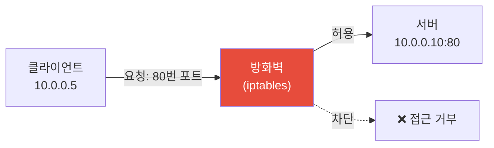
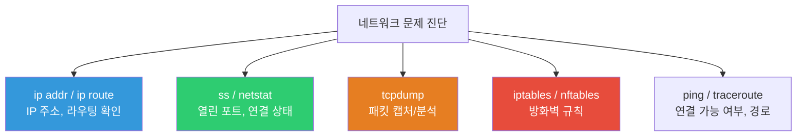
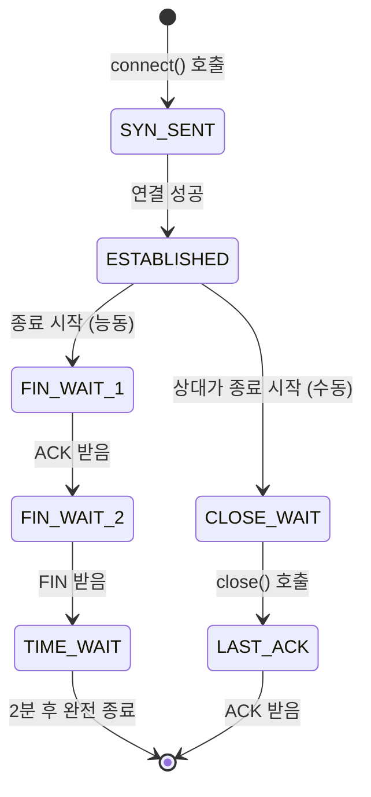
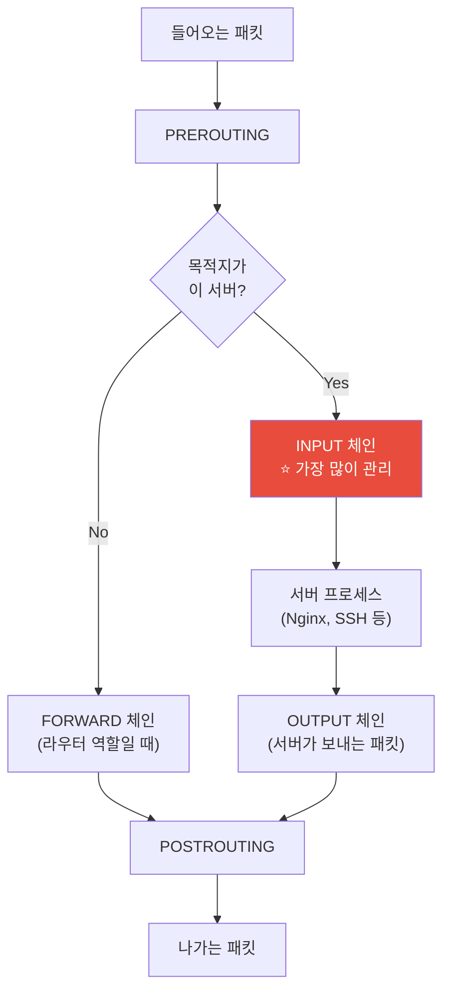
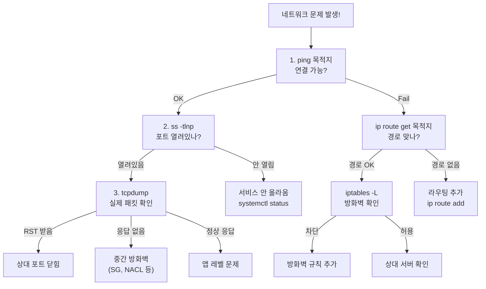

# 네트워크 명령어 (iproute2 / ss / tcpdump / iptables)

> "서버가 네트워크를 통해 외부와 대화하는 방법" — 서버의 IP는 뭔지, 어떤 포트가 열려있는지, 패킷이 어디로 가는지, 방화벽은 뭘 막고 있는지. 이걸 모르면 네트워크 장애 때 손을 쓸 수가 없어요.

---

## 🎯 이걸 왜 알아야 하나?

```
실무에서 이런 상황이 매주 일어나요:
• "앱이 DB에 연결이 안 돼요"         → 포트가 열려있는지 확인 (ss)
• "외부에서 접속이 안 돼요"          → 방화벽 규칙 확인 (iptables)
• "이 서버 IP가 뭐지?"              → ip addr
• "두 서버 사이 통신이 느려요"       → tcpdump로 패킷 분석
• "갑자기 트래픽이 폭증했어요"       → 어떤 IP/포트에서 오는지 확인
• "서버에 이상한 연결이 있어요"      → 현재 연결 상태 확인 (ss)
```

이 강의에서 다루는 명령어들은 네트워크 문제의 **진단 도구**예요. 의사로 치면 청진기, 혈압계, X-ray 같은 거예요.

---

## 🧠 핵심 개념

### 비유: 도로 교통 시스템

서버의 네트워크를 **도로 교통 시스템**으로 비유해볼게요.

* **IP 주소** = 건물 주소. "서울시 강남구 테헤란로 123번지"
* **포트** = 건물 안의 호실. "123번지 **80호**(웹서버), **22호**(SSH), **3306호**(MySQL)"
* **라우팅** = 내비게이션. 패킷이 목적지까지 가는 경로
* **방화벽(iptables)** = 건물 경비원. "80호 방문은 OK, 3306호는 내부인만 OK"
* **tcpdump** = 도로 CCTV. 지나가는 차(패킷)를 전부 녹화



### 명령어 맵



---

## 🔍 상세 설명

### ip — 네트워크 인터페이스/라우팅 관리 (iproute2)

`ip` 명령어는 예전의 `ifconfig`를 대체하는 현대적 도구예요. 사실상 모든 네트워크 설정을 이걸로 해요.

#### ip addr — IP 주소 확인

```bash
ip addr
# 1: lo: <LOOPBACK,UP,LOWER_UP> mtu 65536 qdisc noqueue state UNKNOWN
#     link/loopback 00:00:00:00:00:00 brd 00:00:00:00:00:00
#     inet 127.0.0.1/8 scope host lo
#     inet6 ::1/128 scope host
#
# 2: eth0: <BROADCAST,MULTICAST,UP,LOWER_UP> mtu 9001 qdisc fq_codel state UP
#     link/ether 0a:1b:2c:3d:4e:5f brd ff:ff:ff:ff:ff:ff
#     inet 10.0.1.50/24 brd 10.0.1.255 scope global dynamic eth0
#     inet6 fe80::81b:2cff:fe3d:4e5f/64 scope link

# 짧게 보기 (추천)
ip -brief addr
# lo        UNKNOWN  127.0.0.1/8 ::1/128
# eth0      UP       10.0.1.50/24 fe80::81b:2cff:fe3d:4e5f/64

# 특정 인터페이스만
ip addr show eth0
```

**출력 해석:**

```
eth0: <BROADCAST,MULTICAST,UP,LOWER_UP>
                              ^^  ^^^^^^^^
                              UP=활성화  LOWER_UP=케이블 연결됨

inet 10.0.1.50/24 brd 10.0.1.255 scope global dynamic eth0
     ^^^^^^^^^^^  ^^               ^^^^^^
     IP/서브넷    CIDR 표기        global=외부 통신 가능

link/ether 0a:1b:2c:3d:4e:5f
           ^^^^^^^^^^^^^^^^^^^
           MAC 주소
```

```bash
# 예전 명령어와 비교
ip addr          ← 현재 (추천)
ifconfig         ← 레거시 (deprecated)

# IP 추가/삭제 (임시, 재부팅하면 사라짐)
sudo ip addr add 10.0.1.100/24 dev eth0
sudo ip addr del 10.0.1.100/24 dev eth0

# 인터페이스 올리기/내리기
sudo ip link set eth0 up
sudo ip link set eth0 down
```

#### ip route — 라우팅 테이블

```bash
ip route
# default via 10.0.1.1 dev eth0 proto dhcp src 10.0.1.50 metric 100
# 10.0.1.0/24 dev eth0 proto kernel scope link src 10.0.1.50
# 172.17.0.0/16 dev docker0 proto kernel scope link src 172.17.0.1

# 읽는 법:
# default via 10.0.1.1     → 기본 게이트웨이가 10.0.1.1
# 10.0.1.0/24 dev eth0     → 10.0.1.x 대역은 eth0으로 직접 통신
# 172.17.0.0/16 dev docker0 → Docker 네트워크는 docker0 인터페이스

# 특정 목적지로 가는 경로 확인
ip route get 8.8.8.8
# 8.8.8.8 via 10.0.1.1 dev eth0 src 10.0.1.50 uid 1000
# → 8.8.8.8에 가려면 게이트웨이 10.0.1.1을 통해 eth0으로 나감

ip route get 10.0.1.100
# 10.0.1.100 dev eth0 src 10.0.1.50 uid 1000
# → 같은 서브넷이라 게이트웨이 없이 직접 통신

# 라우팅 추가/삭제 (임시)
sudo ip route add 192.168.1.0/24 via 10.0.1.1
sudo ip route del 192.168.1.0/24
```

#### ip neigh — ARP 테이블 (주변 장비)

```bash
ip neigh
# 10.0.1.1 dev eth0 lladdr 0a:ff:ff:ff:ff:01 REACHABLE
# 10.0.1.20 dev eth0 lladdr 0a:1b:2c:3d:4e:60 STALE
# 10.0.1.30 dev eth0 lladdr 0a:1b:2c:3d:4e:70 REACHABLE

# 상태:
# REACHABLE → 최근에 통신 성공
# STALE     → 한동안 통신 없음 (아직 유효)
# FAILED    → 연결 실패
```

---

### ss — 소켓/포트 상태 확인 (★ 매우 자주 사용)

`ss`는 예전의 `netstat`을 대체하는 명령어예요. 어떤 포트가 열려있는지, 누가 연결되어 있는지 확인해요.

#### 열린 포트 확인 (Listen 상태)

```bash
# 리슨 중인 TCP 포트 (가장 많이 쓰는 조합!)
ss -tlnp
# State   Recv-Q  Send-Q  Local Address:Port  Peer Address:Port  Process
# LISTEN  0       511     0.0.0.0:80           0.0.0.0:*          users:(("nginx",pid=900,fd=6))
# LISTEN  0       128     0.0.0.0:22           0.0.0.0:*          users:(("sshd",pid=800,fd=3))
# LISTEN  0       4096    127.0.0.1:3306       0.0.0.0:*          users:(("mysqld",pid=3000,fd=22))
# LISTEN  0       511     0.0.0.0:443          0.0.0.0:*          users:(("nginx",pid=900,fd=7))
# LISTEN  0       4096    0.0.0.0:9090         0.0.0.0:*          users:(("prometheus",pid=4000,fd=8))
# LISTEN  0       4096    127.0.0.1:6379       0.0.0.0:*          users:(("redis-server",pid=3500,fd=6))
```

**옵션 의미:**

| 옵션 | 의미 |
|------|------|
| `-t` | TCP만 |
| `-u` | UDP만 |
| `-l` | LISTEN 상태만 (서버 역할) |
| `-n` | 숫자로 표시 (포트 이름 변환 안 함) |
| `-p` | 프로세스 정보 표시 |
| `-a` | 모든 상태 (LISTEN + ESTABLISHED + ...) |

```bash
# 출력 해석
# LISTEN  0  511  0.0.0.0:80  0.0.0.0:*  users:(("nginx",pid=900,fd=6))
#                 ^^^^^^^^^
#                 0.0.0.0 = 모든 IP에서 접속 허용
#                 127.0.0.1 = 로컬에서만 접속 허용

# 즉:
# 0.0.0.0:80    → 외부에서 접속 가능 (Nginx 웹서버)
# 0.0.0.0:22    → 외부에서 SSH 접속 가능
# 127.0.0.1:3306 → 로컬에서만 MySQL 접속 가능 (외부 차단) ✅ 안전
# 127.0.0.1:6379 → 로컬에서만 Redis 접속 가능 ✅ 안전
```

#### 현재 연결 상태 확인

```bash
# 모든 TCP 연결
ss -tnp
# State       Recv-Q  Send-Q  Local Address:Port  Peer Address:Port   Process
# ESTAB       0       0       10.0.1.50:22        10.0.0.5:54321      users:(("sshd",pid=1234,fd=4))
# ESTAB       0       0       10.0.1.50:80        10.0.0.100:34567    users:(("nginx",pid=901,fd=10))
# ESTAB       0       0       10.0.1.50:80        10.0.0.101:45678    users:(("nginx",pid=901,fd=11))
# ESTAB       0       36      10.0.1.50:54000     10.0.2.10:3306      users:(("myapp",pid=5000,fd=15))
# TIME-WAIT   0       0       10.0.1.50:80        10.0.0.102:56789

# 읽는 법:
# ESTAB 10.0.1.50:22 ← 10.0.0.5:54321     → 누군가 SSH로 접속 중
# ESTAB 10.0.1.50:80 ← 10.0.0.100:34567   → 웹 클라이언트 연결 중
# ESTAB 10.0.1.50:54000 → 10.0.2.10:3306  → 우리 앱이 DB에 연결 중

# 연결 수 세기 (상태별)
ss -tn | awk '{print $1}' | sort | uniq -c | sort -rn
#  150 ESTAB
#   30 TIME-WAIT
#    5 CLOSE-WAIT
#    2 SYN-SENT
#    1 State

# 특정 포트의 연결 수
ss -tn state established '( dport = :80 or sport = :80 )' | wc -l
# 150

# IP별 연결 수 (DDoS 탐지)
ss -tn state established | awk '{print $5}' | cut -d: -f1 | sort | uniq -c | sort -rn | head -10
#   50 10.0.0.100
#   45 10.0.0.101
#   30 10.0.0.102
#    5 185.220.101.42    ← 외부 IP가 많으면 의심!
```

**TCP 연결 상태 설명:**



| 상태 | 의미 | 많으면? |
|------|------|--------|
| `ESTABLISHED` | 정상 연결 중 | 정상 (트래픽에 비례) |
| `TIME_WAIT` | 종료 후 대기 (2분) | 연결이 자주 맺고 끊김 |
| `CLOSE_WAIT` | 상대가 끊었는데 내가 안 닫음 | ⚠️ 앱 버그! 소켓 누수 |
| `SYN_SENT` | 연결 시도 중 | 상대 서버 응답 안 함 |
| `SYN_RECV` | 연결 수락 대기 | SYN flood 공격 의심 |

```bash
# ⚠️ CLOSE_WAIT가 많으면 앱에서 소켓을 안 닫는 버그!
ss -tn state close-wait | wc -l
# 500   ← 많으면 앱 코드 확인 필요

# TIME_WAIT가 많으면 (보통 정상이지만)
ss -tn state time-wait | wc -l
# 3000  ← 매우 많으면 커널 파라미터 튜닝
```

#### 특정 포트 사용하는 프로세스 찾기

```bash
# 80번 포트를 누가 쓰고 있나?
ss -tlnp | grep :80
# LISTEN  0  511  0.0.0.0:80  0.0.0.0:*  users:(("nginx",pid=900,fd=6))

# 또는 lsof로 (더 자세한 정보)
sudo lsof -i :80
# COMMAND  PID     USER   FD   TYPE DEVICE SIZE/OFF NODE NAME
# nginx    900     root    6u  IPv4  12345      0t0  TCP *:http (LISTEN)
# nginx    901 www-data   10u  IPv4  12346      0t0  TCP 10.0.1.50:http->10.0.0.100:34567 (ESTABLISHED)

# 3306번 포트 (MySQL)
sudo lsof -i :3306
# COMMAND  PID  USER   FD   TYPE DEVICE NAME
# mysqld  3000 mysql   22u  IPv4  23456  TCP 127.0.0.1:mysql (LISTEN)
# myapp   5000 myapp   15u  IPv4  34567  TCP 10.0.1.50:54000->10.0.2.10:mysql (ESTABLISHED)

# "이 포트 왜 이미 사용 중이야?" — 서비스 시작 실패 시
sudo lsof -i :8080
# → 다른 프로세스가 이미 8080을 쓰고 있음
```

---

### netstat — 레거시 (참고용)

`netstat`은 레거시이지만 아직 많이 보이니까 알아둘 필요가 있어요.

```bash
# ss와 거의 동일한 기능
netstat -tlnp      # ss -tlnp 와 같음
netstat -an         # ss -an 과 같음

# 설치 안 되어 있을 수 있음
sudo apt install net-tools    # Ubuntu
sudo yum install net-tools    # CentOS

# ss ↔ netstat 대응표:
# ss -tlnp   =  netstat -tlnp    (리슨 포트)
# ss -tnp    =  netstat -tnp     (연결 상태)
# ss -s      =  netstat -s       (통계)
```

---

### ping — 연결 가능 여부 확인

```bash
# 기본 ping (Ctrl+C로 중단)
ping 10.0.2.10
# PING 10.0.2.10 (10.0.2.10) 56(84) bytes of data.
# 64 bytes from 10.0.2.10: icmp_seq=1 ttl=64 time=0.523 ms
# 64 bytes from 10.0.2.10: icmp_seq=2 ttl=64 time=0.412 ms
# 64 bytes from 10.0.2.10: icmp_seq=3 ttl=64 time=0.389 ms
# ^C
# --- 10.0.2.10 ping statistics ---
# 3 packets transmitted, 3 received, 0% packet loss, time 2003ms
# rtt min/avg/max/mdev = 0.389/0.441/0.523/0.058 ms

# 횟수 제한
ping -c 3 10.0.2.10           # 3번만 보내고 끝

# 타임아웃 설정
ping -c 3 -W 2 10.0.2.10     # 응답 대기 2초

# ping이 안 될 때의 의미:
# 1. 상대 서버가 꺼져있음
# 2. 네트워크가 끊어짐
# 3. 방화벽이 ICMP를 막고 있음 (AWS 기본 설정!)
# → ping이 안 된다고 서버가 죽은 건 아닐 수 있어요

# 외부 DNS 확인 (인터넷 연결 테스트)
ping -c 3 8.8.8.8           # Google DNS
ping -c 3 1.1.1.1           # Cloudflare DNS
```

---

### tcpdump — 패킷 캡처/분석 (★ 고급 디버깅)

`tcpdump`는 네트워크를 지나가는 실제 패킷을 볼 수 있는 강력한 도구예요. 네트워크 문제의 "최종 병기"예요.

```bash
# 설치
sudo apt install tcpdump    # Ubuntu

# 기본: 모든 패킷 캡처 (매우 많으니 주의!)
sudo tcpdump -i eth0
# tcpdump: verbose output suppressed, use -v for more detail
# 14:30:00.123456 IP 10.0.0.5.54321 > 10.0.1.50.80: Flags [S], seq 1234567890
# 14:30:00.123500 IP 10.0.1.50.80 > 10.0.0.5.54321: Flags [S.], seq 9876543210, ack 1234567891
# 14:30:00.123800 IP 10.0.0.5.54321 > 10.0.1.50.80: Flags [.], ack 9876543211
# → TCP 3-way handshake! (SYN → SYN-ACK → ACK)
```

**Flags 의미:**

| Flag | 의미 |
|------|------|
| `[S]` | SYN (연결 시작) |
| `[S.]` | SYN-ACK (연결 수락) |
| `[.]` | ACK |
| `[P.]` | PUSH-ACK (데이터 전송) |
| `[F.]` | FIN-ACK (연결 종료) |
| `[R.]` | RST-ACK (연결 강제 종료/거부) |

#### tcpdump 필터 (필수!)

```bash
# 특정 포트만
sudo tcpdump -i eth0 port 80
sudo tcpdump -i eth0 port 443

# 특정 호스트만
sudo tcpdump -i eth0 host 10.0.2.10

# 특정 호스트의 특정 포트
sudo tcpdump -i eth0 host 10.0.2.10 and port 3306

# 소스 또는 목적지 지정
sudo tcpdump -i eth0 src 10.0.0.5           # 출발지가 이 IP
sudo tcpdump -i eth0 dst port 80            # 목적지 포트가 80

# 여러 조건 조합
sudo tcpdump -i eth0 'host 10.0.2.10 and (port 3306 or port 6379)'

# ICMP만 (ping)
sudo tcpdump -i eth0 icmp

# DNS만
sudo tcpdump -i eth0 port 53
```

#### tcpdump 유용한 옵션

```bash
# 패킷 내용까지 보기 (ASCII)
sudo tcpdump -i eth0 -A port 80 | head -30
# 14:30:01.234 IP 10.0.0.5.54321 > 10.0.1.50.80: Flags [P.], ...
# GET /api/health HTTP/1.1
# Host: myapp.example.com
# User-Agent: curl/7.68.0
# Accept: */*

# 패킷 내용 (HEX + ASCII)
sudo tcpdump -i eth0 -XX port 80

# 횟수 제한
sudo tcpdump -i eth0 -c 10 port 80    # 10개만 캡처하고 종료

# 파일로 저장 (나중에 Wireshark로 분석)
sudo tcpdump -i eth0 -w /tmp/capture.pcap port 80
# Ctrl+C로 중단

# 저장한 파일 읽기
sudo tcpdump -r /tmp/capture.pcap | head -20

# 타임스탬프 상세
sudo tcpdump -i eth0 -tttt port 80
# 2025-03-12 14:30:01.234567 IP 10.0.0.5.54321 > 10.0.1.50.80: ...

# DNS 조회 안 함 (속도 향상)
sudo tcpdump -i eth0 -nn port 80
# -nn: IP도 숫자, 포트도 숫자로 표시
```

#### tcpdump 실전 예제

```bash
# === TCP 3-way handshake 관찰 ===
# 터미널 1: tcpdump 시작
sudo tcpdump -i eth0 -nn port 80 -c 10

# 터미널 2: HTTP 요청
curl http://10.0.1.50/

# 터미널 1 출력:
# 14:30:00.001 IP 10.0.0.5.54321 > 10.0.1.50.80: Flags [S]        ← SYN
# 14:30:00.001 IP 10.0.1.50.80 > 10.0.0.5.54321: Flags [S.]       ← SYN-ACK
# 14:30:00.002 IP 10.0.0.5.54321 > 10.0.1.50.80: Flags [.]        ← ACK
# 14:30:00.002 IP 10.0.0.5.54321 > 10.0.1.50.80: Flags [P.]       ← HTTP GET
# 14:30:00.003 IP 10.0.1.50.80 > 10.0.0.5.54321: Flags [P.]       ← HTTP Response
# 14:30:00.003 IP 10.0.0.5.54321 > 10.0.1.50.80: Flags [.]        ← ACK
# 14:30:00.004 IP 10.0.0.5.54321 > 10.0.1.50.80: Flags [F.]       ← FIN (종료)
# 14:30:00.004 IP 10.0.1.50.80 > 10.0.0.5.54321: Flags [F.]       ← FIN-ACK
# 14:30:00.005 IP 10.0.0.5.54321 > 10.0.1.50.80: Flags [.]        ← ACK

# === DB 연결 안 될 때 진단 ===
sudo tcpdump -i eth0 -nn host 10.0.2.10 and port 3306 -c 5

# 정상이면: SYN → SYN-ACK → ACK (3-way handshake)
# 포트 닫혔으면: SYN → RST (바로 거부)
# 방화벽 차단이면: SYN → (응답 없음) → SYN 재전송 ... (타임아웃)
# 서버 다운이면: SYN → (응답 없음)

# === RST 패킷 찾기 (연결 거부) ===
sudo tcpdump -i eth0 -nn 'tcp[tcpflags] & tcp-rst != 0'
```

---

### iptables — 방화벽 규칙 (★ 보안 필수)

iptables는 Linux의 기본 방화벽이에요. 어떤 트래픽을 허용하고 차단할지 규칙을 정해요.

#### iptables 구조 이해



**실무에서 95%는 INPUT 체인만 다뤄요.** "이 서버로 들어오는 트래픽 중에 뭘 허용하고 뭘 차단할지"

#### iptables 현재 규칙 확인

```bash
sudo iptables -L -n -v
# Chain INPUT (policy ACCEPT 0 packets, 0 bytes)
#  pkts bytes target     prot opt in     out     source               destination
#  1.5M  120M ACCEPT     all  --  lo     *       0.0.0.0/0            0.0.0.0/0
#  250K   20M ACCEPT     all  --  *      *       0.0.0.0/0            0.0.0.0/0   state RELATED,ESTABLISHED
#  5000  300K ACCEPT     tcp  --  *      *       0.0.0.0/0            0.0.0.0/0   tcp dpt:22
#  100K   50M ACCEPT     tcp  --  *      *       0.0.0.0/0            0.0.0.0/0   tcp dpt:80
#  80K    40M ACCEPT     tcp  --  *      *       0.0.0.0/0            0.0.0.0/0   tcp dpt:443
#     0     0 DROP       all  --  *      *       0.0.0.0/0            0.0.0.0/0
#
# Chain FORWARD (policy ACCEPT)
# ...
# Chain OUTPUT (policy ACCEPT)
# ...

# 줄 번호와 함께 보기
sudo iptables -L INPUT -n -v --line-numbers
# num  pkts bytes target  prot opt in  out  source    destination
# 1    1.5M  120M ACCEPT  all  --  lo  *    0.0.0.0/0 0.0.0.0/0
# 2    250K   20M ACCEPT  all  --  *   *    0.0.0.0/0 0.0.0.0/0  state RELATED,ESTABLISHED
# 3    5000  300K ACCEPT  tcp  --  *   *    0.0.0.0/0 0.0.0.0/0  tcp dpt:22
# 4    100K   50M ACCEPT  tcp  --  *   *    0.0.0.0/0 0.0.0.0/0  tcp dpt:80
# 5    80K    40M ACCEPT  tcp  --  *   *    0.0.0.0/0 0.0.0.0/0  tcp dpt:443
# 6       0     0 DROP    all  --  *   *    0.0.0.0/0 0.0.0.0/0
```

**읽는 법:**
```
규칙은 위에서 아래로 순서대로 매칭됨!
1. 루프백(lo) 허용 — 서버 자기 자신과의 통신
2. 이미 연결된 것 허용 — 기존 연결 유지
3. TCP 22번(SSH) 허용
4. TCP 80번(HTTP) 허용
5. TCP 443번(HTTPS) 허용
6. 나머지 전부 차단(DROP)
```

#### iptables 규칙 추가/삭제

```bash
# === 규칙 추가 ===

# SSH 허용 (포트 22)
sudo iptables -A INPUT -p tcp --dport 22 -j ACCEPT

# HTTP/HTTPS 허용
sudo iptables -A INPUT -p tcp --dport 80 -j ACCEPT
sudo iptables -A INPUT -p tcp --dport 443 -j ACCEPT

# 특정 IP에서만 허용
sudo iptables -A INPUT -p tcp -s 10.0.0.0/24 --dport 3306 -j ACCEPT
# → 10.0.0.x 대역에서만 MySQL(3306) 접근 허용

# 특정 IP 차단
sudo iptables -A INPUT -s 185.220.101.42 -j DROP

# 루프백 허용 (필수!)
sudo iptables -A INPUT -i lo -j ACCEPT

# 이미 연결된 세션 유지 (필수!)
sudo iptables -A INPUT -m state --state RELATED,ESTABLISHED -j ACCEPT

# 나머지 전부 차단
sudo iptables -A INPUT -j DROP

# === 규칙 삭제 ===

# 줄 번호로 삭제
sudo iptables -D INPUT 6    # 6번째 규칙 삭제

# 조건으로 삭제 (추가할 때 -A 대신 -D)
sudo iptables -D INPUT -s 185.220.101.42 -j DROP

# 전체 초기화 (주의!)
sudo iptables -F          # 모든 규칙 삭제
sudo iptables -P INPUT ACCEPT    # 기본 정책을 ACCEPT로 (안 하면 접속 불가!)
```

#### 실무용 기본 방화벽 설정

```bash
#!/bin/bash
# 기본 방화벽 설정 스크립트

# 기존 규칙 초기화
sudo iptables -F
sudo iptables -X

# 기본 정책: 들어오는 건 차단, 나가는 건 허용
sudo iptables -P INPUT DROP
sudo iptables -P FORWARD DROP
sudo iptables -P OUTPUT ACCEPT

# 루프백 허용 (필수!)
sudo iptables -A INPUT -i lo -j ACCEPT

# 이미 연결된 세션 유지 (필수!)
sudo iptables -A INPUT -m state --state RELATED,ESTABLISHED -j ACCEPT

# SSH 허용 (⚠️ 이걸 빠뜨리면 서버 접속 불가!)
sudo iptables -A INPUT -p tcp --dport 22 -j ACCEPT

# HTTP / HTTPS 허용
sudo iptables -A INPUT -p tcp --dport 80 -j ACCEPT
sudo iptables -A INPUT -p tcp --dport 443 -j ACCEPT

# 내부 네트워크에서만 특정 포트 허용
sudo iptables -A INPUT -p tcp -s 10.0.0.0/16 --dport 3306 -j ACCEPT    # MySQL
sudo iptables -A INPUT -p tcp -s 10.0.0.0/16 --dport 6379 -j ACCEPT    # Redis
sudo iptables -A INPUT -p tcp -s 10.0.0.0/16 --dport 9090 -j ACCEPT    # Prometheus

# ping 허용 (선택)
sudo iptables -A INPUT -p icmp --icmp-type echo-request -j ACCEPT

# 로깅 (차단된 패킷 기록)
sudo iptables -A INPUT -j LOG --log-prefix "IPT-DROP: " --log-level 4
sudo iptables -A INPUT -j DROP

echo "방화벽 설정 완료"
sudo iptables -L -n -v
```

#### iptables 규칙 영구 저장

```bash
# iptables 규칙은 재부팅하면 사라짐!

# Ubuntu: iptables-persistent 패키지
sudo apt install iptables-persistent
sudo netfilter-persistent save      # 현재 규칙 저장
sudo netfilter-persistent reload    # 저장된 규칙 로드

# 저장 위치
cat /etc/iptables/rules.v4

# CentOS/RHEL:
sudo service iptables save
# 또는
sudo iptables-save > /etc/sysconfig/iptables
```

---

### nftables — iptables의 후속 (참고)

현대 Linux에서는 nftables가 iptables를 대체하고 있어요. 하지만 대부분의 환경에서 아직 iptables 문법을 사용하니 iptables를 먼저 익히세요.

```bash
# nftables 규칙 확인
sudo nft list ruleset

# iptables 호환 모드 (iptables 명령어를 nftables로 변환)
# 대부분의 최신 배포판에서 iptables는 사실 nftables의 래퍼(wrapper)
iptables --version
# iptables v1.8.7 (nf_tables)    ← nft 기반으로 동작 중
```

---

### 실무 조합: 문제 진단 흐름



---

## 💻 실습 예제

### 실습 1: 현재 네트워크 현황 파악

```bash
# 새 서버에서 네트워크 상태를 파악하는 순서

# 1. IP 주소 확인
ip -brief addr

# 2. 기본 게이트웨이 확인
ip route | grep default

# 3. DNS 확인
cat /etc/resolv.conf

# 4. 인터넷 연결 테스트
ping -c 3 8.8.8.8

# 5. 열린 포트 확인
ss -tlnp

# 6. 방화벽 규칙 확인
sudo iptables -L -n -v

# 7. 현재 연결 상태
ss -tn | head -20
```

### 실습 2: 포트 연결 진단

```bash
# 시나리오: "앱이 DB(10.0.2.10:3306)에 연결이 안 돼요"

# 1. DB 서버까지 ping 되나?
ping -c 3 10.0.2.10

# 2. DB 포트에 TCP 연결 가능한가?
# (telnet 또는 nc로 테스트)
nc -zv 10.0.2.10 3306
# Connection to 10.0.2.10 3306 port [tcp/mysql] succeeded!    ← OK
# 또는
# nc: connect to 10.0.2.10 port 3306 (tcp) failed: Connection refused   ← 실패

# timeout도 가능
timeout 3 bash -c 'echo > /dev/tcp/10.0.2.10/3306' && echo "OK" || echo "FAIL"

# 3. 패킷 레벨에서 확인 (tcpdump)
sudo tcpdump -i eth0 -nn host 10.0.2.10 and port 3306 -c 5
# SYN → RST 면: 포트 닫혔거나 방화벽 차단
# SYN → SYN-ACK 면: 연결 성공

# 4. 로컬 방화벽 확인
sudo iptables -L -n | grep 3306
```

### 실습 3: tcpdump로 HTTP 트래픽 관찰

```bash
# 터미널 1: tcpdump 시작
sudo tcpdump -i eth0 -A -nn port 80 -c 20

# 터미널 2: HTTP 요청
curl http://localhost/

# 터미널 1에서 관찰:
# → SYN, SYN-ACK, ACK (3-way handshake)
# → HTTP GET 요청 헤더가 ASCII로 보임
# → HTTP 200 응답
# → FIN (연결 종료)
```

### 실습 4: 간단한 방화벽 규칙 설정

```bash
# ⚠️ SSH 차단하지 않도록 주의!

# 현재 규칙 백업
sudo iptables-save > /tmp/iptables-backup.txt

# 규칙 추가 테스트 (특정 IP 차단)
sudo iptables -A INPUT -s 192.168.99.99 -j DROP

# 확인
sudo iptables -L INPUT -n --line-numbers

# 삭제
sudo iptables -D INPUT -s 192.168.99.99 -j DROP

# 복원 (실수했을 때)
sudo iptables-restore < /tmp/iptables-backup.txt
```

---

## 🏢 실무에서는?

### 시나리오 1: "서버에서 외부 API 호출이 안 돼요"

```bash
# 1. DNS 확인
nslookup api.external.com
# 또는
dig api.external.com

# 2. 연결 테스트
curl -v https://api.external.com/health
# * Trying 203.0.113.50:443...
# * connect to 203.0.113.50 port 443 failed: Connection timed out
# → 연결 자체가 안 됨

# 3. 라우팅 확인
ip route get 203.0.113.50

# 4. 아웃바운드 방화벽 확인
sudo iptables -L OUTPUT -n -v

# 5. tcpdump로 패킷 확인
sudo tcpdump -i eth0 -nn host 203.0.113.50 -c 10
# SYN만 보내고 응답이 없으면 → 중간에 방화벽(SG, NACL)이 막는 것
# → AWS Security Group의 아웃바운드 규칙 확인!
```

### 시나리오 2: CLOSE_WAIT 소켓 누수 발견

```bash
# 모니터링 중 CLOSE_WAIT가 계속 증가하는 것 발견
ss -tn state close-wait | wc -l
# 500 → 1시간 후 → 1200 → 2시간 후 → 2000

# 어떤 프로세스인지 확인
ss -tnp state close-wait | awk '{print $NF}' | sort | uniq -c | sort -rn
#  1800 users:(("myapp",pid=5000,fd=xxx))
#   200 users:(("other",pid=6000,fd=xxx))

# 어디로의 연결인지 확인
ss -tnp state close-wait | grep myapp | awk '{print $5}' | sort | uniq -c | sort -rn
#  1500 10.0.2.10:3306     ← DB 연결!
#   300 10.0.3.10:6379     ← Redis 연결!

# 원인: 앱이 DB/Redis 연결을 사용 후 닫지 않는 버그
# 해결: 앱 코드에서 connection pool 설정 확인, close() 누락 수정
# 임시: 앱 재시작
sudo systemctl restart myapp
```

### 시나리오 3: AWS에서의 네트워크 디버깅

```bash
# AWS에서는 iptables 외에도 확인할 게 있어요:
# 1. Security Group (인스턴스 레벨 방화벽)
# 2. NACL (서브넷 레벨 방화벽)
# 3. Route Table (VPC 라우팅)

# 서버 안에서 할 수 있는 것:
# 1. 로컬 방화벽 확인
sudo iptables -L -n -v

# 2. 포트 리슨 확인
ss -tlnp | grep 8080

# 3. tcpdump로 패킷이 서버까지 오는지 확인
sudo tcpdump -i eth0 -nn port 8080 -c 5
# → 패킷이 아예 안 오면: Security Group 또는 NACL 문제
# → 패킷은 오는데 RST면: 서비스 문제
# → 패킷 오고 응답도 보내는데 클라이언트가 못 받으면: 아웃바운드 규칙 문제
```

---

## ⚠️ 자주 하는 실수

### 1. iptables에서 SSH를 먼저 차단해버리기

```bash
# ❌ 순서 실수로 SSH 접속 불가!
sudo iptables -P INPUT DROP        # 기본 차단으로 바꾸면
# → SSH 허용 규칙을 추가하기 전에 이미 접속 끊김!

# ✅ 안전한 순서
sudo iptables -A INPUT -p tcp --dport 22 -j ACCEPT    # 1. SSH 먼저 허용
sudo iptables -A INPUT -m state --state RELATED,ESTABLISHED -j ACCEPT  # 2. 기존 연결 유지
# ... 다른 규칙 추가 ...
sudo iptables -P INPUT DROP    # 마지막에 기본 정책 변경
```

### 2. 0.0.0.0과 127.0.0.1 차이를 모르기

```bash
# 0.0.0.0:3306  → 모든 인터페이스에서 접속 가능 (외부 포함!)  ⚠️ 위험할 수 있음
# 127.0.0.1:3306 → 로컬에서만 접속 가능  ✅ 안전

# DB가 외부에 열려있는지 확인
ss -tlnp | grep 3306
# 0.0.0.0:3306   ← 외부에서 접근 가능! 설정 변경 필요
# 127.0.0.1:3306 ← 로컬만 OK

# MySQL 설정에서 bind-address 확인
grep bind-address /etc/mysql/mysql.conf.d/mysqld.cnf
# bind-address = 127.0.0.1    ← 이렇게 되어 있어야 안전
```

### 3. tcpdump를 필터 없이 실행하기

```bash
# ❌ 모든 패킷 캡처 → 엄청난 양 + 성능 영향
sudo tcpdump -i eth0

# ✅ 반드시 필터 사용
sudo tcpdump -i eth0 -nn port 80 -c 50
```

### 4. iptables 규칙 순서를 신경 쓰지 않기

```bash
# iptables는 위에서 아래로 매칭! 순서가 매우 중요!

# ❌ DROP이 먼저 오면 아래 ACCEPT가 의미 없음
sudo iptables -A INPUT -j DROP
sudo iptables -A INPUT -p tcp --dport 80 -j ACCEPT    # ← 절대 도달 안 함!

# ✅ 허용 규칙이 먼저, DROP이 마지막
sudo iptables -A INPUT -p tcp --dport 80 -j ACCEPT    # 먼저 허용
sudo iptables -A INPUT -j DROP                          # 나머지 차단
```

### 5. iptables 규칙 저장 안 하기

```bash
# ❌ 열심히 설정했는데 재부팅하면 사라짐!
# → iptables 규칙은 메모리에만 있음

# ✅ 반드시 저장
sudo netfilter-persistent save     # Ubuntu
sudo service iptables save          # CentOS
```

---

## 📝 정리

### 명령어 치트시트

```bash
# === IP / 라우팅 ===
ip -brief addr                     # IP 주소 확인
ip route                           # 라우팅 테이블
ip route get [목적지]              # 특정 목적지 경로 확인
ip neigh                           # ARP 테이블 (주변 장비)

# === 포트 / 연결 ===
ss -tlnp                           # 리슨 포트 (가장 많이 씀!)
ss -tnp                            # 현재 연결 상태
ss -tn state close-wait            # CLOSE_WAIT만
sudo lsof -i :[포트]              # 포트 사용 프로세스

# === 연결 테스트 ===
ping -c 3 [목적지]                # ICMP 연결
nc -zv [목적지] [포트]            # TCP 포트 연결 테스트
curl -v http://[목적지]/          # HTTP 연결 테스트

# === 패킷 분석 ===
sudo tcpdump -i eth0 -nn port [포트] -c 20    # 패킷 캡처
sudo tcpdump -i eth0 -nn host [IP]             # 특정 IP
sudo tcpdump -i eth0 -w /tmp/capture.pcap      # 파일 저장

# === 방화벽 ===
sudo iptables -L -n -v --line-numbers          # 규칙 확인
sudo iptables -A INPUT -p tcp --dport [포트] -j ACCEPT  # 허용
sudo iptables -A INPUT -s [IP] -j DROP                  # 차단
sudo netfilter-persistent save                           # 저장
```

### 네트워크 장애 진단 순서

```
1. ping 목적지          → 연결 가능?
2. ip route get 목적지  → 경로 맞나?
3. ss -tlnp            → 포트 열려있나?
4. iptables -L         → 방화벽 안 막나?
5. tcpdump             → 실제 패킷 확인
6. curl / nc           → 앱 레벨 테스트
```

---

## 🔗 다음 강의

다음은 **[01-linux/10-ssh.md — SSH / bastion / tunneling](./10-ssh)** 이에요.

서버에 접속하는 가장 기본적인 방법인 SSH. 키 인증, 설정 최적화, bastion host를 통한 접근, SSH 터널링까지 — 실무에서 매일 쓰는 SSH의 모든 것을 배워볼게요.
