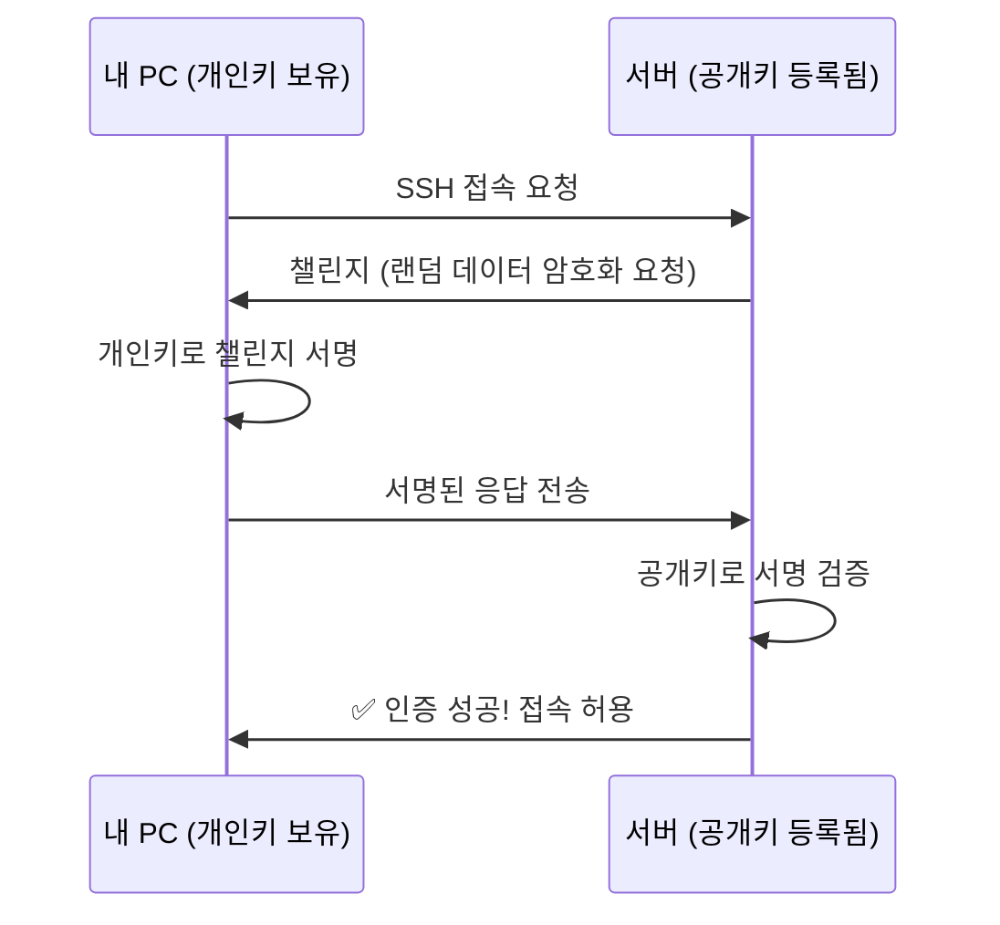
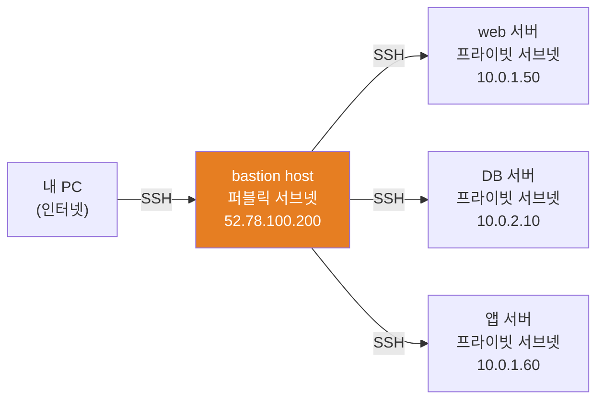
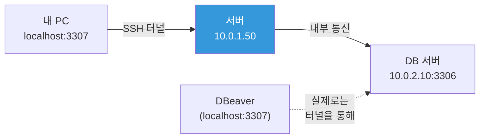
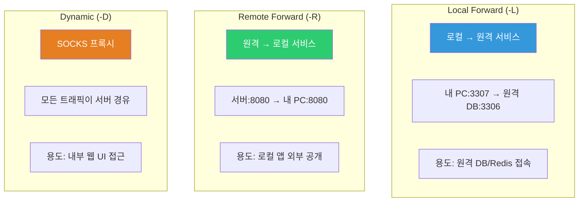

# SSH / bastion host / tunneling

> 서버에 접속하는 가장 기본적인 방법이 SSH예요. 매일 수십 번 쓰는 명령어이면서, 잘못 설정하면 보안 사고가 나는 양날의 검이에요. SSH 키 인증, config 설정, bastion을 통한 접근, 터널링까지 — 실무에서 필요한 모든 것을 다뤄볼게요.

---

## 🎯 이걸 왜 알아야 하나?

```
DevOps가 SSH로 하는 일들:
• 서버 접속해서 트러블슈팅           → ssh user@server
• 여러 서버에 반복 작업              → SSH config + 스크립트
• 프라이빗 서브넷 서버 접근          → bastion host 경유
• 로컬에서 원격 DB에 접속            → SSH 터널링
• Git push/pull                     → SSH 키 인증
• CI/CD에서 서버에 배포              → SSH 키 기반 자동 접속
• Ansible로 서버 관리               → SSH가 전송 수단
```

비밀번호 인증은 보안에 취약하고, 매번 입력하기도 귀찮아요. SSH 키 인증을 제대로 설정하면 **안전하면서 편리**해요.

---

## 🧠 핵심 개념

### 비유: 집 열쇠 시스템

SSH 키 인증은 **자물쇠와 열쇠** 시스템이에요.

* **개인키 (Private Key)** = 내 집 열쇠. 나만 가지고 있어야 해요. 잃어버리면 큰일!
* **공개키 (Public Key)** = 자물쇠. 내가 접속하고 싶은 서버에 달아놓아요. 여러 서버에 같은 자물쇠를 달 수 있어요.
* **인증 과정** = 서버가 "이 자물쇠에 맞는 열쇠를 가지고 있나?" 확인하는 것



**비밀번호 vs SSH 키:**

| 비교 | 비밀번호 | SSH 키 |
|------|---------|--------|
| 보안 | 무차별 공격에 취약 | 키가 없으면 접속 불가 |
| 편의성 | 매번 입력 | 한 번 설정하면 자동 |
| 자동화 | 스크립트에 비밀번호 넣으면 위험 | 키 파일로 안전하게 자동화 |
| 실무 | ❌ 거의 안 씀 | ✅ 표준 |

---

## 🔍 상세 설명

### SSH 키 생성

```bash
# 키 생성 (가장 많이 쓰는 방식)
ssh-keygen -t ed25519 -C "alice@company.com"
# Generating public/private ed25519 key pair.
# Enter file in which to save the key (/home/alice/.ssh/id_ed25519): [Enter]
# Enter passphrase (empty for no passphrase): [비밀번호 또는 Enter]
# Enter same passphrase again:
# Your identification has been saved in /home/alice/.ssh/id_ed25519
# Your public key has been saved in /home/alice/.ssh/id_ed25519.pub
# The key fingerprint is:
# SHA256:abcdefghijklmnop alice@company.com

# RSA 방식 (레거시 시스템 호환)
ssh-keygen -t rsa -b 4096 -C "alice@company.com"
```

**키 타입 비교:**

| 타입 | 명령어 | 보안 | 호환성 | 추천 |
|------|--------|------|--------|------|
| ed25519 | `ssh-keygen -t ed25519` | 최고 | 최신 서버 | ⭐ 추천 |
| RSA 4096 | `ssh-keygen -t rsa -b 4096` | 높음 | 거의 모든 서버 | 레거시용 |
| ECDSA | `ssh-keygen -t ecdsa` | 높음 | 대부분 | OK |

```bash
# 생성된 파일 확인
ls -la ~/.ssh/
# -rw-------  1 alice alice  464 Mar 12 10:00 id_ed25519      ← 개인키 (600 필수!)
# -rw-r--r--  1 alice alice  104 Mar 12 10:00 id_ed25519.pub  ← 공개키

# 공개키 내용 보기
cat ~/.ssh/id_ed25519.pub
# ssh-ed25519 AAAAC3NzaC1lZDI1NTE5AAAAIBxxxxxxxxxxxxxxxxxxxxxxxxxxxxxx alice@company.com
# ^^^^^^^^^^^                                                          ^^^^^^^^^^^^^^^^^
# 키 타입                                                               코멘트

# 개인키는 절대 공유하지 마세요!
# 공개키는 자유롭게 공유해도 안전해요.
```

### 서버에 공개키 등록

```bash
# 방법 1: ssh-copy-id (가장 쉬움)
ssh-copy-id -i ~/.ssh/id_ed25519.pub ubuntu@10.0.1.50
# /usr/bin/ssh-copy-id: INFO: Source of key(s) to be installed: "/home/alice/.ssh/id_ed25519.pub"
# ubuntu@10.0.1.50's password: [비밀번호 입력]
# Number of key(s) added: 1

# 방법 2: 수동으로 복사
cat ~/.ssh/id_ed25519.pub | ssh ubuntu@10.0.1.50 "mkdir -p ~/.ssh && chmod 700 ~/.ssh && cat >> ~/.ssh/authorized_keys && chmod 644 ~/.ssh/authorized_keys"

# 방법 3: 서버에서 직접 편집
# 서버에 접속한 상태에서:
echo "ssh-ed25519 AAAAC3NzaC... alice@company.com" >> ~/.ssh/authorized_keys

# 이제 비밀번호 없이 접속 가능!
ssh ubuntu@10.0.1.50
# → 바로 접속됨 (비밀번호 안 물어봄)
```

### SSH 파일 권한 (틀리면 접속 안 됨!)

```bash
# 클라이언트 (내 PC)
chmod 700 ~/.ssh                 # 디렉토리
chmod 600 ~/.ssh/id_ed25519      # 개인키 ⭐
chmod 644 ~/.ssh/id_ed25519.pub  # 공개키
chmod 644 ~/.ssh/config          # SSH 설정
chmod 644 ~/.ssh/known_hosts     # 알려진 호스트

# 서버
chmod 700 ~/.ssh                    # 디렉토리
chmod 644 ~/.ssh/authorized_keys    # 등록된 공개키
# ⚠️ authorized_keys가 600이어도 동작하지만, 644가 표준

# 권한이 잘못되면 이런 에러가 나요:
# @@@@@@@@@@@@@@@@@@@@@@@@@@@@@@@@@@@@@@@@@@@@@@@@@@@@@@@@@@@
# @         WARNING: UNPROTECTED PRIVATE KEY FILE!          @
# @@@@@@@@@@@@@@@@@@@@@@@@@@@@@@@@@@@@@@@@@@@@@@@@@@@@@@@@@@@
# Permissions 0644 for '/home/alice/.ssh/id_ed25519' are too open.
```

---

### SSH 기본 접속

```bash
# 기본 형식
ssh [사용자]@[호스트]

# 예시
ssh ubuntu@10.0.1.50
ssh root@server01.example.com

# 포트 지정 (기본 22 외)
ssh -p 2222 ubuntu@10.0.1.50

# 특정 키 지정
ssh -i ~/.ssh/mykey.pem ubuntu@10.0.1.50

# 명령어만 실행하고 바로 종료
ssh ubuntu@10.0.1.50 "uptime"
#  14:30:00 up 2 days, 5:30, 1 user, load average: 0.50, 0.30, 0.20

ssh ubuntu@10.0.1.50 "df -h | grep '^/dev'"
# /dev/sda1  50G  15G  33G  32% /

# 여러 명령어 실행
ssh ubuntu@10.0.1.50 "hostname && uptime && df -h /"

# 스크립트 파일 원격 실행
ssh ubuntu@10.0.1.50 'bash -s' < local_script.sh

# 파일 복사 (scp)
scp local_file.txt ubuntu@10.0.1.50:/tmp/
scp ubuntu@10.0.1.50:/var/log/syslog /tmp/remote_syslog.log
scp -r local_dir/ ubuntu@10.0.1.50:/opt/    # 디렉토리 복사

# 파일 복사 (rsync, 더 효율적)
rsync -avz local_dir/ ubuntu@10.0.1.50:/opt/app/
rsync -avz ubuntu@10.0.1.50:/var/log/ /tmp/remote_logs/
```

---

### ~/.ssh/config — SSH 설정 파일 (★ 생산성 극대화)

매번 `ssh -i ~/.ssh/mykey.pem -p 2222 ubuntu@10.0.1.50` 이렇게 치는 건 너무 길어요. config 파일로 별명을 만들면 `ssh web01` 한 줄로 끝이에요.

```bash
# ~/.ssh/config 예시
cat ~/.ssh/config
```

```bash
# ────────────────────────────────────
# 전역 설정 (모든 호스트에 적용)
# ────────────────────────────────────
Host *
    ServerAliveInterval 60          # 60초마다 keepalive 전송 (연결 끊김 방지)
    ServerAliveCountMax 3           # 3번 응답 없으면 끊기
    AddKeysToAgent yes              # ssh-agent에 자동 추가
    StrictHostKeyChecking ask       # 최초 접속 시 fingerprint 확인

# ────────────────────────────────────
# 개별 서버 설정
# ────────────────────────────────────

# 웹서버
Host web01
    HostName 10.0.1.50
    User ubuntu
    Port 22
    IdentityFile ~/.ssh/id_ed25519

# DB 서버
Host db01
    HostName 10.0.2.10
    User admin
    Port 22
    IdentityFile ~/.ssh/id_ed25519

# 프로덕션 bastion (점프 서버)
Host bastion-prod
    HostName 52.78.100.200
    User ec2-user
    Port 22
    IdentityFile ~/.ssh/prod-key.pem

# bastion을 경유해서 프라이빗 서버 접속 (⭐ ProxyJump)
Host prod-web01
    HostName 10.0.1.50              # 프라이빗 IP
    User ubuntu
    IdentityFile ~/.ssh/prod-key.pem
    ProxyJump bastion-prod          # bastion 경유!

Host prod-db01
    HostName 10.0.2.10
    User ubuntu
    IdentityFile ~/.ssh/prod-key.pem
    ProxyJump bastion-prod

# AWS EC2 (pem 키)
Host aws-dev
    HostName ec2-12-34-56-78.ap-northeast-2.compute.amazonaws.com
    User ec2-user
    IdentityFile ~/.ssh/aws-dev-key.pem

# 와일드카드 (패턴 매칭)
Host prod-*
    User ubuntu
    IdentityFile ~/.ssh/prod-key.pem
    ProxyJump bastion-prod
```

```bash
# config 설정 후 접속이 이렇게 간단해져요!

# 이전:
ssh -i ~/.ssh/prod-key.pem -o ProxyCommand="ssh -W %h:%p -i ~/.ssh/prod-key.pem ec2-user@52.78.100.200" ubuntu@10.0.1.50

# config 설정 후:
ssh prod-web01
# 끝!

# scp도 별명으로
scp file.txt prod-web01:/tmp/

# rsync도
rsync -avz ./deploy/ prod-web01:/opt/app/
```

---

### bastion host (점프 서버)

프라이빗 서브넷의 서버에는 직접 접속할 수 없어요. 퍼블릭 서브넷의 bastion host를 경유해서 접속해요.



**왜 bastion을 쓰나요?**
* 프라이빗 서버는 인터넷에서 직접 접근 불가 (보안!)
* bastion만 퍼블릭에 노출 → 공격 표면 최소화
* bastion에서 모든 접속 로그가 남음 → 감사(audit) 가능

#### 접속 방법 3가지

```bash
# 방법 1: 2번 SSH (수동)
ssh ec2-user@52.78.100.200        # bastion 접속
ssh ubuntu@10.0.1.50               # bastion에서 내부 서버로
# → 번거롭고, bastion에 키를 올려놔야 함 (보안 위험)

# 방법 2: ProxyJump (추천! ⭐)
ssh -J ec2-user@52.78.100.200 ubuntu@10.0.1.50
# → bastion을 경유하지만 키는 내 PC에만 있으면 됨!
# → SSH config에 ProxyJump 설정하면 더 간단

# 방법 3: ProxyCommand (레거시)
ssh -o ProxyCommand="ssh -W %h:%p ec2-user@52.78.100.200" ubuntu@10.0.1.50
```

```bash
# SSH config로 설정하면 (위에서 이미 봤지만 다시 한번):
Host bastion-prod
    HostName 52.78.100.200
    User ec2-user
    IdentityFile ~/.ssh/prod-key.pem

Host prod-web01
    HostName 10.0.1.50
    User ubuntu
    IdentityFile ~/.ssh/prod-key.pem
    ProxyJump bastion-prod

# 접속:
ssh prod-web01
# → 자동으로 bastion → 내부 서버로 연결!

# 파일 복사도 bastion 경유로 바로 가능:
scp file.txt prod-web01:/tmp/
rsync -avz ./app/ prod-web01:/opt/app/
```

#### bastion host 보안 강화

```bash
# bastion 서버에서 설정해야 할 것들:

# 1. SSH 키 인증만 허용 (비밀번호 로그인 차단)
# /etc/ssh/sshd_config:
# PasswordAuthentication no
# PubkeyAuthentication yes

# 2. root 로그인 차단
# PermitRootLogin no

# 3. 특정 사용자만 SSH 허용
# AllowUsers ec2-user admin

# 4. 접속 로그 확인
grep "Accepted" /var/log/auth.log | tail -10
# Mar 12 10:00:00 bastion sshd[1234]: Accepted publickey for ec2-user from 203.0.113.5 port 54321
# Mar 12 10:05:00 bastion sshd[1235]: Accepted publickey for ec2-user from 203.0.113.5 port 54322
```

---

### SSH 터널링 (Port Forwarding)

SSH 터널링은 SSH 연결을 통해 **다른 포트의 트래픽을 전달**하는 거예요. 방화벽을 우회하거나, 로컬에서 원격 서비스에 안전하게 접속할 때 사용해요.

#### Local Port Forwarding (가장 많이 씀!)

**"로컬 포트를 원격 서비스에 연결"**



```bash
# 형식: ssh -L [로컬포트]:[목적지]:[목적지포트] [서버]

# 예시 1: 원격 DB에 로컬에서 접속
ssh -L 3307:10.0.2.10:3306 ubuntu@10.0.1.50
# → localhost:3307로 접속하면 10.0.2.10:3306(MySQL)에 연결됨

# 이제 다른 터미널에서:
mysql -h 127.0.0.1 -P 3307 -u dbuser -p
# → 실제로는 원격 DB에 접속 중!

# 예시 2: 원격 Redis에 접속
ssh -L 6380:10.0.3.10:6379 ubuntu@10.0.1.50
# → localhost:6380으로 접속하면 원격 Redis에 연결

redis-cli -h 127.0.0.1 -p 6380

# 예시 3: 원격 웹 관리 콘솔에 접속
ssh -L 9090:localhost:9090 ubuntu@10.0.1.50
# → localhost:9090으로 브라우저 접속하면 서버의 Prometheus UI에 연결

# 백그라운드로 터널만 열기 (쉘 필요 없을 때)
ssh -L 3307:10.0.2.10:3306 -N -f ubuntu@10.0.1.50
# -N: 원격 명령어 실행 안 함
# -f: 백그라운드로

# 터널 확인
ss -tlnp | grep 3307
# LISTEN  0  128  127.0.0.1:3307  0.0.0.0:*  users:(("ssh",pid=5000,fd=5))

# 터널 종료
kill $(lsof -t -i :3307)
```

#### bastion 경유 터널링

```bash
# bastion을 통해 프라이빗 DB에 터널 연결
ssh -L 3307:10.0.2.10:3306 -J ec2-user@52.78.100.200 ubuntu@10.0.1.50

# SSH config를 설정했다면 더 간단:
ssh -L 3307:10.0.2.10:3306 prod-web01

# 또는 config에 터널까지 설정
# ~/.ssh/config에 추가:
# Host prod-db-tunnel
#     HostName 10.0.1.50
#     User ubuntu
#     IdentityFile ~/.ssh/prod-key.pem
#     ProxyJump bastion-prod
#     LocalForward 3307 10.0.2.10:3306
#     LocalForward 6380 10.0.3.10:6379

# 그러면:
ssh prod-db-tunnel
# → 자동으로 bastion 경유 + DB/Redis 터널 생성!
```

#### Remote Port Forwarding

**"원격 서버의 포트를 내 로컬 서비스에 연결"** — 외부에서 내 로컬 서비스에 접근하게 할 때.

```bash
# 형식: ssh -R [원격포트]:[로컬목적지]:[로컬포트] [서버]

# 내 로컬에서 개발 중인 앱(8080)을 서버에서 접근 가능하게
ssh -R 8080:localhost:8080 ubuntu@10.0.1.50
# → 서버에서 localhost:8080 으로 접속하면 내 PC의 8080에 연결

# 실무 용도: 웹훅 테스트, 데모 공유 등
# (보통은 ngrok 같은 도구를 더 많이 씀)
```

#### Dynamic Port Forwarding (SOCKS 프록시)

```bash
# SSH를 SOCKS 프록시로 사용
ssh -D 1080 ubuntu@10.0.1.50
# → localhost:1080이 SOCKS5 프록시가 됨
# → 브라우저 프록시를 localhost:1080으로 설정하면
#    모든 웹 트래픽이 서버를 통해 나감

# 실무 용도: 서버 내부 네트워크의 웹 UI에 브라우저로 접근
# (Grafana, Prometheus, Kibana 등이 내부에만 열려있을 때)
```



---

### SSH 서버 설정 (/etc/ssh/sshd_config)

서버 측 SSH 설정으로 보안을 강화해요.

```bash
sudo vim /etc/ssh/sshd_config
```

```bash
# ─── 보안 필수 설정 ───

# SSH 키 인증 활성화
PubkeyAuthentication yes

# 비밀번호 인증 비활성화 (⭐ 가장 중요!)
PasswordAuthentication no

# root 로그인 차단
PermitRootLogin no
# 또는 키 인증만 허용
# PermitRootLogin prohibit-password

# 빈 비밀번호 차단
PermitEmptyPasswords no

# ─── 접근 제어 ───

# 특정 사용자만 SSH 허용
AllowUsers ubuntu deploy
# 또는 특정 그룹만
AllowGroups ssh-users

# ─── 성능/안정성 ───

# 접속 타임아웃
LoginGraceTime 30           # 30초 내에 인증 안 하면 끊기
MaxAuthTries 3              # 인증 시도 3번까지
ClientAliveInterval 300     # 5분마다 keepalive
ClientAliveCountMax 2       # 2번 응답 없으면 끊기

# ─── 포트 변경 (선택) ───
# Port 2222                 # 기본 22 대신 다른 포트 (보안 스캐닝 회피)

# ─── 추가 보안 ───
X11Forwarding no            # X11 포워딩 비활성화
AllowTcpForwarding yes      # 터널링 허용 (필요하면)
MaxSessions 5               # 동시 세션 수 제한
```

```bash
# 설정 변경 후 반드시 테스트!

# 1. 문법 검사
sudo sshd -t
# (에러 없으면 아무것도 안 나옴 = OK)

# 2. SSH 재시작 (현재 세션은 유지됨)
sudo systemctl restart sshd

# 3. ⚠️ 새 터미널에서 접속 테스트! (현재 세션은 끊지 마세요!)
# 새 터미널에서:
ssh ubuntu@10.0.1.50
# 접속 되면 OK. 안 되면 기존 세션에서 설정 되돌리기!
```

---

### ssh-agent — 키 관리

키에 passphrase(암호)를 설정했으면, 매번 접속할 때마다 입력해야 해요. ssh-agent가 대신 기억해줘요.

```bash
# ssh-agent 시작 (보통 자동으로 실행됨)
eval "$(ssh-agent -s)"
# Agent pid 12345

# 키 등록
ssh-add ~/.ssh/id_ed25519
# Enter passphrase for /home/alice/.ssh/id_ed25519: [입력]
# Identity added: /home/alice/.ssh/id_ed25519 (alice@company.com)

# 등록된 키 확인
ssh-add -l
# 256 SHA256:abcdefg... alice@company.com (ED25519)

# 여러 키 등록
ssh-add ~/.ssh/prod-key.pem
ssh-add ~/.ssh/github-key

# 키 제거
ssh-add -d ~/.ssh/id_ed25519    # 특정 키
ssh-add -D                       # 전부 제거

# macOS에서 키체인에 영구 저장
ssh-add --apple-use-keychain ~/.ssh/id_ed25519
```

### SSH Agent Forwarding

bastion에서 내부 서버로 갈 때, **내 PC의 키를 bastion에 올리지 않고도** 사용할 수 있어요.

```bash
# Agent forwarding 활성화
ssh -A ec2-user@bastion
# → bastion에서 내 PC의 ssh-agent에 접근 가능
# → bastion에 키 파일이 없어도 내부 서버로 접속 가능!

ssh ubuntu@10.0.1.50    # bastion에서 실행, 내 PC의 키로 인증

# SSH config에서 설정
Host bastion-prod
    HostName 52.78.100.200
    User ec2-user
    ForwardAgent yes        # ← Agent forwarding

# ⚠️ 보안 주의: 신뢰할 수 있는 서버에만 Agent forwarding 사용!
# bastion이 해킹되면 내 키로 다른 서버에 접속할 수 있음
# → ProxyJump가 더 안전한 대안!
```

---

### session recording (접속 기록)

누가 서버에서 뭘 했는지 기록하는 것도 중요해요.

```bash
# 방법 1: script 명령어 (가장 간단)
# 로그인 시 자동으로 세션 녹화
# /etc/profile.d/session-record.sh:
if [ -n "$SSH_CONNECTION" ] && [ -z "$SESSION_RECORDED" ]; then
    export SESSION_RECORDED=1
    LOGDIR="/var/log/sessions"
    mkdir -p "$LOGDIR"
    LOGFILE="$LOGDIR/$(whoami)_$(date +%Y%m%d_%H%M%S)_$$.log"
    script -q -a "$LOGFILE"
    exit
fi

# 방법 2: auditd (리눅스 감사 시스템)
# SSH 로그인 감사
sudo auditctl -w /var/log/auth.log -p wa -k ssh_logins

# 명령어 실행 감사
sudo auditctl -a always,exit -F arch=b64 -S execve -k commands

# 감사 로그 확인
sudo ausearch -k commands --start today

# 방법 3: AWS SSM Session Manager (클라우드 추천)
# → SSH 없이 웹 콘솔/CLI로 접속
# → 자동으로 모든 세션이 CloudWatch/S3에 기록
# → bastion 자체가 필요 없어짐
```

---

## 💻 실습 예제

### 실습 1: SSH 키 생성 및 접속

```bash
# 1. 키 생성
ssh-keygen -t ed25519 -C "devops-practice" -f ~/.ssh/practice_key
# passphrase는 빈값으로 (실습용)

# 2. 키 확인
ls -la ~/.ssh/practice_key*
# -rw-------  1 alice alice 464 ... practice_key
# -rw-r--r--  1 alice alice 104 ... practice_key.pub

# 3. 공개키 내용 확인
cat ~/.ssh/practice_key.pub

# 4. (로컬 테스트) 자기 자신에게 등록
cat ~/.ssh/practice_key.pub >> ~/.ssh/authorized_keys

# 5. 자기 자신에게 접속 테스트
ssh -i ~/.ssh/practice_key localhost "echo 'SSH 키 인증 성공!'"
# SSH 키 인증 성공!

# 6. 정리
sed -i '/devops-practice/d' ~/.ssh/authorized_keys
rm ~/.ssh/practice_key*
```

### 실습 2: SSH config 설정

```bash
# 1. config 파일 만들기
cat << 'EOF' > ~/.ssh/config
Host *
    ServerAliveInterval 60
    ServerAliveCountMax 3

Host myserver
    HostName 127.0.0.1
    User $(whoami)
    Port 22
    IdentityFile ~/.ssh/id_ed25519
EOF

chmod 644 ~/.ssh/config

# 2. 별명으로 접속 테스트
ssh myserver "hostname"

# 3. 여러 서버 관리 예시
cat << 'EOF' >> ~/.ssh/config

# Host web01
#     HostName 10.0.1.50
#     User ubuntu
#
# Host web02
#     HostName 10.0.1.51
#     User ubuntu
#
# Host db01
#     HostName 10.0.2.10
#     User admin
EOF
```

### 실습 3: SSH 터널링 체험

```bash
# 로컬에 간단한 웹서버를 띄우고 터널링 실습

# 터미널 1: 로컬 웹서버 시작 (포트 8888)
python3 -m http.server 8888
# Serving HTTP on 0.0.0.0 port 8888 ...

# 터미널 2: 다른 포트로 터널링 (9999 → 8888)
ssh -L 9999:localhost:8888 localhost -N
# (백그라운드 안 함, Ctrl+C로 종료)

# 터미널 3: 터널로 접속
curl http://localhost:9999
# → 8888 포트의 내용이 9999를 통해 보임!

# ss로 터널 확인
ss -tlnp | grep 9999
# LISTEN  0  128  127.0.0.1:9999  0.0.0.0:*  users:(("ssh",...))
```

### 실습 4: 여러 서버에 명령어 한번에 실행

```bash
# SSH config가 설정되어 있을 때 여러 서버에 동시에 명령 실행

# servers.txt 파일
cat << 'EOF' > /tmp/servers.txt
web01
web02
web03
EOF

# 모든 서버에 uptime 실행
while read server; do
    echo "=== $server ==="
    ssh "$server" "uptime" 2>/dev/null || echo "  연결 실패"
done < /tmp/servers.txt

# 모든 서버의 디스크 사용량 확인
while read server; do
    echo "=== $server ==="
    ssh "$server" "df -h / | tail -1" 2>/dev/null || echo "  연결 실패"
done < /tmp/servers.txt

# 병렬 실행 (더 빠름)
cat /tmp/servers.txt | xargs -I{} -P 5 ssh {} "hostname && uptime"
```

---

## 🏢 실무에서는?

### 시나리오 1: 새 서버 접속 설정

```bash
# AWS에서 새 EC2 인스턴스를 만들었을 때

# 1. pem 키 권한 설정
chmod 400 ~/Downloads/new-server-key.pem
mv ~/Downloads/new-server-key.pem ~/.ssh/

# 2. 접속 테스트
ssh -i ~/.ssh/new-server-key.pem ec2-user@52.78.200.100
# The authenticity of host '52.78.200.100' can't be established.
# ED25519 key fingerprint is SHA256:xxxxx
# Are you sure you want to continue connecting (yes/no)? yes

# 3. SSH config에 등록
cat << 'EOF' >> ~/.ssh/config

Host new-server
    HostName 52.78.200.100
    User ec2-user
    IdentityFile ~/.ssh/new-server-key.pem
EOF

# 4. 이제 간단하게 접속
ssh new-server

# 5. 비밀번호 인증 비활성화 (보안)
ssh new-server "sudo sed -i 's/^PasswordAuthentication yes/PasswordAuthentication no/' /etc/ssh/sshd_config"
ssh new-server "sudo systemctl restart sshd"
```

### 시나리오 2: 로컬에서 프로덕션 DB 접속 (터널링)

```bash
# 상황: 프로덕션 RDS에 직접 접근 불가 (프라이빗 서브넷)
# 해결: bastion → 앱서버 → RDS 터널

# 1. 터널 열기
ssh -L 5433:prod-rds.cluster-abc123.ap-northeast-2.rds.amazonaws.com:5432 prod-web01 -N -f

# 2. 로컬에서 DB 접속
psql -h localhost -p 5433 -U myuser -d mydb
# → 실제로는 프로덕션 RDS에 접속 중!

# 3. DBeaver, DataGrip 등 GUI 도구에서도
# Host: localhost
# Port: 5433
# → 터널을 통해 프로덕션 DB 탐색 가능

# 4. 작업 후 터널 종료
kill $(lsof -t -i :5433)
```

### 시나리오 3: CI/CD에서 SSH 배포

```bash
# GitHub Actions에서 SSH로 서버에 배포하는 예시

# 1. GitHub Secrets에 SSH 개인키 등록
# Settings → Secrets → SSH_PRIVATE_KEY

# 2. workflow 파일
# .github/workflows/deploy.yml
# jobs:
#   deploy:
#     steps:
#       - name: Setup SSH
#         run: |
#           mkdir -p ~/.ssh
#           echo "${{ secrets.SSH_PRIVATE_KEY }}" > ~/.ssh/deploy_key
#           chmod 600 ~/.ssh/deploy_key
#           ssh-keyscan -H 10.0.1.50 >> ~/.ssh/known_hosts
#
#       - name: Deploy
#         run: |
#           ssh -i ~/.ssh/deploy_key ubuntu@10.0.1.50 "cd /opt/app && git pull && systemctl restart myapp"

# 서버 측에서 deploy 사용자에 공개키 등록해놓으면 됨
```

### 시나리오 4: SSH 접속 문제 디버깅

```bash
# "SSH 접속이 안 돼요!" 디버깅 순서

# 1. verbose 모드로 접속 시도 (가장 먼저!)
ssh -vvv ubuntu@10.0.1.50

# 출력에서 확인할 것:
# debug1: Connecting to 10.0.1.50 port 22.        ← 연결 시도
# debug1: Connection established.                   ← TCP 연결 성공?
# debug1: Offering public key: /home/alice/.ssh/id_ed25519  ← 키 제출
# debug1: Server accepts key: /home/alice/.ssh/id_ed25519   ← 키 수락?
# debug1: Authentication succeeded (publickey).    ← 인증 성공?

# 2. 연결 자체가 안 되면 (Connection timed out / refused)
ping -c 3 10.0.1.50                  # 네트워크 연결 확인
nc -zv 10.0.1.50 22                  # SSH 포트 열림 확인
sudo iptables -L -n | grep 22       # 방화벽 확인

# 3. 키가 거부되면 (Permission denied)
ssh -vvv ubuntu@10.0.1.50 2>&1 | grep "Offering\|Server accepts\|Authentication"
# → 서버에 공개키가 등록 안 되어 있거나
# → 권한이 잘못되었거나 (chmod 600)
# → 다른 키를 제출하고 있거나 (-i로 키 지정)

# 4. 서버 측에서 확인
sudo tail -f /var/log/auth.log
# 접속 시도하면 실시간으로 에러가 찍힘
# "Authentication refused: bad ownership or modes for directory /home/ubuntu/.ssh"
# → 권한 문제!
```

---

## ⚠️ 자주 하는 실수

### 1. 개인키 권한이 너무 열려있음

```bash
# ❌ 
-rw-r--r-- id_ed25519    # 644 → SSH가 거부!

# ✅
-rw------- id_ed25519    # 600
chmod 600 ~/.ssh/id_ed25519
```

### 2. PasswordAuthentication을 끄기 전에 키 테스트 안 하기

```bash
# ❌ 키 인증이 안 되는 상태에서 비밀번호 인증을 꺼버림
# → 서버 접속 불가! 콘솔 접속만 가능

# ✅ 순서
# 1. SSH 키 등록
# 2. 키로 접속 테스트 (새 터미널에서!)
# 3. 확인 후 PasswordAuthentication no 설정
# 4. sshd 재시작
# 5. 다시 키로 접속 테스트 (현재 세션 끊지 말고!)
```

### 3. known_hosts 경고 무시하기

```bash
# 이 경고가 나오면:
# @@@@@@@@@@@@@@@@@@@@@@@@@@@@@@@@@@@@@@@@@@@@@@@@@@@@@@@@@@@
# @ WARNING: REMOTE HOST IDENTIFICATION HAS CHANGED!       @
# @@@@@@@@@@@@@@@@@@@@@@@@@@@@@@@@@@@@@@@@@@@@@@@@@@@@@@@@@@@

# 의미: 이전에 접속했던 서버의 fingerprint가 바뀜
# 원인 1: 서버를 재설치함 → 정상
# 원인 2: 중간자 공격(MITM) → 위험!

# 서버 재설치인 경우:
ssh-keygen -R 10.0.1.50    # 이전 fingerprint 삭제
ssh ubuntu@10.0.1.50        # 새로 등록

# ❌ StrictHostKeyChecking=no를 습관적으로 쓰지 마세요
ssh -o StrictHostKeyChecking=no ubuntu@10.0.1.50    # 보안 위험!
```

### 4. bastion에 개인키를 올려놓기

```bash
# ❌ bastion 서버에 개인키를 복사
scp ~/.ssh/id_ed25519 bastion:/home/ec2-user/.ssh/
# → bastion이 해킹되면 키도 유출!

# ✅ ProxyJump 사용 (키는 내 PC에만!)
ssh -J bastion-prod prod-web01
# → 키가 bastion에 전혀 없어도 됨
```

### 5. SSH config 없이 긴 명령어를 매번 타이핑

```bash
# ❌ 매번 이렇게...
ssh -i ~/.ssh/prod-key.pem -o ProxyCommand="ssh -W %h:%p -i ~/.ssh/prod-key.pem ec2-user@52.78.100.200" ubuntu@10.0.1.50

# ✅ SSH config에 한 번 설정하면:
ssh prod-web01
```

---

## 📝 정리

### SSH 치트시트

```bash
# === 키 관리 ===
ssh-keygen -t ed25519 -C "email"        # 키 생성
ssh-copy-id -i ~/.ssh/key.pub user@host # 공개키 등록
ssh-add ~/.ssh/key                       # agent에 등록
ssh-add -l                               # 등록된 키 목록

# === 접속 ===
ssh user@host                            # 기본 접속
ssh -i key.pem user@host                 # 키 지정
ssh -p 2222 user@host                    # 포트 지정
ssh -J bastion user@internal             # bastion 경유
ssh user@host "command"                  # 원격 명령 실행

# === 터널링 ===
ssh -L 로컬포트:목적지:포트 서버           # Local forward
ssh -R 원격포트:목적지:포트 서버           # Remote forward
ssh -D 1080 서버                         # SOCKS 프록시
ssh -L 3307:db:3306 -N -f 서버           # 백그라운드 터널

# === 파일 전송 ===
scp file user@host:/path                 # 파일 복사
rsync -avz dir/ user@host:/path/         # 동기화 (효율적)

# === 디버깅 ===
ssh -vvv user@host                       # 상세 로그
```

### SSH 보안 체크리스트

```
✅ ed25519 또는 RSA 4096 키 사용
✅ 개인키 권한 600, .ssh 디렉토리 700
✅ PasswordAuthentication no (서버)
✅ PermitRootLogin no (서버)
✅ SSH config로 접속 관리
✅ bastion 경유 시 ProxyJump 사용 (키를 bastion에 올리지 않기)
✅ 비밀번호 끄기 전에 키 접속 테스트
✅ 설정 변경 후 기존 세션 유지한 채 새 터미널에서 테스트
```

---

## 🔗 다음 강의

다음은 **[01-linux/11-bash-scripting.md — bash scripting / shell pipeline](./11-bash-scripting)** 이에요.

지금까지 배운 Linux 명령어들을 조합해서 자동화 스크립트를 만들어볼게요. 반복 작업을 자동화하는 것이 DevOps의 핵심이에요.
