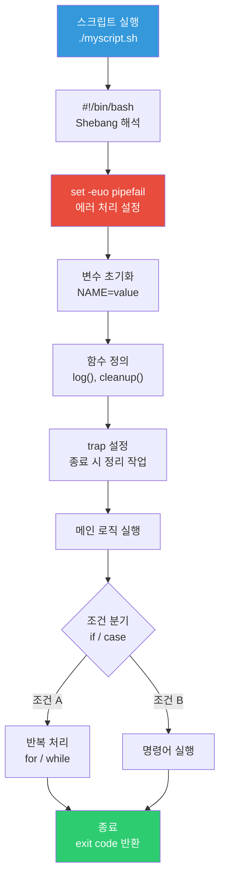
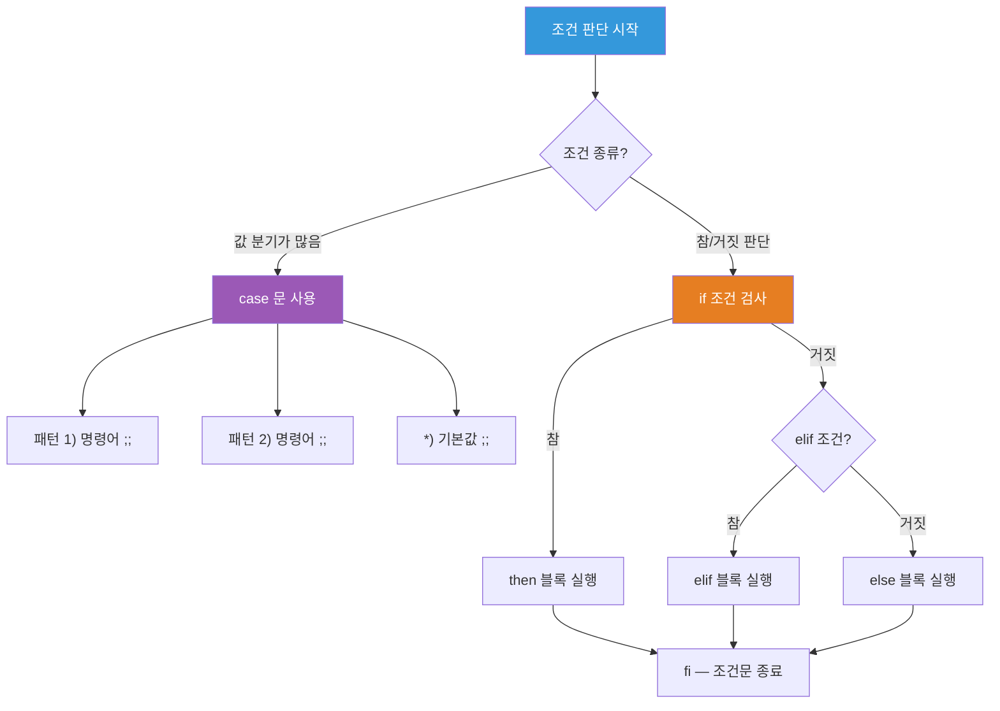
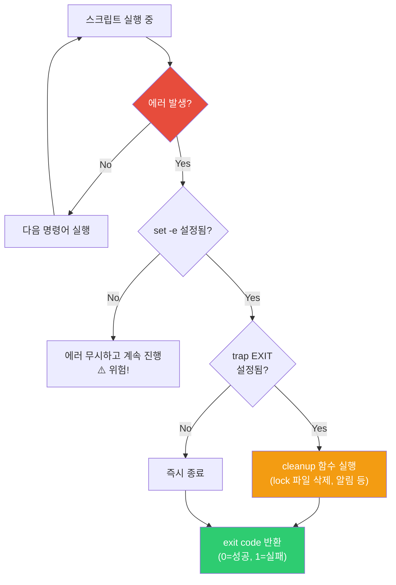

# Bash Scripting / Shell Pipeline

> 지금까지 배운 명령어들을 하나하나 치는 건 한계가 있어요. 10개 서버에 같은 작업을 해야 하면? 매일 반복하는 작업이 있으면? 스크립트로 만들면 한 번에 끝이에요. DevOps의 자동화는 여기서 시작돼요.

---

## 🎯 이걸 왜 알아야 하나?

```
스크립트로 자동화하는 실무 작업들:
• 서버 상태 체크 (디스크, 메모리, 프로세스)      → health-check.sh
• 로그 정리 + 오래된 파일 삭제                  → cleanup.sh
• 배포 스크립트 (코드 pull → 빌드 → 재시작)      → deploy.sh
• DB 백업 + S3 업로드                          → backup.sh
• 여러 서버에 동시 명령 실행                    → multi-exec.sh
• 환경 변수 설정 / 초기화 스크립트               → setup.sh
• 모니터링 + 알림 (디스크 80% 넘으면 Slack 알림)  → alert.sh
```

bash scripting은 "Linux 명령어를 조합해서 프로그램을 만드는 것"이에요. 새 프로그래밍 언어가 아니라 **지금까지 배운 명령어들의 조합**이에요.

---

## 🧠 핵심 개념

### 비유: 레시피 vs 즉석 요리

* **명령어를 직접 치는 것** = 요리사가 그때그때 감으로 요리하는 것
* **스크립트** = 레시피를 적어놓은 것. 누구나 똑같이 따라할 수 있고, 반복 가능

### 파이프라인 — 명령어를 연결하는 파이프


```bash
# 파이프(|)는 앞 명령어의 출력을 뒤 명령어의 입력으로 전달

# 예시: 프로세스 목록 → nginx만 필터 → 줄 수 세기
ps aux | grep nginx | grep -v grep | wc -l
# 3
```

---

## 🔍 상세 설명 — Shell Pipeline

스크립트를 배우기 전에, 명령어를 연결하는 **파이프라인**부터 확실히 잡아야 해요. 이게 bash의 진짜 힘이에요.

### 파이프 (`|`)

```bash
# 출력을 다음 명령어의 입력으로 전달
cat /var/log/syslog | grep error | wc -l
# 42

# 실무 예제들

# 메모리 많이 쓰는 프로세스 Top 5
ps aux --sort=-%mem | head -6
# USER  PID  %CPU %MEM  VSZ    RSS   ... COMMAND
# mysql 3000  1.2 10.0  123456 40960 ... mysqld
# root  2000  2.5  5.0  71234  20480 ... dockerd
# ...

# 로그에서 에러 빈도 Top 10
cat /var/log/syslog | awk '{print $5}' | cut -d'[' -f1 | sort | uniq -c | sort -rn | head -10
#  1500 systemd
#   800 CRON
#   300 sshd

# 디스크 사용률이 80% 넘는 파티션 찾기
df -h | awk 'NR>1 {gsub(/%/,"",$5); if($5>80) print $0}'
# /dev/sda1  50G  45G  3.0G  94% /

# 현재 접속 중인 IP 목록
ss -tn | awk 'NR>1 {print $5}' | cut -d: -f1 | sort -u
# 10.0.0.5
# 10.0.0.10
# 10.0.0.100
```

### 리다이렉션 (`>`, `>>`, `<`, `2>`)

```bash
# > : 출력을 파일에 저장 (덮어쓰기)
echo "hello" > /tmp/test.txt
cat /tmp/test.txt
# hello

# >> : 출력을 파일에 추가 (append)
echo "world" >> /tmp/test.txt
cat /tmp/test.txt
# hello
# world

# < : 파일을 입력으로
wc -l < /etc/passwd
# 35

# 2> : 에러 출력을 파일에
find / -name "*.conf" 2> /tmp/errors.txt    # 에러만 파일에, 결과는 화면에

# 2>&1 : 에러 출력을 표준 출력과 합치기
find / -name "*.conf" > /tmp/all.txt 2>&1   # 결과 + 에러 모두 파일에

# /dev/null : 출력 버리기 (블랙홀)
find / -name "*.conf" 2>/dev/null            # 에러는 무시
command > /dev/null 2>&1                      # 모든 출력 무시 (cron에서 자주 씀)
```

### 명령어 연결 (`&&`, `||`, `;`)

```bash
# && : 앞이 성공하면 뒤를 실행
mkdir /tmp/newdir && echo "디렉토리 생성 성공"
# 디렉토리 생성 성공

# || : 앞이 실패하면 뒤를 실행
mkdir /tmp/newdir || echo "디렉토리가 이미 존재합니다"
# 디렉토리가 이미 존재합니다

# ; : 성공/실패 상관없이 순차 실행
echo "시작"; sleep 1; echo "끝"
# 시작
# (1초 후)
# 끝

# 실무 조합
cd /opt/app && git pull && npm install && systemctl restart myapp || echo "배포 실패!"
# → 하나라도 실패하면 뒤는 안 하고 "배포 실패!" 출력
```

### 치환 (`$()`, `` ` ` ``)

```bash
# $() : 명령어 결과를 변수처럼 사용 (추천)
echo "현재 날짜: $(date)"
# 현재 날짜: Wed Mar 12 14:30:00 UTC 2025

echo "현재 사용자: $(whoami)"
# 현재 사용자: ubuntu

echo "프로세스 수: $(ps aux | wc -l)"
# 프로세스 수: 150

# 변수에 저장
HOSTNAME=$(hostname)
IP=$(ip -4 addr show eth0 | grep inet | awk '{print $2}' | cut -d/ -f1)
echo "서버: $HOSTNAME ($IP)"
# 서버: web01 (10.0.1.50)

# 중첩도 가능 (백틱은 중첩 불가)
echo "큰 파일: $(find /var/log -type f -size +100M -exec ls -lh {} \; 2>/dev/null | awk '{print $5, $9}')"
```

### xargs — 파이프에서 인자로 변환

```bash
# 파이프로 받은 데이터를 명령어의 인자(argument)로 전달

# /tmp에서 .tmp 파일 찾아서 삭제
find /tmp -name "*.tmp" -mtime +7 | xargs rm -f

# 여러 서버에 ping (servers.txt에 IP 목록)
cat servers.txt | xargs -I{} ping -c 1 {} 2>/dev/null

# 병렬 실행 (-P 옵션)
cat servers.txt | xargs -I{} -P 5 ssh {} "uptime"
# → 5개씩 동시에 실행

# 찾은 파일에 grep
find /etc -name "*.conf" | xargs grep "listen" 2>/dev/null

# 줄 단위로 처리
echo -e "file1\nfile2\nfile3" | xargs -I{} echo "Processing: {}"
# Processing: file1
# Processing: file2
# Processing: file3
```

---

## 🔍 상세 설명 — Bash Scripting

### Bash 스크립트 실행 흐름

스크립트가 실행되면 위에서 아래로 순서대로 처리돼요. 전체 흐름을 그림으로 보면 이해가 쉬워요.



### 스크립트 기본 구조

```bash
#!/bin/bash
# ↑ shebang: 이 스크립트를 bash로 실행하라는 뜻

# 설명 주석
# 작성자: DevOps Team
# 용도: 서버 상태 체크

# 에러 발생 시 즉시 중단 (실무 필수!)
set -euo pipefail

# 변수
NAME="hello"
echo "$NAME"
```

**`set -euo pipefail` 각 옵션:**

| 옵션 | 의미 | 없으면? |
|------|------|--------|
| `-e` | 에러 발생 시 즉시 중단 | 에러 무시하고 계속 진행 (위험!) |
| `-u` | 미정의 변수 사용 시 에러 | 빈 값으로 처리 (버그 원인) |
| `-o pipefail` | 파이프 중간 에러도 감지 | 마지막 명령어만 성공하면 OK |

```bash
# -e 없이 위험한 예시
#!/bin/bash
cd /nonexistent/directory    # 실패해도 계속 진행!
rm -rf *                     # 현재 디렉토리(/)의 모든 파일 삭제!!! 😱

# -e 있으면
#!/bin/bash
set -e
cd /nonexistent/directory    # 실패 → 즉시 스크립트 중단 ✅
rm -rf *                     # 이 줄은 실행되지 않음
```

### 변수

```bash
#!/bin/bash

# 변수 선언 (= 양쪽에 공백 없음!)
NAME="ubuntu"
PORT=8080
LOG_DIR="/var/log/myapp"

# ❌ 이렇게 하면 안 됨
# NAME = "ubuntu"    # 에러! 공백 없어야 함

# 변수 사용 ($ 또는 ${})
echo "사용자: $NAME"
echo "포트: ${PORT}"
echo "로그: ${LOG_DIR}/app.log"

# ${} 를 써야 하는 경우 — 변수명 경계가 모호할 때
FILE="report"
echo "${FILE}_2025.txt"    # report_2025.txt
echo "$FILE_2025.txt"      # 빈값 (FILE_2025라는 변수를 찾음!)

# 환경 변수 (export)
export APP_ENV="production"
# → 자식 프로세스에서도 접근 가능

# 기본값 설정
DB_HOST="${DB_HOST:-localhost}"     # DB_HOST가 비어있으면 localhost
DB_PORT="${DB_PORT:-3306}"         # DB_PORT가 비어있으면 3306

# 읽기 전용 변수
readonly VERSION="1.0.0"
# VERSION="2.0.0"    # 에러! 변경 불가

# 특수 변수
echo "스크립트 이름: $0"
echo "첫 번째 인자: $1"
echo "두 번째 인자: $2"
echo "모든 인자: $@"
echo "인자 개수: $#"
echo "직전 명령어 종료 코드: $?"
echo "현재 PID: $$"
```

### 조건문 (if)

조건문의 분기 흐름을 그림으로 보면 이래요. `if/elif/else`와 `case`를 상황에 맞게 골라 쓰면 돼요.



```bash
#!/bin/bash

# 기본 형식
if [ 조건 ]; then
    # 참일 때
elif [ 조건2 ]; then
    # 조건2가 참일 때
else
    # 모두 거짓일 때
fi

# === 문자열 비교 ===
NAME="ubuntu"

if [ "$NAME" = "ubuntu" ]; then
    echo "Ubuntu 사용자입니다"
fi

if [ "$NAME" != "root" ]; then
    echo "root가 아닙니다"
fi

if [ -z "$NAME" ]; then    # 비어있으면 참
    echo "이름이 비어있습니다"
fi

if [ -n "$NAME" ]; then    # 비어있지 않으면 참
    echo "이름: $NAME"
fi

# === 숫자 비교 ===
COUNT=10

if [ "$COUNT" -eq 10 ]; then echo "10입니다"; fi     # equal
if [ "$COUNT" -ne 5 ]; then echo "5가 아닙니다"; fi   # not equal
if [ "$COUNT" -gt 5 ]; then echo "5보다 큽니다"; fi   # greater than
if [ "$COUNT" -lt 20 ]; then echo "20보다 작습니다"; fi # less than
if [ "$COUNT" -ge 10 ]; then echo "10 이상"; fi       # greater or equal
if [ "$COUNT" -le 10 ]; then echo "10 이하"; fi       # less or equal

# === 파일 검사 ===
if [ -f "/etc/nginx/nginx.conf" ]; then
    echo "Nginx 설정 파일이 존재합니다"
fi

if [ -d "/var/log/nginx" ]; then
    echo "Nginx 로그 디렉토리가 존재합니다"
fi

if [ ! -f "/opt/app/config.yaml" ]; then
    echo "설정 파일이 없습니다!"
    exit 1
fi

# 파일 검사 종류
# -f : 파일이 존재하고 일반 파일인가
# -d : 디렉토리가 존재하는가
# -e : 파일/디렉토리가 존재하는가
# -r : 읽기 권한이 있는가
# -w : 쓰기 권한이 있는가
# -x : 실행 권한이 있는가
# -s : 파일 크기가 0보다 큰가 (비어있지 않은가)

# === [[ ]] 고급 조건 (bash 전용, 추천) ===
# 패턴 매칭
if [[ "$NAME" == ubuntu* ]]; then
    echo "ubuntu로 시작합니다"
fi

# 정규식
if [[ "$NAME" =~ ^[a-z]+$ ]]; then
    echo "소문자 알파벳만으로 구성됨"
fi

# AND / OR
if [[ "$NAME" = "ubuntu" && "$COUNT" -gt 5 ]]; then
    echo "조건 모두 충족"
fi

if [[ "$NAME" = "root" || "$COUNT" -gt 100 ]]; then
    echo "하나라도 참"
fi
```

### 반복문 (for, while)

```bash
#!/bin/bash

# === for 문 ===

# 리스트 순회
for server in web01 web02 web03 db01; do
    echo "처리 중: $server"
done
# 처리 중: web01
# 처리 중: web02
# 처리 중: web03
# 처리 중: db01

# 범위
for i in {1..5}; do
    echo "번호: $i"
done

# C 스타일
for ((i=0; i<5; i++)); do
    echo "인덱스: $i"
done

# 파일 목록 순회
for file in /var/log/*.log; do
    SIZE=$(du -sh "$file" 2>/dev/null | awk '{print $1}')
    echo "$file: $SIZE"
done
# /var/log/auth.log: 125K
# /var/log/syslog: 85K
# ...

# 명령어 결과 순회
for pid in $(pgrep nginx); do
    echo "Nginx PID: $pid"
done

# === while 문 ===

# 기본
COUNT=0
while [ $COUNT -lt 5 ]; do
    echo "카운트: $COUNT"
    COUNT=$((COUNT + 1))
done

# 파일을 한 줄씩 읽기 (매우 자주 씀!)
while IFS= read -r line; do
    echo "서버: $line"
    ssh "$line" "uptime" 2>/dev/null || echo "  접속 실패"
done < servers.txt

# 무한 루프 (모니터링)
while true; do
    echo "$(date) - 디스크: $(df -h / | tail -1 | awk '{print $5}')"
    sleep 60
done

# 파이프에서 읽기
ps aux | while read -r line; do
    cpu=$(echo "$line" | awk '{print $3}')
    if (( $(echo "$cpu > 50" | bc -l) )); then
        echo "CPU 높음: $line"
    fi
done
```

### 함수

```bash
#!/bin/bash

# 함수 정의
log_info() {
    echo "[$(date '+%Y-%m-%d %H:%M:%S')] [INFO] $1"
}

log_error() {
    echo "[$(date '+%Y-%m-%d %H:%M:%S')] [ERROR] $1" >&2
}

check_disk() {
    local threshold=${1:-80}    # local: 함수 내부 변수
    local usage
    
    usage=$(df -h / | tail -1 | awk '{gsub(/%/,""); print $5}')
    
    if [ "$usage" -gt "$threshold" ]; then
        log_error "디스크 사용률 ${usage}% (임계값: ${threshold}%)"
        return 1
    else
        log_info "디스크 정상: ${usage}%"
        return 0
    fi
}

check_service() {
    local service=$1
    
    if systemctl is-active "$service" > /dev/null 2>&1; then
        log_info "$service: 실행 중 ✅"
        return 0
    else
        log_error "$service: 중지됨 ❌"
        return 1
    fi
}

# 함수 호출
log_info "서버 상태 체크 시작"
check_disk 80
check_service nginx
check_service docker
log_info "체크 완료"

# 출력:
# [2025-03-12 14:30:00] [INFO] 서버 상태 체크 시작
# [2025-03-12 14:30:00] [INFO] 디스크 정상: 53%
# [2025-03-12 14:30:00] [INFO] nginx: 실행 중 ✅
# [2025-03-12 14:30:00] [INFO] docker: 실행 중 ✅
# [2025-03-12 14:30:00] [INFO] 체크 완료
```

### 인자 처리

```bash
#!/bin/bash
# deploy.sh — 배포 스크립트

set -euo pipefail

# 사용법 출력
usage() {
    cat << EOF
사용법: $0 [옵션]

옵션:
  -e, --env ENV      환경 (dev|staging|prod) [필수]
  -b, --branch NAME  브랜치 이름 (기본: main)
  -r, --restart       서비스 재시작 여부
  -h, --help          도움말

예시:
  $0 -e staging -b feature/new-api -r
  $0 --env prod --branch main
EOF
    exit 1
}

# 기본값
ENV=""
BRANCH="main"
RESTART=false

# 인자 파싱
while [[ $# -gt 0 ]]; do
    case $1 in
        -e|--env)
            ENV="$2"
            shift 2
            ;;
        -b|--branch)
            BRANCH="$2"
            shift 2
            ;;
        -r|--restart)
            RESTART=true
            shift
            ;;
        -h|--help)
            usage
            ;;
        *)
            echo "알 수 없는 옵션: $1"
            usage
            ;;
    esac
done

# 필수 인자 검증
if [ -z "$ENV" ]; then
    echo "에러: -e (환경) 옵션은 필수입니다!"
    usage
fi

if [[ "$ENV" != "dev" && "$ENV" != "staging" && "$ENV" != "prod" ]]; then
    echo "에러: 환경은 dev, staging, prod 중 하나여야 합니다."
    exit 1
fi

echo "환경: $ENV"
echo "브랜치: $BRANCH"
echo "재시작: $RESTART"

# 실행:
# ./deploy.sh -e staging -b feature/new-api -r
# 환경: staging
# 브랜치: feature/new-api
# 재시작: true
```

### 에러 처리

스크립트에서 에러가 발생하면 어떤 순서로 처리되는지 흐름을 보면 이래요.



```bash
#!/bin/bash
set -euo pipefail

# trap: 스크립트 종료 시 정리 작업
cleanup() {
    local exit_code=$?
    echo "정리 작업 실행 중..."
    rm -f /tmp/myapp_deploy.lock
    if [ $exit_code -ne 0 ]; then
        echo "⚠️ 스크립트가 에러로 종료됨 (exit code: $exit_code)"
        # Slack 알림 등
    fi
}
trap cleanup EXIT

# trap: Ctrl+C 처리
trap 'echo "중단됨!"; exit 130' INT

# 중복 실행 방지 (lock 파일)
LOCK_FILE="/tmp/myapp_deploy.lock"
if [ -f "$LOCK_FILE" ]; then
    echo "이미 실행 중입니다! (lock: $LOCK_FILE)"
    exit 1
fi
touch "$LOCK_FILE"

# 에러를 무시하고 계속하고 싶을 때
result=$(some_command 2>/dev/null) || true
# → -e 환경에서도 에러를 무시하려면 || true 추가

# 에러 시 특정 동작
if ! systemctl restart nginx; then
    echo "Nginx 재시작 실패! 롤백 중..."
    # 롤백 로직
    exit 1
fi
```

---

## 💻 실습 예제

### 실습 1: 파이프라인 연습

```bash
# 1. /etc/passwd에서 bash 사용자 목록
grep "/bin/bash" /etc/passwd | cut -d: -f1
# root
# ubuntu
# alice

# 2. 현재 접속 중인 사용자별 세션 수
who | awk '{print $1}' | sort | uniq -c | sort -rn
#  3 ubuntu
#  1 alice

# 3. 로그에서 시간대별 에러 수
grep -i "error" /var/log/syslog | awk '{print $3}' | cut -d: -f1 | sort | uniq -c
#  5 09
# 12 10
#  3 11

# 4. 가장 큰 파일 5개
find /var -type f -exec du -h {} \; 2>/dev/null | sort -rh | head -5
```

### 실습 2: 서버 상태 체크 스크립트

```bash
cat << 'SCRIPT' > /tmp/health-check.sh
#!/bin/bash
set -euo pipefail

echo "========================================"
echo " 서버 상태 리포트 — $(date)"
echo " 호스트: $(hostname)"
echo "========================================"

echo ""
echo "--- CPU / 메모리 ---"
echo "Load Average: $(cat /proc/loadavg | awk '{print $1, $2, $3}')"
echo "CPU 코어: $(nproc)"
FREE_OUTPUT=$(free -m)
TOTAL_MEM=$(echo "$FREE_OUTPUT" | awk '/Mem:/ {print $2}')
USED_MEM=$(echo "$FREE_OUTPUT" | awk '/Mem:/ {print $3}')
echo "메모리: ${USED_MEM}MB / ${TOTAL_MEM}MB ($(( USED_MEM * 100 / TOTAL_MEM ))%)"

echo ""
echo "--- 디스크 ---"
df -h | grep "^/dev" | while read -r line; do
    USAGE=$(echo "$line" | awk '{gsub(/%/,""); print $5}')
    MOUNT=$(echo "$line" | awk '{print $6}')
    if [ "$USAGE" -gt 80 ]; then
        echo "⚠️  $MOUNT: ${USAGE}% (경고!)"
    else
        echo "✅ $MOUNT: ${USAGE}%"
    fi
done

echo ""
echo "--- 서비스 상태 ---"
for svc in sshd cron; do
    if systemctl is-active "$svc" > /dev/null 2>&1; then
        echo "✅ $svc: 실행 중"
    else
        echo "❌ $svc: 중지됨"
    fi
done

echo ""
echo "--- 네트워크 ---"
echo "IP: $(ip -4 addr show eth0 2>/dev/null | grep inet | awk '{print $2}' || echo 'N/A')"
echo "열린 포트:"
ss -tlnp 2>/dev/null | grep LISTEN | awk '{print "  " $4}' | head -10

echo ""
echo "--- 최근 로그인 ---"
last -5 2>/dev/null | head -5

echo ""
echo "========================================"
echo " 체크 완료"
echo "========================================"
SCRIPT

chmod +x /tmp/health-check.sh
/tmp/health-check.sh
```

### 실습 3: 배포 스크립트 (실무형)

```bash
cat << 'SCRIPT' > /tmp/deploy-example.sh
#!/bin/bash
set -euo pipefail

# ─── 설정 ───
APP_DIR="/opt/myapp"
BACKUP_DIR="/opt/backups"
LOG_FILE="/var/log/deploy.log"
SERVICE_NAME="myapp"
BRANCH="${1:-main}"
TIMESTAMP=$(date +%Y%m%d_%H%M%S)

# ─── 함수 ───
log() {
    echo "[$(date '+%Y-%m-%d %H:%M:%S')] $1" | tee -a "$LOG_FILE"
}

rollback() {
    log "⚠️ 롤백 시작..."
    if [ -d "${BACKUP_DIR}/${SERVICE_NAME}_latest" ]; then
        rm -rf "$APP_DIR"
        cp -r "${BACKUP_DIR}/${SERVICE_NAME}_latest" "$APP_DIR"
        systemctl restart "$SERVICE_NAME" 2>/dev/null || true
        log "롤백 완료"
    else
        log "롤백 실패: 백업이 없습니다"
    fi
}

cleanup() {
    local exit_code=$?
    rm -f /tmp/deploy.lock
    if [ $exit_code -ne 0 ]; then
        log "❌ 배포 실패 (exit: $exit_code)"
        rollback
    fi
}
trap cleanup EXIT

# ─── 시작 ───
log "========== 배포 시작: $BRANCH =========="

# 중복 실행 방지
if [ -f /tmp/deploy.lock ]; then
    log "이미 배포가 진행 중입니다!"
    exit 1
fi
touch /tmp/deploy.lock

# 1. 백업
log "1단계: 백업 생성"
mkdir -p "$BACKUP_DIR"
if [ -d "$APP_DIR" ]; then
    cp -r "$APP_DIR" "${BACKUP_DIR}/${SERVICE_NAME}_latest"
    log "  백업 완료: ${BACKUP_DIR}/${SERVICE_NAME}_latest"
else
    log "  앱 디렉토리가 없습니다. 건너뜀."
fi

# 2. 코드 업데이트
log "2단계: 코드 업데이트 ($BRANCH)"
if [ -d "$APP_DIR/.git" ]; then
    cd "$APP_DIR"
    git fetch origin
    git checkout "$BRANCH"
    git pull origin "$BRANCH"
    log "  Git pull 완료"
else
    log "  Git 저장소가 아닙니다. 건너뜀."
fi

# 3. 의존성 설치 (예시)
log "3단계: 의존성 설치"
# cd "$APP_DIR" && npm install --production 2>&1 | tail -3
log "  (시뮬레이션) 의존성 설치 완료"

# 4. 서비스 재시작
log "4단계: 서비스 재시작"
# sudo systemctl restart "$SERVICE_NAME"
log "  (시뮬레이션) 서비스 재시작 완료"

# 5. 헬스체크
log "5단계: 헬스체크"
sleep 2
# if ! curl -sf http://localhost:8080/health > /dev/null; then
#     log "헬스체크 실패!"
#     exit 1
# fi
log "  (시뮬레이션) 헬스체크 통과"

log "========== ✅ 배포 성공! =========="
SCRIPT

chmod +x /tmp/deploy-example.sh
/tmp/deploy-example.sh feature/test
```

### 실습 4: 로그 분석 스크립트

```bash
cat << 'SCRIPT' > /tmp/log-analyzer.sh
#!/bin/bash
set -euo pipefail

# Nginx access log 분석기
LOG_FILE="${1:-/var/log/nginx/access.log}"

if [ ! -f "$LOG_FILE" ]; then
    echo "로그 파일이 없습니다: $LOG_FILE"
    echo "사용법: $0 [로그파일경로]"
    exit 1
fi

TOTAL=$(wc -l < "$LOG_FILE")

echo "===== Nginx 로그 분석 ====="
echo "파일: $LOG_FILE"
echo "총 요청 수: $TOTAL"
echo ""

echo "--- 상태 코드 분포 ---"
awk '{print $9}' "$LOG_FILE" | sort | uniq -c | sort -rn | head -10
echo ""

echo "--- Top 10 접속 IP ---"
awk '{print $1}' "$LOG_FILE" | sort | uniq -c | sort -rn | head -10
echo ""

echo "--- Top 10 요청 URL ---"
awk '{print $7}' "$LOG_FILE" | sort | uniq -c | sort -rn | head -10
echo ""

echo "--- 시간대별 요청 수 ---"
awk '{print $4}' "$LOG_FILE" | cut -d: -f2 | sort | uniq -c | sort -k2n
echo ""

ERROR_COUNT=$(awk '$9 >= 500' "$LOG_FILE" | wc -l)
ERROR_RATE=$(echo "scale=2; $ERROR_COUNT * 100 / $TOTAL" | bc 2>/dev/null || echo "N/A")
echo "--- 5xx 에러 ---"
echo "건수: $ERROR_COUNT / $TOTAL (${ERROR_RATE}%)"

if [ "$ERROR_COUNT" -gt 0 ]; then
    echo ""
    echo "5xx 에러 URL:"
    awk '$9 >= 500 {print $9, $7}' "$LOG_FILE" | sort | uniq -c | sort -rn | head -5
fi
SCRIPT

chmod +x /tmp/log-analyzer.sh
# 실행: /tmp/log-analyzer.sh /var/log/nginx/access.log
```

---

## 🏢 실무에서는?

### 시나리오 1: 여러 서버 동시 작업

```bash
#!/bin/bash
# multi-exec.sh — 여러 서버에 명령어 실행

SERVERS=("web01" "web02" "web03" "db01")
COMMAND="${1:-uptime}"

echo "명령어: $COMMAND"
echo "서버: ${SERVERS[*]}"
echo "─────────────────────"

for server in "${SERVERS[@]}"; do
    echo "[$server]"
    ssh "$server" "$COMMAND" 2>&1 | sed 's/^/  /'
    echo ""
done

# 실행:
# ./multi-exec.sh "df -h / | tail -1"
# [web01]
#   /dev/sda1  50G  15G  33G  32% /
# [web02]
#   /dev/sda1  50G  20G  28G  42% /
# ...
```

### 시나리오 2: DB 백업 + S3 업로드

```bash
#!/bin/bash
set -euo pipefail

# 설정
DB_HOST="localhost"
DB_NAME="myapp_production"
DB_USER="backup_user"
S3_BUCKET="s3://mycompany-backups/database"
BACKUP_DIR="/tmp/db-backups"
DATE=$(date +%Y%m%d_%H%M%S)
BACKUP_FILE="${BACKUP_DIR}/${DB_NAME}_${DATE}.sql.gz"

log() { echo "[$(date '+%H:%M:%S')] $1"; }

# 정리 trap
cleanup() {
    rm -f "${BACKUP_DIR}/${DB_NAME}_${DATE}.sql"
    [ $? -ne 0 ] && log "❌ 백업 실패!"
}
trap cleanup EXIT

mkdir -p "$BACKUP_DIR"

# 1. 덤프
log "DB 덤프 시작: $DB_NAME"
mysqldump -h "$DB_HOST" -u "$DB_USER" "$DB_NAME" | gzip > "$BACKUP_FILE"
log "덤프 완료: $(du -h "$BACKUP_FILE" | awk '{print $1}')"

# 2. S3 업로드
log "S3 업로드 시작"
aws s3 cp "$BACKUP_FILE" "${S3_BUCKET}/${DB_NAME}_${DATE}.sql.gz"
log "S3 업로드 완료"

# 3. 로컬 오래된 백업 삭제 (7일)
find "$BACKUP_DIR" -name "*.sql.gz" -mtime +7 -delete
log "오래된 로컬 백업 삭제 완료"

log "✅ 백업 성공: ${DB_NAME}_${DATE}.sql.gz"
```

### 시나리오 3: 디스크/메모리 알림

```bash
#!/bin/bash
# alert.sh — 리소스 알림 스크립트 (cron으로 5분마다 실행)

DISK_THRESHOLD=80
MEM_THRESHOLD=90
HOSTNAME=$(hostname)
ALERTS=""

# 디스크 체크
while read -r line; do
    usage=$(echo "$line" | awk '{gsub(/%/,""); print $5}')
    mount=$(echo "$line" | awk '{print $6}')
    if [ "$usage" -gt "$DISK_THRESHOLD" ]; then
        ALERTS="${ALERTS}💾 디스크 ${mount}: ${usage}%\n"
    fi
done < <(df -h | grep "^/dev")

# 메모리 체크
MEM_USAGE=$(free | awk '/Mem:/ {printf "%.0f", $3/$2*100}')
if [ "$MEM_USAGE" -gt "$MEM_THRESHOLD" ]; then
    ALERTS="${ALERTS}🧠 메모리: ${MEM_USAGE}%\n"
fi

# 알림 발송
if [ -n "$ALERTS" ]; then
    MESSAGE="⚠️ [$HOSTNAME] 리소스 경고\n${ALERTS}"
    echo -e "$MESSAGE"
    
    # Slack 알림
    # curl -s -X POST -H 'Content-type: application/json' \
    #     --data "{\"text\":\"$(echo -e "$MESSAGE")\"}" \
    #     "$SLACK_WEBHOOK_URL"
fi
```

---

## ⚠️ 자주 하는 실수

### 1. `set -euo pipefail` 안 쓰기

```bash
# ❌ 에러가 나도 계속 진행
#!/bin/bash
cd /wrong/path       # 실패
rm -rf *              # 의도하지 않은 곳에서 삭제!

# ✅ 에러 시 즉시 중단
#!/bin/bash
set -euo pipefail
cd /wrong/path       # 실패 → 스크립트 중단!
```

### 2. 변수에 공백이 있을 때 따옴표 안 쓰기

```bash
# ❌ 공백이 있는 값이 분리됨
FILE="my file.txt"
rm $FILE              # rm my file.txt → "my"와 "file.txt" 두 개 삭제!

# ✅ 따옴표로 감싸기
rm "$FILE"            # rm "my file.txt" → 정확히 하나만 삭제
```

### 3. = 양쪽에 공백 넣기

```bash
# ❌ 
NAME = "ubuntu"      # 에러! = 양쪽에 공백 없어야 함

# ✅
NAME="ubuntu"

# 단, [ ] 안에서는 공백 필수!
if [ "$NAME" = "ubuntu" ]; then    # ✅ 공백 있어야 함
```

### 4. 스크립트 테스트 없이 cron에 등록

```bash
# ❌ 스크립트를 수동으로 테스트 안 하고 바로 cron에 넣음
# → PATH 문제, 권한 문제 등으로 실패

# ✅ 반드시 수동으로 먼저 실행
bash /opt/scripts/backup.sh
echo $?   # 0이면 성공

# 그 다음에 cron에 등록
```

### 5. 확인 없이 rm 사용

```bash
# ❌ 변수가 비어있으면 위험!
DIR=""
rm -rf ${DIR}/*      # rm -rf /* 가 됨!!!

# ✅ 변수 검증
set -u               # 미정의 변수 사용 시 에러
DIR="/opt/app/temp"
if [ -z "$DIR" ]; then
    echo "DIR이 비어있습니다!"
    exit 1
fi
rm -rf "${DIR:?DIR 변수가 비어있습니다!}"/*
# → DIR이 비어있으면 에러 메시지와 함께 중단
```

---

## 📝 정리

### 파이프라인 치트시트

```bash
|       # 앞 명령어 출력 → 뒤 명령어 입력
>       # 출력을 파일에 (덮어쓰기)
>>      # 출력을 파일에 (추가)
2>      # 에러를 파일에
2>&1    # 에러를 표준 출력과 합치기
&&      # 앞 성공하면 뒤 실행
||      # 앞 실패하면 뒤 실행
$()     # 명령어 결과 치환
```

### 스크립트 템플릿

```bash
#!/bin/bash
set -euo pipefail

# === 설정 ===
LOG_FILE="/var/log/myscript.log"
LOCK_FILE="/tmp/myscript.lock"

# === 함수 ===
log() { echo "[$(date '+%Y-%m-%d %H:%M:%S')] $1" | tee -a "$LOG_FILE"; }

cleanup() {
    rm -f "$LOCK_FILE"
    [ $? -ne 0 ] && log "스크립트 실패"
}
trap cleanup EXIT

# === 중복 실행 방지 ===
[ -f "$LOCK_FILE" ] && { log "이미 실행 중"; exit 1; }
touch "$LOCK_FILE"

# === 메인 로직 ===
log "시작"
# ... 작업 ...
log "완료"
```

### 실무 필수 규칙

```
1. 항상 set -euo pipefail
2. 변수는 항상 "$변수"로 따옴표 감싸기
3. 절대 경로 사용 (cron 환경 대비)
4. 스크립트 실행 전 수동 테스트 필수
5. 로그 남기기 (tee -a)
6. 중복 실행 방지 (lock 파일)
7. 정리 작업은 trap으로 (임시 파일 삭제 등)
8. rm 전에 변수 검증
```

---

## 🔗 다음 강의

다음은 **[01-linux/12-performance.md — 성능 분석 (top / vmstat / iostat / sar / perf)](./12-performance)** 예요.

서버가 느려졌을 때 "어디가 병목인지" 찾는 법을 배워볼게요. CPU가 문제인지, 메모리인지, 디스크인지, 네트워크인지 — 성능 분석 도구들을 실전으로 익혀볼 거예요.
