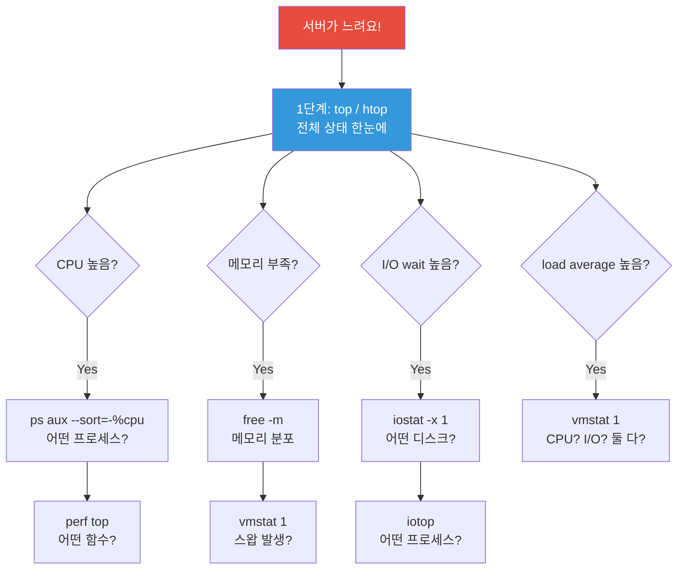
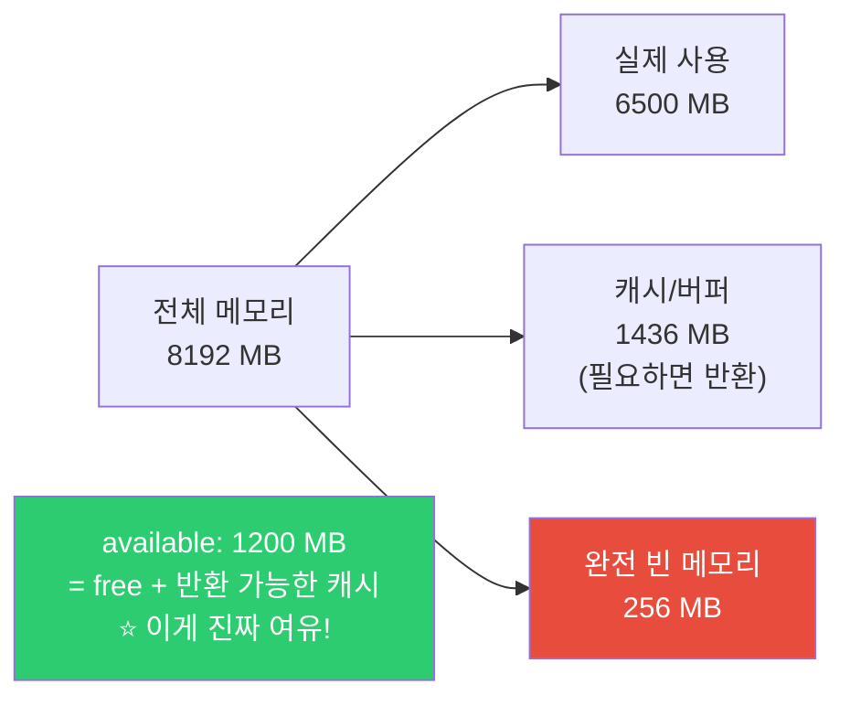
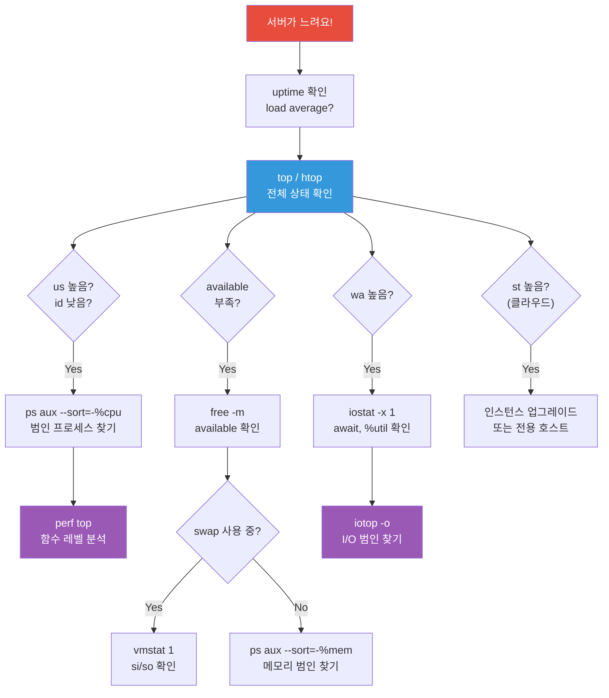
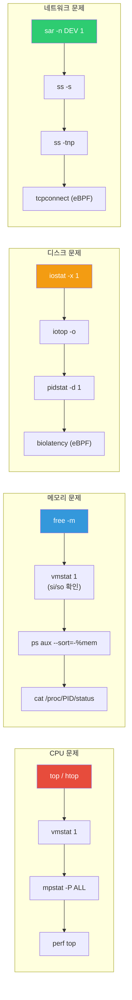

# 성능 분석 (top / vmstat / iostat / sar / perf / eBPF)

> "서버가 느려요" — 이 말을 들었을 때 뭘 봐야 하는지 모르면 DevOps로서 할 수 있는 게 없어요. CPU가 문제인지, 메모리인지, 디스크인지, 네트워크인지. 원인을 빠르게 짚어내는 것이 성능 분석이에요.

---

## 🎯 이걸 왜 알아야 하나?

```
"서버가 느려요"의 진짜 원인:
• CPU 100% → 무한 루프? 연산 과다?
• 메모리 부족 → OOM Killer가 프로세스를 죽이고 있나?
• 디스크 I/O 병목 → 로그 파일이 너무 크거나 DB 쿼리 폭주?
• 네트워크 포화 → 트래픽 급증?
• 프로세스 대기 → 커넥션 풀 고갈? 락(Lock)?
```

"느려요"는 증상이에요. 성능 분석 도구는 **원인**을 찾아주는 진단 장비예요.

---

## 🧠 핵심 개념

### 비유: 병원 진단

서버 성능 분석은 **병원 진단**과 같아요.

* **환자(서버)**: "몸이 안 좋아요(느려요)"
* **의사(DevOps)**: 증상만으로는 모르니까 검사를 해요

| 병원 진단 | 서버 진단 | 도구 |
|-----------|----------|------|
| 체온계 | 시스템 전체 상태 | `top` / `htop` |
| 혈압계 | CPU/메모리 순간 상태 | `vmstat` |
| X-ray | 디스크 I/O 상태 | `iostat` |
| 건강검진 이력 | 시간별 리소스 기록 | `sar` |
| MRI (정밀 검사) | 함수/코드 레벨 분석 | `perf` / eBPF |

### 성능 진단 플로우



---

## 🔍 상세 설명

### top / htop — 전체 상태 한눈에 (★ 항상 첫 번째)

top은 04-process.md에서 한번 다뤘지만, 성능 분석 관점에서 더 깊이 볼게요.

```bash
top
# top - 14:30:00 up 5 days, 3:15, 2 users, load average: 4.50, 3.80, 2.60
# Tasks: 200 total,   3 running, 196 sleeping,   0 stopped,   1 zombie
# %Cpu(s): 65.0 us, 10.0 sy,  0.0 ni, 15.0 id,  8.0 wa,  0.0 hi,  2.0 si,  0.0 st
# MiB Mem :   8192.0 total,    256.0 free,   6500.0 used,   1436.0 buff/cache
# MiB Swap:   4096.0 total,   3000.0 free,   1096.0 used.   1200.0 avail Mem
#
#   PID USER      PR  NI    VIRT    RES    SHR S  %CPU  %MEM     TIME+ COMMAND
#  5000 mysql     20   0 2048000  1.2G   50M  S  85.0  15.0  120:00.0 mysqld
#  6000 ubuntu    20   0  500000  200M   10M  R  45.0   2.4   30:00.0 python3
#  2000 root      20   0  712344  200M   40M  S  10.0   2.4   15:00.0 dockerd
#  7000 www-data  20   0   55000   14M    8M  S   5.0   0.2    5:00.0 nginx
```

#### 윗부분 해석 (시스템 요약)

```bash
# ─── load average ───
# load average: 4.50, 3.80, 2.60
#               ^^^^  ^^^^  ^^^^
#               1분    5분   15분

# CPU 4코어 서버라면:
# 4.50 / 4 = 1.125 → 약간 과부하 (1.0 이상)
# 추세: 4.50 → 3.80 → 2.60 (감소 중 → 최근에 부하가 생겼다가 줄어드는 중)

# load average 해석법:
# load / CPU 코어 수
# < 0.7  : 여유
# 0.7~1.0: 적정
# 1.0~2.0: 과부하 (성능 저하 체감)
# > 2.0  : 심각 (즉시 조치 필요)

# CPU 코어 수 확인
nproc
# 4
```

```bash
# ─── CPU 행 ───
# %Cpu(s): 65.0 us, 10.0 sy, 0.0 ni, 15.0 id, 8.0 wa, 0.0 hi, 2.0 si, 0.0 st

# us (user)    = 65.0% → 앱이 CPU를 많이 씀
# sy (system)  = 10.0% → 커널(시스템 호출)이 쓰는 CPU
# ni (nice)    = 0.0%  → 우선순위 변경된 프로세스
# id (idle)    = 15.0% → 놀고 있는 CPU → 15%밖에 안 남음!
# wa (iowait)  = 8.0%  → ⚠️ 디스크 I/O 대기 → 디스크 병목 의심!
# hi (hardware irq) = 0.0%  → 하드웨어 인터럽트
# si (software irq) = 2.0%  → 소프트웨어 인터럽트 (네트워크 등)
# st (steal)   = 0.0%  → VM에서 호스트에 빼앗긴 CPU → 클라우드에서 중요!
```

**각 지표가 높을 때의 의미:**

| 지표 | 높으면? | 원인 | 조치 |
|------|--------|------|------|
| `us` | 앱이 CPU를 많이 씀 | 무한 루프, 복잡한 연산 | 앱 코드 프로파일링 |
| `sy` | 커널이 바쁨 | 시스템 호출 과다, 컨텍스트 스위칭 | 프로세스 수 줄이기 |
| `wa` | 디스크 대기 | 디스크 느림, I/O 과다 | iostat → SSD 교체, 쿼리 최적화 |
| `st` | VM CPU 빼앗김 | 호스트 과부하 (noisy neighbor) | 인스턴스 타입 업그레이드 |

```bash
# ─── 메모리 행 ───
# MiB Mem:  8192.0 total,  256.0 free,  6500.0 used,  1436.0 buff/cache
# MiB Swap: 4096.0 total, 3000.0 free,  1096.0 used.  1200.0 avail Mem

# free가 적어도 buff/cache가 있으면 괜찮을 수 있어요!
# Linux는 남는 메모리를 캐시로 활용 → 진짜 가용 메모리는 "avail Mem"

# avail Mem: 1200.0 MiB → 실제 사용 가능한 메모리
# Swap used: 1096.0 MiB → ⚠️ 스왑이 1GB 이상 → 메모리 부족!
```

#### top 에서 코어별 CPU 보기

```bash
# top 실행 중 '1' 키를 누르면:
# %Cpu0: 95.0 us,  3.0 sy,  0.0 ni,  2.0 id,  0.0 wa   ← 코어0: 거의 100%!
# %Cpu1: 10.0 us,  5.0 sy,  0.0 ni, 80.0 id,  5.0 wa
# %Cpu2: 12.0 us,  3.0 sy,  0.0 ni, 82.0 id,  3.0 wa
# %Cpu3:  8.0 us,  2.0 sy,  0.0 ni, 88.0 id,  2.0 wa

# → 코어 하나만 95%로 풀 로드
# → 싱글스레드 앱이 CPU를 독점하고 있을 가능성
# (Node.js, Python의 GIL 등은 싱글코어만 씀)
```

---

### free — 메모리 상태

```bash
free -m
#               total        used        free      shared  buff/cache   available
# Mem:           8192        6500         256          50        1436        1200
# Swap:          4096        1096        3000

free -h
#               total        used        free      shared  buff/cache   available
# Mem:          8.0Gi       6.3Gi       256Mi        50Mi       1.4Gi       1.2Gi
# Swap:         4.0Gi       1.1Gi       2.9Gi
```

**읽는 법:**



```bash
# 핵심: free가 적어도 available이 충분하면 OK!

# ❌ 잘못된 판단
# "free가 256MB밖에 안 남았어! 메모리 부족이야!"
# → 아님! buff/cache 1436MB는 필요하면 반환되는 메모리

# ✅ 올바른 판단
# "available이 1200MB → 아직 여유 있음"
# "available이 100MB 이하 → 메모리 부족!"

# ⚠️ Swap 사용량도 체크
# Swap used: 1096MB → 메모리가 부족해서 디스크를 메모리처럼 쓰는 중
# → 매우 느림! 메모리 추가 필요
```

```bash
# 메모리를 많이 쓰는 프로세스 찾기
ps aux --sort=-%mem | head -10
#  PID USER  %MEM    RSS COMMAND
# 5000 mysql 15.0  1.2G  mysqld        ← 1.2GB!
# 6000 ubuntu 2.4  200M  python3
# 2000 root   2.4  200M  dockerd

# RSS (Resident Set Size) = 실제 물리 메모리 사용량
# VSZ (Virtual Size) = 가상 메모리 (크게 보이지만 실제 사용량과 다름)
# → RSS를 보세요!

# 특정 프로세스 메모리 상세
cat /proc/5000/status | grep -E "VmRSS|VmSize|VmSwap"
# VmSize:  2048000 kB    ← 가상 메모리
# VmRSS:   1228800 kB    ← 실제 메모리 (1.2GB)
# VmSwap:    51200 kB    ← 스왑으로 밀려난 양
```

---

### vmstat — CPU / 메모리 / I/O 종합 (★ 핵심 도구)

vmstat은 1초 간격으로 시스템 상태를 숫자로 보여줘요. 추세를 파악하기 좋아요.

```bash
vmstat 1 5    # 1초 간격, 5번 출력
# procs -----------memory---------- ---swap-- -----io---- -system-- ------cpu-----
#  r  b   swpd   free   buff  cache   si   so    bi    bo   in   cs us sy id wa st
#  3  1 1096000 256000  50000 1400000   0    5   100  2000 5000 8000 65 10 15  8  2
#  2  0 1096000 260000  50000 1400000   0    0    50  1500 4800 7500 60  8 22  8  2
#  4  2 1096500 250000  50000 1400000  10   20   200  3000 5500 9000 70 12 8  10  0
#  2  0 1096500 255000  50000 1400000   0    0    80  1800 4500 7000 55  8 30  5  2
#  1  0 1096500 260000  50000 1400000   0    0    30  1200 4000 6500 40  5 50  3  2
```

**각 컬럼 해설:**

```
# === procs ===
# r : 실행 대기 중인 프로세스 수 (CPU를 기다리는 큐)
#     → r > CPU 코어 수 이면 CPU 병목!
# b : I/O 대기 중인 프로세스 수 (디스크를 기다리는 중)
#     → b > 0 이 지속되면 디스크 병목!

# === memory (KB) ===
# swpd  : 사용 중인 스왑 크기
# free  : 빈 메모리
# buff  : 버퍼 (블록 디바이스 캐시)
# cache : 캐시 (파일 시스템 캐시)

# === swap ===
# si : 스왑에서 메모리로 읽은 양 (swap in) KB/s
# so : 메모리에서 스왑으로 쓴 양 (swap out) KB/s
#      → si, so가 계속 양수면 메모리 심각하게 부족!

# === io ===
# bi : 디스크에서 읽은 블록 수 (blocks in)
# bo : 디스크에 쓴 블록 수 (blocks out)

# === system ===
# in : 초당 인터럽트 수
# cs : 초당 컨텍스트 스위칭 수
#      → cs가 매우 높으면 프로세스가 너무 많아서 전환 비용 발생

# === cpu ===
# us sy id wa st → top의 CPU와 동일
```

**vmstat으로 병목 판별:**

```bash
# CPU 병목: r이 높고, us가 높고, id가 낮음
#  r  b   ... us sy id wa
#  8  0   ... 90  5  3  2     ← r=8 (4코어인데 8개 대기), us=90%, id=3%

# 메모리 병목: si/so가 지속적으로 양수
#  ... si   so ...
#  ... 500 1000 ...    ← 스왑이 계속 발생! 메모리 부족

# 디스크 병목: b가 높고, wa가 높음
#  r  b   ... wa
#  1  5   ... 30    ← b=5 (5개 프로세스가 디스크 대기), wa=30%

# 정상: r이 낮고, id가 높고, si/so=0
#  r  b   ... si  so ... us sy id wa
#  0  0   ...  0   0 ... 10  3 85  2    ← 여유 있음
```

---

### iostat — 디스크 I/O 분석 (★ 디스크 병목 진단)

```bash
# 설치 (sysstat 패키지)
sudo apt install sysstat    # Ubuntu
sudo yum install sysstat    # CentOS

# 기본 사용
iostat -x 1 3    # 확장 출력, 1초 간격, 3번
# Device     r/s     w/s   rkB/s   wkB/s  rrqm/s  wrqm/s  await  r_await  w_await  svctm  %util
# sda       50.0   200.0  2000.0 10000.0     5.0    30.0    5.0     2.0      6.0    1.0   25.0
# sdb        2.0    10.0    80.0   500.0     0.0     2.0    1.0     1.0      1.0    0.5    1.0
# nvme0n1  100.0   500.0  5000.0 25000.0    10.0    50.0    0.5     0.3      0.5    0.1    8.0
```

**핵심 지표:**

| 지표 | 의미 | 위험 기준 |
|------|------|----------|
| `r/s` | 초당 읽기 요청 수 | 디스크 종류에 따라 |
| `w/s` | 초당 쓰기 요청 수 | 디스크 종류에 따라 |
| `rkB/s` | 초당 읽기 데이터량 | - |
| `wkB/s` | 초당 쓰기 데이터량 | - |
| `await` | 평균 응답 시간 (ms) | ⭐ HDD: >20ms, SSD: >5ms |
| `r_await` | 읽기 응답 시간 | - |
| `w_await` | 쓰기 응답 시간 | - |
| `%util` | 디스크 사용률 | ⭐ >80%이면 병목! |

```bash
# 해석 예시

# sda: await=5.0, %util=25.0
# → 응답 시간 5ms, 사용률 25% → 정상

# 만약 이런 결과가 나오면:
# sda: await=50.0, %util=98.0
# → 응답 시간 50ms! 사용률 98%! → 디스크 심각한 병목!

# 원인 찾기: 어떤 프로세스가 I/O를 많이 쓰나?
sudo iotop -o    # -o: I/O 있는 프로세스만 표시
# Total DISK READ:  10.00 M/s | Total DISK WRITE:  50.00 M/s
#   PID  USER     DISK READ  DISK WRITE  COMMAND
#  5000  mysql     8.00 M/s   40.00 M/s  mysqld          ← DB가 범인!
#  8000  root      1.00 M/s    5.00 M/s  rsync
#  9000  ubuntu    0.50 M/s    3.00 M/s  python3

# pidstat으로 특정 프로세스의 I/O 추적
pidstat -d 1 5    # 디스크 I/O, 1초 간격, 5번
#  PID   kB_rd/s   kB_wr/s  Command
# 5000   8000.00  40000.00  mysqld
# 8000   1000.00   5000.00  rsync
```

---

### sar — 과거 성능 데이터 조회 (★ 시간별 추이)

sar는 시스템 성능 데이터를 **자동으로 수집하고 저장**해요. "어제 몇 시에 CPU가 높았지?" 같은 과거 분석이 가능해요.

```bash
# sysstat 패키지가 설치되어 있으면 10분마다 자동 수집됨
# 데이터 위치: /var/log/sysstat/ 또는 /var/log/sa/

# ─── CPU 사용량 ───
sar -u 1 5    # 현재 CPU, 1초 간격, 5번
# 14:30:01     CPU     %user   %nice   %system   %iowait   %steal   %idle
# 14:30:02     all     65.00    0.00     10.00      8.00     0.00    17.00
# 14:30:03     all     60.00    0.00      8.00      7.00     0.00    25.00
# 14:30:04     all     70.00    0.00     12.00     10.00     0.00     8.00
# 14:30:05     all     55.00    0.00      8.00      5.00     0.00    32.00
# 14:30:06     all     40.00    0.00      5.00      3.00     0.00    52.00
# Average:     all     58.00    0.00      8.60      6.60     0.00    26.80

# ─── 오늘의 CPU 기록 ───
sar -u
# 00:00:01     CPU     %user   %nice   %system   %iowait   %steal   %idle
# 00:10:01     all      5.00    0.00      2.00      1.00     0.00    92.00
# 00:20:01     all      3.00    0.00      1.00      0.50     0.00    95.50
# ...
# 10:00:01     all     45.00    0.00      8.00      5.00     0.00    42.00    ← 10시에 올라감
# 10:10:01     all     65.00    0.00     10.00      8.00     0.00    17.00    ← 10시 10분 피크
# 10:20:01     all     70.00    0.00     12.00     10.00     0.00     8.00    ← 더 올라감!
# ...

# ─── 어제 데이터 ───
sar -u -f /var/log/sysstat/sa11    # 11일 데이터 (sa뒤 숫자 = 일)
# 또는
sar -u -1    # 어제 (-1 = 1일 전)
```

```bash
# ─── 메모리 사용량 ───
sar -r 1 3
# 14:30:01  kbmemfree  kbavail  kbmemused  %memused  kbbuffers  kbcached
# 14:30:02     256000  1200000    6500000     79.35      50000   1400000
# 14:30:03     260000  1210000    6496000     79.30      50000   1400000

# ─── 스왑 사용량 ───
sar -S 1 3
# 14:30:01  kbswpfree  kbswpused  %swpused  kbswpcad
# 14:30:02    3000000    1096000     26.76         0

# ─── 디스크 I/O ───
sar -d 1 3
# 14:30:01     DEV       tps    rkB/s    wkB/s    dkB/s  areq-sz    aqu-sz    await   %util
# 14:30:02     sda     250.00  2000.00 10000.00     0.00    48.00      1.25     5.00   25.00

# ─── 네트워크 ───
sar -n DEV 1 3
# 14:30:01    IFACE   rxpck/s  txpck/s  rxkB/s   txkB/s
# 14:30:02     eth0   5000.00  4500.00  3000.00  2500.00
# 14:30:02       lo    100.00   100.00    50.00    50.00

# ─── 로드 평균 ───
sar -q 1 3
# 14:30:01   runq-sz  plist-sz  ldavg-1  ldavg-5 ldavg-15  blocked
# 14:30:02         3       200     4.50     3.80     2.60        1

# ─── 컨텍스트 스위칭 ───
sar -w 1 3
# 14:30:01    proc/s   cswch/s
# 14:30:02     50.00   8000.00
```

**sar 시간대별 분석 실전:**

```bash
# "어제 10시~12시 사이에 서버가 느렸다고 하는데, 원인이 뭘까?"

# 1. CPU 확인
sar -u -s 10:00:00 -e 12:00:00 -1
# → iowait가 30%? → 디스크 문제

# 2. 디스크 확인
sar -d -s 10:00:00 -e 12:00:00 -1
# → %util 95%? → 디스크 포화

# 3. 메모리 확인
sar -r -s 10:00:00 -e 12:00:00 -1
# → %memused 95%? → 메모리 부족

# 4. 네트워크 확인
sar -n DEV -s 10:00:00 -e 12:00:00 -1
# → rxkB/s가 평소의 10배? → 트래픽 급증
```

---

### perf — 프로세스/함수 레벨 분석 (고급)

perf는 "어떤 함수가 CPU를 많이 쓰는지" 코드 레벨까지 분석할 수 있어요.

```bash
# 설치
sudo apt install linux-tools-common linux-tools-$(uname -r)    # Ubuntu

# ─── perf top: 실시간 CPU 함수 분석 ───
sudo perf top
# Overhead  Shared Object      Symbol
#   25.00%  mysqld             [.] row_search_mvcc
#   12.00%  mysqld             [.] buf_page_get_gen
#    8.00%  libc.so.6          [.] __memmove_avx_unaligned
#    5.00%  [kernel]           [k] _raw_spin_lock
#    3.00%  python3.10         [.] _PyEval_EvalFrameDefault

# → mysqld의 row_search_mvcc 함수가 CPU의 25%를 사용
# → DB 쿼리 최적화가 필요하다는 것을 알 수 있음!

# ─── perf stat: 프로세스 통계 ───
sudo perf stat -p 5000 sleep 10    # PID 5000을 10초간 분석
#  Performance counter stats for process id '5000':
#       15,000.00 msec task-clock            # 1.500 CPUs utilized
#          50,000      context-switches      # 3.333 K/sec
#           2,000      cpu-migrations        # 0.133 K/sec
#         500,000      page-faults           # 33.333 K/sec
#  45,000,000,000      cycles                # 3.000 GHz
#  30,000,000,000      instructions          # 0.67 insn per cycle
#                                             # ^^^^ 낮으면 캐시 미스 많음

# ─── perf record + report: 프로파일 기록 ───
# 특정 프로세스를 30초간 프로파일
sudo perf record -p 5000 -g sleep 30
# [ perf record: Woken up 10 times to write data ]
# [ perf record: Captured and wrote 5.000 MB perf.data ]

# 결과 분석
sudo perf report
# Overhead  Command  Shared Object  Symbol
#   25.00%  mysqld   mysqld         [.] row_search_mvcc
#   12.00%  mysqld   mysqld         [.] buf_page_get_gen
#   ...

# flamegraph로 시각화 (매우 유용!)
# → 07-ci/cd에서 다루는 FlameGraph 도구와 연동
```

---

### eBPF 기반 프로파일링 (참고)

eBPF는 커널 내부에서 안전하게 프로그램을 실행하는 기술이에요. 성능 분석에서 점점 더 많이 쓰이고 있어요.

```bash
# bcc-tools 설치 (eBPF 도구 모음)
sudo apt install bpfcc-tools    # Ubuntu

# ─── execsnoop: 실행되는 모든 프로세스 추적 ───
sudo execsnoop-bpfcc
# PCOMM  PID    PPID   RET ARGS
# curl   12345  1234     0 /usr/bin/curl http://localhost/health
# bash   12346  800      0 /bin/bash /opt/scripts/check.sh
# grep   12347  12346    0 /usr/bin/grep error /var/log/syslog

# ─── biolatency: 디스크 I/O 지연 시간 분포 ───
sudo biolatency-bpfcc
#      usecs     : count     distribution
#          0 -> 1 : 500      |***                             |
#          2 -> 3 : 2000     |*************                   |
#          4 -> 7 : 5000     |**********************************|
#          8 -> 15: 3000     |********************             |
#         16 -> 31: 1000     |*******                          |
#         32 -> 63: 200      |*                                |
#        64 -> 127: 50       |                                 |
#       128 -> 255: 10       |                                 |  ← 128ms 이상! 느린 I/O

# ─── tcpconnect: TCP 연결 추적 ───
sudo tcpconnect-bpfcc
# PID    COMM         IP  SADDR           DADDR           DPORT
# 5000   myapp        4   10.0.1.50       10.0.2.10       3306
# 5000   myapp        4   10.0.1.50       10.0.3.10       6379
# → 앱이 어디에 연결하는지 실시간으로 볼 수 있음

# ─── opensnoop: 파일 열기 추적 ───
sudo opensnoop-bpfcc
# PID    COMM         FD  ERR PATH
# 5000   myapp         5    0 /opt/myapp/config.yaml
# 5000   myapp         6    0 /var/log/myapp/app.log
# 901    nginx         7    0 /var/log/nginx/access.log
```

---

## 💻 실습 예제

### 실습 1: 성능 기본 진단

```bash
# "서버가 느려요!" 상황을 가정하고 진단 순서 따라하기

# 1단계: 전체 상태
uptime
# 14:30:00 up 5 days, load average: 4.50, 3.80, 2.60
# → load average 4.5, CPU 4코어 → 1.125 과부하

# 2단계: CPU/메모리/프로세스 확인
top -bn1 | head -20
# → %Cpu(s): us, wa 확인
# → 어떤 프로세스가 %CPU 높은지

# 3단계: 메모리 상세
free -m
# → available 확인, swap 확인

# 4단계: 디스크
iostat -x 1 3
# → %util, await 확인

# 5단계: 시간별 추이
sar -u | tail -20
# → 언제부터 CPU가 올라갔는지
```

### 실습 2: CPU 스트레스 만들고 진단

```bash
# CPU 부하 발생 (테스트용)
# 코어 2개에 부하 주기
stress --cpu 2 --timeout 30 &
# 또는 stress 없으면:
yes > /dev/null &
yes > /dev/null &

# 다른 터미널에서 관찰

# top에서 확인
top
# → yes 프로세스가 CPU 높게 나옴

# vmstat으로 확인
vmstat 1 10
# → r이 증가, us가 높아짐, id가 낮아짐

# 정리
killall yes 2>/dev/null
killall stress 2>/dev/null
```

### 실습 3: 메모리 압박 관찰

```bash
# 메모리 상태 연속 모니터링
watch -n 1 'free -m | head -3; echo "---"; vmstat 1 1 | tail -1'

# 다른 터미널에서 메모리를 쓰는 작업 실행
# (대용량 파일 읽기 등)
dd if=/dev/zero of=/tmp/bigfile bs=1M count=500

# watch에서 buff/cache가 변하는 걸 관찰
# → Linux가 파일 캐시로 메모리를 사용하는 걸 볼 수 있음

# 정리
rm /tmp/bigfile
```

### 실습 4: 디스크 I/O 관찰

```bash
# iostat 실시간 모니터링
iostat -x 1

# 다른 터미널에서 디스크 I/O 발생
dd if=/dev/zero of=/tmp/iotest bs=1M count=500

# iostat에서 관찰:
# → wkB/s가 올라감
# → %util이 올라감
# → 어떤 디스크에서 I/O가 발생하는지 확인

# 정리
rm /tmp/iotest
```

---

## 🏢 실무에서는?

### 시나리오 1: "오전 10시부터 서버가 느려졌어요"

```bash
# 1. 현재 상태 확인
uptime
top -bn1 | head -5

# 2. 과거 데이터로 시점 확인
sar -u -s 09:00:00 -e 12:00:00
# 09:50:01  %user  %system  %iowait  %idle
#             10       3        2       85     ← 정상
# 10:00:01    45       8        5       42     ← 올라감!
# 10:10:01    65      10        8       17     ← 피크
# 10:20:01    70      12       10        8     ← 심각

# → 10시부터 CPU가 급등. iowait도 10%까지 올라감

# 3. 원인 프로세스 찾기 (현재 기준)
ps aux --sort=-%cpu | head -5
# mysql  5000 85.0% ...  mysqld

# 4. DB 쿼리 확인
# → 10시에 뭔가 대량 쿼리가 시작됐을 가능성
# → 앱 로그, slow query log 확인

# 5. 만약 디스크 문제라면
sar -d -s 10:00:00 -e 11:00:00
# → %util이 95%? → 디스크 포화
iostat -x 1 5    # 현재 상태
iotop -o         # 어떤 프로세스?
```

### 시나리오 2: OOM Killer 발생

```bash
# 앱이 갑자기 죽었는데 원인을 모를 때

# 1. 커널 로그에서 OOM 확인
dmesg | grep -i "oom\|killed" | tail -10
# [12345.678] Out of memory: Killed process 5000 (myapp) total-vm:4096000kB, anon-rss:3500000kB
# → OOM Killer가 myapp을 죽였음! 메모리 3.5GB 사용 중이었음

# 2. 언제 발생했는지
journalctl -k --since "today" | grep -i oom
# Mar 12 10:15:30 kernel: myapp invoked oom-killer: gfp_mask=0x...

# 3. 당시 메모리 상태
sar -r -s 10:00:00 -e 10:20:00
# → %memused가 99%에 도달했을 것

# 4. 대응
# 즉시: 서비스 재시작
sudo systemctl restart myapp

# 근본: 메모리 누수 수정 또는 메모리 추가
# systemd에서 메모리 제한 설정 (다른 서비스 보호)
# MemoryMax=2G
```

### 시나리오 3: 클라우드에서 steal time 확인

```bash
# AWS EC2에서 서버가 간헐적으로 느릴 때

top
# %Cpu(s): 30.0 us,  5.0 sy,  0.0 ni, 50.0 id,  2.0 wa,  0.0 hi,  1.0 si, 12.0 st
#                                                                              ^^^^
#                                                                              st=12%!

# st (steal) = 호스트가 이 VM에서 빼앗아간 CPU 시간
# → 같은 물리 서버의 다른 VM이 CPU를 많이 써서 내 VM이 영향 받는 것
# → "noisy neighbor" 문제

# 해결:
# 1. 인스턴스 타입 업그레이드 (t2 → m5 등)
# 2. 전용 호스트 (dedicated) 사용
# 3. CPU 크레딧 확인 (t2/t3 인스턴스)

# sar로 steal time 추이 확인
sar -u | awk '{print $1, $NF, $(NF-1)}'    # 시간, idle, steal
```

---

## ⚠️ 자주 하는 실수

### 1. free만 보고 메모리 부족이라고 판단

```bash
# ❌ "free가 256MB밖에 안 남았어! 서버 위험해!"
free -m
# Mem:  8192  6500  256  50  1436  1200

# ✅ available (1200MB)을 봐야 함
# Linux는 남는 메모리를 캐시로 적극 활용
# available이 충분하면 정상
```

### 2. load average만 보고 CPU 부족이라고 판단

```bash
# ❌ "load average 4.0이니까 CPU 부족!"
# → I/O wait 때문에 load가 높은 것일 수 있음

# ✅ vmstat으로 r과 b를 구분
vmstat 1 3
#  r  b  ...
#  1  3  ...    ← r=1 (CPU 대기 1개), b=3 (I/O 대기 3개)
#  → CPU가 아니라 디스크가 병목!
```

### 3. 순간값 하나만 보고 판단

```bash
# ❌ top을 한 번 보고 "CPU 90%!"
# → 순간적으로 높았을 수 있음

# ✅ vmstat이나 sar로 추세를 봐야 함
vmstat 1 10    # 10초간 관찰 → 지속적으로 높은지 확인
sar -u         # 하루 동안의 추이 확인
```

### 4. %util 100%를 패닉하기

```bash
# ❌ "%util이 100%! 디스크가 죽어가고 있어!"
# → SSD는 %util이 높아도 await가 낮으면 괜찮을 수 있음
# (NVMe는 큐가 여러 개라서 %util이 실제 부하를 반영 안 할 수 있음)

# ✅ await를 같이 봐야 함
# %util=95%, await=2ms → SSD라면 괜찮음
# %util=95%, await=50ms → 진짜 병목!
```

### 5. sar 데이터 수집 활성화 안 하기

```bash
# sar 데이터가 없으면 과거 분석 불가!

# sysstat 활성화 확인
systemctl status sysstat
# → enabled인지 확인

# 비활성화되어 있으면:
sudo systemctl enable --now sysstat

# 수집 주기 확인 (기본 10분)
cat /etc/cron.d/sysstat
# */10 * * * * root /usr/lib/sysstat/sa1 1 1
```

---

## 📝 정리

### 성능 분석 도구 치트시트

```bash
# === 전체 상태 ===
top / htop                # 실시간 프로세스 모니터링
uptime                    # load average

# === CPU ===
vmstat 1                  # CPU 사용률 + r(CPU 대기) + b(I/O 대기)
sar -u                    # CPU 시간별 기록
mpstat -P ALL 1           # 코어별 CPU (top에서 '1'과 같음)

# === 메모리 ===
free -m                   # 메모리 상태 (available을 보세요!)
vmstat 1                  # si/so (스왑 발생 여부)
sar -r                    # 메모리 시간별 기록

# === 디스크 ===
iostat -x 1               # 디스크 I/O (await, %util)
iotop -o                  # 프로세스별 I/O
sar -d                    # 디스크 시간별 기록

# === 네트워크 ===
sar -n DEV 1              # 네트워크 트래픽
ss -s                     # 소켓 통계

# === 프로세스 ===
ps aux --sort=-%cpu       # CPU 순
ps aux --sort=-%mem       # 메모리 순
pidstat -u 1              # 프로세스별 CPU
pidstat -d 1              # 프로세스별 I/O

# === 고급 ===
perf top                  # 함수 레벨 CPU 분석
perf record -g -p PID     # 프로파일 기록
strace -p PID             # 시스템 호출 추적
```

### 성능 문제 트러블슈팅 의사결정 트리

"서버가 느려요!" 상황에서 어떤 도구를 어떤 순서로 써야 하는지 한눈에 볼 수 있어요.



### 도구 선택 가이드

어떤 리소스가 문제인지에 따라 쓰는 도구가 달라요.



### 병목 판별 빠른 참조

```
CPU 병목:   vmstat r 높음, us 높음, id 낮음
메모리 병목: free available 낮음, vmstat si/so 양수, swap 사용 중
디스크 병목: vmstat b 높음, wa 높음, iostat await/util 높음
네트워크:   sar -n DEV → 대역폭 확인
```

---

## 🔗 다음 강의

다음은 **[01-linux/13-kernel.md — 커널 내부 (cgroups / namespaces / sysctl / ulimit)](./13-kernel)** 예요.

Docker와 Kubernetes가 내부적으로 어떻게 컨테이너를 격리하는지, 그 근본 기술인 cgroups과 namespaces를 배워볼게요. 또한 sysctl과 ulimit으로 커널 파라미터를 튜닝하는 법도 다룰 거예요.
