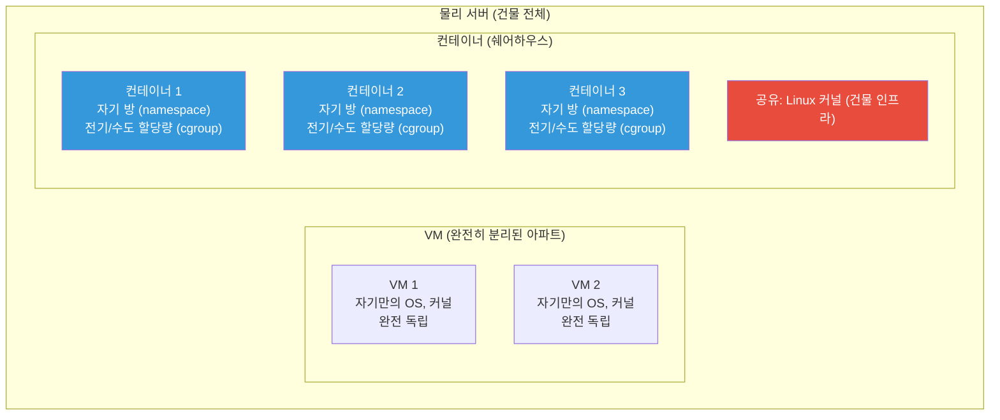
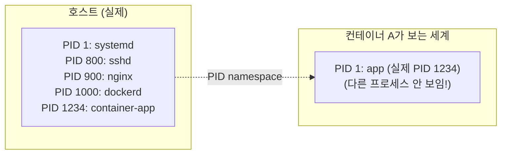
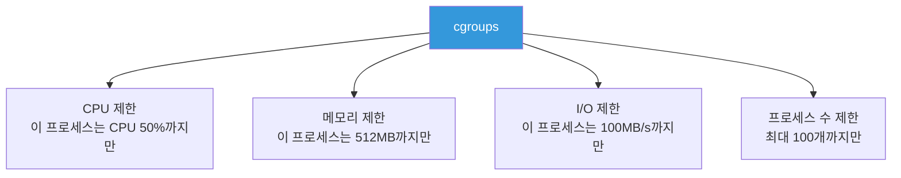
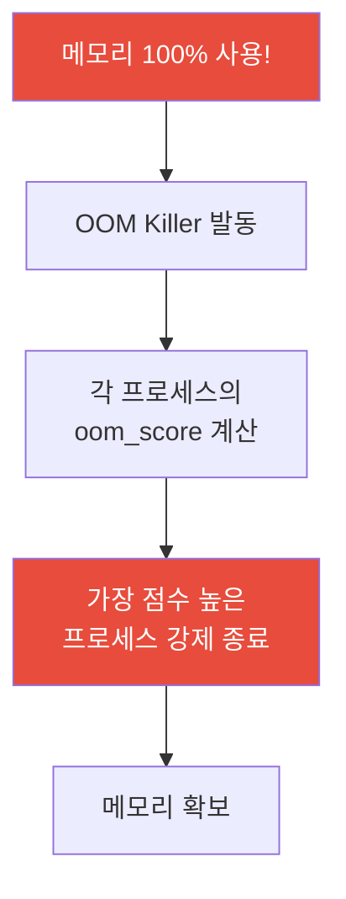

# 커널 내부 (cgroups / namespaces / sysctl / ulimit)

> Docker가 어떻게 프로세스를 격리하는지 궁금한 적 없나요? 비밀은 Linux 커널에 있어요. cgroups과 namespaces라는 두 가지 기술이 컨테이너의 근본이에요. 여기에 sysctl, ulimit으로 커널 파라미터를 튜닝하는 것까지 배우면 서버를 한 단계 더 깊이 이해할 수 있어요.

---

## 🎯 이걸 왜 알아야 하나?

```
이 개념을 알면 이해되는 것들:
• Docker 컨테이너가 어떻게 격리되는지          → namespaces
• 컨테이너에 CPU/메모리 제한을 거는 원리       → cgroups
• Kubernetes의 resource requests/limits 원리   → cgroups
• "Too many open files" 에러 해결              → ulimit
• 서버 튜닝 (최대 연결 수, 파일 수 등)         → sysctl
• OOM Killer가 앱을 죽이는 이유               → 메모리 관리
• 컨테이너 안에서 호스트가 안 보이는 이유       → namespaces
```

Docker/Kubernetes를 쓸 때 "마법처럼" 느껴지는 것들이 사실은 전부 Linux 커널 기능이에요. 이걸 알면 컨테이너 문제를 근본적으로 진단할 수 있어요.

---

## 🧠 핵심 개념

### 비유: 아파트 vs 원룸 vs 쉐어하우스



* **namespaces** = 각자의 방. 옆 방을 볼 수 없음 (격리)
* **cgroups** = 전기/수도 할당량. 한 방이 자원을 독점하지 못하게 제한 (리소스 제한)

이 두 가지가 합쳐져서 **컨테이너**가 되는 거예요.

---

## 🔍 상세 설명

### namespaces — 프로세스 격리

namespace는 프로세스가 보는 **세계를 분리**하는 기술이에요. 같은 서버에 있지만 서로 다른 세계에 사는 것처럼 만들어요.

#### namespace 종류

| Namespace | 격리하는 것 | 효과 |
|-----------|-----------|------|
| **PID** | 프로세스 ID | 컨테이너 안에서 PID 1부터 시작. 다른 컨테이너/호스트 프로세스 안 보임 |
| **Network** | 네트워크 스택 | 컨테이너마다 자기만의 IP, 포트, 라우팅 |
| **Mount** | 파일 시스템 마운트 | 컨테이너마다 자기만의 파일 시스템 |
| **UTS** | 호스트네임 | 컨테이너마다 다른 hostname 가능 |
| **User** | 사용자/그룹 ID | 컨테이너 안에서 root여도 호스트에서는 일반 사용자 |
| **IPC** | 프로세스 간 통신 | 공유 메모리, 세마포어 격리 |
| **Cgroup** | cgroup 뷰 | 컨테이너가 자기 cgroup만 보임 |



#### namespace 직접 확인하기

```bash
# 호스트의 namespace 확인
ls -la /proc/1/ns/
# lrwxrwxrwx 1 root root 0 ... cgroup -> 'cgroup:[4026531835]'
# lrwxrwxrwx 1 root root 0 ... ipc -> 'ipc:[4026531839]'
# lrwxrwxrwx 1 root root 0 ... mnt -> 'mnt:[4026531840]'
# lrwxrwxrwx 1 root root 0 ... net -> 'net:[4026531840]'
# lrwxrwxrwx 1 root root 0 ... pid -> 'pid:[4026531836]'
# lrwxrwxrwx 1 root root 0 ... user -> 'user:[4026531837]'
# lrwxrwxrwx 1 root root 0 ... uts -> 'uts:[4026531838]'

# Docker 컨테이너의 namespace 확인
CONTAINER_PID=$(docker inspect --format '{{.State.Pid}}' mycontainer)
ls -la /proc/$CONTAINER_PID/ns/
# → 숫자가 호스트와 다름! = 다른 namespace에 있다는 뜻

# 호스트와 컨테이너의 PID namespace 비교
readlink /proc/1/ns/pid
# pid:[4026531836]        ← 호스트
readlink /proc/$CONTAINER_PID/ns/pid
# pid:[4026532200]        ← 컨테이너 (다른 번호!)
```

#### namespace 실습: unshare

```bash
# unshare: 새 namespace에서 명령어 실행 (Docker 없이 격리 체험!)

# PID namespace 격리
sudo unshare --pid --fork --mount-proc bash
# 새 bash 안에서:
ps aux
#  PID USER  COMMAND
#    1 root  bash          ← PID 1부터 시작! 다른 프로세스 안 보임!
#    2 root  ps aux
exit

# UTS (hostname) namespace 격리
sudo unshare --uts bash
hostname container-test
hostname
# container-test           ← hostname이 바뀜!
exit
hostname
# web01                    ← 호스트의 hostname은 그대로!

# Network namespace 격리
sudo unshare --net bash
ip addr
# 1: lo: <LOOPBACK> ...
# → eth0이 없음! 격리된 네트워크!
exit
```

---

### cgroups — 리소스 제한

cgroups (Control Groups)는 프로세스 그룹에 **CPU, 메모리, 디스크 I/O, 네트워크** 등의 리소스를 제한하는 기술이에요.

#### cgroups이 하는 일



#### Docker에서의 cgroups

```bash
# Docker 컨테이너에 리소스 제한 걸기
docker run -d \
    --name myapp \
    --cpus="1.5" \           # CPU 1.5코어까지
    --memory="512m" \        # 메모리 512MB까지
    --memory-swap="1g" \     # 메모리+스왑 1GB까지
    --pids-limit=100 \       # 프로세스 최대 100개
    myapp:latest

# 제한 확인
docker stats myapp
# CONTAINER  CPU %  MEM USAGE / LIMIT   MEM %   PIDS
# myapp      45.0%  300MiB / 512MiB     58.59%    25

# 실제 cgroup 파일 확인 (Docker가 만든 것)
CONTAINER_ID=$(docker inspect --format '{{.Id}}' myapp)

# cgroup v2 (최신 배포판)
cat /sys/fs/cgroup/system.slice/docker-${CONTAINER_ID}.scope/memory.max
# 536870912     ← 512MB (바이트)

cat /sys/fs/cgroup/system.slice/docker-${CONTAINER_ID}.scope/cpu.max
# 150000 100000  ← 100000 마이크로초 중 150000 사용 가능 = 1.5코어
```

#### Kubernetes에서의 cgroups

```yaml
# Kubernetes Pod에서 resources를 설정하면 → cgroups으로 제한됨
apiVersion: v1
kind: Pod
spec:
  containers:
  - name: myapp
    resources:
      requests:        # 최소 보장
        cpu: "500m"    # 0.5코어
        memory: "256Mi"
      limits:          # 최대 제한
        cpu: "1000m"   # 1코어
        memory: "512Mi"
```

```bash
# K8s 노드에서 확인 (Pod가 실행 중일 때)
# Pod의 cgroup 경로 찾기
find /sys/fs/cgroup -name "*myapp*" -type d 2>/dev/null

# 메모리 제한 확인
cat /sys/fs/cgroup/kubepods/pod-xxxx/memory.max
# 536870912   ← 512Mi

# 현재 메모리 사용량
cat /sys/fs/cgroup/kubepods/pod-xxxx/memory.current
# 200000000   ← ~200MB 사용 중
```

#### cgroup 직접 만들어보기 (이해용)

```bash
# cgroup v2 기준 (Ubuntu 22+, 최신 배포판)

# 1. cgroup 디렉토리 생성
sudo mkdir /sys/fs/cgroup/mytest

# 2. 메모리 제한 설정 (100MB)
echo 104857600 | sudo tee /sys/fs/cgroup/mytest/memory.max
# 104857600  ← 100MB

# 3. 프로세스를 이 cgroup에 추가
echo $$ | sudo tee /sys/fs/cgroup/mytest/cgroup.procs
# → 현재 쉘이 100MB 메모리 제한에 걸림

# 4. 확인
cat /sys/fs/cgroup/mytest/memory.current
# 5000000   ← ~5MB 사용 중

# 5. 정리 (cgroup에서 나가기)
echo $$ | sudo tee /sys/fs/cgroup/cgroup.procs
sudo rmdir /sys/fs/cgroup/mytest
```

---

### 프로세스 스케줄러 (Process Scheduler)

CPU가 4코어인데 프로세스가 100개면, 누가 먼저 CPU를 쓸지 결정해야 해요. 그게 스케줄러의 역할이에요.

```bash
# 프로세스 우선순위 확인
ps -eo pid,ni,pri,comm | head -10
#   PID  NI PRI COMMAND
#     1   0  20 systemd
#   800   0  20 sshd
#   900   0  20 nginx
#  5000   0  20 mysqld

# NI (nice): -20(최우선) ~ 19(최후순위), 기본값 0
# PRI (priority): 높을수록 우선

# nice값 변경 (우선순위 낮추기)
nice -n 10 /opt/scripts/heavy-task.sh
# → 이 스크립트는 다른 프로세스보다 낮은 우선순위로 실행

# 실행 중인 프로세스의 nice값 변경
renice 10 -p 5000     # PID 5000의 nice를 10으로 (우선순위 낮춤)
renice -5 -p 5000     # nice를 -5로 (우선순위 높임, root 필요)
sudo renice -10 -p 5000  # 매우 높은 우선순위

# 실무 활용: 백업이나 배치 작업은 nice로 우선순위를 낮춰서
# 실제 서비스에 영향을 최소화
nice -n 15 /opt/scripts/db-backup.sh
ionice -c 3 /opt/scripts/db-backup.sh    # I/O 우선순위도 낮추기
```

**스케줄링 정책:**

| 정책 | 용도 | 명령어 |
|------|------|--------|
| `SCHED_OTHER` | 기본 (CFS — 공평 스케줄링) | 대부분의 프로세스 |
| `SCHED_FIFO` | 실시간 (선입선출) | 실시간 시스템 |
| `SCHED_RR` | 실시간 (라운드로빈) | 실시간 시스템 |
| `SCHED_BATCH` | 배치 작업용 | CPU 집중 배치 |
| `SCHED_IDLE` | 최저 우선순위 | 시스템 idle 때만 |

```bash
# 현재 스케줄링 정책 확인
chrt -p 5000
# pid 5000's current scheduling policy: SCHED_OTHER
# pid 5000's current scheduling priority: 0

# 배치 작업으로 설정
sudo chrt -b 0 /opt/scripts/batch-job.sh
```

---

### 메모리 관리 — OOM Killer, swap

#### OOM Killer (Out of Memory Killer)

메모리가 완전히 부족하면 Linux 커널이 자동으로 프로세스를 죽여요. 이게 OOM Killer예요.



```bash
# OOM Killer가 발동했는지 확인
dmesg | grep -i "oom\|killed"
# [12345.678] Out of memory: Killed process 5000 (myapp) total-vm:4096000kB
# [12345.678] oom_reaper: reaped process 5000 (myapp), now anon-rss:0kB

journalctl -k | grep -i oom
# Mar 12 10:15:30 kernel: myapp invoked oom-killer: gfp_mask=0x...
# Mar 12 10:15:30 kernel: Out of memory: Killed process 5000 (myapp)

# 각 프로세스의 OOM 점수 확인 (높을수록 먼저 죽음)
cat /proc/5000/oom_score
# 500

# 모든 프로세스의 OOM 점수 순위
for pid in $(ls /proc/ | grep -E '^[0-9]+$'); do
    score=$(cat /proc/$pid/oom_score 2>/dev/null) || continue
    name=$(cat /proc/$pid/comm 2>/dev/null) || continue
    [ "$score" -gt 0 ] && echo "$score $pid $name"
done | sort -rn | head -10
# 800 5000 mysqld          ← 가장 먼저 죽을 후보
# 500 6000 myapp
# 200 2000 dockerd
# 100 901  nginx
```

```bash
# OOM Killer로부터 보호하기

# 특정 프로세스의 OOM 점수 조정
# oom_score_adj: -1000(절대 죽이지 마) ~ 1000(먼저 죽여)

# 중요한 프로세스 보호 (예: DB)
echo -1000 | sudo tee /proc/5000/oom_score_adj
# → mysqld를 OOM Killer로부터 보호

# systemd 서비스에서 설정
# /etc/systemd/system/mydb.service
# [Service]
# OOMScoreAdjust=-900     ← 거의 안 죽임

# 덜 중요한 프로세스를 먼저 죽이도록
echo 500 | sudo tee /proc/8000/oom_score_adj
# → batch job을 먼저 죽여서 다른 서비스 보호
```

#### swap 관리

swap은 메모리가 부족할 때 디스크를 메모리처럼 쓰는 것이에요. 느리지만 OOM을 방지할 수 있어요.

```bash
# swap 상태 확인
swapon --show
# NAME      TYPE SIZE  USED PRIO
# /swapfile file   4G  1.1G   -2

free -h | grep Swap
# Swap:         4.0Gi       1.1Gi       2.9Gi

# swap 사용 중인 프로세스 확인
for pid in $(ls /proc/ | grep -E '^[0-9]+$'); do
    swap=$(awk '/VmSwap/ {print $2}' /proc/$pid/status 2>/dev/null)
    name=$(cat /proc/$pid/comm 2>/dev/null)
    [ -n "$swap" ] && [ "$swap" -gt 0 ] && echo "${swap}kB $pid $name"
done | sort -rn | head -10
# 512000kB 5000 mysqld     ← 500MB가 swap으로 밀려남
# 102400kB 6000 myapp
```

```bash
# swappiness: 커널이 얼마나 적극적으로 swap을 쓸지 결정
cat /proc/sys/vm/swappiness
# 60    ← 기본값 (0~100)

# 60 = 적당히 swap 사용
# 10 = swap 최소화 (DB 서버 추천)
#  0 = 가능한 한 swap 안 씀 (메모리가 충분할 때)

# 임시 변경
sudo sysctl vm.swappiness=10

# 영구 변경
echo "vm.swappiness=10" | sudo tee -a /etc/sysctl.d/99-custom.conf
sudo sysctl -p /etc/sysctl.d/99-custom.conf
```

```bash
# swap 파일 추가 (메모리가 부족한 긴급 상황)

# 1. swap 파일 생성 (2GB)
sudo fallocate -l 2G /swapfile2
sudo chmod 600 /swapfile2
sudo mkswap /swapfile2
# Setting up swapspace version 1, size = 2 GiB

# 2. swap 활성화
sudo swapon /swapfile2

# 3. 확인
swapon --show
free -h

# 4. 재부팅 후에도 유지하려면 fstab에 추가
echo '/swapfile2 none swap sw 0 0' | sudo tee -a /etc/fstab

# swap 비활성화 (메모리를 충분히 추가한 후)
sudo swapoff /swapfile2
sudo rm /swapfile2
# fstab에서도 제거
```

---

### sysctl — 커널 파라미터 튜닝 (★ 실무 필수)

sysctl은 커널의 동작을 실시간으로 변경할 수 있는 도구예요. 서버 튜닝의 핵심이에요.

```bash
# 현재 설정 확인
sysctl -a | wc -l
# 1200+    ← 1200개 이상의 커널 파라미터!

# 특정 값 확인
sysctl net.core.somaxconn
# net.core.somaxconn = 4096

# 값 변경 (임시, 재부팅하면 원래대로)
sudo sysctl net.core.somaxconn=65535

# 또는
echo 65535 | sudo tee /proc/sys/net/core/somaxconn
```

#### 실무 필수 파라미터

```bash
# 파일 만들기
sudo vim /etc/sysctl.d/99-custom.conf
```

```bash
# ─── 네트워크 튜닝 ───

# TCP 최대 연결 대기 큐 (Nginx, 고트래픽 서버에 필수)
net.core.somaxconn = 65535

# TCP 연결 재사용 (TIME_WAIT 줄이기)
net.ipv4.tcp_tw_reuse = 1

# TCP keepalive (유휴 연결 감지)
net.ipv4.tcp_keepalive_time = 600       # 600초 후 keepalive 시작
net.ipv4.tcp_keepalive_intvl = 60       # 60초 간격으로 확인
net.ipv4.tcp_keepalive_probes = 5       # 5번 응답 없으면 끊기

# SYN flood 방어
net.ipv4.tcp_syncookies = 1
net.ipv4.tcp_max_syn_backlog = 65535

# 로컬 포트 범위 (대량 아웃바운드 연결 시)
net.ipv4.ip_local_port_range = 1024 65535

# TCP 메모리 버퍼
net.core.rmem_max = 16777216            # 수신 버퍼 최대
net.core.wmem_max = 16777216            # 송신 버퍼 최대

# ─── 파일 시스템 ───

# 최대 열린 파일 수 (전체 시스템)
fs.file-max = 2097152

# inotify 감시 제한 (파일 감시 도구용)
fs.inotify.max_user_watches = 524288
fs.inotify.max_user_instances = 512

# ─── 메모리 ───

# swap 사용 최소화 (DB 서버)
vm.swappiness = 10

# OOM Killer 패닉 방지
vm.panic_on_oom = 0

# 더티 페이지 비율 (디스크 쓰기 타이밍)
vm.dirty_ratio = 20                     # 전체 메모리의 20%까지 캐시
vm.dirty_background_ratio = 5           # 5% 넘으면 백그라운드 flush

# ─── IP 포워딩 (Docker, K8s에 필요) ───
net.ipv4.ip_forward = 1
net.bridge.bridge-nf-call-iptables = 1
```

```bash
# 적용
sudo sysctl -p /etc/sysctl.d/99-custom.conf
# net.core.somaxconn = 65535
# net.ipv4.tcp_tw_reuse = 1
# ...

# 확인
sysctl net.core.somaxconn
# net.core.somaxconn = 65535
```

**Docker/Kubernetes 필수 sysctl:**

```bash
# Docker가 정상 동작하려면 필요한 설정
cat /etc/sysctl.d/99-kubernetes.conf
# net.bridge.bridge-nf-call-iptables = 1
# net.bridge.bridge-nf-call-ip6tables = 1
# net.ipv4.ip_forward = 1

# 없으면 K8s Pod 간 통신이 안 됨!
# kubeadm init 할 때도 이 설정을 확인함
```

---

### ulimit — 프로세스별 리소스 제한

ulimit은 **사용자/프로세스 단위**로 리소스를 제한해요. sysctl이 시스템 전체라면, ulimit은 개별 프로세스예요.

```bash
# 현재 제한 확인
ulimit -a
# core file size          (blocks, -c) 0
# data seg size           (kbytes, -d) unlimited
# scheduling priority             (-e) 0
# file size               (blocks, -f) unlimited
# pending signals                 (-i) 15421
# max locked memory       (kbytes, -l) 65536
# max memory size         (kbytes, -m) unlimited
# open files                      (-n) 1024        ← ⭐ 가장 자주 문제!
# pipe size            (512 bytes, -p) 8
# POSIX message queues     (bytes, -q) 819200
# real-time priority              (-r) 0
# stack size              (kbytes, -s) 8192
# cpu time               (seconds, -t) unlimited
# max user processes              (-u) 15421
# virtual memory          (kbytes, -v) unlimited
# file locks                      (-x) unlimited
```

#### "Too many open files" 에러 (가장 흔한 문제!)

```bash
# 이 에러를 본 적 있나요?
# "Too many open files"
# "socket: too many open files"
# "can't open file: Too many open files"

# 현재 열린 파일 수 확인
cat /proc/sys/fs/file-nr
# 5000  0  2097152
# ^^^^     ^^^^^^^
# 현재    시스템 최대

# 특정 프로세스의 열린 파일 수
ls /proc/5000/fd | wc -l
# 1020    ← 1024에 거의 도달!

# 프로세스의 제한 확인
cat /proc/5000/limits | grep "Max open files"
# Max open files            1024                 1048576              files
#                           ^^^^                 ^^^^^^^
#                           soft limit           hard limit

# ⚠️ 1024는 기본값인데, 웹서버/DB/앱 서버에는 너무 낮아요!
```

#### ulimit 변경

```bash
# 임시 변경 (현재 세션만)
ulimit -n 65535          # 열린 파일 수
ulimit -u 65535          # 프로세스 수

# 영구 변경: /etc/security/limits.conf
sudo vim /etc/security/limits.conf
```

```bash
# /etc/security/limits.conf
# <domain>  <type>  <item>   <value>

# 모든 사용자
*          soft    nofile   65535
*          hard    nofile   65535
*          soft    nproc    65535
*          hard    nproc    65535

# 특정 사용자
nginx      soft    nofile   65535
nginx      hard    nofile   65535
mysql      soft    nofile   65535
mysql      hard    nofile   65535
deploy     soft    nofile   65535
deploy     hard    nofile   65535

# root
root       soft    nofile   65535
root       hard    nofile   65535
```

```bash
# soft limit: 기본 적용 값 (사용자가 올릴 수 있음)
# hard limit: 최대 허용 값 (root만 변경 가능)

# 적용 확인 (재로그인 필요!)
exit
ssh ubuntu@server
ulimit -n
# 65535
```

#### systemd 서비스의 ulimit

```bash
# systemd 서비스는 /etc/security/limits.conf와 별개!
# Unit 파일에서 직접 설정해야 해요.

# /etc/systemd/system/nginx.service.d/override.conf
# [Service]
# LimitNOFILE=65535
# LimitNPROC=65535

sudo systemctl daemon-reload
sudo systemctl restart nginx

# 확인
cat /proc/$(pgrep -o nginx)/limits | grep "Max open files"
# Max open files            65535                65535                files
```

---

## 💻 실습 예제

### 실습 1: namespace 격리 체험

```bash
# PID namespace 격리
sudo unshare --pid --fork --mount-proc bash

# 격리된 환경에서:
ps aux
# PID 1이 bash! 호스트 프로세스가 안 보임
hostname
# 호스트와 같음 (UTS namespace는 격리 안 했으니까)

exit
# 호스트로 돌아옴

# 여러 namespace 동시 격리 (컨테이너와 비슷)
sudo unshare --pid --fork --mount-proc --uts --net bash

# 격리된 환경에서:
hostname test-container
hostname
# test-container
ip addr
# lo만 보임 (eth0 없음!)
ps aux
# PID 1부터 시작

exit
```

### 실습 2: cgroup으로 메모리 제한

```bash
# Docker로 메모리 제한 체험
docker run -it --rm --memory=50m ubuntu bash

# 컨테이너 안에서:
# 메모리 제한 확인
cat /sys/fs/cgroup/memory.max
# 52428800   ← 50MB

# 메모리를 많이 쓰는 명령어 실행
dd if=/dev/zero of=/dev/null bs=1M &
# → 메모리 제한에 걸리면 OOM으로 프로세스가 죽을 수 있음

# 다른 터미널에서 stats 확인
docker stats
# CONTAINER  MEM USAGE / LIMIT  MEM %
# ...        48MiB / 50MiB      96.00%

exit
```

### 실습 3: sysctl 튜닝

```bash
# 현재 값 확인
sysctl net.core.somaxconn
# net.core.somaxconn = 4096

# 임시 변경
sudo sysctl net.core.somaxconn=65535

# 확인
sysctl net.core.somaxconn
# net.core.somaxconn = 65535

# 원래대로 복구
sudo sysctl net.core.somaxconn=4096

# 영구 설정 파일로 관리
echo "net.core.somaxconn = 65535" | sudo tee /etc/sysctl.d/99-test.conf
sudo sysctl -p /etc/sysctl.d/99-test.conf

# 정리
sudo rm /etc/sysctl.d/99-test.conf
sudo sysctl net.core.somaxconn=4096
```

### 실습 4: ulimit 체험

```bash
# 1. 현재 열린 파일 제한 확인
ulimit -n
# 1024

# 2. 임시로 올리기
ulimit -n 4096

# 3. 확인
ulimit -n
# 4096

# 4. 열린 파일 수 확인
ls /proc/$$/fd | wc -l    # 현재 쉘의 열린 파일 수

# 5. "Too many open files" 재현
ulimit -n 20    # 매우 낮게 설정
for i in $(seq 1 30); do
    exec {fd}>/tmp/test_$i.tmp
done
# bash: /tmp/test_21.tmp: Too many open files   ← 발생!

# 정리
rm /tmp/test_*.tmp
```

---

## 🏢 실무에서는?

### 시나리오 1: Nginx "Too many open files"

```bash
# Nginx 에러 로그에서 이런 걸 발견
# [alert] 901#901: *50000 socket() failed (24: Too many open files)

# 1. Nginx 프로세스의 현재 제한 확인
cat /proc/$(pgrep -o nginx)/limits | grep "Max open files"
# Max open files            1024                 1024                files
# → 1024개! 트래픽 많으면 부족해요

# 2. 현재 열린 파일 수
ls /proc/$(pgrep -o nginx)/fd | wc -l
# 1020   ← 거의 한계!

# 3. 해결: Nginx 서비스의 ulimit 올리기
sudo systemctl edit nginx
# [Service]
# LimitNOFILE=65535

# 4. Nginx 설정에서도 worker_connections 올리기
# /etc/nginx/nginx.conf
# worker_rlimit_nofile 65535;
# events {
#     worker_connections 16384;
# }

# 5. 적용
sudo systemctl daemon-reload
sudo systemctl restart nginx

# 6. 확인
cat /proc/$(pgrep -o nginx)/limits | grep "Max open files"
# Max open files            65535                65535                files  ✅
```

### 시나리오 2: K8s 노드 셋업 시 sysctl 설정

```bash
# K8s 노드를 셋업할 때 반드시 필요한 커널 설정

cat << 'EOF' | sudo tee /etc/sysctl.d/99-kubernetes.conf
# K8s 필수
net.bridge.bridge-nf-call-iptables = 1
net.bridge.bridge-nf-call-ip6tables = 1
net.ipv4.ip_forward = 1

# 네트워크 튜닝
net.core.somaxconn = 65535
net.ipv4.tcp_max_syn_backlog = 65535
net.ipv4.ip_local_port_range = 1024 65535

# 파일 시스템
fs.file-max = 2097152
fs.inotify.max_user_watches = 524288
fs.inotify.max_user_instances = 512

# 메모리
vm.swappiness = 10
vm.max_map_count = 262144    # Elasticsearch 필요
EOF

sudo sysctl -p /etc/sysctl.d/99-kubernetes.conf

# br_netfilter 모듈 로드 (bridge 관련 sysctl에 필요)
sudo modprobe br_netfilter
echo br_netfilter | sudo tee /etc/modules-load.d/br_netfilter.conf
```

### 시나리오 3: 컨테이너가 OOM으로 죽는 문제

```bash
# K8s Pod가 자꾸 OOMKilled 상태로 죽음

# 1. Pod 상태 확인
kubectl describe pod myapp-pod
# Containers:
#   myapp:
#     State:      Waiting
#       Reason:   CrashLoopBackOff
#     Last State: Terminated
#       Reason:   OOMKilled          ← 메모리 초과!
#       Exit Code: 137               ← 128 + 9 (SIGKILL)

# 2. 리소스 설정 확인
kubectl get pod myapp-pod -o jsonpath='{.spec.containers[0].resources}'
# {"limits":{"memory":"256Mi"},"requests":{"memory":"128Mi"}}
# → 256Mi 제한인데 앱이 더 쓰려고 함

# 3. 실제 메모리 사용량 확인
kubectl top pod myapp-pod
# NAME         CPU(cores)   MEMORY(bytes)
# myapp-pod    100m         250Mi          ← 256Mi에 거의 도달

# 4. 해결: 메모리 제한 올리기
# spec.containers[0].resources.limits.memory: "512Mi"

# 또는 앱의 메모리 누수를 수정
# Java: -Xmx 설정, Go: pprof로 분석, Python: memory_profiler
```

---

## ⚠️ 자주 하는 실수

### 1. ulimit을 /etc/security/limits.conf에만 설정하고 systemd 서비스는 빠뜨리기

```bash
# ❌ limits.conf를 바꿨는데 Nginx에 적용 안 됨!
# → systemd 서비스는 limits.conf를 안 읽어요

# ✅ systemd 서비스는 Unit 파일에서 설정
# LimitNOFILE=65535
```

### 2. sysctl 변경을 /etc/sysctl.conf에 직접 쓰기

```bash
# ❌ /etc/sysctl.conf 직접 수정 (패키지 업데이트 시 덮어씌워질 수 있음)
sudo vim /etc/sysctl.conf

# ✅ /etc/sysctl.d/ 디렉토리에 별도 파일로 관리
sudo vim /etc/sysctl.d/99-custom.conf
# → 번호가 높을수록 나중에 적용 (우선순위 높음)
```

### 3. swap을 무조건 끄기

```bash
# ❌ "swap은 느리니까 꺼야지!"
sudo swapoff -a
# → 메모리 부족 시 OOM Killer가 바로 프로세스를 죽임!

# ✅ DB 서버: swappiness를 낮게 (10 정도)
# ✅ 일반 서버: 적당한 swap 유지 (OOM 버퍼 역할)
# ✅ K8s 노드: swap off 필요 (kubelet 요구사항)
#    → 하지만 최신 K8s는 swap 지원 시작

# K8s 노드에서만 swap 끄기
sudo swapoff -a
sudo sed -i '/swap/d' /etc/fstab
```

### 4. OOM 점수 조정을 과하게 하기

```bash
# ❌ 모든 서비스에 -1000 (절대 보호)
echo -1000 | sudo tee /proc/*/oom_score_adj
# → 메모리 부족 시 죽일 프로세스가 없어서 시스템 전체가 멈춤!

# ✅ 정말 중요한 것만 보호, 나머지는 기본값
echo -900 | sudo tee /proc/$(pgrep mysqld)/oom_score_adj    # DB만 보호
# 나머지는 기본값(0) 유지 → 메모리 부족 시 적절히 정리됨
```

### 5. bridge-nf-call-iptables 설정 누락

```bash
# ❌ K8s/Docker에서 Pod 간 통신이 안 됨
# → bridge 트래픽이 iptables를 거치지 않아서

# ✅ 반드시 설정
sudo modprobe br_netfilter
sudo sysctl net.bridge.bridge-nf-call-iptables=1
sudo sysctl net.bridge.bridge-nf-call-ip6tables=1
```

---

## 📝 정리

### Docker/K8s와 커널의 관계

```
Docker 컨테이너 = namespaces (격리) + cgroups (제한) + Union FS (파일 시스템)

namespaces:  PID, Network, Mount, UTS, User, IPC, Cgroup
cgroups:     CPU, Memory, I/O, PIDs 제한

K8s resources.limits → cgroups
K8s Pod 격리 → namespaces
K8s NetworkPolicy → 네트워크 namespace + iptables
```

### 커널 튜닝 치트시트

```bash
# === sysctl ===
sysctl -a | grep [키워드]                # 현재 값 검색
sudo sysctl [key]=[value]                # 임시 변경
echo "[key] = [value]" | sudo tee /etc/sysctl.d/99-custom.conf  # 영구 변경
sudo sysctl -p /etc/sysctl.d/99-custom.conf                      # 적용

# === ulimit ===
ulimit -a                                # 현재 제한 확인
ulimit -n 65535                          # 열린 파일 수 (임시)
/etc/security/limits.conf                # 영구 변경 (로그인 사용자)
systemd: LimitNOFILE=65535               # 서비스용

# === OOM ===
dmesg | grep -i oom                      # OOM 발생 확인
cat /proc/[PID]/oom_score                # OOM 점수
echo -900 > /proc/[PID]/oom_score_adj    # 보호

# === swap ===
swapon --show                            # swap 상태
sysctl vm.swappiness=10                  # swap 최소화
```

### 실무 필수 설정

```
서버 셋업 시 반드시:
✅ fs.file-max = 2097152
✅ net.core.somaxconn = 65535
✅ vm.swappiness = 10 (DB 서버)
✅ ulimit nofile = 65535 (서비스별)
✅ net.ipv4.ip_forward = 1 (Docker/K8s)
✅ net.bridge.bridge-nf-call-iptables = 1 (K8s)
```

---

## 🔗 다음 강의

다음은 **[01-linux/14-security.md — 보안 (SELinux / AppArmor / seccomp)](./14-security)** 이에요.

Linux 시스템 보안의 마지막 방어선인 SELinux, AppArmor, seccomp를 배워볼게요. 컨테이너 보안의 근본이 되는 기술이기도 해요. 이걸로 01-linux 카테고리가 마무리돼요!
