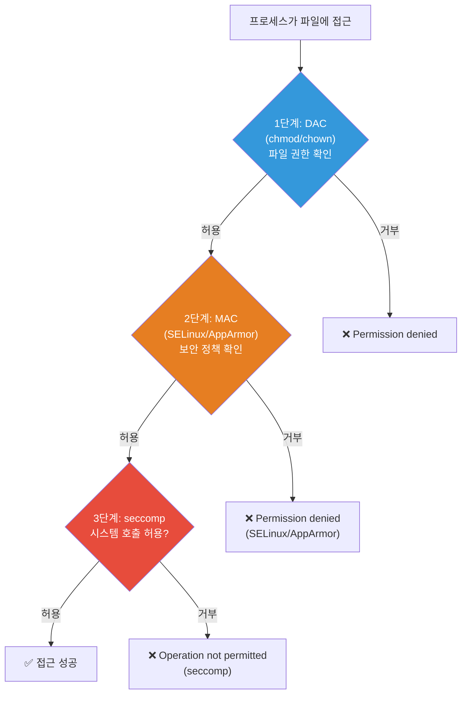
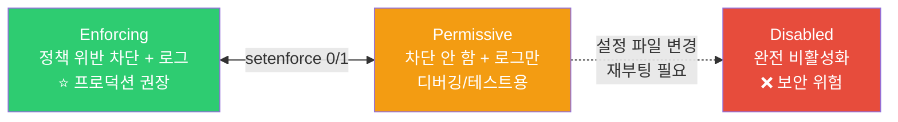
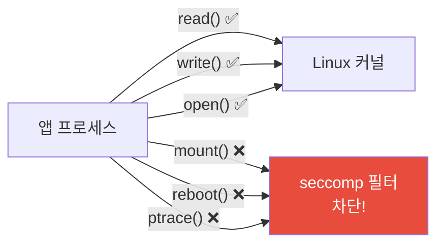
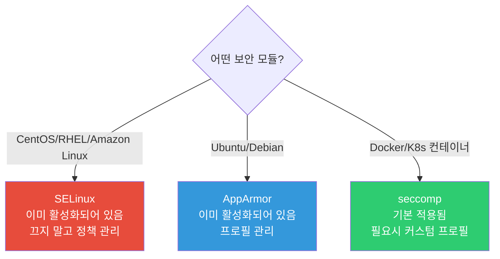

# Linux 보안 (SELinux / AppArmor / seccomp)

> 서버에 누군가 침입했어요. root 권한을 탈취했어요. 그래도 피해를 최소화할 수 있을까요? SELinux, AppArmor, seccomp은 **마지막 방어선**이에요. 프로세스가 할 수 있는 일 자체를 제한해서, 해커가 root를 탈취해도 할 수 있는 게 별로 없게 만들어요.

---

## 🎯 이걸 왜 알아야 하나?

```
실무에서 이 기술들을 마주치는 상황:
• "앱이 파일을 못 읽어요" → SELinux/AppArmor가 막고 있을 수 있음
• "컨테이너에서 이 시스템 호출이 안 돼요" → seccomp 프로필이 차단
• Docker/K8s 보안 강화 → seccomp, AppArmor 프로필 적용
• 보안 감사/컴플라이언스 → "MAC(Mandatory Access Control) 사용 중인가요?"
• CIS Benchmark 점검 → SELinux/AppArmor가 enabled인지 확인
```

많은 DevOps 초보자가 "SELinux 때문에 안 돼요" → `setenforce 0`(비활성화)로 해결하는데, 이건 **보안 구멍을 뚫는 거예요**. 제대로 이해하면 끄지 않고도 문제를 해결할 수 있어요.

---

## 🧠 핵심 개념

### 비유: 보안 등급 시스템

Linux 보안을 **군사 시설의 보안 등급**으로 비유해볼게요.

* **기본 권한 (chmod/chown)** = 출입증. "이 사람은 이 방에 들어갈 수 있다" — DAC (Discretionary Access Control)
* **SELinux / AppArmor** = 보안 등급. 출입증이 있어도, 보안 등급이 안 맞으면 접근 불가 — MAC (Mandatory Access Control)
* **seccomp** = 행동 제한. 건물 안에 들어와도 "전화 사용 금지", "USB 사용 금지" 같은 행동 규칙



**DAC vs MAC:**

| 비교 | DAC (기본 권한) | MAC (SELinux/AppArmor) |
|------|----------------|----------------------|
| 누가 설정? | 파일 소유자 | 시스템 관리자 (정책) |
| root가 무시 가능? | ✅ root는 모든 파일 접근 가능 | ❌ root여도 정책에 의해 차단 |
| 비유 | 문 잠금장치 (열쇠 있으면 OK) | 보안 등급 (등급 안 맞으면 열쇠 있어도 안 됨) |

---

## 🔍 상세 설명 — SELinux

### SELinux란?

**Security-Enhanced Linux**. NSA(미국 국가안보국)가 개발한 보안 모듈이에요. Red Hat 계열(CentOS, RHEL, Fedora, Amazon Linux)에서 기본으로 켜져있어요.

모든 프로세스와 파일에 **보안 레이블(label)**을 붙이고, **정책(policy)**에 따라 접근을 제어해요.

```bash
# SELinux 상태 확인
getenforce
# Enforcing    ← 활성화 (차단 + 로그)
# Permissive   ← 감시 모드 (로그만, 차단 안 함)
# Disabled     ← 비활성화

sestatus
# SELinux status:                 enabled
# SELinuxfs mount:                /sys/fs/selinux
# SELinux root directory:         /etc/selinux
# Loaded policy name:             targeted
# Current mode:                   enforcing
# Mode from config file:          enforcing
```

### SELinux 모드



```bash
# 모드 전환 (임시, 재부팅하면 원래대로)
sudo setenforce 0    # Permissive로 전환
sudo setenforce 1    # Enforcing으로 전환

# 영구 변경 (/etc/selinux/config)
# SELINUX=enforcing    ← enforcing / permissive / disabled
# SELINUXTYPE=targeted  ← targeted(기본) / mls

# ⚠️ Disabled → Enforcing으로 바꿀 때는 재부팅 후 레이블 재설정이 필요해요
# → 시간이 오래 걸릴 수 있음 (파일이 많으면 30분+)
```

### SELinux 보안 컨텍스트 (레이블)

```bash
# 파일의 보안 컨텍스트 확인 (-Z 옵션)
ls -laZ /var/www/html/index.html
# -rw-r--r--. root root unconfined_u:object_r:httpd_sys_content_t:s0 index.html
#                        ^^^^^^^^^^^^^^^^^^^^^^^^^^^^^^^^^^^^^^^^
#                        SELinux 보안 컨텍스트

# 형식: user:role:type:level
# user:  unconfined_u (제한 없는 사용자)
# role:  object_r (파일은 보통 object_r)
# type:  httpd_sys_content_t ← ⭐ 이게 가장 중요!
# level: s0 (MLS 레벨)

# 프로세스의 보안 컨텍스트
ps auxZ | grep nginx
# system_u:system_r:httpd_t:s0  root  900 ... nginx: master process
#                   ^^^^^^^^
#                   httpd_t 타입

# 핵심: httpd_t(프로세스)는 httpd_sys_content_t(파일)에 접근 가능
# → 정책에 의해 허용되어 있음
```

### SELinux 문제 해결

```bash
# === 가장 흔한 시나리오: Nginx가 파일을 못 읽음 ===

# 에러 메시지
# nginx: [error] open() "/var/www/myapp/index.html" failed (13: Permission denied)

# chmod 확인 → 문제없음
ls -la /var/www/myapp/index.html
# -rw-r--r-- 1 root root ... index.html    ← 권한 OK

# SELinux가 원인인지 확인하는 가장 빠른 방법:
# 임시로 Permissive로 바꿔보기
sudo setenforce 0
# 다시 접속 시도 → 되면 SELinux가 원인!
sudo setenforce 1    # 다시 Enforcing으로

# SELinux 로그 확인
sudo ausearch -m avc -ts recent
# type=AVC msg=audit(1710234000.123:456): avc:  denied  { read } for
#   pid=900 comm="nginx" name="index.html"
#   scontext=system_u:system_r:httpd_t:s0
#   tcontext=unconfined_u:object_r:default_t:s0
#                                   ^^^^^^^^^
#                                   default_t! httpd_sys_content_t가 아님!
#   tclass=file permissive=0

# 원인: 파일의 타입이 default_t → Nginx(httpd_t)가 접근 불가

# 해결: 파일 타입을 httpd_sys_content_t로 변경
sudo semanage fcontext -a -t httpd_sys_content_t "/var/www/myapp(/.*)?"
sudo restorecon -Rv /var/www/myapp/
# Relabeled /var/www/myapp/index.html from default_t to httpd_sys_content_t

# 확인
ls -Z /var/www/myapp/index.html
# ... httpd_sys_content_t ...   ← 변경됨!
# → 이제 Nginx가 읽을 수 있음!
```

```bash
# 더 쉬운 방법: audit2allow (차단된 걸 자동으로 허용 규칙 생성)
sudo ausearch -m avc -ts recent | audit2allow -M myfix
# ******************** IMPORTANT ***********************
# To make this policy package active, execute:
# sudo semodule -i myfix.pp

sudo semodule -i myfix.pp    # 규칙 적용

# ⚠️ audit2allow는 편하지만, 무분별하게 쓰면 보안이 약해져요
# → 어떤 규칙이 생성되는지 확인하고 적용하세요
sudo ausearch -m avc -ts recent | audit2allow -a
# → 허용될 내용을 미리 확인
```

### SELinux 자주 쓰는 명령어

```bash
# Boolean (기능 켜기/끄기)
# Nginx가 네트워크 연결을 할 수 있게 허용 (예: 프록시)
sudo setsebool -P httpd_can_network_connect on

# Boolean 목록 확인
getsebool -a | grep httpd
# httpd_can_network_connect --> on
# httpd_can_network_connect_db --> off
# httpd_enable_homedirs --> off
# ...

# DB 연결 허용
sudo setsebool -P httpd_can_network_connect_db on

# 포트 허용 (Nginx가 8080 포트를 쓸 수 있게)
sudo semanage port -l | grep http_port_t
# http_port_t  tcp  80, 443, 488, 8008, 8009, 8443

sudo semanage port -a -t http_port_t -p tcp 8080
# → 8080 포트를 http 타입에 추가

# 파일 레이블 복원 (기본 정책대로)
sudo restorecon -Rv /var/www/

# 전체 시스템 레이블 재설정 (시간 오래 걸림)
sudo touch /.autorelabel
sudo reboot
```

---

## 🔍 상세 설명 — AppArmor

### AppArmor란?

AppArmor는 Ubuntu/Debian 계열에서 기본으로 사용하는 보안 모듈이에요. SELinux보다 설정이 간단해요.

**차이점:**
* SELinux: 모든 파일에 레이블 → 레이블 기반 접근 제어 (복잡하지만 정밀)
* AppArmor: 프로그램별 프로필 → 경로(path) 기반 접근 제어 (단순하지만 직관적)

```bash
# AppArmor 상태 확인
sudo aa-status
# apparmor module is loaded.
# 35 profiles are loaded.
# 35 profiles are in enforce mode.
#    /snap/snapd/21759/usr/lib/snapd/snap-confine
#    /usr/bin/evince
#    /usr/lib/NetworkManager/nm-dhcp-client.action
#    /usr/sbin/mysqld
#    docker-default
#    ...
# 0 profiles are in complain mode.
# 15 processes have profiles defined.
# 15 processes are in enforce mode.
# 0 processes are in complain mode.
# 0 processes are unconfined but have a profile defined.
```

### AppArmor 모드

| 모드 | SELinux 대응 | 동작 |
|------|-------------|------|
| enforce | Enforcing | 정책 위반 차단 + 로그 |
| complain | Permissive | 로그만 (차단 안 함) |
| unconfined | — | 프로필 없음 (제한 없음) |

```bash
# 프로필을 complain 모드로 (디버깅)
sudo aa-complain /usr/sbin/nginx

# 프로필을 enforce 모드로 (프로덕션)
sudo aa-enforce /usr/sbin/nginx

# 프로필 비활성화
sudo aa-disable /usr/sbin/nginx
```

### AppArmor 프로필 구조

```bash
# 프로필 위치
ls /etc/apparmor.d/
# usr.sbin.mysqld
# usr.sbin.nginx
# docker-default
# ...

# Nginx 프로필 예시
cat /etc/apparmor.d/usr.sbin.nginx
```

```bash
# /etc/apparmor.d/usr.sbin.nginx

#include <tunables/global>

/usr/sbin/nginx {
    #include <abstractions/base>
    #include <abstractions/nameservice>

    # 실행 파일
    /usr/sbin/nginx mr,              # 읽기 + 메모리 매핑

    # 설정 파일 읽기
    /etc/nginx/** r,                 # /etc/nginx/ 하위 전부 읽기
    
    # 로그 파일 쓰기
    /var/log/nginx/** w,             # 로그 쓰기
    /var/log/nginx/ r,               # 로그 디렉토리 읽기

    # 웹 콘텐츠 읽기
    /var/www/** r,                   # 웹 콘텐츠 읽기
    /usr/share/nginx/** r,           # Nginx 기본 파일

    # PID 파일
    /run/nginx.pid rw,               # PID 파일 읽기/쓰기

    # 네트워크
    network inet stream,             # TCP 소켓 사용 허용
    network inet6 stream,            # IPv6 TCP

    # 시스템 호출
    capability net_bind_service,     # 1024 이하 포트 바인딩
    capability setuid,               # UID 변경 (worker 프로세스)
    capability setgid,               # GID 변경
    capability dac_override,         # DAC 우회 (root일 때)

    # 차단: 위에 명시되지 않은 모든 것은 기본 차단!
}
```

**권한 문자:**

| 문자 | 의미 |
|------|------|
| `r` | 읽기 |
| `w` | 쓰기 |
| `a` | 추가 (append) |
| `m` | 메모리 매핑 (실행 파일) |
| `k` | 파일 잠금 |
| `l` | 링크 |
| `ix` | 상속 실행 |
| `px` | 프로필 전환 실행 |
| `ux` | 제한 없이 실행 |

### AppArmor 문제 해결

```bash
# "앱이 파일을 못 읽어요" → AppArmor가 차단하는지 확인

# 1. AppArmor 로그 확인
sudo dmesg | grep -i "apparmor.*denied"
# [12345.678] audit: type=1400 audit(1710234000.123:456):
#   apparmor="DENIED" operation="open"
#   profile="/usr/sbin/nginx"
#   name="/opt/myapp/static/logo.png"
#   requested_mask="r" denied_mask="r"
#   ^^^^^^^^                 ^^^^^^^^
#   읽기를 요청               읽기가 차단됨

# 또는 journalctl로
journalctl -k | grep DENIED | tail -10

# 2. 임시로 complain 모드로 바꿔서 테스트
sudo aa-complain /usr/sbin/nginx
# → 다시 접속 시도 → 되면 AppArmor가 원인!

# 3. 프로필에 경로 추가
sudo vim /etc/apparmor.d/usr.sbin.nginx
# /opt/myapp/** r,    ← 이 줄 추가

# 4. 프로필 다시 로드
sudo apparmor_parser -r /etc/apparmor.d/usr.sbin.nginx

# 5. enforce 모드로 복원
sudo aa-enforce /usr/sbin/nginx

# 6. 확인
curl http://localhost/static/logo.png    # 이제 됨!
```

```bash
# 자동으로 프로필 생성 (aa-genprof)
# 앱을 실행하면서 어떤 파일/네트워크에 접근하는지 관찰 → 프로필 자동 생성

sudo aa-genprof /opt/myapp/server
# Setting /opt/myapp/server to complain mode.
# Please start the application to be profiled in another window and exercise its
# functionality now.
# ...
# (다른 터미널에서 앱을 실행하고 여러 기능을 사용)
# ...
# (돌아와서 'S'를 눌러 프로필 저장, 'F'로 완료)

# 생성된 프로필 확인
cat /etc/apparmor.d/opt.myapp.server
```

### Docker와 AppArmor

```bash
# Docker는 기본으로 docker-default AppArmor 프로필을 적용

# 컨테이너에 적용된 프로필 확인
docker inspect mycontainer | grep AppArmorProfile
# "AppArmorProfile": "docker-default"

# 커스텀 프로필 적용
docker run --security-opt apparmor=my-custom-profile myimage

# AppArmor 없이 실행 (⚠️ 보안 위험!)
docker run --security-opt apparmor=unconfined myimage
```

---

## 🔍 상세 설명 — seccomp

### seccomp란?

**Secure Computing Mode**. 프로세스가 사용할 수 있는 **시스템 호출(syscall)**을 제한해요. Linux 커널에는 300개 이상의 시스템 호출이 있는데, 대부분의 앱은 그 중 일부만 필요해요.



**비유:** 직원에게 "엑셀은 써도 되지만, 명령 프롬프트는 실행 금지"처럼 사용할 수 있는 도구(syscall)를 제한하는 거예요.

### Docker의 seccomp

Docker는 기본으로 **약 44개의 위험한 시스템 호출을 차단**해요.

```bash
# Docker 기본 seccomp 프로필이 차단하는 주요 syscall:
# - mount          (파일 시스템 마운트)
# - umount         (파일 시스템 언마운트)
# - ptrace         (다른 프로세스 디버깅/추적)
# - reboot         (시스템 재부팅)
# - swapon/swapoff (스왑 관리)
# - init_module    (커널 모듈 로드)
# - delete_module  (커널 모듈 제거)
# - settimeofday   (시스템 시간 변경)
# - clock_settime  (시스템 시계 변경)
# - keyctl         (커널 키 관리)

# → 컨테이너 안에서 mount나 reboot을 실행하면 차단됨!
```

```bash
# 컨테이너에서 seccomp 확인
docker run --rm alpine grep Seccomp /proc/self/status
# Seccomp:        2
# Seccomp_filters:        1

# 값 의미:
# 0 = seccomp 비활성화
# 1 = strict 모드 (read, write, exit, sigreturn만 허용)
# 2 = filter 모드 (커스텀 필터 적용) ← Docker 기본
```

### seccomp 프로필 만들기

```json
{
    "defaultAction": "SCMP_ACT_ERRNO",
    "architectures": ["SCMP_ARCH_X86_64"],
    "syscalls": [
        {
            "names": [
                "read", "write", "open", "close",
                "stat", "fstat", "lstat",
                "poll", "lseek", "mmap",
                "mprotect", "munmap", "brk",
                "ioctl", "access", "pipe",
                "select", "sched_yield",
                "socket", "connect", "accept",
                "sendto", "recvfrom",
                "bind", "listen",
                "clone", "fork", "execve",
                "exit", "exit_group",
                "getpid", "getuid",
                "arch_prctl", "futex",
                "set_tid_address",
                "set_robust_list",
                "epoll_create", "epoll_ctl", "epoll_wait"
            ],
            "action": "SCMP_ACT_ALLOW"
        }
    ]
}
```

```bash
# 커스텀 프로필 저장
sudo tee /etc/docker/seccomp/custom.json << 'EOF'
{
    "defaultAction": "SCMP_ACT_ERRNO",
    "syscalls": [
        {
            "names": ["read","write","open","close","stat","fstat",
                       "mmap","mprotect","munmap","brk","socket",
                       "connect","accept","bind","listen","sendto",
                       "recvfrom","clone","execve","exit","exit_group",
                       "getpid","getuid","epoll_create","epoll_ctl",
                       "epoll_wait","futex","set_tid_address",
                       "set_robust_list","arch_prctl","poll","lseek",
                       "ioctl","access","pipe","select","fcntl",
                       "openat","newfstatat","getcwd","chdir",
                       "getdents64","dup2","nanosleep","clock_gettime",
                       "sched_yield","sigaltstack","rt_sigaction",
                       "rt_sigprocmask","rt_sigreturn","gettid",
                       "setsockopt","getsockopt","getpeername",
                       "getsockname","writev","readv","pread64",
                       "getrandom","madvise","sysinfo","uname"],
            "action": "SCMP_ACT_ALLOW"
        }
    ]
}
EOF

# 커스텀 프로필로 컨테이너 실행
docker run --security-opt seccomp=/etc/docker/seccomp/custom.json myimage

# seccomp 없이 실행 (⚠️ 보안 위험! 디버깅용만)
docker run --security-opt seccomp=unconfined myimage
```

### Kubernetes에서의 seccomp

```yaml
# K8s Pod에서 seccomp 프로필 적용
apiVersion: v1
kind: Pod
metadata:
  name: secure-pod
spec:
  securityContext:
    seccompProfile:
      type: RuntimeDefault    # 컨테이너 런타임의 기본 프로필
  containers:
  - name: myapp
    image: myapp:latest
    securityContext:
      allowPrivilegeEscalation: false
      readOnlyRootFilesystem: true
      runAsNonRoot: true
      runAsUser: 1000
```

```bash
# seccomp 프로필 종류 (K8s)

# RuntimeDefault: 컨테이너 런타임(containerd/CRI-O)의 기본 프로필
# → Docker의 기본 seccomp와 유사
# → 대부분의 앱에 충분

# Localhost: 노드에 저장된 커스텀 프로필
# seccompProfile:
#   type: Localhost
#   localhostProfile: profiles/custom.json
# → /var/lib/kubelet/seccomp/profiles/custom.json 참조

# Unconfined: seccomp 비활성화
# → 디버깅용만! 프로덕션에서 사용 금지
```

---

## 🔍 SELinux vs AppArmor vs seccomp 비교

| 항목 | SELinux | AppArmor | seccomp |
|------|---------|----------|---------|
| 배포판 | RHEL, CentOS, Fedora, Amazon Linux | Ubuntu, Debian, SUSE | 모든 Linux |
| 제어 방식 | 레이블 기반 | 경로(path) 기반 | 시스템 호출 기반 |
| 제어 대상 | 파일, 프로세스, 네트워크, 포트 | 파일, 네트워크, capability | 시스템 호출만 |
| 복잡도 | 높음 | 중간 | 낮음 |
| 학습 곡선 | 가파름 | 완만 | 중간 |
| Docker 기본 | ❌ (별도 설정) | ✅ docker-default | ✅ 기본 프로필 |
| K8s 지원 | ✅ | ✅ | ✅ |



---

## 💻 실습 예제

### 실습 1: 현재 보안 모듈 확인

```bash
# 어떤 보안 모듈이 활성화되어 있는지 확인

# SELinux 확인 (CentOS/RHEL)
getenforce 2>/dev/null || echo "SELinux 없음"

# AppArmor 확인 (Ubuntu/Debian)
sudo aa-status 2>/dev/null || echo "AppArmor 없음"

# seccomp 지원 확인
grep CONFIG_SECCOMP /boot/config-$(uname -r) 2>/dev/null
# CONFIG_SECCOMP=y
# CONFIG_SECCOMP_FILTER=y

# 또는
grep Seccomp /proc/self/status
# Seccomp:        0      ← 현재 쉘에는 seccomp 미적용
# Seccomp_filters: 0
```

### 실습 2: AppArmor 프로필 관찰 (Ubuntu)

```bash
# 1. 현재 프로필 목록
sudo aa-status

# 2. enforce 모드 프로필 수
sudo aa-status | grep "profiles are in enforce"

# 3. Docker 기본 프로필 확인
docker run --rm alpine cat /proc/self/attr/current 2>/dev/null
# docker-default (enforce)

# 4. AppArmor 로그 확인
sudo dmesg | grep -i apparmor | tail -5

# 5. 특정 프로필을 complain 모드로 바꿔보기 (있다면)
# sudo aa-complain /usr/sbin/nginx
# sudo aa-enforce /usr/sbin/nginx
```

### 실습 3: seccomp이 차단하는 것 확인

```bash
# Docker 기본 seccomp이 뭘 차단하는지 체험

# 1. 기본 프로필로 실행 — mount가 차단됨
docker run --rm alpine mount -t tmpfs tmpfs /mnt 2>&1
# mount: permission denied (are you root?)
# → seccomp이 mount syscall을 차단!

# 2. seccomp 없이 실행 — mount가 됨
docker run --rm --security-opt seccomp=unconfined alpine mount -t tmpfs tmpfs /mnt
echo $?
# 0  ← 성공!

# 3. 기본 프로필에서 unshare도 차단
docker run --rm alpine unshare --pid --fork bash -c "echo hello" 2>&1
# Operation not permitted

# 4. unconfined에서는 됨
docker run --rm --security-opt seccomp=unconfined alpine unshare --pid --fork sh -c "echo hello"
# hello
```

### 실습 4: K8s 보안 컨텍스트 확인

```bash
# K8s Pod의 seccomp 상태 확인
kubectl run test-pod --image=alpine --rm -it --restart=Never -- \
    grep Seccomp /proc/self/status
# Seccomp:        2              ← filter 모드 적용
# Seccomp_filters: 1

# 보안 컨텍스트가 적용된 Pod
cat << 'EOF' | kubectl apply -f -
apiVersion: v1
kind: Pod
metadata:
  name: secure-test
spec:
  securityContext:
    seccompProfile:
      type: RuntimeDefault
    runAsNonRoot: true
    runAsUser: 1000
  containers:
  - name: test
    image: alpine
    command: ["sh", "-c", "id && grep Seccomp /proc/self/status && sleep 30"]
    securityContext:
      allowPrivilegeEscalation: false
      readOnlyRootFilesystem: true
EOF

kubectl logs secure-test
# uid=1000 gid=0(root) groups=0(root)
# Seccomp:        2
# Seccomp_filters: 1

kubectl delete pod secure-test
```

---

## 🏢 실무에서는?

### 시나리오 1: "SELinux 때문에 안 돼요" (끄지 않고 해결!)

```bash
# ❌ 흔한 (잘못된) 해결법
sudo setenforce 0
# "됐다!" → 하지만 보안이 뚫렸어요

# ✅ 올바른 해결법

# 1. 로그에서 원인 파악
sudo ausearch -m avc -ts recent | tail -20
# denied { read } ... scontext=httpd_t tcontext=default_t

# 2. 가장 간단한 해결: 파일 레이블 수정
sudo restorecon -Rv /var/www/myapp/

# 3. 안 되면 semanage로 레이블 규칙 추가
sudo semanage fcontext -a -t httpd_sys_content_t "/opt/myapp(/.*)?"
sudo restorecon -Rv /opt/myapp/

# 4. 네트워크 관련이면 Boolean 확인
sudo setsebool -P httpd_can_network_connect on

# 5. 포트 관련이면
sudo semanage port -a -t http_port_t -p tcp 8080

# 6. 정말 복잡하면 audit2allow로 규칙 생성
sudo ausearch -m avc -ts recent | audit2allow -M myfix
sudo semodule -i myfix.pp
```

### 시나리오 2: Docker 컨테이너 보안 강화

```bash
# 프로덕션 컨테이너 보안 실행 예시

docker run -d \
    --name secure-app \
    --read-only \                              # 파일 시스템 읽기 전용
    --tmpfs /tmp:rw,noexec,nosuid,size=100m \  # /tmp만 쓰기 가능 (실행 불가)
    --security-opt no-new-privileges:true \     # 권한 상승 차단
    --security-opt seccomp=default \            # seccomp 기본 프로필
    --security-opt apparmor=docker-default \    # AppArmor 기본 프로필
    --cap-drop ALL \                            # 모든 capability 제거
    --cap-add NET_BIND_SERVICE \                # 필요한 것만 추가
    --user 1000:1000 \                          # non-root 실행
    --memory 512m \                             # 메모리 제한
    --cpus 1.0 \                                # CPU 제한
    --pids-limit 100 \                          # 프로세스 수 제한
    myapp:latest
```

### 시나리오 3: CIS Benchmark 보안 점검

```bash
# CIS Benchmark에서 확인하는 주요 항목

# 1. SELinux/AppArmor 활성화 확인
getenforce 2>/dev/null    # Enforcing 이어야 함
sudo aa-status 2>/dev/null | grep "profiles are in enforce"

# 2. 불필요한 서비스 비활성화
systemctl list-unit-files --state=enabled --type=service
# → 불필요한 서비스는 disable

# 3. root 로그인 차단
grep "^PermitRootLogin" /etc/ssh/sshd_config
# PermitRootLogin no

# 4. 비밀번호 정책
grep "^PASS_MAX_DAYS" /etc/login.defs
# PASS_MAX_DAYS   90

# 5. 파일 시스템 보안
mount | grep -E "nosuid|noexec|nodev"
# /tmp should have nosuid, noexec, nodev

# 6. 커널 보안 파라미터
sysctl net.ipv4.conf.all.send_redirects
# net.ipv4.conf.all.send_redirects = 0  ← 0이어야 함

sysctl net.ipv4.conf.all.accept_redirects
# net.ipv4.conf.all.accept_redirects = 0  ← 0이어야 함
```

---

## ⚠️ 자주 하는 실수

### 1. SELinux/AppArmor를 무조건 끄기

```bash
# ❌ "안 되니까 꺼!"
sudo setenforce 0
# 또는
sudo systemctl disable apparmor

# ✅ 로그를 보고 원인을 해결
sudo ausearch -m avc -ts recent    # SELinux
sudo dmesg | grep DENIED           # AppArmor
```

### 2. 모든 Docker 컨테이너에 --privileged 쓰기

```bash
# ❌ privileged = 모든 보안 해제 (seccomp, AppArmor, capability 전부 비활성)
docker run --privileged myimage
# → 컨테이너가 호스트의 거의 모든 것에 접근 가능!

# ✅ 필요한 권한만 추가
docker run --cap-add SYS_PTRACE myimage    # 필요한 capability만
docker run --security-opt seccomp=custom.json myimage  # 필요한 syscall만
```

### 3. seccomp 프로필 없이 unconfined로 운영

```bash
# ❌ 
docker run --security-opt seccomp=unconfined myimage
# → 컨테이너 안에서 mount, reboot 등 위험한 syscall 가능

# ✅ 최소한 기본 프로필은 유지
docker run myimage    # 기본 seccomp 프로필 자동 적용
```

### 4. SELinux audit 로그를 안 보고 audit2allow를 무조건 적용

```bash
# ❌ 뭔지 모르고 일단 다 허용
sudo ausearch -m avc | audit2allow -M fixall
sudo semodule -i fixall.pp
# → 불필요한 것까지 허용! 보안 구멍

# ✅ 먼저 어떤 규칙이 생성되는지 확인
sudo ausearch -m avc -ts recent | audit2allow -a
# allow httpd_t default_t:file { read open getattr };
# → "이게 필요한 건가?" 확인 후 적용

# 더 나은 방법: 파일 레이블을 올바르게 설정
sudo restorecon -Rv /path/to/files
```

### 5. 컨테이너에서 root로 실행

```bash
# ❌ Dockerfile에서 USER를 지정 안 함 → root로 실행
FROM ubuntu
RUN apt-get update && apt-get install -y myapp
CMD ["myapp"]    # root로 실행됨!

# ✅ non-root 사용자로 실행
FROM ubuntu
RUN apt-get update && apt-get install -y myapp && \
    groupadd -r appuser && useradd -r -g appuser appuser
USER appuser
CMD ["myapp"]    # appuser로 실행
```

---

## 📝 정리

### 보안 명령어 치트시트

```bash
# === SELinux (CentOS/RHEL) ===
getenforce                          # 상태 확인
sestatus                            # 상세 상태
setenforce 0 / 1                    # Permissive / Enforcing (임시)
ls -Z / ps auxZ                     # 보안 컨텍스트 확인
ausearch -m avc -ts recent          # 차단 로그
restorecon -Rv /path                # 레이블 복원
semanage fcontext -a -t TYPE PATH   # 레이블 규칙 추가
setsebool -P BOOL on/off            # Boolean 설정
semanage port -a -t TYPE -p tcp PORT # 포트 허용

# === AppArmor (Ubuntu/Debian) ===
aa-status                           # 상태 확인
aa-enforce /path/to/binary          # enforce 모드
aa-complain /path/to/binary         # complain 모드
aa-disable /path/to/binary          # 비활성화
apparmor_parser -r /etc/apparmor.d/PROFILE  # 프로필 리로드
dmesg | grep DENIED                 # 차단 로그

# === seccomp ===
grep Seccomp /proc/self/status      # 현재 상태
docker run --security-opt seccomp=PROFILE  # Docker 적용
# K8s: spec.securityContext.seccompProfile.type: RuntimeDefault
```

### 보안 체크리스트

```
✅ SELinux/AppArmor가 enforce 모드인지 확인 (끄지 마세요!)
✅ Docker 컨테이너는 non-root로 실행
✅ Docker에 --privileged 사용 금지 (필요한 cap만 추가)
✅ seccomp 기본 프로필 유지
✅ 보안 모듈 로그를 주기적으로 확인
✅ 문제 발생 시: 끄기 전에 로그부터 확인
```

---

## 🔗 다음 강의

🎉 **01-Linux 카테고리 완료!**

14개 강의를 통해 Linux 시스템의 기초부터 커널, 보안까지 다뤘어요. 이제 서버 위에서 돌아가는 거의 모든 것을 이해할 수 있는 기반이 만들어졌어요.

다음은 **[02-networking/01-osi-tcp-udp.md — 네트워크 기초 (OSI / TCP / UDP)](../02-networking/01-osi-tcp-udp)** 로 넘어가요.

서버와 서버가, 서버와 클라이언트가 어떻게 대화하는지 — 네트워크의 근본 원리를 배워볼게요. Linux를 알았으니 이제 Linux 서버들이 연결되는 방법을 배울 차례예요!
