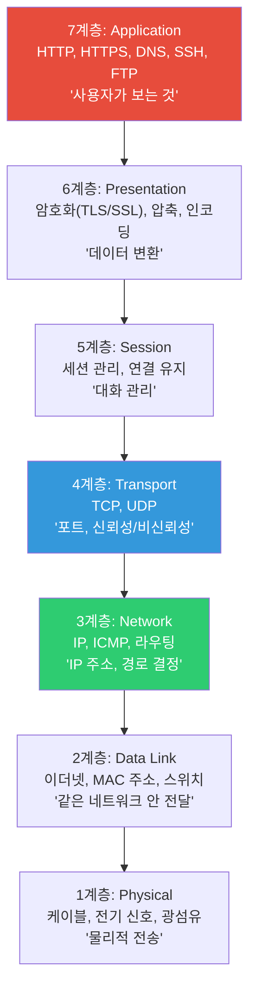
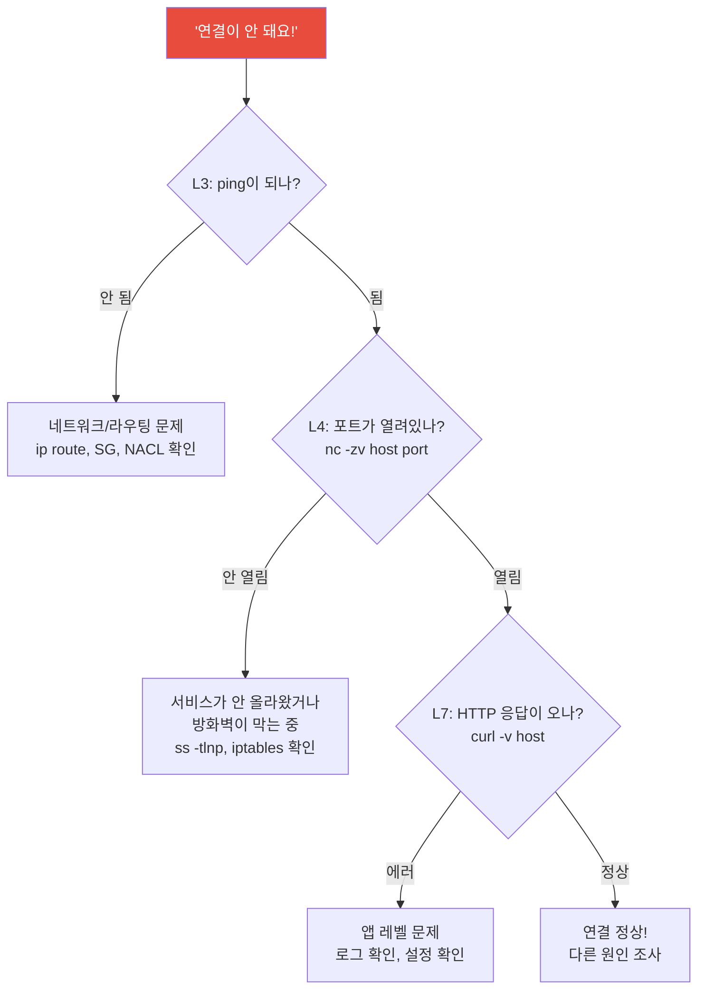
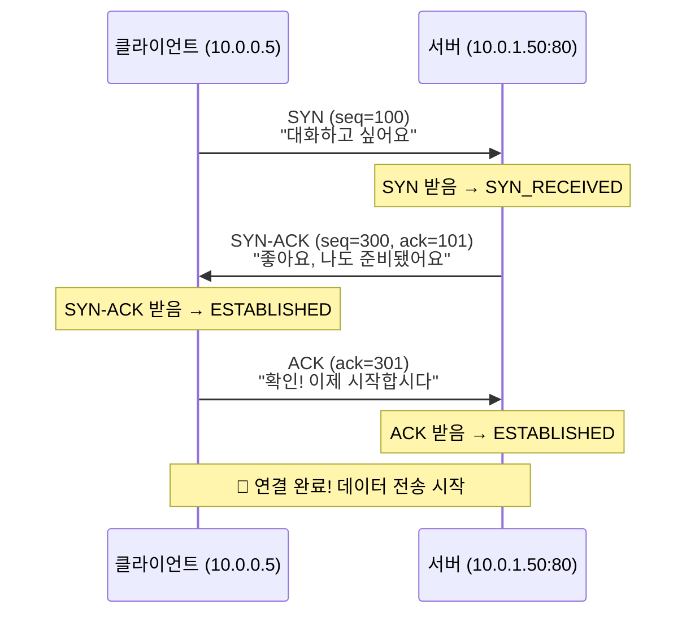
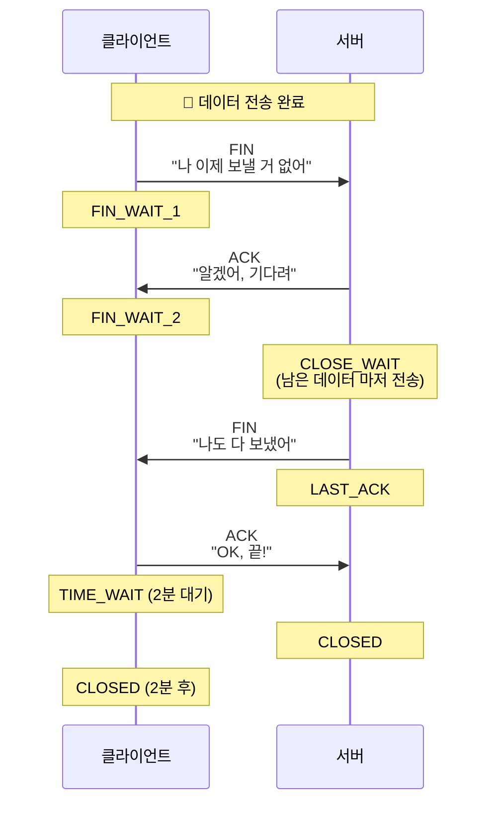
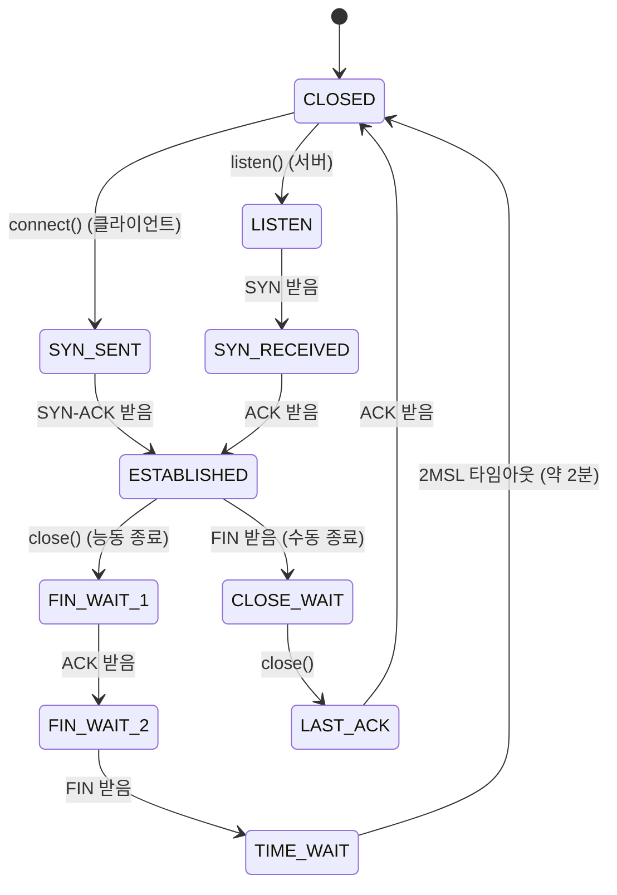
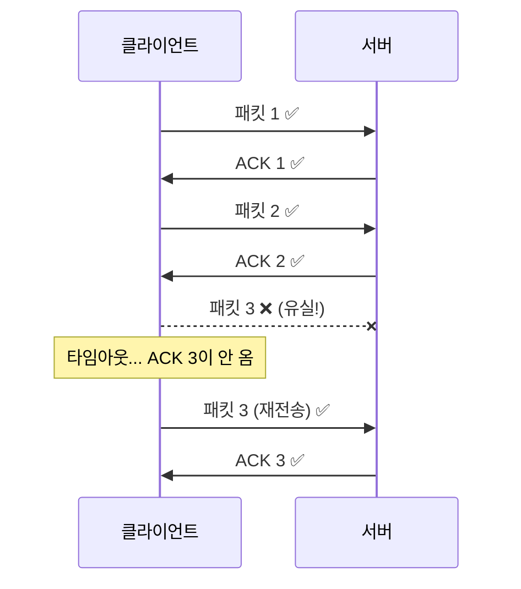
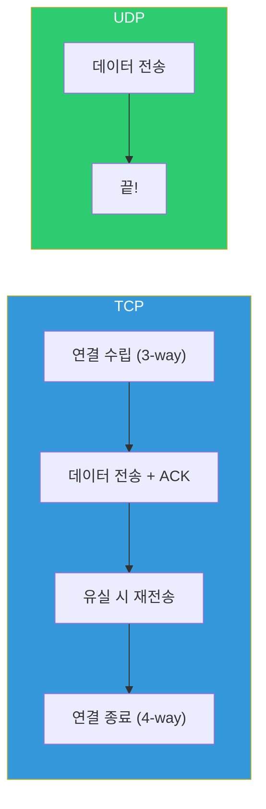
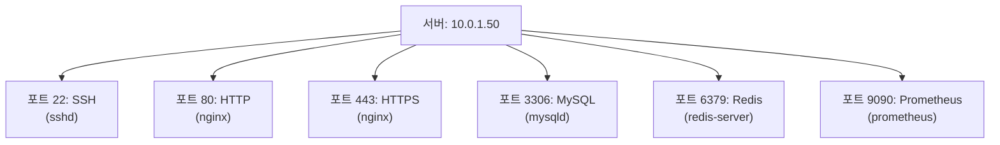
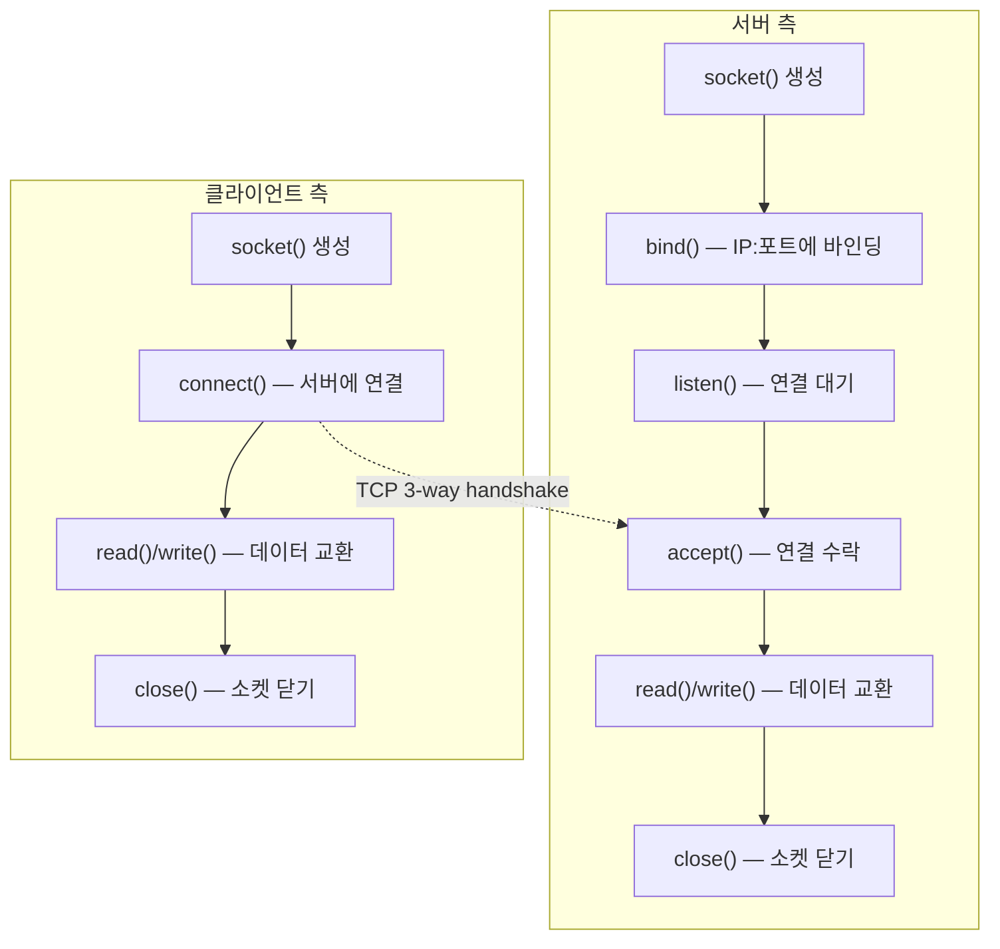

# 네트워크 기초 (OSI / TCP / UDP / ports / sockets)

> 서버는 혼자서 존재하지 않아요. 다른 서버, 클라이언트, DB, 외부 API와 끊임없이 대화해요. 이 대화가 어떻게 이루어지는지 — 그 근본 원리를 이번에 배워볼게요. 이걸 모르면 네트워크 장애가 나도 "뭐가 문제인지" 자체를 못 파악해요.

---

## 🎯 이걸 왜 알아야 하나?

```
실무에서 네트워크 지식이 필요한 순간:
• "앱이 DB에 연결이 안 돼요"            → TCP 연결 문제인지, 포트가 안 열린 건지
• "간헐적으로 패킷이 유실돼요"           → TCP vs UDP 특성 이해
• "로드밸런서가 L4인지 L7인지 뭐가 다르죠?" → OSI 계층 이해
• "소켓이 TIME_WAIT 상태로 쌓이고 있어요"  → TCP 연결 상태 이해
• "서버 간 통신이 느려요"                → 어느 계층에서 병목인지 진단
```

[이전 강의(Linux 네트워크 명령어)](../01-linux/09-network-commands)에서 `ss`, `tcpdump`, `ping` 같은 도구를 배웠죠? 이번에는 그 도구들이 보여주는 정보의 **의미**를 이해하는 거예요.

---

## 🧠 핵심 개념

### 비유: 택배 시스템

네트워크를 **택배 시스템**으로 비유해볼게요.

* **IP 주소** = 배송 주소 (서울시 강남구 테헤란로 123)
* **포트(Port)** = 주소 안의 받는 사람 (123번지 **김웹서버씨**, **이디비씨**)
* **TCP** = 등기 택배. 받는 사람이 받았다고 서명해야 완료. 느리지만 확실함
* **UDP** = 일반 우편. 그냥 보내면 끝. 빠르지만 도착을 보장 안 함
* **소켓(Socket)** = 택배 접수/수령 창구. 택배를 보내고 받는 실제 통로
* **OSI 모델** = 택배가 접수 → 포장 → 라벨 → 트럭 → 배송되는 전체 과정을 7단계로 나눈 것

---

## 🔍 상세 설명 — OSI 모델

### OSI 7계층

네트워크 통신을 7개 층으로 나눈 참조 모델이에요. 실무에서 모든 계층을 세세히 알 필요는 없지만, **어떤 문제가 어떤 계층에서 발생하는지** 구분할 수 있어야 해요.



**DevOps가 주로 다루는 계층:**

| 계층 | DevOps가 아는 것 | 관련 도구/기술 |
|------|-----------------|---------------|
| **L7 (Application)** | HTTP 상태 코드, DNS 조회, API | curl, dig, Nginx, ALB |
| **L4 (Transport)** | TCP/UDP, 포트, 연결 상태 | ss, netstat, NLB, iptables |
| **L3 (Network)** | IP, 라우팅, 서브넷 | ip route, ping, traceroute, VPC |
| **L2 (Data Link)** | MAC, ARP (간접적으로) | ip neigh, 스위치 |

```bash
# 각 계층의 문제를 진단하는 도구

# L1/L2: 물리 연결, MAC
ip link show eth0                     # 인터페이스 상태 (UP인지?)
ethtool eth0                          # 링크 속도, 케이블 상태
ip neigh                              # ARP 테이블

# L3: IP, 라우팅
ping -c 3 10.0.2.10                   # IP 연결 가능?
traceroute 10.0.2.10                  # 경로 추적
ip route get 10.0.2.10                # 라우팅 확인

# L4: TCP/UDP, 포트
ss -tlnp                              # 열린 포트
nc -zv 10.0.2.10 3306                 # TCP 포트 연결 테스트
tcpdump -i eth0 port 80               # 패킷 캡처

# L7: 애플리케이션
curl -v http://10.0.2.10/api/health   # HTTP 요청/응답
dig example.com                        # DNS 조회
```

### 실무에서 계층별 장애 진단



### TCP/IP 4계층 (실무 모델)

OSI 7계층은 이론이고, 실무에서는 **TCP/IP 4계층**을 더 많이 언급해요.

```
OSI 7계층           TCP/IP 4계층
─────────           ────────────
7. Application  ┐
6. Presentation ├── Application     (HTTP, DNS, SSH, TLS)
5. Session      ┘
4. Transport    ─── Transport       (TCP, UDP)
3. Network      ─── Internet        (IP, ICMP)
2. Data Link    ┐
1. Physical     ┘── Network Access  (Ethernet, WiFi)
```

---

## 🔍 상세 설명 — TCP

### TCP란?

**Transmission Control Protocol**. 데이터를 **신뢰성 있게, 순서대로** 전달해요. 웹, DB, SSH 등 대부분의 통신에 사용돼요.

**TCP의 특징:**
* **연결 지향(Connection-oriented)** — 통신 전에 연결을 먼저 맺음
* **신뢰성(Reliability)** — 패킷 유실 시 재전송
* **순서 보장(Ordering)** — 보낸 순서대로 도착
* **흐름 제어(Flow Control)** — 수신자가 처리할 수 있는 속도에 맞춤
* **혼잡 제어(Congestion Control)** — 네트워크가 혼잡하면 속도 줄임

### TCP 3-Way Handshake (연결 수립)

TCP가 통신을 시작하기 전에 반드시 거치는 3단계예요. [tcpdump](../01-linux/09-network-commands)에서 봤던 SYN, SYN-ACK, ACK가 바로 이거예요.



**비유:** 전화 거는 것과 같아요.
1. **SYN** → "여보세요?" (전화 걸기)
2. **SYN-ACK** → "네, 여보세요?" (전화 받기)
3. **ACK** → "잘 들려요, 말씀하세요" (확인)

```bash
# tcpdump로 실제 3-way handshake 관찰
sudo tcpdump -i eth0 -nn port 80 -c 5

# 출력:
# 14:30:00.001 IP 10.0.0.5.54321 > 10.0.1.50.80: Flags [S], seq 100
# 14:30:00.001 IP 10.0.1.50.80 > 10.0.0.5.54321: Flags [S.], seq 300, ack 101
# 14:30:00.002 IP 10.0.0.5.54321 > 10.0.1.50.80: Flags [.], ack 301
#                                                         ^^^
#                                                   [S]=SYN [S.]=SYN-ACK [.]=ACK
```

### TCP 4-Way Handshake (연결 종료)

연결을 끊을 때는 4단계를 거쳐요.



### TCP 연결 상태 전체 흐름

[이전 강의](../01-linux/09-network-commands)에서 `ss`로 봤던 상태들의 전체 그림이에요.



**실무에서 주목해야 할 상태:**

| 상태 | 의미 | 많으면? | 조치 |
|------|------|--------|------|
| `ESTABLISHED` | 정상 연결 중 | 정상 (트래픽 비례) | — |
| `TIME_WAIT` | 종료 후 2분 대기 | 연결 빈번 | sysctl 튜닝 |
| `CLOSE_WAIT` | 상대가 끊었는데 내가 안 닫음 | ⚠️ **앱 버그!** | 코드 수정 |
| `SYN_RECEIVED` | 연결 수락 대기 중 | ⚠️ SYN flood 공격? | syncookies |

```bash
# 상태별 카운트 확인
ss -tan | awk '{print $1}' | sort | uniq -c | sort -rn
#  200 ESTAB
#   50 TIME-WAIT
#    5 CLOSE-WAIT      ← 있으면 주의!
#    2 LISTEN
#    1 State

# TIME_WAIT 관련 sysctl 튜닝
# (이전 강의 참고: ../01-linux/13-kernel)
sudo sysctl net.ipv4.tcp_tw_reuse=1        # TIME_WAIT 소켓 재사용
sudo sysctl net.ipv4.tcp_fin_timeout=30     # FIN_WAIT_2 타임아웃 (기본 60초→30초)

# CLOSE_WAIT가 쌓이면 → 앱이 소켓을 close()하지 않는 버그
# → 앱 코드에서 connection close 확인!
```

### TCP 재전송과 타임아웃

TCP는 패킷이 유실되면 자동으로 재전송해요. 이게 "신뢰성"의 핵심이에요.



```bash
# TCP 재전송 관련 커널 파라미터
sysctl net.ipv4.tcp_retries2
# 15    ← 최대 15번 재전송 시도 (약 13~30분)

# 재전송 통계 확인
ss -ti
# ESTAB  ... rto:200 rtt:0.5/0.25 ... retrans:0/3
#             ^^^                       ^^^^^^^^^
#             재전송 타임아웃(ms)         현재/전체 재전송 횟수

# 재전송이 많은 연결 찾기
ss -ti | grep retrans | grep -v "retrans:0/0"
# → retrans 수치가 높으면 네트워크 품질 문제
```

---

## 🔍 상세 설명 — UDP

### UDP란?

**User Datagram Protocol**. 데이터를 **빠르게, 단순하게** 전달해요. TCP처럼 연결을 맺거나 재전송을 하지 않아요.

**UDP의 특징:**
* **비연결(Connectionless)** — 연결 없이 바로 전송
* **비신뢰성** — 유실되어도 재전송 안 함
* **순서 보장 안 함** — 보낸 순서와 다르게 도착할 수 있음
* **빠름** — 연결 과정, 확인 과정이 없으니까
* **가벼움** — 헤더가 8바이트(TCP는 20~60바이트)

### TCP vs UDP 비교

| 비교 | TCP | UDP |
|------|-----|-----|
| 연결 | 연결형 (handshake) | 비연결형 |
| 신뢰성 | 보장 (재전송) | 미보장 |
| 순서 | 보장 | 미보장 |
| 속도 | 상대적으로 느림 | 빠름 |
| 오버헤드 | 큼 (20~60B 헤더) | 작음 (8B 헤더) |
| 흐름/혼잡 제어 | 있음 | 없음 |
| 용도 | HTTP, SSH, DB, 파일 전송 | DNS, 비디오 스트리밍, 게임, VoIP |



**비유:**
* **TCP** = 등기 택배. 수신 확인, 파손 시 재배송, 추적 가능. 느리지만 확실.
* **UDP** = 전단지 뿌리기. 그냥 던져! 못 받으면 어쩔 수 없어. 빠르고 대량 가능.

### UDP가 쓰이는 곳

```bash
# DNS (포트 53) — 빠른 조회가 중요
dig google.com
# 응답이 빨라야 하니까 UDP! (큰 응답은 TCP로 전환)

# DHCP (포트 67, 68) — IP 주소 자동 할당
# 아직 IP가 없는 상태에서 요청하니까 UDP!

# NTP (포트 123) — 시간 동기화
# 정확한 시간이 중요하니까 가벼운 UDP!

# 비디오 스트리밍, 음성 통화 (RTP)
# 패킷 하나 유실되면 살짝 끊기는 것 뿐. 재전송하면 오히려 더 느려짐!

# syslog 원격 전송 (포트 514)
# 로그 하나 유실돼도 큰 문제 없으니까 UDP로 빠르게

# 열린 UDP 포트 확인
ss -ulnp
# State  Recv-Q  Send-Q  Local Address:Port  Process
# UNCONN 0       0       127.0.0.53%lo:53     users:(("systemd-resolve",...))
# UNCONN 0       0       0.0.0.0:68           users:(("dhclient",...))
# UNCONN 0       0       0.0.0.0:123          users:(("ntpd",...))
```

---

## 🔍 상세 설명 — 포트 (Ports)

### 포트란?

IP 주소가 건물 주소라면, 포트는 **건물 안의 호실 번호**예요. 하나의 서버(IP)에서 여러 서비스가 동시에 돌아가려면 포트로 구분해야 해요.



### 포트 범위

| 범위 | 이름 | 설명 |
|------|------|------|
| 0~1023 | Well-known Ports | 표준 서비스용. root만 바인딩 가능 |
| 1024~49151 | Registered Ports | 앱이 등록해서 사용 |
| 49152~65535 | Dynamic/Ephemeral Ports | 클라이언트가 임시로 사용 |

### 자주 쓰는 포트 번호 (★ 외워야!)

| 포트 | 프로토콜 | 서비스 | 실무 빈도 |
|------|---------|--------|----------|
| 22 | TCP | SSH | ⭐⭐⭐⭐⭐ |
| 80 | TCP | HTTP | ⭐⭐⭐⭐⭐ |
| 443 | TCP | HTTPS | ⭐⭐⭐⭐⭐ |
| 53 | TCP/UDP | DNS | ⭐⭐⭐⭐ |
| 3306 | TCP | MySQL | ⭐⭐⭐⭐ |
| 5432 | TCP | PostgreSQL | ⭐⭐⭐⭐ |
| 6379 | TCP | Redis | ⭐⭐⭐⭐ |
| 27017 | TCP | MongoDB | ⭐⭐⭐ |
| 9090 | TCP | Prometheus | ⭐⭐⭐ |
| 3000 | TCP | Grafana | ⭐⭐⭐ |
| 8080 | TCP | 대체 HTTP / 앱 서버 | ⭐⭐⭐ |
| 8443 | TCP | 대체 HTTPS | ⭐⭐⭐ |
| 2379 | TCP | etcd (K8s) | ⭐⭐⭐ |
| 6443 | TCP | K8s API Server | ⭐⭐⭐ |
| 10250 | TCP | kubelet | ⭐⭐⭐ |
| 25 | TCP | SMTP (메일) | ⭐⭐ |
| 5672 | TCP | RabbitMQ | ⭐⭐ |
| 9092 | TCP | Kafka | ⭐⭐ |
| 9200 | TCP | Elasticsearch | ⭐⭐ |

```bash
# 포트 이름 ↔ 번호 매핑 파일
grep -E "^(ssh|http|https|mysql|postgresql|redis)" /etc/services
# ssh             22/tcp
# http            80/tcp
# https           443/tcp
# mysql           3306/tcp
# postgresql      5432/tcp

# 포트 확인 실무 명령어 (복습)
ss -tlnp                              # 열린 TCP 포트
ss -ulnp                              # 열린 UDP 포트
sudo lsof -i :80                      # 80번 포트 사용 프로세스
nc -zv 10.0.2.10 3306                  # 원격 포트 연결 테스트
```

### Ephemeral 포트 (클라이언트 포트)

클라이언트가 서버에 연결할 때, 클라이언트 쪽에서도 포트가 하나 사용돼요. 이걸 **ephemeral(임시) 포트**라고 해요.

```bash
# 예: 내 PC(10.0.0.5)에서 웹서버(10.0.1.50:80)에 접속
# 연결: 10.0.0.5:54321 → 10.0.1.50:80
#                ^^^^^
#                ephemeral 포트 (커널이 랜덤 할당)

# 현재 시스템의 ephemeral 포트 범위
cat /proc/sys/net/ipv4/ip_local_port_range
# 32768   60999

# 대량 연결 시 ephemeral 포트 부족 문제가 생길 수 있어요
# 범위를 넓히려면:
sudo sysctl net.ipv4.ip_local_port_range="1024 65535"

# 현재 사용 중인 ephemeral 포트 수
ss -tan | awk '{print $4}' | grep -oP ':\K[0-9]+' | awk '$1>32767' | wc -l
# 150    ← 150개 사용 중
```

---

## 🔍 상세 설명 — 소켓 (Sockets)

### 소켓이란?

소켓은 네트워크 통신의 **양쪽 끝점(endpoint)**이에요. 프로그램이 네트워크로 데이터를 보내고 받으려면 반드시 소켓을 열어야 해요.

**소켓 = IP 주소 + 포트 번호 + 프로토콜(TCP/UDP)의 조합**

```bash
# 하나의 TCP 연결은 소켓 쌍으로 정의됨:
# (클라이언트 IP:포트, 서버 IP:포트)
# 예: (10.0.0.5:54321, 10.0.1.50:80)

# 같은 서버 포트에 여러 클라이언트가 연결 가능!
# (10.0.0.5:54321, 10.0.1.50:80)  ← 클라이언트 A
# (10.0.0.5:54322, 10.0.1.50:80)  ← 클라이언트 A의 다른 연결
# (10.0.0.10:60000, 10.0.1.50:80) ← 클라이언트 B
# → 서버의 80 포트 하나에 수천 개 연결 가능!
```

### 소켓의 라이프사이클



```bash
# 서버의 소켓 상태를 ss로 관찰

# LISTEN 소켓: 서버가 연결을 기다리는 중
ss -tlnp
# State   Local Address:Port    Process
# LISTEN  0.0.0.0:80             nginx      ← bind() + listen() 완료

# ESTAB 소켓: 데이터 교환 중
ss -tnp
# State   Local Address:Port    Peer Address:Port   Process
# ESTAB   10.0.1.50:80          10.0.0.5:54321      nginx   ← accept() 후

# 프로세스의 열린 소켓 수
ls /proc/$(pgrep -o nginx)/fd | wc -l
# 150

# 소켓 관련 에러: "Too many open files"
# → ulimit 확인! (../01-linux/13-kernel 참고)
```

### Unix 소켓 (로컬 통신)

같은 서버 안에서 프로세스 간 통신할 때는 TCP/UDP 대신 **Unix 소켓**을 쓸 수 있어요. 더 빠르고 오버헤드가 적어요.

```bash
# Unix 소켓 확인
ss -xlnp
# Netid  State   Recv-Q  Send-Q  Local Address:Port  Process
# u_str  LISTEN  0       128     /var/run/docker.sock         users:(("dockerd",...))
# u_str  LISTEN  0       128     /run/php/php-fpm.sock        users:(("php-fpm",...))
# u_str  LISTEN  0       128     /var/run/mysqld/mysqld.sock  users:(("mysqld",...))

# Docker 소켓에 curl로 API 호출
curl --unix-socket /var/run/docker.sock http://localhost/containers/json | python3 -m json.tool

# Nginx에서 PHP-FPM을 Unix 소켓으로 연결 (TCP보다 빠름)
# Nginx 설정:
# fastcgi_pass unix:/run/php/php-fpm.sock;
#
# vs TCP로 연결:
# fastcgi_pass 127.0.0.1:9000;
```

---

## 💻 실습 예제

### 실습 1: TCP 3-way Handshake 관찰

```bash
# 터미널 1: tcpdump 시작
sudo tcpdump -i lo -nn port 8080 -c 10

# 터미널 2: 간단한 서버 실행
python3 -m http.server 8080 &

# 터미널 3: 접속
curl http://localhost:8080/

# 터미널 1에서 관찰:
# [S]   → SYN (연결 시작)
# [S.]  → SYN-ACK (연결 수락)
# [.]   → ACK (확인, handshake 완료)
# [P.]  → PUSH-ACK (HTTP GET 요청)
# [P.]  → PUSH-ACK (HTTP 200 응답)
# [F.]  → FIN (연결 종료 시작)
# [.]   → ACK
# [F.]  → FIN
# [.]   → ACK

# 정리
kill %1
```

### 실습 2: TCP 연결 상태 관찰

```bash
# 1. 연결 상태 분포 확인
ss -tan | awk 'NR>1 {print $1}' | sort | uniq -c | sort -rn
#  200 ESTAB
#   50 TIME-WAIT
#    5 LISTEN

# 2. TIME_WAIT 소켓이 어디에 연결됐는지
ss -tan state time-wait | awk '{print $4, $5}' | head -10

# 3. 특정 서버로의 연결 수
ss -tan | grep "10.0.2.10" | awk '{print $1}' | sort | uniq -c
#  10 ESTAB
#   3 TIME-WAIT

# 4. CLOSE_WAIT 확인 (있으면 앱 버그!)
ss -tan state close-wait
# 결과가 있으면 해당 프로세스의 코드 확인 필요
```

### 실습 3: 포트 스캔과 연결 테스트

```bash
# 1. 이 서버에서 열린 포트 확인
ss -tlnp
# 어떤 포트가 열려있는지, 어떤 프로세스인지

# 2. 원격 서버의 특정 포트 테스트
nc -zv localhost 22
# Connection to localhost 22 port [tcp/ssh] succeeded!

nc -zv localhost 3306 2>&1
# nc: connect to localhost port 3306 (tcp) failed: Connection refused
# → MySQL이 안 돌고 있거나 바인딩 안 됨

# 3. 여러 포트 한번에 스캔
for port in 22 80 443 3306 5432 6379 8080 9090; do
    nc -zv -w 2 localhost $port 2>&1 | grep -E "succeeded|refused|timed"
done
# localhost 22 port [tcp/ssh] succeeded!
# localhost 80 port [tcp/http] succeeded!
# localhost 443 (tcp) failed: Connection refused
# ...

# 4. UDP 포트 테스트 (TCP와 다름!)
nc -zuv localhost 53
# Connection to localhost 53 port [tcp/domain] succeeded!
```

### 실습 4: 소켓과 프로세스 관계 파악

```bash
# 1. Nginx가 열고 있는 소켓 수
NGINX_PID=$(pgrep -o nginx)
ls /proc/$NGINX_PID/fd 2>/dev/null | wc -l
# 50

# 2. 어떤 타입의 fd인지 확인
ls -la /proc/$NGINX_PID/fd/ 2>/dev/null | head -10
# lr-x------ ... 0 -> /dev/null
# l-wx------ ... 1 -> /var/log/nginx/access.log
# l-wx------ ... 2 -> /var/log/nginx/error.log
# lrwx------ ... 6 -> socket:[12345]          ← 네트워크 소켓!
# lrwx------ ... 7 -> socket:[12346]

# 3. lsof로 더 자세히
sudo lsof -p $NGINX_PID -i 2>/dev/null | head -10
# nginx 900 root  6u IPv4 12345 0t0 TCP *:http (LISTEN)
# nginx 901 www   10u IPv4 23456 0t0 TCP 10.0.1.50:http->10.0.0.5:54321 (ESTABLISHED)

# 4. 시스템 전체 소켓 통계
ss -s
# Total: 500
# TCP:   350 (estab 200, closed 50, orphaned 5, timewait 50)
# UDP:   10
# RAW:   0
```

---

## 🏢 실무에서는?

### 시나리오 1: "앱이 DB에 연결이 안 돼요"

```bash
# 1단계: DB 서버까지 네트워크가 되는지 (L3)
ping -c 3 10.0.2.10
# 64 bytes from 10.0.2.10: icmp_seq=1 ttl=64 time=0.5ms    ← OK

# 2단계: DB 포트가 열려있는지 (L4)
nc -zv 10.0.2.10 3306
# Connection to 10.0.2.10 3306 port [tcp/mysql] succeeded!   ← OK
# 또는
# nc: connect to 10.0.2.10 port 3306 (tcp) failed: Connection refused  ← 실패!

# 실패하면 체크:
# a. DB 서비스가 돌고 있나?
ssh 10.0.2.10 "ss -tlnp | grep 3306"
# LISTEN 0  128  127.0.0.1:3306  ...
#                ^^^^^^^^^
#                127.0.0.1! 로컬에서만 접속 가능하게 바인딩됨!

# b. DB 바인딩 주소 변경
# /etc/mysql/mysql.conf.d/mysqld.cnf
# bind-address = 0.0.0.0    # 모든 IP에서 접속 허용
# 또는
# bind-address = 10.0.2.10  # 특정 IP만

# c. 방화벽 확인
# 서버 측: iptables
ssh 10.0.2.10 "sudo iptables -L INPUT -n | grep 3306"
# 클라우드: Security Group에 3306 포트 허용됐는지 확인

# 3단계: 앱 레벨 연결 테스트 (L7)
mysql -h 10.0.2.10 -u myuser -p
# ERROR 1045 (28000): Access denied for user 'myuser'@'10.0.1.50'
# → 네트워크는 되는데 DB 인증 문제!
```

### 시나리오 2: TIME_WAIT 소켓 폭증

```bash
# 상황: 서버가 느려지고, 새 연결이 안 됨
ss -tan state time-wait | wc -l
# 28000   ← 28,000개! ephemeral 포트가 거의 소진

# 원인: 앱이 짧은 연결을 반복적으로 맺고 끊음
# HTTP Keep-Alive를 안 쓰거나, 커넥션 풀을 안 쓰는 경우

# 즉시 조치: 커널 파라미터 튜닝
sudo sysctl net.ipv4.tcp_tw_reuse=1              # TIME_WAIT 재사용
sudo sysctl net.ipv4.ip_local_port_range="1024 65535"  # 포트 범위 확장
sudo sysctl net.ipv4.tcp_fin_timeout=15           # FIN 타임아웃 줄이기

# 근본 해결:
# 1. HTTP Keep-Alive 활성화 (Nginx)
#    keepalive_timeout 65;
#
# 2. DB/Redis 커넥션 풀 사용
#    → 연결을 맺고 끊지 않고 재사용
#
# 3. 업스트림에 keepalive 설정 (Nginx → 앱서버)
#    upstream backend {
#        server 10.0.1.60:8080;
#        keepalive 32;
#    }
```

### 시나리오 3: L4 vs L7 로드밸런서 차이 이해하기

```bash
# 면접/실무에서 자주 나오는 질문:
# "L4 로드밸런서와 L7 로드밸런서의 차이가 뭔가요?"

# L4 (Transport 계층):
# → IP + 포트만 보고 분배
# → TCP 연결 자체를 전달 (패킷 단위)
# → 빠르지만 HTTP 내용을 볼 수 없음
# → AWS NLB, HAProxy (TCP mode)

# L7 (Application 계층):
# → HTTP 헤더, URL, 쿠키 등 내용을 보고 분배
# → "URL이 /api/*이면 백엔드 A, /static/*이면 백엔드 B"
# → TLS 종단, HTTP 리다이렉트, 인증 등 가능
# → AWS ALB, Nginx, HAProxy (HTTP mode)

# 정리:
# L4: 봉투(IP+포트)만 보고 배달
# L7: 봉투를 열어서 편지 내용(HTTP)까지 보고 배달

# → 다음 강의(02-http)와 06-load-balancing.md에서 더 자세히 다룸!
```

### 시나리오 4: SYN flood 공격 감지

```bash
# SYN_RECEIVED 상태가 비정상적으로 많으면 공격 의심
ss -tan state syn-recv | wc -l
# 5000   ← 비정상!

# 공격 IP 확인
ss -tan state syn-recv | awk '{print $5}' | cut -d: -f1 | sort | uniq -c | sort -rn | head
#  2000 185.220.101.42
#  1500 103.145.12.88
#  1000 45.227.254.20

# 대응: SYN cookies 활성화
sudo sysctl net.ipv4.tcp_syncookies=1    # 이미 기본 활성화

# backlog 늘리기
sudo sysctl net.ipv4.tcp_max_syn_backlog=65535
sudo sysctl net.core.somaxconn=65535

# 특정 IP 차단
sudo iptables -A INPUT -s 185.220.101.42 -j DROP
```

---

## ⚠️ 자주 하는 실수

### 1. ping이 안 되면 "서버가 죽었다"고 판단

```bash
# ❌ ping이 안 된다고 서버가 죽은 건 아님!
ping 10.0.1.50
# 100% packet loss

# → AWS Security Group에서 ICMP를 차단하고 있을 수 있음!
# → TCP 포트 확인으로 더 정확하게
nc -zv 10.0.1.50 22    # SSH 포트로 확인
# Connection succeeded!  ← 서버는 살아있음!
```

### 2. 0.0.0.0과 127.0.0.1의 차이를 모르기

```bash
# 0.0.0.0:3306  → 모든 인터페이스에서 접속 가능 (외부 포함!)
# 127.0.0.1:3306 → 로컬(이 서버)에서만 접속 가능

# ❌ DB가 0.0.0.0으로 열려있으면 외부에서 접근 가능! (보안 위험)
ss -tlnp | grep 3306
# LISTEN  0.0.0.0:3306    ← 위험!

# ✅ 로컬에서만 접근 가능하게
# bind-address = 127.0.0.1
ss -tlnp | grep 3306
# LISTEN  127.0.0.1:3306  ← 안전
```

### 3. CLOSE_WAIT를 네트워크 문제로 착각

```bash
# ❌ "네트워크가 이상한 거 아닌가요?"
# → CLOSE_WAIT는 네트워크 문제가 아니라 앱 버그!
# → 상대가 FIN을 보냈는데 우리 앱이 close()를 안 하는 것

# ✅ 앱 코드에서 소켓/커넥션 close 확인
# connection.close() 또는 try-with-resources 사용
```

### 4. 포트 번호를 안 외우고 매번 찾기

```bash
# 기본 포트는 외워두면 디버깅이 빨라져요
# 최소한 이것만: 22(SSH), 80(HTTP), 443(HTTPS),
# 3306(MySQL), 5432(PostgreSQL), 6379(Redis),
# 53(DNS), 6443(K8s API)
```

### 5. TCP와 UDP를 구분하지 않고 테스트

```bash
# ❌ TCP 도구로 UDP 서비스 테스트
nc -zv 10.0.1.50 53
# Connection refused    ← DNS가 안 된다고?

# ✅ UDP는 -u 옵션 필요!
nc -zuv 10.0.1.50 53
# Connection succeeded!  ← DNS는 UDP 53!

# ss에서도 마찬가지
ss -tlnp   # TCP만
ss -ulnp   # UDP만
ss -tulnp  # 둘 다
```

---

## 📝 정리

### OSI 모델 빠른 참조

```
L7 Application  — HTTP, DNS, SSH           → curl, dig
L4 Transport    — TCP, UDP, 포트           → ss, nc, tcpdump
L3 Network      — IP, 라우팅               → ping, traceroute, ip route
L2 Data Link    — MAC, 이더넷              → ip neigh
L1 Physical     — 케이블                    → ethtool
```

### TCP vs UDP 한눈에

```
TCP: 연결형, 신뢰성, 순서 보장, 느림  → HTTP, SSH, DB, 파일 전송
UDP: 비연결, 비신뢰, 순서 없음, 빠름  → DNS, 스트리밍, 게임, NTP
```

### 필수 포트 번호

```
22=SSH  53=DNS  80=HTTP  443=HTTPS
3306=MySQL  5432=PostgreSQL  6379=Redis
6443=K8s API  9090=Prometheus  8080=대체 HTTP
```

### 장애 진단 순서

```
1. ping (L3 연결)
2. nc -zv host port (L4 포트)
3. curl -v (L7 애플리케이션)
4. tcpdump (패킷 레벨 확인)
```

---

## 🔗 다음 강의

다음은 **[02-networking/02-http](./02-http)** — HTTP 에코시스템 (HTTP/1.1 ~ HTTP/3 / QUIC / gRPC / WebSocket) 이에요.

TCP/UDP 위에서 동작하는 **HTTP** 프로토콜을 깊이 파볼게요. HTTP 상태 코드, 헤더, Keep-Alive, 버전별 차이, 그리고 gRPC와 WebSocket까지 — 웹 기반 서비스의 통신 프로토콜을 완벽히 이해하는 시간이에요.
