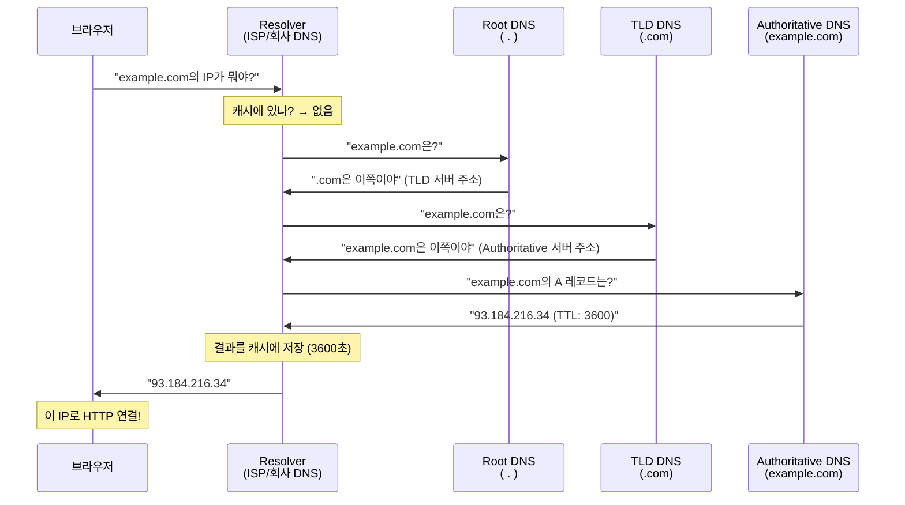
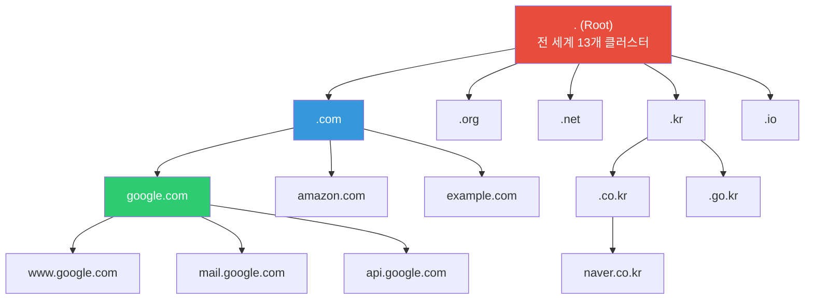
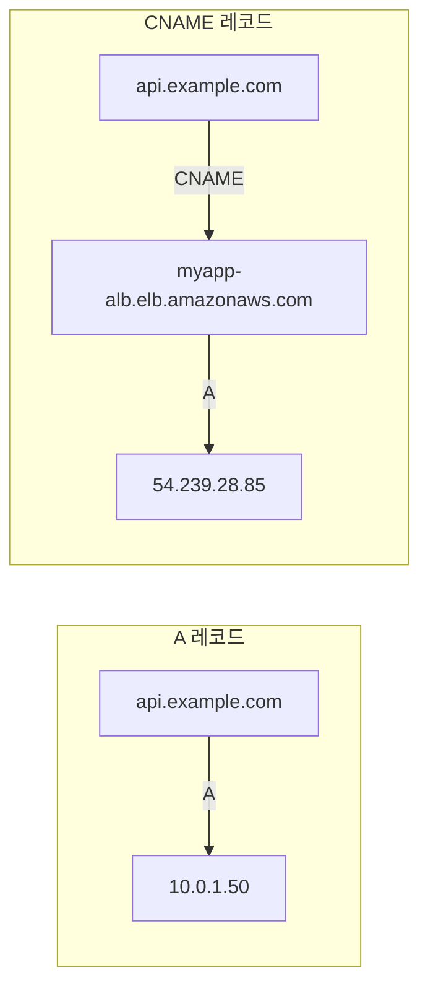
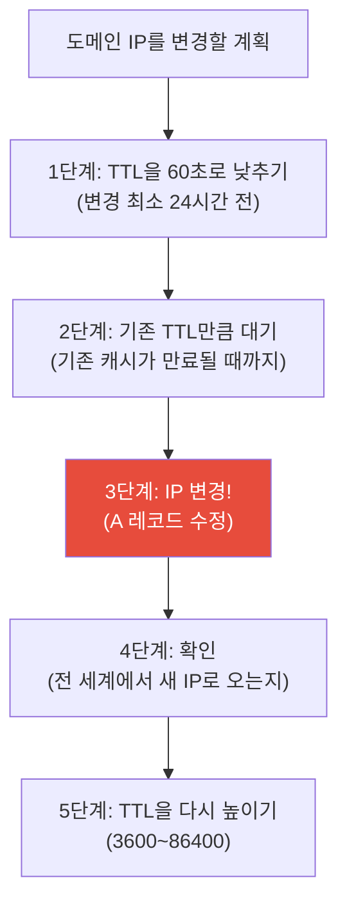
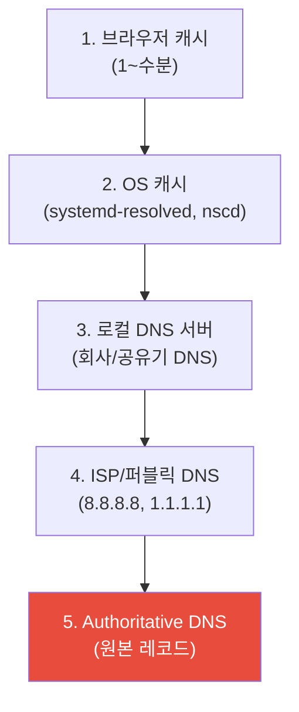

# DNS (recursive resolver / authoritative / record types / caching)

> 브라우저에 `google.com`을 치면 어떻게 서버를 찾을까요? DNS는 인터넷의 전화번호부예요. 도메인 이름을 IP 주소로 바꿔주는 시스템이에요. DNS가 안 되면 인터넷 자체가 안 되고, DNS가 느리면 모든 것이 느려져요.

---

## 🎯 이걸 왜 알아야 하나?

```
실무에서 DNS 관련 작업:
• 새 서비스 도메인 등록/설정           → A, CNAME 레코드 추가
• "사이트가 안 열려요"                → DNS 문제인지 서버 문제인지 진단
• 도메인 이전/변경                    → TTL 전략, 레코드 변경
• 이메일 발신 문제                    → MX, SPF, DKIM, DMARC 레코드
• SSL 인증서 발급                     → DNS 검증 (TXT 레코드)
• CDN / 로드밸런싱                    → CNAME, Weighted routing
• "DNS 전파가 안 돼요"               → TTL, 캐시, 전파 과정 이해
• 내부 서비스 디스커버리               → 프라이빗 DNS, CoreDNS
```

---

## 🧠 핵심 개념

### 비유: 전화번호부 + 안내 데스크

DNS를 **전화번호부 시스템**에 비유해볼게요.

* **도메인 이름** = 사람 이름 ("김구글")
* **IP 주소** = 전화번호 ("142.250.196.110")
* **DNS 서버** = 안내 데스크. "김구글의 전화번호가 뭐예요?" 하면 알려줌
* **DNS 캐시** = 최근에 물어본 번호를 메모해둔 것. 다음에 또 물어보면 빠르게 답변
* **TTL** = 메모의 유효기간. "이 번호는 1시간 동안 유효해요" (시간 지나면 다시 물어봐야 함)

### DNS 조회 전체 흐름



---

## 🔍 상세 설명 — DNS 구조

### DNS 계층 구조

DNS는 트리 구조로 되어 있어요. 맨 꼭대기에 Root, 그 아래 TLD, 그 아래 각 도메인이에요.



```
도메인 이름을 오른쪽부터 읽으면:
www.api.example.com.
 ^   ^    ^      ^  ^
 |   |    |      |  └─ Root (보통 생략)
 |   |    |      └─ TLD (Top-Level Domain)
 |   |    └─ Second-Level Domain (SLD)
 |   └─ Subdomain
 └─ Subdomain
```

### DNS 서버 종류

| 서버 | 역할 | 비유 | 예시 |
|------|------|------|------|
| **Recursive Resolver** | 클라이언트 대신 찾아다니는 대리인 | 비서 ("제가 찾아올게요") | 8.8.8.8 (Google), 1.1.1.1 (Cloudflare), ISP DNS |
| **Root DNS** | 최상위. TLD 서버 위치를 알려줌 | 중앙 안내 데스크 | 전 세계 13개 (a~m.root-servers.net) |
| **TLD DNS** | .com, .net 등 도메인 관리 | 지역 안내 데스크 | Verisign (.com), KISA (.kr) |
| **Authoritative DNS** | 실제 도메인의 레코드를 보유 | 실제 전화번호부 | Route53, Cloudflare DNS, 가비아 |

```bash
# 각 단계를 직접 따라가 보기 (+trace 옵션)
dig +trace example.com

# .                        518400  IN  NS  a.root-servers.net.   ← Root
# .                        518400  IN  NS  b.root-servers.net.
# ...
# com.                     172800  IN  NS  a.gtld-servers.net.   ← TLD (.com)
# com.                     172800  IN  NS  b.gtld-servers.net.
# ...
# example.com.             172800  IN  NS  a.iana-servers.net.   ← Authoritative
# example.com.             172800  IN  NS  b.iana-servers.net.
# ...
# example.com.             86400   IN  A   93.184.216.34         ← 최종 답!
```

---

### DNS 레코드 타입 (★ 핵심!)

DNS 레코드는 "이 도메인에 대한 정보"예요. 종류가 여러 가지 있고, 실무에서 전부 다뤄요.

#### A 레코드 — 도메인 → IPv4

가장 기본적인 레코드. 도메인을 IPv4 주소로 매핑해요.

```bash
dig A example.com +short
# 93.184.216.34

dig A example.com
# ;; ANSWER SECTION:
# example.com.        86400   IN  A   93.184.216.34
#                      ^^^^^       ^   ^^^^^^^^^^^^^
#                      TTL(초)    타입  IP 주소

# 여러 A 레코드 (라운드 로빈 로드밸런싱)
dig A google.com +short
# 142.250.196.110
# 142.250.196.113
# 142.250.196.100
# 142.250.196.101
# → 클라이언트가 랜덤으로 하나를 선택
```

#### AAAA 레코드 — 도메인 → IPv6

```bash
dig AAAA google.com +short
# 2404:6800:4004:820::200e
```

#### CNAME 레코드 — 도메인 → 다른 도메인 (별명)

```bash
dig CNAME www.example.com +short
# example.com.
# → www.example.com은 example.com의 별명

# 실무에서 많이 쓰는 패턴:
# CDN 연결
# cdn.mysite.com → d1234567.cloudfront.net
#
# 로드밸런서 연결
# api.mysite.com → myapp-alb-123456.ap-northeast-2.elb.amazonaws.com
#
# SaaS 서비스 연결
# status.mysite.com → mycompany.statuspage.io
```

**A vs CNAME:**



```bash
# CNAME 주의사항:
# 1. Zone apex(루트 도메인)에는 CNAME 사용 불가!
#    ❌ example.com → CNAME → something.else.com
#    ✅ www.example.com → CNAME → something.else.com
#    ✅ example.com → A → 10.0.1.50
#
# 2. Route53의 Alias 레코드는 Zone apex에서도 ALB 연결 가능! (AWS 특수 기능)
#    example.com → Alias → myapp-alb.elb.amazonaws.com
```

#### MX 레코드 — 메일 서버

```bash
dig MX gmail.com +short
# 5 gmail-smtp-in.l.google.com.
# 10 alt1.gmail-smtp-in.l.google.com.
# 20 alt2.gmail-smtp-in.l.google.com.
# 30 alt3.gmail-smtp-in.l.google.com.
# 40 alt4.gmail-smtp-in.l.google.com.
# ^
# 우선순위 (낮을수록 먼저 시도)

# 이메일을 alice@gmail.com으로 보내면:
# 1. gmail.com의 MX 레코드 조회
# 2. 우선순위 5인 gmail-smtp-in.l.google.com에 먼저 전달
# 3. 실패하면 우선순위 10인 서버에 시도
```

#### TXT 레코드 — 텍스트 정보

다양한 용도로 사용되는 범용 레코드예요.

```bash
dig TXT example.com +short
# "v=spf1 include:_spf.google.com ~all"
# "google-site-verification=abc123..."

# 주요 용도:
# 1. SPF (이메일 스팸 방지) — 이 도메인에서 메일을 보낼 수 있는 서버 목록
# "v=spf1 include:_spf.google.com include:amazonses.com ~all"

# 2. DKIM (이메일 서명 검증)
# selector._domainkey.example.com → "v=DKIM1; p=MIGfMA0GCSqGSIb3..."

# 3. DMARC (이메일 정책)
# _dmarc.example.com → "v=DMARC1; p=reject; rua=mailto:dmarc@example.com"

# 4. 도메인 소유 확인 (SSL 인증서, Google Search Console 등)
# "google-site-verification=abc123..."

# 5. Let's Encrypt DNS 검증
# _acme-challenge.example.com → "AbCdEfGhIjKlMnOpQrStUvWxYz"
```

#### SRV 레코드 — 서비스 위치

특정 서비스의 호스트와 포트를 알려줘요.

```bash
dig SRV _sip._tcp.example.com +short
# 10 60 5060 sipserver.example.com.
# ^  ^  ^    ^
# 우선순위 가중치 포트 호스트

# 실무 활용:
# Kubernetes 서비스 디스커버리
# _http._tcp.myservice.default.svc.cluster.local
# → Pod의 IP와 포트를 반환

# 일반적으로 직접 설정할 일은 많지 않지만,
# K8s 내부 DNS(CoreDNS)에서 자동 생성됨
```

#### NS 레코드 — 네임서버 위임

```bash
dig NS example.com +short
# a.iana-servers.net.
# b.iana-servers.net.
# → 이 도메인의 DNS를 관리하는 서버

# 실무: 도메인 등록업체에서 네임서버 변경할 때
# 예: 가비아에서 Route53으로 변경
# 가비아 관리 화면에서 NS를 Route53의 NS로 변경:
# ns-123.awsdns-45.com.
# ns-678.awsdns-90.net.
# ns-111.awsdns-22.org.
# ns-333.awsdns-44.co.uk.
```

#### PTR 레코드 — IP → 도메인 (역방향)

```bash
# 정방향: 도메인 → IP (A 레코드)
dig A example.com +short
# 93.184.216.34

# 역방향: IP → 도메인 (PTR 레코드)
dig -x 93.184.216.34 +short
# → 이 IP가 어떤 도메인인지 (이메일 스팸 필터에서 사용)

# 실무: 메일 서버의 PTR이 설정 안 되면 스팸으로 분류될 수 있음
```

#### 레코드 타입 요약

| 타입 | 용도 | 예시 | 실무 빈도 |
|------|------|------|----------|
| **A** | 도메인 → IPv4 | example.com → 10.0.1.50 | ⭐⭐⭐⭐⭐ |
| **AAAA** | 도메인 → IPv6 | example.com → 2001:db8::1 | ⭐⭐ |
| **CNAME** | 도메인 → 다른 도메인 | www → example.com | ⭐⭐⭐⭐⭐ |
| **MX** | 메일 서버 | example.com → mail.example.com | ⭐⭐⭐ |
| **TXT** | 텍스트 (SPF, DKIM, 검증) | "v=spf1 ..." | ⭐⭐⭐⭐ |
| **NS** | 네임서버 | example.com → ns1.route53.com | ⭐⭐⭐ |
| **SRV** | 서비스 위치 (호스트+포트) | _sip._tcp → host:5060 | ⭐⭐ |
| **PTR** | IP → 도메인 (역방향) | 10.0.1.50 → example.com | ⭐⭐ |
| **SOA** | 도메인 관리 정보 | 시리얼, 갱신 주기 등 | ⭐ |
| **CAA** | 인증서 발급 허용 CA | "0 issue letsencrypt.org" | ⭐⭐ |

---

### DNS 캐시와 TTL

#### TTL (Time To Live)

TTL은 DNS 캐시의 유효 기간이에요. TTL 동안 같은 질문에 대해 캐시된 답을 사용해요.

```bash
dig example.com
# example.com.   86400   IN  A  93.184.216.34
#                 ^^^^^
#                 TTL = 86400초 = 24시간

# TTL이 높으면 (예: 86400 = 24시간):
# ✅ DNS 조회 빈도 감소 → 빠름
# ❌ 변경 사항 반영이 느림 → 24시간까지 옛 IP로 갈 수 있음

# TTL이 낮으면 (예: 60 = 1분):
# ✅ 변경 사항이 빠르게 반영
# ❌ DNS 조회 빈도 증가 → 약간 느림
```

#### DNS 변경 시 TTL 전략 (★ 실무 핵심!)



```bash
# 실무 예시: 서버 마이그레이션

# 1. 현재 TTL 확인
dig example.com | grep -E "^example"
# example.com.  86400  IN  A  10.0.1.50    ← TTL 24시간

# 2. TTL을 60초로 낮추기 (Route53, Cloudflare 등에서)
# A 레코드 TTL: 86400 → 60

# 3. 24시간 대기 (기존 캐시 만료)
# (이 동안 전 세계 DNS 캐시가 새로운 TTL=60으로 갱신됨)

# 4. IP 변경!
# A 레코드: 10.0.1.50 → 10.0.2.100

# 5. 전파 확인
dig example.com +short
# 10.0.2.100    ← 새 IP!

# 6. 전 세계에서 확인 (여러 DNS 서버로)
dig @8.8.8.8 example.com +short      # Google DNS
dig @1.1.1.1 example.com +short      # Cloudflare DNS
dig @208.67.222.222 example.com +short  # OpenDNS

# 7. 안정화 후 TTL 다시 높이기
# A 레코드 TTL: 60 → 3600 (또는 86400)
```

#### DNS 캐시 계층



```bash
# OS DNS 캐시 확인/초기화

# Ubuntu (systemd-resolved)
resolvectl statistics
# Cache: 150 hits, 50 misses

# 캐시 초기화
sudo resolvectl flush-caches
resolvectl statistics
# Cache: 0 hits, 0 misses    ← 초기화됨

# macOS
sudo dscacheutil -flushcache; sudo killall -HUP mDNSResponder

# Windows
ipconfig /flushdns
```

---

### DNS 디버깅 도구

#### dig — DNS 조회의 스위스 군용 칼 (★ 가장 많이 씀)

```bash
# 기본 조회
dig example.com
# ;; QUESTION SECTION:
# ;example.com.                   IN  A
#
# ;; ANSWER SECTION:
# example.com.            86400   IN  A  93.184.216.34
#
# ;; Query time: 15 msec         ← 응답 시간
# ;; SERVER: 127.0.0.53#53(127.0.0.53)  ← 사용한 DNS 서버
# ;; WHEN: Wed Mar 12 14:30:00 UTC 2025
# ;; MSG SIZE  rcvd: 56

# IP만 간단하게
dig example.com +short
# 93.184.216.34

# 특정 레코드 타입
dig MX gmail.com +short
dig TXT example.com +short
dig NS example.com +short
dig CNAME www.example.com +short
dig AAAA google.com +short

# 특정 DNS 서버에 질의
dig @8.8.8.8 example.com +short         # Google DNS
dig @1.1.1.1 example.com +short         # Cloudflare DNS
dig @ns-123.awsdns-45.com example.com   # 특정 Authoritative 서버

# 전체 조회 과정 추적
dig +trace example.com

# 역방향 조회 (IP → 도메인)
dig -x 8.8.8.8 +short
# dns.google.

# 모든 레코드 조회
dig example.com ANY +short
# (일부 DNS 서버는 ANY 질의를 거부)

# 응답 시간만 보기
dig example.com | grep "Query time"
# ;; Query time: 15 msec
```

#### nslookup — 간단한 조회 (레거시)

```bash
nslookup example.com
# Server:         127.0.0.53
# Address:        127.0.0.53#53
# 
# Non-authoritative answer:
# Name:   example.com
# Address: 93.184.216.34

# 특정 DNS 서버 사용
nslookup example.com 8.8.8.8

# 레코드 타입 지정
nslookup -type=MX gmail.com
nslookup -type=TXT example.com

# dig이 더 자세하고 스크립팅에 좋아서 dig을 추천!
```

#### host — 간결한 조회

```bash
host example.com
# example.com has address 93.184.216.34
# example.com has IPv6 address 2606:2800:220:1:248:1893:25c8:1946
# example.com mail is handled by 0 .

host -t MX gmail.com
# gmail.com mail is handled by 5 gmail-smtp-in.l.google.com.
# gmail.com mail is handled by 10 alt1.gmail-smtp-in.l.google.com.
```

---

### /etc/resolv.conf — DNS 클라이언트 설정

```bash
cat /etc/resolv.conf
# nameserver 127.0.0.53          ← 로컬 DNS resolver (systemd-resolved)
# options edns0 trust-ad
# search ec2.internal             ← 도메인 검색 접미사

# search의 의미:
# ping web01 → 먼저 web01.ec2.internal을 찾아봄
# → 없으면 web01. (FQDN)으로 찾음

# 실제 업스트림 DNS 확인 (systemd-resolved 사용 시)
resolvectl status
# Link 2 (eth0)
#     Current DNS Server: 10.0.0.2          ← 실제 DNS 서버
#     DNS Servers: 10.0.0.2
#     DNS Domain: ec2.internal
```

### /etc/hosts — 로컬 DNS 오버라이드

```bash
cat /etc/hosts
# 127.0.0.1   localhost
# 127.0.1.1   myserver
# 
# # 커스텀 매핑 (DNS보다 우선!)
# 10.0.1.50   api.internal.mycompany.com
# 10.0.2.10   db.internal.mycompany.com

# 실무 활용:
# 1. DNS 변경 전에 테스트
#    → /etc/hosts에 새 IP를 넣고 접속 테스트
# 2. 내부 서비스 이름 매핑 (소규모 환경)
# 3. DNS 장애 시 임시 우회

# 주의: /etc/hosts는 이 서버에만 적용됨!
# 다른 서버에도 적용하려면 DNS 서버를 사용해야 해요

# DNS 조회 순서 확인
cat /etc/nsswitch.conf | grep hosts
# hosts: files dns
#        ^^^^^
#        files(/etc/hosts) 먼저 → 없으면 dns
```

---

### DNS propagation (전파)

DNS 레코드를 변경해도 전 세계에 즉시 반영되지 않아요. 각 계층의 캐시가 TTL에 따라 만료되어야 새 값을 가져가요.

```bash
# 전파 상태 확인

# 1. 여러 퍼블릭 DNS에서 확인
for dns in 8.8.8.8 1.1.1.1 208.67.222.222 9.9.9.9; do
    echo -n "$dns: "
    dig @$dns example.com +short
done
# 8.8.8.8: 93.184.216.34
# 1.1.1.1: 93.184.216.34
# 208.67.222.222: 93.184.216.34
# 9.9.9.9: 93.184.216.34

# 2. Authoritative 서버에서 직접 확인 (원본)
AUTH_NS=$(dig NS example.com +short | head -1)
dig @$AUTH_NS example.com +short
# → 이게 가장 정확한 현재 값

# 3. 온라인 도구: https://www.whatsmydns.net/
# → 전 세계 DNS 서버에서의 전파 상태를 지도에서 확인

# 전파가 느린 이유:
# 1. 이전 TTL이 높았으면 그 시간만큼 기다려야 함
# 2. 일부 ISP DNS는 TTL을 무시하고 더 오래 캐싱
# 3. 브라우저/OS 캐시도 따로 있음
```

---

## 💻 실습 예제

### 실습 1: dig 기본 사용

```bash
# 1. A 레코드 조회
dig google.com +short
dig naver.com +short

# 2. CNAME 추적
dig www.github.com
# → CNAME → github.com → A 레코드 순서로 해석

# 3. MX 레코드 (메일 서버)
dig MX gmail.com +short
dig MX naver.com +short

# 4. TXT 레코드 (SPF 등)
dig TXT google.com +short

# 5. NS 레코드 (네임서버)
dig NS google.com +short

# 6. 전체 조회 과정 추적
dig +trace google.com

# 7. 특정 DNS 서버 사용
dig @8.8.8.8 google.com +short
dig @1.1.1.1 google.com +short

# 결과가 다르면? → 전파 중이거나 GeoDNS 사용
```

### 실습 2: DNS 응답 시간 비교

```bash
# 여러 퍼블릭 DNS의 응답 시간 비교
for dns in 8.8.8.8 8.8.4.4 1.1.1.1 1.0.0.1 208.67.222.222 9.9.9.9; do
    time=$(dig @$dns google.com +stats 2>/dev/null | grep "Query time" | awk '{print $4}')
    echo "DNS $dns: ${time}ms"
done
# DNS 8.8.8.8: 5ms
# DNS 8.8.4.4: 6ms
# DNS 1.1.1.1: 3ms           ← Cloudflare가 가장 빠름
# DNS 1.0.0.1: 3ms
# DNS 208.67.222.222: 12ms
# DNS 9.9.9.9: 8ms

# 같은 쿼리를 두 번 하면 (캐시 효과)
dig @8.8.8.8 google.com | grep "Query time"
# ;; Query time: 15 msec      ← 첫 번째 (캐시 미스)
dig @8.8.8.8 google.com | grep "Query time"
# ;; Query time: 1 msec       ← 두 번째 (캐시 히트!)
```

### 실습 3: /etc/hosts로 DNS 오버라이드

```bash
# 1. 현재 google.com의 IP 확인
dig google.com +short
# 142.250.196.110

# 2. /etc/hosts에 다른 IP로 오버라이드
echo "127.0.0.1 test.google.com" | sudo tee -a /etc/hosts

# 3. 확인
ping -c 1 test.google.com
# PING test.google.com (127.0.0.1) ← /etc/hosts가 우선!

# 4. 정리
sudo sed -i '/test.google.com/d' /etc/hosts
```

### 실습 4: DNS 전파 시뮬레이션

```bash
# 여러 DNS 서버에서 같은 도메인 조회해서 전파 확인
DOMAIN="example.com"
DNS_SERVERS="8.8.8.8 1.1.1.1 208.67.222.222 9.9.9.9"

echo "=== $DOMAIN DNS 전파 확인 ==="
for dns in $DNS_SERVERS; do
    result=$(dig @$dns $DOMAIN +short 2>/dev/null | head -1)
    ttl=$(dig @$dns $DOMAIN 2>/dev/null | grep -E "^$DOMAIN" | awk '{print $2}')
    echo "DNS $dns: IP=$result TTL=$ttl"
done
# DNS 8.8.8.8: IP=93.184.216.34 TTL=3500
# DNS 1.1.1.1: IP=93.184.216.34 TTL=82400
# → TTL이 다르면 각 DNS가 다른 시점에 캐싱한 것
```

---

## 🏢 실무에서는?

### 시나리오 1: 새 서비스 도메인 설정 (Route53)

```bash
# 새 서비스 api.mycompany.com을 설정하는 과정

# 1. 현재 도메인의 네임서버 확인
dig NS mycompany.com +short
# ns-123.awsdns-45.com.    ← Route53 사용 중

# 2. Route53에서 레코드 추가
# A 레코드: api.mycompany.com → ALB (Alias)
# 또는
# CNAME: api.mycompany.com → myapp-alb-123.ap-northeast-2.elb.amazonaws.com

# 3. 확인 (Authoritative 서버에서 직접)
dig @ns-123.awsdns-45.com api.mycompany.com +short
# → ALB IP가 나오면 성공

# 4. 퍼블릭 DNS에서 확인 (전파 대기)
dig @8.8.8.8 api.mycompany.com +short
# → 전파까지 TTL만큼 기다릴 수 있음

# 5. 접속 테스트
curl -v https://api.mycompany.com/health
```

### 시나리오 2: "사이트가 안 열려요" — DNS가 원인인지 진단

```bash
# 1. DNS 조회가 되는지?
dig mysite.com +short
# (아무것도 안 나옴) ← DNS 문제!
# 또는
# 10.0.1.50         ← DNS는 정상, 서버 문제

# DNS가 안 되면:
# a. NS 확인
dig NS mysite.com +short
# (비어있으면 네임서버 설정 안 됨)

# b. Authoritative에서 직접 확인
dig @ns-xxx.awsdns-xx.com mysite.com +short
# → 여기서도 안 나오면 레코드 자체가 없는 것

# c. /etc/resolv.conf 확인
cat /etc/resolv.conf
# nameserver가 비어있거나 잘못된 IP면 DNS 자체가 안 됨

# 2. DNS는 되는데 서버가 안 되면:
dig mysite.com +short
# 10.0.1.50    ← IP는 나옴

nc -zv 10.0.1.50 443    # HTTPS 포트 연결 테스트
curl -v https://mysite.com   # 실제 접속 테스트
# → [이전 강의](../01-linux/09-network-commands) 참고해서 L3~L7 진단
```

### 시나리오 3: SSL 인증서 DNS 검증 (Let's Encrypt)

```bash
# Let's Encrypt에서 와일드카드 인증서를 발급받으려면 DNS 검증이 필요

# 1. certbot이 요구하는 TXT 레코드
# _acme-challenge.mysite.com → "AbCdEfGhIjKlMnOpQrStUvWxYz"

# 2. DNS(Route53 등)에서 TXT 레코드 추가
# Name: _acme-challenge.mysite.com
# Type: TXT
# Value: "AbCdEfGhIjKlMnOpQrStUvWxYz"

# 3. 전파 확인
dig TXT _acme-challenge.mysite.com +short
# "AbCdEfGhIjKlMnOpQrStUvWxYz"  ← 나오면 OK!

# 4. certbot으로 검증 완료 → 인증서 발급

# DNS 검증 자동화 (Route53 + certbot)
sudo certbot certonly \
    --dns-route53 \
    -d "*.mysite.com" \
    -d "mysite.com"
# → Route53 API로 자동으로 TXT 레코드 추가/삭제
```

### 시나리오 4: 이메일 발신 문제 (SPF/DKIM/DMARC)

```bash
# "우리 서비스에서 보낸 메일이 스팸함으로 가요"

# 1. SPF 확인
dig TXT mycompany.com +short | grep spf
# "v=spf1 include:_spf.google.com include:amazonses.com ~all"
# → Google Workspace + SES에서 발신 허용

# SPF가 없거나 틀리면 → 스팸으로 분류!
# 해결: TXT 레코드에 SPF 추가
# "v=spf1 include:_spf.google.com include:amazonses.com -all"

# 2. DKIM 확인
dig TXT google._domainkey.mycompany.com +short
# → DKIM 서명 키가 나와야 함

# 3. DMARC 확인
dig TXT _dmarc.mycompany.com +short
# "v=DMARC1; p=quarantine; rua=mailto:dmarc-reports@mycompany.com"

# 4. 종합 테스트
# → https://mxtoolbox.com/ 에서 도메인 입력하면 전부 확인 가능
```

---

## ⚠️ 자주 하는 실수

### 1. TTL을 안 낮추고 DNS 변경

```bash
# ❌ TTL이 86400(24시간)인 상태에서 IP 변경
# → 최대 24시간 동안 옛 IP로 트래픽이 감

# ✅ 변경 최소 24시간 전에 TTL을 60초로 낮추기
# → 기존 TTL 만료 후 IP 변경
# → 변경 후 1분 내 전파
```

### 2. Zone apex에 CNAME 사용

```bash
# ❌ 
# example.com → CNAME → myapp-alb.elb.amazonaws.com
# (RFC 위반! 다른 레코드와 공존 불가)

# ✅ 방법 1: A 레코드로 IP 직접 지정
# example.com → A → 54.239.28.85

# ✅ 방법 2: Route53 Alias (AWS 전용)
# example.com → Alias → myapp-alb.elb.amazonaws.com
# (A 레코드처럼 동작하면서 CNAME처럼 ALB 연결)

# ✅ 방법 3: Cloudflare CNAME Flattening
# example.com → CNAME (자동으로 A로 변환)
```

### 3. DNS 캐시를 고려 안 하기

```bash
# ❌ "DNS 바꿨는데 왜 안 바뀌어요?"
# → 브라우저, OS, Resolver 각 단계에 캐시가 있음!

# ✅ 확인 순서
# 1. Authoritative에서 확인 (원본)
dig @ns-xxx.awsdns-xx.com mysite.com +short

# 2. 퍼블릭 DNS에서 확인 (전파 확인)
dig @8.8.8.8 mysite.com +short

# 3. 로컬 캐시 초기화
sudo resolvectl flush-caches    # Ubuntu
# 또는 브라우저 캐시 초기화
```

### 4. DNS 전환 시 이전 서버를 바로 끄기

```bash
# ❌ DNS를 새 서버로 바꾸고 바로 이전 서버 종료
# → TTL 동안 옛 IP로 오는 트래픽이 에러!

# ✅ 이전 서버를 TTL × 2 시간 이상 유지
# 또는 이전 서버에서 새 서버로 리다이렉트 설정
```

### 5. 내부 서비스에 퍼블릭 DNS 사용

```bash
# ❌ 내부 마이크로서비스를 퍼블릭 도메인으로 접근
# user-service.mycompany.com → 인터넷을 경유 → 느리고 보안 위험

# ✅ 프라이빗 DNS 사용
# AWS Route53 Private Hosted Zone
# 또는 CoreDNS (Kubernetes 내부)
# user-service.default.svc.cluster.local → 10.0.1.50 (내부 직접 통신)
```

---

## 📝 정리

### DNS 디버깅 치트시트

```bash
dig example.com +short                  # A 레코드 (기본)
dig CNAME www.example.com +short        # CNAME
dig MX example.com +short              # 메일 서버
dig TXT example.com +short             # TXT (SPF 등)
dig NS example.com +short              # 네임서버
dig @8.8.8.8 example.com +short        # 특정 DNS 서버
dig +trace example.com                  # 전체 조회 과정
dig -x 8.8.8.8 +short                  # 역방향 (IP→도메인)
nslookup example.com                    # 간단한 조회
host example.com                        # 간결한 조회
resolvectl flush-caches                 # DNS 캐시 초기화
```

### DNS 레코드 타입 빠른 참조

```
A     = 도메인 → IPv4
AAAA  = 도메인 → IPv6
CNAME = 도메인 → 다른 도메인 (별명)
MX    = 메일 서버
TXT   = 텍스트 (SPF, DKIM, 검증)
NS    = 네임서버
SRV   = 서비스 위치 (호스트+포트)
PTR   = IP → 도메인 (역방향)
```

### DNS 변경 체크리스트

```
✅ 변경 24시간+ 전에 TTL을 60초로 낮추기
✅ 기존 TTL만큼 대기 (캐시 만료)
✅ 레코드 변경
✅ Authoritative DNS에서 확인
✅ 퍼블릭 DNS 여러 곳에서 전파 확인
✅ 이전 서버는 TTL × 2 이상 유지
✅ 안정화 후 TTL 다시 높이기
```

---

## 🔗 다음 강의

다음은 **[04-network-structure](./04-network-structure)** — 네트워크 구조 (CIDR / subnetting / routing / NAT) 이에요.

IP 주소는 어떻게 체계적으로 나누는지, 서브넷은 뭔지, 라우팅은 어떻게 동작하는지 — VPC를 설계하고 네트워크를 구성하는 데 필수적인 기초를 배워볼게요.
