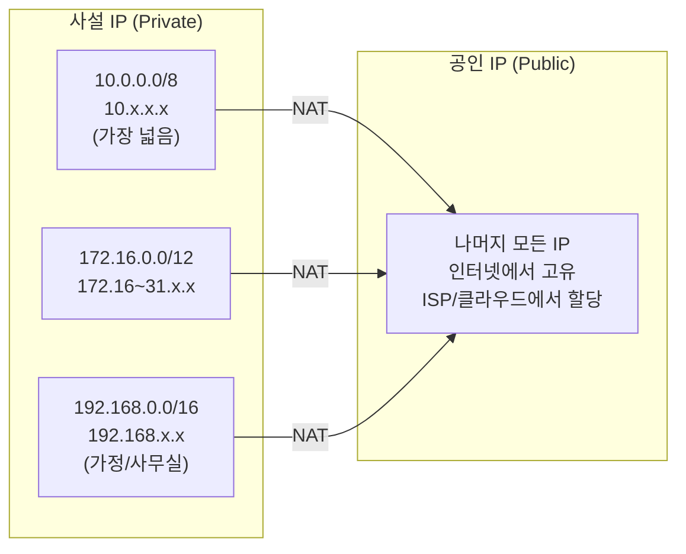
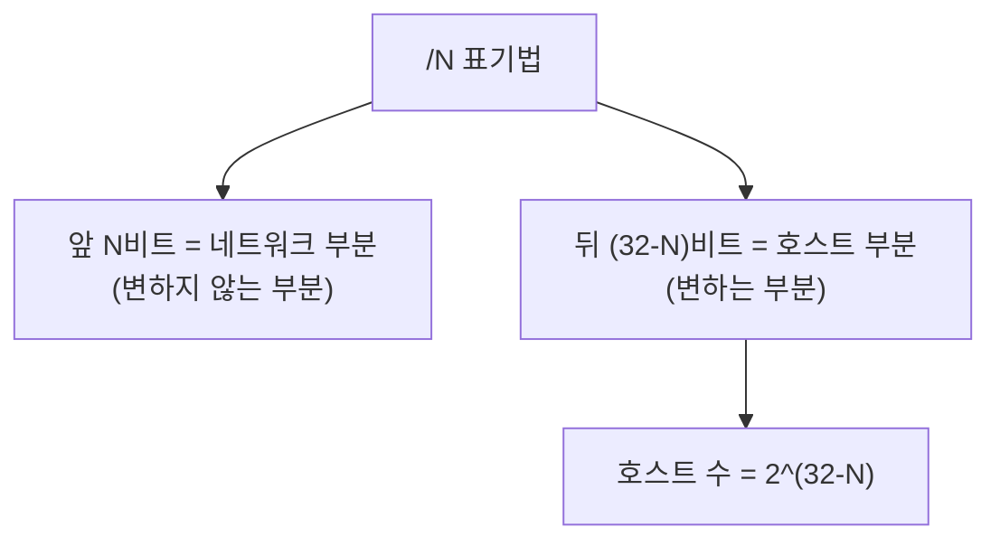
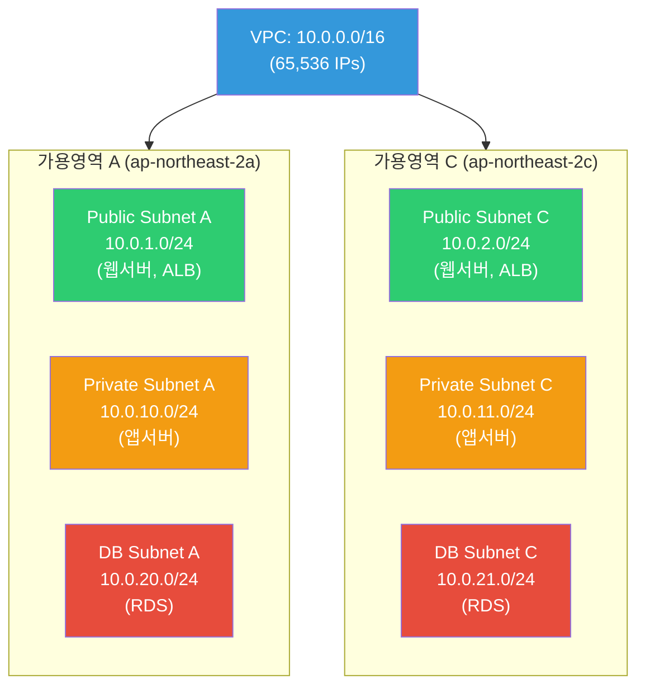
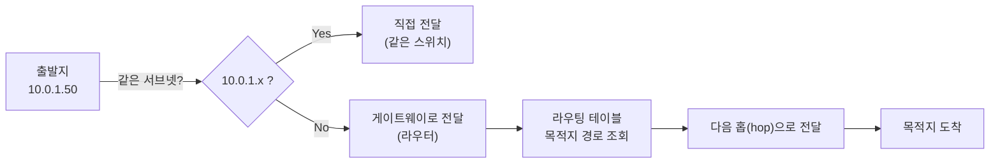
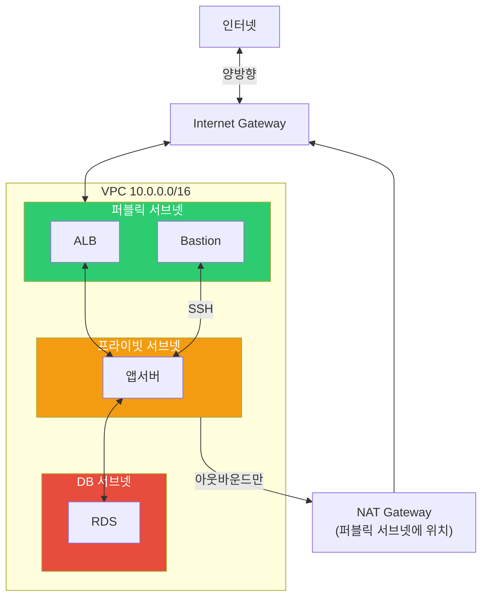
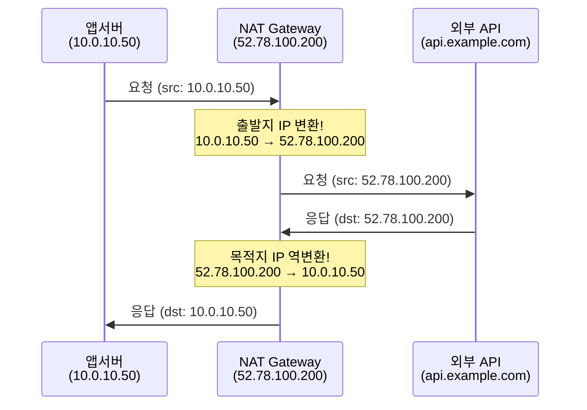

# 네트워크 구조 (CIDR / subnetting / routing / NAT)

> AWS VPC를 설계하려면, Kubernetes Pod 네트워크를 이해하려면, "10.0.1.0/24가 뭔지" 알아야 해요. IP 주소를 체계적으로 나누고, 패킷이 목적지까지 어떤 경로로 가는지, NAT가 뭔지 — 네트워크 설계의 기초를 배워볼게요.

---

## 🎯 이걸 왜 알아야 하나?

```
실무에서 이 개념이 필요한 순간:
• AWS VPC 서브넷 설계               → "퍼블릭 10.0.1.0/24, 프라이빗 10.0.2.0/24"
• K8s Pod 네트워크 이해             → "Pod CIDR: 172.20.0.0/16"
• "두 서버가 통신이 안 돼요"         → 같은 서브넷인지, 라우팅이 되는지
• 방화벽 규칙 (Security Group)      → "10.0.0.0/16에서만 허용"
• NAT Gateway 비용이 높아요         → NAT가 뭐고 왜 필요한지
• Docker 네트워크 이해              → "172.17.0.0/16 bridge 네트워크"
• VPN 설정                         → "사무실 192.168.0.0/24 ↔ VPC 10.0.0.0/16"
```

[이전 강의](./01-osi-tcp-udp)에서 IP가 L3(Network 계층)에서 동작한다고 배웠죠? 이번에는 IP 주소를 어떻게 체계적으로 관리하는지 깊이 파볼게요.

---

## 🧠 핵심 개념

### 비유: 도시 주소 체계

IP 주소 체계를 **도시의 주소**에 비유해볼게요.

* **IP 주소** = 상세 주소 (서울시 강남구 테헤란로 123번지)
* **서브넷** = 동네. 같은 동네(서브넷) 안에서는 직접 방문 가능
* **서브넷 마스크 (/24 등)** = 동네의 범위. "테헤란로 1~255번지가 한 동네"
* **라우터/게이트웨이** = 동네 입구의 우체국. 다른 동네로 가려면 우체국을 거쳐야 함
* **NAT** = 내부 주소(사번)를 외부 주소(공식 전화번호)로 바꿔주는 교환원
* **CIDR** = 동네를 유연하게 나누는 시스템. "이 동네는 256집, 저 동네는 64집"

---

## 🔍 상세 설명 — IP 주소

### IPv4 주소 구조

```
192.168.1.100
 │   │   │  │
 8비트 8비트 8비트 8비트  = 총 32비트

각 옥텟(octet): 0~255
전체 범위: 0.0.0.0 ~ 255.255.255.255
총 IP 수: 2^32 = 약 43억 개
```

```bash
# 내 서버의 IP 확인 (복습: ../01-linux/09-network-commands)
ip -4 addr show eth0
# inet 10.0.1.50/24 brd 10.0.1.255 scope global eth0
#      ^^^^^^^^^^
#      IP: 10.0.1.50
#      서브넷: /24

# 2진수로 보면 (이해용)
# 10.0.1.50 =
# 00001010.00000000.00000001.00110010
# 네트워크 부분    |  호스트 부분
# (/24이면 앞 24비트가 네트워크)
```

### 사설 IP vs 공인 IP



| 구분 | 범위 | 용도 | 인터넷 접속 |
|------|------|------|------------|
| **사설 IP** | 10.0.0.0/8 | 대규모 내부 (AWS VPC, 기업) | NAT 필요 |
| **사설 IP** | 172.16.0.0/12 | 중규모 내부 (Docker 기본) | NAT 필요 |
| **사설 IP** | 192.168.0.0/16 | 소규모 (가정, 사무실) | NAT 필요 |
| **공인 IP** | 그 외 | 인터넷 직접 통신 | 직접 가능 |
| **루프백** | 127.0.0.0/8 | 자기 자신 | — |

```bash
# 실무에서 많이 보는 IP 대역
# 10.0.0.0/16    → AWS VPC 기본
# 172.17.0.0/16  → Docker 기본 bridge
# 172.20.0.0/16  → K8s Pod 네트워크
# 192.168.0.0/24 → 사무실/가정 공유기
# 100.64.0.0/10  → CGNAT (통신사 내부)
```

### 특수 IP 주소

```bash
# 알아두면 좋은 특수 주소
0.0.0.0         # "모든 인터페이스" (서버 바인딩), "기본 경로" (라우팅)
127.0.0.1       # 루프백 (자기 자신) = localhost
255.255.255.255 # 브로드캐스트 (같은 네트워크 전체에 전송)
169.254.x.x     # Link-local (DHCP 실패 시 자동 할당)

# AWS 특수 주소
169.254.169.254 # EC2 메타데이터 서비스
10.0.0.2        # VPC DNS 서버 (VPC CIDR +2)
```

---

## 🔍 상세 설명 — CIDR

### CIDR란?

**Classless Inter-Domain Routing**. IP 주소를 유연하게 나누는 방법이에요. `/숫자`로 네트워크 부분의 비트 수를 나타내요.

```
10.0.1.0/24
^^^^^^^^ ^^
IP 주소  서브넷 마스크 (앞에서 24비트가 네트워크 부분)

/24 = 앞 24비트가 네트워크 → 뒤 8비트가 호스트
    = 2^8 = 256개 IP (실제 사용 가능: 254개)
    = 10.0.1.0 ~ 10.0.1.255
```

### CIDR 계산법



### CIDR 대응표 (★ 핵심! 자주 참조)

| CIDR | 서브넷 마스크 | IP 수 | 사용 가능 IP | 범위 예시 (10.0.0.0) | 용도 |
|------|-------------|-------|------------|---------------------|------|
| `/32` | 255.255.255.255 | 1 | 1 | 10.0.0.0만 | 단일 호스트 |
| `/28` | 255.255.255.240 | 16 | 14 | 10.0.0.0~15 | 소규모 서브넷 |
| `/27` | 255.255.255.224 | 32 | 30 | 10.0.0.0~31 | 소규모 서브넷 |
| `/26` | 255.255.255.192 | 64 | 62 | 10.0.0.0~63 | 소규모 서브넷 |
| `/25` | 255.255.255.128 | 128 | 126 | 10.0.0.0~127 | 중규모 서브넷 |
| `/24` | 255.255.255.0 | 256 | 254 | 10.0.0.0~255 | ⭐ 가장 흔함 |
| `/22` | 255.255.252.0 | 1,024 | 1,022 | 10.0.0.0~10.0.3.255 | K8s 노드 서브넷 |
| `/20` | 255.255.240.0 | 4,096 | 4,094 | 10.0.0.0~10.0.15.255 | 대규모 서브넷 |
| `/16` | 255.255.0.0 | 65,536 | 65,534 | 10.0.0.0~10.0.255.255 | ⭐ VPC 기본 |
| `/8` | 255.0.0.0 | 16,777,216 | 16,777,214 | 10.0.0.0~10.255.255.255 | 대규모 네트워크 |

```bash
# "사용 가능 IP"가 전체보다 2~5개 적은 이유:
# 네트워크 주소 (첫 번째): 10.0.1.0 → 네트워크 자체를 나타냄
# 브로드캐스트 주소 (마지막): 10.0.1.255 → 전체에 방송용
# → /24에서 256 - 2 = 254개 사용 가능

# AWS에서는 추가로 3개를 더 예약 (VPC당):
# 10.0.1.0   → 네트워크 주소
# 10.0.1.1   → VPC 라우터
# 10.0.1.2   → DNS 서버
# 10.0.1.3   → AWS 예약
# 10.0.1.255 → 브로드캐스트
# → AWS /24 서브넷에서 실제 사용 가능: 251개
```

### CIDR 계산 실전

```bash
# "10.0.1.0/24에 IP가 몇 개?"
# /24 → 호스트 비트 = 32 - 24 = 8
# IP 수 = 2^8 = 256
# 사용 가능 = 256 - 2 = 254 (AWS: 251)

# "172.20.0.0/16에 IP가 몇 개?"
# /16 → 호스트 비트 = 32 - 16 = 16
# IP 수 = 2^16 = 65,536

# "10.0.0.128/25의 범위는?"
# /25 → 호스트 비트 = 7 → 2^7 = 128개
# 시작: 10.0.0.128
# 끝: 10.0.0.128 + 128 - 1 = 10.0.0.255
# → 10.0.0.128 ~ 10.0.0.255

# 빠른 계산 팁:
# /24 = 256개,  /25 = 128개, /26 = 64개, /27 = 32개, /28 = 16개
# → /이 1 올라갈 때마다 반으로!

# ipcalc 도구로 계산 (설치: sudo apt install ipcalc)
ipcalc 10.0.1.0/24
# Network:   10.0.1.0/24
# Netmask:   255.255.255.0 = 24
# Broadcast: 10.0.1.255
# Address space: Private Use
# HostMin:   10.0.1.1
# HostMax:   10.0.1.254
# Hosts/Net: 254

ipcalc 10.0.0.0/22
# Network:   10.0.0.0/22
# Netmask:   255.255.252.0 = 22
# Broadcast: 10.0.3.255
# HostMin:   10.0.0.1
# HostMax:   10.0.3.254
# Hosts/Net: 1022
```

### "이 IP가 이 서브넷에 속하나?"

```bash
# 10.0.1.50이 10.0.1.0/24에 속하나?
# 10.0.1.0~10.0.1.255 범위 → 10.0.1.50은 포함! ✅

# 10.0.2.50이 10.0.1.0/24에 속하나?
# 10.0.1.0~10.0.1.255 범위 → 10.0.2.50은 미포함! ❌
# → 다른 서브넷! 라우터를 거쳐야 통신 가능

# 10.0.1.50이 10.0.0.0/16에 속하나?
# 10.0.0.0~10.0.255.255 범위 → 10.0.1.50은 포함! ✅

# 실무에서 이게 중요한 이유:
# Security Group 규칙: "10.0.0.0/16에서 오는 트래픽 허용"
# → 10.0.1.50에서 온 트래픽? → 허용! (10.0.0.0/16에 속함)
# → 10.1.0.50에서 온 트래픽? → 차단! (10.0.0.0/16에 안 속함)
```

---

## 🔍 상세 설명 — Subnetting

### 서브넷이란?

하나의 큰 네트워크를 여러 작은 네트워크로 나누는 것이에요.

**왜 서브넷을 나누나요?**
* **보안**: 웹서버와 DB를 분리해서 접근 제어
* **관리**: 용도별로 구분 (퍼블릭, 프라이빗, DB 등)
* **성능**: 브로드캐스트 도메인 축소
* **가용성**: AZ(가용 영역)별로 분리

### AWS VPC 서브넷 설계 예시 (★ 실무 핵심!)



```bash
# 실무 서브넷 설계 패턴 (AWS)

# VPC: 10.0.0.0/16 (65,536 IPs)

# === 퍼블릭 서브넷 (인터넷 직접 접근) ===
# 10.0.1.0/24  → Public AZ-a (ALB, Bastion, NAT Gateway)
# 10.0.2.0/24  → Public AZ-c
# 10.0.3.0/24  → Public AZ-b (필요시)

# === 프라이빗 서브넷 (앱서버, 인터넷 불가 직접) ===
# 10.0.10.0/24 → Private AZ-a (앱서버, ECS/EKS)
# 10.0.11.0/24 → Private AZ-c
# 10.0.12.0/24 → Private AZ-b (필요시)

# === DB 서브넷 (DB만, 더 엄격한 접근 제어) ===
# 10.0.20.0/24 → DB AZ-a (RDS)
# 10.0.21.0/24 → DB AZ-c

# === K8s용 (Pod IP가 많이 필요하면 더 넓게) ===
# 10.0.100.0/22 → EKS Pod AZ-a (1,024 IPs)
# 10.0.104.0/22 → EKS Pod AZ-c (1,024 IPs)

# 이 설계에서:
# 퍼블릭 서브넷의 서버 → 인터넷과 직접 통신 가능
# 프라이빗 서브넷의 서버 → NAT Gateway를 통해서만 인터넷 접근
# DB 서브넷 → 인터넷 접근 불가, 앱서버에서만 접근 가능
```

### 서브넷 크기 고르기

```bash
# 서브넷에 필요한 IP 수를 기준으로 CIDR 선택

# 소규모 (Bastion, NAT GW 등): /28 (16 IPs) 또는 /27 (32 IPs)
# 웹서버/앱서버: /24 (256 IPs) → 가장 흔함
# EKS/ECS (컨테이너 많을 때): /22 (1,024 IPs) 또는 /20 (4,096 IPs)
# 전체 VPC: /16 (65,536 IPs) → 넉넉하게

# ⚠️ 나중에 서브넷 크기를 변경하려면 삭제 후 재생성해야 해요!
# → 처음에 여유 있게 잡는 것이 중요
# → /24가 부족하면 /22나 /20으로 새 서브넷 추가

# ⚠️ VPC CIDR이 겹치면 VPC Peering이 안 돼요!
# VPC A: 10.0.0.0/16
# VPC B: 10.0.0.0/16  ← 겹침! Peering 불가!
# VPC B: 10.1.0.0/16  ← OK! Peering 가능
```

---

## 🔍 상세 설명 — Routing

### 라우팅이란?

패킷이 출발지에서 목적지까지 어떤 경로로 가는지 결정하는 것이에요. 택배가 물류 센터를 거쳐 배송되는 것과 같아요.



### 라우팅 테이블

```bash
# Linux 라우팅 테이블 확인
ip route
# default via 10.0.1.1 dev eth0 proto dhcp src 10.0.1.50 metric 100
# 10.0.1.0/24 dev eth0 proto kernel scope link src 10.0.1.50
# 172.17.0.0/16 dev docker0 proto kernel scope link src 172.17.0.1

# 읽는 법:
# default via 10.0.1.1
# → 목적지를 모르면 10.0.1.1(게이트웨이)로 보내라
# → 인터넷으로 나가는 기본 경로

# 10.0.1.0/24 dev eth0
# → 10.0.1.x 대역은 eth0으로 직접 통신 (같은 서브넷)

# 172.17.0.0/16 dev docker0
# → Docker 네트워크는 docker0 인터페이스로
```

```bash
# 특정 목적지로 가는 경로 확인
ip route get 8.8.8.8
# 8.8.8.8 via 10.0.1.1 dev eth0 src 10.0.1.50 uid 1000
# → 8.8.8.8에 가려면: 게이트웨이 10.0.1.1 통해 eth0으로

ip route get 10.0.1.100
# 10.0.1.100 dev eth0 src 10.0.1.50 uid 1000
# → 10.0.1.100은 같은 서브넷이라 직접 (게이트웨이 없이)

ip route get 10.0.2.10
# 10.0.2.10 via 10.0.1.1 dev eth0 src 10.0.1.50 uid 1000
# → 10.0.2.10은 다른 서브넷이라 게이트웨이를 거침
```

### traceroute — 경로 추적

패킷이 목적지까지 거치는 모든 라우터를 보여줘요.

```bash
traceroute 8.8.8.8
# traceroute to 8.8.8.8 (8.8.8.8), 30 hops max, 60 byte packets
#  1  10.0.1.1 (10.0.1.1)  0.5 ms  0.4 ms  0.3 ms      ← 게이트웨이
#  2  10.0.0.1 (10.0.0.1)  1.0 ms  0.9 ms  0.8 ms      ← VPC 라우터
#  3  52.93.x.x (52.93.x.x)  2.0 ms  1.5 ms  1.8 ms    ← AWS 내부
#  4  100.100.x.x (100.100.x.x)  3.0 ms  2.5 ms  2.8 ms
#  5  72.14.x.x (72.14.x.x)  4.0 ms  3.5 ms  3.8 ms   ← Google 네트워크 진입
#  6  8.8.8.8 (8.8.8.8)  5.0 ms  4.5 ms  4.8 ms        ← 도착!

# 각 줄이 하나의 "홉(hop)" = 라우터를 거친 것
# ms = 왕복 시간 (3번 측정)
# * = 응답 없음 (방화벽이 막거나 ICMP 비활성화)

# 경로 상 어디서 느려지는지 확인
traceroute -n api.example.com
# -n: DNS 조회 안 함 (더 빠름)

# 홉 5에서 갑자기 50ms로 뛰면 → 홉 4~5 사이에서 병목!
```

### AWS VPC 라우팅 테이블

```bash
# AWS VPC에서 라우팅은 "Route Table"로 관리

# 퍼블릭 서브넷의 라우팅 테이블:
# Destination     Target
# 10.0.0.0/16     local           ← VPC 내부는 직접 통신
# 0.0.0.0/0       igw-xxxx        ← 나머지는 Internet Gateway로
#                                    (인터넷 접근 가능!)

# 프라이빗 서브넷의 라우팅 테이블:
# Destination     Target
# 10.0.0.0/16     local           ← VPC 내부는 직접 통신
# 0.0.0.0/0       nat-xxxx        ← 나머지는 NAT Gateway로
#                                    (아웃바운드만 가능!)

# DB 서브넷의 라우팅 테이블:
# Destination     Target
# 10.0.0.0/16     local           ← VPC 내부만!
#                                    (인터넷 접근 불가!)
```



---

## 🔍 상세 설명 — NAT

### NAT란?

**Network Address Translation**. 사설 IP를 공인 IP로 변환해주는 기술이에요. 집에서 인터넷을 쓸 때 공유기가 하는 일이 바로 NAT예요.



**왜 NAT이 필요한가요?**
* 사설 IP(10.x.x.x)는 인터넷에서 통하지 않아요
* 프라이빗 서브넷의 서버가 외부 API를 호출하거나 패키지를 다운로드하려면 NAT이 필요
* NAT을 쓰면 외부에서 내부 서버의 사설 IP를 알 수 없어요 (보안!)

### NAT 종류

| 종류 | 설명 | 예시 |
|------|------|------|
| **SNAT** (Source NAT) | 출발지 IP 변환 | 내부 → 외부 (NAT Gateway) |
| **DNAT** (Destination NAT) | 목적지 IP 변환 | 외부 → 내부 (포트 포워딩) |
| **PAT** (Port Address Translation) | IP + 포트 변환 | 여러 내부 IP가 하나의 공인 IP 공유 |
| **1:1 NAT** | 사설 IP 1개 = 공인 IP 1개 | Elastic IP |

```bash
# iptables로 NAT 확인 (Linux에서)
sudo iptables -t nat -L -n -v
# Chain PREROUTING (policy ACCEPT)
# Chain POSTROUTING (policy ACCEPT)
#  pkts bytes target     prot opt in  out  source       destination
#  5000 300K  MASQUERADE all  --  *   eth0 172.17.0.0/16 0.0.0.0/0
#             ^^^^^^^^^^
#             Docker이 컨테이너의 사설 IP를 호스트 IP로 변환 (SNAT)

# Docker 컨테이너가 인터넷에 접속할 수 있는 이유:
# 컨테이너 (172.17.0.2) → NAT (MASQUERADE) → 호스트 IP → 인터넷
```

### AWS NAT Gateway

```bash
# NAT Gateway의 역할:
# 프라이빗 서브넷 → (NAT GW) → Internet Gateway → 인터넷
# → 아웃바운드만 가능! 인바운드는 불가!

# NAT Gateway 비용:
# 시간당 + 데이터 전송량(GB당) → 비용이 꽤 나옴!
# → 불필요한 아웃바운드 트래픽 줄이기 (Docker pull 캐시 등)

# NAT Gateway 없이 인터넷 접근이 필요하면:
# 1. VPC Endpoint (S3, DynamoDB 등 AWS 서비스용)
# 2. PrivateLink (다른 AWS 서비스용)
# → NAT 비용을 줄일 수 있어요 (이건 Cloud AWS 강의에서 자세히)
```

---

## 💻 실습 예제

### 실습 1: 내 서버의 네트워크 구조 파악

```bash
# 1. IP 주소와 서브넷 확인
ip -4 addr show
# inet 10.0.1.50/24 brd 10.0.1.255 scope global eth0
# → IP: 10.0.1.50, 서브넷: /24, 범위: 10.0.1.0~255

# 2. 게이트웨이 확인
ip route | grep default
# default via 10.0.1.1 dev eth0

# 3. 같은 서브넷의 다른 호스트 확인
ip neigh
# 10.0.1.1 dev eth0 lladdr 0a:ff:ff:ff:ff:01 REACHABLE    ← 게이트웨이
# 10.0.1.20 dev eth0 lladdr 0a:1b:2c:3d:4e:60 STALE       ← 다른 서버

# 4. DNS 서버 확인
resolvectl status 2>/dev/null | grep "DNS Servers" || cat /etc/resolv.conf
```

### 실습 2: CIDR 계산 연습

```bash
# ipcalc 설치 (없으면)
sudo apt install ipcalc 2>/dev/null || sudo yum install ipcalc 2>/dev/null

# 1. /24 서브넷
ipcalc 10.0.1.0/24
# Network:   10.0.1.0/24
# HostMin:   10.0.1.1
# HostMax:   10.0.1.254
# Hosts/Net: 254

# 2. /22 서브넷 (K8s용으로 넓게)
ipcalc 10.0.100.0/22
# Network:   10.0.100.0/22
# HostMin:   10.0.100.1
# HostMax:   10.0.103.254
# Hosts/Net: 1022

# 3. /28 서브넷 (아주 작게)
ipcalc 10.0.1.0/28
# Network:   10.0.1.0/28
# HostMin:   10.0.1.1
# HostMax:   10.0.1.14
# Hosts/Net: 14

# 4. 이 IP가 이 서브넷에 속하나?
ipcalc 10.0.1.50/24
# 10.0.1.50은 10.0.1.0/24에 속함 ✅

# 직접 계산 연습:
# 10.0.0.0/20 의 범위는?
# /20 → 호스트 비트 = 12 → 2^12 = 4096
# 범위: 10.0.0.0 ~ 10.0.15.255
ipcalc 10.0.0.0/20
# HostMax: 10.0.15.254  ← 맞음!
```

### 실습 3: 라우팅 테이블 이해

```bash
# 1. 현재 라우팅 테이블
ip route

# 2. 각 목적지로 가는 경로 확인
ip route get 10.0.1.100    # 같은 서브넷 → 직접
ip route get 10.0.2.10     # 다른 서브넷 → 게이트웨이 경유
ip route get 8.8.8.8       # 인터넷 → 기본 게이트웨이 경유

# 3. traceroute로 경로 추적
traceroute -n 8.8.8.8

# 4. 홉 수 비교
traceroute -n 10.0.1.100   # 같은 서브넷 → 1홉
traceroute -n 10.0.2.10    # 다른 서브넷 → 2~3홉
traceroute -n 8.8.8.8      # 인터넷 → 많은 홉
```

### 실습 4: Docker 네트워크와 NAT

```bash
# Docker가 설치되어 있다면:

# 1. Docker 네트워크 확인
docker network ls
# NETWORK ID   NAME     DRIVER  SCOPE
# abc123       bridge   bridge  local
# def456       host     host    local
# ghi789       none     null    local

# 2. bridge 네트워크 상세
docker network inspect bridge | grep -A 5 "IPAM"
# "Subnet": "172.17.0.0/16",
# "Gateway": "172.17.0.1"

# 3. 호스트의 docker0 인터페이스
ip addr show docker0
# inet 172.17.0.1/16    ← Docker 네트워크의 게이트웨이

# 4. 라우팅 테이블에서 Docker 경로
ip route | grep docker
# 172.17.0.0/16 dev docker0 proto kernel scope link src 172.17.0.1

# 5. NAT 규칙 확인 (Docker가 만든 것)
sudo iptables -t nat -L POSTROUTING -n -v | grep docker
# MASQUERADE  all  --  *   !docker0  172.17.0.0/16  0.0.0.0/0
# → Docker 컨테이너(172.17.x.x)가 외부로 나갈 때 호스트 IP로 NAT

# 6. 컨테이너에서 외부 IP 확인
docker run --rm alpine wget -qO- ifconfig.me
# 52.78.100.200    ← 호스트의 공인 IP가 나옴 (NAT 됨!)
```

---

## 🏢 실무에서는?

### 시나리오 1: VPC 서브넷 설계

```bash
# 새 프로젝트의 AWS VPC를 설계하라는 요청

# === 요구사항 ===
# - 웹서버 (퍼블릭)
# - 앱서버 (프라이빗)
# - DB (프라이빗, 더 엄격)
# - 2개 AZ (고가용성)
# - K8s 도입 예정 (Pod IP 많이 필요)

# === 설계 ===
# VPC: 10.0.0.0/16

# 퍼블릭 서브넷 (ALB, Bastion, NAT GW)
# 10.0.1.0/24  → pub-a (251 IPs)
# 10.0.2.0/24  → pub-c (251 IPs)

# 프라이빗 서브넷 (앱서버)
# 10.0.10.0/24 → pri-a (251 IPs)
# 10.0.11.0/24 → pri-c (251 IPs)

# DB 서브넷
# 10.0.20.0/24 → db-a (251 IPs)
# 10.0.21.0/24 → db-c (251 IPs)

# EKS Pod 서브넷 (넓게!)
# 10.0.100.0/20 → eks-a (4,094 IPs)
# 10.0.116.0/20 → eks-c (4,094 IPs)

# 남은 IP: 10.0.0.0/16 = 65,536 - 사용분 ≈ 충분히 남음
# → 나중에 서브넷 추가 여유 있음!

# ⚠️ 설계 시 주의:
# 1. VPC CIDR은 나중에 바꾸기 매우 어려움 → 넉넉하게 /16
# 2. 서브넷은 AZ당 하나씩 쌍으로
# 3. K8s용은 최소 /22 이상 (Pod IP가 많이 필요)
# 4. 다른 VPC와 CIDR이 겹치면 Peering 불가
```

### 시나리오 2: "두 서버가 통신이 안 돼요"

```bash
# 앱서버(10.0.10.50)에서 DB(10.0.20.10)에 연결이 안 됨

# 1. 같은 VPC인지 확인
# 10.0.10.50 → 10.0.0.0/16
# 10.0.20.10 → 10.0.0.0/16
# → 같은 VPC! ✅

# 2. 라우팅 확인
ip route get 10.0.20.10
# 10.0.20.10 via 10.0.10.1 dev eth0
# → 게이트웨이를 통해 라우팅 OK ✅

# 3. ping 테스트
ping -c 3 10.0.20.10
# PING 10.0.20.10: 3 packets transmitted, 0 received, 100% packet loss
# → 연결 안 됨! ❌

# 4. Security Group 확인 (가장 흔한 원인!)
# DB의 Security Group에 앱서버 서브넷(10.0.10.0/24)에서
# 3306 포트가 허용되어 있는지 확인!

# → Inbound Rule 추가:
# Type: MySQL/Aurora
# Port: 3306
# Source: 10.0.10.0/24 (또는 앱서버 SG)

# 5. NACL 확인 (SG 다음으로 흔한 원인)
# DB 서브넷의 NACL에서 3306 인바운드/아웃바운드가 허용되어 있는지

# 6. 다시 테스트
nc -zv 10.0.20.10 3306
# Connection succeeded! ✅
```

### 시나리오 3: VPC CIDR 겹침 문제

```bash
# 상황: VPC A(프로덕션)와 VPC B(스테이징)를 Peering하려는데 안 됨

# VPC A: 10.0.0.0/16
# VPC B: 10.0.0.0/16  ← 겹침! Peering 불가!

# 해결 1: VPC B를 다른 CIDR로 재생성
# VPC B: 10.1.0.0/16  ← 이제 OK!

# 해결 2: Secondary CIDR 추가
# VPC B에 100.64.0.0/16을 Secondary CIDR로 추가
# → Secondary 대역끼리 Peering 가능

# 예방법: 처음부터 CIDR 충돌을 피하는 설계
# 프로덕션:  10.0.0.0/16
# 스테이징: 10.1.0.0/16
# 개발:     10.2.0.0/16
# 사무실:    192.168.0.0/16
```

### 시나리오 4: NAT Gateway 비용 절감

```bash
# "NAT Gateway 비용이 월 200달러가 나옵니다"

# 원인 분석: 어떤 트래픽이 NAT를 타고 있나?
# → VPC Flow Logs를 켜서 확인

# 비용 절감 방법:

# 1. S3 접근 → VPC Endpoint (Gateway) 사용
# → S3 트래픽이 NAT을 안 타고 직접 S3에 접근
# → 무료!

# 2. ECR/DynamoDB 등 → VPC Endpoint (Interface) 사용
# → 시간당 소액이지만 NAT보다 쌈

# 3. Docker 이미지 캐시
# → ECR Pull Through Cache 사용
# → Docker Hub 이미지를 ECR에 캐싱

# 4. 패키지 미러
# → apt/yum 미러를 내부에 구성

# 5. AZ별 NAT Gateway
# → 각 AZ에 NAT GW를 두면 cross-AZ 비용 절감
# → 하지만 NAT GW 자체 비용은 증가... 트래이드오프!
```

---

## ⚠️ 자주 하는 실수

### 1. /16과 /24를 헷갈리기

```bash
# ❌ "10.0.0.0/24면 10.0.x.x 전체잖아?"
# → 아님! 10.0.0.0~10.0.0.255만! (256개)

# /24 = 10.0.0.0 ~ 10.0.0.255  (256개)
# /16 = 10.0.0.0 ~ 10.0.255.255 (65,536개)
# /8  = 10.0.0.0 ~ 10.255.255.255 (16,777,216개)

# 숫자가 클수록 범위가 좁아요!
# /32 = 1개, /24 = 256개, /16 = 65,536개, /8 = 16,777,216개
```

### 2. VPC CIDR을 너무 작게 잡기

```bash
# ❌ VPC를 /24 (256 IPs)로 만들기
# → 나중에 서브넷 추가하면 IP가 부족!
# → K8s 도입하면 Pod IP로 수천 개 필요

# ✅ VPC는 /16 (65,536 IPs)으로 넉넉하게
# → 나중에 바꾸기 매우 어려우니 처음에 크게!
```

### 3. 서브넷과 Security Group을 혼동

```bash
# 서브넷 ≠ 보안 그룹!

# 서브넷: IP 범위 (어디에 배치할지)
# Security Group: 방화벽 규칙 (무슨 트래픽을 허용할지)

# 같은 서브넷에 있어도 SG가 차단하면 통신 안 됨!
# 다른 서브넷이어도 SG가 허용하고 라우팅이 되면 통신 가능!
```

### 4. 프라이빗 서브넷에 NAT Gateway를 안 만들기

```bash
# ❌ 프라이빗 서브넷의 서버가 인터넷에 접근할 수 없음
# → apt update, Docker pull, 외부 API 호출 전부 실패!

# ✅ NAT Gateway를 퍼블릭 서브넷에 만들고
# → 프라이빗 서브넷의 라우팅 테이블에 0.0.0.0/0 → NAT GW 추가
```

### 5. CIDR 겹침을 나중에 발견

```bash
# ❌ 운영 중인 VPC의 CIDR이 겹쳐서 Peering/VPN이 안 됨
# → VPC CIDR 변경은 매우 어렵고 위험

# ✅ 예방: 전사 IP 대역 계획표 관리
# 프로덕션:  10.0.0.0/16
# 스테이징:  10.1.0.0/16
# 개발:      10.2.0.0/16
# 공유 서비스: 10.10.0.0/16
# 사무실 VPN: 192.168.0.0/16

# → 이 계획을 문서화하고 팀 공유!
```

---

## 📝 정리

### CIDR 빠른 참조

```
/32 = 1 IP        /28 = 16 IPs       /24 = 256 IPs
/22 = 1,024 IPs   /20 = 4,096 IPs    /16 = 65,536 IPs
/8 = 16,777,216 IPs

/ 숫자가 클수록 범위가 좁아요!
/ 숫자가 1 작아질 때마다 IP 수가 2배!
```

### 사설 IP 대역

```
10.0.0.0/8       → 대규모 (AWS VPC, 기업)
172.16.0.0/12    → 중규모 (Docker 기본)
192.168.0.0/16   → 소규모 (가정, 사무실)
```

### VPC 설계 체크리스트

```
✅ VPC CIDR은 /16으로 넉넉하게
✅ 다른 VPC/사무실과 CIDR 겹치지 않게
✅ 퍼블릭/프라이빗/DB 서브넷 분리
✅ AZ별로 서브넷 쌍 생성
✅ K8s용은 /22 이상으로 넓게
✅ 프라이빗 서브넷에 NAT Gateway (또는 VPC Endpoint)
✅ 전사 IP 대역 계획표 문서화
```

### 디버깅 명령어

```bash
ip addr               # 내 IP + 서브넷
ip route               # 라우팅 테이블
ip route get [목적지]  # 특정 목적지 경로
traceroute -n [목적지] # 경로 추적
ipcalc [CIDR]          # CIDR 계산
ping [목적지]          # 연결 테스트
```

---

## 🔗 다음 강의

다음은 **[05-tls-certificate](./05-tls-certificate)** — TLS / 인증서 / mTLS 이에요.

HTTPS의 S는 뭘까요? 브라우저 주소창의 자물쇠 아이콘은 어떤 원리일까요? TLS 암호화, SSL 인증서, Let's Encrypt 자동 갱신, 그리고 서비스 간 mTLS까지 — 보안 통신의 모든 것을 배워볼게요.
