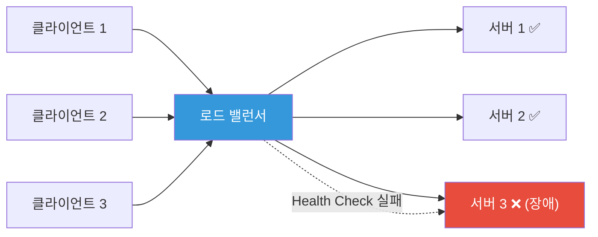
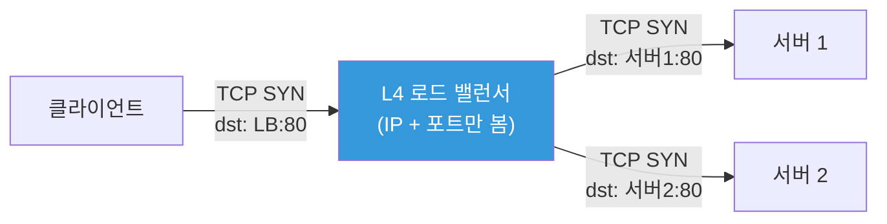
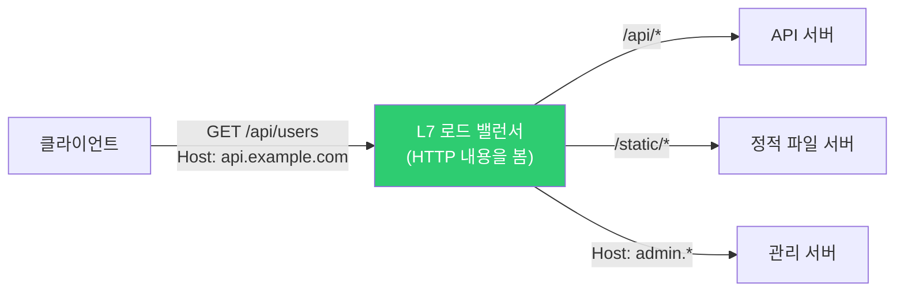
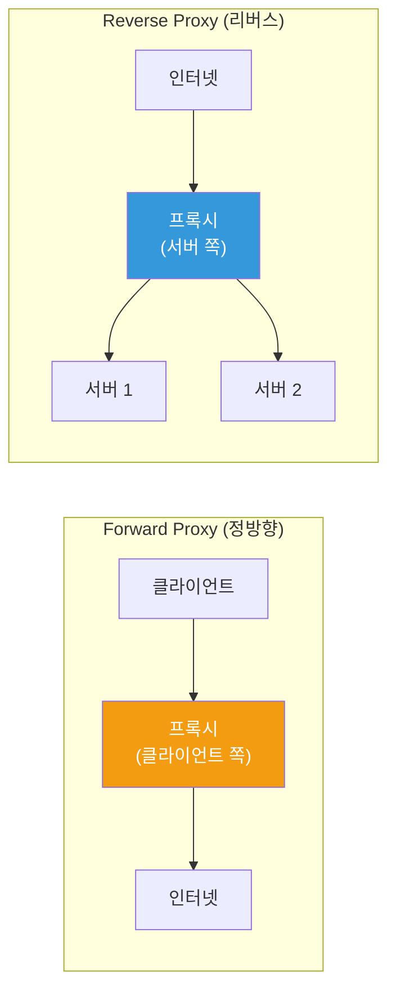
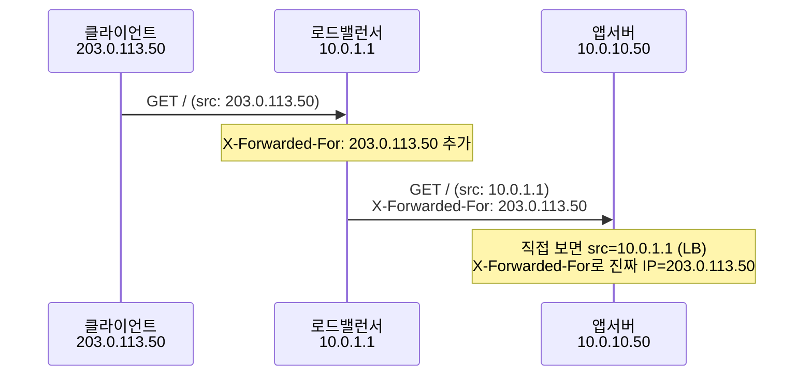
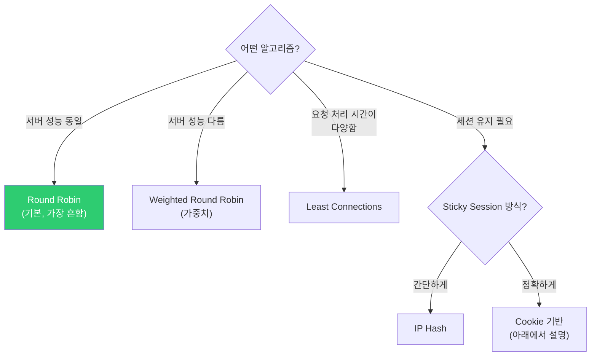
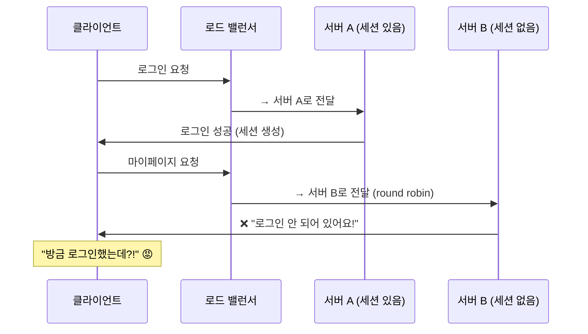
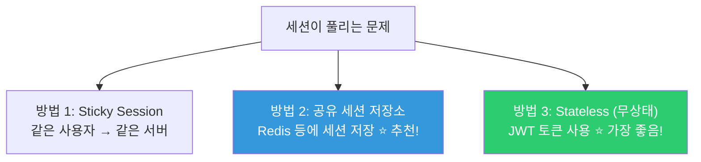
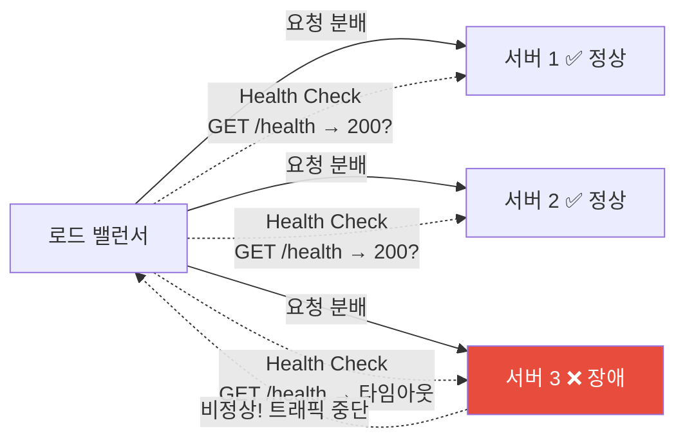
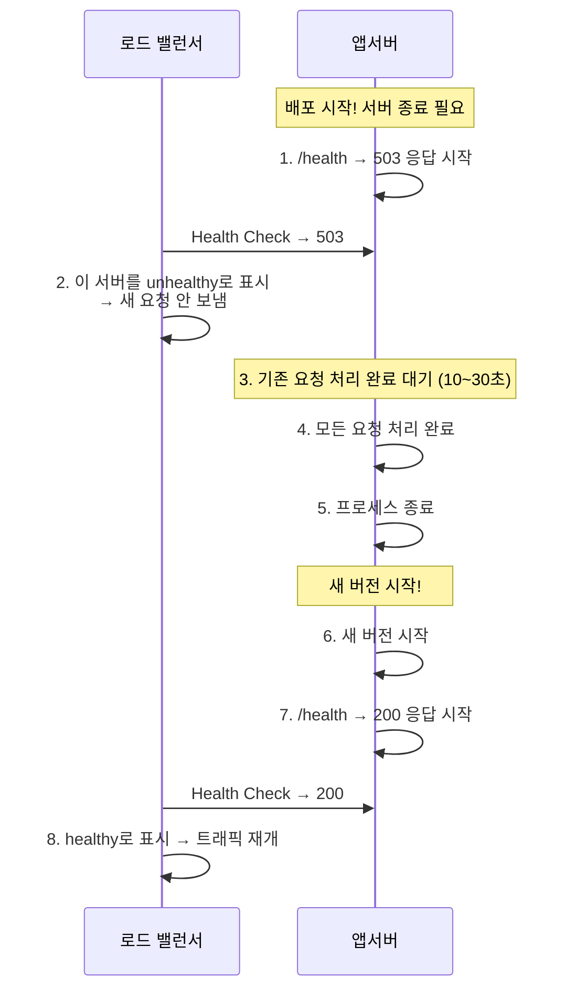

# 로드 밸런싱 (L4 vs L7 / reverse proxy / sticky sessions / health check)

> 사용자가 100명일 때는 서버 1대로 충분해요. 하지만 10만 명이 되면? 서버 1대로는 못 버텨요. 여러 서버에 트래픽을 나눠주는 것이 로드 밸런서의 역할이에요. 면접에서도, 실무에서도 빠지지 않는 핵심 주제예요.

---

## 🎯 이걸 왜 알아야 하나?

```
실무에서 로드 밸런서 관련 작업:
• ALB vs NLB 뭘 써야 하나요?              → L4 vs L7 이해
• "특정 서버에만 트래픽이 몰려요"           → 분산 알고리즘 이해
• "로그인 상태가 자꾸 풀려요"              → sticky session 설정
• "배포 중에 502 에러가 나요"              → health check + graceful shutdown
• Nginx를 리버스 프록시로 쓰고 싶어요       → proxy_pass 설정
• K8s Service/Ingress가 내부적으로 뭘 하는지 → 로드 밸런싱 원리
```

[이전 강의](./01-osi-tcp-udp)에서 L4(Transport)와 L7(Application)을 배웠고, [HTTP 강의](./02-http)에서 502/503/504의 차이를 배웠죠? 이번에는 그 중간에 있는 **로드 밸런서**가 어떻게 동작하는지 깊이 파볼게요.

---

## 🧠 핵심 개념

### 비유: 은행 번호표 시스템

로드 밸런서를 **은행 번호표 시스템**에 비유해볼게요.

* **로드 밸런서** = 번호표 발급기. 고객(요청)이 오면 비어있는 창구(서버)로 안내
* **백엔드 서버** = 각 창구. 실제로 업무(요청)를 처리
* **분산 알고리즘** = 번호 배분 방식. "순서대로" vs "가장 한가한 창구로" vs "단골 손님은 같은 창구로"
* **Health Check** = 창구가 열려있는지(서버가 살아있는지) 수시로 확인. 닫힌 창구에는 안 보냄
* **Sticky Session** = "3번 창구에서 서류를 시작했으니, 다음에도 3번으로 가세요"



---

## 🔍 상세 설명 — L4 vs L7

### L4 로드 밸런싱 (Transport 계층)

**TCP/UDP 수준**에서 동작해요. 패킷의 IP와 포트만 보고 분배해요. 패킷 내용(HTTP 등)은 안 봐요.



**특징:**
* 패킷을 열어보지 않음 → **매우 빠름**
* TCP 연결 자체를 전달 (패킷 포워딩)
* HTTP 헤더, URL, 쿠키 등을 모름
* TLS를 종단하지 않음 (패스스루)

**용도:**
* 매우 높은 성능이 필요할 때
* TCP/UDP 프로토콜 분배 (HTTP가 아닌 것들)
* TLS 패스스루 (백엔드에서 TLS 처리)
* DB, Redis 같은 비-HTTP 서비스
* gRPC, WebSocket 등

### L7 로드 밸런싱 (Application 계층)

**HTTP 수준**에서 동작해요. 요청의 URL, 헤더, 쿠키 등 **내용을 보고** 분배해요.



**특징:**
* HTTP 요청을 파싱 → URL, 헤더, 쿠키 기반 라우팅
* TLS 종단 (LB에서 복호화)
* 요청/응답 수정 가능 (헤더 추가, 리다이렉트)
* L4보다 느리지만 훨씬 유연

**용도:**
* URL 기반 라우팅 (`/api` → 백엔드 A, `/web` → 백엔드 B)
* 호스트 기반 라우팅 (`api.example.com` → A, `www.example.com` → B)
* 쿠키/헤더 기반 라우팅 (A/B 테스트, 카나리 배포)
* TLS 종단 + HTTP/2
* WebSocket 프록시
* WAF(웹 방화벽) 연동
* CORS, 인증 등 HTTP 레벨 처리

### L4 vs L7 비교 (★ 면접 단골 질문!)

| 항목 | L4 (Transport) | L7 (Application) |
|------|----------------|-------------------|
| 봉투 비유 | 봉투 겉면만 보고 배달 | 봉투를 열어서 편지 내용 보고 배달 |
| 동작 계층 | TCP/UDP | HTTP/HTTPS |
| 보는 것 | IP, 포트 | URL, 헤더, 쿠키, 호스트 |
| 속도 | 매우 빠름 | 상대적으로 느림 |
| URL 기반 라우팅 | ❌ | ✅ |
| TLS 종단 | ❌ (패스스루) | ✅ |
| 헤더 수정 | ❌ | ✅ |
| 프로토콜 | TCP, UDP, 모든 프로토콜 | HTTP, HTTPS, WebSocket |
| AWS | **NLB** | **ALB** |
| 기타 | HAProxy TCP mode | HAProxy HTTP mode, Nginx, Envoy |

```bash
# AWS에서의 선택 가이드

# ALB (L7) 를 쓰세요:
# ✅ 일반 웹 서비스 (HTTP/HTTPS)
# ✅ URL/호스트 기반 라우팅 필요
# ✅ TLS 종단 + ACM 인증서 사용
# ✅ WebSocket 지원 필요
# ✅ WAF 연동 필요

# NLB (L4) 를 쓰세요:
# ✅ 초고성능 (수백만 RPS)
# ✅ 비-HTTP 프로토콜 (gRPC, MQTT, 게임 서버)
# ✅ 고정 IP가 필요 (Elastic IP 연결 가능)
# ✅ TLS 패스스루 필요
# ✅ 매우 낮은 지연시간 필요
```

---

## 🔍 상세 설명 — 리버스 프록시

### 리버스 프록시란?

클라이언트와 백엔드 서버 사이에서 **중계 역할**을 하는 서버예요. 로드 밸런서는 리버스 프록시의 한 기능이에요.



**리버스 프록시가 하는 일:**
* **로드 밸런싱** — 여러 백엔드에 분배
* **TLS 종단** — HTTPS → HTTP로 변환 (백엔드는 HTTP만)
* **캐싱** — 자주 요청되는 응답을 캐싱
* **압축** — 응답을 gzip으로 압축
* **보안** — 백엔드 서버를 직접 노출하지 않음
* **정적 파일 서빙** — 백엔드 부하 줄임
* **Rate Limiting** — 과도한 요청 차단
* **헤더 추가** — X-Real-IP, X-Forwarded-For 등

### Nginx 리버스 프록시 (★ 실무 가장 많이 씀)

```bash
# /etc/nginx/conf.d/myapp.conf

# 업스트림 (백엔드 서버 그룹)
upstream backend {
    # 로드 밸런싱 알고리즘 (기본: round-robin)
    # least_conn;           # 가장 적은 연결 수
    # ip_hash;              # 클라이언트 IP 기반 (sticky)
    # hash $request_uri;    # URL 기반

    server 10.0.10.50:8080 weight=3;   # 가중치 3 (더 많이 받음)
    server 10.0.10.51:8080 weight=1;   # 가중치 1
    server 10.0.10.52:8080 backup;     # 백업 (위 서버들 장애 시만)
    
    # Keep-Alive (업스트림 연결 재사용)
    keepalive 32;
}

server {
    listen 443 ssl http2;
    server_name myapp.example.com;
    
    # TLS 설정 (05-tls-certificate 참고)
    ssl_certificate     /etc/letsencrypt/live/myapp.example.com/fullchain.pem;
    ssl_certificate_key /etc/letsencrypt/live/myapp.example.com/privkey.pem;

    # 프록시 설정
    location / {
        proxy_pass http://backend;
        
        # 원본 클라이언트 정보 전달 (⭐ 필수!)
        proxy_set_header Host $host;
        proxy_set_header X-Real-IP $remote_addr;
        proxy_set_header X-Forwarded-For $proxy_add_x_forwarded_for;
        proxy_set_header X-Forwarded-Proto $scheme;
        
        # Keep-Alive
        proxy_http_version 1.1;
        proxy_set_header Connection "";
        
        # 타임아웃
        proxy_connect_timeout 10s;    # 백엔드 연결 타임아웃
        proxy_read_timeout 60s;       # 백엔드 응답 대기
        proxy_send_timeout 60s;       # 백엔드에 요청 전송
    }
    
    # URL 기반 라우팅 (L7의 힘!)
    location /api/ {
        proxy_pass http://api-backend;
    }
    
    location /static/ {
        alias /var/www/static/;       # 정적 파일은 Nginx가 직접 서빙
        expires 30d;                   # 브라우저 캐시 30일
    }
    
    # WebSocket 프록시 (02-http 강의 참고)
    location /ws/ {
        proxy_pass http://backend;
        proxy_http_version 1.1;
        proxy_set_header Upgrade $http_upgrade;
        proxy_set_header Connection "upgrade";
        proxy_read_timeout 86400s;    # 24시간 (긴 연결)
    }
}

# HTTP → HTTPS 리다이렉트
server {
    listen 80;
    server_name myapp.example.com;
    return 301 https://$host$request_uri;
}
```

```bash
# 설정 테스트 + 적용
sudo nginx -t
# nginx: configuration file /etc/nginx/nginx.conf syntax is ok

sudo systemctl reload nginx

# 프록시 동작 확인
curl -I https://myapp.example.com
# HTTP/2 200
# server: nginx/1.24.0     ← Nginx가 응답 (리버스 프록시)

# 백엔드에 전달되는 헤더 확인 (백엔드 앱에서)
# X-Real-IP: 203.0.113.50      ← 실제 클라이언트 IP
# X-Forwarded-For: 203.0.113.50
# X-Forwarded-Proto: https
# Host: myapp.example.com
```

### X-Forwarded-For 헤더 (클라이언트 IP 추적)

리버스 프록시를 거치면 백엔드에서 보는 IP가 **프록시의 IP**가 돼요. 원래 클라이언트 IP를 알려면 이 헤더가 필요해요.



```bash
# 앱에서 클라이언트 IP를 가져올 때:
# ❌ request.remote_addr → 10.0.1.1 (LB의 IP)
# ✅ request.headers['X-Forwarded-For'] → 203.0.113.50 (진짜 클라이언트)

# ⚠️ X-Forwarded-For는 클라이언트가 조작할 수 있으므로
# 신뢰할 수 있는 프록시만 설정해야 해요

# Nginx에서 신뢰할 프록시 설정
# set_real_ip_from 10.0.0.0/16;    # VPC 대역을 신뢰
# real_ip_header X-Forwarded-For;
# real_ip_recursive on;
```

---

## 🔍 상세 설명 — 분산 알고리즘

### Round Robin (기본)

```bash
# 순서대로 돌아가면서 분배
# 요청 1 → 서버 A
# 요청 2 → 서버 B
# 요청 3 → 서버 C
# 요청 4 → 서버 A (다시 처음부터)

# Nginx 설정 (기본값이라 아무것도 안 써도 됨)
upstream backend {
    server 10.0.10.50:8080;
    server 10.0.10.51:8080;
    server 10.0.10.52:8080;
}

# ✅ 서버 성능이 비슷할 때 좋음
# ❌ 서버 성능이 다르면 비효율 (느린 서버에도 같은 양)
```

### Weighted Round Robin (가중치)

```bash
# 가중치에 따라 더 많이/적게 분배
# weight=3인 서버에 3배 더 많은 요청

upstream backend {
    server 10.0.10.50:8080 weight=5;    # 50%
    server 10.0.10.51:8080 weight=3;    # 30%
    server 10.0.10.52:8080 weight=2;    # 20%
}

# ✅ 서버 성능이 다를 때 (큰 서버에 더 많이)
# ✅ 카나리 배포 (새 서버에 적은 가중치)
```

### Least Connections (최소 연결)

```bash
# 현재 연결이 가장 적은 서버에 보냄

upstream backend {
    least_conn;
    server 10.0.10.50:8080;
    server 10.0.10.51:8080;
    server 10.0.10.52:8080;
}

# ✅ 요청 처리 시간이 다양할 때 (일부 느린 요청이 있을 때)
# ✅ WebSocket 같은 긴 연결이 있을 때
```

### IP Hash (클라이언트 IP 기반)

```bash
# 같은 클라이언트는 항상 같은 서버로

upstream backend {
    ip_hash;
    server 10.0.10.50:8080;
    server 10.0.10.51:8080;
    server 10.0.10.52:8080;
}

# ✅ 세션 유지가 필요할 때 (간단한 sticky session)
# ❌ NAT 뒤에 있으면 많은 사용자가 같은 IP → 편중
# ❌ 서버 추가/제거 시 재분배 발생
```

### 알고리즘 선택 가이드



---

## 🔍 상세 설명 — Sticky Session

### 왜 Sticky Session이 필요한가?



세션 데이터가 서버 메모리에만 있으면, 다른 서버로 요청이 가면 세션을 잃어요.

### 해결 방법



**실무 추천 순서:**
1. **Stateless (JWT)** — 서버에 세션을 저장하지 않음. 토큰에 정보가 담겨있음. 가장 좋음!
2. **공유 세션 (Redis)** — 모든 서버가 같은 Redis에서 세션을 읽음. 어떤 서버로 가도 OK
3. **Sticky Session** — 최후의 수단. 서버 장애 시 세션 유실, 부하 분산 불균형

### Sticky Session 구현

```bash
# === Nginx: Cookie 기반 Sticky ===
upstream backend {
    # Nginx Plus (상용)에서는 sticky cookie 지원
    # sticky cookie srv_id expires=1h domain=.example.com path=/;
    
    # 오픈소스 Nginx에서는 ip_hash 또는 hash로 대체
    ip_hash;
    server 10.0.10.50:8080;
    server 10.0.10.51:8080;
}

# === AWS ALB: Sticky Session ===
# Target Group → Attributes → Stickiness
# - Application-based cookie (앱이 쿠키 설정)
# - Duration-based cookie (ALB가 자동 쿠키 설정, 1초~7일)
# → AWSALB 쿠키가 자동 추가됨

# === HAProxy: Cookie 기반 ===
# backend servers
#     cookie SERVERID insert indirect nocache
#     server web1 10.0.10.50:8080 check cookie web1
#     server web2 10.0.10.51:8080 check cookie web2
```

---

## 🔍 상세 설명 — Health Check

### 왜 Health Check가 필요한가?

서버가 죽었는데 로드 밸런서가 모르면, 죽은 서버에 요청을 보내서 에러가 나요.



### Health Check 종류

| 종류 | 방식 | L4/L7 | 정확도 |
|------|------|-------|--------|
| **TCP Check** | 포트에 TCP 연결 시도 | L4 | 기본 (포트만 확인) |
| **HTTP Check** | HTTP 요청 → 상태 코드 확인 | L7 | 높음 (앱 레벨) |
| **Custom Check** | 특정 엔드포인트 + 응답 내용 확인 | L7 | 가장 높음 |

### Nginx Health Check

```bash
# Nginx 오픈소스 — 패시브 Health Check (응답 에러로 판단)
upstream backend {
    server 10.0.10.50:8080 max_fails=3 fail_timeout=30s;
    server 10.0.10.51:8080 max_fails=3 fail_timeout=30s;
    #                      ^^^^^^^^^^^ ^^^^^^^^^^^^^^^^
    #                      3번 실패하면  30초간 제외
}

# max_fails=3:   연속 3번 에러 응답 → 서버를 "down"으로 표시
# fail_timeout=30s: 30초 동안 요청 안 보냄 → 30초 후 다시 시도

# Nginx Plus (상용) — 액티브 Health Check
# upstream backend {
#     zone backend 64k;
#     server 10.0.10.50:8080;
#     server 10.0.10.51:8080;
# }
# location / {
#     proxy_pass http://backend;
#     health_check interval=5s fails=3 passes=2 uri=/health;
# }
```

### 앱의 Health Check 엔드포인트 설계

```bash
# 좋은 헬스체크 엔드포인트 예시

# === 기본 (Liveness) — "살아있나?" ===
# GET /health → 200 OK
# → 앱 프로세스가 살아있으면 OK
# → DB 연결 안 돼도 OK (앱 자체는 살아있으니까)

# === 상세 (Readiness) — "요청 받을 준비 됐나?" ===
# GET /ready → 200 OK 또는 503 Service Unavailable
# → DB, Redis, 외부 API 등 의존성도 체크
# → 준비 안 됐으면 503 → LB가 트래픽 안 보냄

# 응답 예시:
curl http://localhost:8080/health
# {"status": "ok"}

curl http://localhost:8080/ready
# {
#   "status": "ok",
#   "checks": {
#     "database": {"status": "ok", "latency_ms": 5},
#     "redis": {"status": "ok", "latency_ms": 2},
#     "disk": {"status": "ok", "free_gb": 25}
#   }
# }

# 또는 DB가 안 될 때:
curl http://localhost:8080/ready
# HTTP/1.1 503 Service Unavailable
# {
#   "status": "error",
#   "checks": {
#     "database": {"status": "error", "message": "connection refused"},
#     "redis": {"status": "ok", "latency_ms": 2}
#   }
# }
```

### AWS ALB/NLB Health Check

```bash
# ALB Health Check 설정 (L7)
# Protocol: HTTP
# Path: /health
# Port: 8080
# Healthy threshold: 3      ← 연속 3번 성공 → healthy
# Unhealthy threshold: 2    ← 연속 2번 실패 → unhealthy
# Timeout: 5s               ← 5초 내 응답 없으면 실패
# Interval: 30s             ← 30초마다 체크
# Success codes: 200        ← 200이면 성공

# NLB Health Check (L4)
# Protocol: TCP (또는 HTTP)
# Port: 8080
# → TCP: 포트에 연결만 되면 성공
# → HTTP: 지정한 경로에 200이면 성공

# Health Check 상태 확인 (AWS CLI)
aws elbv2 describe-target-health \
    --target-group-arn arn:aws:elasticloadbalancing:...:targetgroup/my-tg/...
# {
#   "TargetHealthDescriptions": [
#     {
#       "Target": {"Id": "i-0abc123", "Port": 8080},
#       "HealthCheckPort": "8080",
#       "TargetHealth": {"State": "healthy"}              ← ✅
#     },
#     {
#       "Target": {"Id": "i-0def456", "Port": 8080},
#       "TargetHealth": {
#         "State": "unhealthy",                            ← ❌
#         "Reason": "Target.ResponseCodeMismatch",
#         "Description": "Health checks failed with these codes: [502]"
#       }
#     }
#   ]
# }
```

### 배포 중 Health Check (Graceful Shutdown)

배포할 때 서버를 갑자기 종료하면, 처리 중인 요청이 에러가 나요. **Graceful shutdown**으로 안전하게 종료해야 해요.



```bash
# K8s에서의 Graceful Shutdown
# (이건 04-kubernetes에서 자세히 다루지만 미리 맛보기)

# Pod spec:
# spec:
#   terminationGracePeriodSeconds: 30    ← 30초간 정리 시간
#   containers:
#   - name: myapp
#     lifecycle:
#       preStop:
#         exec:
#           command: ["sh", "-c", "sleep 10"]  ← LB가 업데이트할 시간
#     readinessProbe:
#       httpGet:
#         path: /ready
#         port: 8080

# 순서:
# 1. K8s가 Pod에 SIGTERM 보냄
# 2. preStop hook 실행 (sleep 10) → LB에서 빠질 시간
# 3. readiness probe 실패 → Service에서 제거 (트래픽 안 옴)
# 4. 앱이 SIGTERM 받고 기존 요청 처리 후 종료
# 5. 30초(terminationGracePeriodSeconds) 지나도 안 죽으면 SIGKILL
```

---

## 🔍 상세 설명 — HAProxy

### HAProxy 기본 설정

HAProxy는 로드 밸런싱 전문 소프트웨어예요. L4와 L7 모두 지원해요.

```bash
# /etc/haproxy/haproxy.cfg

global
    log /dev/log local0
    maxconn 50000
    daemon

defaults
    log     global
    mode    http                  # L7 모드 (tcp로 바꾸면 L4)
    option  httplog
    option  dontlognull
    timeout connect 5s
    timeout client  30s
    timeout server  30s
    retries 3

# 프론트엔드 (클라이언트가 접속하는 곳)
frontend http_front
    bind *:80
    bind *:443 ssl crt /etc/ssl/certs/mysite.pem
    
    # HTTP → HTTPS 리다이렉트
    http-request redirect scheme https unless { ssl_fc }
    
    # URL 기반 라우팅
    acl is_api path_beg /api
    acl is_static path_beg /static
    
    use_backend api_servers if is_api
    use_backend static_servers if is_static
    default_backend web_servers

# 백엔드 (실제 서버 그룹)
backend web_servers
    balance roundrobin
    option httpchk GET /health        # L7 Health Check
    http-check expect status 200
    
    server web1 10.0.10.50:8080 check inter 5s fall 3 rise 2
    server web2 10.0.10.51:8080 check inter 5s fall 3 rise 2
    server web3 10.0.10.52:8080 check inter 5s fall 3 rise 2 backup

backend api_servers
    balance leastconn
    option httpchk GET /api/health
    
    server api1 10.0.10.60:8080 check
    server api2 10.0.10.61:8080 check

backend static_servers
    balance roundrobin
    server static1 10.0.10.70:80 check

# 통계 페이지 (모니터링)
listen stats
    bind *:8404
    stats enable
    stats uri /stats
    stats refresh 10s
    stats auth admin:password
```

```bash
# HAProxy 상태 확인
sudo haproxy -c -f /etc/haproxy/haproxy.cfg    # 설정 검증
sudo systemctl reload haproxy                     # 무중단 리로드

# 통계 페이지
curl -u admin:password http://localhost:8404/stats
# → 브라우저로 접속하면 각 서버의 상태, 요청 수, 응답 시간 등 확인 가능

# HAProxy 소켓 명령어 (런타임 관리)
echo "show stat" | sudo socat stdio /var/run/haproxy.sock
# → CSV 형태로 통계 출력

# 서버 유지보수 모드 (트래픽 중단)
echo "set server web_servers/web1 state drain" | sudo socat stdio /var/run/haproxy.sock
# → web1에 새 요청 안 보냄 (기존 연결은 유지)

# 서버 복구
echo "set server web_servers/web1 state ready" | sudo socat stdio /var/run/haproxy.sock
```

### Nginx vs HAProxy

| 항목 | Nginx | HAProxy |
|------|-------|---------|
| 주 용도 | 웹서버 + 리버스 프록시 | 로드 밸런서 전문 |
| L4 | ⚠️ stream 모듈 | ✅ 네이티브 |
| L7 | ✅ | ✅ |
| 정적 파일 서빙 | ✅ (강점) | ❌ |
| 액티브 Health Check | ❌ (Plus만) | ✅ (무료) |
| 통계/모니터링 | 기본적 | ✅ (상세 stats 페이지) |
| 설정 리로드 | ✅ (무중단) | ✅ (무중단) |
| 실무 선택 | 웹서버 + 프록시 겸용 | 순수 로드 밸런서 |

```bash
# 실무 흔한 조합:
# 1. Nginx만 (소규모~중규모)
#    → 웹서버 + 리버스 프록시 + 로드 밸런서 올인원
#
# 2. ALB + Nginx (AWS)
#    → ALB: 외부 트래픽 분산 + TLS 종단
#    → Nginx: 각 서버에서 추가 라우팅 + 정적 파일
#
# 3. HAProxy + Nginx (온프레미스)
#    → HAProxy: 로드 밸런싱 전문
#    → Nginx: 각 서버의 웹서버
```

---

## 💻 실습 예제

### 실습 1: Nginx 리버스 프록시 설정

```bash
# 1. 간단한 백엔드 서버 2개 시작
python3 -c "
import http.server, socketserver
class H(http.server.SimpleHTTPRequestHandler):
    def do_GET(self):
        self.send_response(200)
        self.end_headers()
        self.wfile.write(b'Server A (port 8081)')
socketserver.TCPServer(('', 8081), H).serve_forever()
" &

python3 -c "
import http.server, socketserver
class H(http.server.SimpleHTTPRequestHandler):
    def do_GET(self):
        self.send_response(200)
        self.end_headers()
        self.wfile.write(b'Server B (port 8082)')
socketserver.TCPServer(('', 8082), H).serve_forever()
" &

# 2. Nginx 로드 밸런서 설정
cat << 'EOF' | sudo tee /etc/nginx/conf.d/lb-test.conf
upstream test_backend {
    server 127.0.0.1:8081;
    server 127.0.0.1:8082;
}

server {
    listen 9090;
    location / {
        proxy_pass http://test_backend;
    }
}
EOF

sudo nginx -t && sudo systemctl reload nginx

# 3. 테스트 — 번갈아 나옴 (Round Robin)
for i in $(seq 1 6); do
    curl -s http://localhost:9090
    echo ""
done
# Server A (port 8081)
# Server B (port 8082)
# Server A (port 8081)
# Server B (port 8082)
# Server A (port 8081)
# Server B (port 8082)

# 4. 정리
sudo rm /etc/nginx/conf.d/lb-test.conf
sudo systemctl reload nginx
kill %1 %2 2>/dev/null
```

### 실습 2: Health Check 체험

```bash
# 위 실습에서 서버 1개를 죽이면?

# 서버 A 강제 종료
kill %1

# 요청을 보내면?
for i in $(seq 1 4); do
    curl -s http://localhost:9090 2>/dev/null || echo "ERROR"
    echo ""
done
# ERROR                    ← 서버 A에 보낸 요청 실패
# Server B (port 8082)     ← 서버 B에 보낸 요청 성공
# ERROR
# Server B (port 8082)

# Nginx max_fails 설정이 있으면 → 실패 후 자동으로 서버 A 제외
# 설정 안 하면 계속 실패한 서버에도 보냄!
```

### 실습 3: 가중치 설정

```bash
# 가중치를 다르게 설정하면 분배 비율이 달라짐

# upstream test_backend {
#     server 127.0.0.1:8081 weight=3;  # 75%
#     server 127.0.0.1:8082 weight=1;  # 25%
# }

# 카나리 배포에서 활용:
# 새 버전 서버에 weight=1, 기존 서버에 weight=9
# → 새 버전에 10%만 트래픽 → 문제 없으면 점진적으로 올리기
```

---

## 🏢 실무에서는?

### 시나리오 1: "배포할 때마다 502 에러가 잠깐 나요"

```bash
# 원인: 서버가 종료되는 순간 LB가 아직 트래픽을 보내고 있음

# 해결 1: Graceful Shutdown
# 앱이 SIGTERM을 받으면:
# 1. Health Check를 503으로 변경
# 2. 처리 중인 요청 완료 대기 (10~30초)
# 3. 종료

# 해결 2: preStop hook (K8s)
# lifecycle:
#   preStop:
#     exec:
#       command: ["sleep", "10"]

# 해결 3: ALB deregistration delay
# Target Group → Attributes → Deregistration delay: 30초
# → 서버 제거 시 30초간 기존 연결 유지

# 해결 4: Nginx에서 upstream 관리
# 배포 전 서버를 upstream에서 제거 → 배포 → 다시 추가
```

### 시나리오 2: ALB vs NLB 선택

```bash
# === 상황 1: 일반 웹 서비스 ===
# → ALB 선택
# 이유: URL 라우팅, TLS 종단(ACM), WebSocket, WAF

# === 상황 2: 게임 서버 (TCP/UDP) ===
# → NLB 선택
# 이유: TCP/UDP 지원, 초저지연, 고정 IP

# === 상황 3: gRPC 서비스 ===
# → ALB (HTTP/2 지원) 또는 NLB (TLS 패스스루)
# ALB: gRPC 네이티브 지원 (2020년부터)
# NLB: 백엔드에서 TLS + HTTP/2 처리

# === 상황 4: 고정 IP가 필요 ===
# → NLB (Elastic IP 연결 가능)
# ALB는 IP가 변함! (도메인으로만 접근)
# → 파트너사가 "IP로 화이트리스트 해야 해요" 하면 NLB

# === 상황 5: 내부 서비스 ===
# → Internal ALB 또는 Internal NLB
# → internal 옵션으로 VPC 내부에서만 접근 가능
```

### 시나리오 3: 로드 밸런서 뒤에서 클라이언트 IP 추적

```bash
# "로그에 모든 IP가 10.0.1.x로 나와요!" (LB의 IP)

# 원인: 앱이 직접 연결 IP를 보면 LB의 IP가 보임

# 해결: X-Forwarded-For 헤더 사용

# 1. Nginx에서 전달 설정
# proxy_set_header X-Forwarded-For $proxy_add_x_forwarded_for;

# 2. 앱에서 헤더 읽기
# Python Flask:  request.headers.get('X-Forwarded-For')
# Node.js:       req.headers['x-forwarded-for']
# Java Spring:   request.getHeader("X-Forwarded-For")

# 3. Nginx 로그에서도 원본 IP 기록
# log_format main '$http_x_forwarded_for - $remote_user [$time_local] '
#                 '"$request" $status $body_bytes_sent';
# access_log /var/log/nginx/access.log main;

# ALB의 경우:
# ALB가 자동으로 X-Forwarded-For를 추가해줌
# 앱에서 읽기만 하면 됨!
```

---

## ⚠️ 자주 하는 실수

### 1. Health Check 없이 로드 밸런서 사용

```bash
# ❌ Health Check 없으면 죽은 서버에도 트래픽을 보냄
upstream backend {
    server 10.0.10.50:8080;
    server 10.0.10.51:8080;
}

# ✅ 반드시 Health Check 설정
upstream backend {
    server 10.0.10.50:8080 max_fails=3 fail_timeout=30s;
    server 10.0.10.51:8080 max_fails=3 fail_timeout=30s;
}
```

### 2. 모든 상황에 Sticky Session 사용

```bash
# ❌ "세션이 안 되니까 sticky session!"
# → 서버 장애 시 세션 유실, 부하 불균형

# ✅ 근본 해결
# 1. JWT 토큰 사용 (Stateless) — 가장 좋음
# 2. Redis에 세션 저장 — 어떤 서버로 가도 OK
# 3. Sticky Session — 정말 어쩔 수 없을 때만
```

### 3. X-Forwarded-For를 무조건 신뢰

```bash
# ❌ 클라이언트가 X-Forwarded-For를 조작할 수 있음!
curl -H "X-Forwarded-For: 1.2.3.4" http://myapp.com
# → 앱이 1.2.3.4를 진짜 클라이언트 IP로 착각

# ✅ 신뢰할 수 있는 프록시(LB)만 설정
# Nginx:
# set_real_ip_from 10.0.0.0/16;
# real_ip_header X-Forwarded-For;
```

### 4. ALB Health Check 경로를 / 로 설정

```bash
# ❌ / 경로는 무거운 페이지일 수 있음 → Health Check가 느림
# Health Check Path: /

# ✅ 가볍고 빠른 전용 엔드포인트
# Health Check Path: /health
# → DB 체크 없이 200 OK만 반환하는 간단한 엔드포인트
```

### 5. Nginx proxy_set_header 누락

```bash
# ❌ Host 헤더를 전달 안 하면 백엔드가 잘못된 도메인으로 인식
location / {
    proxy_pass http://backend;
    # Host 헤더가 안 감! → 백엔드가 요청을 거부할 수 있음
}

# ✅ 최소 필수 헤더
location / {
    proxy_pass http://backend;
    proxy_set_header Host $host;
    proxy_set_header X-Real-IP $remote_addr;
    proxy_set_header X-Forwarded-For $proxy_add_x_forwarded_for;
    proxy_set_header X-Forwarded-Proto $scheme;
}
```

---

## 📝 정리

### L4 vs L7 빠른 참조

```
L4 (Transport): IP + 포트만 봄. 빠름. TCP/UDP.
                AWS NLB, HAProxy TCP mode
                → 비-HTTP, 초고성능, 고정 IP 필요 시

L7 (Application): HTTP 내용을 봄. URL/헤더/쿠키 라우팅.
                  AWS ALB, Nginx, HAProxy HTTP mode
                  → 일반 웹 서비스, URL 라우팅, TLS 종단
```

### 분산 알고리즘

```
Round Robin:       순서대로 (기본, 대부분 OK)
Weighted:          가중치 비율 (카나리 배포)
Least Connections: 가장 한가한 서버 (처리 시간 다양)
IP Hash:           같은 IP → 같은 서버 (간단한 sticky)
```

### Nginx 프록시 필수 설정

```bash
proxy_pass http://backend;
proxy_set_header Host $host;
proxy_set_header X-Real-IP $remote_addr;
proxy_set_header X-Forwarded-For $proxy_add_x_forwarded_for;
proxy_set_header X-Forwarded-Proto $scheme;
proxy_http_version 1.1;
proxy_set_header Connection "";
```

### Health Check 체크리스트

```
✅ /health 엔드포인트 구현 (가볍게, 200 OK)
✅ /ready 엔드포인트 구현 (의존성 포함)
✅ LB에 Health Check 설정 (interval, threshold)
✅ Graceful Shutdown 구현 (SIGTERM 핸들링)
✅ 배포 시 deregistration delay 설정
```

---

## 🔗 다음 강의

다음은 **[07-nginx-haproxy](./07-nginx-haproxy)** — Nginx / HAProxy 실무 설정이에요.

이번 강의에서 기본을 배웠으니, 다음에는 Nginx와 HAProxy를 실무 수준으로 깊이 다뤄볼게요. rate limiting, 캐싱, gzip 압축, 로깅, 성능 튜닝까지 실전 설정을 완성해볼 거예요.
