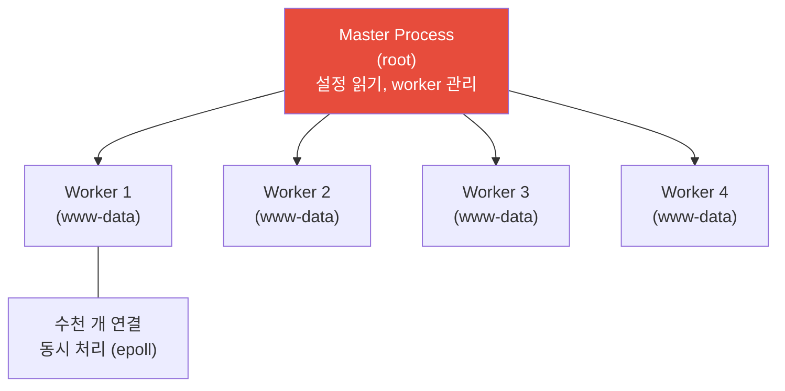
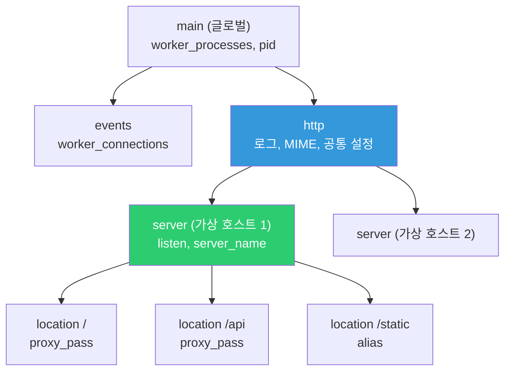
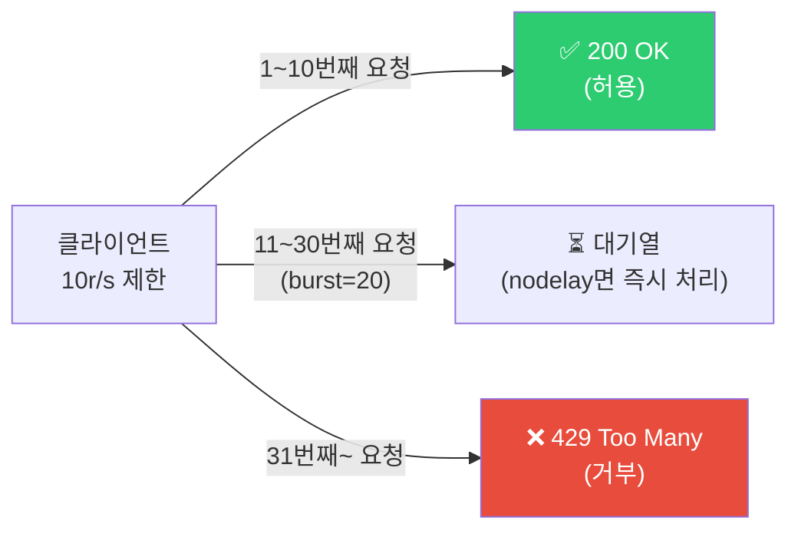

# Nginx / HAProxy 실무 설정

> [이전 강의](./06-load-balancing)에서 로드 밸런싱의 원리를 배웠어요. 이번에는 Nginx와 HAProxy를 **실무 수준**으로 깊이 다뤄볼게요. rate limiting, 캐싱, gzip 압축, 로깅, 성능 튜닝까지 — 프로덕션에서 바로 쓸 수 있는 설정을 완성할 거예요.

---

## 🎯 이걸 왜 알아야 하나?

```
DevOps가 Nginx/HAProxy로 하는 일:
• 리버스 프록시 + 로드 밸런싱              → 매일 다룸
• HTTPS/TLS 종단                         → 인증서 설정
• rate limiting (과도한 요청 차단)         → DDoS 방어, API 보호
• gzip 압축 (응답 크기 줄이기)            → 성능 향상
• 캐싱 (반복 요청 줄이기)                → 백엔드 부하 감소
• 접속 로그 + 에러 로그 관리              → 장애 추적
• 성능 튜닝 (worker, connection 등)       → 대규모 트래픽 대응
• 여러 서비스 라우팅 (도메인/경로별)       → 마이크로서비스 게이트웨이
```

---

## 🧠 핵심 개념

### Nginx 아키텍처

Nginx는 **이벤트 기반(event-driven)** 아키텍처예요. Apache처럼 요청마다 프로세스/스레드를 만들지 않고, 소수의 worker가 수천 개 연결을 비동기로 처리해요.



```bash
# 프로세스 확인
ps aux | grep nginx
# root      900  ... nginx: master process /usr/sbin/nginx
# www-data  901  ... nginx: worker process
# www-data  902  ... nginx: worker process
# www-data  903  ... nginx: worker process
# www-data  904  ... nginx: worker process
# → master 1개 + worker 4개 (CPU 코어 수만큼)
```

---

## 🔍 상세 설명 — Nginx 설정 구조

### 설정 파일 위치

```bash
/etc/nginx/
├── nginx.conf                  # ⭐ 메인 설정 (글로벌)
├── conf.d/                     # ⭐ 사이트별 설정 (여기에 추가!)
│   ├── default.conf
│   └── myapp.conf
├── sites-available/            # 사이트 설정 (Ubuntu 방식)
│   └── default
├── sites-enabled/              # 활성화된 사이트 (심볼릭 링크)
│   └── default -> ../sites-available/default
├── mime.types                  # MIME 타입 정의
├── modules-enabled/            # 활성화된 모듈
└── snippets/                   # 재사용 가능한 설정 조각
    └── ssl-params.conf
```

### nginx.conf 구조

```bash
# /etc/nginx/nginx.conf — 전체 구조

# === 글로벌 컨텍스트 ===
user www-data;                           # worker 실행 사용자
worker_processes auto;                   # worker 수 (auto = CPU 코어 수)
pid /run/nginx.pid;
worker_rlimit_nofile 65535;             # worker당 최대 파일 수 (ulimit)

# === 이벤트 컨텍스트 ===
events {
    worker_connections 16384;            # worker당 동시 연결 수
    multi_accept on;                     # 한 번에 여러 연결 수락
    use epoll;                           # Linux에서 최고 성능
}

# === HTTP 컨텍스트 ===
http {
    # MIME 타입
    include /etc/nginx/mime.types;
    default_type application/octet-stream;

    # 기본 성능 설정
    sendfile on;                         # 커널 레벨 파일 전송 (빠름)
    tcp_nopush on;                       # 헤더+바디를 한 패킷에
    tcp_nodelay on;                      # 작은 패킷도 즉시 전송
    keepalive_timeout 65;                # Keep-Alive 유지 시간
    types_hash_max_size 2048;

    # 로그
    access_log /var/log/nginx/access.log;
    error_log /var/log/nginx/error.log;

    # 사이트별 설정 포함
    include /etc/nginx/conf.d/*.conf;
    include /etc/nginx/sites-enabled/*;
}
```

### 설정 블록 계층 구조



---

### 프로덕션 Nginx 설정 (★ 실무 완성판)

```bash
# /etc/nginx/conf.d/myapp.conf — 프로덕션 실무 설정

# ─── 업스트림 (백엔드 서버) ───
upstream app_backend {
    least_conn;                                # 가장 적은 연결로 분배
    server 10.0.10.50:8080 max_fails=3 fail_timeout=30s;
    server 10.0.10.51:8080 max_fails=3 fail_timeout=30s;
    server 10.0.10.52:8080 max_fails=3 fail_timeout=30s backup;
    keepalive 32;                              # 업스트림 Keep-Alive
}

# ─── Rate Limiting 존 정의 ───
limit_req_zone $binary_remote_addr zone=api_limit:10m rate=10r/s;
limit_req_zone $binary_remote_addr zone=login_limit:10m rate=1r/s;
#              ^^^^^^^^^^^^^^^^^^^       ^^^^^^^^^ ^^^  ^^^^^^^^
#              클라이언트 IP 기반         존 이름   메모리  초당 허용

limit_conn_zone $binary_remote_addr zone=conn_limit:10m;

# ─── HTTP → HTTPS 리다이렉트 ───
server {
    listen 80;
    server_name myapp.example.com;
    return 301 https://$host$request_uri;
}

# ─── 메인 서버 블록 ───
server {
    listen 443 ssl http2;
    server_name myapp.example.com;

    # ─── TLS 설정 (./05-tls-certificate 참고) ───
    ssl_certificate     /etc/letsencrypt/live/myapp.example.com/fullchain.pem;
    ssl_certificate_key /etc/letsencrypt/live/myapp.example.com/privkey.pem;
    ssl_protocols TLSv1.2 TLSv1.3;
    ssl_ciphers ECDHE-ECDSA-AES128-GCM-SHA256:ECDHE-RSA-AES128-GCM-SHA256:ECDHE-ECDSA-AES256-GCM-SHA384:ECDHE-RSA-AES256-GCM-SHA384;
    ssl_prefer_server_ciphers off;
    ssl_session_cache shared:SSL:10m;
    ssl_session_timeout 1d;
    ssl_stapling on;
    ssl_stapling_verify on;

    # ─── 보안 헤더 ───
    add_header Strict-Transport-Security "max-age=31536000; includeSubDomains" always;
    add_header X-Frame-Options "SAMEORIGIN" always;
    add_header X-Content-Type-Options "nosniff" always;
    add_header X-XSS-Protection "1; mode=block" always;
    add_header Referrer-Policy "strict-origin-when-cross-origin" always;

    # ─── gzip 압축 ───
    gzip on;
    gzip_vary on;
    gzip_proxied any;
    gzip_comp_level 4;                         # 1~9 (4가 성능/압축 균형)
    gzip_min_length 256;                       # 256바이트 이하는 압축 안 함
    gzip_types
        text/plain
        text/css
        text/xml
        text/javascript
        application/json
        application/javascript
        application/xml
        application/rss+xml
        image/svg+xml;

    # ─── 로그 설정 ───
    access_log /var/log/nginx/myapp.access.log combined buffer=16k flush=5s;
    error_log  /var/log/nginx/myapp.error.log warn;

    # ─── 클라이언트 설정 ───
    client_max_body_size 50m;                  # 업로드 최대 크기
    client_body_timeout 30s;                   # 바디 수신 타임아웃
    client_header_timeout 10s;                 # 헤더 수신 타임아웃
    send_timeout 30s;                          # 응답 전송 타임아웃

    # ─── 프록시 기본 설정 ───
    proxy_http_version 1.1;
    proxy_set_header Host $host;
    proxy_set_header X-Real-IP $remote_addr;
    proxy_set_header X-Forwarded-For $proxy_add_x_forwarded_for;
    proxy_set_header X-Forwarded-Proto $scheme;
    proxy_set_header Connection "";
    proxy_connect_timeout 10s;
    proxy_read_timeout 60s;
    proxy_send_timeout 60s;
    proxy_buffering on;
    proxy_buffer_size 4k;
    proxy_buffers 8 4k;

    # ─── 메인 앱 ───
    location / {
        proxy_pass http://app_backend;

        # Rate Limiting: 초당 10개, 버스트 20개까지 대기열
        limit_req zone=api_limit burst=20 nodelay;
        limit_req_status 429;                  # 초과 시 429 Too Many Requests
    }

    # ─── API ───
    location /api/ {
        proxy_pass http://app_backend;
        limit_req zone=api_limit burst=20 nodelay;
        limit_conn conn_limit 50;              # IP당 동시 연결 50개 제한
    }

    # ─── 로그인 (더 엄격한 제한) ───
    location /api/auth/login {
        proxy_pass http://app_backend;
        limit_req zone=login_limit burst=5 nodelay;   # 초당 1개, 버스트 5개
        limit_req_status 429;
    }

    # ─── 정적 파일 (Nginx가 직접 서빙) ───
    location /static/ {
        alias /var/www/myapp/static/;
        expires 30d;                           # 브라우저 캐시 30일
        add_header Cache-Control "public, immutable";
        access_log off;                        # 정적 파일은 로그 안 남김
    }

    # ─── 헬스체크 ───
    location /health {
        proxy_pass http://app_backend;
        access_log off;                        # 헬스체크 로그는 너무 많으니 제외
    }

    # ─── WebSocket ───
    location /ws/ {
        proxy_pass http://app_backend;
        proxy_http_version 1.1;
        proxy_set_header Upgrade $http_upgrade;
        proxy_set_header Connection "upgrade";
        proxy_read_timeout 86400s;
    }

    # ─── 프록시 캐시 (선택) ───
    location /api/public/ {
        proxy_pass http://app_backend;
        proxy_cache my_cache;
        proxy_cache_valid 200 10m;             # 200 응답을 10분 캐시
        proxy_cache_valid 404 1m;
        proxy_cache_use_stale error timeout updating;
        add_header X-Cache-Status $upstream_cache_status;
    }

    # ─── 에러 페이지 ───
    error_page 502 503 504 /50x.html;
    location = /50x.html {
        root /var/www/error-pages;
        internal;
    }

    # ─── 보안: 숨김 파일 접근 차단 ───
    location ~ /\. {
        deny all;
        access_log off;
        log_not_found off;
    }
}
```

---

### Rate Limiting 상세



```bash
# Rate Limiting 동작 이해

# rate=10r/s → 초당 10개 허용 (100ms 간격)
# burst=20 → 추가 20개까지 대기열 허용
# nodelay → 대기열에 있는 요청을 지연 없이 즉시 처리

# nodelay 없으면:
# → 초과 요청이 큐에 쌓이고, 100ms 간격으로 하나씩 처리
# → 사용자가 느린 응답을 경험

# nodelay 있으면:
# → 버스트 내 요청은 즉시 처리, 버스트 초과하면 429
# → 대부분의 경우 nodelay를 쓰는 게 좋아요

# Rate Limiting 테스트
# 빠르게 30개 요청 보내기
for i in $(seq 1 30); do
    code=$(curl -s -o /dev/null -w "%{http_code}" https://myapp.example.com/api/test)
    echo "요청 $i: $code"
done
# 요청 1: 200
# ...
# 요청 10: 200
# 요청 11: 200   ← burst 범위
# ...
# 요청 30: 200   ← burst 범위 끝
# 요청 31: 429   ← 제한 초과! Too Many Requests

# 에러 로그에서 Rate Limiting 확인
grep "limiting requests" /var/log/nginx/myapp.error.log
# ... limiting requests, excess: 20.500 by zone "api_limit" ...
```

```bash
# Rate Limiting 고급 패턴

# IP 대신 API 키로 제한
# map $http_x_api_key $api_key_limit {
#     default $binary_remote_addr;
#     "~.+"   $http_x_api_key;
# }
# limit_req_zone $api_key_limit zone=api_key:10m rate=100r/s;

# 특정 IP 제한 면제 (내부 서버, 모니터링 등)
# geo $limit {
#     default 1;
#     10.0.0.0/16 0;     # 내부 VPC는 제한 안 함
#     127.0.0.1 0;
# }
# map $limit $limit_key {
#     0 "";
#     1 $binary_remote_addr;
# }
# limit_req_zone $limit_key zone=api_limit:10m rate=10r/s;
```

---

### gzip 압축 상세

```bash
# gzip이 왜 중요한가?
# JSON 응답 100KB → gzip 후 15KB (85% 감소!)
# → 네트워크 전송 시간 대폭 줄어듦 → 사용자 체감 속도 향상

# gzip 압축 확인
curl -H "Accept-Encoding: gzip" -sI https://myapp.example.com/api/data
# Content-Encoding: gzip     ← 압축됨!
# Content-Length: 1500        ← 원본 10000 → 1500으로 줄어듦

# 압축률 비교 테스트
curl -s https://myapp.example.com/api/data | wc -c
# 10000     ← 비압축 크기

curl -s -H "Accept-Encoding: gzip" https://myapp.example.com/api/data | wc -c
# 1500      ← 압축 크기 (85% 감소!)

# gzip_comp_level 가이드:
# 1 = 최소 압축, 빠른 속도
# 4 = 균형 (⭐ 추천)
# 9 = 최대 압축, 느린 속도 (CPU 많이 씀)
# → 4~6이면 대부분 충분. 9는 거의 안 씀.

# ⚠️ 이미 압축된 파일은 gzip 안 하기!
# 이미지(jpg, png), 동영상, zip 파일 등은 gzip해도 효과 없고 CPU만 낭비
# → gzip_types에 image/jpeg, image/png 등을 넣지 마세요!
```

---

### Nginx 로그 설정

```bash
# 기본 로그 형식
# 10.0.0.5 - - [12/Mar/2025:14:30:00 +0000] "GET /api/users HTTP/1.1" 200 1234 "-" "curl/7.81.0"

# 커스텀 로그 형식 (실무 추천)
log_format main_ext
    '$remote_addr - $remote_user [$time_local] '
    '"$request" $status $body_bytes_sent '
    '"$http_referer" "$http_user_agent" '
    'rt=$request_time '                        # ⭐ 요청 처리 시간
    'ua=$upstream_addr '                       # ⭐ 어떤 백엔드로 갔는지
    'us=$upstream_status '                     # ⭐ 백엔드 응답 코드
    'ut=$upstream_response_time '              # ⭐ 백엔드 응답 시간
    'cs=$upstream_cache_status';               # 캐시 히트/미스

access_log /var/log/nginx/myapp.access.log main_ext buffer=16k flush=5s;

# 출력 예시:
# 10.0.0.5 - - [12/Mar/2025:14:30:00 +0000] "GET /api/users HTTP/1.1" 200 1234
#   "-" "curl/7.81.0" rt=0.050 ua=10.0.10.50:8080 us=200 ut=0.048 cs=-

# 유용한 로그 분석 (../01-linux/08-log 참고)

# 느린 요청 찾기 (1초 이상)
awk '$0 ~ /rt=[0-9]+\.[0-9]+/ {
    match($0, /rt=([0-9]+\.[0-9]+)/, a);
    if (a[1]+0 > 1.0) print a[1], $0
}' /var/log/nginx/myapp.access.log | sort -rn | head -10

# 상태 코드 분포
awk '{print $9}' /var/log/nginx/myapp.access.log | sort | uniq -c | sort -rn | head
#  15000 200
#   2000 304
#    500 404
#     20 502
#     10 429

# 5xx 에러만 추출
awk '$9 >= 500' /var/log/nginx/myapp.access.log | tail -20

# 시간대별 요청 수
awk '{print $4}' /var/log/nginx/myapp.access.log | cut -d: -f2 | sort | uniq -c
```

```bash
# 특정 경로 로그 제외 (너무 많은 헬스체크 로그)
location /health {
    proxy_pass http://app_backend;
    access_log off;                # 헬스체크 로그 안 남김
}

# 조건부 로그 (4xx, 5xx만 별도 파일에)
map $status $loggable {
    ~^[45] 1;
    default 0;
}
access_log /var/log/nginx/myapp.error-only.log main_ext if=$loggable;
```

---

### Nginx 프록시 캐시

```bash
# nginx.conf의 http 블록에 캐시 존 정의
proxy_cache_path /var/cache/nginx/my_cache
    levels=1:2                    # 디렉토리 깊이
    keys_zone=my_cache:10m        # 캐시 키 메모리 (10MB ≈ 80,000 키)
    max_size=1g                   # 디스크 최대 사용량
    inactive=60m                  # 60분간 접근 없으면 삭제
    use_temp_path=off;

# server 블록 안에서 사용
location /api/public/ {
    proxy_pass http://app_backend;
    
    proxy_cache my_cache;
    proxy_cache_valid 200 10m;          # 200 응답을 10분 캐시
    proxy_cache_valid 404 1m;           # 404도 1분 캐시 (백엔드 부하 줄임)
    proxy_cache_key "$scheme$request_method$host$request_uri";
    proxy_cache_use_stale error timeout updating http_500 http_502 http_503;
    #                      ^^^^^^^^^^^^^^^^^^^^^^^^^^^^^^^^^^^^^^^^^^^^^^^^^^
    #                      백엔드 장애 시 오래된 캐시라도 보여줌!
    
    add_header X-Cache-Status $upstream_cache_status;
    # HIT = 캐시에서 응답
    # MISS = 캐시 없어서 백엔드에서 가져옴
    # EXPIRED = 캐시 만료, 백엔드에서 새로 가져옴
    # STALE = 백엔드 장애로 오래된 캐시 사용
}

# 캐시 상태 확인
curl -I https://myapp.example.com/api/public/data
# X-Cache-Status: MISS      ← 첫 요청: 캐시 없음

curl -I https://myapp.example.com/api/public/data
# X-Cache-Status: HIT       ← 두 번째: 캐시에서!

# 캐시 수동 삭제
sudo rm -rf /var/cache/nginx/my_cache/*
# 또는 Nginx Plus: proxy_cache_purge
```

---

### Nginx 성능 튜닝

```bash
# /etc/nginx/nginx.conf — 성능 튜닝 핵심

# === Worker 설정 ===
worker_processes auto;              # CPU 코어 수만큼 (보통 auto)
worker_rlimit_nofile 65535;         # worker당 최대 열린 파일 수
                                    # (../01-linux/13-kernel 의 ulimit 참고)

events {
    worker_connections 16384;       # worker당 동시 연결 수
    multi_accept on;                # 여러 연결 동시 수락
    use epoll;                      # Linux 최적화 이벤트 모델
}

# 동시 처리 가능한 최대 연결 수:
# = worker_processes × worker_connections
# = 4 × 16384 = 65,536 동시 연결!

# === HTTP 성능 설정 ===
http {
    sendfile on;                    # 커널에서 직접 파일 전송 (빠름)
    tcp_nopush on;                  # 헤더+바디 한 패킷에 전송
    tcp_nodelay on;                 # Nagle 알고리즘 비활성화 (지연 줄임)
    
    keepalive_timeout 65;           # 클라이언트 Keep-Alive
    keepalive_requests 1000;        # Keep-Alive당 최대 요청 수
    
    # 버퍼 크기 (대부분 기본값 OK)
    client_body_buffer_size 16k;
    client_header_buffer_size 1k;
    large_client_header_buffers 4 8k;
    
    # 타임아웃
    client_body_timeout 30s;
    client_header_timeout 10s;
    send_timeout 30s;
    reset_timedout_connection on;   # 타임아웃된 연결 즉시 해제
    
    # 파일 캐시 (정적 파일 서빙 시)
    open_file_cache max=10000 inactive=20s;
    open_file_cache_valid 30s;
    open_file_cache_min_uses 2;
}
```

```bash
# 현재 Nginx 연결 상태 확인

# stub_status 모듈 활성화 (기본 내장)
# server {
#     listen 8080;
#     location /nginx_status {
#         stub_status on;
#         allow 10.0.0.0/16;    # 내부에서만 접근
#         deny all;
#     }
# }

curl http://localhost:8080/nginx_status
# Active connections: 150
# server accepts handled requests
#  50000 50000 200000
# Reading: 5 Writing: 20 Waiting: 125

# Active connections: 현재 활성 연결 수
# Reading: 요청 헤더를 읽는 중인 연결
# Writing: 응답을 보내는 중인 연결
# Waiting: Keep-Alive 대기 중인 연결 (유휴)
# → Waiting이 대부분이면 정상 (유휴 연결)
# → Reading/Writing이 높으면 트래픽 많음
```

---

## 🔍 상세 설명 — HAProxy 실무

### HAProxy 프로덕션 설정

```bash
# /etc/haproxy/haproxy.cfg

global
    log /dev/log local0
    log /dev/log local1 notice
    maxconn 100000                          # 전체 최대 연결 수
    user haproxy
    group haproxy
    daemon
    
    # TLS 설정
    ssl-default-bind-ciphers ECDHE-ECDSA-AES128-GCM-SHA256:ECDHE-RSA-AES128-GCM-SHA256
    ssl-default-bind-options ssl-min-ver TLSv1.2
    tune.ssl.default-dh-param 2048

defaults
    log     global
    mode    http
    option  httplog
    option  dontlognull
    option  forwardfor                      # X-Forwarded-For 추가
    option  http-server-close               # 서버 측 연결 재사용
    
    timeout connect 5s
    timeout client  30s
    timeout server  30s
    timeout http-request 10s                # 요청 헤더 수신 타임아웃
    timeout http-keep-alive 10s
    timeout queue 30s                       # 대기열 타임아웃
    
    retries 3
    
    # 기본 에러 페이지
    errorfile 502 /etc/haproxy/errors/502.http
    errorfile 503 /etc/haproxy/errors/503.http

# ─── 프론트엔드 ───
frontend http_front
    bind *:80
    bind *:443 ssl crt /etc/ssl/certs/myapp.pem alpn h2,http/1.1
    
    # HTTP → HTTPS 리다이렉트
    http-request redirect scheme https unless { ssl_fc }
    
    # 헤더 추가
    http-request set-header X-Forwarded-Proto https if { ssl_fc }
    http-response set-header Strict-Transport-Security "max-age=31536000"
    
    # Rate Limiting (stick table)
    stick-table type ip size 100k expire 30s store http_req_rate(10s)
    http-request track-sc0 src
    http-request deny deny_status 429 if { sc_http_req_rate(0) gt 100 }
    #                                      ^^^^^^^^^^^^^^^^^^^^^^^^^^
    #                                      10초간 100개 초과하면 429
    
    # ACL (조건부 라우팅)
    acl is_api path_beg /api
    acl is_static path_beg /static
    acl is_websocket hdr(Upgrade) -i WebSocket
    acl is_admin hdr(Host) -i admin.example.com
    
    use_backend api_servers if is_api
    use_backend static_servers if is_static
    use_backend ws_servers if is_websocket
    use_backend admin_servers if is_admin
    default_backend web_servers

# ─── 백엔드: 웹 서버 ───
backend web_servers
    balance roundrobin
    option httpchk GET /health
    http-check expect status 200
    
    # 서버 목록
    server web1 10.0.10.50:8080 check inter 5s fall 3 rise 2 weight 3
    server web2 10.0.10.51:8080 check inter 5s fall 3 rise 2 weight 3
    server web3 10.0.10.52:8080 check inter 5s fall 3 rise 2 backup
    #                           ^^^^^  ^^^^^^^  ^^^^^^ ^^^^^
    #                           체크ON  5초 간격 3번실패 2번성공시 복구

# ─── 백엔드: API 서버 ───
backend api_servers
    balance leastconn
    option httpchk GET /api/health
    http-check expect status 200
    
    # gzip 압축
    compression algo gzip
    compression type application/json text/plain text/css
    
    server api1 10.0.10.60:8080 check
    server api2 10.0.10.61:8080 check

# ─── 백엔드: WebSocket ───
backend ws_servers
    balance source                          # IP hash (WebSocket은 sticky 필요)
    timeout tunnel 1h                       # WebSocket 긴 연결
    server ws1 10.0.10.70:8080 check
    server ws2 10.0.10.71:8080 check

# ─── 백엔드: 정적 파일 ───
backend static_servers
    balance roundrobin
    server static1 10.0.10.80:80 check

# ─── 백엔드: 관리 페이지 ───
backend admin_servers
    balance roundrobin
    # IP 제한
    acl allowed_ip src 10.0.0.0/16 192.168.0.0/24
    http-request deny unless allowed_ip
    server admin1 10.0.10.90:8080 check

# ─── 통계 페이지 ───
listen stats
    bind *:8404
    stats enable
    stats uri /stats
    stats refresh 10s
    stats auth admin:SecurePassword123
    stats admin if TRUE                     # 런타임 관리 가능
```

### HAProxy 운영 명령어

```bash
# 설정 검증
sudo haproxy -c -f /etc/haproxy/haproxy.cfg
# Configuration file is valid

# 무중단 리로드
sudo systemctl reload haproxy

# 통계 API (소켓)
echo "show stat" | sudo socat stdio /var/run/haproxy.sock | column -t -s,
# pxname     svname  status  weight  act  ...
# web_servers web1   UP      3       Y
# web_servers web2   UP      3       Y
# web_servers web3   UP      0       Y    ← backup

# 서버 상태 확인
echo "show servers state" | sudo socat stdio /var/run/haproxy.sock

# 서버 유지보수 모드 (drain: 새 요청 안 받지만 기존 연결 유지)
echo "set server web_servers/web1 state drain" | sudo socat stdio /var/run/haproxy.sock
# → 배포 전에 drain → 배포 → ready

# 서버 복구
echo "set server web_servers/web1 state ready" | sudo socat stdio /var/run/haproxy.sock

# 서버 가중치 실시간 변경 (카나리 배포)
echo "set server web_servers/web1 weight 1" | sudo socat stdio /var/run/haproxy.sock
# → 기존 weight=3에서 1로 → 트래픽 33%로 줄임

# 세션 수 확인
echo "show sess" | sudo socat stdio /var/run/haproxy.sock | wc -l
```

### HAProxy 통계 페이지

```bash
# 브라우저에서 http://server:8404/stats 접속
# 또는 curl로
curl -u admin:SecurePassword123 http://localhost:8404/stats

# 통계 페이지에서 볼 수 있는 것:
# - 각 서버의 상태 (UP/DOWN/DRAIN)
# - 현재 연결 수, 세션 수
# - 요청 수, 에러 수
# - 응답 시간 (평균, 최대)
# - 바이트 전송량
# - Health Check 상태
# → Prometheus exporter로 수집해서 Grafana에서 볼 수도 있어요
# → 이건 08-observability에서 자세히!
```

---

## 💻 실습 예제

### 실습 1: Nginx rate limiting 체험

```bash
# 1. rate limiting 설정
cat << 'NGINX' | sudo tee /etc/nginx/conf.d/ratelimit-test.conf
limit_req_zone $binary_remote_addr zone=test_limit:10m rate=2r/s;

server {
    listen 9091;
    location / {
        limit_req zone=test_limit burst=5 nodelay;
        limit_req_status 429;
        return 200 "OK\n";
    }
}
NGINX

sudo nginx -t && sudo systemctl reload nginx

# 2. 테스트: 빠르게 20개 요청
for i in $(seq 1 20); do
    code=$(curl -s -o /dev/null -w "%{http_code}" http://localhost:9091/)
    echo "요청 $i: $code"
done
# 요청 1: 200
# 요청 2: 200
# ...
# 요청 7: 200     ← rate 2 + burst 5 = 7개까지 OK
# 요청 8: 429     ← 초과! Too Many Requests
# 요청 9: 429

# 3. 정리
sudo rm /etc/nginx/conf.d/ratelimit-test.conf
sudo systemctl reload nginx
```

### 실습 2: gzip 압축 효과 확인

```bash
# 1. 큰 JSON 파일 생성
python3 -c "
import json
data = {'users': [{'id': i, 'name': f'User {i}', 'email': f'user{i}@example.com', 'bio': 'A' * 200} for i in range(100)]}
print(json.dumps(data))
" > /tmp/big.json

# 2. 파일 크기 확인
ls -lh /tmp/big.json
# 약 30KB

# 3. gzip 압축 비교
wc -c < /tmp/big.json
# 30000   ← 원본

gzip -c /tmp/big.json | wc -c
# 3500    ← gzip 후 (~88% 감소!)

# → Nginx gzip을 켜면 이 효과가 자동으로 적용!
rm /tmp/big.json
```

### 실습 3: Nginx 로그 분석

```bash
# access.log가 있다면:

# 1. 상태 코드 분포
awk '{print $9}' /var/log/nginx/access.log 2>/dev/null | sort | uniq -c | sort -rn | head -5

# 2. 요청 시간이 긴 URL (rt= 필드가 있을 때)
grep "rt=" /var/log/nginx/access.log 2>/dev/null | \
    sed 's/.*rt=\([0-9.]*\).*/\1/' | \
    sort -rn | head -5

# 3. IP별 요청 수
awk '{print $1}' /var/log/nginx/access.log 2>/dev/null | sort | uniq -c | sort -rn | head -5

# 4. 429 (rate limited) 된 요청 확인
grep '" 429 ' /var/log/nginx/access.log 2>/dev/null | wc -l
```

---

## 🏢 실무에서는?

### 시나리오 1: API Rate Limiting 설계

```bash
# "API에 rate limiting을 걸어야 하는데 어떻게 설정할까요?"

# 단계별 설계:

# 1. 엔드포인트별 제한
# /api/public/*     → 인증 없이 접근, IP당 30r/s
# /api/auth/login   → 로그인 시도, IP당 5r/min (브루트포스 방지)
# /api/*            → 인증된 요청, API키당 100r/s

limit_req_zone $binary_remote_addr zone=public:10m rate=30r/s;
limit_req_zone $binary_remote_addr zone=login:10m rate=5r/m;
limit_req_zone $http_x_api_key zone=authenticated:10m rate=100r/s;

# 2. 429 응답 시 커스텀 메시지
error_page 429 = @rate_limit_exceeded;
location @rate_limit_exceeded {
    default_type application/json;
    return 429 '{"error": "Too many requests. Please try again later."}';
}

# 3. 모니터링
# → 429 응답 수를 Prometheus로 수집 → Grafana 대시보드
# → 임계값 초과 시 알림 (Slack 등)
```

### 시나리오 2: 무중단 배포 with HAProxy

```bash
#!/bin/bash
# HAProxy를 이용한 무중단 배포 스크립트

HAPROXY_SOCK="/var/run/haproxy.sock"
BACKEND="web_servers"
SERVERS=("web1" "web2")

for server in "${SERVERS[@]}"; do
    echo "=== $server 배포 시작 ==="
    
    # 1. 서버를 drain 모드로 (새 요청 안 받음)
    echo "set server $BACKEND/$server state drain" | socat stdio $HAPROXY_SOCK
    echo "  drain 모드 설정"
    
    # 2. 기존 연결 완료 대기
    sleep 10
    echo "  기존 연결 완료 대기"
    
    # 3. 배포 (서버에서 앱 업데이트)
    ssh $server "cd /opt/app && git pull && npm install && systemctl restart myapp"
    echo "  앱 업데이트 완료"
    
    # 4. 헬스체크 대기
    for i in $(seq 1 30); do
        if curl -sf http://$server:8080/health > /dev/null; then
            echo "  헬스체크 통과"
            break
        fi
        sleep 1
    done
    
    # 5. 서버를 다시 활성화
    echo "set server $BACKEND/$server state ready" | socat stdio $HAPROXY_SOCK
    echo "  서버 활성화"
    
    echo "=== $server 배포 완료 ==="
    sleep 5    # 다음 서버 배포 전 안정화 대기
done

echo "전체 배포 완료!"
```

### 시나리오 3: Nginx 성능 문제 진단

```bash
# "Nginx가 느려요!" 진단 순서

# 1. 현재 연결 상태
curl -s http://localhost:8080/nginx_status
# Active connections: 15000     ← 너무 많다면?
# Reading: 500 Writing: 2000 Waiting: 12500

# 2. worker 설정 확인
grep -E "worker_processes|worker_connections" /etc/nginx/nginx.conf
# worker_processes 4;
# worker_connections 1024;      ← 4 × 1024 = 4,096 → 15,000 연결은 못 감당!

# 해결: worker_connections 올리기
# worker_connections 16384;     ← 4 × 16384 = 65,536

# 3. ulimit 확인 (../01-linux/13-kernel 참고)
cat /proc/$(pgrep -o nginx)/limits | grep "Max open files"
# Max open files  1024  1024  ← 너무 낮음!

# 해결: systemd override
sudo systemctl edit nginx
# [Service]
# LimitNOFILE=65535

# 4. 커널 파라미터 확인
sysctl net.core.somaxconn
# 128    ← 너무 낮음!

# 해결:
sudo sysctl net.core.somaxconn=65535

# 5. 에러 로그 확인
tail -20 /var/log/nginx/error.log
# worker_connections are not enough    ← 연결 수 부족!
# 768 open() "/var/log/nginx/access.log" failed (24: Too many open files) ← ulimit!
```

---

## ⚠️ 자주 하는 실수

### 1. worker_connections를 기본값으로 놓기

```bash
# ❌ 기본값 768 또는 1024 → 트래픽 많으면 부족!
events {
    worker_connections 768;
}

# ✅ 프로덕션에서는 충분히 높게
events {
    worker_connections 16384;
}
# + worker_rlimit_nofile 65535;
# + ulimit도 같이 올려야 함!
```

### 2. proxy_set_header를 location마다 반복

```bash
# ❌ 모든 location에 같은 헤더를 반복
location /api { proxy_set_header Host $host; proxy_set_header X-Real-IP $remote_addr; ... }
location /web { proxy_set_header Host $host; proxy_set_header X-Real-IP $remote_addr; ... }

# ✅ server 블록에 한 번만 설정 → 모든 location에 상속
server {
    proxy_set_header Host $host;
    proxy_set_header X-Real-IP $remote_addr;
    proxy_set_header X-Forwarded-For $proxy_add_x_forwarded_for;
    
    location /api { proxy_pass http://api_backend; }
    location /web { proxy_pass http://web_backend; }
}
```

### 3. gzip과 TLS를 같이 쓸 때 BREACH 공격 무시

```bash
# ⚠️ HTTPS + gzip = BREACH 공격에 취약할 수 있음
# (비밀 토큰이 포함된 응답을 압축하면 크기 차이로 추측 가능)

# 대부분의 경우 실질적 위험은 낮지만, 보안이 중요하면:
# - 동적 응답 중 민감한 데이터는 gzip 제외
# - CSRF 토큰을 매 요청 변경
# - 정적 파일만 gzip (보통 이렇게 해도 충분)
```

### 4. HAProxy 설정 변경 후 reload 대신 restart

```bash
# ❌ restart → 순간적으로 연결 끊김!
sudo systemctl restart haproxy

# ✅ reload → 기존 연결 유지하면서 새 설정 적용
sudo systemctl reload haproxy

# Nginx도 마찬가지!
sudo systemctl reload nginx    # ✅
sudo systemctl restart nginx   # ❌ (불가피할 때만)
```

### 5. 에러 페이지를 설정 안 해서 Nginx 기본 페이지 노출

```bash
# ❌ 502 에러 시 "nginx/1.24.0" 기본 페이지 → 서버 정보 노출!

# ✅ 커스텀 에러 페이지
error_page 502 503 504 /50x.html;
location = /50x.html {
    root /var/www/error-pages;
    internal;
}

# ✅ 서버 버전 숨기기
server_tokens off;
# → "nginx" 대신 아무것도 안 나옴 (또는 "nginx"만)
```

---

## 📝 정리

### Nginx 설정 체크리스트 (프로덕션)

```
✅ worker_processes auto + worker_connections 16384
✅ worker_rlimit_nofile 65535 + systemd LimitNOFILE
✅ TLS 1.2+ / HSTS / 보안 헤더
✅ gzip 활성화 (text/json/css/js)
✅ rate limiting (API, 로그인 각각)
✅ proxy_set_header (Host, X-Real-IP, X-Forwarded-For, X-Forwarded-Proto)
✅ 업스트림 keepalive + health check (max_fails)
✅ 커스텀 로그 형식 (request_time, upstream 정보)
✅ 커스텀 에러 페이지 + server_tokens off
✅ 정적 파일은 Nginx가 직접 서빙 + 캐시 헤더
✅ 헬스체크 경로 access_log off
```

### Nginx vs HAProxy 선택

```
Nginx:    웹서버 + 프록시 겸용, 정적 파일 서빙 필요, 소~중규모
HAProxy:  순수 로드 밸런서, 상세 통계, 런타임 관리, L4 필요, 대규모
둘 다:    함께 사용 (HAProxy 앞단 + Nginx 각 서버)
AWS:      ALB/NLB로 대체 가능 (관리 부담 줄임)
```

### 핵심 명령어

```bash
sudo nginx -t                    # 설정 검증
sudo systemctl reload nginx      # 무중단 리로드
curl -I http://localhost:8080/nginx_status  # 연결 상태

sudo haproxy -c -f /etc/haproxy/haproxy.cfg  # 설정 검증
sudo systemctl reload haproxy    # 무중단 리로드
echo "show stat" | socat stdio /var/run/haproxy.sock  # 상태 확인
```

---

## 🔗 다음 강의

다음은 **[08-debugging](./08-debugging)** — 네트워크 디버깅 실전 (ping / traceroute / tcpdump / wireshark / curl / telnet) 이에요.

지금까지 배운 네트워크 지식을 총동원해서, 실제 장애 상황에서 **체계적으로 문제를 찾아내는 방법**을 실전으로 연습할 거예요.
