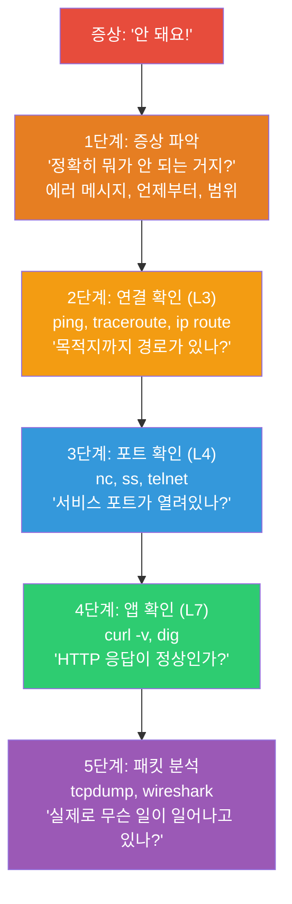
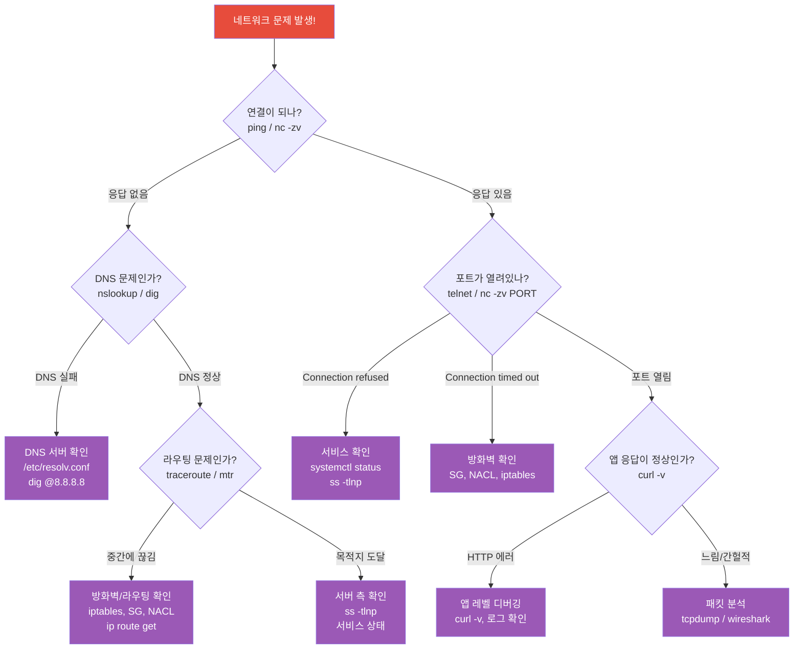
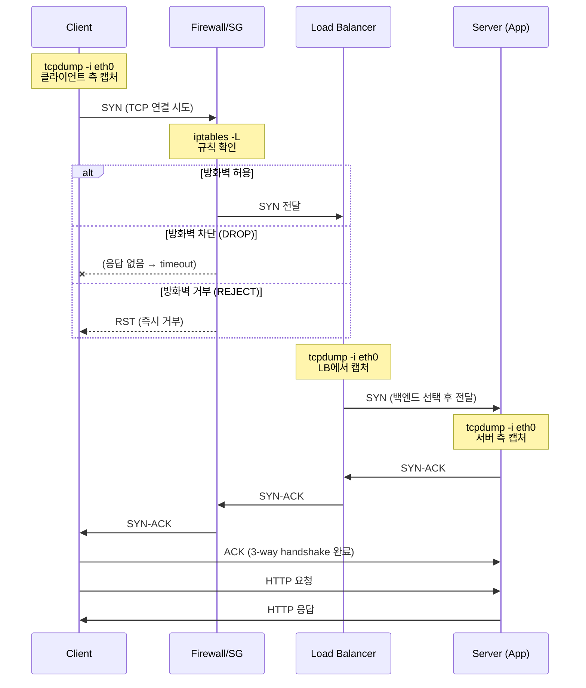

# 네트워크 디버깅 실전 (ping / traceroute / tcpdump / wireshark / curl / telnet)

> 지금까지 배운 네트워크 지식을 총동원해서, 실제 장애 상황에서 **체계적으로 문제를 찾아내는 방법**을 연습해볼게요. 네트워크 디버깅은 DevOps의 핵심 생존 기술이에요. "안 돼요"에서 "여기가 원인이에요"로 바꾸는 능력이에요.

---

## 🎯 이걸 왜 알아야 하나?

```
실무에서 네트워크 디버깅이 필요한 순간:
• "사이트가 안 열려요!"                    → DNS? 서버? 네트워크? 앱?
• "앱이 DB에 연결이 안 돼요"              → 포트? 방화벽? 라우팅?
• "갑자기 느려졌어요"                      → 어디서 지연이 발생하나?
• "간헐적으로 타임아웃이 나요"             → 패킷 유실? 재전송? 서버 과부하?
• "외부 API 호출이 안 돼요"               → DNS? TLS? 방화벽? API 장애?
• "특정 IP에서만 접속이 안 돼요"           → 라우팅? Security Group? ACL?
```

이전 강의들에서 각 도구를 부분적으로 다뤘어요. 이번에는 이 도구들을 **어떤 순서로, 어떻게 조합해서** 문제를 진단하는지에 집중해요.

---

## 🧠 핵심 개념

### 비유: 의사의 진단 순서

네트워크 디버깅은 **의사의 진단**과 같아요.

1. **문진** = 증상 파악 ("언제부터? 어떤 에러?")
2. **체온/혈압** = 기본 검사 (ping, curl)
3. **혈액 검사** = 상세 검사 (ss, traceroute)
4. **CT/MRI** = 정밀 검사 (tcpdump, wireshark)

중요한 건 **1번부터 순서대로** 하는 거예요. 증상도 안 보고 바로 MRI 찍지 않잖아요.

### 디버깅 계층 모델



### 네트워크 디버깅 판단 트리

어떤 도구를 먼저 써야 할지 모를 때, 이 판단 트리를 따라가면 돼요.



### 패킷 캡처 흐름 (네트워크 경로별)

실제 패킷이 클라이언트에서 서버까지 어떤 경로를 거치는지, 각 단계에서 tcpdump를 어디서 찍어야 하는지 이해하면 디버깅이 훨씬 쉬워져요.



### 프로토콜별 디버깅 흐름

네트워크 문제는 레이어에 따라 쓰는 도구가 달라요. 어떤 프로토콜 레이어에서 문제가 발생했는지 먼저 파악하는 게 핵심이에요.

```mermaid
flowchart LR
    subgraph L3["L3: Network"]
        PING["ping"]
        TRACE["traceroute"]
        MTR["mtr"]
        ROUTE["ip route"]
    end

    subgraph L4["L4: Transport"]
        NC["nc -zv"]
        SS["ss -tlnp"]
        TELNET["telnet"]
    end

    subgraph L7["L7: Application"]
        CURL["curl -v"]
        DIG["dig"]
        OPENSSL["openssl s_client"]
    end

    subgraph DEEP["패킷 분석"]
        TCPDUMP["tcpdump"]
        WIRESHARK["wireshark"]
    end

    L3 -->|"경로 OK?"| L4
    L4 -->|"포트 OK?"| L7
    L7 -->|"여전히 이상?"| DEEP

    style L3 fill:#f39c12,color:#fff
    style L4 fill:#3498db,color:#fff
    style L7 fill:#2ecc71,color:#fff
    style DEEP fill:#9b59b6,color:#fff
```



---

## 🔍 상세 설명 — 5단계 디버깅 프레임워크

### 1단계: 증상 파악

가장 중요한데 가장 많이 건너뛰는 단계예요. "안 돼요"만으로는 절대 디버깅할 수 없어요.

```bash
# 반드시 확인해야 할 것:
# 1. 정확한 에러 메시지가 뭔가?
#    "Connection refused" vs "Connection timed out" vs "Name resolution failed"
#    → 각각 원인이 완전히 다름!

# 2. 언제부터 안 되는 거지?
#    → 배포 후? 설정 변경 후? 갑자기?

# 3. 모든 곳에서 안 되는 건지, 특정 곳에서만?
#    → 서버 A에서 B로는 되는데, C에서 B로는 안 됨?
#    → 내부에서는 되는데 외부에서만 안 됨?

# 4. 항상 안 되는지, 간헐적인지?
#    → 항상: 설정/네트워크 문제
#    → 간헐적: 부하, 패킷 유실, 타임아웃

# 에러 메시지별 의미:
# "Connection refused"       → 서버가 해당 포트를 안 열고 있음
# "Connection timed out"     → 방화벽이 막거나, 서버가 응답 안 함
# "No route to host"        → 라우팅 문제
# "Name or service not known" → DNS 문제
# "SSL certificate problem"  → 인증서 문제
# "502 Bad Gateway"          → 프록시 뒷단 서버 문제
```

---

### 2단계: 연결 확인 (L3 — Network)

**"목적지까지 경로가 있나?"**

#### ping

```bash
# 기본 연결 테스트
ping -c 3 10.0.2.10
# PING 10.0.2.10 (10.0.2.10) 56(84) bytes of data.
# 64 bytes from 10.0.2.10: icmp_seq=1 ttl=64 time=0.523 ms
# 64 bytes from 10.0.2.10: icmp_seq=2 ttl=64 time=0.412 ms
# 64 bytes from 10.0.2.10: icmp_seq=3 ttl=64 time=0.389 ms
#
# --- 10.0.2.10 ping statistics ---
# 3 packets transmitted, 3 received, 0% packet loss, time 2003ms
# rtt min/avg/max/mdev = 0.389/0.441/0.523/0.058 ms
```

**ping 결과 해석:**

| 결과 | 의미 | 다음 조치 |
|------|------|----------|
| 정상 응답 | L3 연결 OK | → 3단계(포트 확인)로 |
| 100% packet loss, "timed out" | 방화벽 또는 서버 다운 | → traceroute, 방화벽 확인 |
| "No route to host" | 라우팅 문제 | → `ip route get` 확인 |
| "Network unreachable" | 네트워크 설정 문제 | → `ip addr`, `ip route` 확인 |
| 일부 유실 (30% loss 등) | 네트워크 불안정 | → mtr로 구간별 확인 |
| 응답은 오는데 느림 (>50ms 내부) | 네트워크 혼잡 | → traceroute로 병목 구간 |

```bash
# ⚠️ ping이 안 된다고 서버가 죽은 건 아님!
# AWS Security Group에서 ICMP를 차단하면 ping이 안 됨
# → TCP 포트 테스트로 확인

# ping 대신 TCP로 연결 테스트
nc -zv -w 3 10.0.2.10 22
# Connection to 10.0.2.10 22 port [tcp/ssh] succeeded!
# → ping은 안 되는데 SSH는 됨 = ICMP만 차단된 것
```

#### traceroute — 경로 추적

```bash
# 패킷이 목적지까지 어떤 경로로 가는지 추적
traceroute -n 10.0.2.10
#  1  10.0.1.1    0.5 ms   0.4 ms   0.3 ms      ← 게이트웨이 (정상)
#  2  10.0.0.1    1.0 ms   0.9 ms   0.8 ms      ← VPC 라우터 (정상)
#  3  10.0.2.10   1.5 ms   1.2 ms   1.3 ms      ← 목적지 도착! ✅

# 문제가 있는 경우:
traceroute -n api.example.com
#  1  10.0.1.1     0.5 ms   0.4 ms   0.3 ms
#  2  10.0.0.1     1.0 ms   0.9 ms   0.8 ms
#  3  52.93.x.x    2.0 ms   1.5 ms   1.8 ms
#  4  * * *                                       ← 응답 없음!
#  5  * * *
#  6  * * *
# → 홉 4에서 막힘! 이 구간에 방화벽이 있거나 라우팅 문제

# TCP traceroute (ICMP가 차단된 환경)
sudo traceroute -n -T -p 443 api.example.com
# → TCP SYN으로 경로 추적 (ICMP 차단되어도 됨)
```

#### mtr — ping + traceroute 결합 (실시간)

```bash
# mtr: 실시간으로 각 홉의 지연/유실 관찰
mtr -n --report -c 20 10.0.2.10
# HOST                    Loss%  Snt   Last   Avg  Best  Wrst StDev
# 1. 10.0.1.1              0.0%   20    0.5   0.4   0.3   0.8   0.1
# 2. 10.0.0.1              0.0%   20    1.0   0.9   0.7   1.5   0.2
# 3. 52.93.x.x             5.0%   20    2.0   2.5   1.5   8.0   1.5  ← 5% 유실!
# 4. 10.0.2.10             5.0%   20    2.5   2.8   2.0   9.0   1.8

# Loss%가 0이 아닌 홉 → 그 구간에서 패킷 유실 발생
# Avg가 급증하는 홉 → 그 구간에서 지연 발생
# Wrst(최악)가 매우 높은 홉 → 간헐적 지연

# 설치
sudo apt install mtr    # Ubuntu
```

#### ip route — 라우팅 확인

```bash
# "이 서버에서 목적지까지 경로가 있나?"
ip route get 10.0.2.10
# 10.0.2.10 via 10.0.1.1 dev eth0 src 10.0.1.50
# → 10.0.1.1 게이트웨이를 통해 eth0으로 나감 ✅

ip route get 192.168.100.1
# RTNETLINK answers: Network is unreachable
# → 이 목적지로 가는 경로가 없음! ❌
# → 라우팅 추가 또는 VPN 연결 필요
```

---

### 3단계: 포트 확인 (L4 — Transport)

**"서비스 포트가 열려있나?"**

#### nc (netcat) — TCP/UDP 포트 테스트

```bash
# TCP 포트 연결 테스트 (가장 많이 씀!)
nc -zv 10.0.2.10 3306
# Connection to 10.0.2.10 3306 port [tcp/mysql] succeeded!    ← 열림 ✅

nc -zv 10.0.2.10 3306
# nc: connect to 10.0.2.10 port 3306 (tcp) failed: Connection refused  ← 닫힘 ❌

nc -zv -w 5 10.0.2.10 3306
# nc: connect to 10.0.2.10 port 3306 (tcp) failed: Connection timed out ← 방화벽 차단 🔒
#      ^^^^
#      -w 5: 5초 타임아웃

# 결과 해석:
# "succeeded"         → 포트 열림, 서비스 실행 중
# "Connection refused" → 포트에 서비스 없음 (서비스 안 올라옴)
# "timed out"         → 방화벽이 차단 중 (패킷을 DROP)

# 여러 포트 한번에 테스트
for port in 22 80 443 3306 5432 6379 8080; do
    result=$(nc -zv -w 2 10.0.2.10 $port 2>&1)
    if echo "$result" | grep -q "succeeded"; then
        echo "✅ $port OPEN"
    elif echo "$result" | grep -q "refused"; then
        echo "❌ $port CLOSED (서비스 없음)"
    else
        echo "🔒 $port FILTERED (방화벽 차단)"
    fi
done
# ✅ 22 OPEN
# ✅ 80 OPEN
# ✅ 443 OPEN
# ❌ 3306 CLOSED (서비스 없음)
# 🔒 5432 FILTERED (방화벽 차단)
# ❌ 6379 CLOSED (서비스 없음)
# ✅ 8080 OPEN

# UDP 포트 테스트 (-u 옵션)
nc -zuv -w 3 10.0.2.10 53
# Connection to 10.0.2.10 53 port [udp/domain] succeeded!
```

#### telnet — 대화형 포트 테스트

```bash
# telnet으로 포트 연결 + 데이터 전송 테스트
telnet 10.0.2.10 80
# Trying 10.0.2.10...
# Connected to 10.0.2.10.          ← 연결 성공!
# Escape character is '^]'.

# HTTP 요청을 직접 타이핑
GET / HTTP/1.1
Host: 10.0.2.10

# HTTP/1.1 200 OK                   ← 응답 받음!
# Content-Type: text/html
# ...

# 종료: Ctrl+] 후 quit

# telnet이 없으면 설치
sudo apt install telnet    # Ubuntu

# 실무에서 telnet 대신 nc를 더 많이 씀 (스크립트에서 편함)
```

#### ss — 서버 측 포트 확인

```bash
# "서버에서 이 포트가 진짜 열려있나?" (서버에 SSH 접속 후)

# 리슨 포트 확인 (../01-linux/09-network-commands 복습)
ss -tlnp
# State   Recv-Q  Send-Q  Local Address:Port  Process
# LISTEN  0       511     0.0.0.0:80           users:(("nginx",...))
# LISTEN  0       128     0.0.0.0:22           users:(("sshd",...))
# LISTEN  0       4096    127.0.0.1:3306       users:(("mysqld",...))
#                         ^^^^^^^^^
#                         127.0.0.1 = 로컬만! 외부에서 접속 불가!

# "Connection refused" 원인 찾기:
# 1. 포트가 아예 LISTEN 안 하고 있음 → 서비스가 안 올라옴
ss -tlnp | grep 3306
# (아무것도 안 나옴) → MySQL이 안 돌고 있음!
systemctl status mysql

# 2. 0.0.0.0이 아니라 127.0.0.1로 바인딩
ss -tlnp | grep 3306
# LISTEN  127.0.0.1:3306 → 로컬에서만 접속 가능!
# → mysql 설정에서 bind-address 변경 필요

# 현재 연결 상태 확인
ss -tnp | grep 3306
# ESTAB  10.0.1.50:54321  10.0.2.10:3306  users:(("myapp",...))
# → myapp이 DB에 연결되어 있음
```

---

### 4단계: 앱 확인 (L7 — Application)

**"HTTP 응답이 정상인가?"**

#### curl — HTTP 디버깅의 핵심 (★)

```bash
# === 기본 디버깅 (-v: verbose) ===
curl -v https://api.example.com/health 2>&1
# *   Trying 93.184.216.34:443...                  ← DNS 해석된 IP
# * Connected to api.example.com (93.184.216.34) port 443  ← TCP 연결
# * SSL connection using TLSv1.3                   ← TLS 버전
# * Server certificate:
# *  subject: CN=api.example.com                   ← 인증서 정보
# *  expire date: May 30 2025                      ← 만료일
# > GET /health HTTP/1.1                           ← 요청
# > Host: api.example.com
# > User-Agent: curl/7.81.0
# > Accept: */*
# >
# < HTTP/1.1 200 OK                                ← 응답 상태
# < Content-Type: application/json
# < Content-Length: 15
# <
# {"status":"ok"}                                   ← 응답 바디

# === 각 단계에서 실패하면 ===

# DNS 실패:
# * Could not resolve host: api.example.com
# → DNS 문제! dig으로 확인 (./03-dns)

# TCP 연결 실패:
# * connect to 93.184.216.34 port 443 failed: Connection refused
# → 포트 안 열림 or 방화벽

# * connect to 93.184.216.34 port 443 failed: Connection timed out
# → 방화벽이 DROP하고 있음

# TLS 실패:
# * SSL certificate problem: certificate has expired
# → 인증서 만료! (./05-tls-certificate)

# HTTP 에러:
# < HTTP/1.1 502 Bad Gateway
# → 프록시 뒷단 문제 (./02-http)
```

```bash
# === 시간 측정 (구간별) ===
curl -w "\
DNS:         %{time_namelookup}s\n\
TCP Connect: %{time_connect}s\n\
TLS:         %{time_appconnect}s\n\
First Byte:  %{time_starttransfer}s\n\
Total:       %{time_total}s\n\
HTTP Code:   %{http_code}\n\
Size:        %{size_download} bytes\n" \
    -o /dev/null -s https://api.example.com/data

# DNS:         0.012s        ← DNS 조회 시간
# TCP Connect: 0.025s        ← TCP 연결 (= DNS + TCP handshake)
# TLS:         0.080s        ← TLS handshake 완료
# First Byte:  0.250s        ← 서버가 첫 바이트 보낸 시간 (TTFB)
# Total:       0.300s        ← 전체 완료
# HTTP Code:   200
# Size:        1234 bytes

# 각 구간 해석:
# DNS 느림 (>100ms)     → DNS 서버 문제, 캐시 미스
# TCP 느림 (>50ms 내부) → 네트워크 지연, 라우팅 문제
# TLS 느림 (>200ms)     → TLS 버전, 인증서 체인 문제
# TTFB 느림 (>1s)       → ⭐ 서버 처리 속도 문제! (DB 쿼리 등)
# Total - TTFB 차이 큼  → 응답 크기가 크거나 대역폭 부족
```

```bash
# === 유용한 curl 옵션 모음 ===

# 상태 코드만
curl -s -o /dev/null -w "%{http_code}" https://api.example.com
# 200

# 헤더만
curl -I https://api.example.com
# HTTP/2 200
# content-type: application/json
# ...

# 리다이렉트 따라가기
curl -L http://example.com

# 타임아웃 설정
curl --connect-timeout 5 --max-time 30 https://api.example.com

# 특정 IP로 요청 (DNS 우회)
curl --resolve api.example.com:443:10.0.1.50 https://api.example.com
# → DNS에서 api.example.com을 10.0.1.50으로 강제 해석

# 인증서 무시 (자체 서명 인증서)
curl -k https://self-signed.example.com

# POST + JSON
curl -X POST -H "Content-Type: application/json" \
    -d '{"key": "value"}' https://api.example.com/data

# 응답 헤더 중 특정 값
curl -sI https://example.com | grep -i "x-cache\|server\|content-encoding"
```

#### dig — DNS 디버깅

```bash
# DNS 문제가 의심될 때 ([DNS 강의](./03-dns) 복습)

# 기본 조회
dig api.example.com +short
# 10.0.1.50

# 응답 없으면?
dig api.example.com +short
# (빈 결과)
# → 레코드가 없거나, DNS 서버에 문제

# 특정 DNS 서버에 질의
dig @8.8.8.8 api.example.com +short    # Google DNS
dig @1.1.1.1 api.example.com +short    # Cloudflare DNS
# → 퍼블릭 DNS에서는 되는데 로컬 DNS에서 안 되면? → 로컬 DNS 문제

# 응답 시간 확인
dig api.example.com | grep "Query time"
# ;; Query time: 150 msec    ← 150ms는 느림!

# DNS가 느린 경우:
# 1. /etc/resolv.conf의 DNS 서버 변경
# 2. 로컬 DNS 캐시 확인
# 3. DNS 서버 자체 문제 (ISP 등)
```

---

### 5단계: 패킷 분석 (최종 수단)

**"실제로 무슨 일이 일어나고 있나?"**

#### tcpdump — CLI 패킷 캡처

```bash
# 기본 사용법 (../01-linux/09-network-commands에서 자세히 다뤘음)

# 특정 호스트 + 포트 패킷 캡처
sudo tcpdump -i eth0 -nn host 10.0.2.10 and port 3306 -c 20

# === 정상적인 TCP 연결 ===
# 14:30:00.001 10.0.1.50.54321 > 10.0.2.10.3306: Flags [S], seq 100     ← SYN
# 14:30:00.002 10.0.2.10.3306 > 10.0.1.50.54321: Flags [S.], seq 200, ack 101  ← SYN-ACK
# 14:30:00.002 10.0.1.50.54321 > 10.0.2.10.3306: Flags [.], ack 201    ← ACK
# → 3-way handshake 성공! ✅

# === Connection Refused ===
# 14:30:00.001 10.0.1.50.54321 > 10.0.2.10.3306: Flags [S], seq 100     ← SYN
# 14:30:00.002 10.0.2.10.3306 > 10.0.1.50.54321: Flags [R.], seq 0, ack 101  ← RST!
# → 포트에 서비스 없음 (RST = Reset) ❌

# === Connection Timed Out (방화벽 DROP) ===
# 14:30:00.001 10.0.1.50.54321 > 10.0.2.10.3306: Flags [S], seq 100     ← SYN
# 14:30:01.001 10.0.1.50.54321 > 10.0.2.10.3306: Flags [S], seq 100     ← SYN (재전송)
# 14:30:03.001 10.0.1.50.54321 > 10.0.2.10.3306: Flags [S], seq 100     ← SYN (또 재전송)
# → SYN만 보내고 응답 없음 = 방화벽이 패킷을 DROP 🔒

# === 연결 후 타임아웃 (서버가 응답 안 함) ===
# (3-way handshake 성공 후)
# 14:30:00.003 10.0.1.50.54321 > 10.0.2.10.3306: Flags [P.], ...        ← 데이터 전송
# (응답 없음... 재전송 시작)
# 14:30:00.200 10.0.1.50.54321 > 10.0.2.10.3306: Flags [P.], ...        ← 재전송
# 14:30:00.600 10.0.1.50.54321 > 10.0.2.10.3306: Flags [P.], ...        ← 재전송
# → 연결은 됐는데 서버가 처리를 안 함 (앱 레벨 문제)
```

```bash
# 실무 패턴별 tcpdump 명령어

# HTTP 요청/응답 내용 보기
sudo tcpdump -i eth0 -A -nn port 80 -c 20
# → -A: ASCII 출력 (HTTP 헤더가 보임)

# 특정 HTTP 메서드만
sudo tcpdump -i eth0 -A -nn 'tcp port 80 and (tcp[((tcp[12:1] & 0xf0) >> 2):4] = 0x47455420)'
# → GET 요청만 캡처 (0x47455420 = "GET ")

# RST 패킷만 (연결 거부 찾기)
sudo tcpdump -i eth0 -nn 'tcp[tcpflags] & tcp-rst != 0'

# SYN만 (새 연결 시도 찾기)
sudo tcpdump -i eth0 -nn 'tcp[tcpflags] & tcp-syn != 0 and tcp[tcpflags] & tcp-ack == 0'

# 재전송 패킷 찾기
sudo tcpdump -i eth0 -nn 'tcp[tcpflags] & tcp-syn != 0' | grep -v "ack"

# 파일로 저장 (나중에 Wireshark로 분석)
sudo tcpdump -i eth0 -w /tmp/capture.pcap -nn host 10.0.2.10 -c 1000
# → 1000 패킷 캡처 후 종료

# 저장된 파일 읽기
sudo tcpdump -r /tmp/capture.pcap -nn | head -20
```

#### Wireshark — GUI 패킷 분석

```bash
# Wireshark는 GUI 도구라서 로컬 PC에서 사용

# 서버에서 캡처 → 로컬로 다운로드 → Wireshark로 분석
# 1. 서버에서 캡처
sudo tcpdump -i eth0 -w /tmp/capture.pcap -nn port 80 -c 500

# 2. 로컬로 다운로드
scp server:/tmp/capture.pcap ~/Downloads/

# 3. Wireshark로 열기
# wireshark ~/Downloads/capture.pcap

# Wireshark 유용한 필터:
# http                          → HTTP 패킷만
# tcp.port == 3306              → MySQL 패킷만
# ip.addr == 10.0.2.10          → 특정 IP
# tcp.flags.reset == 1          → RST 패킷만
# tcp.analysis.retransmission   → 재전송 패킷만 (⭐ 유용!)
# http.response.code == 500     → HTTP 500 에러만
# tcp.time_delta > 1            → 1초 이상 지연된 패킷

# Wireshark 팁:
# - "Follow TCP Stream" → TCP 연결 하나의 전체 대화 보기
# - "Statistics > Conversations" → IP/포트별 트래픽 통계
# - "Statistics > IO Graph" → 시간대별 트래픽 그래프
# - 색상: 빨간색 = 에러/재전송, 검은색 = RST
```

---

## 🔍 실전 디버깅 시나리오

### 시나리오 1: "사이트가 안 열려요!" (완전 체계적 진단)

```bash
# ========================================
# 신고: https://myapp.example.com 접속 안 됨
# ========================================

# === 1단계: 증상 파악 ===
curl -v https://myapp.example.com 2>&1 | tail -5
# * connect to 10.0.1.50 port 443 failed: Connection timed out
# → "Connection timed out" = 방화벽이 막거나 서버가 응답 안 함

# === 2단계: L3 연결 확인 ===
# DNS는 되나?
dig myapp.example.com +short
# 10.0.1.50    ← DNS는 정상 ✅

# 서버까지 경로가 있나?
ping -c 3 10.0.1.50
# 100% packet loss  ← ping 안 됨 (ICMP 차단일 수 있음)

# TCP로 확인
nc -zv -w 5 10.0.1.50 22
# Connection to 10.0.1.50 22 port [tcp/ssh] succeeded!
# → 서버는 살아있음! SSH는 됨! ✅

# === 3단계: L4 포트 확인 ===
nc -zv -w 5 10.0.1.50 443
# nc: connect to 10.0.1.50 port 443 (tcp) failed: Connection timed out
# → 443 포트가 안 열려있거나 방화벽 차단! ❌

# SSH로 서버 접속해서 확인
ssh ubuntu@10.0.1.50

# 서버에서 443 리슨 확인
ss -tlnp | grep 443
# LISTEN  0  511  0.0.0.0:443  ... nginx
# → Nginx는 443을 열고 있음! ✅

# → 서버에서는 열려있는데 외부에서 안 됨 = 방화벽!

# === 4단계: 방화벽 확인 ===
# 서버 iptables
sudo iptables -L INPUT -n | grep 443
# (아무것도 안 나옴) → iptables에 443 허용 규칙이 없음!

# 해결:
sudo iptables -A INPUT -p tcp --dport 443 -j ACCEPT
# 또는 AWS Security Group에서 443 포트 열기

# === 5단계: 확인 ===
curl -sI https://myapp.example.com
# HTTP/2 200
# → 해결! ✅
```

### 시나리오 2: "앱이 DB에 간헐적으로 연결 실패해요"

```bash
# ========================================
# 신고: 앱 로그에 "Connection timed out to DB" 간헐적 발생
# ========================================

# === 1단계: 증상 파악 ===
# 앱 로그 확인
journalctl -u myapp --since "1 hour ago" | grep -i "timeout\|refused\|error" | tail -10
# 10:15:30 ERROR: Connection to 10.0.2.10:5432 timed out after 5000ms
# 10:15:35 ERROR: Connection to 10.0.2.10:5432 timed out after 5000ms
# 10:20:00 INFO: Connected to database successfully
# → 간헐적! 10:15에 실패하고 10:20에는 성공

# === 2단계: 현재 연결 상태 확인 ===
# 앱서버에서 DB로의 연결 수
ss -tn | grep 10.0.2.10:5432 | wc -l
# 95    ← 95개 연결 중

# DB서버의 max connections 확인
ssh 10.0.2.10 "psql -c 'SHOW max_connections;'"
# max_connections: 100
# → 100개 제한인데 95개 사용 중! 거의 한계!

# === 3단계: 연결 상태 추이 관찰 ===
# 10초마다 연결 수 체크
while true; do
    count=$(ss -tn | grep 10.0.2.10:5432 | wc -l)
    echo "$(date +%H:%M:%S) 연결 수: $count"
    sleep 10
done
# 10:30:00 연결 수: 95
# 10:30:10 연결 수: 98
# 10:30:20 연결 수: 100   ← 한계!
# 10:30:30 연결 수: 100   ← 새 연결 불가 → timeout 발생!
# 10:30:40 연결 수: 92    ← 일부 반환됨

# === 4단계: tcpdump로 패킷 확인 ===
sudo tcpdump -i eth0 -nn host 10.0.2.10 and port 5432 -c 30
# SYN → (응답 없음) → SYN 재전송 → SYN 재전송...
# → DB가 max_connections에 도달해서 새 연결을 수락하지 못함!

# === 5단계: 해결 ===
# 방법 1: DB max_connections 올리기
# postgresql.conf: max_connections = 200

# 방법 2: 앱의 connection pool 크기 줄이기
# → 서버 3대 × pool 50 = 150개 → 100개 초과!
# → pool을 30으로 줄이기: 3대 × 30 = 90개 → OK

# 방법 3: PgBouncer (connection pooler) 도입
# → 앱 → PgBouncer → DB (연결을 효율적으로 공유)

# CLOSE_WAIT 확인 (앱이 연결을 반환 안 하는 버그?)
ss -tn state close-wait | grep 5432 | wc -l
# 20 ← 있다면 앱 코드에서 connection.close() 확인!
```

### 시나리오 3: "외부 API 호출이 느려요"

```bash
# ========================================
# 신고: 결제 API 호출이 평소 200ms인데 갑자기 3초로 느려짐
# ========================================

# === 1단계: curl로 구간별 시간 측정 ===
curl -w "\
DNS:         %{time_namelookup}s\n\
TCP:         %{time_connect}s\n\
TLS:         %{time_appconnect}s\n\
First Byte:  %{time_starttransfer}s\n\
Total:       %{time_total}s\n" \
    -o /dev/null -s https://payment-api.example.com/charge

# DNS:         0.010s       ← 정상
# TCP:         0.025s       ← 정상
# TLS:         0.080s       ← 정상
# First Byte:  3.200s       ← ⚠️ TTFB가 3.2초! 서버 처리가 느림!
# Total:       3.250s

# → DNS, TCP, TLS는 정상. 서버 응답(TTFB)이 느림!
# → 결제 API 서버 쪽 문제

# === 2단계: 반복 측정 ===
for i in $(seq 1 5); do
    ttfb=$(curl -w "%{time_starttransfer}" -o /dev/null -s https://payment-api.example.com/charge)
    echo "시도 $i: TTFB=${ttfb}s"
done
# 시도 1: TTFB=3.200s
# 시도 2: TTFB=0.180s    ← 가끔 정상!
# 시도 3: TTFB=3.100s
# 시도 4: TTFB=0.190s
# 시도 5: TTFB=3.500s
# → 간헐적! 절반은 느리고 절반은 정상

# === 3단계: DNS가 여러 IP를 반환하는지 확인 ===
dig payment-api.example.com +short
# 203.0.113.10
# 203.0.113.11
# → 2개 IP! 하나는 정상, 하나는 느린 것!

# 각 IP로 직접 테스트
curl -w "%{time_starttransfer}s" -o /dev/null -s \
    --resolve payment-api.example.com:443:203.0.113.10 \
    https://payment-api.example.com/charge
# 0.180s    ← .10은 정상!

curl -w "%{time_starttransfer}s" -o /dev/null -s \
    --resolve payment-api.example.com:443:203.0.113.11 \
    https://payment-api.example.com/charge
# 3.200s    ← .11이 느림!

# → 결제 API 측에 .11 서버 문제를 알려야 함!
# → 임시 조치: /etc/hosts에 .10만 등록
echo "203.0.113.10 payment-api.example.com" | sudo tee -a /etc/hosts
```

### 시나리오 4: "배포 후 간헐적 502 에러"

```bash
# ========================================
# 신고: 배포할 때마다 10~20초간 502 에러 발생
# ========================================

# === 1단계: tcpdump로 502 시점 패킷 확인 ===
# Nginx → 백엔드 통신 캡처
sudo tcpdump -i eth0 -nn port 8080 -c 50 -w /tmp/deploy-debug.pcap

# 배포 실행 (다른 터미널에서)
# ...

# 캡처 분석
sudo tcpdump -r /tmp/deploy-debug.pcap -nn | grep -E "Flags \[R\]|Flags \[S\]"
# 14:30:15 10.0.1.1.xxxxx > 10.0.10.50.8080: Flags [S]    ← SYN
# 14:30:15 10.0.10.50.8080 > 10.0.1.1.xxxxx: Flags [R.]   ← RST!
# → 백엔드가 RST 보냄 = 앱이 재시작 중!

# === 2단계: 원인 ===
# 배포 시 앱을 stop → deploy → start 하는데
# stop 후 start까지 10~20초 걸림
# 그 사이에 Nginx가 요청을 보내면 → 연결 거부 → 502

# === 3단계: 해결 ===

# 해결 1: Nginx upstream에 health check
upstream backend {
    server 10.0.10.50:8080 max_fails=2 fail_timeout=30s;
    server 10.0.10.51:8080 max_fails=2 fail_timeout=30s;
}
# → 한 서버가 죽어도 다른 서버로 분배

# 해결 2: Rolling restart (한 번에 하나씩)
# 서버 A 중지 → 배포 → 시작 → 헬스체크 통과
# 그 다음 서버 B 중지 → 배포 → 시작 → 헬스체크 통과

# 해결 3: Graceful shutdown (./06-load-balancing 참고)
# 앱이 SIGTERM 받으면 → 처리 중인 요청 완료 → 종료
```

### 시나리오 5: "특정 사용자만 접속이 안 돼요"

```bash
# ========================================
# 신고: 대부분 사용자는 정상인데, 특정 회사에서만 접속 안 됨
# ========================================

# === 1단계: 해당 사용자의 IP 확인 ===
# "203.0.113.100에서 접속이 안 돼요"

# === 2단계: 서버에서 해당 IP의 접근 확인 ===
# Nginx 로그에서 해당 IP 검색
grep "203.0.113.100" /var/log/nginx/access.log | tail -5
# (아무것도 안 나옴) → 요청이 서버까지 안 옴!

# === 3단계: tcpdump로 확인 ===
sudo tcpdump -i eth0 -nn src host 203.0.113.100 -c 20
# (패킷 없음) → 서버에 패킷이 도달하지 않음!

# === 4단계: 가능한 원인 ===
# a. AWS Security Group에서 차단?
#    → 해당 IP 대역이 허용되어 있는지 확인
#    → SG에 0.0.0.0/0 허용이면 SG 문제 아님

# b. AWS NACL에서 차단?
#    → NACL은 stateless! 인바운드 + 아웃바운드 둘 다 확인
#    → deny 규칙이 allow보다 먼저 매칭되는지 확인

# c. 사용자 측 네트워크 문제?
#    → 사용자에게 traceroute 요청
#    → 중간에 어디서 끊기는지 확인

# d. ISP 차단?
#    → 특정 ISP에서만 안 됨? → ISP 문제

# e. iptables에서 차단?
sudo iptables -L INPUT -n -v | grep 203.0.113
#  500 30000 DROP  all  --  *  *  203.0.113.0/24  0.0.0.0/0
# → 이 IP 대역이 차단되어 있었음! ❌

# 해결: 해당 규칙 삭제
sudo iptables -D INPUT -s 203.0.113.0/24 -j DROP
```

---

## 💻 실습 예제

### 실습 1: 체계적 디버깅 연습

```bash
# 로컬에서 디버깅 순서를 연습해보세요

# 1. DNS 확인
dig google.com +short

# 2. ping 확인
ping -c 3 $(dig google.com +short | head -1)

# 3. 포트 확인
nc -zv google.com 443 -w 3

# 4. HTTP 확인
curl -v https://google.com 2>&1 | grep -E "^\*|^[<>]"

# 5. 시간 측정
curl -w "DNS:%{time_namelookup}s TCP:%{time_connect}s TTFB:%{time_starttransfer}s Total:%{time_total}s\n" \
    -o /dev/null -s https://google.com
```

### 실습 2: 포트 스캔 스크립트

```bash
#!/bin/bash
# port-check.sh — 서비스 상태 확인 스크립트

TARGET="${1:-localhost}"
PORTS="22 80 443 3306 5432 6379 8080 9090"

echo "=== $TARGET 포트 상태 확인 ==="
echo ""

for port in $PORTS; do
    result=$(nc -zv -w 2 "$TARGET" "$port" 2>&1)
    if echo "$result" | grep -q "succeeded"; then
        service=$(grep -w "$port/tcp" /etc/services 2>/dev/null | awk '{print $1}' | head -1)
        echo "✅ $port ($service)"
    elif echo "$result" | grep -q "refused"; then
        echo "❌ $port (서비스 없음)"
    else
        echo "🔒 $port (차단/타임아웃)"
    fi
done

# 실행:
# ./port-check.sh 10.0.2.10
```

### 실습 3: tcpdump 패턴 관찰

```bash
# 1. tcpdump 시작 (터미널 1)
sudo tcpdump -i lo -nn port 8080 -c 20

# 2. 간단한 서버 시작 (터미널 2)
python3 -m http.server 8080 &

# 3. 요청 보내기 (터미널 3)
curl http://localhost:8080/

# 4. tcpdump 관찰 (터미널 1)
# [S] → [S.] → [.] → [P.] → [P.] → [F.] → [.] → [F.] → [.]
# SYN → SYN-ACK → ACK → 데이터 → 응답 → FIN → ACK → FIN → ACK

# 5. 서버 종료 후 요청 (RST 관찰)
kill %1
curl http://localhost:8080/ 2>&1
# curl: (7) Failed to connect to localhost port 8080: Connection refused

# tcpdump:
# [S] → [R.] (RST)    ← 서비스 없으니 바로 거부!
```

---

## ⚠️ 자주 하는 실수

### 1. ping만 해보고 결론 내리기

```bash
# ❌ "ping이 안 되니까 서버가 죽었어요!"
# → AWS SG에서 ICMP를 차단하면 ping이 안 됨
# → 서버는 살아있을 수 있음

# ✅ TCP 포트로 확인
nc -zv -w 3 10.0.1.50 22    # SSH
nc -zv -w 3 10.0.1.50 443   # HTTPS
```

### 2. "Connection refused"와 "timed out" 구분 안 하기

```bash
# "Connection refused" = 서버에 도달했지만 포트에 서비스 없음
# → 서비스가 안 올라와 있음 → systemctl status 확인

# "Connection timed out" = 서버에 도달하지 못함 (방화벽 DROP)
# → 방화벽(SG, NACL, iptables) 확인
# → 라우팅 확인

# 이 둘은 원인과 해결 방법이 완전히 다름!
```

### 3. DNS 캐시를 고려 안 하기

```bash
# ❌ "DNS 바꿨는데 왜 안 바뀌어요?"
dig mysite.com +short
# → 옛날 IP가 나옴

# ✅ DNS 캐시 때문!
# 1. 로컬 캐시 초기화
sudo resolvectl flush-caches

# 2. 다른 DNS 서버에서 확인
dig @8.8.8.8 mysite.com +short
dig @1.1.1.1 mysite.com +short

# 3. Authoritative 서버에서 직접 확인
dig @ns-xxx.awsdns-xx.com mysite.com +short
```

### 4. tcpdump를 필터 없이 실행

```bash
# ❌ 모든 패킷 캡처 → 너무 많아서 분석 불가 + 성능 영향
sudo tcpdump -i eth0

# ✅ 반드시 필터 + 제한
sudo tcpdump -i eth0 -nn host 10.0.2.10 and port 3306 -c 50
#                     ^^^^                              ^^^^^^
#                     숫자 표시                          50개만
```

### 5. curl -v를 안 쓰기

```bash
# ❌ 에러만 보고 원인 모름
curl https://api.example.com
# curl: (35) error:... SSL routines...

# ✅ -v로 상세 과정 보면 원인이 보임
curl -v https://api.example.com 2>&1
# * SSL certificate problem: certificate has expired
# → 인증서 만료! 원인 명확!
```

---

## 🏢 실무에서는?

### 시나리오 A: Production 서버 간 통신 장애 해결

```bash
# ========================================
# 신고: 서비스 A → 서비스 B 호출이 갑자기 안 됨 (내부 통신)
# ========================================

# 장애 타임라인:
# 14:00 정상 동작 중
# 14:15 인프라팀이 Security Group 규칙 정리 작업
# 14:20 서비스 A에서 "Connection timed out to 10.0.2.50:8080" 에러 발생

# === 1단계: 증상 파악 ===
# 서비스 A 서버에서 확인
curl -v http://10.0.2.50:8080/health 2>&1
# * connect to 10.0.2.50 port 8080 failed: Connection timed out
# → "timed out" = 방화벽이 DROP하고 있을 가능성

# === 2단계: L3 확인 ===
ping -c 3 10.0.2.50
# → ICMP 차단이라 ping은 안 됨 (AWS 기본)

nc -zv -w 3 10.0.2.50 22
# Connection succeeded!  → SSH는 됨! 서버는 살아있음

nc -zv -w 3 10.0.2.50 8080
# Connection timed out   → 8080만 안 됨!

# === 3단계: Security Group 확인 ===
# → 인프라팀이 "미사용 규칙 정리" 중에 8080 포트 규칙을 삭제했음!
# → Security Group에 8080 인바운드 규칙 재추가

# === 교훈 ===
# SG 변경은 반드시 영향 범위를 확인하고 진행해야 해요
# 변경 전 현재 트래픽 확인: VPC Flow Logs
# 변경 후 검증: nc -zv로 포트 테스트
```

### 시나리오 B: DNS 캐시로 인한 장애

```bash
# ========================================
# 신고: 도메인 이전 후 일부 서버에서만 새 서버로 안 감
# ========================================

# 상황:
# api.myservice.com의 IP를 10.0.1.50 → 10.0.2.100으로 변경 (DNS 레코드 수정 완료)
# 서버 A: 새 IP(10.0.2.100)로 정상 → ✅
# 서버 B: 옛날 IP(10.0.1.50)로 계속 요청 → ❌

# === 서버 B에서 확인 ===
dig api.myservice.com +short
# 10.0.1.50    ← 아직 옛날 IP!

# Authoritative DNS에서는?
dig @ns-123.awsdns-xx.com api.myservice.com +short
# 10.0.2.100   ← 새 IP로 변경 완료!

# → 서버 B의 로컬 DNS 캐시 문제!

# === 해결 ===
# systemd-resolved 캐시 초기화
sudo resolvectl flush-caches
resolvectl statistics
# Cache: 0/0 hit/miss    ← 캐시 비워짐

dig api.myservice.com +short
# 10.0.2.100   ← 새 IP로 해석! ✅

# === 교훈 ===
# DNS TTL을 확인하고, 마이그레이션 전에 TTL을 낮춰두면 전환이 빨라요
# 예: TTL 3600(1시간) → TTL 60(1분)으로 미리 변경 → IP 변경 → 이후 TTL 복원
```

### 시나리오 C: MTU 불일치 문제

```bash
# ========================================
# 신고: VPN 연결된 사무실에서 특정 페이지만 로딩이 안 됨
# ========================================

# 증상:
# - 작은 API 응답 (수 KB)은 정상
# - 큰 페이지 (이미지, 큰 JSON)만 무한 로딩
# - ping은 정상, curl -v도 연결은 됨

# === 1단계: 패킷 크기별 테스트 ===
# 작은 패킷: OK
ping -c 3 -s 500 10.0.1.50
# 3 packets transmitted, 3 received, 0% packet loss ✅

# 큰 패킷: 실패!
ping -c 3 -s 1400 -M do 10.0.1.50
# Frag needed and DF set (mtu = 1300)
# → MTU가 1300인데 1400 바이트 패킷을 보내려 함!

# === 2단계: 경로상 MTU 확인 ===
# VPN 터널이 MTU를 1300으로 줄이는데,
# 서버는 1500 MTU로 큰 패킷을 보냄
# → DF(Don't Fragment) 비트가 설정되어 있으면 패킷이 버려짐!

# === 3단계: 해결 ===
# 방법 1: 서버 측 MTU 조정
sudo ip link set dev eth0 mtu 1300

# 방법 2: TCP MSS clamping (더 일반적)
sudo iptables -t mangle -A FORWARD \
    -p tcp --tcp-flags SYN,RST SYN \
    -j TCPMSS --clamp-mss-to-pmtu
# → TCP 핸드셰이크 시 MSS를 자동으로 조절

# === 교훈 ===
# VPN이나 터널을 사용하면 MTU가 줄어들어요 (오버헤드 때문)
# "작은 건 되는데 큰 건 안 됨" = MTU 문제를 의심해야 해요
```

---

## 📝 정리

### 디버깅 5단계 프레임워크

```
1. 증상 파악   → 정확한 에러 메시지, 언제부터, 범위
2. L3 연결     → ping, traceroute, mtr, ip route
3. L4 포트     → nc -zv, ss -tlnp, telnet
4. L7 앱       → curl -v, dig, openssl
5. 패킷 분석   → tcpdump, wireshark
```

### 에러별 원인 빠른 참조

```
"Connection refused"       → 서비스가 안 올라옴 (포트 안 열림)
"Connection timed out"     → 방화벽 DROP 또는 서버 다운
"No route to host"        → 라우팅 문제
"Name resolution failed"   → DNS 문제
"SSL certificate problem"  → 인증서 만료/체인 문제
"502 Bad Gateway"          → 프록시 뒷단 서버 다운
"504 Gateway Timeout"      → 프록시 뒷단 서버 응답 느림
```

### 필수 명령어

```bash
# 연결 확인
ping -c 3 HOST                    # L3 기본 테스트
traceroute -n HOST                # 경로 추적
mtr -n --report HOST              # ping + traceroute 통합

# 포트 확인
nc -zv -w 3 HOST PORT             # TCP 포트 테스트
ss -tlnp                          # 서버 측 리슨 포트

# HTTP 확인
curl -v URL                       # 상세 HTTP 통신
curl -w "TTFB:%{time_starttransfer}s Total:%{time_total}s\n" -o /dev/null -s URL

# DNS 확인
dig DOMAIN +short                 # DNS 조회
dig @8.8.8.8 DOMAIN +short       # 특정 DNS

# 패킷 분석
sudo tcpdump -i eth0 -nn host HOST and port PORT -c 50
sudo tcpdump -i eth0 -w /tmp/capture.pcap       # 저장
```

---

## 🔗 다음 강의

다음은 **[09-network-security](./09-network-security)** — 네트워크 보안 (WAF / DDoS 방어 / Zero Trust) 이에요.

네트워크를 진단하는 법을 배웠으니, 이제 네트워크를 **보호하는 법**을 배워볼게요. 웹 공격(SQL Injection, XSS)을 막는 WAF, DDoS 공격 방어, 그리고 현대적인 Zero Trust 아키텍처까지 다룰 거예요.
