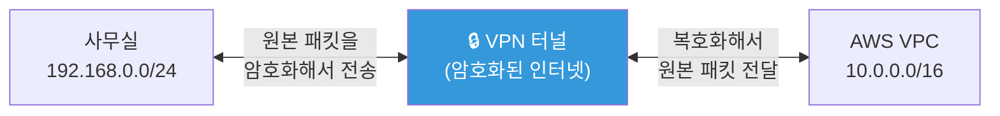
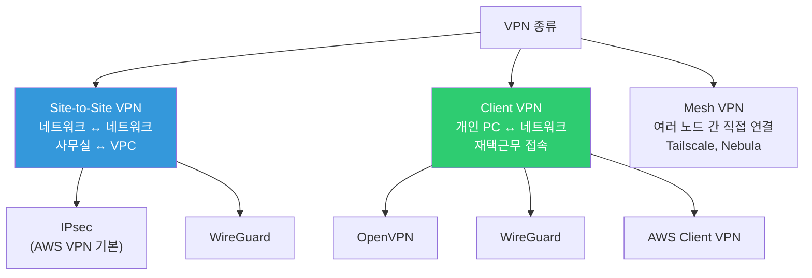
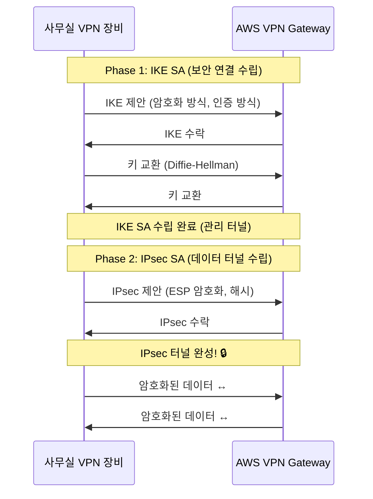
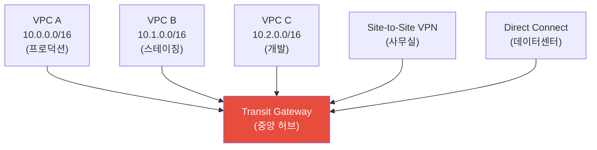
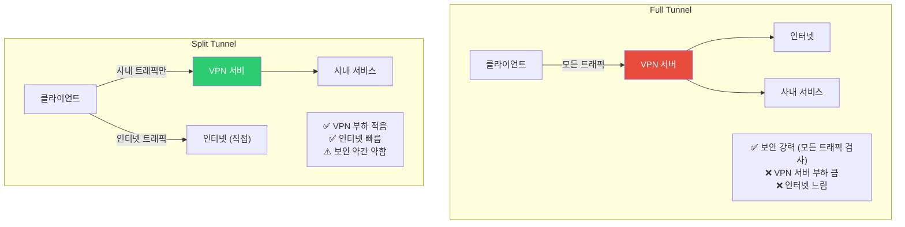

# VPN / 터널링 (IPsec / WireGuard / OpenVPN / Direct Connect)

> 사무실에서 AWS VPC의 프라이빗 서버에 접근하려면? 온프레미스 데이터센터와 클라우드를 연결하려면? 인터넷을 통해서도 **안전한 사설 네트워크**처럼 사용할 수 있게 해주는 것이 VPN이에요.

---

## 🎯 이걸 왜 알아야 하나?

```
실무에서 VPN이 필요한 상황:
• 사무실 ↔ AWS VPC 연결               → Site-to-Site VPN
• 개발자가 집에서 내부 서비스 접근       → Client VPN
• 온프레미스 DC ↔ AWS 클라우드 연결     → VPN 또는 Direct Connect
• VPC 간 연결                         → VPC Peering 또는 Transit Gateway
• 보안 감사: "내부 통신은 암호화하나요?"  → VPN/mTLS
• 재택근무 네트워크 접근               → WireGuard, OpenVPN
```

---

## 🧠 핵심 개념

### 비유: 지하 터널

VPN을 **지하 터널**에 비유해볼게요.

* **인터넷** = 공개 도로. 누구나 볼 수 있고 위험할 수 있음
* **VPN 터널** = 두 지점을 연결하는 지하 비밀 통로. 안에서 오가는 내용을 외부에서 못 봄
* **암호화** = 통로 안에서 암호로 대화. 혹시 통로가 발견되어도 내용을 해독 못 함
* **VPN Gateway** = 터널 입구. 이곳에서 패킷을 암호화하고, 반대편에서 복호화



### VPN 유형



| 유형 | 연결 대상 | 용도 | 예시 |
|------|----------|------|------|
| **Site-to-Site** | 네트워크 ↔ 네트워크 | 사무실↔클라우드, DC↔클라우드 | AWS Site-to-Site VPN |
| **Client VPN** | 개인 PC ↔ 네트워크 | 재택근무, 원격 접속 | OpenVPN, WireGuard |
| **Mesh VPN** | 노드 ↔ 노드 (P2P) | 여러 지점 간 직접 연결 | Tailscale, Nebula |

---

## 🔍 상세 설명 — VPN 프로토콜

### IPsec (Internet Protocol Security)

가장 전통적인 VPN 프로토콜이에요. AWS Site-to-Site VPN의 기본이에요.

```bash
# IPsec 구조:
# 1. IKE (Internet Key Exchange) — 키 교환/인증
#    IKEv1 (레거시) 또는 IKEv2 (추천)
# 2. ESP (Encapsulating Security Payload) — 실제 데이터 암호화

# IPsec 모드:
# Tunnel Mode — 전체 IP 패킷을 암호화 (Site-to-Site용)
# Transport Mode — 페이로드만 암호화 (호스트 간)
```



```bash
# IPsec 장단점:
# ✅ 업계 표준 (거의 모든 장비 지원)
# ✅ AWS, GCP, Azure 모두 지원
# ✅ 하드웨어 가속 가능
# ❌ 설정이 복잡 (Phase 1, Phase 2 파라미터)
# ❌ NAT 환경에서 문제가 생길 수 있음 (NAT-T 필요)
# ❌ UDP 500, 4500 포트 필요
```

### WireGuard (★ 현대적 추천)

WireGuard는 **간단하고 빠른** 최신 VPN 프로토콜이에요. Linux 커널에 내장되어 있어요.

```bash
# WireGuard 장단점:
# ✅ 설정이 매우 간단 (수십 줄)
# ✅ 매우 빠름 (커널 내장, 암호화 효율적)
# ✅ 코드가 작음 (~4000줄 vs OpenVPN 10만줄) → 보안 감사 쉬움
# ✅ 모바일 친화적 (로밍 지원)
# ✅ Linux 커널 5.6+ 내장
# ❌ TCP 지원 안 함 (UDP만) → 엄격한 방화벽 환경에서 차단될 수 있음
# ❌ 동적 IP 할당이 내장 아님
# ❌ AWS 네이티브 지원 없음 (직접 설치 필요)
```

#### WireGuard 설치 및 설정

```bash
# === 서버 측 (VPN 서버) ===

# 설치
sudo apt install wireguard

# 키 생성
wg genkey | tee /etc/wireguard/server_private.key | wg pubkey > /etc/wireguard/server_public.key
chmod 600 /etc/wireguard/server_private.key

SERVER_PRIVATE=$(cat /etc/wireguard/server_private.key)
SERVER_PUBLIC=$(cat /etc/wireguard/server_public.key)

# 서버 설정
cat << EOF | sudo tee /etc/wireguard/wg0.conf
[Interface]
Address = 10.200.0.1/24                      # VPN 내부 IP
ListenPort = 51820                           # WireGuard 포트
PrivateKey = $SERVER_PRIVATE

# IP 포워딩 + NAT (VPN → 인터넷)
PostUp = iptables -A FORWARD -i wg0 -j ACCEPT; iptables -t nat -A POSTROUTING -o eth0 -j MASQUERADE
PostDown = iptables -D FORWARD -i wg0 -j ACCEPT; iptables -t nat -D POSTROUTING -o eth0 -j MASQUERADE

# 클라이언트 (Peer)
[Peer]
PublicKey = <클라이언트_공개키>
AllowedIPs = 10.200.0.2/32                  # 이 클라이언트의 VPN IP
EOF

# IP 포워딩 활성화 (../01-linux/13-kernel 참고)
sudo sysctl net.ipv4.ip_forward=1
echo "net.ipv4.ip_forward=1" | sudo tee -a /etc/sysctl.d/99-wireguard.conf

# WireGuard 시작
sudo wg-quick up wg0
sudo systemctl enable wg-quick@wg0

# 상태 확인
sudo wg show
# interface: wg0
#   public key: <서버_공개키>
#   private key: (hidden)
#   listening port: 51820
#
# peer: <클라이언트_공개키>
#   allowed ips: 10.200.0.2/32
#   latest handshake: 30 seconds ago
#   transfer: 1.5 MiB received, 3.2 MiB sent
```

```bash
# === 클라이언트 측 ===

# 키 생성
wg genkey | tee client_private.key | wg pubkey > client_public.key

CLIENT_PRIVATE=$(cat client_private.key)

# 클라이언트 설정
cat << EOF > wg0.conf
[Interface]
Address = 10.200.0.2/24
PrivateKey = $CLIENT_PRIVATE
DNS = 10.0.0.2                               # VPC DNS (선택)

[Peer]
PublicKey = $SERVER_PUBLIC                    # 서버의 공개키
Endpoint = 52.78.100.200:51820               # 서버의 공인 IP:포트
AllowedIPs = 10.0.0.0/16                     # VPC 대역만 VPN으로
#AllowedIPs = 0.0.0.0/0                      # 모든 트래픽을 VPN으로 (풀 터널)
PersistentKeepalive = 25                     # NAT 뒤에서 연결 유지
EOF

# 연결
sudo wg-quick up ./wg0.conf

# 연결 확인
sudo wg show
ping 10.0.1.50                               # VPC 내부 서버에 접근 가능!

# 연결 해제
sudo wg-quick down ./wg0.conf
```

### OpenVPN

가장 오래되고 널리 쓰이는 VPN이에요. TCP도 지원해서 방화벽 통과에 강해요.

```bash
# OpenVPN 장단점:
# ✅ 매우 성숙하고 안정적 (20년+)
# ✅ TCP/UDP 모두 지원 → 방화벽 통과 용이
# ✅ 443 포트로 위장 가능 (HTTPS처럼)
# ✅ 풍부한 인증 방식 (인증서, LDAP, MFA)
# ✅ 클라이언트 앱이 모든 OS에 있음
# ❌ WireGuard보다 느림
# ❌ 설정이 복잡
# ❌ 사용자 공간에서 동작 (커널이 아닌)

# 설치 (서버)
sudo apt install openvpn easy-rsa

# easy-rsa로 PKI 설정
make-cadir ~/openvpn-ca
cd ~/openvpn-ca
./easyrsa init-pki
./easyrsa build-ca nopass
./easyrsa gen-req server nopass
./easyrsa sign-req server server
./easyrsa gen-dh
openvpn --genkey secret ta.key

# 클라이언트 인증서 생성
./easyrsa gen-req client1 nopass
./easyrsa sign-req client client1

# 서버 설정 (/etc/openvpn/server.conf)
# port 1194
# proto udp
# dev tun
# ca ca.crt
# cert server.crt
# key server.key
# dh dh.pem
# server 10.200.0.0 255.255.255.0
# push "route 10.0.0.0 255.255.0.0"
# cipher AES-256-GCM
# auth SHA256
# keepalive 10 120

# 시작
sudo systemctl enable --now openvpn@server
```

### 프로토콜 비교

| 항목 | IPsec | WireGuard | OpenVPN |
|------|-------|-----------|---------|
| 속도 | 빠름 (HW 가속) | ⭐ 매우 빠름 (커널) | 보통 (유저스페이스) |
| 설정 난이도 | 어려움 | ⭐ 쉬움 | 보통 |
| 코드 크기 | 크고 복잡 | ~4,000줄 | ~100,000줄 |
| 프로토콜 | UDP 500/4500 | UDP (커스텀 포트) | TCP 또는 UDP |
| 방화벽 통과 | ⚠️ NAT 문제 | ⚠️ UDP만 | ✅ TCP 443 위장 |
| 모바일 | ✅ | ✅ (뛰어남) | ✅ |
| AWS 네이티브 | ✅ Site-to-Site | ❌ (직접 설치) | ❌ (직접 설치) |
| 추천 상황 | AWS VPN, 기업 | 서버 간 VPN, 재택 | 엄격한 방화벽 환경 |

---

## 🔍 상세 설명 — AWS 네트워크 연결

### AWS Site-to-Site VPN

사무실/데이터센터와 AWS VPC를 IPsec VPN으로 연결해요.


```bash
# AWS Site-to-Site VPN 설정 흐름:

# 1. Customer Gateway (CGW) 생성
# → 사무실 VPN 장비의 공인 IP와 ASN 등록
aws ec2 create-customer-gateway \
    --type ipsec.1 \
    --bgp-asn 65000 \
    --public-ip 203.0.113.1    # 사무실 공인 IP

# 2. Virtual Private Gateway (VGW) 생성
aws ec2 create-vpn-gateway --type ipsec.1
# → VPC에 연결 (attach)
aws ec2 attach-vpn-gateway --vpn-gateway-id vgw-xxx --vpc-id vpc-xxx

# 3. VPN Connection 생성
aws ec2 create-vpn-connection \
    --type ipsec.1 \
    --customer-gateway-id cgw-xxx \
    --vpn-gateway-id vgw-xxx \
    --options '{"StaticRoutesOnly": false}'    # BGP 사용

# 4. VPN 설정 파일 다운로드
# → AWS 콘솔에서 VPN Connection → Download Configuration
# → 사무실 VPN 장비(Cisco, Juniper, pfSense 등)에 맞는 설정 제공

# 5. 라우팅 설정
# VPC Route Table에 사무실 대역 추가:
# Destination: 192.168.0.0/24 → Target: vgw-xxx

# 6. 확인
# VPN Connection 상태:
# Tunnel 1: UP ✅
# Tunnel 2: UP ✅ (이중화!)

# 사무실에서 VPC 서버에 ping
ping 10.0.1.50    # VPC 내부 서버 → 성공!

# ⚠️ AWS VPN은 터널 2개를 제공 (이중화)
# → 하나가 죽어도 자동 failover
# → 둘 다 active-active 또는 active-standby 가능
```

```bash
# AWS Site-to-Site VPN 주의사항:

# 대역폭: 터널당 최대 1.25 Gbps
# → 더 필요하면 여러 VPN 연결 또는 Direct Connect

# 비용: 시간당 + 데이터 전송
# → $0.05/시간 (약 $36/월)

# 지연: 인터넷 경유 → 지연/변동 있음
# → 안정적인 저지연이 필요하면 Direct Connect

# BGP vs Static Routing:
# BGP → 자동 경로 관리 (추천!)
# Static → 수동으로 경로 추가 (간단하지만 유연성 떨어짐)
```

### AWS Transit Gateway

여러 VPC와 VPN을 **중앙 허브**로 연결해요. VPC가 많아지면 필수예요.



```bash
# Transit Gateway가 필요한 이유:

# VPC Peering만으로는:
# VPC 3개를 연결하려면 → 3개의 Peering (A↔B, B↔C, A↔C)
# VPC 10개를 연결하려면 → 45개의 Peering!
# → 관리 불가능!

# Transit Gateway로는:
# VPC 10개를 연결 → 10개의 TGW Attachment만!
# → 중앙에서 라우팅 관리
# → VPN/Direct Connect도 같은 허브에 연결

# Transit Gateway Route Table:
# Destination      Target
# 10.0.0.0/16      vpc-a attachment
# 10.1.0.0/16      vpc-b attachment
# 10.2.0.0/16      vpc-c attachment
# 192.168.0.0/24   vpn attachment (사무실)
# 172.16.0.0/16    dxgw attachment (DC)
```

### AWS Direct Connect

인터넷을 거치지 않고 **전용 회선**으로 AWS에 연결해요. 가장 안정적이고 빠르지만 비용이 높아요.


```bash
# Direct Connect vs VPN 비교

# VPN (Site-to-Site):
# - 인터넷 경유 → 지연 변동, 대역폭 제한 (1.25 Gbps)
# - 설정 쉬움, 비용 저렴 ($36/월)
# - 수 분 내 구성 가능
# - 이중화: 터널 2개

# Direct Connect:
# - 전용 회선 → 일관된 지연, 높은 대역폭 (1~100 Gbps!)
# - 설정 복잡, 비용 높음 (포트 + 데이터 전송)
# - 구성에 수 주~수 개월 소요 (물리 케이블 설치)
# - 이중화: 2개 DX 연결 (다른 위치에)

# 언제 뭘 쓰나?
# VPN → 대부분의 경우 (소~중규모, 빠른 구성)
# Direct Connect → 대용량 데이터 전송, 일관된 성능 필요 (대규모)
# 둘 다 → DX를 주 연결, VPN을 백업으로 (최고 가용성)
```

### VPC Peering vs Transit Gateway vs PrivateLink

```bash
# VPC 간 연결 방법 3가지

# === VPC Peering ===
# VPC 2개를 직접 1:1 연결
# ✅ 간단, 비용 저렴 (데이터 전송만)
# ❌ 전이적 라우팅 불가 (A↔B, B↔C 연결해도 A↔C 안 됨!)
# ❌ VPC 많으면 관리 복잡
# → VPC 2~3개 연결할 때

# === Transit Gateway ===
# 중앙 허브로 여러 VPC/VPN 연결
# ✅ 전이적 라우팅 가능 (A→TGW→C)
# ✅ VPN, DX도 같은 허브에 연결
# ✅ 중앙에서 라우팅/보안 관리
# ❌ 시간당 비용 + 데이터 전송 비용
# → VPC 4개 이상, 복잡한 네트워크

# === PrivateLink ===
# 특정 서비스의 엔드포인트만 노출
# ✅ VPC CIDR 겹쳐도 OK!
# ✅ 최소 권한 (특정 서비스만 접근)
# ✅ 서비스 제공자/소비자 모델
# ❌ 서비스 단위 설정 (네트워크 전체 연결 아님)
# → SaaS 서비스 제공, 특정 서비스만 공유할 때

# 선택 가이드:
# VPC 2~3개, 간단        → VPC Peering
# VPC 4개+, VPN/DX 있음  → Transit Gateway
# 특정 서비스만 공유      → PrivateLink
```

---

## 🔍 상세 설명 — Split Tunnel vs Full Tunnel



```bash
# WireGuard에서 Split Tunnel 설정

# Full Tunnel (모든 트래픽 VPN으로):
# AllowedIPs = 0.0.0.0/0

# Split Tunnel (사내 대역만 VPN으로):
# AllowedIPs = 10.0.0.0/16, 172.16.0.0/12
# → 10.x.x.x와 172.16~31.x.x만 VPN, 나머지는 직접 인터넷

# 실무에서는 Split Tunnel을 더 많이 써요:
# - VPN 서버 부하 감소
# - 사용자 인터넷 속도 유지
# - 비용 절감 (VPN 대역폭)
# 
# 하지만 보안이 매우 중요한 환경에서는 Full Tunnel:
# - 모든 트래픽을 회사에서 검사
# - DLP (데이터 유출 방지) 적용
```

---

## 💻 실습 예제

### 실습 1: WireGuard 로컬 테스트

```bash
# 같은 서버에서 WireGuard 인터페이스 만들어보기 (원리 이해용)

# 1. 설치
sudo apt install wireguard-tools

# 2. 키 쌍 생성
wg genkey | tee /tmp/wg_private | wg pubkey > /tmp/wg_public

echo "개인키: $(cat /tmp/wg_private)"
echo "공개키: $(cat /tmp/wg_public)"

# 3. 인터페이스 생성 (ip 명령어로)
sudo ip link add dev wg-test type wireguard
sudo ip addr add 10.200.0.1/24 dev wg-test
sudo wg set wg-test private-key /tmp/wg_private listen-port 51820
sudo ip link set wg-test up

# 4. 상태 확인
sudo wg show wg-test
# interface: wg-test
#   public key: <공개키>
#   private key: (hidden)
#   listening port: 51820

ip addr show wg-test
# inet 10.200.0.1/24 scope global wg-test

# 5. 정리
sudo ip link del wg-test
rm /tmp/wg_private /tmp/wg_public
```

### 실습 2: SSH 터널로 VPN처럼 사용 (간이 VPN)

```bash
# WireGuard/OpenVPN을 설치할 수 없을 때
# SSH 터널로 간이 VPN처럼 사용 가능 (../01-linux/10-ssh 참고)

# SOCKS 프록시 (모든 트래픽을 SSH로)
ssh -D 1080 -N -f ubuntu@52.78.100.200
# → localhost:1080이 SOCKS5 프록시
# → 브라우저 프록시를 localhost:1080으로 설정
# → 모든 웹 트래픽이 서버를 경유!

# 특정 서비스만 터널링
ssh -L 5432:10.0.2.10:5432 -N -f ubuntu@52.78.100.200
# → localhost:5432 → VPC 내부 DB에 접속 가능

# VPN과의 차이:
# SSH 터널: 특정 포트/서비스만, TCP만, 설정 간단
# VPN: 네트워크 전체, TCP+UDP, 설정 복잡하지만 완전한 연결
```

### 실습 3: VPN 연결 진단

```bash
# VPN이 연결되었을 때 확인하는 것들

# 1. VPN 인터페이스 확인
ip addr show
# → wg0 또는 tun0 인터페이스가 보이는지

# 2. 라우팅 확인
ip route
# 10.0.0.0/16 dev wg0    ← VPC 대역이 VPN으로 라우팅되는지

# 3. 내부 서버에 접근 가능한지
ping 10.0.1.50
nc -zv 10.0.1.50 22

# 4. DNS 확인 (내부 DNS가 해석되는지)
dig internal-api.mycompany.local
# → 내부 DNS 서버가 응답하는지

# 5. VPN 처리량 테스트
iperf3 -c 10.0.1.50    # (대상 서버에 iperf3 -s 실행 중이어야)
# [ ID] Interval   Transfer   Bitrate
# [  5] 0.00-10.00 sec  100 MBytes  84.0 Mbits/sec
```

---

## 🏢 실무에서는?

### 시나리오 1: 사무실 ↔ AWS VPC 연결

```bash
# 요구사항:
# - 사무실(192.168.0.0/24)에서 VPC(10.0.0.0/16) 내부 서버 접근
# - 비용 저렴하게
# - 빠르게 구성

# 선택: AWS Site-to-Site VPN

# 사무실에 VPN 장비가 있으면:
# 1. AWS에서 CGW + VGW + VPN Connection 생성
# 2. 설정 파일 다운로드 → 사무실 장비에 적용
# 3. 라우팅 설정

# 사무실에 VPN 장비가 없으면:
# 방법 1: 소프트웨어 라우터 (pfSense, Sophos 등 VM)
# 방법 2: AWS Client VPN (개인별 접속)
# 방법 3: WireGuard 서버를 EC2에 설치

# 비용: ~$36/월 (Site-to-Site VPN)
```

### 시나리오 2: 재택근무 VPN 선택

```bash
# 요구사항:
# - 개발자 50명이 집에서 내부 서비스 접근
# - 설정이 간단해야 함
# - 빠른 속도

# 옵션 비교:

# 1. WireGuard (⭐ 추천)
# 장점: 매우 빠름, 설정 간단, 모바일 앱 있음
# 단점: EC2에 직접 설치/관리 필요
# 비용: EC2 비용만 (~$15/월 t3.small)

# 2. AWS Client VPN
# 장점: AWS 네이티브, AD 연동, 관리 편함
# 단점: 비용이 높음, 성능 보통
# 비용: $0.10/연결시간 + $0.05/서브넷연결시간
# → 50명 × 8시간 × 20일 = 8000시간 × $0.10 = $800/월!

# 3. Tailscale (Mesh VPN)
# 장점: 설정 매우 쉬움 (설치만 하면), P2P, Zero config
# 단점: 서버당 비용, 외부 서비스 의존
# 비용: 무료(개인) ~ $18/사용자/월(비즈니스)

# 4. OpenVPN
# 장점: 성숙, TCP 지원 (방화벽 통과)
# 단점: WireGuard보다 느림, 설정 복잡
# 비용: EC2 비용만

# 실무 추천: WireGuard (소규모) 또는 Tailscale (관리 편함)
```

### 시나리오 3: VPN 성능 문제

```bash
# "VPN이 너무 느려요!"

# 1. VPN 연결 자체의 속도 측정
iperf3 -c vpn-server-ip
# Bitrate: 30 Mbits/sec   ← 느림!

# 2. VPN 없이 인터넷 속도 측정
curl -o /dev/null -w "%{speed_download}" https://speed.cloudflare.com/__down?bytes=100000000
# 120000000 bytes/sec = ~120 Mbps   ← 인터넷은 빠름!
# → VPN 자체가 병목!

# 3. 원인 분석:
# a. VPN 서버 CPU 과부하?
#    → 서버에서 top 확인
#    → WireGuard는 커널에서 처리라 가벼움
#    → OpenVPN은 유저스페이스라 CPU를 많이 씀

# b. MTU 문제?
#    → VPN 터널에서 패킷 분할 발생
ping -M do -s 1400 10.0.1.50
# PING 10.0.1.50: 1400 data bytes
# → "Frag needed" 에러가 나면 MTU 줄여야 함!

# WireGuard MTU 조정:
# [Interface]
# MTU = 1380    # 기본 1420에서 줄이기

# c. 라우팅 비효율?
#    → Full Tunnel → Split Tunnel로 변경
#    → 불필요한 트래픽이 VPN을 안 타도록

# d. VPN 서버 위치?
#    → 사용자와 가까운 리전에 VPN 서버 배치
```

---

## ⚠️ 자주 하는 실수

### 1. VPN 서브넷 CIDR 겹침

```bash
# ❌ 사무실 192.168.1.0/24 + VPC 192.168.1.0/24
# → 같은 대역! 라우팅 충돌!

# ✅ 사전에 CIDR이 겹치지 않게 설계
# 사무실: 192.168.0.0/24
# VPC:    10.0.0.0/16
# VPN:    10.200.0.0/24
# (./04-network-structure 참고)
```

### 2. VPN 단일 터널 (이중화 안 함)

```bash
# ❌ VPN 터널 1개만 → VPN 장애 시 접근 불가!

# ✅ 이중화:
# AWS Site-to-Site VPN → 기본 터널 2개 (다른 AZ)
# WireGuard → 서버 2대에 각각 설치
# Direct Connect → 2개 DX 연결 (다른 위치)
```

### 3. VPN 보안 키를 안전하게 관리 안 하기

```bash
# ❌ WireGuard 개인키를 Slack으로 공유
# ❌ OpenVPN 인증서를 Git에 커밋

# ✅ 개인키/인증서는:
# - Vault 등 시크릿 관리 도구에 저장
# - 안전한 채널로 전달 (대면, 암호화된 메일)
# - 퇴사자 키는 즉시 삭제 + 인증서 폐기
# - 정기적으로 키 교체
```

### 4. Split Tunnel에서 DNS 누출

```bash
# ❌ Split Tunnel인데 DNS 쿼리가 회사 DNS로 안 감
# → 내부 도메인(internal.mycompany.com)이 해석 안 됨!

# ✅ VPN 클라이언트에 DNS 서버 설정
# WireGuard:
# [Interface]
# DNS = 10.0.0.2    ← VPC DNS 서버

# 또는 내부 도메인만 내부 DNS로:
# → systemd-resolved의 DNS 라우팅 설정
# → .mycompany.com은 10.0.0.2로, 나머지는 기본 DNS로
```

### 5. VPN 대역폭을 고려 안 하기

```bash
# ❌ 50명이 VPN으로 동영상 회의 + 코드 작업 → 대역폭 부족!

# ✅ Split Tunnel로 필요한 것만 VPN으로
# ✅ VPN 서버 인스턴스 크기 적절하게
# ✅ 대역폭 모니터링 + 필요시 스케일업

# AWS VPN 대역폭: 터널당 1.25 Gbps
# WireGuard: EC2 인스턴스 타입에 따라 다름
# → t3.small: ~5 Gbps (burst)
# → m5.large: ~10 Gbps
```

---

## 📝 정리

### VPN 프로토콜 선택 가이드

```
WireGuard:  빠르고 간단, 서버 간 VPN, 재택근무 → ⭐ 기본 추천
IPsec:      AWS Site-to-Site VPN, 기업 장비 호환 → 클라우드 연결
OpenVPN:    TCP 지원 필요, 엄격한 방화벽 환경 → 방화벽 통과
Tailscale:  설정 최소화, 관리 편함 → 소규모 팀 빠른 도입
```

### AWS 네트워크 연결 선택 가이드

```
VPC 2~3개 연결:           VPC Peering (간단, 저렴)
VPC 4개+ / VPN 포함:      Transit Gateway (중앙 관리)
특정 서비스만 공유:        PrivateLink (최소 권한)
사무실 ↔ VPC:             Site-to-Site VPN (가성비)
대용량/안정적 연결:        Direct Connect (프리미엄)
최고 가용성:              DX 주연결 + VPN 백업
```

### VPN 디버깅 명령어

```bash
sudo wg show                    # WireGuard 상태
ip addr show wg0                # VPN 인터페이스
ip route                        # VPN 라우팅 확인
ping 10.0.1.50                  # 내부 서버 접근 확인
traceroute -n 10.0.1.50         # VPN 경로 추적
iperf3 -c 10.0.1.50             # VPN 속도 측정
dig internal.mycompany.local    # 내부 DNS 확인
```

---

## 🔗 다음 강의

다음은 **[11-cdn](./11-cdn)** — CDN (CloudFront / Cloudflare / Edge Caching) 이에요.

전 세계 사용자에게 빠르게 콘텐츠를 전달하는 CDN. 정적 파일 캐싱, 동적 가속, DDoS 방어까지 — CDN의 원리와 실무 설정을 배워볼게요.
