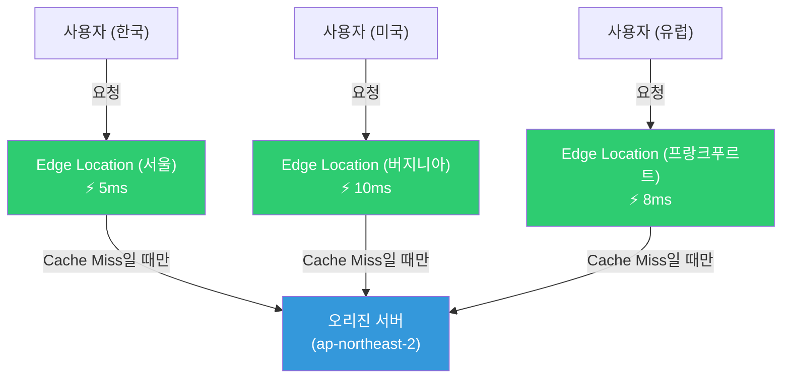
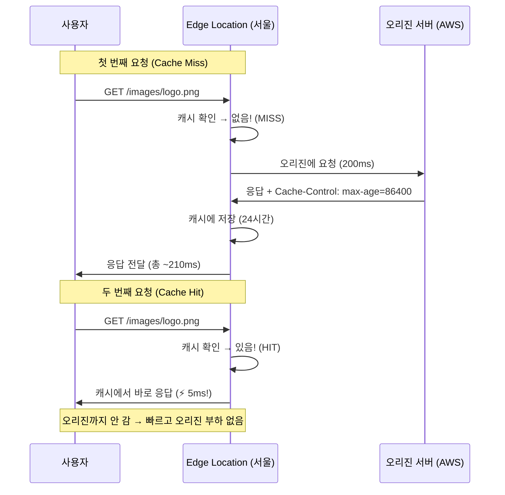
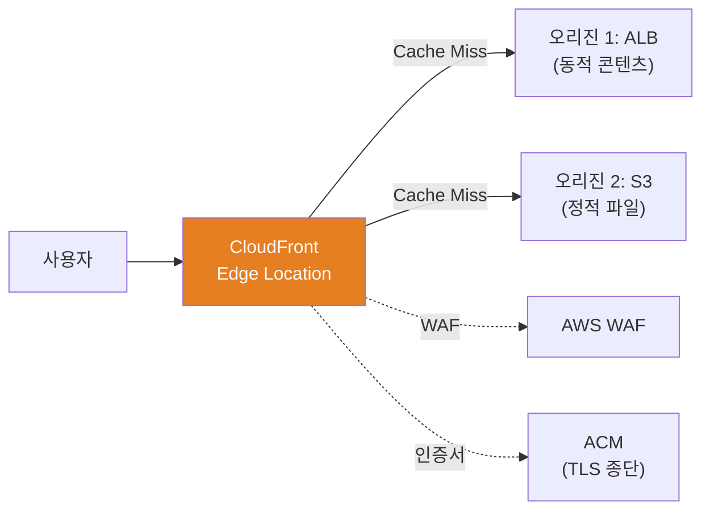
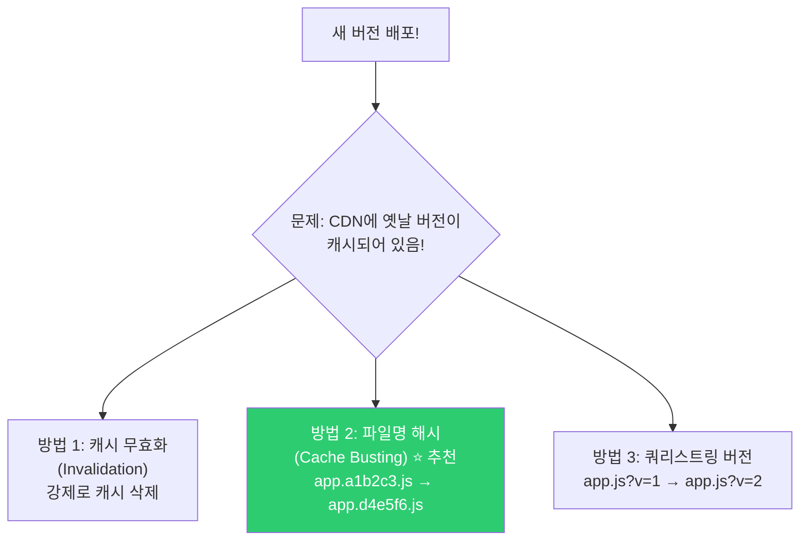

# CDN (CloudFront / Cloudflare / Edge Caching)

> 한국 사용자가 미국 서버에서 이미지를 받으면 200ms 걸려요. 하지만 CDN을 쓰면 서울 Edge에서 5ms에 받을 수 있어요. CDN은 전 세계에 콘텐츠를 빠르게 전달하는 **분산 캐시 네트워크**예요. 성능, 비용, 보안 모두에 영향을 주는 핵심 인프라예요.

---

## 🎯 이걸 왜 알아야 하나?

```
실무에서 CDN 관련 업무:
• 정적 파일(이미지, JS, CSS) 전달 속도 향상      → CDN 캐싱
• "이미지 업데이트했는데 옛날 것이 나와요"       → 캐시 무효화(Invalidation)
• API 응답도 캐싱해서 오리진 부하 줄이기          → 동적 캐싱 전략
• DDoS 방어 + WAF                              → CDN Edge에서 차단
• HTTPS 인증서 관리                            → CDN에서 TLS 종단
• 전 세계 사용자에게 일관된 속도                 → Edge Location 활용
• CDN 비용 최적화                              → 캐시 히트율 개선
```

---

## 🧠 핵심 개념

### 비유: 편의점 유통 시스템

CDN을 **편의점 유통망**에 비유해볼게요.

* **오리진 서버** = 중앙 공장/물류 창고. 모든 상품(콘텐츠)의 원본이 있는 곳
* **Edge Location(PoP)** = 동네 편의점. 인기 상품을 미리 가져다 놓음
* **CDN 캐시** = 편의점 진열대. 자주 팔리는 상품을 미리 진열
* **Cache Miss** = 편의점에 없는 상품. 중앙 창고에서 가져와야 함 (느림)
* **Cache Hit** = 편의점에 있는 상품. 바로 전달 (빠름!)
* **TTL** = 상품 유통기한. 기한 지나면 창고에서 새 상품으로 교체
* **Cache Invalidation** = 리콜. "이 상품 전부 회수하고 새 것으로 교체!"



### CDN 동작 흐름



---

## 🔍 상세 설명 — CDN 캐싱 원리

### Cache-Control 헤더 (★ 핵심!)

CDN이 무엇을, 얼마나 오래 캐싱할지는 **오리진 서버가 보내는 헤더**로 결정돼요.

```bash
# 오리진이 보내는 응답 헤더:
# Cache-Control: public, max-age=86400
#                ^^^^^^  ^^^^^^^^^^^^^
#                누가 캐시?  얼마나?

# === Cache-Control 지시어 ===

# public — CDN과 브라우저 모두 캐시 가능
# Cache-Control: public, max-age=3600
# → CDN Edge에서도 캐시, 브라우저에서도 캐시

# private — 브라우저만 캐시 (CDN에서 캐시 안 함)
# Cache-Control: private, max-age=3600
# → 사용자 개인 데이터 (마이페이지 등)

# no-cache — 캐시하되, 매번 오리진에 재검증 요청
# Cache-Control: no-cache
# → "이거 아직 유효한가요?" 물어보고 304 Not Modified면 캐시 사용

# no-store — 절대 캐시 안 함
# Cache-Control: no-store
# → 민감한 데이터 (결제 정보 등)

# max-age=N — N초 동안 캐시
# Cache-Control: max-age=86400    # 24시간

# s-maxage=N — CDN(공유 캐시)에서의 캐시 시간 (max-age보다 우선)
# Cache-Control: public, max-age=3600, s-maxage=86400
# → 브라우저: 1시간 캐시, CDN: 24시간 캐시

# immutable — 콘텐츠가 절대 변하지 않음 (버전 해시 파일)
# Cache-Control: public, max-age=31536000, immutable
# → app.a1b2c3d4.js처럼 해시가 붙은 파일에 사용
```

```bash
# 콘텐츠 유형별 캐시 전략 (실무 추천)

# === 정적 파일 (변하지 않음) ===
# JS/CSS (해시 포함): app.a1b2c3.js
# Cache-Control: public, max-age=31536000, immutable
# → 1년 캐시! 파일 변경 시 해시가 바뀌니까 새 URL

# 이미지:
# Cache-Control: public, max-age=86400
# → 24시간 캐시

# 폰트:
# Cache-Control: public, max-age=2592000
# → 30일 캐시

# === 동적 콘텐츠 ===
# API 응답 (공개 데이터, 자주 안 바뀜):
# Cache-Control: public, max-age=60, s-maxage=300
# → 브라우저 1분, CDN 5분

# API 응답 (개인 데이터):
# Cache-Control: private, no-cache
# → CDN 캐시 안 함, 브라우저는 재검증

# 로그인/결제 등 민감 데이터:
# Cache-Control: no-store
# → 캐시 절대 안 함
```

### 캐시 키 (Cache Key)

CDN이 요청을 캐시에서 찾을 때 사용하는 "열쇠"예요.

```bash
# 기본 캐시 키: URL (호스트 + 경로 + 쿼리스트링)
# https://cdn.example.com/images/logo.png?v=2

# 같은 URL → 같은 캐시에서 반환
# 다른 URL → 캐시 미스 → 오리진에 요청

# ⚠️ 불필요한 쿼리스트링이 다르면 캐시가 안 됨!
# /images/logo.png?tracking=abc123  → 캐시 1
# /images/logo.png?tracking=def456  → 캐시 2 (같은 이미지인데 별도 캐시!)

# → CloudFront: 쿼리스트링을 캐시 키에서 제외하는 설정
# → "tracking" 파라미터는 캐시 키에서 제외, "v" 파라미터만 포함

# 캐시 키에 포함될 수 있는 것:
# - URL (기본)
# - 쿼리스트링 (선택적)
# - 헤더 (Accept-Encoding, Accept-Language 등)
# - 쿠키 (선택적, 주의 필요!)
```

### 캐시 히트율 (Cache Hit Ratio)

CDN의 가장 중요한 지표예요. 높을수록 좋아요.

```bash
# 캐시 히트율 = Cache Hit / (Cache Hit + Cache Miss) × 100%

# 실무 목표:
# 정적 파일: 95%+ (이미지, JS, CSS)
# 동적 API: 50~80% (캐시 가능한 API)
# 전체: 80%+ (잘 설정된 CDN)

# 캐시 히트율이 낮으면:
# → 오리진에 요청이 많이 감 → 오리진 부하 증가 + 응답 느림
# → CDN 비용 증가 (오리진에서 데이터 전송 비용)

# 확인 방법 (curl):
curl -I https://cdn.example.com/images/logo.png
# X-Cache: Hit from cloudfront        ← HIT! ✅
# X-Cache: Miss from cloudfront       ← MISS ❌

# 또는:
# X-Cache: Hit
# CF-Cache-Status: HIT               ← Cloudflare
# Age: 3600                           ← 캐시된 지 3600초 됨

# 반복 테스트:
for i in $(seq 1 5); do
    status=$(curl -sI https://cdn.example.com/images/logo.png | grep -i "x-cache\|cf-cache" | head -1)
    echo "요청 $i: $status"
done
# 요청 1: X-Cache: Miss from cloudfront   ← 첫 요청은 MISS
# 요청 2: X-Cache: Hit from cloudfront    ← 이후 HIT!
# 요청 3: X-Cache: Hit from cloudfront
# 요청 4: X-Cache: Hit from cloudfront
# 요청 5: X-Cache: Hit from cloudfront
```

---

## 🔍 상세 설명 — AWS CloudFront

### CloudFront 구조



### CloudFront 설정 핵심

```bash
# === CloudFront Distribution 생성 (핵심 설정) ===

# 1. 오리진 설정
# S3 오리진 (정적 파일):
#   Origin Domain: my-bucket.s3.amazonaws.com
#   Origin Access: OAC (Origin Access Control) ← S3 직접 접근 차단, CF만 접근
#   Origin Shield: ap-northeast-2 (오리진 앞 캐시 계층 추가)

# ALB 오리진 (동적 API):
#   Origin Domain: my-alb-123.ap-northeast-2.elb.amazonaws.com
#   Protocol: HTTPS only
#   Origin Keepalive Timeout: 60s

# 2. 캐시 동작 (Behavior) 설정

# /static/* → S3 오리진
#   Cache Policy: CachingOptimized (TTL 최대화)
#   → 정적 파일은 오래 캐시

# /api/* → ALB 오리진
#   Cache Policy: CachingDisabled (캐시 안 함)
#   Origin Request Policy: AllViewer (모든 헤더를 오리진에 전달)
#   → API 요청은 캐시하지 않고 오리진에 전달

# Default (*) → ALB 오리진
#   Cache Policy: CachingOptimizedForUncompressedObjects
#   → HTML 등 나머지는 적절히 캐시

# 3. TLS/인증서 설정
#   Certificate: ACM 인증서 (us-east-1에서 발급!) ← CloudFront는 us-east-1만!
#   Minimum Protocol Version: TLSv1.2_2021
#   HTTP to HTTPS: Redirect

# 4. WAF 연결
#   Web ACL: myapp-waf (./09-network-security 참고)

# 5. 가격 등급
#   Price Class: PriceClass_200 (대부분의 리전)
#   또는 PriceClass_All (모든 Edge Location, 가장 비쌈)
#   또는 PriceClass_100 (미국+유럽만, 가장 쌈)
```

```bash
# CloudFront CLI 예시

# Distribution 목록
aws cloudfront list-distributions --query "DistributionList.Items[*].[Id,DomainName,Status]" --output table
# ┌──────────────┬───────────────────────────────────┬──────────┐
# │ E1234ABCDEF  │ d123abc.cloudfront.net            │ Deployed │
# └──────────────┴───────────────────────────────────┴──────────┘

# 캐시 무효화 (Invalidation)
aws cloudfront create-invalidation \
    --distribution-id E1234ABCDEF \
    --paths "/images/logo.png" "/css/*"
# {
#     "Invalidation": {
#         "Id": "I1234567890",
#         "Status": "InProgress",
#         "CreateTime": "2025-03-12T10:00:00.000Z"
#     }
# }

# 무효화 상태 확인
aws cloudfront get-invalidation --distribution-id E1234ABCDEF --id I1234567890
# "Status": "Completed"

# ⚠️ 무효화 비용:
# 월 1,000개 경로까지 무료
# 그 이상: 경로당 $0.005
# → /* (전체 무효화)는 1개 경로로 계산

# ⚠️ 무효화보다 버전 해시가 더 좋은 방법!
# /app.js?v=1 → /app.js?v=2   (쿼리스트링 버전)
# /app.a1b2c3.js → /app.d4e5f6.js  (파일명 해시, ⭐ 가장 좋음)
# → 무효화 없이 즉시 새 버전!
```

### S3 + CloudFront 정적 호스팅 (가장 흔한 구성)

```bash
# React/Vue 앱을 S3 + CloudFront로 호스팅하는 패턴

# 1. S3 버킷 생성 (퍼블릭 접근 차단!)
aws s3 mb s3://myapp-frontend-prod
aws s3api put-public-access-block --bucket myapp-frontend-prod \
    --public-access-block-configuration BlockPublicAcls=true,IgnorePublicAcls=true,BlockPublicPolicy=true,RestrictPublicBuckets=true

# 2. 빌드 파일 업로드
npm run build
aws s3 sync build/ s3://myapp-frontend-prod/ \
    --cache-control "public, max-age=31536000, immutable" \
    --exclude "index.html"

# index.html은 짧은 캐시 (새 배포 시 즉시 반영)
aws s3 cp build/index.html s3://myapp-frontend-prod/ \
    --cache-control "public, max-age=0, must-revalidate"

# 3. CloudFront Distribution 생성 → S3를 오리진으로
# OAC로 S3 직접 접근 차단 (CloudFront를 통해서만!)

# 4. Route53에서 도메인 연결
# app.example.com → CloudFront Distribution (Alias)

# 5. 배포 시
npm run build
aws s3 sync build/ s3://myapp-frontend-prod/ --delete
aws cloudfront create-invalidation --distribution-id E1234 --paths "/index.html"
# → index.html만 무효화! JS/CSS는 해시가 바뀌니까 자동으로 새 버전
```

---

## 🔍 상세 설명 — Cloudflare

### Cloudflare vs CloudFront

| 항목 | CloudFront | Cloudflare |
|------|-----------|------------|
| 타입 | CDN (AWS 서비스) | CDN + DNS + 보안 올인원 |
| 설정 | AWS 콘솔/CLI, 복잡 | 대시보드, 간단 |
| DNS 관리 | 별도 (Route53) | 내장 (NS를 Cloudflare로) |
| WAF | 별도 (AWS WAF 연동) | 내장 (기본 포함) |
| DDoS 방어 | Shield (별도) | 기본 포함 (무료에서도!) |
| 무료 플랜 | ❌ | ✅ (소규모 OK) |
| AWS 통합 | ⭐ 네이티브 | ❌ (외부 서비스) |
| 가격 | 사용량 기반 (복잡) | 플랜 기반 (예측 가능) |
| 추천 | AWS 올인 환경 | 빠른 구축, 올인원 |

```bash
# Cloudflare 설정 흐름:

# 1. Cloudflare에 도메인 등록 (NS 레코드 변경)
# → 도메인 등록업체에서 NS를 Cloudflare로 변경
# → Cloudflare가 DNS + CDN + 보안을 모두 관리

# 2. 오리진 서버 등록
# → A 레코드: api.example.com → 10.0.1.50 (프록시 활성화 ☁️)
# → 프록시 활성화 = Cloudflare CDN/보안을 거침

# 3. SSL 모드 설정
# - Off: 암호화 없음 (❌)
# - Flexible: 사용자→CF만 HTTPS, CF→오리진은 HTTP (⚠️)
# - Full: 사용자→CF HTTPS, CF→오리진 HTTPS (자체 서명 OK)
# - Full (Strict): 사용자→CF HTTPS, CF→오리진 HTTPS (유효한 인증서 필요) ← ⭐ 추천!

# 4. 캐시 설정
# Page Rules 또는 Cache Rules로 경로별 캐시 정책

# 5. 보안 설정
# WAF 규칙, DDoS 방어, Bot 관리 → 대시보드에서 클릭!

# Cloudflare 캐시 상태 확인
curl -I https://example.com/images/logo.png
# CF-Cache-Status: HIT       ← 캐시 히트!
# CF-Ray: abc123-ICN          ← 서울 Edge에서 응답
# Age: 1800                   ← 30분 전에 캐시됨
```

### Cloudflare 특수 기능

```bash
# 1. Argo Smart Routing (유료)
# → Cloudflare 내부 네트워크로 최적 경로 선택
# → 오리진까지 30~40% 더 빠르게 도달

# 2. Workers (서버리스 Edge 컴퓨팅)
# → Edge에서 JavaScript 실행
# → A/B 테스트, URL 리라이트, 인증 등을 Edge에서!

# 3. R2 (S3 호환 오브젝트 스토리지)
# → 전송 비용 없음! (egress free)
# → S3 API 호환

# 4. Turnstile (CAPTCHA 대체)
# → 사용자 친화적인 봇 방어

# 5. Zero Trust (Cloudflare Access)
# → VPN 대신 Zero Trust 접근 (./09-network-security 참고)
```

---

## 🔍 상세 설명 — 캐시 무효화 전략

### 배포 시 캐시 문제 해결



```bash
# === 방법 1: 캐시 무효화 (Invalidation) ===
# CloudFront:
aws cloudfront create-invalidation --distribution-id E1234 --paths "/*"
# → 모든 캐시 삭제 (전파에 수 분 소요)

# Cloudflare:
# 대시보드 → Caching → Configuration → Purge Everything
# 또는 API:
curl -X POST "https://api.cloudflare.com/client/v4/zones/ZONE_ID/purge_cache" \
    -H "Authorization: Bearer API_TOKEN" \
    -H "Content-Type: application/json" \
    --data '{"purge_everything":true}'

# 특정 파일만:
curl -X POST "https://api.cloudflare.com/client/v4/zones/ZONE_ID/purge_cache" \
    -H "Authorization: Bearer API_TOKEN" \
    --data '{"files":["https://example.com/app.js","https://example.com/style.css"]}'

# ⚠️ 무효화의 단점:
# - 전 세계 Edge에 전파되는 데 시간 소요 (수 초~수 분)
# - 빈번한 무효화 = CDN의 의미 퇴색
# - 비용 발생 (CloudFront: 1000개/월 초과 시)

# === 방법 2: 파일명 해시 (⭐ 가장 좋은 방법) ===
# Webpack, Vite 등 빌드 도구가 자동으로 해시를 붙여줌
# app.js → app.a1b2c3d4.js
# style.css → style.e5f6g7h8.css

# index.html에서 새 해시 파일을 참조:
# <script src="/app.a1b2c3d4.js"></script>
# <link href="/style.e5f6g7h8.css" rel="stylesheet">

# → 파일 내용이 바뀌면 해시가 바뀜 → 완전히 새 URL
# → CDN은 새 URL을 캐시 미스로 처리 → 오리진에서 가져옴
# → 무효화가 필요 없음!

# 단, index.html은 짧은 캐시 또는 no-cache:
# Cache-Control: no-cache
# → 브라우저가 항상 최신 index.html을 가져옴
# → index.html이 새 해시 JS/CSS를 참조

# === 방법 3: 쿼리스트링 버전 ===
# app.js?v=1 → app.js?v=2
# ⚠️ 일부 CDN이 쿼리스트링을 캐시 키에서 무시할 수 있음
# → 파일명 해시가 더 확실
```

---

## 💻 실습 예제

### 실습 1: 캐시 헤더 확인

```bash
# 여러 사이트의 캐시 설정 관찰

for url in \
    "https://www.google.com" \
    "https://cdnjs.cloudflare.com/ajax/libs/lodash.js/4.17.21/lodash.min.js" \
    "https://fonts.googleapis.com/css2?family=Roboto"; do
    echo "=== $url ==="
    curl -sI "$url" | grep -iE "cache-control|x-cache|cf-cache|age|expires|cdn" | head -5
    echo ""
done

# === https://www.google.com ===
# cache-control: private, max-age=0           ← 캐시 안 함 (동적)
#
# === https://cdnjs.cloudflare.com/... ===
# cache-control: public, max-age=30672000     ← 1년 캐시! (정적 라이브러리)
# cf-cache-status: HIT                        ← Cloudflare 캐시 히트
# age: 500000
#
# === https://fonts.googleapis.com/... ===
# cache-control: private, max-age=86400       ← 24시간, private
```

### 실습 2: 캐시 히트/미스 관찰

```bash
# CloudFront 또는 Cloudflare가 설정된 사이트에서

# 첫 요청 (MISS 예상)
curl -sI https://cdn.example.com/test-image.png | grep -i "x-cache\|cf-cache"
# X-Cache: Miss from cloudfront    ← MISS!

# 두 번째 요청 (HIT 예상)
curl -sI https://cdn.example.com/test-image.png | grep -i "x-cache\|cf-cache"
# X-Cache: Hit from cloudfront     ← HIT!

# Age 헤더로 캐시 된 시간 확인
curl -sI https://cdn.example.com/test-image.png | grep -i "age"
# Age: 5    ← 5초 전에 캐시됨

# 10초 후 다시:
sleep 10
curl -sI https://cdn.example.com/test-image.png | grep -i "age"
# Age: 15   ← 15초 전에 캐시됨 (같은 캐시!)
```

### 실습 3: 응답 시간 비교 (CDN 유무)

```bash
# CDN을 통한 요청 시간
curl -o /dev/null -s -w "CDN:  DNS=%{time_namelookup}s TCP=%{time_connect}s TTFB=%{time_starttransfer}s Total=%{time_total}s\n" \
    https://cdn.example.com/images/large-image.jpg

# CDN 없이 오리진 직접 요청 시간
curl -o /dev/null -s -w "직접: DNS=%{time_namelookup}s TCP=%{time_connect}s TTFB=%{time_starttransfer}s Total=%{time_total}s\n" \
    https://origin.example.com/images/large-image.jpg

# 예상 결과:
# CDN:  DNS=0.005s TCP=0.010s TTFB=0.015s Total=0.050s    ← 빠름!
# 직접: DNS=0.010s TCP=0.150s TTFB=0.300s Total=0.800s    ← 느림!
```

### 실습 4: Nginx에서 캐시 헤더 설정

```bash
# Nginx에서 정적 파일에 캐시 헤더 추가 (CDN이 이걸 보고 캐시)

cat << 'NGINX' | sudo tee /etc/nginx/conf.d/cache-headers.conf
server {
    listen 80;

    # JS/CSS (해시 포함된 파일명) → 1년 캐시
    location ~* \.[0-9a-f]{8,}\.(js|css)$ {
        root /var/www/myapp;
        add_header Cache-Control "public, max-age=31536000, immutable";
    }

    # 이미지 → 7일 캐시
    location ~* \.(jpg|jpeg|png|gif|ico|svg|webp)$ {
        root /var/www/myapp;
        add_header Cache-Control "public, max-age=604800";
    }

    # 폰트 → 30일 캐시
    location ~* \.(woff|woff2|ttf|eot)$ {
        root /var/www/myapp;
        add_header Cache-Control "public, max-age=2592000";
        add_header Access-Control-Allow-Origin "*";
    }

    # HTML → 캐시 안 함 (항상 최신)
    location ~* \.html$ {
        root /var/www/myapp;
        add_header Cache-Control "no-cache";
    }

    # API → 캐시 안 함
    location /api/ {
        proxy_pass http://backend;
        add_header Cache-Control "no-store";
    }
}
NGINX

sudo nginx -t && sudo systemctl reload nginx
```

---

## 🏢 실무에서는?

### 시나리오 1: "이미지 업데이트했는데 옛날 것이 나와요"

```bash
# 원인: CDN에 옛날 이미지가 캐시되어 있음

# 1. 현재 캐시 상태 확인
curl -sI https://cdn.example.com/images/logo.png | grep -iE "x-cache|age|cache-control"
# X-Cache: Hit from cloudfront
# Age: 50000                         ← 50000초 전에 캐시됨! (14시간)
# Cache-Control: public, max-age=86400  ← 24시간 캐시

# 2. 즉시 해결: 캐시 무효화
aws cloudfront create-invalidation \
    --distribution-id E1234ABCDEF \
    --paths "/images/logo.png"

# 3. 무효화 완료 확인 (1~2분 소요)
curl -sI https://cdn.example.com/images/logo.png | grep -i "x-cache"
# X-Cache: Miss from cloudfront     ← 새로 가져옴!

# 4. 근본 해결: 버전 관리
# /images/logo.png → /images/logo.v2.png
# 또는 /images/logo.png?v=20250312
# → 무효화 없이 즉시 반영!

# 5. 더 나은 해결: 빌드 파이프라인에서 해시 자동화
# CI/CD에서 이미지 업로드 시 해시를 파일명에 포함
# logo.a1b2c3d4.png → HTML에서 이 경로 참조
```

### 시나리오 2: CDN 비용 최적화

```bash
# "CloudFront 비용이 월 $500 나옵니다. 줄일 수 있나요?"

# 1. 캐시 히트율 확인
# CloudWatch → CloudFront 메트릭 → CacheHitRate
# 60%? → 너무 낮음! 캐시 설정 개선 필요

# 2. 캐시 히트율 개선 방법:

# a. 정적 파일 TTL 올리기
# Cache-Control: max-age=86400 → max-age=2592000 (30일)
# → 같은 파일을 오리진에서 덜 가져옴

# b. 불필요한 쿼리스트링 제거
# CloudFront 캐시 정책에서 쿼리스트링을 "None"으로
# → tracking=abc123 같은 파라미터가 캐시를 분산시키는 것 방지

# c. 불필요한 헤더를 캐시 키에서 제거
# Accept-Language, Cookie 등이 캐시 키에 포함되면 캐시 분산

# d. Origin Shield 활성화
# → Edge → Origin Shield → 오리진 (캐시 계층 추가)
# → 오리진 요청 횟수 감소

# 3. 전송량 줄이기
# a. gzip/Brotli 압축 활성화
# → CloudFront에서 자동 압축 활성화
# → 전송 바이트 수 60~80% 감소

# b. 이미지 최적화 (WebP, AVIF)
# → CloudFront Functions로 Accept 헤더 기반 이미지 포맷 변환
# → 또는 Cloudflare Polish, AWS CloudFront + Lambda@Edge

# c. 불필요한 대용량 파일 정리
# → S3에서 큰 파일 찾기
aws s3 ls s3://my-bucket/ --recursive --human-readable --summarize | sort -k3 -rh | head -20

# 4. 가격 등급 조정
# PriceClass_All → PriceClass_200 → PriceClass_100
# → 아시아/남미 사용자가 적으면 PriceClass_100(미국+유럽)으로 충분
```

### 시나리오 3: CI/CD에서 CDN 배포 자동화

```bash
#!/bin/bash
# deploy-frontend.sh — S3 + CloudFront 배포 자동화

set -euo pipefail

S3_BUCKET="myapp-frontend-prod"
CF_DISTRIBUTION="E1234ABCDEF"
BUILD_DIR="build"

echo "=== 1. 빌드 ==="
npm ci
npm run build

echo "=== 2. 정적 파일 업로드 (긴 캐시) ==="
aws s3 sync "$BUILD_DIR/" "s3://$S3_BUCKET/" \
    --cache-control "public, max-age=31536000, immutable" \
    --exclude "index.html" \
    --exclude "*.map" \
    --delete

echo "=== 3. index.html 업로드 (짧은 캐시) ==="
aws s3 cp "$BUILD_DIR/index.html" "s3://$S3_BUCKET/index.html" \
    --cache-control "no-cache"

echo "=== 4. CDN 캐시 무효화 (index.html만) ==="
aws cloudfront create-invalidation \
    --distribution-id "$CF_DISTRIBUTION" \
    --paths "/index.html" \
    --query 'Invalidation.Id' \
    --output text

echo "=== 배포 완료! ==="
echo "URL: https://app.example.com"
```

---

## ⚠️ 자주 하는 실수

### 1. 모든 것에 캐시 무효화(Purge All) 사용

```bash
# ❌ 배포할 때마다 /* 무효화
aws cloudfront create-invalidation --distribution-id E1234 --paths "/*"
# → 전체 캐시 삭제 → 다음 요청 전부 Cache Miss → 오리진 부하 폭증!

# ✅ 파일명 해시 사용 → 무효화 필요 없음
# index.html만 무효화 (나머지는 해시로 자동 갱신)
aws cloudfront create-invalidation --distribution-id E1234 --paths "/index.html"
```

### 2. API 응답에 캐시를 안 걸기

```bash
# ❌ 모든 API에 Cache-Control: no-store
# → 매번 오리진에 요청 → 부하 높음, 느림

# ✅ 공개 데이터는 캐시 가능!
# 카테고리 목록, 상품 목록, 환율 등 자주 안 바뀌는 데이터:
# Cache-Control: public, s-maxage=300    ← CDN에서 5분 캐시
# → 오리진 요청 5분에 1번만!
```

### 3. Cookie를 캐시 키에 포함

```bash
# ❌ CloudFront에서 모든 쿠키를 오리진으로 전달 + 캐시 키에 포함
# → 사용자마다 쿠키가 다름 → 캐시가 전혀 안 됨!
# → session_id=abc → 캐시 1, session_id=def → 캐시 2, ...

# ✅ 정적 파일 경로에서는 쿠키 전달 안 함
# /static/* → Forward Cookies: None
# /api/* → Forward Cookies: All (필요한 경우만)
```

### 4. CloudFront ACM 인증서를 잘못된 리전에서 발급

```bash
# ❌ ap-northeast-2 (서울)에서 ACM 인증서 발급
# → CloudFront에서 사용 불가!

# ✅ CloudFront 인증서는 반드시 us-east-1 (버지니아)에서 발급!
aws acm request-certificate \
    --domain-name "cdn.example.com" \
    --region us-east-1              # ← 반드시 us-east-1!
```

### 5. S3 버킷을 퍼블릭으로 열기

```bash
# ❌ S3를 public으로 열어서 직접 접근 가능
# → CDN 우회, 비용 증가, 보안 취약

# ✅ OAC (Origin Access Control)로 CloudFront에서만 접근
# → S3 직접 접근 차단
# → 사용자는 반드시 CloudFront를 통해서만 접근
# → CDN 캐시 활용 극대화 + 보안 강화
```

---

## 📝 정리

### Cache-Control 빠른 참조

```
정적 파일 (해시): public, max-age=31536000, immutable    (1년)
이미지:          public, max-age=86400                   (1일)
폰트:            public, max-age=2592000                 (30일)
HTML:            no-cache                                (항상 재검증)
공개 API:        public, s-maxage=300                    (CDN 5분)
개인 데이터:     private, no-cache
민감 데이터:     no-store
```

### CDN 선택 가이드

```
AWS 올인 환경, 세밀한 제어    → CloudFront
빠른 구축, 올인원, 무료 시작   → Cloudflare
멀티 클라우드, 고성능          → Fastly
중국 사용자                   → Alibaba CDN + ICP 비안
```

### CDN 체크리스트

```
✅ 정적 파일에 적절한 Cache-Control 헤더
✅ 파일명 해시 사용 (무효화 최소화)
✅ index.html은 no-cache
✅ 불필요한 쿼리스트링/쿠키를 캐시 키에서 제외
✅ gzip/Brotli 압축 활성화
✅ HTTPS 강제 + HSTS
✅ WAF 연동
✅ 캐시 히트율 모니터링 (목표 80%+)
✅ S3 OAC로 직접 접근 차단
✅ CloudFront ACM은 us-east-1에서 발급
```

### 디버깅 명령어

```bash
# 캐시 상태 확인
curl -sI URL | grep -iE "x-cache|cf-cache|cache-control|age"

# 응답 시간 측정
curl -o /dev/null -s -w "TTFB:%{time_starttransfer}s Total:%{time_total}s\n" URL

# CloudFront 무효화
aws cloudfront create-invalidation --distribution-id ID --paths "/path"
```

---

## 🔗 다음 강의

다음은 **[12-service-discovery](./12-service-discovery)** — Service Discovery (CoreDNS / Consul / 내부 DNS) 이에요.

마이크로서비스가 서로를 어떻게 찾는지 — Kubernetes 안에서 서비스 이름으로 통신하는 원리, CoreDNS, 그리고 Consul 같은 서비스 디스커버리 도구를 배워볼게요.
