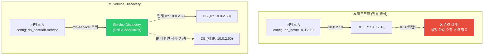
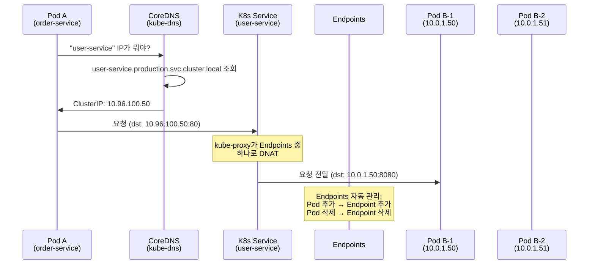
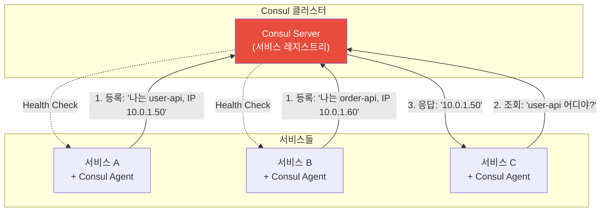
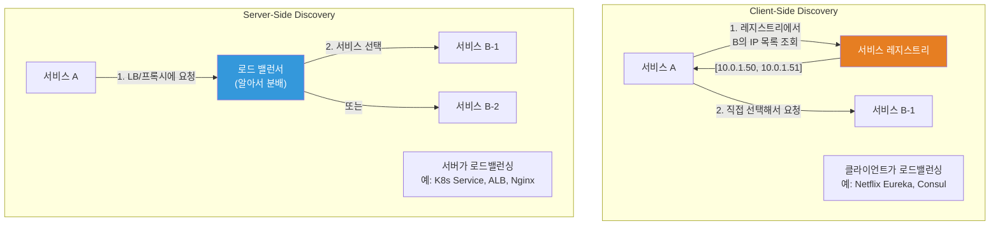
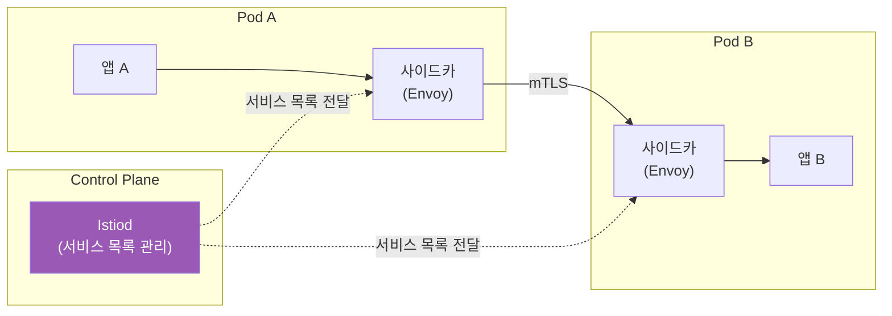

# Service Discovery (CoreDNS / Consul / 내부 DNS)

> 마이크로서비스가 10개, 50개, 200개로 늘어나면 "서비스 A가 서비스 B를 어떻게 찾지?"가 큰 문제예요. IP가 수시로 바뀌는 컨테이너 환경에서는 더욱 그래요. Service Discovery는 서비스들이 서로를 **자동으로** 찾을 수 있게 해주는 시스템이에요.

---

## 🎯 이걸 왜 알아야 하나?

```
실무에서 Service Discovery가 필요한 순간:
• K8s에서 "http://user-service:8080"으로 접속 → 어떻게 되는 거지?
• Pod가 재시작되면 IP가 바뀌는데 → 다른 서비스는 어떻게 찾지?
• 서비스가 3개에서 30개로 늘어남 → 설정 파일에 IP 하드코딩? 불가능!
• 서비스가 scale-out하면 → 새 인스턴스를 어떻게 알리지?
• 서비스가 죽으면 → 자동으로 목록에서 빠져야 하는데?
```

[DNS 강의](./03-dns)에서 도메인→IP 매핑을 배웠죠? Service Discovery는 **내부 서비스 간**의 DNS예요. 그리고 [로드 밸런싱 강의](./06-load-balancing)에서 배운 Health Check와 자연스럽게 연결돼요.

---

## 🧠 핵심 개념

### 비유: 회사 내선 전화번호부

Service Discovery를 **회사 내선 전화번호부**에 비유해볼게요.

* **고정 IP (하드코딩)** = 직원 자리가 바뀔 때마다 전화번호부를 수동으로 수정. 직원 1000명이면 불가능!
* **Service Discovery** = 자동 업데이트되는 디지털 전화번호부. 직원이 자리를 바꾸면(Pod 재시작) 자동으로 번호 갱신. 퇴사(서비스 다운)하면 자동 삭제
* **DNS 기반** = 이름으로 검색. "김개발" 검색 → 내선 1234
* **서비스 레지스트리** = 전화번호부 데이터베이스. 모든 서비스의 이름, IP, 포트, 상태를 관리

### 왜 Service Discovery가 필요한가?



---

## 🔍 상세 설명 — Kubernetes Service Discovery (★ 가장 중요!)

### K8s Service와 DNS

Kubernetes에서 Service를 만들면 **자동으로 DNS 레코드가 생성**돼요. 이게 K8s의 서비스 디스커버리 핵심이에요.

```yaml
# Service 생성
apiVersion: v1
kind: Service
metadata:
  name: user-service          # ← 이 이름이 DNS 이름이 됨!
  namespace: production
spec:
  selector:
    app: user-api
  ports:
    - port: 80
      targetPort: 8080
```

```bash
# Service를 만들면 자동으로 DNS가 생성됨:

# 같은 네임스페이스에서:
curl http://user-service:80
# → user-service를 CoreDNS가 ClusterIP(10.96.x.x)로 해석

# 다른 네임스페이스에서:
curl http://user-service.production:80
# → 네임스페이스를 명시

# FQDN (Fully Qualified Domain Name):
curl http://user-service.production.svc.cluster.local:80
# → 완전한 도메인 이름

# DNS 형식:
# <service-name>.<namespace>.svc.cluster.local
#  ^^^^^^^^^^^^   ^^^^^^^^^  ^^^  ^^^^^^^^^^^^^
#  서비스 이름    네임스페이스 서비스 클러스터 도메인
```

### K8s DNS 해석 과정



```bash
# Pod 안에서 DNS 확인
kubectl run test --image=busybox --rm -it --restart=Never -- nslookup user-service
# Server:    10.96.0.10           ← CoreDNS 서비스 IP
# Address 1: 10.96.0.10 kube-dns.kube-system.svc.cluster.local
#
# Name:      user-service
# Address 1: 10.96.100.50 user-service.production.svc.cluster.local
#                          ← ClusterIP

# Service의 Endpoints (실제 Pod IP 목록) 확인
kubectl get endpoints user-service -n production
# NAME           ENDPOINTS                           AGE
# user-service   10.0.1.50:8080,10.0.1.51:8080      5d
#                ^^^^^^^^^^^^^^  ^^^^^^^^^^^^^^
#                Pod B-1의 IP    Pod B-2의 IP

# Pod가 죽으면 자동으로 Endpoints에서 제거됨!
# Pod가 새로 뜨면 자동으로 Endpoints에 추가됨!

# Service 유형별 DNS:

# ClusterIP (기본): 클러스터 내부에서만 접근
# → user-service.production.svc.cluster.local → 10.96.100.50

# Headless Service (clusterIP: None): Pod IP를 직접 반환
# → user-service.production.svc.cluster.local → 10.0.1.50, 10.0.1.51
# → StatefulSet에서 개별 Pod에 접근할 때 사용
# → user-service-0.user-service.production.svc.cluster.local → 10.0.1.50
```

### Pod의 DNS 설정

```bash
# Pod 안의 DNS 설정 확인
kubectl exec -it my-pod -- cat /etc/resolv.conf
# nameserver 10.96.0.10                              ← CoreDNS
# search production.svc.cluster.local svc.cluster.local cluster.local
# options ndots:5

# search 도메인 순서:
# "user-service"를 질의하면:
# 1. user-service.production.svc.cluster.local  ← 같은 네임스페이스 먼저
# 2. user-service.svc.cluster.local
# 3. user-service.cluster.local
# 4. user-service.                              ← 외부 DNS

# ndots:5 의미:
# 도메인에 점(.)이 5개 미만이면 search 도메인을 붙여서 검색
# "user-service" (점 0개) → search 순서대로 시도
# "api.external.com" (점 2개, <5) → search 순서대로 시도 후 외부 DNS
# "api.external.com." (끝에 점) → 외부 DNS 직접 질의 (search 건너뜀)

# ⚠️ ndots:5는 외부 도메인 조회 시 불필요한 DNS 쿼리가 많이 발생!
# "google.com" → 먼저 google.com.production.svc.cluster.local 시도 (실패)
#               → google.com.svc.cluster.local 시도 (실패)
#               → google.com.cluster.local 시도 (실패)
#               → 그제야 google.com 시도 (성공)
# → 총 4번 질의! 느림!

# 최적화: 외부 도메인은 끝에 점(.)을 붙이기
# curl http://api.external.com./v1/data    ← 끝에 점! → 바로 외부 DNS
```

---

## 🔍 상세 설명 — CoreDNS

### CoreDNS란?

Kubernetes의 기본 DNS 서버예요. 클러스터 내부의 서비스 이름을 IP로 해석해줘요.

```bash
# CoreDNS Pod 확인
kubectl get pods -n kube-system -l k8s-app=kube-dns
# NAME                       READY   STATUS    RESTARTS   AGE
# coredns-5644d7b6d9-abc12   1/1     Running   0          30d
# coredns-5644d7b6d9-def34   1/1     Running   0          30d
# → 보통 2개 (고가용성)

# CoreDNS Service 확인
kubectl get svc -n kube-system kube-dns
# NAME       TYPE        CLUSTER-IP   EXTERNAL-IP   PORT(S)
# kube-dns   ClusterIP   10.96.0.10   <none>        53/UDP,53/TCP

# CoreDNS 로그 확인
kubectl logs -n kube-system -l k8s-app=kube-dns --tail=20
# [INFO] 10.0.1.50:42000 - 12345 "A IN user-service.production.svc.cluster.local. udp ..." NOERROR
# → Pod 10.0.1.50이 user-service를 조회함
```

### CoreDNS 설정 (Corefile)

```bash
kubectl get configmap coredns -n kube-system -o yaml
```

```yaml
# CoreDNS Corefile
apiVersion: v1
kind: ConfigMap
metadata:
  name: coredns
  namespace: kube-system
data:
  Corefile: |
    .:53 {
        errors                        # 에러 로깅
        health {                      # 헬스체크 엔드포인트
            lameduck 5s
        }
        ready                         # readiness 프로브
        
        kubernetes cluster.local in-addr.arpa ip6.arpa {
            pods insecure              # Pod DNS 레코드
            fallthrough in-addr.arpa ip6.arpa
            ttl 30                     # DNS 캐시 TTL 30초
        }
        
        prometheus :9153              # 메트릭 엔드포인트
        
        forward . /etc/resolv.conf {  # 외부 DNS 포워딩
            max_concurrent 1000
        }
        
        cache 30                      # DNS 캐시 30초
        loop                          # 루프 감지
        reload                        # 설정 자동 리로드
        loadbalance                   # 라운드로빈
    }
```

### CoreDNS 커스텀 설정

```bash
# 내부 도메인을 특정 DNS 서버로 포워딩

# 예: *.corp.mycompany.com → 사내 DNS 서버 (10.0.0.2)
kubectl edit configmap coredns -n kube-system
```

```yaml
# Corefile에 추가:
data:
  Corefile: |
    # 사내 도메인은 사내 DNS로
    corp.mycompany.com:53 {
        errors
        cache 30
        forward . 10.0.0.2
    }
    
    # 기본 설정 (cluster.local + 외부)
    .:53 {
        errors
        health
        kubernetes cluster.local in-addr.arpa ip6.arpa {
            pods insecure
            fallthrough in-addr.arpa ip6.arpa
            ttl 30
        }
        forward . /etc/resolv.conf
        cache 30
        reload
        loadbalance
    }
```

```bash
# 적용 후 CoreDNS 재시작 (reload 플러그인이 자동으로 해주지만, 확실하게)
kubectl rollout restart deployment coredns -n kube-system

# 테스트
kubectl run test --image=busybox --rm -it --restart=Never -- nslookup internal-api.corp.mycompany.com
# Address: 10.100.50.20    ← 사내 DNS에서 해석!
```

### CoreDNS 트러블슈팅

```bash
# "DNS가 안 돼요!" — K8s에서 가장 흔한 네트워크 문제

# 1. CoreDNS Pod가 살아있는지 확인
kubectl get pods -n kube-system -l k8s-app=kube-dns
# 둘 다 Running이어야!

# 2. CoreDNS Service가 있는지 확인
kubectl get svc -n kube-system kube-dns
# ClusterIP: 10.96.0.10

# 3. Pod에서 DNS 테스트
kubectl run test --image=busybox --rm -it --restart=Never -- nslookup kubernetes
# 성공하면: Address: 10.96.0.1
# 실패하면: ** server can't find kubernetes: NXDOMAIN

# 4. CoreDNS 로그 확인
kubectl logs -n kube-system -l k8s-app=kube-dns --tail=50
# 에러 메시지가 있는지 확인

# 5. 직접 CoreDNS에 질의
kubectl run test --image=busybox --rm -it --restart=Never -- \
    nslookup user-service.production.svc.cluster.local 10.96.0.10
# → CoreDNS IP로 직접 질의

# 6. 외부 DNS 해석 확인
kubectl run test --image=busybox --rm -it --restart=Never -- nslookup google.com
# 실패하면: CoreDNS의 forward 설정 또는 노드의 DNS 설정 문제

# 흔한 원인:
# a. CoreDNS Pod가 다운
# b. kube-dns Service가 없거나 IP가 다름
# c. Pod의 /etc/resolv.conf가 잘못됨
# d. NetworkPolicy가 DNS(53 포트) 트래픽을 차단
# e. 노드의 /etc/resolv.conf에 외부 DNS가 없음
```

---

## 🔍 상세 설명 — Consul

### Consul이란?

HashiCorp의 Service Discovery + 설정 관리 + 서비스 메시 도구예요. K8s 밖의 환경(VM, 베어메탈)에서도 사용할 수 있어요.



```bash
# Consul에서 서비스 등록
# /etc/consul.d/user-api.json
{
  "service": {
    "name": "user-api",
    "port": 8080,
    "tags": ["v1", "production"],
    "check": {
      "http": "http://localhost:8080/health",
      "interval": "10s",
      "timeout": "3s"
    }
  }
}

# 서비스 조회 (DNS)
dig @127.0.0.1 -p 8600 user-api.service.consul +short
# 10.0.1.50
# 10.0.1.51    ← 여러 인스턴스

# 서비스 조회 (HTTP API)
curl http://localhost:8500/v1/catalog/service/user-api
# [
#   {
#     "ServiceName": "user-api",
#     "ServiceAddress": "10.0.1.50",
#     "ServicePort": 8080,
#     "ServiceTags": ["v1", "production"]
#   },
#   {
#     "ServiceName": "user-api",
#     "ServiceAddress": "10.0.1.51",
#     "ServicePort": 8080,
#     "ServiceTags": ["v1", "production"]
#   }
# ]

# 건강한 서비스만 조회
curl http://localhost:8500/v1/health/service/user-api?passing=true
```

### K8s vs Consul Service Discovery

| 항목 | K8s Service + CoreDNS | Consul |
|------|----------------------|--------|
| 환경 | K8s 클러스터 내부 | K8s + VM + 베어메탈 (멀티 환경) |
| 등록 | 자동 (Pod 생성 시) | 에이전트 또는 API |
| 조회 | DNS (svc.cluster.local) | DNS (.service.consul) + HTTP API |
| Health Check | readinessProbe | 자체 Health Check |
| Key-Value | ❌ (etcd는 K8s 전용) | ✅ (설정 저장소) |
| Service Mesh | Istio/Linkerd 별도 | Consul Connect 내장 |
| 복잡도 | K8s에 내장 (간단) | 별도 설치/관리 |
| 추천 | K8s만 쓰면 충분! | K8s + 비-K8s 혼합 환경 |

```bash
# 실무 선택 가이드:

# K8s만 사용하는 환경:
# → K8s Service + CoreDNS로 충분! Consul 불필요

# K8s + 레거시 VM 혼합:
# → Consul로 통합 서비스 디스커버리
# → K8s의 서비스도 Consul에 동기화 가능

# 멀티 데이터센터:
# → Consul의 WAN Federation으로 여러 DC 연결
```

---

## 🔍 상세 설명 — AWS 내부 DNS

### Route53 Private Hosted Zone

VPC 내부에서만 사용하는 DNS 존이에요. 내부 서비스에 사람이 읽기 쉬운 이름을 붙일 수 있어요.

```bash
# Private Hosted Zone 생성
aws route53 create-hosted-zone \
    --name "internal.mycompany.com" \
    --vpc VPCRegion=ap-northeast-2,VPCId=vpc-abc123 \
    --caller-reference "$(date +%s)" \
    --hosted-zone-config PrivateZone=true

# 레코드 추가
# db.internal.mycompany.com → 10.0.2.10
# redis.internal.mycompany.com → 10.0.3.10
# api.internal.mycompany.com → ALB DNS name (Alias)

# VPC 내부에서 조회
dig db.internal.mycompany.com +short
# 10.0.2.10    ← VPC 안에서만 해석됨!

# VPC 밖에서 조회
dig db.internal.mycompany.com +short
# (빈 결과)    ← VPC 밖에서는 해석 안 됨! (보안)

# 실무 패턴:
# db.internal.mycompany.com      → RDS 엔드포인트
# redis.internal.mycompany.com   → ElastiCache 엔드포인트
# api.internal.mycompany.com     → Internal ALB
# → 앱 설정에서 IP 대신 도메인 이름 사용!
# → RDS failover 시 IP가 바뀌어도 DNS가 자동 업데이트
```

### AWS Cloud Map

AWS 네이티브 서비스 디스커버리예요. ECS/Fargate와 잘 통합돼요.

```bash
# Cloud Map 네임스페이스 생성
aws servicediscovery create-private-dns-namespace \
    --name "production.local" \
    --vpc vpc-abc123

# 서비스 등록
aws servicediscovery create-service \
    --name "user-api" \
    --namespace-id ns-abc123 \
    --dns-config "RoutingPolicy=MULTIVALUE,DnsRecords=[{Type=A,TTL=10}]"

# 인스턴스 등록
aws servicediscovery register-instance \
    --service-id srv-abc123 \
    --instance-id "i-0abc123" \
    --attributes "AWS_INSTANCE_IPV4=10.0.1.50,AWS_INSTANCE_PORT=8080"

# DNS로 조회
dig user-api.production.local +short
# 10.0.1.50

# ECS에서는 자동 등록/해제!
# Task가 시작되면 → Cloud Map에 자동 등록
# Task가 종료되면 → Cloud Map에서 자동 삭제
```

---

## 🔍 상세 설명 — Service Discovery 패턴

### Client-Side vs Server-Side Discovery



```bash
# K8s Service = Server-Side Discovery
# → 클라이언트는 Service Name만 알면 됨
# → kube-proxy가 알아서 Pod에 분배

# Consul = Client-Side Discovery도 가능
# → 클라이언트가 Consul에서 IP 목록을 받아서 직접 선택
# → 또는 Consul의 DNS로 Server-Side처럼 사용

# 실무에서는?
# K8s 환경: Server-Side (K8s Service) → 간단하고 자동
# 비-K8s 환경: Client-Side (Consul) + Nginx/HAProxy
```

### Service Mesh에서의 Service Discovery



```bash
# Istio에서의 서비스 디스커버리:
# 1. Istiod가 K8s API에서 Service/Endpoint 정보를 가져옴
# 2. 각 사이드카(Envoy)에 서비스 목록을 배포
# 3. 앱 A가 user-service에 요청하면:
#    앱 → 사이드카(Envoy) → 서비스 목록에서 찾기 → Pod IP로 직접 연결
#    (K8s Service의 ClusterIP를 거치지 않음!)
# 4. 사이드카가 로드 밸런싱, mTLS, 재시도 등을 처리

# → 앱은 여전히 "http://user-service:80"으로 요청
# → 실제 라우팅은 사이드카가 처리
# → 더 세밀한 트래픽 제어 가능 (카나리, 서킷 브레이커 등)
```

---

## 💻 실습 예제

### 실습 1: K8s DNS 확인

```bash
# 1. 테스트용 서비스 생성
kubectl create deployment nginx --image=nginx
kubectl expose deployment nginx --port=80

# 2. DNS 조회 테스트
kubectl run test --image=busybox --rm -it --restart=Never -- sh -c "
    echo '=== Service DNS ==='
    nslookup nginx
    echo ''
    echo '=== FQDN ==='
    nslookup nginx.default.svc.cluster.local
    echo ''
    echo '=== External DNS ==='
    nslookup google.com
    echo ''
    echo '=== resolv.conf ==='
    cat /etc/resolv.conf
"

# 3. Service의 Endpoints 확인
kubectl get endpoints nginx
# NAME    ENDPOINTS         AGE
# nginx   10.0.1.50:80      1m

# 4. 정리
kubectl delete deployment nginx
kubectl delete service nginx
```

### 실습 2: CoreDNS 로그 분석

```bash
# 1. CoreDNS에 로그 플러그인 활성화
kubectl edit configmap coredns -n kube-system
# Corefile에 "log" 추가:
# .:53 {
#     log              ← 이 줄 추가!
#     errors
#     ...
# }

# 2. CoreDNS 재시작
kubectl rollout restart deployment coredns -n kube-system

# 3. 로그 관찰
kubectl logs -n kube-system -l k8s-app=kube-dns -f

# 4. 다른 터미널에서 DNS 쿼리 생성
kubectl run test --image=busybox --rm -it --restart=Never -- nslookup user-service

# 5. 로그에서 확인
# [INFO] 10.0.1.50:42000 - 12345 "A IN user-service.default.svc.cluster.local. udp 58 false 512" NOERROR ...
# → 어떤 Pod에서, 어떤 도메인을, 어떤 결과로 조회했는지 보임!

# 6. 분석 후 log 플러그인 제거 (로그가 너무 많으니)
# → 프로덕션에서는 log 대신 prometheus 메트릭으로 모니터링
```

### 실습 3: Headless Service (Pod IP 직접 조회)

```bash
# 1. Headless Service 생성 (clusterIP: None)
cat << 'EOF' | kubectl apply -f -
apiVersion: v1
kind: Service
metadata:
  name: headless-test
spec:
  clusterIP: None              # ← Headless!
  selector:
    app: nginx
  ports:
    - port: 80
---
apiVersion: apps/v1
kind: Deployment
metadata:
  name: nginx-headless
spec:
  replicas: 3
  selector:
    matchLabels:
      app: nginx
  template:
    metadata:
      labels:
        app: nginx
    spec:
      containers:
      - name: nginx
        image: nginx
        ports:
        - containerPort: 80
EOF

# 2. DNS 조회 — Pod IP가 직접 나옴!
kubectl run test --image=busybox --rm -it --restart=Never -- nslookup headless-test
# Name:      headless-test
# Address 1: 10.0.1.50        ← Pod 1 IP
# Address 2: 10.0.1.51        ← Pod 2 IP
# Address 3: 10.0.1.52        ← Pod 3 IP
# → ClusterIP가 아니라 실제 Pod IP들이 나옴!

# 일반 Service와 비교:
# 일반 Service: nslookup → 10.96.100.50 (ClusterIP 1개)
# Headless:     nslookup → 10.0.1.50, 10.0.1.51, 10.0.1.52 (Pod IP들)

# 3. 정리
kubectl delete deployment nginx-headless
kubectl delete service headless-test
```

---

## 🏢 실무에서는?

### 시나리오 1: K8s에서 서비스 간 통신 설정

```bash
# 마이크로서비스 구성:
# order-service → user-service (사용자 정보 조회)
# order-service → payment-service (결제 처리)
# order-service → inventory-service (재고 확인)

# 앱 설정 (order-service의 환경변수 또는 config):
# USER_SERVICE_URL=http://user-service.production:80
# PAYMENT_SERVICE_URL=http://payment-service.production:80
# INVENTORY_SERVICE_URL=http://inventory-service.production:80

# → IP 하드코딩 없음!
# → Service 이름만으로 통신!
# → Pod가 재시작되어 IP가 바뀌어도 문제 없음!

# ConfigMap으로 관리:
apiVersion: v1
kind: ConfigMap
metadata:
  name: order-service-config
  namespace: production
data:
  USER_SERVICE_URL: "http://user-service:80"
  PAYMENT_SERVICE_URL: "http://payment-service:80"
  INVENTORY_SERVICE_URL: "http://inventory-service:80"
```

### 시나리오 2: CoreDNS 성능 문제

```bash
# "DNS 조회가 느려요" — ndots:5 문제

# 증상: 외부 API 호출 시 첫 요청이 느림
# 원인: ndots:5로 인해 외부 도메인도 cluster.local을 먼저 시도

# 확인:
kubectl run test --image=busybox --rm -it --restart=Never -- \
    time nslookup api.external.com
# real    0m 0.800s    ← 0.8초! (4번 실패 후 성공)

# 해결 1: FQDN 끝에 점(.) 붙이기 (앱 설정에서)
# api.external.com. ← 점 하나로 4배 빠름!

# 해결 2: Pod의 dnsConfig으로 ndots 줄이기
spec:
  dnsConfig:
    options:
    - name: ndots
      value: "2"              # 5 → 2로 줄이기
  containers:
  - name: myapp
    image: myapp:latest

# 해결 후:
kubectl run test --image=busybox --rm -it --restart=Never -- \
    time nslookup api.external.com
# real    0m 0.050s    ← 0.05초! 빠름!

# 해결 3: NodeLocal DNSCache (대규모 클러스터)
# → 각 노드에 DNS 캐시를 두어 CoreDNS 부하 분산
# → K8s 애드온으로 설치 가능
```

### 시나리오 3: 멀티 환경 서비스 디스커버리

```bash
# 상황: K8s 서비스가 VPC 내 RDS에 접근해야 함

# 방법 1: ExternalName Service
apiVersion: v1
kind: Service
metadata:
  name: database
  namespace: production
spec:
  type: ExternalName
  externalName: mydb.abc123.ap-northeast-2.rds.amazonaws.com

# → Pod에서 "http://database:5432"로 접속
# → CoreDNS가 RDS 엔드포인트로 CNAME 해석!
# → RDS failover 시 자동으로 새 IP로 연결

# 방법 2: Service + 수동 Endpoints
apiVersion: v1
kind: Service
metadata:
  name: legacy-api
spec:
  ports:
  - port: 80
---
apiVersion: v1
kind: Endpoints
metadata:
  name: legacy-api        # Service와 같은 이름!
subsets:
  - addresses:
    - ip: 10.0.5.100       # 외부 VM의 IP
    ports:
    - port: 8080

# → K8s 안에서 "http://legacy-api:80"으로 외부 VM에 접속!

# 방법 3: Route53 Private Hosted Zone
# → K8s 밖의 서비스도 DNS 이름으로 접근
# → db.internal.mycompany.com → RDS 엔드포인트
```

---

## ⚠️ 자주 하는 실수

### 1. 서비스 이름에 IP를 하드코딩

```bash
# ❌ 앱 설정에 IP 하드코딩
DB_HOST=10.0.2.10
REDIS_HOST=10.0.3.20
# → IP 바뀌면 설정 변경 + 앱 재시작 필요!

# ✅ 서비스 이름 사용
DB_HOST=database.production.svc.cluster.local    # K8s Service
DB_HOST=db.internal.mycompany.com                # Route53 Private
DB_HOST=database.service.consul                   # Consul
```

### 2. ndots:5를 그대로 두기 (외부 DNS 느림)

```bash
# ❌ 기본 ndots:5 → 외부 도메인 조회 시 불필요한 4번의 DNS 쿼리

# ✅ 방법 1: 외부 도메인에 끝에 점(.) 붙이기
# api.external.com. (끝에 점)

# ✅ 방법 2: dnsConfig에서 ndots 줄이기
# dnsConfig:
#   options:
#   - name: ndots
#     value: "2"
```

### 3. CoreDNS가 다운됐을 때 대비 안 하기

```bash
# ❌ CoreDNS 1개만 운영 → 장애 시 모든 DNS 조회 실패

# ✅ CoreDNS는 최소 2개 이상
kubectl get deployment coredns -n kube-system -o jsonpath='{.spec.replicas}'
# 2    ← 최소 2개!

# 대규모에서는 NodeLocal DNSCache 사용
# → 노드 레벨 캐시로 CoreDNS 장애 시에도 캐시된 결과 사용
```

### 4. Headless Service와 일반 Service를 혼동

```bash
# Headless Service (clusterIP: None):
# → DNS가 Pod IP들을 직접 반환
# → StatefulSet에서 개별 Pod 접근용

# 일반 Service (ClusterIP):
# → DNS가 ClusterIP 1개를 반환
# → kube-proxy가 Pod에 분배
# → 대부분의 경우 이걸 써야 함!

# ❌ 일반 앱에 Headless Service 사용
# → 클라이언트가 직접 로드밸런싱 해야 함 (복잡!)

# ✅ 일반 앱은 ClusterIP Service, DB/캐시 StatefulSet은 Headless
```

### 5. NetworkPolicy로 DNS를 차단

```bash
# ❌ 엄격한 NetworkPolicy로 모든 egress를 차단
# → CoreDNS(포트 53)도 차단됨 → DNS 해석 안 됨!

# ✅ DNS 트래픽은 반드시 허용
apiVersion: networking.k8s.io/v1
kind: NetworkPolicy
metadata:
  name: allow-dns
spec:
  podSelector: {}
  policyTypes:
  - Egress
  egress:
  - to:
    - namespaceSelector:
        matchLabels:
          kubernetes.io/metadata.name: kube-system
    ports:
    - protocol: UDP
      port: 53
    - protocol: TCP
      port: 53
```

---

## 📝 정리

### K8s DNS 형식

```
<service>.<namespace>.svc.cluster.local
예: user-service.production.svc.cluster.local

같은 네임스페이스: user-service (짧게 가능)
다른 네임스페이스: user-service.production
FQDN:            user-service.production.svc.cluster.local
```

### Service Discovery 선택 가이드

```
K8s만 사용           → K8s Service + CoreDNS (기본 내장, 충분!)
K8s + VM 혼합        → Consul 또는 Route53 Private Hosted Zone
AWS 네이티브         → Cloud Map + Route53 Private
대규모 K8s           → CoreDNS + NodeLocal DNSCache
Service Mesh        → Istio/Linkerd (사이드카가 디스커버리 처리)
```

### 디버깅 명령어

```bash
# K8s DNS 테스트
kubectl run test --image=busybox --rm -it --restart=Never -- nslookup SERVICE_NAME

# CoreDNS 상태
kubectl get pods -n kube-system -l k8s-app=kube-dns
kubectl logs -n kube-system -l k8s-app=kube-dns --tail=20

# Endpoints 확인
kubectl get endpoints SERVICE_NAME

# Pod의 resolv.conf
kubectl exec POD -- cat /etc/resolv.conf
```

---

## 🔗 다음 강의

다음은 **[13-api-gateway](./13-api-gateway)** — API Gateway / OpenAPI 이에요.

마이크로서비스의 "정문"인 API Gateway. 인증, 라우팅, Rate Limiting, API 버전 관리까지 — 외부에서 들어오는 API 요청을 관리하는 방법을 배워볼게요. 이걸로 02-Networking 카테고리가 마무리돼요!
