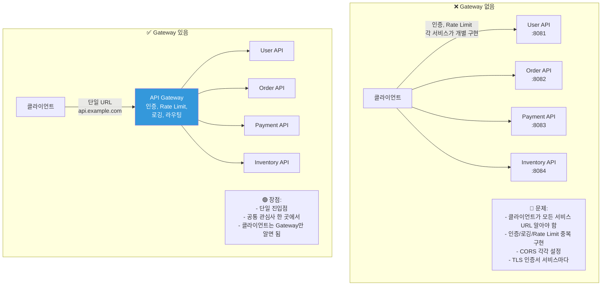
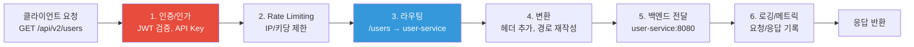
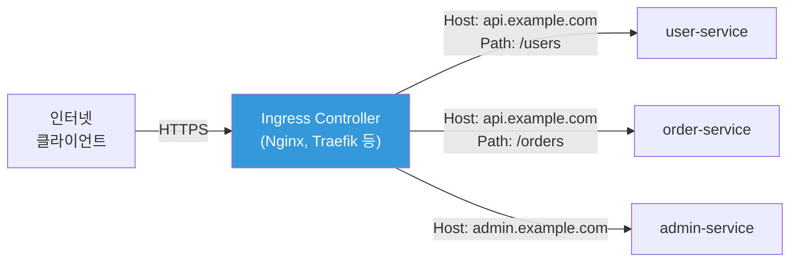
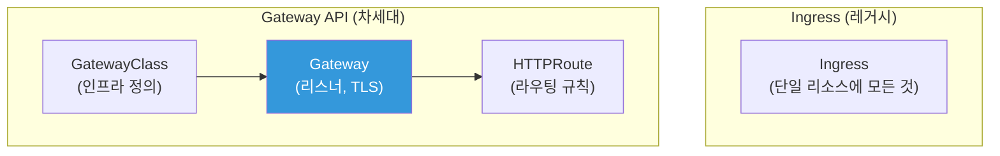

# API Gateway / OpenAPI

> 마이크로서비스가 20개인데, 외부 클라이언트가 각 서비스에 직접 접근하면? URL도 제각각, 인증도 제각각, Rate Limiting도 제각각 — 관리가 불가능해요. API Gateway는 이 모든 것을 **단일 진입점(Single Entry Point)**으로 통합하는 "정문"이에요.

---

## 🎯 이걸 왜 알아야 하나?

```
실무에서 API Gateway 관련 업무:
• "외부 API를 한 곳에서 관리하고 싶어요"       → API Gateway 도입
• "API 인증을 앱마다 구현하기 귀찮아요"        → Gateway에서 공통 인증
• "API 버전 관리를 어떻게 하죠?"              → Gateway 라우팅
• "API 문서를 자동으로 만들고 싶어요"          → OpenAPI(Swagger)
• "API 사용량을 제한/모니터링하고 싶어요"      → Rate Limiting, 로깅
• K8s Ingress/Gateway API가 뭔지            → 외부 트래픽 관리
```

[로드 밸런싱](./06-load-balancing)에서 트래픽 분배를 배우고, [Service Discovery](./12-service-discovery)에서 서비스 간 통신을 배웠죠? API Gateway는 이것들 위에서 **외부→내부** 트래픽을 관리하는 계층이에요.

---

## 🧠 핵심 개념

### 비유: 호텔 프론트 데스크

API Gateway를 **호텔 프론트 데스크**에 비유해볼게요.

* **API Gateway** = 프론트 데스크. 모든 고객(요청)이 여기를 거침
* **인증** = 예약 확인. "예약하셨나요? 신분증 보여주세요"
* **라우팅** = "식당은 2층, 수영장은 지하, 객실은 5층이에요"
* **Rate Limiting** = "한 분이 식당을 10번 이상 오시면 좀..."
* **API 버전** = "구관은 왼쪽, 신관은 오른쪽"
* **변환** = 외국인 고객에게 통역 (요청/응답 형식 변환)

### Gateway 없이 vs Gateway 있을 때



### API Gateway가 하는 일



---

## 🔍 상세 설명 — API Gateway 종류

### 주요 API Gateway 제품

| 제품 | 유형 | 특징 | 추천 상황 |
|------|------|------|----------|
| **AWS API Gateway** | 관리형 (서버리스) | Lambda 연동, REST/WebSocket/HTTP | AWS 서버리스 |
| **Kong** | 오픈소스 + 상용 | Nginx 기반, 플러그인 풍부 | 범용, K8s |
| **K8s Ingress** | K8s 네이티브 | Nginx/Traefik Ingress Controller | K8s 기본 |
| **K8s Gateway API** | K8s 차세대 표준 | Ingress 후속, 더 강력 | K8s 최신 |
| **Envoy / Istio** | 서비스 메시 | 사이드카 기반, 고급 기능 | 대규모 마이크로서비스 |
| **Traefik** | 오픈소스 | 자동 설정, Docker/K8s 친화 | 소규모~중규모 |
| **Nginx** | 범용 | 리버스 프록시 + 라우팅 | 간단한 구성 |
| **AWS ALB** | 관리형 | L7 라우팅, 간단한 API Gateway 역할 | AWS 간단한 라우팅 |

```bash
# 선택 가이드:

# Lambda + 서버리스 → AWS API Gateway
# K8s (기본)       → Ingress (Nginx Ingress Controller)
# K8s (고급)       → Gateway API 또는 Kong
# K8s + 서비스 메시 → Istio Gateway
# 간단한 프록시     → Nginx 또는 ALB
# 멀티 환경        → Kong 또는 Traefik
```

---

## 🔍 상세 설명 — Kubernetes Ingress

### Ingress란?

Ingress는 K8s 클러스터 외부에서 내부 Service로 HTTP/HTTPS 트래픽을 라우팅하는 리소스예요. [L7 로드 밸런서](./06-load-balancing)의 K8s 버전이에요.



```yaml
# Ingress 리소스 예시
apiVersion: networking.k8s.io/v1
kind: Ingress
metadata:
  name: myapp-ingress
  namespace: production
  annotations:
    # Nginx Ingress Controller 설정
    nginx.ingress.kubernetes.io/ssl-redirect: "true"
    nginx.ingress.kubernetes.io/proxy-body-size: "50m"
    nginx.ingress.kubernetes.io/rate-limit: "100"
    nginx.ingress.kubernetes.io/rate-limit-window: "1m"
spec:
  ingressClassName: nginx                    # 어떤 Ingress Controller 사용
  tls:
  - hosts:
    - api.example.com
    - admin.example.com
    secretName: tls-secret                   # TLS 인증서 (Secret)
  rules:
  # 호스트 기반 라우팅
  - host: api.example.com
    http:
      paths:
      # 경로 기반 라우팅
      - path: /users
        pathType: Prefix
        backend:
          service:
            name: user-service
            port:
              number: 80
      - path: /orders
        pathType: Prefix
        backend:
          service:
            name: order-service
            port:
              number: 80
      - path: /
        pathType: Prefix
        backend:
          service:
            name: frontend-service
            port:
              number: 80
  - host: admin.example.com
    http:
      paths:
      - path: /
        pathType: Prefix
        backend:
          service:
            name: admin-service
            port:
              number: 80
```

```bash
# Ingress 확인
kubectl get ingress -n production
# NAME             CLASS   HOSTS                              ADDRESS        PORTS     AGE
# myapp-ingress    nginx   api.example.com,admin.example.com  52.78.100.50   80, 443   5d

# 상세 정보
kubectl describe ingress myapp-ingress -n production
# Rules:
#   Host                Path  Backends
#   ----                ----  --------
#   api.example.com
#                       /users    user-service:80 (10.0.1.50:8080,10.0.1.51:8080)
#                       /orders   order-service:80 (10.0.1.60:8080)
#                       /         frontend-service:80 (10.0.1.70:3000)
#   admin.example.com
#                       /         admin-service:80 (10.0.1.80:8080)

# TLS 인증서 Secret 생성
kubectl create secret tls tls-secret \
    --cert=fullchain.pem \
    --key=privkey.pem \
    -n production

# 또는 cert-manager로 자동 발급 (Let's Encrypt + K8s)
# → cert-manager가 Ingress의 tls 설정을 보고 자동으로 인증서 발급/갱신!
```

### Nginx Ingress Controller 실무 설정

```yaml
# Nginx Ingress Controller의 ConfigMap으로 글로벌 설정
apiVersion: v1
kind: ConfigMap
metadata:
  name: nginx-configuration
  namespace: ingress-nginx
data:
  # 프록시 설정
  proxy-body-size: "50m"
  proxy-connect-timeout: "10"
  proxy-read-timeout: "60"
  proxy-send-timeout: "60"
  
  # gzip 압축
  use-gzip: "true"
  gzip-types: "application/json text/css application/javascript"
  
  # 보안 헤더
  use-forwarded-headers: "true"
  enable-real-ip: "true"
  
  # 로그 형식
  log-format-upstream: '$remote_addr - $request_id [$time_local] "$request" $status $body_bytes_sent rt=$request_time'
  
  # Rate Limiting
  limit-req-status-code: "429"
  
  # SSL
  ssl-protocols: "TLSv1.2 TLSv1.3"
  hsts: "true"
  hsts-max-age: "31536000"
```

```bash
# Ingress Controller 설치 (Helm)
helm repo add ingress-nginx https://kubernetes.github.io/ingress-nginx
helm install ingress-nginx ingress-nginx/ingress-nginx \
    --namespace ingress-nginx --create-namespace \
    --set controller.replicaCount=2 \
    --set controller.service.type=LoadBalancer

# 설치 확인
kubectl get pods -n ingress-nginx
# NAME                                       READY   STATUS    RESTARTS   AGE
# ingress-nginx-controller-abc123-1          1/1     Running   0          5d
# ingress-nginx-controller-abc123-2          1/1     Running   0          5d

kubectl get svc -n ingress-nginx
# NAME                       TYPE           CLUSTER-IP     EXTERNAL-IP
# ingress-nginx-controller   LoadBalancer   10.96.50.100   52.78.100.50
#                                                          ^^^^^^^^^^^^
#                                                          이 IP로 접속!

# DNS 설정:
# api.example.com → 52.78.100.50 (또는 ALB DNS name)
```

### Ingress 어노테이션 실전

```yaml
# === Rate Limiting ===
annotations:
  nginx.ingress.kubernetes.io/limit-rps: "10"              # 초당 10개
  nginx.ingress.kubernetes.io/limit-burst-multiplier: "5"   # 버스트 50개
  nginx.ingress.kubernetes.io/limit-connections: "20"       # 동시 연결 20개

# === 인증 ===
annotations:
  nginx.ingress.kubernetes.io/auth-type: basic
  nginx.ingress.kubernetes.io/auth-secret: basic-auth       # htpasswd Secret
  nginx.ingress.kubernetes.io/auth-realm: "Restricted Area"

# === CORS ===
annotations:
  nginx.ingress.kubernetes.io/enable-cors: "true"
  nginx.ingress.kubernetes.io/cors-allow-origin: "https://frontend.example.com"
  nginx.ingress.kubernetes.io/cors-allow-methods: "GET, POST, PUT, DELETE, OPTIONS"
  nginx.ingress.kubernetes.io/cors-allow-headers: "Content-Type, Authorization"

# === 리다이렉트 / 리라이트 ===
annotations:
  # /api/v1/users → 백엔드에는 /users로 전달
  nginx.ingress.kubernetes.io/rewrite-target: /$2
# spec.rules[].http.paths[].path: /api/v1(/|$)(.*)

  # HTTP → HTTPS 리다이렉트
  nginx.ingress.kubernetes.io/ssl-redirect: "true"

# === 타임아웃 ===
annotations:
  nginx.ingress.kubernetes.io/proxy-connect-timeout: "10"
  nginx.ingress.kubernetes.io/proxy-read-timeout: "120"    # 긴 API용
  nginx.ingress.kubernetes.io/proxy-send-timeout: "120"

# === WebSocket ===
annotations:
  nginx.ingress.kubernetes.io/proxy-read-timeout: "3600"   # 1시간
  nginx.ingress.kubernetes.io/proxy-send-timeout: "3600"
  # WebSocket은 Connection: Upgrade를 자동 처리

# === 카나리 배포 ===
annotations:
  nginx.ingress.kubernetes.io/canary: "true"
  nginx.ingress.kubernetes.io/canary-weight: "10"           # 10% 트래픽
  # 또는 헤더 기반:
  nginx.ingress.kubernetes.io/canary-by-header: "X-Canary"
  nginx.ingress.kubernetes.io/canary-by-header-value: "true"
```

---

## 🔍 상세 설명 — K8s Gateway API

### Gateway API란?

Ingress의 후속으로, 더 강력하고 표준화된 K8s 트래픽 관리 API예요.



**Ingress vs Gateway API:**

| 항목 | Ingress | Gateway API |
|------|---------|-------------|
| 역할 분리 | 하나의 리소스에 모든 것 | GatewayClass → Gateway → Route 분리 |
| 프로토콜 | HTTP/HTTPS만 | HTTP, TCP, UDP, gRPC, TLS |
| 헤더 기반 라우팅 | 어노테이션 (비표준) | 네이티브 지원 |
| 트래픽 분배 | 제한적 | 가중치 기반 분배 (카나리) |
| 크로스 네임스페이스 | 어려움 | 네이티브 지원 |
| 표준화 | 어노테이션이 벤더마다 다름 | 표준 API |

```yaml
# Gateway API 예시

# 1. GatewayClass — 인프라 팀이 관리
apiVersion: gateway.networking.k8s.io/v1
kind: GatewayClass
metadata:
  name: external-lb
spec:
  controllerName: gateway.nginx.org/nginx-gateway-controller

---
# 2. Gateway — 플랫폼 팀이 관리
apiVersion: gateway.networking.k8s.io/v1
kind: Gateway
metadata:
  name: production-gateway
  namespace: gateway-system
spec:
  gatewayClassName: external-lb
  listeners:
  - name: https
    protocol: HTTPS
    port: 443
    tls:
      mode: Terminate
      certificateRefs:
      - name: tls-cert
    allowedRoutes:
      namespaces:
        from: All                   # 모든 네임스페이스의 Route 허용

---
# 3. HTTPRoute — 개발 팀이 관리
apiVersion: gateway.networking.k8s.io/v1
kind: HTTPRoute
metadata:
  name: user-api-route
  namespace: production
spec:
  parentRefs:
  - name: production-gateway
    namespace: gateway-system
  hostnames:
  - "api.example.com"
  rules:
  - matches:
    - path:
        type: PathPrefix
        value: /users
    backendRefs:
    - name: user-service
      port: 80
      weight: 90                   # 90% → 기존 버전
    - name: user-service-v2
      port: 80
      weight: 10                   # 10% → 새 버전 (카나리!)
  - matches:
    - path:
        type: PathPrefix
        value: /orders
    - headers:                     # 헤더 기반 매칭!
      - name: X-API-Version
        value: "v2"
    backendRefs:
    - name: order-service-v2
      port: 80
```

---

## 🔍 상세 설명 — AWS API Gateway

### AWS API Gateway 종류

```bash
# 1. HTTP API (가장 쌈, 간단)
# → Lambda, ALB, HTTP 엔드포인트로 프록시
# → JWT 인증, CORS 기본 지원
# → $1.00/100만 요청
# → 간단한 API에 추천!

# 2. REST API (가장 기능 많음)
# → 모든 기능: API Key, 사용 계획, 캐싱, WAF
# → $3.50/100만 요청
# → 고급 기능 필요 시

# 3. WebSocket API
# → 양방향 통신
# → 채팅, 실시간 알림
# → $1.00/100만 메시지 + 연결 시간

# 선택 가이드:
# 간단한 Lambda 프록시 → HTTP API ($)
# API Key, 캐싱, 사용 계획 → REST API ($$$)
# 실시간 양방향 → WebSocket API
```

### AWS API Gateway + Lambda 패턴

```bash
# 가장 흔한 서버리스 API 패턴:
# Client → API Gateway → Lambda → DynamoDB

# API Gateway 설정 (SAM/CloudFormation):
# AWSTemplateFormatVersion: '2010-09-09'
# Transform: AWS::Serverless-2016-10-31
# Resources:
#   MyApi:
#     Type: AWS::Serverless::HttpApi
#     Properties:
#       StageName: prod
#       CorsConfiguration:
#         AllowOrigins:
#           - "https://frontend.example.com"
#         AllowMethods:
#           - GET
#           - POST
#         AllowHeaders:
#           - Authorization
#           - Content-Type
#
#   GetUsersFunction:
#     Type: AWS::Serverless::Function
#     Properties:
#       Handler: app.handler
#       Runtime: nodejs18.x
#       Events:
#         GetUsers:
#           Type: HttpApi
#           Properties:
#             ApiId: !Ref MyApi
#             Path: /users
#             Method: GET

# 커스텀 도메인 연결:
# api.example.com → API Gateway
# → ACM 인증서 (us-east-1 또는 리전) 필요
# → Route53에서 A 레코드 (Alias) → API Gateway 도메인
```

---

## 🔍 상세 설명 — OpenAPI (Swagger)

### OpenAPI란?

API를 **표준화된 형식으로 문서화**하는 명세(specification)예요. 예전에는 Swagger라고 불렀어요.

```yaml
# openapi.yaml — API 명세 예시
openapi: 3.0.3
info:
  title: User Service API
  description: 사용자 관리 API
  version: 1.0.0
  contact:
    name: DevOps Team
    email: devops@example.com

servers:
  - url: https://api.example.com/v1
    description: Production
  - url: https://api-staging.example.com/v1
    description: Staging

paths:
  /users:
    get:
      summary: 사용자 목록 조회
      tags:
        - Users
      parameters:
        - name: page
          in: query
          schema:
            type: integer
            default: 1
        - name: limit
          in: query
          schema:
            type: integer
            default: 20
      responses:
        '200':
          description: 성공
          content:
            application/json:
              schema:
                type: object
                properties:
                  users:
                    type: array
                    items:
                      $ref: '#/components/schemas/User'
                  total:
                    type: integer
        '401':
          description: 인증 실패
      security:
        - BearerAuth: []

    post:
      summary: 사용자 생성
      tags:
        - Users
      requestBody:
        required: true
        content:
          application/json:
            schema:
              $ref: '#/components/schemas/CreateUser'
      responses:
        '201':
          description: 생성 성공
          content:
            application/json:
              schema:
                $ref: '#/components/schemas/User'
        '400':
          description: 잘못된 요청

  /users/{id}:
    get:
      summary: 사용자 상세 조회
      tags:
        - Users
      parameters:
        - name: id
          in: path
          required: true
          schema:
            type: integer
      responses:
        '200':
          description: 성공
          content:
            application/json:
              schema:
                $ref: '#/components/schemas/User'
        '404':
          description: 사용자 없음

components:
  schemas:
    User:
      type: object
      properties:
        id:
          type: integer
        name:
          type: string
        email:
          type: string
          format: email
        created_at:
          type: string
          format: date-time

    CreateUser:
      type: object
      required:
        - name
        - email
      properties:
        name:
          type: string
          minLength: 1
          maxLength: 100
        email:
          type: string
          format: email

  securitySchemes:
    BearerAuth:
      type: http
      scheme: bearer
      bearerFormat: JWT
```

```bash
# OpenAPI 문서 활용

# 1. Swagger UI로 문서 보기 (브라우저)
# → https://petstore.swagger.io/ 에 OpenAPI YAML URL 입력
# → API를 시각적으로 보고 직접 테스트 가능!

# 2. 코드 생성 (클라이언트 SDK)
# openapi-generator로 Python/JS/Go 등 클라이언트 코드 자동 생성
# npx @openapitools/openapi-generator-cli generate \
#     -i openapi.yaml \
#     -g python \
#     -o ./generated-client/

# 3. API 테스트 자동화
# OpenAPI 명세를 기반으로 자동 테스트 생성
# → Postman이 OpenAPI 파일을 import해서 테스트 컬렉션 생성

# 4. Mock 서버
# OpenAPI 명세로 가짜 API 서버 생성 (프론트엔드 개발용)
# npx @stoplight/prism-cli mock openapi.yaml
# → http://localhost:4010/users 에서 가짜 응답!

# 실무에서:
# → API 설계를 OpenAPI로 먼저 작성 (API-First Design)
# → 프론트엔드/백엔드가 동시에 개발 가능
# → CI/CD에서 OpenAPI 명세 검증
# → 자동으로 API 문서 배포
```

---

## 🔍 상세 설명 — API 버전 관리

### 버전 관리 전략

```bash
# === 방법 1: URL Path 버전 (가장 흔함!) ===
# GET /api/v1/users
# GET /api/v2/users

# Ingress에서:
# - path: /api/v1
#   backend: user-service-v1
# - path: /api/v2
#   backend: user-service-v2

# ✅ 명확하고 직관적
# ❌ URL이 길어짐

# === 방법 2: 헤더 버전 ===
# GET /api/users
# X-API-Version: 2
# 또는
# Accept: application/vnd.myapp.v2+json

# ✅ URL이 깔끔
# ❌ 브라우저에서 테스트 어려움

# === 방법 3: 쿼리 파라미터 ===
# GET /api/users?version=2

# ✅ 간단
# ❌ 캐싱에 문제 (URL이 달라지니까)

# 실무 추천: URL Path 버전 (/v1, /v2)
# → 가장 명확하고, CDN 캐싱도 쉬움
```

```bash
# API 버전 관리 실전 (K8s Ingress)

# v1과 v2를 동시에 운영:
apiVersion: networking.k8s.io/v1
kind: Ingress
metadata:
  name: api-versioning
spec:
  rules:
  - host: api.example.com
    http:
      paths:
      - path: /api/v1
        pathType: Prefix
        backend:
          service:
            name: api-v1        # 기존 버전
            port:
              number: 80
      - path: /api/v2
        pathType: Prefix
        backend:
          service:
            name: api-v2        # 새 버전
            port:
              number: 80

# 점진적 마이그레이션:
# 1. v2 배포 (v1과 병행)
# 2. 클라이언트에 v2 사용 안내
# 3. v1 사용량 모니터링
# 4. v1 사용량이 0에 가까워지면 v1 Deprecated 알림
# 5. 충분한 기간 후 v1 제거
```

---

## 💻 실습 예제

### 실습 1: K8s Ingress 설정

```bash
# 1. Nginx Ingress Controller 설치 (이미 있으면 건너뜀)
helm repo add ingress-nginx https://kubernetes.github.io/ingress-nginx
helm install ingress-nginx ingress-nginx/ingress-nginx \
    --namespace ingress-nginx --create-namespace

# 2. 테스트용 서비스 2개 생성
kubectl create deployment app-v1 --image=hashicorp/http-echo -- -text="v1"
kubectl expose deployment app-v1 --port=80 --target-port=5678

kubectl create deployment app-v2 --image=hashicorp/http-echo -- -text="v2"
kubectl expose deployment app-v2 --port=80 --target-port=5678

# 3. Ingress 생성 (경로 기반 라우팅)
cat << 'EOF' | kubectl apply -f -
apiVersion: networking.k8s.io/v1
kind: Ingress
metadata:
  name: test-ingress
  annotations:
    nginx.ingress.kubernetes.io/rewrite-target: /
spec:
  ingressClassName: nginx
  rules:
  - http:
      paths:
      - path: /v1
        pathType: Prefix
        backend:
          service:
            name: app-v1
            port:
              number: 80
      - path: /v2
        pathType: Prefix
        backend:
          service:
            name: app-v2
            port:
              number: 80
EOF

# 4. 테스트
INGRESS_IP=$(kubectl get svc -n ingress-nginx ingress-nginx-controller -o jsonpath='{.status.loadBalancer.ingress[0].ip}')

curl http://$INGRESS_IP/v1
# v1

curl http://$INGRESS_IP/v2
# v2

# 5. 정리
kubectl delete ingress test-ingress
kubectl delete deployment app-v1 app-v2
kubectl delete service app-v1 app-v2
```

### 실습 2: Ingress 어노테이션 테스트

```bash
# Rate Limiting 적용
cat << 'EOF' | kubectl apply -f -
apiVersion: networking.k8s.io/v1
kind: Ingress
metadata:
  name: rate-limit-test
  annotations:
    nginx.ingress.kubernetes.io/limit-rps: "2"
    nginx.ingress.kubernetes.io/limit-burst-multiplier: "3"
spec:
  ingressClassName: nginx
  rules:
  - http:
      paths:
      - path: /
        pathType: Prefix
        backend:
          service:
            name: app-v1
            port:
              number: 80
EOF

# Rate Limiting 테스트
for i in $(seq 1 20); do
    code=$(curl -s -o /dev/null -w "%{http_code}" http://$INGRESS_IP/)
    echo "요청 $i: $code"
done
# 요청 1: 200
# ...
# 요청 8: 200    ← rate 2 × burst 3 = 6개 + 약간
# 요청 9: 429    ← 제한 초과!
# 요청 10: 429

kubectl delete ingress rate-limit-test
```

### 실습 3: OpenAPI 문서 만들기

```bash
# 간단한 OpenAPI 파일 작성
cat << 'EOF' > /tmp/openapi.yaml
openapi: 3.0.3
info:
  title: My Simple API
  version: 1.0.0
paths:
  /health:
    get:
      summary: Health Check
      responses:
        '200':
          description: OK
          content:
            application/json:
              schema:
                type: object
                properties:
                  status:
                    type: string
                    example: ok
  /users:
    get:
      summary: List Users
      responses:
        '200':
          description: Success
          content:
            application/json:
              schema:
                type: array
                items:
                  type: object
                  properties:
                    id:
                      type: integer
                    name:
                      type: string
EOF

# 유효성 검증
# npx @apidevtools/swagger-cli validate /tmp/openapi.yaml
# /tmp/openapi.yaml is valid!

echo "OpenAPI 파일 생성 완료: /tmp/openapi.yaml"
echo "Swagger UI에서 보려면: https://petstore.swagger.io/ 에 URL 입력"
```

---

## 🏢 실무에서는?

### 시나리오 1: K8s에서 API Gateway 구성

```bash
# 아키텍처:
# 인터넷 → CloudFront → ALB → Nginx Ingress Controller → Services

# 1. CloudFront: CDN + DDoS 방어 (./11-cdn)
# 2. ALB: TLS 종단 + ACM 인증서
# 3. Nginx Ingress: 라우팅 + Rate Limiting + 인증
# 4. Services: 각 마이크로서비스

# Ingress에서 하는 일:
# - 호스트/경로별 라우팅
# - Rate Limiting (어노테이션)
# - CORS 설정
# - WebSocket 프록시
# - 카나리 배포 (가중치)

# Ingress에서 안 하는 일 (다른 계층에서):
# - TLS 종단 → ALB 또는 ACM
# - DDoS 방어 → CloudFront + Shield
# - WAF → AWS WAF (ALB에 연결)
# - 인증 → 앱 레벨 또는 OAuth2 Proxy
```

### 시나리오 2: API 인증을 Gateway에서 처리

```bash
# 각 서비스마다 인증 로직을 넣으면 → 중복 코드, 관리 어려움
# Gateway에서 공통으로 처리하면 → 한 곳에서 관리!

# 방법 1: Nginx Ingress + OAuth2 Proxy
# → OAuth2 Proxy를 사이드카/별도 Pod로 배포
# → Ingress에서 외부 인증 연동
# annotations:
#   nginx.ingress.kubernetes.io/auth-url: "http://oauth2-proxy.auth:4180/oauth2/auth"
#   nginx.ingress.kubernetes.io/auth-signin: "https://auth.example.com/oauth2/start"
# → 인증 안 된 요청은 로그인 페이지로 리다이렉트

# 방법 2: Kong + JWT 플러그인
# → Kong Gateway에서 JWT 토큰 검증
# → 유효한 토큰만 백엔드로 전달

# 방법 3: Istio + RequestAuthentication
# → Istio가 JWT 검증
# → 서비스 메시 레벨에서 인증
apiVersion: security.istio.io/v1beta1
kind: RequestAuthentication
metadata:
  name: jwt-auth
spec:
  jwtRules:
  - issuer: "https://auth.example.com"
    jwksUri: "https://auth.example.com/.well-known/jwks.json"
```

### 시나리오 3: API 마이그레이션 (v1 → v2)

```bash
# 점진적 마이그레이션 with 카나리 배포

# 1단계: v2 배포 + 카나리 (10%)
# v1 Ingress (메인, 90%):
# - path: /api/v1
#   backend: api-v1

# v2 Ingress (카나리, 10%):
# annotations:
#   nginx.ingress.kubernetes.io/canary: "true"
#   nginx.ingress.kubernetes.io/canary-weight: "10"
# - path: /api/v1          ← 같은 path!
#   backend: api-v2         ← v2로 10% 전달

# 2단계: 모니터링
# → v2의 에러율, 응답 시간 확인
# → 문제 없으면 가중치 올리기 (10% → 30% → 50% → 100%)

# 3단계: 완전 전환
# → v2가 100%가 되면 v1 제거
# → /api/v1 → /api/v2 리다이렉트 설정 (일정 기간)

# 4단계: v1 Deprecated
# → API 문서에 v1 Deprecated 명시
# → 6개월 후 v1 완전 제거
```

---

## ⚠️ 자주 하는 실수

### 1. Ingress 없이 NodePort로 서비스 노출

```bash
# ❌ 서비스마다 NodePort → 포트 관리 지옥
# service-a: NodePort 30001
# service-b: NodePort 30002
# → 포트 충돌, TLS 개별 관리, Rate Limiting 없음

# ✅ Ingress로 단일 진입점
# → 80/443만 열고, 경로/호스트로 라우팅
# → TLS, Rate Limiting, 로깅을 한 곳에서
```

### 2. Ingress 어노테이션이 Ingress Controller마다 다른 것을 모르기

```bash
# ❌ Traefik Ingress Controller에 Nginx 어노테이션 사용
# nginx.ingress.kubernetes.io/rate-limit: "10"    ← Traefik이 무시!

# ✅ 사용 중인 Ingress Controller의 문서 확인
# Nginx Ingress: nginx.ingress.kubernetes.io/*
# Traefik: traefik.ingress.kubernetes.io/*
# AWS ALB: alb.ingress.kubernetes.io/*

# 또는 Gateway API를 쓰면 표준화된 설정!
```

### 3. API 버전을 안 하다가 나중에 급하게 도입

```bash
# ❌ /api/users (버전 없음) → 나중에 호환성 깨지는 변경 필요
# → 기존 클라이언트가 깨짐!

# ✅ 처음부터 버전 포함
# /api/v1/users
# → 호환성 깨지는 변경이 필요하면 /api/v2/users 추가
# → v1은 유지 (Deprecated 기간 후 제거)
```

### 4. 모든 API를 하나의 Ingress에 넣기

```bash
# ❌ 1000줄짜리 Ingress YAML → 관리 불가능

# ✅ 서비스/팀별로 Ingress 분리
# user-team-ingress.yaml  → /api/v1/users/*
# order-team-ingress.yaml → /api/v1/orders/*

# 같은 호스트 + 다른 경로는 여러 Ingress로 분리 가능!
# (Nginx Ingress Controller가 자동으로 병합)
```

### 5. OpenAPI 문서를 코드와 따로 관리

```bash
# ❌ openapi.yaml을 별도 관리 → 코드 변경 시 문서가 안 맞음

# ✅ 코드에서 자동 생성
# Python FastAPI: 자동으로 /docs에 Swagger UI
# Go: swaggo/swag 라이브러리
# Java Spring: springdoc-openapi

# 또는 API-First 접근:
# OpenAPI 먼저 작성 → 코드 생성 → 문서는 항상 최신
```

---

## 📝 정리

### API Gateway 선택 가이드

```
K8s 기본 라우팅          → Ingress (Nginx Ingress Controller)
K8s 고급 라우팅/카나리    → Gateway API 또는 Kong
서버리스 (Lambda)        → AWS API Gateway (HTTP API)
서비스 메시              → Istio Gateway
간단한 프록시            → ALB 또는 Nginx
```

### Ingress 필수 설정

```yaml
annotations:
  nginx.ingress.kubernetes.io/ssl-redirect: "true"         # HTTPS 강제
  nginx.ingress.kubernetes.io/proxy-body-size: "50m"        # 업로드 제한
  nginx.ingress.kubernetes.io/limit-rps: "10"               # Rate Limiting
  nginx.ingress.kubernetes.io/enable-cors: "true"           # CORS
spec:
  ingressClassName: nginx
  tls:
  - secretName: tls-cert
  rules:
  - host: api.example.com
    http:
      paths: [...]
```

### API 설계 체크리스트

```
✅ URL에 버전 포함 (/api/v1/...)
✅ OpenAPI 명세 작성 (자동 생성 또는 API-First)
✅ Rate Limiting 설정
✅ 인증/인가 (JWT, API Key)
✅ CORS 설정
✅ 에러 응답 형식 통일 ({"error": "message"})
✅ 헬스체크 엔드포인트 (/health, /ready)
✅ 로깅/메트릭 (요청 수, 응답 시간, 에러율)
```

---

## 🔗 다음 카테고리

🎉 **02-Networking 카테고리 완료!**

13개 강의를 통해 OSI 모델, TCP/UDP, HTTP, DNS, 서브넷, TLS, 로드 밸런싱, Nginx, 디버깅, 보안, VPN, CDN, Service Discovery, API Gateway까지 — 네트워크의 모든 것을 다뤘어요.

다음은 **[03-containers/01-concept](../03-containers/01-concept)** 로 넘어가요.

Docker가 뭔지, 컨테이너가 VM과 뭐가 다른지, OCI 표준은 뭔지 — 컨테이너의 세계로 들어가볼게요. Linux에서 배운 [namespaces와 cgroups](../01-linux/13-kernel)가 어떻게 컨테이너로 합쳐지는지 직접 볼 수 있을 거예요!
