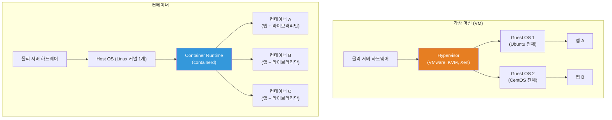
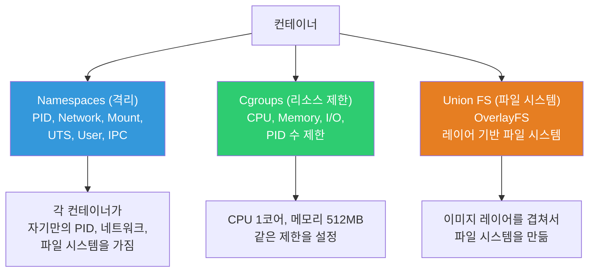
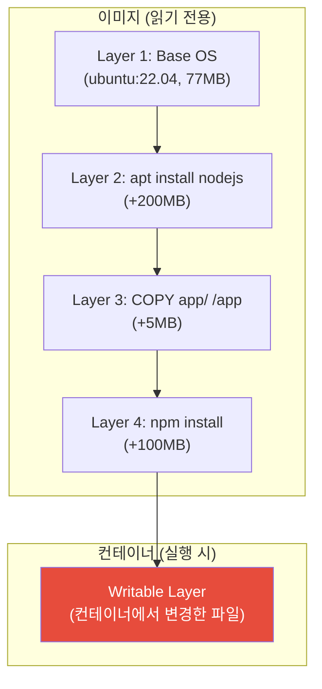
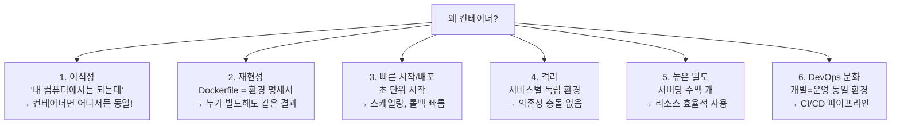
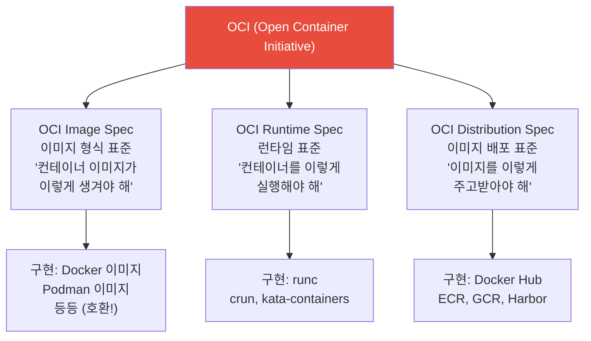
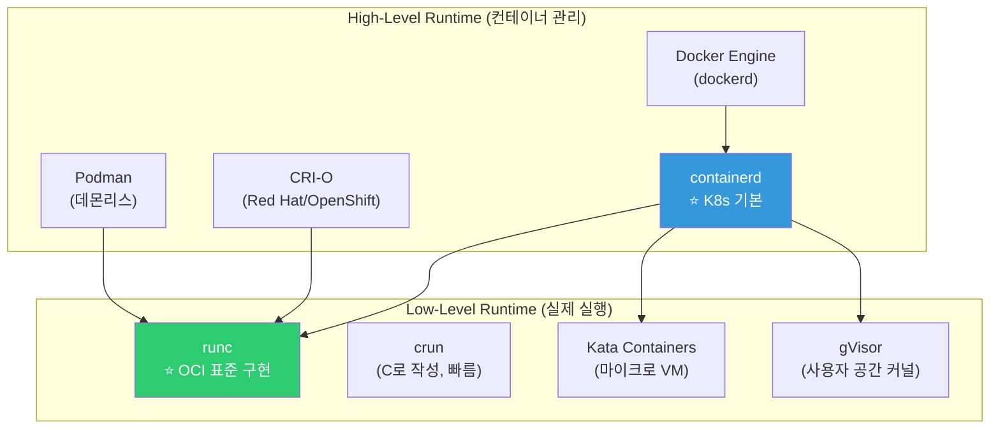
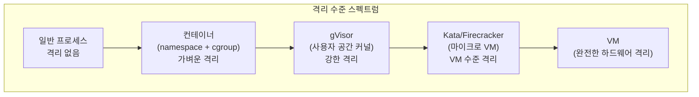

# Container vs VM / OCI 표준

> "Docker가 뭐예요?"라는 질문에 "가벼운 VM이에요"라고 답하면 절반만 맞아요. 컨테이너는 VM이 아니에요. 근본적으로 다른 기술이에요. 이번 강의에서는 컨테이너가 **진짜 뭔지**, VM과 뭐가 다른지, OCI 표준이 왜 중요한지 제대로 배워볼게요.

---

## 🎯 이걸 왜 알아야 하나?

```
이 개념을 알면 이해되는 것들:
• "컨테이너가 VM보다 왜 빠르죠?"            → 커널 공유 원리
• "Docker를 안 쓰는데 컨테이너를 쓴다고요?"   → containerd, CRI-O
• "OCI 이미지가 뭔데요?"                   → 컨테이너 표준 이해
• "K8s가 왜 Docker를 버렸죠?"              → Docker vs containerd
• "컨테이너가 보안에 약하다는데?"             → 격리 수준 이해
• "도대체 왜 컨테이너를 쓰는 거예요?"        → 이식성, 재현성
```

[이전에 배운 namespaces와 cgroups](../01-linux/13-kernel)를 기억하시죠? **컨테이너 = namespaces(격리) + cgroups(리소스 제한) + Union FS(파일 시스템)**이에요. 마법이 아니라 Linux 커널 기능의 조합이에요.

---

## 🧠 핵심 개념

### 비유: 집 vs 칸막이 사무실

```
VM     = 독립된 집. 자기만의 기초공사(커널), 벽(OS), 가구(앱) 전부 갖춤
컨테이너 = 한 건물 안의 칸막이 사무실. 건물 인프라(커널)를 공유하고 칸막이(격리)로 나눔
```

### 아키텍처 비교



### VM vs Container 상세 비교

| 항목 | VM | Container |
|------|-----|-----------|
| 격리 수준 | 하드웨어 레벨 (강력) | 프로세스 레벨 (가벼움) |
| OS | 각각 별도 Guest OS | 호스트 커널 공유 |
| 크기 | GB 단위 (OS 포함) | MB 단위 (앱+라이브러리만) |
| 시작 시간 | 분 단위 (OS 부팅) | 초~밀리초 (프로세스 시작) |
| 리소스 | 많이 필요 (OS 오버헤드) | 적게 필요 (커널 공유) |
| 밀도 | 서버당 수십 개 | 서버당 수백~수천 개 |
| 이식성 | 이미지가 무거움 | 이미지가 가벼움, 어디서든 동일 |
| 보안 | 강한 격리 (별도 커널) | 상대적으로 약함 (커널 공유) |
| 사용 사례 | 멀티 테넌트, 강한 격리 필요 | 마이크로서비스, CI/CD, 스케일링 |
| 기술 | VMware, KVM, Hyper-V | Docker, containerd, CRI-O |

```bash
# 체감 비교

# VM 시작:
# Ubuntu VM 생성 → 2~5분 (OS 부팅)
# 메모리: 최소 512MB~1GB
# 디스크: 최소 2~5GB

# 컨테이너 시작:
time docker run --rm alpine echo "Hello"
# Hello
# real    0m0.500s    ← 0.5초!

# 컨테이너 이미지 크기:
docker images
# REPOSITORY   TAG       SIZE
# alpine       latest    7.8MB       ← 7.8MB!
# ubuntu       22.04     77.9MB
# nginx        latest    187MB
# node         20        1.1GB       ← Node.js는 좀 큼

# 반면 Ubuntu VM 이미지:
# ubuntu-22.04-server.iso → 1.4GB
```

---

## 🔍 상세 설명 — 컨테이너의 원리

### 컨테이너 = Linux 커널 기능의 조합



```bash
# 직접 확인해보기 (Docker가 설치되어 있다면)

# 1. 컨테이너를 하나 실행
docker run -d --name test-container nginx

# 2. 호스트에서 컨테이너 프로세스 확인 — 그냥 프로세스!
ps aux | grep nginx
# root     12345  ... nginx: master process nginx
# → 호스트에서 보면 그냥 일반 프로세스!

# 3. 컨테이너의 namespace 확인
CONTAINER_PID=$(docker inspect --format '{{.State.Pid}}' test-container)
echo "컨테이너 메인 프로세스 PID: $CONTAINER_PID"

ls -la /proc/$CONTAINER_PID/ns/
# cgroup -> 'cgroup:[4026532500]'
# ipc -> 'ipc:[4026532498]'
# mnt -> 'mnt:[4026532496]'      ← 호스트와 다른 번호 = 격리됨!
# net -> 'net:[4026532501]'
# pid -> 'pid:[4026532499]'
# user -> 'user:[4026531837]'
# uts -> 'uts:[4026532497]'

# 호스트의 namespace와 비교
ls -la /proc/1/ns/
# 번호가 다름! → 다른 namespace에서 실행 중

# 4. cgroup 확인 (리소스 제한)
cat /sys/fs/cgroup/system.slice/docker-$(docker inspect --format '{{.Id}}' test-container).scope/memory.max 2>/dev/null
# max    ← 제한 없음 (--memory 옵션을 안 줬으니까)

# 메모리 제한을 걸면:
docker run -d --name limited --memory=256m nginx
cat /sys/fs/cgroup/system.slice/docker-$(docker inspect --format '{{.Id}}' limited).scope/memory.max 2>/dev/null
# 268435456    ← 256MB (바이트)

# 5. Union FS (OverlayFS) 확인
docker inspect test-container --format '{{.GraphDriver.Data.MergedDir}}'
# /var/lib/docker/overlay2/abc123.../merged
# → 여러 레이어가 합쳐진 파일 시스템

mount | grep overlay
# overlay on /var/lib/docker/overlay2/abc123.../merged type overlay (rw,...)
# → OverlayFS로 마운트됨!

# 정리
docker rm -f test-container limited
```

### 컨테이너 이미지의 레이어 구조

컨테이너 이미지는 **레이어(layer)**로 구성돼요. 각 레이어는 읽기 전용이고, 컨테이너가 실행되면 맨 위에 쓰기 가능 레이어가 추가돼요.



```bash
# 이미지 레이어 확인
docker history nginx
# IMAGE          CREATED        CREATED BY                                      SIZE
# a8758716bb6a   2 weeks ago    CMD ["nginx" "-g" "daemon off;"]                0B
# <missing>      2 weeks ago    STOPSIGNAL SIGQUIT                              0B
# <missing>      2 weeks ago    EXPOSE 80                                       0B
# <missing>      2 weeks ago    COPY 30-tune-worker-processes.sh … → …          4.62kB
# <missing>      2 weeks ago    COPY 20-envsubst-on-templates.sh … → …          3.02kB
# <missing>      2 weeks ago    COPY 10-listen-on-ipv6-by-default.sh …          2.12kB
# <missing>      2 weeks ago    COPY docker-entrypoint.sh /docker-entrypoint…   4.62kB
# <missing>      2 weeks ago    RUN /bin/sh -c set -x && ... && apt-get in…    112MB  ← Nginx 설치
# <missing>      2 weeks ago    /bin/sh -c #(nop) ADD file:... in /            77.9MB ← 베이스 OS
# → 아래부터 위로 쌓이는 레이어 구조!

# 레이어 공유의 장점:
# nginx 이미지와 다른 이미지가 같은 ubuntu 베이스를 쓰면
# → 베이스 레이어(77.9MB)를 공유! 디스크 절약!

docker images
# REPOSITORY   SIZE
# nginx        187MB
# myapp        250MB
# → 실제 디스크 사용량은 187 + 250이 아니라
# → 공통 레이어를 빼면 187 + (250-77.9) ≈ 360MB 정도

# 디스크 실제 사용량 확인
docker system df
# TYPE           TOTAL   ACTIVE   SIZE      RECLAIMABLE
# Images         5       3        1.2GB     400MB (33%)
# Containers     3       3        50MB      0B
# Volumes        2       2        200MB     0B
# Build Cache    10      0        500MB     500MB
```

### 왜 컨테이너를 쓰는가? (★ 핵심 이유)



```bash
# 실제 문제 해결 사례:

# ❌ 컨테이너 없이:
# "개발 환경: Node 18, 운영 환경: Node 16 → 안 돼요!"
# "Python 3.8 앱과 Python 3.11 앱이 같은 서버에서 충돌!"
# "신입 개발자 온보딩: 환경 세팅에 이틀..."
# "배포했더니 라이브러리 버전이 달라서 에러!"

# ✅ 컨테이너로:
# "Dockerfile에 Node 18 지정 → 어디서든 Node 18"
# "각 앱이 자기 컨테이너 → 의존성 충돌 없음"
# "docker compose up → 5분 만에 전체 환경 실행"
# "이미지 태그로 버전 관리 → 동일한 바이너리 배포"
```

---

## 🔍 상세 설명 — OCI 표준

### OCI란?

**Open Container Initiative**. 컨테이너의 이미지 형식과 런타임을 **표준화**한 것이에요. Docker가 사실상 표준이었던 것을 공식 표준으로 만든 거예요.



**왜 OCI가 중요한가?**

```bash
# OCI 표준 이전:
# Docker 형식 이미지 → Docker에서만 실행
# → Docker에 종속 (vendor lock-in)

# OCI 표준 이후:
# OCI 형식 이미지 → Docker, containerd, CRI-O, Podman 어디서든 실행!
# → Docker Hub에서 pull한 이미지를 containerd에서도 실행 가능
# → ECR에서 push한 이미지를 어디서든 pull 가능

# 실무에서 체감하는 효과:
# 1. K8s가 Docker를 제거해도 기존 이미지 그대로 사용 가능!
# 2. Docker로 빌드한 이미지를 Podman으로 실행 가능
# 3. ECR, GCR, Harbor 모두 같은 이미지 형식 사용
# → "Docker 이미지"가 아니라 "OCI 이미지"가 정확한 표현

# OCI 이미지 형식 확인
docker inspect nginx --format '{{.Config.Image}}'
# OCI 매니페스트:
docker manifest inspect nginx
# {
#   "schemaVersion": 2,
#   "mediaType": "application/vnd.oci.image.index.v1+json",
#   ...
# }
```

### 컨테이너 런타임 생태계



```bash
# 런타임 관계:
# Docker CLI → dockerd (Docker 데몬) → containerd → runc
# K8s        → CRI → containerd → runc
# K8s        → CRI → CRI-O → runc (또는 crun)
# Podman     → (데몬 없이) → runc

# K8s 1.24부터:
# ❌ K8s → dockershim → Docker → containerd → runc (복잡!)
# ✅ K8s → CRI → containerd → runc (간단!)
# → Docker를 제거하고 containerd에 직접 연결!
# → 하지만 Docker로 빌드한 이미지는 그대로 사용 가능! (OCI 표준)

# 현재 노드의 컨테이너 런타임 확인
kubectl get nodes -o wide
# NAME     STATUS   VERSION   OS-IMAGE             CONTAINER-RUNTIME
# node-1   Ready    v1.28.0   Ubuntu 22.04 LTS     containerd://1.7.2
# → containerd를 사용 중!

# containerd 직접 확인
sudo ctr --namespace moby containers list    # Docker가 만든 컨테이너
sudo ctr --namespace k8s.io containers list  # K8s가 만든 컨테이너

# crictl (CRI 호환 CLI)
sudo crictl ps
# CONTAINER ID   IMAGE          STATE     NAME
# abc123         nginx:latest   Running   nginx
```

### Docker vs Podman

```bash
# Podman: Docker의 대안. 데몬이 없고, rootless 실행이 기본

# 공통점:
# - 같은 OCI 이미지 형식
# - Docker CLI와 거의 동일한 명령어
# - Dockerfile 호환 (Containerfile이라고도 부름)

# 차이점:
# Docker:  dockerd 데몬 필요, root 권한 필요 (기본)
# Podman:  데몬 없음 (daemonless), rootless 기본

# Podman은 Docker의 drop-in replacement:
alias docker=podman    # 이것만으로 대부분 호환!

podman run -d nginx    # Docker와 동일한 명령어!
podman build -t myapp .
podman push myapp:latest

# 실무에서:
# 개발 환경 → Docker Desktop (편의성)
# CI/CD → Docker 또는 Podman (Kaniko, buildah 등)
# 프로덕션 K8s → containerd (Docker 불필요)
# 보안 중시 → Podman (rootless, daemonless)
```

---

## 🔍 상세 설명 — 컨테이너 격리와 보안

### 격리 수준 비교



```bash
# 컨테이너의 보안 약점:
# 1. 커널 공유 → 커널 취약점은 모든 컨테이너에 영향
# 2. root 컨테이너 → 호스트 커널에 접근 가능 (탈출 위험)
# 3. 이미지 취약점 → 오래된 라이브러리에 CVE

# 보안 강화 방법 (../01-linux/14-security에서 배운 것들!):
# 1. non-root 실행 (User namespace)
docker run --user 1000:1000 nginx

# 2. seccomp 프로필
docker run --security-opt seccomp=default nginx

# 3. AppArmor/SELinux
docker run --security-opt apparmor=docker-default nginx

# 4. 읽기 전용 파일 시스템
docker run --read-only nginx

# 5. capability 제한
docker run --cap-drop ALL --cap-add NET_BIND_SERVICE nginx

# 6. 프로덕션 보안 실행 (전부 합치면):
docker run -d \
    --user 1000:1000 \
    --read-only \
    --tmpfs /tmp:rw,noexec,nosuid,size=100m \
    --cap-drop ALL \
    --cap-add NET_BIND_SERVICE \
    --security-opt no-new-privileges:true \
    --security-opt seccomp=default \
    --memory 512m \
    --cpus 1.0 \
    --pids-limit 100 \
    nginx
```

---

## 💻 실습 예제

### 실습 1: VM vs 컨테이너 속도 비교

```bash
# 컨테이너 시작 시간 측정
time docker run --rm alpine echo "Hello from container"
# Hello from container
# real    0m0.400s    ← 0.4초!

# 1000개 컨테이너 순차 실행 시간
time for i in $(seq 1 10); do
    docker run --rm alpine echo "$i" > /dev/null
done
# real    0m4.0s     ← 10개에 4초 = 개당 0.4초

# VM이었다면? → 10개 VM 시작에 30분~1시간...
```

### 실습 2: 컨테이너가 프로세스임을 확인

```bash
# 1. 컨테이너 실행
docker run -d --name proof nginx

# 2. 호스트에서 프로세스 확인
CPID=$(docker inspect --format '{{.State.Pid}}' proof)
echo "컨테이너 PID: $CPID"

ps aux | grep $CPID
# root  $CPID  ... nginx: master process nginx

# 3. 컨테이너 안에서 PID 1
docker exec proof ps aux
# PID   USER   COMMAND
# 1     root   nginx: master process    ← 컨테이너 안에서는 PID 1!

# 4. 호스트에서는 다른 PID
echo "호스트에서의 PID: $CPID"
# 호스트에서의 PID: 12345    ← 호스트에서는 12345

# → 같은 프로세스인데 namespace 때문에 PID가 다르게 보임!
# → 이게 PID namespace의 격리 효과!

# 5. 정리
docker rm -f proof
```

### 실습 3: 이미지 레이어 관찰

```bash
# 1. 간단한 Dockerfile 만들기
mkdir -p /tmp/layer-test && cd /tmp/layer-test

cat << 'EOF' > Dockerfile
FROM alpine:latest
RUN echo "layer 1" > /file1.txt
RUN echo "layer 2" > /file2.txt
RUN echo "layer 3" > /file3.txt
CMD ["cat", "/file1.txt", "/file2.txt", "/file3.txt"]
EOF

# 2. 빌드
docker build -t layer-test .
# Step 1/5 : FROM alpine:latest
#  ---> abc123
# Step 2/5 : RUN echo "layer 1" > /file1.txt
#  ---> Running in def456
#  ---> 789abc        ← 새 레이어!
# Step 3/5 : RUN echo "layer 2" > /file2.txt
#  ---> Running in ghi012
#  ---> 345def        ← 새 레이어!
# ...

# 3. 레이어 확인
docker history layer-test
# IMAGE        SIZE     CREATED BY
# abc123       0B       CMD ["cat" "/file1.txt" ...]
# def456       13B      RUN echo "layer 3" > /file3.txt
# ghi789       13B      RUN echo "layer 2" > /file2.txt
# jkl012       13B      RUN echo "layer 1" > /file1.txt
# mno345       7.8MB    /bin/sh -c #(nop) ADD file:... in /

# → 각 RUN이 하나의 레이어!
# → alpine 베이스(7.8MB) + 3개 레이어(13B씩)

# 4. 같은 alpine 베이스를 쓰는 다른 이미지와 레이어 공유 확인
docker images
# layer-test   7.8MB    (alpine 레이어 공유)
# alpine       7.8MB    (같은 레이어!)

# 5. 정리
docker rmi layer-test
rm -rf /tmp/layer-test
```

### 실습 4: 리소스 제한 확인

```bash
# 1. 메모리 제한
docker run -d --name mem-test --memory=100m alpine sleep 3600

# cgroup에서 확인
docker exec mem-test cat /sys/fs/cgroup/memory.max
# 104857600    ← 100MB

# 2. CPU 제한
docker run -d --name cpu-test --cpus=0.5 alpine sleep 3600

docker exec cpu-test cat /sys/fs/cgroup/cpu.max
# 50000 100000    ← 100000μs 중 50000μs = 0.5코어

# 3. 리소스 사용량 실시간 모니터링
docker stats --no-stream
# CONTAINER   CPU %   MEM USAGE / LIMIT   MEM %   NET I/O       BLOCK I/O   PIDS
# mem-test    0.00%   1.5MiB / 100MiB     1.50%   648B / 0B     0B / 0B     1
# cpu-test    0.00%   1.5MiB / unlimited  0.02%   648B / 0B     0B / 0B     1

# 4. 정리
docker rm -f mem-test cpu-test
```

---

## 🏢 실무에서는?

### 시나리오 1: "컨테이너로 왜 마이그레이션하나요?"

```bash
# 기존 환경의 문제:
# 1. "내 PC에서는 되는데 서버에서는 안 돼요"
#    → 개발 환경과 운영 환경이 다름 (Node 버전, 라이브러리 등)
#    → 컨테이너: 동일한 이미지를 어디서든 실행

# 2. "서버에 앱 3개가 있는데 Node 버전이 다 달라요"
#    → 의존성 충돌
#    → 컨테이너: 각 앱이 독립된 환경

# 3. "새 서버 세팅에 하루가 걸려요"
#    → 수동 설치 (apt install, pip install, ...)
#    → 컨테이너: docker-compose up으로 끝

# 4. "트래픽 폭증 시 서버 추가에 30분 걸려요"
#    → VM 프로비저닝 + 앱 설치 + 설정
#    → 컨테이너: 새 컨테이너 수초 내 시작

# 5. "롤백하는데 1시간 걸려요"
#    → 이전 코드 checkout + 빌드 + 배포
#    → 컨테이너: 이전 이미지 태그로 즉시 롤백
```

### 시나리오 2: "K8s가 Docker를 버렸다는데?"

```bash
# 정확한 사실:
# K8s 1.24에서 dockershim 제거
# → K8s가 Docker "데몬"을 직접 호출하지 않게 됨
# → containerd에 직접 연결 (더 효율적)

# 영향:
# ✅ Docker로 빌드한 이미지는 그대로 사용 가능! (OCI 표준)
# ✅ Dockerfile도 그대로 사용
# ✅ Docker Hub도 그대로 사용
# ❌ K8s 노드에서 'docker ps'로 컨테이너 안 보임 (crictl ps 사용)
# ❌ docker.sock 마운트하는 CI/CD 도구는 수정 필요

# 실무 영향:
# 개발자: 변화 없음 (Docker로 빌드, push)
# 운영: crictl로 노드의 컨테이너 확인
# CI/CD: Kaniko, buildah 등 in-cluster 빌드 도구 사용

# crictl 사용법 (Docker 명령어와 유사):
sudo crictl ps                    # docker ps
sudo crictl images                # docker images
sudo crictl logs CONTAINER_ID     # docker logs
sudo crictl inspect CONTAINER_ID  # docker inspect
```

### 시나리오 3: 컨테이너 보안 수준 선택

```bash
# 워크로드별 격리 수준 선택:

# 1. 내부 마이크로서비스 (신뢰할 수 있는 코드):
# → 일반 컨테이너 (runc) + seccomp + non-root
# → 대부분의 경우 이걸로 충분

# 2. 외부 코드 실행 (CI/CD 빌드, 사용자 제출 코드):
# → gVisor (사용자 공간 커널) → 커널 공격 표면 축소
# → 또는 Kata Containers (마이크로 VM) → VM 수준 격리

# 3. 규제 환경 (금융, 의료):
# → Kata Containers 또는 Firecracker
# → 컨테이너의 편의성 + VM의 격리 수준

# 4. 멀티 테넌트 (여러 고객이 같은 클러스터):
# → gVisor 또는 Kata + NetworkPolicy + 네임스페이스 격리
# → 고객 간 완전한 격리 필요
```

---

## ⚠️ 자주 하는 실수

### 1. "컨테이너 = VM"이라고 이해하기

```bash
# ❌ "컨테이너는 가벼운 VM이에요"
# → VM은 하드웨어를 가상화, 컨테이너는 OS를 격리
# → 근본적으로 다른 기술!

# ✅ "컨테이너는 격리된 프로세스예요"
# → Linux 커널의 namespace + cgroup으로 격리된 프로세스
# → 별도 OS가 없음, 호스트 커널을 공유
```

### 2. 컨테이너가 완벽히 격리되었다고 믿기

```bash
# ❌ "컨테이너니까 보안은 신경 안 써도 되죠?"
# → 컨테이너는 커널을 공유! 커널 취약점 = 탈출 가능

# ✅ 보안 강화는 필수
# → non-root 실행
# → seccomp, AppArmor
# → 이미지 취약점 스캐닝
# → read-only 파일 시스템
# → capability 최소화
```

### 3. 컨테이너 안에 상태(데이터)를 저장하기

```bash
# ❌ 컨테이너 안에 DB 데이터, 업로드 파일 등 저장
# → 컨테이너가 삭제되면 데이터도 사라짐!

# ✅ 볼륨(Volume)을 사용해서 데이터를 외부에 저장
docker run -v /host/data:/container/data myapp
# → 호스트의 /host/data에 영구 저장
# → 컨테이너가 죽어도 데이터 유지
```

### 4. 이미지를 latest 태그로만 관리

```bash
# ❌ docker push myapp:latest → 어떤 버전인지 모름!
# → 롤백할 때 "이전 버전이 뭐였지?"

# ✅ 명시적 버전 태그 사용
docker push myapp:v1.2.3
docker push myapp:20250312-abc123    # 날짜-커밋해시
# → 언제든 특정 버전으로 롤백 가능
```

### 5. Docker와 컨테이너를 동일시하기

```bash
# ❌ "컨테이너 = Docker"
# → Docker는 컨테이너 도구 중 하나일 뿐!
# → containerd, CRI-O, Podman 등 다른 도구도 있음
# → K8s 프로덕션에서는 containerd가 표준

# ✅ "Docker는 컨테이너를 만들고 관리하는 도구 중 하나"
# → OCI 표준 덕분에 어떤 도구로 만들어도 호환
```

---

## 📝 정리

### VM vs Container 빠른 참조

```
VM:        별도 OS, GB 크기, 분 단위 시작, 강한 격리
Container: 커널 공유, MB 크기, 초 단위 시작, 가벼운 격리
```

### 컨테이너의 3가지 기둥

```
Namespaces: 격리 (PID, Network, Mount, UTS, User, IPC)
Cgroups:    리소스 제한 (CPU, Memory, I/O, PIDs)
Union FS:   레이어 기반 파일 시스템 (OverlayFS)
```

### OCI 표준

```
OCI Image Spec:       이미지 형식 표준 → Docker/Podman 이미지 호환
OCI Runtime Spec:     런타임 표준 → runc, crun, kata
OCI Distribution Spec: 이미지 배포 → Docker Hub, ECR, Harbor 호환
```

### 런타임 스택

```
Docker CLI → dockerd → containerd → runc
K8s        → CRI → containerd → runc
Podman     → (데몬 없이) → runc
```

---

## 🔗 다음 강의

다음은 **[02-docker-basics](./02-docker-basics)** — Docker CLI / 기본 명령어예요.

컨테이너의 개념을 이해했으니, 이제 실제로 Docker를 써볼게요. 이미지 다운로드, 컨테이너 실행/중지, 로그 확인, 볼륨 마운트, 네트워크 연결까지 — Docker의 핵심 명령어를 실전으로 익혀볼 거예요.
