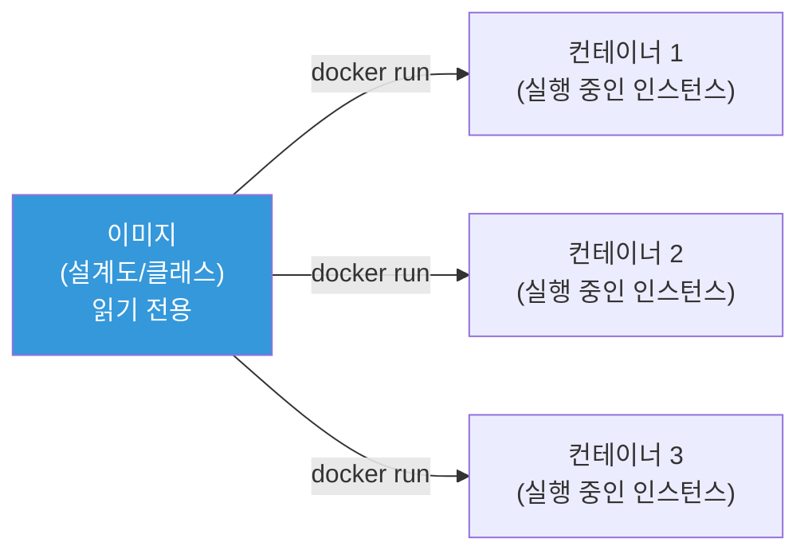
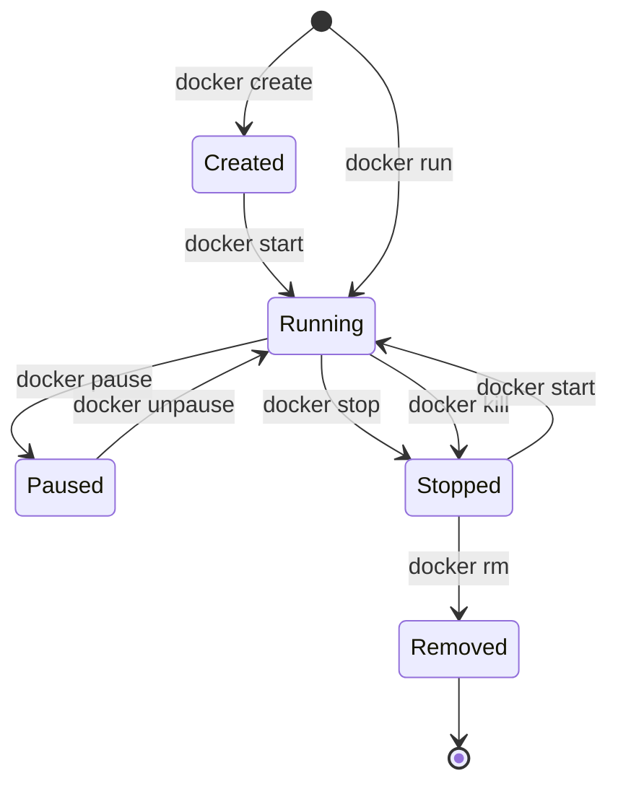
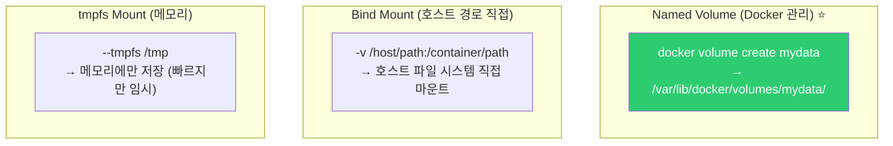

# Docker CLI / 기본 명령어

> 이제 직접 Docker를 써볼 시간이에요. 이미지 다운로드, 컨테이너 실행/중지, 로그 확인, 볼륨, 네트워크, 환경 변수 — Docker의 핵심 명령어를 하나씩 실전으로 익혀볼게요.

---

## 🎯 이걸 왜 알아야 하나?

```
DevOps가 Docker CLI로 매일 하는 일:
• 서비스 컨테이너 실행/중지/재시작           → docker run, stop, restart
• 컨테이너 로그 확인 (장애 진단)            → docker logs
• 컨테이너 안에 들어가서 디버깅              → docker exec
• 이미지 빌드 + 레지스트리 push/pull        → docker build, push, pull
• 볼륨으로 데이터 영구 저장                 → docker volume
• 여러 컨테이너를 한번에 관리               → docker compose
• 사용하지 않는 리소스 정리                 → docker system prune
```

[이전 강의](./01-concept)에서 컨테이너가 뭔지 배웠으니, 이제 실전이에요.

---

## 🧠 핵심 개념

### Docker 명령어 구조

```bash
docker [대상] [동작] [옵션]

# 예시:
docker container run nginx         # container에 run 동작
docker image pull nginx            # image에 pull 동작
docker volume create mydata        # volume에 create 동작

# 단축형 (더 많이 씀):
docker run nginx                   # docker container run의 단축
docker pull nginx                  # docker image pull의 단축
docker ps                          # docker container ls의 단축
```

### 이미지 vs 컨테이너



```bash
# 이미지 = 프로그램 (실행 파일)
# 컨테이너 = 실행 중인 프로세스

# 하나의 이미지로 여러 컨테이너를 만들 수 있음
docker run -d --name web1 nginx    # 컨테이너 1
docker run -d --name web2 nginx    # 컨테이너 2 (같은 이미지!)
docker run -d --name web3 nginx    # 컨테이너 3
```

---

## 🔍 상세 설명 — 이미지 관리

### docker pull — 이미지 다운로드

```bash
# 기본 pull (Docker Hub에서)
docker pull nginx
# Using default tag: latest
# latest: Pulling from library/nginx
# a2abf6c4d29d: Pull complete
# a9edb18cadd1: Pull complete
# 589b7251471a: Pull complete
# ...
# Digest: sha256:abc123...
# Status: Downloaded newer image for nginx:latest

# 특정 버전(태그) 지정
docker pull nginx:1.25.3
docker pull node:20-alpine
docker pull python:3.12-slim

# 다른 레지스트리에서
docker pull public.ecr.aws/nginx/nginx:latest        # AWS ECR Public
docker pull ghcr.io/owner/image:tag                    # GitHub Container Registry
docker pull 123456789.dkr.ecr.ap-northeast-2.amazonaws.com/myapp:v1.0  # AWS ECR Private
```

**이미지 태그 네이밍 컨벤션:**

```bash
# 형식: [레지스트리/][네임스페이스/]이미지:태그

# Docker Hub (기본 레지스트리, 생략 가능):
nginx:latest                        # library/nginx:latest의 단축
nginx:1.25.3                        # 특정 버전
nginx:1.25.3-alpine                 # 경량 Alpine 기반

# 일반적인 태그 패턴:
myapp:latest                        # 최신 (⚠️ 프로덕션에서 비추!)
myapp:v1.2.3                        # 시맨틱 버전
myapp:20250312-abc1234              # 날짜-커밋해시 (⭐ 추천)
myapp:main-abc1234                  # 브랜치-커밋해시
python:3.12                         # 메이저.마이너
python:3.12-slim                    # 경량 버전
python:3.12-alpine                  # Alpine 기반 (더 작음)

# ⚠️ latest를 프로덕션에서 쓰지 마세요!
# → 어떤 버전인지 모름!
# → 언제 이미지가 바뀔지 모름!
# → 롤백이 불가능!
```

### docker images — 이미지 목록

```bash
docker images
# REPOSITORY   TAG          IMAGE ID       CREATED        SIZE
# nginx        latest       a8758716bb6a   2 weeks ago    187MB
# nginx        1.25.3       bc649bab30d1   3 months ago   187MB
# node         20-alpine    abcdef123456   1 week ago     130MB
# python       3.12-slim    fedcba654321   2 weeks ago    150MB
# myapp        v1.2.3       112233445566   1 hour ago     250MB

# 필터링
docker images nginx           # nginx 이미지만
docker images --filter "dangling=true"    # <none> 이미지 (정리 대상)

# 크기 확인 (실제 디스크 사용량)
docker system df
# TYPE           TOTAL   ACTIVE   SIZE      RECLAIMABLE
# Images         10      5        3.5GB     1.2GB (34%)
# Containers     5       3        100MB     50MB (50%)
# Volumes        3       2        500MB     200MB (40%)
# Build Cache    20      0        800MB     800MB (100%)
```

### docker rmi — 이미지 삭제

```bash
# 이미지 삭제
docker rmi nginx:1.25.3
# Untagged: nginx:1.25.3
# Deleted: sha256:bc649bab30d1...

# 사용하지 않는 이미지 전부 삭제
docker image prune
# WARNING! This will remove all dangling images.
# Are you sure you want to continue? [y/N] y
# Deleted Images:
# deleted: sha256:abc123...
# Total reclaimed space: 500MB

# 사용하지 않는 이미지 전부 삭제 (태그된 것도)
docker image prune -a
# → 실행 중인 컨테이너의 이미지는 제외
```

---

## 🔍 상세 설명 — 컨테이너 생명주기



### docker run — 컨테이너 실행 (★ 가장 중요!)

```bash
# === 기본 실행 ===

# 포그라운드 실행 (터미널에 붙음, Ctrl+C로 종료)
docker run nginx
# /docker-entrypoint.sh: ... Configuration complete; ready for start up

# 백그라운드 실행 (-d: detached)
docker run -d nginx
# abc123def456...    ← 컨테이너 ID

# 이름 지정 (--name)
docker run -d --name my-nginx nginx
# → "my-nginx"로 관리 가능

# === 포트 매핑 (-p) ===

# 호스트 8080 → 컨테이너 80
docker run -d -p 8080:80 --name web nginx
#              ^^^^^^^^
#              호스트:컨테이너

# 확인
curl http://localhost:8080
# <!DOCTYPE html>
# <html>
# <head><title>Welcome to nginx!</title>...

# 여러 포트 매핑
docker run -d -p 8080:80 -p 8443:443 nginx

# 랜덤 포트 매핑 (-P: 대문자)
docker run -d -P nginx
docker port $(docker ps -q -l)
# 80/tcp -> 0.0.0.0:32768    ← 랜덤 포트 할당됨

# === 환경 변수 (-e) ===

docker run -d \
    -e MYSQL_ROOT_PASSWORD=secret \
    -e MYSQL_DATABASE=mydb \
    -e MYSQL_USER=myuser \
    -e MYSQL_PASSWORD=mypassword \
    --name mydb \
    -p 3306:3306 \
    mysql:8.0

# 환경 변수 파일로
cat << 'EOF' > /tmp/app.env
NODE_ENV=production
PORT=3000
DB_HOST=mydb
DB_PORT=3306
EOF

docker run -d --env-file /tmp/app.env --name myapp myapp:latest

# === 자동 삭제 (--rm) ===

# 종료 시 자동으로 컨테이너 삭제 (일회성 실행)
docker run --rm alpine echo "Hello"
# Hello
# → 실행 후 컨테이너 자동 삭제

# === 대화형 모드 (-it) ===

# 컨테이너 안에서 쉘 실행
docker run -it --rm ubuntu bash
# root@abc123:/# ls
# bin  boot  dev  etc  home  ...
# root@abc123:/# exit

docker run -it --rm alpine sh
# / # whoami
# root
# / # exit

# === 리소스 제한 ===

docker run -d \
    --memory=512m \              # 메모리 512MB
    --cpus=1.5 \                 # CPU 1.5코어
    --pids-limit=100 \           # 프로세스 최대 100개
    --name limited-app \
    myapp:latest
```

### docker ps — 실행 중인 컨테이너 목록

```bash
# 실행 중인 컨테이너
docker ps
# CONTAINER ID   IMAGE   COMMAND                  CREATED        STATUS        PORTS                  NAMES
# abc123def456   nginx   "/docker-entrypoint.…"   5 minutes ago  Up 5 minutes  0.0.0.0:8080->80/tcp   web
# def456ghi789   mysql   "docker-entrypoint.s…"   3 minutes ago  Up 3 minutes  0.0.0.0:3306->3306/tcp mydb

# 모든 컨테이너 (중지된 것 포함)
docker ps -a
# CONTAINER ID   IMAGE    STATUS                     NAMES
# abc123def456   nginx    Up 5 minutes               web
# def456ghi789   mysql    Up 3 minutes               mydb
# 111222333444   alpine   Exited (0) 10 minutes ago  old-test

# 컨테이너 ID만
docker ps -q
# abc123def456
# def456ghi789

# 포맷 지정
docker ps --format "table {{.Names}}\t{{.Status}}\t{{.Ports}}"
# NAMES    STATUS         PORTS
# web      Up 5 minutes   0.0.0.0:8080->80/tcp
# mydb     Up 3 minutes   0.0.0.0:3306->3306/tcp

# 필터링
docker ps --filter "status=exited"     # 중지된 것만
docker ps --filter "name=web"          # 이름에 web 포함
```

### docker stop / start / restart

```bash
# 중지 (Graceful: SIGTERM → 10초 대기 → SIGKILL)
docker stop web
# web

# 즉시 중지 (SIGKILL)
docker kill web
# web

# 시작
docker start web
# web

# 재시작
docker restart web
# web

# 여러 컨테이너 한번에
docker stop web mydb myapp
docker start web mydb myapp

# 모든 실행 중인 컨테이너 중지
docker stop $(docker ps -q)

# 중지 타임아웃 변경 (기본 10초)
docker stop -t 30 web    # 30초 대기 후 SIGKILL
```

### docker rm — 컨테이너 삭제

```bash
# 중지된 컨테이너 삭제
docker rm old-test
# old-test

# 실행 중인 컨테이너 강제 삭제
docker rm -f web
# web

# 중지된 모든 컨테이너 삭제
docker container prune
# WARNING! This will remove all stopped containers.
# Are you sure you want to continue? [y/N] y
# Deleted Containers:
# 111222333444
# Total reclaimed space: 50MB

# 모든 컨테이너 강제 삭제 (⚠️ 주의!)
docker rm -f $(docker ps -aq)
```

---

## 🔍 상세 설명 — 컨테이너 내부 작업

### docker logs — 로그 확인 (★ 장애 진단 필수!)

```bash
# 전체 로그
docker logs web
# /docker-entrypoint.sh: ... Configuration complete; ready for start up
# 2025/03/12 10:00:00 [notice] 1#1: nginx/1.25.3
# 10.0.0.1 - - [12/Mar/2025:10:00:05 +0000] "GET / HTTP/1.1" 200 ...

# 최근 N줄
docker logs web --tail 20
# (최근 20줄만)

# 실시간 로그 (tail -f처럼)
docker logs web -f
# → 새 로그가 올라올 때마다 표시 (Ctrl+C로 중단)

# 실시간 + 최근 10줄부터
docker logs web -f --tail 10

# 타임스탬프 포함
docker logs web -t
# 2025-03-12T10:00:00.123456789Z /docker-entrypoint.sh: ...

# 시간 필터
docker logs web --since "2025-03-12T10:00:00"
docker logs web --since "1h"       # 최근 1시간
docker logs web --since "30m"      # 최근 30분

# 에러만 검색 (grep 조합)
docker logs web 2>&1 | grep -i "error\|warn\|fail"
# 2025/03/12 10:15:30 [error] 1#1: *1 connect() failed...
```

### docker exec — 실행 중인 컨테이너에서 명령 실행

```bash
# 쉘 접속 (가장 많이 씀!)
docker exec -it web bash
# root@abc123:/# ls /etc/nginx/
# conf.d  fastcgi_params  mime.types  modules  nginx.conf  ...
# root@abc123:/# cat /etc/nginx/nginx.conf
# root@abc123:/# exit

# Alpine 기반 이미지 (bash 없음, sh 사용)
docker exec -it myalpine sh

# 명령어만 실행 (쉘 접속 안 함)
docker exec web cat /etc/nginx/nginx.conf
docker exec web nginx -t            # Nginx 설정 검증
docker exec mydb mysql -u root -p   # MySQL 접속

# 환경 변수 확인
docker exec web env
# PATH=/usr/local/sbin:/usr/local/bin:/usr/sbin:/usr/bin:/sbin:/bin
# NGINX_VERSION=1.25.3
# ...

# 프로세스 확인
docker exec web ps aux
# PID   USER   COMMAND
# 1     root   nginx: master process nginx -g daemon off;
# 29    nginx   nginx: worker process
# 30    nginx   nginx: worker process

# 네트워크 확인
docker exec web ip addr
docker exec web cat /etc/resolv.conf

# ⚠️ exec는 디버깅용! 프로덕션에서 exec로 설정 변경하면
# → 컨테이너 재시작 시 변경 사라짐!
# → 이미지를 수정하거나 ConfigMap/볼륨을 사용해야 해요
```

### docker inspect — 상세 정보 조회

```bash
# 컨테이너 상세 정보 (JSON)
docker inspect web
# [
#     {
#         "Id": "abc123def456...",
#         "State": {
#             "Status": "running",
#             "Pid": 12345,
#             ...
#         },
#         "NetworkSettings": {
#             "IPAddress": "172.17.0.2",
#             ...
#         },
#         ...
#     }
# ]

# 특정 정보만 추출 (--format, Go 템플릿)
docker inspect web --format '{{.State.Status}}'
# running

docker inspect web --format '{{.NetworkSettings.IPAddress}}'
# 172.17.0.2

docker inspect web --format '{{.State.Pid}}'
# 12345

docker inspect web --format '{{range .NetworkSettings.Networks}}{{.IPAddress}}{{end}}'
# 172.17.0.2

# 마운트된 볼륨 확인
docker inspect web --format '{{json .Mounts}}' | python3 -m json.tool

# 환경 변수 확인
docker inspect web --format '{{json .Config.Env}}' | python3 -m json.tool
# [
#     "PATH=/usr/local/sbin:/usr/local/bin:...",
#     "NGINX_VERSION=1.25.3"
# ]

# 포트 매핑 확인
docker inspect web --format '{{json .NetworkSettings.Ports}}' | python3 -m json.tool
# {
#     "80/tcp": [
#         {
#             "HostIp": "0.0.0.0",
#             "HostPort": "8080"
#         }
#     ]
# }
```

### docker cp — 파일 복사

```bash
# 호스트 → 컨테이너
docker cp /tmp/custom.conf web:/etc/nginx/conf.d/custom.conf

# 컨테이너 → 호스트
docker cp web:/etc/nginx/nginx.conf /tmp/nginx.conf

# 디버깅할 때 유용:
# 1. 컨테이너의 설정 파일을 로컬에 복사해서 확인
docker cp web:/etc/nginx/nginx.conf ./

# 2. 수정한 설정을 컨테이너에 넣고 테스트
docker cp ./modified.conf web:/etc/nginx/conf.d/test.conf
docker exec web nginx -t    # 문법 검사
docker exec web nginx -s reload    # 적용

# ⚠️ cp로 넣은 파일은 컨테이너 삭제 시 사라짐!
# → 영구적으로 하려면 Dockerfile 수정 또는 볼륨 사용
```

### docker stats — 리소스 사용량 모니터링

```bash
docker stats
# CONTAINER ID   NAME    CPU %   MEM USAGE / LIMIT     MEM %   NET I/O          BLOCK I/O   PIDS
# abc123         web     0.50%   15.5MiB / 7.77GiB     0.19%   1.5kB / 800B     0B / 0B     3
# def456         mydb    2.30%   350MiB / 512MiB       68.36%  2.1kB / 1.5kB    50MB / 0B   30
#                                         ^^^^^^^
#                                         메모리 제한이 있으면 표시!

# 특정 컨테이너만
docker stats web

# 한 번만 출력 (스크립트용)
docker stats --no-stream --format "table {{.Name}}\t{{.CPUPerc}}\t{{.MemUsage}}"
# NAME    CPU %   MEM USAGE / LIMIT
# web     0.50%   15.5MiB / 7.77GiB
# mydb    2.30%   350MiB / 512MiB
```

---

## 🔍 상세 설명 — 볼륨 (Volume)

컨테이너의 데이터는 컨테이너 삭제 시 사라져요. 영구 데이터는 **볼륨**에 저장해야 해요.

### 볼륨 종류



```bash
# === Named Volume (Docker가 관리) ===

# 볼륨 생성
docker volume create mydata

# 볼륨 목록
docker volume ls
# DRIVER    VOLUME NAME
# local     mydata

# 볼륨 정보
docker volume inspect mydata
# [
#     {
#         "Name": "mydata",
#         "Mountpoint": "/var/lib/docker/volumes/mydata/_data",
#         ...
#     }
# ]

# 볼륨을 컨테이너에 마운트
docker run -d \
    -v mydata:/var/lib/mysql \
    --name mydb \
    mysql:8.0

# 볼륨 데이터는 컨테이너 삭제해도 유지!
docker rm -f mydb
docker volume ls    # mydata가 여전히 존재!

# 다른 컨테이너에서 같은 볼륨 사용
docker run -d \
    -v mydata:/var/lib/mysql \
    --name mydb-new \
    mysql:8.0
# → 이전 DB 데이터가 그대로!

# === Bind Mount (호스트 경로 직접) ===

# 호스트의 디렉토리를 컨테이너에 마운트
docker run -d \
    -v $(pwd)/html:/usr/share/nginx/html:ro \
    -p 8080:80 \
    --name web \
    nginx
#   ^^^^^^^^^^^^^^^^^^^^^^^^^^^^^^^^^^^^^
#   호스트경로:컨테이너경로:옵션
#                          ro = read-only

# 호스트에서 파일 수정 → 컨테이너에 즉시 반영!
echo "<h1>Hello Docker!</h1>" > ./html/index.html
curl http://localhost:8080
# <h1>Hello Docker!</h1>

# 개발 환경에서 많이 씀:
# → 코드를 수정하면 컨테이너에 즉시 반영 (리빌드 불필요)

# === tmpfs (메모리) ===
docker run -d \
    --tmpfs /tmp:rw,noexec,nosuid,size=100m \
    --name secure-app \
    myapp:latest
# → /tmp는 메모리에만 (빠르지만 컨테이너 종료 시 사라짐)
# → 민감한 임시 데이터에 적합

# === 볼륨 정리 ===

# 사용하지 않는 볼륨 삭제
docker volume prune
# WARNING! This will remove all local volumes not used by at least one container.

# 특정 볼륨 삭제
docker volume rm mydata
```

---

## 🔍 상세 설명 — 네트워크

### Docker 네트워크 종류

```bash
docker network ls
# NETWORK ID     NAME      DRIVER    SCOPE
# abc123         bridge    bridge    local     ← 기본
# def456         host      host      local
# ghi789         none      null      local

# bridge (기본): 컨테이너 간 격리된 네트워크
# host: 호스트 네트워크를 직접 사용 (격리 없음)
# none: 네트워크 없음
# overlay: 멀티 호스트 네트워크 (Docker Swarm/K8s)
```

### 사용자 정의 네트워크 (★ 실무 추천!)

```bash
# 기본 bridge 네트워크의 문제:
# → 컨테이너 이름으로 통신 안 됨! (IP로만 가능)

# 사용자 정의 네트워크 생성
docker network create myapp-net

# 같은 네트워크에 컨테이너 연결
docker run -d --name mydb --network myapp-net \
    -e MYSQL_ROOT_PASSWORD=secret mysql:8.0

docker run -d --name myapp --network myapp-net \
    -e DB_HOST=mydb \
    myapp:latest
# → myapp에서 "mydb"라는 이름으로 DB에 접속 가능!

# 확인
docker exec myapp ping -c 2 mydb
# PING mydb (172.18.0.2) 56(84) bytes of data.
# 64 bytes from mydb.myapp-net (172.18.0.2): icmp_seq=1 ttl=64 time=0.100 ms
# → 이름으로 통신 가능! (Docker 내장 DNS)

docker exec myapp nslookup mydb
# Server:    127.0.0.11      ← Docker 내장 DNS
# Name:      mydb
# Address 1: 172.18.0.2

# 네트워크 상세 정보
docker network inspect myapp-net
# → 연결된 컨테이너 목록, IP 할당 정보 등

# 네트워크 정리
docker network rm myapp-net
```

---

## 🔍 상세 설명 — Docker Compose (★ 실무 필수!)

여러 컨테이너를 **한 파일로 정의**하고 **한 명령어로 관리**해요.

### docker-compose.yml 기본

```yaml
# docker-compose.yml
# 웹앱 + DB + Redis 구성

services:
  # 앱 서버
  app:
    image: myapp:latest
    # 또는 빌드:
    # build:
    #   context: .
    #   dockerfile: Dockerfile
    ports:
      - "8080:3000"                 # 호스트:컨테이너
    environment:
      NODE_ENV: production
      DB_HOST: db                    # 서비스 이름으로 접근!
      DB_PORT: "5432"
      REDIS_HOST: redis
    depends_on:
      db:
        condition: service_healthy   # DB 헬스체크 통과 후 시작
      redis:
        condition: service_started
    restart: unless-stopped          # 크래시 시 자동 재시작
    networks:
      - app-net

  # PostgreSQL
  db:
    image: postgres:16-alpine
    environment:
      POSTGRES_DB: mydb
      POSTGRES_USER: myuser
      POSTGRES_PASSWORD: mypassword
    volumes:
      - db-data:/var/lib/postgresql/data    # 영구 저장
    healthcheck:
      test: ["CMD-SHELL", "pg_isready -U myuser -d mydb"]
      interval: 10s
      timeout: 5s
      retries: 5
    networks:
      - app-net

  # Redis
  redis:
    image: redis:7-alpine
    command: redis-server --maxmemory 256mb --maxmemory-policy allkeys-lru
    volumes:
      - redis-data:/data
    networks:
      - app-net

  # Nginx (리버스 프록시)
  nginx:
    image: nginx:alpine
    ports:
      - "80:80"
      - "443:443"
    volumes:
      - ./nginx/default.conf:/etc/nginx/conf.d/default.conf:ro
      - ./nginx/certs:/etc/nginx/certs:ro
    depends_on:
      - app
    restart: unless-stopped
    networks:
      - app-net

volumes:
  db-data:            # Named Volume (Docker 관리)
  redis-data:

networks:
  app-net:            # 사용자 정의 네트워크
    driver: bridge
```

### Docker Compose 명령어

```bash
# 전체 시작 (백그라운드)
docker compose up -d
# [+] Running 4/4
#  ✔ Network myapp_app-net  Created
#  ✔ Container myapp-db-1   Started
#  ✔ Container myapp-redis-1 Started
#  ✔ Container myapp-app-1  Started
#  ✔ Container myapp-nginx-1 Started

# 상태 확인
docker compose ps
# NAME             IMAGE              STATUS              PORTS
# myapp-app-1      myapp:latest       Up 5 minutes        0.0.0.0:8080->3000/tcp
# myapp-db-1       postgres:16        Up 5 minutes (healthy)  5432/tcp
# myapp-redis-1    redis:7-alpine     Up 5 minutes        6379/tcp
# myapp-nginx-1    nginx:alpine       Up 5 minutes        0.0.0.0:80->80/tcp

# 로그
docker compose logs              # 전체 로그
docker compose logs app          # 특정 서비스 로그
docker compose logs -f app       # 실시간 로그

# 중지
docker compose stop              # 중지 (컨테이너 유지)
docker compose down              # 중지 + 컨테이너/네트워크 삭제
docker compose down -v           # 중지 + 볼륨까지 삭제 (⚠️ 데이터 삭제!)

# 재시작
docker compose restart           # 전체 재시작
docker compose restart app       # 특정 서비스만 재시작

# 스케일링
docker compose up -d --scale app=3
# → app 컨테이너 3개 실행!

# 이미지 빌드 + 시작
docker compose up -d --build     # Dockerfile이 변경됐을 때

# 실행 중인 서비스에서 명령 실행
docker compose exec app bash
docker compose exec db psql -U myuser -d mydb
```

---

## 🔍 상세 설명 — 시스템 정리

```bash
# === 디스크 사용량 확인 ===
docker system df
# TYPE           TOTAL   ACTIVE   SIZE      RECLAIMABLE
# Images         15      5        5.2GB     2.8GB (53%)
# Containers     8       5        200MB     100MB (50%)
# Volumes        5       3        1.5GB     500MB (33%)
# Build Cache    30      0        1.2GB     1.2GB (100%)

docker system df -v    # 상세 (이미지별, 컨테이너별 크기)

# === 한방에 정리 ===

# 사용하지 않는 것 전부 삭제 (⭐ 주기적으로 실행!)
docker system prune
# WARNING! This will remove:
#   - all stopped containers
#   - all networks not used by at least one container
#   - all dangling images
#   - unused build cache
# Are you sure you want to continue? [y/N] y
# Total reclaimed space: 3.5GB

# 볼륨까지 포함 (⚠️ 데이터 삭제 주의!)
docker system prune -a --volumes
# → 미사용 이미지(태그 포함) + 볼륨까지 전부 삭제

# === 개별 정리 ===
docker container prune       # 중지된 컨테이너
docker image prune -a        # 미사용 이미지
docker volume prune          # 미사용 볼륨
docker network prune         # 미사용 네트워크
docker builder prune         # 빌드 캐시

# === 오래된 것만 삭제 ===
docker image prune -a --filter "until=168h"    # 7일 이상된 이미지
```

---

## 💻 실습 예제

### 실습 1: Nginx 웹서버 실행

```bash
# 1. 실행
docker run -d --name my-web -p 8080:80 nginx

# 2. 확인
docker ps
curl http://localhost:8080

# 3. 커스텀 페이지
mkdir -p /tmp/mysite
echo "<h1>My Docker Site!</h1>" > /tmp/mysite/index.html

docker run -d --name custom-web \
    -v /tmp/mysite:/usr/share/nginx/html:ro \
    -p 9090:80 \
    nginx

curl http://localhost:9090
# <h1>My Docker Site!</h1>

# 4. 로그 확인
docker logs custom-web

# 5. 내부 접속
docker exec -it custom-web bash
# ls /usr/share/nginx/html/
# index.html

# 6. 정리
docker rm -f my-web custom-web
rm -rf /tmp/mysite
```

### 실습 2: Docker Compose로 WordPress 실행

```bash
mkdir -p /tmp/wordpress && cd /tmp/wordpress

cat << 'EOF' > docker-compose.yml
services:
  wordpress:
    image: wordpress:latest
    ports:
      - "8080:80"
    environment:
      WORDPRESS_DB_HOST: db
      WORDPRESS_DB_USER: wp_user
      WORDPRESS_DB_PASSWORD: wp_pass
      WORDPRESS_DB_NAME: wordpress
    depends_on:
      - db
    restart: unless-stopped

  db:
    image: mysql:8.0
    environment:
      MYSQL_DATABASE: wordpress
      MYSQL_USER: wp_user
      MYSQL_PASSWORD: wp_pass
      MYSQL_ROOT_PASSWORD: root_secret
    volumes:
      - db-data:/var/lib/mysql
    restart: unless-stopped

volumes:
  db-data:
EOF

# 시작
docker compose up -d

# 확인
docker compose ps
curl -sI http://localhost:8080 | head -5
# HTTP/1.1 302 Found
# Location: http://localhost:8080/wp-admin/install.php

# 로그
docker compose logs wordpress --tail 10

# 정리
docker compose down -v
cd / && rm -rf /tmp/wordpress
```

### 실습 3: 컨테이너 디버깅 연습

```bash
# 일부러 문제가 있는 컨테이너 실행
docker run -d --name broken -p 8080:80 nginx

# 1. 상태 확인
docker ps --filter "name=broken"

# 2. 로그 확인
docker logs broken --tail 20

# 3. 리소스 확인
docker stats broken --no-stream

# 4. 내부 접속해서 디버깅
docker exec -it broken bash
# 설정 확인
cat /etc/nginx/nginx.conf
nginx -t
# 프로세스 확인
ps aux
# 네트워크 확인
curl localhost
exit

# 5. inspect로 상세 정보
docker inspect broken --format '{{.State.Status}}'
docker inspect broken --format '{{.NetworkSettings.IPAddress}}'

# 6. 정리
docker rm -f broken
```

---

## 🏢 실무에서는?

### 시나리오 1: 개발 환경 한방에 띄우기

```bash
# docker-compose.yml 하나로 전체 개발 환경:
# 앱 + DB + Redis + Elasticsearch + Kibana

# 신입 개발자 온보딩:
git clone https://github.com/mycompany/myapp.git
cd myapp
docker compose up -d
# → 5분 만에 전체 개발 환경 완성!
# → "환경 세팅에 이틀" → "5분"
```

### 시나리오 2: 프로덕션 컨테이너 디버깅

```bash
# "앱이 자꾸 재시작돼요"

# 1. 상태 확인
docker ps --filter "name=myapp"
# STATUS: Restarting (1) 30 seconds ago   ← 재시작 반복!

# 2. 로그 확인 (⭐ 가장 먼저!)
docker logs myapp --tail 50
# Error: Cannot connect to database at db:5432
# → DB 연결 실패!

# 3. DB 컨테이너 확인
docker ps --filter "name=db"
# STATUS: Up 2 hours (healthy)    ← DB는 살아있음

# 4. 네트워크 확인
docker exec myapp ping -c 2 db
# ping: bad address 'db'    ← DNS 해석 안 됨!

# 5. 네트워크 확인
docker network inspect myapp_default
# → myapp과 db가 같은 네트워크에 있는지 확인

# 6. 원인: 네트워크가 다름!
docker network connect myapp_default myapp
# → 같은 네트워크에 연결 → 해결!
```

### 시나리오 3: 디스크 용량 부족 (Docker 정리)

```bash
# "서버 디스크가 90%입니다!" (../01-linux/07-disk 참고)

# 1. Docker 디스크 사용량 확인
docker system df
# Images: 15GB    ← 이미지가 너무 많음!
# Containers: 2GB
# Volumes: 5GB
# Build Cache: 3GB

# 2. 단계별 정리
# a. 빌드 캐시 정리 (가장 안전)
docker builder prune -a
# Reclaimed: 3GB

# b. 중지된 컨테이너 삭제
docker container prune

# c. 미사용 이미지 삭제
docker image prune -a
# Reclaimed: 8GB

# d. 미사용 볼륨 삭제 (⚠️ 데이터 확인 후!)
docker volume ls    # 어떤 볼륨이 있는지 확인
docker volume prune

# 3. cron으로 주기적 정리 (../01-linux/06-cron 참고)
# 0 3 * * 0  docker system prune -af --filter "until=168h" >> /var/log/docker-cleanup.log 2>&1
```

---

## ⚠️ 자주 하는 실수

### 1. 컨테이너에 데이터를 저장하기

```bash
# ❌ DB 데이터를 볼륨 없이 실행
docker run -d --name mydb mysql:8.0
docker rm -f mydb    # 데이터 사라짐!

# ✅ 반드시 볼륨 사용
docker run -d -v db-data:/var/lib/mysql --name mydb mysql:8.0
docker rm -f mydb    # 볼륨은 유지! 데이터 안전!
```

### 2. 기본 bridge 네트워크에서 이름 통신 시도

```bash
# ❌ 기본 bridge에서는 컨테이너 이름으로 통신 안 됨
docker run -d --name app myapp
docker run -d --name db mysql
docker exec app ping db    # ping: bad address 'db'

# ✅ 사용자 정의 네트워크 생성
docker network create mynet
docker run -d --name app --network mynet myapp
docker run -d --name db --network mynet mysql
docker exec app ping db    # 성공!
```

### 3. docker run에서 --rm 없이 테스트

```bash
# ❌ 테스트 컨테이너가 쌓임
docker run alpine echo test
docker run alpine echo test
docker run alpine echo test
docker ps -a    # Exited 컨테이너 3개 쌓여있음!

# ✅ 테스트/일회성은 --rm 사용
docker run --rm alpine echo test    # 자동 삭제!
```

### 4. docker compose down -v를 무심코 실행

```bash
# ❌ 볼륨 삭제 → DB 데이터 날아감!
docker compose down -v
# → db-data 볼륨 삭제 → DB 데이터 영구 삭제!

# ✅ 볼륨은 보존
docker compose down     # 컨테이너만 삭제, 볼륨 유지
```

### 5. 이미지 정리를 안 해서 디스크 부족

```bash
# ❌ docker build를 반복하면 이미지와 빌드 캐시가 계속 쌓임
docker system df
# Build Cache: 10GB!

# ✅ 주기적으로 정리
docker system prune -af --filter "until=168h"    # 7일 이상 된 것만
```

---

## 📝 정리

### Docker CLI 치트시트

```bash
# === 이미지 ===
docker pull IMAGE:TAG              # 다운로드
docker images                       # 목록
docker rmi IMAGE                    # 삭제
docker image prune -a               # 미사용 전부 삭제

# === 컨테이너 ===
docker run -d -p 8080:80 --name NAME IMAGE  # 실행
docker ps / docker ps -a            # 목록
docker stop/start/restart NAME      # 제어
docker rm NAME / docker rm -f NAME  # 삭제
docker logs NAME -f --tail 20       # 로그
docker exec -it NAME bash           # 쉘 접속
docker inspect NAME                 # 상세 정보
docker stats                        # 리소스 모니터링
docker cp SRC DEST                  # 파일 복사

# === 볼륨 ===
docker volume create NAME           # 생성
docker volume ls                    # 목록
docker run -v NAME:/path IMAGE      # 마운트
docker volume prune                 # 정리

# === 네트워크 ===
docker network create NAME          # 생성
docker run --network NAME IMAGE     # 연결
docker network inspect NAME         # 상세

# === Compose ===
docker compose up -d                # 시작
docker compose ps                   # 상태
docker compose logs -f SERVICE      # 로그
docker compose down                 # 중지 + 삭제
docker compose exec SERVICE bash    # 쉘

# === 정리 ===
docker system df                    # 디스크 사용량
docker system prune -af             # 전부 정리
```

### 디버깅 순서

```
1. docker ps         → 상태 확인 (Running? Restarting?)
2. docker logs       → 로그 확인 (에러 메시지?)
3. docker exec       → 내부 접속해서 디버깅
4. docker inspect    → 네트워크, 볼륨, 설정 확인
5. docker stats      → 리소스 사용량 확인
```

---

## 🔗 다음 강의

다음은 **[03-dockerfile](./03-dockerfile)** — Dockerfile 작성법이에요.

지금까지 남이 만든 이미지를 실행했다면, 이제 **내 앱을 이미지로** 만들어볼게요. Dockerfile 작성, 멀티스테이지 빌드, 캐시 최적화, 보안 모범 사례까지 배워볼 거예요.
