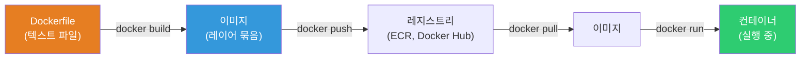
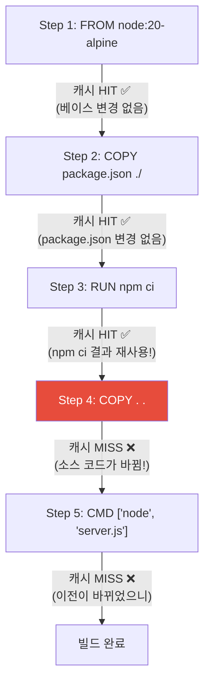
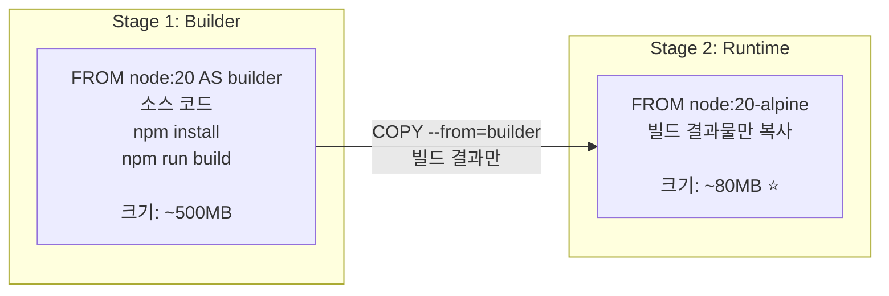

# Dockerfile 작성법

> 지금까지 남이 만든 이미지를 실행했다면, 이제 **내 앱을 이미지로** 만들어볼게요. Dockerfile은 이미지의 레시피예요. 잘 작성하면 빌드가 빠르고 이미지가 작고 보안이 좋아요. 못 쓰면 빌드에 10분, 이미지 2GB, 보안 구멍 투성이가 돼요.

---

## 🎯 이걸 왜 알아야 하나?

```
실무에서 Dockerfile 관련 작업:
• 앱을 컨테이너 이미지로 빌드               → Dockerfile 작성
• "이미지 크기가 2GB인데 줄일 수 없나요?"    → 멀티스테이지 빌드
• "빌드할 때마다 npm install을 다시 해요"    → 레이어 캐시 최적화
• "이미지 보안 스캔에서 취약점이 나왔어요"   → 베이스 이미지 선택, non-root
• CI/CD에서 이미지 자동 빌드               → Dockerfile 최적화
• "로컬에서는 되는데 컨테이너에서 안 돼요"   → Dockerfile 디버깅
```

[이전 강의](./02-docker-basics)에서 `docker run`으로 남의 이미지를 실행했죠? 이제 `docker build`로 **내 이미지**를 만들어요.

---

## 🧠 핵심 개념

### 비유: 요리 레시피

Dockerfile을 **요리 레시피**에 비유해볼게요.

* **FROM** = 기본 재료 (밀가루 반죽 = base 이미지)
* **RUN** = 조리 과정 (반죽을 치대고, 재료를 섞고)
* **COPY** = 재료 추가 (소스, 토핑을 올리고)
* **EXPOSE** = 서빙 창구 (몇 번 창구로 나갈지)
* **CMD** = 최종 완성 지시 ("오븐에서 20분 구워주세요")

### Dockerfile → 이미지 → 컨테이너 흐름



---

## 🔍 상세 설명 — Dockerfile 기본 문법

### 주요 명령어

```dockerfile
# === FROM — 베이스 이미지 (필수! 첫 줄!) ===
FROM node:20-alpine
# → 이 이미지 위에 내 앱을 쌓음
# → alpine 버전이 가장 작음 (130MB vs 1.1GB)

# === WORKDIR — 작업 디렉토리 설정 ===
WORKDIR /app
# → 이후 명령어가 /app 디렉토리에서 실행됨
# → mkdir + cd와 같은 효과

# === COPY — 호스트 파일을 이미지에 복사 ===
COPY package.json package-lock.json ./
# → 호스트의 package.json을 이미지의 /app/에 복사

COPY . .
# → 현재 디렉토리 전체를 이미지의 /app/에 복사

# === RUN — 빌드 시 명령어 실행 ===
RUN npm ci --production
# → 빌드할 때 npm install 실행
# → 결과가 새 레이어로 저장됨

RUN apt-get update && apt-get install -y curl && rm -rf /var/lib/apt/lists/*
# → 패키지 설치 + 캐시 정리 (한 줄에!)

# === ENV — 환경 변수 설정 ===
ENV NODE_ENV=production
ENV PORT=3000

# === EXPOSE — 포트 문서화 ===
EXPOSE 3000
# → 실제 포트를 열지는 않음! 문서화 목적
# → docker run -p 3000:3000 으로 실제 매핑

# === USER — 실행 사용자 변경 ===
USER node
# → 이후 명령어와 컨테이너 실행이 node 사용자로
# → ⭐ 보안! root로 실행하지 마세요!

# === CMD — 컨테이너 시작 시 실행할 명령어 ===
CMD ["node", "server.js"]
# → exec form (추천): ["실행파일", "인자1", "인자2"]
# → shell form (비추): CMD node server.js

# === ENTRYPOINT — CMD와 비슷하지만 덮어쓰기 어려움 ===
ENTRYPOINT ["node"]
CMD ["server.js"]
# → 기본: node server.js
# → docker run myapp worker.js → node worker.js (CMD만 교체)
```

**CMD vs ENTRYPOINT:**

```bash
# CMD만 사용 (가장 흔함):
CMD ["node", "server.js"]
# docker run myapp                → node server.js
# docker run myapp bash           → bash (CMD 전체 교체!)

# ENTRYPOINT + CMD (고급):
ENTRYPOINT ["node"]
CMD ["server.js"]
# docker run myapp                → node server.js
# docker run myapp worker.js      → node worker.js (CMD만 교체)
# docker run --entrypoint bash myapp → bash (ENTRYPOINT 교체)

# 실무 추천:
# 대부분의 앱 → CMD만 사용
# 특정 실행 파일을 강제하고 싶을 때 → ENTRYPOINT + CMD
```

### 추가 명령어

```dockerfile
# === ARG — 빌드 시점 변수 (이미지에 남지 않음) ===
ARG NODE_VERSION=20
FROM node:${NODE_VERSION}-alpine
# docker build --build-arg NODE_VERSION=18 .

# === LABEL — 메타데이터 ===
LABEL maintainer="devops@mycompany.com"
LABEL version="1.0.0"
LABEL description="My awesome app"

# === ADD vs COPY ===
# COPY: 단순 파일 복사 (⭐ 추천!)
COPY ./src /app/src

# ADD: COPY + 자동 압축 해제 + URL 다운로드
ADD https://example.com/file.tar.gz /app/    # URL 다운로드
ADD archive.tar.gz /app/                      # 자동 압축 해제

# → 대부분 COPY를 쓰세요. ADD는 의도가 불명확해짐.

# === HEALTHCHECK — 컨테이너 헬스체크 ===
HEALTHCHECK --interval=30s --timeout=3s --start-period=10s --retries=3 \
    CMD curl -f http://localhost:3000/health || exit 1

# === VOLUME — 볼륨 마운트 포인트 선언 ===
VOLUME ["/data"]

# === SHELL — 기본 쉘 변경 ===
SHELL ["/bin/bash", "-c"]
```

---

## 🔍 상세 설명 — 실전 Dockerfile 예제

### Node.js 앱 (★ 가장 흔한 패턴)

```dockerfile
# === 나쁜 예 ❌ ===
FROM node:20
WORKDIR /app
COPY . .
RUN npm install
EXPOSE 3000
CMD ["node", "server.js"]

# 문제점:
# 1. node:20 이미지가 1.1GB (너무 큼!)
# 2. COPY . . 먼저 하면 코드 변경할 때마다 npm install 다시 실행
# 3. devDependencies도 설치됨
# 4. root로 실행 (보안 위험)
# 5. .git, node_modules 등 불필요한 파일도 복사
```

```dockerfile
# === 좋은 예 ✅ ===
FROM node:20-alpine

# 작업 디렉토리
WORKDIR /app

# 1. 의존성 파일만 먼저 복사 (레이어 캐시 활용!)
COPY package.json package-lock.json ./

# 2. 프로덕션 의존성만 설치
RUN npm ci --production && npm cache clean --force

# 3. 소스 코드 복사 (이 부분만 자주 바뀜)
COPY . .

# 4. non-root 사용자로 실행
USER node

# 5. 포트 문서화
EXPOSE 3000

# 6. 헬스체크
HEALTHCHECK --interval=30s --timeout=3s \
    CMD wget -qO- http://localhost:3000/health || exit 1

# 7. 시작 명령
CMD ["node", "server.js"]
```

```bash
# .dockerignore 파일 (⭐ 반드시 만들기!)
cat << 'EOF' > .dockerignore
node_modules
npm-debug.log
.git
.gitignore
.env
.env.local
Dockerfile
docker-compose.yml
README.md
.vscode
coverage
.nyc_output
*.test.js
*.spec.js
EOF

# → .dockerignore가 없으면 node_modules(수백MB)도 COPY됨!
# → 빌드가 느려지고 이미지가 커짐
```

### Python 앱

```dockerfile
FROM python:3.12-slim

WORKDIR /app

# 시스템 의존성 (필요한 경우만)
RUN apt-get update && \
    apt-get install -y --no-install-recommends gcc libpq-dev && \
    rm -rf /var/lib/apt/lists/*

# Python 의존성 먼저 (캐시 활용)
COPY requirements.txt .
RUN pip install --no-cache-dir -r requirements.txt

# 소스 코드 복사
COPY . .

# non-root 사용자 생성 + 전환
RUN groupadd -r appuser && useradd -r -g appuser appuser
USER appuser

EXPOSE 8000

CMD ["gunicorn", "--bind", "0.0.0.0:8000", "--workers", "4", "app:app"]
```

### Go 앱 (멀티스테이지의 진가!)

```dockerfile
# === 빌드 스테이지 ===
FROM golang:1.22-alpine AS builder

WORKDIR /app

# 의존성 먼저 (캐시)
COPY go.mod go.sum ./
RUN go mod download

# 소스 복사 + 빌드
COPY . .
RUN CGO_ENABLED=0 GOOS=linux go build -o /app/server .

# === 실행 스테이지 ===
FROM scratch
# scratch = 완전 빈 이미지! OS도 없음!
# Go 바이너리는 정적 링크라서 OS 불필요

COPY --from=builder /app/server /server
COPY --from=builder /etc/ssl/certs/ca-certificates.crt /etc/ssl/certs/

EXPOSE 8080

ENTRYPOINT ["/server"]
```

```bash
# 빌드 결과 비교:
# golang:1.22-alpine (빌드 스테이지): ~300MB
# 최종 이미지 (scratch):              ~15MB! 🎉
# → 빌드 도구, Go 컴파일러, 소스 코드 전부 없음!
# → 실행에 필요한 바이너리만!
```

### Java (Spring Boot) 앱

```dockerfile
# === 빌드 스테이지 ===
FROM eclipse-temurin:21-jdk-alpine AS builder

WORKDIR /app
COPY . .
RUN ./gradlew bootJar --no-daemon

# === 실행 스테이지 ===
FROM eclipse-temurin:21-jre-alpine
# jdk(300MB+) 대신 jre(200MB)만! 실행에는 JRE로 충분

WORKDIR /app

# JAR만 복사
COPY --from=builder /app/build/libs/*.jar app.jar

# non-root
RUN addgroup -S appgroup && adduser -S appuser -G appgroup
USER appuser

EXPOSE 8080

HEALTHCHECK --interval=30s --timeout=3s \
    CMD wget -qO- http://localhost:8080/actuator/health || exit 1

ENTRYPOINT ["java", "-jar", "app.jar"]
```

---

## 🔍 상세 설명 — 레이어 캐시 최적화 (★ 빌드 속도의 핵심!)

### 캐시 동작 원리



**핵심 규칙: 캐시는 변경된 레이어부터 이후 전부 무효화!**

```dockerfile
# ❌ 나쁜 순서 — 코드 변경할 때마다 npm install 다시!
FROM node:20-alpine
WORKDIR /app
COPY . .                    # ← 코드 1줄 바꿔도 여기서 캐시 무효화!
RUN npm ci --production     # ← 매번 다시 설치 (느림!)

# ✅ 좋은 순서 — 의존성 변경 없으면 npm install 건너뜀!
FROM node:20-alpine
WORKDIR /app
COPY package.json package-lock.json ./   # ← 의존성 파일만 먼저
RUN npm ci --production                   # ← 캐시 HIT! (의존성 안 바뀌면)
COPY . .                                  # ← 소스만 변경 (빠름!)
```

```bash
# 캐시 효과 비교:

# 첫 번째 빌드 (캐시 없음):
time docker build -t myapp .
# Step 3/6: RUN npm ci --production
# → 45초 소요
# Total: 60초

# 소스 코드만 변경 후 두 번째 빌드:
time docker build -t myapp .
# Step 3/6: RUN npm ci --production
# → Using cache ✅ (0초!)
# Total: 5초 🎉

# 캐시 최적화로 빌드 시간: 60초 → 5초!
```

### 레이어 최적화 추가 팁

```dockerfile
# ❌ RUN을 여러 줄로 (레이어 많아짐 + 캐시 정리 안 됨)
RUN apt-get update
RUN apt-get install -y curl wget git
RUN rm -rf /var/lib/apt/lists/*
# → 3개 레이어, 중간 레이어에 apt 캐시가 남아있음!

# ✅ RUN을 한 줄로 합치기 (레이어 1개 + 캐시 정리)
RUN apt-get update && \
    apt-get install -y --no-install-recommends curl wget git && \
    rm -rf /var/lib/apt/lists/*
# → 1개 레이어, apt 캐시도 같은 레이어에서 삭제!

# ❌ 큰 파일을 복사했다가 삭제 (레이어에 남음!)
COPY large-file.tar.gz /tmp/
RUN tar xzf /tmp/large-file.tar.gz -C /app/ && rm /tmp/large-file.tar.gz
# → large-file.tar.gz가 첫 번째 레이어에 여전히 존재!

# ✅ 한 RUN에서 다운로드 + 설치 + 삭제
RUN wget -O /tmp/large-file.tar.gz https://example.com/large-file.tar.gz && \
    tar xzf /tmp/large-file.tar.gz -C /app/ && \
    rm /tmp/large-file.tar.gz
```

---

## 🔍 상세 설명 — 멀티스테이지 빌드 (★ 이미지 크기의 핵심!)



```dockerfile
# === 멀티스테이지 빌드 — React + Node.js ===

# Stage 1: 프론트엔드 빌드
FROM node:20-alpine AS frontend-builder
WORKDIR /app/frontend
COPY frontend/package.json frontend/package-lock.json ./
RUN npm ci
COPY frontend/ .
RUN npm run build
# → /app/frontend/build/ 에 정적 파일 생성

# Stage 2: 백엔드 의존성
FROM node:20-alpine AS backend-builder
WORKDIR /app
COPY package.json package-lock.json ./
RUN npm ci --production

# Stage 3: 최종 이미지 (가장 작게!)
FROM node:20-alpine
WORKDIR /app

# 백엔드 의존성만 복사
COPY --from=backend-builder /app/node_modules ./node_modules
# 프론트엔드 빌드 결과만 복사
COPY --from=frontend-builder /app/frontend/build ./public
# 소스 코드 복사
COPY . .

USER node
EXPOSE 3000
CMD ["node", "server.js"]
```

```bash
# 이미지 크기 비교:
# 멀티스테이지 없이:  ~800MB (빌드 도구 + devDependencies 포함)
# 멀티스테이지 적용:  ~150MB (런타임만!)

# 언어별 효과:
# Go:     300MB → 15MB (scratch 사용!)
# Java:   600MB → 200MB (JDK → JRE만)
# Node.js: 500MB → 150MB (빌드 도구 제거)
# Python: 400MB → 180MB (빌드 도구 제거)
```

---

## 🔍 상세 설명 — 베이스 이미지 선택

```bash
# 같은 Node.js라도 베이스에 따라 크기가 완전히 다름!

docker pull node:20         && docker images node:20
# node    20         1.1GB    ← Debian 기반, 모든 도구 포함

docker pull node:20-slim    && docker images node:20-slim
# node    20-slim    250MB   ← Debian 최소, 일부 도구만

docker pull node:20-alpine  && docker images node:20-alpine
# node    20-alpine  130MB   ← Alpine Linux 기반, 매우 작음!
```

| 베이스 | 크기 | 장점 | 단점 | 추천 |
|--------|------|------|------|------|
| `ubuntu/debian` | 크다 (200MB+) | 모든 도구, 호환성 | 큼, CVE 많음 | 레거시 |
| `*-slim` | 중간 (100~250MB) | Debian 최소, 호환 좋음 | slim도 꽤 큼 | Python/Java |
| `*-alpine` | 작다 (50~130MB) | 매우 작음, CVE 적음 | musl libc 호환 문제 | ⭐ Node.js, Go |
| `distroless` | 가장 작음 | 쉘 없음! 보안 최고 | 디버깅 어려움 | 프로덕션 보안 |
| `scratch` | 0MB (빈 이미지) | 최소 크기 | 정적 바이너리만 | Go |

```dockerfile
# Distroless 예시 (Google이 만든 최소 이미지)
FROM gcr.io/distroless/nodejs20-debian12
WORKDIR /app
COPY --from=builder /app .
CMD ["server.js"]

# → 쉘(bash/sh)이 없음! → docker exec -it ... bash 불가!
# → 공격자가 쉘을 실행할 수 없으므로 보안 극대화
# → 디버깅은 별도 디버그 이미지 사용:
# FROM gcr.io/distroless/nodejs20-debian12:debug  ← sh 포함
```

---

## 🔍 상세 설명 — 보안 모범 사례

### 보안 Dockerfile 체크리스트

```dockerfile
# === 1. non-root 사용자 실행 (⭐ 가장 중요!) ===

# Node.js (node 사용자가 이미 있음)
FROM node:20-alpine
USER node

# Python/Go (직접 생성)
RUN addgroup -S appgroup && adduser -S appuser -G appgroup
USER appuser

# === 2. 읽기 전용 파일 시스템 ===
# docker run --read-only로 실행
# Dockerfile에서는 쓰기 필요한 곳만 tmpfs로

# === 3. 최소한의 패키지만 설치 ===
RUN apt-get install -y --no-install-recommends curl && \
    rm -rf /var/lib/apt/lists/*
#                      ^^^^^^^^^^^^^^^^^^
#                      추천 패키지 설치 안 함!

# === 4. .dockerignore로 비밀 정보 제외 ===
# .env, .aws/, *.pem, *.key 등 절대 이미지에 넣지 않기!

# === 5. COPY 대신 ADD 안 쓰기 ===
# ADD는 URL 다운로드, tar 해제 등 예상치 못한 동작을 할 수 있음

# === 6. 특정 버전 태그 사용 ===
# ❌ FROM node:latest   ← 언제 바뀔지 모름
# ✅ FROM node:20.11.1-alpine3.19   ← 정확한 버전

# === 7. 비밀 정보를 빌드 인자로 넣지 않기 ===
# ❌ ARG DB_PASSWORD=secret123
# → docker history로 보임!
# ✅ 런타임 환경 변수로 주입 (docker run -e 또는 K8s Secret)

# === 8. 이미지 스캐닝 ===
# CI/CD에서 Trivy 등으로 자동 스캔 (09-security 강의에서 상세히)
```

```bash
# 비밀 정보가 이미지에 들어갔는지 확인
docker history myapp:latest
# → ARG나 ENV로 넣은 비밀번호가 보이면 위험!

# Dockerfile에서 비밀을 안전하게 사용하는 방법 (BuildKit):
# syntax=docker/dockerfile:1
FROM node:20-alpine
RUN --mount=type=secret,id=npmrc,target=/root/.npmrc npm ci
# → .npmrc가 빌드 중에만 사용되고 이미지에 남지 않음!

# 빌드:
# docker build --secret id=npmrc,src=.npmrc -t myapp .
```

---

## 🔍 상세 설명 — docker build

```bash
# === 기본 빌드 ===
docker build -t myapp:v1.0 .
#             ^^^^^^^^^^^^^  ^
#             이미지:태그    빌드 컨텍스트 (현재 디렉토리)

# 출력:
# [+] Building 45.2s (12/12) FINISHED
#  => [1/6] FROM node:20-alpine                           0.0s
#  => [2/6] WORKDIR /app                                  0.0s
#  => [3/6] COPY package.json package-lock.json ./         0.1s
#  => [4/6] RUN npm ci --production                       40.0s
#  => [5/6] COPY . .                                      0.5s
#  => [6/6] RUN npm run build                              4.0s
#  => exporting to image                                   0.6s

# === 빌드 옵션 ===

# 다른 Dockerfile 지정
docker build -f Dockerfile.prod -t myapp:prod .

# 빌드 인자 전달
docker build --build-arg NODE_VERSION=18 -t myapp .

# 캐시 없이 빌드 (처음부터 다시)
docker build --no-cache -t myapp .

# 특정 스테이지만 빌드
docker build --target builder -t myapp-builder .
# → 멀티스테이지에서 builder 단계까지만 빌드

# 빌드 플랫폼 지정 (멀티 아키텍처)
docker build --platform linux/amd64 -t myapp .
docker build --platform linux/arm64 -t myapp .

# === BuildKit (추천! 더 빠름) ===
# Docker 23+ 에서는 기본 활성화
DOCKER_BUILDKIT=1 docker build -t myapp .

# BuildKit 장점:
# - 병렬 빌드 (독립적인 스테이지를 동시에)
# - 더 나은 캐시
# - 시크릿 마운트
# - SSH 에이전트 포워딩
```

```bash
# === 빌드 후 확인 ===

# 이미지 크기 확인
docker images myapp
# REPOSITORY   TAG    SIZE
# myapp        v1.0   150MB

# 레이어 확인
docker history myapp:v1.0
# IMAGE          SIZE      CREATED BY
# abc123         0B        CMD ["node" "server.js"]
# def456         50MB      RUN npm ci --production
# ghi789         5MB       COPY . .
# ...

# 이미지 내용 탐색
docker run --rm -it myapp:v1.0 sh
# /app $ ls
# node_modules  package.json  server.js  ...
# /app $ whoami
# node    ← non-root! ✅
```

---

## 💻 실습 예제

### 실습 1: 간단한 Node.js 앱 이미지 만들기

```bash
# 1. 앱 코드 만들기
mkdir -p /tmp/myapp && cd /tmp/myapp

cat << 'EOF' > package.json
{
  "name": "myapp",
  "version": "1.0.0",
  "main": "server.js",
  "scripts": { "start": "node server.js" }
}
EOF

cat << 'EOF' > server.js
const http = require('http');
const server = http.createServer((req, res) => {
  if (req.url === '/health') {
    res.writeHead(200, {'Content-Type': 'application/json'});
    res.end(JSON.stringify({status: 'ok', time: new Date().toISOString()}));
  } else {
    res.writeHead(200, {'Content-Type': 'text/html'});
    res.end('<h1>Hello from Docker!</h1><p>Version: 1.0.0</p>');
  }
});
server.listen(3000, () => console.log('Server running on :3000'));
EOF

# 2. .dockerignore
echo -e "node_modules\n.git\nDockerfile\nREADME.md" > .dockerignore

# 3. Dockerfile
cat << 'EOF' > Dockerfile
FROM node:20-alpine
WORKDIR /app
COPY package.json ./
RUN npm install --production
COPY . .
USER node
EXPOSE 3000
HEALTHCHECK --interval=30s --timeout=3s CMD wget -qO- http://localhost:3000/health || exit 1
CMD ["node", "server.js"]
EOF

# 4. 빌드
docker build -t myapp:v1.0 .

# 5. 실행
docker run -d --name myapp -p 3000:3000 myapp:v1.0

# 6. 테스트
curl http://localhost:3000
# <h1>Hello from Docker!</h1><p>Version: 1.0.0</p>

curl http://localhost:3000/health
# {"status":"ok","time":"2025-03-12T10:00:00.000Z"}

# 7. 이미지 크기 확인
docker images myapp
# REPOSITORY   TAG    SIZE
# myapp        v1.0   ~140MB

# 8. 정리
docker rm -f myapp
docker rmi myapp:v1.0
rm -rf /tmp/myapp
```

### 실습 2: 멀티스테이지 빌드 효과 체험

```bash
mkdir -p /tmp/multi-stage && cd /tmp/multi-stage

# Go 앱 (정적 바이너리 → scratch 가능!)
cat << 'EOF' > main.go
package main

import (
    "fmt"
    "net/http"
)

func main() {
    http.HandleFunc("/", func(w http.ResponseWriter, r *http.Request) {
        fmt.Fprintf(w, "Hello from Go container! (scratch image)")
    })
    fmt.Println("Server starting on :8080")
    http.ListenAndServe(":8080", nil)
}
EOF

cat << 'EOF' > go.mod
module mygoapp
go 1.22
EOF

# === 싱글 스테이지 (큰 이미지) ===
cat << 'EOF' > Dockerfile.single
FROM golang:1.22-alpine
WORKDIR /app
COPY . .
RUN go build -o server .
EXPOSE 8080
CMD ["./server"]
EOF

docker build -f Dockerfile.single -t goapp:single .

# === 멀티 스테이지 (작은 이미지) ===
cat << 'EOF' > Dockerfile.multi
FROM golang:1.22-alpine AS builder
WORKDIR /app
COPY . .
RUN CGO_ENABLED=0 GOOS=linux go build -o server .

FROM scratch
COPY --from=builder /app/server /server
EXPOSE 8080
ENTRYPOINT ["/server"]
EOF

docker build -f Dockerfile.multi -t goapp:multi .

# === 크기 비교 ===
docker images goapp
# REPOSITORY   TAG      SIZE
# goapp        single   300MB    ← Go 컴파일러 + Alpine 포함
# goapp        multi    8MB      ← 바이너리만! 🎉

# 정리
docker rmi goapp:single goapp:multi
rm -rf /tmp/multi-stage
```

### 실습 3: 캐시 효과 측정

```bash
mkdir -p /tmp/cache-test && cd /tmp/cache-test

cat << 'EOF' > Dockerfile
FROM node:20-alpine
WORKDIR /app
COPY package.json ./
RUN npm install --production && echo "npm install 실행됨!"
COPY . .
CMD ["node", "server.js"]
EOF

echo '{"name":"test","version":"1.0.0"}' > package.json
echo 'console.log("hello")' > server.js
echo "node_modules" > .dockerignore

# 첫 빌드 (캐시 없음)
time docker build -t cache-test:v1 .
# RUN npm install → 실행됨! (수 초)

# 소스만 변경
echo 'console.log("hello v2")' > server.js

# 두 번째 빌드 (캐시 활용)
time docker build -t cache-test:v2 .
# RUN npm install → CACHED ✅ (0초!)
# → package.json이 안 바뀌었으니까!

# package.json 변경하면?
echo '{"name":"test","version":"2.0.0","dependencies":{"express":"4.18.0"}}' > package.json

# 세 번째 빌드 (캐시 무효화)
time docker build -t cache-test:v3 .
# RUN npm install → 실행됨! (의존성 변경)

# 정리
docker rmi cache-test:v1 cache-test:v2 cache-test:v3
rm -rf /tmp/cache-test
```

---

## 🏢 실무에서는?

### 시나리오 1: CI/CD에서 빌드 최적화

```bash
# "CI/CD에서 이미지 빌드에 10분 걸려요" → 2분으로 줄이기

# 최적화 1: 레이어 캐시 순서 최적화
# → 의존성 파일 먼저 COPY → RUN install → 소스 COPY

# 최적화 2: CI에서 캐시 활용
# GitHub Actions:
# - name: Build and push
#   uses: docker/build-push-action@v5
#   with:
#     cache-from: type=gha        # GitHub Actions 캐시 사용
#     cache-to: type=gha,mode=max

# 최적화 3: 멀티스테이지로 이미지 크기 줄이기
# → push/pull 시간도 줄어듦!

# 최적화 4: .dockerignore 확실히 설정
# → 불필요한 파일이 빌드 컨텍스트에 안 들어가게
```

### 시나리오 2: 이미지 크기 줄이기

```bash
# "이미지가 2GB인데 줄여야 해요"

# 1. 현재 크기 확인
docker images myapp
# myapp   latest   2.1GB

# 2. 레이어별 크기 분석
docker history myapp:latest --format "{{.Size}}\t{{.CreatedBy}}" | sort -rh | head
# 800MB  RUN npm install
# 500MB  COPY . .
# 400MB  FROM node:20 (베이스)

# 3. 최적화 적용:
# a. 베이스: node:20 (1.1GB) → node:20-alpine (130MB)
# b. 멀티스테이지: 빌드 도구 제거
# c. --production: devDependencies 제거
# d. .dockerignore: node_modules, .git 등 제거
# e. 한 줄 RUN: apt 캐시 정리

# 4. 결과
docker images myapp-optimized
# myapp-optimized   latest   150MB   ← 2.1GB → 150MB! (93% 감소)
```

### 시나리오 3: "로컬에서는 되는데 Docker에서 안 돼요"

```bash
# 디버깅 순서:

# 1. 빌드 로그 확인
docker build -t myapp . 2>&1 | tail -30
# → 에러 메시지 확인

# 2. 중간 단계에서 쉘 접속
docker build --target builder -t myapp-debug .
docker run -it --rm myapp-debug sh
# → 빌드 중간 상태에서 디버깅

# 3. 런타임 에러면 로그 확인
docker run --rm myapp:latest
# Error: Cannot find module 'express'
# → npm install에서 의존성이 빠졌거나
# → .dockerignore가 필요한 파일을 제외했거나

# 4. 흔한 원인:
# a. .dockerignore에 중요 파일이 들어감
# b. WORKDIR 경로 불일치
# c. node_modules가 호스트에서 복사됨 (OS 호환 문제)
# d. 환경 변수가 빠짐
# e. 파일 권한 문제 (USER 변경 후 파일 접근 불가)
```

---

## ⚠️ 자주 하는 실수

### 1. COPY . . 을 의존성 설치 전에 하기

```dockerfile
# ❌ 코드 1줄 바꿔도 npm install 다시!
COPY . .
RUN npm ci

# ✅ 의존성 파일 먼저, 소스는 나중에
COPY package.json package-lock.json ./
RUN npm ci
COPY . .
```

### 2. .dockerignore 안 만들기

```bash
# ❌ node_modules(500MB), .git(100MB)이 이미지에 들어감!
# → 빌드 느려짐 + 이미지 거대해짐

# ✅ .dockerignore 필수!
echo -e "node_modules\n.git\n*.md\n.env\nDockerfile" > .dockerignore
```

### 3. root로 실행하기

```dockerfile
# ❌ USER 지정 안 하면 root로 실행
FROM node:20-alpine
CMD ["node", "server.js"]    # root로 실행!

# ✅ non-root 사용자로
FROM node:20-alpine
USER node                     # node 사용자로!
CMD ["node", "server.js"]
```

### 4. latest 태그로 FROM 쓰기

```dockerfile
# ❌ 언제 바뀔지 모르는 latest
FROM node:latest

# ✅ 정확한 버전 고정
FROM node:20.11.1-alpine3.19
# → 빌드 재현성 보장!
```

### 5. 비밀 정보를 이미지에 넣기

```dockerfile
# ❌ 비밀번호가 이미지 레이어에 영구 저장!
ENV DB_PASSWORD=secret123
# 또는
COPY .env /app/.env

# ✅ 런타임에 주입
# docker run -e DB_PASSWORD=secret123 myapp
# 또는 K8s Secret으로 주입
```

---

## 📝 정리

### Dockerfile 모범 사례 체크리스트

```
✅ Alpine 또는 slim 베이스 이미지
✅ 정확한 버전 태그 (latest 금지)
✅ 의존성 파일 먼저 COPY → install → 소스 COPY (캐시!)
✅ RUN 합치기 (&&로 연결, 캐시 정리)
✅ 멀티스테이지 빌드 (빌드 도구 제거)
✅ .dockerignore 설정
✅ non-root USER
✅ HEALTHCHECK 설정
✅ 비밀 정보 넣지 않기
✅ EXPOSE로 포트 문서화
```

### 이미지 크기 줄이기 순서

```
1. Alpine/slim 베이스 사용
2. 멀티스테이지 빌드
3. .dockerignore 설정
4. --production (devDependencies 제거)
5. RUN 합치기 + 캐시 정리
6. distroless/scratch (고급)
```

### 빌드 속도 올리기 순서

```
1. 레이어 캐시 순서 최적화 (의존성 먼저!)
2. .dockerignore (빌드 컨텍스트 줄이기)
3. BuildKit 사용
4. CI에서 캐시 재사용
5. 멀티스테이지에서 병렬 빌드
```

---

## 🔗 다음 강의

다음은 **[04-runtime](./04-runtime)** — 컨테이너 런타임 (containerd / CRI-O / runc) 이에요.

Docker 뒤에서 실제로 컨테이너를 실행하는 런타임들을 깊이 파볼게요. K8s가 Docker 대신 containerd를 쓰는 이유, CRI(Container Runtime Interface)가 뭔지, runc가 어떻게 컨테이너를 만드는지 배워볼 거예요.
