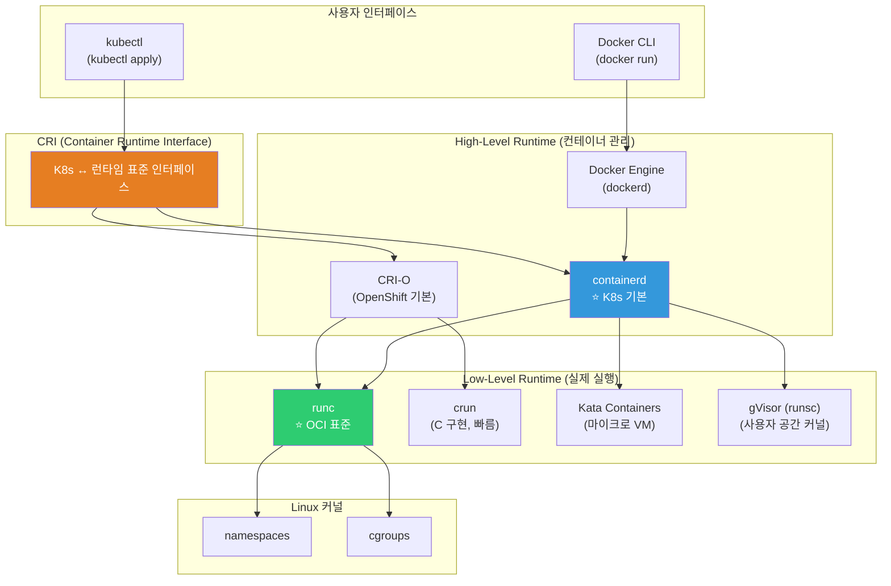
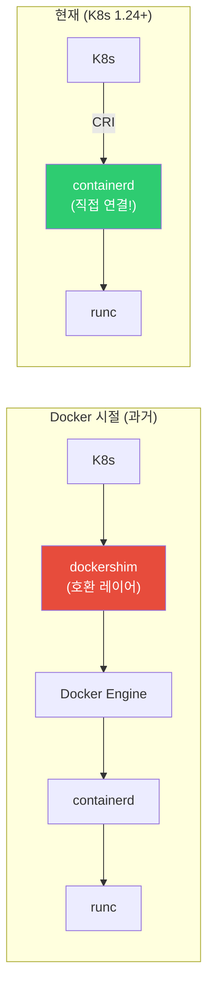

# 컨테이너 런타임 (containerd / CRI-O / runc)

> "Docker 없이 컨테이너를 실행한다고?" — K8s 프로덕션에서는 이미 Docker 없이 컨테이너를 돌리고 있어요. Docker 뒤에서 실제로 컨테이너를 만들고 실행하는 런타임들의 세계를 파헤쳐볼게요.

---

## 🎯 이걸 왜 알아야 하나?

```
이 개념을 알면 이해되는 것들:
• "K8s가 Docker를 제거했다"의 정확한 의미        → CRI + containerd
• K8s 노드에서 컨테이너 디버깅 (crictl)          → Docker CLI 대신
• 런타임 선택 (containerd vs CRI-O)              → 클러스터 셋업
• 컨테이너 보안 (runc vs gVisor vs Kata)         → 워크로드별 격리
• "OCI 호환"이 왜 중요한지                       → 런타임 간 호환성
• Docker build 대안 (Kaniko, buildah)            → CI/CD 최적화
```

[이전 강의](./01-concept)에서 런타임 스택을 간단히 봤죠? 이번에 깊이 파볼게요.

---

## 🧠 핵심 개념

### 비유: 자동차 엔진 계층

컨테이너 런타임을 **자동차**에 비유해볼게요.

* **Docker CLI / kubectl** = 운전대, 핸들. 사용자가 조작하는 인터페이스
* **Docker Engine / containerd** = 변속기, 동력 전달 장치. 엔진과 바퀴를 연결
* **runc** = 엔진 자체. 실제로 컨테이너(프로세스)를 생성하고 실행

사용자는 운전대만 잡지만, 실제로 차를 움직이는 건 엔진이에요.

### 런타임 스택 전체 그림



### High-Level vs Low-Level 런타임

| 구분 | High-Level | Low-Level |
|------|-----------|-----------|
| 역할 | 이미지 관리, 컨테이너 라이프사이클 | 실제 프로세스 생성 |
| 하는 일 | pull, 스냅샷, 네트워크, 스토리지 | namespace/cgroup 설정, exec |
| 예시 | containerd, CRI-O | runc, crun, kata, gVisor |
| 비유 | 요리사 (재료 준비, 접시 담기) | 오븐/불 (실제 조리) |

---

## 🔍 상세 설명 — containerd

### containerd란?

Docker에서 분리되어 독립 프로젝트가 된 컨테이너 런타임이에요. **K8s의 기본 런타임**이에요.



```bash
# containerd 상태 확인
systemctl status containerd
# ● containerd.service - containerd container runtime
#      Active: active (running) since ...

# containerd 버전
containerd --version
# containerd github.com/containerd/containerd v1.7.2 ...

# containerd 설정
cat /etc/containerd/config.toml
# [plugins."io.containerd.grpc.v1.cri"]
#   [plugins."io.containerd.grpc.v1.cri".containerd]
#     default_runtime_name = "runc"
#     [plugins."io.containerd.grpc.v1.cri".containerd.runtimes.runc]
#       runtime_type = "io.containerd.runc.v2"
```

### ctr — containerd 네이티브 CLI

```bash
# ctr은 containerd의 저수준 CLI (디버깅/관리용)
# 일반적으로 Docker CLI나 crictl을 더 많이 씀

# 네임스페이스 목록 (containerd의 네임스페이스, K8s와 다름!)
sudo ctr namespaces ls
# NAME    LABELS
# default
# k8s.io           ← K8s가 사용하는 네임스페이스
# moby             ← Docker가 사용하는 네임스페이스

# K8s 컨테이너 목록
sudo ctr -n k8s.io containers ls
# CONTAINER    IMAGE                          RUNTIME
# abc123       registry.k8s.io/pause:3.9      io.containerd.runc.v2
# def456       docker.io/library/nginx:latest io.containerd.runc.v2

# 이미지 목록
sudo ctr -n k8s.io images ls | head -5
# REF                                    TYPE                   SIZE
# docker.io/library/nginx:latest         application/vnd.oci... 67.2 MiB
# registry.k8s.io/pause:3.9             application/vnd.oci... 320.0 KiB

# 이미지 pull
sudo ctr -n default images pull docker.io/library/alpine:latest

# 컨테이너 실행 (저수준 — 보통 이렇게 안 씀)
sudo ctr -n default run --rm docker.io/library/alpine:latest test echo "hello"
# hello
```

### crictl — CRI 호환 CLI (★ K8s 노드에서 필수!)

```bash
# crictl: K8s 노드에서 컨테이너를 관리하는 표준 도구
# Docker CLI와 비슷하지만 CRI를 통해 containerd/CRI-O와 통신

# 설정 (containerd 사용 시)
cat /etc/crictl.yaml
# runtime-endpoint: unix:///run/containerd/containerd.sock
# image-endpoint: unix:///run/containerd/containerd.sock

# === Docker CLI ↔ crictl 대응표 ===

# 컨테이너 목록
sudo crictl ps
# CONTAINER   IMAGE          CREATED      STATE     NAME      POD ID
# abc123      nginx:latest   2 hours ago  Running   nginx     xyz789
# def456      redis:7        1 hour ago   Running   redis     uvw456

# docker ps와 비교:
# docker ps         →  crictl ps
# docker ps -a      →  crictl ps -a
# docker images     →  crictl images (또는 crictl img)
# docker logs       →  crictl logs
# docker exec       →  crictl exec
# docker inspect    →  crictl inspect
# docker pull       →  crictl pull
# docker stop       →  crictl stop
# docker rm         →  crictl rm

# 컨테이너 로그
sudo crictl logs abc123
# 2025/03/12 10:00:00 [notice] ... nginx started

sudo crictl logs --tail 20 abc123          # 최근 20줄
sudo crictl logs --follow abc123           # 실시간 로그

# 컨테이너 쉘 접속
sudo crictl exec -it abc123 sh
# / # ps aux
# PID   USER   COMMAND
# 1     root   nginx: master process
# / # exit

# 이미지 목록
sudo crictl images
# IMAGE                    TAG       IMAGE ID       SIZE
# docker.io/library/nginx  latest    a8758716bb6a   67.2MB
# docker.io/library/redis  7         b5f28e5b6f3c   45.3MB
# registry.k8s.io/pause    3.9       7031c1b28338   320kB

# Pod 목록 (K8s Pod 단위)
sudo crictl pods
# POD ID    CREATED      STATE   NAME              NAMESPACE    
# xyz789    2 hours ago  Ready   nginx-deploy-abc  default      
# uvw456    1 hour ago   Ready   redis-deploy-def  default      

# 이미지 pull
sudo crictl pull nginx:latest
# Image is up to date for docker.io/library/nginx:latest

# 컨테이너 상세 정보
sudo crictl inspect abc123 | python3 -m json.tool | head -30
# {
#   "status": {
#     "id": "abc123...",
#     "state": "CONTAINER_RUNNING",
#     "createdAt": "2025-03-12T10:00:00.000Z",
#     "image": {"image": "docker.io/library/nginx:latest"},
#     ...
#   }
# }

# 시스템 통계
sudo crictl stats
# CONTAINER   CPU %   MEM           DISK          INODES
# abc123      0.50%   15.5MiB       4.0kB         12
# def456      1.20%   25.3MiB       8.0kB         20

# 미사용 이미지 정리
sudo crictl rmi --prune
```

```bash
# === 실무: K8s 노드에서 디버깅할 때 ===

# "Pod가 CrashLoopBackOff인데 로그를 못 봐요"
# → kubectl logs가 안 되는 경우, 노드에 SSH 후 crictl 사용

# 1. 노드에 SSH
ssh node-1

# 2. 문제 Pod의 컨테이너 찾기
sudo crictl pods --name my-crashing-pod
# POD ID    NAME                 STATE
# abc123    my-crashing-pod-xyz  NotReady

# 3. Pod의 컨테이너 확인 (종료된 것 포함)
sudo crictl ps -a --pod abc123
# CONTAINER  STATE     NAME      POD ID
# def456     Exited    myapp     abc123

# 4. 로그 확인
sudo crictl logs def456
# Error: Cannot connect to database
# → 원인 발견!
```

---

## 🔍 상세 설명 — CRI-O

### CRI-O란?

CRI-O는 K8s **전용**으로 만들어진 경량 런타임이에요. Red Hat/OpenShift의 기본 런타임이에요.

```bash
# CRI-O 특징:
# ✅ K8s CRI에 최적화 (불필요한 기능 없음)
# ✅ 경량 (containerd보다 작음)
# ✅ OCI 호환
# ✅ Red Hat/OpenShift에서 지원
# ❌ Docker CLI 비호환 (crictl만 사용)
# ❌ 독립 컨테이너 실행 불가 (K8s 전용)

# CRI-O 상태 확인 (CRI-O를 쓰는 노드에서)
systemctl status crio
# ● crio.service - Container Runtime Interface for OCI
#    Active: active (running) since ...

# CRI-O 버전
crio --version
# crio version 1.28.0

# crictl로 관리 (containerd와 동일!)
sudo crictl ps
sudo crictl logs CONTAINER_ID
sudo crictl images
```

### containerd vs CRI-O

| 항목 | containerd | CRI-O |
|------|-----------|-------|
| 개발 | CNCF (Docker에서 분리) | Red Hat/CNCF |
| 용도 | 범용 (K8s + 독립 실행) | K8s 전용 |
| Docker 호환 | ✅ (Docker가 내부적으로 사용) | ❌ |
| K8s 기본 | EKS, GKE, AKS, kubeadm | OpenShift |
| 크기 | 중간 | 더 작음 |
| 기능 | 풍부 (이미지 빌드 등) | 최소 (K8s에 필요한 것만) |
| ctr CLI | ✅ | ❌ |
| crictl | ✅ | ✅ |
| 추천 | ⭐ 대부분의 경우 | OpenShift 환경 |

```bash
# K8s 노드에서 런타임 확인
kubectl get nodes -o wide
# NAME    STATUS  VERSION  CONTAINER-RUNTIME
# node-1  Ready   v1.28    containerd://1.7.2
# node-2  Ready   v1.28    containerd://1.7.2
# 또는
# node-1  Ready   v1.28    cri-o://1.28.0

# → 대부분의 관리형 K8s(EKS, GKE, AKS)는 containerd
# → OpenShift는 CRI-O
```

---

## 🔍 상세 설명 — runc (Low-Level Runtime)

### runc란?

runc는 **OCI Runtime Spec의 참조 구현**이에요. 실제로 Linux namespace와 cgroup을 설정해서 컨테이너 프로세스를 만드는 녀석이에요.

```bash
# runc 버전 확인
runc --version
# runc version 1.1.9
# spec: 1.0.2-dev
# go: go1.20.8

# runc가 하는 일 (내부적으로):
# 1. OCI 번들(config.json + rootfs)을 읽음
# 2. Linux namespaces 생성 (PID, Net, Mount, ...)
# 3. cgroups 설정 (CPU, 메모리 제한)
# 4. seccomp 필터 적용
# 5. 프로세스 실행 (exec)
# → 이 모든 것이 Linux 커널 기능! (../01-linux/13-kernel, ../01-linux/14-security)
```

```bash
# runc로 직접 컨테이너 만들기 (교육용 — 보통 이렇게 안 씀)

# 1. OCI 번들 준비
mkdir -p /tmp/runc-test/rootfs
cd /tmp/runc-test

# Alpine rootfs 추출
docker export $(docker create alpine) | tar -C rootfs -xf -

# 2. OCI config.json 생성
runc spec
# → config.json이 생성됨 (OCI Runtime Spec)

# 3. config.json 내용 (핵심 부분):
cat config.json | python3 -m json.tool | head -40
# {
#     "ociVersion": "1.0.2-dev",
#     "process": {
#         "terminal": true,
#         "user": {"uid": 0, "gid": 0},
#         "args": ["sh"],                 ← 실행할 프로세스
#         "env": ["PATH=/usr/local/sbin:..."],
#         "cwd": "/"
#     },
#     "root": {
#         "path": "rootfs",               ← 파일 시스템 경로
#         "readonly": true
#     },
#     "linux": {
#         "namespaces": [
#             {"type": "pid"},            ← PID namespace
#             {"type": "network"},        ← Network namespace
#             {"type": "ipc"},
#             {"type": "uts"},
#             {"type": "mount"}
#         ],
#         "resources": {                  ← cgroup 리소스 제한
#             "memory": {"limit": 536870912},
#             ...
#         }
#     }
# }

# 4. runc로 직접 컨테이너 실행!
sudo runc run my-container
# / # ps
# PID   USER   COMMAND
# 1     root   sh       ← PID 1! namespace 격리!
# / # hostname
# runc                   ← UTS namespace 격리!
# / # exit

# → Docker 없이 컨테이너가 실행됨!
# → runc가 namespace + cgroup을 설정하고 sh를 실행한 것

# 정리
cd /
sudo rm -rf /tmp/runc-test
```

### 대안 Low-Level 런타임

```bash
# === crun (C 구현) ===
# runc(Go)보다 빠르고 메모리 적게 사용
# CRI-O의 기본 런타임으로 사용 가능
crun --version
# crun version 1.8.7
# spec: 1.0.0

# 장점: runc보다 시작 시간 ~50% 빠름, 메모리 ~50% 적음
# 단점: runc만큼 검증되지는 않았음

# containerd에서 crun 사용 설정:
# /etc/containerd/config.toml
# [plugins."io.containerd.grpc.v1.cri".containerd.runtimes.crun]
#   runtime_type = "io.containerd.runc.v2"
#   [plugins."io.containerd.grpc.v1.cri".containerd.runtimes.crun.options]
#     BinaryName = "/usr/bin/crun"
```

```bash
# === Kata Containers (마이크로 VM) ===
# 컨테이너마다 경량 VM을 생성! → VM 수준 격리

# 구조:
# containerd → kata-runtime → QEMU/Firecracker → 경량 VM → 컨테이너
# → 각 컨테이너가 별도 커널을 가짐!

# 장점: VM 수준 보안 격리 (커널 분리)
# 단점: 시작 시간 느림 (~1초), 리소스 오버헤드

# K8s에서 Kata 사용 (RuntimeClass):
apiVersion: node.k8s.io/v1
kind: RuntimeClass
metadata:
  name: kata
handler: kata    # containerd에 등록된 kata 런타임

# Pod에서 사용:
apiVersion: v1
kind: Pod
metadata:
  name: secure-pod
spec:
  runtimeClassName: kata    # ← Kata VM에서 실행!
  containers:
  - name: myapp
    image: myapp:latest
```

```bash
# === gVisor (runsc) ===
# 사용자 공간에서 Linux 커널을 에뮬레이션
# → 호스트 커널에 직접 시스템 호출을 안 함!

# 구조:
# containerd → runsc → gVisor 커널 (사용자 공간) → 앱
# → 앱의 syscall을 gVisor가 가로채서 처리

# 장점: 호스트 커널 공격 표면 축소, runc보다 안전
# 단점: 모든 syscall 호환 안 됨, 성능 오버헤드 (~10-30%)

# GKE에서 gVisor 사용:
# GKE Sandbox = gVisor 기반
# 노드 풀 생성 시 sandbox_config 활성화
# → 멀티 테넌트 환경에서 추천
```

### 런타임별 비교

| 런타임 | 격리 수준 | 시작 시간 | 오버헤드 | 용도 |
|--------|----------|----------|---------|------|
| **runc** | 프로세스 (namespace) | ~100ms | 거의 없음 | ⭐ 기본, 대부분 |
| **crun** | 프로세스 (namespace) | ~50ms | 거의 없음 | 성능 최적화 |
| **gVisor** | 사용자 공간 커널 | ~200ms | 10~30% | 멀티 테넌트, 비신뢰 코드 |
| **Kata** | 마이크로 VM | ~1s | 메모리 50~100MB | 강한 격리 필요 |
| **Firecracker** | 마이크로 VM | ~125ms | 메모리 ~5MB | Lambda/Fargate |


---

## 🔍 상세 설명 — Docker 대안 빌드 도구

### K8s 안에서 이미지 빌드

K8s 클러스터 안에서 Docker 데몬 없이 이미지를 빌드하는 도구들이에요.

```bash
# === Kaniko (Google) ===
# Docker 데몬 없이 Dockerfile을 빌드하는 도구
# → K8s Pod 안에서 이미지 빌드 가능!
# → CI/CD 파이프라인에서 가장 많이 씀

# K8s Job으로 Kaniko 실행:
apiVersion: batch/v1
kind: Job
metadata:
  name: kaniko-build
spec:
  template:
    spec:
      containers:
      - name: kaniko
        image: gcr.io/kaniko-project/executor:latest
        args:
        - "--dockerfile=Dockerfile"
        - "--context=git://github.com/myorg/myapp.git"
        - "--destination=123456789.dkr.ecr.ap-northeast-2.amazonaws.com/myapp:v1.0"
        volumeMounts:
        - name: docker-config
          mountPath: /kaniko/.docker
      volumes:
      - name: docker-config
        secret:
          secretName: ecr-credentials
      restartPolicy: Never

# Kaniko 장점:
# ✅ Docker 데몬 불필요 (보안!)
# ✅ K8s Pod에서 실행 (Docker-in-Docker 불필요)
# ✅ Dockerfile 호환
# ✅ 레이어 캐시 지원

# === buildah (Red Hat) ===
# OCI 이미지를 빌드하는 CLI 도구
# Podman의 빌드 엔진

buildah bud -t myapp:v1.0 .          # Dockerfile로 빌드
buildah push myapp:v1.0 docker://registry.example.com/myapp:v1.0

# buildah 장점:
# ✅ 데몬리스
# ✅ rootless 빌드 가능
# ✅ Dockerfile + 스크립트 빌드 모두 가능
# ✅ Podman과 통합

# === BuildKit (Docker) ===
# Docker의 차세대 빌드 엔진
# Docker 23+에서 기본 활성화

DOCKER_BUILDKIT=1 docker build -t myapp .

# BuildKit 장점:
# ✅ 병렬 빌드 (독립 스테이지 동시 빌드)
# ✅ 시크릿 마운트 (--mount=type=secret)
# ✅ SSH 포워딩 (--mount=type=ssh)
# ✅ 캐시 내보내기/가져오기
# ✅ 멀티 플랫폼 빌드 (buildx)

# 멀티 아키텍처 빌드:
docker buildx build --platform linux/amd64,linux/arm64 \
    -t myapp:v1.0 --push .
# → AMD64와 ARM64 이미지를 동시에 빌드+푸시!
```

### 빌드 도구 비교

| 도구 | 데몬 필요? | Dockerfile? | K8s에서? | 멀티 아키텍처 | 추천 |
|------|-----------|------------|---------|------------|------|
| **docker build** | ✅ dockerd | ✅ | ⚠️ DinD 필요 | ✅ buildx | 로컬 개발 |
| **Kaniko** | ❌ | ✅ | ✅ 네이티브 | ❌ | ⭐ K8s CI/CD |
| **buildah** | ❌ | ✅ + 스크립트 | ✅ | ❌ | Podman 환경 |
| **BuildKit** | ✅ buildkitd | ✅ | ✅ | ✅ | 고급 빌드 |
| **ko** | ❌ | ❌ (Go 전용) | ✅ | ✅ | Go 앱 전용 |

---

## 💻 실습 예제

### 실습 1: crictl로 K8s 노드 디버깅

```bash
# K8s 노드에 SSH 접속 후 (또는 minikube/kind에서)

# 1. 컨테이너 런타임 확인
kubectl get nodes -o wide | awk '{print $1, $NF}'
# NAME     CONTAINER-RUNTIME
# node-1   containerd://1.7.2

# 2. crictl로 Pod/컨테이너 확인
sudo crictl pods
# POD ID   NAME                     NAMESPACE     STATE
# abc123   coredns-5644d7b6d9-xyz   kube-system   Ready
# def456   nginx-deploy-abc-123     default       Ready

sudo crictl ps
# CONTAINER  IMAGE          STATE     NAME      POD ID
# 111222     nginx:latest   Running   nginx     def456
# 333444     coredns:1.11   Running   coredns   abc123

# 3. 컨테이너 로그 확인
sudo crictl logs 111222 --tail 10

# 4. 컨테이너 내부 접속
sudo crictl exec -it 111222 sh
# / # nginx -v
# nginx version: nginx/1.25.3
# / # exit

# 5. 이미지 관리
sudo crictl images
sudo crictl rmi --prune    # 미사용 이미지 삭제

# 6. 컨테이너 리소스 사용량
sudo crictl stats
# CONTAINER  CPU %   MEM
# 111222     0.30%   15.5MiB
# 333444     0.10%   20.1MiB
```

### 실습 2: containerd 직접 사용 (ctr)

```bash
# containerd가 설치된 환경에서

# 1. 이미지 pull
sudo ctr -n default images pull docker.io/library/alpine:latest
# docker.io/library/alpine:latest: resolved
# manifest-sha256:abc123... done
# elapsed: 2.5s

# 2. 이미지 목록
sudo ctr -n default images ls
# REF                          TYPE                SIZE
# docker.io/library/alpine:latest application/vnd... 3.4 MiB

# 3. 컨테이너 실행
sudo ctr -n default run --rm docker.io/library/alpine:latest test-ctr echo "Hello from containerd!"
# Hello from containerd!

# 4. K8s 네임스페이스의 컨테이너 확인
sudo ctr -n k8s.io containers ls | head -5
# → K8s가 만든 컨테이너들

# 5. 이미지 삭제
sudo ctr -n default images rm docker.io/library/alpine:latest
```

### 실습 3: RuntimeClass로 런타임 선택 (개념)

```yaml
# K8s에서 Pod별로 다른 런타임을 사용할 수 있어요

# 1. RuntimeClass 정의
apiVersion: node.k8s.io/v1
kind: RuntimeClass
metadata:
  name: high-security
handler: kata              # containerd에 등록된 kata 런타임
scheduling:
  nodeSelector:
    runtime: kata           # kata가 설치된 노드에만 스케줄

---
# 2. Pod에서 RuntimeClass 사용
apiVersion: v1
kind: Pod
metadata:
  name: secure-workload
spec:
  runtimeClassName: high-security    # ← Kata VM에서 실행!
  containers:
  - name: untrusted-code
    image: user-submitted-code:latest
    resources:
      limits:
        memory: "256Mi"
        cpu: "500m"
```

```bash
# RuntimeClass 목록 확인
kubectl get runtimeclass
# NAME            HANDLER   AGE
# high-security   kata      30d
# gvisor          runsc     30d

# Pod가 어떤 런타임으로 실행되는지 확인
kubectl get pod secure-workload -o jsonpath='{.spec.runtimeClassName}'
# high-security
```

---

## 🏢 실무에서는?

### 시나리오 1: K8s 노드에서 "docker ps가 안 돼요"

```bash
# K8s 1.24+ → Docker 없음! containerd 직접 사용

# ❌ 
docker ps
# bash: docker: command not found

# ✅ crictl 사용
sudo crictl ps
# CONTAINER  IMAGE   STATE    NAME    POD ID
# ...

# ✅ 또는 kubectl로 (노드 접속 불필요)
kubectl get pods -o wide
kubectl logs POD_NAME
kubectl exec -it POD_NAME -- sh

# Docker가 필요한 작업과 대안:
# docker build  → Kaniko, buildah, docker buildx (별도 빌드 서버)
# docker ps     → crictl ps, kubectl get pods
# docker logs   → crictl logs, kubectl logs
# docker exec   → crictl exec, kubectl exec
# docker images → crictl images
```

### 시나리오 2: 런타임 관련 Pod 장애

```bash
# Pod가 ContainerCannotRun 상태

kubectl describe pod failing-pod
# Events:
#   Warning  Failed  ... Error: failed to create containerd task:
#   ... OCI runtime create failed: unable to start container process:
#   exec: "/app/server": permission denied

# 원인: 실행 파일에 실행 권한이 없거나 사용자 권한 문제

# 디버깅:
# 1. 노드에서 containerd 로그 확인
sudo journalctl -u containerd --since "5 min ago" | grep -i error

# 2. runc 에러 확인
sudo journalctl -u containerd | grep "OCI runtime"
# OCI runtime create failed: ... permission denied

# 3. 이미지의 파일 권한 확인
docker run --rm --entrypoint sh myapp:latest -c "ls -la /app/server"
# -rw-r--r-- root root ... /app/server    ← 실행 권한 없음!

# 해결: Dockerfile에서 chmod
# RUN chmod +x /app/server
# 또는 빌드 시 실행 권한 유지 확인
```

### 시나리오 3: 컨테이너 런타임 업그레이드

```bash
# containerd 업그레이드 절차 (K8s 노드)

# 1. 노드 drain (Pod 이동)
kubectl drain node-1 --ignore-daemonsets --delete-emptydir-data

# 2. containerd 업그레이드
sudo apt update
sudo apt install containerd.io=1.7.5-1
# 또는 바이너리 교체

# 3. containerd 재시작
sudo systemctl restart containerd

# 4. 상태 확인
sudo systemctl status containerd
containerd --version
sudo crictl ps    # 기존 컨테이너 정상?

# 5. 노드 uncordon (Pod 스케줄 재개)
kubectl uncordon node-1

# 6. 확인
kubectl get nodes -o wide
# node-1  Ready  containerd://1.7.5    ← 업그레이드됨!

# ⚠️ 런타임 업그레이드는 노드 단위로 순차적으로!
# → 전체 노드를 동시에 하면 서비스 다운!
```

---

## ⚠️ 자주 하는 실수

### 1. K8s 노드에서 docker 명령어 사용 시도

```bash
# ❌ K8s 1.24+에서는 Docker가 없음!
docker ps    # command not found

# ✅ crictl 사용
sudo crictl ps
sudo crictl logs CONTAINER_ID
sudo crictl exec -it CONTAINER_ID sh
```

### 2. Docker로 빌드한 이미지가 K8s에서 안 된다고 착각

```bash
# ❌ "K8s가 Docker를 제거했으니 Docker 이미지도 안 되겠지?"
# → 틀림! OCI 표준이라 호환됨!

# ✅ Docker로 빌드한 이미지는 containerd/CRI-O에서도 실행됨
docker build -t myapp:v1.0 .
docker push myrepo/myapp:v1.0
# → K8s에서 정상 실행! (containerd가 OCI 이미지를 pull)
```

### 3. containerd 설정을 Docker 설정과 혼동

```bash
# ❌ /etc/docker/daemon.json 을 수정했는데 K8s에 반영 안 됨
# → K8s가 containerd를 직접 사용하니까 Docker 설정은 무관!

# ✅ containerd 설정 수정
sudo vim /etc/containerd/config.toml
sudo systemctl restart containerd

# 프라이빗 레지스트리 설정도 containerd에:
# /etc/containerd/config.toml
# [plugins."io.containerd.grpc.v1.cri".registry.mirrors]
#   [plugins."io.containerd.grpc.v1.cri".registry.mirrors."myregistry.com"]
#     endpoint = ["https://myregistry.com"]
```

### 4. 런타임 격리 수준을 고려 안 하기

```bash
# ❌ 외부 사용자 코드를 기본 runc로 실행
# → 커널 취약점으로 탈출 가능!

# ✅ 신뢰할 수 없는 코드는 gVisor 또는 Kata
# RuntimeClass: kata 또는 gvisor 사용
```

### 5. crictl 설정을 안 해서 에러 나기

```bash
# ❌ crictl 실행 시 에러
sudo crictl ps
# WARN: runtime connect using default endpoints: [unix:///var/run/dockershim.sock ...]
# FATA: unable to determine runtime API version

# ✅ crictl 설정
cat << 'EOF' | sudo tee /etc/crictl.yaml
runtime-endpoint: unix:///run/containerd/containerd.sock
image-endpoint: unix:///run/containerd/containerd.sock
timeout: 10
EOF

sudo crictl ps    # 정상 동작!
```

---

## 📝 정리

### 런타임 스택 구조

```
사용자:      Docker CLI / kubectl
                ↓
High-Level:  Docker Engine → containerd (K8s 기본)
             CRI-O (OpenShift)
                ↓
Low-Level:   runc (기본) / crun (빠름) / kata (VM) / gVisor (보안)
                ↓
커널:        namespaces + cgroups
```

### Docker CLI ↔ crictl 대응

```bash
docker ps          →  sudo crictl ps
docker logs        →  sudo crictl logs
docker exec -it    →  sudo crictl exec -it
docker images      →  sudo crictl images
docker inspect     →  sudo crictl inspect
docker pull        →  sudo crictl pull
docker stats       →  sudo crictl stats
```

### 런타임 선택 가이드

```
대부분의 경우:        runc (containerd 기본) → 충분!
OpenShift:           crun (CRI-O 기본)
멀티 테넌트/비신뢰:   gVisor → 커널 격리
강한 보안 격리:       Kata Containers → VM 수준
서버리스:            Firecracker → AWS Lambda/Fargate
```

### 빌드 도구 선택 가이드

```
로컬 개발:           docker build (또는 docker buildx)
K8s CI/CD:          Kaniko ⭐ (데몬 불필요)
Podman 환경:        buildah
멀티 아키텍처:       docker buildx
Go 앱 전용:         ko
```

---

## 🔗 다음 강의

다음은 **[05-networking](./05-networking)** — 컨테이너 네트워크 (bridge / overlay / host) 이에요.

컨테이너끼리 어떻게 통신하는지, Docker bridge 네트워크의 원리, K8s Pod 네트워크의 기초가 되는 overlay 네트워크까지 — 컨테이너 네트워킹의 모든 것을 배워볼게요.
