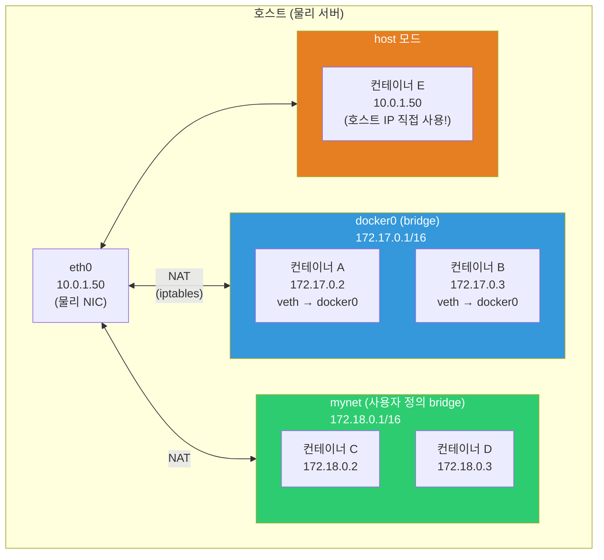
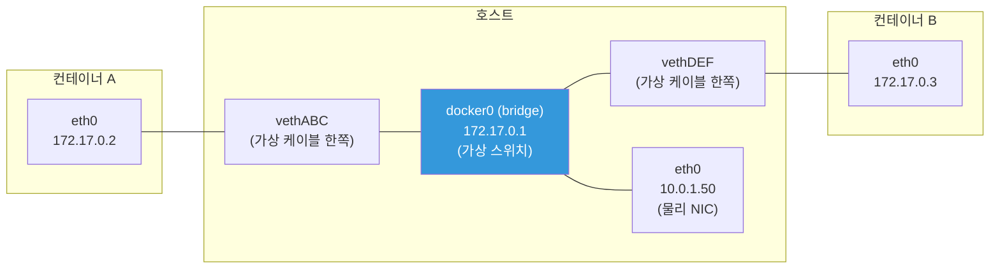
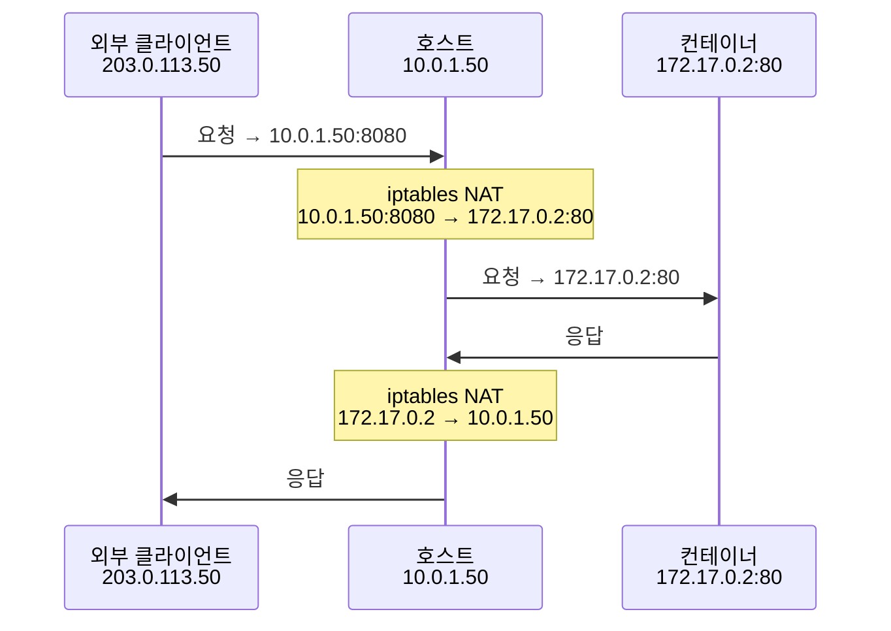
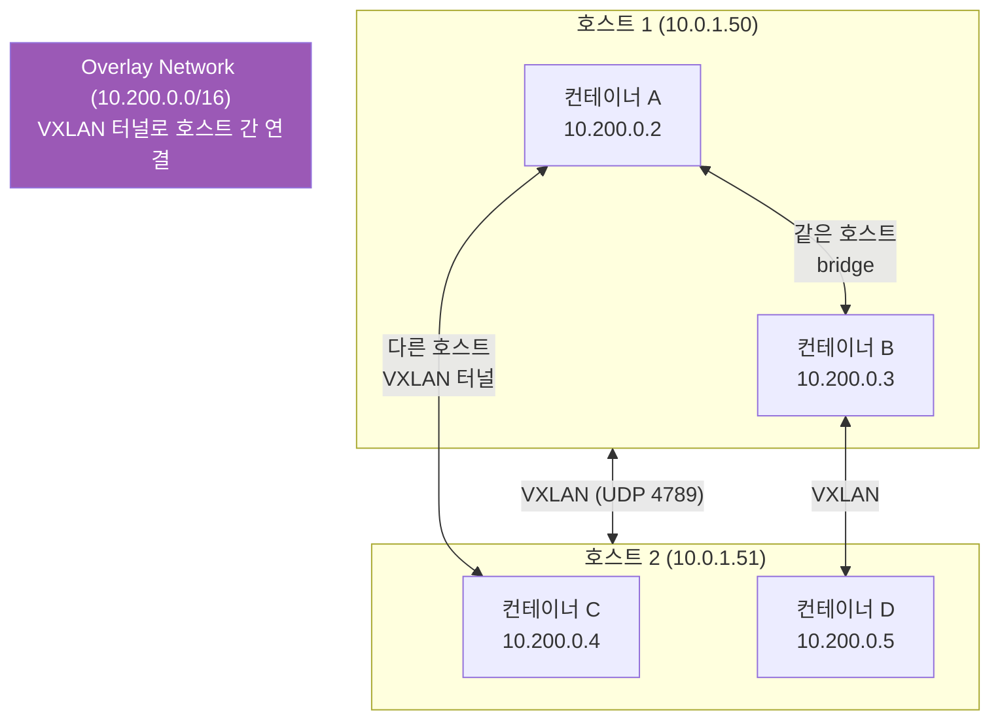
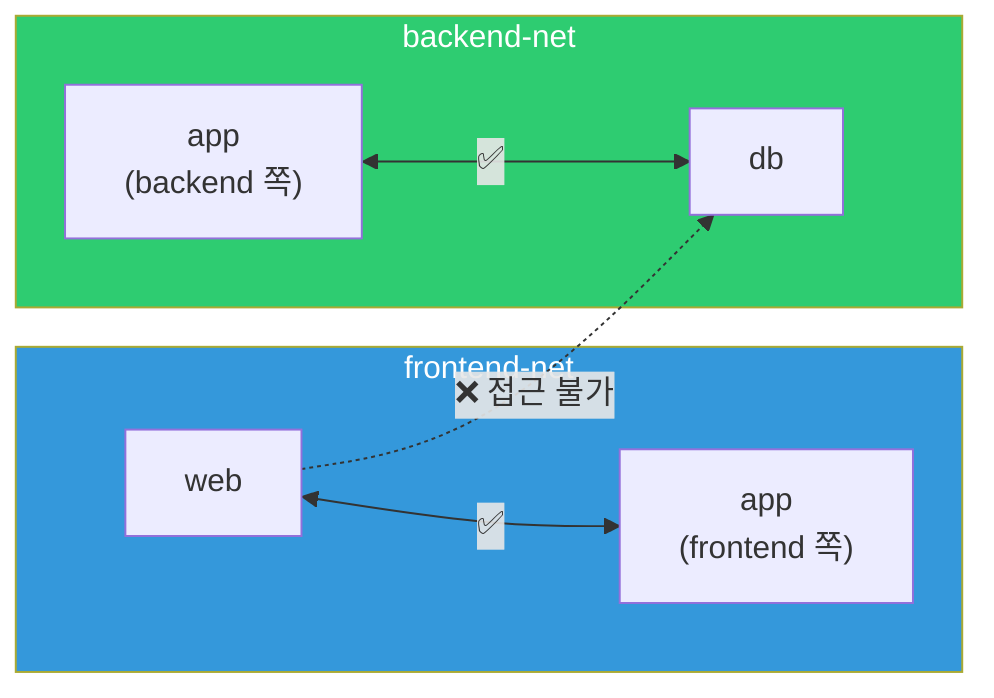

# 컨테이너 네트워크 (bridge / overlay / host)

> 컨테이너 A가 컨테이너 B에 어떻게 패킷을 보낼까요? 호스트와 컨테이너는 어떻게 통신할까요? 외부에서 컨테이너에 어떻게 접근할까요? 컨테이너 네트워크는 [일반 네트워크](../02-networking/04-network-structure)와 원리는 같지만, 가상 인터페이스와 NAT가 추가돼요.

---

## 🎯 이걸 왜 알아야 하나?

```
실무에서 컨테이너 네트워크 지식이 필요한 순간:
• "컨테이너 간 통신이 안 돼요"               → bridge 네트워크 이해
• "외부에서 컨테이너에 접속이 안 돼요"        → 포트 매핑, NAT
• "docker-compose 서비스끼리 이름으로 통신"   → 사용자 정의 네트워크
• K8s Pod 네트워크 이해                      → overlay 네트워크 원리
• "컨테이너에서 localhost가 다르게 동작해요"  → 네트워크 격리 이해
• Docker 네트워크 성능 튜닝                  → host 네트워크 모드
```

---

## 🧠 핵심 개념

### 비유: 사무실 네트워크

컨테이너 네트워크를 **사무실 네트워크**에 비유해볼게요.

* **bridge** = 사무실 내부 스위치. 같은 사무실(호스트) 안의 컨테이너끼리 통신
* **host** = 사무실 벽을 허물고 건물 네트워크에 직접 연결. 격리 없지만 빠름
* **overlay** = 다른 건물(호스트)에 있는 사무실끼리 VPN으로 연결
* **none** = 네트워크 케이블을 뽑음. 완전 격리



---

## 🔍 상세 설명 — bridge 네트워크 (기본)

### bridge 동작 원리

Docker를 설치하면 `docker0`이라는 **가상 브리지(스위치)**가 만들어져요. 컨테이너를 실행하면 **veth 쌍**(가상 이더넷)으로 docker0에 연결돼요.



```bash
# === bridge 네트워크 실제로 보기 ===

# 1. docker0 브리지 확인
ip addr show docker0
# 4: docker0: <BROADCAST,MULTICAST,UP,LOWER_UP> mtu 1500 ...
#     inet 172.17.0.1/16 brd 172.17.255.255 scope global docker0
#          ^^^^^^^^^^^
#          bridge의 게이트웨이 IP

# 2. 컨테이너 실행
docker run -d --name test1 alpine sleep 3600
docker run -d --name test2 alpine sleep 3600

# 3. veth 페어 확인 (호스트에서)
ip link show type veth
# 5: vethABC@if4: <BROADCAST,MULTICAST,UP,LOWER_UP> ...
#     master docker0            ← docker0에 연결됨!
# 7: vethDEF@if6: <BROADCAST,MULTICAST,UP,LOWER_UP> ...
#     master docker0

# 4. 브리지에 연결된 인터페이스 확인
bridge link show
# 5: vethABC@if4: <...> master docker0
# 7: vethDEF@if6: <...> master docker0

# 5. 컨테이너 안에서 네트워크 확인
docker exec test1 ip addr show eth0
# 4: eth0@if5: <BROADCAST,MULTICAST,UP,LOWER_UP> ...
#     inet 172.17.0.2/16 brd 172.17.255.255 scope global eth0
#          ^^^^^^^^^^^
#          컨테이너의 IP

docker exec test1 ip route
# default via 172.17.0.1 dev eth0
# 172.17.0.0/16 dev eth0 scope link src 172.17.0.2
# → 게이트웨이가 172.17.0.1 (docker0)

# 6. 컨테이너 간 통신 테스트
docker exec test1 ping -c 2 172.17.0.3
# PING 172.17.0.3 (172.17.0.3): 56 data bytes
# 64 bytes from 172.17.0.3: seq=0 ttl=64 time=0.100 ms
# → 같은 bridge에 있으니까 직접 통신! ✅

# ⚠️ 기본 bridge에서는 이름으로 통신 안 됨!
docker exec test1 ping -c 2 test2
# ping: bad address 'test2'    ← DNS 해석 실패! ❌

# 7. 정리
docker rm -f test1 test2
```

### 사용자 정의 bridge (★ 실무에서 반드시 쓰세요!)

```bash
# 사용자 정의 bridge를 쓰면:
# ✅ 컨테이너 이름으로 DNS 해석됨!
# ✅ 네트워크 격리 (다른 bridge의 컨테이너와 격리)
# ✅ 연결/분리가 자유로움

# 1. 네트워크 생성
docker network create myapp-net
# → 172.18.0.0/16 같은 새 서브넷이 할당됨

docker network inspect myapp-net --format '{{range .IPAM.Config}}{{.Subnet}}{{end}}'
# 172.18.0.0/16

# 2. 컨테이너를 이 네트워크에 연결
docker run -d --name app --network myapp-net alpine sleep 3600
docker run -d --name db --network myapp-net alpine sleep 3600

# 3. 이름으로 통신 가능! ✅
docker exec app ping -c 2 db
# PING db (172.18.0.3): 56 data bytes
# 64 bytes from 172.18.0.3: seq=0 ttl=64 time=0.089 ms
# → "db"라는 이름으로 DNS 해석됨!

# 4. Docker 내장 DNS 확인
docker exec app cat /etc/resolv.conf
# nameserver 127.0.0.11
# → 127.0.0.11 = Docker 내장 DNS 서버
# → 같은 네트워크의 컨테이너 이름을 IP로 해석

docker exec app nslookup db
# Server:    127.0.0.11
# Name:      db
# Address 1: 172.18.0.3 db.myapp-net
# → "db" → 172.18.0.3 해석! ✅

# 5. 다른 네트워크의 컨테이너와는 격리됨
docker run -d --name other --network bridge alpine sleep 3600
docker exec other ping -c 1 172.18.0.2
# → 타임아웃! (다른 네트워크라서)

# 6. 정리
docker rm -f app db other
docker network rm myapp-net
```

### 기본 bridge vs 사용자 정의 bridge 비교

| 항목 | 기본 bridge (docker0) | 사용자 정의 bridge |
|------|----------------------|-------------------|
| DNS 해석 | ❌ (IP로만 통신) | ✅ (이름으로 통신) |
| 자동 연결 | ✅ (기본값) | --network 명시 필요 |
| 격리 | 모든 기본 컨테이너 공유 | 네트워크별 격리 |
| 런타임 연결/분리 | ❌ | ✅ `docker network connect/disconnect` |
| 실무 추천 | ❌ 비추 | ⭐ 항상 이걸 쓰세요! |

---

## 🔍 상세 설명 — 포트 매핑과 NAT

### 외부에서 컨테이너에 접근하기

컨테이너의 IP(172.17.x.x)는 **호스트 외부에서 접근 불가**예요. 외부에서 접근하려면 **포트 매핑**이 필요해요.



```bash
# 포트 매핑 (-p 호스트:컨테이너)
docker run -d -p 8080:80 --name web nginx
# → 호스트의 8080 포트 → 컨테이너의 80 포트

# iptables NAT 규칙 확인 (Docker가 자동으로 만듦)
sudo iptables -t nat -L -n | grep 8080
# DNAT  tcp  --  0.0.0.0/0  0.0.0.0/0  tcp dpt:8080 to:172.17.0.2:80
# → 8080으로 오는 TCP를 172.17.0.2:80으로 DNAT!

# 외부에서 접근
curl http://10.0.1.50:8080
# Welcome to nginx!  ← 컨테이너의 Nginx가 응답!

# 포트 매핑 확인
docker port web
# 80/tcp -> 0.0.0.0:8080
#            ^^^^^^^^
#            모든 인터페이스에서 수신

# 특정 IP에만 바인딩 (보안!)
docker run -d -p 127.0.0.1:8080:80 --name local-only nginx
# → localhost에서만 접근 가능! 외부에서 접근 불가

docker run -d -p 10.0.1.50:8080:80 --name specific nginx
# → 특정 IP에서만 접근 가능

# 정리
docker rm -f web local-only specific 2>/dev/null
```

### 컨테이너에서 외부로 나가기 (SNAT/MASQUERADE)

```bash
# 컨테이너가 인터넷에 접근할 때:
# 컨테이너(172.17.0.2) → NAT(MASQUERADE) → 호스트 IP(10.0.1.50) → 인터넷

# Docker가 만든 MASQUERADE 규칙
sudo iptables -t nat -L POSTROUTING -n -v | grep docker
# MASQUERADE  all  --  *    !docker0  172.17.0.0/16  0.0.0.0/0
# → 172.17.x.x에서 docker0 밖으로 나가는 패킷의 출발지를 호스트 IP로 변환

# 확인: 컨테이너에서 외부 접속
docker run --rm alpine wget -qO- ifconfig.me
# 10.0.1.50    ← 호스트의 공인 IP가 나옴 (NAT 됨!)
```

---

## 🔍 상세 설명 — host 네트워크 모드

### host 모드란?

컨테이너가 호스트의 네트워크 스택을 **직접 사용**해요. 격리 없이 호스트 네트워크에 바로 붙어요.

```bash
# host 모드 실행
docker run -d --network host --name web-host nginx
# → 포트 매핑 불필요! Nginx가 호스트의 80번 포트에 직접 바인딩

# 호스트의 네트워크를 그대로 사용
docker exec web-host ip addr show eth0
# → 호스트의 eth0이 보임! (172.17.x.x가 아니라 10.0.1.50)

# 접근
curl http://localhost:80
# Welcome to nginx!    ← 포트 매핑 없이 직접!

ss -tlnp | grep 80
# LISTEN  0.0.0.0:80  ... nginx
# → 호스트의 80 포트를 Nginx가 직접 점유

docker rm -f web-host
```

**host 모드 장단점:**

| 장점 | 단점 |
|------|------|
| NAT 오버헤드 없음 → **성능 최고** | 네트워크 격리 없음 |
| 포트 매핑 불필요 | 포트 충돌 위험 (호스트 포트 점유) |
| 레이턴시 최소 | 보안 약함 (호스트 네트워크 노출) |
| 대량 포트 사용 시 편리 | 이식성 떨어짐 |

```bash
# host 모드를 쓰는 경우:
# ✅ 네트워크 성능이 매우 중요한 경우 (고빈도 트레이딩 등)
# ✅ 대량의 포트를 사용하는 서비스 (모니터링 에이전트 등)
# ✅ 호스트 네트워크를 직접 조작해야 하는 경우

# host 모드를 쓰지 말아야 하는 경우:
# ❌ 일반적인 웹 서비스 (bridge로 충분)
# ❌ 멀티 컨테이너 환경 (포트 충돌)
# ❌ 보안이 중요한 환경
```

---

## 🔍 상세 설명 — overlay 네트워크

### overlay란?

**여러 호스트에 걸친** 컨테이너들이 같은 네트워크에 있는 것처럼 통신할 수 있게 해줘요. Docker Swarm이나 K8s에서 사용해요.



```bash
# Overlay 동작 원리:
# 1. 컨테이너 A(10.200.0.2)가 컨테이너 C(10.200.0.4)에 패킷 전송
# 2. 호스트 1이 패킷을 VXLAN으로 캡슐화
#    원본: src=10.200.0.2 dst=10.200.0.4
#    캡슐: src=10.0.1.50 dst=10.0.1.51 (UDP 4789) + 원본
# 3. 호스트 2가 VXLAN 패킷을 받아서 캡슐 제거
# 4. 원본 패킷을 컨테이너 C에 전달

# 이게 바로 K8s Pod 네트워크(CNI)의 기초!
# → Calico, Flannel, Cilium 등이 이 원리를 사용
# → 04-kubernetes/06-cni에서 상세히 다룸!
```

```bash
# Docker Swarm에서 overlay 네트워크 (교육용):

# overlay 네트워크 생성 (Swarm 초기화 필요)
docker swarm init 2>/dev/null
docker network create --driver overlay --attachable my-overlay

# overlay 네트워크에 컨테이너 연결
docker run -d --name overlay-test --network my-overlay alpine sleep 3600

# 네트워크 정보
docker network inspect my-overlay --format '{{range .IPAM.Config}}{{.Subnet}}{{end}}'
# 10.0.1.0/24    ← overlay 서브넷

# 정리
docker rm -f overlay-test
docker network rm my-overlay
docker swarm leave --force 2>/dev/null
```

---

## 🔍 상세 설명 — none 네트워크

```bash
# none: 네트워크 완전히 없음. 격리된 환경에서 실행.
docker run -d --network none --name isolated alpine sleep 3600

docker exec isolated ip addr
# 1: lo: <LOOPBACK,UP,LOWER_UP> ...
#     inet 127.0.0.1/8 scope host lo
# → lo(루프백)만 있음! eth0 없음!

docker exec isolated ping -c 1 8.8.8.8
# PING 8.8.8.8 (8.8.8.8): 56 data bytes
# ping: sendto: Network unreachable
# → 외부 통신 완전 불가!

# 용도:
# ✅ 보안: 네트워크 접근이 불필요한 배치 작업
# ✅ 테스트: 네트워크 없는 환경 시뮬레이션
# ✅ 데이터 처리: 파일만 처리하고 네트워크 불필요

docker rm -f isolated
```

---

## 🔍 상세 설명 — 네트워크 연결/분리

```bash
# 하나의 컨테이너를 여러 네트워크에 연결할 수 있어요

# 네트워크 2개 생성
docker network create frontend-net
docker network create backend-net

# 앱 서버: 프론트엔드와 백엔드 모두 연결
docker run -d --name app --network frontend-net alpine sleep 3600
docker network connect backend-net app
# → app은 frontend-net + backend-net 둘 다 연결!

# DB: 백엔드만 연결
docker run -d --name db --network backend-net alpine sleep 3600

# 웹서버: 프론트엔드만 연결
docker run -d --name web --network frontend-net alpine sleep 3600

# 통신 테스트:
docker exec web ping -c 1 app    # ✅ 같은 frontend-net
docker exec app ping -c 1 db     # ✅ 같은 backend-net
docker exec web ping -c 1 db     # ❌ 다른 네트워크!

# → web에서 db에 직접 접근 불가! (보안!)
# → app이 중간에서 프록시 역할

# 네트워크에서 분리
docker network disconnect frontend-net app
# → app은 이제 backend-net에만 연결

# 정리
docker rm -f app db web
docker network rm frontend-net backend-net
```



---

## 🔍 상세 설명 — Docker Compose 네트워크

```bash
# Docker Compose는 기본으로 프로젝트 전용 네트워크를 생성

# docker-compose.yml
# services:
#   app:
#     image: myapp
#   db:
#     image: postgres
#   redis:
#     image: redis

docker compose up -d
# Creating network "myproject_default" with the default driver
# → "myproject_default" 네트워크 자동 생성!

# 모든 서비스가 이 네트워크에 자동 연결
docker network inspect myproject_default
# → app, db, redis 모두 연결됨
# → 서비스 이름으로 DNS 해석 가능!

# 앱에서 DB 접근:
# DB_HOST=db        ← 서비스 이름!
# REDIS_HOST=redis   ← 서비스 이름!
```

```yaml
# 여러 네트워크를 명시적으로 정의 (실무 패턴)
services:
  nginx:
    image: nginx
    ports:
      - "80:80"
    networks:
      - frontend

  app:
    image: myapp
    networks:
      - frontend       # Nginx와 통신
      - backend         # DB, Redis와 통신

  db:
    image: postgres
    networks:
      - backend         # app에서만 접근 가능!

  redis:
    image: redis
    networks:
      - backend

networks:
  frontend:
    driver: bridge
  backend:
    driver: bridge
    internal: true      # ← 외부 접근 차단! (인터넷 접속 불가)
```

```bash
# internal 네트워크:
# → 외부(인터넷)로 나가는 NAT가 없음!
# → DB/Redis가 인터넷에 접근할 필요 없으니 보안 강화

docker network create --internal secure-net
docker run --rm --network secure-net alpine ping -c 1 8.8.8.8
# ping: sendto: Network unreachable    ← 외부 접근 차단!

# 하지만 같은 네트워크의 컨테이너끼리는 통신 가능!
```

---

## 🔍 상세 설명 — 컨테이너 DNS

```bash
# Docker 내장 DNS (127.0.0.11)

# 사용자 정의 네트워크에서:
docker network create test-dns
docker run -d --name svc-a --network test-dns alpine sleep 3600
docker run -d --name svc-b --network test-dns alpine sleep 3600

# DNS 확인
docker exec svc-a cat /etc/resolv.conf
# nameserver 127.0.0.11    ← Docker 내장 DNS
# options ndots:0

docker exec svc-a nslookup svc-b
# Server:    127.0.0.11
# Name:      svc-b
# Address 1: 172.18.0.3 svc-b.test-dns

# DNS 별칭 (--network-alias)
docker run -d --name svc-c \
    --network test-dns \
    --network-alias database \
    alpine sleep 3600

docker exec svc-a nslookup database
# Address 1: 172.18.0.4    ← svc-c의 IP
# → "database"라는 별칭으로도 접근 가능!

# 여러 컨테이너에 같은 alias → 라운드 로빈 DNS!
docker run -d --name svc-d --network test-dns --network-alias web alpine sleep 3600
docker run -d --name svc-e --network test-dns --network-alias web alpine sleep 3600

docker exec svc-a nslookup web
# Address 1: 172.18.0.5
# Address 2: 172.18.0.6
# → 2개 IP 반환! (간단한 로드 밸런싱)

# 정리
docker rm -f svc-a svc-b svc-c svc-d svc-e
docker network rm test-dns
```

---

## 💻 실습 예제

### 실습 1: bridge 네트워크 탐색

```bash
# 1. 기본 bridge 확인
docker network inspect bridge --format '{{range .IPAM.Config}}Subnet: {{.Subnet}} Gateway: {{.Gateway}}{{end}}'
# Subnet: 172.17.0.0/16 Gateway: 172.17.0.1

# 2. 호스트에서 docker0 확인
ip addr show docker0

# 3. 컨테이너 2개 실행
docker run -d --name a alpine sleep 3600
docker run -d --name b alpine sleep 3600

# 4. veth 쌍 관찰
ip link show type veth

# 5. 컨테이너 IP 확인
docker inspect a --format '{{.NetworkSettings.IPAddress}}'
# 172.17.0.2
docker inspect b --format '{{.NetworkSettings.IPAddress}}'
# 172.17.0.3

# 6. 통신 테스트
docker exec a ping -c 2 172.17.0.3    # IP로는 ✅
docker exec a ping -c 2 b              # 이름으로는 ❌ (기본 bridge)

# 7. 정리
docker rm -f a b
```

### 실습 2: 사용자 정의 네트워크로 서비스 구성

```bash
# 웹 + API + DB 3-tier 구성

# 1. 네트워크 생성
docker network create web-tier
docker network create data-tier

# 2. DB (data-tier만)
docker run -d --name postgres \
    --network data-tier \
    -e POSTGRES_PASSWORD=secret \
    postgres:16-alpine

# 3. API 서버 (양쪽 다)
docker run -d --name api \
    --network data-tier \
    -e DB_HOST=postgres \
    alpine sleep 3600
docker network connect web-tier api

# 4. 웹 서버 (web-tier만)
docker run -d --name web \
    --network web-tier \
    -p 8080:80 \
    nginx

# 5. 통신 테스트
docker exec api ping -c 1 postgres    # ✅ (같은 data-tier)
docker exec web ping -c 1 api         # ✅ (같은 web-tier)
docker exec web ping -c 1 postgres    # ❌ (다른 네트워크!)
# → web에서 DB에 직접 접근 불가! 보안 ✅

# 6. 정리
docker rm -f web api postgres
docker network rm web-tier data-tier
```

### 실습 3: host 모드 vs bridge 모드 성능 비교

```bash
# 1. bridge 모드 (NAT 경유)
docker run -d --name bench-bridge -p 8080:80 nginx
time curl -s http://localhost:8080/ > /dev/null
# real    0m0.010s

# 2. host 모드 (NAT 없이 직접)
docker run -d --network host --name bench-host nginx
time curl -s http://localhost:80/ > /dev/null
# real    0m0.005s    ← 약간 더 빠름 (NAT 없으니)

# 대량 요청에서 차이가 더 큼:
# bridge: 100K req → ~10% 오버헤드
# host:   100K req → 네이티브 성능

# 정리
docker rm -f bench-bridge bench-host
```

### 실습 4: iptables로 NAT 규칙 관찰

```bash
# 1. 컨테이너 실행 (포트 매핑)
docker run -d -p 9090:80 --name nat-test nginx

# 2. Docker가 만든 NAT 규칙 확인
sudo iptables -t nat -L -n -v | grep -A 2 "DOCKER"
# Chain DOCKER (2 references)
#  pkts bytes target  prot opt in  out  source    destination
#     5  300   DNAT   tcp  --  !docker0 *  0.0.0.0/0  0.0.0.0/0  tcp dpt:9090 to:172.17.0.2:80
#              ^^^^                                                ^^^^^^^^^^^^^^^^^^^^^^^^^^
#              DNAT!                                               호스트 9090 → 컨테이너 80

# MASQUERADE 규칙 (컨테이너 → 외부)
sudo iptables -t nat -L POSTROUTING -n -v | grep docker
# MASQUERADE  all  --  *  !docker0  172.17.0.0/16  0.0.0.0/0
#             ^^^^^^^^^^^^^^^^^^^^^^^^^^^^^^^^^^^
#             컨테이너 → 외부 시 호스트 IP로 변환

# 3. 정리
docker rm -f nat-test
```

---

## 🏢 실무에서는?

### 시나리오 1: "컨테이너에서 localhost가 안 돼요"

```bash
# 앱 컨테이너에서 DB를 localhost:5432로 접속 시도 → 실패!

# 원인: 컨테이너의 localhost(127.0.0.1) = 컨테이너 자신!
# → 호스트의 DB가 아님!

# 해결 1: Docker Compose 사용 (서비스 이름으로)
# DB_HOST=db (localhost가 아님!)

# 해결 2: host.docker.internal (Docker Desktop)
# DB_HOST=host.docker.internal    ← 호스트를 가리키는 특수 DNS
# Linux에서: docker run --add-host=host.docker.internal:host-gateway ...

# 해결 3: host 네트워크 모드
# docker run --network host myapp    ← 호스트 네트워크 직접 사용

# 해결 4: 호스트 IP를 직접 사용
# DB_HOST=10.0.1.50    ← 호스트의 실제 IP (비추, 하드코딩)
```

### 시나리오 2: "docker-compose 서비스끼리 통신이 안 돼요"

```bash
# 원인 1: 서비스 이름 오타
# DB_HOST=postgres → DB_HOST=postgress (오타!)
# → docker compose logs app 에서 에러 확인

# 원인 2: depends_on이 없어서 순서 문제
# 앱이 먼저 시작되고 DB가 아직 안 올라옴
# → depends_on + healthcheck 설정

# 원인 3: 다른 네트워크에 있음
# → docker network inspect로 확인
docker compose exec app nslookup db
# → 해석 안 되면 네트워크 설정 확인

# 원인 4: 방화벽/SELinux
# → 호스트의 iptables나 SELinux가 Docker 네트워크를 차단
```

### 시나리오 3: 컨테이너 네트워크 성능 이슈

```bash
# "컨테이너 간 통신이 느려요"

# 1. 네트워크 모드 확인
docker inspect myapp --format '{{.HostConfig.NetworkMode}}'
# default    ← bridge (NAT 경유)

# 2. 같은 호스트인지 확인
# 같은 호스트의 컨테이너: bridge로 직접 통신 (빠름)
# 다른 호스트의 컨테이너: overlay/VXLAN (캡슐화 오버헤드)

# 3. MTU 문제 확인
docker exec myapp ip link show eth0
# mtu 1500    ← 기본
# → VXLAN overlay에서는 1450이 적절 (캡슐화 오버헤드)

# 4. 해결:
# a. 성능 극대화 필요 → host 네트워크 모드
# b. MTU 조정 → docker network create --opt com.docker.network.driver.mtu=1450 mynet
# c. K8s에서는 CNI 플러그인 선택이 중요 (Cilium이 eBPF로 빠름)
```

---

## ⚠️ 자주 하는 실수

### 1. 기본 bridge에서 이름 통신 시도

```bash
# ❌ 기본 bridge에서는 DNS 해석 안 됨!
docker run -d --name a alpine sleep 3600
docker run -d --name b alpine sleep 3600
docker exec a ping b    # bad address 'b'!

# ✅ 사용자 정의 네트워크 사용
docker network create mynet
docker run -d --name a --network mynet alpine sleep 3600
docker run -d --name b --network mynet alpine sleep 3600
docker exec a ping b    # 성공!
```

### 2. 포트 매핑에서 0.0.0.0으로 노출

```bash
# ❌ 모든 인터페이스에 노출 (외부에서 접근 가능!)
docker run -d -p 3306:3306 mysql
# → 인터넷에서 DB에 직접 접속 가능! 보안 위험!

# ✅ 필요한 인터페이스만
docker run -d -p 127.0.0.1:3306:3306 mysql    # 로컬만
docker run -d -p 10.0.1.50:3306:3306 mysql     # 특정 IP만
```

### 3. 컨테이너의 localhost를 호스트로 착각

```bash
# ❌ 컨테이너에서 localhost = 컨테이너 자신!
docker exec myapp curl http://localhost:5432
# → 컨테이너 안의 5432를 찾음 (호스트가 아님!)

# ✅ Docker Compose에서는 서비스 이름 사용
# DB_HOST=db (localhost가 아님!)
```

### 4. internal 네트워크를 설정 안 하기

```bash
# ❌ DB 컨테이너가 인터넷에 접근 가능
# → DB가 외부로 데이터를 유출할 수 있음!

# ✅ DB/Redis는 internal 네트워크에
docker network create --internal data-net
docker run -d --network data-net --name db postgres
# → DB가 인터넷에 접근 불가! 보안 강화
```

### 5. 네트워크를 정리 안 해서 쌓임

```bash
# 삭제된 compose 프로젝트의 네트워크가 계속 남아있음
docker network ls
# myproject1_default
# myproject2_default
# test_net
# old_project_default
# ...

# ✅ 주기적으로 정리
docker network prune
# Deleted Networks:
# myproject1_default
# old_project_default
```

---

## 📝 정리

### 네트워크 드라이버 선택 가이드

```
bridge (사용자 정의):  대부분의 경우 ⭐ (이름 통신, 격리)
host:                 성능 최우선, 격리 불필요
overlay:              멀티 호스트 (Swarm, K8s CNI)
none:                 네트워크 완전 격리
macvlan:              컨테이너에 물리 네트워크 IP 부여
```

### 핵심 명령어

```bash
docker network ls                       # 네트워크 목록
docker network create NAME              # 생성 (⭐ 항상 사용자 정의!)
docker network inspect NAME             # 상세 정보
docker network connect NET CONTAINER    # 컨테이너를 네트워크에 연결
docker network disconnect NET CONTAINER # 분리
docker network rm NAME                  # 삭제
docker network prune                    # 미사용 삭제

docker run --network NAME               # 네트워크 지정
docker run -p HOST:CONTAINER            # 포트 매핑
docker run --network host               # host 모드
```

### 디버깅 명령어

```bash
# 컨테이너 IP 확인
docker inspect CONTAINER --format '{{range .NetworkSettings.Networks}}{{.IPAddress}}{{end}}'

# 컨테이너 내부 네트워크
docker exec CONTAINER ip addr
docker exec CONTAINER cat /etc/resolv.conf
docker exec CONTAINER nslookup SERVICE_NAME

# 호스트에서 veth/bridge 확인
ip link show type veth
bridge link show
sudo iptables -t nat -L -n | grep DOCKER
```

---

## 🔗 다음 강의

다음은 **[06-image-optimization](./06-image-optimization)** — 이미지 최적화 (multi-stage / distroless / multi-arch) 이에요.

[Dockerfile 강의](./03-dockerfile)에서 기본을 배웠으니, 이제 이미지를 극한까지 최적화하는 고급 기법을 다뤄볼게요. distroless, 멀티 아키텍처 빌드, BuildKit 고급 기능까지 배워볼 거예요.
