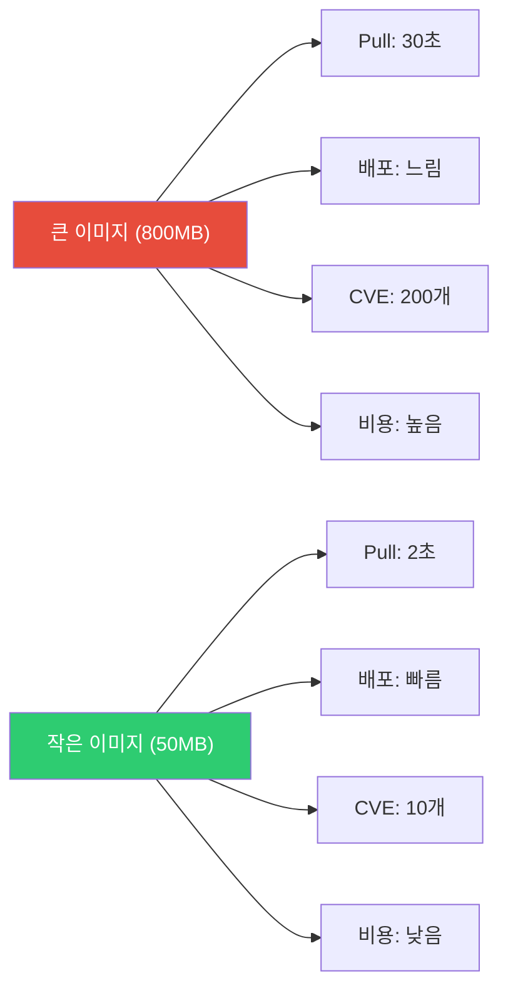
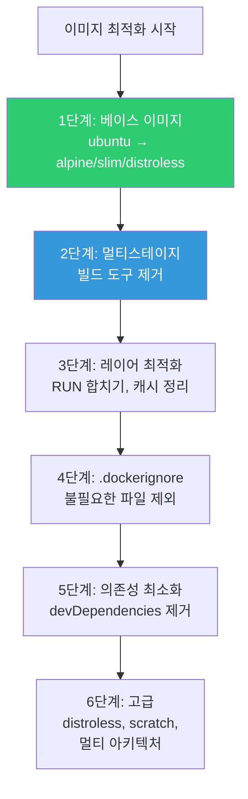
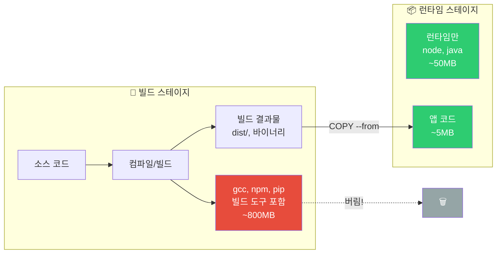
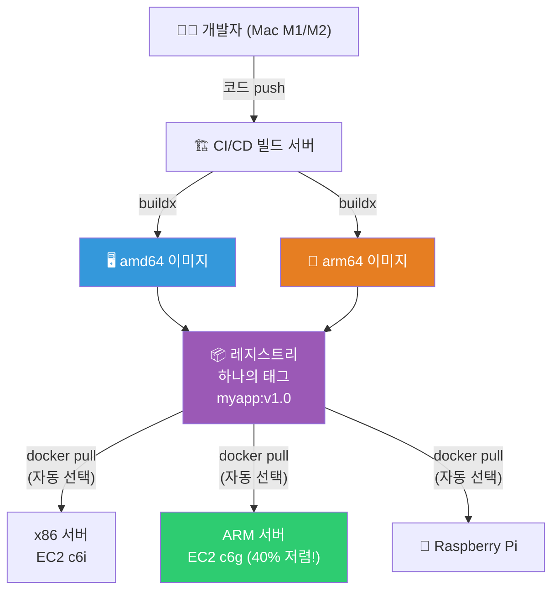

# 이미지 최적화 (multi-stage / distroless / multi-arch)

> [Dockerfile 강의](./03-dockerfile)에서 기본을 배웠다면, 이번에는 이미지를 **극한까지 최적화**하는 고급 기법이에요. 이미지가 작을수록 pull 빠르고, 배포 빠르고, 스케일링 빠르고, 보안 취약점도 적어요. 실무에서 "이미지 줄여주세요"는 정말 자주 듣는 요청이에요.

---

## 🎯 이걸 왜 알아야 하나?

```
이미지 최적화의 실질적 효과:
• 배포 속도: 800MB pull → 50MB pull = 10배 빠름
• CI/CD 시간: 빌드+push+pull 전부 빨라짐
• 스케일링: K8s에서 새 Pod 시작 시 이미지 pull 시간이 핵심
• 비용: ECR/레지스트리 저장 비용 + 데이터 전송 비용
• 보안: 패키지가 적을수록 CVE(취약점)가 적음
• 콜드 스타트: Lambda/Fargate에서 이미지 크기 = 시작 시간
```

---

## 🧠 핵심 개념

### 비유: 해외여행 짐 싸기

이미지 최적화는 **해외여행 짐 싸기**와 똑같아요.

처음 여행할 때는 "혹시 몰라서" 이것저것 다 챙겨요 — 두꺼운 책, 드라이어, 여분의 옷, 노트북 거치대... 결과: 캐리어 30kg, 공항에서 추가 요금, 이동할 때마다 힘들어요.

경험 많은 여행자는? 딱 필요한 것만 챙겨요. 옷은 3벌, 세면도구는 미니 사이즈, 책은 e-book. 결과: 배낭 하나, 기동성 최고, 어디든 빠르게 이동!

```
컨테이너 이미지도 마찬가지:
┌──────────────────────────────────────────────┐
│  초보자의 이미지 (= 짐 30kg 캐리어)          │
│  ✗ 빌드 도구 (gcc, make) → 여행 안내 책 10권 │
│  ✗ 디버깅 도구 (vim, curl) → 만약을 위한 우산 │
│  ✗ devDependencies → 안 입을 옷 10벌          │
│  ✗ OS 패키지 전체 → 여행용이 아닌 대형 세면도구│
│  결과: 1.5GB, pull 느림, CVE 200개            │
├──────────────────────────────────────────────┤
│  최적화된 이미지 (= 배낭 하나)               │
│  ✓ 런타임만 (node, java) → 여권 + 지갑       │
│  ✓ 앱 코드만 → 실제 입을 옷 3벌              │
│  ✓ production 의존성만 → 꼭 필요한 세면도구   │
│  결과: 50MB, pull 2초, CVE 5개               │
└──────────────────────────────────────────────┘
```

**멀티스테이지 빌드**는 "호텔에서 짐 정리"예요 — 여행지에서 쓸 것만 작은 가방에 옮기고, 큰 캐리어는 놔두고 가는 거죠. **distroless**는 아예 "지갑과 폰만 들고 나가기"고요!

### 이미지 크기가 중요한 이유



### 최적화 전략 순서



---

## 🔍 상세 설명 — 베이스 이미지 최적화

### 베이스별 크기 비교 (실측)

```bash
# 같은 Node.js 앱, 베이스만 다르게:

# 1. Debian 기반 (기본)
FROM node:20
# → 이미지 크기: ~1.1GB

# 2. Slim (Debian 최소)
FROM node:20-slim
# → 이미지 크기: ~250MB (77% 감소!)

# 3. Alpine (musl libc 기반)
FROM node:20-alpine
# → 이미지 크기: ~130MB (88% 감소!)

# 실측:
docker pull node:20 && docker images node:20 --format '{{.Size}}'
# 1.1GB
docker pull node:20-slim && docker images node:20-slim --format '{{.Size}}'
# 250MB
docker pull node:20-alpine && docker images node:20-alpine --format '{{.Size}}'
# 130MB
```

### Alpine 주의사항

```bash
# Alpine은 glibc 대신 musl libc를 사용
# → 대부분의 앱은 문제없지만, 일부 네이티브 바이너리가 호환 안 될 수 있음

# 문제가 되는 경우:
# - Python에서 C 확장 모듈 빌드 시
# - Node.js에서 native addon (sharp, bcrypt 등)
# - DNS 해석 차이 (musl의 DNS resolver가 다름)

# 해결:
# 1. Alpine에서 빌드가 안 되면 slim 사용
# 2. 멀티스테이지로 Alpine에서 빌드 후 Alpine에서 실행
# 3. --platform linux/amd64로 아키텍처 명시

# Python + Alpine 예시 (빌드 의존성 필요):
FROM python:3.12-alpine
RUN apk add --no-cache gcc musl-dev libffi-dev
# → 빌드 후 불필요한 패키지 제거 → 또는 멀티스테이지!

# 실무 추천:
# Node.js, Go → Alpine ✅ (거의 문제 없음)
# Python → slim 또는 Alpine + 빌드 의존성
# Java → slim (Eclipse Temurin slim)
# 네이티브 바이너리 → slim (더 안전)
```

### distroless — 극한의 최소 이미지

```bash
# Google이 만든 distroless 이미지
# → OS 도구가 거의 없음! 쉘(bash/sh)도 없음!
# → 앱 실행에 필요한 런타임만 포함

# distroless 이미지 종류:
# gcr.io/distroless/static-debian12     → 정적 바이너리용 (Go)
# gcr.io/distroless/base-debian12       → C 라이브러리 포함
# gcr.io/distroless/java21-debian12     → Java 21 런타임만
# gcr.io/distroless/nodejs20-debian12   → Node.js 20 런타임만
# gcr.io/distroless/python3-debian12    → Python 3 런타임만

# 크기 비교:
# node:20         → 1.1GB
# node:20-alpine  → 130MB
# distroless/nodejs20 → ~120MB (Alpine과 비슷하지만 보안이 더 강함!)

# distroless의 진짜 장점 = 보안!
# → 쉘이 없으니 docker exec로 쉘 접속 불가
# → 공격자가 컨테이너에 들어와도 할 수 있는 게 없음
# → 패키지 매니저(apt/apk)도 없으니 추가 도구 설치 불가
```

```dockerfile
# distroless Node.js 예시
FROM node:20-alpine AS builder
WORKDIR /app
COPY package.json package-lock.json ./
RUN npm ci --production
COPY . .

FROM gcr.io/distroless/nodejs20-debian12
WORKDIR /app
COPY --from=builder /app .
EXPOSE 3000
CMD ["server.js"]
# → CMD에서 "node"를 안 쓰고 "server.js"만!
# → distroless/nodejs는 node가 ENTRYPOINT로 내장

# 디버깅이 필요하면 debug 태그 사용:
# FROM gcr.io/distroless/nodejs20-debian12:debug
# → busybox 쉘이 포함됨 (프로덕션에서는 쓰지 마세요)
```

```dockerfile
# distroless Go 예시 (가장 극적인 효과!)
FROM golang:1.22-alpine AS builder
WORKDIR /app
COPY . .
RUN CGO_ENABLED=0 go build -ldflags="-s -w" -o /server .
# -ldflags="-s -w": 디버그 정보 제거 → 바이너리 30% 작아짐

FROM gcr.io/distroless/static-debian12
COPY --from=builder /server /server
ENTRYPOINT ["/server"]

# 크기: ~10MB!
# golang:1.22-alpine 빌더: 300MB → 최종: 10MB!

# 더 극한: scratch (완전 빈 이미지)
FROM scratch
COPY --from=builder /server /server
COPY --from=builder /etc/ssl/certs/ca-certificates.crt /etc/ssl/certs/
ENTRYPOINT ["/server"]
# 크기: ~8MB! (TLS 인증서만 포함)
```

---

## 🔍 상세 설명 — 멀티스테이지 고급 기법

### 멀티스테이지 빌드의 원리

앞서 distroless 예시에서 멀티스테이지를 잠깐 봤는데, 여기서는 **고급 기법**을 깊이 다룰게요.



> 빌드에 필요한 도구(800MB)는 버리고, 결과물(5MB)만 깨끗한 런타임 이미지로 가져오는 거예요!

### 병렬 멀티스테이지 (BuildKit)

```dockerfile
# BuildKit은 독립적인 스테이지를 병렬로 빌드!

# Stage 1: 프론트엔드 빌드 ──┐
# Stage 2: 백엔드 빌드   ──┤── 동시에!
# Stage 3: 최종 이미지     ←─┘

# syntax=docker/dockerfile:1
FROM node:20-alpine AS frontend
WORKDIR /frontend
COPY frontend/package*.json ./
RUN npm ci
COPY frontend/ .
RUN npm run build

FROM python:3.12-slim AS backend
WORKDIR /backend
COPY backend/requirements.txt .
RUN pip install --no-cache-dir -r requirements.txt
COPY backend/ .

FROM python:3.12-slim AS runtime
WORKDIR /app
COPY --from=backend /backend .
COPY --from=backend /usr/local/lib/python3.12/site-packages /usr/local/lib/python3.12/site-packages
COPY --from=frontend /frontend/build ./static

RUN adduser --system --no-create-home appuser
USER appuser
EXPOSE 8000
CMD ["gunicorn", "--bind", "0.0.0.0:8000", "app:app"]

# BuildKit이 frontend와 backend를 동시에 빌드!
# → 빌드 시간 ~40% 단축
```

### 빌드 캐시 마운트 (BuildKit 고급)

```dockerfile
# syntax=docker/dockerfile:1

# === pip 캐시 마운트 ===
FROM python:3.12-slim
WORKDIR /app
COPY requirements.txt .
RUN --mount=type=cache,target=/root/.cache/pip \
    pip install -r requirements.txt
# → pip 캐시가 빌드 간 재사용됨!
# → 같은 패키지를 다시 다운로드 안 함

# === npm 캐시 마운트 ===
FROM node:20-alpine
WORKDIR /app
COPY package*.json ./
RUN --mount=type=cache,target=/root/.npm \
    npm ci --production
# → npm 캐시 재사용

# === apt 캐시 마운트 ===
FROM ubuntu:22.04
RUN --mount=type=cache,target=/var/cache/apt \
    --mount=type=cache,target=/var/lib/apt \
    apt-get update && apt-get install -y curl git
# → apt 캐시가 빌드 간 유지됨 (rm -rf /var/lib/apt/lists/* 불필요!)

# === 시크릿 마운트 (빌드 중에만 사용, 이미지에 안 남음!) ===
FROM node:20-alpine
RUN --mount=type=secret,id=npmrc,target=/root/.npmrc \
    npm ci
# → .npmrc가 빌드 중에만 사용되고 이미지 레이어에 안 남음!
# 빌드: docker build --secret id=npmrc,src=.npmrc .
```

### 바이너리 크기 최적화

```bash
# Go: ldflags로 디버그 정보 제거
RUN CGO_ENABLED=0 go build -ldflags="-s -w" -o /app/server .
# -s: 심볼 테이블 제거
# -w: DWARF 디버그 정보 제거
# → 바이너리 크기 ~30% 감소!

# Go: UPX로 바이너리 압축 (선택)
RUN apk add --no-cache upx && \
    go build -ldflags="-s -w" -o /app/server . && \
    upx --best /app/server
# → 추가 50~70% 감소! (하지만 시작 시간 약간 증가)

# Java: jlink로 커스텀 JRE 만들기
FROM eclipse-temurin:21-jdk-alpine AS builder
COPY . /app
WORKDIR /app
RUN ./gradlew bootJar --no-daemon
# 커스텀 JRE (필요한 모듈만!)
RUN jlink \
    --add-modules java.base,java.logging,java.sql,java.naming,java.management \
    --strip-debug \
    --no-man-pages \
    --no-header-files \
    --compress=2 \
    --output /custom-jre

FROM debian:bookworm-slim
COPY --from=builder /custom-jre /opt/java
COPY --from=builder /app/build/libs/*.jar /app/app.jar
ENV PATH="/opt/java/bin:${PATH}"
CMD ["java", "-jar", "/app/app.jar"]
# 전체 JRE: 200MB → 커스텀 JRE: ~50MB!
```

---

## 🔍 상세 설명 — 멀티 아키텍처 빌드

### 왜 멀티 아키텍처가 필요한가?



> 하나의 이미지 태그로 x86, ARM 서버 모두 지원 — 마치 **유니버설 충전기**처럼, 어떤 콘센트에 꽂아도 작동하는 거예요!

```bash
# ARM 서버가 급증하고 있어요:
# - AWS Graviton (ARM64) → x86보다 40% 가성비 좋음!
# - Apple Silicon (M1/M2/M3) → 개발자 맥이 ARM
# - Raspberry Pi, IoT 디바이스

# 문제:
# x86(amd64)에서 빌드한 이미지 → ARM 서버에서 안 돌아감!
# ARM에서 빌드한 이미지 → x86 서버에서 안 돌아감!

# 해결: 멀티 아키텍처 이미지!
# → 하나의 이미지 태그에 여러 아키텍처 포함
# → docker pull 시 자동으로 맞는 아키텍처 선택

# 확인:
docker manifest inspect nginx:latest | grep architecture
# "architecture": "amd64"
# "architecture": "arm64"
# "architecture": "arm"
# → nginx:latest 하나로 amd64, arm64, arm 전부 지원!
```

### docker buildx로 멀티 아키텍처 빌드

```bash
# buildx: Docker의 멀티 플랫폼 빌드 도구

# 1. buildx 빌더 생성
docker buildx create --name multiarch --driver docker-container --use
docker buildx inspect --bootstrap
# Platforms: linux/amd64, linux/arm64, linux/arm/v7, linux/arm/v6, ...

# 2. 멀티 아키텍처 빌드 + push
docker buildx build \
    --platform linux/amd64,linux/arm64 \
    -t myrepo/myapp:v1.0 \
    --push \
    .
# → amd64와 arm64 이미지를 동시에 빌드하고 레지스트리에 push!

# 3. 확인
docker manifest inspect myrepo/myapp:v1.0
# {
#   "manifests": [
#     {
#       "platform": {"architecture": "amd64", "os": "linux"},
#       "digest": "sha256:abc123..."
#     },
#     {
#       "platform": {"architecture": "arm64", "os": "linux"},
#       "digest": "sha256:def456..."
#     }
#   ]
# }

# 4. pull 시 자동 선택
# x86 서버에서: docker pull myrepo/myapp:v1.0 → amd64 이미지
# ARM 서버에서: docker pull myrepo/myapp:v1.0 → arm64 이미지
# → 같은 태그, 자동 선택!
```

### 멀티 아키텍처 Dockerfile 팁

```dockerfile
# 대부분의 Dockerfile은 수정 없이 멀티 아키텍처 빌드 가능!
# → 베이스 이미지가 멀티 아키텍처를 지원하면 OK

# ⚠️ 주의할 점:
# 1. 아키텍처별 바이너리 다운로드
ARG TARGETARCH    # buildx가 자동으로 설정 (amd64, arm64)
RUN wget https://example.com/tool-${TARGETARCH}.tar.gz

# 2. Go 크로스 컴파일
ARG TARGETOS TARGETARCH
RUN GOOS=${TARGETOS} GOARCH=${TARGETARCH} go build -o /app/server .
# → buildx가 TARGETOS, TARGETARCH를 자동으로 설정!

# 3. 네이티브 빌드가 필요한 경우
# → QEMU 에뮬레이션 사용 (느리지만 호환)
# → 또는 CI/CD에서 네이티브 ARM 빌더 사용
```

```bash
# CI/CD에서 멀티 아키텍처 빌드 (GitHub Actions 예시)

# .github/workflows/build.yml
# name: Build Multi-Arch
# jobs:
#   build:
#     runs-on: ubuntu-latest
#     steps:
#     - uses: docker/setup-qemu-action@v3        # QEMU (ARM 에뮬레이션)
#     - uses: docker/setup-buildx-action@v3      # buildx
#     - uses: docker/build-push-action@v5
#       with:
#         platforms: linux/amd64,linux/arm64
#         push: true
#         tags: myrepo/myapp:${{ github.sha }}
#         cache-from: type=gha
#         cache-to: type=gha,mode=max

# → amd64 + arm64 이미지를 CI에서 자동 빌드!
# → AWS Graviton(ARM) 인스턴스에서도 바로 사용 가능!
```

---

## 🔍 상세 설명 — 이미지 분석 도구

### dive — 이미지 레이어 분석

```bash
# dive: 이미지의 각 레이어를 시각적으로 분석
# 설치
# wget https://github.com/wagoodman/dive/releases/download/v0.12.0/dive_0.12.0_linux_amd64.deb
# sudo apt install ./dive_0.12.0_linux_amd64.deb

# 또는 Docker로 실행
docker run --rm -it \
    -v /var/run/docker.sock:/var/run/docker.sock \
    wagoodman/dive:latest myapp:v1.0

# dive 출력:
# ┃ Image Details
# ├── Total Image size: 250 MB
# ├── Potential wasted space: 45 MB   ← 45MB를 줄일 수 있음!
# ├── Image efficiency score: 82%     ← 82% (100%가 최적)
# │
# ┃ Layer Details
# ├── 77 MB  FROM node:20-alpine
# ├── 120 MB RUN npm ci              ← 가장 큰 레이어
# ├── 5 MB   COPY . .
# ├── 3 MB   RUN npm run build
# └── 45 MB  (중복/불필요 파일)       ← 최적화 대상!

# dive로 발견할 수 있는 것:
# 1. 불필요하게 큰 레이어
# 2. 중복 파일 (같은 파일이 여러 레이어에)
# 3. 삭제했지만 이전 레이어에 남아있는 파일
# 4. devDependencies, 빌드 캐시 등

# CI에서 자동 분석 (효율 점수 체크):
CI=true dive myapp:v1.0 --highestWastedBytes=50MB --lowestEfficiency=0.9
# → 낭비 50MB 초과 또는 효율 90% 미만이면 빌드 실패!
```

### docker scout — 보안 취약점 분석

```bash
# Docker Scout: 이미지의 CVE(취약점) 분석
docker scout cves myapp:v1.0
# ✗ C  CVE-2024-XXXX  critical  openssl 3.0.1 → 3.0.13
# ✗ H  CVE-2024-YYYY  high      curl 7.81.0 → 7.88.0
# ✗ M  CVE-2024-ZZZZ  medium    zlib 1.2.11 → 1.2.13
#
# 3 vulnerabilities found
#   1 critical, 1 high, 1 medium

# 추천사항 확인
docker scout recommendations myapp:v1.0
# Recommended fixes:
# 1. Update base image from node:20-alpine3.18 to node:20-alpine3.19
#    → Fixes 2 vulnerabilities

# → 이미지가 작을수록 CVE가 적음!
# node:20      → CVE 200개+
# node:20-slim → CVE 50개+
# node:20-alpine → CVE 10개
# distroless → CVE 5개 이하!
```

### 이미지 크기 분석 명령어

```bash
# 레이어별 크기 확인
docker history myapp:v1.0 --format "{{.Size}}\t{{.CreatedBy}}" | sort -rh | head -10
# 120MB   RUN npm ci --production
# 77MB    ADD file:... in /                    ← 베이스 이미지
# 5MB     COPY . .
# 3MB     RUN npm run build
# 0B      CMD ["node" "server.js"]

# 실제 디스크 사용량 (레이어 공유 고려)
docker system df -v | grep myapp
# myapp   v1.0   250MB   5 hours ago

# 이미지 내부 큰 파일 찾기
docker run --rm myapp:v1.0 sh -c "du -ah / 2>/dev/null | sort -rh | head -20"
# 120M    /app/node_modules
# 50M     /app/node_modules/typescript    ← devDependency가 남아있음!
# 30M     /app/node_modules/@types        ← 이것도!
# 10M     /app/.git                        ← .git이 이미지에?!
# → 최적화 대상 발견!
```

---

## 💻 실습 예제

### 실습 1: 이미지 크기 단계별 줄이기

```bash
mkdir -p /tmp/optimize-test && cd /tmp/optimize-test

# 앱 코드
cat << 'EOF' > server.js
const http = require('http');
const server = http.createServer((req, res) => {
  res.writeHead(200);
  res.end('Hello!\n');
});
server.listen(3000, () => console.log('Running on :3000'));
EOF

cat << 'EOF' > package.json
{"name":"test","version":"1.0.0","dependencies":{"express":"4.18.2"}}
EOF

echo -e "node_modules\n.git" > .dockerignore

# === Step 1: 기본 (최적화 없음) ===
cat << 'STEP1' > Dockerfile.v1
FROM node:20
WORKDIR /app
COPY . .
RUN npm install
CMD ["node", "server.js"]
STEP1

docker build -f Dockerfile.v1 -t opt:v1 .
docker images opt:v1 --format '{{.Size}}'
# ~1.1GB

# === Step 2: Alpine 베이스 ===
cat << 'STEP2' > Dockerfile.v2
FROM node:20-alpine
WORKDIR /app
COPY . .
RUN npm install --production
CMD ["node", "server.js"]
STEP2

docker build -f Dockerfile.v2 -t opt:v2 .
docker images opt:v2 --format '{{.Size}}'
# ~140MB (88% 감소!)

# === Step 3: 레이어 캐시 최적화 ===
cat << 'STEP3' > Dockerfile.v3
FROM node:20-alpine
WORKDIR /app
COPY package.json package-lock.json ./
RUN npm ci --production && npm cache clean --force
COPY . .
USER node
CMD ["node", "server.js"]
STEP3

docker build -f Dockerfile.v3 -t opt:v3 .
docker images opt:v3 --format '{{.Size}}'
# ~135MB (캐시 정리 효과)

# === 결과 비교 ===
echo "=== 이미지 크기 비교 ==="
docker images opt --format "table {{.Tag}}\t{{.Size}}"
# TAG   SIZE
# v1    1.1GB    ← 기본
# v2    140MB    ← Alpine
# v3    135MB    ← 캐시 정리 + non-root

# 정리
docker rmi opt:v1 opt:v2 opt:v3
rm -rf /tmp/optimize-test
```

### 실습 2: dive로 레이어 분석

```bash
# Docker로 dive 실행 (설치 불필요)
docker build -t analyze-me -f- . << 'EOF'
FROM node:20-alpine
WORKDIR /app
RUN apk add --no-cache curl git vim python3
COPY . .
RUN npm install
CMD ["node", "server.js"]
EOF

# dive 분석
docker run --rm -it \
    -v /var/run/docker.sock:/var/run/docker.sock \
    wagoodman/dive:latest analyze-me

# → 각 레이어에서 추가/수정/삭제된 파일을 볼 수 있음
# → "curl, git, vim, python3가 필요한가?" → 불필요하면 제거!

docker rmi analyze-me
```

### 실습 3: 멀티 아키텍처 빌드

```bash
# 1. buildx 빌더 생성
docker buildx create --name multi --driver docker-container --use 2>/dev/null
docker buildx inspect --bootstrap

# 2. 간단한 Go 앱
mkdir -p /tmp/multiarch && cd /tmp/multiarch

cat << 'EOF' > main.go
package main
import (
    "fmt"
    "runtime"
    "net/http"
)
func main() {
    http.HandleFunc("/", func(w http.ResponseWriter, r *http.Request) {
        fmt.Fprintf(w, "Hello from %s/%s!\n", runtime.GOOS, runtime.GOARCH)
    })
    fmt.Printf("Server on :8080 (%s/%s)\n", runtime.GOOS, runtime.GOARCH)
    http.ListenAndServe(":8080", nil)
}
EOF

echo "module multiarch" > go.mod
echo "go 1.22" >> go.mod

cat << 'EOF' > Dockerfile
FROM golang:1.22-alpine AS builder
WORKDIR /app
COPY . .
ARG TARGETOS TARGETARCH
RUN CGO_ENABLED=0 GOOS=${TARGETOS} GOARCH=${TARGETARCH} go build -ldflags="-s -w" -o server .

FROM scratch
COPY --from=builder /app/server /server
ENTRYPOINT ["/server"]
EOF

# 3. 멀티 아키텍처 빌드 (push 없이 로컬 테스트)
docker buildx build --platform linux/amd64 -t multiarch:amd64 --load .
docker buildx build --platform linux/arm64 -t multiarch:arm64 --load .

docker images multiarch
# REPOSITORY   TAG     SIZE
# multiarch    amd64   ~8MB
# multiarch    arm64   ~7MB

# 정리
docker rmi multiarch:amd64 multiarch:arm64 2>/dev/null
docker buildx rm multi 2>/dev/null
rm -rf /tmp/multiarch
```

---

## 🏢 실무에서는?

### 시나리오 1: "이미지 크기 2GB를 줄여주세요"

```bash
# 현재 상태 분석
docker history myapp:latest --format "{{.Size}}\t{{.CreatedBy}}" | sort -rh | head
# 800MB   RUN apt-get install -y build-essential python3 ...
# 500MB   RUN npm install
# 200MB   ADD file:... in / (ubuntu:22.04)
# 100MB   COPY . .

# 최적화 플랜:
# 1. ubuntu:22.04 (200MB) → node:20-alpine (77MB)           → -123MB
# 2. 멀티스테이지: build-essential 제거                      → -800MB
# 3. npm ci --production (devDependencies 제거)              → -200MB
# 4. npm cache clean + .dockerignore                         → -50MB
# 5. 결과: 2GB → ~150MB (92% 감소!)

# 최적화 후 확인:
docker images myapp-optimized --format '{{.Size}}'
# 150MB ✅

# CVE도 줄어듦:
docker scout cves myapp:latest 2>/dev/null | tail -1
# 150 vulnerabilities
docker scout cves myapp-optimized:latest 2>/dev/null | tail -1
# 12 vulnerabilities    ← 92% 감소!
```

### 시나리오 2: AWS Graviton(ARM) 마이그레이션

```bash
# "Graviton 인스턴스가 40% 저렴한데 이미지가 ARM을 지원 안 해요"

# 해결: 멀티 아키텍처 빌드 도입

# 1. Dockerfile 확인 — 아키텍처 의존 코드가 있는지
# → 대부분의 Dockerfile은 수정 없이 멀티 아키텍처 가능!

# 2. CI/CD에 buildx 추가
# platforms: linux/amd64,linux/arm64

# 3. 테스트
# x86 서버에서: docker pull myapp:v1.0 → amd64 실행 ✅
# ARM 서버에서: docker pull myapp:v1.0 → arm64 실행 ✅

# 4. K8s에서 Graviton 노드 추가
# → 기존 노드(x86)와 Graviton 노드(ARM) 혼합 운영
# → 이미지가 멀티 아키텍처니까 아무 노드에서나 실행!

# 비용 효과:
# c6g.xlarge (Graviton): $0.136/시간
# c6i.xlarge (x86):      $0.170/시간
# → 20% 저렴 + 성능 동등 이상!
```

### 시나리오 3: 이미지 빌드 시간 최적화 (CI/CD)

```bash
# "CI에서 이미지 빌드에 15분 걸려요"

# 원인 분석:
# npm install: 8분 (매번 새로 설치)
# docker push: 5분 (이미지 800MB)
# 기타: 2분

# 최적화:
# 1. 레이어 캐시 순서 수정 → npm install 캐시 활용
#    빌드 시간: 8분 → 30초 (코드만 변경 시)

# 2. 이미지 크기 줄이기 → push 시간 감소
#    800MB → 150MB → push: 5분 → 1분

# 3. BuildKit 캐시 마운트 → pip/npm 캐시 재사용
#    RUN --mount=type=cache,target=/root/.npm npm ci

# 4. GitHub Actions 캐시 활용
#    cache-from: type=gha
#    cache-to: type=gha,mode=max

# 결과: 15분 → 2분! (87% 감소)
```

---

## ⚠️ 자주 하는 실수

### 1. 불필요한 도구를 이미지에 포함

```dockerfile
# ❌ 디버깅 도구를 프로덕션 이미지에
RUN apt-get install -y vim curl wget htop strace gdb
# → 이미지 커짐 + CVE 증가 + 공격 도구 제공!

# ✅ 디버깅은 별도 방법으로
# - kubectl debug (임시 디버그 컨테이너)
# - 멀티스테이지에서 디버그 타겟
# FROM myapp:latest AS debug
# RUN apk add --no-cache curl vim
# → 필요할 때만 debug 이미지 사용
```

### 2. 멀티스테이지에서 잘못된 파일 복사

```dockerfile
# ❌ 빌더에서 전체 복사 → 빌드 도구까지 따라옴!
COPY --from=builder /app /app

# ✅ 필요한 것만 정확히 복사
COPY --from=builder /app/dist ./dist
COPY --from=builder /app/node_modules ./node_modules
COPY --from=builder /app/package.json ./
```

### 3. Alpine에서 DNS 문제 무시

```bash
# Alpine의 musl libc DNS resolver가 glibc와 다르게 동작
# → 일부 DNS 조회가 실패하거나 느릴 수 있음

# 증상: 외부 API 호출이 간헐적으로 실패
# 원인: musl의 DNS resolver가 /etc/resolv.conf의 search 도메인을 다르게 처리

# 해결: K8s에서 dnsPolicy 설정
# spec:
#   dnsPolicy: ClusterFirst    ← 기본값, 보통 OK
```

### 4. 이미지 태그에 latest만 사용

```bash
# ❌ 멀티 아키텍처 이미지인지 모름
docker pull myapp:latest
# → amd64만 있을 수 있음!

# ✅ 아키텍처 명시 + 매니페스트 확인
docker manifest inspect myapp:v1.0 | grep architecture
# → amd64, arm64 둘 다 있는지 확인
```

### 5. scratch 이미지에서 TLS 인증서 빠뜨리기

```dockerfile
# ❌ scratch에 인증서 없으면 HTTPS 호출 실패!
FROM scratch
COPY --from=builder /app/server /server
# → server가 https://api.example.com 호출 시 에러!
# x509: certificate signed by unknown authority

# ✅ CA 인증서 복사
FROM scratch
COPY --from=builder /etc/ssl/certs/ca-certificates.crt /etc/ssl/certs/
COPY --from=builder /app/server /server
```

---

## 📝 정리

### 이미지 크기 줄이기 체크리스트

```
✅ 1. 베이스: ubuntu → alpine 또는 slim
✅ 2. 멀티스테이지: 빌드 도구 제거
✅ 3. .dockerignore: node_modules, .git, *.md 제외
✅ 4. --production: devDependencies 제거
✅ 5. RUN 합치기: && + 캐시 정리
✅ 6. 불필요한 도구 설치 안 하기
✅ 7. 고급: distroless, scratch, jlink
✅ 8. 바이너리: ldflags -s -w (Go)
```

### 베이스 이미지 선택 가이드

```
Node.js: node:20-alpine (130MB) 또는 distroless/nodejs20 (120MB)
Python:  python:3.12-slim (150MB)
Go:      scratch (8MB) 또는 distroless/static (10MB) ⭐ 가장 작음
Java:    eclipse-temurin:21-jre-alpine (200MB) 또는 jlink 커스텀 (50MB)
범용:    alpine:3.19 (7MB) 또는 debian:bookworm-slim (80MB)
```

### 멀티 아키텍처 빌드

```bash
# 빌더 생성
docker buildx create --name multi --use

# 빌드 + push
docker buildx build \
    --platform linux/amd64,linux/arm64 \
    -t myrepo/myapp:v1.0 \
    --push .

# 확인
docker manifest inspect myrepo/myapp:v1.0
```

---

## 🔗 다음 강의

다음은 **[07-registry](./07-registry)** — 컨테이너 레지스트리 (ECR / Docker Hub / Harbor) 이에요.

이미지를 빌드했으면 어딘가에 저장해야 해요. Docker Hub, AWS ECR, Harbor — 레지스트리의 종류와 실무 설정, 보안, 비용 최적화를 배워볼게요.
