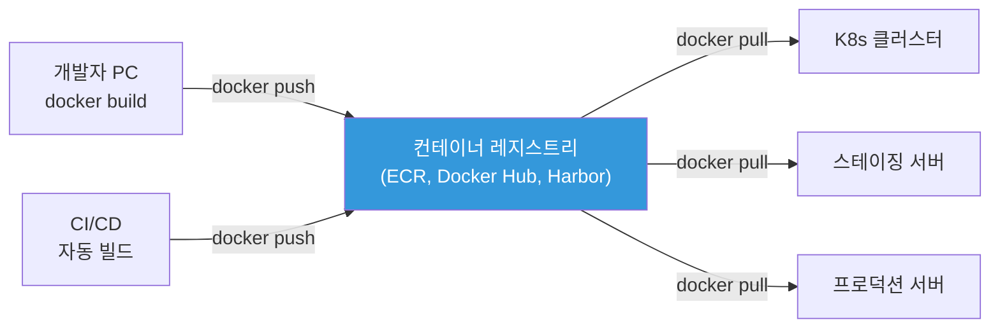
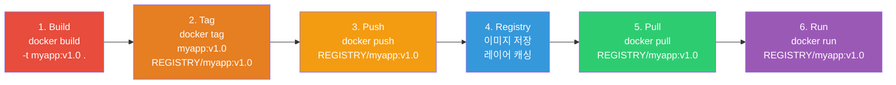
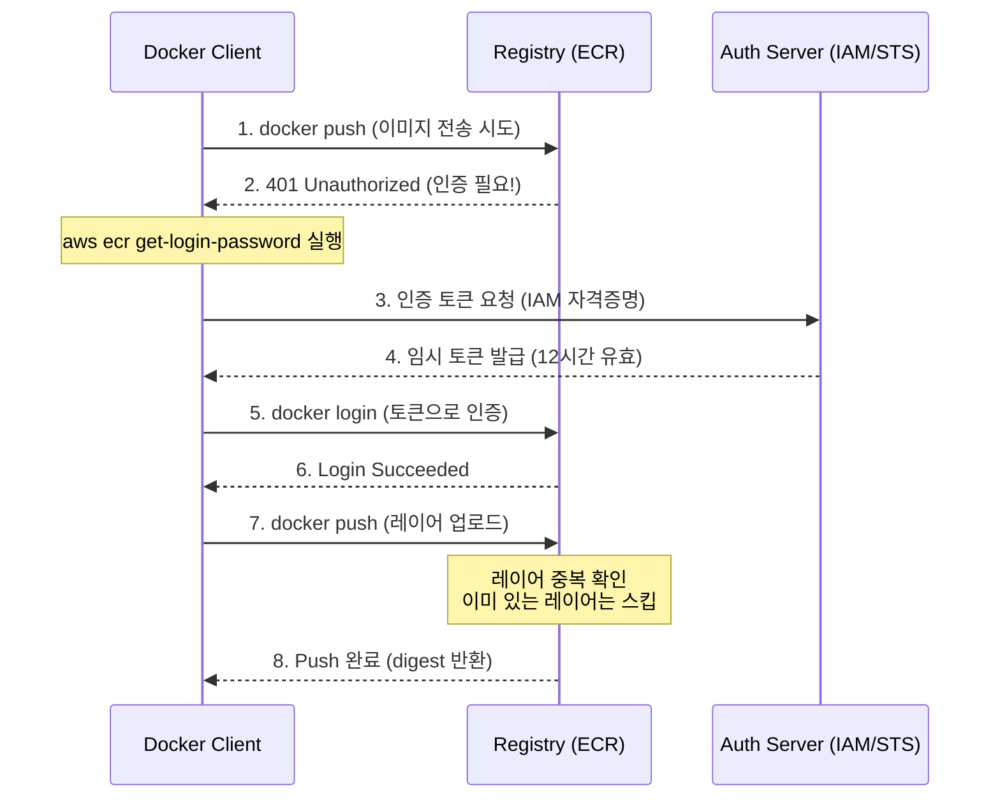
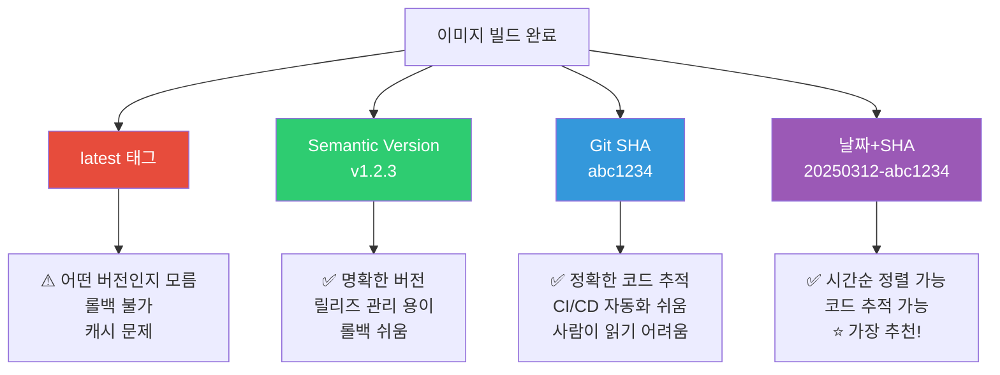

# 컨테이너 레지스트리 (ECR / Docker Hub / Harbor)

> 이미지를 빌드했으면 어딘가에 **저장하고 배포**해야 해요. 레지스트리는 이미지의 **중앙 저장소**예요. Git이 코드의 저장소라면, 레지스트리는 이미지의 저장소예요.

---

## 🎯 이걸 왜 알아야 하나?

```
실무에서 레지스트리 관련 업무:
• 이미지 빌드 후 push/pull                    → 매일
• ECR 접근 권한 설정 (IAM)                    → 보안
• 이미지 취약점 스캐닝                         → 보안 감사
• 오래된 이미지 정리 (비용 절감)               → 라이프사이클 정책
• 프라이빗 레지스트리 설정                     → 사내 이미지 관리
• CI/CD에서 이미지 빌드+push 자동화            → 파이프라인
• 이미지 태깅 전략                            → 버전 관리
```

---

## 🧠 핵심 개념

### 레지스트리 = 이미지의 Git 저장소



### 이미지 Push/Pull 라이프사이클

이미지가 만들어지고 실행되기까지의 전체 흐름이에요.



### 주요 레지스트리 비교

| 레지스트리 | 유형 | 무료 | 프라이빗 | 추천 상황 |
|-----------|------|------|---------|----------|
| **Docker Hub** | 퍼블릭 SaaS | ✅ (제한적) | 유료 | 오픈소스, 개인 프로젝트 |
| **AWS ECR** | 관리형 (AWS) | ❌ | ✅ | ⭐ AWS 환경 |
| **GCR/Artifact Registry** | 관리형 (GCP) | ❌ | ✅ | GCP 환경 |
| **Azure ACR** | 관리형 (Azure) | ❌ | ✅ | Azure 환경 |
| **GitHub GHCR** | SaaS | ✅ (제한적) | ✅ | GitHub 연동 |
| **Harbor** | 자체 호스팅 | ✅ (OSS) | ✅ | 온프레미스, 규제 환경 |
| **GitLab Registry** | SaaS/자체 | ✅ | ✅ | GitLab CI/CD |

---

## 🔍 상세 설명 — AWS ECR (★ 가장 많이 씀)

### ECR 기본 사용

```bash
# === 1. 레포지토리 생성 ===
aws ecr create-repository \
    --repository-name myapp \
    --image-scanning-configuration scanOnPush=true \
    --encryption-configuration encryptionType=AES256 \
    --region ap-northeast-2

# {
#   "repository": {
#     "repositoryArn": "arn:aws:ecr:ap-northeast-2:123456789:repository/myapp",
#     "repositoryUri": "123456789.dkr.ecr.ap-northeast-2.amazonaws.com/myapp",
#     ...
#   }
# }

# === 2. Docker 로그인 (ECR 인증) ===
aws ecr get-login-password --region ap-northeast-2 | \
    docker login --username AWS --password-stdin \
    123456789.dkr.ecr.ap-northeast-2.amazonaws.com
# Login Succeeded

# ⚠️ ECR 토큰은 12시간 유효! CI/CD에서 매번 로그인 필요

# === 3. 이미지 태그 + Push ===
# 이미지에 ECR URI 태그 붙이기
docker tag myapp:v1.0 123456789.dkr.ecr.ap-northeast-2.amazonaws.com/myapp:v1.0

# Push
docker push 123456789.dkr.ecr.ap-northeast-2.amazonaws.com/myapp:v1.0
# The push refers to repository [123456789.dkr.ecr.ap-northeast-2.amazonaws.com/myapp]
# abc123: Pushed
# def456: Pushed
# v1.0: digest: sha256:... size: 1234

# === 4. 이미지 Pull ===
docker pull 123456789.dkr.ecr.ap-northeast-2.amazonaws.com/myapp:v1.0

# === 5. 이미지 목록 확인 ===
aws ecr list-images --repository-name myapp --output table
# ┌──────────────┬────────────────────────┐
# │  imageDigest  │      imageTag         │
# ├──────────────┼────────────────────────┤
# │  sha256:abc.. │  v1.0                 │
# │  sha256:def.. │  v1.1                 │
# │  sha256:ghi.. │  latest               │
# └──────────────┴────────────────────────┘

# === 6. 이미지 상세 정보 ===
aws ecr describe-images --repository-name myapp \
    --image-ids imageTag=v1.0 \
    --query 'imageDetails[0].{Size:imageSizeInBytes,Pushed:imagePushedAt,Tags:imageTags,Scan:imageScanStatus}' \
    --output table
```

### Docker 로그인 + Push 인증 흐름

ECR이나 Docker Hub에 이미지를 push할 때 내부적으로 어떤 인증 과정이 일어나는지 알면, 인증 에러를 디버깅하기 쉬워요.



### ECR 라이프사이클 정책 (★ 비용 절감!)

```bash
# 오래된/미사용 이미지를 자동으로 삭제하는 정책

aws ecr put-lifecycle-policy \
    --repository-name myapp \
    --lifecycle-policy-text '{
  "rules": [
    {
      "rulePriority": 1,
      "description": "태그 없는 이미지 7일 후 삭제",
      "selection": {
        "tagStatus": "untagged",
        "countType": "sinceImagePushed",
        "countUnit": "days",
        "countNumber": 7
      },
      "action": {"type": "expire"}
    },
    {
      "rulePriority": 2,
      "description": "최근 30개만 유지 (v* 태그)",
      "selection": {
        "tagStatus": "tagged",
        "tagPrefixList": ["v"],
        "countType": "imageCountMoreThan",
        "countNumber": 30
      },
      "action": {"type": "expire"}
    },
    {
      "rulePriority": 3,
      "description": "dev- 태그는 14일 후 삭제",
      "selection": {
        "tagStatus": "tagged",
        "tagPrefixList": ["dev-", "pr-"],
        "countType": "sinceImagePushed",
        "countUnit": "days",
        "countNumber": 14
      },
      "action": {"type": "expire"}
    }
  ]
}'

# 이 정책으로:
# ✅ 태그 없는 이미지 → 7일 후 자동 삭제
# ✅ 릴리즈 이미지(v*) → 최근 30개만 유지
# ✅ 개발/PR 이미지 → 14일 후 자동 삭제
# → 불필요한 이미지가 쌓이지 않음 → 비용 절감!
```

### ECR 이미지 스캐닝

```bash
# Push 시 자동 스캐닝 (scanOnPush=true)

# 스캔 결과 확인
aws ecr describe-image-scan-findings \
    --repository-name myapp \
    --image-id imageTag=v1.0 \
    --query 'imageScanFindings.findingSeverityCounts'
# {
#   "CRITICAL": 0,
#   "HIGH": 2,
#   "MEDIUM": 5,
#   "LOW": 10,
#   "INFORMATIONAL": 3
# }

# 상세 취약점
aws ecr describe-image-scan-findings \
    --repository-name myapp \
    --image-id imageTag=v1.0 \
    --query 'imageScanFindings.findings[?severity==`HIGH`].[name,description]' \
    --output table

# Enhanced Scanning (Inspector 기반):
# → 지속적 스캔 (push 때만이 아니라 새 CVE 발견 시 자동 재스캔!)
# → OS + 언어 패키지 모두 스캔 (pip, npm, gem 등)
aws ecr put-registry-scanning-configuration \
    --scan-type ENHANCED \
    --rules '[{"scanFrequency":"CONTINUOUS_SCAN","repositoryFilters":[{"filter":"*","filterType":"WILDCARD"}]}]'
```

### ECR + K8s 연동

```bash
# EKS에서 ECR 이미지 pull:
# → EKS 노드의 IAM Role에 ECR 읽기 권한이 있으면 자동!

# IAM 정책 (노드 IAM Role에 연결):
# {
#   "Effect": "Allow",
#   "Action": [
#     "ecr:GetAuthorizationToken",
#     "ecr:BatchCheckLayerAvailability",
#     "ecr:GetDownloadUrlForLayer",
#     "ecr:BatchGetImage"
#   ],
#   "Resource": "*"
# }

# K8s Pod에서 ECR 이미지 사용:
# containers:
# - name: myapp
#   image: 123456789.dkr.ecr.ap-northeast-2.amazonaws.com/myapp:v1.0
# → EKS에서는 추가 설정 없이 바로 pull!

# 비-EKS 환경에서 ECR 사용 (imagePullSecrets):
# 1. Secret 생성
kubectl create secret docker-registry ecr-secret \
    --docker-server=123456789.dkr.ecr.ap-northeast-2.amazonaws.com \
    --docker-username=AWS \
    --docker-password=$(aws ecr get-login-password)

# 2. Pod에서 사용
# spec:
#   imagePullSecrets:
#   - name: ecr-secret
#   containers:
#   - name: myapp
#     image: 123456789.dkr.ecr.ap-northeast-2.amazonaws.com/myapp:v1.0

# ⚠️ ECR 토큰은 12시간만 유효! → CronJob으로 갱신 필요
```

---

## 🔍 상세 설명 — Docker Hub

```bash
# Docker Hub: 가장 많이 쓰이는 퍼블릭 레지스트리

# 로그인
docker login
# Username: myuser
# Password: ***
# Login Succeeded

# Push (공개 이미지)
docker tag myapp:v1.0 myuser/myapp:v1.0
docker push myuser/myapp:v1.0

# Pull
docker pull myuser/myapp:v1.0

# Docker Hub 제한사항 (무료 계정):
# - 익명 pull: 100회/6시간
# - 인증 pull: 200회/6시간
# - 프라이빗 레포: 1개만
# → CI/CD에서 빈번한 pull이면 rate limit에 걸릴 수 있음!

# Rate limit 회피:
# 1. Docker Hub Pro 계정 ($5/월)
# 2. 이미지를 ECR에 미러링 (ECR Pull Through Cache)
# 3. 자체 레지스트리에 캐싱

# ECR Pull Through Cache:
# → Docker Hub 이미지를 ECR에 자동 캐싱
aws ecr create-pull-through-cache-rule \
    --ecr-repository-prefix docker-hub \
    --upstream-registry-url registry-1.docker.io

# 사용:
# 기존: docker pull nginx:latest
# 캐시: docker pull 123456789.dkr.ecr.ap-northeast-2.amazonaws.com/docker-hub/library/nginx:latest
# → 첫 번째는 Docker Hub에서, 이후는 ECR 캐시에서!
```

---

## 🔍 상세 설명 — Harbor (자체 호스팅)

```bash
# Harbor: CNCF 프로젝트, 자체 호스팅 컨테이너 레지스트리

# 특징:
# ✅ 완전한 온프레미스 (데이터 외부 유출 없음)
# ✅ RBAC (역할 기반 접근 제어)
# ✅ 이미지 스캐닝 (Trivy 내장)
# ✅ 이미지 서명 (cosign, Notary)
# ✅ 복제 (다른 레지스트리와 동기화)
# ✅ 프록시 캐시 (Docker Hub 등 미러)
# ✅ 감사 로그
# ❌ 직접 운영 필요 (설치, 업그레이드, 백업)

# Harbor 설치 (Docker Compose 기반)
wget https://github.com/goharbor/harbor/releases/download/v2.10.0/harbor-offline-installer-v2.10.0.tgz
tar xzf harbor-offline-installer-v2.10.0.tgz
cd harbor

# 설정
cp harbor.yml.tmpl harbor.yml
vim harbor.yml
# hostname: harbor.mycompany.com
# https:
#   certificate: /etc/ssl/certs/harbor.crt
#   private_key: /etc/ssl/certs/harbor.key

# 설치 + 시작
./install.sh
# → Harbor가 Docker Compose로 실행됨!
# → https://harbor.mycompany.com 에서 웹 UI 접근

# Docker에서 Harbor 사용:
docker login harbor.mycompany.com
docker tag myapp:v1.0 harbor.mycompany.com/myproject/myapp:v1.0
docker push harbor.mycompany.com/myproject/myapp:v1.0
```

### 언제 뭘 쓰나?

```bash
# Docker Hub:
# → 오픈소스 프로젝트, 공개 이미지
# → 개인 학습, 작은 프로젝트

# AWS ECR:
# → ⭐ AWS 환경에서 프로덕션 (가장 흔함)
# → EKS와 자연스러운 통합
# → IAM 기반 보안

# GitHub GHCR:
# → GitHub Actions CI/CD와 연동
# → 오픈소스 + 프라이빗 혼합

# Harbor:
# → 온프레미스, 규제 환경 (금융, 의료, 공공)
# → 데이터가 외부로 나가면 안 되는 경우
# → 여러 클라우드/환경에서 중앙 레지스트리

# GitLab Registry:
# → GitLab CI/CD를 사용하는 환경
```

---

## 🔍 상세 설명 — 이미지 태깅 전략

### 좋은 태깅 전략

```bash
# ❌ 나쁜 태깅
myapp:latest              # 어떤 버전인지 모름!
myapp:v1                  # 어떤 커밋인지 모름

# ✅ 좋은 태깅 (⭐ 추천!)
myapp:v1.2.3              # 시맨틱 버전
myapp:20250312-abc1234    # 날짜-커밋해시
myapp:main-abc1234        # 브랜치-커밋해시
myapp:pr-42               # PR 번호

# 실무 태깅 패턴:
# 하나의 이미지에 여러 태그를 동시에 붙이는 게 일반적!
docker tag myapp:build123 myrepo/myapp:v1.2.3
docker tag myapp:build123 myrepo/myapp:20250312-abc1234
docker tag myapp:build123 myrepo/myapp:latest    # 편의용

docker push myrepo/myapp:v1.2.3
docker push myrepo/myapp:20250312-abc1234
docker push myrepo/myapp:latest

# CI/CD에서 자동 태깅:
# IMAGE_TAG="${GITHUB_SHA::7}"                     # 커밋 해시 앞 7자
# IMAGE_TAG="$(date +%Y%m%d)-${GITHUB_SHA::7}"    # 날짜-해시
# IMAGE_TAG="${GITHUB_REF_NAME}-${GITHUB_SHA::7}" # 브랜치-해시
```

### 태깅 전략 비교

어떤 태깅 전략이 적합한지는 팀과 환경에 따라 달라요. 각 전략의 장단점을 비교해볼게요.



### 이미지 Immutability (불변성)

```bash
# 같은 태그에 다른 이미지를 push하면 → 이전 이미지가 덮어씌워짐!
# → "v1.0이 어제와 다른 이미지?" → 위험!

# ECR에서 태그 불변성 설정:
aws ecr put-image-tag-mutability \
    --repository-name myapp \
    --image-tag-mutability IMMUTABLE
# → 같은 태그로 다시 push 불가!
# → v1.0은 영원히 같은 이미지!

# latest 태그는 업데이트가 필요하니까:
# → 버전 태그(v1.0)는 IMMUTABLE
# → latest는 MUTABLE (또는 latest를 아예 안 쓰기)
```

---

## 💻 실습 예제

### 실습 1: ECR에 이미지 Push/Pull

```bash
# 1. 레포지토리 생성
ACCOUNT_ID=$(aws sts get-caller-identity --query Account --output text)
REGION="ap-northeast-2"
REPO_URI="$ACCOUNT_ID.dkr.ecr.$REGION.amazonaws.com/test-app"

aws ecr create-repository --repository-name test-app --region $REGION

# 2. 로그인
aws ecr get-login-password --region $REGION | \
    docker login --username AWS --password-stdin $ACCOUNT_ID.dkr.ecr.$REGION.amazonaws.com

# 3. 이미지 빌드 + 태그
docker build -t test-app:v1.0 .
docker tag test-app:v1.0 $REPO_URI:v1.0

# 4. Push
docker push $REPO_URI:v1.0

# 5. Pull (다른 서버에서)
docker pull $REPO_URI:v1.0

# 6. 이미지 목록
aws ecr list-images --repository-name test-app

# 7. 정리
aws ecr delete-repository --repository-name test-app --force
```

### 실습 2: 이미지 스캐닝

```bash
# Trivy로 로컬 이미지 스캔 (ECR 없이도 가능!)
# 설치: https://aquasecurity.github.io/trivy/

# Docker로 Trivy 실행
docker run --rm \
    -v /var/run/docker.sock:/var/run/docker.sock \
    aquasec/trivy:latest image myapp:v1.0

# 출력:
# myapp:v1.0 (alpine 3.19)
# ════════════════════════════
# Total: 5 (UNKNOWN: 0, LOW: 3, MEDIUM: 1, HIGH: 1, CRITICAL: 0)
#
# ┌─────────────┬──────────────┬──────────┬────────────┬───────────────┐
# │   Library   │ Vulnerability│ Severity │  Installed │    Fixed      │
# ├─────────────┼──────────────┼──────────┼────────────┼───────────────┤
# │ openssl     │ CVE-2024-XXX │ HIGH     │ 3.1.0      │ 3.1.5         │
# │ curl        │ CVE-2024-YYY │ MEDIUM   │ 8.5.0      │ 8.6.0         │
# └─────────────┴──────────────┴──────────┴────────────┴───────────────┘

# CI에서 자동 스캔 (CRITICAL/HIGH가 있으면 빌드 실패):
docker run --rm \
    -v /var/run/docker.sock:/var/run/docker.sock \
    aquasec/trivy:latest image \
    --exit-code 1 \
    --severity CRITICAL,HIGH \
    myapp:v1.0
# → CRITICAL 또는 HIGH CVE가 있으면 exit code 1 (빌드 실패!)
```

### 실습 3: 이미지 서명 (cosign)

```bash
# cosign: 이미지에 서명해서 신뢰할 수 있는 이미지만 배포
# → "이 이미지가 우리 CI/CD에서 빌드된 것이 맞는지" 검증

# 키 생성
cosign generate-key-pair
# → cosign.key (개인키, 안전하게 보관!)
# → cosign.pub (공개키, 검증용)

# 이미지 서명
cosign sign --key cosign.key $REPO_URI:v1.0
# → 서명이 레지스트리에 저장됨

# 서명 검증
cosign verify --key cosign.pub $REPO_URI:v1.0
# Verification for ... --
# The following checks were performed on each of these signatures:
#   - The cosign claims were validated
#   - The signatures were verified against the specified public key
# → 검증 성공! ✅

# K8s에서 서명된 이미지만 허용 (OPA/Kyverno):
# → 서명 안 된 이미지는 배포 차단!
```

---

## 🏢 실무에서는?

### 시나리오 1: CI/CD 이미지 빌드 파이프라인

```bash
# GitHub Actions에서 ECR에 빌드+push

# .github/workflows/build.yml
# name: Build and Push
# on:
#   push:
#     branches: [main]
# 
# env:
#   AWS_REGION: ap-northeast-2
#   ECR_REPO: myapp
# 
# jobs:
#   build:
#     runs-on: ubuntu-latest
#     steps:
#     - uses: actions/checkout@v4
#
#     - uses: aws-actions/configure-aws-credentials@v4
#       with:
#         role-to-assume: arn:aws:iam::123456789:role/github-actions
#
#     - uses: aws-actions/amazon-ecr-login@v2
#       id: ecr
#
#     - name: Build and push
#       env:
#         REGISTRY: ${{ steps.ecr.outputs.registry }}
#         IMAGE_TAG: ${{ github.sha }}
#       run: |
#         docker build -t $REGISTRY/$ECR_REPO:$IMAGE_TAG .
#         docker push $REGISTRY/$ECR_REPO:$IMAGE_TAG
#
#     - name: Scan image
#       run: |
#         trivy image --exit-code 1 --severity CRITICAL \
#           $REGISTRY/$ECR_REPO:$IMAGE_TAG
```

### 시나리오 2: ECR 비용 최적화

```bash
# "ECR 비용이 월 $200 나옵니다"

# 원인 분석:
# 1. 저장된 이미지가 너무 많음 (500개+)
# 2. 이미지가 큼 (800MB × 500 = 400GB)
# 3. 크로스 리전 pull (데이터 전송 비용)

# 해결:
# 1. 라이프사이클 정책 적용
# → 태그 없는 이미지: 7일 후 삭제
# → 릴리즈 이미지: 최근 20개만 유지
# → dev/PR 이미지: 14일 후 삭제

# 2. 이미지 크기 줄이기 (./06-image-optimization)
# → 800MB → 150MB = 5배 저장 비용 절감

# 3. 같은 리전에서 pull
# → EKS와 ECR이 같은 리전이면 데이터 전송 무료!
# → 다른 리전이면 GB당 $0.09!

# 4. 레이어 공유 확인
# → 같은 베이스(alpine)를 쓰는 이미지들은 레이어를 공유
# → 실제 저장 크기가 이미지 수 × 크기보다 작음
```

### 시나리오 3: "이미지 pull이 실패해요"

```bash
# === "ErrImagePull" in K8s ===

# 1. 이미지 이름 오타
kubectl describe pod myapp | grep "Failed"
# Failed to pull image "123456789.dkr.ecr..../myap:v1.0"
#                                                ^^^^
#                                                오타! myapp이 아니라 myap

# 2. ECR 인증 만료
# → EKS라면 노드 IAM Role에 ECR 읽기 권한 확인
# → 비-EKS라면 imagePullSecrets 확인 (12시간 만료!)

# 3. 이미지 태그가 없음
# → ECR에 v1.0이 있는지 확인
aws ecr describe-images --repository-name myapp --image-ids imageTag=v1.0

# 4. 리전이 다름
# → ECR URI에 리전이 올바른지 확인
# 123456789.dkr.ecr.us-east-1.amazonaws.com  ← us-east-1?
# 123456789.dkr.ecr.ap-northeast-2.amazonaws.com  ← ap-northeast-2?

# 5. Docker Hub rate limit
# → 익명: 100회/6시간, 인증: 200회/6시간
# → ECR Pull Through Cache 사용으로 해결
```

---

## ⚠️ 자주 하는 실수

### 1. latest 태그만 사용

```bash
# ❌ 모든 배포에 latest → 어떤 버전인지 모름, 롤백 불가
image: myapp:latest

# ✅ 명시적 버전 태그
image: myapp:v1.2.3
image: myapp:20250312-abc1234
```

### 2. ECR 라이프사이클 정책을 안 설정

```bash
# ❌ 이미지가 계속 쌓임 → 수백 GB → 비용 폭탄!
aws ecr describe-repositories --query 'repositories[*].[repositoryName]' --output table
# → 라이프사이클 정책이 없는 레포 확인

# ✅ 모든 레포에 라이프사이클 정책 적용
```

### 3. 이미지 스캐닝을 안 하기

```bash
# ❌ 취약점이 있는 이미지를 프로덕션에 배포
# → 해킹 위험!

# ✅ CI/CD에서 자동 스캔 + CRITICAL/HIGH 차단
# → Trivy, ECR Enhanced Scanning, Docker Scout
```

### 4. 퍼블릭 레포에 프라이빗 이미지 push

```bash
# ❌ Docker Hub에 사내 코드가 포함된 이미지를 public으로 push!
docker push myuser/internal-app:v1.0
# → 누구나 pull 가능! 소스 코드 유출!

# ✅ 프라이빗 레지스트리 사용 (ECR, Harbor)
# ✅ Docker Hub에서도 프라이빗 설정 확인
```

### 5. 크로스 리전 pull로 비용 낭비

```bash
# ❌ ECR은 us-east-1인데 EKS는 ap-northeast-2
# → 매번 대서양을 건너서 이미지 pull → 느리고 비쌈!

# ✅ ECR과 EKS를 같은 리전에
# ✅ 멀티 리전이면 ECR Replication 사용
aws ecr put-replication-configuration \
    --replication-configuration '{
      "rules": [{
        "destinations": [{
          "region": "ap-northeast-2",
          "registryId": "123456789"
        }]
      }]
    }'
# → us-east-1에 push하면 ap-northeast-2에 자동 복제!
```

---

## 📝 정리

### ECR 명령어 치트시트

```bash
# 로그인
aws ecr get-login-password | docker login --username AWS --password-stdin ACCOUNT.dkr.ecr.REGION.amazonaws.com

# 레포 생성
aws ecr create-repository --repository-name NAME --image-scanning-configuration scanOnPush=true

# Push
docker tag IMAGE ACCOUNT.dkr.ecr.REGION.amazonaws.com/NAME:TAG
docker push ACCOUNT.dkr.ecr.REGION.amazonaws.com/NAME:TAG

# 이미지 목록
aws ecr list-images --repository-name NAME

# 스캔 결과
aws ecr describe-image-scan-findings --repository-name NAME --image-id imageTag=TAG

# 삭제
aws ecr batch-delete-image --repository-name NAME --image-ids imageTag=TAG
```

### 레지스트리 선택 가이드

```
AWS 프로덕션       → ECR ⭐
GCP 프로덕션       → Artifact Registry
온프레미스/규제     → Harbor
오픈소스/개인       → Docker Hub 또는 GHCR
GitHub CI/CD       → GHCR
GitLab CI/CD       → GitLab Registry
```

### 이미지 관리 체크리스트

```
✅ 명시적 버전 태그 (latest 금지)
✅ 라이프사이클 정책 (오래된 이미지 자동 삭제)
✅ 이미지 스캐닝 (CI/CD에서 자동)
✅ 이미지 서명 (cosign, 선택)
✅ 태그 불변성 (IMMUTABLE, 선택)
✅ 같은 리전에 레지스트리와 클러스터
✅ .dockerignore + 멀티스테이지로 이미지 최소화
```

---

## 🔗 다음 강의

다음은 **[08-troubleshooting](./08-troubleshooting)** — 컨테이너 트러블슈팅 (inspect / stats / 디버깅) 이에요.

컨테이너가 안 뜨거나, 죽거나, 느릴 때 — 체계적으로 원인을 찾는 방법을 실전으로 배워볼게요.
