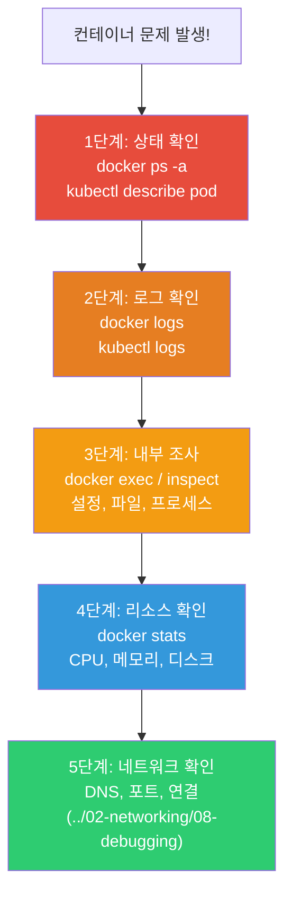
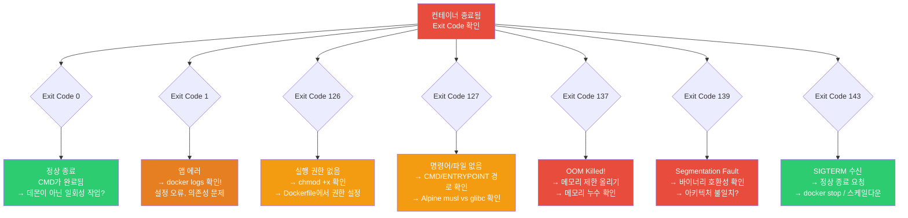
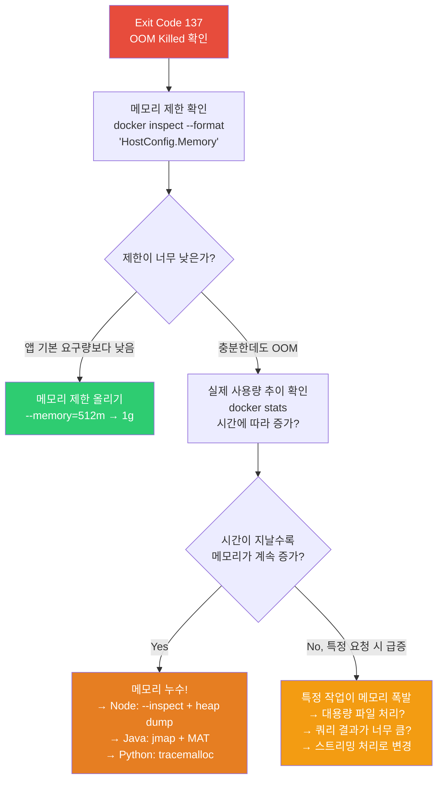
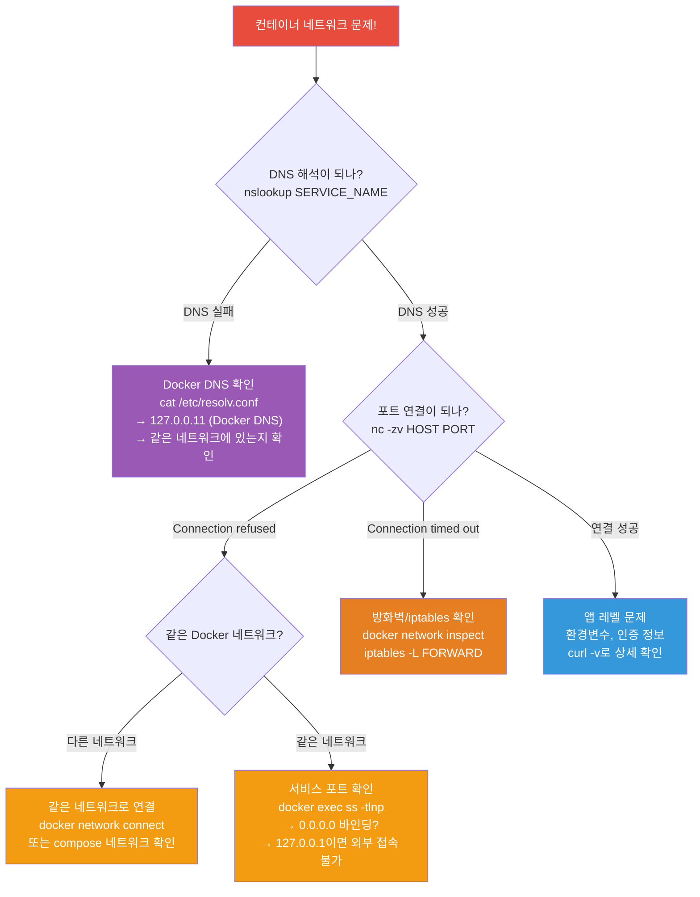

# 컨테이너 트러블슈팅 (inspect / stats / 디버깅)

> 컨테이너가 안 뜨거나, 자꾸 죽거나, 느리거나 — 실무에서 가장 많은 시간을 쓰는 건 디버깅이에요. [네트워크 디버깅](../02-networking/08-debugging)처럼 체계적인 프레임워크가 있으면 훨씬 빠르게 원인을 찾을 수 있어요.

---

## 🎯 이걸 왜 알아야 하나?

```
실무에서 컨테이너 트러블슈팅이 필요한 순간:
• "컨테이너가 시작하자마자 죽어요" (CrashLoopBackOff)
• "컨테이너가 OOM으로 죽었어요"
• "컨테이너 안에서 파일을 못 읽어요" (Permission denied)
• "컨테이너가 느려요"
• "이미지 pull이 실패해요"
• "컨테이너 간 통신이 안 돼요"
• "디스크가 가득 찼어요" (Docker 관련)
```

---

## 🧠 핵심 개념

### 컨테이너 디버깅 5단계 프레임워크



### Exit Code 판단 트리

컨테이너가 죽었을 때, Exit Code를 보면 원인을 빠르게 좁힐 수 있어요.



---

## 🔍 실전 시나리오 — 컨테이너가 시작 후 즉시 죽음

### 증상: Exited (1) / CrashLoopBackOff

```bash
# === 1단계: 상태 확인 ===
docker ps -a
# CONTAINER ID  IMAGE        STATUS                     NAMES
# abc123        myapp:v1.0   Exited (1) 5 seconds ago   myapp
#                            ^^^^^^^^
#                            Exit Code 1 = 앱 에러로 종료

# K8s에서:
kubectl get pods
# NAME                    READY   STATUS             RESTARTS   AGE
# myapp-7b9f8c-abc12      0/1     CrashLoopBackOff   5          3m
#                                 ^^^^^^^^^^^^^^^^
#                                 시작 → 죽음 → 시작 → 죽음 반복

# Exit Code 의미:
# 0   = 정상 종료
# 1   = 앱 에러 (일반적인 에러)
# 2   = 쉘 명령어 오류
# 126 = 실행 권한 없음
# 127 = 명령어를 찾을 수 없음 (파일 없음)
# 128+N = 시그널 N으로 종료 (137=SIGKILL=OOM, 143=SIGTERM)
# 137 = OOM Killer (128 + 9) ← 메모리 초과!
# 143 = SIGTERM (128 + 15) ← 정상 종료 요청

# === 2단계: 로그 확인 (⭐ 가장 중요!) ===
docker logs myapp
# Error: Cannot find module '/app/server.js'
# → 파일 경로가 틀렸거나 COPY가 안 됐거나!

# 또는:
docker logs myapp
# Error: connect ECONNREFUSED 10.0.2.10:5432
# → DB 연결 실패! DB가 아직 안 올라왔거나 주소가 틀림

# 또는:
docker logs myapp
# /app/server: Permission denied
# → 실행 권한이 없음!

# K8s에서 이전 컨테이너 로그:
kubectl logs myapp-7b9f8c-abc12 --previous
# → CrashLoopBackOff일 때 이전 실행의 로그 확인!

# === 3단계: 내부 조사 ===

# 죽은 컨테이너의 파일 시스템 확인 (docker cp 이용)
docker cp myapp:/app/ /tmp/debug-app/
ls -la /tmp/debug-app/
# → 파일이 있는지, 권한은 맞는지 확인

# 같은 이미지로 쉘 접속해서 수동 실행
docker run -it --rm --entrypoint sh myapp:v1.0
# /app $ ls -la
# -rw-r--r-- 1 root root ... server.js     ← 실행 권한 없음?
# /app $ node server.js
# Error: Cannot find module 'express'       ← 의존성 누락!

# Dockerfile 확인:
# → WORKDIR, COPY 경로가 맞는지
# → CMD/ENTRYPOINT가 올바른지
# → npm install이 제대로 됐는지
```

### Exit Code 137 — OOM Killed (메모리 초과)

```bash
docker ps -a
# STATUS: Exited (137)    ← 137 = SIGKILL = OOM!

# 확인
docker inspect myapp --format '{{.State.OOMKilled}}'
# true    ← OOM으로 죽음!

# 메모리 제한 확인
docker inspect myapp --format '{{.HostConfig.Memory}}'
# 268435456    ← 256MB 제한

# 마지막 메모리 사용량 확인
docker stats --no-stream myapp 2>/dev/null
# MEM USAGE / LIMIT    MEM %
# 255MiB / 256MiB      99.61%    ← 한계에 도달!

# 해결:
# 1. 메모리 제한 올리기
docker run -d --memory=512m myapp:v1.0

# 2. 앱의 메모리 누수 수정
# → Node.js: --max-old-space-size
# → Java: -Xmx 설정
# → 프로파일링 도구로 누수 찾기

# K8s에서:
kubectl describe pod myapp | grep -A 5 "Last State"
# Last State:  Terminated
#   Reason:    OOMKilled
#   Exit Code: 137

# → resources.limits.memory 올리기
# resources:
#   limits:
#     memory: "512Mi"    # 256Mi → 512Mi
```

### Exit Code 127 — Command Not Found

```bash
docker logs myapp
# /bin/sh: /app/server: not found
# 또는
# exec /app/server: no such file or directory

# 원인 1: 파일이 없음
docker run --rm --entrypoint sh myapp:v1.0 -c "ls -la /app/"
# → server 파일이 있는지 확인

# 원인 2: Alpine에서 glibc 바이너리 실행
# → Alpine은 musl libc! glibc 바이너리가 안 돌아감
# → 해결: Alpine에서 빌드하거나, CGO_ENABLED=0(Go)

# 원인 3: 실행 권한 없음 (126 아닌 127도 가능)
docker run --rm --entrypoint sh myapp:v1.0 -c "file /app/server"
# /app/server: ELF 64-bit LSB executable, x86-64, ...
# → 바이너리는 맞는데 실행 권한이 없으면 추가:
# RUN chmod +x /app/server

# 원인 4: 아키텍처 불일치 (ARM에서 x86 바이너리)
docker run --rm --entrypoint sh myapp:v1.0 -c "uname -m"
# aarch64    ← ARM인데 x86 바이너리?
# → 멀티 아키텍처 빌드 필요 (./06-image-optimization)
```

### OOM 진단 흐름

Exit Code 137이 나왔을 때 체계적으로 원인을 찾는 흐름이에요.



---

## 🔍 실전 시나리오 — 컨테이너가 느림

```bash
# === 1단계: 리소스 사용량 확인 ===
docker stats
# CONTAINER  CPU %    MEM USAGE / LIMIT    MEM %   NET I/O       BLOCK I/O   PIDS
# myapp      95.00%   480MiB / 512MiB      93.75%  5MB / 2MB     100MB / 0B  150
#            ^^^^^^                         ^^^^^^                            ^^^
#            CPU 95%!                       메모리 93%!                       프로세스 150개

# CPU가 높으면:
# → 앱 레벨 문제 (무한 루프, 무거운 연산)
# → CPU 제한이 너무 낮음 (--cpus 올리기)
# → top으로 어떤 프로세스가 CPU를 쓰는지 확인
docker exec myapp top -bn1 | head -15
# PID  USER  %CPU  %MEM  COMMAND
# 1    node  92.0  45.0  node server.js      ← 이 프로세스!

# 메모리가 높으면:
# → 메모리 누수 (시간이 지날수록 증가)
# → 메모리 제한이 너무 낮음
# → --memory 올리거나 앱 수정

# I/O가 높으면:
# → 디스크 읽기/쓰기가 많음
# → 로그를 너무 많이 쓰거나 큰 파일 처리
docker exec myapp iostat 2>/dev/null

# PIDS가 높으면:
# → 프로세스/스레드 누수
# → fork bomb 가능성
docker exec myapp ps aux | wc -l

# === 2단계: 상세 프로파일링 ===

# Node.js: 힙 덤프
docker exec myapp node --inspect=0.0.0.0:9229 -e "process.kill(process.pid, 'SIGUSR1')"
# → Chrome DevTools에서 연결해서 프로파일링

# Java: 스레드 덤프
docker exec myapp jstack 1
# → 어떤 스레드가 무엇을 하고 있는지

# Python: py-spy (외부에서 프로파일링)
docker exec myapp pip install py-spy
docker exec myapp py-spy top --pid 1

# 일반: strace (시스템 호출 추적)
docker exec --privileged myapp strace -p 1 -c
# → 어떤 시스템 호출이 가장 많은지 (디버깅 컨테이너에서)
```

---

## 🔍 실전 시나리오 — 이미지/레지스트리 문제

```bash
# === "이미지를 pull 못 해요" ===

# 에러 메시지별 원인:

# 1. "manifest not found"
docker pull myrepo/myapp:v9.9.9
# Error: manifest for myrepo/myapp:v9.9.9 not found
# → 이 태그가 레지스트리에 없음! 오타 확인

# 2. "unauthorized" / "access denied"
docker pull 123456789.dkr.ecr.ap-northeast-2.amazonaws.com/myapp:v1.0
# Error: pull access denied, unauthorized
# → 로그인 안 됨 또는 권한 없음
aws ecr get-login-password | docker login --username AWS --password-stdin 123456789.dkr.ecr.ap-northeast-2.amazonaws.com

# 3. "toomanyrequests" (Docker Hub rate limit)
docker pull nginx:latest
# Error: toomanyrequests: Too Many Requests
# → Docker Hub 무료 제한 초과 (익명 100회/6시간)
# → docker login으로 인증하면 200회/6시간
# → ECR Pull Through Cache로 해결 (./07-registry)

# 4. "i/o timeout"
docker pull myrepo/myapp:v1.0
# Error: net/http: TLS handshake timeout
# → 네트워크 문제! DNS, 방화벽, 프록시 확인

# 5. K8s에서 "ErrImagePull" / "ImagePullBackOff"
kubectl describe pod myapp | grep -A 10 Events
# Events:
#   Warning  Failed  kubelet  Failed to pull image "myrepo/myapp:v1.0":
#   rpc error: unauthorized

# → imagePullSecrets 확인
# → 이미지 이름/태그 확인
# → 노드에서 직접 pull 테스트
ssh node-1
sudo crictl pull myrepo/myapp:v1.0
```

---

## 🔍 실전 시나리오 — 권한/파일 시스템 문제

```bash
# === "Permission denied" ===

# 1. 파일 권한 문제
docker logs myapp
# Error: EACCES: permission denied, open '/app/data/config.json'

# 확인:
docker exec myapp ls -la /app/data/
# -rw------- 1 root root ... config.json    ← root 소유!
docker exec myapp whoami
# node    ← node 사용자로 실행 중! root 파일을 못 읽음

# 해결: Dockerfile에서 권한 설정
# RUN chown -R node:node /app/data
# USER node

# 2. 읽기 전용 파일 시스템
docker logs myapp
# Error: EROFS: read-only file system, open '/app/logs/app.log'

# 확인:
docker inspect myapp --format '{{.HostConfig.ReadonlyRootfs}}'
# true    ← --read-only로 실행됨!

# 해결: 쓰기 필요한 경로에 tmpfs 또는 볼륨 마운트
# docker run --read-only --tmpfs /app/logs --tmpfs /tmp myapp:v1.0
# 또는 볼륨:
# docker run --read-only -v app-logs:/app/logs myapp:v1.0

# 3. 볼륨 마운트 권한
docker logs mydb
# chown: /var/lib/mysql: Operation not permitted

# 원인: 호스트 디렉토리의 소유자가 컨테이너 사용자와 다름
ls -la /host/data/mysql/
# drwxr-xr-x root root    ← root 소유

# 해결: 호스트에서 UID를 맞추거나 Named Volume 사용 (Docker가 권한 관리)
docker run -v mysql-data:/var/lib/mysql mysql:8.0    # Named Volume → 권한 자동!
```

### 컨테이너 네트워크 트러블슈팅 흐름

컨테이너 간 통신이 안 될 때, 어디서부터 확인해야 하는지 정리한 흐름이에요.



---

## 🔍 실전 시나리오 — 네트워크 문제

```bash
# === "컨테이너에서 외부 접속이 안 돼요" ===

# 1. DNS 확인
docker exec myapp nslookup google.com
# nslookup: can't resolve 'google.com'
# → DNS 서버에 접근 불가

# DNS 서버 확인
docker exec myapp cat /etc/resolv.conf
# nameserver 127.0.0.11    ← Docker 내장 DNS

# 호스트 DNS 확인
cat /etc/resolv.conf
# nameserver 10.0.0.2

# Docker 데몬의 DNS 설정 확인
docker network inspect bridge --format '{{json .IPAM.Config}}'

# 2. 네트워크 모드 확인
docker inspect myapp --format '{{.HostConfig.NetworkMode}}'
# none    ← none이면 네트워크 없음!

# 3. 방화벽/iptables 확인
sudo iptables -L FORWARD -n | grep DROP
# → Docker 관련 FORWARD 체인이 DROP이면 컨테이너 통신 차단

# Docker iptables 재설정
sudo systemctl restart docker
# → Docker가 iptables 규칙을 재생성

# === "컨테이너 간 통신이 안 돼요" ===

# 같은 네트워크에 있는지 확인
docker inspect app --format '{{json .NetworkSettings.Networks}}' | python3 -m json.tool
docker inspect db --format '{{json .NetworkSettings.Networks}}' | python3 -m json.tool
# → 같은 네트워크 이름이 있어야!

# 다른 네트워크면 연결
docker network connect myapp-net db

# 이름으로 통신 테스트
docker exec app ping -c 2 db
docker exec app nc -zv db 5432
# → (./05-networking 참고)
```

---

## 🔍 실전 시나리오 — 디스크 공간 부족

```bash
# === "no space left on device" ===

# 1. Docker 디스크 사용량 확인
docker system df
# TYPE           TOTAL   ACTIVE   SIZE      RECLAIMABLE
# Images         50      10       15GB      10GB (66%)     ← 미사용 이미지!
# Containers     20      5        2GB       1.5GB (75%)    ← 중지된 컨테이너!
# Volumes        15      5        8GB       5GB (62%)      ← 미사용 볼륨!
# Build Cache    100     0        5GB       5GB (100%)     ← 빌드 캐시!
# → 총 30GB 사용, 21.5GB 회수 가능!

# 2. 상세 확인
docker system df -v | head -30

# 이미지별 크기
docker images --format "{{.Size}}\t{{.Repository}}:{{.Tag}}" | sort -rh | head -10
# 1.1GB   node:20
# 800MB   myapp-old:latest
# 500MB   test-image:dev

# 큰 컨테이너 로그 확인
for id in $(docker ps -q); do
    name=$(docker inspect $id --format '{{.Name}}')
    logsize=$(docker inspect $id --format '{{.LogPath}}' | xargs ls -lh 2>/dev/null | awk '{print $5}')
    echo "$logsize $name"
done | sort -rh | head -5
# 5.0G /myapp         ← 로그가 5GB!
# 2.0G /nginx
# 500M /redis

# 3. 정리

# 빌드 캐시 정리 (가장 안전)
docker builder prune -a
# Reclaimed: 5GB

# 중지된 컨테이너 삭제
docker container prune

# 미사용 이미지 삭제
docker image prune -a

# 미사용 볼륨 삭제 (⚠️ 데이터 확인!)
docker volume prune

# 한방에 정리
docker system prune -a --volumes
# → 미사용 전부 삭제 (데이터 주의!)

# 4. 로그 크기 제한 (근본 해결)
# /etc/docker/daemon.json
# {
#   "log-driver": "json-file",
#   "log-opts": {
#     "max-size": "10m",       ← 로그 파일당 최대 10MB
#     "max-file": "3"          ← 최대 3개 파일 (30MB)
#   }
# }
sudo systemctl restart docker

# 컨테이너별 로그 제한
docker run -d --log-opt max-size=10m --log-opt max-file=3 myapp
```

---

## 🔍 실전 시나리오 — Docker Compose 디버깅

```bash
# === "docker compose up 했는데 서비스가 안 떠요" ===

# 1. 전체 상태 확인
docker compose ps
# NAME           IMAGE    STATUS
# myapp-app-1    myapp    Exited (1)        ← 죽었음!
# myapp-db-1     postgres Up (healthy)       ← 정상
# myapp-redis-1  redis    Up                 ← 정상

# 2. 죽은 서비스 로그
docker compose logs app
# Error: Cannot connect to database at db:5432

# 3. 서비스 간 네트워크 확인
docker compose exec db pg_isready -U myuser
# /var/run/postgresql:5432 - accepting connections   ← DB는 OK

# 앱에서 DB에 접근 가능한지
docker compose run --rm app sh -c "nc -zv db 5432"
# Connection to db 5432 port [tcp/postgresql] succeeded!
# → 네트워크는 OK! 앱 설정이 문제

# 4. 환경 변수 확인
docker compose exec app env | grep DB
# DB_HOST=database    ← "db"가 아니라 "database"?!
# → docker-compose.yml의 서비스 이름은 "db"인데 환경변수가 "database"!

# 5. depends_on + healthcheck 문제
# 앱이 DB보다 먼저 시작돼서 연결 실패
# → depends_on에 condition: service_healthy 추가

# 6. 특정 서비스만 재시작
docker compose restart app
docker compose up -d app    # 재생성
docker compose up -d --force-recreate app    # 설정 변경 후 강제 재생성

# 7. 설정 검증
docker compose config    # YAML 검증 (문법 오류 확인)
```

---

## 🔍 디버깅 도구 모음

### 디버그 컨테이너 (사이드카)

```bash
# 프로덕션 컨테이너에 디버깅 도구가 없을 때 (distroless 등)

# 1. 같은 네트워크/PID namespace로 디버그 컨테이너 실행
docker run -it --rm \
    --network container:myapp \
    --pid container:myapp \
    nicolaka/netshoot bash
# → myapp과 같은 네트워크+PID namespace에서 디버깅 도구 사용!
# → netshoot에는 curl, dig, tcpdump, ss, ip 등 다 있음!

# netshoot 안에서:
ss -tlnp                        # myapp의 열린 포트
curl localhost:3000/health      # myapp에 직접 접근
tcpdump -i eth0 port 3000      # 패킷 캡처
dig db                          # DNS 확인

# 2. K8s에서 디버그 컨테이너 (kubectl debug)
kubectl debug -it myapp-pod --image=nicolaka/netshoot --target=myapp
# → myapp Pod에 임시 디버그 컨테이너 추가!
# → 프로세스, 네트워크를 공유하면서 디버깅

# 3. K8s에서 노드 디버깅
kubectl debug node/node-1 -it --image=ubuntu
# → 노드에 접속해서 호스트 파일 시스템(/host) 접근
```

### docker diff — 컨테이너 변경사항 확인

```bash
# 컨테이너가 어떤 파일을 변경/추가/삭제했는지
docker diff myapp
# C /app                    ← Changed (변경)
# A /app/logs/app.log       ← Added (추가)
# A /tmp/cache.dat          ← Added
# C /etc/hosts              ← Changed

# → 예상치 못한 파일 변경이 있으면 의심!
# → /tmp에 큰 파일이 쌓이고 있나?
```

### docker events — 실시간 이벤트 모니터링

```bash
# Docker 데몬의 실시간 이벤트
docker events
# 2025-03-12T10:00:00 container start abc123 (image=myapp:v1.0)
# 2025-03-12T10:00:05 container die abc123 (exitCode=137)    ← OOM!
# 2025-03-12T10:00:06 container start abc123 (image=myapp:v1.0) ← 재시작
# 2025-03-12T10:00:11 container die abc123 (exitCode=137)    ← 또 OOM!

# 필터링
docker events --filter 'event=die'               # 죽은 컨테이너만
docker events --filter 'container=myapp'          # 특정 컨테이너만
docker events --filter 'event=oom'                # OOM 이벤트만

# 시간 범위
docker events --since "2025-03-12T09:00:00" --until "2025-03-12T10:00:00"
```

---

## 💻 실습 예제

### 실습 1: 다양한 Exit Code 체험

```bash
# Exit 0 (정상 종료)
docker run --rm alpine echo "success"
echo "Exit code: $?"    # 0

# Exit 1 (앱 에러)
docker run --rm alpine sh -c "exit 1"
echo "Exit code: $?"    # 1

# Exit 126 (실행 권한 없음)
docker run --rm alpine sh -c "chmod 644 /bin/ls && /bin/ls"
echo "Exit code: $?"    # 126

# Exit 127 (명령어 없음)
docker run --rm alpine nonexistent-command
echo "Exit code: $?"    # 127

# Exit 137 (OOM Kill)
docker run --rm --memory=10m alpine sh -c "dd if=/dev/zero of=/dev/null bs=20m"
echo "Exit code: $?"    # 137

# Exit 143 (SIGTERM)
docker run -d --name sigtest alpine sleep 3600
docker stop sigtest
docker inspect sigtest --format '{{.State.ExitCode}}'    # 143
docker rm sigtest
```

### 실습 2: OOM 디버깅

```bash
# 1. 메모리 제한 컨테이너 실행
docker run -d --name oom-test --memory=50m alpine sh -c "
    while true; do
        dd if=/dev/zero of=/tmp/fill bs=1M count=10 2>/dev/null
        cat /tmp/fill >> /tmp/bigfile 2>/dev/null
        sleep 0.1
    done
"

# 2. 모니터링
docker stats oom-test --no-stream
# MEM USAGE / LIMIT   MEM %
# 48MiB / 50MiB       96.00%    ← 한계!

# 3. 잠시 후 종료 확인
sleep 10
docker ps -a --filter "name=oom-test" --format '{{.Status}}'
# Exited (137)    ← OOM Kill!

docker inspect oom-test --format '{{.State.OOMKilled}}'
# true

# 4. 정리
docker rm oom-test
```

### 실습 3: 네트워크 디버깅 (netshoot)

```bash
# 1. 대상 컨테이너 실행
docker run -d --name target nginx

# 2. netshoot으로 디버깅
docker run -it --rm \
    --network container:target \
    nicolaka/netshoot bash

# netshoot 안에서:
# 열린 포트 확인
ss -tlnp
# LISTEN  0  511  0.0.0.0:80  ... nginx

# HTTP 테스트
curl -I localhost:80
# HTTP/1.1 200 OK

# DNS 확인
dig google.com +short

# 네트워크 인터페이스
ip addr

# exit 후 정리
# exit
docker rm -f target
```

---

## 🏢 실무에서는?

### 시나리오 1: K8s Pod CrashLoopBackOff 체계적 진단

```bash
# 1. Pod 상태 확인
kubectl get pod myapp-xxx -o wide

# 2. Pod 이벤트 확인
kubectl describe pod myapp-xxx | tail -20
# Events:
#   Warning  BackOff  ... Back-off restarting failed container

# 3. 현재 + 이전 로그
kubectl logs myapp-xxx
kubectl logs myapp-xxx --previous    # ← 이전 실행 로그!

# 4. Exit Code 확인
kubectl get pod myapp-xxx -o jsonpath='{.status.containerStatuses[0].lastState.terminated.exitCode}'
# 137 → OOM!
# 1   → 앱 에러 (로그 확인)
# 127 → 명령어 없음 (이미지 확인)

# 5. 리소스 확인
kubectl top pod myapp-xxx
# NAME        CPU(cores)   MEMORY(bytes)
# myapp-xxx   500m         490Mi    ← limits 512Mi에 근접!

# 6. 이벤트 타임라인
kubectl get events --field-selector involvedObject.name=myapp-xxx --sort-by='.lastTimestamp'
```

### 시나리오 2: Docker 데몬 자체 문제

```bash
# "docker 명령어가 안 돼요!"

# 1. Docker 데몬 상태
sudo systemctl status docker
# Active: failed    ← 데몬 죽었음!

# 2. 데몬 로그
sudo journalctl -u docker --since "10 min ago" | tail -30
# Error starting daemon: ... no space left on device
# → 디스크 부족으로 데몬이 죽었음!

# 3. 디스크 확인
df -h /var/lib/docker
# Filesystem  Size  Used  Avail Use% Mounted on
# /dev/sda1   50G   48G   0    100% /     ← 100%!

# 4. 긴급 정리 (Docker 데몬이 죽어도 가능)
# /var/lib/docker/containers/*/로그 삭제
sudo find /var/lib/docker/containers -name "*.log" -exec truncate -s 0 {} \;

# 또는 큰 이미지/볼륨 삭제
sudo du -sh /var/lib/docker/*
# 20G   /var/lib/docker/overlay2    ← 이미지 레이어
# 10G   /var/lib/docker/volumes     ← 볼륨
# 8G    /var/lib/docker/containers  ← 컨테이너 + 로그

# 5. Docker 재시작
sudo systemctl start docker

# 6. 근본 해결: 로그 크기 제한 + 정기 정리 cron
```

---

## ⚠️ 자주 하는 실수

### 1. 로그를 안 보고 바로 재시작

```bash
# ❌ "안 되니까 재시작!"
docker restart myapp
# → 같은 문제로 또 죽음

# ✅ 로그 먼저!
docker logs myapp --tail 30
# → 원인 파악 → 수정 → 재시작
```

### 2. Exit Code를 무시

```bash
# ❌ "죽었네, 왜 죽었지?"
# → Exit Code가 원인의 첫 번째 힌트!

# ✅ Exit Code 확인
docker inspect myapp --format '{{.State.ExitCode}}'
# 137 → OOM (메모리 올리기)
# 127 → 파일 없음 (이미지 확인)
# 1   → 앱 에러 (로그 확인)
```

### 3. 프로덕션에서 exec로 설정 변경

```bash
# ❌ exec로 직접 파일 수정
docker exec myapp vi /etc/nginx/nginx.conf
# → 컨테이너 재시작하면 원래대로 돌아감!

# ✅ 이미지를 수정하거나 ConfigMap/볼륨으로 관리
# → Dockerfile 수정 → 빌드 → 배포
# → K8s ConfigMap으로 설정 주입
```

### 4. 로그 크기 제한을 안 설정

```bash
# ❌ 기본 설정 → 로그가 무한으로 쌓여서 디스크 꽉 참!
docker inspect myapp --format '{{.HostConfig.LogConfig}}'
# {json-file map[]}    ← 크기 제한 없음!

# ✅ /etc/docker/daemon.json에 로그 크기 제한
# "log-opts": {"max-size": "10m", "max-file": "3"}
```

### 5. docker system prune -a --volumes를 무심코 실행

```bash
# ❌ 프로덕션에서 실행 → DB 볼륨 삭제!
docker system prune -a --volumes
# → 미사용 볼륨(DB 데이터) 삭제!

# ✅ --volumes 없이, 또는 개별 정리
docker system prune -a    # 볼륨 제외
docker volume ls          # 볼륨 목록 확인 후 개별 삭제
```

---

## 📝 정리

### 디버깅 5단계

```
1. 상태   → docker ps -a / kubectl get pods (Exit Code 확인)
2. 로그   → docker logs / kubectl logs --previous
3. 내부   → docker exec / docker inspect
4. 리소스 → docker stats / kubectl top
5. 네트워크 → docker network inspect / netshoot
```

### Exit Code 빠른 참조

```
0   = 정상 종료
1   = 앱 에러 → 로그 확인!
126 = 실행 권한 없음 → chmod +x
127 = 명령어 없음 → 파일 확인, 아키텍처 확인
137 = OOM Kill → 메모리 올리기!
143 = SIGTERM → 정상 종료 (docker stop)
```

### 핵심 디버깅 명령어

```bash
docker ps -a                                    # 상태 + Exit Code
docker logs NAME --tail 30                      # 최근 로그
docker logs NAME --previous                     # K8s: 이전 실행 로그
docker exec -it NAME sh                         # 내부 접속
docker inspect NAME --format '{{.State}}'       # 상세 상태
docker stats                                    # 리소스 모니터링
docker diff NAME                                # 파일 변경사항
docker events --filter 'event=die'              # 죽은 컨테이너 이벤트
docker system df                                # 디스크 사용량
docker run --network container:NAME netshoot    # 네트워크 디버깅
```

---

## 🔗 다음 강의

다음은 **[09-security](./09-security)** — 컨테이너 보안 (rootless / scanning / signing) 이에요.

트러블슈팅을 배웠으니, 이제 문제를 **예방**하는 보안을 배워볼게요. 이걸로 03-Containers 카테고리가 마무리돼요!
