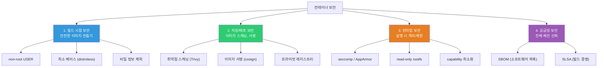
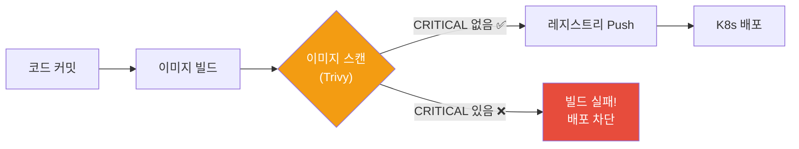
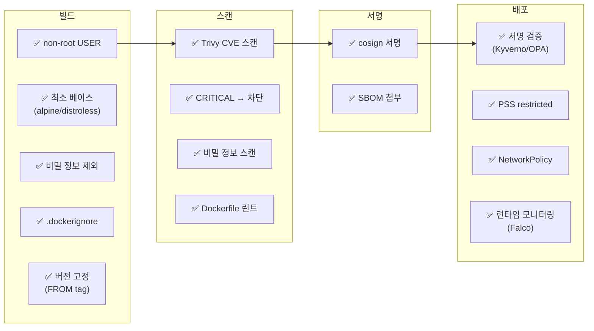

# 컨테이너 보안 (rootless / scanning / signing)

> 컨테이너는 편리하지만, 기본 설정 그대로 쓰면 **보안 구멍투성이**예요. root로 실행, 취약한 베이스 이미지, 비밀 정보 노출 — 이 모든 걸 막는 컨테이너 보안의 모든 것을 배워볼게요.

---

## 🎯 이걸 왜 알아야 하나?

```
실무에서 컨테이너 보안 관련 업무:
• 보안 감사: "이미지에 CRITICAL CVE가 있어요"       → 이미지 스캐닝
• 규정 준수: "컨테이너를 non-root로 실행해야 해요"  → rootless 구성
• CI/CD: "취약한 이미지는 배포 차단해야 해요"       → 스캔 게이트
• 신뢰성: "이 이미지가 우리 CI에서 빌드된 건가요?"   → 이미지 서명
• 런타임: "컨테이너가 탈출하면 어쩌죠?"             → seccomp, AppArmor
• K8s: "Pod Security Standards를 적용해야 해요"     → PSS/PSA
```

이미 [Linux 보안](../01-linux/14-security)에서 SELinux/AppArmor/seccomp를 배웠고, [네트워크 보안](../02-networking/09-network-security)에서 WAF/Zero Trust를 배웠죠? 이번에는 **컨테이너 특화 보안**이에요.

---

## 🧠 핵심 개념

### 컨테이너 보안의 4가지 축



---

## 🔍 상세 설명 — 빌드 시점 보안

### non-root 실행 (★ 가장 중요하고 가장 쉬운 보안!)

```dockerfile
# ❌ root로 실행 (기본값!)
FROM node:20-alpine
WORKDIR /app
COPY . .
CMD ["node", "server.js"]
# → PID 1이 root로 실행됨!
# → 컨테이너 탈출 시 호스트 root 권한 획득 가능!

# ✅ non-root 실행
FROM node:20-alpine
WORKDIR /app
COPY --chown=node:node . .    # 파일 소유자를 node로
USER node                      # ← node 사용자로 전환!
CMD ["node", "server.js"]
# → PID 1이 node(uid=1000)로 실행!
```

```bash
# 확인
docker run --rm myapp:v1.0 whoami
# node    ← non-root! ✅

docker run --rm myapp:v1.0 id
# uid=1000(node) gid=1000(node) groups=1000(node)

# 파이썬/Go 등 node 사용자가 없는 이미지:
# RUN addgroup -S appgroup && adduser -S appuser -G appgroup
# USER appuser
```

**node 이미지에 내장된 사용자:**
```bash
# node:20-alpine 이미지에는 이미 'node' 사용자가 있음 (uid=1000)
docker run --rm node:20-alpine cat /etc/passwd | grep node
# node:x:1000:1000:Linux User,,,:/home/node:/bin/sh
# → USER node만 쓰면 됨!
```

### 비밀 정보 관리

```dockerfile
# ❌ 이미지에 비밀 정보 넣기
ENV DB_PASSWORD=secret123           # 환경변수 → docker inspect로 보임!
COPY .env /app/.env                  # 파일 → 이미지 레이어에 영구 저장!
ARG API_KEY=abc123                   # 빌드 인자 → docker history로 보임!

# ✅ 비밀 정보는 런타임에 주입
# Docker:
docker run -e DB_PASSWORD=secret123 myapp
# → 이미지에는 안 들어가고 런타임에만 존재

# K8s Secret:
# kubectl create secret generic db-creds --from-literal=password=secret123
# → Pod에서 환경변수 또는 파일로 마운트

# Docker BuildKit 시크릿 (빌드 중에만 사용, 이미지에 안 남음!):
# syntax=docker/dockerfile:1
FROM node:20-alpine
RUN --mount=type=secret,id=npmrc,target=/root/.npmrc \
    npm ci --production
# docker build --secret id=npmrc,src=.npmrc .
```

```bash
# 이미지에 비밀 정보가 들어갔는지 검사

# docker history로 확인
docker history myapp:v1.0 --no-trunc | grep -iE "password|secret|key|token"

# 이미지 레이어를 직접 탐색
docker save myapp:v1.0 | tar -x -C /tmp/image-check/
find /tmp/image-check -name "*.tar" -exec tar -tf {} \; | grep -iE "\.env|secret|key"

# 자동 스캔 도구
# Trivy가 비밀 정보도 탐지:
docker run --rm -v /var/run/docker.sock:/var/run/docker.sock \
    aquasec/trivy:latest image --scanners secret myapp:v1.0
# /app/.env (secrets found!)
# AWS_SECRET_ACCESS_KEY=AKIA...
# → 발견하면 즉시 이미지 재빌드 + 키 회전!
```

### 최소 권한 원칙 (Principle of Least Privilege)

```dockerfile
# ✅ 보안 강화 Dockerfile (모범 사례 종합)

FROM node:20-alpine AS builder
WORKDIR /app
COPY package*.json ./
RUN npm ci --production
COPY . .

FROM gcr.io/distroless/nodejs20-debian12
# → 쉘 없음, 패키지 매니저 없음, 디버깅 도구 없음

WORKDIR /app
COPY --from=builder /app .

# 포트 문서화
EXPOSE 3000

# 헬스체크
HEALTHCHECK --interval=30s --timeout=3s \
    CMD ["node", "-e", "require('http').get('http://localhost:3000/health', (r) => process.exit(r.statusCode === 200 ? 0 : 1))"]

# 시작
CMD ["server.js"]
```

```bash
# 보안 실행 옵션 종합
docker run -d \
    --name secure-app \
    --user 1000:1000 \                             # non-root
    --read-only \                                   # 읽기 전용 rootfs
    --tmpfs /tmp:rw,noexec,nosuid,size=50m \       # /tmp만 쓰기 가능
    --cap-drop ALL \                                # 모든 capability 제거
    --cap-add NET_BIND_SERVICE \                    # 필요한 것만 추가
    --security-opt no-new-privileges:true \         # 권한 상승 차단
    --security-opt seccomp=default \                # seccomp 기본 프로필
    --memory 256m \                                 # 메모리 제한
    --cpus 0.5 \                                    # CPU 제한
    --pids-limit 50 \                               # 프로세스 수 제한
    --network myapp-net \                           # 격리된 네트워크
    myapp:v1.0
```

---

## 🔍 상세 설명 — 이미지 스캐닝 (★ 실무 필수!)

### Trivy — 가장 많이 쓰는 스캐너

```bash
# Trivy: Aqua Security의 오픈소스 보안 스캐너
# → CVE(취약점), 설정 오류, 비밀 정보, 라이선스 스캔

# 설치
curl -sfL https://raw.githubusercontent.com/aquasecurity/trivy/main/contrib/install.sh | sh -s -- -b /usr/local/bin

# === 이미지 스캔 ===
trivy image myapp:v1.0
# myapp:v1.0 (alpine 3.19)
#
# Total: 15 (UNKNOWN: 0, LOW: 8, MEDIUM: 4, HIGH: 2, CRITICAL: 1)
#
# ┌──────────────┬────────────────┬──────────┬───────────┬──────────────┐
# │   Library    │ Vulnerability  │ Severity │ Installed │    Fixed     │
# ├──────────────┼────────────────┼──────────┼───────────┼──────────────┤
# │ openssl      │ CVE-2024-XXXX  │ CRITICAL │ 3.1.0     │ 3.1.5        │
# │ curl         │ CVE-2024-YYYY  │ HIGH     │ 8.5.0     │ 8.6.0        │
# │ libcrypto3   │ CVE-2024-ZZZZ  │ HIGH     │ 3.1.0     │ 3.1.5        │
# │ zlib         │ CVE-2024-WWWW  │ MEDIUM   │ 1.2.13    │ 1.3.0        │
# └──────────────┴────────────────┴──────────┴───────────┴──────────────┘

# CRITICAL/HIGH만 표시
trivy image --severity CRITICAL,HIGH myapp:v1.0

# 수정 가능한 것만 표시
trivy image --ignore-unfixed myapp:v1.0

# CI/CD에서 게이트 (CRITICAL이 있으면 빌드 실패!)
trivy image --exit-code 1 --severity CRITICAL myapp:v1.0
# → exit code 1 = 빌드 실패!

# JSON 출력 (파싱/리포팅용)
trivy image --format json --output result.json myapp:v1.0

# === Dockerfile 스캔 (설정 오류) ===
trivy config Dockerfile
# Dockerfile
#   MEDIUM: Specify a tag in the 'FROM' statement
#     → FROM node:latest는 위험!
#   HIGH: Last USER should not be root
#     → USER 지정 필요!

# === 파일 시스템 스캔 (소스 코드 의존성) ===
trivy fs --scanners vuln,secret .
# → package-lock.json, requirements.txt 등에서 취약 패키지 탐지
# → .env, *.key 등 비밀 정보 탐지

# === SBOM 생성 ===
trivy image --format spdx-json --output sbom.json myapp:v1.0
# → 이미지에 포함된 모든 소프트웨어 목록 (SBOM)
# → 공급망 보안 + 규정 준수에 필요
```

### CI/CD에서 이미지 스캐닝 자동화

```yaml
# GitHub Actions 예시
# name: Build and Scan
# jobs:
#   build:
#     runs-on: ubuntu-latest
#     steps:
#     - uses: actions/checkout@v4
#
#     - name: Build image
#       run: docker build -t myapp:${{ github.sha }} .
#
#     - name: Scan image
#       uses: aquasecurity/trivy-action@master
#       with:
#         image-ref: myapp:${{ github.sha }}
#         format: table
#         exit-code: 1                    # CRITICAL 있으면 실패!
#         severity: CRITICAL,HIGH
#         ignore-unfixed: true
#
#     - name: Push (스캔 통과 시만)
#       run: |
#         docker tag myapp:${{ github.sha }} $ECR_REPO:${{ github.sha }}
#         docker push $ECR_REPO:${{ github.sha }}
```



### 베이스 이미지별 CVE 비교

```bash
# 같은 앱, 베이스만 다르게 → CVE 수 비교

trivy image --severity CRITICAL,HIGH node:20 2>/dev/null | tail -1
# Total: 45 (HIGH: 35, CRITICAL: 10)

trivy image --severity CRITICAL,HIGH node:20-slim 2>/dev/null | tail -1
# Total: 12 (HIGH: 10, CRITICAL: 2)

trivy image --severity CRITICAL,HIGH node:20-alpine 2>/dev/null | tail -1
# Total: 3 (HIGH: 2, CRITICAL: 1)

trivy image --severity CRITICAL,HIGH gcr.io/distroless/nodejs20-debian12 2>/dev/null | tail -1
# Total: 1 (HIGH: 1, CRITICAL: 0)

# 결론:
# node:20        → CVE 45개 (❌ 위험!)
# node:20-slim   → CVE 12개
# node:20-alpine → CVE 3개 (⭐ 추천)
# distroless     → CVE 1개 (🔒 가장 안전)

# → 작은 이미지 = 적은 CVE = 더 안전!
# → (./06-image-optimization 참고)
```

---

## 🔍 상세 설명 — 이미지 서명과 검증

### cosign — 이미지 서명

```bash
# cosign: Sigstore 프로젝트의 이미지 서명 도구
# → "이 이미지가 우리 CI/CD에서 빌드된 것이 맞는지" 암호학적으로 증명

# 설치
# https://docs.sigstore.dev/cosign/installation/

# === 키 기반 서명 ===

# 1. 키 쌍 생성
cosign generate-key-pair
# Enter password for private key:
# Private key written to cosign.key
# Public key written to cosign.pub

# 2. 이미지 서명
cosign sign --key cosign.key myrepo/myapp:v1.0
# Pushing signature to: myrepo/myapp:sha256-abc123.sig

# 3. 서명 검증
cosign verify --key cosign.pub myrepo/myapp:v1.0
# Verification for myrepo/myapp:v1.0 --
# The signatures were verified against the specified public key
# [{"critical":{"identity":{"docker-reference":"myrepo/myapp"},...}]
# → 검증 성공! ✅

# === Keyless 서명 (키 관리 불필요! ⭐ 추천) ===

# OIDC(GitHub, Google 등) 인증으로 서명
cosign sign myrepo/myapp:v1.0
# → 브라우저에서 GitHub/Google 로그인
# → Sigstore의 투명성 로그(Rekor)에 기록
# → 키 없이도 서명/검증 가능!

# Keyless 검증
cosign verify \
    --certificate-identity "https://github.com/myorg/myrepo/.github/workflows/build.yml@refs/heads/main" \
    --certificate-oidc-issuer "https://token.actions.githubusercontent.com" \
    myrepo/myapp:v1.0
# → GitHub Actions에서 빌드된 이미지인지 검증!
```

### K8s에서 서명된 이미지만 허용 (정책 강제)

```yaml
# Kyverno 정책: cosign으로 서명된 이미지만 배포 허용
apiVersion: kyverno.io/v1
kind: ClusterPolicy
metadata:
  name: verify-image-signature
spec:
  validationFailureAction: Enforce    # 강제 (Audit면 로그만)
  rules:
  - name: verify-cosign
    match:
      any:
      - resources:
          kinds:
          - Pod
    verifyImages:
    - imageReferences:
      - "myrepo/*"
      attestors:
      - entries:
        - keys:
            publicKeys: |-
              -----BEGIN PUBLIC KEY-----
              MFkwEwYHKoZIzj0CAQYIKoZIzj0DAQcDQgAE...
              -----END PUBLIC KEY-----

# → 서명 안 된 이미지로 Pod 생성 시도 시:
# Error: image verification failed for myrepo/myapp:v1.0
# → 배포 차단! ✅
```

---

## 🔍 상세 설명 — 런타임 보안

### Docker 보안 옵션 상세

```bash
# === Capability 관리 ===

# Linux capabilities: root 권한을 세분화한 것
# → 전체 root 대신 필요한 권한만 부여

# 기본 Docker 컨테이너의 capabilities 확인
docker run --rm alpine sh -c "cat /proc/1/status | grep Cap"
# CapPrm: 00000000a80425fb
# → 14개의 capability가 기본 부여됨

# 모든 capability 제거 → 필요한 것만 추가
docker run --rm \
    --cap-drop ALL \
    --cap-add NET_BIND_SERVICE \
    alpine sh -c "cat /proc/1/status | grep Cap"
# CapPrm: 0000000000000400
# → NET_BIND_SERVICE(1024 이하 포트 바인딩)만 남음!

# 주요 capability:
# NET_BIND_SERVICE — 1024 이하 포트 바인딩
# CHOWN            — 파일 소유자 변경
# SETUID/SETGID    — UID/GID 변경
# SYS_PTRACE       — 프로세스 디버깅 (strace 등)
# NET_ADMIN        — 네트워크 설정 변경
# SYS_ADMIN        — 매우 위험! mount, cgroup 접근 등

# ⚠️ --privileged = 모든 capability + 모든 디바이스 접근
# → 절대 프로덕션에서 쓰지 마세요!
docker run --privileged myapp    # ❌ 절대 금지!
```

```bash
# === seccomp 프로필 ===
# (../01-linux/14-security에서 자세히 다뤘음)

# Docker 기본 seccomp: ~44개 위험한 syscall 차단
# → mount, reboot, ptrace, init_module 등

# 커스텀 프로필 적용
docker run --security-opt seccomp=/path/to/profile.json myapp

# seccomp 비활성화 (⚠️ 디버깅용만!)
docker run --security-opt seccomp=unconfined myapp

# === AppArmor ===

# Docker 기본 AppArmor 프로필 (docker-default)
docker run --security-opt apparmor=docker-default myapp

# 프로필 확인
docker inspect myapp --format '{{.AppArmorProfile}}'
# docker-default

# === 읽기 전용 파일 시스템 ===

docker run --read-only \
    --tmpfs /tmp:rw,noexec,nosuid,size=50m \
    --tmpfs /var/run:rw,noexec,nosuid,size=10m \
    myapp

# → 공격자가 악성 파일을 쓸 수 없음!
# → 앱이 쓰기가 필요한 경로만 tmpfs/볼륨으로

# === no-new-privileges ===

docker run --security-opt no-new-privileges:true myapp
# → setuid 바이너리로 권한 상승 차단!
# → SUID가 붙은 파일을 실행해도 권한이 올라가지 않음
```

### K8s Pod Security Standards (PSS)

```yaml
# K8s 1.25+에서 Pod Security Admission(PSA)으로 보안 정책 강제

# 네임스페이스에 보안 수준 적용
apiVersion: v1
kind: Namespace
metadata:
  name: production
  labels:
    pod-security.kubernetes.io/enforce: restricted     # ⭐ 가장 엄격!
    pod-security.kubernetes.io/audit: restricted
    pod-security.kubernetes.io/warn: restricted

# 보안 수준:
# privileged — 제한 없음 (기본)
# baseline   — 기본 보안 (위험한 설정 차단)
# restricted — 가장 엄격 (non-root 필수, readOnlyRootFilesystem 등) ⭐

# restricted에서 요구하는 것:
# ✅ runAsNonRoot: true
# ✅ allowPrivilegeEscalation: false
# ✅ capabilities.drop: ["ALL"]
# ✅ seccompProfile.type: RuntimeDefault
# ❌ hostNetwork, hostPID, hostIPC 불가
# ❌ privileged 불가
```

```yaml
# restricted 수준을 만족하는 Pod 예시
apiVersion: v1
kind: Pod
metadata:
  name: secure-pod
  namespace: production    # restricted가 적용된 네임스페이스
spec:
  securityContext:
    runAsNonRoot: true
    runAsUser: 1000
    runAsGroup: 1000
    fsGroup: 1000
    seccompProfile:
      type: RuntimeDefault
  containers:
  - name: myapp
    image: myapp:v1.0
    securityContext:
      allowPrivilegeEscalation: false
      readOnlyRootFilesystem: true
      capabilities:
        drop: ["ALL"]
    resources:
      limits:
        memory: "256Mi"
        cpu: "500m"
    volumeMounts:
    - name: tmp
      mountPath: /tmp
  volumes:
  - name: tmp
    emptyDir:
      medium: Memory
      sizeLimit: 50Mi
```

---

## 🔍 상세 설명 — 공급망 보안 (Supply Chain Security)

### SBOM (Software Bill of Materials)

```bash
# SBOM: 이미지에 포함된 모든 소프트웨어의 목록
# → "이 이미지에 뭐가 들어있지?" 에 대한 명세서
# → 새로운 CVE가 발견되면 영향 받는 이미지를 빠르게 찾을 수 있음

# Trivy로 SBOM 생성
trivy image --format spdx-json --output sbom.json myapp:v1.0

# Syft로 SBOM 생성
syft myapp:v1.0 -o spdx-json > sbom.json

# SBOM 내용 예시:
# {
#   "packages": [
#     {"name": "openssl", "version": "3.1.0"},
#     {"name": "curl", "version": "8.5.0"},
#     {"name": "node", "version": "20.11.1"},
#     {"name": "express", "version": "4.18.2"},
#     ...
#   ]
# }

# SBOM을 이미지에 첨부 (cosign으로)
cosign attest --key cosign.key --type spdxjson --predicate sbom.json myrepo/myapp:v1.0
# → 이미지 + SBOM이 함께 레지스트리에 저장

# SBOM이 왜 중요한가?
# 1. Log4Shell(CVE-2021-44228) 같은 사건 때:
#    "우리 이미지 중 Log4j를 쓰는 게 뭐가 있지?"
#    → SBOM으로 즉시 검색 가능!
# 2. 미국 정부/금융 규제에서 SBOM 의무화 추세
# 3. 고객에게 "우리 소프트웨어에 뭐가 들어있는지" 투명하게 공개
```

### 보안 체크리스트 — 전체 파이프라인



---

## 💻 실습 예제

### 실습 1: non-root 컨테이너 만들기

```bash
mkdir -p /tmp/secure-app && cd /tmp/secure-app

cat << 'EOF' > server.js
const http = require('http');
const os = require('os');
const server = http.createServer((req, res) => {
  res.writeHead(200);
  res.end(JSON.stringify({
    user: os.userInfo().username,
    uid: process.getuid(),
    pid: process.pid
  }));
});
server.listen(3000, () => console.log(`Running as uid=${process.getuid()}`));
EOF

echo '{"name":"secure","version":"1.0.0"}' > package.json
echo "node_modules" > .dockerignore

# ❌ root 버전
cat << 'EOF' > Dockerfile.root
FROM node:20-alpine
WORKDIR /app
COPY . .
CMD ["node", "server.js"]
EOF

# ✅ non-root 버전
cat << 'EOF' > Dockerfile.secure
FROM node:20-alpine
WORKDIR /app
COPY --chown=node:node . .
USER node
CMD ["node", "server.js"]
EOF

# 빌드
docker build -f Dockerfile.root -t app:root .
docker build -f Dockerfile.secure -t app:secure .

# 비교
docker run --rm app:root node -e "console.log('uid='+process.getuid())"
# uid=0    ← root! ❌

docker run --rm app:secure node -e "console.log('uid='+process.getuid())"
# uid=1000  ← node! ✅

# 정리
docker rmi app:root app:secure
rm -rf /tmp/secure-app
```

### 실습 2: Trivy로 이미지 스캔

```bash
# 여러 베이스의 CVE 비교
for image in "node:20" "node:20-slim" "node:20-alpine"; do
    echo "=== $image ==="
    docker run --rm -v /var/run/docker.sock:/var/run/docker.sock \
        aquasec/trivy:latest image --severity CRITICAL,HIGH --quiet "$image" 2>/dev/null | tail -1
    echo ""
done

# Dockerfile 스캔
cat << 'EOF' > /tmp/Dockerfile.bad
FROM node:latest
COPY . .
RUN npm install
CMD node server.js
EOF

docker run --rm -v /tmp:/workdir aquasec/trivy:latest config /workdir/Dockerfile.bad
# Failures: 3
# MEDIUM: Specify a tag in FROM
# HIGH: Last USER should not be root
# LOW: Use COPY instead of ADD

rm /tmp/Dockerfile.bad
```

### 실습 3: 보안 실행 옵션 테스트

```bash
# 1. 기본 (보안 약함)
docker run --rm alpine sh -c "whoami && cat /proc/1/status | grep Cap"
# root
# CapPrm: 00000000a80425fb    ← 많은 capability!

# 2. 보안 강화
docker run --rm \
    --user 1000:1000 \
    --cap-drop ALL \
    --read-only \
    --security-opt no-new-privileges:true \
    alpine sh -c "whoami && cat /proc/1/status | grep Cap"
# whoami: unknown uid 1000
# CapPrm: 0000000000000000    ← capability 없음!

# 3. read-only 테스트
docker run --rm --read-only alpine touch /test
# touch: /test: Read-only file system    ← 쓰기 불가! ✅

docker run --rm --read-only --tmpfs /tmp alpine touch /tmp/test
echo $?
# 0    ← /tmp는 쓰기 가능 (tmpfs)
```

---

## 🏢 실무에서는?

### 시나리오 1: 보안 감사 대응

```bash
# "컨테이너 보안 감사를 해야 해요"

# 1. 전체 이미지 스캔
for repo in $(aws ecr describe-repositories --query 'repositories[*].repositoryName' --output text); do
    echo "=== $repo ==="
    latest=$(aws ecr describe-images --repository-name $repo --query 'sort_by(imageDetails,& imagePushedAt)[-1].imageTags[0]' --output text)
    if [ "$latest" != "None" ]; then
        trivy image --severity CRITICAL,HIGH --quiet "$ACCOUNT.dkr.ecr.$REGION.amazonaws.com/$repo:$latest"
    fi
done

# 2. 결과 리포트 생성
trivy image --format json --output report.json myapp:v1.0
# → JSON 리포트를 보안 팀에 제출

# 3. 개선 계획:
# a. CRITICAL CVE → 48시간 내 수정 (베이스 이미지 업데이트)
# b. HIGH CVE → 7일 내 수정
# c. non-root 실행 확인
# d. CI/CD에 스캔 게이트 추가
```

### 시나리오 2: 컨테이너 탈출 방지

```bash
# "컨테이너가 해킹되면 호스트까지 뚫릴 수 있나요?"

# 기본 설정(root + default capabilities)이면 → 위험할 수 있음!

# 방어 계층:
# 1층: non-root 실행 → 기본 탈출 경로 차단
# 2층: capabilities 최소화 → 커널 조작 차단
# 3층: seccomp → 위험한 시스템 호출 차단
# 4층: AppArmor/SELinux → 추가 접근 제어
# 5층: read-only rootfs → 악성 파일 쓰기 차단
# 6층: no-new-privileges → 권한 상승 차단

# 모든 계층 적용:
docker run -d \
    --user 1000:1000 \
    --cap-drop ALL \
    --security-opt seccomp=default \
    --security-opt apparmor=docker-default \
    --security-opt no-new-privileges:true \
    --read-only \
    --tmpfs /tmp \
    myapp:v1.0

# 더 강한 격리가 필요하면:
# → gVisor (사용자 공간 커널)
# → Kata Containers (마이크로 VM)
# → (./04-runtime 참고)
```

### 시나리오 3: CI/CD 보안 파이프라인 구축

```bash
#!/bin/bash
# secure-build.sh — 보안 빌드 파이프라인

set -euo pipefail

IMAGE="myrepo/myapp"
TAG="${GITHUB_SHA:-$(git rev-parse --short HEAD)}"

echo "=== 1. Dockerfile 린트 ==="
docker run --rm -v "$(pwd)":/workdir aquasec/trivy:latest config /workdir/Dockerfile
# → Dockerfile 설정 오류 확인

echo "=== 2. 이미지 빌드 ==="
docker build -t "$IMAGE:$TAG" .

echo "=== 3. 취약점 스캔 ==="
trivy image --exit-code 1 --severity CRITICAL "$IMAGE:$TAG"
# → CRITICAL CVE가 있으면 여기서 실패!

echo "=== 4. 비밀 정보 스캔 ==="
trivy image --scanners secret --exit-code 1 "$IMAGE:$TAG"
# → 비밀 정보가 이미지에 있으면 실패!

echo "=== 5. 이미지 Push ==="
docker push "$IMAGE:$TAG"

echo "=== 6. 이미지 서명 ==="
cosign sign --key cosign.key "$IMAGE:$TAG"

echo "=== 7. SBOM 생성 + 첨부 ==="
trivy image --format spdx-json --output sbom.json "$IMAGE:$TAG"
cosign attest --key cosign.key --type spdxjson --predicate sbom.json "$IMAGE:$TAG"

echo "✅ 보안 빌드 완료: $IMAGE:$TAG"
```

---

## ⚠️ 자주 하는 실수

### 1. root로 실행하기

```bash
# ❌ USER를 지정 안 하면 root (uid=0)
# → 컨테이너 탈출 시 호스트 root 권한!

# ✅ 반드시 USER 지정
# USER node (Node.js)
# USER appuser (직접 생성)
```

### 2. --privileged 사용

```bash
# ❌ "안 되니까 privileged로!"
docker run --privileged myapp
# → 모든 capability + 모든 디바이스 접근 = 호스트와 동일!

# ✅ 필요한 capability만 추가
docker run --cap-add SYS_PTRACE myapp    # strace가 필요하면
docker run --cap-add NET_ADMIN myapp     # 네트워크 설정이 필요하면
```

### 3. 이미지 스캐닝을 안 하기

```bash
# ❌ 빌드만 하고 스캔 없이 배포
# → 알려진 취약점이 프로덕션에!

# ✅ CI/CD에서 자동 스캔 + CRITICAL 차단
# → Trivy + exit-code 1
```

### 4. 비밀 정보를 이미지에 넣기

```bash
# ❌ .env 파일, API 키, 인증서를 COPY
# → docker history, docker save로 누구나 볼 수 있음!

# ✅ 런타임 주입 (환경변수, K8s Secret, Vault)
# ✅ BuildKit --mount=type=secret (빌드 중에만)
```

### 5. 베이스 이미지를 업데이트 안 하기

```bash
# ❌ 1년 전 베이스 이미지 그대로
FROM node:18-alpine3.17    # 1년 전 버전, CVE 많음!

# ✅ 정기적으로 베이스 업데이트
FROM node:20-alpine3.19    # 최신 안정 버전

# CI/CD에서 자동화:
# Dependabot / Renovate로 Dockerfile의 FROM 태그 자동 업데이트 PR
```

---

## 📝 정리

### 컨테이너 보안 체크리스트

```
빌드 시점:
✅ non-root USER
✅ 최소 베이스 이미지 (alpine/distroless)
✅ 비밀 정보 제외 (.dockerignore, BuildKit secret)
✅ 정확한 버전 태그 (latest 금지)
✅ COPY 사용 (ADD 금지)
✅ 불필요한 도구 설치 안 함

스캔:
✅ CI/CD에서 Trivy 자동 스캔
✅ CRITICAL/HIGH → 배포 차단
✅ 비밀 정보 스캔
✅ SBOM 생성

런타임:
✅ --cap-drop ALL + 필요한 것만 --cap-add
✅ --read-only + tmpfs
✅ --security-opt no-new-privileges
✅ seccomp 기본 프로필
✅ --memory, --cpus, --pids-limit
✅ --privileged 절대 금지!

K8s:
✅ Pod Security Standards: restricted
✅ NetworkPolicy
✅ 서명 검증 (Kyverno/OPA)
```

### 보안 도구

```
이미지 스캐닝:  Trivy ⭐, Snyk, Grype, Docker Scout
이미지 서명:    cosign (Sigstore)
SBOM:          Trivy, Syft
Dockerfile 린트: hadolint, Trivy config
런타임 모니터링: Falco, Sysdig
정책 강제:      Kyverno, OPA/Gatekeeper
비밀 관리:      Vault, AWS Secrets Manager, K8s Secrets
```

---

## 🔗 다음 카테고리

🎉 **03-Containers 카테고리 완료!**

9개 강의를 통해 컨테이너의 개념부터 Docker CLI, Dockerfile, 런타임, 네트워크, 이미지 최적화, 레지스트리, 트러블슈팅, 보안까지 — 컨테이너의 모든 것을 다뤘어요.

다음은 **[04-kubernetes/01-architecture](../04-kubernetes/01-architecture)** 로 넘어가요.

드디어 Kubernetes! Linux를 배우고, 네트워크를 배우고, 컨테이너를 배웠으니 — 이 모든 것을 **오케스트레이션**하는 K8s의 세계로 들어갈 준비가 됐어요!
