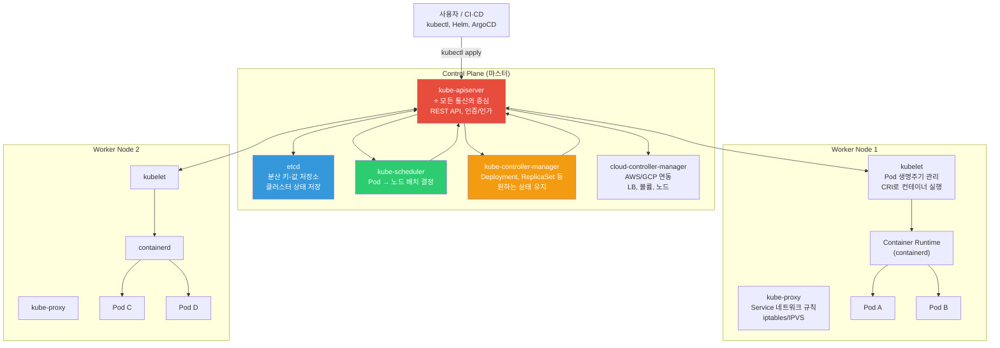
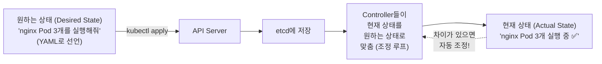
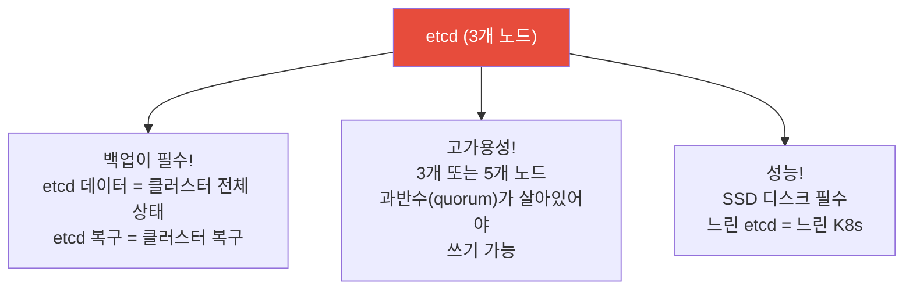
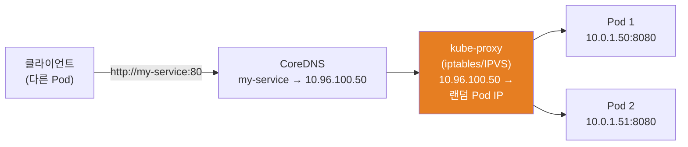
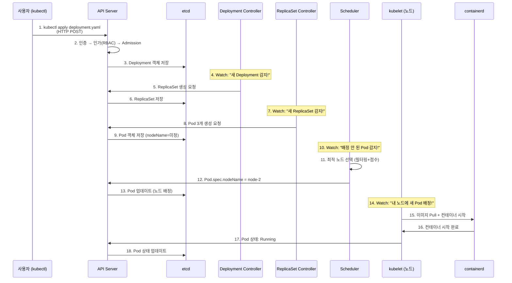
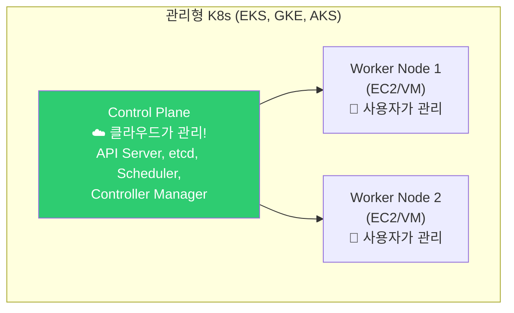
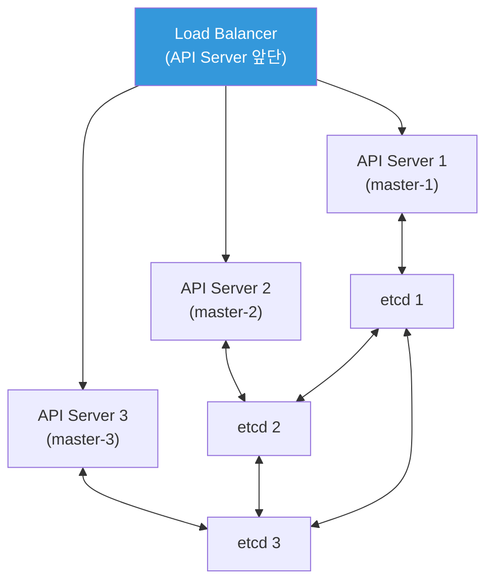

# Kubernetes 클러스터 아키텍처

> 드디어 Kubernetes! [Linux](../01-linux/01-filesystem)를 배우고, [네트워크](../02-networking/01-osi-tcp-udp)를 배우고, [컨테이너](../03-containers/01-concept)를 배웠으니 — 이 모든 것을 **자동으로 관리해주는 오케스트레이션 플랫폼** K8s의 세계로 들어가요. 이번 강의에서는 K8s의 전체 구조를 완벽히 이해하는 게 목표예요.

---

## 🎯 이걸 왜 알아야 하나?

```
K8s 아키텍처를 알면 이해되는 것들:
• "kubectl apply 하면 내부에서 무슨 일이 일어나지?"
• "etcd가 뭔데 그렇게 중요하죠?"
• "마스터 노드가 죽으면 어떻게 되나요?"
• "Pod가 어떤 노드에서 실행될지 누가 결정하죠?"
• "kubelet이 뭐하는 건데요?"
• "K8s 장애 진단할 때 어디를 봐야 하나요?"
• 면접: "K8s 아키텍처를 설명해주세요" (가장 흔한 질문!)
```

---

## 🧠 핵심 개념

### 비유: 물류 센터

K8s를 **대형 물류 센터**에 비유해볼게요.

* **Control Plane (마스터)** = 본부 사무실. 주문 접수, 배치 계획, 재고 관리
* **Worker Node** = 물류 창고. 실제 물건(컨테이너)을 보관하고 처리
* **etcd** = 본부의 데이터베이스. 모든 주문, 재고, 배치 정보가 저장됨
* **API Server** = 본부의 접수 창구. 모든 요청이 여기를 거침
* **Scheduler** = 배치 담당자. "이 물건은 어느 창고에 넣을까?"
* **Controller Manager** = 품질 관리자. "재고가 3개여야 하는데 2개네? 1개 추가!"
* **kubelet** = 각 창고의 관리인. 본부 지시를 받아서 창고를 관리
* **kube-proxy** = 창고 간 배송 시스템. 물건을 적절한 창고로 전달
* **Pod** = 물건이 담긴 상자 (컨테이너를 감싸는 최소 단위)

---

## 🔍 상세 설명 — 전체 아키텍처

### K8s 클러스터 전체 그림



### 핵심 원칙: "선언적 상태 관리"



```bash
# 선언적: "이 상태가 되어야 해" (YAML로 선언)
kubectl apply -f deployment.yaml
# → "nginx 3개를 유지해줘"
# → K8s가 알아서 3개를 만들고, 죽으면 다시 만들고, 많으면 줄임

# 명령적: "이 동작을 해줘" (한 번만 실행)
kubectl run nginx --image=nginx    # 1개 생성 (유지 관리 안 함)
kubectl scale --replicas=3 deployment/nginx    # 수동으로 3개로

# ⭐ 실무에서는 항상 선언적(YAML + apply) 방식!
# → Git에 YAML을 저장 → GitOps
# → 누가 봐도 클러스터 상태를 알 수 있음
# → 변경 이력이 Git에 남음
```

---

## 🔍 상세 설명 — Control Plane 컴포넌트

### kube-apiserver (★ 가장 중요!)

**모든 통신의 중심**. kubectl, kubelet, controller, scheduler — 전부 API Server를 통해서만 소통해요.

```bash
# API Server가 하는 일:
# 1. REST API 제공 (CRUD)
# 2. 인증 (Authentication): "너 누구야?"
# 3. 인가 (Authorization): "넌 이 작업을 할 수 있어?" (RBAC)
# 4. Admission Control: "이 요청이 정책에 맞아?" (Webhook)
# 5. etcd에 상태 저장/조회
# 6. Watch 메커니즘 (변경 사항 실시간 통지)

# API Server에 직접 요청해보기
kubectl get --raw /api/v1/namespaces/default/pods | python3 -m json.tool | head -20
# {
#   "kind": "PodList",
#   "items": [
#     {
#       "metadata": {"name": "nginx-abc123", "namespace": "default"},
#       "status": {"phase": "Running"}
#     }
#   ]
# }

# API Server 상태 확인
kubectl get componentstatuses 2>/dev/null
# 또는
kubectl get --raw /healthz
# ok

kubectl get --raw /livez
# ok

kubectl get --raw /readyz
# ok

# API Server 엔드포인트 확인
kubectl cluster-info
# Kubernetes control plane is running at https://ABC123.gr7.ap-northeast-2.eks.amazonaws.com
# CoreDNS is running at https://ABC123.../api/v1/namespaces/kube-system/services/kube-dns:dns/proxy

# API 리소스 전체 목록
kubectl api-resources | head -20
# NAME                  SHORTNAMES   APIVERSION   NAMESPACED   KIND
# pods                  po           v1           true         Pod
# services              svc          v1           true         Service
# deployments           deploy       apps/v1      true         Deployment
# configmaps            cm           v1           true         ConfigMap
# secrets                            v1           true         Secret
# namespaces            ns           v1           false        Namespace
# nodes                 no           v1           false        Node
# ...
```

### etcd

**클러스터의 뇌**. 모든 상태 정보가 저장되는 분산 키-값 저장소예요.

```bash
# etcd에 저장되는 것:
# - Pod, Deployment, Service 등 모든 리소스의 상태
# - ConfigMap, Secret 데이터
# - RBAC 정보 (Role, RoleBinding)
# - 네임스페이스
# - 사용자 정의 리소스 (CRD)
# → etcd가 죽으면 = 클러스터의 기억이 사라짐!

# etcd 상태 확인 (관리형 K8s에서는 직접 접근 불가)
# kubeadm 클러스터에서:
sudo ETCDCTL_API=3 etcdctl \
    --endpoints=https://127.0.0.1:2379 \
    --cert=/etc/kubernetes/pki/etcd/peer.crt \
    --key=/etc/kubernetes/pki/etcd/peer.key \
    --cacert=/etc/kubernetes/pki/etcd/ca.crt \
    endpoint health
# 127.0.0.1:2379 is healthy: successfully committed proposal

# etcd 멤버 확인
sudo ETCDCTL_API=3 etcdctl member list
# abc123, started, etcd-master-1, https://10.0.1.10:2380, https://10.0.1.10:2379
# def456, started, etcd-master-2, https://10.0.1.11:2380, https://10.0.1.11:2379
# ghi789, started, etcd-master-3, https://10.0.1.12:2380, https://10.0.1.12:2379
# → 3개 노드로 고가용성! (과반수 = 2개 살아있으면 OK)

# ⚠️ EKS, GKE 등 관리형 K8s에서는:
# → etcd를 클라우드가 관리 (접근 불가, 백업 자동)
# → 직접 관리할 일이 없음! (이게 관리형의 장점)
```

**etcd가 왜 중요한가:**



### kube-scheduler

**Pod를 어떤 노드에 배치할지 결정**하는 컴포넌트예요.

```bash
# Scheduler의 결정 과정:
# 1. Filtering (필터링): 조건에 안 맞는 노드 제외
#    - 리소스 부족 (CPU, 메모리)
#    - nodeSelector/affinity 불일치
#    - taint에 의해 거부
#    - PV가 해당 AZ에 없음
#
# 2. Scoring (점수 매기기): 남은 노드 중 최적 선택
#    - 리소스 균형 (가장 여유 있는 노드)
#    - 같은 서비스의 Pod가 분산되도록 (anti-affinity)
#    - 이미지가 이미 있는 노드 (pull 시간 절약)
#
# 3. Binding: 선택된 노드에 Pod 배정

# Scheduler 이벤트 확인
kubectl get events --field-selector reason=Scheduled
# LAST SEEN   TYPE     REASON      OBJECT        MESSAGE
# 2m          Normal   Scheduled   pod/nginx-1   Successfully assigned default/nginx-1 to node-2
# 1m          Normal   Scheduled   pod/nginx-2   Successfully assigned default/nginx-2 to node-1

# 스케줄링 실패 확인
kubectl get events --field-selector reason=FailedScheduling
# Warning  FailedScheduling  pod/big-app  0/3 nodes are available:
#   3 Insufficient memory.
# → 모든 노드에 메모리가 부족!

# Pod가 어떤 노드에 배치됐는지 확인
kubectl get pods -o wide
# NAME      READY   STATUS    NODE     
# nginx-1   1/1     Running   node-2   ← node-2에 배치됨
# nginx-2   1/1     Running   node-1   ← node-1에 배치됨
```

### kube-controller-manager

**원하는 상태를 유지**하는 컨트롤러들의 집합이에요. "조정 루프(Reconciliation Loop)"를 끊임없이 실행해요.

```bash
# 주요 컨트롤러:

# 1. Deployment Controller
# → Deployment의 replicas 수를 유지
# → 배포 전략 (Rolling Update, Recreate) 관리
# 예: replicas: 3인데 Pod 2개만 있으면 → 1개 추가!

# 2. ReplicaSet Controller  
# → ReplicaSet의 Pod 수를 유지

# 3. Node Controller
# → 노드 상태 모니터링 (heartbeat)
# → 노드가 응답 없으면 → Pod를 다른 노드로 이동

# 4. Job Controller
# → Job이 완료될 때까지 Pod 관리

# 5. Service Account & Token Controller
# → 기본 ServiceAccount 생성, 토큰 관리

# 6. Endpoints Controller
# → Service의 Endpoints(Pod IP 목록) 관리

# 컨트롤러 작동 확인 (이벤트로)
kubectl get events --sort-by='.lastTimestamp' | tail -10
# Normal  ScalingReplicaSet  deployment/nginx  Scaled up replica set nginx-abc to 3
# Normal  SuccessfulCreate   replicaset/nginx-abc  Created pod: nginx-abc-1
# Normal  SuccessfulCreate   replicaset/nginx-abc  Created pod: nginx-abc-2
# Normal  SuccessfulCreate   replicaset/nginx-abc  Created pod: nginx-abc-3
# → Deployment Controller → ReplicaSet Controller → Pod 생성 순서!
```

### cloud-controller-manager (CCM)

**클라우드 API와 연동**하는 컴포넌트예요. AWS, GCP, Azure의 리소스를 K8s에서 관리해요.

```bash
# CCM이 하는 일:

# 1. Node Controller (클라우드)
# → EC2 인스턴스 상태 확인
# → 인스턴스가 종료되면 Node를 NotReady로 표시

# 2. Route Controller
# → 클라우드 네트워크에 Pod 라우팅 설정

# 3. Service Controller (가장 체감하는 부분!)
# → type: LoadBalancer 서비스를 만들면 → AWS ALB/NLB 자동 생성!
# → (../02-networking/06-load-balancing 참고)

kubectl get svc my-service -o wide
# NAME         TYPE           CLUSTER-IP      EXTERNAL-IP
# my-service   LoadBalancer   10.100.50.100   abc123.ap-northeast-2.elb.amazonaws.com
#                                             ^^^^^^^^^^^^^^^^^^^^^^^^^^^^^^^^^^^^^^^^^
#                                             CCM이 AWS에 ALB/NLB를 만들어줌!

# 4. Volume Controller
# → PersistentVolume을 만들면 → AWS EBS 볼륨 자동 생성
```

---

## 🔍 상세 설명 — Worker Node 컴포넌트

### kubelet

**노드의 에이전트**. API Server의 지시를 받아서 **Pod를 실행하고 관리**해요.

```bash
# kubelet이 하는 일:
# 1. API Server에서 이 노드에 배정된 Pod 목록을 받음
# 2. CRI(Container Runtime Interface)를 통해 컨테이너 실행
#    → containerd에 "이 이미지로 컨테이너 시작해줘"
# 3. Pod 상태를 API Server에 보고 (heartbeat)
# 4. liveness/readiness/startup probe 실행
# 5. 리소스(CPU, 메모리) 모니터링
# 6. 볼륨 마운트 관리
# 7. 로그 관리

# kubelet 상태 확인
systemctl status kubelet
# ● kubelet.service - kubelet: The Kubernetes Node Agent
#    Active: active (running) since ...

# kubelet 로그 (노드 문제 진단 시!)
sudo journalctl -u kubelet --since "10 min ago" | tail -20
# → Pod 생성 실패, 이미지 pull 실패 등의 에러가 나옴

# kubelet 설정 확인
kubectl get --raw "/api/v1/nodes/$(hostname)/proxy/configz" 2>/dev/null | python3 -m json.tool | head -20

# 노드의 allocatable 리소스 (Pod에 할당 가능한 리소스)
kubectl describe node node-1 | grep -A 10 "Allocatable"
# Allocatable:
#   cpu:                3920m     ← 4코어 중 3.92코어 할당 가능 (kubelet이 일부 예약)
#   memory:             7484Mi    ← 8GB 중 7.5GB 할당 가능
#   pods:               110       ← 최대 Pod 수
#   ephemeral-storage:  47884Mi

# 노드에서 실행 중인 Pod 확인
kubectl get pods --field-selector spec.nodeName=node-1 -A
```

### kube-proxy

**Service의 네트워크 규칙**을 관리해요. Service ClusterIP로 들어오는 요청을 실제 Pod IP로 전달하는 규칙을 만들어요.

```bash
# kube-proxy가 하는 일:
# Service ClusterIP(10.96.100.50) → 실제 Pod IP(10.0.1.50, 10.0.1.51)로 DNAT

# 구현 방식:

# 1. iptables 모드 (기본)
# → Service마다 iptables NAT 규칙 생성
# → Service가 많아지면 (수천 개) 규칙이 많아져서 느려질 수 있음

# 2. IPVS 모드 (대규모 추천)
# → Linux 커널의 IPVS(IP Virtual Server) 사용
# → 해시 테이블로 관리 → Service가 많아도 성능 유지
# → 더 많은 로드 밸런싱 알고리즘 지원

# kube-proxy 모드 확인
kubectl get configmap kube-proxy -n kube-system -o yaml | grep mode
# mode: "iptables"    ← 또는 "ipvs"

# iptables 규칙 확인 (kube-proxy가 만든 것)
sudo iptables -t nat -L -n | grep my-service
# KUBE-SVC-XXXXX  tcp  --  0.0.0.0/0  10.96.100.50  tcp dpt:80
# → 10.96.100.50:80으로 오는 요청을 Pod로 분배

# Service의 Endpoints 확인 (kube-proxy가 이걸 보고 규칙 생성)
kubectl get endpoints my-service
# NAME         ENDPOINTS                       AGE
# my-service   10.0.1.50:8080,10.0.1.51:8080  5d
#              ^^^^^^^^^^^^^^  ^^^^^^^^^^^^^^
#              Pod 1의 IP      Pod 2의 IP

# (../02-networking/12-service-discovery에서 Service Discovery를 자세히 다뤘음)
```



---

## 🔍 상세 설명 — kubectl apply의 전체 여정

`kubectl apply -f deployment.yaml`을 실행하면 내부에서 무슨 일이 일어나는지 전체 과정을 따라가볼게요.



```bash
# 이 과정을 실시간으로 관찰할 수 있어요!

# 터미널 1: 이벤트 실시간 관찰
kubectl get events -w

# 터미널 2: Pod 상태 실시간 관찰
kubectl get pods -w

# 터미널 3: Deployment 배포
kubectl apply -f - << 'EOF'
apiVersion: apps/v1
kind: Deployment
metadata:
  name: nginx-demo
spec:
  replicas: 3
  selector:
    matchLabels:
      app: nginx
  template:
    metadata:
      labels:
        app: nginx
    spec:
      containers:
      - name: nginx
        image: nginx:1.25
        ports:
        - containerPort: 80
EOF

# 터미널 1 (이벤트):
# Normal  ScalingReplicaSet  deployment/nginx-demo  Scaled up replica set nginx-demo-abc to 3
# Normal  SuccessfulCreate   replicaset/nginx-demo-abc  Created pod: nginx-demo-abc-1
# Normal  Scheduled          pod/nginx-demo-abc-1  Successfully assigned default/nginx-demo-abc-1 to node-2
# Normal  Pulling            pod/nginx-demo-abc-1  Pulling image "nginx:1.25"
# Normal  Pulled             pod/nginx-demo-abc-1  Successfully pulled image "nginx:1.25"
# Normal  Created            pod/nginx-demo-abc-1  Created container nginx
# Normal  Started            pod/nginx-demo-abc-1  Started container nginx

# → Deployment → ReplicaSet → Pod → Scheduling → Pull → Start 순서!

# 정리
kubectl delete deployment nginx-demo
```

---

## 🔍 상세 설명 — 관리형 K8s vs 자체 설치

### EKS, GKE, AKS (관리형)



```bash
# 관리형 K8s (EKS)의 장점:
# ✅ Control Plane을 AWS가 관리 (etcd 백업, 업그레이드, 고가용성)
# ✅ 마스터 노드 수, etcd 걱정 불필요
# ✅ 클릭 몇 번으로 클러스터 생성
# ✅ IAM 연동, VPC 연동 등 클라우드 통합
# ❌ Control Plane에 SSH 접근 불가 (커스텀 제한)
# ❌ 비용 (EKS: $0.10/시간 = ~$73/월 + 노드 비용)

# EKS 클러스터 정보
kubectl cluster-info
# Kubernetes control plane is running at https://ABC123.gr7.ap-northeast-2.eks.amazonaws.com

# EKS에서는 etcd에 직접 접근 불가!
# → AWS가 자동 백업/관리

# 노드 확인
kubectl get nodes -o wide
# NAME                    STATUS   ROLES    VERSION   OS-IMAGE             CONTAINER-RUNTIME
# ip-10-0-1-50.ec2...    Ready    <none>   v1.28.0   Amazon Linux 2023    containerd://1.7.2
# ip-10-0-1-51.ec2...    Ready    <none>   v1.28.0   Amazon Linux 2023    containerd://1.7.2
# → ROLES이 <none> = Worker Node (EKS에서는 마스터가 안 보임)
```

### kubeadm (자체 설치)

```bash
# 자체 설치 K8s:
# ✅ 완전한 제어 (etcd 직접 관리, 커스텀 가능)
# ✅ 온프레미스/프라이빗 클라우드
# ✅ 비용 (EC2/VM 비용만)
# ❌ Control Plane 직접 관리 (업그레이드, 백업, 고가용성)
# ❌ 초기 설정 복잡
# ❌ etcd 관리가 매우 중요하고 어려움

# kubeadm으로 설치하면 노드 구조:
kubectl get nodes
# NAME       STATUS   ROLES           VERSION
# master-1   Ready    control-plane   v1.28.0    ← Control Plane
# master-2   Ready    control-plane   v1.28.0    ← Control Plane (HA)
# master-3   Ready    control-plane   v1.28.0    ← Control Plane (HA)
# worker-1   Ready    <none>          v1.28.0    ← Worker
# worker-2   Ready    <none>          v1.28.0    ← Worker

# Control Plane 컴포넌트 확인 (자체 설치에서만)
kubectl get pods -n kube-system
# NAME                              READY   STATUS    NODE
# etcd-master-1                     1/1     Running   master-1
# etcd-master-2                     1/1     Running   master-2
# etcd-master-3                     1/1     Running   master-3
# kube-apiserver-master-1           1/1     Running   master-1
# kube-controller-manager-master-1  1/1     Running   master-1
# kube-scheduler-master-1           1/1     Running   master-1
# coredns-5644d7b6d9-abc12          1/1     Running   worker-1
# coredns-5644d7b6d9-def34          1/1     Running   worker-2
# kube-proxy-xxxxx                  1/1     Running   worker-1
# kube-proxy-yyyyy                  1/1     Running   worker-2
```

### 선택 가이드

```bash
# 상황별 추천:

# AWS에서 프로덕션 → EKS ⭐
# GCP에서 프로덕션 → GKE ⭐ (Autopilot 모드 추천)
# Azure에서 프로덕션 → AKS
# 온프레미스 → kubeadm 또는 Rancher/k3s
# 학습/개발 → minikube, kind, k3d (로컬)
# 소규모/에지 → k3s (경량 K8s)
```

---

## 🔍 상세 설명 — 고가용성 (HA)

### Control Plane HA



```bash
# HA 구성:
# API Server: 여러 개 + 로드 밸런서 (Stateless라서 쉬움)
# etcd: 3개 또는 5개 (Raft 합의 → 과반수 필요)
#   3개: 1개 죽어도 OK (과반수 2)
#   5개: 2개 죽어도 OK (과반수 3)
# Scheduler: Active-Standby (리더 선출)
# Controller Manager: Active-Standby (리더 선출)

# 리더 선출 확인
kubectl get endpoints kube-scheduler -n kube-system -o yaml | grep holderIdentity
# holderIdentity: master-1_abc123    ← master-1이 현재 리더

# EKS/GKE에서는?
# → 클라우드가 자동으로 HA 구성! (사용자는 신경 쓸 필요 없음)
# → etcd도 자동으로 3개 이상, 다른 AZ에 분산
```

---

## 💻 실습 예제

### 실습 1: 클러스터 컴포넌트 전체 확인

```bash
# 1. 클러스터 정보
kubectl cluster-info
kubectl version --short 2>/dev/null || kubectl version

# 2. 노드 목록 + 상세
kubectl get nodes -o wide
kubectl describe node $(kubectl get nodes -o jsonpath='{.items[0].metadata.name}') | head -40

# 3. 네임스페이스
kubectl get namespaces
# NAME              STATUS   AGE
# default           Active   30d
# kube-system       Active   30d    ← 시스템 컴포넌트
# kube-public       Active   30d
# kube-node-lease   Active   30d    ← 노드 heartbeat

# 4. 시스템 컴포넌트 (kube-system)
kubectl get pods -n kube-system
# coredns, kube-proxy, (aws-node, coredns 등)

# 5. API 리소스 전체 목록
kubectl api-resources --sort-by name | head -20

# 6. 클러스터 이벤트
kubectl get events -A --sort-by='.lastTimestamp' | tail -10
```

### 실습 2: kubectl apply 과정 관찰

```bash
# 터미널 1: 이벤트 관찰
kubectl get events -w &

# 터미널에서 Deployment 생성
kubectl create deployment test-observe --image=nginx --replicas=2

# 이벤트 출력 관찰:
# ScalingReplicaSet → SuccessfulCreate → Scheduled → Pulling → Pulled → Created → Started

# Pod 상태 확인
kubectl get pods -l app=test-observe -o wide
# NAME                     READY   STATUS    NODE
# test-observe-abc-1       1/1     Running   node-1
# test-observe-abc-2       1/1     Running   node-2

# ReplicaSet 확인
kubectl get replicaset -l app=test-observe
# NAME                DESIRED   CURRENT   READY
# test-observe-abc    2         2         2

# 관계: Deployment → ReplicaSet → Pod
kubectl get deployment test-observe -o jsonpath='{.metadata.uid}'
kubectl get replicaset -l app=test-observe -o jsonpath='{.items[0].metadata.ownerReferences[0].uid}'
# → 같은 UID! Deployment가 ReplicaSet의 소유자!

# Pod 하나 삭제해보기 → 자동 재생성!
kubectl delete pod $(kubectl get pods -l app=test-observe -o name | head -1)
kubectl get pods -l app=test-observe
# → 새 Pod가 자동 생성됨! (ReplicaSet Controller가 replicas=2를 유지)

# 정리
kill %1 2>/dev/null
kubectl delete deployment test-observe
```

### 실습 3: 노드 리소스 확인

```bash
# 1. 노드별 리소스 용량/사용량
kubectl top nodes
# NAME     CPU(cores)   CPU%   MEMORY(bytes)   MEMORY%
# node-1   250m         6%     1500Mi          20%
# node-2   180m         4%     1200Mi          16%

# 2. 노드별 Pod 수
kubectl get pods -A -o wide --no-headers | awk '{print $8}' | sort | uniq -c | sort -rn
# 25 node-1
# 20 node-2

# 3. 노드의 할당 가능 리소스
kubectl describe node node-1 | grep -A 6 "Allocatable:"
# Allocatable:
#   cpu:                3920m
#   memory:             7484Mi
#   pods:               110

# 4. 노드에서 실행 중인 Pod와 리소스 요청량
kubectl describe node node-1 | grep -A 30 "Non-terminated Pods:"
# Non-terminated Pods:
#   Namespace  Name           CPU Requests  CPU Limits  Memory Requests  Memory Limits
#   default    nginx-abc-1    100m (2%)     200m (5%)   128Mi (1%)       256Mi (3%)
#   default    myapp-def-1    250m (6%)     500m (12%)  256Mi (3%)       512Mi (6%)
#   ...
# Allocated resources:
#   CPU Requests: 1500m (38%)    ← 38% 요청됨
#   CPU Limits:   3000m (76%)
#   Memory Requests: 2048Mi (27%)
#   Memory Limits:   4096Mi (54%)
```

---

## 🏢 실무에서는?

### 시나리오 1: "Pod가 Pending인데 스케줄링이 안 돼요"

```bash
kubectl get pods
# NAME        READY   STATUS    RESTARTS   AGE
# big-app-1   0/1     Pending   0          5m    ← 계속 Pending!

kubectl describe pod big-app-1 | grep -A 5 Events
# Events:
#   Warning  FailedScheduling  0/3 nodes are available:
#     2 Insufficient cpu, 1 node(s) had taint "node.kubernetes.io/not-ready"

# 원인: 모든 노드에 CPU가 부족!

# 해결:
# 1. 노드 추가 (Auto Scaling)
# 2. Pod의 resource.requests 줄이기
# 3. 기존 Pod 줄이기 (다른 Deployment의 replicas 감소)
# 4. 노드 용량 확인
kubectl top nodes
kubectl describe node node-1 | grep -A 5 "Allocated resources"
```

### 시나리오 2: "마스터(Control Plane)가 장애나면?"

```bash
# EKS/GKE (관리형):
# → 클라우드가 자동으로 HA 구성
# → API Server가 잠시 안 되어도 Worker Node의 Pod는 계속 실행!
# → 새 Pod 생성, 스케줄링만 불가
# → 복구 후 자동 정상화

# 자체 설치 (kubeadm):
# Control Plane 1개만 있으면 → 장애 시 클러스터 관리 불가!
# 반드시 3개 이상으로 HA 구성

# API Server가 죽으면:
# → kubectl 안 됨
# → 새 Pod 생성/삭제 불가
# → 기존 Pod는 계속 실행! (kubelet이 독립적으로 관리)
# → kubelet은 마지막 상태를 유지하며 컨테이너를 계속 실행

# etcd가 죽으면:
# → 가장 심각! 클러스터 상태를 잃음
# → 백업이 있으면 복구 가능 (16-backup-dr 강의에서 상세히)
```

### 시나리오 3: "어떤 노드에서 Pod가 자꾸 죽어요"

```bash
# 1. 노드 상태 확인
kubectl get nodes
# NAME     STATUS     ROLES    AGE   VERSION
# node-1   Ready      <none>   30d   v1.28.0
# node-2   NotReady   <none>   30d   v1.28.0    ← NotReady!

# 2. 노드 상세 (Conditions 확인)
kubectl describe node node-2 | grep -A 15 "Conditions:"
# Conditions:
#   Type              Status   Reason
#   MemoryPressure    True     KubeletHasMemoryPressure    ← 메모리 부족!
#   DiskPressure      False
#   PIDPressure       False
#   Ready             False    KubeletNotReady

# 3. 노드에 SSH 접속해서 확인
ssh node-2
free -h                    # 메모리 (../01-linux/12-performance)
df -h                      # 디스크 (../01-linux/07-disk)
top                        # 프로세스 (../01-linux/04-process)
sudo journalctl -u kubelet --since "10 min ago" | tail -30

# 4. kubelet 로그에서 원인 확인
# kubelet이 eviction threshold를 넘겨서 Pod를 kill
# → 메모리 부족 → kubelet이 Pod를 evict

# 5. 해결
# a. 노드 메모리 확장 (인스턴스 타입 변경)
# b. 메모리 많이 쓰는 Pod 찾아서 limits 조정
# c. 노드 추가 (부하 분산)
```

---

## ⚠️ 자주 하는 실수

### 1. Control Plane을 1개만 운영

```bash
# ❌ 마스터 1개 = SPOF (Single Point of Failure)
# → 마스터 장애 시 클러스터 관리 불가!

# ✅ 관리형 K8s 사용 (EKS, GKE) → 자동 HA
# ✅ 자체 설치라면 마스터 3개 이상
```

### 2. etcd 백업을 안 하기

```bash
# ❌ etcd 백업 없음 → 장애 시 클러스터 전체 데이터 손실!

# ✅ 정기 백업 (kubeadm 환경)
sudo ETCDCTL_API=3 etcdctl snapshot save /backup/etcd-$(date +%Y%m%d).db \
    --endpoints=https://127.0.0.1:2379 \
    --cert=/etc/kubernetes/pki/etcd/peer.crt \
    --key=/etc/kubernetes/pki/etcd/peer.key \
    --cacert=/etc/kubernetes/pki/etcd/ca.crt

# ✅ EKS/GKE는 자동 백업 (신경 쓸 필요 없음!)
# (16-backup-dr 강의에서 상세히)
```

### 3. 노드 리소스를 모니터링 안 하기

```bash
# ❌ 노드의 CPU/메모리가 한계에 도달할 때까지 모름
# → Pod가 스케줄링 안 되거나, 노드가 NotReady가 됨

# ✅ kubectl top nodes / kubectl top pods 주기적으로
# ✅ Prometheus + Grafana로 지속 모니터링 (08-observability에서)
# ✅ Cluster Autoscaler로 자동 노드 추가 (10-autoscaling에서)
```

### 4. 모든 것을 default 네임스페이스에 배포

```bash
# ❌ 모든 서비스가 default 네임스페이스에
kubectl get pods -n default
# 100개 Pod가 한 곳에... 관리 불가!

# ✅ 환경/팀/서비스별 네임스페이스 분리
kubectl create namespace production
kubectl create namespace staging
kubectl create namespace monitoring
# → 격리, RBAC, 리소스 쿼터 적용 가능
```

### 5. Watch 메커니즘을 이해 안 하기

```bash
# K8s의 핵심: 컴포넌트들이 API Server를 watch
# → 새로운 리소스가 생기거나 변경되면 → 관련 컴포넌트에 즉시 통지

# 이걸 모르면:
# "왜 Deployment를 만들면 자동으로 Pod가 생기죠?"
# → Deployment Controller가 API Server를 watch하다가
# → 새 Deployment를 감지 → ReplicaSet 생성 → Pod 생성
# → 전부 watch + 반응 패턴!
```

---

## 📝 정리

### K8s 아키텍처 한눈에

```
Control Plane (두뇌):
├── API Server     ← 모든 통신의 중심 (REST API)
├── etcd           ← 클러스터 상태 저장소 (분산 DB)
├── Scheduler      ← Pod → 노드 배치 결정
├── Controller Mgr ← 원하는 상태 유지 (조정 루프)
└── Cloud Controller ← 클라우드 연동 (LB, EBS 등)

Worker Node (근육):
├── kubelet        ← Pod 생명주기 관리 (CRI 호출)
├── kube-proxy     ← Service 네트워크 규칙 (iptables/IPVS)
└── Container Runtime ← 컨테이너 실행 (containerd)
```

### kubectl apply의 흐름

```
kubectl apply → API Server (인증/인가/Admission)
→ etcd 저장
→ Controller가 Watch → ReplicaSet 생성 → Pod 생성
→ Scheduler가 Watch → 노드 배정
→ kubelet이 Watch → 컨테이너 시작
→ kubelet → API Server에 상태 보고
```

### 핵심 명령어

```bash
kubectl cluster-info                    # 클러스터 정보
kubectl get nodes -o wide               # 노드 목록 + 상세
kubectl top nodes / pods                # 리소스 사용량
kubectl describe node NODE              # 노드 상세 (Conditions, Allocatable)
kubectl get pods -A                     # 모든 네임스페이스의 Pod
kubectl get events --sort-by='.lastTimestamp'  # 최근 이벤트
kubectl get componentstatuses           # 컴포넌트 상태
kubectl api-resources                   # API 리소스 목록
```

---

## 🔗 다음 강의

다음은 **[02-pod-deployment](./02-pod-deployment)** — Pod / Deployment / ReplicaSet 이에요.

K8s의 가장 기본 단위인 **Pod**부터 시작해서, 프로덕션에서 항상 쓰는 **Deployment**와 **ReplicaSet**의 관계, 그리고 Rolling Update까지 배워볼게요.
