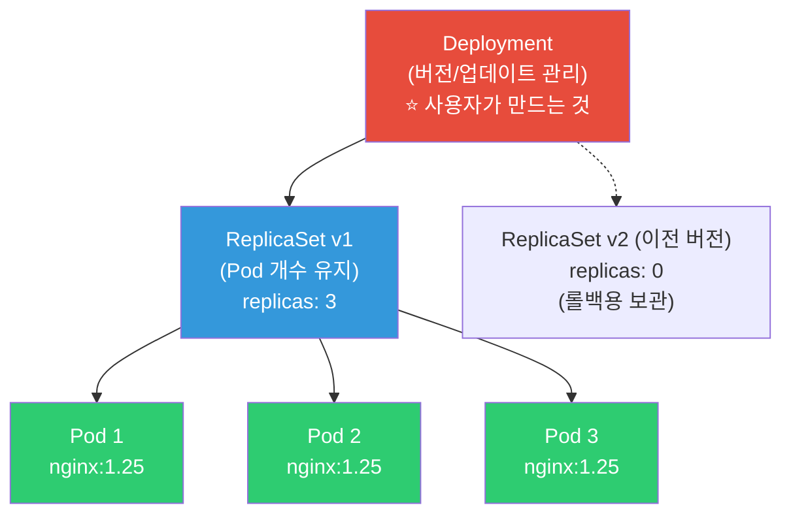
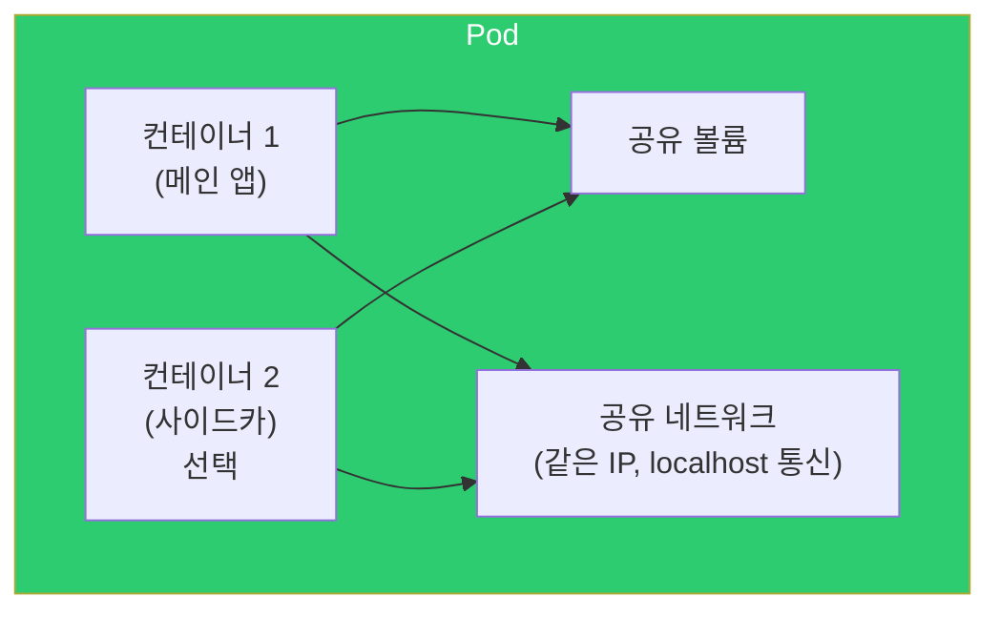
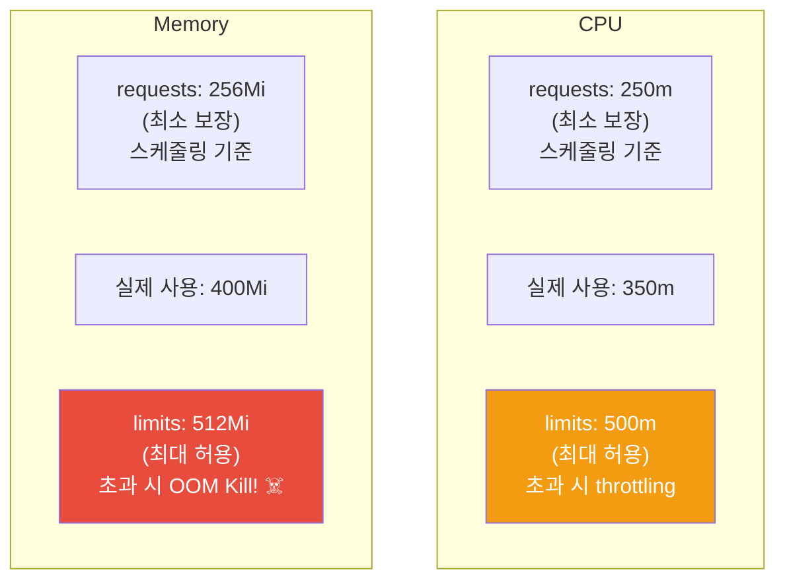
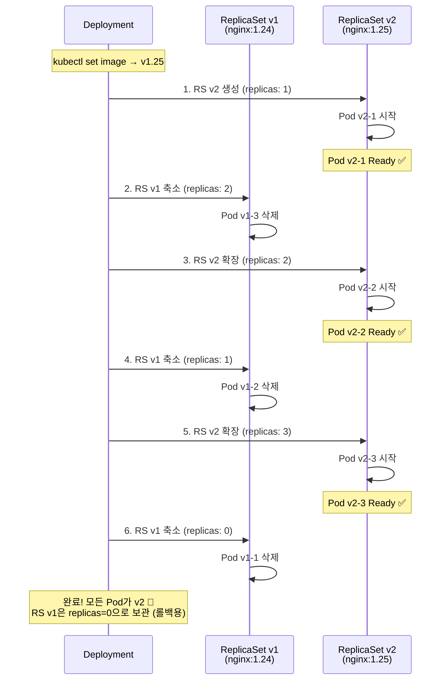
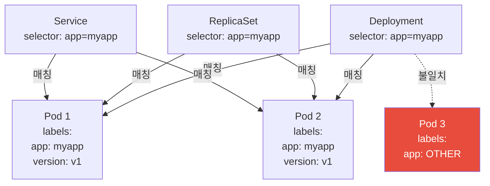

# Pod / Deployment / ReplicaSet

> K8s에서 컨테이너를 직접 실행하지 않아요. 컨테이너는 **Pod**라는 껍질에 담기고, Pod는 **ReplicaSet**이 개수를 관리하고, ReplicaSet은 **Deployment**가 버전을 관리해요. 이 3단 구조가 K8s 워크로드의 근본이에요.

---

## 🎯 이걸 왜 알아야 하나?

```
K8s에서 가장 기본이고 가장 많이 쓰는 리소스:
• 앱을 배포한다 = Deployment를 만든다
• 스케일링한다 = replicas 수를 바꾼다
• 업데이트한다 = 이미지 태그를 바꾼다 (Rolling Update)
• 롤백한다 = 이전 ReplicaSet으로 돌아간다
• "Pod가 왜 죽었지?" = Pod 상태 이해
• "왜 Pod가 3개여야 하지?" = ReplicaSet의 역할
```

[이전 강의](./01-architecture)에서 Deployment→ReplicaSet→Pod 흐름을 봤죠? 이번에 각각을 깊이 파볼게요.

---

## 🧠 핵심 개념

### 3단 구조: Deployment → ReplicaSet → Pod



**각각의 역할:**
* **Pod** — 컨테이너를 감싸는 최소 단위. 1개 이상의 컨테이너를 포함
* **ReplicaSet** — Pod의 **개수를 유지**. "3개를 유지해" → 죽으면 새로 만듦
* **Deployment** — ReplicaSet을 **버전 관리**. 업데이트/롤백 담당

```bash
# 실무에서:
# ✅ Deployment를 만든다 (사용자)
# ✅ ReplicaSet은 자동으로 생긴다 (Deployment가 만듦)
# ✅ Pod도 자동으로 생긴다 (ReplicaSet이 만듦)
# ❌ Pod를 직접 만들지 않는다 (일회성 테스트 제외)
# ❌ ReplicaSet을 직접 만들지 않는다
```

---

## 🔍 상세 설명 — Pod

### Pod란?

K8s에서 **배포 가능한 가장 작은 단위**예요. [컨테이너](../03-containers/01-concept)를 감싸는 래퍼(wrapper)예요.



**Pod의 특징:**
* 1개 이상의 컨테이너를 포함 (보통 1개)
* 같은 Pod의 컨테이너는 **같은 IP**, **같은 네트워크 네임스페이스** 공유
* 같은 Pod의 컨테이너는 **localhost**로 통신 가능
* 같은 Pod의 컨테이너는 **볼륨**을 공유할 수 있음
* Pod는 **일시적(ephemeral)** — 죽으면 새 Pod가 생김 (같은 Pod가 되살아나는 게 아님!)

### Pod YAML 상세

```yaml
apiVersion: v1
kind: Pod
metadata:
  name: myapp-pod
  namespace: default
  labels:                              # ⭐ 레이블 (검색/선택에 사용)
    app: myapp
    version: v1
    environment: production
  annotations:                         # 메타데이터 (정보용)
    description: "My application pod"
spec:
  containers:
  - name: myapp                        # 컨테이너 이름
    image: myapp:v1.0                  # 이미지
    ports:
    - containerPort: 3000              # 문서화용 (실제 열지는 않음)
      name: http
    
    # === 리소스 관리 ===
    resources:
      requests:                        # 최소 보장량 (스케줄링 기준)
        cpu: "250m"                    # 0.25 코어
        memory: "256Mi"                # 256MB
      limits:                          # 최대 허용량 (초과 시 제한/킬)
        cpu: "500m"                    # 0.5 코어
        memory: "512Mi"               # 512MB (초과 시 OOM Kill!)
    
    # === 환경 변수 ===
    env:
    - name: NODE_ENV
      value: "production"
    - name: DB_HOST
      valueFrom:
        configMapKeyRef:               # ConfigMap에서 (04-config-secret에서 상세히)
          name: app-config
          key: db_host
    - name: DB_PASSWORD
      valueFrom:
        secretKeyRef:                  # Secret에서
          name: db-credentials
          key: password
    
    # === 볼륨 마운트 ===
    volumeMounts:
    - name: data
      mountPath: /app/data
    - name: config
      mountPath: /app/config
      readOnly: true
    
    # === 헬스체크 (08-healthcheck에서 상세히) ===
    livenessProbe:                     # "살아있나?" — 실패 시 재시작
      httpGet:
        path: /health
        port: 3000
      initialDelaySeconds: 10
      periodSeconds: 10
    readinessProbe:                    # "준비됐나?" — 실패 시 트래픽 차단
      httpGet:
        path: /ready
        port: 3000
      initialDelaySeconds: 5
      periodSeconds: 5
  
  # === 볼륨 정의 ===
  volumes:
  - name: data
    persistentVolumeClaim:
      claimName: myapp-data
  - name: config
    configMap:
      name: myapp-config
  
  # === 스케줄링 ===
  nodeSelector:                        # 특정 노드에 배치
    kubernetes.io/os: linux
  
  # === 보안 ===
  securityContext:                     # (../03-containers/09-security 참고)
    runAsNonRoot: true
    runAsUser: 1000
    fsGroup: 1000
  
  # === 재시작 정책 ===
  restartPolicy: Always                # Always(기본), OnFailure, Never
  
  # === 종료 시간 ===
  terminationGracePeriodSeconds: 30    # SIGTERM 후 30초 대기 → SIGKILL
```

### Pod 리소스 관리 (requests / limits)



```bash
# CPU 단위:
# 1 = 1 vCPU = 1000m (millicores)
# 250m = 0.25 vCPU
# 100m = 0.1 vCPU

# Memory 단위:
# Mi = Mebibyte (1 Mi = 1,048,576 bytes)
# Gi = Gibibyte
# M = Megabyte (1 M = 1,000,000 bytes) ← 주의: Mi와 다름!

# CPU limits 초과 → throttling (느려짐, 죽지는 않음)
# Memory limits 초과 → OOM Kill! (컨테이너 재시작)

# requests 없으면? → 스케줄러가 최선을 다하지만 보장 안 됨
# limits 없으면? → 노드의 모든 리소스를 사용할 수 있음 (위험!)

# 리소스 사용량 확인
kubectl top pods
# NAME        CPU(cores)   MEMORY(bytes)
# myapp-1     120m         300Mi
# myapp-2     95m          280Mi
# myapp-3     110m         310Mi

# 실무 가이드:
# requests = 평소 사용량 (P50)
# limits = 피크 사용량 (P99) × 1.2 정도
# CPU limits는 안 거는 의견도 있음 (throttling이 더 해로울 수 있어서)
# Memory limits는 반드시 걸기! (OOM 방지)
```

### Pod 상태 (Phase)

```bash
kubectl get pods
# NAME        READY   STATUS              RESTARTS   AGE
# myapp-1     1/1     Running             0          5d     ← 정상!
# myapp-2     0/1     Pending             0          5m     ← 스케줄링 대기
# myapp-3     0/1     ContainerCreating   0          30s    ← 이미지 pulling
# myapp-4     0/1     CrashLoopBackOff    5          10m    ← 시작→죽음 반복!
# myapp-5     0/1     ImagePullBackOff    0          3m     ← 이미지 pull 실패
# myapp-6     1/1     Terminating         0          1m     ← 종료 중
# myapp-7     0/1     Error               0          2m     ← 에러로 종료
# myapp-8     0/1     OOMKilled           3          15m    ← 메모리 초과!
# myapp-9     0/1     Init:0/2            0          1m     ← init 컨테이너 실행 중

# 상태별 대응:
# Pending        → kubectl describe pod → 스케줄링 실패 원인 확인
# ImagePullBackOff → 이미지 이름/태그/레지스트리 인증 확인
# CrashLoopBackOff → kubectl logs --previous → 앱 에러 확인
# OOMKilled      → resources.limits.memory 올리기
# Error          → kubectl logs → 앱 에러 확인
```

### Pod 기본 명령어

```bash
# === 조회 ===
kubectl get pods                           # 현재 네임스페이스
kubectl get pods -A                        # 모든 네임스페이스
kubectl get pods -o wide                   # 노드, IP 포함
kubectl get pods -l app=myapp              # 레이블 필터
kubectl get pods --sort-by='.status.phase' # 상태별 정렬
kubectl get pods -o yaml                   # YAML 출력
kubectl get pods -w                        # 실시간 변화 관찰

# === 상세 ===
kubectl describe pod myapp-1               # ⭐ 이벤트, 상태 전부
kubectl get pod myapp-1 -o jsonpath='{.status.phase}'    # 특정 필드

# === 로그 ===
kubectl logs myapp-1                       # 로그
kubectl logs myapp-1 -f                    # 실시간 로그
kubectl logs myapp-1 --previous            # 이전 컨테이너 로그 (재시작 전)
kubectl logs myapp-1 -c sidecar            # 특정 컨테이너 (멀티 컨테이너)
kubectl logs -l app=myapp --all-containers # 레이블로 여러 Pod 로그

# === 접속 ===
kubectl exec -it myapp-1 -- bash           # 쉘 접속
kubectl exec -it myapp-1 -- sh             # bash 없으면 sh
kubectl exec myapp-1 -- cat /etc/hosts     # 명령어만 실행
kubectl exec -it myapp-1 -c sidecar -- sh  # 특정 컨테이너

# === 포트 포워딩 ===
kubectl port-forward myapp-1 8080:3000     # 로컬 8080 → Pod 3000
# → 브라우저에서 http://localhost:8080 으로 Pod에 직접 접근!
# → 디버깅에 매우 유용

# === 생성/삭제 ===
kubectl run test --image=busybox --rm -it -- sh   # 일회성 Pod
kubectl delete pod myapp-1                          # 삭제 (Deployment가 새로 만듦)
kubectl delete pod myapp-1 --force --grace-period=0 # 강제 즉시 삭제
```

---

## 🔍 상세 설명 — Deployment

### Deployment란?

**Pod의 선언적 업데이트를 관리**하는 리소스예요. 실무에서 앱을 배포할 때 **항상** Deployment를 사용해요.

### Deployment YAML 상세

```yaml
apiVersion: apps/v1
kind: Deployment
metadata:
  name: myapp
  namespace: production
  labels:
    app: myapp
spec:
  replicas: 3                          # ⭐ Pod 개수
  
  selector:                            # ⭐ 어떤 Pod를 관리할지 (레이블로 선택)
    matchLabels:
      app: myapp                       # → app=myapp 레이블의 Pod를 관리
  
  strategy:                            # ⭐ 업데이트 전략
    type: RollingUpdate                # RollingUpdate(기본) 또는 Recreate
    rollingUpdate:
      maxSurge: 1                      # 업데이트 중 추가 Pod 수 (25% 또는 숫자)
      maxUnavailable: 0                # 업데이트 중 사용 불가 Pod 수
      # maxSurge:1, maxUnavailable:0 → 항상 3개 이상 유지하면서 1개씩 교체!
  
  revisionHistoryLimit: 10             # 이전 ReplicaSet 보관 수 (롤백용)
  
  minReadySeconds: 5                   # Pod가 Ready 후 5초 대기 후 다음 진행
  
  template:                            # ⭐ Pod 템플릿 (여기 아래가 Pod spec!)
    metadata:
      labels:
        app: myapp                     # selector.matchLabels와 일치해야!
    spec:
      containers:
      - name: myapp
        image: myapp:v1.0              # ⭐ 이미지 (이걸 바꾸면 Rolling Update!)
        ports:
        - containerPort: 3000
        resources:
          requests:
            cpu: "250m"
            memory: "256Mi"
          limits:
            cpu: "500m"
            memory: "512Mi"
        livenessProbe:
          httpGet:
            path: /health
            port: 3000
          initialDelaySeconds: 10
          periodSeconds: 10
        readinessProbe:
          httpGet:
            path: /ready
            port: 3000
          initialDelaySeconds: 5
          periodSeconds: 5
```

### Deployment 기본 명령어

```bash
# === 생성 ===
kubectl apply -f deployment.yaml

# 또는 빠르게 (테스트용)
kubectl create deployment nginx --image=nginx:1.25 --replicas=3

# === 조회 ===
kubectl get deployments
# NAME    READY   UP-TO-DATE   AVAILABLE   AGE
# myapp   3/3     3            3           5d
#         ^^^     ^^^^^^^^^^   ^^^^^^^^^
#         Ready   최신 버전     서비스 가능

kubectl get deployment myapp -o wide
kubectl describe deployment myapp

# === 스케일링 ===
kubectl scale deployment myapp --replicas=5
# → Pod가 3개 → 5개로 증가

kubectl scale deployment myapp --replicas=2
# → Pod가 5개 → 2개로 감소 (2개 삭제)

# === 이미지 업데이트 (Rolling Update!) ===
kubectl set image deployment/myapp myapp=myapp:v2.0
# → v1.0 Pod를 하나씩 v2.0으로 교체!

# 또는 YAML 수정 후 apply
kubectl apply -f deployment-v2.yaml

# === 업데이트 상태 확인 ===
kubectl rollout status deployment/myapp
# Waiting for deployment "myapp" rollout to finish: 1 out of 3 new replicas have been updated...
# Waiting for deployment "myapp" rollout to finish: 2 out of 3 new replicas have been updated...
# deployment "myapp" successfully rolled out

# === 업데이트 이력 ===
kubectl rollout history deployment/myapp
# REVISION  CHANGE-CAUSE
# 1         kubectl apply --filename=deployment.yaml
# 2         kubectl set image deployment/myapp myapp=myapp:v2.0

# 특정 리비전 상세
kubectl rollout history deployment/myapp --revision=2

# === 롤백 ===
kubectl rollout undo deployment/myapp
# → 바로 이전 버전으로 롤백!

kubectl rollout undo deployment/myapp --to-revision=1
# → 특정 리비전으로 롤백

# === 일시 중지/재개 ===
kubectl rollout pause deployment/myapp   # 업데이트 일시 중지
kubectl rollout resume deployment/myapp  # 재개

# === 삭제 ===
kubectl delete deployment myapp
# → Deployment + ReplicaSet + Pod 전부 삭제
```

---

## 🔍 상세 설명 — Rolling Update

### Rolling Update 과정



```bash
# Rolling Update를 실시간으로 관찰!

# 터미널 1: Pod 상태 실시간
kubectl get pods -l app=myapp -w

# 터미널 2: ReplicaSet 실시간
kubectl get rs -l app=myapp -w

# 터미널 3: 업데이트 실행
kubectl set image deployment/myapp myapp=myapp:v2.0

# 터미널 1 출력 (Pod 변화):
# myapp-abc-1     1/1   Running   0    5m    ← v1 Pod
# myapp-abc-2     1/1   Running   0    5m    ← v1 Pod
# myapp-abc-3     1/1   Running   0    5m    ← v1 Pod
# myapp-def-1     0/1   Pending   0    0s    ← v2 새 Pod 생성!
# myapp-def-1     0/1   ContainerCreating   0s
# myapp-def-1     1/1   Running   0    3s    ← v2 Ready!
# myapp-abc-3     1/1   Terminating  0  5m   ← v1 Pod 삭제 시작
# myapp-def-2     0/1   Pending   0    0s    ← v2 두 번째
# ...

# 터미널 2 출력 (ReplicaSet 변화):
# myapp-abc   3     3     3     5m    ← v1 RS: 3개
# myapp-def   1     1     0     0s    ← v2 RS: 생성!
# myapp-abc   2     2     2     5m    ← v1: 3→2
# myapp-def   2     2     1     5s    ← v2: 1→2
# myapp-abc   1     1     1     5m    ← v1: 2→1
# myapp-def   3     3     2     10s   ← v2: 2→3
# myapp-abc   0     0     0     5m    ← v1: 1→0 (보관)
# myapp-def   3     3     3     15s   ← v2: 완료!
```

### 업데이트 전략: RollingUpdate vs Recreate

```yaml
# === RollingUpdate (기본, 추천!) ===
strategy:
  type: RollingUpdate
  rollingUpdate:
    maxSurge: 1          # 목표보다 1개 더 만들 수 있음
    maxUnavailable: 0    # 사용 불가 Pod 0개 (항상 3개 유지!)
# → 무중단 배포! 새 Pod가 Ready된 후 옛 Pod 삭제

# maxSurge: 25%, maxUnavailable: 25% (기본값)
# → 3개 Pod: 최대 4개(+1) 동시 운영, 최소 3개(-0) 유지

# maxSurge: 1, maxUnavailable: 0 (⭐ 가장 안전)
# → 항상 원래 수 이상 유지. 새 것이 Ready된 후에만 옛 것 삭제

# maxSurge: 0, maxUnavailable: 1 (리소스 절약)
# → 추가 Pod 없이 1개씩 교체. 잠깐 2개로 운영

# === Recreate (다운타임 있음!) ===
strategy:
  type: Recreate
# → 모든 v1 Pod를 먼저 삭제 → 그 다음 v2 Pod 생성
# → 다운타임 발생! DB 스키마 변경 등 특수한 경우만

# 언제 Recreate를 쓰나?
# - v1과 v2가 동시에 실행되면 안 되는 경우
# - DB 마이그레이션이 필요한 경우
# - 볼륨을 단일 Pod만 사용할 수 있는 경우 (ReadWriteOnce)
```

---

## 🔍 상세 설명 — ReplicaSet

### ReplicaSet이란?

**Pod의 개수를 유지**하는 리소스예요. Deployment가 자동으로 만들어요.

```bash
# ReplicaSet 확인
kubectl get replicaset -l app=myapp
# NAME          DESIRED   CURRENT   READY   AGE
# myapp-abc123  3         3         3       5d     ← 현재 버전
# myapp-def456  0         0         0       3d     ← 이전 버전 (롤백용)
# myapp-ghi789  0         0         0       1d     ← 더 이전 버전

# Desired: 원하는 Pod 수
# Current: 현재 존재하는 Pod 수
# Ready: 준비 완료된 Pod 수
# → 세 수가 같으면 정상!

# ReplicaSet 상세
kubectl describe replicaset myapp-abc123
# Controlled By: Deployment/myapp    ← Deployment가 소유자
# Replicas: 3 current / 3 desired
# Pods Status: 3 Running / 0 Waiting / 0 Succeeded / 0 Failed

# 소유 관계 확인 (Deployment → ReplicaSet → Pod)
kubectl get pod myapp-abc123-xxxxx -o jsonpath='{.metadata.ownerReferences[0].kind}'
# ReplicaSet

kubectl get rs myapp-abc123 -o jsonpath='{.metadata.ownerReferences[0].kind}'
# Deployment

# Pod를 삭제하면? → ReplicaSet이 새로 만듦!
kubectl delete pod myapp-abc123-xxxxx
kubectl get pods -l app=myapp
# → 여전히 3개! (새 Pod가 자동 생성됨)

# ⚠️ ReplicaSet을 직접 만들지 마세요!
# → Deployment가 자동으로 만들고 관리해줌
# → 직접 만들면 업데이트/롤백이 안 됨
```

---

## 🔍 상세 설명 — Labels & Selectors

K8s에서 리소스를 **연결하고 검색하는 핵심 메커니즘**이에요.



```bash
# 레이블 조회
kubectl get pods --show-labels
# NAME          READY   STATUS    LABELS
# myapp-abc-1   1/1     Running   app=myapp,version=v1,env=prod
# myapp-abc-2   1/1     Running   app=myapp,version=v1,env=prod
# redis-xyz-1   1/1     Running   app=redis,env=prod

# 레이블로 필터
kubectl get pods -l app=myapp                    # app=myapp인 Pod
kubectl get pods -l app=myapp,env=prod           # AND 조건
kubectl get pods -l 'app in (myapp, redis)'      # OR 조건
kubectl get pods -l app!=myapp                   # 부정
kubectl get pods -l 'env notin (dev, staging)'   # 포함 안 됨

# 레이블 추가/변경
kubectl label pod myapp-abc-1 team=backend
kubectl label pod myapp-abc-1 version=v2 --overwrite

# 레이블 삭제
kubectl label pod myapp-abc-1 team-

# 실무 레이블 패턴:
# app: myapp                    ← 앱 이름
# version: v1.2.3               ← 버전
# environment: production        ← 환경
# team: backend                  ← 담당 팀
# component: api                 ← 컴포넌트 (api, worker, scheduler)
# managed-by: helm               ← 관리 도구

# ⚠️ selector.matchLabels를 바꾸면 Deployment가 깨짐!
# → 한 번 정하면 바꾸지 않는 게 좋아요
```

---

## 🔍 상세 설명 — 멀티 컨테이너 Pod 패턴

### Sidecar 패턴

```yaml
# 메인 앱 + 사이드카 (로그 수집, 프록시 등)
apiVersion: v1
kind: Pod
metadata:
  name: app-with-sidecar
spec:
  containers:
  # 메인 앱
  - name: app
    image: myapp:v1.0
    ports:
    - containerPort: 3000
    volumeMounts:
    - name: logs
      mountPath: /app/logs
  
  # 사이드카: 로그를 수집해서 외부로 전송
  - name: log-shipper
    image: fluentd:latest
    volumeMounts:
    - name: logs
      mountPath: /var/log/app     # 같은 볼륨을 공유!
      readOnly: true
  
  volumes:
  - name: logs
    emptyDir: {}                   # Pod 내에서 공유하는 임시 볼륨
```

```bash
# 실무에서 사이드카 패턴이 쓰이는 경우:
# 1. 로그 수집 (Fluentd, Fluent Bit) → 메인 앱 로그를 수집/전송
# 2. 서비스 메시 프록시 (Envoy) → Istio가 자동 주입하는 사이드카
# 3. 시크릿 동기화 (Vault Agent) → 최신 시크릿을 자동 갱신
# 4. 인증 프록시 (OAuth2 Proxy) → 인증을 사이드카에서 처리

# 멀티 컨테이너 Pod의 로그 확인
kubectl logs app-with-sidecar -c app          # 메인 앱 로그
kubectl logs app-with-sidecar -c log-shipper  # 사이드카 로그

# 특정 컨테이너에 접속
kubectl exec -it app-with-sidecar -c app -- sh
```

### Init Container

Pod의 메인 컨테이너보다 **먼저 실행**되는 초기화 컨테이너예요.

```yaml
apiVersion: v1
kind: Pod
metadata:
  name: app-with-init
spec:
  initContainers:                      # 메인보다 먼저 실행!
  # 1. DB가 준비될 때까지 대기
  - name: wait-for-db
    image: busybox
    command: ['sh', '-c', 'until nc -z db-service 5432; do echo "Waiting for DB..."; sleep 2; done']
  
  # 2. 설정 파일 다운로드
  - name: download-config
    image: busybox
    command: ['wget', '-O', '/config/app.conf', 'http://config-server/app.conf']
    volumeMounts:
    - name: config
      mountPath: /config
  
  containers:                           # init이 전부 완료된 후 실행
  - name: app
    image: myapp:v1.0
    volumeMounts:
    - name: config
      mountPath: /app/config
  
  volumes:
  - name: config
    emptyDir: {}
```

```bash
# Init Container 상태 확인
kubectl get pods
# NAME             READY   STATUS     RESTARTS   AGE
# app-with-init    0/1     Init:0/2   0          10s    ← init 0/2 완료
# app-with-init    0/1     Init:1/2   0          15s    ← init 1/2 완료
# app-with-init    0/1     PodInitializing  0    20s    ← init 완료, 메인 시작
# app-with-init    1/1     Running    0          25s    ← 메인 실행!

# Init Container 로그
kubectl logs app-with-init -c wait-for-db
# Waiting for DB...
# Waiting for DB...
# (DB 준비 후 종료)
```

---

## 💻 실습 예제

### 실습 1: Deployment 전체 라이프사이클

```bash
# 1. 생성
kubectl apply -f - << 'EOF'
apiVersion: apps/v1
kind: Deployment
metadata:
  name: web-demo
spec:
  replicas: 3
  selector:
    matchLabels:
      app: web-demo
  template:
    metadata:
      labels:
        app: web-demo
    spec:
      containers:
      - name: nginx
        image: nginx:1.24
        ports:
        - containerPort: 80
        resources:
          requests:
            cpu: "50m"
            memory: "64Mi"
          limits:
            cpu: "100m"
            memory: "128Mi"
EOF

# 2. 확인
kubectl get deployment web-demo
kubectl get rs -l app=web-demo
kubectl get pods -l app=web-demo -o wide

# 3. 스케일링
kubectl scale deployment web-demo --replicas=5
kubectl get pods -l app=web-demo    # 5개!
kubectl scale deployment web-demo --replicas=3
kubectl get pods -l app=web-demo    # 3개로 돌아옴

# 4. Rolling Update
kubectl set image deployment/web-demo nginx=nginx:1.25
kubectl rollout status deployment/web-demo
# → 하나씩 교체되는 과정!

kubectl get rs -l app=web-demo
# NAME              DESIRED   CURRENT   READY
# web-demo-abc123   0         0         0      ← v1 (이전, 보관)
# web-demo-def456   3         3         3      ← v2 (현재)

# 5. 롤백
kubectl rollout undo deployment/web-demo
kubectl rollout status deployment/web-demo
# → 다시 nginx:1.24로!

kubectl get rs -l app=web-demo
# web-demo-abc123   3         3         3      ← v1 (다시 활성!)
# web-demo-def456   0         0         0      ← v2 (비활성)

# 6. 이력 확인
kubectl rollout history deployment/web-demo

# 7. 정리
kubectl delete deployment web-demo
```

### 실습 2: Pod 자가치유(Self-healing) 관찰

```bash
# 1. Deployment 생성 (3개 Pod)
kubectl create deployment self-heal --image=nginx --replicas=3

# 2. Pod 확인
kubectl get pods -l app=self-heal -o wide
# NAME                    NODE     IP
# self-heal-abc-1         node-1   10.0.1.50
# self-heal-abc-2         node-2   10.0.1.51
# self-heal-abc-3         node-1   10.0.1.52

# 3. Pod 하나 삭제 → 자동 재생성!
kubectl delete pod self-heal-abc-1
kubectl get pods -l app=self-heal
# self-heal-abc-2         1/1   Running   node-2
# self-heal-abc-3         1/1   Running   node-1
# self-heal-abc-4         1/1   Running   node-2   ← 새 Pod! (이름이 다름!)
# → 항상 3개 유지!

# 4. 컨테이너 프로세스 강제 종료 → 자동 재시작!
kubectl exec self-heal-abc-2 -- kill 1
kubectl get pods -l app=self-heal
# self-heal-abc-2     1/1   Running   1    ← RESTARTS: 0→1 (재시작됨!)

# 5. 정리
kubectl delete deployment self-heal
```

### 실습 3: Rolling Update 실시간 관찰

```bash
# 1. Deployment 생성
kubectl create deployment rolling-demo --image=nginx:1.24 --replicas=4

# 2. 두 터미널에서 관찰
# 터미널 1:
kubectl get pods -l app=rolling-demo -w

# 터미널 2:
kubectl get rs -l app=rolling-demo -w

# 3. 업데이트 실행
kubectl set image deployment/rolling-demo nginx=nginx:1.25

# → 터미널 1에서 새 Pod 생성 → 옛 Pod 삭제 순서 관찰!
# → 터미널 2에서 RS v1 축소, RS v2 확장 관찰!

# 4. 이력 + 롤백
kubectl rollout history deployment/rolling-demo
kubectl rollout undo deployment/rolling-demo

# 5. 정리
kubectl delete deployment rolling-demo
```

---

## 🏢 실무에서는?

### 시나리오 1: 배포 후 에러 발생 → 롤백

```bash
# 1. 새 버전 배포
kubectl set image deployment/myapp myapp=myapp:v2.0

# 2. 문제 발생!
kubectl rollout status deployment/myapp
# Waiting for deployment ... 1 out of 3 new replicas have been updated...
# → 새 Pod가 CrashLoopBackOff!

kubectl get pods -l app=myapp
# myapp-def-1   0/1   CrashLoopBackOff   3   2m    ← 새 버전 에러!
# myapp-abc-1   1/1   Running            0   1d    ← 이전 버전 정상
# myapp-abc-2   1/1   Running            0   1d    ← 이전 버전 정상
# → maxUnavailable: 0이라 기존 Pod는 안전!

kubectl logs myapp-def-1
# Error: Cannot connect to new-db-endpoint
# → 새 버전의 DB 설정이 틀림!

# 3. 즉시 롤백!
kubectl rollout undo deployment/myapp
# deployment.apps/myapp rolled back

# 4. 확인
kubectl rollout status deployment/myapp
# deployment "myapp" successfully rolled out
kubectl get pods -l app=myapp
# 모두 Running! 이전 버전으로 복구 ✅

# → maxUnavailable: 0 설정 덕분에 서비스 중단 없이 롤백!
```

### 시나리오 2: 리소스 설정 가이드

```bash
# "requests/limits를 어떻게 설정해야 하나요?"

# 1. 현재 사용량 측정
kubectl top pods -l app=myapp
# NAME        CPU(cores)   MEMORY(bytes)
# myapp-1     120m         300Mi
# myapp-2     95m          280Mi
# myapp-3     110m         310Mi

# 2. 설정 가이드:
# requests (최소 보장) = 평소 사용량 (P50~P75)
#   CPU: 120m → requests: 150m
#   Memory: 310Mi → requests: 350Mi

# limits (최대 허용) = 피크 사용량 + 여유
#   CPU: 피크 300m → limits: 500m (또는 안 걸기)
#   Memory: 피크 450Mi → limits: 512Mi (반드시 걸기!)

# 3. 적용
# resources:
#   requests:
#     cpu: "150m"
#     memory: "350Mi"
#   limits:
#     cpu: "500m"        # 또는 생략 (throttling 방지)
#     memory: "512Mi"    # ⭐ 반드시 설정! (OOM 방지)
```

### 시나리오 3: "Pod가 계속 재시작돼요" 체계적 진단

```bash
# (../03-containers/08-troubleshooting의 K8s 버전!)

# 1. Pod 상태 확인
kubectl get pods -l app=myapp
# myapp-abc-1   0/1   CrashLoopBackOff   5   10m

# 2. Exit Code 확인
kubectl get pod myapp-abc-1 -o jsonpath='{.status.containerStatuses[0].lastState.terminated.exitCode}'
# 137 → OOM Kill! (메모리 초과)
# 1   → 앱 에러 (로그 확인)
# 127 → 파일 없음 (이미지 확인)

# 3. 로그 확인 (이전 실행)
kubectl logs myapp-abc-1 --previous

# 4. 이벤트 확인
kubectl describe pod myapp-abc-1 | tail -20

# 5. 리소스 확인
kubectl top pod myapp-abc-1
kubectl describe pod myapp-abc-1 | grep -A 5 "Limits"

# 6. Exit Code별 해결:
# 137 (OOM) → memory limits 올리기
# 1 (앱 에러) → 로그 보고 앱 수정
# 127 (파일 없음) → 이미지 확인, Dockerfile 확인
```

---

## ⚠️ 자주 하는 실수

### 1. Pod를 직접 만들기

```bash
# ❌ Pod를 직접 생성 (죽으면 안 살아남!)
kubectl run myapp --image=myapp:v1.0

# ✅ Deployment로 생성 (죽으면 자동 재생성!)
kubectl create deployment myapp --image=myapp:v1.0
```

### 2. resources를 안 설정하기

```yaml
# ❌ resources 없음 → 스케줄링 비효율 + OOM 위험
containers:
- name: myapp
  image: myapp:v1.0
  # resources 없음!

# ✅ 반드시 requests + limits (특히 memory limits!)
  resources:
    requests:
      cpu: "100m"
      memory: "256Mi"
    limits:
      memory: "512Mi"
```

### 3. selector와 labels 불일치

```yaml
# ❌ selector와 template labels가 다름!
spec:
  selector:
    matchLabels:
      app: myapp          # ← "myapp"
  template:
    metadata:
      labels:
        app: my-app       # ← "my-app" (다름!) → 에러!
```

### 4. 롤백을 위한 이력을 너무 적게 보관

```yaml
# ❌ revisionHistoryLimit: 1 → 1단계만 롤백 가능
# ❌ revisionHistoryLimit: 0 → 롤백 불가!

# ✅ 적당히 보관 (기본값 10)
revisionHistoryLimit: 10
```

### 5. maxUnavailable: 100%로 설정

```yaml
# ❌ 모든 Pod가 동시에 죽을 수 있음 → 다운타임!
strategy:
  rollingUpdate:
    maxUnavailable: "100%"

# ✅ 안전한 설정
strategy:
  rollingUpdate:
    maxSurge: 1
    maxUnavailable: 0    # 항상 기존 수 유지!
```

---

## 📝 정리

### 3단 구조 빠른 참조

```
Deployment (사용자가 만듦)
  → 버전 관리, 업데이트 전략, 롤백
  → ReplicaSet을 자동 생성/관리

ReplicaSet (Deployment가 만듦)
  → Pod 개수 유지 (replicas)
  → Pod 삭제 시 자동 재생성

Pod (ReplicaSet이 만듦)
  → 컨테이너 실행 최소 단위
  → 일시적 (죽으면 새로 생김, 되살아나는 게 아님!)
```

### 핵심 명령어

```bash
# Deployment
kubectl apply -f deployment.yaml          # 생성/업데이트
kubectl get deployments                    # 목록
kubectl scale deployment NAME --replicas=N # 스케일링
kubectl set image deployment/NAME C=IMG    # 이미지 업데이트
kubectl rollout status deployment/NAME     # 업데이트 상태
kubectl rollout undo deployment/NAME       # 롤백
kubectl rollout history deployment/NAME    # 이력

# Pod
kubectl get pods -o wide                   # 목록 (노드, IP)
kubectl describe pod NAME                  # 상세 (이벤트!)
kubectl logs NAME [-f] [--previous]        # 로그
kubectl exec -it NAME -- sh               # 접속
kubectl port-forward NAME LOCAL:REMOTE     # 포트 포워딩
kubectl top pods                           # 리소스 사용량
```

### Pod 상태 빠른 참조

```
Running          → 정상!
Pending          → 스케줄링 대기 → describe로 원인 확인
CrashLoopBackOff → 시작→죽음 반복 → logs --previous로 확인
ImagePullBackOff → 이미지 pull 실패 → 이름/태그/인증 확인
OOMKilled        → 메모리 초과 → limits 올리기
Error            → 앱 에러 → logs로 확인
```

---

## 🔗 다음 강의

다음은 **[03-statefulset-daemonset](./03-statefulset-daemonset)** — StatefulSet / DaemonSet / Job / CronJob 이에요.

Deployment는 **상태 없는(stateless)** 앱용이에요. DB, 메시지 큐 같은 **상태 있는(stateful)** 앱은 StatefulSet, 모든 노드에 하나씩 실행해야 하는 건 DaemonSet, 일회성/주기적 작업은 Job/CronJob을 배워볼게요.
