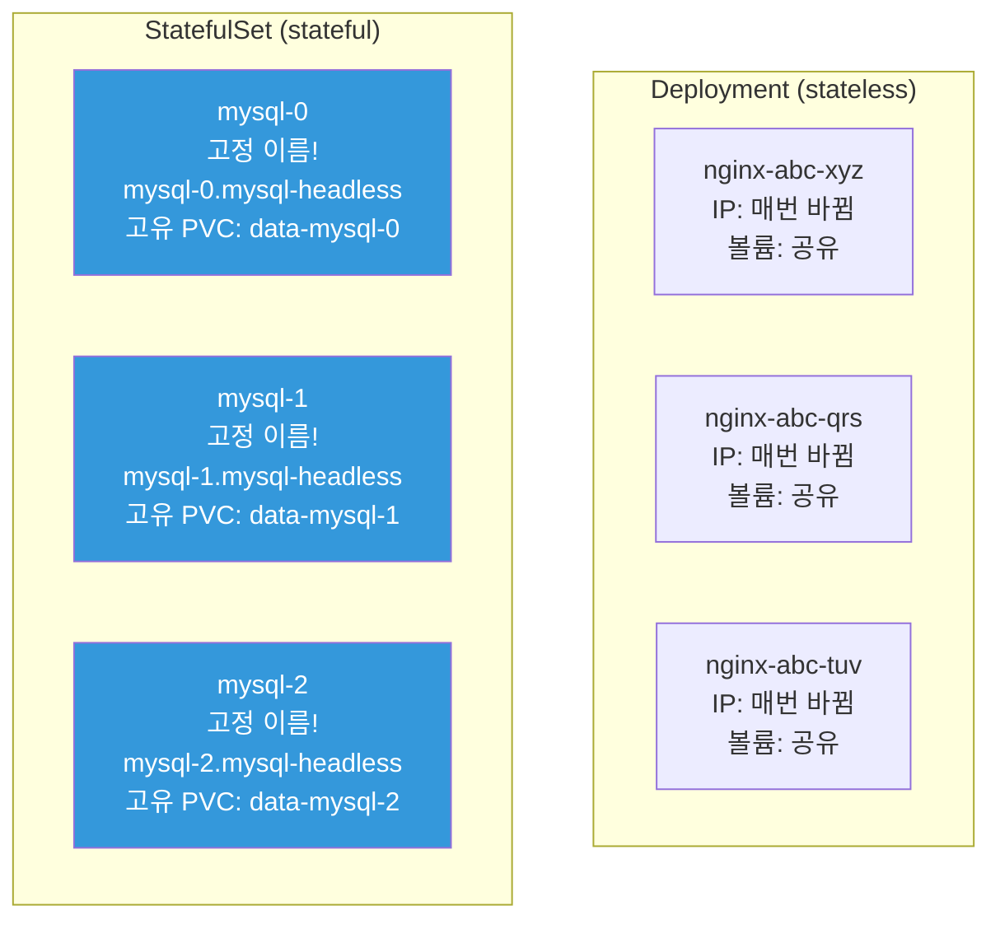
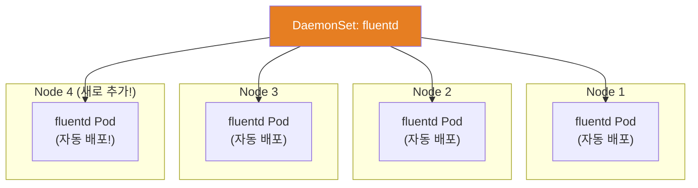
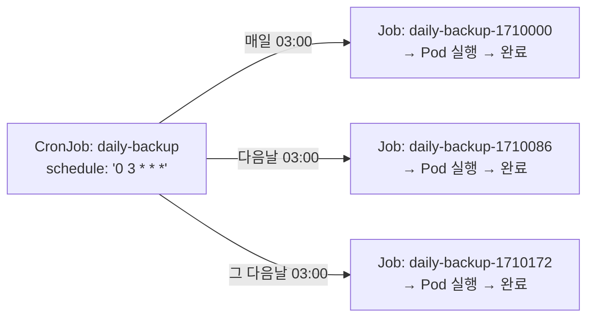

# StatefulSet / DaemonSet / Job / CronJob

> [Deployment](./02-pod-deployment)는 **상태 없는(stateless)** 앱을 위한 거예요. 하지만 DB는 순서와 고유한 네트워크 ID가 필요하고, 모니터링 에이전트는 모든 노드에 하나씩 있어야 하고, 배치 작업은 한 번 실행하고 끝나야 해요. 이런 다양한 워크로드 패턴을 위한 리소스를 배워볼게요.

---

## 🎯 이걸 왜 알아야 하나?

```
워크로드 유형별 리소스:
• 웹서버, API 서버 (stateless)             → Deployment
• DB, Kafka, Redis Cluster (stateful)      → StatefulSet
• 로그 수집, 모니터링 에이전트 (모든 노드)  → DaemonSet
• DB 마이그레이션, 데이터 처리 (1회성)      → Job
• 백업, 리포트, 정리 (주기적)              → CronJob
```

---

## 🧠 핵심 개념

### 전체 워크로드 리소스 비교

| 리소스 | Pod 이름 | 스케일링 | 볼륨 | 순서 | 용도 |
|--------|---------|---------|------|------|------|
| **Deployment** | 랜덤 (abc-xyz) | replicas | 공유 가능 | 없음 | 웹서버, API |
| **StatefulSet** | 고정 (name-0, -1, -2) | replicas | Pod별 고유 | 순서대로 | DB, 카프카 |
| **DaemonSet** | 노드당 1개 | 노드 수만큼 | 노드 로컬 | 없음 | 에이전트 |
| **Job** | 완료까지 실행 | completions | 임시 | 없음 | 배치 처리 |
| **CronJob** | 주기적 Job | 스케줄 | 임시 | 없음 | 백업, 정리 |

---

## 🔍 상세 설명 — StatefulSet

### StatefulSet이란?

**상태가 있는(stateful) 앱**을 위한 워크로드 리소스예요. Deployment와 가장 큰 차이는 **고유 ID**, **고유 볼륨**, **순서 보장**이에요.

### Deployment vs StatefulSet



| 항목 | Deployment | StatefulSet |
|------|-----------|-------------|
| Pod 이름 | 랜덤 (nginx-abc-xyz) | 순서 번호 (mysql-0, -1, -2) |
| 네트워크 ID | 없음 (IP 매번 변경) | 고정 DNS (pod-0.headless-svc) |
| 볼륨 | 모든 Pod가 공유 가능 | Pod마다 **고유 PVC** |
| 생성 순서 | 동시에 (병렬) | 순서대로 (0→1→2) |
| 삭제 순서 | 동시에 | 역순으로 (2→1→0) |
| 업데이트 | Rolling (신규 RS) | Rolling (역순, 같은 Pod 이름 유지) |

### StatefulSet YAML 상세

```yaml
# Headless Service (StatefulSet에 필수!)
apiVersion: v1
kind: Service
metadata:
  name: mysql-headless
  labels:
    app: mysql
spec:
  clusterIP: None              # ← Headless! (../02-networking/12-service-discovery 참고)
  selector:
    app: mysql
  ports:
  - port: 3306
    name: mysql

---
apiVersion: apps/v1
kind: StatefulSet
metadata:
  name: mysql
spec:
  serviceName: mysql-headless   # ← Headless Service 이름 (필수!)
  replicas: 3
  
  selector:
    matchLabels:
      app: mysql
  
  template:
    metadata:
      labels:
        app: mysql
    spec:
      containers:
      - name: mysql
        image: mysql:8.0
        ports:
        - containerPort: 3306
        env:
        - name: MYSQL_ROOT_PASSWORD
          valueFrom:
            secretKeyRef:
              name: mysql-secret
              key: root-password
        volumeMounts:
        - name: data
          mountPath: /var/lib/mysql
        resources:
          requests:
            cpu: "500m"
            memory: "1Gi"
          limits:
            memory: "2Gi"
  
  # ⭐ Pod마다 고유한 PVC가 자동 생성!
  volumeClaimTemplates:
  - metadata:
      name: data
    spec:
      accessModes: ["ReadWriteOnce"]
      storageClassName: gp3
      resources:
        requests:
          storage: 50Gi
  
  # 업데이트 전략
  updateStrategy:
    type: RollingUpdate
    rollingUpdate:
      partition: 0              # 이 번호 이상의 Pod만 업데이트 (카나리용)
  
  # Pod 관리 정책
  podManagementPolicy: OrderedReady   # OrderedReady(순서대로) 또는 Parallel
```

### StatefulSet의 고유한 특성

```bash
# === 1. 고정된 Pod 이름 ===
kubectl get pods -l app=mysql
# NAME      READY   STATUS    AGE
# mysql-0   1/1     Running   5d     ← 항상 mysql-0!
# mysql-1   1/1     Running   5d     ← 항상 mysql-1!
# mysql-2   1/1     Running   5d     ← 항상 mysql-2!
# → mysql-0이 죽으면 새 Pod도 mysql-0! (이름 유지)

# === 2. 고정된 DNS (Headless Service) ===
# 각 Pod에 고유한 DNS 이름:
# mysql-0.mysql-headless.production.svc.cluster.local
# mysql-1.mysql-headless.production.svc.cluster.local
# mysql-2.mysql-headless.production.svc.cluster.local

kubectl run test --image=busybox --rm -it --restart=Never -- nslookup mysql-0.mysql-headless
# Address: 10.0.1.50    ← mysql-0의 고정 DNS!
# → Pod가 재시작되어 IP가 바뀌어도 DNS 이름은 유지!

# === 3. Pod별 고유 PVC ===
kubectl get pvc -l app=mysql
# NAME            STATUS   VOLUME        CAPACITY   STORAGECLASS
# data-mysql-0    Bound    pvc-abc123    50Gi       gp3           ← mysql-0 전용!
# data-mysql-1    Bound    pvc-def456    50Gi       gp3           ← mysql-1 전용!
# data-mysql-2    Bound    pvc-ghi789    50Gi       gp3           ← mysql-2 전용!
# → 각 Pod가 자기만의 디스크를 가짐!
# → mysql-0이 재시작되어도 data-mysql-0 볼륨을 다시 마운트

# === 4. 순서대로 생성/삭제 ===
# 생성: mysql-0 Ready → mysql-1 시작 → mysql-1 Ready → mysql-2 시작
# 삭제: mysql-2 삭제 → mysql-1 삭제 → mysql-0 삭제
# → DB 클러스터에서 Primary가 먼저 뜨고, Replica가 나중에 연결

# === 5. StatefulSet 삭제해도 PVC는 유지! ===
kubectl delete statefulset mysql
# → Pod는 삭제되지만 PVC(data-mysql-0, -1, -2)는 그대로!
# → 데이터 보존! 재생성하면 기존 데이터 사용

# PVC 수동 삭제 (데이터를 지울 때만!)
kubectl delete pvc data-mysql-0 data-mysql-1 data-mysql-2
```

### StatefulSet을 쓰는 실제 워크로드

```bash
# 1. MySQL/PostgreSQL 클러스터 (Primary-Replica)
# mysql-0 = Primary (쓰기)
# mysql-1, mysql-2 = Replica (읽기)
# → 순서 보장: Primary(0)가 먼저 뜨고, Replica(1,2)가 연결

# 2. Kafka 클러스터
# kafka-0, kafka-1, kafka-2 = 각각 Broker ID 0,1,2
# → 고유 ID + 고유 데이터 볼륨 필요

# 3. Redis Cluster
# redis-0 ~ redis-5 = 3 Master + 3 Slave
# → 고유 네트워크 ID로 클러스터 구성

# 4. Elasticsearch
# es-0, es-1, es-2 = 각각 고유 데이터 디렉토리
# → 노드 간 데이터 복제

# 5. ZooKeeper
# zk-0, zk-1, zk-2 = 고유 myid (0, 1, 2)
# → 순서 보장: 리더 선출을 위해 모든 노드가 서로를 알아야 함

# ⚠️ 실무에서는 직접 StatefulSet으로 DB를 관리하기보다
# → RDS, CloudSQL 같은 관리형 서비스를 쓰거나
# → Operator (MySQL Operator, Kafka Operator)를 사용하는 게 일반적!
# → Operator가 StatefulSet을 대신 관리해줌 (17-operator-crd에서 상세히)
```

---

## 🔍 상세 설명 — DaemonSet

### DaemonSet이란?

**모든 노드(또는 특정 노드)에 Pod를 1개씩** 실행하는 리소스예요.



**핵심:** 노드가 추가되면 자동으로 Pod가 배포되고, 노드가 제거되면 Pod도 삭제돼요.

### DaemonSet YAML

```yaml
apiVersion: apps/v1
kind: DaemonSet
metadata:
  name: fluentd
  namespace: kube-system
spec:
  selector:
    matchLabels:
      app: fluentd
  
  updateStrategy:
    type: RollingUpdate
    rollingUpdate:
      maxUnavailable: 1            # 한 번에 1개 노드씩 업데이트
  
  template:
    metadata:
      labels:
        app: fluentd
    spec:
      # 특정 노드에만 배포 (선택)
      # nodeSelector:
      #   kubernetes.io/os: linux
      
      tolerations:                  # ⭐ Control Plane 노드에도 배포하려면
      - key: node-role.kubernetes.io/control-plane
        effect: NoSchedule
      
      containers:
      - name: fluentd
        image: fluentd:v1.16
        resources:
          requests:
            cpu: "100m"
            memory: "200Mi"
          limits:
            memory: "500Mi"
        volumeMounts:
        - name: varlog
          mountPath: /var/log       # 노드의 /var/log를 읽음
          readOnly: true
        - name: containers
          mountPath: /var/lib/docker/containers
          readOnly: true
      
      volumes:
      - name: varlog
        hostPath:                   # ⭐ 노드의 파일 시스템 직접 마운트!
          path: /var/log
      - name: containers
        hostPath:
          path: /var/lib/docker/containers
```

```bash
# DaemonSet 확인
kubectl get daemonset -n kube-system
# NAME         DESIRED   CURRENT   READY   UP-TO-DATE   AVAILABLE   NODE SELECTOR   AGE
# fluentd      3         3         3       3            3           <none>           30d
# kube-proxy   3         3         3       3            3           <none>           30d
# aws-node     3         3         3       3            3           <none>           30d
#              ^^^
#              노드 수와 같음!

# 어떤 노드에서 실행 중인지
kubectl get pods -n kube-system -l app=fluentd -o wide
# NAME            READY   NODE
# fluentd-abc12   1/1     node-1
# fluentd-def34   1/1     node-2
# fluentd-ghi56   1/1     node-3
# → 모든 노드에 1개씩!

# 새 노드를 추가하면?
# → DaemonSet이 자동으로 새 노드에 Pod 배포!

# 특정 노드에만 배포하고 싶으면: nodeSelector 또는 affinity
# nodeSelector:
#   role: monitoring    ← role=monitoring 레이블이 있는 노드에만
```

### DaemonSet을 쓰는 실제 워크로드

```bash
# K8s 시스템에 이미 있는 DaemonSet:
kubectl get ds -n kube-system
# kube-proxy    → 모든 노드에서 Service 네트워크 규칙 관리
# aws-node      → AWS VPC CNI (EKS) — Pod에 VPC IP 할당

# 실무에서 추가하는 DaemonSet:
# 1. 로그 수집: Fluentd, Fluent Bit, Filebeat
#    → 모든 노드의 /var/log를 읽어서 중앙 로그 시스템으로
#    → (08-observability에서 상세히)

# 2. 모니터링 에이전트: Node Exporter, Datadog Agent
#    → 모든 노드의 CPU/메모리/디스크 메트릭 수집

# 3. 보안 에이전트: Falco, Sysdig
#    → 모든 노드에서 런타임 보안 모니터링

# 4. 스토리지 관리: CSI 드라이버 (EBS CSI, EFS CSI)
#    → 모든 노드에서 볼륨 관리

# 5. 네트워크 관리: Calico, Cilium (CNI)
#    → 모든 노드에서 Pod 네트워킹
```

---

## 🔍 상세 설명 — Job

### Job이란?

**한 번 실행하고 완료**되는 워크로드예요. 배치 처리, 데이터 마이그레이션 등에 사용해요.


**Deployment와의 차이:**
* Deployment: Pod가 항상 실행 중이어야 함 (죽으면 재시작)
* Job: Pod가 성공적으로 **완료되면 끝** (재시작 안 함)

### Job YAML

```yaml
apiVersion: batch/v1
kind: Job
metadata:
  name: db-migrate
spec:
  completions: 1                # 성공해야 하는 Pod 수
  parallelism: 1                # 동시 실행 Pod 수
  backoffLimit: 3               # 실패 시 재시도 횟수 (기본 6)
  activeDeadlineSeconds: 300    # 최대 실행 시간 (5분)
  ttlSecondsAfterFinished: 3600 # 완료 후 1시간 뒤 자동 삭제
  
  template:
    spec:
      containers:
      - name: migrate
        image: myapp:v1.0
        command: ["python", "manage.py", "migrate"]
        env:
        - name: DATABASE_URL
          valueFrom:
            secretKeyRef:
              name: db-credentials
              key: url
      restartPolicy: Never      # ⭐ Job은 Never 또는 OnFailure!
      # Never: 실패 시 새 Pod 생성 (로그 보존)
      # OnFailure: 같은 Pod에서 재시작 (로그 유실 가능)
```

```bash
# Job 실행
kubectl apply -f job.yaml

# Job 상태 확인
kubectl get jobs
# NAME         COMPLETIONS   DURATION   AGE
# db-migrate   1/1           45s        2m     ← 완료!
#              ^^^
#              1개 중 1개 성공!

# Job의 Pod 확인
kubectl get pods -l job-name=db-migrate
# NAME               READY   STATUS      RESTARTS   AGE
# db-migrate-abc12   0/1     Completed   0          2m    ← Completed!

# 로그 확인
kubectl logs job/db-migrate
# Running migrations...
# Applied 5 migrations successfully.
# Done!

# Job 삭제 (Pod도 같이 삭제됨)
kubectl delete job db-migrate
```

### Job 병렬 처리 패턴

```yaml
# === 패턴 1: 순차 실행 (기본) ===
# completions: 5, parallelism: 1
# → 1개씩 순서대로 5번 실행 (총 5개 Pod)

# === 패턴 2: 병렬 실행 ===
# completions: 10, parallelism: 3
# → 3개씩 동시에 실행, 총 10번 성공할 때까지
spec:
  completions: 10           # 10개 성공해야 완료
  parallelism: 3            # 동시에 3개씩
  template:
    spec:
      containers:
      - name: worker
        image: myworker:v1.0
        command: ["python", "process_batch.py"]
      restartPolicy: Never

# === 패턴 3: 워크 큐 (completions 없이) ===
# completions 미지정, parallelism: 5
# → 5개 워커가 큐에서 작업을 가져와 처리, 큐가 비면 종료
spec:
  parallelism: 5
  # completions 미지정!
  template:
    spec:
      containers:
      - name: worker
        image: myworker:v1.0
        command: ["python", "queue_worker.py"]
      restartPolicy: Never
```

```bash
# 병렬 Job 관찰
kubectl get pods -l job-name=batch-process -w
# batch-process-abc   1/1   Running     ← 동시 3개
# batch-process-def   1/1   Running
# batch-process-ghi   1/1   Running
# batch-process-abc   0/1   Completed   ← 완료되면
# batch-process-jkl   0/1   Pending     ← 다음 것 시작
# ...

kubectl get job batch-process
# COMPLETIONS   DURATION
# 7/10          2m         ← 10개 중 7개 완료
```

---

## 🔍 상세 설명 — CronJob

### CronJob이란?

**주기적으로 Job을 생성**하는 리소스예요. [Linux cron](../01-linux/06-cron)의 K8s 버전이에요.



### CronJob YAML

```yaml
apiVersion: batch/v1
kind: CronJob
metadata:
  name: daily-backup
spec:
  schedule: "0 3 * * *"          # ⭐ cron 표현식 (매일 03:00 UTC)
  # 분 시 일 월 요일
  # 0 3 * * *     → 매일 03:00
  # */5 * * * *   → 5분마다
  # 0 */6 * * *   → 6시간마다
  # 0 9 * * 1-5   → 평일 09:00
  # 0 0 1 * *     → 매월 1일 00:00
  
  timeZone: "Asia/Seoul"         # K8s 1.27+ (타임존 지정)
  
  concurrencyPolicy: Forbid      # 이전 Job이 실행 중이면 스킵
  # Allow: 동시 실행 허용 (기본)
  # Forbid: 이전 Job 실행 중이면 새 Job 스킵
  # Replace: 이전 Job을 중단하고 새 Job 실행
  
  successfulJobsHistoryLimit: 3  # 성공 Job 3개 보관
  failedJobsHistoryLimit: 1      # 실패 Job 1개 보관
  startingDeadlineSeconds: 200   # 스케줄 시간 이후 200초 내 시작 못하면 스킵
  
  jobTemplate:
    spec:
      backoffLimit: 2
      activeDeadlineSeconds: 600  # 10분 타임아웃
      template:
        spec:
          containers:
          - name: backup
            image: backup-tool:v1.0
            command:
            - /bin/sh
            - -c
            - |
              echo "Starting backup at $(date)"
              pg_dump -h $DB_HOST -U $DB_USER $DB_NAME | gzip > /backup/db-$(date +%Y%m%d).sql.gz
              aws s3 cp /backup/db-$(date +%Y%m%d).sql.gz s3://my-backups/
              echo "Backup complete!"
            env:
            - name: DB_HOST
              value: "postgres-service"
            - name: DB_USER
              valueFrom:
                secretKeyRef:
                  name: db-credentials
                  key: username
            - name: DB_NAME
              value: "production"
          restartPolicy: OnFailure
```

```bash
# CronJob 확인
kubectl get cronjobs
# NAME           SCHEDULE      SUSPEND   ACTIVE   LAST SCHEDULE   AGE
# daily-backup   0 3 * * *     False     0        12h             30d
#                               ^^^^^    ^^^^^^   ^^^^^^^^^^^^
#                               일시중지? 실행중?  마지막 실행 시간

# CronJob이 생성한 Job 목록
kubectl get jobs --sort-by='.metadata.creationTimestamp'
# NAME                        COMPLETIONS   DURATION   AGE
# daily-backup-28460500       1/1           45s        36h
# daily-backup-28461940       1/1           38s        12h
# daily-backup-28463380       0/1           Running    5s     ← 방금 생성!

# CronJob이 만든 Pod 로그
kubectl logs job/daily-backup-28463380
# Starting backup at Wed Mar 12 03:00:00 UTC 2025
# Backup complete!

# === CronJob 관리 ===

# 일시 중지 (스케줄 비활성화)
kubectl patch cronjob daily-backup -p '{"spec":{"suspend":true}}'

# 재개
kubectl patch cronjob daily-backup -p '{"spec":{"suspend":false}}'

# 수동 즉시 실행 (Job을 수동 생성)
kubectl create job --from=cronjob/daily-backup daily-backup-manual
# → 스케줄과 무관하게 지금 바로 실행!

# CronJob 삭제
kubectl delete cronjob daily-backup
# → CronJob + 관련 Job + Pod 전부 삭제
```

### CronJob 실무 패턴

```bash
# 1. DB 백업 (매일 새벽 3시)
# schedule: "0 3 * * *"

# 2. 임시 파일/캐시 정리 (매 6시간)
# schedule: "0 */6 * * *"

# 3. 리포트 생성 (평일 오전 9시)
# schedule: "0 9 * * 1-5"

# 4. 인증서 갱신 체크 (매주 월요일)
# schedule: "0 0 * * 1"

# 5. 오래된 데이터 삭제 (매월 1일)
# schedule: "0 0 1 * *"

# 6. 헬스체크 (5분마다) → ⚠️ 이런 용도로는 보통 CronJob을 안 쓰고
# → K8s liveness/readiness probe 또는 외부 모니터링 도구 사용
```

---

## 💻 실습 예제

### 실습 1: StatefulSet 특성 관찰

```bash
# 1. Headless Service + StatefulSet 생성
kubectl apply -f - << 'EOF'
apiVersion: v1
kind: Service
metadata:
  name: web-headless
spec:
  clusterIP: None
  selector:
    app: web-sts
  ports:
  - port: 80
---
apiVersion: apps/v1
kind: StatefulSet
metadata:
  name: web-sts
spec:
  serviceName: web-headless
  replicas: 3
  selector:
    matchLabels:
      app: web-sts
  template:
    metadata:
      labels:
        app: web-sts
    spec:
      containers:
      - name: nginx
        image: nginx:alpine
        ports:
        - containerPort: 80
        volumeMounts:
        - name: www
          mountPath: /usr/share/nginx/html
  volumeClaimTemplates:
  - metadata:
      name: www
    spec:
      accessModes: ["ReadWriteOnce"]
      resources:
        requests:
          storage: 1Gi
EOF

# 2. 순서대로 생성되는 것 관찰
kubectl get pods -l app=web-sts -w
# web-sts-0   0/1   Pending       ← 0번 먼저!
# web-sts-0   1/1   Running       ← 0번 Ready 후
# web-sts-1   0/1   Pending       ← 1번 시작
# web-sts-1   1/1   Running       ← 1번 Ready 후
# web-sts-2   0/1   Pending       ← 2번 시작
# web-sts-2   1/1   Running       ← 완료!

# 3. 고정 이름 확인
kubectl get pods -l app=web-sts
# NAME        READY   STATUS
# web-sts-0   1/1     Running    ← 항상 0, 1, 2!
# web-sts-1   1/1     Running
# web-sts-2   1/1     Running

# 4. 고유 DNS 확인
kubectl run test --image=busybox --rm -it --restart=Never -- nslookup web-sts-0.web-headless
# Address: 10.0.1.50
kubectl run test --image=busybox --rm -it --restart=Never -- nslookup web-sts-1.web-headless
# Address: 10.0.1.51

# 5. 고유 PVC 확인
kubectl get pvc -l app=web-sts
# NAME            STATUS   CAPACITY
# www-web-sts-0   Bound    1Gi        ← Pod 0 전용!
# www-web-sts-1   Bound    1Gi        ← Pod 1 전용!
# www-web-sts-2   Bound    1Gi        ← Pod 2 전용!

# 6. Pod 삭제 → 같은 이름으로 재생성 + 같은 PVC 연결
kubectl delete pod web-sts-1
kubectl get pods -l app=web-sts
# web-sts-0   1/1   Running
# web-sts-1   1/1   Running    ← 같은 이름! 같은 PVC!
# web-sts-2   1/1   Running

# 7. 역순 삭제 관찰
kubectl delete statefulset web-sts
# web-sts-2 삭제 → web-sts-1 삭제 → web-sts-0 삭제 (역순!)

# PVC는 남아있음! (데이터 보존)
kubectl get pvc -l app=web-sts    # 여전히 존재!

# 정리
kubectl delete pvc www-web-sts-0 www-web-sts-1 www-web-sts-2
kubectl delete svc web-headless
```

### 실습 2: DaemonSet 배포

```bash
# 1. DaemonSet 생성 (모든 노드에 1개씩)
kubectl apply -f - << 'EOF'
apiVersion: apps/v1
kind: DaemonSet
metadata:
  name: node-info
spec:
  selector:
    matchLabels:
      app: node-info
  template:
    metadata:
      labels:
        app: node-info
    spec:
      containers:
      - name: info
        image: busybox
        command: ["sh", "-c", "while true; do echo \"Node: $(hostname)\"; sleep 60; done"]
        resources:
          requests:
            cpu: "10m"
            memory: "16Mi"
          limits:
            memory: "32Mi"
EOF

# 2. 노드 수만큼 Pod 확인
kubectl get ds node-info
# NAME        DESIRED   CURRENT   READY
# node-info   3         3         3        ← 노드 3개 = Pod 3개

kubectl get pods -l app=node-info -o wide
# NAME              NODE
# node-info-abc     node-1   ← 각 노드에 1개씩!
# node-info-def     node-2
# node-info-ghi     node-3

# 3. 정리
kubectl delete ds node-info
```

### 실습 3: Job과 CronJob 실행

```bash
# === Job: 한 번 실행 ===
kubectl apply -f - << 'EOF'
apiVersion: batch/v1
kind: Job
metadata:
  name: hello-job
spec:
  completions: 3
  parallelism: 2
  backoffLimit: 2
  ttlSecondsAfterFinished: 120
  template:
    spec:
      containers:
      - name: hello
        image: busybox
        command: ["sh", "-c", "echo 'Job $(date)' && sleep 5"]
      restartPolicy: Never
EOF

kubectl get jobs -w
# NAME        COMPLETIONS   DURATION
# hello-job   0/3           5s
# hello-job   1/3           10s
# hello-job   2/3           15s
# hello-job   3/3           20s      ← 완료!

kubectl get pods -l job-name=hello-job
# hello-job-abc   Completed
# hello-job-def   Completed
# hello-job-ghi   Completed

# === CronJob: 주기적 실행 ===
kubectl apply -f - << 'EOF'
apiVersion: batch/v1
kind: CronJob
metadata:
  name: periodic-hello
spec:
  schedule: "*/1 * * * *"
  successfulJobsHistoryLimit: 2
  failedJobsHistoryLimit: 1
  jobTemplate:
    spec:
      template:
        spec:
          containers:
          - name: hello
            image: busybox
            command: ["sh", "-c", "echo 'CronJob $(date)'"]
          restartPolicy: OnFailure
EOF

# 1분 기다리면...
kubectl get cronjobs
# NAME             SCHEDULE      ACTIVE   LAST SCHEDULE
# periodic-hello   */1 * * * *   0        30s

kubectl get jobs
# NAME                        COMPLETIONS
# periodic-hello-28463500     1/1          ← 1분마다 Job 생성!

# 수동 즉시 실행
kubectl create job --from=cronjob/periodic-hello manual-run

# 정리
kubectl delete cronjob periodic-hello
kubectl delete job hello-job manual-run
```

---

## 🏢 실무에서는?

### 시나리오 1: DB를 StatefulSet으로 운영하기

```bash
# "PostgreSQL을 K8s에서 운영해야 하나요?"

# 옵션 1: 관리형 서비스 (⭐ 추천!)
# → AWS RDS, CloudSQL, Azure DB
# → 백업, 복제, 페일오버, 패치 전부 자동
# → K8s에서 ExternalName Service로 연결 (../02-networking/12-service-discovery)

# 옵션 2: Operator로 운영
# → CloudNativePG, Crunchy Postgres Operator
# → StatefulSet을 자동 관리 (백업, 복제, 페일오버)
# → K8s 네이티브 경험

# 옵션 3: StatefulSet 직접 관리 (비추!)
# → 백업, 복제, 페일오버를 직접 구현해야 함
# → 운영 부담이 매우 큼

# 실무 가이드:
# 프로덕션 DB → RDS/CloudSQL (관리형)
# 개발/테스트 DB → StatefulSet (간단하게)
# K8s 네이티브 필요 → Operator
```

### 시나리오 2: DaemonSet 업데이트 시 주의

```bash
# DaemonSet 업데이트 = 모든 노드의 Pod 교체!
# → 잘못되면 모든 노드에서 문제 발생

# 안전한 업데이트 방법:

# 1. maxUnavailable: 1 (한 노드씩)
updateStrategy:
  type: RollingUpdate
  rollingUpdate:
    maxUnavailable: 1    # 한 번에 1개 노드만

# 2. 특정 노드에서만 먼저 테스트 (카나리)
# → nodeSelector로 특정 노드에만 새 버전 DaemonSet 배포
# → 문제 없으면 전체 적용

# 3. 모니터링 확인
kubectl rollout status daemonset/fluentd -n kube-system
```

### 시나리오 3: CronJob 실패 대응

```bash
# "매일 새벽 백업이 실패했는데 아무도 몰랐어요"

# 1. 실패한 Job 확인
kubectl get jobs --field-selector status.successful=0
# NAME                    COMPLETIONS
# daily-backup-28461940   0/1          ← 실패!

# 2. 로그 확인
kubectl logs job/daily-backup-28461940
# Error: connection refused to postgres-service:5432

# 3. 모니터링 설정 (⭐ 필수!)
# → Job 실패 시 Slack/PagerDuty 알림
# → Prometheus에서 kube_job_status_failed 메트릭 감시
# → kube_cronjob_next_schedule_time으로 스케줄 감시

# 4. 수동 재실행
kubectl create job --from=cronjob/daily-backup daily-backup-manual

# 5. 근본 해결
# → DB Service 이름 확인
# → DB Pod 상태 확인
# → 네트워크 정책 확인
```

---

## ⚠️ 자주 하는 실수

### 1. stateless 앱에 StatefulSet 사용

```bash
# ❌ 일반 웹서버에 StatefulSet → 불필요한 복잡성
# → 순서대로 생성/삭제 → 배포가 느림
# → Pod별 PVC → 스토리지 낭비

# ✅ stateless 앱 → Deployment
# ✅ stateful 앱 (DB, 메시지 큐) → StatefulSet
```

### 2. StatefulSet PVC를 수동 삭제 안 하기

```bash
# StatefulSet 삭제해도 PVC는 남아있음!
kubectl delete statefulset mysql
kubectl get pvc
# data-mysql-0   Bound   50Gi    ← 여전히 존재! 비용 계속!

# ✅ 더 이상 필요 없으면 PVC도 삭제
kubectl delete pvc data-mysql-0 data-mysql-1 data-mysql-2
```

### 3. Job의 restartPolicy를 Always로 설정

```yaml
# ❌ Job에서 restartPolicy: Always → 영원히 재시작!
restartPolicy: Always    # Job에서는 사용 불가!

# ✅ Job은 Never 또는 OnFailure만!
restartPolicy: Never      # 실패 시 새 Pod 생성 (로그 보존)
restartPolicy: OnFailure  # 같은 Pod에서 재시작
```

### 4. CronJob 히스토리 제한을 안 걸기

```bash
# ❌ 기본값: successfulJobsHistoryLimit=3, failedJobsHistoryLimit=1
# → 수개월 지나면 수천 개의 완료된 Job/Pod가 쌓임!

# ✅ 적절한 보관
successfulJobsHistoryLimit: 3    # 성공 3개만
failedJobsHistoryLimit: 1        # 실패 1개만
# + ttlSecondsAfterFinished로 Job 자동 삭제
```

### 5. DaemonSet에서 리소스 requests를 너무 크게

```bash
# ❌ DaemonSet requests: cpu=1, memory=2Gi
# → 노드 3개면 3코어, 6Gi가 DaemonSet에 고정 예약!
# → 다른 Pod를 위한 리소스 부족!

# ✅ DaemonSet은 리소스를 최소화
requests:
  cpu: "50m"       # 최소한으로
  memory: "128Mi"
limits:
  memory: "256Mi"  # 제한은 걸되 여유 있게
```

---

## 📝 정리

### 워크로드 선택 가이드

```
웹서버, API, 마이크로서비스 (stateless) → Deployment ⭐
DB, Kafka, Redis Cluster (stateful)     → StatefulSet
모든 노드에 에이전트 (로그, 모니터링)    → DaemonSet
1회성 배치 처리                         → Job
주기적 배치 (백업, 정리)                → CronJob
```

### 핵심 명령어

```bash
# StatefulSet
kubectl get statefulset / sts
kubectl describe sts NAME
kubectl scale sts NAME --replicas=N

# DaemonSet
kubectl get daemonset / ds
kubectl rollout status ds/NAME

# Job
kubectl get jobs
kubectl logs job/NAME
kubectl create job --from=cronjob/NAME manual-run   # 수동 실행

# CronJob
kubectl get cronjobs / cj
kubectl patch cronjob NAME -p '{"spec":{"suspend":true}}'  # 일시 중지
```

### StatefulSet vs Deployment 빠른 참조

```
              Deployment        StatefulSet
Pod 이름:     랜덤 (abc-xyz)    고정 (name-0, -1, -2)
네트워크 ID:  없음              고정 DNS (pod-0.headless-svc)
볼륨:         공유 가능          Pod별 고유 PVC
생성 순서:    병렬              순서대로 (0→1→2)
삭제 순서:    병렬              역순 (2→1→0)
```

---

## 🔗 다음 강의

다음은 **[04-config-secret](./04-config-secret)** — ConfigMap / Secret / External Secrets 이에요.

앱의 설정과 비밀 정보를 어떻게 Pod에 주입하는지 — 환경 변수, 파일 마운트, 외부 시크릿 관리까지 배워볼게요.
