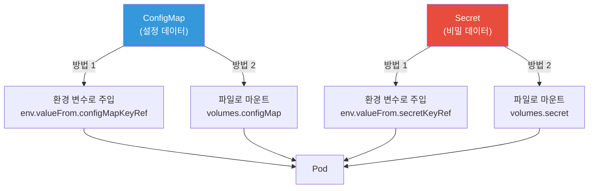
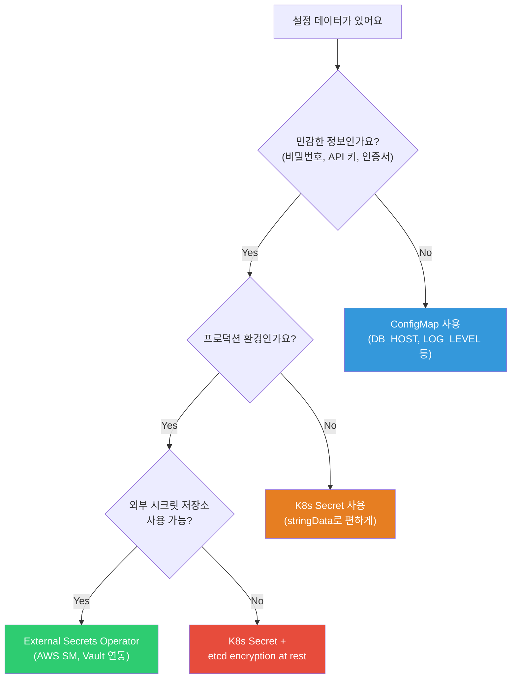
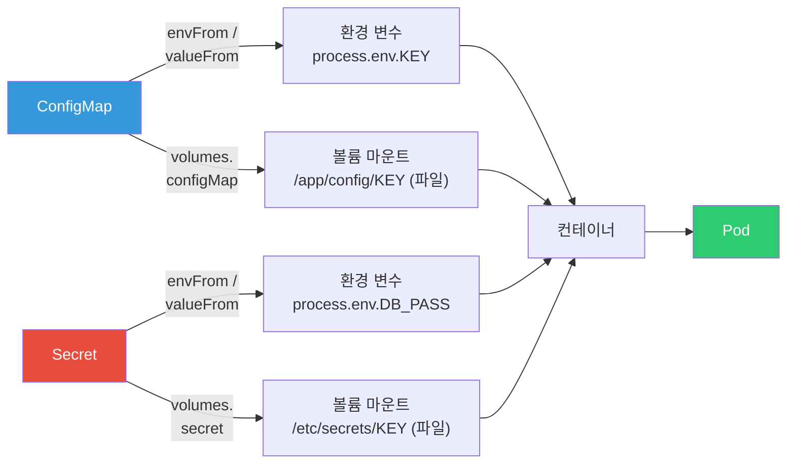
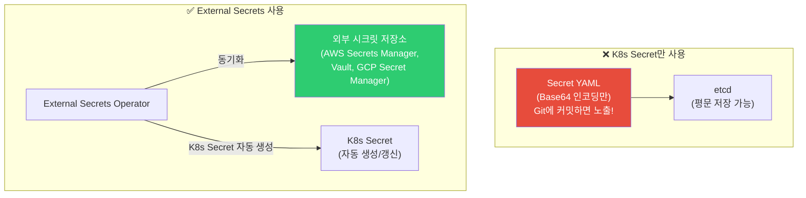

# ConfigMap / Secret / External Secrets

> "DB 비밀번호를 이미지에 하드코딩했어요" — 이건 [컨테이너 보안](../03-containers/09-security)에서 배운 가장 위험한 실수예요. K8s에서는 **ConfigMap**으로 설정을, **Secret**으로 비밀 정보를 관리하고, Pod에 주입해요. 이미지를 수정하지 않고도 환경별로 다른 설정을 사용할 수 있어요.

---

## 🎯 이걸 왜 알아야 하나?

```
실무에서 ConfigMap/Secret 관련 업무:
• 앱 설정을 환경별로 다르게 (dev/staging/prod)     → ConfigMap
• DB 비밀번호, API 키 관리                         → Secret
• 설정 변경 시 앱 재배포 없이 적용                  → ConfigMap 업데이트
• AWS Secrets Manager/Vault와 K8s 연동             → External Secrets
• "ConfigMap 바꿨는데 앱에 반영이 안 돼요"          → 롤아웃 전략
• 환경 변수 vs 파일 마운트 어떤 걸 쓰나요?          → 용도별 선택
```

---

## 🧠 핵심 개념

### 비유: 요리의 레시피 카드와 금고

* **이미지** = 요리사 (코드). 어떤 식당에서든 같은 사람
* **ConfigMap** = 레시피 카드. 식당마다 다른 레시피 (개발: 순한맛, 운영: 매운맛)
* **Secret** = 금고 속 비밀 재료. 특별한 소스 레시피 (접근 제한!)
* **환경 변수** = 요리사에게 구두로 전달 ("오늘은 매운맛으로!")
* **볼륨 마운트** = 레시피 카드를 테이블에 놓기 (파일로 전달)

### 설정 주입 방법



### ConfigMap vs Secret 사용 판단



### ConfigMap/Secret이 Pod에 주입되는 과정



---

## 🔍 상세 설명 — ConfigMap

### ConfigMap 생성

```bash
# === 방법 1: 명령어로 생성 ===

# 키-값 쌍으로
kubectl create configmap app-config \
    --from-literal=NODE_ENV=production \
    --from-literal=LOG_LEVEL=info \
    --from-literal=PORT=3000

# 파일에서
kubectl create configmap nginx-config \
    --from-file=nginx.conf=./nginx.conf \
    --from-file=default.conf=./default.conf

# 디렉토리 전체
kubectl create configmap app-configs --from-file=./config-dir/

# .env 파일에서
kubectl create configmap env-config --from-env-file=.env

# === 방법 2: YAML로 생성 (⭐ 실무 추천!) ===
```

```yaml
apiVersion: v1
kind: ConfigMap
metadata:
  name: app-config
  namespace: production
data:
  # 단순 키-값 (환경 변수용)
  NODE_ENV: "production"
  LOG_LEVEL: "info"
  PORT: "3000"
  DB_HOST: "postgres-service"
  DB_PORT: "5432"
  DB_NAME: "myapp"
  REDIS_HOST: "redis-service"
  CACHE_TTL: "300"
  
  # 파일 내용 (멀티라인)
  app.properties: |
    server.port=3000
    logging.level=info
    cache.ttl=300
    feature.new-ui=true
  
  nginx.conf: |
    server {
        listen 80;
        server_name localhost;
        location / {
            proxy_pass http://localhost:3000;
        }
    }
```

```bash
# ConfigMap 확인
kubectl get configmaps
# NAME         DATA   AGE
# app-config   8      5d

kubectl describe configmap app-config
# Name:         app-config
# Namespace:    production
# Data
# ====
# NODE_ENV:   production
# LOG_LEVEL:  info
# PORT:       3000
# ...

# 내용 확인
kubectl get configmap app-config -o yaml
kubectl get configmap app-config -o jsonpath='{.data.NODE_ENV}'
# production
```

### ConfigMap을 Pod에 주입하기

#### 방법 1: 환경 변수로 주입

```yaml
apiVersion: v1
kind: Pod
metadata:
  name: myapp
spec:
  containers:
  - name: myapp
    image: myapp:v1.0
    
    # 개별 키를 환경 변수로
    env:
    - name: NODE_ENV                   # Pod 안에서의 변수 이름
      valueFrom:
        configMapKeyRef:
          name: app-config             # ConfigMap 이름
          key: NODE_ENV                # ConfigMap의 키
    - name: LOG_LEVEL
      valueFrom:
        configMapKeyRef:
          name: app-config
          key: LOG_LEVEL
    
    # ConfigMap의 모든 키를 한번에 환경 변수로!
    envFrom:
    - configMapRef:
        name: app-config               # 모든 키가 환경 변수가 됨
      prefix: "APP_"                   # 선택: 접두사 붙이기
      # → APP_NODE_ENV, APP_LOG_LEVEL, APP_PORT, ...
```

```bash
# 환경 변수 확인
kubectl exec myapp -- env | grep -E "NODE_ENV|LOG_LEVEL|APP_"
# NODE_ENV=production
# LOG_LEVEL=info
# APP_NODE_ENV=production
# APP_LOG_LEVEL=info
# APP_PORT=3000
# ...

# ⚠️ 환경 변수로 주입하면:
# → Pod 시작 시 값이 정해지고, ConfigMap이 바뀌어도 반영 안 됨!
# → 반영하려면 Pod를 재시작해야 해요
```

#### 방법 2: 파일(볼륨)로 마운트

```yaml
apiVersion: v1
kind: Pod
metadata:
  name: myapp
spec:
  containers:
  - name: myapp
    image: myapp:v1.0
    volumeMounts:
    - name: config-volume
      mountPath: /app/config           # 이 경로에 파일로 마운트
      readOnly: true
    - name: nginx-config
      mountPath: /etc/nginx/conf.d/default.conf
      subPath: nginx.conf              # 특정 키만 단일 파일로!
  
  volumes:
  - name: config-volume
    configMap:
      name: app-config                 # ConfigMap 전체
      # → /app/config/NODE_ENV, /app/config/LOG_LEVEL, ... 파일 생성
  
  - name: nginx-config
    configMap:
      name: app-config
      items:                           # 특정 키만 선택
      - key: nginx.conf
        path: nginx.conf               # 파일 이름
```

```bash
# 마운트된 파일 확인
kubectl exec myapp -- ls /app/config/
# NODE_ENV
# LOG_LEVEL
# PORT
# DB_HOST
# app.properties
# nginx.conf

kubectl exec myapp -- cat /app/config/NODE_ENV
# production

kubectl exec myapp -- cat /app/config/app.properties
# server.port=3000
# logging.level=info
# cache.ttl=300
# feature.new-ui=true

# ✅ 볼륨 마운트의 장점:
# → ConfigMap이 업데이트되면 파일도 자동 업데이트! (수십 초 후)
# → 단, 앱이 파일 변경을 감지해야 함 (inotify 등)
# → subPath로 마운트한 파일은 자동 업데이트 안 됨! ⚠️
```

### 환경 변수 vs 볼륨 마운트 선택

| 항목 | 환경 변수 (env) | 볼륨 마운트 (volume) |
|------|----------------|---------------------|
| 주입 방식 | `process.env.KEY` | 파일 읽기 |
| 자동 업데이트 | ❌ (재시작 필요) | ✅ (자동, 수십 초) |
| 용도 | 간단한 키-값 | 설정 파일, 인증서 |
| 크기 제한 | 환경 변수 총 크기 제한 | 파일 크기 유연 |
| 추천 | DB_HOST, PORT 등 단순 값 | nginx.conf 등 파일 |

---

## 🔍 상세 설명 — Secret

### Secret이란?

비밀번호, API 키, 인증서 등 **민감한 데이터**를 저장하는 리소스예요. ConfigMap과 사용법은 비슷하지만 **Base64 인코딩**돼요.

```bash
# ⚠️ K8s Secret의 한계:
# → Base64 인코딩일 뿐, 암호화가 아님!
# → etcd에 평문(또는 Base64)으로 저장됨
# → RBAC으로 접근 제어는 가능
# → 진짜 암호화: etcd encryption at rest + External Secrets

# K8s Secret = "조금 더 안전한 ConfigMap" 정도로 이해
# 진짜 보안 = External Secrets (AWS Secrets Manager, Vault)
```

### Secret 생성

```bash
# === 명령어로 생성 ===

# 일반 시크릿
kubectl create secret generic db-credentials \
    --from-literal=username=myuser \
    --from-literal=password='S3cur3P@ss!' \
    --from-literal=host=postgres-service

# 파일에서
kubectl create secret generic tls-certs \
    --from-file=tls.crt=./fullchain.pem \
    --from-file=tls.key=./privkey.pem

# Docker 레지스트리 인증 (../03-containers/07-registry 참고)
kubectl create secret docker-registry ecr-secret \
    --docker-server=123456789.dkr.ecr.ap-northeast-2.amazonaws.com \
    --docker-username=AWS \
    --docker-password=$(aws ecr get-login-password)

# TLS 인증서 (../02-networking/05-tls-certificate 참고)
kubectl create secret tls my-tls \
    --cert=fullchain.pem \
    --key=privkey.pem
```

```yaml
# === YAML로 생성 ===
apiVersion: v1
kind: Secret
metadata:
  name: db-credentials
  namespace: production
type: Opaque                       # 일반 시크릿 (기본)
data:
  # ⚠️ Base64 인코딩 필수!
  username: bXl1c2Vy              # echo -n "myuser" | base64
  password: UzNjdXIzUEBzcyE=      # echo -n "S3cur3P@ss!" | base64
  host: cG9zdGdyZXMtc2VydmljZQ==  # echo -n "postgres-service" | base64

---
# stringData를 쓰면 Base64 인코딩 안 해도 됨! (⭐ 더 편함)
apiVersion: v1
kind: Secret
metadata:
  name: db-credentials
type: Opaque
stringData:                        # ← data 대신 stringData!
  username: myuser                 # 평문으로 써도 됨
  password: "S3cur3P@ss!"
  host: postgres-service
  # K8s가 자동으로 Base64로 변환해서 저장
```

```bash
# Base64 인코딩/디코딩
echo -n "myuser" | base64
# bXl1c2Vy

echo -n "bXl1c2Vy" | base64 --decode
# myuser

# ⚠️ echo에 -n 필수! (-n 없으면 줄바꿈이 포함됨)

# Secret 내용 확인 (Base64 디코딩)
kubectl get secret db-credentials -o jsonpath='{.data.password}' | base64 --decode
# S3cur3P@ss!

# 전체 Secret 확인
kubectl get secret db-credentials -o yaml
# data:
#   password: UzNjdXIzUEBzcyE=    ← Base64 인코딩됨
#   username: bXl1c2Vy
```

### Secret 타입

| 타입 | 용도 | 생성 방법 |
|------|------|----------|
| `Opaque` | 일반 (기본) | `kubectl create secret generic` |
| `kubernetes.io/tls` | TLS 인증서 | `kubectl create secret tls` |
| `kubernetes.io/dockerconfigjson` | 레지스트리 인증 | `kubectl create secret docker-registry` |
| `kubernetes.io/basic-auth` | Basic 인증 | YAML로 |
| `kubernetes.io/ssh-auth` | SSH 키 | YAML로 |
| `kubernetes.io/service-account-token` | SA 토큰 (자동) | K8s가 자동 생성 |

### Secret을 Pod에 주입하기

```yaml
apiVersion: apps/v1
kind: Deployment
metadata:
  name: myapp
spec:
  replicas: 3
  selector:
    matchLabels:
      app: myapp
  template:
    metadata:
      labels:
        app: myapp
    spec:
      containers:
      - name: myapp
        image: myapp:v1.0
        
        # === 환경 변수로 주입 ===
        env:
        # 개별 키
        - name: DB_USERNAME
          valueFrom:
            secretKeyRef:
              name: db-credentials
              key: username
        - name: DB_PASSWORD
          valueFrom:
            secretKeyRef:
              name: db-credentials
              key: password
        
        # ConfigMap과 Secret 혼합
        - name: DB_HOST
          valueFrom:
            configMapKeyRef:
              name: app-config
              key: DB_HOST
        - name: DB_PORT
          valueFrom:
            configMapKeyRef:
              name: app-config
              key: DB_PORT
        
        # === 파일로 마운트 ===
        volumeMounts:
        - name: db-creds
          mountPath: /etc/secrets/db
          readOnly: true
        - name: tls-certs
          mountPath: /etc/tls
          readOnly: true
      
      # 레지스트리 인증 (이미지 pull용)
      imagePullSecrets:
      - name: ecr-secret
      
      volumes:
      - name: db-creds
        secret:
          secretName: db-credentials
          defaultMode: 0400            # 파일 권한 (읽기 전용, 소유자만)
      - name: tls-certs
        secret:
          secretName: my-tls
```

```bash
# 마운트된 Secret 파일 확인
kubectl exec myapp-abc-1 -- ls -la /etc/secrets/db/
# -r--------  1 root root  6 ... username
# -r--------  1 root root 12 ... password
# -r--------  1 root root 16 ... host

kubectl exec myapp-abc-1 -- cat /etc/secrets/db/username
# myuser

# 환경 변수 확인
kubectl exec myapp-abc-1 -- env | grep DB_
# DB_USERNAME=myuser
# DB_PASSWORD=S3cur3P@ss!
# DB_HOST=postgres-service
# DB_PORT=5432
```

---

## 🔍 상세 설명 — External Secrets (★ 프로덕션 보안!)

### 왜 External Secrets가 필요한가?



```bash
# K8s Secret의 보안 문제:
# 1. Base64 인코딩일 뿐 (echo "UzNjdXIz" | base64 -d → 평문 노출!)
# 2. YAML에 Secret을 넣으면 Git에 커밋 위험
# 3. etcd에 평문으로 저장될 수 있음
# 4. kubectl get secret으로 누구나 볼 수 있음 (RBAC 미설정 시)

# External Secrets의 장점:
# 1. 비밀 정보는 외부 저장소에만 (AWS Secrets Manager, Vault)
# 2. K8s Secret은 자동으로 생성/갱신
# 3. Git에는 "어디서 가져올지"만 저장 (비밀 없음!)
# 4. 비밀 정보 회전(rotation) 자동화
# 5. 감사 로그 (누가 언제 접근했는지)
```

### External Secrets Operator (ESO)

```bash
# ESO 설치 (Helm)
helm repo add external-secrets https://charts.external-secrets.io
helm install external-secrets external-secrets/external-secrets \
    -n external-secrets --create-namespace

# 확인
kubectl get pods -n external-secrets
# NAME                                  READY   STATUS
# external-secrets-abc123               1/1     Running
# external-secrets-webhook-def456       1/1     Running
```

```yaml
# 1. SecretStore — "어떤 외부 저장소를 쓸지" 정의
apiVersion: external-secrets.io/v1beta1
kind: SecretStore
metadata:
  name: aws-secrets-manager
  namespace: production
spec:
  provider:
    aws:
      service: SecretsManager
      region: ap-northeast-2
      auth:
        jwt:
          serviceAccountRef:
            name: external-secrets-sa    # IRSA (IAM Role for SA)

---
# 2. ExternalSecret — "어떤 비밀을 가져올지" 정의
apiVersion: external-secrets.io/v1beta1
kind: ExternalSecret
metadata:
  name: db-credentials
  namespace: production
spec:
  refreshInterval: 1h                    # 1시간마다 동기화
  
  secretStoreRef:
    name: aws-secrets-manager            # 위에서 만든 SecretStore
    kind: SecretStore
  
  target:
    name: db-credentials                 # 생성될 K8s Secret 이름
    creationPolicy: Owner
  
  data:
  - secretKey: username                  # K8s Secret의 키
    remoteRef:
      key: production/myapp/db           # AWS Secrets Manager의 시크릿 이름
      property: username                 # JSON 안의 키
  
  - secretKey: password
    remoteRef:
      key: production/myapp/db
      property: password
  
  - secretKey: host
    remoteRef:
      key: production/myapp/db
      property: host
```

```bash
# AWS Secrets Manager에 시크릿 저장
aws secretsmanager create-secret \
    --name production/myapp/db \
    --secret-string '{"username":"myuser","password":"S3cur3P@ss!","host":"mydb.abc.rds.amazonaws.com"}'

# ESO가 자동으로 K8s Secret 생성!
kubectl get secret db-credentials -n production
# NAME              TYPE     DATA   AGE
# db-credentials    Opaque   3      30s    ← 자동 생성됨!

# Secret 내용 확인
kubectl get secret db-credentials -o jsonpath='{.data.password}' | base64 -d
# S3cur3P@ss!

# ExternalSecret 상태 확인
kubectl get externalsecret -n production
# NAME              STORE                  REFRESH   STATUS
# db-credentials    aws-secrets-manager    1h        SecretSynced    ← 동기화 완료!

# AWS에서 비밀번호 변경하면?
aws secretsmanager update-secret \
    --secret-id production/myapp/db \
    --secret-string '{"username":"myuser","password":"NewP@ss123!","host":"mydb.abc.rds.amazonaws.com"}'
# → 1시간 후 (refreshInterval) K8s Secret이 자동 업데이트!
# → 즉시 반영하려면:
kubectl annotate externalsecret db-credentials force-sync=$(date +%s) --overwrite
```

### Git에 저장해도 안전한 구조

```bash
# Git에 커밋하는 것:
# ✅ ExternalSecret YAML (비밀 없음! "어디서 가져올지"만)
# ✅ ConfigMap YAML (비밀이 아닌 설정)
# ✅ Deployment YAML

# Git에 커밋하지 않는 것:
# ❌ Secret YAML (비밀 정보 포함!)
# → Secret은 ESO가 자동 생성

# GitOps와 완벽 호환:
# Git repo:
# ├── configmap.yaml        ← 커밋 ✅
# ├── external-secret.yaml  ← 커밋 ✅ (비밀 없음!)
# ├── deployment.yaml       ← 커밋 ✅
# └── (secret.yaml 없음!)   ← ESO가 자동 생성
```

---

## 🔍 상세 설명 — ConfigMap/Secret 변경 시 Pod 업데이트

### 문제: ConfigMap 바꿨는데 앱에 반영이 안 돼요!

```bash
# 환경 변수로 주입한 경우:
# → Pod 재시작 전까지 반영 안 됨!
# → ConfigMap 변경 → Pod 재시작 필요

# 볼륨으로 마운트한 경우:
# → 수십 초 후 파일이 자동 업데이트됨
# → 하지만 앱이 파일 변경을 감지해야! (대부분 안 함)
# → subPath로 마운트한 파일은 업데이트 안 됨!
```

### 해결: ConfigMap 변경 시 자동 롤아웃

```yaml
# 방법 1: ConfigMap 해시를 annotation에 포함 (⭐ 가장 많이 씀)
apiVersion: apps/v1
kind: Deployment
metadata:
  name: myapp
spec:
  template:
    metadata:
      annotations:
        # ConfigMap 내용이 바뀌면 해시가 바뀜 → Pod 재생성!
        checksum/config: "{{ sha256sum .Values.configData }}"    # Helm
    spec:
      containers:
      - name: myapp
        envFrom:
        - configMapRef:
            name: app-config
```

```bash
# 방법 2: kubectl rollout restart (수동)
kubectl rollout restart deployment/myapp
# → 모든 Pod가 Rolling Update로 재시작
# → 새 Pod가 최신 ConfigMap/Secret 값을 가져감

# 방법 3: Reloader (자동 감지)
# → stakater/Reloader: ConfigMap/Secret 변경 시 자동 롤아웃
# 설치:
helm repo add stakater https://stakater.github.io/stakater-charts
helm install reloader stakater/reloader -n kube-system

# Deployment에 annotation 추가:
# metadata:
#   annotations:
#     reloader.stakater.com/auto: "true"
# → ConfigMap/Secret이 바뀌면 자동으로 Pod 재시작!
```

---

## 💻 실습 예제

### 실습 1: ConfigMap으로 앱 설정 관리

```bash
# 1. ConfigMap 생성
kubectl apply -f - << 'EOF'
apiVersion: v1
kind: ConfigMap
metadata:
  name: demo-config
data:
  APP_NAME: "My Demo App"
  LOG_LEVEL: "debug"
  index.html: |
    <html>
    <body>
    <h1>Hello from ConfigMap!</h1>
    <p>Environment: Development</p>
    </body>
    </html>
EOF

# 2. Pod에 환경 변수 + 파일로 주입
kubectl apply -f - << 'EOF'
apiVersion: v1
kind: Pod
metadata:
  name: config-demo
spec:
  containers:
  - name: nginx
    image: nginx:alpine
    env:
    - name: APP_NAME
      valueFrom:
        configMapKeyRef:
          name: demo-config
          key: APP_NAME
    - name: LOG_LEVEL
      valueFrom:
        configMapKeyRef:
          name: demo-config
          key: LOG_LEVEL
    volumeMounts:
    - name: html
      mountPath: /usr/share/nginx/html
      readOnly: true
    ports:
    - containerPort: 80
  volumes:
  - name: html
    configMap:
      name: demo-config
      items:
      - key: index.html
        path: index.html
EOF

# 3. 확인
kubectl exec config-demo -- env | grep -E "APP_NAME|LOG_LEVEL"
# APP_NAME=My Demo App
# LOG_LEVEL=debug

kubectl exec config-demo -- cat /usr/share/nginx/html/index.html
# <html>...Hello from ConfigMap!...</html>

kubectl port-forward config-demo 8080:80 &
curl http://localhost:8080
# <html>...Hello from ConfigMap!...</html>

# 4. ConfigMap 업데이트 → 볼륨은 자동 반영!
kubectl patch configmap demo-config --type merge -p '{"data":{"index.html":"<html><body><h1>Updated!</h1></body></html>"}}'

# 수십 초 후...
kubectl exec config-demo -- cat /usr/share/nginx/html/index.html
# <html><body><h1>Updated!</h1></body></html>    ← 자동 업데이트!

# 하지만 환경 변수는 안 바뀜!
kubectl exec config-demo -- env | grep LOG_LEVEL
# LOG_LEVEL=debug    ← 여전히 debug (Pod 재시작 전까지)

# 5. 정리
kill %1 2>/dev/null
kubectl delete pod config-demo
kubectl delete configmap demo-config
```

### 실습 2: Secret으로 비밀 정보 관리

```bash
# 1. Secret 생성 (stringData로 편하게)
kubectl apply -f - << 'EOF'
apiVersion: v1
kind: Secret
metadata:
  name: demo-secret
type: Opaque
stringData:
  username: admin
  password: "SuperSecret123!"
  api-key: "sk-abc123def456"
EOF

# 2. Secret 확인 (Base64 인코딩됨)
kubectl get secret demo-secret -o yaml | grep -A 5 "data:"
# data:
#   api-key: c2stYWJjMTIzZGVmNDU2
#   password: U3VwZXJTZWNyZXQxMjMh
#   username: YWRtaW4=

# Base64 디코딩
kubectl get secret demo-secret -o jsonpath='{.data.password}' | base64 -d
# SuperSecret123!

# 3. Pod에 주입
kubectl apply -f - << 'EOF'
apiVersion: v1
kind: Pod
metadata:
  name: secret-demo
spec:
  containers:
  - name: app
    image: busybox
    command: ["sh", "-c", "echo User=$DB_USER Pass=$DB_PASS && sleep 3600"]
    env:
    - name: DB_USER
      valueFrom:
        secretKeyRef:
          name: demo-secret
          key: username
    - name: DB_PASS
      valueFrom:
        secretKeyRef:
          name: demo-secret
          key: password
    volumeMounts:
    - name: secrets
      mountPath: /etc/secrets
      readOnly: true
  volumes:
  - name: secrets
    secret:
      secretName: demo-secret
      defaultMode: 0400
EOF

# 4. 확인
kubectl logs secret-demo
# User=admin Pass=SuperSecret123!

kubectl exec secret-demo -- ls -la /etc/secrets/
# -r--------  1 root root  ... api-key
# -r--------  1 root root  ... password
# -r--------  1 root root  ... username

kubectl exec secret-demo -- cat /etc/secrets/api-key
# sk-abc123def456

# 5. 정리
kubectl delete pod secret-demo
kubectl delete secret demo-secret
```

### 실습 3: 환경별 설정 분리

```bash
# 같은 Deployment, 다른 ConfigMap으로 환경별 설정

# Dev 환경
kubectl create namespace dev
kubectl apply -n dev -f - << 'EOF'
apiVersion: v1
kind: ConfigMap
metadata:
  name: app-config
data:
  ENVIRONMENT: "development"
  LOG_LEVEL: "debug"
  DB_HOST: "dev-db.internal"
EOF

# Prod 환경
kubectl create namespace prod
kubectl apply -n prod -f - << 'EOF'
apiVersion: v1
kind: ConfigMap
metadata:
  name: app-config
data:
  ENVIRONMENT: "production"
  LOG_LEVEL: "warn"
  DB_HOST: "prod-db.internal"
EOF

# 같은 Deployment YAML → 다른 네임스페이스에 배포
# → 같은 이름의 ConfigMap이지만 내용이 다름!
# kubectl apply -f deployment.yaml -n dev
# kubectl apply -f deployment.yaml -n prod

# 확인
kubectl get configmap app-config -n dev -o jsonpath='{.data.ENVIRONMENT}'
# development
kubectl get configmap app-config -n prod -o jsonpath='{.data.ENVIRONMENT}'
# production

# → 같은 이미지, 같은 Deployment, 다른 설정!
# → 이게 ConfigMap의 핵심 가치

# 정리
kubectl delete namespace dev prod
```

---

## 🏢 실무에서는?

### 시나리오 1: Helm으로 환경별 설정 관리

```bash
# Helm values 파일로 환경별 ConfigMap/Secret 관리

# values-dev.yaml:
# config:
#   NODE_ENV: development
#   LOG_LEVEL: debug
#   DB_HOST: dev-db.internal

# values-prod.yaml:
# config:
#   NODE_ENV: production
#   LOG_LEVEL: warn
#   DB_HOST: prod-db.internal

# 배포:
# helm install myapp ./chart -f values-dev.yaml -n dev
# helm install myapp ./chart -f values-prod.yaml -n prod

# → 12-helm-kustomize 강의에서 상세히!
```

### 시나리오 2: Secret을 Git에 커밋해버렸을 때

```bash
# ❌ "secret.yaml을 실수로 git push 했어요!"

# 1. 즉시 조치:
# a. 해당 시크릿의 비밀번호/키를 즉시 변경(rotate)!
aws secretsmanager update-secret --secret-id myapp/db --secret-string '{"password":"NewPassword!"}'
# b. K8s Secret도 업데이트
kubectl create secret generic db-credentials --from-literal=password=NewPassword! --dry-run=client -o yaml | kubectl apply -f -

# 2. Git 이력에서 제거
# → BFG Repo Cleaner 또는 git filter-branch
# → 하지만 이미 누군가 clone했을 수 있음 → 키 회전이 더 중요!

# 3. 재발 방지:
# a. .gitignore에 *secret*.yaml 추가
# b. pre-commit hook으로 Secret 감지
# c. External Secrets Operator 도입 → Git에 비밀 안 넣음!
# d. git-secrets, trufflehog 같은 스캐닝 도구
```

### 시나리오 3: 비밀번호 자동 회전 (Rotation)

```bash
# AWS Secrets Manager + ESO로 자동 비밀번호 회전

# 1. Secrets Manager에서 자동 회전 설정
aws secretsmanager rotate-secret \
    --secret-id production/myapp/db \
    --rotation-lambda-arn arn:aws:lambda:...:function:secret-rotator \
    --rotation-rules AutomaticallyAfterDays=30
# → 30일마다 자동으로 비밀번호 변경!

# 2. ESO refreshInterval로 K8s Secret 자동 갱신
# spec:
#   refreshInterval: 1h    ← 1시간마다 확인
# → AWS에서 비밀번호가 바뀌면 → K8s Secret도 업데이트

# 3. Pod 재시작 (Reloader 또는 rollout restart)
# → 새 비밀번호로 DB 재연결

# 전체 흐름:
# AWS Secrets Manager (30일마다 회전)
#   → ESO (1시간마다 동기화)
#     → K8s Secret (자동 업데이트)
#       → Reloader (자동 Pod 재시작)
#         → 앱이 새 비밀번호 사용!
```

---

## ⚠️ 자주 하는 실수

### 1. Secret YAML을 Git에 커밋

```bash
# ❌ base64 인코딩은 암호화가 아님! 누구나 디코딩 가능
echo "UzNjdXIzUEBzcyE=" | base64 -d    # S3cur3P@ss!

# ✅ External Secrets Operator → Git에 비밀 안 넣음
# ✅ SealedSecrets → 암호화된 Secret을 Git에 커밋
# ✅ SOPS → YAML 파일의 값만 암호화
```

### 2. envFrom으로 불필요한 키까지 전부 주입

```yaml
# ❌ ConfigMap의 모든 키가 환경 변수가 됨 (충돌 위험!)
envFrom:
- configMapRef:
    name: huge-config    # 50개 키 전부 환경 변수로!

# ✅ 필요한 키만 선택적으로
env:
- name: DB_HOST
  valueFrom:
    configMapKeyRef:
      name: app-config
      key: DB_HOST
```

### 3. subPath 마운트의 자동 업데이트 안 되는 것을 모르기

```yaml
# ❌ subPath로 마운트하면 ConfigMap 변경 시 자동 업데이트 안 됨!
volumeMounts:
- name: config
  mountPath: /etc/nginx/nginx.conf
  subPath: nginx.conf            # ← 자동 업데이트 안 됨!

# ✅ 디렉토리로 마운트하면 자동 업데이트 됨
volumeMounts:
- name: config
  mountPath: /etc/nginx/conf.d/  # ← 디렉토리로! 자동 업데이트!
```

### 4. ConfigMap 크기 제한을 모르기

```bash
# ConfigMap/Secret 최대 크기: 1MB (etcd 제한)
# → 큰 설정 파일은 ConfigMap에 안 맞을 수 있음

# ✅ 큰 파일은 외부 저장소(S3 등)에서 Init Container로 다운로드
# ✅ 또는 이미지에 포함
```

### 5. 모든 환경에서 같은 Secret 사용

```bash
# ❌ dev/staging/prod에서 같은 DB 비밀번호
# → dev 환경 유출 시 prod도 위험!

# ✅ 환경별 다른 Secret
# dev: dev-db-credentials (dev 전용 비밀번호)
# staging: staging-db-credentials
# prod: prod-db-credentials
# → 환경별 네임스페이스 + 각각의 Secret
```

---

## 📝 정리

### ConfigMap vs Secret 선택

```
ConfigMap: DB_HOST, LOG_LEVEL, PORT 등 일반 설정
Secret:   DB_PASSWORD, API_KEY, TLS 인증서 등 비밀 정보
```

### 주입 방식 선택

```
단순 키-값 (DB_HOST, PORT)     → 환경 변수 (env/envFrom)
설정 파일 (nginx.conf)         → 볼륨 마운트 (volume)
자동 업데이트 필요             → 볼륨 마운트 (subPath 아닌!)
프로덕션 비밀 정보             → External Secrets + Vault/AWS SM
```

### 핵심 명령어

```bash
# ConfigMap
kubectl create configmap NAME --from-literal=key=value
kubectl create configmap NAME --from-file=key=file.conf
kubectl get configmap NAME -o yaml
kubectl describe configmap NAME

# Secret
kubectl create secret generic NAME --from-literal=key=value
kubectl create secret tls NAME --cert=cert.pem --key=key.pem
kubectl get secret NAME -o jsonpath='{.data.KEY}' | base64 -d

# 변경 반영
kubectl rollout restart deployment/NAME
```

### 보안 체크리스트

```
✅ Secret YAML을 Git에 커밋하지 않기
✅ External Secrets Operator 사용 (프로덕션)
✅ RBAC으로 Secret 접근 제한
✅ 환경별 다른 Secret 사용
✅ 비밀번호 정기 회전 (rotation)
✅ etcd encryption at rest 활성화
✅ Secret 파일의 defaultMode: 0400 (읽기 전용)
```

---

## 🔗 다음 강의

다음은 **[05-service-ingress](./05-service-ingress)** — Service / Ingress / Gateway API 이에요.

Pod를 만들었으니, 이제 외부에서 어떻게 접근하는지 배워볼게요. ClusterIP, NodePort, LoadBalancer Service와 [이전에 배운 Ingress](../02-networking/13-api-gateway)를 K8s 실전으로 다뤄볼 거예요.
