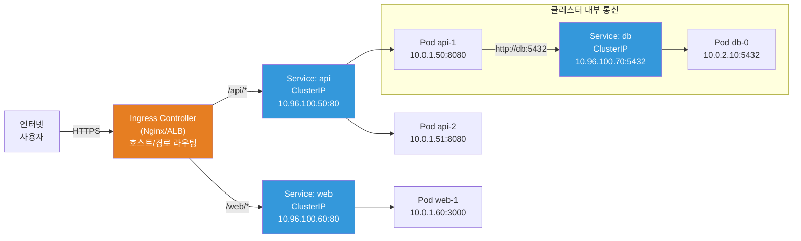
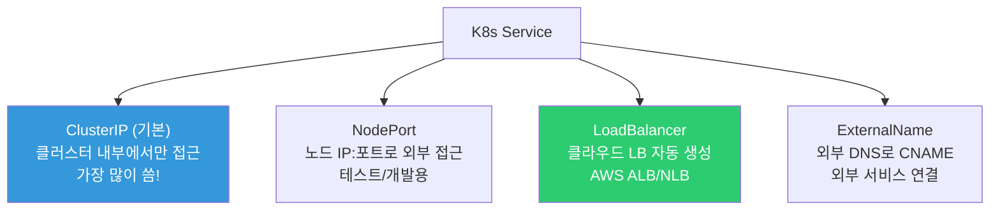
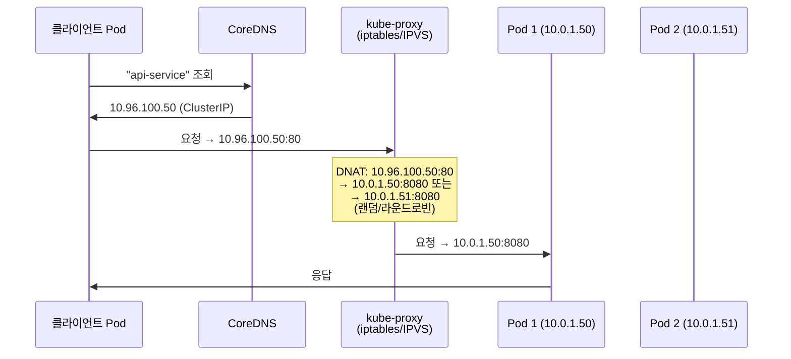
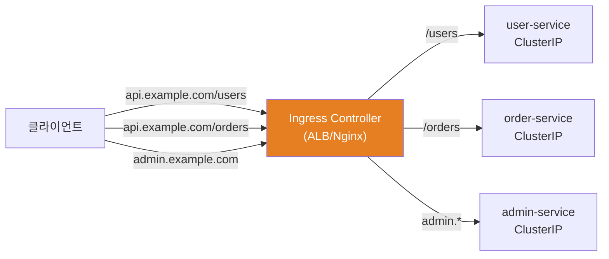
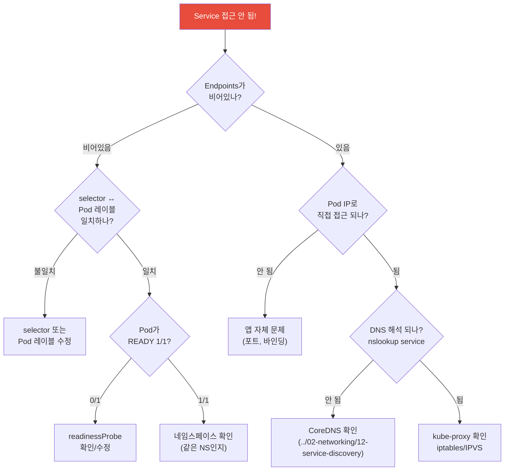

# Service / Ingress / Gateway API

> Pod를 만들었는데 어떻게 접근하죠? Pod IP는 매번 바뀌고, Pod가 여러 개면 어디로 보내야 하죠? **Service**가 안정적인 엔드포인트를 제공하고, **Ingress**가 외부에서 들어오는 HTTP 트래픽을 라우팅해요. [네트워크 강의](../02-networking/06-load-balancing)에서 배운 LB 개념의 K8s 실전 버전이에요.

---

## 🎯 이걸 왜 알아야 하나?

```
실무에서 Service/Ingress 관련 업무:
• 마이크로서비스 간 통신 설정                  → ClusterIP Service
• 외부에서 앱 접속 (HTTPS)                    → Ingress + TLS
• AWS ALB/NLB 자동 생성                       → LoadBalancer Service
• 도메인별/경로별 라우팅                       → Ingress rules
• 카나리 배포 (트래픽 분배)                    → Gateway API weights
• "서비스 접근이 안 돼요" 디버깅               → Endpoints, kube-proxy
```

---

## 🧠 핵심 개념

### 트래픽 흐름 전체 그림



---

## 🔍 상세 설명 — Service

### Service가 필요한 이유

```bash
# Pod IP는 매번 바뀜!
kubectl get pods -o wide
# NAME        IP           NODE
# api-abc-1   10.0.1.50    node-1
# api-abc-2   10.0.1.51    node-2

# Pod가 재시작되면?
kubectl delete pod api-abc-1
kubectl get pods -o wide
# NAME        IP           NODE
# api-abc-3   10.0.1.99    node-1    ← IP가 바뀜!
# api-abc-2   10.0.1.51    node-2

# → 다른 서비스가 "10.0.1.50"으로 연결했으면 끊김!
# → Service를 쓰면 안정적인 IP(ClusterIP)와 DNS 이름 제공
```

### Service 종류 4가지



### ClusterIP (★ 가장 많이 사용)

클러스터 **내부에서만** 접근 가능한 가상 IP예요. 마이크로서비스 간 통신에 사용해요.

```yaml
apiVersion: v1
kind: Service
metadata:
  name: api-service
  namespace: production
spec:
  type: ClusterIP                    # 기본값 (생략 가능)
  selector:
    app: api                         # ⭐ 이 레이블의 Pod에 트래픽 전달
  ports:
  - name: http
    port: 80                         # Service 포트 (클라이언트가 접근하는 포트)
    targetPort: 8080                 # Pod 포트 (컨테이너가 리슨하는 포트)
    protocol: TCP
  - name: grpc
    port: 9090
    targetPort: 9090
```

```bash
# Service 확인
kubectl get svc
# NAME          TYPE        CLUSTER-IP      EXTERNAL-IP   PORT(S)          AGE
# api-service   ClusterIP   10.96.100.50    <none>        80/TCP,9090/TCP  5d
# kubernetes    ClusterIP   10.96.0.1       <none>        443/TCP          30d

# 핵심: Service는 2가지를 제공
# 1. 안정적인 IP (ClusterIP: 10.96.100.50) → 절대 안 바뀜!
# 2. DNS 이름 (api-service.production.svc.cluster.local)
#    → (../02-networking/12-service-discovery에서 상세히 다뤘음!)

# 다른 Pod에서 접근:
# curl http://api-service:80            ← 같은 네임스페이스
# curl http://api-service.production:80  ← 다른 네임스페이스에서

# Endpoints (실제 Pod IP 목록) — kube-proxy가 이걸로 라우팅!
kubectl get endpoints api-service
# NAME          ENDPOINTS                           AGE
# api-service   10.0.1.50:8080,10.0.1.51:8080      5d
#               ^^^^^^^^^^^^^^  ^^^^^^^^^^^^^^
#               Pod 1            Pod 2

# Pod가 죽으면? → Endpoints에서 자동 제거!
# 새 Pod가 뜨면? → Endpoints에 자동 추가!
# → readinessProbe 통과한 Pod만 Endpoints에 포함!
```



### NodePort

노드의 특정 포트를 열어서 **외부에서 접근** 가능하게 해요. 프로덕션보다는 테스트/개발용이에요.

```yaml
apiVersion: v1
kind: Service
metadata:
  name: api-nodeport
spec:
  type: NodePort
  selector:
    app: api
  ports:
  - port: 80                         # Service 포트
    targetPort: 8080                  # Pod 포트
    nodePort: 30080                   # ⭐ 노드 포트 (30000-32767)
```

```bash
kubectl get svc api-nodeport
# NAME           TYPE       CLUSTER-IP     EXTERNAL-IP   PORT(S)
# api-nodeport   NodePort   10.96.100.60   <none>        80:30080/TCP
#                                                         ^^^^^^^^
#                                                         노드포트!

# 접근: 아무 노드의 IP + 30080
curl http://node-1-ip:30080
curl http://node-2-ip:30080    # 아무 노드로 접근 가능!

# ⚠️ NodePort의 단점:
# - 포트 범위 제한 (30000-32767)
# - 노드 IP를 알아야 함
# - 보안 (모든 노드에 포트가 열림)
# → 프로덕션에서는 LoadBalancer 또는 Ingress 사용!
```

### LoadBalancer

클라우드의 **로드 밸런서를 자동으로 생성**해요. AWS에서는 ALB/NLB가 만들어져요.

```yaml
apiVersion: v1
kind: Service
metadata:
  name: api-lb
  annotations:
    # AWS NLB 설정 (EKS)
    service.beta.kubernetes.io/aws-load-balancer-type: "nlb"
    service.beta.kubernetes.io/aws-load-balancer-scheme: "internet-facing"
    service.beta.kubernetes.io/aws-load-balancer-cross-zone-load-balancing-enabled: "true"
spec:
  type: LoadBalancer
  selector:
    app: api
  ports:
  - port: 80
    targetPort: 8080
```

```bash
kubectl get svc api-lb
# NAME     TYPE           CLUSTER-IP     EXTERNAL-IP                                 PORT(S)
# api-lb   LoadBalancer   10.96.100.70   abc123.ap-northeast-2.elb.amazonaws.com    80:31234/TCP
#                                        ^^^^^^^^^^^^^^^^^^^^^^^^^^^^^^^^^^^^^^^
#                                        AWS가 자동으로 NLB 생성!

# → 이 DNS 이름으로 외부에서 접근 가능!
curl http://abc123.ap-northeast-2.elb.amazonaws.com

# ⚠️ Service 하나당 LB 하나 → 비용!
# → 서비스가 10개면 LB도 10개 → 비쌈!
# → 해결: Ingress로 하나의 LB에서 여러 서비스 라우팅 ⭐
```

### ExternalName

외부 서비스(RDS 등)에 **K8s DNS 별칭**을 만들어요.

```yaml
apiVersion: v1
kind: Service
metadata:
  name: database                       # Pod에서 "database"로 접근
spec:
  type: ExternalName
  externalName: mydb.abc123.ap-northeast-2.rds.amazonaws.com
  # → nslookup database → CNAME → RDS 엔드포인트
```

```bash
# Pod에서 사용:
# DB_HOST=database    ← RDS 엔드포인트를 직접 안 써도 됨!

# 장점:
# → 앱 코드에서 RDS 엔드포인트를 하드코딩 안 해도 됨
# → RDS를 교체해도 ExternalName만 바꾸면 됨
# → (../02-networking/12-service-discovery에서 이미 다뤘음!)
```

### Headless Service (clusterIP: None)

```yaml
# StatefulSet에서 사용 (./03-statefulset-daemonset 참고)
apiVersion: v1
kind: Service
metadata:
  name: mysql-headless
spec:
  clusterIP: None                      # ← Headless!
  selector:
    app: mysql
  ports:
  - port: 3306
```

```bash
# 일반 Service: DNS → ClusterIP 1개 → kube-proxy가 분배
# Headless:     DNS → Pod IP 전부 반환 → 클라이언트가 선택

kubectl run test --image=busybox --rm -it --restart=Never -- nslookup mysql-headless
# Address: 10.0.1.50   ← Pod 0
# Address: 10.0.1.51   ← Pod 1
# Address: 10.0.1.52   ← Pod 2

# 개별 Pod DNS (StatefulSet):
# mysql-0.mysql-headless.production.svc.cluster.local → 10.0.1.50
```

---

## 🔍 상세 설명 — Ingress

### Ingress란?

**HTTP/HTTPS 트래픽을 호스트/경로 기반으로 라우팅**하는 리소스예요. [API Gateway 강의](../02-networking/13-api-gateway)에서 Ingress 개념을 이미 배웠죠? 여기서는 K8s 실전으로 깊이 파볼게요.



**Ingress vs LoadBalancer Service:**

| 항목 | LoadBalancer Service | Ingress |
|------|---------------------|---------|
| LB 수 | 서비스당 1개 (비쌈!) | **1개로 여러 서비스** |
| 라우팅 | L4 (IP+포트만) | L7 (호스트, 경로, 헤더) |
| TLS | 서비스별 설정 | 중앙에서 TLS 종단 |
| 기능 | 단순 분배 | Rate limit, 리다이렉트, 리라이트 |
| 추천 | TCP/UDP 서비스 (DB 등) | **HTTP/HTTPS 서비스** ⭐ |

### AWS ALB Ingress Controller (EKS)

EKS에서 가장 흔한 구성이에요. Ingress를 만들면 **AWS ALB가 자동 생성**돼요.

```yaml
apiVersion: networking.k8s.io/v1
kind: Ingress
metadata:
  name: myapp-ingress
  namespace: production
  annotations:
    # ⭐ ALB Ingress Controller 설정
    kubernetes.io/ingress.class: alb
    alb.ingress.kubernetes.io/scheme: internet-facing        # 인터넷 공개
    alb.ingress.kubernetes.io/target-type: ip                # Pod IP로 직접
    alb.ingress.kubernetes.io/listen-ports: '[{"HTTPS":443}]'
    alb.ingress.kubernetes.io/certificate-arn: arn:aws:acm:ap-northeast-2:123456:certificate/abc123
    alb.ingress.kubernetes.io/ssl-policy: ELBSecurityPolicy-TLS13-1-2-2021-06
    alb.ingress.kubernetes.io/healthcheck-path: /health
    alb.ingress.kubernetes.io/healthcheck-interval-seconds: "15"
    
    # WAF 연동 (../02-networking/09-network-security 참고)
    alb.ingress.kubernetes.io/wafv2-acl-arn: arn:aws:wafv2:...:webacl/my-waf
    
    # 리다이렉트 (HTTP → HTTPS)
    alb.ingress.kubernetes.io/ssl-redirect: "443"
    
    # 접근 로그
    alb.ingress.kubernetes.io/load-balancer-attributes: access_logs.s3.enabled=true,access_logs.s3.bucket=my-alb-logs
spec:
  ingressClassName: alb
  rules:
  - host: api.example.com
    http:
      paths:
      - path: /users
        pathType: Prefix
        backend:
          service:
            name: user-service
            port:
              number: 80
      - path: /orders
        pathType: Prefix
        backend:
          service:
            name: order-service
            port:
              number: 80
      - path: /
        pathType: Prefix
        backend:
          service:
            name: frontend-service
            port:
              number: 80
  - host: admin.example.com
    http:
      paths:
      - path: /
        pathType: Prefix
        backend:
          service:
            name: admin-service
            port:
              number: 80
```

```bash
# Ingress 확인
kubectl get ingress -n production
# NAME             CLASS   HOSTS                              ADDRESS                                    PORTS   AGE
# myapp-ingress    alb     api.example.com,admin.example.com  k8s-prod-abc123.ap-northeast-2.elb.amazonaws.com  80,443  5d
#                                                             ^^^^^^^^^^^^^^^^^^^^^^^^^^^^^^^^^^^^^^^^^^^^^^^^^
#                                                             AWS ALB 자동 생성!

# 상세 정보
kubectl describe ingress myapp-ingress -n production
# Rules:
#   Host                Path  Backends
#   ----                ----  --------
#   api.example.com
#                       /users    user-service:80 (10.0.1.50:8080,10.0.1.51:8080)
#                       /orders   order-service:80 (10.0.1.60:8080)
#                       /         frontend-service:80 (10.0.1.70:3000)
#   admin.example.com
#                       /         admin-service:80 (10.0.1.80:8080)

# Route53에서 도메인 연결:
# api.example.com → ALB DNS (Alias 레코드)
# admin.example.com → 같은 ALB DNS
```

### Nginx Ingress Controller

ALB 대신 Nginx를 Ingress Controller로 쓸 수도 있어요.

```bash
# 설치 (Helm)
helm repo add ingress-nginx https://kubernetes.github.io/ingress-nginx
helm install ingress-nginx ingress-nginx/ingress-nginx \
    --namespace ingress-nginx --create-namespace \
    --set controller.replicaCount=2 \
    --set controller.service.type=LoadBalancer
# → NLB가 생성되고, Nginx Pod가 그 뒤에서 L7 라우팅

# Nginx Ingress에서의 차이점:
# ingressClassName: nginx (alb 대신)
# 어노테이션: nginx.ingress.kubernetes.io/* (alb.ingress.kubernetes.io 대신)
# → ../02-networking/13-api-gateway에서 Nginx Ingress 어노테이션을 자세히 다뤘음!
```

```yaml
# Nginx Ingress 예시
apiVersion: networking.k8s.io/v1
kind: Ingress
metadata:
  name: myapp-nginx
  annotations:
    nginx.ingress.kubernetes.io/ssl-redirect: "true"
    nginx.ingress.kubernetes.io/proxy-body-size: "50m"
    nginx.ingress.kubernetes.io/limit-rps: "10"              # Rate Limiting!
    nginx.ingress.kubernetes.io/enable-cors: "true"
    nginx.ingress.kubernetes.io/rewrite-target: /$2           # 경로 재작성
spec:
  ingressClassName: nginx
  tls:
  - hosts:
    - api.example.com
    secretName: tls-secret                                    # K8s Secret (TLS 인증서)
  rules:
  - host: api.example.com
    http:
      paths:
      - path: /api(/|$)(.*)
        pathType: ImplementationSpecific
        backend:
          service:
            name: api-service
            port:
              number: 80
```

```bash
# TLS Secret 생성 (../02-networking/05-tls-certificate 참고)
kubectl create secret tls tls-secret \
    --cert=fullchain.pem \
    --key=privkey.pem \
    -n production

# 또는 cert-manager로 자동 발급!
# → Let's Encrypt 인증서를 K8s에서 자동 발급/갱신
# 설치:
helm install cert-manager jetstack/cert-manager \
    --namespace cert-manager --create-namespace \
    --set installCRDs=true
```

```yaml
# cert-manager ClusterIssuer (Let's Encrypt)
apiVersion: cert-manager.io/v1
kind: ClusterIssuer
metadata:
  name: letsencrypt-prod
spec:
  acme:
    server: https://acme-v02.api.letsencrypt.org/directory
    email: devops@example.com
    privateKeySecretRef:
      name: letsencrypt-prod
    solvers:
    - http01:
        ingress:
          class: nginx

---
# Ingress에 cert-manager 어노테이션 추가:
# annotations:
#   cert-manager.io/cluster-issuer: "letsencrypt-prod"
# tls:
# - hosts:
#   - api.example.com
#   secretName: api-tls    ← cert-manager가 자동으로 Secret 생성!
```

---

## 🔍 상세 설명 — Gateway API (K8s 차세대 표준)

[API Gateway 강의](../02-networking/13-api-gateway)에서 개념을 봤으니 여기서는 실전 설정에 집중할게요.

### Gateway API vs Ingress

```bash
# Ingress의 한계:
# 1. HTTP/HTTPS만 (TCP/UDP 안 됨)
# 2. 어노테이션이 벤더마다 다름 (nginx.ingress.* vs alb.ingress.*)
# 3. 트래픽 분배(가중치) 네이티브 지원 안 됨
# 4. 역할 분리가 어려움 (인프라팀 vs 개발팀)

# Gateway API 장점:
# 1. HTTP, TCP, UDP, gRPC, TLS 모두 지원
# 2. 표준화된 API (벤더 독립)
# 3. 트래픽 가중치 네이티브 (카나리 배포!)
# 4. 역할 분리: GatewayClass(인프라) → Gateway(플랫폼) → HTTPRoute(개발)
```

```yaml
# HTTPRoute — 가중치 기반 카나리 배포
apiVersion: gateway.networking.k8s.io/v1
kind: HTTPRoute
metadata:
  name: api-route
  namespace: production
spec:
  parentRefs:
  - name: production-gateway
    namespace: gateway-system
  hostnames:
  - "api.example.com"
  rules:
  - matches:
    - path:
        type: PathPrefix
        value: /api
    backendRefs:
    - name: api-service-v1
      port: 80
      weight: 90                       # 90% → 기존 버전
    - name: api-service-v2
      port: 80
      weight: 10                       # 10% → 새 버전 (카나리!)
```

---

## 🔍 상세 설명 — Service 디버깅

### "서비스에 접근이 안 돼요!" 체계적 진단

```bash
# === 1단계: Service 확인 ===
kubectl get svc api-service
# NAME          TYPE        CLUSTER-IP     PORT(S)
# api-service   ClusterIP   10.96.100.50   80/TCP

# === 2단계: Endpoints 확인 (⭐ 가장 중요!) ===
kubectl get endpoints api-service
# NAME          ENDPOINTS        AGE
# api-service   <none>           5d    ← 비어있음! Pod가 연결 안 됨!

# Endpoints가 비어있는 원인:
# a. selector가 맞는 Pod가 없음
kubectl get pods -l app=api
# No resources found   ← Pod가 없거나 레이블이 다름!

# b. Pod가 있지만 readinessProbe 실패
kubectl get pods -l app=api
# NAME        READY   STATUS
# api-abc-1   0/1     Running    ← READY 0/1! readinessProbe 실패!

kubectl describe pod api-abc-1 | grep -A 5 "Readiness"
# Readiness probe failed: HTTP probe failed with statuscode: 503

# c. selector 레이블 불일치
kubectl get svc api-service -o jsonpath='{.spec.selector}'
# {"app":"api"}
kubectl get pods --show-labels | grep api
# api-abc-1  ... app=api-server    ← "api"가 아니라 "api-server"!

# === 3단계: Pod에서 직접 테스트 ===
kubectl exec -it test-pod -- curl http://10.0.1.50:8080/health
# → Pod IP로 직접 접근이 되나?

# === 4단계: DNS 확인 ===
kubectl run test --image=busybox --rm -it --restart=Never -- nslookup api-service
# Server: 10.96.0.10
# Name: api-service.production.svc.cluster.local
# Address: 10.96.100.50    ← DNS는 정상!

# === 5단계: kube-proxy 확인 ===
# iptables 규칙 확인 (노드에서)
sudo iptables -t nat -L -n | grep api-service
# → 규칙이 없으면 kube-proxy 문제
kubectl get pods -n kube-system -l k8s-app=kube-proxy
```

### Service 디버깅 요약 플로우차트



---

## 💻 실습 예제

### 실습 1: Service 종류별 체험

```bash
# 1. Deployment 생성
kubectl create deployment web-demo --image=nginx --replicas=3
kubectl wait --for=condition=available deployment/web-demo --timeout=60s

# 2. ClusterIP Service
kubectl expose deployment web-demo --port=80 --target-port=80 --name=web-clusterip
kubectl get svc web-clusterip
# TYPE: ClusterIP, CLUSTER-IP: 10.96.x.x

# 클러스터 내부에서 접근 테스트
kubectl run test --image=busybox --rm -it --restart=Never -- wget -qO- http://web-clusterip
# <html>...Welcome to nginx!...</html>

# 3. NodePort Service
kubectl expose deployment web-demo --port=80 --target-port=80 --type=NodePort --name=web-nodeport
kubectl get svc web-nodeport
# TYPE: NodePort, PORT(S): 80:3xxxx/TCP

# 4. Endpoints 확인 (Pod IP 목록)
kubectl get endpoints web-clusterip
# ENDPOINTS: 10.0.1.50:80,10.0.1.51:80,10.0.1.52:80   ← 3개 Pod!

# 5. Pod 삭제 → Endpoints 자동 업데이트
kubectl delete pod $(kubectl get pods -l app=web-demo -o name | head -1)
kubectl get endpoints web-clusterip
# → 새 Pod IP가 자동으로 추가됨!

# 6. 정리
kubectl delete deployment web-demo
kubectl delete svc web-clusterip web-nodeport
```

### 실습 2: Ingress로 경로 기반 라우팅

```bash
# 1. 서비스 2개 생성
kubectl create deployment app-v1 --image=hashicorp/http-echo -- -text="Version 1"
kubectl create deployment app-v2 --image=hashicorp/http-echo -- -text="Version 2"
kubectl expose deployment app-v1 --port=80 --target-port=5678
kubectl expose deployment app-v2 --port=80 --target-port=5678

# 2. Ingress 생성 (Nginx Ingress Controller 필요)
kubectl apply -f - << 'EOF'
apiVersion: networking.k8s.io/v1
kind: Ingress
metadata:
  name: path-routing
  annotations:
    nginx.ingress.kubernetes.io/rewrite-target: /
spec:
  ingressClassName: nginx
  rules:
  - http:
      paths:
      - path: /v1
        pathType: Prefix
        backend:
          service:
            name: app-v1
            port:
              number: 80
      - path: /v2
        pathType: Prefix
        backend:
          service:
            name: app-v2
            port:
              number: 80
EOF

# 3. 테스트
INGRESS_IP=$(kubectl get svc -n ingress-nginx ingress-nginx-controller -o jsonpath='{.status.loadBalancer.ingress[0].ip}' 2>/dev/null || echo "pending")

curl http://$INGRESS_IP/v1
# Version 1

curl http://$INGRESS_IP/v2
# Version 2

# 4. 정리
kubectl delete ingress path-routing
kubectl delete deployment app-v1 app-v2
kubectl delete svc app-v1 app-v2
```

### 실습 3: Service Endpoints 디버깅

```bash
# 1. 일부러 문제 만들기
kubectl create deployment buggy --image=nginx
kubectl expose deployment buggy --port=80

# Endpoints 정상 확인
kubectl get endpoints buggy
# ENDPOINTS: 10.0.1.50:80    ← Pod 1개

# 2. 레이블을 바꿔서 Service에서 빠지게 하기
POD_NAME=$(kubectl get pods -l app=buggy -o name | head -1)
kubectl label $POD_NAME app=broken --overwrite

# Endpoints 확인
kubectl get endpoints buggy
# ENDPOINTS: <none>    ← 비어있음! Service가 Pod를 못 찾음!

# 3. 접근 테스트
kubectl run test --image=busybox --rm -it --restart=Never -- wget -qO- --timeout=3 http://buggy
# wget: download timed out    ← 접근 불가!

# 4. 레이블 복구
kubectl label $POD_NAME app=buggy --overwrite
kubectl get endpoints buggy
# ENDPOINTS: 10.0.1.50:80    ← 복구!

# 5. 정리
kubectl delete deployment buggy
kubectl delete svc buggy
```

---

## 🏢 실무에서는?

### 시나리오 1: EKS에서 전형적인 서비스 노출 구조

```bash
# 가장 흔한 EKS 아키텍처:
# CloudFront → ALB (Ingress) → ClusterIP Service → Pod

# 1. ALB Ingress Controller 설치 (aws-load-balancer-controller)
helm install aws-load-balancer-controller eks/aws-load-balancer-controller \
    -n kube-system \
    --set clusterName=my-cluster \
    --set serviceAccount.create=false \
    --set serviceAccount.name=aws-load-balancer-controller

# 2. Ingress → ALB 자동 생성
# 3. Route53 → ALB DNS (Alias)
# 4. CloudFront → ALB (캐싱 + DDoS, ../02-networking/11-cdn 참고)
# 5. ACM 인증서 → ALB에 연결 (../02-networking/05-tls-certificate 참고)

# 비용 최적화:
# → Ingress 1개로 여러 서비스를 ALB 1개에 라우팅
# → Service 마다 LoadBalancer를 만들면 ALB가 여러 개 → 비쌈!
```

### 시나리오 2: 내부 서비스 간 통신 설계

```bash
# 마이크로서비스 구성:
# user-service ←→ order-service ←→ payment-service ←→ notification-service

# 모든 내부 통신은 ClusterIP Service!
# 이름으로 통신:
# USER_SERVICE_URL=http://user-service:80
# ORDER_SERVICE_URL=http://order-service:80
# PAYMENT_SERVICE_URL=http://payment-service:80

# 외부 노출은 Ingress만!
# /api/users   → user-service (ClusterIP)
# /api/orders  → order-service (ClusterIP)
# → 외부에서 내부 서비스에 직접 접근 불가!

# 서비스 메시가 필요하면:
# → Istio/Linkerd → mTLS, 트래픽 관리, 관찰 가능성
# → (18-service-mesh 강의에서 상세히!)
```

### 시나리오 3: "외부에서 접속이 안 돼요" 진단

```bash
# 1. Ingress 확인
kubectl get ingress
# ADDRESS가 비어있으면 → Ingress Controller 문제!
# → Ingress Controller Pod가 Running인지 확인

# 2. Service 확인
kubectl get svc api-service
kubectl get endpoints api-service
# Endpoints가 비어있으면 → selector/readinessProbe 확인

# 3. ALB 확인 (AWS)
aws elbv2 describe-target-health --target-group-arn $TG_ARN
# Target  Port  HealthCheckStatus
# 10.0.1.50  8080  healthy
# 10.0.1.51  8080  unhealthy    ← 헬스체크 실패!

# 4. Security Group 확인
# → ALB의 SG → 443/80 인바운드 열려있는지
# → 노드의 SG → ALB에서 Pod 포트로 접근 가능한지
# → (../02-networking/09-network-security의 SG 설정 참고)

# 5. DNS 확인
dig api.example.com
# → ALB DNS로 해석되는지
# → Route53 레코드가 올바른지
```

---

## ⚠️ 자주 하는 실수

### 1. Service마다 LoadBalancer 타입 사용

```bash
# ❌ 서비스 10개에 LB 10개 → 비용 폭탄!
# → AWS ALB/NLB 개당 ~$16/월 + 트래픽 비용

# ✅ Ingress 1개 + ClusterIP Service 여러 개
# → ALB 1개로 모든 서비스 라우팅!
```

### 2. Service selector와 Pod 레이블 불일치

```yaml
# ❌ selector 오타 → Endpoints가 비어있음 → 접근 불가!
spec:
  selector:
    app: my-app          # Service
# Pod:
#   labels:
#     app: myapp          # "my-app" ≠ "myapp" !

# ✅ 꼼꼼히 확인!
kubectl get endpoints SERVICE_NAME
# <none>이면 selector 확인!
```

### 3. readinessProbe 없이 서비스 운영

```bash
# ❌ readinessProbe 없으면:
# → Pod가 시작되자마자 Endpoints에 추가
# → 앱이 아직 초기화 중인데 트래픽이 옴 → 에러!

# ✅ readinessProbe 반드시 설정! (08-healthcheck에서 상세히)
# → probe 통과해야만 Endpoints에 추가 → 트래픽 받음
```

### 4. Ingress TLS를 설정 안 하기

```bash
# ❌ HTTP만 → 보안 위험!
# → 중간자 공격으로 데이터 탈취 가능

# ✅ 반드시 HTTPS (TLS)
# → cert-manager + Let's Encrypt → 무료 자동 인증서!
# → 또는 ACM + ALB Ingress (AWS)
```

### 5. port와 targetPort 혼동

```yaml
# port: Service가 노출하는 포트 (클라이언트가 접근)
# targetPort: Pod가 리슨하는 포트 (컨테이너 내부)
# nodePort: 노드에 열리는 포트 (NodePort 타입)

# 예: 앱이 8080에서 실행, Service는 80으로 노출
spec:
  ports:
  - port: 80              # curl http://service:80
    targetPort: 8080       # → Pod의 8080으로 전달
    # nodePort: 30080      # → 노드의 30080으로도 접근 (NodePort만)
```

---

## 📝 정리

### Service 종류 선택 가이드

```
내부 서비스 간 통신       → ClusterIP ⭐ (기본, 가장 많이 씀)
외부 HTTP/HTTPS 노출     → Ingress + ClusterIP ⭐
외부 TCP/UDP 노출        → LoadBalancer (NLB)
외부 서비스 연결 (RDS)    → ExternalName
StatefulSet 개별 Pod     → Headless (clusterIP: None)
테스트/개발              → NodePort (프로덕션 비추)
```

### 핵심 명령어

```bash
# Service
kubectl get svc / kubectl get endpoints
kubectl expose deployment NAME --port=80 --target-port=8080
kubectl describe svc NAME

# Ingress
kubectl get ingress
kubectl describe ingress NAME

# 디버깅
kubectl get endpoints NAME              # 비어있으면 문제!
kubectl get pods -l app=NAME            # Pod 레이블 확인
kubectl run test --image=busybox --rm -it -- wget -qO- http://SERVICE
kubectl port-forward svc/NAME 8080:80   # 로컬에서 Service 접근
```

### 디버깅 체크리스트

```
1. kubectl get endpoints  → 비어있으면 selector/readiness 확인
2. kubectl get pods -l ... → Pod가 있는지, READY인지
3. Pod IP로 직접 접근    → 앱 자체 문제인지 확인
4. nslookup service      → DNS 해석 확인
5. Ingress ADDRESS       → Ingress Controller 확인
6. ALB Target Health     → 헬스체크 확인 (AWS)
7. Security Group        → 포트 열려있는지 (AWS)
```

---

## 🔗 다음 강의

다음은 **[06-cni](./06-cni)** — CNI / Calico / Cilium / Flannel 이에요.

Service가 어떻게 Pod에 트래픽을 전달하는지의 "아래 계층" — Pod 네트워크 자체가 어떻게 구성되는지, CNI 플러그인이 뭔지, [컨테이너 네트워크](../03-containers/05-networking)의 overlay 원리가 K8s에서 어떻게 동작하는지 배워볼게요.
