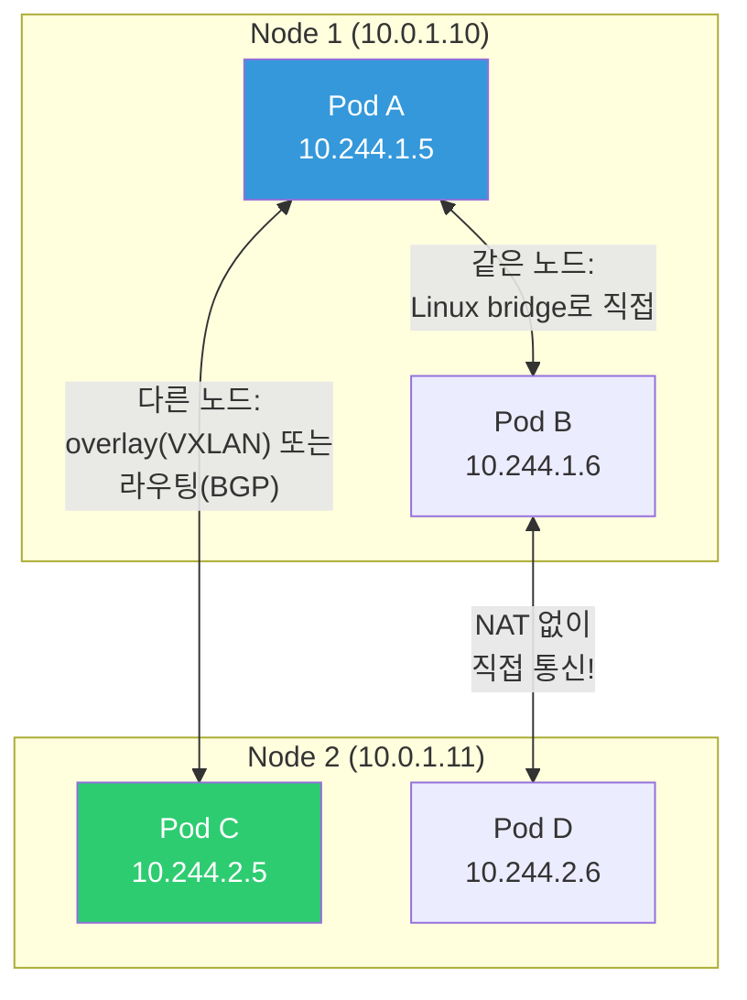
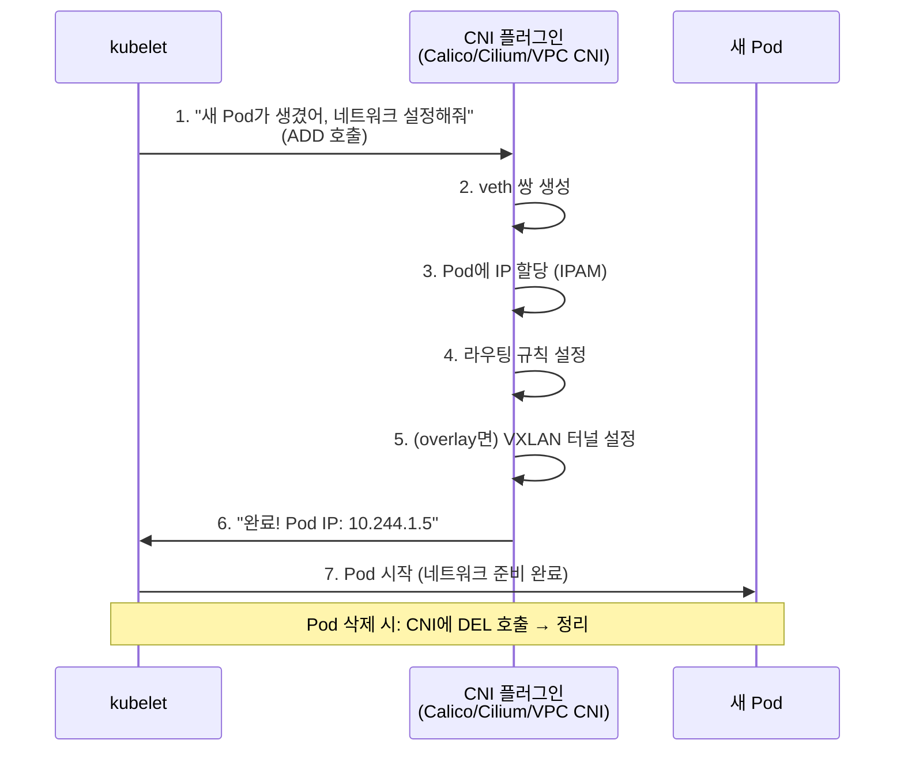
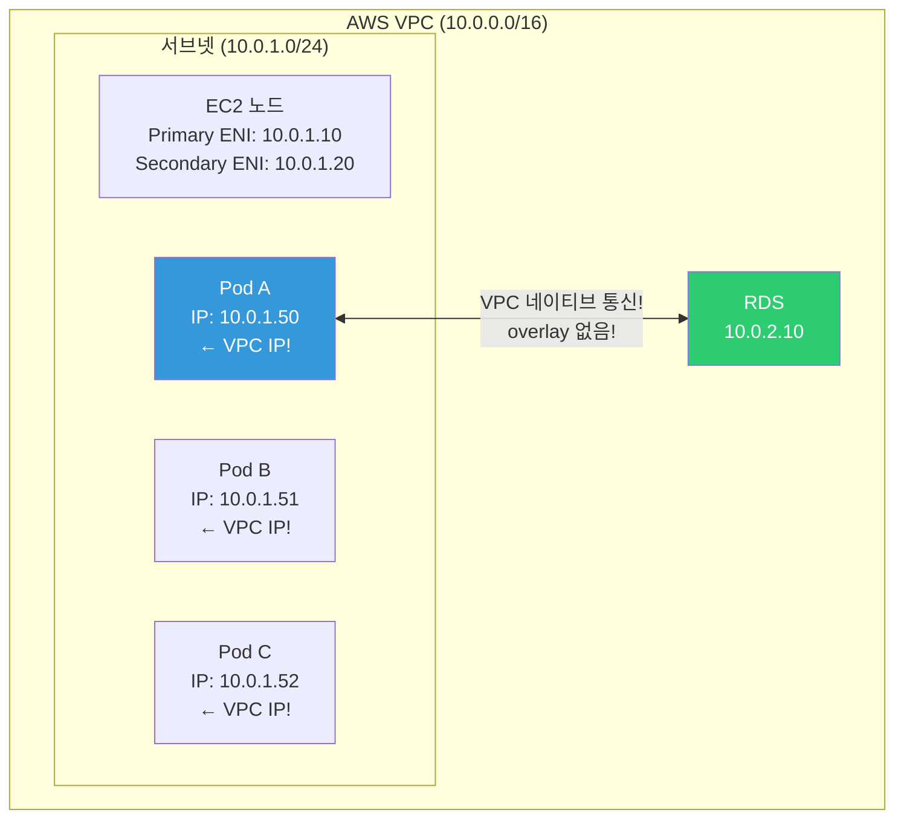
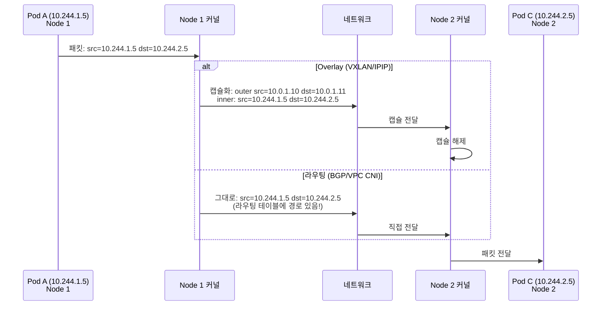

# CNI / Calico / Cilium / Flannel

> [컨테이너 네트워크](../03-containers/05-networking)에서 bridge/overlay를 배우고, [Service](./05-service-ingress)에서 ClusterIP/Ingress를 배웠죠? 이번에는 그 **아래 계층** — Pod끼리 어떻게 IP를 갖고 통신하는지, CNI 플러그인이 뭔지 배워볼게요. K8s 네트워크 문제의 80%는 CNI를 이해하면 풀려요.

---

## 🎯 이걸 왜 알아야 하나?

```
CNI를 알면 해결되는 것들:
• "Pod에 IP가 할당 안 돼요" (ENI 고갈, CIDR 소진)
• "Pod 간 통신이 안 돼요" (CNI 장애)
• "NetworkPolicy가 적용 안 돼요" (Flannel은 미지원!)
• "노드당 Pod 수가 제한돼요" (AWS VPC CNI 한계)
• CNI 선택 (EKS: VPC CNI, 자체 설치: Calico/Cilium)
• 면접: "K8s 네트워크 모델을 설명해주세요"
```

---

## 🧠 핵심 개념

### 비유: 아파트 단지의 우편 시스템

* **CNI** = 아파트 단지의 우편 시스템 규격 ("우편함 규격, 배달 규칙")
* **CNI 플러그인** = 실제 우편 회사 (CJ대한통운, 우체국 등). 같은 규격, 다른 구현
* **Pod IP** = 각 세대의 우편함 번호 (고유!)
* **노드** = 동(棟). 같은 동 안에서는 엘리베이터로 전달, 다른 동은 단지 내 도로로
* **overlay** = 다른 동으로 갈 때 택배 포장(캡슐화)해서 보냄
* **NetworkPolicy** = "101호에서 201호로만 우편 허용, 나머지 차단"

### K8s 네트워크 모델 3가지 요구사항

```bash
# K8s 네트워크의 대원칙 (CNI가 반드시 지켜야 함):
# 1. 모든 Pod는 NAT 없이 다른 모든 Pod와 통신 가능
# 2. 모든 노드는 NAT 없이 모든 Pod와 통신 가능  
# 3. Pod가 보는 자신의 IP = 다른 Pod가 보는 그 Pod의 IP (일관성)

# Docker 기본 네트워크와의 차이:
# Docker: 컨테이너 → NAT → 호스트 IP → 외부 (IP가 변환됨!)
# K8s:    Pod → (CNI가 관리) → 다른 Pod (NAT 없이 직접!)
```



### CNI 동작 흐름



```bash
# CNI 플러그인 위치 (노드에서)
ls /opt/cni/bin/
# bandwidth  calico      calico-ipam  flannel  host-local
# loopback   portmap     tuning       vxlan    bridge
# → 여러 CNI 바이너리가 있을 수 있음 (체인으로 동작)

# CNI 설정 파일
ls /etc/cni/net.d/
# 10-calico.conflist    ← 또는 10-aws.conflist (EKS)
cat /etc/cni/net.d/10-calico.conflist | python3 -m json.tool | head -20
# {
#   "name": "k8s-pod-network",
#   "cniVersion": "0.3.1",
#   "plugins": [
#     {
#       "type": "calico",
#       "ipam": {"type": "calico-ipam"},
#       ...
#     }
#   ]
# }
```

---

## 🔍 상세 설명 — 주요 CNI 플러그인 비교

| 항목 | **AWS VPC CNI** | **Calico** | **Cilium** | **Flannel** |
|------|----------------|-----------|-----------|------------|
| 환경 | EKS 전용 | 범용 | 범용 | 범용 |
| 네트워크 | VPC 네이티브 IP | BGP/VXLAN/IPIP | eBPF/VXLAN | VXLAN |
| Pod IP | **VPC 서브넷 IP!** | 별도 CIDR | 별도 CIDR | 별도 CIDR |
| NetworkPolicy | ❌ (별도 Calico) | ✅ 강력 | ✅ 매우 강력 | ❌ |
| 성능 | ⭐ (네이티브) | 좋음 | ⭐⭐ (eBPF!) | 보통 |
| 복잡도 | 낮음 (EKS 기본) | 중간 | 중간~높음 | 낮음 |
| 추천 | EKS ⭐ | 자체 설치 | 고성능/보안 | 학습/소규모 |

---

## 🔍 상세 설명 — AWS VPC CNI (EKS 기본)

### 동작 원리

EKS의 VPC CNI는 **VPC의 실제 IP를 Pod에 할당**해요. 다른 CNI와 근본적으로 달라요.



```bash
# EKS VPC CNI의 특장점:
# ✅ Pod가 VPC IP를 받음 → VPC 내 어디서든 직접 통신!
# ✅ RDS, ElastiCache 등 AWS 서비스와 직접 통신 (overlay 불필요)
# ✅ Security Group을 Pod에 직접 적용 가능!
# ✅ ALB가 Pod IP로 직접 라우팅 (target-type: ip)
# ❌ ENI/IP 수 제한 → 노드당 Pod 수 제한!

# 노드당 최대 Pod 수 확인
kubectl get node node-1 -o jsonpath='{.status.allocatable.pods}'
# 58    ← 이 노드는 최대 58개 Pod

# 인스턴스 타입별 ENI/IP 제한:
# t3.medium:  3 ENI × 6 IP = 17 Pods
# t3.large:   3 ENI × 12 IP = 35 Pods
# m5.large:   3 ENI × 10 IP = 29 Pods
# m5.xlarge:  4 ENI × 15 IP = 58 Pods
# → 공식: (ENI 수 × ENI당 IP 수 - ENI 수) + 2
# → 작은 인스턴스 = 적은 Pod! 주의!

# Pod의 VPC IP 확인
kubectl get pods -o wide
# NAME        READY   IP           NODE
# api-abc-1   1/1     10.0.1.50    node-1    ← VPC 서브넷 IP!
# api-abc-2   1/1     10.0.1.51    node-1    ← 같은 서브넷!

# VPC 서브넷에서 IP 사용량 확인
aws ec2 describe-subnets --subnet-ids subnet-abc123 \
    --query 'Subnets[0].{CIDR:CidrBlock,Available:AvailableIpAddressCount}'
# {"CIDR": "10.0.1.0/24", "Available": 150}
# → /24 = 254개 중 150개 남음

# ENI 확인 (노드의)
aws ec2 describe-network-interfaces \
    --filters "Name=attachment.instance-id,Values=i-abc123" \
    --query 'NetworkInterfaces[*].{ENI:NetworkInterfaceId,IPs:PrivateIpAddresses[*].PrivateIpAddress}'
# ENI: eni-abc123, IPs: [10.0.1.10, 10.0.1.50, 10.0.1.51, 10.0.1.52]
#                        ^^^^^^^^    ^^^^^^^^^^^^^^^^^^^^^^^^^^^^^^^^
#                        노드 IP     Pod IP들!
```

### VPC CNI 트러블슈팅

```bash
# === "Pod에 IP가 할당 안 돼요!" ===

# 증상:
kubectl get pods
# NAME        READY   STATUS              AGE
# api-abc-1   0/1     ContainerCreating   5m    ← 계속 Creating!

kubectl describe pod api-abc-1 | grep -A 5 Events
# Warning  FailedCreatePodSandBox  Failed to create pod sandbox:
#   failed to setup network: add cmd: failed to assign an IP address

# 원인 1: 서브넷 IP 고갈!
aws ec2 describe-subnets --subnet-ids subnet-abc123 \
    --query 'Subnets[0].AvailableIpAddressCount'
# 0    ← IP가 없음!

# 해결:
# a. 서브넷 CIDR 확장 (Secondary CIDR 추가)
# b. 더 큰 서브넷 사용 (/24 → /20)
# c. VPC CNI Prefix Delegation 활성화
kubectl set env daemonset aws-node -n kube-system ENABLE_PREFIX_DELEGATION=true
# → /28 prefix를 ENI에 할당 → 노드당 Pod 수 대폭 증가!

# 원인 2: ENI 한도 초과!
# → 더 큰 인스턴스 타입으로 변경 (ENI가 더 많은)

# aws-node DaemonSet 로그 확인 (VPC CNI 로그)
kubectl logs -n kube-system -l k8s-app=aws-node --tail=30
# → IP 할당 실패 원인이 나옴
```

---

## 🔍 상세 설명 — Calico

### Calico란?

가장 많이 쓰이는 오픈소스 CNI예요. **BGP 라우팅** + **강력한 NetworkPolicy**가 특징이에요.

```bash
# Calico 네트워크 모드:
# 1. BGP (기본): 노드 간 BGP로 Pod CIDR 라우팅 교환
#    → overlay 없이 직접 라우팅 (성능 좋음!)
#    → 하지만 네트워크 인프라가 BGP를 지원해야 함
#
# 2. IPIP: IP-in-IP 캡슐화 (L3 overlay)
#    → 어디서든 동작, 약간의 오버헤드
#    → 크로스 서브넷에서만 IPIP (CrossSubnet 모드)
#
# 3. VXLAN: L2 overlay
#    → BGP가 안 되는 환경에서

# Calico 컴포넌트 확인
kubectl get pods -n calico-system
# NAME                                      READY   STATUS
# calico-kube-controllers-abc123            1/1     Running
# calico-node-xyz11                         1/1     Running    ← 노드마다 1개!
# calico-node-xyz22                         1/1     Running
# calico-typha-abc456                       1/1     Running    ← 대규모에서 성능 향상

# Calico 노드 상태
sudo calicoctl node status
# Calico process is running.
# IPv4 BGP status
# +--------------+-------------------+-------+----------+
# | PEER ADDRESS | PEER TYPE         | STATE | SINCE    |
# +--------------+-------------------+-------+----------+
# | 10.0.1.11    | node-to-node mesh | up    | 12:00:00 |
# | 10.0.1.12    | node-to-node mesh | up    | 12:00:00 |
# +--------------+-------------------+-------+----------+
# → BGP 피어링 상태 확인!

# IP Pool 확인
sudo calicoctl get ippool -o wide
# NAME               CIDR             NAT    IPIPMODE    VXLANMODE
# default-ipv4-pool  10.244.0.0/16    true   Always      Never
# → Pod CIDR: 10.244.0.0/16, IPIP 모드 사용
```

### Calico NetworkPolicy (★ Calico의 핵심 강점!)

K8s 기본 NetworkPolicy보다 **더 강력한** Calico 전용 정책도 지원해요.

```yaml
# K8s 표준 NetworkPolicy (Calico가 구현)
apiVersion: networking.k8s.io/v1
kind: NetworkPolicy
metadata:
  name: api-network-policy
  namespace: production
spec:
  podSelector:
    matchLabels:
      app: api                         # 이 Pod에 적용

  policyTypes:
  - Ingress
  - Egress

  ingress:
  - from:
    - podSelector:                     # 같은 NS의 특정 Pod에서만
        matchLabels:
          app: frontend
    - namespaceSelector:               # 특정 NS에서만
        matchLabels:
          name: monitoring
    ports:
    - protocol: TCP
      port: 8080

  egress:
  - to:
    - podSelector:
        matchLabels:
          app: database
    ports:
    - protocol: TCP
      port: 5432
  - to:                                # DNS 허용 (필수!)
    - namespaceSelector:
        matchLabels:
          kubernetes.io/metadata.name: kube-system
    ports:
    - protocol: UDP
      port: 53
    - protocol: TCP
      port: 53
```

```bash
# NetworkPolicy 확인
kubectl get networkpolicy -n production
# NAME                 POD-SELECTOR   AGE
# api-network-policy   app=api        5d

# 동작 확인
# api Pod에서 database로 → 허용 ✅
kubectl exec -n production api-pod -- nc -zv database 5432
# succeeded!

# api Pod에서 다른 서비스로 → 차단 ❌
kubectl exec -n production api-pod -- nc -zv other-service 8080
# timed out

# ⚠️ NetworkPolicy가 없으면 = 모든 트래픽 허용! (기본)
# NetworkPolicy를 하나라도 적용하면 → 명시적으로 허용한 것만 통과!

# ⚠️ Flannel은 NetworkPolicy를 구현 안 함!
# → Flannel + NetworkPolicy = 적용해도 차단 안 됨! 위험!
# → NetworkPolicy가 필요하면 Calico 또는 Cilium!
```

---

## 🔍 상세 설명 — Cilium

### Cilium이란?

**eBPF 기반**의 차세대 CNI예요. 커널 레벨에서 네트워크를 처리해서 **성능이 매우 좋고** 관찰 가능성(observability)이 뛰어나요.

```bash
# eBPF란? (../01-linux/12-performance에서 간단히 다뤘음)
# → 커널 안에서 프로그램을 실행하는 기술
# → iptables 없이 커널에서 직접 패킷 처리 → 빠름!

# Cilium의 장점:
# ✅ eBPF로 kube-proxy 대체 가능 (iptables 없이!)
# ✅ L7 NetworkPolicy (HTTP URL, gRPC 메서드까지 제어!)
# ✅ Hubble (네트워크 관찰 도구 내장)
# ✅ 높은 성능 (iptables 오버헤드 없음)
# ✅ WireGuard 기반 암호화 (자동 mTLS)
# ✅ Service Mesh (Istio 사이드카 대체 가능!)

# Cilium 컴포넌트 확인
kubectl get pods -n kube-system -l k8s-app=cilium
# NAME           READY   STATUS
# cilium-abc12   1/1     Running    ← 노드마다 DaemonSet
# cilium-def34   1/1     Running

# Cilium 상태
kubectl exec -n kube-system cilium-abc12 -- cilium status
# KVStore:     Ok   Disabled
# Kubernetes:  Ok   1.28 (v1.28.0)
# ...
# Controller Status: 35/35 healthy
# Proxy Status:      OK
# Cluster health:    3/3 reachable

# Hubble (네트워크 관찰)
kubectl exec -n kube-system cilium-abc12 -- hubble observe --last 10
# TIMESTAMP   SOURCE         DESTINATION       TYPE       VERDICT
# 10:00:01    api/api-abc    db/db-xyz         L4/TCP     FORWARDED
# 10:00:02    api/api-abc    redis/redis-xyz   L4/TCP     FORWARDED
# 10:00:03    web/web-abc    api/api-abc       L4/TCP     FORWARDED
# 10:00:04    web/web-abc    google.com        L4/TCP     DROPPED    ← 차단!
# → 누가 어디로 통신하는지 실시간으로!
```

### Cilium L7 NetworkPolicy (HTTP 레벨 제어!)

```yaml
# Cilium 전용: HTTP 경로/메서드까지 제어!
apiVersion: cilium.io/v2
kind: CiliumNetworkPolicy
metadata:
  name: api-l7-policy
spec:
  endpointSelector:
    matchLabels:
      app: api
  ingress:
  - fromEndpoints:
    - matchLabels:
        app: frontend
    toPorts:
    - ports:
      - port: "8080"
        protocol: TCP
      rules:
        http:
        - method: GET                  # GET만 허용!
          path: "/api/v1/users.*"      # /api/v1/users 경로만!
        - method: POST
          path: "/api/v1/orders"
        # PUT, DELETE는 차단!
```

```bash
# L7 정책 테스트
# GET /api/v1/users → 허용 ✅
kubectl exec frontend-pod -- curl -s http://api:8080/api/v1/users
# 200 OK

# DELETE /api/v1/users/1 → 차단 ❌
kubectl exec frontend-pod -- curl -s -X DELETE http://api:8080/api/v1/users/1
# 403 Forbidden (Access denied by policy)

# → 일반 NetworkPolicy는 L3/L4(IP/포트)만 제어
# → Cilium은 L7(HTTP 메서드, 경로, 헤더)까지 제어!
```

---

## 🔍 상세 설명 — Flannel

```bash
# Flannel: 가장 단순한 CNI (학습용/소규모)
# ✅ 설정이 매우 간단
# ✅ VXLAN overlay (어디서든 동작)
# ❌ NetworkPolicy 미지원! (치명적 단점)
# ❌ 고급 기능 없음 (BGP, eBPF 등)

# → 학습, 개발 환경에서만 추천
# → 프로덕션에서는 Calico 또는 Cilium!

# Flannel Pod 확인
kubectl get pods -n kube-flannel
# NAME                  READY   STATUS
# kube-flannel-abc12    1/1     Running
# kube-flannel-def34    1/1     Running
```

---

## 🔍 상세 설명 — Pod 네트워크 내부 동작

### 같은 노드의 Pod 간 통신

```bash
# Pod A (10.244.1.5) → Pod B (10.244.1.6) — 같은 노드

# 1. Pod A의 veth → 노드의 cali-xxx (Calico) 또는 cbr0 (bridge)
# 2. Linux bridge에서 Pod B의 veth로 직접 전달
# 3. Pod B에 도착

# 확인 (노드에서)
ip link show type veth
# veth-abc@if3: ... master cni0
# veth-def@if5: ... master cni0

bridge link show
# veth-abc → cni0
# veth-def → cni0

# 라우팅 (노드에서)
ip route | grep 10.244.1
# 10.244.1.5 dev veth-abc scope link
# 10.244.1.6 dev veth-def scope link
# → 같은 노드의 Pod는 직접 라우팅!
```

### 다른 노드의 Pod 간 통신



```bash
# === Overlay (VXLAN) 방식 ===
# 노드 1에서 VXLAN 인터페이스 확인
ip -d link show vxlan.calico
# vxlan.calico: <BROADCAST,MULTICAST,UP> mtu 1450 ...
#                                         ^^^^^^^^
#                                         MTU가 1450! (캡슐화 오버헤드)

# VXLAN FDB (어떤 Pod가 어떤 노드에 있는지)
bridge fdb show dev vxlan.calico | head -5
# aa:bb:cc:dd:ee:ff dst 10.0.1.11 self permanent
# → 이 MAC의 Pod는 10.0.1.11 노드에 있다

# === VPC CNI 방식 (EKS) ===
# overlay 없음! VPC 라우팅으로 직접!
ip route | grep 10.0.1
# 10.0.1.50 dev eni-xxx scope link    ← ENI에 직접 연결
# 10.0.1.51 dev eni-xxx scope link
# → Pod IP가 VPC IP라서 VPC 라우팅으로 바로 도달!

# === BGP 방식 (Calico) ===
# BGP로 라우팅 정보를 교환
ip route | grep 10.244
# 10.244.1.0/24 dev cali-xxx    ← 로컬 Pod
# 10.244.2.0/24 via 10.0.1.11   ← Node 2의 Pod는 Node 2로!
# 10.244.3.0/24 via 10.0.1.12   ← Node 3의 Pod는 Node 3로!
```

---

## 💻 실습 예제

### 실습 1: Pod 네트워크 탐색

```bash
# 1. Pod 2개 실행 (가급적 다른 노드에)
kubectl apply -f - << 'EOF'
apiVersion: apps/v1
kind: Deployment
metadata:
  name: net-test
spec:
  replicas: 2
  selector:
    matchLabels:
      app: net-test
  template:
    metadata:
      labels:
        app: net-test
    spec:
      containers:
      - name: tools
        image: nicolaka/netshoot
        command: ["sleep", "3600"]
EOF

# 2. Pod IP와 노드 확인
kubectl get pods -l app=net-test -o wide
# NAME              IP           NODE
# net-test-abc-1    10.244.1.5   node-1
# net-test-abc-2    10.244.2.5   node-2    ← 다른 노드!

# 3. Pod 간 직접 통신 테스트
kubectl exec net-test-abc-1 -- ping -c 3 10.244.2.5
# 64 bytes from 10.244.2.5: icmp_seq=1 ttl=62 time=0.5ms
# → 다른 노드의 Pod에 NAT 없이 직접 통신! ✅

# 4. traceroute로 경로 확인
kubectl exec net-test-abc-1 -- traceroute -n 10.244.2.5
# 1  10.244.1.1    0.1ms    ← 노드 1의 게이트웨이
# 2  10.0.1.11     0.3ms    ← 노드 2
# 3  10.244.2.5    0.5ms    ← Pod C 도착!

# 5. Pod 네트워크 인터페이스 확인
kubectl exec net-test-abc-1 -- ip addr show eth0
# eth0@if7: ... inet 10.244.1.5/32 scope global eth0
#                    ^^^^^^^^^^^^^
#                    /32 = 호스트 라우팅 (Calico 스타일)

kubectl exec net-test-abc-1 -- ip route
# default via 169.254.1.1 dev eth0
# 169.254.1.1 dev eth0 scope link
# → Calico는 169.254.1.1을 가상 게이트웨이로 사용

# 6. DNS 확인
kubectl exec net-test-abc-1 -- nslookup kubernetes
# Address: 10.96.0.1

# 7. 정리
kubectl delete deployment net-test
```

### 실습 2: NetworkPolicy 적용

```bash
# 1. 서비스 구성
kubectl create namespace policy-test
kubectl create deployment web --image=nginx -n policy-test
kubectl create deployment api --image=nginx -n policy-test
kubectl create deployment db --image=nginx -n policy-test
kubectl expose deployment web --port=80 -n policy-test
kubectl expose deployment api --port=80 -n policy-test
kubectl expose deployment db --port=80 -n policy-test

# 2. 기본 상태: 모든 Pod 간 통신 가능
kubectl exec -n policy-test deploy/web -- curl -s --max-time 3 http://db
# <html>...Welcome to nginx!...    ← web → db 가능!

# 3. NetworkPolicy 적용: db는 api에서만 접근 가능!
kubectl apply -f - << 'EOF'
apiVersion: networking.k8s.io/v1
kind: NetworkPolicy
metadata:
  name: db-policy
  namespace: policy-test
spec:
  podSelector:
    matchLabels:
      app: db
  policyTypes:
  - Ingress
  ingress:
  - from:
    - podSelector:
        matchLabels:
          app: api
    ports:
    - protocol: TCP
      port: 80
EOF

# 4. 테스트
kubectl exec -n policy-test deploy/api -- curl -s --max-time 3 http://db
# <html>...Welcome to nginx!...    ← api → db 허용! ✅

kubectl exec -n policy-test deploy/web -- curl -s --max-time 3 http://db
# (timeout)                         ← web → db 차단! ❌ ✅

# 5. 정리
kubectl delete namespace policy-test
```

### 실습 3: 노드당 Pod 수 확인 (EKS)

```bash
# 1. 노드별 할당 가능 Pod 수
kubectl get nodes -o custom-columns=\
NAME:.metadata.name,\
MAX_PODS:.status.allocatable.pods,\
INSTANCE:.metadata.labels.node\\.kubernetes\\.io/instance-type
# NAME        MAX_PODS   INSTANCE
# node-1      58         m5.xlarge
# node-2      29         m5.large
# node-3      17         t3.medium    ← 17개만!

# 2. 현재 Pod 수
kubectl get pods -A --field-selector spec.nodeName=node-3 --no-headers | wc -l
# 15    ← 17개 중 15개 사용 (여유 2개!)

# 3. IP 사용량 (aws-node 로그)
kubectl logs -n kube-system -l k8s-app=aws-node --tail=5 | grep -i "ip"
# → "ipamd: assigned IP 10.0.1.55 to pod api-abc-1"
# → "ipamd: total IPs: 17, used: 15, available: 2"
```

---

## 🏢 실무에서는?

### 시나리오 1: CNI 선택 가이드

```bash
# EKS (AWS) → VPC CNI (기본) + Calico NetworkPolicy
# → VPC CNI: 네이티브 성능, AWS 서비스 직접 통신
# → Calico: NetworkPolicy만 추가 (calico-policy-only 모드)
# → 또는 Cilium (eBPF 성능 + L7 Policy + Hubble 관찰)

# GKE (GCP) → GKE 기본 CNI + Dataplane v2 (Cilium 기반!)
# → 자동 설정, NetworkPolicy 지원

# 자체 설치 (kubeadm) → Calico ⭐ 또는 Cilium
# → Calico: 검증됨, 안정적, 문서 풍부
# → Cilium: 최신, eBPF 성능, L7 Policy (더 복잡)

# 학습/테스트 → Flannel (가장 간단, NetworkPolicy 없음!)

# 고보안 환경 → Cilium
# → L7 Policy, 암호화(WireGuard), Hubble 관찰
```

### 시나리오 2: "Pod IP가 할당 안 돼요" (EKS)

```bash
# 가장 흔한 EKS 네트워크 문제!

# 원인 1: 서브넷 IP 고갈
aws ec2 describe-subnets --subnet-ids $SUBNET_ID \
    --query 'Subnets[0].AvailableIpAddressCount'
# → 0이면 IP 없음!
# → 해결: 더 큰 서브넷, Secondary CIDR 추가

# 원인 2: ENI 한도 초과
# → 인스턴스 타입의 ENI/IP 한도 확인
# → 해결: Prefix Delegation 활성화 또는 더 큰 인스턴스

# 원인 3: Security Group 한도
# → ENI에 SG 5개까지 → SG가 많으면 ENI 생성 실패
# → 해결: SG 정리

# 원인 4: aws-node DaemonSet 장애
kubectl get ds -n kube-system aws-node
kubectl logs -n kube-system -l k8s-app=aws-node --tail=30
# → IPAMD 에러 확인
```

### 시나리오 3: NetworkPolicy 설계 패턴

```bash
# === Default Deny (모든 것 차단 후 필요한 것만 허용) ===

# 1. 네임스페이스 전체 차단 (기본)
kubectl apply -f - << 'EOF'
apiVersion: networking.k8s.io/v1
kind: NetworkPolicy
metadata:
  name: default-deny-all
  namespace: production
spec:
  podSelector: {}          # 모든 Pod에 적용
  policyTypes:
  - Ingress
  - Egress
EOF
# → production NS의 모든 Pod: 인바운드/아웃바운드 전부 차단!

# 2. DNS 허용 (거의 항상 필요!)
kubectl apply -f - << 'EOF'
apiVersion: networking.k8s.io/v1
kind: NetworkPolicy
metadata:
  name: allow-dns
  namespace: production
spec:
  podSelector: {}
  policyTypes:
  - Egress
  egress:
  - to:
    - namespaceSelector:
        matchLabels:
          kubernetes.io/metadata.name: kube-system
    ports:
    - protocol: UDP
      port: 53
    - protocol: TCP
      port: 53
EOF

# 3. 서비스별 허용 규칙 추가
# api → db만 허용, web → api만 허용, 등등
# → 최소 권한 네트워크! (../02-networking/09-network-security의 Zero Trust)
```

---

## ⚠️ 자주 하는 실수

### 1. Flannel에서 NetworkPolicy가 작동한다고 착각

```bash
# ❌ Flannel은 NetworkPolicy를 구현 안 함!
# → kubectl apply로 NetworkPolicy를 만들어도 적용 안 됨!
# → 모든 트래픽이 허용됨 → 보안 위험!

# ✅ NetworkPolicy가 필요하면:
# → Calico, Cilium, 또는 AWS VPC CNI + Calico
```

### 2. EKS에서 서브넷 크기를 작게 설계

```bash
# ❌ /24 서브넷 (254개 IP) → Pod 200개면 IP 고갈!
# → Pod IP + 노드 IP + ENI IP + AWS 예약 5개

# ✅ EKS 서브넷은 최소 /20 (4,094개 IP) 추천
# ✅ 또는 Secondary CIDR로 100.64.0.0/16 추가
# (../02-networking/04-network-structure의 CIDR 계산 참고)
```

### 3. NetworkPolicy에서 DNS를 빼먹기

```bash
# ❌ Default Deny 후 DNS를 안 열면 → 모든 서비스 이름 해석 실패!
# → curl http://api-service → DNS 해석 실패 → 통신 불가!

# ✅ DNS(UDP/TCP 53)는 항상 허용!
# → (../02-networking/12-service-discovery의 CoreDNS 참고)
```

### 4. CNI 장애 시 모든 Pod 통신 불가

```bash
# CNI DaemonSet(calico-node, aws-node, cilium)이 죽으면:
# → 새 Pod에 IP 할당 안 됨!
# → 기존 Pod 통신은 (보통) 유지되지만 불안정

# ✅ CNI DaemonSet 모니터링 필수!
kubectl get ds -n kube-system
# → DESIRED = READY인지 확인!
# → 하나라도 NotReady면 즉시 확인!
```

### 5. MTU 불일치

```bash
# ❌ overlay(VXLAN)인데 MTU를 1500 그대로
# → 패킷 분할 → 성능 저하 + 간헐적 연결 끊김

# ✅ VXLAN: MTU 1450 (50바이트 오버헤드)
# ✅ IPIP: MTU 1480 (20바이트 오버헤드)
# ✅ VPC CNI: MTU 9001 (Jumbo Frame 지원!)

# 확인:
kubectl exec pod-name -- ip link show eth0 | grep mtu
```

---

## 📝 정리

### CNI 선택 가이드

```
EKS (AWS):        VPC CNI (기본) + Calico(Policy) 또는 Cilium
GKE (GCP):        기본 CNI 또는 Dataplane v2 (Cilium)
자체 설치:         Calico ⭐ (안정) 또는 Cilium (최신/성능)
학습/개발:         Flannel (간단, NetworkPolicy 없음!)
고보안/관찰:       Cilium (eBPF, L7 Policy, Hubble)
```

### 핵심 명령어

```bash
# Pod 네트워크 확인
kubectl get pods -o wide                    # Pod IP, 노드
kubectl exec POD -- ip addr                 # Pod 인터페이스
kubectl exec POD -- ip route                # Pod 라우팅
kubectl exec POD -- traceroute -n TARGET_IP # 경로 추적

# CNI 확인
kubectl get ds -n kube-system               # CNI DaemonSet
kubectl logs -n kube-system -l k8s-app=aws-node  # VPC CNI 로그
kubectl logs -n kube-system -l k8s-app=calico-node # Calico 로그

# NetworkPolicy
kubectl get networkpolicy -n NAMESPACE
kubectl describe networkpolicy NAME

# EKS 특화
aws ec2 describe-subnets --query 'Subnets[*].AvailableIpAddressCount'
kubectl get nodes -o jsonpath='{.items[*].status.allocatable.pods}'
```

### K8s 네트워크 계층 정리

```
L7: Ingress / Gateway API     → HTTP 라우팅 (05-service-ingress)
L4: Service (ClusterIP/LB)    → Pod 로드밸런싱 (05-service-ingress)
L3: CNI (Pod Network)         → Pod IP 할당, 노드 간 통신 ← 이 강의!
L2: Container Runtime         → veth, bridge (../03-containers/05-networking)
```

---

## 🔗 다음 강의

다음은 **[07-storage](./07-storage)** — CSI / PV / PVC / StorageClass 이에요.

Pod의 네트워크를 배웠으니, 이제 Pod의 **스토리지**를 배워볼게요. 컨테이너가 죽어도 데이터가 살아남는 영구 볼륨(PV), 동적 프로비저닝, AWS EBS/EFS 연동까지 다룰 거예요.
