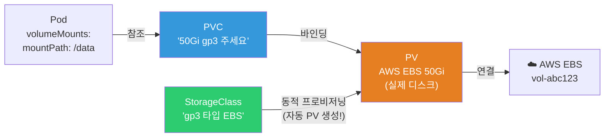
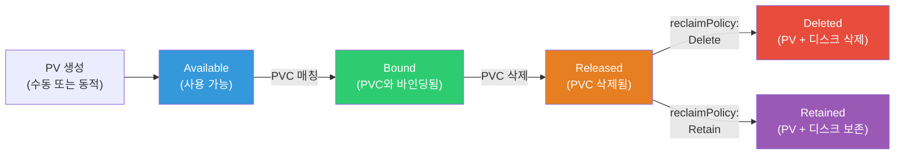
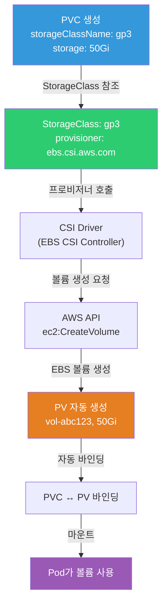
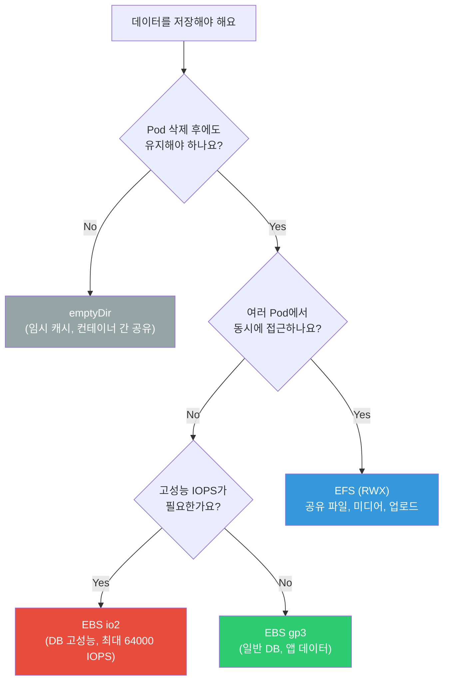

# CSI / PV / PVC / StorageClass

> Pod가 죽으면 안에 있던 데이터도 사라져요. DB 데이터, 업로드 파일, 로그 — 영구 저장이 필요한 데이터는 **볼륨**에 저장해야 해요. K8s의 스토리지 시스템은 PV/PVC/StorageClass 3단 구조로, [Linux 디스크](../01-linux/07-disk)의 마운트 개념과 [Docker 볼륨](../03-containers/02-docker-basics)의 확장이에요.

---

## 🎯 이걸 왜 알아야 하나?

```
실무에서 K8s 스토리지 관련 업무:
• DB(StatefulSet)에 영구 디스크 붙이기         → PVC + StorageClass
• "PVC가 Pending이에요"                       → StorageClass/용량 문제
• EBS 볼륨 타입 선택 (gp3 vs io2)             → StorageClass 설정
• EFS(공유 파일 시스템)를 여러 Pod에서 사용     → ReadWriteMany
• "Pod가 다른 노드로 옮겨졌는데 볼륨이 안 돼요" → AZ 제약
• 볼륨 자동 확장/스냅샷                        → CSI 기능
```

---

## 🧠 핵심 개념

### 비유: 아파트 주차장

* **PersistentVolume (PV)** = 주차장의 실제 자리. 물리적 디스크 (EBS, EFS 등)
* **PersistentVolumeClaim (PVC)** = 주차 신청서. "50Gi 자리 하나 주세요"
* **StorageClass** = 주차장 등급. "일반 주차(gp3)" vs "VIP 주차(io2)"
* **CSI Driver** = 주차장 관리 시스템. AWS EBS, EFS 등을 K8s에 연결

### 3단 구조



```bash
# 정적 vs 동적 프로비저닝:

# 정적: 관리자가 PV를 미리 만들어두고, 사용자가 PVC로 요청
# → PV 생성 → PVC 생성 → 바인딩

# 동적 (⭐ 실무 기본!):
# → PVC 생성 → StorageClass가 자동으로 PV + 실제 디스크 생성!
# → 관리자는 StorageClass만 만들어두면 됨
```

### PV/PVC 바인딩 라이프사이클



### StorageClass 동적 프로비저닝 흐름



### 스토리지 타입 선택 가이드



---

## 🔍 상세 설명 — StorageClass

### StorageClass란?

**어떤 타입의 스토리지를 쓸지** 정의해요. PVC가 StorageClass를 참조하면 자동으로 PV가 생성돼요.

```yaml
# AWS EBS gp3 StorageClass
apiVersion: storage.k8s.io/v1
kind: StorageClass
metadata:
  name: gp3
  annotations:
    storageclass.kubernetes.io/is-default-class: "true"   # ⭐ 기본 StorageClass
provisioner: ebs.csi.aws.com                              # CSI 드라이버
parameters:
  type: gp3                    # EBS 볼륨 타입 (gp3이 가성비 좋음!)
  fsType: ext4                 # 파일 시스템
  encrypted: "true"            # ⭐ 암호화 (프로덕션 필수!)
  # iops: "3000"               # gp3 기본 3000 IOPS (최대 16000)
  # throughput: "125"           # gp3 기본 125 MiB/s (최대 1000)
reclaimPolicy: Delete          # PVC 삭제 시 PV+EBS도 삭제
                               # Retain: PVC 삭제해도 PV+EBS 보존 (데이터 보호)
volumeBindingMode: WaitForFirstConsumer  # ⭐ Pod가 스케줄된 AZ에서 볼륨 생성
allowVolumeExpansion: true     # ⭐ 볼륨 확장 허용

---
# 고성능 StorageClass (DB용)
apiVersion: storage.k8s.io/v1
kind: StorageClass
metadata:
  name: io2-high-perf
provisioner: ebs.csi.aws.com
parameters:
  type: io2
  iops: "10000"
  fsType: ext4
  encrypted: "true"
reclaimPolicy: Retain          # DB 볼륨은 삭제 방지!
volumeBindingMode: WaitForFirstConsumer
allowVolumeExpansion: true

---
# 공유 파일 시스템 (EFS)
apiVersion: storage.k8s.io/v1
kind: StorageClass
metadata:
  name: efs
provisioner: efs.csi.aws.com
parameters:
  provisioningMode: efs-ap
  fileSystemId: fs-abc123
  directoryPerms: "700"
```

```bash
# StorageClass 확인
kubectl get storageclass
# NAME            PROVISIONER          RECLAIMPOLICY   VOLUMEBINDINGMODE       ALLOWVOLUMEEXPANSION
# gp3 (default)   ebs.csi.aws.com     Delete          WaitForFirstConsumer    true
# io2-high-perf   ebs.csi.aws.com     Retain          WaitForFirstConsumer    true
# efs             efs.csi.aws.com      Delete          Immediate              false

# 기본 StorageClass 변경
kubectl patch storageclass gp3 -p '{"metadata":{"annotations":{"storageclass.kubernetes.io/is-default-class":"true"}}}'
```

### 주요 파라미터 설명

```bash
# reclaimPolicy — PVC 삭제 시 PV를 어떻게 할 것인가?
# Delete: PV + 실제 디스크 삭제 (기본, 개발/테스트)
# Retain: PV + 디스크 보존 (⭐ 프로덕션 DB!)
#   → 실수로 PVC 삭제해도 데이터 안전!
#   → 수동으로 PV 정리 필요

# volumeBindingMode — 언제 볼륨을 생성할 것인가?
# Immediate: PVC 생성 시 즉시 (AZ를 못 고름!)
# WaitForFirstConsumer: Pod가 스케줄된 후 (⭐ 추천!)
#   → Pod가 어떤 AZ에 배치될지 알고 나서 그 AZ에 볼륨 생성
#   → AZ 불일치 방지!

# ⚠️ WaitForFirstConsumer를 안 쓰면:
# 1. PVC 생성 → ap-northeast-2a에 EBS 생성
# 2. Pod 스케줄링 → ap-northeast-2c 노드에 배치
# 3. EBS가 다른 AZ에 있어서 마운트 실패!
```

---

## 🔍 상세 설명 — PVC (PersistentVolumeClaim)

### PVC 생성

```yaml
apiVersion: v1
kind: PersistentVolumeClaim
metadata:
  name: myapp-data
  namespace: production
spec:
  accessModes:
  - ReadWriteOnce                # 하나의 노드에서만 읽기/쓰기
  storageClassName: gp3          # StorageClass 참조
  resources:
    requests:
      storage: 50Gi              # 요청 크기
```

### Access Mode (접근 모드)

| 모드 | 약자 | 설명 | 스토리지 |
|------|------|------|---------|
| ReadWriteOnce | RWO | 하나의 노드에서 읽기/쓰기 | EBS ⭐ |
| ReadOnlyMany | ROX | 여러 노드에서 읽기만 | EFS, NFS |
| ReadWriteMany | RWX | 여러 노드에서 읽기/쓰기 | EFS, NFS ⭐ |
| ReadWriteOncePod | RWOP | 하나의 Pod에서만 (K8s 1.27+) | EBS |

```bash
# ⚠️ EBS(블록 스토리지)는 RWO만 지원!
# → 하나의 노드에만 붙일 수 있음
# → StatefulSet에서 각 Pod가 자기만의 PVC를 가져야 하는 이유!

# EFS(파일 시스템)는 RWX 지원!
# → 여러 노드/Pod에서 동시에 읽기/쓰기
# → 공유 파일 (업로드, 미디어 등)에 적합

# PVC 확인
kubectl get pvc -n production
# NAME          STATUS   VOLUME        CAPACITY   ACCESS MODES   STORAGECLASS   AGE
# myapp-data    Bound    pvc-abc123    50Gi       RWO            gp3            5d
#               ^^^^^                                             ^^^
#               바인딩됨!                                         gp3 클래스

kubectl describe pvc myapp-data -n production
# Name:          myapp-data
# Status:        Bound
# Volume:        pvc-abc123
# Capacity:      50Gi
# Access Modes:  RWO
# StorageClass:  gp3
# Used By:       myapp-0     ← 이 Pod가 사용 중!
```

### Pod에서 PVC 사용

```yaml
apiVersion: apps/v1
kind: Deployment
metadata:
  name: myapp
spec:
  replicas: 1                    # ⚠️ RWO PVC는 replicas 1만! (또는 StatefulSet)
  selector:
    matchLabels:
      app: myapp
  template:
    metadata:
      labels:
        app: myapp
    spec:
      containers:
      - name: myapp
        image: myapp:v1.0
        volumeMounts:
        - name: data
          mountPath: /app/data    # Pod 안에서의 경로
        - name: uploads
          mountPath: /app/uploads
      volumes:
      - name: data
        persistentVolumeClaim:
          claimName: myapp-data   # PVC 이름 참조
      - name: uploads
        persistentVolumeClaim:
          claimName: myapp-uploads
```

```bash
# Pod에서 볼륨 확인
kubectl exec myapp-0 -- df -h /app/data
# Filesystem      Size  Used Avail Use% Mounted on
# /dev/nvme1n1    49G   200M  47G   1% /app/data
#                 ^^^                    ^^^^^^^^^^
#                 EBS 볼륨!              마운트 경로

kubectl exec myapp-0 -- ls -la /app/data/
# total 200
# drwxr-xr-x 3 1000 1000 4096 Mar 12 10:00 .
# -rw-r--r-- 1 1000 1000  100M Mar 12 10:00 database.db
```

---

## 🔍 상세 설명 — 볼륨 확장

```bash
# PVC 크기 늘리기 (⭐ 축소는 안 됨!)

# 1. PVC 수정
kubectl patch pvc myapp-data -n production -p '{"spec":{"resources":{"requests":{"storage":"100Gi"}}}}'
# → 50Gi → 100Gi

# 2. 상태 확인
kubectl get pvc myapp-data -n production
# NAME          STATUS   VOLUME        CAPACITY   STORAGECLASS
# myapp-data    Bound    pvc-abc123    50Gi       gp3    ← 아직 50Gi?

kubectl describe pvc myapp-data | grep -A 3 Conditions
# Conditions:
#   Type                      Status
#   FileSystemResizePending   True     ← 파일 시스템 확장 대기 중!

# 3. Pod가 재시작되면 (또는 파일 시스템 확장이 자동으로):
kubectl delete pod myapp-0    # Pod 재시작
kubectl get pvc myapp-data
# CAPACITY: 100Gi    ← 확장 완료!

# ⚠️ 축소는 안 됨!
# ⚠️ StorageClass에 allowVolumeExpansion: true 필요!
# ⚠️ EBS는 6시간에 1번만 수정 가능 (AWS 제한)
```

---

## 🔍 상세 설명 — CSI (Container Storage Interface)

### CSI란?

K8s와 스토리지 시스템 사이의 **표준 인터페이스**예요. [CRI가 컨테이너 런타임](../03-containers/04-runtime)의 표준이듯, CSI는 스토리지의 표준이에요.

```bash
# CSI 드라이버가 하는 일:
# 1. 볼륨 생성 (EBS 볼륨, EFS 파일 시스템 생성)
# 2. 볼륨 연결 (노드에 EBS 어태치)
# 3. 볼륨 마운트 (Pod에 파일 시스템으로 마운트)
# 4. 볼륨 스냅샷
# 5. 볼륨 확장

# EKS에서 CSI 드라이버 설치
# EBS CSI Driver
aws eks create-addon --cluster-name my-cluster --addon-name aws-ebs-csi-driver \
    --service-account-role-arn arn:aws:iam::123456:role/EBS_CSI_DriverRole

# EFS CSI Driver
aws eks create-addon --cluster-name my-cluster --addon-name aws-efs-csi-driver

# CSI 드라이버 Pod 확인 (DaemonSet으로 모든 노드에)
kubectl get pods -n kube-system -l app=ebs-csi-controller
# NAME                              READY   STATUS
# ebs-csi-controller-abc123         6/6     Running
# ebs-csi-controller-def456         6/6     Running

kubectl get pods -n kube-system -l app=ebs-csi-node
# NAME                   READY   STATUS    NODE
# ebs-csi-node-abc       3/3     Running   node-1   ← 모든 노드!
# ebs-csi-node-def       3/3     Running   node-2
# ebs-csi-node-ghi       3/3     Running   node-3

# CSI Driver 확인
kubectl get csidrivers
# NAME               ATTACHREQUIRED   PODINFOONMOUNT   MODES
# ebs.csi.aws.com    true             false            Persistent
# efs.csi.aws.com    false            false            Persistent
```

---

## 🔍 상세 설명 — 볼륨 타입별 비교

### emptyDir / hostPath / PVC

```yaml
# === emptyDir — Pod 수명과 같은 임시 볼륨 ===
# → Pod 삭제 시 데이터도 삭제!
# → 같은 Pod의 컨테이너 간 파일 공유에 사용
volumes:
- name: temp
  emptyDir: {}                   # 디스크에 저장
# 또는
- name: cache
  emptyDir:
    medium: Memory               # 메모리(tmpfs)에 저장 → 빠르지만 작음
    sizeLimit: 100Mi

# === hostPath — 노드의 파일 시스템 ===
# → 노드 재시작해도 유지, 하지만 Pod가 다른 노드로 가면 접근 불가!
# → DaemonSet에서 노드 로그/소켓 접근용 (./03-statefulset-daemonset)
volumes:
- name: docker-sock
  hostPath:
    path: /var/run/containerd/containerd.sock
    type: Socket

# === PVC — 영구 볼륨 (⭐ 프로덕션!) ===
# → Pod가 삭제되어도 데이터 유지
# → Pod가 다른 노드로 옮겨져도 (같은 AZ 내) 볼륨이 따라감
volumes:
- name: data
  persistentVolumeClaim:
    claimName: myapp-data
```

| 타입 | 수명 | 다른 노드 | 용도 |
|------|------|----------|------|
| **emptyDir** | Pod와 같음 (삭제 시 사라짐) | ❌ | 임시 파일, 캐시, 컨테이너 간 공유 |
| **hostPath** | 노드와 같음 | ❌ | DaemonSet (로그, 소켓) |
| **PVC (EBS)** | 영구 (PVC 삭제 전까지) | △ 같은 AZ만 | DB, 앱 데이터 ⭐ |
| **PVC (EFS)** | 영구 | ✅ 어디서든 | 공유 파일, 미디어 ⭐ |

### EBS vs EFS 선택

```bash
# EBS (Elastic Block Store):
# ✅ 고성능 (IOPS, 처리량)
# ✅ 낮은 지연 (블록 스토리지)
# ✅ gp3 비용 효율적 ($0.08/GB/월)
# ❌ 하나의 노드에만 (RWO)
# ❌ 같은 AZ에서만
# → DB, 단일 Pod 앱

# EFS (Elastic File System):
# ✅ 여러 노드/Pod에서 동시 접근 (RWX)
# ✅ AZ 무관 (리전 전체)
# ✅ 자동 확장 (용량 관리 불필요!)
# ❌ EBS보다 느림 (파일 시스템)
# ❌ 비용 높음 ($0.30/GB/월, EBS의 ~4배)
# → 공유 파일, 미디어, CMS 업로드

# 선택 가이드:
# DB (PostgreSQL, MySQL)       → EBS gp3 (io2 for 고성능)
# 앱 데이터 (단일 Pod)         → EBS gp3
# 공유 파일 (여러 Pod)         → EFS
# 미디어/업로드                → EFS 또는 S3 (비용 최적)
# 임시 캐시                    → emptyDir
```

---

## 🔍 상세 설명 — 볼륨 스냅샷

```yaml
# VolumeSnapshotClass
apiVersion: snapshot.storage.k8s.io/v1
kind: VolumeSnapshotClass
metadata:
  name: ebs-snapshot
driver: ebs.csi.aws.com
deletionPolicy: Retain

---
# VolumeSnapshot 생성
apiVersion: snapshot.storage.k8s.io/v1
kind: VolumeSnapshot
metadata:
  name: mydb-snapshot-20250312
spec:
  volumeSnapshotClassName: ebs-snapshot
  source:
    persistentVolumeClaimName: data-mysql-0    # 이 PVC의 스냅샷!

---
# 스냅샷에서 새 PVC 복원
apiVersion: v1
kind: PersistentVolumeClaim
metadata:
  name: data-mysql-restored
spec:
  accessModes: ["ReadWriteOnce"]
  storageClassName: gp3
  resources:
    requests:
      storage: 50Gi
  dataSource:
    name: mydb-snapshot-20250312    # 스냅샷에서 복원!
    kind: VolumeSnapshot
    apiGroup: snapshot.storage.k8s.io
```

```bash
# 스냅샷 확인
kubectl get volumesnapshots
# NAME                      READYTOUSE   SOURCEPVC      AGE
# mydb-snapshot-20250312    true         data-mysql-0   1h

# → CronJob + VolumeSnapshot = 자동 백업!
# → (16-backup-dr 강의에서 Velero와 함께 상세히!)
```

---

## 💻 실습 예제

### 실습 1: PVC 생성 → Pod 마운트 → 데이터 영속성 확인

```bash
# 1. PVC 생성
kubectl apply -f - << 'EOF'
apiVersion: v1
kind: PersistentVolumeClaim
metadata:
  name: test-pvc
spec:
  accessModes: ["ReadWriteOnce"]
  resources:
    requests:
      storage: 1Gi
EOF

# 2. PVC 상태 확인
kubectl get pvc test-pvc
# STATUS: Pending    ← WaitForFirstConsumer라면 Pod 생성 전까지 Pending!

# 3. PVC를 사용하는 Pod 생성
kubectl apply -f - << 'EOF'
apiVersion: v1
kind: Pod
metadata:
  name: pvc-test
spec:
  containers:
  - name: app
    image: busybox
    command: ["sh", "-c", "echo 'Hello Persistent!' > /data/test.txt && cat /data/test.txt && sleep 3600"]
    volumeMounts:
    - name: data
      mountPath: /data
  volumes:
  - name: data
    persistentVolumeClaim:
      claimName: test-pvc
EOF

# 4. PVC가 Bound 됐는지 확인
kubectl get pvc test-pvc
# STATUS: Bound    ← PV가 자동 생성되고 바인딩됨!

# PV 확인
kubectl get pv
# NAME         CAPACITY   ACCESS MODES   RECLAIM POLICY   STATUS   CLAIM
# pvc-abc123   1Gi        RWO            Delete           Bound    default/test-pvc

# 5. Pod에서 데이터 확인
kubectl logs pvc-test
# Hello Persistent!

kubectl exec pvc-test -- cat /data/test.txt
# Hello Persistent!

# 6. Pod 삭제 → 데이터가 유지되는지!
kubectl delete pod pvc-test

# 새 Pod를 같은 PVC로
kubectl apply -f - << 'EOF'
apiVersion: v1
kind: Pod
metadata:
  name: pvc-test-2
spec:
  containers:
  - name: app
    image: busybox
    command: ["sh", "-c", "cat /data/test.txt && sleep 3600"]
    volumeMounts:
    - name: data
      mountPath: /data
  volumes:
  - name: data
    persistentVolumeClaim:
      claimName: test-pvc
EOF

kubectl logs pvc-test-2
# Hello Persistent!    ← 이전 Pod에서 쓴 데이터가 그대로! ✅

# 7. 정리
kubectl delete pod pvc-test-2
kubectl delete pvc test-pvc
# → reclaimPolicy: Delete라면 PV + EBS도 삭제됨
```

### 실습 2: emptyDir 사이드카 패턴

```bash
# 메인 앱이 로그를 쓰고, 사이드카가 읽어서 전송
kubectl apply -f - << 'EOF'
apiVersion: v1
kind: Pod
metadata:
  name: sidecar-vol
spec:
  containers:
  - name: app
    image: busybox
    command: ["sh", "-c", "while true; do echo $(date) >> /logs/app.log; sleep 5; done"]
    volumeMounts:
    - name: shared-logs
      mountPath: /logs
  
  - name: log-reader
    image: busybox
    command: ["sh", "-c", "tail -f /var/log/app/app.log"]
    volumeMounts:
    - name: shared-logs
      mountPath: /var/log/app         # 같은 볼륨, 다른 경로!
      readOnly: true
  
  volumes:
  - name: shared-logs
    emptyDir: {}                       # 두 컨테이너가 공유!
EOF

# 확인
kubectl logs sidecar-vol -c log-reader -f
# Wed Mar 12 10:00:00 UTC 2025
# Wed Mar 12 10:00:05 UTC 2025
# → 앱이 쓴 로그를 사이드카가 읽음!

# 정리
kubectl delete pod sidecar-vol
```

### 실습 3: StorageClass 확인

```bash
# 현재 StorageClass 목록
kubectl get storageclass
# NAME            PROVISIONER          RECLAIMPOLICY   VOLUMEBINDINGMODE
# gp2 (default)   kubernetes.io/aws-ebs   Delete       WaitForFirstConsumer
# gp3             ebs.csi.aws.com        Delete       WaitForFirstConsumer

# StorageClass 상세
kubectl describe storageclass gp3

# PVC가 어떤 StorageClass를 사용하는지
kubectl get pvc -o custom-columns=NAME:.metadata.name,CLASS:.spec.storageClassName,STATUS:.status.phase

# PV의 실제 디스크 정보 (AWS EBS)
kubectl get pv pvc-abc123 -o jsonpath='{.spec.csi.volumeHandle}'
# vol-0abc123def456    ← AWS EBS 볼륨 ID!

# AWS에서 확인
aws ec2 describe-volumes --volume-ids vol-0abc123def456
# Size: 50, VolumeType: gp3, AvailabilityZone: ap-northeast-2a
```

---

## 🏢 실무에서는?

### 시나리오 1: "PVC가 Pending이에요"

```bash
kubectl get pvc
# NAME         STATUS    STORAGECLASS   AGE
# myapp-data   Pending   gp3            10m    ← 10분째 Pending!

kubectl describe pvc myapp-data | tail -10
# Events:
#   Warning  ProvisioningFailed  ... failed to provision volume:
#   could not create volume in EC2: UnauthorizedOperation

# 원인별 해결:

# 1. CSI 드라이버 IAM 권한 부족
# → EBS CSI Driver의 IAM Role에 ec2:CreateVolume 등 권한 필요

# 2. StorageClass가 없음
kubectl get storageclass
# → storageClassName이 맞는지 확인

# 3. WaitForFirstConsumer + Pod가 안 뜸
# → Pod가 스케줄되어야 PV 생성 시작!
# → kubectl get pods로 Pod 상태 확인

# 4. AZ에 용량 부족 (AWS 드문 경우)
# → 다른 AZ로 이동

# 5. 용량 초과 (계정 제한)
aws service-quotas get-service-quota --service-code ebs --quota-code L-D18FCD1D
# → EBS 볼륨 총 용량 제한 확인
```

### 시나리오 2: 프로덕션 DB 볼륨 설계

```bash
# PostgreSQL on K8s — 볼륨 설계

# 1. StorageClass: Retain + 암호화
# → reclaimPolicy: Retain (실수로 PVC 삭제해도 데이터 보존!)
# → encrypted: "true"

# 2. PVC: volumeClaimTemplates (StatefulSet)
# → data-postgresql-0, data-postgresql-1, data-postgresql-2
# → 각 Pod별 고유 PVC (./03-statefulset-daemonset)

# 3. 볼륨 타입: gp3 또는 io2
# → 일반: gp3 (3000 IOPS, $0.08/GB/월)
# → 고성능: io2 (최대 64000 IOPS, $0.125/GB/월)

# 4. 모니터링
# → PVC 사용량 모니터링 (kubelet_volume_stats_used_bytes)
# → 80% 도달 시 알림 → 자동/수동 확장

# 5. 백업
# → VolumeSnapshot 매일
# → 또는 pg_dump + S3 (CronJob)
# → (16-backup-dr 강의에서 상세히!)
```

### 시나리오 3: EFS로 여러 Pod에서 파일 공유

```bash
# "여러 Pod에서 같은 파일에 접근해야 해요" (업로드, CMS 등)

# EBS는 RWO → 한 노드에만 → ❌
# EFS는 RWX → 여러 노드/Pod에서 동시 → ✅

# EFS PVC
kubectl apply -f - << 'YAML'
apiVersion: v1
kind: PersistentVolumeClaim
metadata:
  name: shared-uploads
spec:
  accessModes: ["ReadWriteMany"]     # ← RWX!
  storageClassName: efs
  resources:
    requests:
      storage: 100Gi
YAML

# Deployment에서 사용 (replicas: 3이어도 같은 PVC!)
# volumes:
# - name: uploads
#   persistentVolumeClaim:
#     claimName: shared-uploads    ← 3개 Pod가 같은 PVC!

# ⚠️ EFS 비용 주의!
# EFS Standard: $0.30/GB/월 (EBS gp3의 ~4배!)
# EFS IA (Infrequent Access): $0.025/GB/월 + 접근 비용
# → Lifecycle Policy로 30일 미접근 파일을 IA로 이동
```

---

## ⚠️ 자주 하는 실수

### 1. RWO PVC에 replicas > 1 Deployment

```bash
# ❌ EBS PVC(RWO)로 replicas: 3
# → Pod 2,3이 다른 노드에 스케줄되면 마운트 실패!

# ✅ EBS + 단일 Pod: Deployment replicas: 1
# ✅ EBS + 여러 Pod: StatefulSet (각자 PVC)
# ✅ 공유 필요: EFS(RWX) 사용
```

### 2. reclaimPolicy: Delete로 DB 볼륨 운영

```bash
# ❌ DB PVC를 삭제하면 EBS도 삭제 → 데이터 영구 손실!

# ✅ DB용 StorageClass: reclaimPolicy: Retain
# → PVC 삭제해도 PV + EBS 보존
# → 수동으로 확인 후 삭제
```

### 3. volumeBindingMode: Immediate 사용

```bash
# ❌ Immediate → PVC 생성 시 즉시 EBS 생성 → AZ 불일치!
# → Pod가 ap-northeast-2c에 스케줄됐는데 EBS가 2a에 있으면 실패!

# ✅ WaitForFirstConsumer → Pod 스케줄 후 같은 AZ에 생성
```

### 4. CSI 드라이버 설치를 잊기

```bash
# ❌ EKS에서 CSI 없이 PVC 생성 → Pending 무한 대기!
# → EKS 1.23+에서는 in-tree EBS 드라이버가 deprecated

# ✅ aws-ebs-csi-driver 애드온 설치 필수!
aws eks create-addon --cluster-name my-cluster --addon-name aws-ebs-csi-driver
```

### 5. 볼륨 용량 모니터링 안 하기

```bash
# ❌ 디스크 100% → 앱/DB 장애!

# ✅ kubelet 메트릭으로 모니터링
# kubelet_volume_stats_used_bytes / kubelet_volume_stats_capacity_bytes
# → 80% 이상이면 알림 → 확장

# ✅ kubectl exec로 수동 확인
kubectl exec myapp-0 -- df -h /data
# Filesystem  Size  Used  Avail  Use%
# /dev/nvme1  50G   40G   8G     83%    ← 83%! 확장 필요!
```

---

## 📝 정리

### 스토리지 선택 가이드

```
DB 단일 Pod          → EBS gp3 (RWO, PVC)
DB 고성능            → EBS io2 (RWO, 높은 IOPS)
여러 Pod 공유 파일    → EFS (RWX)
임시 캐시/공유        → emptyDir
DaemonSet 로그 접근   → hostPath
스냅샷/백업           → VolumeSnapshot
```

### 핵심 명령어

```bash
kubectl get pvc                          # PVC 목록
kubectl get pv                           # PV 목록
kubectl get storageclass                 # StorageClass 목록
kubectl describe pvc NAME                # PVC 상세 (이벤트 확인!)
kubectl get pv PV_NAME -o jsonpath='{.spec.csi.volumeHandle}'  # EBS 볼륨 ID
kubectl patch pvc NAME -p '{"spec":{"resources":{"requests":{"storage":"100Gi"}}}}'  # 확장
kubectl exec POD -- df -h /data          # 사용량 확인
```

### 3단 구조 빠른 참조

```
Pod → PVC (요청: "50Gi RWO gp3")
  → StorageClass (정의: "gp3 EBS, 암호화, Delete")
    → PV (자동 생성: EBS vol-abc123, 50Gi)
      → AWS EBS (실제 디스크)
```

---

## 🔗 다음 강의

다음은 **[08-healthcheck](./08-healthcheck)** — liveness / readiness / startup probe 이에요.

[Deployment](./02-pod-deployment)에서 잠깐 본 프로브를 제대로 파볼게요. "이 Pod가 살아있나?", "트래픽을 받을 준비가 됐나?", "아직 시작 중인가?" — 이 3가지 질문에 답하는 헬스체크의 모든 것이에요.
