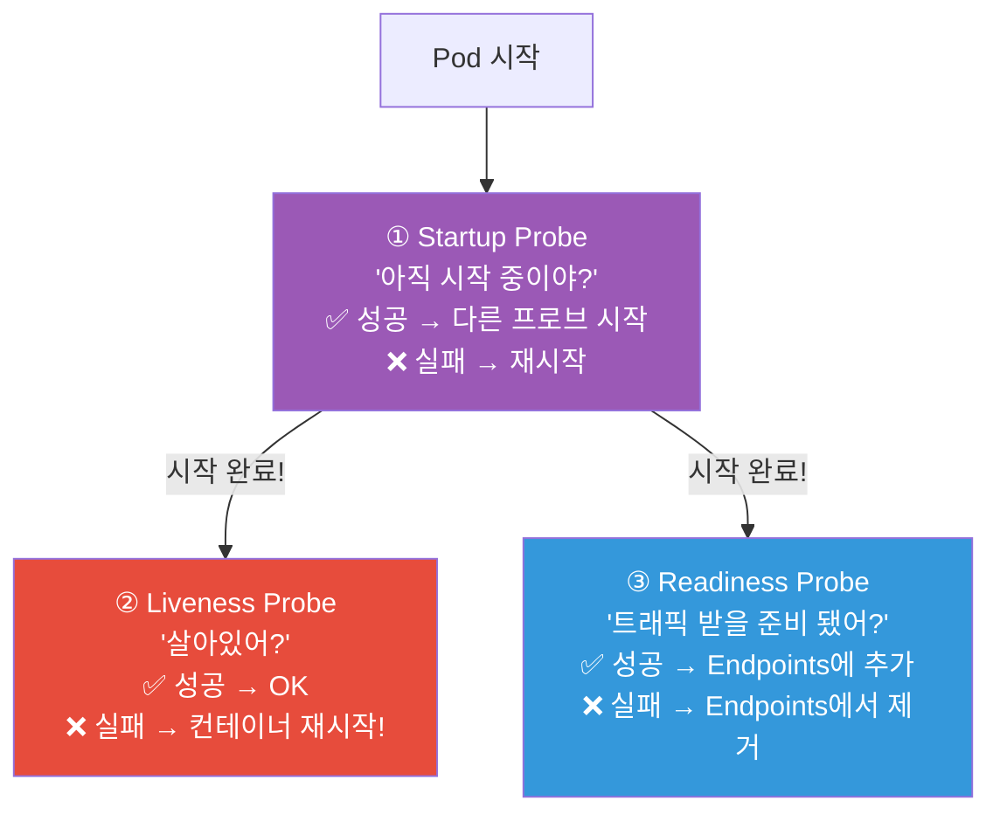
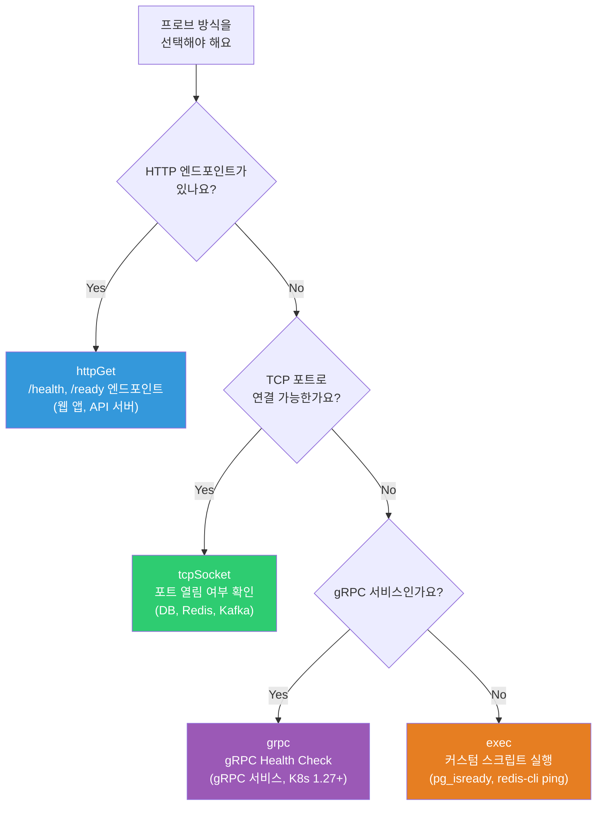
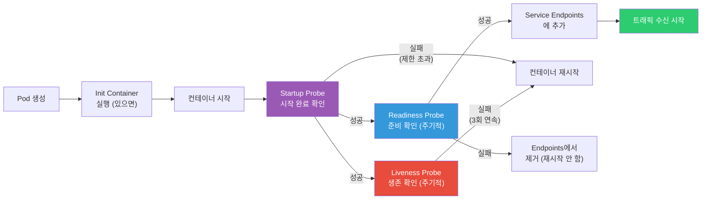
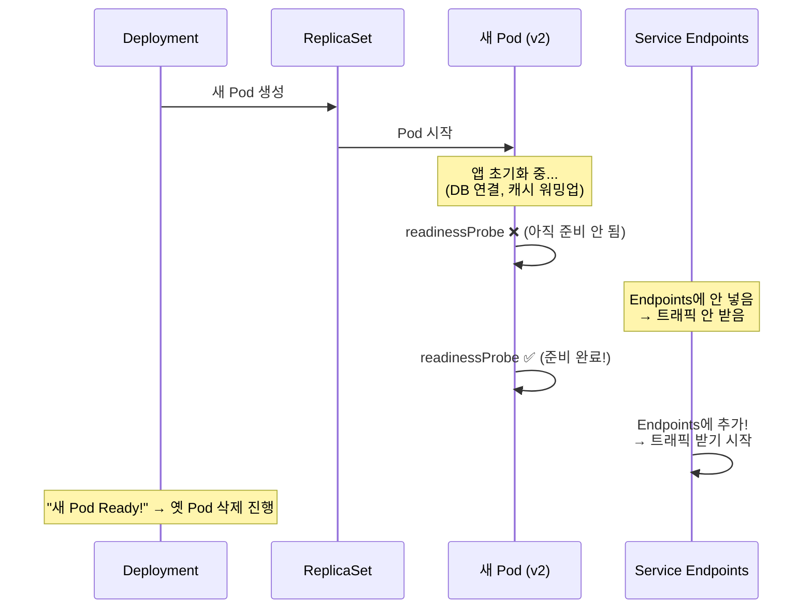

# liveness / readiness / startup probe

> Pod가 Running이라고 해서 정상인 건 아니에요. 앱이 교착 상태(deadlock)에 빠졌을 수도, DB 연결이 끊겼을 수도, 아직 초기화 중일 수도 있어요. K8s의 **프로브(Probe)**는 "이 Pod가 진짜 괜찮은지" 끊임없이 확인해요. [Deployment](./02-pod-deployment)에서 잠깐 봤던 프로브를 이번에 제대로 파볼게요.

---

## 🎯 이걸 왜 알아야 하나?

```
프로브를 알아야 하는 이유:
• "Pod가 Running인데 요청에 응답 안 해요"         → livenessProbe 미설정
• "배포 중에 502 에러가 나요"                     → readinessProbe 미설정
• "앱이 뜨는데 60초 걸리는데 자꾸 재시작돼요"     → startupProbe 미설정
• "Pod가 계속 재시작돼요 (CrashLoopBackOff)"      → 프로브 설정 오류
• "롤링 업데이트가 진행이 안 돼요"                → readinessProbe 실패
• Service Endpoints에서 Pod가 빠졌다 들어왔다      → readinessProbe 불안정
```

---

## 🧠 핵심 개념

### 3가지 프로브의 역할



| 프로브 | 질문 | 실패 시 동작 | 용도 |
|--------|------|-------------|------|
| **Startup** | "아직 시작 중?" | 컨테이너 **재시작** | 느린 시작 앱 보호 |
| **Liveness** | "살아있어?" | 컨테이너 **재시작** | 교착/멈춤 감지 |
| **Readiness** | "트래픽 받을 준비?" | Endpoints에서 **제거** (재시작 ❌) | 트래픽 제어 |

### 비유: 식당 직원 관리

* **Startup Probe** = 신입 출근. "아직 준비 중이야? 유니폼 입고 있어?" (준비될 때까지 기다림)
* **Liveness Probe** = 점장이 1시간마다 순찰. "혹시 쓰러진 거 아니지?" (쓰러졌으면 교체!)
* **Readiness Probe** = "주문 받을 수 있어?" (바쁘면 잠시 주문 안 받고, 여유 생기면 다시 받음)

### 프로브 방식 선택 가이드



### Pod 라이프사이클과 프로브 동작 순서



---

## 🔍 상세 설명 — 프로브 방식 3가지

### HTTP GET

```yaml
# 가장 많이 씀! 웹 앱/API에 적합
livenessProbe:
  httpGet:
    path: /health             # 헬스체크 엔드포인트
    port: 3000                # 앱 포트
    httpHeaders:              # 선택: 커스텀 헤더
    - name: Accept
      value: application/json
  initialDelaySeconds: 10     # Pod 시작 후 10초 대기
  periodSeconds: 10           # 10초마다 체크
  timeoutSeconds: 3           # 3초 내 응답 없으면 실패
  failureThreshold: 3         # 3번 연속 실패 시 → 재시작
  successThreshold: 1         # 1번 성공하면 OK (liveness는 항상 1)

# HTTP 200~399 → 성공
# HTTP 400+ 또는 타임아웃 → 실패
```

### TCP Socket

```yaml
# DB, Redis 등 HTTP가 아닌 서비스에 적합
livenessProbe:
  tcpSocket:
    port: 5432                # 포트가 열려있나?
  initialDelaySeconds: 15
  periodSeconds: 10

# 포트 연결 성공 → 성공
# 포트 연결 실패 → 실패
```

### Exec (명령어 실행)

```yaml
# 커스텀 스크립트로 체크 (유연하지만 오버헤드)
livenessProbe:
  exec:
    command:
    - sh
    - -c
    - "pg_isready -U postgres -d mydb"
  initialDelaySeconds: 30
  periodSeconds: 10

# Exit code 0 → 성공
# Exit code ≠ 0 → 실패
```

### gRPC (K8s 1.27+)

```yaml
# gRPC 서비스에 적합
livenessProbe:
  grpc:
    port: 50051
    service: "grpc.health.v1.Health"   # 선택
  initialDelaySeconds: 10
  periodSeconds: 10
```

---

## 🔍 상세 설명 — Liveness Probe

### "살아있어?" — 실패하면 컨테이너 재시작!

```yaml
apiVersion: v1
kind: Pod
metadata:
  name: liveness-demo
spec:
  containers:
  - name: app
    image: myapp:v1.0
    ports:
    - containerPort: 3000
    livenessProbe:
      httpGet:
        path: /health
        port: 3000
      initialDelaySeconds: 15     # 시작 후 15초 뒤 첫 체크
      periodSeconds: 10           # 10초마다
      timeoutSeconds: 3           # 3초 타임아웃
      failureThreshold: 3         # 3번 실패 → 재시작!
```

```bash
# Liveness 동작 타임라인:
# 0초:  Pod 시작
# 15초: 첫 번째 liveness 체크 → 200 OK ✅
# 25초: 두 번째 체크 → 200 OK ✅
# ...
# 55초: 앱 교착 상태! → 타임아웃 ❌ (1/3)
# 65초: 체크 → 타임아웃 ❌ (2/3)
# 75초: 체크 → 타임아웃 ❌ (3/3) → 컨테이너 재시작!

# 이벤트 확인
kubectl describe pod liveness-demo | grep -A 5 "Events"
# Warning  Unhealthy  Liveness probe failed: Get "http://10.0.1.50:3000/health": context deadline exceeded
# Normal   Killing    Container app failed liveness probe, will be restarted

# Pod RESTARTS 카운터 증가
kubectl get pods liveness-demo
# NAME            READY   STATUS    RESTARTS   AGE
# liveness-demo   1/1     Running   1          5m     ← RESTARTS: 1
```

### Liveness를 써야 하는 경우

```bash
# ✅ 교착 상태(Deadlock)에 빠질 수 있는 앱
# → 앱이 멈추지만 프로세스는 살아있음 (CPU 0%)
# → K8s가 "Running"으로 보지만 실제로는 죽은 상태

# ✅ 메모리 누수로 응답이 느려지는 앱
# → 재시작하면 메모리가 초기화되어 임시 해결

# ✅ 외부 의존성 문제로 멈춘 앱
# → DB 연결이 끊겨서 모든 요청이 타임아웃

# ❌ Liveness에 외부 의존성 체크를 넣지 마세요!
# → DB가 죽었다고 앱을 재시작하면? → 모든 Pod가 동시에 재시작 → 대참사!
# → 외부 의존성 체크는 Readiness에!
```

---

## 🔍 상세 설명 — Readiness Probe

### "트래픽 받을 준비 됐어?" — 실패하면 Endpoints에서 제거!

```yaml
readinessProbe:
  httpGet:
    path: /ready              # liveness와 다른 엔드포인트!
    port: 3000
  initialDelaySeconds: 5      # 빠르게 시작 (시작 직후부터 체크)
  periodSeconds: 5            # 자주 체크 (5초마다)
  timeoutSeconds: 2
  failureThreshold: 3
  successThreshold: 2         # ⭐ 2번 연속 성공해야 Ready! (안정성)
```

```bash
# Readiness 동작:
# 1. Pod 시작 → readinessProbe 실행
# 2. 성공 → Pod가 Service Endpoints에 추가 → 트래픽 받기 시작!
# 3. 실패 → Endpoints에서 제거 → 트래픽 안 받음 (재시작은 안 함!)
# 4. 다시 성공 → Endpoints에 다시 추가

# Endpoints 관찰
kubectl get endpoints myapp-service -w
# NAME            ENDPOINTS                           AGE
# myapp-service   10.0.1.50:8080,10.0.1.51:8080      5d
# → Pod의 readiness 실패 시:
# myapp-service   10.0.1.50:8080                      5d    ← 51이 빠짐!
# → Pod의 readiness 복구 시:
# myapp-service   10.0.1.50:8080,10.0.1.51:8080      5d    ← 51이 다시!

# Pod의 Ready 상태 확인
kubectl get pods
# NAME        READY   STATUS
# myapp-abc   1/1     Running    ← Ready!
# myapp-def   0/1     Running    ← Not Ready! (readiness 실패)
#             ^^^
#             0/1 = readinessProbe 실패 중
#             → Service 트래픽 안 받음!
```

### Readiness가 중요한 이유 — Rolling Update



```bash
# readinessProbe가 없으면:
# 1. 새 Pod 생성 → 즉시 Endpoints에 추가
# 2. 앱이 아직 초기화 중인데 트래픽이 옴
# 3. → 502/503 에러! 💥
# 4. 그 사이 옛 Pod 삭제 진행
# 5. → 다운타임 발생!

# readinessProbe가 있으면:
# 1. 새 Pod 생성 → readinessProbe 시작
# 2. 앱 초기화 완료 후 probe 성공
# 3. Endpoints에 추가 → 트래픽 받기 시작
# 4. 그 후에 옛 Pod 삭제
# 5. → 무중단 배포! ✅
```

---

## 🔍 상세 설명 — Startup Probe

### "아직 시작 중이야?" — 느린 시작 앱 보호

```yaml
startupProbe:
  httpGet:
    path: /health
    port: 3000
  failureThreshold: 30        # 30번까지 실패 허용
  periodSeconds: 10           # 10초마다 체크
  # → 30 × 10 = 300초(5분) 동안 시작할 시간!
  # 성공하면 → liveness/readiness 프로브 시작
  # 300초 안에 성공 못 하면 → 컨테이너 재시작
```

```bash
# Startup Probe가 왜 필요한가?

# ❌ Startup Probe 없이 liveness만 쓸 때:
# initialDelaySeconds: 10, failureThreshold: 3, periodSeconds: 10
# → 10 + 3×10 = 40초 안에 시작 안 되면 재시작!
# → Java/Spring Boot가 60초 걸리면? → 무한 재시작! (CrashLoopBackOff)

# 해결 1: initialDelaySeconds를 크게 (❌ 비추!)
# initialDelaySeconds: 120
# → 앱이 5초 만에 시작해도 120초 동안 liveness 체크 안 함
# → 그 사이 교착 상태 빠져도 모름!

# ✅ 해결 2: Startup Probe 사용!
startupProbe:
  failureThreshold: 30     # 5분 동안 기다려줌
  periodSeconds: 10
livenessProbe:
  periodSeconds: 10        # startup 성공 후 바로 시작!
  # initialDelaySeconds 불필요! startupProbe가 대신!

# 타임라인:
# 0초:   Pod 시작 → startupProbe 시작
# 10초:  startupProbe ❌ (아직 초기화 중)
# 20초:  startupProbe ❌
# ...
# 60초:  startupProbe ✅ (앱 시작 완료!)
#        → liveness + readiness 프로브 시작!
# 70초:  livenessProbe ✅
#        readinessProbe ✅ → Endpoints에 추가!
```

---

## 🔍 상세 설명 — /health vs /ready 엔드포인트 설계

### 헬스체크 엔드포인트 설계 (★ 실무 핵심!)

```bash
# ⭐ /health (liveness용) — "나는 살아있다"
# → 자기 자신만 체크! 외부 의존성 체크 ❌
# → 프로세스가 정상인지, 교착 상태가 아닌지만

# ⭐ /ready (readiness용) — "나는 트래픽을 처리할 수 있다"
# → 외부 의존성까지 체크! DB 연결, 캐시, 필수 서비스
# → 실패해도 재시작 안 함 (트래픽만 차단)
```

```javascript
// Node.js 예시
const express = require('express');
const app = express();

let isReady = false;

// DB 연결 상태
let dbConnected = false;
const db = require('./db');
db.connect().then(() => {
  dbConnected = true;
  isReady = true;
});

// Liveness: 프로세스가 살아있는지만!
app.get('/health', (req, res) => {
  // ⭐ 자기 자신만 체크! DB/Redis/외부 서비스 체크 ❌
  res.status(200).json({ status: 'alive' });
});

// Readiness: 트래픽 처리 가능한지!
app.get('/ready', async (req, res) => {
  // ⭐ 외부 의존성도 체크!
  const checks = {
    db: dbConnected,
    cache: await redis.ping().then(() => true).catch(() => false),
  };
  
  const allReady = Object.values(checks).every(v => v);
  
  if (allReady) {
    res.status(200).json({ status: 'ready', checks });
  } else {
    res.status(503).json({ status: 'not ready', checks });
    // 503 → readiness 실패 → Endpoints에서 제거
    // 하지만 재시작은 안 함!
  }
});
```

```bash
# ⚠️ 가장 흔한 실수: liveness에 DB 체크 넣기!

# ❌ 나쁜 패턴:
# /health에서 DB ping → DB 장애 시 모든 Pod 재시작!
# → Pod 100개가 동시에 재시작
# → DB가 복구되면? → 100개 Pod가 동시에 DB 연결 시도
# → DB에 연결 폭풍(thundering herd)! → DB 또 죽음!

# ✅ 좋은 패턴:
# /health → 자기 자신만 (항상 200, 교착 상태만 감지)
# /ready → DB + Redis + 필수 서비스 체크
# → DB 장애 시: readiness 실패 → 트래픽만 차단
# → 앱은 살아있고, DB 복구 시 자동으로 트래픽 재개!
```

---

## 🔍 상세 설명 — 실전 프로브 설정 가이드

### 언어/프레임워크별 추천 설정

```yaml
# === Node.js/Express ===
containers:
- name: node-app
  image: myapp:v1.0
  ports:
  - containerPort: 3000
  startupProbe:
    httpGet:
      path: /health
      port: 3000
    failureThreshold: 10
    periodSeconds: 5               # 50초 동안 시작 대기
  livenessProbe:
    httpGet:
      path: /health
      port: 3000
    periodSeconds: 10
    timeoutSeconds: 3
    failureThreshold: 3
  readinessProbe:
    httpGet:
      path: /ready
      port: 3000
    periodSeconds: 5
    timeoutSeconds: 2
    failureThreshold: 3
    successThreshold: 2

# === Java/Spring Boot (시작이 느림!) ===
containers:
- name: spring-app
  image: myapp:v1.0
  ports:
  - containerPort: 8080
  startupProbe:
    httpGet:
      path: /actuator/health/liveness     # Spring Actuator!
      port: 8080
    failureThreshold: 30
    periodSeconds: 10              # 300초(5분) 동안 시작 대기!
  livenessProbe:
    httpGet:
      path: /actuator/health/liveness
      port: 8080
    periodSeconds: 15
    timeoutSeconds: 5
    failureThreshold: 3
  readinessProbe:
    httpGet:
      path: /actuator/health/readiness
      port: 8080
    periodSeconds: 10
    timeoutSeconds: 5
    failureThreshold: 3
    successThreshold: 1

# === PostgreSQL (TCP + exec) ===
containers:
- name: postgres
  image: postgres:16
  ports:
  - containerPort: 5432
  startupProbe:
    exec:
      command: ["pg_isready", "-U", "postgres"]
    failureThreshold: 15
    periodSeconds: 10
  livenessProbe:
    exec:
      command: ["pg_isready", "-U", "postgres"]
    periodSeconds: 10
    failureThreshold: 3
  readinessProbe:
    exec:
      command: ["pg_isready", "-U", "postgres"]
    periodSeconds: 5
    failureThreshold: 3

# === Redis (TCP) ===
containers:
- name: redis
  image: redis:7
  ports:
  - containerPort: 6379
  livenessProbe:
    tcpSocket:
      port: 6379
    periodSeconds: 10
    failureThreshold: 3
  readinessProbe:
    exec:
      command: ["redis-cli", "ping"]
    periodSeconds: 5
    failureThreshold: 3

# === Nginx (정적 서버) ===
containers:
- name: nginx
  image: nginx:alpine
  ports:
  - containerPort: 80
  livenessProbe:
    httpGet:
      path: /
      port: 80
    periodSeconds: 15
    failureThreshold: 3
  readinessProbe:
    httpGet:
      path: /
      port: 80
    periodSeconds: 5
    failureThreshold: 3
```

### 파라미터 튜닝 가이드

```bash
# === initialDelaySeconds ===
# startupProbe를 쓰면 → 불필요! (0으로 설정)
# startupProbe 안 쓰면 → 앱 시작 시간 이상으로

# === periodSeconds ===
# liveness: 10~30초 (너무 자주 = 오버헤드)
# readiness: 5~10초 (빠르게 감지)

# === timeoutSeconds ===
# HTTP: 2~5초 (정상이면 100ms 이내 응답)
# exec: 5~10초 (스크립트 실행 시간)
# ⚠️ 앱이 GC pause로 멈출 수 있으면 여유 있게!

# === failureThreshold ===
# liveness: 3 (3번 연속 실패 → 재시작)
# readiness: 2~3 (빠르게 Endpoints에서 제거)
# startup: 앱 시작 시간 / periodSeconds (넉넉히!)

# === successThreshold ===
# liveness: 항상 1 (1번 성공 = 살아있음)
# readiness: 1~2 (2면 더 안정적, 깜빡임 방지)

# === 총 감지 시간 계산 ===
# liveness 감지 시간: periodSeconds × failureThreshold
# 예: 10초 × 3 = 30초 후에 재시작
# → 30초 동안 앱이 죽어있을 수 있음!

# readiness 감지 시간: periodSeconds × failureThreshold
# 예: 5초 × 3 = 15초 후에 Endpoints에서 제거
# → 15초 동안 503 응답이 갈 수 있음!
```

---

## 💻 실습 예제

### 실습 1: Liveness Probe 동작 관찰

```bash
# 일부러 liveness가 실패하는 Pod
kubectl apply -f - << 'EOF'
apiVersion: v1
kind: Pod
metadata:
  name: liveness-fail
spec:
  containers:
  - name: app
    image: busybox
    command:
    - sh
    - -c
    - |
      # /tmp/healthy 파일이 있으면 200, 없으면 500 응답하는 간이 서버
      echo "healthy" > /tmp/healthy
      # 30초 후에 파일 삭제 (liveness 실패 유도!)
      (sleep 30 && rm /tmp/healthy) &
      while true; do
        if [ -f /tmp/healthy ]; then
          echo -e "HTTP/1.1 200 OK\r\n\r\nOK" | nc -l -p 8080 -q 1
        else
          echo -e "HTTP/1.1 500 Error\r\n\r\nFAIL" | nc -l -p 8080 -q 1
        fi
      done
    ports:
    - containerPort: 8080
    livenessProbe:
      httpGet:
        path: /
        port: 8080
      initialDelaySeconds: 5
      periodSeconds: 5
      failureThreshold: 3
EOF

# 관찰
kubectl get pods liveness-fail -w
# NAME            READY   STATUS    RESTARTS   AGE
# liveness-fail   1/1     Running   0          10s     ← 정상
# liveness-fail   1/1     Running   0          30s     ← 파일 삭제됨
# liveness-fail   1/1     Running   0          45s     ← 실패 카운트 중...
# liveness-fail   1/1     Running   1          50s     ← RESTARTS: 0→1!

kubectl describe pod liveness-fail | grep -A 3 "Events" | tail -5
# Warning  Unhealthy  Liveness probe failed: HTTP probe failed with statuscode: 500
# Normal   Killing    Container app failed liveness probe, will be restarted

# 정리
kubectl delete pod liveness-fail
```

### 실습 2: Readiness Probe로 트래픽 제어

```bash
# 1. Deployment + Service 생성
kubectl apply -f - << 'EOF'
apiVersion: apps/v1
kind: Deployment
metadata:
  name: readiness-demo
spec:
  replicas: 2
  selector:
    matchLabels:
      app: readiness-demo
  template:
    metadata:
      labels:
        app: readiness-demo
    spec:
      containers:
      - name: nginx
        image: nginx:alpine
        ports:
        - containerPort: 80
        readinessProbe:
          httpGet:
            path: /
            port: 80
          periodSeconds: 5
          failureThreshold: 2
---
apiVersion: v1
kind: Service
metadata:
  name: readiness-svc
spec:
  selector:
    app: readiness-demo
  ports:
  - port: 80
EOF

# 2. Endpoints 확인 (2개 Pod 모두 있어야)
kubectl get endpoints readiness-svc
# ENDPOINTS: 10.0.1.50:80,10.0.1.51:80    ← 2개 ✅

# 3. 한 Pod의 readiness를 실패시키기 (Nginx 기본 페이지 삭제)
POD=$(kubectl get pods -l app=readiness-demo -o name | head -1)
kubectl exec $POD -- rm /usr/share/nginx/html/index.html

# 4. Endpoints 관찰
sleep 15
kubectl get endpoints readiness-svc
# ENDPOINTS: 10.0.1.51:80                  ← 1개만! (삭제한 Pod 빠짐)

kubectl get pods -l app=readiness-demo
# NAME                   READY   STATUS
# readiness-demo-abc     0/1     Running    ← READY 0/1! (readiness 실패)
# readiness-demo-def     1/1     Running    ← 정상

# ⭐ 재시작 안 됨! RESTARTS: 0!
# → readiness는 재시작 안 하고 트래픽만 차단!

# 5. 복구 (파일 다시 만들기)
kubectl exec $POD -- sh -c "echo 'ok' > /usr/share/nginx/html/index.html"
sleep 15
kubectl get endpoints readiness-svc
# ENDPOINTS: 10.0.1.50:80,10.0.1.51:80    ← 2개 복구! ✅

# 정리
kubectl delete deployment readiness-demo
kubectl delete svc readiness-svc
```

### 실습 3: Startup Probe로 느린 앱 보호

```bash
# 시작에 30초 걸리는 앱
kubectl apply -f - << 'EOF'
apiVersion: v1
kind: Pod
metadata:
  name: slow-start
spec:
  containers:
  - name: app
    image: busybox
    command:
    - sh
    - -c
    - |
      echo "Starting... (30초 소요)"
      sleep 30
      echo "Ready!"
      while true; do
        echo -e "HTTP/1.1 200 OK\r\n\r\nOK" | nc -l -p 8080 -q 1
      done
    ports:
    - containerPort: 8080
    startupProbe:
      httpGet:
        path: /
        port: 8080
      failureThreshold: 10        # 10번 × 5초 = 50초 동안 대기
      periodSeconds: 5
    livenessProbe:
      httpGet:
        path: /
        port: 8080
      periodSeconds: 10
      failureThreshold: 3
EOF

# 관찰
kubectl get pods slow-start -w
# slow-start   0/1   Running   0    5s      ← startup 체크 중
# slow-start   0/1   Running   0    10s     ← startup 실패 (아직 시작 중)
# slow-start   0/1   Running   0    20s     ← startup 실패 (아직...)
# slow-start   0/1   Running   0    30s     ← startup 실패 (거의 다!)
# slow-start   1/1   Running   0    35s     ← startup 성공! → liveness 시작

kubectl describe pod slow-start | grep -B 1 "Started"
# Normal  Started  Started container app

# ⭐ startupProbe 없이 liveness만 있었으면?
# → 15 + 10×3 = 45초 안에 시작 안 하면 재시작!
# → 30초 앱은 재시작 안 되지만, 60초 앱이라면 CrashLoopBackOff!

# 정리
kubectl delete pod slow-start
```

---

## 🏢 실무에서는?

### 시나리오 1: Rolling Update 시 502 에러 방지

```yaml
# "배포할 때마다 5~10초간 502가 나요" → readinessProbe + preStop!

# 해결:
spec:
  containers:
  - name: app
    image: myapp:v2.0
    
    # 1. readinessProbe — 새 Pod가 준비될 때까지 트래픽 안 보냄
    readinessProbe:
      httpGet:
        path: /ready
        port: 3000
      periodSeconds: 5
      failureThreshold: 3
      successThreshold: 2          # 2번 성공해야 Ready
    
    # 2. preStop — Pod 종료 전에 기존 연결 마무리 시간
    lifecycle:
      preStop:
        exec:
          command: ["sh", "-c", "sleep 10"]
          # → Endpoints에서 제거된 후 10초 대기
          # → 이미 진행 중인 요청이 완료될 시간!

  terminationGracePeriodSeconds: 40  # preStop(10) + 앱 종료(30)

# 배포 순서:
# 1. 새 Pod 생성 → readinessProbe 시작
# 2. readinessProbe 2번 연속 성공 → Endpoints에 추가 → 트래픽!
# 3. 옛 Pod → Endpoints에서 제거 → preStop(sleep 10) → SIGTERM → 종료
# 4. → 기존 요청 완료 + 새 Pod가 트래픽 처리 → 502 없음!
```

### 시나리오 2: "Pod가 CrashLoopBackOff인데 프로브 때문인가요?"

```bash
# CrashLoopBackOff의 원인이 프로브인지 앱 자체인지 구분!

# 1. Exit Code 확인
kubectl get pod myapp-abc -o jsonpath='{.status.containerStatuses[0].lastState.terminated.exitCode}'
# 137 → OOM Kill (프로브 아님! 메모리 문제)
# 1   → 앱 에러 (프로브 아님! 코드 문제)
# 143 → SIGTERM → liveness 실패로 인한 재시작일 수 있음!

# 2. 이벤트 확인
kubectl describe pod myapp-abc | grep -i "liveness\|killing\|unhealthy"
# Warning  Unhealthy  Liveness probe failed: ...
# Normal   Killing    Container failed liveness probe, will be restarted
# → 프로브 실패로 인한 재시작! ✅

# 3. 프로브 임시 비활성화로 확인
# liveness를 제거하고 배포 → 재시작 안 되면 프로브 문제!
# → 프로브 경로, 포트, 타임아웃 조정

# 흔한 원인:
# a. /health 엔드포인트가 없거나 오타
# b. 포트가 다름 (앱은 3000, 프로브는 8080)
# c. 타임아웃이 너무 짧음 (앱이 GC pause로 3초 멈춤)
# d. startupProbe 없이 liveness만 → 시작 시간 부족
# e. liveness에서 DB를 체크 → DB 장애 시 모든 Pod 재시작!
```

### 시나리오 3: 프로브 모니터링

```bash
# Prometheus 메트릭으로 프로브 상태 모니터링 (08-observability에서 상세히)

# 관련 메트릭:
# kube_pod_container_status_restarts_total     → 재시작 횟수 (liveness 실패 시 증가)
# kube_pod_status_ready                        → Ready 상태
# kube_endpoint_address_available              → Endpoints에 있는 Pod 수

# 알림 예시:
# - "Pod 재시작이 5분에 3회 이상" → liveness 문제 의심
# - "Ready Pod 비율이 50% 미만" → readiness 문제
# - "Endpoints가 비어있음" → 모든 Pod readiness 실패!
```

---

## ⚠️ 자주 하는 실수

### 1. Liveness에 외부 의존성 체크

```yaml
# ❌ DB가 죽으면 모든 Pod가 재시작! → 대참사!
livenessProbe:
  exec:
    command: ["sh", "-c", "curl -f http://db:5432 && curl -f http://redis:6379"]

# ✅ Liveness는 자기 자신만! 외부는 Readiness에서!
livenessProbe:
  httpGet:
    path: /health            # 자기 자신만 체크
    port: 3000
readinessProbe:
  httpGet:
    path: /ready             # DB, Redis 등 포함
    port: 3000
```

### 2. startupProbe 없이 느린 앱 운영

```yaml
# ❌ Java 앱이 90초 걸리는데:
livenessProbe:
  initialDelaySeconds: 120    # 120초 무방비 상태!
# → 120초 동안 앱이 교착 상태여도 모름!

# ✅ startupProbe로 분리!
startupProbe:
  failureThreshold: 30
  periodSeconds: 10           # 300초 동안 시작 대기
livenessProbe:
  periodSeconds: 10           # startup 후 바로 시작!
```

### 3. readinessProbe를 안 설정

```bash
# ❌ readinessProbe 없으면:
# → Pod 시작 즉시 Endpoints에 추가 → 준비 안 된 Pod에 트래픽!
# → 배포 시 502 에러!

# ✅ 웹 앱이면 readinessProbe 필수!
# → 특히 Rolling Update에서 무중단 배포를 위해!
```

### 4. 프로브 타임아웃이 너무 짧음

```yaml
# ❌ 타임아웃 1초 → GC pause에 의한 잘못된 실패!
livenessProbe:
  timeoutSeconds: 1           # JVM GC로 1초 멈추면 실패!

# ✅ 여유 있게
livenessProbe:
  timeoutSeconds: 5           # GC 감안
  # Java: 최소 3~5초
  # Node.js: 2~3초
```

### 5. liveness와 readiness에 같은 엔드포인트

```yaml
# ❌ 같은 엔드포인트 → 역할 구분 불가
livenessProbe:
  httpGet: { path: /health, port: 3000 }
readinessProbe:
  httpGet: { path: /health, port: 3000 }
# → DB 죽으면 /health가 실패 → liveness도 실패 → 모든 Pod 재시작!

# ✅ 분리!
livenessProbe:
  httpGet: { path: /health, port: 3000 }  # 자기 자신만
readinessProbe:
  httpGet: { path: /ready, port: 3000 }   # DB 포함
```

---

## 📝 정리

### 프로브 선택 가이드

```
모든 웹 앱         → liveness + readiness (필수!)
시작이 느린 앱     → startup + liveness + readiness
DB/Redis           → liveness(TCP/exec) + readiness(exec)
사이드카/에이전트   → liveness만 (트래픽 안 받으니까)
```

### 엔드포인트 설계

```
/health (liveness) → 자기 자신만! 외부 의존성 ❌
                     항상 200 (교착 상태만 감지)
                     
/ready (readiness) → 외부 의존성 포함! DB, Redis, 필수 서비스
                     준비 안 되면 503
```

### 파라미터 빠른 참조

```yaml
startupProbe:                    # 시작 대기
  failureThreshold: 30           # 최대 대기 = 30 × 10 = 300초
  periodSeconds: 10

livenessProbe:                   # 생존 확인
  initialDelaySeconds: 0         # startupProbe 쓰면 0!
  periodSeconds: 10
  timeoutSeconds: 3~5
  failureThreshold: 3

readinessProbe:                  # 준비 확인
  initialDelaySeconds: 0
  periodSeconds: 5               # 빠르게!
  timeoutSeconds: 2~3
  failureThreshold: 3
  successThreshold: 1~2
```

### 핵심 명령어

```bash
kubectl describe pod NAME | grep -A 10 "Liveness\|Readiness\|Startup"
kubectl get pods                        # READY 0/1 = readiness 실패
kubectl get endpoints SERVICE           # Pod가 빠졌는지 확인
kubectl get events --field-selector reason=Unhealthy
kubectl logs NAME --previous            # 재시작 전 로그
```

---

## 🔗 다음 강의

다음은 **[09-operations](./09-operations)** — Rolling Update / Canary / Blue-Green 배포 전략이에요.

프로브가 제대로 동작하는 게 전제인 배포 전략들! [Deployment의 Rolling Update](./02-pod-deployment)를 넘어서, 카나리 배포, Blue-Green 배포 같은 고급 배포 전략을 실전으로 배워볼게요.
