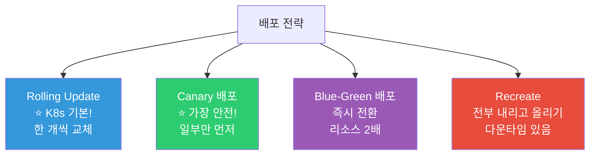
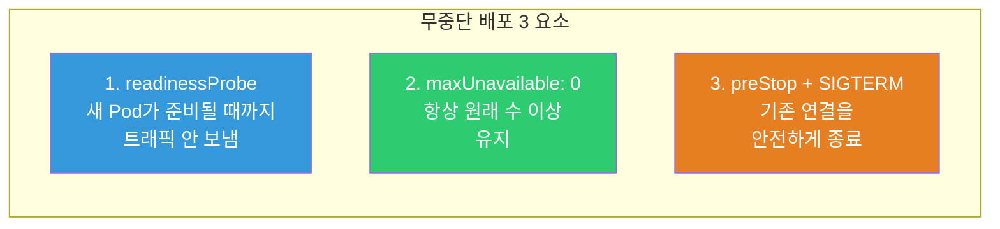
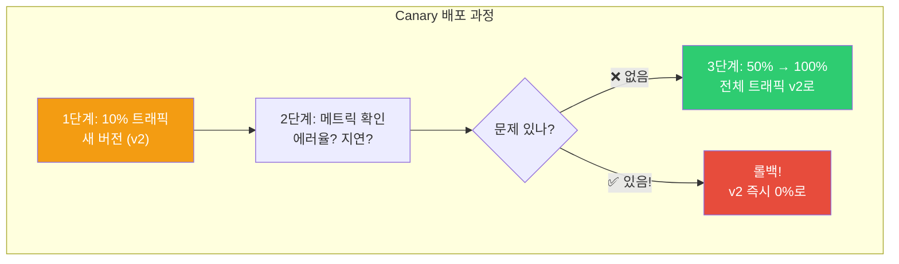
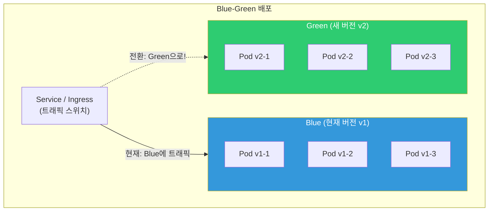

# Rolling Update / Canary / Blue-Green 배포 전략

> 코드를 배포하는 건 쉽지만, **무중단으로 안전하게** 배포하는 건 어려워요. "배포했더니 장애가 났어요" — 이걸 막는 게 배포 전략이에요. [Deployment의 Rolling Update](./02-pod-deployment)를 넘어서, 카나리/Blue-Green 같은 고급 전략과 [프로브](./08-healthcheck), [Ingress](./05-service-ingress)가 어떻게 결합되는지 배워볼게요.

---

## 🎯 이걸 왜 알아야 하나?

```
실무에서 배포 전략이 필요한 순간:
• "배포 중에 에러가 나면 어떡하죠?"               → 롤백 전략
• "새 버전을 10%만 먼저 배포하고 싶어요"          → 카나리 배포
• "전환을 즉시 할 수 있어야 해요"                 → Blue-Green
• "배포 후 메트릭을 확인하고 자동 진행하고 싶어요" → Progressive Delivery
• "금융/의료에서 배포 실패 = 사고"                → 안전한 배포 필수
```

---

## 🧠 핵심 개념

### 배포 전략 전체 비교



| 전략 | 다운타임 | 리소스 | 롤백 속도 | 위험도 | 복잡도 |
|------|---------|--------|----------|--------|--------|
| **Rolling Update** | 없음 | 약간 추가 | 중간 (undo) | 중간 | ⭐ 낮음 |
| **Canary** | 없음 | 약간 추가 | 빠름 (비율 0%) | ⭐ 가장 낮음 | 중간 |
| **Blue-Green** | 없음 | 2배! | ⭐ 즉시 | 낮음 | 중간 |
| **Recreate** | ⚠️ 있음 | 동일 | 느림 | 높음 | 낮음 |

---

## 🔍 상세 설명 — Rolling Update (K8s 기본)

[Deployment 강의](./02-pod-deployment)에서 기본은 배웠어요. 여기서는 **실전 튜닝**에 집중해요.

### 안전한 Rolling Update 설정

```yaml
apiVersion: apps/v1
kind: Deployment
metadata:
  name: myapp
spec:
  replicas: 4
  strategy:
    type: RollingUpdate
    rollingUpdate:
      maxSurge: 1              # 최대 5개까지 (4+1)
      maxUnavailable: 0        # ⭐ 항상 4개 유지! (0 = 가장 안전)
  
  minReadySeconds: 10          # ⭐ Pod Ready 후 10초 안정화 대기
  revisionHistoryLimit: 10     # 이전 RS 10개 보관 (롤백용)
  progressDeadlineSeconds: 600 # 10분 안에 완료 안 되면 실패 처리
  
  template:
    spec:
      containers:
      - name: myapp
        image: myapp:v2.0
        readinessProbe:        # ⭐ 필수! 없으면 무중단 배포 불가!
          httpGet:
            path: /ready
            port: 3000
          periodSeconds: 5
          failureThreshold: 3
          successThreshold: 2
        
        lifecycle:
          preStop:             # ⭐ 종료 전 대기 (기존 연결 마무리)
            exec:
              command: ["sh", "-c", "sleep 15"]
      
      terminationGracePeriodSeconds: 45  # preStop(15) + 앱종료(30)
```

### Rolling Update에서 무중단을 보장하는 3가지



```bash
# === Graceful Shutdown 상세 ===
# (../02-networking/06-load-balancing의 Graceful Shutdown 참고!)

# Pod 종료 순서:
# 1. K8s가 Pod를 Terminating으로 표시
# 2. Endpoints에서 Pod 제거 (새 요청 안 옴)
# 3. preStop 실행 (sleep 15 → 이미 진행 중인 요청 완료 대기)
# 4. SIGTERM 전송 → 앱이 Graceful Shutdown
# 5. terminationGracePeriodSeconds 경과 후 → SIGKILL (강제 종료)

# ⚠️ 문제: Endpoints 제거와 preStop이 "동시에" 시작됨!
# → kube-proxy가 iptables를 업데이트하는 데 수 초 걸림
# → 그 사이에 옛 Pod로 요청이 올 수 있음!
# → preStop에서 sleep으로 대기 = 이 갭을 커버!

# preStop 없으면:
# 1. Pod Terminating → 즉시 SIGTERM
# 2. kube-proxy가 아직 업데이트 안 됨 → 트래픽이 죽어가는 Pod로!
# 3. → 502/503 에러!

# preStop 있으면:
# 1. Pod Terminating → preStop(sleep 15) 실행
# 2. 그 사이 kube-proxy가 iptables 업데이트 완료
# 3. 15초 후 SIGTERM → 앱이 안전하게 종료
# 4. → 에러 없음! ✅
```

### Rolling Update 모니터링

```bash
# 배포 상태 확인
kubectl rollout status deployment/myapp
# Waiting for deployment "myapp" rollout to finish: 1 out of 4 new replicas have been updated...
# Waiting for deployment "myapp" rollout to finish: 2 out of 4 new replicas have been updated...
# Waiting for deployment "myapp" rollout to finish: 3 out of 4 new replicas have been updated...
# deployment "myapp" successfully rolled out

# 진행 안 되면? (progressDeadlineSeconds 초과)
kubectl rollout status deployment/myapp
# error: deployment "myapp" exceeded its progress deadline
# → 새 Pod의 readinessProbe가 계속 실패 중!

# 상세 확인
kubectl get pods -l app=myapp
# myapp-new-abc   0/1   Running   0   5m    ← Ready 0/1! readiness 실패!
# myapp-old-def   1/1   Running   0   1d    ← 기존 Pod는 정상

kubectl describe pod myapp-new-abc | tail -10
# Warning  Unhealthy  Readiness probe failed: connection refused
# → 앱이 /ready에 응답 안 함!

# 즉시 롤백!
kubectl rollout undo deployment/myapp
```

---

## 🔍 상세 설명 — Canary 배포 (★ 가장 안전한 전략!)

### Canary란?

새 버전을 **일부 트래픽에만 먼저** 배포해서 문제가 없는지 확인한 후 전체로 확대하는 전략이에요.



### 방법 1: K8s 네이티브 (Deployment 2개)

```yaml
# v1 Deployment (90%)
apiVersion: apps/v1
kind: Deployment
metadata:
  name: myapp-stable
spec:
  replicas: 9                    # 9개 = 90%
  selector:
    matchLabels:
      app: myapp
      track: stable
  template:
    metadata:
      labels:
        app: myapp               # ⭐ 같은 app 레이블!
        track: stable
        version: v1.0
    spec:
      containers:
      - name: myapp
        image: myapp:v1.0

---
# v2 Deployment (10%)
apiVersion: apps/v1
kind: Deployment
metadata:
  name: myapp-canary
spec:
  replicas: 1                    # 1개 = 10%
  selector:
    matchLabels:
      app: myapp
      track: canary
  template:
    metadata:
      labels:
        app: myapp               # ⭐ 같은 app 레이블!
        track: canary
        version: v2.0
    spec:
      containers:
      - name: myapp
        image: myapp:v2.0

---
# Service — app=myapp 레이블의 모든 Pod에 트래픽!
apiVersion: v1
kind: Service
metadata:
  name: myapp-service
spec:
  selector:
    app: myapp                   # ⭐ stable + canary 모두 매칭!
  ports:
  - port: 80
    targetPort: 3000
```

```bash
# 동작:
# Service가 app=myapp인 모든 Pod(10개)에 트래픽 분배
# → v1(9개) + v2(1개) → 약 10%가 v2로!

# 카나리 진행:
kubectl scale deployment myapp-canary --replicas=3    # 30%
kubectl scale deployment myapp-stable --replicas=7
# 문제 없으면:
kubectl scale deployment myapp-canary --replicas=5    # 50%
kubectl scale deployment myapp-stable --replicas=5
# 최종:
kubectl scale deployment myapp-canary --replicas=10   # 100%
kubectl delete deployment myapp-stable                 # 이전 버전 삭제

# 롤백 (즉시!):
kubectl scale deployment myapp-canary --replicas=0    # 카나리 0개!
kubectl scale deployment myapp-stable --replicas=10   # 이전 버전 복구

# ⚠️ 한계:
# → 비율 제어가 Pod 수에 의존 (정확한 10%가 아닐 수 있음)
# → 수동 조작 필요
# → 메트릭 기반 자동 판단 불가
```

### 방법 2: Nginx Ingress 카나리 (★ 더 정밀!)

```yaml
# Stable Ingress (메인)
apiVersion: networking.k8s.io/v1
kind: Ingress
metadata:
  name: myapp-stable
spec:
  ingressClassName: nginx
  rules:
  - host: api.example.com
    http:
      paths:
      - path: /
        pathType: Prefix
        backend:
          service:
            name: myapp-stable-svc
            port:
              number: 80

---
# Canary Ingress (가중치!)
apiVersion: networking.k8s.io/v1
kind: Ingress
metadata:
  name: myapp-canary
  annotations:
    nginx.ingress.kubernetes.io/canary: "true"           # ⭐ 카나리 모드!
    nginx.ingress.kubernetes.io/canary-weight: "10"      # ⭐ 10% 트래픽!
spec:
  ingressClassName: nginx
  rules:
  - host: api.example.com
    http:
      paths:
      - path: /
        pathType: Prefix
        backend:
          service:
            name: myapp-canary-svc
            port:
              number: 80
```

```bash
# 가중치 변경 (10% → 30% → 50% → 100%)
kubectl annotate ingress myapp-canary \
    nginx.ingress.kubernetes.io/canary-weight="30" --overwrite

# 헤더 기반 카나리 (특정 사용자만!)
# annotations:
#   nginx.ingress.kubernetes.io/canary: "true"
#   nginx.ingress.kubernetes.io/canary-by-header: "X-Canary"
#   nginx.ingress.kubernetes.io/canary-by-header-value: "true"

# 테스트:
curl -H "X-Canary: true" https://api.example.com    # → v2로!
curl https://api.example.com                          # → v1로!

# 장점:
# ✅ 정확한 비율 제어 (Pod 수와 무관!)
# ✅ 헤더/쿠키 기반 카나리 (특정 사용자/팀만 테스트)
# ✅ Gateway API에서도 가능 (weight 필드)
```

### 방법 3: Argo Rollouts (★ 프로덕션 추천!)

```yaml
# Argo Rollouts: Progressive Delivery 전문 도구
# → 메트릭 기반 자동 카나리!

apiVersion: argoproj.io/v1alpha1
kind: Rollout                          # Deployment 대신!
metadata:
  name: myapp
spec:
  replicas: 10
  selector:
    matchLabels:
      app: myapp
  template:
    metadata:
      labels:
        app: myapp
    spec:
      containers:
      - name: myapp
        image: myapp:v2.0
        ports:
        - containerPort: 3000
  
  strategy:
    canary:
      # 단계별 자동 진행!
      steps:
      - setWeight: 10                  # 1단계: 10%
      - pause: { duration: 5m }       # 5분 관찰
      - setWeight: 30                  # 2단계: 30%
      - pause: { duration: 5m }       # 5분 관찰
      - setWeight: 50                  # 3단계: 50%
      - pause: { duration: 10m }      # 10분 관찰
      - setWeight: 100                 # 4단계: 100% (완료!)
      
      # 자동 롤백 (메트릭 기반!) — 08-observability의 Prometheus 연동
      # analysis:
      #   templates:
      #   - templateName: success-rate
      #   args:
      #   - name: service-name
      #     value: myapp
      
      canaryService: myapp-canary-svc
      stableService: myapp-stable-svc
      
      trafficRouting:
        nginx:
          stableIngress: myapp-stable
          additionalIngressAnnotations:
            canary-by-header: X-Canary
```

```bash
# Argo Rollouts 설치
kubectl create namespace argo-rollouts
kubectl apply -n argo-rollouts -f https://github.com/argoproj/argo-rollouts/releases/latest/download/install.yaml

# Argo Rollouts CLI
kubectl argo rollouts get rollout myapp -w
# Name:            myapp
# Status:          ॥ Paused
# Strategy:        Canary
#   Step:          1/8
#   SetWeight:     10
#   ActualWeight:  10
# Images:          myapp:v1.0 (stable)
#                  myapp:v2.0 (canary)

# 수동 진행 (pause에서)
kubectl argo rollouts promote myapp
# → 다음 단계로!

# 즉시 롤백
kubectl argo rollouts abort myapp
# → 카나리 즉시 중단, stable로 복구!

# 전체 완료 (100%로 직접)
kubectl argo rollouts promote myapp --full
```

---

## 🔍 상세 설명 — Blue-Green 배포

### Blue-Green이란?

**두 개의 환경(Blue=현재, Green=새 버전)**을 동시에 운영하다가 트래픽을 **즉시 전환**하는 전략이에요.



### K8s에서 Blue-Green 구현

```yaml
# Blue Deployment (현재)
apiVersion: apps/v1
kind: Deployment
metadata:
  name: myapp-blue
spec:
  replicas: 3
  selector:
    matchLabels:
      app: myapp
      version: blue
  template:
    metadata:
      labels:
        app: myapp
        version: blue
    spec:
      containers:
      - name: myapp
        image: myapp:v1.0

---
# Green Deployment (새 버전)
apiVersion: apps/v1
kind: Deployment
metadata:
  name: myapp-green
spec:
  replicas: 3
  selector:
    matchLabels:
      app: myapp
      version: green
  template:
    metadata:
      labels:
        app: myapp
        version: green
    spec:
      containers:
      - name: myapp
        image: myapp:v2.0

---
# Service — selector로 Blue 또는 Green을 가리킴!
apiVersion: v1
kind: Service
metadata:
  name: myapp-service
spec:
  selector:
    app: myapp
    version: blue              # ⭐ 현재 Blue를 가리킴!
  ports:
  - port: 80
    targetPort: 3000
```

```bash
# === Blue-Green 전환 과정 ===

# 1. Green(v2) 배포 (Blue는 그대로 서비스 중)
kubectl apply -f deployment-green.yaml
kubectl rollout status deployment/myapp-green
# → Green Pod 3개가 모두 Ready!

# 2. Green 헬스체크 (Service 전환 전에 확인!)
kubectl port-forward deployment/myapp-green 8080:3000
curl http://localhost:8080/health    # 정상 확인!

# 3. 트래픽 전환 (⭐ 한 줄로 즉시!)
kubectl patch service myapp-service -p '{"spec":{"selector":{"version":"green"}}}'
# → 즉시 모든 트래픽이 Green으로!

# 4. 확인
kubectl get endpoints myapp-service
# ENDPOINTS: 10.0.1.60:3000,10.0.1.61:3000,10.0.1.62:3000
# → Green Pod들의 IP!

# 5. Blue 유지 (롤백용)
# → 바로 삭제하지 않고 잠시 유지!

# 6. 문제 있으면? 즉시 롤백!
kubectl patch service myapp-service -p '{"spec":{"selector":{"version":"blue"}}}'
# → 1초 만에 Blue로 복구!

# 7. 안정 확인 후 Blue 삭제
kubectl delete deployment myapp-blue

# 다음 배포 때:
# Green = 현재(stable), 새 Blue = 새 버전 → 교대!
```

### Blue-Green 장단점

```bash
# ✅ 장점:
# → 즉시 전환 (Service selector 변경 = 1초!)
# → 즉시 롤백 (selector를 되돌리면 끝)
# → 전환 전에 Green을 충분히 테스트 가능
# → 카나리보다 단순

# ❌ 단점:
# → 리소스 2배! (Blue + Green 동시 운영)
# → 전환은 "전부 아니면 전무" (점진적 불가)
# → DB 스키마 변경 시 양쪽 호환 필요
# → 세션/캐시 문제 (Blue의 세션이 Green에 없음)

# 실무 추천:
# → 리소스 여유 + 즉시 전환 필요 → Blue-Green
# → 리소스 제한 + 점진적 검증 → Canary
# → 간단하게 → Rolling Update
```

### Argo Rollouts로 Blue-Green

```yaml
apiVersion: argoproj.io/v1alpha1
kind: Rollout
metadata:
  name: myapp
spec:
  replicas: 3
  selector:
    matchLabels:
      app: myapp
  template:
    metadata:
      labels:
        app: myapp
    spec:
      containers:
      - name: myapp
        image: myapp:v2.0
  
  strategy:
    blueGreen:
      activeService: myapp-active        # 현재 트래픽 받는 서비스
      previewService: myapp-preview      # 미리보기 (테스트용)
      autoPromotionEnabled: false        # 수동 승인 후 전환
      prePromotionAnalysis:              # 전환 전 자동 테스트!
        templates:
        - templateName: smoke-test
      scaleDownDelaySeconds: 300         # 전환 후 5분간 이전 버전 유지 (롤백용)
```

```bash
# 상태 확인
kubectl argo rollouts get rollout myapp
# Name:    myapp
# Status:  ॥ Paused
# Images:  myapp:v1.0 (active)
#          myapp:v2.0 (preview)

# Preview 서비스로 테스트
curl http://myapp-preview.production.svc.cluster.local
# → v2 응답 확인!

# 전환 승인!
kubectl argo rollouts promote myapp
# → active가 v2로 전환!

# 롤백
kubectl argo rollouts undo myapp
```

---

## 🔍 상세 설명 — 배포 안전장치

### Deployment의 progressDeadlineSeconds

```bash
# 배포가 지정 시간 내에 완료되지 않으면 실패로 표시
# → 새 Pod의 readiness가 계속 실패하면 무한 대기 방지!

kubectl rollout status deployment/myapp
# error: deployment "myapp" exceeded its progress deadline

# 확인
kubectl get deployment myapp -o jsonpath='{.status.conditions[?(@.type=="Progressing")].message}'
# ReplicaSet "myapp-abc" has timed out progressing

# 이때 옛 Pod는 살아있음! (maxUnavailable: 0이면)
# → 서비스 영향 없이 문제 확인 가능
# → 수정 후 다시 배포하거나 rollout undo
```

### PodDisruptionBudget (PDB)

```yaml
# "항상 최소 N개의 Pod가 살아있어야 해"
# → 노드 drain, 업그레이드 시에도 서비스 유지

apiVersion: policy/v1
kind: PodDisruptionBudget
metadata:
  name: myapp-pdb
spec:
  minAvailable: 2              # 최소 2개는 항상 살아있어야!
  # 또는:
  # maxUnavailable: 1          # 최대 1개만 동시에 중단 가능
  selector:
    matchLabels:
      app: myapp
```

```bash
# PDB 확인
kubectl get pdb
# NAME        MIN AVAILABLE   MAX UNAVAILABLE   ALLOWED DISRUPTIONS   AGE
# myapp-pdb   2               N/A               1                     5d
#                                                ^
#                                                현재 1개를 중단해도 OK

# PDB가 있으면:
# kubectl drain node-1 → myapp Pod가 2개 미만이 되면 drain 멈춤!
# → 다른 노드에 Pod가 뜰 때까지 기다림

# ⚠️ PDB 없으면:
# kubectl drain → 노드의 모든 Pod를 한꺼번에 퇴거!
# → 같은 노드에 있던 Pod 3개가 동시에 삭제 → 서비스 중단!
```

---

## 💻 실습 예제

### 실습 1: 안전한 Rolling Update

```bash
# 1. Deployment 생성 (v1)
kubectl apply -f - << 'EOF'
apiVersion: apps/v1
kind: Deployment
metadata:
  name: safe-deploy
spec:
  replicas: 4
  strategy:
    rollingUpdate:
      maxSurge: 1
      maxUnavailable: 0
  minReadySeconds: 5
  selector:
    matchLabels:
      app: safe-deploy
  template:
    metadata:
      labels:
        app: safe-deploy
    spec:
      containers:
      - name: app
        image: nginx:1.24
        readinessProbe:
          httpGet:
            path: /
            port: 80
          periodSeconds: 3
          failureThreshold: 2
          successThreshold: 2
        lifecycle:
          preStop:
            exec:
              command: ["sh", "-c", "sleep 10"]
      terminationGracePeriodSeconds: 30
EOF

kubectl rollout status deployment/safe-deploy

# 2. 관찰 시작
kubectl get pods -l app=safe-deploy -w &

# 3. 업데이트 (v1 → v2)
kubectl set image deployment/safe-deploy app=nginx:1.25

# 관찰:
# safe-deploy-new-1   0/1   Pending       ← 새 Pod 생성
# safe-deploy-new-1   0/1   ContainerCreating
# safe-deploy-new-1   0/1   Running       ← 시작, readiness 체크 중
# safe-deploy-new-1   1/1   Running       ← Ready! (2번 연속 성공)
# (5초 대기 — minReadySeconds)
# safe-deploy-old-4   1/1   Terminating   ← 그 후에야 옛 Pod 삭제!
# → 항상 4개 이상 유지하면서 교체!

# 4. 확인
kubectl rollout status deployment/safe-deploy
# deployment "safe-deploy" successfully rolled out

kill %1 2>/dev/null

# 5. 정리
kubectl delete deployment safe-deploy
```

### 실습 2: 네이티브 카나리 배포

```bash
# 1. Stable (v1) — 9개
kubectl create deployment myapp-stable --image=hashicorp/http-echo --replicas=9 -- -text="v1"
kubectl expose deployment myapp-stable --port=80 --target-port=5678 --name=myapp-svc \
    --selector=app=myapp --dry-run=client -o yaml | kubectl apply -f -

# Pod에 공통 레이블 추가
kubectl label pods -l app=myapp-stable app=myapp --overwrite

# 2. Canary (v2) — 1개
kubectl create deployment myapp-canary --image=hashicorp/http-echo --replicas=1 -- -text="v2"
kubectl label pods -l app=myapp-canary app=myapp --overwrite

# 3. Service가 둘 다 선택하는지 확인
kubectl get endpoints myapp-svc
# 10개 Pod IP가 나와야 (9 + 1)

# 4. 트래픽 분배 테스트
for i in $(seq 1 20); do
    kubectl run test-$i --image=busybox --rm -it --restart=Never -- \
        wget -qO- http://myapp-svc 2>/dev/null
done 2>/dev/null | sort | uniq -c
# 18 v1    ← ~90%
#  2 v2    ← ~10%

# 5. 카나리 확대
kubectl scale deployment myapp-canary --replicas=5
kubectl scale deployment myapp-stable --replicas=5

# 6. 롤백 (문제 시)
kubectl scale deployment myapp-canary --replicas=0

# 7. 정리
kubectl delete deployment myapp-stable myapp-canary
kubectl delete svc myapp-svc
```

### 실습 3: Blue-Green 전환

```bash
# 1. Blue (v1)
kubectl create deployment myapp-blue --image=hashicorp/http-echo -- -text="BLUE-v1"
kubectl expose deployment myapp-blue --port=80 --target-port=5678

# Service (Blue를 가리킴)
kubectl apply -f - << 'EOF'
apiVersion: v1
kind: Service
metadata:
  name: myapp-active
spec:
  selector:
    app: myapp-blue
  ports:
  - port: 80
    targetPort: 5678
EOF

# 2. Green (v2) 배포 (Service는 아직 Blue)
kubectl create deployment myapp-green --image=hashicorp/http-echo -- -text="GREEN-v2"
kubectl rollout status deployment/myapp-green

# 3. Green 테스트
kubectl port-forward deployment/myapp-green 9090:5678 &
curl http://localhost:9090
# GREEN-v2    ← Green 정상!
kill %1 2>/dev/null

# 4. 트래픽 전환! (Blue → Green)
kubectl patch service myapp-active -p '{"spec":{"selector":{"app":"myapp-green"}}}'

# 확인
kubectl run test --image=busybox --rm -it --restart=Never -- wget -qO- http://myapp-active
# GREEN-v2    ← Green으로 전환됨! ✅

# 5. 롤백 (문제 시)
kubectl patch service myapp-active -p '{"spec":{"selector":{"app":"myapp-blue"}}}'
# → 1초 만에 Blue로 복구!

# 6. 정리
kubectl delete deployment myapp-blue myapp-green
kubectl delete svc myapp-active myapp-blue
```

---

## 🏢 실무에서는?

### 시나리오 1: 배포 전략 선택 가이드

```bash
# 질문 1: 다운타임 허용?
# Yes → Recreate (간단)
# No → Rolling / Canary / Blue-Green

# 질문 2: 점진적 검증이 필요?
# Yes → Canary ⭐
# No → Rolling (충분히 안전)

# 질문 3: 즉시 롤백이 필요?
# Yes → Blue-Green (1초 롤백)
# No → Rolling (rollout undo, 수십 초)

# 질문 4: 자동화/메트릭 기반 배포?
# Yes → Argo Rollouts ⭐ (Progressive Delivery)
# No → K8s 네이티브

# 실무 추천:
# 대부분의 서비스 → Rolling Update (간단하고 충분!)
# 중요 서비스 → Canary + Argo Rollouts (메트릭 기반)
# 즉시 전환 필요 → Blue-Green
# CI/CD 파이프라인 → 07-cicd에서 ArgoCD + Argo Rollouts!
```

### 시나리오 2: DB 스키마 변경이 있는 배포

```bash
# "v2에서 DB 컬럼을 추가해야 해요"

# ❌ 나쁜 방법:
# 1. v2 배포 (새 컬럼 필요) → Rolling Update 중 v1과 v2 공존
# 2. v1은 새 컬럼을 모르니 에러!

# ✅ 좋은 방법: Expand-Migrate-Contract 패턴
# Phase 1 (Expand): 새 컬럼 추가 (nullable, 기본값)
#   → v1도 v2도 동작 가능!
# Phase 2 (Migrate): 기존 데이터 마이그레이션
# Phase 3: v2 배포 (Rolling Update 가능!)
#   → v1과 v2 공존해도 문제 없음
# Phase 4 (Contract): v1 완전 제거 후, NOT NULL 등 제약 추가

# 또는 Blue-Green:
# → v1 서비스 중에 v2 + 새 스키마 준비
# → 전환 시 트래픽을 한꺼번에 전환
# → 하지만 이것도 롤백 시 스키마 호환 필요!
```

### 시나리오 3: Argo Rollouts로 자동 카나리

```bash
# "에러율이 1% 넘으면 자동으로 롤백해주세요"

# 1. AnalysisTemplate 정의 (Prometheus 쿼리)
# apiVersion: argoproj.io/v1alpha1
# kind: AnalysisTemplate
# metadata:
#   name: success-rate
# spec:
#   metrics:
#   - name: success-rate
#     interval: 1m
#     successCondition: result[0] >= 0.99    # 99% 이상이면 성공
#     failureLimit: 3                         # 3번 실패하면 롤백!
#     provider:
#       prometheus:
#         address: http://prometheus:9090
#         query: |
#           sum(rate(http_requests_total{status=~"2..",service="myapp"}[5m]))
#           /
#           sum(rate(http_requests_total{service="myapp"}[5m]))

# 2. Rollout에 분석 연결
# strategy:
#   canary:
#     analysis:
#       templates:
#       - templateName: success-rate
#     steps:
#     - setWeight: 10
#     - pause: { duration: 5m }
#     - setWeight: 50
#     - pause: { duration: 5m }

# 흐름:
# 10% 배포 → 5분간 메트릭 감시 → 99% 이상이면 50%로
# → 99% 미만이면 자동 롤백! 🎉
# → 사람 개입 없이 안전한 배포!
```

---

## ⚠️ 자주 하는 실수

### 1. readinessProbe 없이 Rolling Update

```bash
# ❌ readiness 없으면:
# 새 Pod 즉시 Endpoints에 추가 → 준비 안 된 Pod에 트래픽 → 502!

# ✅ readinessProbe 필수!
# → 특히 successThreshold: 2 (안정적으로 2번 성공 후 트래픽)
```

### 2. preStop 없이 배포

```bash
# ❌ preStop 없으면:
# Pod Terminating 즉시 → SIGTERM → kube-proxy 아직 업데이트 안 됨 → 502!

# ✅ preStop: sleep 10~15 → kube-proxy 업데이트 대기
```

### 3. 카나리에서 메트릭 확인 안 하기

```bash
# ❌ 카나리 10% 배포 후 "문제 없겠지" → 100%로 바로!
# → 에러율 5%였는데 모름!

# ✅ 카나리 배포 후 반드시 확인:
# - 에러율 (5xx 비율)
# - 응답 시간 (P50, P95, P99)
# - CPU/메모리 사용량
# - 비즈니스 메트릭 (주문 성공률 등)
# → Argo Rollouts + Prometheus로 자동화!
```

### 4. Blue-Green에서 이전 버전을 바로 삭제

```bash
# ❌ Green으로 전환 후 Blue 즉시 삭제
# → 문제 발견 시 롤백 불가!

# ✅ 최소 15~30분 유지 후 삭제
# → 모니터링으로 문제 없음 확인 후
```

### 5. PDB 없이 노드 drain

```bash
# ❌ PDB 없이 drain → 같은 노드의 Pod 전부 한꺼번에 삭제!
kubectl drain node-1
# → myapp Pod 3개 동시 삭제 → 서비스 중단!

# ✅ PDB 설정!
# minAvailable: 2 → drain 시 최소 2개 유지
# → 1개씩만 퇴거, 다른 노드에 뜬 후 다음 퇴거
```

---

## 📝 정리

### 배포 전략 선택 가이드

```
간단한 서비스       → Rolling Update (K8s 기본)
중요 서비스         → Canary + Argo Rollouts ⭐
즉시 전환 필요      → Blue-Green
DB 스키마 변경      → Expand-Migrate-Contract + Rolling
다운타임 허용       → Recreate
```

### 무중단 배포 체크리스트

```
✅ readinessProbe 설정 (successThreshold: 2)
✅ maxUnavailable: 0 (항상 원래 수 유지)
✅ preStop: sleep 10~15 (Graceful Shutdown)
✅ terminationGracePeriodSeconds 충분히
✅ minReadySeconds: 5~10 (안정화 대기)
✅ progressDeadlineSeconds 설정 (무한 대기 방지)
✅ PodDisruptionBudget 설정
✅ rollout history로 롤백 준비
```

### 핵심 명령어

```bash
# Rolling Update
kubectl set image deployment/NAME CONTAINER=IMAGE
kubectl rollout status deployment/NAME
kubectl rollout undo deployment/NAME
kubectl rollout history deployment/NAME

# Canary (Ingress)
kubectl annotate ingress NAME-canary nginx.ingress.kubernetes.io/canary-weight="20" --overwrite

# Blue-Green
kubectl patch service NAME -p '{"spec":{"selector":{"version":"green"}}}'

# Argo Rollouts
kubectl argo rollouts get rollout NAME -w
kubectl argo rollouts promote NAME
kubectl argo rollouts abort NAME

# PDB
kubectl get pdb
```

---

## 🔗 다음 강의

다음은 **[10-autoscaling](./10-autoscaling)** — HPA / VPA / Cluster Autoscaler / KEDA 이에요.

배포 전략을 배웠으니, 이제 **자동 스케일링**이에요. 트래픽이 증가하면 Pod를 자동으로 늘리고, 노드도 자동으로 추가하는 — K8s 오토스케일링의 모든 것을 배워볼게요.
