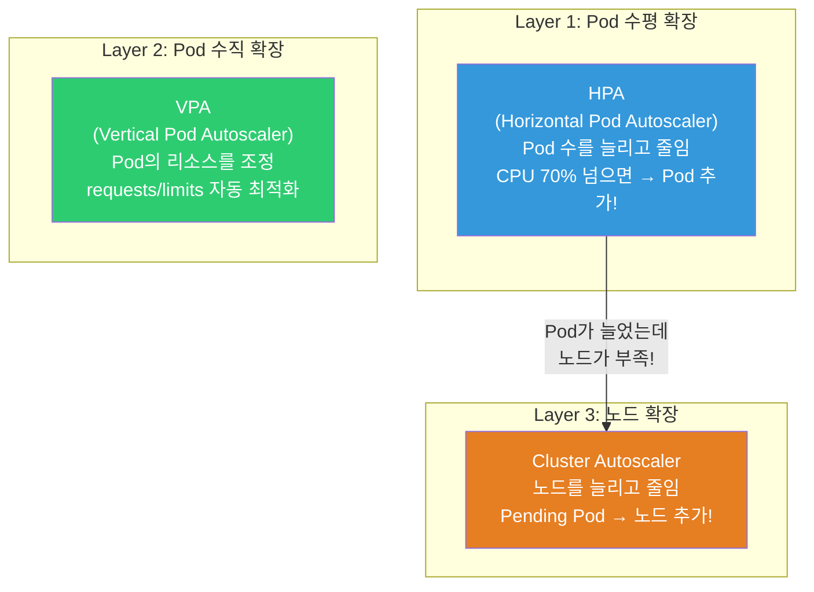
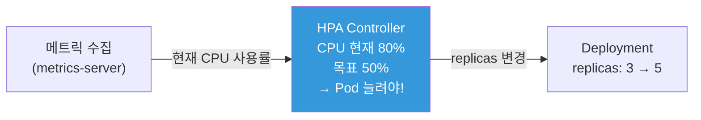
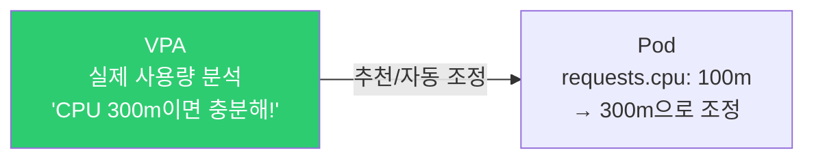
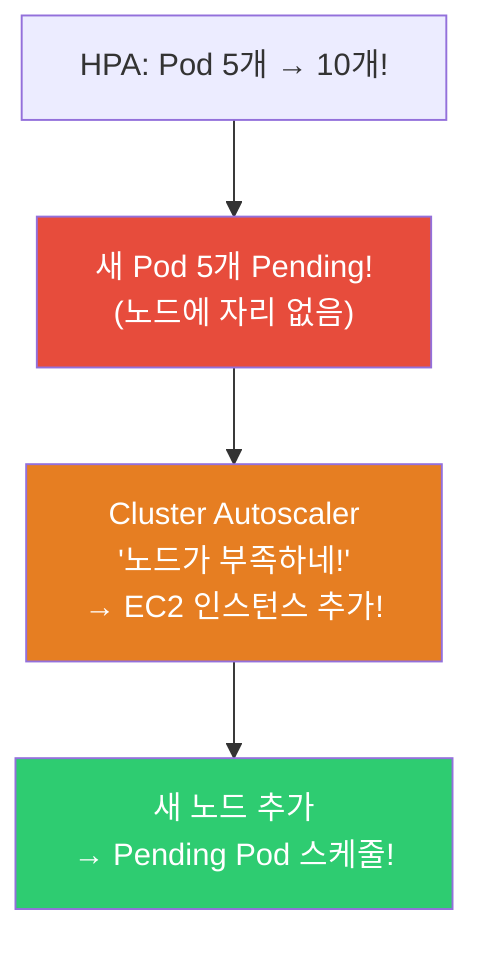
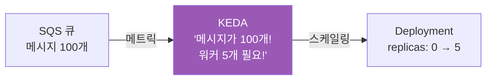

# HPA / VPA / Cluster Autoscaler / KEDA

> 트래픽이 10배 증가했는데 Pod가 3개뿐이라면? 새벽에는 트래픽이 없는데 Pod 10개가 돌고 있다면? **오토스케일링**은 부하에 따라 Pod 수와 노드 수를 자동으로 조절해서 성능과 비용을 최적화해요. [리소스 관리](./02-pod-deployment)와 [배포 전략](./09-operations)의 자연스러운 확장이에요.

---

## 🎯 이걸 왜 알아야 하나?

```
오토스케일링이 필요한 이유:
• 트래픽 급증 → Pod 자동 추가 (HPA)           → 서비스 안정성
• 트래픽 감소 → Pod 자동 감소                  → 비용 절감
• Pod가 늘었는데 노드가 부족 → 노드 자동 추가  → Cluster Autoscaler
• Pod의 CPU/메모리 설정이 적절한지 → 자동 조정  → VPA
• 큐 메시지 수 기반 스케일링                    → KEDA
• "야간에도 서버 10대가 돌고 있어요" → 비용 낭비 → 스케일 다운
```

---

## 🧠 핵심 개념

### 오토스케일링 3계층



| 스케일러 | 무엇을 | 어떻게 | 트리거 |
|---------|--------|--------|--------|
| **HPA** | Pod **수** | 수평 확장/축소 | CPU, 메모리, 커스텀 메트릭 |
| **VPA** | Pod **리소스** | requests/limits 조정 | 실제 사용량 분석 |
| **Cluster Autoscaler** | **노드** 수 | EC2 추가/제거 | Pending Pod |
| **KEDA** | Pod 수 (이벤트) | 0↔N 스케일링 | 큐 길이, 크론, HTTP 등 |

---

## 🔍 상세 설명 — HPA (Horizontal Pod Autoscaler)

### HPA란?

**Pod 수를 자동으로 늘리고 줄이는** 가장 기본적인 오토스케일러예요.



### HPA 기본 (CPU 기반)

```yaml
apiVersion: autoscaling/v2
kind: HorizontalPodAutoscaler
metadata:
  name: myapp-hpa
  namespace: production
spec:
  scaleTargetRef:
    apiVersion: apps/v1
    kind: Deployment
    name: myapp                     # ⭐ 이 Deployment의 replicas를 조정
  
  minReplicas: 2                    # 최소 Pod 수 (0으로 내리지 않음!)
  maxReplicas: 20                   # 최대 Pod 수 (비용 폭탄 방지)
  
  metrics:
  - type: Resource
    resource:
      name: cpu
      target:
        type: Utilization
        averageUtilization: 60      # ⭐ CPU 사용률 60% 유지 목표
        # 60% 넘으면 → Pod 추가
        # 60% 미만이면 → Pod 감소
  
  behavior:                         # 스케일링 속도 제어
    scaleUp:
      stabilizationWindowSeconds: 60   # 60초 동안 관찰 후 스케일 업
      policies:
      - type: Pods
        value: 4                    # 한 번에 최대 4개 추가
        periodSeconds: 60
      - type: Percent
        value: 100                  # 또는 현재 수의 100% 추가
        periodSeconds: 60
      selectPolicy: Max             # 둘 중 큰 값!
    
    scaleDown:
      stabilizationWindowSeconds: 300  # ⭐ 5분 동안 관찰 후 스케일 다운 (급하지 않게!)
      policies:
      - type: Pods
        value: 1                    # 한 번에 1개씩만 줄임 (안전!)
        periodSeconds: 60
```

```bash
# ⚠️ HPA 전제 조건:
# 1. metrics-server가 설치되어 있어야! (kubectl top이 동작해야)
# 2. Pod에 resources.requests가 설정되어 있어야!
#    → requests가 없으면 HPA가 사용률을 계산할 수 없음!

# metrics-server 설치 확인
kubectl top nodes
# NAME     CPU(cores)   CPU%   MEMORY(bytes)   MEMORY%
# node-1   250m         6%     1500Mi          20%
# → 이게 나오면 metrics-server가 동작 중!

# 안 나오면 설치:
kubectl apply -f https://github.com/kubernetes-sigs/metrics-server/releases/latest/download/components.yaml

# HPA 생성 (명령어로 빠르게)
kubectl autoscale deployment myapp --cpu-percent=60 --min=2 --max=20

# 또는 YAML로
kubectl apply -f hpa.yaml
```

```bash
# HPA 상태 확인 (⭐ 가장 중요한 명령어!)
kubectl get hpa
# NAME        REFERENCE          TARGETS   MINPODS   MAXPODS   REPLICAS   AGE
# myapp-hpa   Deployment/myapp   35%/60%   2         20        3          5d
#                                ^^^^^^^^
#                                현재 35% / 목표 60%
#                                → 60% 이하이므로 스케일 다운 가능

# TARGETS가 <unknown>/60% 이면?
# → metrics-server 문제 또는 resources.requests 미설정!

# HPA 상세
kubectl describe hpa myapp-hpa
# Metrics:
#   "cpu" resource utilization (target 60%):  35% / 60%
# Min replicas:   2
# Max replicas:   20
# Deployment pods: 3 current / 3 desired
# Conditions:
#   AbleToScale     True    ReadyForNewScale
#   ScalingActive   True    ValidMetricFound
#   ScalingLimited  False   DesiredWithinRange
# Events:
#   Normal  SuccessfulRescale  New size: 3; reason: cpu resource utilization above target

# HPA가 스케일링 결정하는 공식:
# 원하는 Pod 수 = ceil(현재 Pod 수 × (현재 메트릭 / 목표 메트릭))
# 예: 현재 3개, CPU 80%, 목표 60%
# → ceil(3 × 80/60) = ceil(4.0) = 4개!
# → 3 → 4로 스케일 업!
```

### HPA 고급 — 다중 메트릭 + 커스텀 메트릭

```yaml
apiVersion: autoscaling/v2
kind: HorizontalPodAutoscaler
metadata:
  name: myapp-hpa-advanced
spec:
  scaleTargetRef:
    apiVersion: apps/v1
    kind: Deployment
    name: myapp
  minReplicas: 2
  maxReplicas: 50
  
  metrics:
  # 1. CPU 사용률
  - type: Resource
    resource:
      name: cpu
      target:
        type: Utilization
        averageUtilization: 60
  
  # 2. 메모리 사용률
  - type: Resource
    resource:
      name: memory
      target:
        type: Utilization
        averageUtilization: 70
  
  # 3. 커스텀 메트릭 (Prometheus에서)
  # → Prometheus Adapter 필요! (08-observability에서 상세히)
  - type: Pods
    pods:
      metric:
        name: http_requests_per_second    # 초당 요청 수!
      target:
        type: AverageValue
        averageValue: "100"               # Pod당 100 RPS 목표
  
  # 4. 외부 메트릭 (SQS 큐 길이 등)
  - type: External
    external:
      metric:
        name: sqs_queue_length
        selector:
          matchLabels:
            queue: orders
      target:
        type: AverageValue
        averageValue: "5"                 # Pod당 큐 메시지 5개

  # 여러 메트릭 중 가장 높은 Pod 수를 선택!
  # CPU → 5개 필요, RPS → 8개 필요 → 8개로 스케일!
```

### HPA 스케일링 부하 테스트

```bash
# 부하 테스트로 HPA 동작 관찰!

# 1. Deployment + HPA 생성
kubectl apply -f - << 'EOF'
apiVersion: apps/v1
kind: Deployment
metadata:
  name: load-test
spec:
  replicas: 1
  selector:
    matchLabels:
      app: load-test
  template:
    metadata:
      labels:
        app: load-test
    spec:
      containers:
      - name: app
        image: registry.k8s.io/hpa-example
        ports:
        - containerPort: 80
        resources:
          requests:
            cpu: "200m"          # ⭐ HPA에 필수!
          limits:
            cpu: "500m"
---
apiVersion: v1
kind: Service
metadata:
  name: load-test-svc
spec:
  selector:
    app: load-test
  ports:
  - port: 80
---
apiVersion: autoscaling/v2
kind: HorizontalPodAutoscaler
metadata:
  name: load-test-hpa
spec:
  scaleTargetRef:
    apiVersion: apps/v1
    kind: Deployment
    name: load-test
  minReplicas: 1
  maxReplicas: 10
  metrics:
  - type: Resource
    resource:
      name: cpu
      target:
        type: Utilization
        averageUtilization: 50
EOF

# 2. HPA 관찰 (터미널 1)
kubectl get hpa load-test-hpa -w
# NAME             TARGETS   MINPODS   MAXPODS   REPLICAS
# load-test-hpa    0%/50%    1         10        1

# 3. 부하 생성 (터미널 2)
kubectl run load-gen --image=busybox --restart=Never -- \
    sh -c "while true; do wget -q -O- http://load-test-svc; done"

# 4. 관찰 결과:
# load-test-hpa    250%/50%   1   10   1      ← CPU 250%! 초과!
# load-test-hpa    250%/50%   1   10   5      ← 5개로 스케일 업!
# load-test-hpa    60%/50%    1   10   5      ← CPU 분산됨
# load-test-hpa    48%/50%    1   10   5      ← 50% 근접!

# 5. 부하 중단
kubectl delete pod load-gen

# 6. 스케일 다운 관찰 (5분 stabilization 후)
# load-test-hpa    10%/50%    1   10   5      ← CPU 낮아짐
# (5분 후)
# load-test-hpa    5%/50%     1   10   2      ← 스케일 다운!
# load-test-hpa    3%/50%     1   10   1      ← 최소 1개로!

# 7. 정리
kubectl delete deployment load-test
kubectl delete svc load-test-svc
kubectl delete hpa load-test-hpa
```

---

## 🔍 상세 설명 — VPA (Vertical Pod Autoscaler)

### VPA란?

Pod의 **resources.requests/limits를 자동으로 조정**해요. "이 Pod에 CPU 100m이 적합한지 500m이 적합한지" 분석해서 추천해줘요.



```yaml
apiVersion: autoscaling.k8s.io/v1
kind: VerticalPodAutoscaler
metadata:
  name: myapp-vpa
spec:
  targetRef:
    apiVersion: apps/v1
    kind: Deployment
    name: myapp
  
  updatePolicy:
    updateMode: "Off"              # Off: 추천만 (⭐ 먼저 이걸로!)
                                    # Auto: 자동 조정 (Pod 재시작!)
                                    # Initial: 생성 시에만
  
  resourcePolicy:
    containerPolicies:
    - containerName: myapp
      minAllowed:
        cpu: "50m"
        memory: "128Mi"
      maxAllowed:
        cpu: "2"
        memory: "4Gi"
      controlledResources: ["cpu", "memory"]
```

```bash
# VPA 설치 (별도 설치 필요!)
# git clone https://github.com/kubernetes/autoscaler.git
# cd autoscaler/vertical-pod-autoscaler
# ./hack/vpa-up.sh

# VPA 추천 확인 (⭐ updateMode: Off로 먼저!)
kubectl get vpa myapp-vpa -o yaml | grep -A 20 "recommendation"
# recommendation:
#   containerRecommendations:
#   - containerName: myapp
#     lowerBound:
#       cpu: "150m"
#       memory: "256Mi"
#     target:                      # ⭐ 추천 값!
#       cpu: "300m"
#       memory: "512Mi"
#     upperBound:
#       cpu: "800m"
#       memory: "1Gi"
#     uncappedTarget:
#       cpu: "300m"
#       memory: "512Mi"

# → "이 Pod은 CPU 300m, Memory 512Mi가 적합해요"
# → 현재 requests와 비교해서 조정!

# 실무 가이드:
# 1단계: updateMode: Off → 추천값 확인
# 2단계: 추천값을 참고해서 수동으로 requests/limits 설정
# 3단계: (선택) updateMode: Auto → 자동 조정

# ⚠️ VPA Auto 모드의 한계:
# → Pod를 재시작해서 리소스 변경! (in-place 변경 아님!)
# → HPA와 동시에 CPU에 대해 사용하면 충돌!
#    → HPA=CPU 기반, VPA=CPU 조정 → 서로 간섭!
#    → 해결: HPA는 CPU, VPA는 메모리만 (또는 VPA는 추천만)
```

### HPA vs VPA

| 항목 | HPA | VPA |
|------|-----|-----|
| 스케일링 방향 | 수평 (Pod 수) | 수직 (Pod 리소스) |
| 주 용도 | stateless 앱 (웹, API) | stateful, 리소스 최적화 |
| 재시작 | 불필요 | 필요 (Auto 모드) |
| HPA와 동시 | - | ⚠️ CPU 충돌 주의 |
| 추천 | ⭐ 거의 모든 앱 | 리소스 적정값 분석용 |

---

## 🔍 상세 설명 — Cluster Autoscaler

### Cluster Autoscaler란?

HPA가 Pod를 늘렸는데 **노드에 빈자리가 없으면** Cluster Autoscaler가 **노드를 자동 추가**해요.



```bash
# 동작 원리:
# 1. Pod가 Pending (리소스 부족으로 스케줄 불가)
# 2. Cluster Autoscaler가 감지
# 3. ASG(Auto Scaling Group)에 인스턴스 추가 요청
# 4. 새 EC2 인스턴스 시작 → kubelet 등록 → 노드 Ready
# 5. Pending Pod가 새 노드에 스케줄!

# 반대로:
# 1. 노드의 Pod 사용률이 낮음 (50% 미만)
# 2. 해당 노드의 Pod를 다른 노드로 이동 가능?
# 3. 가능하면 → 노드 drain → EC2 종료 (비용 절감!)
```

### EKS에서 Cluster Autoscaler 설정

```bash
# 방법 1: Cluster Autoscaler (전통적)
# IAM Role (노드 ASG 조정 권한)
# {
#   "Effect": "Allow",
#   "Action": [
#     "autoscaling:DescribeAutoScalingGroups",
#     "autoscaling:SetDesiredCapacity",
#     "autoscaling:TerminateInstanceInAutoScalingGroup",
#     "ec2:DescribeLaunchTemplateVersions",
#     "ec2:DescribeInstanceTypes"
#   ],
#   "Resource": "*"
# }

# Helm으로 설치
helm repo add autoscaler https://kubernetes.github.io/autoscaler
helm install cluster-autoscaler autoscaler/cluster-autoscaler \
    --namespace kube-system \
    --set autoDiscovery.clusterName=my-cluster \
    --set awsRegion=ap-northeast-2

# 방법 2: Karpenter (⭐ EKS 추천! 더 빠르고 유연!)
```

### Karpenter (★ EKS 차세대 노드 오토스케일러!)

```bash
# Karpenter: AWS에서 만든 K8s 노드 프로비저너
# Cluster Autoscaler보다 빠르고 유연!

# 차이점:
# Cluster Autoscaler: ASG 기반 → 미리 정한 인스턴스 타입만
# Karpenter: EC2 직접 → Pod 요구에 맞는 최적 인스턴스를 알아서 선택!

# 예: CPU 8코어 Pod → Karpenter가 c5.2xlarge를 알아서 선택!
# 예: GPU Pod → Karpenter가 p3.2xlarge를 알아서 선택!
# 예: 작은 Pod 여러 개 → spot 인스턴스를 알아서 선택!
```

```yaml
# Karpenter NodePool (어떤 인스턴스를 쓸지 정의)
apiVersion: karpenter.sh/v1beta1
kind: NodePool
metadata:
  name: default
spec:
  template:
    spec:
      requirements:
      - key: kubernetes.io/arch
        operator: In
        values: ["amd64", "arm64"]         # AMD + ARM 둘 다!
      - key: karpenter.sh/capacity-type
        operator: In
        values: ["on-demand", "spot"]       # ⭐ Spot 인스턴스도!
      - key: karpenter.k8s.aws/instance-category
        operator: In
        values: ["c", "m", "r"]            # c(CPU), m(범용), r(메모리)
      - key: karpenter.k8s.aws/instance-generation
        operator: Gt
        values: ["5"]                       # 5세대 이상만
      nodeClassRef:
        name: default
  
  limits:
    cpu: "100"                              # 전체 노드 CPU 합 100코어까지
    memory: "400Gi"
  
  disruption:
    consolidationPolicy: WhenUnderutilized  # ⭐ 사용률 낮으면 자동 축소!
    expireAfter: 720h                       # 30일마다 노드 교체 (보안 패치)
```

```bash
# Karpenter 동작 관찰
kubectl get nodes -w
# NAME                          STATUS   AGE   VERSION
# ip-10-0-1-50.ec2.internal     Ready    30d   v1.28.0    ← 기존 노드
# ip-10-0-2-80.ec2.internal     Ready    5s    v1.28.0    ← Karpenter가 추가! 🆕

kubectl get nodeclaims
# NAME          TYPE          ZONE              READY   AGE
# default-abc   m5.xlarge     ap-northeast-2a   True    5s

# Karpenter 로그
kubectl logs -n karpenter -l app.kubernetes.io/name=karpenter --tail 10
# launched nodeclaim ... instance-type=m5.xlarge
# registered nodeclaim ... node=ip-10-0-2-80.ec2.internal

# Cluster Autoscaler vs Karpenter:
# CA: 2~5분 (ASG 스케일링 → 인스턴스 시작)
# Karpenter: 30초~2분 (EC2 직접 → 더 빠름!)
```

---

## 🔍 상세 설명 — KEDA (이벤트 기반 스케일링)

### KEDA란?

**이벤트 소스(큐, 크론, HTTP 등)를 기반**으로 스케일링하는 도구예요. HPA를 확장해서 **0까지 스케일 다운** 가능해요!



```bash
# KEDA의 핵심: HPA는 0으로 못 줄이지만, KEDA는 0까지 가능!
# → 이벤트가 없으면 Pod 0개 → 비용 0!
# → 이벤트 발생 → Pod 자동 생성!

# KEDA가 지원하는 이벤트 소스 (60+개!):
# AWS SQS, SNS, CloudWatch
# Kafka
# RabbitMQ
# Redis
# PostgreSQL
# Cron (시간 기반)
# HTTP (요청 수)
# Prometheus (커스텀 메트릭)
# ...
```

```bash
# KEDA 설치
helm repo add kedacore https://kedacore.github.io/charts
helm install keda kedacore/keda --namespace keda --create-namespace
```

```yaml
# SQS 큐 기반 스케일링 예시
apiVersion: keda.sh/v1alpha1
kind: ScaledObject
metadata:
  name: order-processor
  namespace: production
spec:
  scaleTargetRef:
    name: order-processor          # Deployment 이름
  
  minReplicaCount: 0               # ⭐ 0까지 스케일 다운! (비용 절감!)
  maxReplicaCount: 50
  pollingInterval: 15              # 15초마다 큐 확인
  cooldownPeriod: 60               # 이벤트 없으면 60초 후 스케일 다운
  
  triggers:
  - type: aws-sqs-queue
    metadata:
      queueURL: https://sqs.ap-northeast-2.amazonaws.com/123456/orders
      queueLength: "5"            # 메시지 5개당 Pod 1개
      awsRegion: ap-northeast-2
    authenticationRef:
      name: aws-credentials

---
# Cron 기반 스케일링 (시간대별 Pod 수)
apiVersion: keda.sh/v1alpha1
kind: ScaledObject
metadata:
  name: business-hours
spec:
  scaleTargetRef:
    name: myapp
  minReplicaCount: 2
  maxReplicaCount: 20
  triggers:
  - type: cron
    metadata:
      timezone: Asia/Seoul
      start: 0 9 * * 1-5          # 평일 09:00 → 10개로
      end: 0 18 * * 1-5           # 평일 18:00까지
      desiredReplicas: "10"
  - type: cron
    metadata:
      timezone: Asia/Seoul
      start: 0 18 * * 1-5         # 평일 18:00 → 3개로
      end: 0 9 * * 1-5            # 다음날 09:00까지
      desiredReplicas: "3"
```

```bash
# KEDA 상태 확인
kubectl get scaledobjects -n production
# NAME              SCALETARGETKIND  SCALETARGETNAME   MIN  MAX  TRIGGERS  READY
# order-processor   apps/v1.Deployment  order-processor  0   50   aws-sqs   True

kubectl get hpa -n production
# NAME                          TARGETS       MINPODS  MAXPODS  REPLICAS
# keda-hpa-order-processor      0/5 (avg)     1        50       0
#                                                                ^
#                                                                0개! 큐가 비어서

# SQS에 메시지를 보내면:
# REPLICAS: 0 → 3 → 8 → ... (큐 메시지에 따라)
# SQS가 비면:
# REPLICAS: 8 → 3 → 0 (cooldownPeriod 후)
```

---

## 💻 실습 예제

### 실습 1: HPA 부하 테스트

```bash
# 1. Deployment + Service + HPA
kubectl apply -f - << 'EOF'
apiVersion: apps/v1
kind: Deployment
metadata:
  name: hpa-demo
spec:
  replicas: 1
  selector:
    matchLabels:
      app: hpa-demo
  template:
    metadata:
      labels:
        app: hpa-demo
    spec:
      containers:
      - name: app
        image: registry.k8s.io/hpa-example
        ports:
        - containerPort: 80
        resources:
          requests:
            cpu: "100m"
---
apiVersion: v1
kind: Service
metadata:
  name: hpa-demo-svc
spec:
  selector:
    app: hpa-demo
  ports:
  - port: 80
---
apiVersion: autoscaling/v2
kind: HorizontalPodAutoscaler
metadata:
  name: hpa-demo
spec:
  scaleTargetRef:
    apiVersion: apps/v1
    kind: Deployment
    name: hpa-demo
  minReplicas: 1
  maxReplicas: 10
  metrics:
  - type: Resource
    resource:
      name: cpu
      target:
        type: Utilization
        averageUtilization: 50
EOF

# 2. HPA 관찰
watch kubectl get hpa hpa-demo

# 3. 부하 생성 (다른 터미널)
kubectl run load --image=busybox --restart=Never -- \
    sh -c "while true; do wget -q -O- http://hpa-demo-svc; done"

# 4. 스케일 업 관찰!
# TARGETS    REPLICAS
# 250%/50%   1         ← CPU 초과!
# 250%/50%   5         ← 5개로 확장!
# 65%/50%    5         ← 분산됨
# 50%/50%    5         ← 안정!

# 5. 부하 중단
kubectl delete pod load

# 6. 스케일 다운 관찰 (5분 후)
# TARGETS    REPLICAS
# 5%/50%     5         ← CPU 낮아짐
# 5%/50%     3         ← 줄어듦
# 3%/50%     1         ← 최소로!

# 7. 정리
kubectl delete deployment hpa-demo
kubectl delete svc hpa-demo-svc
kubectl delete hpa hpa-demo
```

### 실습 2: VPA 추천 확인

```bash
# 1. VPA 설치 확인
kubectl get pods -n kube-system | grep vpa
# vpa-recommender-xxx   1/1   Running

# 2. Deployment + VPA (Off 모드 — 추천만!)
kubectl apply -f - << 'EOF'
apiVersion: apps/v1
kind: Deployment
metadata:
  name: vpa-demo
spec:
  replicas: 2
  selector:
    matchLabels:
      app: vpa-demo
  template:
    metadata:
      labels:
        app: vpa-demo
    spec:
      containers:
      - name: app
        image: registry.k8s.io/hpa-example
        resources:
          requests:
            cpu: "50m"
            memory: "64Mi"
---
apiVersion: autoscaling.k8s.io/v1
kind: VerticalPodAutoscaler
metadata:
  name: vpa-demo
spec:
  targetRef:
    apiVersion: apps/v1
    kind: Deployment
    name: vpa-demo
  updatePolicy:
    updateMode: "Off"
EOF

# 3. 부하 생성
kubectl run load --image=busybox --restart=Never -- \
    sh -c "while true; do wget -q -O- http://vpa-demo; done" 2>/dev/null &

# 4. 몇 분 후 VPA 추천 확인
kubectl get vpa vpa-demo -o jsonpath='{.status.recommendation.containerRecommendations[0]}' | python3 -m json.tool
# {
#   "containerName": "app",
#   "target": {
#     "cpu": "250m",      ← 현재 50m인데 250m이 적합!
#     "memory": "128Mi"   ← 현재 64Mi인데 128Mi가 적합!
#   }
# }

# → 이 값으로 Deployment의 resources.requests를 조정하면 됨!

# 정리
kubectl delete pod load --force 2>/dev/null
kubectl delete deployment vpa-demo
kubectl delete vpa vpa-demo
```

### 실습 3: HPA behavior 관찰

```bash
# 스케일 다운이 너무 빠르면 flapping(깜빡임) 발생!
# behavior로 제어:

kubectl apply -f - << 'EOF'
apiVersion: autoscaling/v2
kind: HorizontalPodAutoscaler
metadata:
  name: stable-hpa
spec:
  scaleTargetRef:
    apiVersion: apps/v1
    kind: Deployment
    name: myapp
  minReplicas: 2
  maxReplicas: 20
  metrics:
  - type: Resource
    resource:
      name: cpu
      target:
        type: Utilization
        averageUtilization: 60
  behavior:
    scaleDown:
      stabilizationWindowSeconds: 300    # 5분 관찰
      policies:
      - type: Pods
        value: 1                          # 한번에 1개만 줄임
        periodSeconds: 120                # 2분 간격으로
    scaleUp:
      stabilizationWindowSeconds: 30
      policies:
      - type: Percent
        value: 100
        periodSeconds: 30
EOF

# 스케일 업: 빠르게 (30초 관찰 후 100% 증가)
# 스케일 다운: 천천히 (5분 관찰 후 2분마다 1개씩)
# → 트래픽 변동에 안정적!

kubectl delete hpa stable-hpa
```

---

## 🏢 실무에서는?

### 시나리오 1: HPA + Cluster Autoscaler 연동

```bash
# 트래픽 급증 시 전체 흐름:

# 1. 트래픽 증가 → HPA가 CPU 70% 감지
# 2. HPA: replicas 3 → 8
# 3. 5개 Pod가 Pending (노드에 자리 없음!)
# 4. Cluster Autoscaler/Karpenter: "노드 부족!" → EC2 추가
# 5. 새 노드 Ready → Pending Pod 스케줄!
# 6. 모든 Pod Running → 트래픽 처리 ✅

# 트래픽 감소 시:
# 1. HPA: CPU 20% → replicas 8 → 3
# 2. 빈 노드 발생
# 3. CA/Karpenter: "이 노드 비어있네" → 노드 제거 (비용 절감!)

# ⚠️ 주의: 스케일 업에 걸리는 시간
# HPA 감지: 15~30초
# Pod 생성 + 이미지 Pull: 10~60초
# 노드 추가 (CA): 2~5분 / (Karpenter): 30초~2분
# → 총 3~7분! → 급격한 트래픽에는 느릴 수 있음

# 대응:
# 1. minReplicas를 넉넉하게 (평상시 트래픽 기준)
# 2. 이미지 크기 줄이기 → Pull 시간 감소 (../03-containers/06-image-optimization)
# 3. 노드에 이미지 미리 캐싱
# 4. Karpenter 사용 (CA보다 빠름)
```

### 시나리오 2: 비용 최적화 (Spot + Karpenter)

```bash
# "EC2 비용을 줄이고 싶어요"

# Spot 인스턴스: 온디맨드 대비 60~90% 저렴!
# 하지만 2분 경고 후 종료될 수 있음

# Karpenter로 Spot 활용:
# requirements:
# - key: karpenter.sh/capacity-type
#   operator: In
#   values: ["spot", "on-demand"]
# → Spot을 우선 사용, 불가하면 on-demand!

# 안전하게 Spot 사용:
# 1. PDB로 최소 Pod 수 보장
# 2. 여러 인스턴스 타입 허용 (다양성 = Spot 확보율↑)
# 3. 여러 AZ에 분산
# 4. Graceful Shutdown (./09-operations)

# 비용 효과:
# 온디맨드 m5.xlarge: $0.192/시간 × 10대 = $1,382/월
# Spot m5.xlarge:     $0.058/시간 × 10대 = $418/월
# → 70% 절감! ($964 절약/월)
```

### 시나리오 3: HPA TARGETS가 unknown인 경우

```bash
kubectl get hpa
# NAME   TARGETS       MINPODS  MAXPODS  REPLICAS
# myapp  <unknown>/60%  2       20       2         ← TARGETS unknown!

# 원인 1: metrics-server가 없음
kubectl top nodes
# error: Metrics API not available
# → metrics-server 설치!

# 원인 2: Pod에 resources.requests가 없음
kubectl get deployment myapp -o jsonpath='{.spec.template.spec.containers[0].resources}'
# {}    ← 비어있음!
# → resources.requests.cpu를 설정해야 HPA가 사용률 계산 가능!

# 원인 3: metrics-server가 아직 데이터 수집 전
# → 1~2분 기다리기

# 원인 4: 커스텀 메트릭인데 Prometheus Adapter가 없음
# → custom.metrics.k8s.io API 확인
kubectl get --raw /apis/custom.metrics.k8s.io/v1beta1
```

---

## ⚠️ 자주 하는 실수

### 1. resources.requests 없이 HPA 설정

```yaml
# ❌ requests 없으면 HPA가 사용률 계산 불가!
containers:
- name: app
  image: myapp
  # resources 없음!

# ✅ requests 반드시 설정!
resources:
  requests:
    cpu: "200m"       # HPA가 이걸 기준으로 사용률 계산
    memory: "256Mi"
```

### 2. maxReplicas를 너무 크게 (비용 폭탄)

```yaml
# ❌ 무한 확장 → 버그로 CPU 100% → 1000개 Pod → 비용 폭발!
maxReplicas: 1000

# ✅ 합리적인 최대값 + 알림
maxReplicas: 30
# + Prometheus 알림: replicas가 maxReplicas에 도달하면 알림!
```

### 3. scaleDown이 너무 빨라서 flapping

```bash
# ❌ 기본 scaleDown → 부하 변동 시 Pod가 올라갔다 내려갔다
# 3개 → 8개 → 3개 → 8개 → ... (flapping!)

# ✅ behavior.scaleDown.stabilizationWindowSeconds: 300
# → 5분 동안 관찰 후 천천히 줄임
```

### 4. HPA와 VPA를 CPU에 동시 사용

```bash
# ❌ HPA: CPU 60%일 때 Pod 추가
# + VPA: CPU requests를 자동 조정
# → HPA가 "CPU 60% 초과!" → Pod 추가
# → VPA가 "requests를 올리자" → 사용률 변경 → HPA가 혼동!

# ✅ 분리해서 사용
# HPA: CPU 기반 수평 스케일링
# VPA: 메모리만 수직 조정 (또는 추천 모드만)
```

### 5. Cluster Autoscaler만 믿고 minReplicas를 1로

```bash
# ❌ minReplicas: 1 + 트래픽 급증
# → Pod 1개가 감당 → HPA 감지 → Pod 추가 → 노드 추가
# → 총 3~7분 동안 Pod 1개가 모든 트래픽! → 타임아웃!

# ✅ minReplicas를 평상시 트래픽 기준으로
# 평상시 Pod 3개면 충분 → minReplicas: 3
# → 급증 시 3개가 버텨주는 동안 스케일 업!
```

---

## 📝 정리

### 오토스케일링 선택 가이드

```
웹/API (stateless)     → HPA (CPU/메모리) ⭐
큐 워커               → KEDA (큐 길이 기반, 0까지!)
리소스 최적화         → VPA (추천 모드로 분석)
노드 부족             → Karpenter (EKS) ⭐ 또는 Cluster Autoscaler
시간 기반             → KEDA (cron trigger)
비용 최적화           → Karpenter + Spot + scaleDown
```

### 핵심 명령어

```bash
# HPA
kubectl autoscale deployment NAME --cpu-percent=60 --min=2 --max=20
kubectl get hpa
kubectl describe hpa NAME
kubectl top pods / nodes

# VPA
kubectl get vpa
kubectl get vpa NAME -o jsonpath='{.status.recommendation}'

# Cluster Autoscaler / Karpenter
kubectl get nodes -w
kubectl get nodeclaims                   # Karpenter

# KEDA
kubectl get scaledobjects
kubectl get scaledobjects NAME -o yaml
```

### HPA 체크리스트

```
✅ metrics-server 설치됨 (kubectl top 동작)
✅ Pod에 resources.requests 설정됨
✅ minReplicas는 평상시 트래픽 기준
✅ maxReplicas는 합리적인 상한 (비용 보호)
✅ behavior.scaleDown.stabilizationWindowSeconds 설정 (flapping 방지)
✅ TARGETS가 <unknown>이 아닌지 확인
✅ Cluster Autoscaler/Karpenter와 연동
```

---

## 🔗 다음 강의

다음은 **[11-rbac](./11-rbac)** — RBAC / ServiceAccount 이에요.

"누가 어떤 리소스에 접근할 수 있는지" — K8s의 권한 관리 시스템이에요. kubectl 접근 제어, Pod가 AWS API를 호출하는 방법(IRSA), 그리고 [Security Group](../02-networking/09-network-security)처럼 최소 권한 원칙을 적용하는 방법을 배워볼게요.
