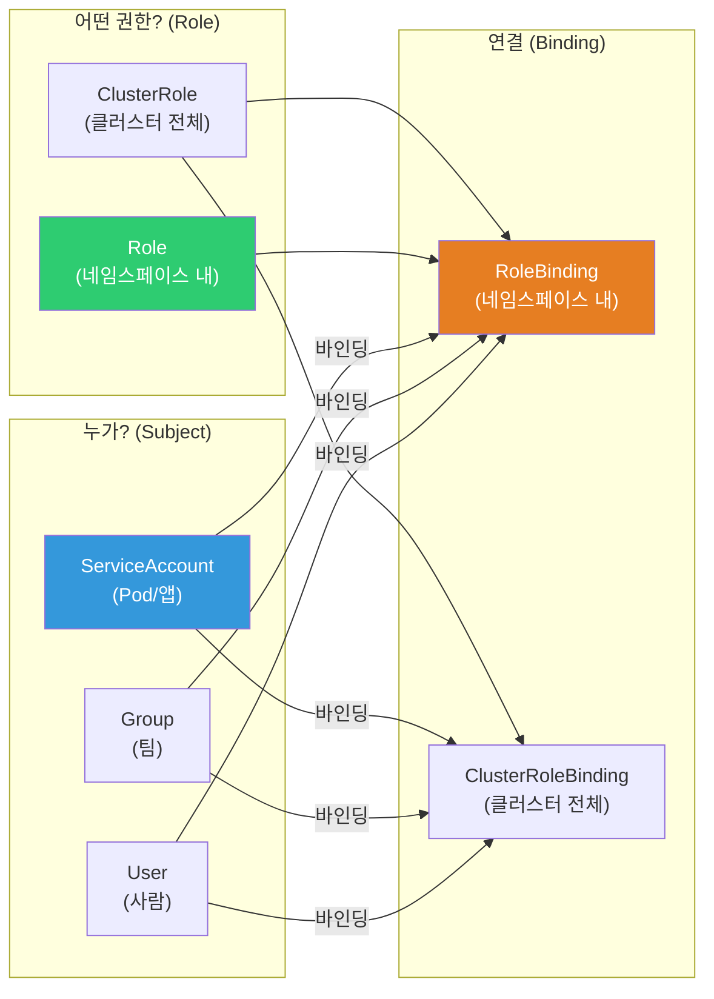
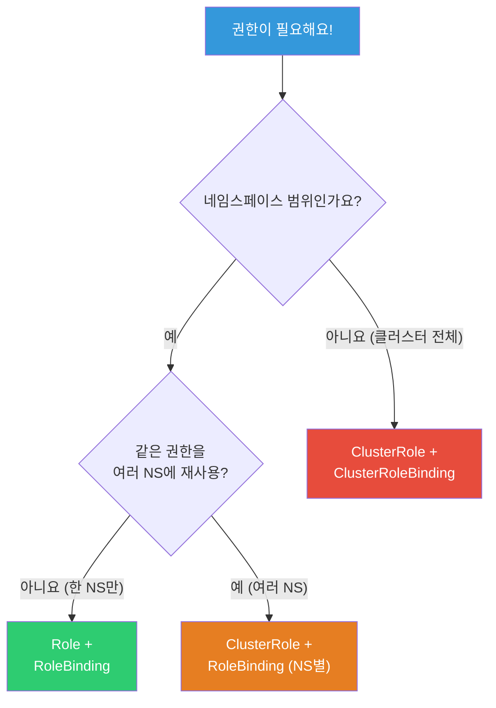
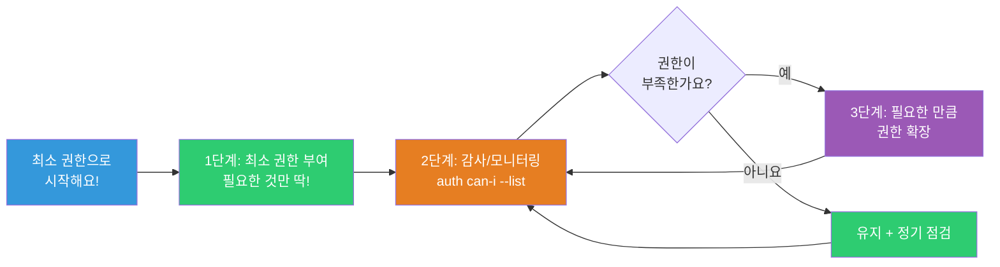

# RBAC / ServiceAccount

> "개발자가 실수로 프로덕션 Pod를 삭제했어요!" — 이런 사고를 막는 게 RBAC이에요. "누가 무엇을 할 수 있는지"를 세밀하게 제어하는 K8s의 권한 관리 시스템이에요. [Linux 사용자/권한](../01-linux/03-users-groups)의 K8s 버전이면서, AWS IAM과 연동하면 클라우드 리소스 접근까지 제어할 수 있어요.

---

## 🎯 이걸 왜 알아야 하나?

```
실무에서 RBAC이 필요한 순간:
• 개발자에게 자기 네임스페이스만 접근 허용           → Role + RoleBinding
• CI/CD 파이프라인에 배포 권한만 부여                → ServiceAccount + Role
• 모니터링 도구에 읽기 전용 권한                     → ClusterRole
• Pod가 AWS S3에 접근해야 함                         → IRSA (ServiceAccount + IAM)
• "kubectl이 안 돼요" → Forbidden 에러               → 권한 디버깅
• 보안 감사: "누가 무슨 권한을 가지고 있나요?"        → RBAC 점검
```

---

## 🧠 핵심 개념

### RBAC 구성 요소



**핵심 4가지:**
* **Role** — "무엇을 할 수 있는지" (네임스페이스 범위)
* **ClusterRole** — "무엇을 할 수 있는지" (클러스터 전체)
* **RoleBinding** — "누가 이 Role을 가지는지" (네임스페이스 범위)
* **ClusterRoleBinding** — "누가 이 ClusterRole을 가지는지" (클러스터 전체)

### 비유: 회사 출입카드

* **Role** = "이 층(네임스페이스)의 회의실을 쓸 수 있는 권한"
* **ClusterRole** = "건물 전체(클러스터)를 돌아다닐 수 있는 권한"
* **RoleBinding** = "김개발에게 이 층 권한 발급"
* **ServiceAccount** = "자동화 로봇의 출입카드"

---

## 🔍 상세 설명 — Role & RoleBinding

### Role — 네임스페이스 내 권한

```yaml
# 개발자에게 Pod 조회/로그/접속 권한만
apiVersion: rbac.authorization.k8s.io/v1
kind: Role
metadata:
  name: developer
  namespace: production
rules:
# Pod 조회, 로그 확인
- apiGroups: [""]                # "" = core API group (Pod, Service 등)
  resources: ["pods", "pods/log"]
  verbs: ["get", "list", "watch"]

# Pod에 exec (접속)
- apiGroups: [""]
  resources: ["pods/exec"]
  verbs: ["create"]

# Service, ConfigMap 조회
- apiGroups: [""]
  resources: ["services", "configmaps"]
  verbs: ["get", "list"]

# Deployment 조회
- apiGroups: ["apps"]            # apps API group
  resources: ["deployments"]
  verbs: ["get", "list"]

# ❌ 없는 권한: delete, create(Pod), update
# → 실수로 Pod 삭제 불가!
```

```bash
# verbs (동작):
# get     — 단일 리소스 조회 (kubectl get pod nginx)
# list    — 목록 조회 (kubectl get pods)
# watch   — 실시간 변경 감시 (kubectl get pods -w)
# create  — 생성 (kubectl apply)
# update  — 수정 (kubectl edit)
# patch   — 부분 수정 (kubectl patch)
# delete  — 삭제 (kubectl delete)
# deletecollection — 일괄 삭제

# apiGroups 주요 값:
# ""       → core (Pod, Service, ConfigMap, Secret, Node, PV, PVC)
# "apps"   → Deployment, StatefulSet, DaemonSet, ReplicaSet
# "batch"  → Job, CronJob
# "networking.k8s.io" → Ingress, NetworkPolicy
# "rbac.authorization.k8s.io" → Role, RoleBinding
# "autoscaling" → HPA

# 특정 리소스 이름만 허용 (매우 세밀!)
rules:
- apiGroups: [""]
  resources: ["configmaps"]
  resourceNames: ["myapp-config"]    # 이 ConfigMap만!
  verbs: ["get", "update"]
```

### RoleBinding — 누가 Role을 갖는지

```yaml
apiVersion: rbac.authorization.k8s.io/v1
kind: RoleBinding
metadata:
  name: developer-binding
  namespace: production
subjects:
# 사람 (User)
- kind: User
  name: "developer@example.com"      # IAM/OIDC 사용자
  apiGroup: rbac.authorization.k8s.io

# 그룹 (팀 전체)
- kind: Group
  name: "dev-team"
  apiGroup: rbac.authorization.k8s.io

# ServiceAccount (앱/CI/CD)
- kind: ServiceAccount
  name: ci-deployer
  namespace: production

roleRef:
  kind: Role
  name: developer                     # 위에서 만든 Role
  apiGroup: rbac.authorization.k8s.io
```

```bash
# RoleBinding 확인
kubectl get rolebindings -n production
# NAME                ROLE              AGE
# developer-binding   Role/developer    5d

kubectl describe rolebinding developer-binding -n production
# Role:
#   Kind:  Role
#   Name:  developer
# Subjects:
#   Kind   Name                     Namespace
#   ----   ----                     ---------
#   User   developer@example.com
#   Group  dev-team
#   ServiceAccount  ci-deployer     production
```

---

## 🔍 상세 설명 — ClusterRole & ClusterRoleBinding

### ClusterRole — 클러스터 전체 권한

```yaml
# 읽기 전용 (모든 네임스페이스에서 조회만)
apiVersion: rbac.authorization.k8s.io/v1
kind: ClusterRole
metadata:
  name: readonly-all
rules:
- apiGroups: ["", "apps", "batch", "networking.k8s.io"]
  resources: ["*"]                    # 모든 리소스!
  verbs: ["get", "list", "watch"]     # 읽기만!

---
# 배포 담당자 (Deployment, Service 관리)
apiVersion: rbac.authorization.k8s.io/v1
kind: ClusterRole
metadata:
  name: deployer
rules:
- apiGroups: ["apps"]
  resources: ["deployments", "replicasets"]
  verbs: ["get", "list", "watch", "create", "update", "patch"]
- apiGroups: [""]
  resources: ["services", "configmaps"]
  verbs: ["get", "list", "watch", "create", "update", "patch"]
- apiGroups: ["networking.k8s.io"]
  resources: ["ingresses"]
  verbs: ["get", "list", "watch", "create", "update", "patch"]
```

```bash
# K8s 기본 제공 ClusterRole
kubectl get clusterroles | grep -E "^(admin|edit|view|cluster-admin)"
# admin          → 네임스페이스 관리자 (대부분 가능, RBAC 제외)
# edit           → 리소스 수정 (Secret 읽기 가능, RBAC 수정 불가)
# view           → 읽기 전용 (Secret 읽기 불가!)
# cluster-admin  → ⚠️ 모든 권한! (kubectl 전체)

# 기본 Role을 RoleBinding으로 연결 (네임스페이스 범위)
kubectl create rolebinding dev-view \
    --clusterrole=view \
    --user=developer@example.com \
    --namespace=production
# → developer@example.com은 production 네임스페이스에서 view 권한

# ClusterRoleBinding (클러스터 전체)
kubectl create clusterrolebinding ops-admin \
    --clusterrole=cluster-admin \
    --group=ops-team
# → ops-team 그룹은 클러스터 전체 admin! (⚠️ 신중하게!)
```

### Role vs ClusterRole 선택



```bash
# Role + RoleBinding:
# → 특정 네임스페이스에서만 권한
# → 개발자에게 자기 네임스페이스만

# ClusterRole + RoleBinding:
# → ClusterRole을 정의하되, 특정 네임스페이스에서만 적용
# → 같은 권한을 여러 네임스페이스에 재사용할 때!

# ClusterRole + ClusterRoleBinding:
# → 클러스터 전체에서 권한
# → 모니터링 도구, 운영 팀

# ⚠️ cluster-admin ClusterRoleBinding은 최소한으로!
# → 필요한 사람/SA만!
```

---

## 🔍 상세 설명 — ServiceAccount

### ServiceAccount란?

**Pod(앱)가 K8s API에 접근할 때 사용하는 계정**이에요. 사람이 아니라 앱/도구/CI/CD가 사용해요.

```bash
# 모든 Pod는 ServiceAccount로 실행됨!
# → 지정 안 하면 default ServiceAccount

kubectl get serviceaccount -n production
# NAME      SECRETS   AGE
# default   0         30d    ← 기본 ServiceAccount

# Pod의 ServiceAccount 확인
kubectl get pod myapp-abc -o jsonpath='{.spec.serviceAccountName}'
# default

# ⚠️ default SA는 아무 권한이 없음 (K8s 1.24+에서 자동 토큰 생성 안 함)
# → 앱이 K8s API를 호출할 필요가 없으면 default로 충분
# → K8s API를 호출해야 하면 전용 SA + Role 필요!
```

### ServiceAccount 생성 + 권한 부여

```yaml
# 1. ServiceAccount 생성
apiVersion: v1
kind: ServiceAccount
metadata:
  name: myapp-sa
  namespace: production

---
# 2. Role 생성 (이 SA에 줄 권한)
apiVersion: rbac.authorization.k8s.io/v1
kind: Role
metadata:
  name: myapp-role
  namespace: production
rules:
- apiGroups: [""]
  resources: ["configmaps"]
  verbs: ["get", "watch"]
- apiGroups: [""]
  resources: ["secrets"]
  resourceNames: ["myapp-secret"]    # 특정 Secret만!
  verbs: ["get"]

---
# 3. RoleBinding (SA에 Role 연결)
apiVersion: rbac.authorization.k8s.io/v1
kind: RoleBinding
metadata:
  name: myapp-binding
  namespace: production
subjects:
- kind: ServiceAccount
  name: myapp-sa
  namespace: production
roleRef:
  kind: Role
  name: myapp-role
  apiGroup: rbac.authorization.k8s.io

---
# 4. Pod에서 SA 사용
apiVersion: apps/v1
kind: Deployment
metadata:
  name: myapp
spec:
  template:
    spec:
      serviceAccountName: myapp-sa       # ⭐ 이 SA로 실행!
      automountServiceAccountToken: true  # API 토큰 자동 마운트
      containers:
      - name: myapp
        image: myapp:v1.0
```

```bash
# Pod 안에서 K8s API 호출 (SA 토큰 사용)
kubectl exec myapp-abc -- sh -c '
TOKEN=$(cat /var/run/secrets/kubernetes.io/serviceaccount/token)
curl -s -k -H "Authorization: Bearer $TOKEN" \
    https://kubernetes.default.svc/api/v1/namespaces/production/configmaps
'
# → myapp-role에 configmaps get/watch가 있으니 성공!

# 권한 없는 리소스 접근 시도
kubectl exec myapp-abc -- sh -c '
TOKEN=$(cat /var/run/secrets/kubernetes.io/serviceaccount/token)
curl -s -k -H "Authorization: Bearer $TOKEN" \
    https://kubernetes.default.svc/api/v1/namespaces/production/pods
'
# → 403 Forbidden! (pods 권한 없음!)
```

### IRSA — Pod에서 AWS 서비스 접근 (★ EKS 실무 필수!)

```bash
# IRSA (IAM Roles for Service Accounts)
# → K8s ServiceAccount에 AWS IAM Role을 연결!
# → Pod가 AWS S3, SQS, DynamoDB 등에 접근 가능

# ❌ 옛날 방식: 노드 IAM Role에 모든 권한
# → 모든 Pod가 같은 AWS 권한! 과도한 권한!

# ✅ IRSA: Pod별로 다른 AWS 권한!
# → myapp-sa → S3 읽기 전용
# → backup-sa → S3 읽기/쓰기
# → worker-sa → SQS 접근
```

```yaml
# 1. SA에 IAM Role ARN 연결
apiVersion: v1
kind: ServiceAccount
metadata:
  name: myapp-sa
  namespace: production
  annotations:
    eks.amazonaws.com/role-arn: arn:aws:iam::123456:role/MyAppRole
    # ⭐ 이 annotation이 핵심!
    # → 이 SA로 실행되는 Pod는 MyAppRole의 AWS 권한을 가짐!

---
# 2. Pod에서 SA 사용
apiVersion: apps/v1
kind: Deployment
spec:
  template:
    spec:
      serviceAccountName: myapp-sa    # IRSA가 연결된 SA!
      containers:
      - name: myapp
        image: myapp:v1.0
        # → AWS SDK가 자동으로 IRSA 토큰 사용!
        # → 코드 변경 없이 AWS 서비스 접근!
```

```bash
# IRSA 설정 (AWS CLI)

# 1. OIDC Provider 생성 (클러스터당 1번)
eksctl utils associate-iam-oidc-provider --cluster my-cluster --approve

# 2. IAM Role + SA 생성
eksctl create iamserviceaccount \
    --cluster my-cluster \
    --namespace production \
    --name myapp-sa \
    --attach-policy-arn arn:aws:iam::aws:policy/AmazonS3ReadOnlyAccess \
    --approve

# 3. 확인
kubectl get sa myapp-sa -n production -o yaml | grep eks.amazonaws.com
# eks.amazonaws.com/role-arn: arn:aws:iam::123456:role/eksctl-my-cluster-myapp-sa

# 4. Pod에서 AWS 접근 테스트
kubectl exec myapp-abc -n production -- aws s3 ls
# 2025-03-01 my-bucket
# → S3에 접근 가능! ✅ (IAM Role 권한으로)

kubectl exec myapp-abc -n production -- aws ec2 describe-instances
# An error occurred: UnauthorizedOperation
# → EC2 권한 없음! ✅ (최소 권한 원칙!)
```

---

## 🔍 상세 설명 — 권한 확인 / 디버깅

### kubectl auth can-i

```bash
# "나는 이 작업을 할 수 있나?"
kubectl auth can-i get pods -n production
# yes

kubectl auth can-i delete pods -n production
# no    ← 삭제 권한 없음!

kubectl auth can-i create deployments -n production
# yes

# 다른 사용자의 권한 확인 (admin만)
kubectl auth can-i get pods -n production --as developer@example.com
# yes

kubectl auth can-i delete pods -n production --as developer@example.com
# no

# ServiceAccount의 권한 확인
kubectl auth can-i get configmaps -n production --as system:serviceaccount:production:myapp-sa
# yes

kubectl auth can-i list pods -n production --as system:serviceaccount:production:myapp-sa
# no

# 모든 권한 확인
kubectl auth can-i --list -n production --as developer@example.com
# Resources          Verbs
# pods               [get list watch]
# pods/log           [get list watch]
# pods/exec          [create]
# services           [get list]
# configmaps         [get list]
# deployments.apps   [get list]
```

### "Forbidden" 에러 디버깅

```bash
# 에러:
kubectl get pods -n production
# Error from server (Forbidden): pods is forbidden:
# User "developer@example.com" cannot list resource "pods" in API group "" in the namespace "production"

# 디버깅 순서:

# 1. 현재 사용자 확인
kubectl config current-context
kubectl config view --minify -o jsonpath='{.contexts[0].context.user}'
# arn:aws:iam::123456:user/developer

# 2. 이 사용자의 RoleBinding 확인
kubectl get rolebindings -n production -o wide
# NAME                ROLE              SUBJECTS
# developer-binding   Role/developer    User/developer@example.com

# 3. Role의 권한 확인
kubectl describe role developer -n production
# Rules:
#   Resources  Verbs
#   pods       [get list watch]    ← pods list 권한 있는데?

# 4. 사용자 이름이 다를 수 있음!
# IAM: arn:aws:iam::123456:user/developer
# Role에: developer@example.com
# → 불일치! 이름을 맞춰야!

# 5. aws-auth ConfigMap 확인 (EKS)
kubectl get configmap aws-auth -n kube-system -o yaml
# mapUsers:
# - userarn: arn:aws:iam::123456:user/developer
#   username: developer@example.com    ← 이 이름으로 매핑
#   groups:
#   - dev-team
```

### EKS aws-auth ConfigMap

```bash
# EKS에서 IAM → K8s 사용자 매핑

kubectl get configmap aws-auth -n kube-system -o yaml
# data:
#   mapRoles: |
#     - rolearn: arn:aws:iam::123456:role/EKS-NodeRole
#       username: system:node:{{EC2PrivateDNSName}}
#       groups:
#       - system:bootstrappers
#       - system:nodes
#   mapUsers: |
#     - userarn: arn:aws:iam::123456:user/admin
#       username: admin
#       groups:
#       - system:masters            ← ⚠️ cluster-admin!
#     - userarn: arn:aws:iam::123456:user/developer
#       username: developer@example.com
#       groups:
#       - dev-team

# 사용자 추가
kubectl edit configmap aws-auth -n kube-system
# mapUsers에 추가:
# - userarn: arn:aws:iam::123456:user/new-dev
#   username: new-dev@example.com
#   groups:
#   - dev-team

# ⚠️ aws-auth 수정 실수 → 클러스터 접근 불가!
# → 항상 백업 후 수정!
kubectl get configmap aws-auth -n kube-system -o yaml > aws-auth-backup.yaml

# EKS Access Entry (새로운 방식, aws-auth 대체!)
aws eks create-access-entry \
    --cluster-name my-cluster \
    --principal-arn arn:aws:iam::123456:user/developer \
    --kubernetes-groups dev-team
```

---

## 💻 실습 예제

### 실습 1: 네임스페이스별 권한 분리

```bash
# 1. 네임스페이스 생성
kubectl create namespace team-a
kubectl create namespace team-b

# 2. team-a에서만 작업 가능한 Role
kubectl apply -f - << 'EOF'
apiVersion: rbac.authorization.k8s.io/v1
kind: Role
metadata:
  name: team-member
  namespace: team-a
rules:
- apiGroups: ["", "apps"]
  resources: ["pods", "deployments", "services", "configmaps"]
  verbs: ["get", "list", "watch", "create", "update", "delete"]
EOF

# 3. RoleBinding
kubectl create rolebinding team-a-members \
    --role=team-member \
    --serviceaccount=team-a:default \
    --namespace=team-a

# 4. 권한 확인
kubectl auth can-i create pods -n team-a --as system:serviceaccount:team-a:default
# yes

kubectl auth can-i create pods -n team-b --as system:serviceaccount:team-a:default
# no    ← team-b에서는 권한 없음! ✅

# 5. 정리
kubectl delete namespace team-a team-b
```

### 실습 2: 읽기 전용 사용자

```bash
# 1. ClusterRole (view) + RoleBinding (특정 NS만)
kubectl create namespace readonly-test
kubectl create deployment test-app --image=nginx -n readonly-test

kubectl create rolebinding readonly-user \
    --clusterrole=view \
    --serviceaccount=readonly-test:default \
    --namespace=readonly-test

# 2. 권한 확인
kubectl auth can-i get pods -n readonly-test --as system:serviceaccount:readonly-test:default
# yes

kubectl auth can-i delete pods -n readonly-test --as system:serviceaccount:readonly-test:default
# no    ← 삭제 불가! ✅

kubectl auth can-i get secrets -n readonly-test --as system:serviceaccount:readonly-test:default
# no    ← view Role은 Secret 읽기도 불가! ✅

# 3. 정리
kubectl delete namespace readonly-test
```

### 실습 3: ServiceAccount + RBAC

```bash
# CI/CD 파이프라인용 SA
kubectl apply -f - << 'EOF'
apiVersion: v1
kind: ServiceAccount
metadata:
  name: ci-deployer
  namespace: default
---
apiVersion: rbac.authorization.k8s.io/v1
kind: Role
metadata:
  name: deployer-role
  namespace: default
rules:
- apiGroups: ["apps"]
  resources: ["deployments"]
  verbs: ["get", "list", "create", "update", "patch"]
- apiGroups: [""]
  resources: ["services"]
  verbs: ["get", "list", "create", "update"]
---
apiVersion: rbac.authorization.k8s.io/v1
kind: RoleBinding
metadata:
  name: ci-deployer-binding
  namespace: default
subjects:
- kind: ServiceAccount
  name: ci-deployer
  namespace: default
roleRef:
  kind: Role
  name: deployer-role
  apiGroup: rbac.authorization.k8s.io
EOF

# 확인
kubectl auth can-i create deployments --as system:serviceaccount:default:ci-deployer
# yes

kubectl auth can-i delete pods --as system:serviceaccount:default:ci-deployer
# no    ← Pod 삭제 권한 없음 (deployer-role에 없으니까)

kubectl auth can-i --list --as system:serviceaccount:default:ci-deployer
# Resources            Verbs
# deployments.apps     [get list create update patch]
# services             [get list create update]

# 정리
kubectl delete sa ci-deployer
kubectl delete role deployer-role
kubectl delete rolebinding ci-deployer-binding
```

---

## 🏢 실무에서는?

### 시나리오 1: 팀별 권한 설계

```bash
# 조직 구조:
# - 운영팀 (ops-team): 클러스터 전체 관리
# - 백엔드팀 (backend-team): backend NS에서 배포
# - 프론트팀 (frontend-team): frontend NS에서 배포
# - 데이터팀 (data-team): data NS에서 읽기 + Job 실행

# 운영팀: ClusterRoleBinding + cluster-admin
# → 클러스터 전체 관리 (최소 인원만!)

# 백엔드/프론트팀: RoleBinding + 커스텀 Role
# → 자기 네임스페이스에서 Deployment, Service, ConfigMap CRUD
# → 다른 네임스페이스 접근 불가!

# 데이터팀: RoleBinding + view + Job 권한
# → data 네임스페이스에서 조회 + Job/CronJob 생성

# 모든 개발자: ClusterRoleBinding + view (선택)
# → 모든 네임스페이스에서 읽기 전용 (디버깅용)
# → Secret 읽기는 불가 (view Role 기본)
```

### 시나리오 2: CI/CD 최소 권한

```bash
# "ArgoCD/GitHub Actions에 어떤 권한을 줘야 하나요?"

# ArgoCD ServiceAccount:
# → Deployment, Service, ConfigMap, Secret, Ingress CRUD
# → Namespace 내 대부분의 리소스 관리
# → RBAC 수정은 불가! (자기 권한을 스스로 올리는 거 방지)

# GitHub Actions ServiceAccount:
# → Deployment update만 (이미지 태그 변경)
# → 또는 ArgoCD를 통해 배포 (GitHub Actions → Git push → ArgoCD sync)
# → 직접 K8s 접근은 최소화!

# 보안 원칙:
# 1. 최소 권한 (필요한 것만!)
# 2. 네임스페이스 분리 (팀별)
# 3. SA 토큰 자동 마운트 비활성화 (불필요하면)
# automountServiceAccountToken: false
```

### 시나리오 3: IRSA로 Pod에서 AWS 접근

```bash
# "앱이 S3 버킷에 파일을 업로드해야 해요"

# 1. IAM Policy 생성
aws iam create-policy --policy-name MyAppS3Write --policy-document '{
  "Version": "2012-10-17",
  "Statement": [{
    "Effect": "Allow",
    "Action": ["s3:PutObject", "s3:GetObject"],
    "Resource": "arn:aws:s3:::my-uploads-bucket/*"
  }]
}'

# 2. IRSA 생성
eksctl create iamserviceaccount \
    --cluster my-cluster \
    --namespace production \
    --name upload-sa \
    --attach-policy-arn arn:aws:iam::123456:policy/MyAppS3Write \
    --approve

# 3. Deployment에서 사용
# spec.template.spec.serviceAccountName: upload-sa

# 4. 앱 코드에서 (SDK가 자동으로 IRSA 인식!)
# import boto3
# s3 = boto3.client('s3')   ← 인증 코드 불필요! IRSA가 자동!
# s3.upload_file('file.pdf', 'my-uploads-bucket', 'file.pdf')
```

---

## ⚠️ 자주 하는 실수

### 1. 모든 사람에게 cluster-admin

```bash
# ❌ 개발자 전원에게 cluster-admin
# → 실수로 kube-system Pod 삭제 → 클러스터 장애!

# ✅ 최소 권한 원칙
# → cluster-admin은 운영 팀 핵심 인원만 (2~3명)
# → 개발자는 네임스페이스 범위의 Role만
```

### 2. default ServiceAccount로 앱 실행

```bash
# ❌ SA를 지정 안 하면 default SA 사용
# → 나중에 default에 권한을 추가하면 모든 Pod에 영향!

# ✅ 앱별 전용 SA 생성
# serviceAccountName: myapp-sa
# → 각 앱에 필요한 최소 권한만!
```

### 3. aws-auth ConfigMap 수정 실수

```bash
# ❌ aws-auth 수정 중 문법 오류 → 클러스터 접근 불가!
# → 복구하려면 AWS 콘솔에서 EKS 직접 수정...

# ✅ 수정 전 반드시 백업!
kubectl get cm aws-auth -n kube-system -o yaml > aws-auth-backup.yaml

# ✅ EKS Access Entry 사용 (aws-auth 대체, 더 안전!)
```

### 4. Secret 접근 권한을 과도하게

```bash
# ❌ 모든 Secret 읽기 권한
rules:
- apiGroups: [""]
  resources: ["secrets"]
  verbs: ["get", "list"]    # 모든 Secret!

# ✅ 특정 Secret만!
rules:
- apiGroups: [""]
  resources: ["secrets"]
  resourceNames: ["myapp-secret"]    # 이것만!
  verbs: ["get"]
```

### 5. automountServiceAccountToken을 기본으로

```bash
# ❌ K8s API 호출이 필요 없는 앱도 SA 토큰 마운트
# → 앱이 해킹되면 K8s API에 접근 가능!

# ✅ 필요 없으면 비활성화
spec:
  automountServiceAccountToken: false
```

---

## 📝 정리

### RBAC 설계 원칙



```
1. 최소 권한 (Least Privilege) — 필요한 것만!
2. 네임스페이스 분리 — 팀/환경별
3. 앱별 SA — default SA 사용 금지
4. cluster-admin 최소화 — 운영팀 핵심만
5. IRSA — 노드 IAM 대신 Pod별 AWS 권한
6. 정기 감사 — 불필요한 권한 정리
```

### 핵심 명령어

```bash
# 권한 확인
kubectl auth can-i VERB RESOURCE [-n NAMESPACE] [--as USER]
kubectl auth can-i --list [--as USER]

# Role/Binding 조회
kubectl get roles,rolebindings -n NAMESPACE
kubectl get clusterroles,clusterrolebindings
kubectl describe role ROLE -n NAMESPACE

# SA 조회
kubectl get serviceaccounts -n NAMESPACE

# 빠른 생성
kubectl create role NAME --verb=get,list --resource=pods -n NS
kubectl create rolebinding NAME --role=ROLE --user=USER -n NS
kubectl create clusterrolebinding NAME --clusterrole=CR --group=GROUP

# EKS aws-auth
kubectl get cm aws-auth -n kube-system -o yaml
```

### 실무 권한 매트릭스

```
역할          |  ClusterRole    | 범위          | Secret
─────────────┼────────────────┼──────────────┼────────
운영팀        |  cluster-admin  | 전체 클러스터  | 전체
백엔드 개발   |  커스텀(CRUD)   | 자기 NS      | 자기 것만
프론트 개발   |  커스텀(CRUD)   | 자기 NS      | 자기 것만
QA           |  view           | staging NS   | ❌
모니터링 도구 |  view           | 전체(읽기만)  | ❌
CI/CD        |  커스텀(배포)   | 대상 NS      | 배포 Secret만
```

---

## 🔗 다음 강의

다음은 **[12-helm-kustomize](./12-helm-kustomize)** — Helm / Kustomize 이에요.

K8s YAML이 수십 개가 되면 관리가 힘들어요. 환경별로 다른 설정, 반복되는 패턴, 버전 관리 — Helm과 Kustomize가 이 문제를 해결해줘요. [ConfigMap](./04-config-secret)에서 배운 환경별 설정을 패키지 매니저 수준으로 관리하는 방법이에요.
